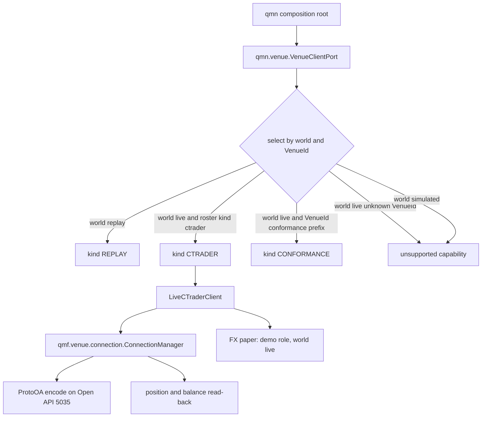
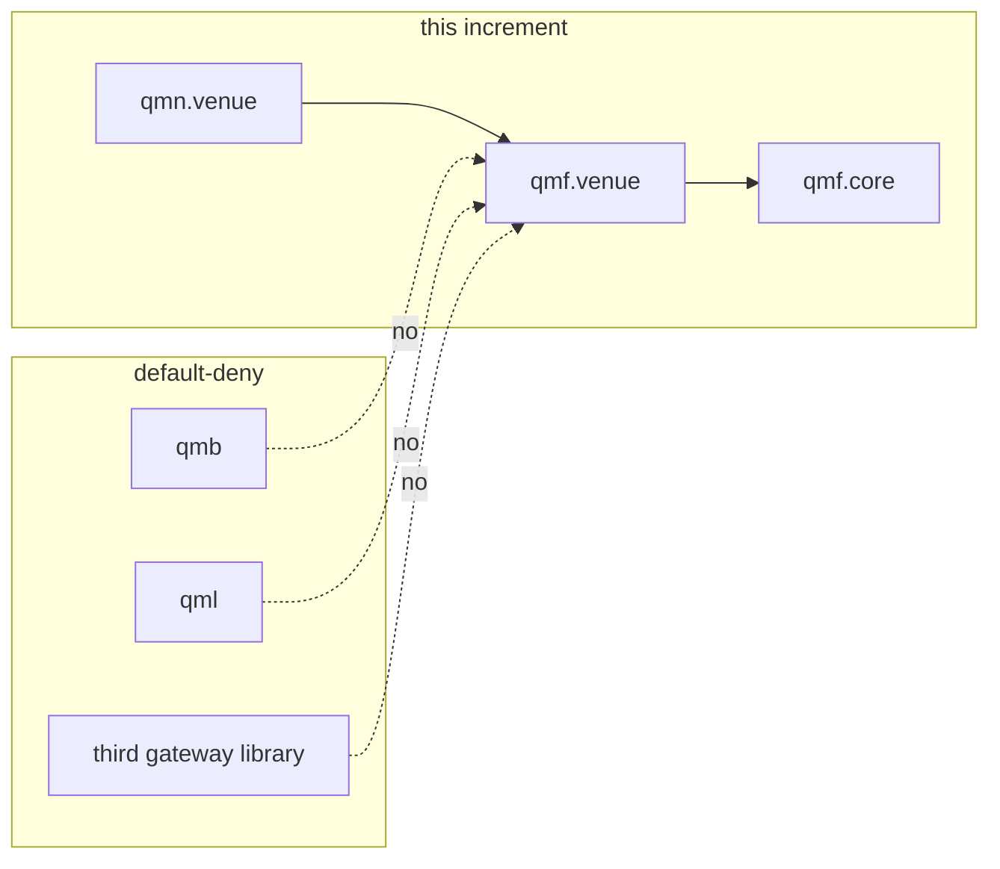

# Architecture Spine — CONNECT FX paper

## Design Paradigm

**Hexagonal port completion (composition-root adapter).** The NODE paradigm stands: one systemd-supervised process is the only impure shell; `qmn.venue.VenueClientPort` is the only injectable venue seam. This increment does not mint a second port, a second runtime, or a gateway library. It completes the live cTrader implementation already selected by the pair (world, VenueId): fail-closed selection, production `connect_open_api`, CT-19 submit encode, CT-20 position/balance read-back.



## Inherited Invariants

QMX AD-1..AD-41 and NODE TN-1..TN-25 bind in full (original ids, read-only). Honor QMB B-1..B-15 and QML QL-1..QL-10. A local decision that contradicts one is a conflict to surface, never an override. Load-bearing rows for this increment:

| Inherited | From parent | Binds here |
| --- | --- | --- |
| AD-7 exact money; venue decode at named scale boundary | QMX | submit encode and read-back |
| AD-9 opaque VenueId; broker identity is deployment configuration | QMX / DEC-0139 | selection keys; no broker named in rules |
| AD-11 typed refusals | QMX | unknown VenueId and undeclared capability |
| AD-12 world=live includes demo money; role-scoped namespaces | QMX | paper world=live |
| AD-15 application owns concurrency; async only at venue edge | QMX | ConnectionManager on the node loop |
| AD-21 / CT-13 exactly seven journal types | QMX | AD-4 mapping; no eighth type |
| AD-26 secret references; one in-memory value holder per session | QMX / CT-21 | no new secret architecture |
| AD-27 five command kinds; four-outcome law; UNKNOWN is a state | QMX / CT-19 | submit encode; no timeout-as-reject |
| AD-28 one port, four contracts; two capability artifacts; market data via CT-10/CT-15 | QMX / CT-18 | plurality later; FX CT-18 now |
| AD-34 amend_protection is the fifth command | QMX | encode path |
| AD-35 paper is Book-level; role demo; no twins; no profit gate | QMX | AD-2 |
| TN-1 qmn.venue is the sole qmf-venue import boundary | NODE / DEC-0241 | AD-3 |
| TN-2 compose selects VenueClientPort by (world, VenueId) | NODE | AD-1 |
| TN-6 order path; protective-stop-at-placement reads CT-18 | NODE | capability refusal, not Book redesign |
| TN-9 paper soak on paired demo; live sensing-only until live binding | NODE | AD-2 |
| TN-11 three V1 kinds; transport completes ConnectionManager | NODE / DEC-0243 | AD-3, AD-5 |
| TN-12 secrets / wizard shape | NODE | unchanged |
| TN-13 live ticks as CT-10 through CT-15; no sibling failover | NODE | canonical source stays ctrader this increment |
| TN-21 replay never binds a venue-connecting client | NODE | AD-1 |
| TN-22 roster tuples; same-protocol second broker is config | NODE | AD-5 scopes new-protocol vs roster |
| TN-23 soak checklist; machinery proof never profit | NODE | honest paper is a precondition |
| L21 first adapter is cTrader Open API from Python | constitution / DEC-0060 | stands; this is completion not replacement |
| L22 venue-neutral seam for later crypto/stock adapters | constitution / DEC-0061 | AD-5 plurality, not this adapter |
| L30 / DEC-0241 qmn.venue only; qmb/qml keep the ban | constitution | AD-3 |
| DEC-0242 recorded-not-applied | ledger | do not realize the port inside qmf-venue |
| DEC-0244 connection count derived from roster | ledger | inherit; code ClassVar=2 is debt |
| DEC-0013 build-our-own | ledger | no CCXT, no Spotware SDK |
| PRD section 7 futures/options permanently excluded | PRD | stands |

### Corrections this increment inherits

1. Reconciliation verdicts are four: reconciled, drift, unknown, out-of-lookback (NODE corpus correction 1).
2. Paper is AD-35 standing evidence, not a fail-mechanism-only surface (NODE corpus correction 2).
3. Spotware SDK remains reference-only; protobuf==7.36.0 in qmf-venue; proto tag 91 in-house (NODE corpus correction 4).

## Invariants & Rules

### AD-1 — Fail-closed live selection [ADOPTED 2026-09-11]

- **Binds:** `qmn.venue.port.select_venue_client`; TN-2 compose; every live `VenueId`
- **Prevents:** an unknown live `VenueId` opening a cTrader client; two units inventing different live defaults
- **Rule:** implementation is selected by the pair (world, VenueId), never by VenueId alone (TN-11). `world = replay` selects REPLAY for every VenueId and the composition refuses any venue-connecting kind. `world = simulated` refuses. `world = live` reads an **explicit roster field** `VenueClientKind` on that binding — not inferred from VenueId spelling. CTRADER is legal only when that field is `ctrader`. CONFORMANCE is legal only when the field is `conformance` or the VenueId value starts with `conformance:` (the existing credential-free convention). Absent field, unknown kind, or any other live VenueId is `unsupported capability`. The integration else-branch that assigns CTRADER is a connect bug, not TN-11.

### AD-2 — Honest FX paper [ADOPTED 2026-09-11]

- **Binds:** `qmn.paper`; `qmn.venue.live`; TN-9 soak; AD-35
- **Prevents:** sensing-only CONNECT being called paper; skipping spot FX because live capital is small
- **Rule:** an FX paper claim requires every element: vendor cTrader demo host; `AccountRole.DEMO`; `world = live`; the same live `VenueClientPort` implementation used for live; submit encode of every CT-19 kind the bound CT-18 declaration supports; position and balance read-back per AD-4. `LiveCTraderClient.submit` returning `unsupported capability` after session and capabilities are ready is not paper. Live-capital bleeding is not an adapter skip. Spot FX is not deferred. No local matching engine. No Bot or Book twin. Soak remains TN-9: the demo connection carries the order path; the live connection, when credentials exist, is sensing and recording only until a live binding. Connection count is derived from the roster (DEC-0244): a soak roster may name one (venue, environment) pair.

### AD-3 — Encode and session locus [ADOPTED 2026-09-11]

- **Binds:** `qmf.venue.connection`; `qmn.venue`; DEC-0241; DEC-0243; TN-11
- **Prevents:** a third venue-gateway library; a second connection manager; command encode outside the sanctioned boundary
- **Rule:** `qmn.venue` is the sole `qmf-venue` importer (DEC-0241). ProtoOA command encode for the five CT-19 kinds and `connect_open_api` complete the existing `ConnectionManager` in `qmf-venue` (DEC-0243 exemption already applied). Encode symbols live in `qmf-venue`; `qmn.venue.live` translates a `Command` onto those symbols and must not compile proto messages itself. `qmn.venue` also holds duty scheduling, the verification-suite runner, CT-18 fills, error-map rows, and the port implementation. After an open session and verified capabilities, `LiveCTraderClient.submit` hands a well-formed `Command` to that encode path; it does not refuse as Story 24.3 sensing-only. A CT-19 kind the bound CT-18 declaration supports that remains sensing-only is a connect bug. The production node calls `connect_open_api`; a tests-only caller is a connect bug. DEC-0242 stays recorded-not-applied. No CCXT, no Hummingbot, no Spotware SDK, no Twisted.

### AD-4 — FTR-01 closed: read-back mapping [ADOPTED 2026-09-11]

- **Binds:** CT-20; CT-13; `LiveCTraderClient.reconcile`; Story 24.3
- **Prevents:** an eighth journal type; two units mapping position/balance onto different types; soak drift checks that cannot run
- **Rule:** `position-read-back` and `balance-read-back` are CT-20 observation kinds (DEC-0247). They map through CT-20's versioned (observation kind) to event-type table onto CT-13 `data quality`. No eighth type. No second catalog. DEC-0247's word "observation" names the CT-20 kind, not a journal type — CT-13's seven do not include observation; that wording collision is surfaced here and is not a license to mint. `reconcile()` returns the four-verdict `Reconciliation` over the declared lookback and no longer returns `unsupported capability` for those kinds. Adapters never synthesize the observations. [ASSUMPTION A3 — journal type is `data quality`.]

### AD-5 — Crypto plurality without a fourth V1 kind [ADOPTED 2026-09-11]

- **Binds:** TN-11; L22; AD-28; AD-1
- **Prevents:** config-mapping a non-cTrader VenueId onto `LiveCTraderClient`; extracting a gateway library; Book/BMS/sizing redesign under CONNECT
- **Rule:** a later non-cTrader live venue is a new CT-18 static declaration plus a new `VenueClientPort` implementation selected by (world, VenueId) through AD-1. Same four contracts. Same `qmn.venue` import boundary. Adapter code lives in `qmf-venue` and imports only `qmf-core`. This increment does not mint a fourth `VenueClientKind` and does not pick an exchange. TN-11's three V1 implementations (CTRADER, REPLAY, CONFORMANCE) stand until a later increment amends them. TN-22 "second broker is roster" applies to the same protocol family; a new protocol is a later module (L22), never "config onto the cTrader client".



## Consistency Conventions

| Concern | Convention |
| --- | --- |
| Naming | Parent ids stay QMX AD-n, TN-n, B-n, QL-n. This spine's AD-1..AD-5 are CONNECT-local. VenueClientKind values remain `ctrader`, `replay`, `conformance`. Wire kinds `position-read-back`, `balance-read-back`. |
| Data and formats | CT-19 five kinds; four outcomes; UNKNOWN is a state. CT-13 seven types unchanged. Read-back journals as `data quality`. Money path stays scaled integers (AD-7). |
| State and cross-cutting | Selection fail-closed. Session open via `connect_open_api` on the node loop. Secrets remain references above the connection manager. Canonical live source token stays `ctrader` this increment. |

## Stack

SEED — verified 2026-09-11; the code owns the pin once it exists.

| Name | Version |
| --- | --- |
| CPython | 3.14 (inherited QMX AD-1) |
| protobuf runtime | ==7.36.0 in qmf-venue only; 7.36.1 exists 2026-08-31 and is not adopted here |
| cTrader Open API | Protobuf TCP port 5035; hosts demo.ctraderapi.com and live.ctraderapi.com |
| proto artifact | Spotware integer tag 91, compiled in-house (inherited) |
| uv / qmn | existing workspace member; no new distribution |

## Structural Seed

Operational envelope is inherited: VPS plane TN-3/TN-16, workstation provisioning, no new machine, no new secret store. This increment adds no plane and names no VPS provider.

```text
qmn/src/qmn/venue/     # sole qmf-venue import boundary; port, live client, verify, replay, conformance
qmn/src/qmn/paper/     # demo role, world=live routing; no twins
packages/qmf-venue/src/qmf/venue/connection.py  # connect_open_api + command encode
packages/qmf-venue/src/qmf/venue/commands.py    # five CT-19 kinds
packages/qmf-venue/src/qmf/venue/events.py      # CT-20 observations + Reconciliation
```

Brownfield at `integration@1b451a848d897e42f6e2c7fd9f2ea86fab7295f2`: live submit is sensing-only; FTR-01 blocks reconcile; unknown live VenueId defaults CTRADER; `connect_open_api` has no production caller. Those are defects this spine forbids, not seed to copy.

## Capability → Architecture Map

| Capability / Area | Lives in | Governed by |
| --- | --- | --- |
| Live client selection | `qmn.venue.port` | AD-1, TN-2, TN-11 |
| FX paper honesty | `qmn.paper` + live submit/reconcile | AD-2, AD-35, TN-9 |
| Session + ProtoOA encode | `qmf.venue.connection` | AD-3, DEC-0241, DEC-0243 |
| Position/balance read-back | CT-20 kinds; CT-13 `data quality` | AD-4, DEC-0247 as interpreted |
| Crypto / later venue | same port, later CT-18 + impl | AD-5, L22; not this increment |
| Secrets / CT-21 | inherited ConnectionManager holder | AD-26, TN-12 |
| Verification suite | `qmn.venue.verify` over ProbeCheck | TN-10, CT-18; forex checks stay |
| Replay | `qmn.venue.replay` | TN-21, AD-1 |
| Deployment / ops | inherited node units | TN-3, TN-16; Deferred here |

## Deferred

| Item | Why it can wait |
| --- | --- |
| Crypto exchange pick and fourth VenueClientKind | AD-5 plurality law is enough; FX paper first |
| PRD section 7 asset-class amendment | Needed when a non-forex adapter is in scope; not for FX paper |
| Book / BMS / sizing / crypto market-hours as Book law | Out of sitting; Codex/risk later |
| MIS training and shadow-lane models | NODE GAP-0051; seam exists |
| UI / Penpot | Phase 3; TN-17 doors already bind |
| STRATS / loop-engineering | Out of sitting |
| FTR-02 compound-command annotation | Unchanged block; not required for single-kind FX paper encode |
| Canonical live source parameterization | Hardcoded `ctrader` is correct while only CTRADER connects; revisit when AD-5 mints a kind |
| protobuf 7.36.1 bump | Release/ops; 7.36.0 still current-enough and is the brownfield pin |
| SessionTopology ClassVar=2 in code | DEC-0244 already binds roster-derived count |
| FX live binding / live money | TN-9 soak then live; this increment makes paper honest, not live go-live |
| Realizing VenueClientPort inside qmf-venue | DEC-0242 recorded-not-applied |
| Intake of non-Dukascopy history | CT-15 later sitting |
