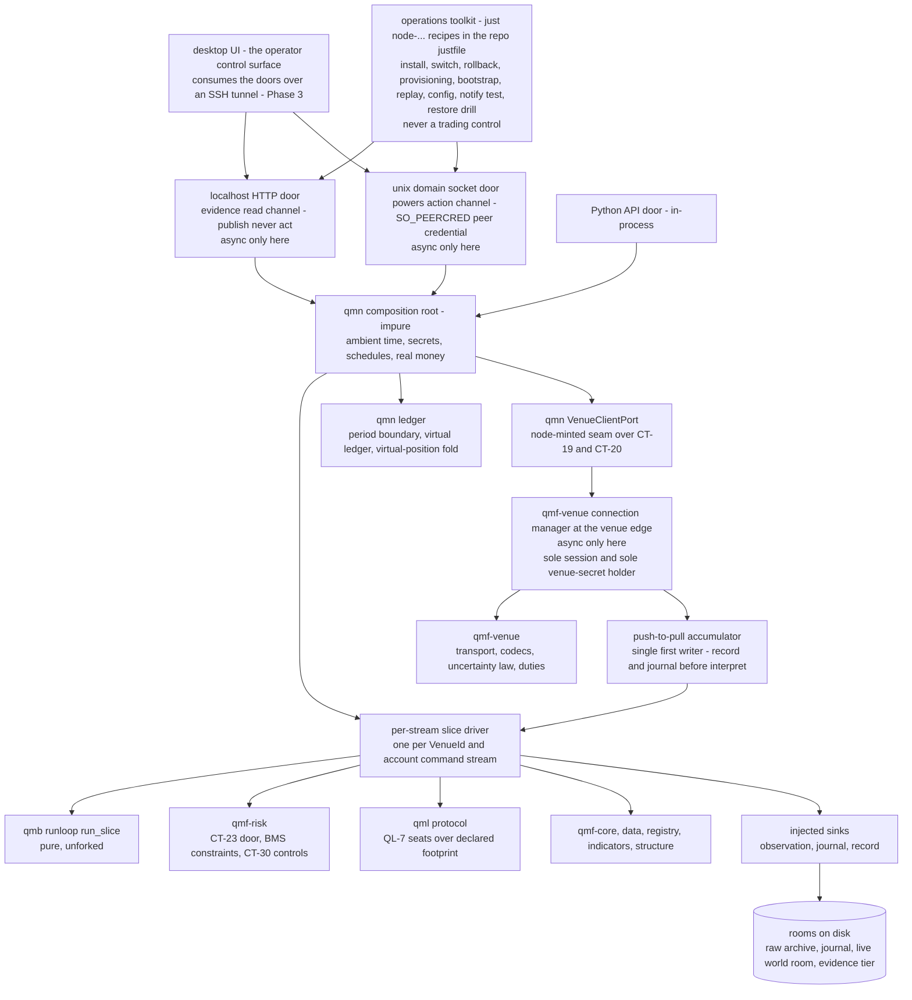
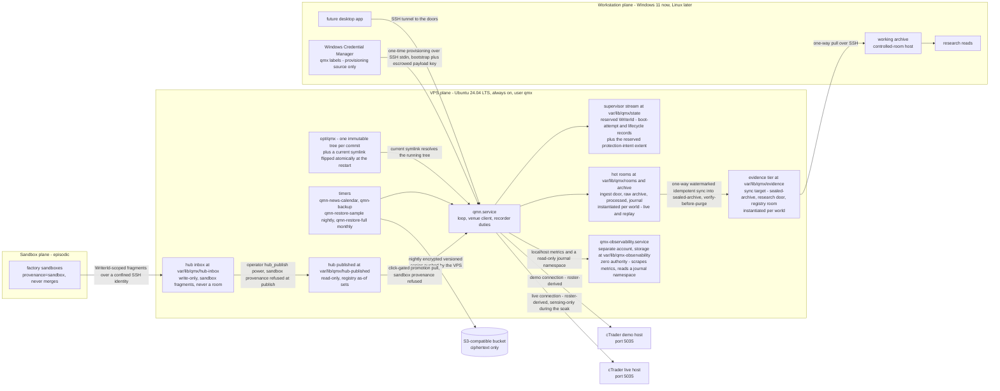
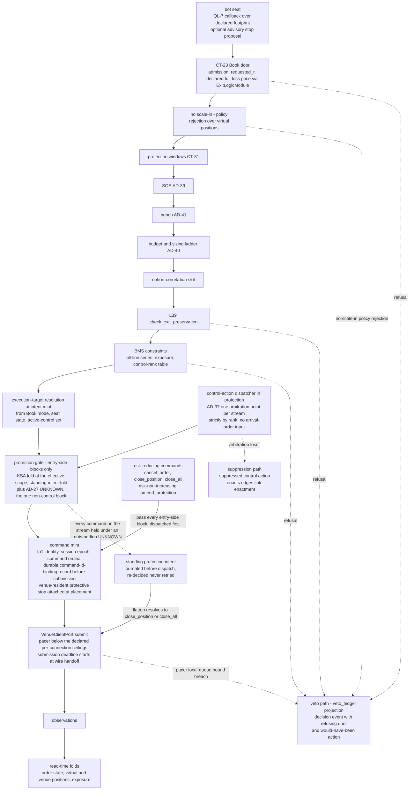
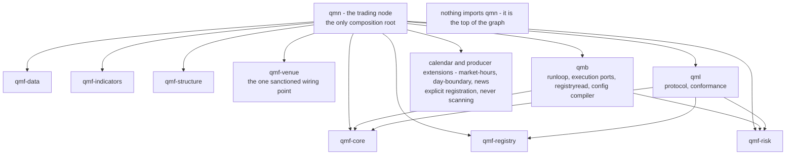
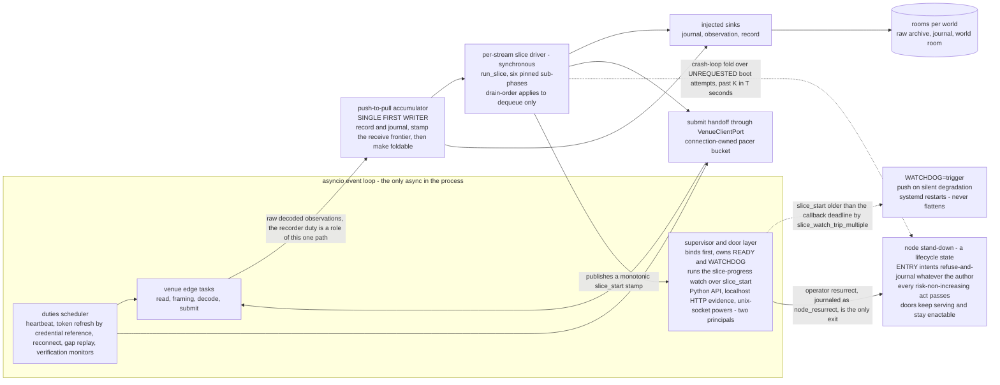

# Architecture Spine — Trading Node

## Design Paradigm

**Supervised composition-root runtime over a pure rulebook (hexagonal at application scale).** One long-lived systemd-supervised process on the Linux VPS is the ONLY impure shell. It composes the pure QMF/QMB/QML parts at boot — compose, fingerprint, seal — and owns everything the libraries refuse to own: ambient time, async (venue edge and doors only), scheduling, secrets, and real money. It drives QMB's ratified event-slice loop — never a second loop — once per `(VenueId, account)` command stream, behind thin doors. Below the root nothing is impure; above it nothing is a rule. One product, two modes, `paper | live`.



## Inherited Invariants

QMF spine AD-1..AD-41, QMB B-1..B-15 and QML QL-1..QL-10 bind in full (original ids, read-only). A local decision that contradicts one is a conflict to surface, never an override. Load-bearing rows:

| Inherited | From parent | Binds here |
| --- | --- | --- |
| AD-13 measure-then-budget; benchmark harness at test status; baselines scoped to a declared OS and CPU-class tuple | QMX spine / DEC-0111 | TN-23 harness and soak baseline; no latency budget enters this spine |
| AD-14 loud failure; logs are not journals; no-arg `health()` per component; signals exportable to Prometheus-class stacks; `correlation_id` across every boundary | QMX spine | TN-15 in full |
| AD-15 concurrency: the application owns all concurrency; async only at the venue edge; the adapter declares schedulable duties, the application runs them | QMX spine | TN-4, TN-5, TN-11 |
| AD-19/AD-20/AD-21 seven room-roles per world, cross-world read refuses; nightly encrypted versioned backup with verify primitives; CT-13 journal streams gapless per writer and boot epoch; the 12-month seal at every read | QMX spine / ADR-0016 | TN-3, TN-13, TN-2 boot-epoch stamping |
| AD-26 secret lifecycle: references above the connection manager, `SecretStore` read plus atomic replace, store-before-discard rotation | QMX spine / CT-21 | TN-12 |
| AD-27 uncertainty law; `resolve_unknown` is the application's call, never the adapter's | QMX spine / L35 | TN-6, TN-10, TN-24 |
| AD-28 adapter contract; two-phase venue wiring; injected sinks; capability declaration plus venue-observation profile; six named latency rungs | QMX spine / DEC-0138 / CT-18 | TN-2, TN-11, TN-23 |
| AD-29 binding chain bot to Book to BMS to account; bind-time capability check refuses at bind time, never at trade time | QMX spine / CT-28 | TN-6, TN-19, TN-22 |
| AD-30 template discipline: exact rationals, unit-kinds, `ui-editable` flags, `admission_impact`, git-logic versioning | QMX spine | TN-18 |
| AD-31 projections and the risk writer unit | QMX spine | TN-10 folds; TN-15 read models |
| AD-32 three-layer admission: registration linters, technical demo/paper shakedown, one operator signature; no probation, no paper-performance gate | QMX spine / SCN-0007:21 | TN-9, TN-20, TN-23 |
| AD-33 exit ownership; `ExitLogicRef` per family in the Book `exit_policy`; typed close reasons | QMX spine | TN-6 door order |
| AD-34 `amend_protection` is the fifth command, never emulated by cancel-then-place, risk-non-increasing against the frozen distance | QMX spine | TN-8 ratchet |
| AD-35 paper is a Book-level mode; no Bot twins; one active paper-routing target per binding; `execution_target` resolved once at intent mint | QMX spine / ADR-0009:32 | TN-9 |
| AD-36 control actions; flatten authority; the fold contract, most-restrictive on ambiguity | QMX spine / CT-30 | TN-7, TN-8 |
| AD-37 same-tick priority: one arbitration point per stream; collapse and conflict rules; cross-stream ordering an explicit non-guarantee | QMX spine / SCN-0010 | TN-5, TN-6, TN-22 |
| AD-38 protection windows: three kinds `news \| daily_dead_zone \| session_handover_buffer`, widths configurable with no spine value | QMX spine / CT-31 | TN-8 |
| AD-39 SQS formula fixed, per-class hard block, hysteresis, outlier guard, per-quote cadence; sensor computes, door decides | QMX spine / DEC-0153 | TN-8, TN-19 |
| AD-40 frozen R, USD numeraire, dimensional law, declared full-loss price before open, partial-fill re-base exactly once at first terminal state | QMX spine | TN-6, TN-8, TN-24 |
| AD-41 bench fold and seat records; CT-32 the one performance container | QMX spine | TN-8, TN-19, TN-23 |
| B-1 library-first, thin doors, tier-2 door-parity contract test | QMB spine / DEC-0159 | TN-17 |
| B-2 the event-slice loop with an injected frontier clock; six pinned identity-bearing sub-phases | QMB spine | TN-5, TN-21 |
| B-3 one resolved config artifact per run, fixed layer precedence, disjoint namespaces, BMS outranks Book | QMB spine | TN-18 |
| B-4 the orchestrator owns all writes; pure functions return | QMB spine | TN-2, TN-15 |
| B-5 process-per-run, stdlib process management, no Ray, no required Docker, no daemon | QMB spine | TN-4 isolated work; TN-16 |
| B-15 one registry-read port over immutable as-of sets; the passive file-sync hub is dumb storage, never a service | QMB spine / DEC-0084 stands | TN-3, TN-20 |
| QL-7 the bot runtime protocol: factory plus callbacks, declared footprint only, no clock, no I/O, no sizing | QML spine | TN-19 |
| QL-8 conformance: pure verdict function, host owns only process spawn and isolation; the prediction linter's four pinned checks | QML spine / DEC-0178 | TN-19, TN-23 |
| QL-10 the node hosts QL-7 seats; QML builds before the node | QML spine | TN-19 |
| L1 current operator rulings govern when sources disagree | constitution | the whole sitting |
| L13 qmf-core carries no trading-node runtime | constitution | TN-2 root placement |
| L17 only a human may promote into the live zone | constitution / DEC-0041 | TN-20 |
| L29 provisional recommendations grant no live-money authority | constitution | TN-18 blank-blocks-live |
| L30 default-deny inter-library edges, roster-scoped by its 2026-08-21 annotation; applications still never import qmf-venue | constitution / DEC-0120, DEC-0171, DEC-0184 | TN-1 L30 annotation; Dependency direction |
| L31 everything downstream of QMF is built with QMF contracts, never bypassing them | constitution | TN-1, TN-6 |
| L34 secret references never values | constitution / DEC-0136 | TN-12 |
| L35 four venue outcomes; a timeout is never a rejection; UNKNOWN blocks its stream | constitution / DEC-0137 | TN-6, TN-11, TN-24 |
| L36 authority order bot, Book, BMS, operator | constitution / DEC-0143 | TN-6 chain of command |
| L37 GitBook and trading-node documentation authoritative for risk, sizing and live-trading content; QMX-discussion barred there | constitution / DEC-0156 | TN-7 KSA adoption; TN-8 |
| L38 configurable means UI-editable; recorded numbers are evidence, never ratified constants | constitution / DEC-0157 | TN-18, every node-minted variable |
| L39 exit preservation: the blocking half of any control is entries only; no blanket command-pipe block may be minted | constitution / DEC-0150 | TN-7, TN-8, TN-10, TN-14 |
| PRD §3 notification allow-list and the two-plane rule; unattended-operation doctrine | prd.md:119-127 | TN-15 |
| PRD §6 Phase-2 mined doctrine: startup ordering, explained drift, stand-down-alive, always-on evidence tier — adopted here. The **shadow-lane SEAM is explicit V1 node work** (TN-19) — candidate-labeler registration, the shadow snapshot stream and the comparison read model — while its **ML and training half is deferred**; the live-runtime guardrail binds now: no ambient randomness in the live runtime, and a recovered or pre-trained model carries no authority without fresh ratification | prd.md:396-441, :423-431 | TN-3, TN-4, TN-10, TN-19 |
| PRD §6 console spine: every important read reveals authority source, source time, receive time and watermark; measured or provisional values never masquerade as settings, and a provisional value requires an explicit operator countersign before live | prd.md:471-472, :483-485 | TN-15, TN-17, TN-18 `value-status`, TN-20 |
| NFR-04 measure-then-budget; NFR-05 secrets as references and the tier-1 scan gate; NFR-06 evidence retained forever; NFR-07 configurable means UI-editable; NFR-09 applications own concurrency | prd.md:554-572 | TN-4, TN-12, TN-13, TN-18, TN-23 |
| NFR-10 one canonical checkout, no DB server, no container requirement, one person can deploy and repair | prd.md:573-586 | TN-1, TN-16 |
| NFR-11 a `FAILURES.md` entry per designed failure mode with six fields | prd.md:587 | TN-23, every node failure mode |
| DevOps gating lens: tier-1 Windows 11 and Ubuntu LTS; three tiers `check`, `check-integration`, `check-release`; Skylos scans committed unit files | ADR-0012 / docs/lenses | TN-16, TN-23 |
| Operator standing rules: configurable means UI-editable; USD numeraire; GitBook plus node documentation authoritative for risk and sizing; ONE product two modes `paper \| live`; banned vocabulary | operator rulings 2026-08-20/21 | naming and every variable row |
| `tracker/trading-node-notes.md`: kill switch vs kill line named apart (`:56`); dead zone pauses trading only, data streams throughout (`:18`); K-42 connection manager is the sole session owner, no second cTrader client (`:39`); two connections, one demo one live (`:8`); exactly one live refresher per credential (`:49`); demo/paper evidence role-scoped within `world=live` (`:50`) | operator ledger | TN-7, TN-8, TN-9, TN-11, TN-12 |

### Corrections the node inherits from adjudication

Settled by the adjudicators against the corpus; do not re-litigate.

1. Reconciliation verdicts are **four** — `reconciled | drift | unknown | out-of-lookback` (`ct-20:26,:44`); the GitBook and node baseline's three is superseded.
2. Paper mode is AD-35's standing evidence state: K-25's "only a fail-mechanism surface" and the data-layer blueprint's permanent paper twin are both refused; one active paper target per binding, `execution_target` resolved once at intent mint.
3. A replayed live day is `world = replay` — no venue, never `world = live` (`time-audit-devops.md:44`; ADR-0016:41).
4. The Spotware SDK question is CLOSED: reference-only, zero Spotware code runs; `qmf-venue` compiles proto tag 91 in-house against `protobuf==7.36.0` (`DEPENDENCIES.md:47`); the node owns its transport.
5. "One command-line surface" is SETTLED and no longer a conflict. The operator ruled on 2026-08-28 that the trading node has NO operator command line at all: its control surface is the desktop UI over the node's doors. PRD FR-046, DEC-0159 and DEC-0185 Ruling C therefore stand unchallenged — `qmb` remains the platform's single command-line surface, and the node never competes with it. Deployment and provisioning are an operations toolkit of `just node-…` recipes (TN-1), which is DevOps tooling and never a product command line.
6. The SQS formula is CLOSED by AD-39/DEC-0153; memlog-118's "stays open" is superseded.
7. KSA's five levels, four trigger classes, escalate-only automatic transitions and A1 human de-escalation exist ONLY in the GitBook baseline (`grep -rn "GREEN\|BLACK" docs/` returns zero hits); authoritative under L37 but never re-ratified into `docs/` — this sitting adopts them explicitly. The trigger-to-level-to-effect matrix stays GAP-0015 (node authority, values blank-block-live).
8. The drift-band numbers 10/25/100/250 ms exist only in `time-audit-devops.md:9` — RECONFIRM evidence, never constants.
9. The named "three-tier composition / compose-fingerprint-seal" ruling does NOT exist in any corpus layer (grep-verified); this sitting constructs the ceremony from AD-25 root-mints, B-3 one-resolved-config and AD-28 two-phase wiring.
10. Partial ENTRY fills ARE ruled by parent AD-40 — re-based exactly once, at the entry's first terminal state, onto the filled quantity, admission value retained as the declared plan, lineage edge. Adjudicator B's "never re-base" recommendation is OVERRIDDEN by the parent text.
11. Duplicate-fill dedup IS ruled by AD-27: every CT-20 observation carries a venue-native identity key, so gap-replay redelivery deduplicates under AD-10's idempotent split.

## Invariants & Rules

### TN-1 — Identity, packaging, and base branch

- **Binds:** all node code; the factory lane; the workspace layout
- **Prevents:** a second toolbox package; a published artifact nobody ratified; a node built on a codeless branch
- **Rule:** the trading node is ONE product with two modes, `paper | live` — never a "paper node". It is a top-level uv-workspace member alongside `qmb/` and `qml/`, code name `qmn` (QuantMind Node — the distribution and import CODE NAME only, and nothing else; the operator declined to rule the name, "that question is not for this layer", and a rename is mechanical), an application layer built ON QMF exactly as QMB and QML are (L11/L31; ADR-0011; ADR-0012:36) — never a `qmf.*` roster package, never a framework. Nothing QMX is published to any index; the node installs from ONE canonical checkout root on the VPS — `git clone` at a pinned commit plus `uv sync --frozen`, materialized as immutable per-commit trees under a `current` symlink (TN-16, NFR-10).
  - **Base:** node epics branch from `origin/integration` @ `ef9bb25`, never the stale local `integration` ref at `2c8d495`, and land back on `integration` through the factory lane. If the operator squash-merges to `main` first, the lane re-points onto `main` — a mechanical change. "Start the node from `main`" is refused: `main` carries no `packages/`, `qmb/`, `qml/` or `extensions/`.
  - **NO OPERATOR COMMAND LINE, ruled.** The node ships no product command line and no typed operator door of its own. Its control surface is the desktop UI over the node's doors (TN-17), so PRD FR-046 / DEC-0159 / DEC-0185 Ruling C — `qmb` is the platform's single command-line surface — stands unchallenged and the CLI reconciliation note is WITHDRAWN.
  - **OPERATIONS TOOLKIT.** Install, switch and rollback, the secrets provisioning wizard, the data bootstrap, replay, config init / validate / explain, notify test, hub publish, and the host-loss restore rehearsal on demand are `just node-…` recipes in the repo's existing root justfile, whose bodies live in one place: `qmn/deploy/justfile-recipes/`. They are an operations toolkit — DevOps tooling, "a very separate system, like how big tech teams work" — and are **never a trading control and never a product command line**: no recipe places, cancels, amends, flattens, promotes or activates anything. **That restriction is enforced by the transport, not by the recipe text:** recipes run under the powers channel's **ops principal**, for which every trading, protection, promotion, activation, settings, `resurrect`, attestation and countersign power is refused (TN-17); `node-install`, `node-switch` and `node-rollback` are privileged host acts run through the declared sudo admin path (TN-12, TN-16) and touch no door. Where a recipe needs live node state it makes the same read or act call through the doors that the UI makes, with no privileged path of its own, and **no recipe ever constructs a composition root or imports the Python API in a process other than the node's** — the config-authoring recipes call pure library functions that compose nothing.
  - **Declared reconciliation note for the documentation factory, one half only.** **L30 / qmf-venue:** L30's scope annotation says "applications still never import qmf-venue"; the node's composition root is the one sanctioned importer and wirer of `qmf-venue` (AD-28 — the composition root wires the adapter, and someone must construct it); `qmb` keeps its ban (`qmb.md:142`). **The sanctioned import boundary is the `qmn.venue` subpackage, not the root module alone** — duty scheduling, the verification-suite runner, the CT-18 field fills and the error-map rows live there and import `qmf-venue`; **every other `qmn` module receives `VenueClientPort` and CT-19/CT-20 shapes only**, and the L30 default-deny lint is written against that boundary. That is a conflict to SURFACE; the doc factory annotates it at source. Nothing here is amended by a child.
  - **Nothing published, and no command line, enforced not asserted:** a tier-1 `check` assertion that every workspace member declares no publishable target (no index credentials, no `publish` job, private classifier where the packaging format offers one), and a second tier-1 assertion that **`qmn`'s packaging declares no console-script entry point** — so the deleted command-line surface cannot re-enter through packaging. "Nothing QMX is published" and "the node ships no command line" are gates, not habits.
  - **Naming blast radius, bounded:** `/opt/qmx`, the `/var/lib/qmx` trees and the `qmx/*` credential labels are PLATFORM names and do not move. The distribution name, the import name, the `just node-…` recipe prefix and the `qmn_` metric prefix are ONE identifier set and move together; epics reference them through that one set, never hardcoded per module, so a later rename is mechanical.
  - [ASSUMPTION A1 — RULED by the operator 2026-08-28 and NARROWED: no operator command line for the node; `qmn` is the package and import code name only, the name itself left unruled. A2 nothing published to any index.]

### TN-2 — The composition root and the boot ceremony: compose, fingerprint, seal

- **Binds:** `qmn/host`; every journal stream the node writes; every artifact label the node produces
- **Prevents:** two nodes composing the same rulebook differently and not knowing it; identity-bearing settings mutating under a running loop; a boot that fails where nothing can see it; two writers sharing one `WriterId`
- **Rule:** the node is the ONLY place ambient time, broker sessions, secret values, async, threads, processes, schedules and real money exist; everything below it stays pure (AD-15, L13; `overview.md:46,:50,:209`). **Two things happen before act 1**, so a boot that never finishes is still observable and still recoverable: the **supervisor/door layer binds first** — the evidence channel, a preflight-status read model and the `resurrect` power — and a **boot-attempt record** is written as the first durable write, carrying the boot epoch id, the unit role and the stage reached. `composition_fp` is stamped onto that record at act 3 as an amendment. Only a failure that prevents the doors themselves from binding exits non-zero; every later failure boots into stand-down-alive (TN-4, which owns the exit model and the crash-loop fold). Boot is then four ordered acts:
  1. **Preflight** — a gate before any state mutation: host, disk headroom, network, clock sync (`chronyc waitsync`), pinned CPython/uv/proto tag/tzdata, credential presence (`is_set` metadata only), store reachability, the roster's declared credential-sharing facts (TN-12), the roster's VPS machine tuple (TN-12's off-host refusal), the absence of any systemd unit running under an operator-principal uid (TN-17), and the shared-directory ownership and mode of every writable tree. **A DETECTED preflight refusal is fail-closed with a typed failure id, journaled, and the node stays alive in stand-down with the doors serving — it never exits, so no systemd restart follows and it never advances the crash-loop fold** (TN-4).
  2. **Compose** — from ONE resolved node-config artifact (TN-18): the roster of account bindings `(VenueId, AccountId, role, world)` with credential references, Book/BMS definition cites by `fp1`, **`VenueClientPort` implementation selection by the pair `(world, VenueId)` — never by `VenueId` alone** (TN-11), explicit registration of every calendar extension (market-hours, day-boundary, news) and producer extension — never scanning — every do-not-default value — plus the real `Clock`, the `SecretStore`, the sinks and the scheduler. **A `world = replay` composition selects the replay implementation for every `VenueId`, resolves no credential reference, constructs no venue-session `SecretStore` holder and opens no socket; preflight proves all three and refuses the boot otherwise.**
  3. **Fingerprint** — `composition_fp` = `fp1` over the resolved node-config `fp1`; every distribution identity and version (qmf lockstep, qmb, qml, qmn) **and every registered extension's distribution identity and version** (AD-2 — an extension's identity is an identity field of every artifact it produces); the proto release tag; the tzdata version; each adapter's static capability-declaration `fp1`; **the registry as-of set fingerprint**; **every calendar's CODE identity and version in play (market-hours, day-boundary, news)**; and the OS/CPU-class tuple. **A calendar's DATA — the dated snapshot records the recorder ingests — is never part of the composition:** snapshots are ordinary append-only observations read as of the slice frontier, so a data revision never requires a restart while a market-hours, day-boundary or news-calendar code change does. **`composition_fp` covers the GOVERNED composition only** — every candidate labeler's identity and version enters the separate `shadow_composition_fp` of TN-19, so registering, changing or removing a candidate never re-identifies governed evidence. It is stamped as occurrence provenance on the boot-epoch record of every journal stream and on every artifact label. The venue-observation profile is deliberately excluded — it is measured post-seal. Because `journal.sequence` is gapless per `(writer, boot-epoch)` (`ct-13:34-47`), sealing the composition into the boot epoch makes every evidence row traceable to the exact composition that produced it.
  4. **Seal** — the composition is immutable for the boot epoch; no hot reload of anything identity-bearing. A config change is a new resolved config version plus a supervised restart at a safe point (TN-4 defines the term), drain-aware. A restart never flattens; standing intents survive as folds, and a restart **never changes a runtime state** (TN-18's partition rule).
  - **ONE IMPURITY IS DELEGATED, named here and nowhere else.** `qmf-venue`'s `ConnectionManager` holds the venue socket, the venue session and the single in-memory venue secret value, running on the loop the node injects, under the `Clock` and the `SecretStore` the node injects. It owns no event loop, creates no task the node's scheduler did not schedule, reads no ambient clock and holds no money. Every other library stays pure without exception, and **the QMF async conformance test is amended in the same increment to exempt `qmf.venue.connection` by name** (a proposed parent annotation, below); if that exemption is refused at the parent the increment lands in `qmn.venue.ctrader` instead, and **the epics may not choose between the two**.
  - **`WriterId` allocation is the root's, exclusively.** Every `WriterId` is allocated at Compose from a declared namespace and handed to its writer; no component derives its own. The root proves the allocated set pairwise distinct before Seal, journals the full allocation on the boot-epoch record beside `composition_fp`, and refuses to boot on a collision. **One id is RESERVED rather than allocated: the SUPERVISOR `WriterId`, a constant of the unit role, which must exist before Compose because it owns the boot-attempt and lifecycle stream that is the first durable write.** Its stream carries boot-attempt and lifecycle records only, lands under `/var/lib/qmx/state` (TN-3), and Compose may never re-issue it; the pairwise-distinctness proof includes it. The allocation names every other writer the node runs: each `(VenueId, account)` command stream, the venue recording feed `(machine, adapter role, VenueId, account)`, **the risk-domain writer `(machine, risk role, binding)`** (AD-31 — the owner of `decision`, `risk transition`, `control action` and `promotion` events, without which AD-21's gap detection has nothing to attach to), the Bot-domain record streams under QL-1's `(machine, authoring role, kind)` unit, each streaming-indicator feeder, and each timer unit.
  - **Timer units run an abbreviated ceremony, from the version the RUNNING NODE sealed.** A scheduled unit that writes journal records composes from **the config version the running node has sealed, read from the node's boot-epoch record over the evidence channel — never from the config graph's `current` pointer**, which may already have moved past a settings edit that takes effect only at the next boot epoch (TN-18). It computes `composition_fp` over **the same inputs as the node process** so one deployment yields one value, mints its own boot epoch stamped with its unit role, and writes only under its own allocated `WriterId`. Where the node is not running the timer composes from `current` and stamps `node-absent` on its own boot-epoch record; a timer that can neither read the running node's sealed version nor establish that the node is down **refuses to write and alarms on the silent-degradation class**. A timer unit that would need to compose anything the node process does not hands its work to the running node through the doors instead, honoring B-4.
  - [ASSUMPTION A4 — the named ceremony was not found in any corpus layer; it is constructed from AD-25 root-mints, B-3 one-resolved-config and AD-28 two-phase wiring; no hot reload; restart-at-safe-point. A43 the reserved supervisor `WriterId` as a constant of the unit role.]

### TN-3 — Topology, planes, trust boundaries

- **Binds:** deployment; evidence sync; secrets placement
- **Prevents:** a third machine; a second live connection; a live secret on a travelling laptop
- **Rule:** three planes, two machines, one bucket.
  - **VPS plane (Linux, always on)** — ONE node process hosts the trading loop AND the live tick/bar/depth recording: cTrader allows at most one demo plus one live connection per application, so the connection manager's canonical sensing feed IS the recorder and a separate recorder process cannot hold its own live connection. Separate scheduled units run the news-calendar recorder, the nightly backup, the nightly sample restore and the monthly full restore, all under distinct `WriterId`s (`runbook.md:107-116`). The **VPS provider is deployment configuration**, exactly as the broker and the bucket provider are — never architecture. The always-on **evidence tier** is a second directory tree on the same VPS — a placement and authority boundary, not a second host, not a database server, not a second writer: hot rooms never block on it; sync is one-way, watermarked, idempotent and resumable under verify-before-purge (`prd.md:432-441`). The VPS is the ONLY plane holding live venue credentials.
  - **Workstation plane (Windows 11 now, Linux later)** — working archive as a controlled-room host (B-9), research reads, the future desktop app, and the provisioning wizard. It holds **provisioning and bootstrap material only, never rotated live session material**: the VPS session is the only refresher and the only holder of live session state (`ct-21:21`), so a workstation tool never refreshes a credential the VPS session owns. Windows Credential Manager `qmx/*` is the provisioning source, the escrow home of the CT-14 backup payload key (TN-12), and the home of workstation-local secrets only.
  - **Bucket** — nightly encrypted versioned copies, ciphertext only, **pushed by the VPS** (TN-13's timer), never by the workstation: an RPO of 24 h cannot depend on a laptop being awake, and the bucket credential belongs where the timer runs.
  - **Episodic sandbox plane** (factory agents) — evidence carries `provenance = sandbox` and never merges; never holds live secrets.
  - Flows are ONE-WAY node to evidence tier to workstation, and node to bucket. **TWO inbound crossings exist and no others:** the click-gated promotion pull (registry as-of sets read from the passive hub; K-17, `prd.md:144-150`), which **refuses any artifact carrying `provenance = sandbox`** at pull (TN-20); and the sandbox fragment push into the write-only inbox, whose path is **a restricted key-only SSH identity confined to `/var/lib/qmx/hub-inbox`**, distinct from the operator's key and from TN-12's provisioning identity, and reflected in TN-16's inbound posture.
  - **The passive file-sync hub is a SEPARATE TREE from the evidence tier's rooms** (B-15) — a **write-only inbox** that sandboxes push `WriterId`-scoped fragments into, and a **read-only published area** holding as-of sets. The inbox-to-published step is **an operator act, not a background sweep**: the `hub_publish` power on the powers channel (TN-17), signed and journaled, verifying each fragment's `fp1` and **refusing `provenance = sandbox` at publish as well as at pull**, with `just node-hub-publish` as the toolkit recipe that calls that same power. The one-way evidence sync never writes into the inbox, the inbox is never a room, and nothing in either area is a service (DEC-0084 stands).
  - **Writable trees, named once** (TN-16 pins them into the unit files): `/var/lib/qmx/rooms` (hot rooms), `/var/lib/qmx/evidence` (evidence tier), `/var/lib/qmx/hub-inbox`, `/var/lib/qmx/hub-published`, `/var/lib/qmx/archive` (immutable raw archive), `/var/lib/qmx/state` (rotated secret material, **the supervisor stream of boot-attempt and lifecycle records, and the reserved protection-intent extent of TN-4**), `/var/lib/qmx/staging` (backup staging). All are owned by the fixed `qmx` service account. **Two further trees exist and are NOT the node's:** `/opt/qmx`, which holds one immutable tree per commit plus the `current` symlink (TN-16), and `/var/lib/qmx-observability`, owned by the observability stack's own distinct service account (TN-15). Every one of these is a named line item of `vps_disk_budget` (TN-13).
  - **Room-role placement, per world** (AD-19's seven roles plus one node-minted eighth, `sealed-archive`, all instantiated for `live` and for `replay` — the addition is surfaced as a parent annotation below, never asserted): ingest door, immutable raw archive, processed and journal rooms live under `rooms/<world>/`; the split-governed research door, the registry room and a named **`sealed-archive`** role live under `evidence/<world>/`; the backup role is the bucket. **The `sealed-archive` role is what the one-way sync writes into** — the sealed observation and journal content it carries — and it is the role TN-21's replay import port and TN-13's backup read by name; a hot room may be purged under `hot_room_retention_window` only when **a verified copy exists in `sealed-archive` AND a verified off-host copy exists**. `replay` gets its own instances of all roles under the same trees — the storage separation AD-12 requires, not identity distinctness alone.
  - [ASSUMPTION A3 evidence tier and hub as directory trees on the same VPS; a second VPS later is a config change. A44 the named `sealed-archive` room role per world as the sync target.]



### TN-4 — Process model, supervision, stand-down-alive, shutdown

- **Binds:** `qmn/host`; `qmn/deploy/systemd`
- **Prevents:** a second event loop; background threads mutating folds; a restart loop churning the broker; a shutdown that loses an intent; a safety state that disarms the operator
- **Rule:** the node is ONE long-lived process supervised by systemd — `qmn.service`, `Type=notify`, `WatchdogSec` set, `Restart=on-failure`. The node implements the **sd_notify wire protocol itself over a stdlib `AF_UNIX` datagram socket** — `READY=1`, `WATCHDOG=1`, the leading-NUL abstract-socket form and an unset `NOTIFY_SOCKET` all handled — with no `python-systemd` or `sdnotify` dependency; there is no stdlib `sd_notify` helper. **The keepalive is owned by the supervisor/door layer, never by the domain slice loop**, so it continues through stand-down while the loop is quiescent. That decoupling is deliberate and carries one obligation: the door layer also runs the **slice-progress watch** of TN-19, so a loop wedged inside a non-cooperative seat callback stops the keepalive rather than being masked by it.
  - Inside: exactly one asyncio event loop, and async exists ONLY at the venue edge and the doors (AD-15). The domain loop (TN-5) runs synchronously on that loop's thread per slice. The node's own scheduler (asyncio tasks) drives the adapter's five declared session duties — heartbeat with its 10 s venue-bound cadence, token refresh (keyed by credential reference, TN-12), reconnect, gap replay, verification monitors including the continuous D1-boundary monitor (`qmf-venue.md:93`; `ctrader.py:742-784`) — plus the nightly cycle, the news-calendar refresh and the backup and restore hooks. NO threads for domain work; stdlib process-per-job only for isolated work — **conformance Layer-2 runs, benchmark runs, and replay runs** — per B-5. **A replay run is always a spawn OUTSIDE the node process** (TN-21): it composes a replay-scoped root from the same resolved node-config artifact with `world = replay`, draws its `WriterId`s from a disjoint namespace, resolves no credential reference and constructs no live sink, and never runs inside the trading node process.
  - **Drain-order discipline** applies to **dequeue for interpretation only, never to the record-and-journal order**: execution and system events are interpreted before market data so a tick storm cannot starve risk checks, while the accumulator's recorded stream preserves arrival order verbatim (TN-5), which is what keeps the TN-21 replay diff meaningful.
  - **Node stand-down is an ALIVE LIFECYCLE STATE, not a CT-30 control action.** It is entered automatically on a crash loop, a `halt` clock band, or a preflight failure, and it is left **ONLY by an operator `resurrect`** act through the powers channel, journaled as an AD-21 `control action` event under the declared `node_resurrect` subtype at global scope (below). No clocked clear, no reconnect, no reconciled verdict and no restart leaves it. It is named apart from the binding state `stood-down` (AD-36) and from CT-30 `resume`.
    - In stand-down the sequencers refuse and journal **ENTRY intents only — `place_order` and risk-increasing `amend_protection` — whatever their author**. **Every risk-non-increasing act passes whatever its author:** a Book-minted protective close, a declared force-flat trigger, an `ExitLogicModule`-derived exit, a bot-proposed risk-non-increasing tighten, the standing-intent dispatcher, and every operator-signed protective command — `flatten` at any scope, `close_all`, `close_position`, `cancel_order`, risk-non-increasing `amend_protection`. TN-6's entry-side-only law governs this state exactly as it governs every other block. Where the sessions have quiesced, a protective command is journaled as a standing protection intent before dispatch (TN-7) and is satisfied on the next healthy session: never refused, never dropped. **"Reachable in stand-down" means ENACTABLE, not merely answerable.**
    - The doors keep serving throughout, so `resurrect`, the evidence channel and the preflight-status view stay available (`prd.md:418-422`). A protection transition counts as enforced only after the account's connections have quiesced and drained (K-41).
  - **THE EXIT MODEL, stated once here and cited from TN-2 and TN-16.** A **detected** refusal at or after preflight — typed, journaled — **does not exit**: the node enters stand-down alive with the doors serving, and no systemd restart follows. **The crash-loop fold therefore governs only failures that DO exit**: a failure to bind the doors, and any unhandled process death after boot (an exception, an OOM kill). A **requested** restart — a settings edit, a `node-switch` — exits with the reserved code **75**, with `RestartForceExitStatus=75` and `SuccessExitStatus=75` in the unit so systemd restarts a clean drain rather than treating it as a failure, stamping `reason = requested-restart` on the next boot-attempt record; **a requested restart never advances `(K, T)`**.
  - **The crash-loop fold counts UNREQUESTED BOOT ATTEMPTS**, not boot epochs — K attempts within T seconds (node values, UI-editable; evidence 3 in 60 s) — reading the boot-attempt records the supervisor writer lays down before preflight (TN-2). **It counts every such attempt within T seconds regardless of the stage reached; the stage is recorded for diagnosis, never for bucketing**, so alternating door-binding and post-boot deaths trip `(K, T)` together. **`StartLimitBurst` MUST exceed K** so systemd performs the restarts that carry the node to the boot which self-detects the loop, with `StartLimitIntervalSec` at least T so those attempts are seen together; once stand-down is reached the process stops exiting and the counter decays. Burst at or below K leaves the node dead at `start-limit-hit` with no doors — and a door-binding loop that trips `(K, T)` is the one case that ends there, answered by the dead-man's switch (TN-15) rather than by a stand-down.
  - **A safe point, defined once and cited from TN-2, TN-16, TN-17 and TN-18:** a state in which (a) the slice driver is between slices, (b) `suspend_new` is enforced on every stream, (c) every command has reached a terminal outcome **or has had an UNKNOWN minted for it**, and (d) every sink has flushed with block-on-unpersistable honored. Positions are **never** waited on. Reaching a safe point is bounded by **`drain_window`** (a `configurable: true` node value, duration unit-kind, blank blocks boot; `TimeoutStopSec` is rendered from it — TN-16); a breach is a typed refusal, not an indefinite hang. **`watchdog_interval`** is the second such value: `WatchdogSec` is rendered from it, so a config change and a unit file can never disagree.
  - **Shutdown contract:** SIGTERM mints a **boot-epoch lifecycle stop** — not a CT-30 action — which enforces `suspend_new` on every stream (journaled with authority `adapter_self`), then closes sessions with no command resubmission, then **mints an UNKNOWN for every command still without a terminal outcome, under the declared trigger `disconnect`** — the mint follows session close so AD-27's trigger vocabulary applies honestly rather than being stretched (a distinct `lifecycle-stop` trigger is offered as a proposed CT-20 mint below, and until the parent rules it the ordering above is the node's rule) — each journaled against its command identity so L35's stream block survives the restart and TN-10 step 6 has a record to resolve, then flushes every sink with block-on-unpersistable honored — an unflushed journal write keeps the sequence unadvanced and is reported. Reaching the safe point exits **0 for an operator stop and 75 for a requested restart**; failing to reach it within `drain_window` mints UNKNOWNs for the remainder and **exits non-zero on a code that is neither**. If the flush itself cannot complete, the node stays up, alarms on the silent-degradation class (TN-15) and refuses to exit clean. Shutdown NEVER flattens; standing intents survive as folds and are re-decided at the next boot.
  - **Under a full disk** the block-on-unpersistable rule and L39 compose rather than collide: the block is entry-side only (TN-6), the venue-resident protective stop (AD-33) carries the position meanwhile, and the watchdog keepalive — owned by the door layer, not the loop — keeps answering while the loop is legitimately blocked on storage, so systemd never converts a storage stall into a restart.
    - **A protection intent has a DURABLE home even when the journal room cannot take it.** A fold is derived from records, so "held in the fold" would mean held in memory and lost to the restart a full disk usually causes. A protection intent that cannot be journaled into its room is written instead to **a small reserved protection-intent extent under `/var/lib/qmx/state`, pre-allocated and sized by `disk_headroom_min` so the headroom block trips first** (TN-13), and re-decided when storage returns — re-deciding is not retrying. If even that write fails, the intent is recorded **UNDELIVERABLE**, alarmed on the silent-degradation class (TN-15), and the venue-resident protective stop carries the position: never "held in memory", and never silently dropped.
  - **`resurrect` is a node LIFECYCLE act, not a CT-30 control action.** It journals as an AD-21 `control action` **event** under the declared node subtype **`node_resurrect`**, carrying the operator signer and global scope, and mints no CT-30 record and no CT-30 kind — the same pattern AD-21 already licenses for the sealed period's one final look. The subtype is offered as a doc-factory mint (parent annotations, below); nothing here amends CT-30's addable-never-redefined vocabulary by assertion.
  - [ASSUMPTION A5 crash-loop evidence value 3 boots in 60 s. A46 a reserved protection-intent extent under `/var/lib/qmx/state` as the unpersistable-journal fallback.]

### TN-5 — The live loop is QMB's loop, unforked

- **Binds:** `qmn/loop`; every consumer of `qmb/runloop`
- **Prevents:** forked live and backtest loops; look-ahead through a live feed; two orderings of one tick
- **Rule:** the node drives QMB's B-2 event-slice loop through `run_slice`, the pure single-slice function (`qmb/src/qmb/runloop/loop.py:687`) — never a second loop — binding at the root a live frontier clock (the real wall clock injected as qmf-core's `Clock`; the monotonic kind for every duration) and a live `SliceHandler` implementing the five hooks `update_stream`, `scheduled_position_event`, `execute_resting`, `update_closed_data`, `mint_intents` (`loop.py:599-644`).
  - The six pinned sub-phase order is identity-bearing and preserved verbatim (`loop.py:112-119`); new intents rest a slice; instruments process in declared order; forming bars are never visible.
  - A **push-to-pull accumulator** sits between the venue edge and the loop and is the **SINGLE FIRST WRITER of every inbound observation**: the venue client hands it raw decoded observations, it records them through qmf-data's CT-15 intake into the live world room **and** journals them under the allocated venue `WriterId`, and only then makes them foldable. The recorder duty is a *role* of this one path, never a second writer, and no component writes an inbound observation anywhere else. Recording precedes interpretation.
  - **The slice frontier is the RECEIVE WALL INSTANT stamped by the accumulator**, with the venue instant carried beside it as evidence (AD-8). The live frontier is monotonically non-decreasing by construction because the accumulator stamps, not the venue; the accumulator's recorded stream order **is** the replay cursor order, and a replay reproduces slice boundaries from the recorded receive stamps — which is what makes TN-21's diff a decision diff and nothing else.
  - The accumulator maintains a **durable interpretation cursor** in the journal. **It commits at slice end, after that slice's sinks have flushed, and never mid-slice**, so the re-fold boundary is always a completed slice. TN-10's boot order re-folds every observation recorded after the last committed cursor position **before** step 8's protection-state projection, so an observation recorded before a shutdown is never lost to interpretation, and **every fold the re-fold touches is idempotent by observation identity** (AD-27's venue-native key under AD-10's idempotent split) so a re-fold can never double-count a fill.
  - **The accumulator is bounded, and the bound has a typed overflow rule** (`accumulator_bound`, node value, do-not-default): overflow **never drops an execution or system observation** — market-data observations coalesce, the coalescing is journaled as `data quality`, and a bound that cannot be honoured without dropping an execution or system observation is a `storage failure` blocking entries only.
  - Slices are event-driven per observation with a declared **maximum slice latency** (`max_slice_latency`, node value, do-not-default) whose **breach effect is stated**: a journaled `data quality` record plus a `no-new-entry` band effect, entry-side only per L39 — never a silent skip and never a stand-down. The loop never awaits I/O: sinks are synchronous local writes, and venue submissions are handed to the venue client whose outcomes arrive as observations in later slices.
  - **Streaming indicators on the live path obey the single-feeder law:** exactly one `WriterId` holder per streaming instance, allocated at Compose, and a snapshot restores equivalently only within the same `SnapshotScope` — the OS and arithmetic-reference build injected, never read ambiently; a cross-scope restore refuses.
  - ONE loop instance per `(VenueId, account)` command stream — the same unit as AD-37's one arbitration point per stream. Several Books on one account share it, and every coupling that creates is ruled at bind time in TN-22. Cross-stream ordering is a declared non-guarantee.
  - Backtest, replay (TN-21) and live differ only in which clock and which **`VenueClientPort` implementation** the root binds (`qmb.md:174`, DEC-0169) — the port is node-minted, named in TN-11, and **selected by the pair `(world, VenueId)`, never by run mode and never by `VenueId` alone** (TN-2).
  - [ASSUMPTION A6 maximum slice latency and accumulator bound as node values.]

### TN-6 — The order path: chain of command, wired not redefined

- **Binds:** `qmn/orderpath`
- **Prevents:** a bot sizing itself; a second venue client; a timeout read as a rejection; an unjournaled refusal; a control that traps a position
- **Rule:** the chain is bot, Book, BMS, operator (L36) and the node wires it without redefining a step:
  - **ENTRY-SIDE-ONLY BLOCKS, stated once as the node's own law (L39 / AD-36).** Every block the node can raise on a command stream — startup-reconciliation gating, a rotation-store failure, an unpersistable sink, a partial write, node stand-down, a clock band, a full disk — refuses `place_order` and any **risk-increasing** `amend_protection` and NOTHING ELSE. It never refuses `cancel_order`, `close_position`, `close_all`, a risk-non-increasing `amend_protection`, a CT-23 `close_full` or `tighten_protective_stop`, or the recording of evidence. **A block that cannot be applied entry-side only is not minted.** Where the venue path itself is unavailable, a protective command becomes a standing protection intent under TN-7 rather than a refusal.
  - **THE ONE EXCEPTION, and it is the parent's own: AD-27's per-command UNKNOWN block is NOT a control and NOT an entry-side block.** AD-36 names it "the spine's one non-control block — venue uncertainty, not a control". While an UNKNOWN is outstanding on a `(VenueId, account)` stream, **every command on that stream is refused, protection commands included**, because dispatching a `close_position` into a stream whose last submission's fate is unknown is how a position gets double-closed. **A refused protective act never evaporates:** it stands as an AD-36 protection intent, journaled before dispatch, and is re-decided when the block clears — re-deciding is not retrying. **Only `resolve_unknown` clears it; a reconciliation verdict never does** (L35, AD-27).
  - **Bot** — a QL-7 callback over its declared footprint only, under TN-19's callback contract.
  - **CT-23 Book door** — admission, `requested_r` resolution (Book-resolved, never bot-supplied), the declared full-loss price derived by the per-family `ExitLogicModule` (`door.py:469`, DEC-0142). **The CT-23 v2 entry intent carries the bot's optional `advisory_stop_proposal`** — a `Price` or `PriceDelta` bound, advisory exactly as `proposed_r` is — and the door's per-family `ExitLogicRef` **consumes it** when deriving the declared full-loss price; a Book MAY declare the ratified **adopt-the-bot's-advisory-stop module mode**, honouring the proposal as-is validated against the Book's risk rules, inside the existing `{module_id, config}` shape (QL-7, DEC-0185 / DEC-0177), so bot-owned exit methodologies stay first-class. There is no inbound-refusal posture; `requested_r` stays Book-resolved. Doors fire in fixed order: **no scale-in** (below), protection windows (CT-31), SQS (AD-39, read only from the per-instant signal snapshot — TN-19), bench (AD-41), the budget and sizing ladder (AD-40, over the virtual-ledger figures of TN-25), the cohort-correlation slot, and L39 `check_exit_preservation` — wired and PROVEN on the live path (QMX-F001 shipped with no caller).
    - **NO SCALE-IN (AD-40).** An entry intent against an instrument on which the binding already holds an open **virtual position** is a `policy rejection` at the door; a second tranche requires its own admission and its own R under a later Book version, never a quiet widening of this one. The check is stated over **virtual** positions, so a netted account's shared venue position can never mask it (TN-25).
    - **`close_partial` IS NOT A V1 KIND (AD-33).** The command vocabulary is exactly five kinds and none expresses a fractional close, so **a Book- or bot-scoped partial exit is an `unsupported capability` refusal in V1** — never emulated by close-then-replace, which is the unprotected window AD-34 forbids. The exit vocabulary widens only when CT-19 does.
  - **BMS constraints** — account-scoped: the kill-line series per TN-8, exposure, and the control-rank table.
  - **Execution-target resolution** — once, at intent mint, **from the three AD-35 inputs `(Book mode, seat state, active-control set)`** — never from Book mode alone. It selects the live target or the paired demo target and enters the command record's identity, without changing the AD-29 binding identity.
  - **Protection gate — BEFORE command mint, blocking on the entry side only, with the one non-control exception above.** It reads the KSA level fold **at the effective scope** (TN-7), the standing-intent fold and the per-command UNKNOWN block. Risk-reducing commands **pass every entry-side block unconditionally** and dispatch ahead of `place_order`. Its one legitimate hold on a protective act is AD-27's per-command UNKNOWN block, under which **a protection act never evaporates: it stands as an AD-36 protection intent, journaled before dispatch, re-decided when the block clears** (re-deciding is not retrying). The gate sits above the mint because a command identity is minted only at submission — a refused intent must never leave a phantom command record. **The gate CONSUMES arbitration; it never performs it:** AD-37's one arbitration point per stream is the control-action dispatcher in `protection/`, and the gate reads its result.
  - **Command mint** — `fp1` identity including `(VenueId, account)`, the session epoch, and the node-owned **command ordinal**. **The command ordinal and the journal sequence are two distinct counters and are never the same object:** the journal sequence is gapless per `(writer, boot epoch)` and restarts at each boot epoch (CT-13); the command ordinal is monotone and **never reused across the life of a `(VenueId, account)` stream**, its high-water mark durable and recovered at boot **before** the sequencers open (TN-10 step 9) — a boot that cannot recover it refuses to open the sequencers rather than restarting the count. **V1 maps into `clientMsgId` through a durable command-id-binding record persisted BEFORE submission** — `(venue client id, command fp1, account, session epoch)`, named reconciliation evidence — because 100 characters cannot be a total injection over an `fp1` digest space plus stream qualification (`connection.py:511`, `:417`; `commands.py:691-693`).
  - **PROTECTIVE-STOP ATTACHMENT AT PLACEMENT (AD-33 / AD-34), written into the order path rather than left as a capability row.** Where CT-18 declares protective-stop attachment — every live order, per AD-33, whether or not the Book's `exit_policy` additionally requires it —, **every `place_order` carries a venue-resident protective stop at placement**, in the form CT-18 declares for that order type — the **entry-relative** form where absolute protection is unsupported for MARKET orders on the cTrader platform, the reference price being declared CT-19 surface. **Where the Book requires attachment and CT-18 does not declare it, placement is an `unsupported capability` refusal — never a silently unprotected order.** Because the resting stop may then differ from the declared full-loss price by slippage, **AD-40's declaration stays the plan and is never read back as the observed fill**. This is the protection TN-4's full-disk, stand-down and shutdown arguments and TN-7's dead-wire argument all rest on, so it is minted here and cited there.
  - **Compound commands.** A flatten at binding scope and a `close_all` fan out to N submissions: each child carries a derived identity — parent `fp1` plus its declared ordinal — **children ordered by child content fingerprint ascending**, each individually observation- and journal-bearing. **The parent outcome is a stated table, not a word:** all children accepted → `accepted-by-venue`; any child UNKNOWN → UNKNOWN; otherwise at least one accepted and at least one rejected → `partially-executed`; **all children rejected → `rejected-by-venue`, never `partially-executed`**. Scope resolves through the pinned versioned CT-30 resolution table against the CT-18 position model, **never implementer judgment**, and where the position model makes a narrower scope indistinguishable from a wider one the action **REFUSES rather than widening**.
  - **Venue submit through `VenueClientPort`** (TN-11) — the pacer stays below the declared 50 requests-per-second non-historical and 5 requests-per-second historical ceilings **per connection**, admitting through the connection-owned bucket of TN-22; `cancel_order`, `close_position`, `close_all` and `amend_protection` are served ahead of `place_order`; `suspend_new` takes local effect instantly with no venue round trip (`blocking.py:744`). **The submission deadline starts at WIRE HANDOFF — the moment the client transmits — never at command mint.** Time awaiting pacer admission is a **local queue** with its own declared bound, measured and exported separately; a bound breach is a **typed refusal on the veto path naming the pacer as the refusing door**, never an UNKNOWN and never a stream block.
  - **A connection fault applies its effect to EVERY command stream bound to that connection**, enumerated from the roster at Compose, and each affected stream journals its own block — a dead wire is a connection event and N streams are affected.
  - **`resolve_unknown`, two paths with declared precedence, and the call is ITSELF AN OBSERVATION.** A read-back that yields an unambiguous `observed-accepted | observed-absent` resolves the UNKNOWN **automatically**; an ambiguous, absent or `out-of-lookback` read-back requires **operator attestation** through the powers channel, and only that second path carries a signer identity. **In both paths the `resolve_unknown(command identity, resolution)` call is recorded as a CT-20 observation** (AD-27 verbatim), beside the resolving evidence — a journal entry about the evidence is not the record the parent requires. **AD-27's acknowledgement-mode consequence binds the node's own outcome path:** CT-18 declares each command kind's mode (`explicit-event | implicit-absence | none`) and **an outcome is never derived from absence alone** — a cancel resolved by read-back is `accepted-by-venue` only where the read-back also shows no fill for that order at or after the cancel's submit stamp, otherwise `rejected-by-venue (superseded-by-fill)`, and the same read-back discipline generalizes to `close_position`, `close_all` and `amend_protection` through their declared subject reference. **A command whose subject is absent or already terminal AT SUBMISSION resolves without submission, never as a naked close.** `denied-locally` stays what AD-27 makes it — an adapter pre-submission outcome minting a CT-20 observation — and is never confused with an authority-layer veto, which is a typed refusal plus a veto-path `decision` event and no observation at all.
  - **Observations** then read-time folds. Every door refusal is a `decision` event on the **veto path** — the projection CT-25 names `veto_ledger` — carrying the refusing door and the would-have-been action. Every arbitration loser is a `suppressed` control action on the **suppression path**, enactment linked by `enacts` edges. **Arbitration lives in ONE component — the control-action dispatcher in `protection/`, AD-37's one arbitration point per stream** — and resolves **strictly by rank, with no arrival-order input** (AD-8 rules arrival order causally meaningless). **Tier 1 venue-resident actions sit OUTSIDE the ordering by construction:** a resting protective stop fires when it fires, nothing asks the node, and its outcome arrives as an ordinary observation resolved by the read-back rule above. **Arbitration is scoped, not blanket:** actions whose effects **compose** (`suspend_new` + `flatten`, `drain` + `flatten`) **both execute**; only mutually exclusive actions on the same enforcement scope arbitrate; where two pending actions produce the same mechanical command on the same scope exactly one is emitted and the rank winner supplies authority and reason; **a lower-ranked action may never undo a higher-ranked one**; and the standing invariant holds — **a higher-ranked action may never reduce the protection a lower-ranked action would have delivered**.
  - **The risk dispatcher carries block-on-unpersistable exactly as the venue client does** (AD-31): a control action is journaled before dispatch, so the dispatcher must see the sink refusal — a `storage failure` blocks the dispatch rather than losing the intent, and the intent stands as a protection intent.
  - **VALUES the node owns — do-not-default, UI-editable, blank or `provisional-evidence` blocks `role = live` bindings:** the submission deadline that mints UNKNOWN (`commands.py:47`, `:1167`), the reconciliation lookback and cadence (`events.py:1307-1308`), the pacing and backoff cadence (`ctrader.py:130`, `:135`, `:516`), the local-queue bound, the protective reserve capacity, and the pool and health constants.
  - **RESPONSIBILITIES the node owns — not values, never blank, never UI-editable:** evaluating the AD-40 sizing ladder against live Book state, and issuing `resolve_unknown` under the two-path precedence above.



### TN-7 — KSA: the protection authority, and the kill switch under a dead wire

- **Binds:** `qmn/protection`; the node severity policy
- **Prevents:** an invented matrix; an automatic de-escalation; a flatten that fires on a guess
- **Rule:** adopt the GitBook baseline explicitly under L37, re-ratified here because `docs/` never carried it: five levels `GREEN | YELLOW | ORANGE | RED | BLACK` (fixed enum, uneditable); four trigger classes `scheduled_news | black_swan | connectivity | unknown_state` (addable, never redefined); automatic transitions ESCALATE ONLY; de-escalation is an operator `resume` only (A1).
  - The KSA level is a **read-time fold** over the control-action stream, declaring its full AD-36 fold contract — stream, ordering key, knowledge-time bound, equal-instant disposition — resolving across writers **by AD-37 rank, never by `WriterId` byte order**, returning the most restrictive state and alarming rather than refusing on the trading path.
  - **THE LEVEL IS FOLDED PER ENFORCEMENT SCOPE, and the scope is part of the level's identity and of its level epoch.** Two scopes exist in V1: **global**, and **per `(VenueId, account)` command stream**. The **effective level at any decision point is the most restrictive of the scopes covering it**, and an operator `resume` **names the scope whose epoch it opens** — it never silently reopens every scope. Without the scope the monotonicity rule is not well-formed, and the exported `KSA level` signal (TN-15) carries its scope label.
  - **A connectivity or unknown_state escalation on the LIVE connection does NOT block paper routing to the paired demo stream.** AD-35 rules live and demo distinct `(VenueId, account)` streams whose uncertainty never gates each other, and a silent paper outage corrupts every later decay verdict; the escalation blocks the stream it names and no other. A **global** escalation blocks both, live and paper alike.
  - **The fold is MONOTONE NON-DECREASING within a level epoch.** It takes the maximum over every escalation record and **lowers only on an operator `resume` record**, which opens a new level epoch. Resolving a trigger's underlying condition, satisfying a standing protection intent, a `reconciled` verdict, a reconnect, a clocked clear, a restart, or the mere absence of new escalations **never lowers the level**. "Most-restrictive on ambiguity" governs which level an ambiguous escalation resolves to, never whether a level decays.
  - The trigger-to-level-to-effect **matrix** is the node's severity policy: a `configurable: true` UI-editable node variable set (`ksa_effect_matrix`) carrying NO spine value. Each cell declares three things, all mandatory: an **effect drawn only from CT-30's kinds — `suspend_new | drain | flatten`** (a `flatten` resolves at dispatch into `close_position` / `close_all` CT-19 commands through CT-30's pinned resolution table; `close_all` is a command kind, never a control effect), a **required typed scope**, and the **satisfaction predicate** AD-36 requires per action kind, **drawn from AD-36's full closed vocabulary `scope-flat-at-reconciled-verdict | no-pending-orders-at-reconciled-verdict | never-auto`** — the middle one expressible in a cell, not silently dropped. A blank or `provisional-evidence` cell blocks `role = live` bindings (L38 / FR-035, `prd.md:304-306`) while paper may run. The legacy donor matrix (GREEN normal, YELLOW caution, ORANGE block new entries, RED protective posture, BLACK force-close) is recorded as PE-5 evidence only.
  - **Every trigger kind the node mints declares its AD-35 `disposition`, `routes-to-paper | blocks-paper`, as a mandatory field.** The classification is fixed by the invariant, not by the author: `scheduled_news` and `black_swan` are **market-risk** blocks and `blocks-paper`; `connectivity` and `unknown_state` are market-risk blocks and `blocks-paper` **on the escalation's own scope only** — on the live stream they block that stream and leave the paired demo stream routing (above); a kill-line stand-down and a benched seat are **capital or authority** blocks and `routes-to-paper` (TN-8, TN-9). A kind minted with no disposition is an `invalid input` refusal at registration.
  - The **kill switch IS the KSA at its blocking levels**: global, stops all NEW trading live and paper alike, sensor-fed — the MIS snapshot and SQS are inputs, never authorities (`ct-30:27,:35`; `qmf-risk.md:429`).
  - **Under a dead wire or an outstanding UNKNOWN, the satisfaction predicates are AD-36's verbatim and are never collapsed into one.** `suspend_new` takes local effect instantly and **`suspend_new` and `drain` are `never-auto`** — they stand until an operator `resume`, and a `reconciled` verdict never clears them. **`flatten` satisfies only on `scope-flat-at-reconciled-verdict`**; a command outcome never satisfies an intent. `drift | unknown | out-of-lookback` alarm and hold the intent open without dispatching (`ct-30:21-23`; `SCN-0005:33`). A dead node is answered by the venue-resident protective stop (AD-33).
  - **The standing-intent machinery binds EVERY risk-non-increasing act, not only CT-30 kinds** — `amend_protection` (AD-34) and CT-23's `close_full` and `tighten_protective_stop` (AD-33) and every protective close. Journaled before dispatch — **and where the journal room is unpersistable, into the reserved protection-intent extent of TN-4, never merely into a fold** — resolved as a read-time fold, re-decided rather than retried, never time-expiring, alarming when undeliverable. Without this the apparatus would cover four control kinds and leave most actual protective acts to evaporate on the first transient refusal.
  - **The KSA audit trail is the CT-25 projection `ksa_audit_log`** over the control-action stream (TN-15's bridge), never a stream of its own.
  - **DEC-0049 detector-pause scoping, verbatim:** automatic detectors act only through entry-blocking controls at the narrowest affected subject, never on positions or exits (L39 holds); the inform-versus-pause posture is a UI-editable node setting (`_docwork/ledger.yaml:458-463`).
  - [ASSUMPTION A7 KSA levels adopted from the GitBook; matrix blank blocks live.]

### TN-8 — [ADOPTED] The risk protection set the node runs verbatim

- **Binds:** `qmn/protection`; the registry variable rows the node mints
- **Prevents:** the node redefining a ratified control; the bench threshold re-coupling to the money-ladder divisor; a tick-storm amend flood
- **Rule:** AD-33 through AD-41 and CT-29 through CT-32 run verbatim. The node mints values, never rules.
  - **Kill line — one variable, one declared series, one cadence.** `kill_line_capital_floor` is the ratified registry key (`variables.yaml:548`; `ct-22:23`) and **IS** AD-40's `loss_floor`: one value, one name, read by both the ladder and the breach test; the node mints no second name. It is **declared by the Book definition and evaluated PER BINDING**, against **that binding's virtual-ledger equity marked to the latest observed price of its own virtual positions** — realized plus unrealized of the binding's virtual positions (TN-25) — evaluated **on every slice carrying a fill or a price update on an instrument the binding holds, and at every accounting rollover**. Venue equity (balance plus unrealized, `converted_by = venue`, exact integers at the account money exponent) is the BMS and account view and the reconciliation counterpart, **never the per-Book breach series**; `book_capital` (period-open, excluding unrealized) is the sizing ladder's input **only**. A breach auto-flattens **that binding's** scope with `close_reason = kill_line_flat` (minted apart from `protection_forced_flat`, `ct-29:52`) and stands **that binding** down (binding state `stood-down`, never a Book-mode row); other bindings of the same Book definition are unaffected, and return is operator-signed per binding. A kill-line stand-down declares `disposition = routes-to-paper` (AD-35).
  - **Flatten authority is AD-36's three, and a money boundary is never one of them** — operator at any scope, always, unconditional and never gated on reconciliation; Book policy only through pre-declared trigger classes, the kill-line breach included; the protection authority where the matrix declares a `flatten` effect for that severity; venue-delegated trailing where the venue manages it and a Book opted in; **never the adapter** (`adapter_self` is limited to `suspend_new`, `drain`, `throttle`, session state). AD-33's other flatten paths — `hold_time_force_flat`, `boundary_flat`, `window_forced_flat`, `protection_forced_flat`, `operator_close` — are declared Book triggers at AD-37 rank 2, not exceptions to this list.
  - **News blackout** — instrument-scoped via dated per-instrument currency-exposure records; reading a currency out of a symbol is prohibited (`SCN-0008:25`); entries only, live and paper alike; suppressed decisions journaled on the veto path; fail-closed on a missing exposure record; there is no live skip button.
    - **A CALENDAR REVISION MAY ONLY WIDEN OR ADD A WINDOW AUTOMATICALLY.** A revision that would narrow, shorten, downgrade the severity of, delay the start of, or remove a window **currently in force or beginning within the current trading day** is ingested and journaled as evidence, **takes effect no earlier than the end of the window the superseded revision declared**, and never opens entries the superseded revision blocked. Calendar-driven de-escalation is never automatic; shrinking an in-force window is an operator act on the powers channel, journaled with both revisions cited. Without this rule the twice-hourly refresh of TN-13 would be an automatic protective de-escalation on the most frequently changing protective state in the system.
    - **A stale NEWS CALENDAR fails closed by a PRECONDITION, not by a signal from the recorder.** `news_calendar_max_staleness` (do-not-default, `configurable: true`, duration unit-kind) is evaluated as a per-decision-cycle precondition exactly like a clock band: where the newest ingested snapshot's ingestion instant is older than it, **entries fail closed on every binding holding news-exposed instruments**, so a silently dead timer fails closed with no signal from the timer.
  - **Dead zones** — `daily_dead_zone` plus `session_handover_buffer` with a mandatory anchor `pre-close | post-open | both`. Entries pause; exits, safety acts and data streaming are never blocked (`trading-node-notes.md:18`). **Widths carry no spine value and no node posture:** the variable is blank do-not-default and a blank blocks live; the QMX-discussion layer's disagreeing figures — a one-hour table row against Flow 9's roughly three-hour prose — are recorded unmerged as evidence with their source layer, never as a default. Which band the operator ratifies is a hand-off recommendation, not spine text.
  - **SQS** — the V1 ratio sensor as a CT-16 configured producer, with the node as the BASELINE PRODUCER from its own live tick recording: one governed producer, published once, and **reaching the Book door only inside the per-instant signal snapshot** (TN-19) so one instant carries exactly one SQS value. Markers `ok | not_ready | unavailable | stale | refused`; a live binding requires a present baseline (`ct-28:31-37`). **The baseline is keyed `(VenueId, environment, instrument)`:** a baseline conditioned on demo-environment ticks **never satisfies a `role = live` binding's present-baseline requirement** — the live binding's baseline is minted from live-connection recording during the warm-up week, and the soak proves the minting and blocking mechanics on the demo environment, not the live baseline itself. **Instrument class is a dated AD-9 `instrument_class` metadata record**, operator-declarable and correctable, never parsed from a symbol; no class record means blocked, with the absence journaled as `data quality` and alarmed — AD-38's missing-record rule mirrored verbatim.
  - **Breakeven ratchet** — V1's only dynamic protection; single-sided `amend_protection` until amend atomicity is measured at the venue (TN-11's sixth first-connection check). **Its minimum step is ORIGINATION POLICY, never a gate:** `amend_min_improvement` is a Book `exit_policy` authoring threshold declaring when the ratchet *proposes* an amendment. **No node component on the command path may refuse a risk-non-increasing `amend_protection`** — a proposal not made is not a block, and a proposal made is dispatched (L39 / AD-36).
  - **Bench** — a read-time fold over CT-29 records **of virtual (Book) positions**, predicate `realized_r <= -q`; breakevens never count under any `q`; a fill's CT-29 record must persist before the next intent on that seat, else `stale evidence`. Its stream boundary is the binding epoch: a new epoch starts at zero unless a signed `carries-ledger` edge spans it. A benched seat declares `disposition = routes-to-paper` and routes through its seat record's execution target while the Book stays LIVE.
  - **Same-tick priority** — one BMS-declared rank table per stream; ranks total and unique, checked at admission Layer 1; a Book whose control policy contradicts its BMS's table refuses at bind time.
  - **Node-minted UI-editable variables** (registry rows declaring schema and evidence values only; resolved values live in the config artifact — TN-18): `ksa_effect_matrix`; `daily_dead_zone_width` (evidence recorded unmerged, no default); `session_handover_buffer_width` and `session_handover_buffer_anchor`; `news_blackout_before` and `news_blackout_after` per severity; the seven `sqs_*` keys **plus the Book-scoped `decision_freshness_bound`**, which AD-39 makes mandatory and non-defaultable and against which a configured SQS input age is refused at the door; `breakeven_ratchet_trigger` and `breakeven_ratchet_offset`; `qualifying_loss_threshold` q per family; `bench_consecutive_loss_threshold` per bot — KEPT SEPARATE from the money-ladder divisor `seat_loss_run_allowance`, the legacy `B` coupling being the recorded defect (`10-dpr-prs-bench-dig.md:100,:188-190`); `amend_min_improvement` per Book as the ratchet's authoring threshold; the clock bands (TN-14); the crash-loop K and T, `drain_window` and `watchdog_interval` (TN-4); and `news_calendar_max_staleness` (above).
  - [ASSUMPTION A9 the ratchet's minimum step expressed as an improvement threshold rather than a time gap.]

### TN-9 — Paper mode and the paper soak

- **Binds:** `qmn/paper`; the milestone plan
- **Prevents:** a paper twin; a profit gate; an untested reconciliation meeting live money first
- **Rule:** paper is a Book-level mode (AD-35 / CT-24) expressed as a dated binding-epoch change **carrying a mandatory `state_carry` declaration per counter** (TN-25). The paper target is the paired demo account — role `demo`, `world = live` — carrying its own BMS instance linked by a typed pairing record (AD-29; `ADR-0009:36`). K-27's "paired demo binding for fail-mechanism fills" IS this mechanism, reconciled not contradictory. Exactly one active paper-routing target per live binding; `execution_target` resolved once at intent mint from `(Book mode, seat state, active-control set)`. Paper balance is family-scoped and frozen; a reset mints an operator-signed `paper_epoch` treasury boundary record (AD-16); paper P&L never crosses the money boundary and never buys a seat.
  - **What routes and what blocks, per AD-35's invariant.** A **capital or authority** block routes to the paired target while the Book stays LIVE: a benched seat and a kill-line stand-down both route, and the evidence keeps flowing. A **market-risk** block blocks paper too: a protection window, a dead zone and the kill switch stop paper entries exactly as live. A blocked or silent paper stream raises the live alarm class.
  - **Role scoping, declared rather than collapsed.** The paired account is minted with AD-9 role `demo` and every routing reason writes under it; the finer roles `paper-validation` and `paper-benched` are **deliberately not used in V1**, with the consequence stated: Book-mode PAPER evidence and benched-seat evidence land in one role-scoped namespace and are told apart by the routing reason on the execution-target record, never by namespace. A later split is a role addition, not a re-write.
  - **THE SOAK is milestone 1, and it IS the first-deploy warm-up week:** for one full unattended week the node runs in paper mode on the demo account with the FULL live machinery — a real cTrader connection, the verification suite, reconciliation read-backs, standing intents, KSA, windows, SQS baseline minting, recording, backups, the restore drills, the doors, metrics and alerts — under full logging and monitoring.
  - **THE SOAK RUNS THE DEMO BINDING; THE LIVE CONNECTION IS OPENED FOR SENSING AND RECORDING ONLY.** The demo connection carries paper routing and the full order-path machinery. **As soon as live credentials exist, the live connection is opened for sensing and recording — no live binding, no command stream open, no live roster binding minted** — so the live-environment SQS baseline (keyed `(VenueId, environment, instrument)`, TN-8) and the live-path rung baseline accumulate on the live environment while the machinery proves itself on the demo one. **The live binding waits on its own baselines**, a precondition stated here and gated in TN-23: a late Spotware approval or KYC therefore **delays go-live, never the soak** — the week runs with the demo connection alone and the live baselines begin the day the credentials land. **The connection count is derived from the roster** (TN-11): a soak roster naming one `(venue, environment)` pair opens one connection, a roster naming two opens two.
  - **The paper ledger RUNS.** The paired binding keeps a full virtual ledger (TN-25) — frozen starting balance plus realized plus unrealized of its paper virtual positions — so a **paper capital floor is evaluable** and the kill-line mechanism is exercisable in paper. The frozen *balance* is what is never hand-adjusted; the *equity series* moves.
  - **Day-one drift checks in paper:** (1) the paper ledger must reconcile against its own CT-29 and fill records — self-consistency, epsilon 0 in the exact integer domain (TN-10); (2) the full reconciliation read-back runs against the demo account and a non-zero residual ALARMS for investigation rather than halting. **The discriminator is `role`, never `world`:** the demo binding carries `world = live` by AD-12, so keying the live drift stand-down on `world` would stand the soak down on the first demo-server quirk. During the soak these alarms are delivered as a **soak-scoped demo-drift digest** rather than the live drift alarm class, so the operator is not trained to dismiss drift alarms in the week before go-live.
  - **Duration, RULED by the operator 2026-08-28:** the soak is the FULL first-deploy warm-up week — "two days to a week… I think a week is enough and sufficient" — run **unattended on the demo account**, and it is the same week as the ratified roughly one-week warm-up rider (AD-39's pre-live rider as `runbook.md:80` / DEC-0135 record it — one attribution, one rider): one week, not a soak nested inside a longer rider. The first-connection verification suite precedes it. **Live binding only at the end of that week**, and only on instruments whose checks passed AND whose live-conditioned baselines are present. Unattended is a design constraint, not a schedule note: the alert allow-list, the dead-man's switch and the liveness digest (TN-15) are what stand in for a watching operator, and a synthetic alert is proven delivered end-to-end before the node is left alone (TN-23). **The TN-23 injected-fault drills are discrete acceptance acts, not a contradiction of "unattended":** each is an operator-performed step at the week's boundaries or at a declared drill point, and the continuous run between them is what is left alone.
  - **Acceptance is machinery proof** (the TN-23 checklist with fault-injection drills), NEVER profit: paper evidence can never authorize live money (SCN-0007:21, AD-32). The checklist is unchanged by the duration ruling — a longer soak proves the same machinery over a fuller daily-boundary and session cycle.
  - [ASSUMPTION A10 — RULED by the operator 2026-08-28: the soak IS the full warm-up week, unattended, live binding at its end. A11 demo drift alarms rather than halts during the soak. A47 the live connection opened for sensing and recording only from the moment credentials exist, so the live baselines accumulate without a live binding.]

### TN-10 — [ADOPTED] Startup, recovery and drift doctrine

- **Binds:** `qmn/host` boot; `qmn/reconcile`
- **Prevents:** trading on a false account picture; a crash resetting a counter; a sweep moving money that might not exist
- **Rule:** the PRD's mined doctrine (`prd.md:396-411`) is ratified by adoption **with ONE declared narrowing, named at its point of use below**: the PRD's "unexplained live drift halts trading" is narrowed to an entries-only stand-down, **authorized by L39** exactly as TN-11 narrows AD-28's sensing-outage rule. The GitBook start sequence is recorded as this doctrine's ancestor rather than a competing rule. After TN-2's seal the order is fixed:
  1. **Connect** per environment.
  2. **First-connection verification suite** — **six** verify-or-refuse checks: spot-timestamp unit, D1 boundary, bar-basis reconciliation, pip formula, money exponent (`runbook.md:65-71`), and **amend atomicity** (AD-34's undocumented `measured-at-connection` field, whose verdict gates whether dual-sided amends are ever legal — unverified leaves single-sided amendment the only path). Results land in the per-`(VenueId, account)` venue-observation profile; a failure refuses the dependent evidence class and journals a `data quality` event.
  3. **Re-fold the interpretation cursor** — every observation recorded after the accumulator's last committed cursor position is folded before any state is projected (TN-5), so nothing recorded before a shutdown is lost to interpretation.
  4. **Reconnect gap recovery** — fetch deals and positions since the last-seen execution event; recovered fills commit through evidence BEFORE the session reports healthy (`ctrader.md:144`); a no-gap reconnect still emits correlation evidence.
  5. **Reconciliation read-back** over the declared lookback, with FOUR verdicts.
  6. **Resolve outstanding UNKNOWNs** — an unambiguous `observed-accepted | observed-absent` from the read-back resolves automatically and journals its evidence; an ambiguous, absent or `out-of-lookback` read-back requires operator attestation through the powers channel, and the evidence channel serves the outstanding set **with its per-command read-back detail** so the attestation is made against evidence rather than a count. Where the read-back cannot support attestation the door returns a typed refusal rather than offering a choice.
  7. **Missed-rollover catch-up** — boundary equity reconstructed from journals; the sweep journaled as an AD-16 **treasury boundary event** (`sweep | refund | re_seed | paper_epoch_reset`, mapped onto AD-21's `risk transition`) appended as a correction. No money moves without one, it never closes a position, and it never re-bases a frozen R (TN-25).
  8. **Protection-state projection** — standing intents, KSA level, Book modes, binding states, seat states, bench counts, exposure, budgets. ALL are read-time folds; there are no safety counters to reset.
  9. **Readiness gates** — clock sync and drift band ok, an SQS baseline present per door, a consistent control-rank table, every market-hours, day-boundary and news calendar identity verified, plus the pinned tzdata, and — **for `role = live` bindings only** — a live-path rung baseline on this deployment tuple, which CT-28's bind-time check requires anyway. The baseline is minted by the benchmark harness, never by the trading loop, so a first boot is not circular.
  10. **Command-ordinal recovery, then sequencers accept intents** — the durable high-water mark per `(VenueId, account)` stream is recovered first; a stream whose ordinal cannot be recovered refuses to open.
  - **Fold contracts, declared per fold** (AD-36). Each of the folds above declares its **stream**, **ordering key**, **knowledge-time bound** and **equal-instant disposition** as pinned contract surface, and resolves across writers **by AD-37 rank, never by `WriterId` byte order**. No fold on the trading path refuses: one that cannot resolve returns the most restrictive state, journals `data quality` and alarms.
  - **THE ARITHMETIC DOMAIN IS DECLARED:** equity derivation and drift decomposition are **exact scaled-integer arithmetic at the account's declared money exponent**. Each venue-supplied converted figure decodes once, at its own declared exponent, and re-scales to the account exponent by exact integer arithmetic; **no float participates in the sum**, and a figure arriving with no declared exponent, or at an exponent that cannot be re-scaled exactly, **refuses the derivation with a typed refusal** rather than approximating. `reconciliation_epsilon = 0` is a statement about that domain — no tolerance is ever introduced to absorb representation error, because none exists.
  - **EXPLAINED DRIFT — TWO RESIDUALS, COMPARED SEPARATELY, EACH WITH ITS OWN EPSILON-0 IDENTITY, AND NEVER ONE BLENDED NUMBER.**
    - **(a) QUANTITY.** The sum of **virtual (Book) positions** per instrument (TN-25) against the **venue position** picture for that account, in **exact instrument quantity units**, under the account's declared `netting | hedging` model, through AD-27 reconciliation evidence.
    - **(b) CASH.** The venue's **realized balance** against the virtual ledger's **realized cash plus the named components** — swept-but-unwithdrawn cash, re-seed remnants, and venue-charged fees or financing not yet journaled — in **exact scaled integers at the account money exponent**.
    - **UNREALIZED P&L ENTERS NEITHER RESIDUAL: it is a mark, not a fact, and marks are never reconciled.** The venue equity series (venue-marked, `converted_by = venue`, TN-11) and the binding's virtual-ledger equity series (node-marked at the slice frontier, TN-25) are **reported side by side with their mark instants and are never differenced** — differencing two marks taken at two instants under `reconciliation_epsilon = 0` would set `operator_review` permanently on any open position and gate promotion forever. Floating P&L remains an explained, named, never-swept component of the equity narrative (TN-24 (f), TN-25), not a term in a residual.
    - **Drift is a non-zero residual in (a) or in (b), and only that sets `operator_review`.**
  - **`operator_review` is a journaled binding-scoped state**, folded like any other, that gates the **next** live promotion or activation on that binding and gates nothing else: it never blocks the command stream, never blocks an exit, and clears only on an operator `resume` after a fresh reconciliation review.
  - **Unexplained drift is keyed on the binding's `role`, never on its `world`.** A `role = live` binding stands down **for entries only** — exits, protection amendments, standing intents and evidence continue **per L39, which is what authorizes narrowing the PRD's "halts trading" to the entry side** — with no automatic resume; a restart is never permission to resume. A `role = demo` binding alarms at the live severity class and continues, whatever its `world`.
  - **A DEPLOYMENT-TUPLE CHANGE INVALIDATES THE RUNG BASELINE.** Where the declared `(OS, CPU-class)` tuple changes under a running node — a VPS live migration (TN-14), a rebuild, a resize — the live-path rung baseline scoped to the old tuple is invalidated: **new `role = live` bindings are blocked entry-side** until the benchmark harness re-records a baseline on the new tuple, the change alarms on the silent-degradation class, and **existing live bindings keep exits, protection amendments and evidence per L39**. AD-24's light claims degrade to provisional on the same event (TN-19).
  - **Reconciliation cadence** (node value): after every UNKNOWN, on every reconnect, at each accounting rollover, and on a configurable periodic tick. **Startup reconciliation gates ENTRIES only** — under TN-6's entry-side rule it refuses `place_order` and risk-increasing amends and nothing else — and the sensing pipe flows from boot (`ct-20:26`; `trading-node-notes.md:32`). A clocked reconciled verdict satisfies a `flatten` intent and never lowers a KSA level (TN-7).
  - [ASSUMPTION A12 unexplained live drift stands entries down rather than flattening; A13 floating P&L never swept.]

```mermaid
sequenceDiagram
  participant OP as Operator or systemd
  participant HOST as qmn host - composition root
  participant CM as Connection manager
  participant V as cTrader demo and live
  participant EV as Sinks, journals, rooms
  OP->>HOST: start qmn.service
  HOST->>HOST: bind doors first - evidence channel, preflight status, resurrect
  HOST->>EV: boot-attempt record - boot epoch id, unit role, stage reached
  HOST->>HOST: preflight - host, disk headroom, network, chronyc waitsync, pinned versions, credential is_set
  HOST->>HOST: compose from one resolved node-config artifact, allocate every WriterId
  HOST->>HOST: fingerprint composition_fp, then seal for the boot epoch
  HOST->>CM: connect demo and live
  CM->>V: session auth then account auth
  CM->>V: first-connection verification suite - six verify-or-refuse checks incl amend atomicity
  V-->>EV: results into the venue-observation profile, journaled data quality
  HOST->>EV: re-fold observations recorded after the interpretation cursor
  CM->>V: reconnect gap recovery - deals and positions since last-seen execution event
  V-->>EV: recovered fills commit before the session reports healthy
  HOST->>CM: reconciliation read-back over the declared lookback
  CM-->>HOST: verdict - reconciled, drift, unknown or out-of-lookback
  HOST->>HOST: resolve UNKNOWNs - automatic when unambiguous, else operator attestation
  HOST->>EV: missed-rollover catch-up - boundary equity rebuilt, treasury boundary event appended
  HOST->>HOST: protection folds - standing intents, KSA level, Book modes, bindings, seats, bench, exposure
  HOST->>HOST: readiness gates - clock band, SQS baseline, rank table, calendar identities; rung baseline for live roles
  HOST->>CM: recover command-ordinal high-water marks, then sequencers open
```

### TN-11 — Venue integration on cTrader

- **Binds:** `qmn/venue/ctrader`
- **Prevents:** Twisted or SDK code entering the runtime; a third connection; a second venue client; an equity number nobody computed; bars trusted before measurement
- **Rule:** IC Markets is deployment configuration, never architecture (DEC-0139, `ADR-0007:38`).
  - **THE TRANSPORT LOCUS IS DECLARED, not assumed.** `qmf-venue` owns its own transport (`DEPENDENCIES.md:47`) and already ships the `ConnectionManager` AD-26/AD-28 name as the sole owner of venue sessions and the single in-memory holder of secret values. The missing pieces — the asyncio TLS socket to `demo.ctraderapi.com` and `live.ctraderapi.com` on port 5035, length-prefixed `ProtoMessage` framing over the pinned proto release tag 91 compiled in-house against `protobuf==7.36.0` with zero Spotware code, request encoding, `clientMsgId` generation and matching, the submit path, market-data subscription (spots with timestamps opt-in, live trendbars inside spot events, depth verbatim), account auth, in-band token refresh via `ProtoOARefreshTokenReq`, and **the cents/volume decoder, which decodes from the wire's int64 fields at their declared exponent straight into scaled integers — no float participates, and a money field arriving in a floating form is refused rather than converted** (TN-10's arithmetic domain) — are a **`qmf-venue` INCREMENT that completes that existing component**, delivered as QMF-side stories the node's epics depend on. `protobuf` stays a `qmf-venue`-only dependency, no second connection manager is minted, and no second in-memory secret holder exists. **The increment carries the delegated-impurity clause of TN-2 and, in the same increment, the amendment exempting `qmf.venue.connection` by name from QMF's async conformance test** (a proposed parent annotation); if the parent refuses the exemption the increment lands in `qmn.venue.ctrader` instead, and **the epics may not choose**. The increment also carries the `SessionTopology` relaxation below.
  - **`qmn/venue/ctrader/` holds only what is genuinely node-side:** duty scheduling, the verification-suite runner, equity derivation, the CT-18 field fills, the error-map rows, and the port implementation below. **The sanctioned `qmf-venue` import boundary is the `qmn.venue` subpackage** (TN-1's L30 note), and the L30 default-deny lint is written against it.
  - **The neutral port is NODE-MINTED, because the inventory says there is none.** `qmf-venue` exposes exactly one Protocol (`ProbeTransport`) — there is no `VenuePort` / `OrderPort` / `VenueAdapter` seam at `ef9bb25`, so AD-28's "one neutral port" is a contract statement, not an injectable seam. The node therefore mints **`qmn.venue.VenueClientPort`** over the CT-19 command and CT-20 event/reconciliation shapes, owns its versioning, and ships **THREE V1 implementations**: the cTrader client composed around `qmf-venue`'s concrete typed values, TN-21's replay adapter, and **TN-23's FEAT-0023 venue conformance double** — the double implements the same port, or the conformance suite proves nothing about the port. **THE IMPLEMENTATION IS SELECTED BY THE PAIR `(world, VenueId)`, NEVER BY `VenueId` ALONE:** `world = replay` selects the replay implementation for every `VenueId`, and **the composition REFUSES to bind any venue-connecting implementation into a replay composition** — a replay of a recorded IC Markets day must never resolve to the cTrader client. **`qmf-venue` is NOT amended to carry the port.** Realizing the seam inside `qmf-venue` instead is recorded as a **candidate AD-28 parent annotation** for the documentation factory — surfaced, never settled by a child. TN-2, TN-5, TN-21 and TN-22 say "the port" and mean this one.
  - **Connections are keyed by `(venue, environment)`** — the cTrader platform cap is one demo plus one live, with accounts multiplexed. **The connection count is DERIVED FROM THE ROSTER — one connection per `(venue, environment)` pair the roster names — never a fixed requirement**, so a soak roster naming the demo pair alone opens one connection and the week runs before live credentials exist (TN-9). `SessionTopology`'s shipped `required_connection_count = 2` `ClassVar` is therefore **a `qmf-venue` increment item to relax**, landing in the same increment as the transport (A37). **A connection fault blocks every command stream bound to that connection**, enumerated from the roster at Compose (TN-6).
  - The node fills the 19 unfilled CT-18 fields, marking each static or measured-at-connection. **The load-bearing rows, named rather than counted, because each is verify-or-refuse and several gate bind time:** the position model `netting | hedging` per account (measured at connection; it decides scope resolution and the fill-to-virtual-position attribution requirement — TN-22, TN-25), account settlement currency, margin model with leverage and the venue's own margin-call and `venue_liquidation` level, the instrument value-factor surface, amend atomicity, **protective-stop attachment form per order type — the field TN-6's placement rule reads, and whose absence under a Book that requires attachment is an `unsupported capability` refusal** — venue-managed trailing support, the reconciliation lookback declaration, **acknowledgement mode per command kind, whose consequence binds the node's outcome path in TN-6: an outcome is never derived from absence alone**, and `throttle_scope`.
  - **Pinned error-map rows**, where an unmapped code defaults to `(transient venue failure, retryable = no, outcome = UNKNOWN)` plus an alarm (`ct-18:29-30`). **A requote is an ordinary mapped venue rejection through that table** — no separate vocabulary and no separate path.
  - **EQUITY DERIVATION** — balance plus per-**venue**-position unrealized P&L using the venue's own converted figures with `converted_by = venue` provenance, no QMX conversion (K-54) — in the **exact scaled-integer domain of TN-10**, at the account's declared money exponent, each figure decoded at its own declared exponent and re-scaled exactly, a missing or unscalable exponent refusing rather than approximating. This series is the account and reconciliation view; it is **not** the per-Book kill-line series (TN-8).
  - Session duties run on the node scheduler (TN-4). **Token refresh is keyed by credential reference, never by connection** (TN-12). Command retry is prohibited; session recovery never resubmits (`ct-19:31`).
  - **Venue maintenance windows** (weekend or announced, `maintenanceEndTimestamp`) are NOT a fourth control-window kind: a down session or dead feed already fails closed **for entries** — the narrowing of AD-28's sensing-outage rule is authorized by L39, cited here — with no silent failover, and the timestamp is journaled as data quality. This **consciously diverges from QB1a**, which recommended treating an announced maintenance window as a dead-zone window: the consequence accepted is that an announced window does not proactively block entries ahead of the disconnect. The continuous D1-boundary monitor re-verifies at a configurable cadence (evidence: daily and across DST transitions).
  - **Trendbar basis:** secondary web evidence says BID (a Spotware moderator on the official forum; no documentation page). The node measures it per broker at first connection as already ratified (`ct-02:45`; `variables.yaml:383`); until recorded, backtest-to-live comparisons are TICK-based, never trendbar-based.
  - [ASSUMPTION A14 no maintenance-window kind, diverging from QB1a; A15 tick-based interim comparison; A36 a node-minted `VenueClientPort` rather than a `qmf-venue` seam; A37 the transport increment landing in `qmf-venue` rather than in `qmn`.]

### TN-12 — Secrets: stores, provisioning wizard, rotation, drill

- **Binds:** `qmn/secrets`; deployment
- **Prevents:** a secret in argv, a file, scrollback or a log; a laptop tool locking the VPS out mid-trade; a rebuild losing every credential
- **Rule:** references never values above the connection manager (L34 / AD-26); the node's `SecretStore` implements qmf-core's port — read plus atomic replace (`secret.py:291`).
  - **VPS store, two layers.** `systemd-creds` `LoadCredentialEncrypted=` — sealed with an explicit **`--with-key=host`**, never the default `--with-key=auto`, which silently binds a TPM2 where the VPS exposes one and reintroduces exactly the migration fragility this design rejects — delivers at service start (a) a node key-encryption key (KEK) and (b) the bootstrap credentials: client id and secret, the initial access and refresh tokens, the cTID account ids, and the escrowed CT-14 payload key. The node keeps ROTATED material — the refresh token dies on use, the access token lives roughly 30 days — under `/var/lib/qmx/state` as AEAD ciphertext under the KEK, so rotation is ordinary unprivileged file I/O for the `qmx` service account: no root, no code change. Store-before-discard; a failed store after rotation raises an alarm and blocks **entries only** while sensing, exits and protective acts continue (`ct-21:22`, L39).
  - **Host-key sealing survives reboot, migration and rotation; it does NOT survive VPS death** — the host key is a file on the VPS disk. TPM2 would not survive it either, so the choice buys reboot-and-rotation determinism, nothing more. Disaster recovery therefore rests on the escrow rule below, not on the seal.
  - **BACKUP PAYLOAD KEY CUSTODY, ruled not left to a variable.** The CT-14 payload key that decrypts every off-host copy is **generated at provisioning ON THE WORKSTATION**, escrowed in Windows Credential Manager under `qmx/backup-payload-key` **plus one operator-held offline copy**, and delivered to the VPS as a bootstrap credential. It is **never VPS-minted**. The VPS-minted KEK protects rotated *session* material only. `backup_payload_key_custody` carries that text as its rule, not a blank.
  - **Workstation.** Windows Credential Manager `qmx/*`, read through `keyring`'s `WinVaultKeyring`, is the PROVISIONING SOURCE, the payload-key escrow, and the home of workstation-local secrets only — **bootstrap material, never rotated live session material**. After provisioning the VPS session is the ONE live refresher; the laptop's copy of the refresh token is dead the moment the VPS refreshes, the wizard says so, and the wizard **reports which `qmx/*` entries are now stale** so the boundary is auditable rather than assumed.
  - **TOKEN REFRESH IS KEYED BY CREDENTIAL REFERENCE, NEVER BY CONNECTION.** At most one refresh is in flight per credential reference; every session sharing that credential is a **reader** of the rotated access token, not a refresher. The refresh duty is owned by the connection manager as a whole, never by a session; it executes store-before-discard against `SecretStore.atomic_replace` and republishes the new access token to every session bound to that credential before any of them reissues a request. **Whether demo and live share one cTID credential is a declared roster fact per credential reference, verified at preflight**: a roster declaring two credentials runs two independent refreshers, one runs exactly one. An authentication failure attributable to a rotation in flight is a **retry-after-refresh condition, never an UNKNOWN** — **and that applies ONLY to requests carrying no command identity**: session auth, account auth, subscription, heartbeat, gap replay and the reconciliation read-back. **A `place_order`, `amend_protection`, `cancel_order`, `close_position` or `close_all` that meets an authentication failure is NEVER retried:** it takes the ordinary submission-deadline path, minting UNKNOWN where it has passed wire handoff and a typed refusal on the veto path where it has not. TN-11's prohibition on command retry has no exception, this one included.
  - **The wizard** — the operations toolkit's `just node-secrets-provision` recipe, a human-only step run on the laptop — reads each `qmx/*` entry and streams the value over an SSH session's stdin straight into `systemd-creds encrypt --with-key=host --name=<ref>` on the VPS: never argv, never a file, never echoed, never logged. It mints the KEK on the VPS, delivers the escrowed payload key, fetches the `ctidTraderAccountId` list from the access token when those entries are absent, and verifies by asking the node for `is_set` metadata only. **Its privilege path is declared:** writing `/etc/credstore.encrypted` needs root, so provisioning runs over a **dedicated key-only SSH identity restricted to a single passwordless-sudo provisioning command** — no interactive root login, no password anywhere, and the identity is distinct from the operator's ordinary SSH key.
  - **Four named secret holders on the VPS, and no fifth.** Above the store, secrets travel by reference. **Venue session material** (client id and secret, access and refresh tokens) has exactly one in-memory holder: the connection manager. The **backup unit** holds the CT-14 payload key and the object-storage credentials for the duration of one backup or drill run. The **observability path** holds the notification-channel token. The **observability STACK** — a separate zero-authority system under its own service account (TN-15) — is the **DECLARED FOURTH holder**, holding its own Grafana admin credential and any log-shipper auth token, delivered by its own `LoadCredentialEncrypted` line and **holding nothing the node holds**. None of the latter three ever holds venue session material, and no other component on the VPS holds any secret value. Each systemd unit receives only the credentials its role names, through its own `LoadCredentialEncrypted` lines.
    - **The provisioning wizard is a TRANSIENT holder, on the workstation only**, for the duration of one provisioning run: it demonstrably holds plaintext `qmx/*` values in memory while streaming them, and it never runs on the VPS. Carved out here so the VPS invariant above stays checkable rather than quietly false.
  - **THE WORKSTATION INSTALLATION IS PROVISIONING-ONLY AND ENFORCED, NOT ASSERTED.** `qmn`'s composition root **refuses to compose on any host whose declared machine tuple is not the deployment roster's VPS entry**, and the `SecretStore` **refuses to construct a venue-session holder off that host**. The wizard's code path holds no venue session material and never calls a refresh; **a tier-1 `check` assertion proves the wizard module imports neither the connection manager nor the refresh duty** (TN-16). Without these three, "installable for the wizard and the Python API only" is intent, and any workstation script that composed a root would refresh the token and kill the VPS session mid-trade — this rule's own Prevents line.
  - **Compromise drill** anchored on cTID re-authorization, which invalidates all refresh tokens, then application-credential reset, store replace, session restart (`ct-21:23`); tested with demo credentials only; sandboxes never hold live secrets.
  - **New dependency named for the node:** `cryptography` (Apache-2.0/BSD dual) for the KEK layer AND CT-14's `PayloadCipher`, registered in `DEPENDENCIES.md`.
  - [ASSUMPTION A16 two-layer KEK design, host-key sealing, SSH-stdin wizard transport, `cryptography` as the AEAD provider, and the dedicated provisioning SSH identity.]

### TN-13 — Live data, bootstrap, news calendar, backup, restore drills

- **Binds:** `qmn/data`; the deploy timers
- **Prevents:** a live feed with no evidence home; an untested backup; a lost news-calendar week; a provider baked into code
- **Rule:** live ticks, bars and depth enter as CT-10 source observations through qmf-data's CT-15 intake into the LIVE world room under the venue `WriterId` — machine, adapter role, `VenueId`, account — written **through the TN-5 accumulator, which is the single first writer**; this module owns the intake and the room, never a second write of the same observation. That feed is the pinned canonical sensing feed with no silent sibling failover; receive wall and monotonic stamps are mandatory because the venue exposes no server clock; the venue is also a `source`.
  - **Position and balance read-backs are CT-20 OBSERVATION KINDS, journaled onto the EXISTING seven AD-21 event types through CT-20's versioned mapping table** — never a new journal type and never a second event catalog (TN-15). The node **adds no journal type**; it proposes the mapping rows, and the addition of `(position read-back) → observation` and `(balance read-back) → observation` to CT-20's table is a **proposed parent annotation** below, surfaced rather than asserted. They enter through the same intake, under the same writer, and are what TN-11's equity derivation and TN-10's reconciliation folds read — never a side channel.
  - **History bootstrap** at first install — the operations toolkit's `just node-data-bootstrap` recipe — downloads once through qmf-data's Dukascopy adapter into the immutable raw archive, license-tagged personal-use (DEC-0170), idempotent, checkpointed and resumable. The recent-window continuity bridge is venue tick history (5 requests per second, one-week span cap) for the gap between the archive's last window and go-live only — never a routine backfill source. **The two tick sources stay separately identified and never merged:** where the venue-history bridge overlaps the Dukascopy archive, disagreements are recorded as AD-21 `corroborates` / `disagrees-with` edges, which is also what makes TN-11's tick-based interim comparison honest.
  - **News calendar, RULED by the operator 2026-08-28 — "I will not pay for news".** The recorder is re-homed from the Windows Scheduled Task to a systemd timer — **`qmn-news-calendar.timer`**, named for its kind because a bare "calendar" names three things — calling the ratified ingest adapter (`CalendarFeedTransport`, `decode_calendar_snapshot`, idempotent intake with provider-native `(source, id, revision)` identity and revisions). **Forex Factory's free weekly file is the SOLE V1 source**, because it carries the impact label the blackout needs; **there is no paid fallback slot, and none is ever minted**. The later fallback path is named rather than left open: **a second FREE source, or an agent-scraped JSON delivered in the same CT-15 intake shape** — the intake shape is the seam, so a second source is an adapter and a config row, never a code path through the blackout. The legal archiving posture stays an open operator item recorded as personal use (`calendar_feed.py:84`). A failed refresh blocks entries fail-closed; there is no live skip button.
  - **Refresh cadence is a configurable, because all three sessions are traded and timeliness matters.** `news_calendar_refresh_cadence` is a `configurable: true` node variable with a duration unit-kind (evidence: **every 2 h and before each session open**), and the scheduler **respects the free feed's roughly 2 downloads per 5 minutes limit** — a configured cadence that would breach it is refused at config compile, not throttled silently. **The recorder's retry policy is declared, not left to the implementer:** at most `news_recorder_max_attempts` per timer firing with `news_recorder_backoff` (both `configurable: true` node variables, blocks-boot), **counted against the same 2-per-5-minutes budget**; a provider rate-limit or block response is journaled `data quality`, alarmed on the silent-degradation class, and **never retried inside the same firing** — a retry loop on the sole V1 source could get the host blocked, which fail-closes entries indefinitely.
  - **A calendar's CODE identity is sealed into `composition_fp`; its DATA is not** (TN-2). The ingested weekly snapshots are ordinary append-only observations read as of the slice frontier, so a twice-hourly news-calendar data refresh never requires a restart while a calendar code change does. **Fail-closed on staleness is a per-decision-cycle precondition, `news_calendar_max_staleness` (TN-8), not a signal the timer sends** — a silently dead timer therefore fails closed by itself. **A revision may only widen or add an in-force or same-day window automatically** (TN-8); narrowing, downgrading, delaying or removing one takes effect no earlier than the superseded window's end and is otherwise an operator act.
  - **The 12-month seal** is enforced at every read boundary unchanged: `holdout_months = 12`, do-not-default, enforced on restored reads too (`ct-14:18`).
  - **Backup, pushed BY THE VPS.** `qmn-backup.timer` runs nightly on the VPS; the CT-14 primitives produce encrypted (`PayloadCipher` via `cryptography`, key = the **escrowed workstation-minted payload key** of TN-12) versioned copies. The V1 `ObjectStorage` implementation is local staging under `/var/lib/qmx/staging` plus `rclone` to an S3-compatible bucket; the provider is deployment configuration (recommendation Backblaze B2; alternatives R2, Wasabi); credentials by reference. **The backed-up room set is named:** the immutable raw archive, every journal room, the registry room, and the evidence tier's `sealed-archive` role and research door, for **every world** — the processed room is rebuildable and excluded unless a result label cites it. **The copy is always a PREFIX OF A REAL STREAM:** the backup unit copies only journal segments **sealed at a committed sequence boundary**, reading each stream's last committed sequence from the running node over the evidence channel; an open segment is copied to its last sealed boundary and that boundary is recorded in the backup manifest — otherwise a restored room can hold a torn record and verify-before-purge verifies the copy against itself.
  - **Restore drills, three, all journaled as `data quality`, failures alarming on the silent-degradation push class (TN-15) and never silently retried, each with its own unit so one timer never carries two cadences.** (1) An automated **sample restore NIGHTLY** right after the backup — pull one file back, verify its fingerprint — run by **`qmn-restore-sample.timer`**, which shares the backup run's payload key. (2) A **FULL restore MONTHLY** into a scratch directory, fingerprint-verified — an integrity test, and only that — run by **`qmn-restore-full.timer`**. (3) A **HOST-LOSS RESTORE REHEARSAL**, which is not a timer at all but **the operator's `restore_drill_run` power** (TN-17), run once before the live milestone and after every rebuild: restore from the bucket onto a **clean host holding nothing but the escrowed payload key**, the only drill that exercises key availability and therefore the only one that can prove DR. Never over the only copy, never over live evidence.
  - **Two RTO numbers, recorded apart and never conflated:** the **integrity-restore RTO** measured at the monthly rehearsal, and the **full-DR RTO** measured at the host-loss rehearsal, which includes VPS re-procurement, re-provisioning and key recovery. RPO is 24 h by construction. **RTO is MEASURED, never declared.** The backup set's retention depth is a configurable variable (evidence: 90 days versioned) while evidence itself is retained forever (NFR-06).
  - **A VPS-loss runbook is a required node artifact:** procure, bootstrap uv and CPython, provision, **cTrader re-authorization because the stored refresh token is spent**, restore with the escrowed key, then a replay check against a recorded day.
  - **CAPACITY is a declared dimension, not a metric.** The VPS carries a declared disk budget; bytes-per-day of tick, bar, depth and journal growth is **measured and recorded at the soak**, never estimated. Hot rooms purge only after a **verified off-host copy exists** (verify-before-purge), under `hot_room_retention_window` — a `configurable: true` node variable, since the evidence tier shares the machine and a same-disk sync frees nothing by itself. A `disk_headroom_min` threshold (registry row, node and ops scope) mints `no-new-entry` **before** the disk-full block arrives and pushes on the silent-degradation class, so headroom is bounded by design rather than watched. **`vps_disk_budget`'s line items are named and each is separately capped:** journald `SystemMaxUse`, room retention, backup staging, **the per-commit trees under `/opt/qmx` with their declared prune depth** (TN-16), **the reserved protection-intent extent under `/var/lib/qmx/state`** (TN-4), and **`/var/lib/qmx-observability`, which additionally carries its own filesystem quota** so a zero-authority stack can never consume the headroom `disk_headroom_min` protects (TN-15).
  - **Registry rows minted:** `backup_recovery_point_objective`, `backup_recovery_time_objective_integrity`, `backup_recovery_time_objective_full_dr`, `backup_retention_period`, `restore_verification_cadence`, `backup_object_storage_provider`, `backup_payload_key_custody`, `hot_room_retention_window`, `disk_headroom_min`, `vps_disk_budget`, `news_calendar_refresh_cadence`, `news_calendar_max_staleness`.
  - [ASSUMPTION A17 — RULED by the operator 2026-08-28: Forex Factory's free weekly file is the sole V1 source, no paid fallback ever, a second free source or an agent-scraped JSON in CT-15 shape as the later path, refresh cadence configurable. A18 nightly sample plus monthly full restore plus a host-loss rehearsal; A19 rclone over an in-process S3 client, B2 recommended.]

### TN-14 — [ADOPTED] Time discipline at the live boundary

- **Binds:** `qmn/time`; provisioning
- **Prevents:** foreign-clock stamping; DST bugs; a drift the node cannot see
- **Rule:** the time-audit obligations in the ratified runbook table are adopted in full (`runbook.md:107-116`).
  - The VPS OS clock is the sole stamper of QMX-owned event times; chrony runs with 4 or more sources (`iburst`, `makestep` boot-only; NTS where offered), installed by provisioning because 24.04 defaults to `systemd-timesyncd` — on 26.04 chrony is the default and provisioning **verifies rather than installs**. RTC in UTC, system tz UTC, `TZ=UTC`; **no local time is ever stored as an evidence timestamp, key or comparison. AD-8's civil-time bucket keys remain legal** — derived from an instant plus a declared zone and tzdata version, identity-bearing including both, used for seasonality, session-of-day statistics and AD-39's session-window conditioning; they are never timestamps and never causality proxies.
  - **No trade before sync:** the preflight waits on `chronyc waitsync`. Slew only while live; a step only with the node stopped, detected by a wall-versus-monotonic divergence detector that marks a suspect window. Every unsynchronized, stepped or paused window — including a VPS live migration — is an explicit data-gap record plus a no-entry window.
  - **Two measurements, named apart:** machine-versus-truth (chrony offset, stratum, sync-age, step counter) and node-versus-broker **SKEW** (a rolling per-venue `local_receive − source` series, windowed minimum) — never auto-corrected, never called latency.
  - **FOUR bands** `ok | warn | no-new-entry | halt`, evaluated as a **per-decision-cycle PRECONDITION — never a standing CT-30 action**, so no band ever needs de-escalating and none can be confused with a control the operator must `resume`. Effects are entry-side only per L39: `no-new-entry` refuses `place_order` and risk-increasing amends for that cycle and nothing else; `halt` enters the node stand-down lifecycle state, which is left only by an operator `resurrect` (TN-4). Exceeding a band is a typed refusal plus a journal record plus a node state change, never silent, and a `no-new-entry` band **pushes on the silent-degradation alert class in live as well as during the soak**. "Unsynchronized" — no source for N minutes — is a distinct state from measured drift.
  - **Registry rows minted `configurable: true`:** `clock_drift_warn`, `clock_drift_no_new_entry`, `clock_drift_halt`, `clock_unsynchronized_after` — evidence values 25 ms, 100 ms, 250 ms and an ok band at 10 ms or less, from `time-audit-devops.md:9`, sized for roughly one-second decisions, recorded as evidence and never as constants (L38).
  - **Leap-second posture:** no smearing sources; step-with-slew per chrony default; one policy on all machines.
  - **Three calendars named apart** — market-hours, day-boundary, news (DEC-0106, `docs/AGENTS.md:48`). Calendar identity rides in-band on every `TradingDate`; one pinned tzdata version is verified at import, with the TZPATH forcing proven once on the Linux VPS (QMX-F054, red flag R4). The venue D1 boundary is measured per broker and mints a venue-scoped market-hours calendar identity; broker schedule and holiday axes are stored verbatim; a session calendar is never a fixed offset from "broker server time".
  - [ASSUMPTION A20 band evidence values as starting defaults; leap-second posture.]

### TN-15 — Observability: logs, metrics, health, alerts

- **Binds:** `qmn/observability`
- **Prevents:** a log line becoming evidence; a global health colour; alert fatigue; a notification path back into trading
- **Rule:** AD-14 made concrete. **LOGS ARE NOT JOURNALS.**
  - **Logs.** Operator logs are stdlib `logging` with a JSON-lines formatter to stdout, captured by journald; retention and rotation are set by provisioning (`SystemMaxUse` plus a configurable retention window, evidence 90 days). Fields: `ts` (UTC ISO-8601 with an explicit Z, ms precision), `level`, `logger`, `event`, `correlation_id` propagated across every boundary, `boot_epoch`, `composition_fp`, and typed-refusal fields — category, retryability, after-condition, reference ids only, never a secret value. Levels are the stdlib five: a typed refusal logs at WARNING, an alarm at ERROR, stand-down or halt at CRITICAL. Journals stay CT-13 evidence — int64 ns plus writer plus sequence, in the journal room — and are never written through the logger.
  - **Metrics.** `prometheus_client` is used as registry plus exposition format ONLY; the node's own door serves `/metrics` on the localhost endpoint and no library-spawned server thread exists. Exported signal families (names minted at implementation under a `qmn_` prefix; labels never carry secrets or account numbers beyond opaque ids): clock (chrony offset, stratum, sync-age, steps; per-venue skew; band state); session (state per connection, heartbeat age, pacer occupancy, reconnects); command streams (outstanding UNKNOWN count and age per stream, sequence gaps); reconciliation (last verdict, the quantity and cash residuals, age); protection (KSA level **per enforcement scope, the scope carried as a label** — TN-7 — standing-intent count and age, Book modes, binding states, seat states, bench counts); latency (the six AD-13 rungs as monotonic histograms — tick received, evidence write, indicator update, decision, risk evaluation, order submitted — with no budgets until baselines exist); data (feed staleness, SQS markers, news-calendar age and staleness margin, journal write latency, disk headroom); backup (age, last drill result, measured RTO); process (RSS, loop lag, slice latency).
  - **Journal ↔ Records bridge, bound here because the corpus assigned it to this sitting.** The legacy five Records streams survive **as CT-25 PROJECTION NAMES ONLY**, mapped onto AD-21's seven journal event types by CT-25's one versioned mapping table; no second event catalog is minted. The mapping the node speaks: `veto_ledger` = `decision` events with `outcome = refused-by-door` (TN-6's veto path); `trade_journal` = `order` and `fill` events joined through the command record's content fingerprint; `book_journal` = the entity projection over `decision`, `risk transition` and `control action` selected by Book identity; `ksa_audit_log` = `control action` events of the protection-authority class plus their `suppressed` subtype (TN-7); `correlation_ledger` = the `enacts` edge set linking enactment to intent. Each is a read, never a writer. **The position and balance read-backs of TN-13 join this table the same way** — CT-20 observation kinds mapped onto the existing seven types through the same versioned mapping, by the proposed mapping-row addition below, never as an eighth type.
  - **Health.** Every component's `health()` is aggregated into a `/health` read model reporting INDEPENDENT states — safety, execution readiness, connection, reconciliation, data freshness, lifecycle, sync — never one colour; requested versus enforced protection state is shown apart. **Every state carries its own per-read provenance** (TN-17): authority source `live-authoritative | replicated-evidence`, source time, receive time and watermark.
  - **Alerts.** The closed allow-list is the ONLY push tier, and it has **three classes**. (1) **Money boundaries:** sweep, re-seed, refund (`prd.md:119-127`; refund dormant in V1). (2) **Protection escalation:** kill-switch and KSA escalation, supervision fail-closed, node stand-down — plus the state alarms the ADs name: rotation store failure, unmapped venue code, reused command identity, undeliverable protection intent, fold-cannot-resolve, missing scope record, paper-stream outage at live severity. (3) **SILENT DEGRADATION — "the node has stopped accepting entries, or cannot persist evidence, for a reason that is not a KSA escalation"**, enumerated: a clock band at `no-new-entry` or worse; an unexplained live-drift entry stand-down on any binding; a failed news-calendar refresh (which fail-closes entries); a degraded or dead canonical sensing feed; a failed nightly backup, sample restore, full restore or host-loss rehearsal; disk headroom below `disk_headroom_min`; a live first-connection or data-quality verification failure. Wherever another rule in this spine says "alarms", it means **this push class**, not merely an ERROR log line. Everything else is console evidence.
  - **`FAILURES.md`'s `notification tier` column is the SOLE HOME of alert-class membership**, and the allow-list is GENERATED from it, so the register and the push tier cannot drift; a failure mode with no register entry cannot be alerted, and TN-23 gates the register's completeness. **The three classes above are that column's closed vocabulary, not a second list**, and **no registry row carries alert-class membership** — a membership row would be a third home, which is exactly the drift generation exists to prevent.
  - **The stack is a CONSUMER of these signals, never a second console.** PRD §6's terminal anti-goals forbid the console to *clone* a Prometheus/Grafana-class stack; using one is the compliant reading, rebuilding one is not, and the Phase-3 UI sitting reads no mandate to render dashboards from this rule.
  - **A dead-man's switch is required, because the whole notification plane lives inside the node.** The node emits an outbound heartbeat on a declared cadence to an **off-VPS watcher** (Healthchecks or ntfy class; service, endpoint and token as config by reference) that alerts on a MISSING ping — the one signal a dead process or a dead VPS cannot send for itself. A **liveness digest survives go-live**; it is the one scheduled push that is not a failure.
  - ONE push channel through a `NotificationChannel` port with a generic HTTPS-webhook implementation (ntfy or Pushover class) plus a console and file sink, and the operations toolkit's `just node-notify-test` recipe delivers a synthetic alert end-to-end on demand through the powers channel. Two planes stay apart — records versus delivery: a lost notification erases nothing and authorizes nothing ("an alert is evidence, not permission", `metrics-and-alerts.md:79`). No quiet hours on the allow-list; no numeric thresholds this phase.
  - **Soak profile:** the three classes plus a daily digest, plus a soak-scoped demo-drift digest (TN-9) and a soak-only first-connection-check alert. **The clock-band alert does NOT switch off at go-live** — it is a member of class 3.
  - **Opaque ids have a declared home:** per-stream and per-connection metric labels carry opaque ids only, and the opaque-id-to-account mapping table lives with the roster in the resolved config artifact, never in the metrics path.
  - **THE OBSERVABILITY STACK, ruled by the operator 2026-08-28 — tracking is mandatory through the unattended soak and after it.** A Prometheus + Grafana + Loki/Promtail-class stack is a **SEPARATE, ZERO-AUTHORITY SYSTEM**: it consumes the node's exported metrics and JSON logs and can never write to the node, never hold a credential the node holds, and never appear on any decision, command or evidence path — losing the whole stack loses visibility and nothing else (DEC-0112, NFR-10). It ships as a **compose file under `qmn/deploy/observability/`**, and **containers are permitted for THIS STACK ONLY** — the trading node itself stays a plain systemd service with no container requirement (TN-16, NFR-10), which is the claim that must not erode. The compose file is checked in, so **Skylos's IaC scan gates it** exactly as it gates the unit files; its image **versions are pinned at the implementation gate and registered as external tools in `DEPENDENCIES.md`**, never floating tags. The NODE's half is small and is node work: the `/metrics` exposition already named above, the JSON-lines log stream journald already carries, and **dashboard-as-code seeds** (a starter dashboard set and alert-rule seeds, versioned in the repo) so the stack stands up from the checkout rather than from clicks. The push channel and the external dead-man's switch stay exactly as they are — the stack is not an alerting path and does not replace them, because a stack that dies with its host cannot report its own silence.
    - **The stack is SUPERVISED, STORED, NETWORKED and CREDENTIALLED explicitly, or "zero authority" is falsified by its own footprint.** It runs under **its own unit `qmx-observability.service`, under a distinct non-`qmx` service account** — it is not one of the node's units, and TN-16's unit count is stated accordingly. Its storage lives under **`/var/lib/qmx-observability`**, a named line item of `vps_disk_budget` with its own retention caps and **its own filesystem quota**, so it can never consume the headroom `disk_headroom_min` protects. It runs **`network_mode: host` with every container port bound to `127.0.0.1`**, scraping the `/metrics` path only; the node's evidence channel stays loopback-bound and is never reachable from a container. Its own credentials are the **declared fourth secret holder** of TN-12, delivered by its own `LoadCredentialEncrypted` line and holding nothing the node holds. It reads the node's log stream through **a dedicated read-only journal namespace, never the system journal** — a journald-wide shipper would see every unit's output, the provisioning path's included, which is what "never hold a credential the node holds" is for. **Provisioning installs and version-pins a container runtime for this stack alone, and the egress allow-list gains the image registry (or a vendored image source)** — TN-16 carries both, so the stack can stand up under a default-deny outbound posture. **The node runs and passes with the stack stopped**; the stack's absence loses visibility and nothing else.
  - **A dedicated monitoring agent may consume this stack later** — reading dashboards and signals, never the node — and is explicitly OUT OF SCOPE for this sitting (Deferred).
  - The dead-man's switch is the one required external dependency, and it consumes nothing — it only notices silence.
  - [ASSUMPTION A21 stdlib logging over structlog, `prometheus_client`, a webhook channel, the soak alert profile; A35 an external dead-man's switch as a required V1 component; A42 the observability stack as its own unit under a distinct account, with its own storage tree, quota, host-network binding, journal namespace and declared fourth secret holder.]

### TN-16 — Deployment, supervision shape, CI matrix, rollback, hardening

- **Binds:** `qmn/deploy`; `.github/workflows`; the pyproject gates
- **Prevents:** a deployment nobody can repeat; the node shipping to the least-tested OS; a rollback that needs archaeology
- **Rule:** the node runs as a plain systemd service on Ubuntu 24.04 LTS x86-64 (systemd 255.4, so `systemd-creds` is available, and it matches the `ubuntu-24.04` CI runner; 26.04 LTS is the planned upgrade at the first maintenance window) — NOT a container: no Docker requirement stands, and systemd credentials are the secret path (NFR-10).
  - **ONE canonical checkout, materialized as IMMUTABLE PER-COMMIT TREES.** `/opt/qmx` is a canonical ROOT holding **one immutable tree per commit plus a `current` symlink**; each tree is a git clone at its pinned commit with CPython 3.14 uv-managed and `uv sync --frozen` already applied; nothing is built or published elsewhere. **`uv sync --frozen` never writes into a tree a running node resolved from** — the running node, every process it spawns and the dry-run each read exactly one immutable tree — and old trees are pruned by a **declared depth**, a named line item of `vps_disk_budget`, so a rollback needs no network. **The pre-`qmn` bootstrap is a declared day-one step of its own** — install uv, provision CPython, **install `just` at its pinned version**, install and pin the container runtime the separate observability stack needs, and clone at the pinned commit into the first per-commit tree — performed by a stand-alone script before `qmn` exists to run anything and before any `just node-…` recipe can be called.
  - **`qmn` is installable on the WORKSTATION for the provisioning wizard and the Python API only, and that is ENFORCED** (TN-12): the composition root refuses to compose off the roster's VPS machine tuple, the `SecretStore` refuses a venue-session holder off that host, **a tier-1 `check` proves the wizard module imports neither the connection manager nor the refresh duty**, and **a tier-1 `check` proves `qmn`'s packaging declares no console-script entry point and no publishable target** (TN-1). The tier-1 Windows lane type-gates that surface; the VPS trees stay the only **runtime** installation, which is what NFR-10's one-checkout claim means.
  - **Unit files are CHECKED IN** under `qmn/deploy/systemd/` — **FIVE node units**: `qmn.service`, `qmn-news-calendar.timer` and `.service`, `qmn-backup.timer` and `.service`, `qmn-restore-sample.timer` and `.service` (nightly), `qmn-restore-full.timer` and `.service` (monthly) — so Skylos's IaC scan gates them for free. **`qmx-observability.service` is a SIXTH checked-in unit that is NOT one of the node's**: it runs under a distinct non-`qmx` account with its own credentials and its own storage (TN-15), and the host-loss rehearsal is a power, not a timer (TN-13). **Hardening, reconciled with the storage topology rather than asserted beside it:** a **fixed `User=qmx` service account** for all five node units — not `DynamicUser`, because a dynamic UID cannot deterministically own the trees TN-3 names or share them across units — with `ProtectSystem=strict` plus `ReadWritePaths=/var/lib/qmx`, every writable tree under `/var/lib/qmx/{rooms,evidence,hub-inbox,hub-published,archive,state,staging}` pre-created and owned by `qmx`, `RuntimeDirectory` creating `/run/qmn` for the powers socket, plus `LogsDirectory`, `NoNewPrivileges`, `PrivateTmp`, `ProtectHome`, `RestrictAddressFamilies=AF_UNIX AF_INET AF_INET6` (`AF_UNIX` is required for both the `NOTIFY_SOCKET` datagram and the powers socket), `LoadCredentialEncrypted` **per unit for that unit's credentials only**, `Restart=on-failure` with **`RestartForceExitStatus=75` and `SuccessExitStatus=75`** so a requested restart at a safe point actually restarts and is never counted as a failure (TN-4), `RestartSec=5s`, and **`StartLimitBurst` strictly greater than the node's crash-loop K with `StartLimitIntervalSec` at least T**. **`TimeoutStopSec` and `WatchdogSec` are RENDERED into the unit file from the resolved config artifact's `drain_window` and `watchdog_interval` by `just node-install`, never authored by hand**, so a config change and a unit file can never disagree.
  - **Install and upgrade run from the OPERATIONS TOOLKIT (TN-1), never from a product command line:** `just node-install` runs an idempotent script in the checkout (chrony, the `qmx` service account and the observability stack's distinct account, tree creation and ownership including `/var/lib/qmx-observability` and its quota, unit files with `TimeoutStopSec`/`WatchdogSec` rendered from the config artifact, credstore layout, journald limits and the stack's read-only journal namespace, the container runtime at its pinned version, and the observability compose file); **`just node-switch <commit>` MATERIALIZES A NEW TREE BESIDE THE OLD** — preflight, backup-first, clone plus `uv sync --frozen` **into the new per-commit tree**, a dry-run boot in check mode **against that new tree**, then **an atomic flip of the `current` symlink as part of the restart** at a safe point (TN-4's definition), drain-aware, then a prune to the declared depth. Nothing ever rewrites the tree a running node resolved from, so a conformance or benchmark spawn during a switch cannot execute new code under the parent's old sealed `composition_fp`. **A `node-switch` mints a DEPLOYMENT RECORD on the same version graph as the config**, carrying both the commit and the config version, and the dry-run validates **that exact pair** — so a commit rollback under a forward config pointer can never produce a composition the dry-run never saw. **ROLLBACK** is `just node-rollback` — the same symlink flip onto the previous retained tree and its config pair, with no network. None of these is a trading control: they move code and configuration, and every runtime act still goes through the doors. Migrations follow AD-20 only (preflight, backup, dry-run, migrate, verify) and never in place.
  - **Check mode is defined, not implied.** A check-mode boot runs the doors, the config compile, the fingerprint and the seal, and every preflight gate that needs no venue and no credential; it **skips** credential-presence, store-reachability, `chronyc waitsync` and venue connect, exits non-zero on any refusal, and **never opens a sequencer**. Because that is a different path from a real boot, the soak gate additionally requires **one boot under the real systemd unit with `LoadCredentialEncrypted` from a scratch credstore** — the CI runner cannot exercise systemd credentials, so the claim is proven once on real infrastructure rather than only statically scanned.
  - **ONE ENVIRONMENT is a decision, with its compensating controls named:** there is no staging host. An upgrade is validated by the CI clean-install boot, the check-mode dry run on the production host, a TN-21 replay diff of a recorded day, and the `just node-rollback` symlink flip onto the previous retained tree. A staging host is a later change, not a silent omission.
  - **VPS hardening:** SSH key-only with no password, plus the separate restricted provisioning identity of TN-12 **and the separate confined inbox-write identity of TN-3**; ufw default-deny inbound except SSH; **a stated egress posture** — outbound is allow-listed to the venue hosts, the notification and dead-man's-switch endpoints, the object-storage bucket, the history and news-calendar providers, the distribution index, **the container image registry (or a vendored image source) the observability stack pulls from**, and NTP, narrowing the exfiltration surface for a single-tenant money node; no public port ever — the doors are localhost- and socket-bound and the desktop app reaches them over an SSH tunnel; unattended security upgrades with NO automatic reboot **and configured never to restart `qmn.service`** — any systemd-initiated restart of the node is routed through the drain path or it does not happen, reboots being operator maintenance windows outside sessions; fail2ban optional; time discipline per TN-14.
  - **CI matrix.** Tier-1 stays Windows 11 plus Ubuntu LTS (ADR-0012:34). The deferral "clean-install smoke once a remote exists" is STALE — `origin` exists — and is closed: add a Linux lane pinned `ubuntu-24.04` (never `latest`) that (a) runs the type gate a second time with `pythonPlatform = "Linux"`, (b) runs the tier-2 isolated-install smoke plus a clean-install boot-in-check-mode of the node, and (c) scans the unit files. The Windows view remains gated for the workstation products; tier 3 `check-release` gains the both-OS smoke.
  - **The nightly mutation job targets the branch that carries code** — `integration` until the operator's squash-merge lands the node on `main`, then `main`. A scheduled workflow runs on the default branch by default, and `main` carries no `packages/`, `qmb/`, `qml/` or `qmn/` today, so an unre-pointed schedule classifies zero mutants. **A "zero mutants classified" run fails closed and alarms** rather than passing vacuously.
  - Benchmark baselines are recorded on the VPS's declared `(OS, CPU-class)` tuple at the soak and in the nightly window; **the CI lane runs the harness for CORRECTNESS ONLY** — a GitHub runner is a different CPU class and can never evaluate the regression gate.
  - **The 26.04 upgrade carries two behavioural deltas, not a version bump:** chrony becomes the default time daemon, so TN-14's provisioning step becomes verify-not-install; and the CI pin holds at `ubuntu-24.04` until `ubuntu-26.04` leaves runner preview.
  - [ASSUMPTION A22 systemd rather than a container; Ubuntu 24.04; the Linux CI lane pinned to `ubuntu-24.04`; A31 a fixed `qmx` service account rather than `DynamicUser`, with every writable tree under `/var/lib/qmx`; A41 `/opt/qmx` as immutable per-commit trees plus an atomically flipped `current` symlink, with a declared prune depth.]

### TN-17 — Doors: library first, three thin doors, no command line

- **Binds:** `qmn/doors`; the Phase-3 desktop backend; the QMA seam
- **Prevents:** capability drift between doors; a control the UI cannot render; an agent reaching live money
- **Rule:** DEC-0159's shape is copied onto the node: every node capability exists ONCE as a pure library function; doors carry only adaptation — parsing, transport, refusal rendering — and a tier-2 door-parity contract test binds them. **Parity is scoped, since the doors are deliberately unequal:** the parity contract asserts that every capability the HTTP and socket doors expose is the same library function the Python API exposes with the same refusals, not that all doors expose the same set.
  - **THE NODE HAS NO COMMAND LINE, ruled by the operator 2026-08-28** — "there is nothing like commands or anything… it's a user interface on the desktop application as per the overall architecture". **The desktop UI is the operator's control surface**: killing, status, resolving a stuck order, promotion and activation are UI actions, and the UI consumes the doors below — in-process where co-located, and over an **SSH tunnel** to the localhost-bound channels once it runs on the workstation (Phase 3). The node is one surface inside that UI and may have its own page there; the node's job now is to work and to execute, back end plus data plus DevOps first.
  - **THE FIRST DOOR — the Python API**, in-process; the desktop backend consumes it in-process where co-located, and it is the surface the operations toolkit's scripts import rather than shelling anywhere.
  - **THE SECOND DOOR — the LOCALHOST HTTP EVIDENCE CHANNEL, HTTP/JSON on localhost** — publish-never-act, budgeted, authority-free, refusals returned as evidence. **Its access rule is stated rather than left blank: there is no authentication beyond the loopback binding**, accepted because the VPS is single-tenant, the channel cannot act, and the alternative (a peer check on a read channel the observability stack must scrape) buys nothing the loopback binding does not; the consequence — any local process, the stack's exporters included, can read every projection — is the accepted cost of a read-only surface on a single-tenant host. **`evidence_channel_budget`** (registry row, node scope, unit-kind declared at mint) is the "budgeted" limit, so the word names a value rather than an intention. Served content: status and health, journal projections (the Book, BMS and per-bot logbooks, and the named CT-25 projections `veto_ledger`, `trade_journal`, `book_journal`, `ksa_audit_log`, `correlation_ledger`), reconciliation status and the two residuals (quantity, cash), **the outstanding UNKNOWN set with per-command read-back detail**, standing intents, KSA level, Book modes, binding states and seat states, drift components, backup and drill status, `/metrics`.
    - **Every read model carries per-state provenance as REQUIRED fields:** authority source (`live-authoritative | replicated-evidence`), source time, receive time and watermark. The Phase-3 terminal is specified to reveal exactly these, so the door built now carries them or the backend cannot surface them later without a door change.
    - **An entity projection spanning roles is a DECLARED cross-role read** (AD-31), permitted, with `role` carried on every projected row and never aggregated across roles without an explicit declaration — otherwise reading a Book's own logbook becomes illegal the moment one seat is benched.
  - **THE THIRD DOOR — the POWERS ACTION CHANNEL, a UNIX DOMAIN SOCKET with `SO_PEERCRED`.** The socket lives at **`/run/qmn/powers.sock`, owned `qmx:qmxops`, mode 0660, created by the unit's `RuntimeDirectory`**. The peer credential is read from the transport and recorded alongside the claimed signer on every powers journal record. **TWO PEER PRINCIPALS ARE DECLARED, both by uid in the resolved config artifact, and NEITHER IS THE `qmx` SERVICE ACCOUNT:**
    - the **operator principal**, which may call every power; and
    - the **ops principal**, which may call ONLY `notify_test`, `restore_drill_run`, `config_validate`, `hub_publish` and the evidence reads.
    Every trading, protection, promotion, activation, settings-edit, `resurrect`, attestation and countersign power **is refused for the ops principal BY THE TRANSPORT**, and the refusal is journaled. **Preflight refuses to boot if any systemd unit on the host declares an operator-principal uid** (TN-2), so no automated unit ever runs as the operator. A call whose peer credential is neither principal is refused outright — over an SSH tunnel that credential is the forwarded socket's sshd user. This is what makes TN-1's "no recipe flattens, promotes or activates" a gate rather than an assertion, and what makes L17 and TN-20's agent-signer refusal enforceable. **What it does NOT prove: `SO_PEERCRED` proves an account, not a human** — humanity beyond "no automated unit runs as the operator" is asserted by the signer and is a named residual risk (A32), not a proof. The evidence channel keeps its localhost HTTP binding unchanged.
    - **The powers list is CLOSED and exhaustive — a capability not on it does not exist on the powers channel:** `resurrect` from node stand-down; `resume` and de-escalate, **naming the KSA scope it reopens** (TN-7); `resolve_unknown` operator-attested; flatten at any scope; manual kill-switch escalation; paper flip; paper-epoch reset; promotion sign, and activation as its own act; **`config_version_activate`**; **`seat_reinstate`**, the only exit from `quarantined` (TN-19); **`restore_drill_run`**, which is how the host-loss rehearsal is triggered (TN-13); **`hub_publish`**, the operator act that moves verified fragments from the write-only inbox to the published area, refusing `provenance = sandbox` at publish as well as at pull (TN-3); `config_validate`; the `state_carry` declaration and its `carries-ledger` and `continues-performance` signatures; the **`value-status` countersign** that promotes a `provisional-evidence` value to `ratified`; the **sealed period's one logged final look**, journaled as AD-21's named `control action` subtype and never silently recycled; settings edit, which mints a new config version and schedules a restart at a safe point; the notify test; and a secrets `is_set` check.
    - **The `value-status` countersign carries a declared predicate.** It is **refused unless the call carries the variable's EVIDENCE CITATION by `fp1`** — the journaled measurement, soak observation or ratified source record the value rests on — and the plain-words summary rendered to the signer names that citation. A countersign with no citation is an `invalid input` refusal, and **a bulk countersign of more than one variable in one call does not exist**. Like every settings edit it mints a new config version (TN-18) and is journaled as a control action.
  - Every powers call is server-side revalidated against fresh state at click time, idempotent by artifact key, journaled as a control action, promotion or transition carrying the human signer identity **and the plain-words summary AD-18 declares an identity field — rendered to the human and stored with the signature, because the signature attests the exact words read**. Powers are **enactable in stand-down**, not merely answerable (TN-4). Requested versus enforced is shown apart; no stale evidence authorizes; no generic LIVE/PAPER toggle exists (`prd.md:449-500`).
  - **Transport:** stdlib-first — an asyncio-served minimal HTTP/1.1 with JSON on localhost for evidence, and a stdlib `AF_UNIX` stream socket for powers. Any HTTP library enters only through the AD-6 register (permissive licence, asyncio-native, no loop of its own). Remote access is an SSH tunnel only; no public exposure.
  - **ONE VERSIONED WIRE VOCABULARY across the evidence and powers channels**, integer-versioned like every other node artifact, so the UI built later renders from the door built now rather than forcing a door change. **Coordination note:** that vocabulary aligns with the QMA daemon↔UI wire-contract conventions **once the QMA spine fixes them** — same shapes for versioning, refusal rendering and provenance carriage, "the same setting or the same logic behind even the agentic system" — which is an alignment obligation on the node, never an import: nothing an agent can reach exists here (`[ASSUMPTION A39]`).
  - **The operations toolkit uses THESE DOORS and no other path, as the OPS PRINCIPAL.** Where a `just node-…` recipe needs live state or an act — a config validate against the running node, a notify test, a restore-drill trigger, a hub publish, a status read during the soak — it makes the same evidence read or powers call the UI will make, under the ops principal's uid, subject to the same `SO_PEERCRED` check and the same journaling; every trading and protection power is refused to it by the transport. **No recipe ever constructs a composition root or imports the Python API in a process other than the node's**: the config-authoring recipes call pure library functions that compose nothing, and every recipe needing live state uses the evidence or powers channel. The toolkit is DevOps tooling with no privileged back channel and no trading control (TN-1).
  - **CONFIG AUTHORING is a toolkit affordance, not a door capability:** `just node-config-init` scaffolds a schema-valid roster plus a minimal Book and BMS skeleton with every blank flagged; `just node-config-validate` renders each blank-blocks-live, each `provisional-evidence` value and each missing `fp1` as a typed, operator-readable refusal; `just node-config-explain` prints the resolved layer precedence and where each value came from. Each is a thin wrapper over the same library function the doors expose. "Console-managed" is not an answer to who authors the first artifact, and the UI edits the artifact afterwards through the powers channel.
  - **EVERY OPERATOR MOMENT IS A FUTURE UI STORY over these read models and powers** — the kill switch pressed, a news window in force, a stuck UNKNOWN awaiting attestation, a promotion, an activation, a `resurrect` from stand-down, a paper flip, a `value-status` countersign. The node is designed with that surface in mind everywhere: each moment already has its read model on the evidence channel and its power on the powers channel, and each is walked as a behaviour-driven story at the UI sitting rather than invented then. That sitting is out of scope here; this phase is back end, data and DevOps.
  - **The agent/MCP door is NOT built this phase** — designed as a later sibling wrapper over the same library (B-1 pattern; QMA's typed doors, the "veins only" ruling at `tracker/map.md:38`). Nothing an agent can reach exists on the node in V1.
  - **Settings scopes** render from the config artifact's flags: system (secret references, bindings — scaffolded by `just node-config-init` and edited through the powers channel), component (schema from the registry, values from the config artifact), instance values. A non-configurable value is read-only; a null renders as unresolved, never as an editable default; **a `value-status` of `blank` or `provisional-evidence` renders as such and never as a settled setting**; a value fixed within an active cycle, such as the kill line, is not editable mid-cycle. **An ACTIVE CYCLE is the open accounting period of the binding**, opened and closed by TN-25's account-scoped day-boundary calendar; a cycle-fixed value edited during one **takes effect at the next period open**, and the powers channel says so at the click. **A settings edit also carries its `admission_impact` consequence** (TN-18): an edit touching a `resign` variable renders as one that will make the resulting binding inadmissible to live until a fresh AD-32 Layer 2 and Layer 3 complete, and the click says that before it is made.
  - [ASSUMPTION A23 a localhost operations door now, stdlib-first, and no agent door — the command-line half is RULED away by the operator 2026-08-28. A32 `SO_PEERCRED` over a unix socket rather than a per-operator signing key held off-node, proving an account and not a human. A39 the door's versioned wire vocabulary aligns with the QMA daemon↔UI wire-contract conventions once the QMA spine fixes them. A40 two declared peer principals — operator and ops — by uid, neither of them the `qmx` service account.]

### TN-18 — The config surface: UI-editable by design

- **Binds:** `qmn/config`; the future settings UI
- **Prevents:** a hidden constant; two nodes reading one setting two ways; a UI that cannot tell what it may change
- **Rule:** ONE resolved node-config artifact per boot epoch — JSON-Schema-class under AD-30's template discipline: every number an exact rational or scaled integer with a unit-kind; every variable flagged `ui-editable` or `uneditable` with its `admission_impact`; an integer format version; `fp1` identity; AD-10 identity-versus-display field classification.
  - It is compiled from **FOUR** explicit layers with fixed precedence — the deployment roster (account bindings, credential references, `VenueClientPort` selection, machine tuple), then the BMS fragment, then the Book fragment, then node defaults — in DISJOINT key namespaces. **There is NO invocation layer.** B-3's top layer is the `qmb` command line's flags; the node has no command line and no runtime override path, so inheriting the layer would leave a builder to invent one — an environment variable, an `ExecStart` argument, a compile kwarg — and whatever they invented would become the highest-precedence, lowest-visibility source of money-path values, sitting above the roster and outside the powers-channel edit flow that collects `state_carry` and enforces `value-status`. The layer is deleted. A collision is a compile-time refusal; BMS outranks Book in any sanctioned overlap (B-3). **The BMS and Book fragments are GENERATED, schema-validated, fingerprinted DERIVED artifacts carrying AD-16 lineage edges back to their source Book and BMS definitions, and are never free-hand-edited**: a settings edit mints a new source definition version and regenerates the fragment, never edits a fragment.
  - **THE PARTITION RULE: the resolved node-config artifact declares ELIGIBILITY AND IDENTITY ONLY** — which Books and bots exist, which bindings are permitted, which values are resolved. **It never carries runtime state.** Book mode, binding state, seat state, standing intents, KSA level, bench counts, exposure and budgets are exclusively read-time folds over append-only records, and the config compiler **refuses any layer that supplies one of them**. A paper flip, an activation, a benching and a kill-line stand-down mint records, never config versions. A restart therefore never changes a runtime state, and the composition can be sealed without freezing anything the operator can change while the node runs.
  - **THE VALUE-HOME RULE: `docs/registry/variables.yaml` declares a variable's SCHEMA and nothing else** — unit-kind, `ui-editable` or `uneditable` flag, owner scope, `admission_impact`, **`value_status_required`** (whether this variable may ever stand at `provisional-evidence`), and recorded evidence values that are never resolved values. **The resolved node-config artifact is the sole home of a resolved value AND of that value's `value-status`.** `value-status` is a property of a resolved value, not of a schema: putting it in the registry would make the countersign a git edit plus a deploy — not a powers call, not journaled as a control action, and not revalidatable against fresh state at click time. The compiler refuses any key with no registry declaration, and refuses to read a value from the registry; the powers channel and the toolkit's authoring recipes edit the config artifact only. Every node-minted variable carries `configurable: true` where it is UI-editable, with its unit-kind and owner scope (L38).
  - **`value-status`, minted here because the PRD names the gap by hand:** every resolved value carries `value-status ∈ blank | provisional-evidence | ratified` **on its config-artifact row — Book-declared values included, the compiler propagating the status from the source definition onto the generated fragment**, so TN-20's battery has one place to read it. **A `provisional-evidence` value that gates live money blocks `role = live` bindings exactly as a blank does**, until an operator countersign through the powers channel flips it to `ratified` — **a countersign mints a new config version like any other settings edit, is journaled, and is refused without the variable's evidence citation by `fp1`, one variable per call** (TN-17) — the same treatment the KSA matrix already gets, now applied to the clock bands, the `sqs_*` keys, the window widths and every other RECONFIRM-grade row. TN-20's precondition battery checks `value-status = ratified`, not merely non-blank. This is also the field the terminal needs to decide editability from data.
  - **`admission_impact` IS ENFORCED, not merely declared (AD-30).** The compiler derives a config version's impact from the registry rows its diff touches and stamps it on the version. **A diff touching any `resign` variable — `charter`, `money_rules`, `admission_bar`, `required_venue_capabilities` — makes the resulting binding INADMISSIBLE to `role = live` until a fresh AD-32 Layer 2 (demo shakedown) and Layer 3 (one operator signature on the assembled page) complete**; a `relint` diff re-runs Layer 1 at compile; `none` needs neither. Without this, the edit flow — powers channel, new config version, new binding, `state_carry`, restart — binds live money at the next boot under rules no admission ever saw, on a signature attesting a superseded fingerprint, which is the exact failure AD-18's definition-fingerprint identity field exists to prevent. TN-17's settings-edit click renders the impact before the edit is made, and TN-20's battery reads the stamp.
  - **BLANKS PARTITION INTO THREE EFFECTS, and every mint-table row is TAGGED with which one it carries.** "Do-not-default means blank" answers what is absent, never what absence costs; three costs exist and they are not interchangeable.
    - **`blocks-boot`** — a declared mechanism cannot run at all without the value, so the node refuses to compose: `submission_deadline`, `accumulator_bound`, `max_slice_latency`, `local_queue_bound`, the crash-loop K and T, `drain_window`, `watchdog_interval`. An unbounded accumulator and a latency check with no threshold are not degraded modes; they are absent mechanisms.
    - **`blocks-role-live`** — a money gate: the value's absence blocks `role = live` bindings only, and paper runs.
    - **`blocks-soak`** — **a GENERATED rule, not a list: every variable named by any TN-23 checklist item is soak-blocking and must hold at least `provisional-evidence` in the pre-soak config version, and the soak gate REFUSES TO START otherwise.** An illustrative list would be narrower than the checklist — the submission deadline, the reconciliation lookback and cadence, the backup numerics, `restore_verification_cadence`, the seat-callback deadline, `disk_headroom_min` and the dead-man's-switch cadence are all exercised and none is a money gate — and the checklist would then run against inert mechanisms while nothing refused the soak.
  - **Do-not-default values are BLANK until ruled:** the submission deadline, the reconciliation lookback and cadence, the pacing and backoff cadence, the local-queue bound, the protective reserve capacity, `max_slice_latency`, `accumulator_bound`, `drain_window`, `watchdog_interval`, pool and health constants, `ksa_effect_matrix`, window widths, `decision_freshness_bound`, clock bands, crash-loop K and T, the backup numerics, `disk_headroom_min`, `hot_room_retention_window`, the seat-callback deadline, `news_calendar_refresh_cadence` (TN-13 — evidence: every 2 h and before each session open, within the free feed's roughly 2 downloads per 5 minutes limit), `news_calendar_max_staleness`, `evidence_channel_budget`, and the **governor CPU and memory budgets** that bound the node's isolated process spawns. **`holdout_months = 12` is NOT on this list**: it is a corpus-ratified inherited value (`ct-14:18`) the node does not mint and never leaves blank.
  - **EXTENSIBILITY IS A REQUIREMENT, and it is a config requirement:** adding a Book, a BMS, a bot, or a NEW VERSION of any of them is a **registry mint plus a roster-config change plus a restart at a safe point — never code**. The compiler, the roster and the seat registration are the only surfaces that change, and the partition rule above is what makes it safe: eligibility and identity move, runtime state never does. A change that would require node code to admit a new Book, BMS or bot is a design defect in this spine, not a story.
  - **The `blocks-soak` rule restated where the soak gate reads it:** every variable named by any TN-23 checklist item — `ksa_effect_matrix`, the clock bands, `kill_line_capital_floor`, the window widths, the SQS keys and everything else the checklist touches — must hold at least a `provisional-evidence` value, ruled as a recorded config version **before the soak**, and the soak gate refuses to start otherwise.
  - **Versioning is AD-30's git logic:** an edit through the powers channel or an authoring recipe mints a new config version on a `branches-from` graph with a dated `current` pointer; every version stays readable forever; a change takes effect at the next boot epoch through a restart at a safe point (TN-4). **A config version whose diff touches a Book- or BMS-identity-bearing field mints a new AD-29 BINDING**, and the edit flow must therefore collect a **`state_carry` declaration per counter** — `ledger`, `cycle`, `budget`, `bench_counter`, `exposure`, each `carry | reset` — plus a human-signed **`carries-ledger`** edge for any `carry`, refusing (`invalid input`) if absent. Silence in either direction is the money-path failure this closes.
  - [ASSUMPTION A24 no hot-apply of settings in V1; A34 `value-status` minted as a per-value field on the config artifact with `value_status_required` as the registry's schema half, rather than left to the blank-versus-filled split; A45 the three-way blank partition `blocks-boot | blocks-role-live | blocks-soak`, tagged per mint-table row.]

### TN-19 — Bot seats, runtime-protocol hosting, and the MIS seam

- **Binds:** `qmn/seats`; `qmn/mis`
- **Prevents:** a bot reading a clock or a market-condition signal; an unregistered model touching a door; MIS becoming a bus
- **Rule:** the node hosts QL-7 seats.
  - A factory per seat is constructed with the declaration, the canonical assignment, and injected `ReadSurface`s over the declared footprint only; it is driven per evaluation instant by the loop's `mint_intents` hook, returning zero-or-more CT-23 intents — **an entry intent carrying the bot's optional `advisory_stop_proposal` alongside its advisory `proposed_r`, both advisory, neither sizing** (QL-7); the Book door consumes the proposal when deriving the declared full-loss price and may adopt it under the ratified adopt-the-bot's-advisory-stop module mode (TN-6). Look-ahead is refused by the surface (`evidence.py:436-444`). Bot state lives under the `BotStateScope` tuple with the OS injected — never read ambiently — **with `world` a component of that scope** (TN-21), snapshots journaled at a configurable slice cadence and restored only within the same tuple.
  - **THE SEAT-CALLBACK FAILURE CONTRACT, because admitted bot code runs in-process on the loop's only domain thread while OS-level confinement is deferred.** Every callback runs under a **per-callback deadline** `seat_callback_deadline` (node value, do-not-default, UI-editable) enforced by the slice driver through the `CancelToken` at slice boundaries, and a **`seat_memory_ceiling`** enforced by `LimitProbe`. A deadline breach, a raised exception, or a memory-ceiling breach is a **typed refusal plus automatic SEAT QUARANTINE** — journaled as a seat-state transition, never a stream failure and never a node restart. **Leaving `quarantined` is the operator-signed `seat_reinstate` power** (TN-17), journaled as its own CT-24 transition and **never inferred from a restart, a new boot epoch, a config version or the absence of further breaches** — otherwise the next boot's fold silently re-arms exposure.
    - **A COOPERATIVE TOKEN CANNOT STOP A CALLBACK THAT NEVER RETURNS, so a liveness detector that does not depend on it is required.** A callback that loops, blocks on a syscall or ignores the token never reaches a slice boundary: the deadline cannot fire, quarantine cannot fire, the accumulator backs up to `accumulator_bound`, and — because TN-4 deliberately moved the keepalive off the loop — `WATCHDOG=1` keeps arriving and the node looks alive while every open position is unmanaged. **The door layer therefore runs a SLICE-PROGRESS WATCH:** the driver publishes a monotonic slice-start stamp, and where `now − slice_start` exceeds `seat_callback_deadline` by `slice_watch_trip_multiple` (a `configurable: true` dimensionless-ratio node variable, blocks-boot; evidence 3) the door layer **stops the keepalive (`WATCHDOG=trigger`), pushes on the silent-degradation class, and lets systemd restart the node** — safe, because a restart never flattens and standing intents survive as folds (TN-4). The accepted V1 consequence, stated plainly: **V1 cannot interrupt a non-cooperative callback**; admitted code runs in-process because it passed conformance, and the deadline, the quarantine and the supervised restart of last resort — not the OS — carry the line until confinement ships.
  - The **roster in deployment configuration declares ELIGIBILITY ONLY** — which Bot `fp1` **may** sit at which Book binding. A seat's state (`admitted | active | benched | quarantined`) is exclusively a read-time fold over AD-41 seat records and CT-24 transitions, and the config compiler refuses a roster layer that supplies a seat state (TN-18's partition rule). The prediction linter's four pinned checks run at seat time against the CT-28 binding context (DEC-0178). Producer templates resolve at seat admission (QL-4). Conformance **Layer 2** is a node-owned stdlib process spawn feeding QML's pure verdict function, so the verdict stays host-independent; its CPU and memory bounds are the governor budgets of TN-18, blank until ruled.
  - **The OR-06 relocation lands here:** the node's composition root holds the Bot-domain `WriterId` under QL-1's declared writer unit `(machine, authoring role, kind)`, allocated at Compose like every other, and mints CT-33 records only on a conformance pass, through the registration capability on the doors (TN-17). Hardened OS-level confinement stays the one named deferred dependency; V1 does not wait on it, and the controls that do exist are enumerated once in the Deferred row rather than restated here.
  - **MIS V1 is a SEAM ONLY:** a compute-once, versioned, immutable per-instant **signal snapshot** (schema format-versioned) computed in-process by rule-based deterministic labelers and dispatched to a CLOSED consumer set: the Book door and the KSA. It carries the per-instrument SQS score and hard-block flag, `feed_state` (`live | degraded | dead`) on the pinned canonical feed, the `degraded_sensors` list, labeler version stamps, and readiness markers `ok | not_ready | unavailable | stale | refused`. No trained model is bound in V1. Bots NEVER consume it: QL-7 callbacks receive only declared footprint evidence.
  - **SQS reaches the Book door and the KSA ONLY inside the snapshot** — the sensor publishes into the snapshot and never to a consumer directly, so one instant carries exactly one SQS value and there is no second delivery path to arbitrate.
  - **Every producer feeding the snapshot reads the world room AS OF THE SLICE'S FRONTIER INSTANT ONLY, never as of wall-now** — the SQS baseline producer included; a producer that cannot be bounded to the frontier publishes `not_ready`.
  - **AD-24 is honoured rather than skipped:** until the live-path rung has a recorded baseline on the deployment tuple, **every labeler is HEAVY by default and a light claim is refused at the gate**. Heavy means off the trading path: the snapshot is computed once and **fanned out with staleness stamps**, and **the heavy snapshot's maximum age IS the Book's `decision_freshness_bound` — there is no second bound** (AD-39 makes it mandatory and non-defaultable, and two bounds for one quantity would make the door's behaviour depend on which a builder picked). A consumption past it is a `stale evidence` refusal, and **a labeler that cannot publish inside it publishes `not_ready`** rather than publishing late. Once the rung baseline exists (recorded in the soak's first hours by the benchmark harness, before the doors open on live bindings), a labeler may declare and benchmark-prove a light claim and be dispatched synchronously; a tuple migration leaves a provisional light claim that alarms rather than hard-blocking.
  - **NO TRAINED MODEL IS BOUND IN V1 and the labelers stay RULE-BASED.** MIS models do not exist yet; they must be downloaded, cleaned, trained and shadow-rolled, and that work is a named follow-on epic (Deferred), not this milestone.
  - **THE SHADOW-LANE SEAM IS EXPLICIT V1 NODE WORK — three pieces, built now, so the follow-on epic is a model drop rather than a re-architecture.** (1) **Candidate labeler registration at the composition root**: a candidate labeler is registered exactly like a governed one — explicitly, at Compose — but it is minted into the CANDIDATE role and the composition refuses to register a candidate into the governed snapshot's consumer set. **Its distribution identity and version enter a SEPARATE `shadow_composition_fp`, never the governed `composition_fp`**, stamped on the shadow stream's boot-epoch record alone, so switching an experiment on or off never re-identifies governed live evidence and rows either side of it stay comparable. **A candidate is HEAVY BY CONSTRUCTION and never runs on the slice's synchronous path**: it is computed off the trading path from the same frontier-stamped inputs, the slice driver neither waits on it nor **counts it toward `max_slice_latency`** — an ungoverned diagnostic must never mint a `no-new-entry` band — and a candidate that cannot publish inside `shadow_lane_publish_bound` (a `configurable: true` duration node variable, blocks-boot) is **dropped with a journaled `data quality` record and no band effect**. A candidate is bound by every rule a governed labeler is — deterministic, no ambient clock, **no ambient randomness**, no I/O beyond its declared frontier-bound read surface — and the composition refuses to register one that declares otherwise. (2) **A shadow snapshot stream written to its OWN MANIFEST PREFIX**, under its own allocated `WriterId`, carrying the same per-instant schema and the same frontier-bound read rule as the governed snapshot (never as of wall-now), so shadow and governed rows are comparable by construction and can never be confused by a reader. (3) **A comparison read model** on the evidence channel that diffs the shadow stream against the governed one per instant — a diagnostic, ungoverned, gating nothing.
    - **A candidate labeler is NEVER a live consumer.** Nothing on the decision path — not the Book door, not the KSA, not a bot — may read the shadow stream; the closed consumer set above is unchanged, and a composition that wires a shadow output into a governed consumer **refuses to boot**. That refusal is the whole point of building the seam now.
  - **No ambient randomness in the live runtime.** A training job may seed its RNG provided the seed is recorded; a recovered or pre-trained model carries **no authority without fresh ratification** (PRD §6). Quarterly cloud training, re-certification and any ML labeler stay Deferred; what is NOT deferred is the seam above.
  - [ASSUMPTION A25 MIS consumers are the Book door and the KSA only; bots never; A38 the seat-callback deadline, the seat quarantine, the operator-signed `seat_reinstate` exit and the door layer's slice-progress watch as the V1 containment line.]

### TN-20 — Promotion and activation: human only, two acts

- **Binds:** `qmn/promotion`; the doors
- **Prevents:** an approval quietly becoming a trade; an agent minting a live promotion
- **Rule:** promotion to live is a human-signed AD-18 promotion card minted through the powers channel. **The transport binds every powers call to a declared principal and refuses any other: the `SO_PEERCRED` peer credential must be the OPERATOR principal — the ops principal is refused promotion outright — and it is recorded beside the claimed signer** (TN-17). **What the transport proves is an ACCOUNT, not a human**: no automated unit ever runs under an operator principal, which preflight asserts, and humanity beyond that is asserted by the signer and is a **named residual risk (A32), not a proof**. That, together with L17 and DEC-0041, is what proves QMX-F045 (`ADR-0015:43`) to the extent it is provable in V1.
  - The card carries AD-18's **mandatory plain-words summary as an identity field**: the powers channel renders those exact words to the human and stores them with the signature, and a typo fix mints a new card with a `supersedes` edge. **It also carries AD-18's other mandatory identity field — the Book- (or BMS-) DEFINITION FINGERPRINT — so a signature can never attest a superseded template**, and it presents AD-32 Layer 3's **one assembled page**: both proofs, the binding identity, the capability-satisfaction result and the resolved BMS fingerprint. One packet, signed once.
  - **PROMOTION IS A CLICK, ruled by the operator 2026-08-28** — "a simple click on the user interface… two separate acts". The click's PRECONDITION BATTERY runs **silently, server-side, against fresh state**: AD-32's three layers including the demo shakedown, the CT-28 bind-time capability check, **present LIVE-CONDITIONED baselines — the `(VenueId, environment, instrument)` SQS baseline minted from live-connection recording and the live-path rung baseline on this deployment tuple, a demo-conditioned baseline never satisfying either** (TN-8, TN-9) — the config version's **`admission_impact` stamp showing no un-discharged `resign` diff** (TN-18), no blanks, and **`value-status = ratified` on every live-gating variable**, not merely non-blank. Promotion presupposes **reviewed backtest evidence** (QMB's, carried on the card) and, later, the agentic system's own paper-trading period before a bot even returns for promotion — neither is the node's to run. **The operator sees results, never machinery:** the battery's outcome renders as a passed or refused list in the operator's own words, with the refusing check named; displayed-eligible is never a guarantee, and a refusal is journaled like any other.
  - The crossing is a node-initiated pull of the registry as-of set from the hub's published area, idempotent by artifact key, landing the seat ADMITTED — no intents, no ledger (`prd.md:144-150`). **The pull REFUSES any artifact carrying `provenance = sandbox`** and refuses an as-of set containing one, verifying each artifact's `fp1` against the card before the seat lands; a refusal is journaled and alarmed, never skipped. This is the node's only inbound path.
  - **ACTIVATION IS THE SECOND ACT** — the seat becoming `active` at a live binding — a separate operator action through the same channel, journaled as its own CT-24 transition and folded like every other seat state, never written into the config. Approval never equals exposure, and a restart never re-arms exposure.
  - The CT-13 `promotion` event carries the card `fp1` plus `correlation_id` only, which proves QMX-F046.
  - Paper flip, paper-epoch reset, the kill-line stand-down return, node `resurrect`, a `value-status` countersign and every first entry into live are operator-signed (AD-35). **`carries-ledger` and `continues-performance` are two further operator-signed acts and are never inferred from one another** — ledger carry moves money and asserts nothing about comparability; performance lineage asserts a track record and moves no money. Clocked mechanical clears — the next-open bench reset, the day-boundary budget reset — mint CT-24 transitions only, never a CT-30 `resume`.
  - [ASSUMPTION A26 — RULED by the operator 2026-08-28: promotion and activation are two separate acts, each a click, the precondition battery silent and server-side.]

### TN-21 — Replay mode: the node's own regression tool

- **Binds:** `qmn/replay`
- **Prevents:** a replay touching a broker; replay evidence contaminating live
- **Rule:** a replay run is **a stdlib process-per-job spawn OUTSIDE the node process** (TN-4's sanctioned isolated-work list) — started from the operations toolkit's `just node-replay <day or range>` recipe or from the Python API, never from a trading control, and **never inside the trading node process**, which would drive a second loop on the live thread. It composes a replay-scoped root from the same resolved node-config artifact with `world = replay`, drawing its `WriterId`s from a **disjoint namespace**, resolving **no credential reference** and constructing **no live sink**. It runs THE SAME loop (TN-5) with the replay frontier clock — a pure function of the data cursor, QMB's — and the **replay implementation of `VenueClientPort`, which the `(world, VenueId)` selection of TN-11 guarantees for every `VenueId`**, feeding recorded observations (ticks, bars, fills, lifecycle events) through the one crossing named below. Slice boundaries are reproduced from the accumulator's recorded **receive** stamps, so the diff moves only when a decision moves.
  - **THE ONE SANCTIONED CROSS-WORLD READ, named rather than assumed.** A replay run reads live-world observations through a **named one-way REPLAY IMPORT PORT** — read-only, reading from the evidence tier's **`sealed-archive` role** (TN-3) so a hot-room purge past `hot_room_retention_window` never orphans a replay. **"Sealed" here means DURABLY PERSISTED AND VERIFIED INTO `sealed-archive` — the sync's own watermark — and nothing else**: it is neither the boot composition seal of TN-2 nor AD-21's 12-month split seal, which would make replaying a soak day from last week illegal and TN-23's own acceptance item unreachable. AD-21's 12-month seal continues to bind every read boundary it already binds (TN-13). This port is the single exception to AD-19's cross-world refusal, and there is **no write exception, ever**.
  - **The SQS door's input under replay is declared, because there is no fill or spread model.** B-2 gives a non-live run's SQS door the run's modeled-spread series; TN-21 models nothing by design, so **the SQS door reads the RECORDED per-instant signal snapshot from the replayed day** — the same governed artifact the live run consumed, replayed as evidence — and where no recorded snapshot exists for an instant the door reads `not_ready` and refuses entries there. A replay never recomputes an SQS value, so the diff stays a decision diff rather than a sensor diff.
  - Every decision, door and fold re-runs, and the produced decision stream is DIFFED against the recorded one. **The diff is an UNGOVERNED DIAGNOSTIC REPORT** — not a B-3/B-4 governed run, never ledgered, never evidence that gates anything; it is read by a human or a CI job and nothing else. Commands are NEVER submitted; the recorded venue answers ride as evidence only. There is no fill simulation in V1 — that is QMB's tunnel, with its fidelity taint.
  - Every artifact a replay run produces — decisions, folds, journals **and bot-state snapshots** — carries `world = replay`, **derived from data provenance rather than caller-declared** (B-7). **`world` is a component of the `BotStateScope` identity**, so a replay snapshot can never be restored into a live or paper seat and live state can never be restored into a replay run. A replay binding is a different identity and can never gate live money; replay writes only into the replay world's own rooms (TN-3). Replay-clock exhaustion is a typed refusal (OR-03).
  - Replay is a required step of the soak acceptance and of every change that touches the order path.
  - [ASSUMPTION A27 decision diff only, no order re-send and no fill simulation; A33 a one-way replay import port over an export-with-lineage copy.]

### TN-22 — Multi-account and multi-broker seam: config, not architecture

- **Binds:** `qmn/config` roster
- **Prevents:** "the account" hardcoded anywhere; a symbol-mapping problem later
- **Rule:** every runtime object is keyed by the ratified tuples — never a singleton account or broker.
  - The deployment **ROSTER** lists account bindings `(VenueId, AccountId, role, world)` with credential references, **the declared credential-sharing fact per credential reference** (TN-12), the BMS definition `fp1`, the Book bindings on each, the opaque-id mapping for metric labels, and — on every binding it mints — the mandatory **`state_carry`** declaration per counter with its `carries-ledger` signature where any counter carries. One BMS instance is minted per account. The roster declares **eligibility only**; no runtime state appears in it (TN-18).
  - The roster additionally carries **SENSING-ONLY ENTRIES**: a `(VenueId, environment, AccountId, credential reference)` row with **no Book binding, no BMS instance and no command stream**, which opens its `(venue, environment)` connection for subscription, recording and baseline minting and for nothing else. A sensing-only entry mints no AD-29 binding, resolves no `execution_target`, and the composition refuses to open a sequencer against it; it is how the live environment is named during the soak week before any `role = live` binding exists (TN-9, TN-11).
  - **NETTING versus HEDGING is read from CT-18 at BIND TIME, and the consequences are imported whole.** On a `netting` account the venue holds one position per instrument at account level, so several Books **share positions** and a Book-scoped flatten mechanically closes another Book's exposure. **Binding a second Book onto a netted account whose live bindings may trade an overlapping instrument set is an `unsupported capability` refusal UNLESS the operator signs the shared-flatten limitation, that signature being an identity field of the binding.** **The recommended and V1 default configuration is one Book per netted account.** Where the position model makes a narrower scope indistinguishable from a wider one, the action **REFUSES rather than executing wider** (TN-6). On a netted account the **fill-to-virtual-position attribution rule is a mandatory Book declaration** whose absence is a bind-time `policy rejection` (TN-25) — **and mandatory is not enough: the SET of attribution declarations on one netted account must be JOINTLY EXHAUSTIVE AND DISJOINT.** The config compiler **proves at bind time that every fill on that account is attributed to exactly one virtual position across all bindings on it, and refuses the roster otherwise**; a declaration set that is not a partition is an `invalid input` refusal **at compile, never a trade-time discovery**. Without the proof, two Books may each claim 100% of a fill or leave one unattributed, TN-25's "the sum of virtual positions reconciles against the venue's netted position" becomes arithmetically impossible, and one adverse move breaches both capital floors and auto-flattens twice on one netted position.
  - One **command-stream object** per `(VenueId, account)` carries its own UNKNOWN block, its allocated `WriterId`, its **journal sequence** (gapless per writer and boot epoch), its **command ordinal** (monotone, never reused across the stream's life, high-water mark durable — two distinct counters, never one object, TN-6), and the control-rank table. **It does NOT carry a pacer bucket.**
  - **The pacer bucket is owned by the CONNECTION**, instantiated once per CT-18-declared `throttle_scope` (`connection | account | binding`), read rather than assumed. A command stream **admits through the bucket its declared scope names**; it never holds one of its own. **EVERY issuer on a connection admits through that bucket** — the order path, the five session duties, the history bridge and the reconciliation read-back — and the bucket **reserves a declared minimum capacity (node value, do-not-default) for protective commands** that no other issuer may consume, so a `close_all` never queues behind a gap replay.
  - Connections are keyed by `(venue, environment)`, **one per pair the roster names** (TN-11); the `VenueClientPort` implementation is selected at the root by the pair **`(world, VenueId)`**, never by `VenueId` alone.
  - **Each BROKER is its own `VenueId` even on the same platform:** IC Markets is one venue; a second cTrader broker is another `VenueId` with its own symbols, boundaries and hours. The platform-versus-venue axis stays recorded, not modelled.
  - **EXTENSIBILITY, stated here as it is in TN-18 because the roster is the surface:** adding a Book, a BMS, a bot, or a NEW VERSION of any of them is a **registry mint plus a roster-config change plus a restart at a safe point — never code**. A new account, a second broker or a second cTrader `VenueId` is the same shape: a roster row and a `VenueClientPort` selection, not a module.
  - NOT built now: cross-account netting, load balancing, or any cross-stream ordering guarantee (AD-37 declares it a non-guarantee).
  - [ASSUMPTION A28 broker equals venue.]

### TN-23 — QA standard, benchmarks, soak acceptance, QA-debt discharge

- **Binds:** the node's tests; CI; the milestone plan
- **Prevents:** a profit gate; an invented latency budget; debt discharged silently
- **Rule:** the node ships under the permanent battery — Skylos including its IaC scan of the unit files, vulture, the four tier-1 scanners, the coverage floor, and the Linux lane — plus requirements-first independent tests in the `qa/` tree, with nightly mutmut EXTENDED to the node's money-path modules (door-path wiring, command mint, equity derivation, drift decomposition, sizing-ladder evaluation, virtual-ledger folds) at the ratified kill floor, **run against the branch that carries code** (TN-16) with a zero-mutants run failing closed.
  - **A VENUE CONFORMANCE DOUBLE is a required node artifact (FEAT-0023), and it is the THIRD `VenueClientPort` implementation** (TN-11) — it implements the same port, or the suite proves nothing about the port: one conformance suite that **both the double and the live cTrader client must pass**, carrying UNKNOWN-outcome fixtures per trigger (`timeout | transport-error | disconnect`) and the superseded-by-fill cancel read-back. It is what lets the money-path proofs and the QA-debt discharge be **earned deterministically in CI** rather than asserted once on live infrastructure at the soak. It is separate from TN-21 replay, which diffs recorded observations rather than synthetic fault fixtures.
  - **The four risk GOLDEN SCENARIOS are wired and proven by the node:** SCN-0006, SCN-0008, SCN-0010 and SCN-0011 stay defined-unwired until this node wires them, and no integration or runtime proof of them exists until it does.
  - **`FAILURES.md` completeness is GATED, not promised:** a CI check asserts an entry for every typed-failure-id the node can emit, cross-checked against the failure-id enum; every entry has all six NFR-11 fields populated; every `operator affordance` resolves to a named door capability or operations-toolkit recipe that exists; and TN-15's alert allow-list is **generated from the register's `notification tier` column**, so register and push tier cannot diverge.
  - **Benchmarks:** the node ships its own harness at test status, measuring wall-clock AND peak RSS at 10, 40, 100 and 200 seats against the roughly 40-seat design reference (`variables.yaml:145`). **The harness NEVER runs concurrently with a slice-driving node process:** it runs before the doors open or from node stand-down, holds `governor_cpu_budget` and `governor_memory_budget` — which are **soak-blocking, not merely live-blocking** (TN-18) — and **every baseline and gate run records the node's lifecycle state at measurement; a run recorded while the loop was driving slices is neither a baseline nor a gate**. Otherwise the baseline is contaminated by the node, the node's slice latency is contaminated by the baseline, and a `max_slice_latency` breach mints a `no-new-entry` band during live money hours. The first Linux baseline, recorded on the VPS tuple **by the harness in the soak's first hours, before the doors open on live bindings**, becomes the regression gate AND satisfies CT-28's bind-time rung baseline (`ct-28:36`) and AD-24's light-claim gate. **Each benchmark's regression threshold is stated when its baseline is recorded, as a multiple of measured run-to-run variance** — a baseline without one is not a gate. The six AD-13 rungs are named with their stamps — the venue client owns arrival and submit — and the operator's roughly 50 ms is recorded as a watched target, never a budget. The gate is evaluated on the VPS and in the nightly window; CI runs the harness for correctness only.
  - **SOAK ACCEPTANCE GATE** for the live milestone — the soak being the FULL first-deploy warm-up week, run unattended on the demo account (TN-9) — is a machinery-proof CHECKLIST, unchanged by that duration ruling, each item journaled and each carrying an injected-fault drill where applicable: **six** first-connection checks passed per instrument, the amend-atomicity measurement among them and its verdict recorded in the venue-observation profile; **a forced disconnect mid-order mints UNKNOWN and BLOCKS THE WHOLE STREAM — protection commands included, AD-27's one non-control block — and a protective close issued under the block is journaled as a standing protection intent and dispatches on resolution, never refused-and-lost and never dispatched into the uncertainty**, `resolve_unknown` clearing it automatically where the read-back is unambiguous and by operator attestation where it is not, the `resolve_unknown` call itself recorded as an observation; **an entry on a Book requiring protective-stop attachment REFUSES with `unsupported capability` where CT-18 does not declare the capability, and a placed entry is observed carrying its venue-resident stop**; **an entry against an instrument the binding already holds a virtual position on is REFUSED as a `policy rejection` (no scale-in)**; reconnect gap recovery commits fills before healthy; reconciliation runs with four verdicts and **two separately reported residuals — quantity and cash — in the exact integer domain, with the two equity series shown side by side and never differenced**; a KSA escalation fires the matrix **at its declared scope** and only an operator `resume` naming that scope de-escalates, while a clocked reconciled verdict is proven NOT to lower the level, and **a connectivity escalation on the live connection is proven NOT to block paper routing to the paired demo stream**; **an AD-37 COMPOSE PAIR — a KSA `suspend_new` and a kill-line breach on one tick — BOTH EXECUTE**, neither suppressing the other; a kill-line breach on the paper Book auto-flattens that binding and stands it down, **injected as an operator-signed synthetic breach against the running paper ledger**; a news window and a dead zone block entries while an exit passes, proving L39, and **a news-calendar revision that would narrow an in-force window is proven NOT to open entries before that window's declared end**; **a protective `amend_protection` HELD under an outstanding UNKNOWN as a standing protection intent is re-decided when the block clears rather than lost** (held is not refused); an SQS baseline is minted and a block observed, a demo-conditioned baseline is proven NOT to satisfy a `role = live` binding, and — **at the week's end — a LIVE-CONDITIONED SQS baseline and a live-path rung baseline on this deployment tuple are PRESENT and satisfy the bind-time check**, minted from the sensing-and-recording-only live connection (TN-9); the bench fold benches a seat on qualifying losses and the seat routes to the paired target while the Book stays LIVE; the breakeven ratchet amends single-sided; **an injected residual on a non-live binding drives the entry stand-down, and only an operator `resume` after a fresh review clears it**; a restart with a standing intent re-decides it and **does not re-arm a Book the operator left in PAPER**; **a crash-loop boots into stand-down with the doors serving; a detected preflight refusal enters stand-down WITHOUT EXITING and without advancing `(K, T)`; a requested restart exits 75 and restarts cleanly; and only an operator `resurrect` — journaled under the `node_resurrect` subtype — leaves stand-down, with a Book-minted exit proven to PASS throughout it**; **a quarantined seat is proven to leave `quarantined` only by the operator-signed `seat_reinstate` power, never by a restart**; the shutdown contract flushes, mints UNKNOWNs for in-flight commands after session close, and never flattens; the nightly backup plus the nightly `qmn-restore-sample` timer plus one monthly `qmn-restore-full` timer run pass, **plus the HOST-LOSS RESTORE REHEARSAL, triggered by the `restore_drill_run` power onto a clean host holding only the escrowed payload key, which is what measures the full-DR RTO**; one boot under the real systemd unit with `LoadCredentialEncrypted` from a scratch credstore; a simulated clock-band breach produces the entry-side `no-new-entry` effect **and pushes**; **the powers door REFUSES a call whose peer credential is neither declared principal, and REFUSES every trading, protection, promotion and settings power to the OPS PRINCIPAL, an agent signer among them**; **a `value-status` countersign carrying the variable's evidence citation by `fp1` flips a provisional live-gating value to `ratified`, a countersign without one is refused as `invalid input`, and the promotion battery refuses before the countersign and passes after**; **the dead-man's switch alerts the operator's device when the heartbeat stops**, and a synthetic alert is proven DELIVERED end-to-end before the node is left unattended; the venue conformance double and the live client both pass one suite, and SCN-0006/0008/0010/0011 are wired and proven; a replay of a recorded soak day diffs clean **from a process outside the node, resolving no credential**; metrics, health and alerts are observed; **the observability stack stands up from the checked-in compose file under its own unit and account, and its seeded dashboards render the exported signals for the whole unattended week**, the node proven to run unchanged when the stack is stopped; the benchmark baseline and its regression threshold are recorded **with the node not driving slices**; measured bytes-per-day and the disk budget are recorded.
  - **QA DEBT rows become NODE STORIES by name**, each story citing its id: QMX-F045, F046, F062, F063, F064, F067, F068, F069, F102, D008, D010, E15-F01/F02/F03, E7-R28, E9-F04, E12-F01/F04/F05. Foundation debt stays foundation: F085 (its download half), F053-F057, F030, F107, E11-F04/05/06, and the E4/E6/E9 scope rows.
  - Every node failure mode ships a `FAILURES.md` entry with NFR-11's six fields.
  - [ASSUMPTION A30 nightly mutmut extended to the node's money-path modules.]

### TN-24 — Position-safety closures

- **Binds:** `qmn/orderpath`; `qmn/reconcile`
- **Prevents:** a second way for size to move; a bookkeeping fault turning into a market action
- **Rule:** PRD rows 12 through 15 and the QB3 residues close as follows:
  - **(a) Partial ENTRY fill** — AD-40 verbatim: the **virtual (Book) position**'s `original_risk_amount` is re-based exactly once, at the entry's first terminal state, onto the filled quantity; the admission value is retained as the declared plan; a lineage edge records it. This is the only re-basing in V1. The short fill is also recorded as an execution-quality fact. **A short fill is never topped up: V1 admits no scale-in** (AD-40, TN-6) — adding to an open virtual position is a `policy rejection`, and a second tranche needs its own admission and its own R under a later Book version.
  - **(b) Duplicate fills** — dedup by the venue-native identity key (the deal or execution id within the account) per AD-27. The first copy stands; a second copy with different content is a data-quality alarm, never an overwrite.
  - **(c) Disconnect mid-order** — UNKNOWN per L35. **The block is the WHOLE STREAM, not the entry side**: AD-27's per-command UNKNOWN block is AD-36's one non-control block, so every command on that `(VenueId, account)` stream is refused, protection included, and a refused protective act **stands as an AD-36 protection intent journaled before dispatch and re-decided on resolution**. Only `resolve_unknown` clears it, by the two-path resolution of TN-6; a reconciliation verdict never does.
  - **(d) VIRTUAL-versus-VENUE position mismatch on restart** — a `drift` verdict, then TN-10's stand-down for entries on a `role = live` binding, with no automatic resume.
  - **(e) Breakeven and scratch exits.** One disposition vocabulary serves both rules — `qualifying_loss_exit | scratch-or-partial-loss | breakeven` (`ct-29:54`). **Breakevens never count under any `q`** and are recorded as their own clustering metric; **scratches and partial losses do not count by default and count only where the Book's declared `q` reaches them** — `q` is a per-family UI-editable variable, not a spine constant.
  - **(f) Money boundaries** — rollover, sweep, re-seed, paper flip (TN-25) — **never touch positions: a money-accounting boundary is never itself a flatten trigger.** Flatten authority is AD-36's three — the operator at any scope; Book policy only through pre-declared trigger classes, the kill-line breach included; the protection authority per the matrix — and never the adapter. **A declared window force-flat, hold-time force-flat or boundary force-flat that merely coincides with a money boundary is a separate declared Book trigger at AD-37 rank 2 and is honoured.** Floating P&L is an explained, named component of the equity narrative and is never swept — and it is NEVER a term in either reconciliation residual (TN-10): it is a mark, not a fact, and marks are never reconciled.
  - **(g) V1 dynamic protection is the breakeven ratchet only**; a bot-proposed tighten is bounded risk-non-increasing (OR-01), names a direction and a bound rather than a price, and is never refused on the command path.
  - **(h)** Every decision-plus-evidence write declares `atomic` or `ordered-with-recovery` (CT-20's modes), evidence-first ordering always; a partial write is a storage failure that blocks **entries only** (TN-6). No global dual-write atomicity rule is minted.
  - **(i)** News provider per TN-13; deep history per TN-13 — Dukascopy, with TrueFX and HistData as recorded companions, not node-blocking. A **requote** is an ordinary mapped venue rejection through TN-11's error map, with no vocabulary of its own.
  - **(j) A node close that races a venue terminal event** — a venue margin liquidation (`venue_liquidation`) or a venue-initiated close — reads back as `rejected-by-venue (superseded-by-terminal-subject)`: **a named outcome, never a stream-blocking UNKNOWN** (`SCN-0010:33`, `ct-20:21,:51`), with the subject-terminal observation as the named resolving evidence. The venue-initiated close reasons are CT-29's own — **`venue_liquidation`** and `venue_initiated_close` — each carrying `closing_authority = venue`. **And the pre-submission half, which is not a race at all: a command whose subject is absent or already terminal AT SUBMISSION resolves WITHOUT SUBMISSION, never as a naked close** (AD-27, TN-6).
  - [ASSUMPTIONS A29 the scratch band left to the Book's declared `q` rather than excluded by spine law; A13 floating P&L never swept. (a), (b) and (j) are parent- or corpus-ratified, not assumptions.]

### TN-25 — The accounting boundary and the virtual ledger

- **Binds:** `qmn/ledger`; every money figure the node folds; every binding the node mints
- **Prevents:** the accounting period living in whichever story lands first; two position folds wearing one word; money moving with no signed record; a frozen R re-based by a boundary act
- **Rule:** the node RUNS the accounting period. Everything below is per binding, and nothing below is a Book or BMS rule — the node executes them, it does not invent them.
  - **The period calendar identity is declared, never inferred.** The accounting period is named by an **account-scoped AD-8 day-boundary calendar** — the rule that answers only "which day does this instant belong to for evaluation" — carried in-band on every `TradingDate` it produces, never substituted for a market-hours calendar and never a fixed offset from broker server time.
  - **The virtual-ledger equity record writer.** Each binding's virtual ledger is an append-only record stream written by the risk-domain writer `(machine, risk role, binding)`, in the exact scaled-integer domain of TN-10 at the account money exponent. It is the source AD-40 reads for `book_capital` and the source TN-8's kill-line series marks to market.
  - **TWO POSITION FOLDS, NAMED APART, AND EVERY RISK RECORD DECLARES WHICH IT REFERENCES.** A **venue position** is observation-derived — whatever CT-20's fills and lifecycle events describe, under the venue's declared `netting | hedging` model. A **virtual (Book) position** is a fold over fills joined by declared command identity: binding-scoped, Bot-attributed, minted at admission, carrying the frozen R faces. It is the unit of CT-29 exit records, of AD-33's whole-trade attribution and of AD-41's folds. The sum of virtual positions reconciles against the venue's netted position through AD-27 reconciliation evidence (TN-10).
  - **The netting attribution declaration is a BIND-TIME CHECK, and the SET must be a PARTITION.** Where CT-18 declares `netting`, the fill-to-virtual-position attribution rule is a **mandatory Book declaration whose absence is a bind-time `policy rejection`** — never a trade-time discovery, and never an implementer's default — and **the declarations across every binding on that account must be jointly exhaustive and disjoint, proved at compile, an `invalid input` refusal otherwise** (TN-22). This is what makes "the sum of virtual positions reconciles against the venue's netted position" arithmetic rather than aspiration.
  - **NO SCALE-IN, restated where the fold lives** (AD-40, TN-6): an entry against an instrument on which the binding already holds an open **virtual** position is a `policy rejection` at the door. Stated over virtual positions, a netted account's shared venue position never masks it, and no virtual position ever carries two admissions with two frozen R faces.
  - **`r_unit_price` is fixed at period start and not recomputed as the budget drains intraday**, unless the Book declares another cadence as `r_unit_price_recompute_cadence` (a `configurable: true` Book variable, blocks-role-live; absence is an `invalid input` refusal at AD-32 Layer 1) — and it must declare one, or two builds price a 15:00 admission differently. **`book_capital` is the binding's virtual-ledger equity at the period-open instant, EXCLUDING unrealized P&L on open positions**, and it is the sizing ladder's input only — never the kill-line breach series (TN-8). `loss_runway`, `period_loss_budget`, `seat_loss_run_allowance` and `seat_r_ceiling` derive from it under AD-40's shape, with no values here.
  - **The kill-line series is TN-8's**, stated once there: `kill_line_capital_floor` IS AD-40's `loss_floor`, declared by the Book definition, evaluated per binding against that binding's virtual-ledger equity **marked to the latest observed price of its own virtual positions**, on every slice carrying a fill or a price update on an instrument the binding holds and at every accounting rollover.
  - **Rollover, sweep and re-seed are OPERATOR-SIGNED JOURNALED TREASURY BOUNDARY ACTS.** Each mints an AD-16 treasury boundary-event record — the reserved kind `sweep | refund | re_seed | paper_epoch_reset`, mapped onto AD-21's `risk transition`. **No money moves without one.** A boundary act **never touches positions** and **never re-bases a frozen R**; the only re-basing in V1 is AD-40's partial-entry-fill re-base (TN-24 (a)). A missed rollover is reconstructed from journals and appended as a correction (TN-10 step 7).
  - **`state_carry` rides EVERY binding the node mints** — a paper flip, a kill-line stand-down return, an activation, a BMS re-version, and any config version whose diff touches a Book- or BMS-identity-bearing field (TN-18). It is mandatory and non-defaultable, per counter (`ledger`, `cycle`, `budget`, `bench_counter`, `exposure`), each `carry | reset`; **absent is an `invalid input` refusal**, and `carry` is legal only where a human-signed **`carries-ledger`** edge accompanies it. **`continues-performance`** asserts a track record and moves no money; neither edge is ever inferred from the other.
  - **Floating P&L is an explained, named component of the equity narrative and is never swept — and it is NEVER a term in either reconciliation residual** (TN-10, TN-24 (f)): it is a mark, not a fact, marks are never reconciled, and it never becomes cash on a boundary.
  - **Paper is not exempt.** The paired demo binding keeps its own virtual ledger — frozen starting balance plus realized plus unrealized of its paper virtual positions — so a paper capital floor is evaluable (TN-9); the frozen *balance* is what is never hand-adjusted, and a reset mints an operator-signed `paper_epoch` boundary record.

### Dependency direction



- **Rule:** `qmn` depends on the QMF roster, on `qmb`, on `qml` and on registered extensions; **nothing imports `qmn`**. `qmb` never imports `qmf-venue` and keeps its ban. **The node's composition root is the one sanctioned importer and wirer of `qmf-venue` — a declared reconciliation note for L30**, whose 2026-08-21 scope annotation reads "applications still never import qmf-venue"; AD-28 requires a composition root to construct the adapter, and the documentation factory annotates L30 at source rather than a child settling it silently. **The writable boundary of that sanction is the `qmn.venue` subpackage, not the root module alone** — duty scheduling, the verification-suite runner, the CT-18 fills and the error-map rows import `qmf-venue` there; every other `qmn` module receives `VenueClientPort` and CT-19/CT-20 shapes only, and the L30 default-deny lint is written against that boundary. Adding any other edge is a spine amendment.

## Parent annotations and mints proposed by this sitting

For the documentation-factory increment. Nothing here is amended by assertion.

**L30 annotation.** Record at source that the trading node's composition root is the one sanctioned importer and wirer of `qmf-venue`, alongside the existing roster-scope annotation; `qmb` and `qml` keep their ban.

**Candidate AD-28 annotation.** The node mints `qmn.venue.VenueClientPort` over the CT-19/CT-20 shapes because `qmf-venue` exposes no `VenuePort` / `OrderPort` / `VenueAdapter` seam at `ef9bb25`. Record as a candidate parent annotation that AD-28's "one neutral port" is, today, a contract statement rather than an injectable Protocol, and that **realizing the seam inside `qmf-venue`** is the alternative — a parent amendment, never a child's call.

**Records-streams ↔ CT-13 bridge.** Absorb TN-15's mapping: the five legacy Records streams `veto_ledger`, `trade_journal`, `book_journal`, `ksa_audit_log` and `correlation_ledger` survive as **CT-25 projection names only**, over AD-21's seven journal event types, through CT-25's one versioned mapping table. No second event catalog.

**`value_status_required` field mint for `docs/registry/variables.yaml`.** The registry carries `configurable` but nothing that lets the terminal decide editability from data. Mint **`value_status_required`** as the registry's SCHEMA half — whether a variable may ever stand at `provisional-evidence` — while the **per-value `value-status ∈ blank | provisional-evidence | ratified` lives on the resolved config artifact's row**, Book-declared values included, with the compiler propagating it onto generated fragments (TN-18). `value-status` is a property of a resolved value, not of a schema: were it a registry field, the countersign that flips it would be a git edit plus a deploy rather than a journaled powers call revalidated at click time. A `provisional-evidence` value gating live money blocks `role = live` exactly as a blank does until an operator countersign carrying the variable's evidence citation (TN-17, TN-20).

**`node_resurrect` control-action SUBTYPE.** Node stand-down is a lifecycle state, not a CT-30 control, and its exit must journal somewhere. Record a declared node subtype **`node_resurrect`** under AD-21's `control action` **event type** — operator signer, global scope — the pattern AD-21 already licenses for the sealed period's one final look. **No CT-30 action kind is minted**: CT-30's vocabulary is addable-never-redefined and a child may not add to it by assertion. Were a real CT-30 kind wanted instead, it would need `never-auto` as its satisfaction predicate and a row in CT-30's pinned authority-to-close-reason table; this sitting does not propose one (TN-4).

**`qmf-venue` async-conformance exemption.** The QMF async conformance test bans async across the roster. TN-2's delegated-impurity clause and TN-11's transport increment put the socket, the session and the single in-memory venue secret inside `qmf-venue`'s `ConnectionManager`, on the loop the node injects. Record the amendment **exempting `qmf.venue.connection` BY NAME** from that test, landed in the same increment as the transport. **If the parent refuses the exemption, the increment lands in `qmn.venue.ctrader` instead — the epics may not choose between the two.**

**CT-20 mapping-row addition for position and balance read-backs.** The node needs position and balance observations journaled, and AD-21's seven event types are fixed. Add **`(position read-back) → observation`** and **`(balance read-back) → observation`** rows to CT-20's versioned mapping table, so the node adds observation KINDS and no journal type (TN-13, TN-15). No eighth type, no second event catalog.

**Proposed CT-20 `lifecycle-stop` UNKNOWN trigger.** AD-27's UNKNOWN observation carries a trigger from `timeout | transport-error | disconnect`. TN-4's shutdown contract mints an UNKNOWN per in-flight command at SIGTERM; the node orders that mint after session close so `disconnect` applies honestly. Record **`lifecycle-stop`** as a candidate fourth trigger, which would let the mint precede session close; until the parent rules it, TN-4's ordering stands.

**`kill_line_capital_floor` and `loss_floor` are ONE variable.** AD-40 says `loss_floor` "is the same number the kill line names — one value, one name", and the corpus now carries both spellings. Record the annotation that `kill_line_capital_floor` (`variables.yaml:548`) is the canonical registry key and `loss_floor` is AD-40's prose name for the same row; the node mints no second name (TN-8, TN-25).

**PRD §3 notification allow-list — PROPOSED WIDENING, surfaced not settled.** PRD §3 declares a closed ratified allow-list covering money boundaries and protection escalation. It does not cover **silent degradation**: an unattended node that has stopped accepting entries, or cannot persist evidence, for a non-KSA reason emits nothing. This sitting proposes a **third ratified class** (enumerated in TN-15), plus the **external dead-man's switch** and the **liveness digest**, as a PRD amendment the documentation factory carries. The node binds PRD §3 in its own Inherited Invariants table, so widening it by assertion is exactly the move TN-1 refused for L30 and TN-11 refused for AD-28 — recorded here instead.

**AD-19 `sealed-archive` room-role addition.** AD-19 declares seven room-roles per world. The node's one-way evidence sync needs a named target that is neither a hot room nor the bucket, and the replay import port and the backup read it by name. Record the addition of an eighth role, **`sealed-archive`**, instantiated per world in the evidence tier under the same retention, backup and migration law as the other seven — a parent amendment for the documentation factory, never a child's call (TN-3, TN-13, TN-21, A44).

**`SessionTopology` connection-count relaxation — a `qmf-venue` increment item.** `SessionTopology` ships `required_connection_count = 2` as a `ClassVar`, which cannot be satisfied during a soak week whose roster names only the demo pair. Record the relaxation — **connection count derived from the roster, one per `(venue, environment)` pair it names** — as an item of the same `qmf-venue` increment that carries the transport (TN-11, TN-9, A37).

**Stale `qmf-venue` README.** `packages/qmf-venue/README.md:10-13` still reads "Scaffold (Story 1.1)…" while the code carries the ConnectionManager, the in-house tag-91 compilation and the CT-18..CT-21 surface. The doc factory corrects it; anyone scoping node work from that README sizes it badly wrong.

**New registry variables to mint in `docs/registry/variables.yaml`** — all `configurable: true`, all with a unit-kind, an owner scope, a `value_status_required` flag, and evidence values only (never ratified constants). The registry row is the SCHEMA; the resolved value and its `value-status` live only in the node-config artifact (TN-18). **Every row carries a BLANK-EFFECT tag — `blocks-boot | blocks-role-live | blocks-soak` (TN-18's partition)** — and `blocks-soak` is additionally a GENERATED property of any variable a TN-23 checklist item exercises, so a row may carry it on top of its own tag:

| Variable | Owner scope | Blank effect | Source rule |
| --- | --- | --- | --- |
| `ksa_effect_matrix` | node severity policy | blocks-role-live + blocks-soak | TN-7, TN-8 |
| `ksa_detector_posture` (inform versus pause) | node | blocks-role-live | TN-7 / DEC-0049 |
| `daily_dead_zone_width` (evidence recorded unmerged, no default) | node | blocks-role-live + blocks-soak | TN-8 |
| `session_handover_buffer_width`, `session_handover_buffer_anchor` | node | blocks-role-live + blocks-soak | TN-8 |
| `news_blackout_before`, `news_blackout_after` per severity | node | blocks-role-live + blocks-soak | TN-8 |
| the seven `sqs_*` keys — hard-block threshold per class, hysteresis band, outlier-guard multiple, sample cadence, baseline conditioning, baseline refit schedule, staleness horizon | node and Book | blocks-role-live + blocks-soak | TN-8 |
| `news_calendar_max_staleness` — the per-decision-cycle precondition that fails entries closed on a stale news calendar, so a silently dead timer needs no signal | node | blocks-role-live + blocks-soak | TN-8, TN-13 |
| `breakeven_ratchet_trigger`, `breakeven_ratchet_offset` | Book | blocks-role-live + blocks-soak | TN-8 |
| `qualifying_loss_threshold` q per family; `bench_consecutive_loss_threshold` per bot, kept separate from `seat_loss_run_allowance` | Book and bot | blocks-role-live + blocks-soak | TN-8 |
| `amend_min_improvement` per Book — the ratchet's ORIGINATION threshold inside `exit_policy`, an authoring rule and never a command-path gate | Book | blocks-role-live | TN-8 |
| `decision_freshness_bound` — mandatory, non-defaultable; it IS the heavy snapshot's maximum age and there is no second bound | Book | blocks-role-live + blocks-soak | TN-8, TN-19 |
| `submission_deadline`, `local_queue_bound`, `max_slice_latency`, `accumulator_bound` — mechanisms that cannot run without a value | node | **blocks-boot** + blocks-soak | TN-5, TN-6, TN-18 |
| `reconciliation_lookback`, `reconciliation_cadence`, `pacing_cadence`, `backoff_cadence`, `protective_reserve_capacity`, the pool and health constants | node | blocks-role-live + blocks-soak | TN-6, TN-22 |
| `node_crash_loop_max_boots` (K), `node_crash_loop_window` (T) | node | **blocks-boot** + blocks-soak | TN-4 |
| `drain_window` — bounds the safe point; `TimeoutStopSec` is RENDERED from it by `node-install`, never hand-authored | node | **blocks-boot** + blocks-soak | TN-4, TN-16 |
| `slice_watch_trip_multiple` — the door layer's slice-progress watch trips at this multiple of `seat_callback_deadline` (dimensionless-ratio; evidence 3) | node | **blocks-boot** | TN-19, TN-4 |
| `shadow_lane_publish_bound` — a candidate labeler that cannot publish inside it is dropped with a `data quality` record (duration) | node | **blocks-boot** | TN-19 |
| `news_recorder_max_attempts` / `news_recorder_backoff` — the news-calendar recorder's per-firing retry policy, counted against the provider's 2-per-5-minutes budget (count; duration) | node | **blocks-boot** | TN-13 |
| `r_unit_price_recompute_cadence` — the Book's declared cadence for re-deriving `r_unit_price` inside a period (default: period start only) | Book | **blocks-role-live** | TN-25 |
| `watchdog_interval` — `WatchdogSec` is RENDERED from it by `node-install` | node | **blocks-boot** + blocks-soak | TN-4, TN-16 |
| `clock_drift_warn`, `clock_drift_no_new_entry`, `clock_drift_halt`, `clock_unsynchronized_after` | node | blocks-role-live + blocks-soak | TN-14 |
| `venue_d1_reverification_cadence` | node per venue | blocks-role-live | TN-11 |
| `backup_recovery_point_objective`, `backup_recovery_time_objective_integrity`, `backup_recovery_time_objective_full_dr`, `backup_retention_period`, `restore_verification_cadence`, `backup_object_storage_provider`, `backup_payload_key_custody` — the custody row carries the escrow RULE (workstation-minted, `qmx/backup-payload-key` plus one offline copy, never VPS-minted), not a blank | node and ops | blocks-soak | TN-12, TN-13 |
| `hot_room_retention_window`, `disk_headroom_min`, `vps_disk_budget` — the budget's line items include the per-commit trees and their prune depth, the reserved protection-intent extent, and `/var/lib/qmx-observability` with its own quota | node and ops | blocks-soak | TN-3, TN-13, TN-15, TN-16 |
| `news_calendar_provider_primary` — Forex Factory's free weekly file, the SOLE V1 source; no fallback slot row is minted | node config | blocks-role-live | TN-13 |
| `news_calendar_refresh_cadence` — unit-kind duration; evidence: every 2 h and before each session open, within the free feed's roughly 2 downloads per 5 minutes limit, with a declared per-firing retry count and backoff inside the same budget | node config | blocks-role-live + blocks-soak | TN-13 |
| the operator-log retention window and journald size cap (key names minted at implementation) | node and ops | blocks-soak | TN-15 |
| the **dead-man's-switch** endpoint, cadence and token reference — **alert-class membership is NOT a registry row: `FAILURES.md`'s `notification tier` column is its sole home** (TN-15, TN-23) | node and ops | blocks-soak | TN-15 |
| `evidence_channel_budget` — the value behind the evidence channel's "budgeted" | node | blocks-soak | TN-17 |
| `governor_cpu_budget`, `governor_memory_budget` — the bounds on the node's isolated process spawns (conformance Layer-2 runs, benchmark runs, replay runs) | node | blocks-soak | TN-19, TN-21, TN-23 |
| `seat_callback_deadline`, `seat_memory_ceiling` — the deadline the door layer's slice-progress watch also reads | node | blocks-role-live + blocks-soak | TN-19 |
| `bot_state_snapshot_cadence` | node | blocks-role-live | TN-19 |
| `accounting_period_calendar_identity` — the account-scoped day-boundary calendar the period is named by | node and BMS | blocks-role-live | TN-25 |

**KSA vocabulary re-ratified into `docs/` from the GitBook baseline:** the five levels `GREEN | YELLOW | ORANGE | RED | BLACK` (fixed, uneditable), the four trigger classes `scheduled_news | black_swan | connectivity | unknown_state` (addable, never redefined), escalate-only automatic transitions and A1 human-only de-escalation. GAP-0015's **shape** is closed by TN-7; its **values** stay open, blank-blocking live money.

**Glossary terms to add:** trading node modes (`paper | live`, one product); `composition_fp`; boot-attempt record; node stand-down versus binding `stood-down`; `resurrect`; safe point; push-to-pull accumulator; interpretation cursor; evidence tier; passive hub inbox and published area; soak; `VenueClientPort`; replay import port; KEK store; backup payload key escrow; `value-status`; virtual (Book) position versus venue position; command ordinal versus journal sequence; signal snapshot; silent-degradation alert class; dead-man's switch; activation versus promotion; operations toolkit (the `just node-…` recipes) versus the doors; the observability stack as a separate zero-authority system; shadow snapshot stream versus governed signal snapshot; candidate labeler; `shadow_composition_fp` versus `composition_fp`; operator principal versus ops principal; supervisor writer; `sealed-archive` room role; per-commit tree versus `current`; the reserved protection-intent extent; blank effect (`blocks-boot` versus `blocks-role-live` versus `blocks-soak`); held versus refused; active cycle; `node_resurrect`.

**The four reconciliation verdicts become the node's vocabulary** — `reconciled | drift | unknown | out-of-lookback` — replacing the baseline's three everywhere the node speaks (the three-to-four correction, `ct-20:26`).

**DEC candidates, one per rule** (the doc factory mints the numbers): node identity, packaging and base branch (TN-1); the boot ceremony compose-fingerprint-seal (TN-2); three planes with a co-located evidence tier and hub (TN-3); one supervised process, stand-down-alive, and the shutdown contract (TN-4); the unforked loop with a push-to-pull accumulator, one instance per command stream (TN-5); the order-path chain of command and the node-owned do-not-default set (TN-6); KSA adoption, the effect matrix as node severity policy, and the dead-wire rule (TN-7); the protection set run verbatim with the node-minted value roster (TN-8); paper mode and the soak AS the full unattended warm-up week (TN-9); startup, recovery and explained-drift doctrine (TN-10); the in-house cTrader transport, two connections, equity derivation (TN-11); two-layer secrets with the SSH-stdin provisioning wizard (TN-12); live data, news-calendar re-homing, backup and the three restore drills (TN-13); time discipline, two measurements, four bands (TN-14); logs, metrics, health, and the closed alert allow-list (TN-15); plain systemd deployment, the Linux CI lane, rollback and hardening (TN-16); library-first doors, no node command line, the operations toolkit and no agent door (TN-17); one resolved node-config artifact, UI-editable by design (TN-18); QL-7 seat hosting and the MIS seam (TN-19); promotion and activation as two human acts (TN-20); replay as the node's regression tool (TN-21); the multi-account roster seam (TN-22); the QA standard, benchmarks and the soak acceptance gate (TN-23); the position-safety closures (TN-24); the accounting boundary and the virtual ledger (TN-25).

## Consistency Conventions

| Concern | Convention |
| --- | --- |
| Naming | **the trading node** — ONE product, modes `paper \| live`; never "a paper node". **`qmn` is the distribution and import CODE NAME only — the node ships NO command line**; its control surface is the desktop UI over the doors, and the `just node-…` **operations toolkit** is DevOps tooling, never a trading control. **FOUR epochs, never merged: boot epoch** (a process start) vs **session epoch** (a venue session) vs **binding epoch** (AD-29's half-open interval) vs **level epoch** (the KSA fold's monotone window, opened by an operator `resume`) — and **a level epoch is qualified by its LEVEL SCOPE**, `global` or a `(VenueId, account)` stream, the scope being part of the level's identity, named by the `resume` that opens the epoch, and the effective level at any decision point being the most restrictive covering scope (TN-7). **Node stand-down** (an alive node lifecycle state, left only by an operator `resurrect`) vs binding **`stood-down`** (AD-36's binding state, cleared by an operator `resume`) vs **halt** (a clock band that enters node stand-down) vs **kill switch** (global, stops all new trading, live and paper) vs **kill line** (per-Book capital floor, declared by the Book definition and evaluated per binding) — never interchanged, and a kill-line breach stands a **binding** down, never a Book. **`resurrect`** (node lifecycle) vs **`resume`** (CT-30, operator-only) — two acts. **Three bring-up phases, never merged: the first-deploy warm-up week, which IS THE SOAK** (one week, unattended, paper on the demo account — AD-39's ratified pre-live rider and the paper milestone are the same week, ruled 2026-08-28; live binding at its end) vs **in-loop warm-up** (a producer's declared warm-up, B-2) vs **verification suite** (the six first-connection checks, which precede the week). **`veto path`** (a door refusing an intent before authorization) vs **`suppression path`** (an already-authorized action discarded by a higher authority) — never merged. **`flatten`** (the CT-30 control effect) vs **`close_all` / `close_position`** (CT-19 command kinds a flatten resolves into) vs **`drain`** (CT-30: stop new entries and let resting orders reach their own terminal state, never a force-close) vs **"quiesced"** (the session sense — a connection that has stopped accepting work). **`suspend_new`** spelled one way everywhere; `cancel_order`, not "cancel". **Virtual (Book) position** vs **venue position** — every risk record names which. **`qualifying_loss_exit`** (the bench's input) vs **`venue_liquidation`** (the broker's margin liquidation) vs **`venue_initiated_close`** — and the bare colloquial word for a venue liquidation is used nowhere in this spine, in a gloss as much as in a rule. **`carries-ledger`** (money) vs **`continues-performance`** (track record) — never one edge. **Command ordinal** (monotone per `(VenueId, account)` stream, never reused) vs **journal sequence** (gapless per writer and boot epoch, restarts each boot) — two counters. **`BarSpec`**, never bare "timeframe". Never bare **"calendar"**, in operational phrases as much as in rules: it is the **news-calendar** refresh, the **news-calendar** age, the **news-calendar** timer `qmn-news-calendar.timer`, and "every market-hours, day-boundary and news calendar identity verified" — market-hours, day-boundary and news calendars are three named kinds. **HELD is not REFUSED:** a protective act standing as a journaled standing protection intent under an outstanding UNKNOWN is HELD and re-decided; a refusal is a typed veto-path outcome, and TN-8's "no node component may refuse a risk-non-increasing `amend_protection`" is not weakened by a hold. **"Provisional" carries two unrelated senses, never merged:** `value-status = provisional-evidence` (a value awaiting countersign, TN-18) versus a **provisional light claim** (an AD-24 latency claim surviving a tuple migration, TN-19). **Worlds are a closed set: `live \| replay \| simulated`**, the third reserved and UNUSABLE in V1 — writing it into governed evidence is a `policy rejection`; `provenance = sandbox` is a field, not a world. **Signal snapshot**, never "MIS feed" or "bus". Seat `active \| benched \| quarantined` vs Book mode `LIVE \| PAPER` vs binding `live \| paper \| stood-down` — three vocabularies, and a seat-state write never writes a Book-mode row. Banned vocabulary honored in full: no "engine", "kernel", "plugins", "exam", "minimal core" — the asyncio event loop is called the event loop and nothing else is |
| Identity and formats | `composition_fp` identifies the sealed boot composition; every node artifact stamps the boot epoch plus `composition_fp` as occurrence provenance, never as hashed content. The resolved node-config artifact carries its own `fp1` and integer format version. Config is JSON, schema-validated. Operator logs are JSON-lines with UTC ISO-8601 Z timestamps; journals stay int64 UTC ns plus writer plus sequence and are never touched by the logger. **NO FLOAT APPEARS ANYWHERE ON THE MONEY PATH, the venue decode included:** venue money and volume fields decode from their wire integers directly into scaled integers at their declared exponent, and **a money field arriving in a floating form is REFUSED rather than converted**. The sanctioned float crossings are the decode of NON-money venue fields the wire itself carries as floats (execution prices, per CT-18's declared class) and the declared comparison-rule quantize — reconciled with TN-10's "no float participates in the sum" and TN-11's integer decoder, since a float in the decode would manufacture the drift `reconciliation_epsilon = 0` forbids |
| State and cross-cutting | Every runtime state is a read-time fold over append-only records — order state, Book mode, binding state, seat state, standing intents, KSA level, bench counts, exposure, budgets — **each declaring its full fold contract** (stream, ordering key, knowledge-time bound, equal-instant disposition), resolving across writers by AD-37 rank and never by `WriterId` byte order, never refusing on the trading path. **The config artifact carries eligibility and identity only; it never carries runtime state.** No module-global mutable state anywhere. Async exists only at the venue edge and the doors. Refusals are typed and RETURNED, never raised. `correlation_id` propagates across every boundary. Do-not-default means blank, and **a blank's EFFECT is tagged per row, one of three: `blocks-boot` (a mechanism cannot run), `blocks-role-live` (a money gate; paper runs), `blocks-soak` (generated — any variable a TN-23 item exercises)**; a `provisional-evidence` value that gates live money blocks `role = live` exactly as a blank does. Secrets travel by reference; **four named in-memory holders exist on the VPS and no fifth** — the connection manager for venue session material, the backup unit for the payload key and bucket credentials during one run, the observability path for the notification token, and the observability STACK for its own credentials under its own account — plus the provisioning wizard as a transient workstation-only holder. Every variable the node mints declares `ui-editable` or `uneditable` and a unit-kind in the registry, and every resolved value carries a `value-status` on the config artifact. **Every block the node raises on a command stream is entry-side only, with ONE parent-carved exception: AD-27's per-command UNKNOWN block, AD-36's one non-control block, which refuses every command on its stream — a refused protective act standing as a journaled protection intent, re-decided on resolution** |
| Doors | Library-first: one pure function per capability, thin doors, a tier-2 parity contract test scoped to shared capabilities. **THREE doors and no command line:** the **Python API** in-process; the **evidence read channel** on localhost HTTP, publish-never-act, every read carrying authority source, source time, receive time and watermark; and the **powers action channel** on the unix domain socket `/run/qmn/powers.sock` (`qmx:qmxops`, 0660), where the `SO_PEERCRED` peer credential must be one of **TWO declared principals — the operator principal, which may call every power, or the ops principal, which may call only `notify_test`, `restore_drill_run`, `config_validate`, `hub_publish` and the evidence reads** — or the call is refused; neither is the `qmx` service account, and preflight refuses to boot if any unit runs as the operator principal. The powers list is CLOSED. The desktop UI is the operator's control surface and consumes these doors; the operations toolkit makes the same calls **as the ops principal**, holds no privileged path and constructs no second composition root; the one versioned wire vocabulary aligns with the QMA daemon↔UI conventions once QMA fixes them (A39). Every powers call is server-side revalidated at click time, idempotent by artifact key, and carries AD-18's plain-words summary as an identity field. Powers are **enactable** in stand-down, not merely answerable. Remote access is an SSH tunnel only |
| Ops | ONE canonical checkout root at `/opt/qmx`, materialized as **immutable per-commit trees plus a `current` symlink flipped atomically at the restart**, pruned to a declared depth; a fixed `qmx` service account, every writable tree under `/var/lib/qmx` with `ReadWritePaths` naming it. **FIVE node units** — `qmn.service`, `qmn-news-calendar`, `qmn-backup`, `qmn-restore-sample` (nightly), `qmn-restore-full` (monthly) — plus **`qmx-observability.service`, which is not one of them**, all checked into the repo so the IaC scan gates them; `TimeoutStopSec` and `WatchdogSec` are rendered from `drain_window` and `watchdog_interval`, never hand-authored. Install, switch, rollback, provisioning, bootstrap, replay, config authoring, notify test and hub publish are `just node-…` recipes in the root justfile with their bodies under `qmn/deploy/justfile-recipes/` — an operations toolkit running as the ops principal, never a trading control; the node itself is a plain systemd service and containers appear ONLY in the separate observability stack's compose file under `qmn/deploy/observability/`, which the IaC scan gates too and whose runtime and image-registry egress provisioning installs for that stack alone; a restart never flattens and always happens at a drain-aware safe point, a requested one exiting 75; the Linux CI lane is pinned to `ubuntu-24.04`, never `latest`; RTO is measured, never declared, and the two RTO numbers stay apart |

## Stack

Verified current at authoring (2026-08-28); the code owns this once it exists.

| Name | Version |
| --- | --- |
| CPython | 3.14 (inherited AD-1; inherited at `ef9bb25`, not re-verified this sitting) |
| uv / ruff / pyright / pytest / poethepoet | inherited AD-3 pins (inherited at `ef9bb25`, not re-verified this sitting) |
| qmf-* workspace packages | lockstep QMF release (AD-2 / AD-5; inherited at `ef9bb25`, not re-verified this sitting) |
| qmb, qml | workspace members at the same lockstep (inherited at `ef9bb25`, not re-verified this sitting) |
| click | **NOT TAKEN by the node** — the operator ruled the node ships no command line (TN-1, TN-17), so no CLI framework is a node dependency; QMB keeps its own `==8.4.2` pin, unaffected |
| `just` (external tool) | **v1.58.0 (released 2026-08-03; verified 2026-08-28)** — pinned and registered as an external tool in the AD-6 register alongside `rclone`, because the ruling made it the only path to install, switch and roll back the node. The day-one bootstrap script installs it before any recipe can run (TN-16). The operations toolkit is `just node-…` recipes in the root justfile whose bodies call `uv run` scripts under `qmn/deploy/justfile-recipes/` with stdlib `argparse` **for recipe arguments only**: these are DevOps entry points invoked by `just`, never a product command line and never installed as console scripts — a tier-1 `check` asserts `qmn` declares no console-script entry point (TN-1) |
| Container runtime for the observability stack (external tool) | **SEED ONLY: a Docker- or Podman-class runtime plus compose, version pinned at the implementation gate and registered as an external tool in `DEPENDENCIES.md`.** Provisioning installs it **for the separate observability stack alone**, and the egress allow-list gains the image registry (or a vendored image source) so the stack can pull under a default-deny outbound posture. The trading node keeps its no-container-requirement and runs and passes with the stack absent (TN-15, TN-16, NFR-10) |
| Observability stack — Prometheus + Grafana + Loki/Promtail-class (external tools) | **SEED ONLY at this sitting: versions are pinned at the implementation gate and registered as external tools in `DEPENDENCIES.md`**, never floating tags. Shipped as a checked-in compose file under `qmn/deploy/observability/` (Skylos's IaC scan gates it), supervised by its own `qmx-observability.service` under a distinct non-`qmx` account, stored under `/var/lib/qmx-observability` with its own quota; a separate zero-authority system, and the one place containers are permitted — the node itself is a plain systemd service (TN-15, TN-16) |
| protobuf (qmf-venue only) | ==7.36.0 (DEPENDENCIES.md:47; verified 2026-08-28) — declared by `qmf-venue` alone, and the transport increment keeps it there |
| Spotware openapi-proto-messages | release tag 91, the newest tag, compiled in-house against a protobuf-7.x `protoc`; zero Spotware code runs (verified 2026-08-28) |
| prometheus_client | ==0.26.0 (Apache-2.0; registry and exposition format only; verified 2026-08-28) |
| cryptography | ==50.0.1 (Apache-2.0 OR BSD-3-Clause; released 2026-08-25; AEAD `ChaCha20Poly1305`/`AESGCM` for the KEK store and the CT-14 PayloadCipher; ordinary CPython 3.14 resolves to the cp311-abi3 wheels on Linux x86-64 and Windows; verified 2026-08-28) |
| rclone (external tool) | v1.75.0 (MIT; released 2026-07-31; native Backblaze B2 backend and S3 backend covering R2/Wasabi/MinIO; backup transfer only; pinned in the AD-6 register as a tool, never a Python dependency; verified 2026-08-28) |
| Ubuntu LTS x86-64 | 24.04 (verified 2026-08-28). **26.04 LTS is already GA (2026-04-23, systemd 259); 24.04 is chosen because it matches the pinned CI runner and `ubuntu-26.04` is runner-preview only.** On the eventual upgrade chrony becomes the default time daemon, so provisioning verifies rather than installs, and the CI pin moves only when `ubuntu-26.04` leaves preview |
| systemd | 255.4 (systemd-creds and `LoadCredentialEncrypted` available; verified 2026-08-28) |
| chrony | provisioned by install; **minimum = as packaged by Ubuntu 24.04 (4.5)**; 4.7 (2025-06-12) and 4.8 are current upstream (verified 2026-08-28) |
| keyring (workstation wizard only) | ==25.7.0 (WinVaultKeyring; verified 2026-08-28) |
| Python stdlib | 3.14 — logging, the HTTP evidence channel, the `AF_UNIX` powers socket, the raw sd_notify wire protocol over an `AF_UNIX` datagram socket (there is no stdlib `sd_notify` helper and no `python-systemd` dependency), process spawning |

No Twisted, no Spotware SDK, no database server, and no OpenTelemetry in V1 — the exportable signals suffice. **No container for the node**: it runs as a plain systemd service and no Docker requirement stands over it (NFR-10); containers appear only in the separate observability stack's compose file, which the node neither needs nor waits for.

## Structural Seed

```text
qmn/                          # the trading node: one distribution, library + doors
  pyproject.toml
  src/qmn/
    host/                     # composition root, preflight, boot ceremony, stand-down, shutdown (TN-2/TN-4)
    loop/                     # push-to-pull accumulator, live SliceHandler, per-stream loop driver (TN-5)
    venue/                    # VenueClientPort - the node-minted neutral seam over CT-19/CT-20 (TN-11)
      ctrader/                #   client composed over qmf-venue's ConnectionManager; duty scheduling,
                              #   verification-suite runner, equity derivation, CT-18 fills, error map (TN-11)
    orderpath/                # door wiring, protection gate, command mint, ordinal, compound commands (TN-6)
    protection/               # KSA, kill line, windows, SQS baseline producer, bench, ratchet, arbitration (TN-7/TN-8)
    ledger/                   # the account-scoped day-boundary calendar, virtual-ledger equity writer,
                              #   virtual-position fold, treasury boundary acts, state_carry (TN-25)
    paper/                    # Book-mode flip, paired-demo pairing record, paper epoch, paper ledger (TN-9)
    reconcile/                # read-back, four verdicts, explained-drift decomposition, resolve_unknown (TN-10)
    seats/                    # QL-7 hosting, seat states, conformance runner, prediction linter,
                              #   registration doors, seat quarantine and reinstate (TN-19)
    promotion/                # promotion card mint, the silent precondition battery, the hub pull,
                              #   activation as its own act (TN-20)
    mis/                      # signal snapshot, rule-based labelers, shadow lane (TN-19)
    data/                     # live CT-10 producer, bootstrap, news-calendar recorder, backup + restore drills,
                              #   evidence-tier sync, passive hub (TN-13)
    time/                     # chrony probe, skew estimator, bands (TN-14)
    secrets/                  # SecretStore implementation, KEK layer, provisioning wizard (TN-12)
    config/                   # schema, the four compile layers, compiler, roster (TN-18/TN-22)
    observability/            # logging, metrics, health, notifications (TN-15)
    doors/                    # three doors, no command line (TN-17)
      api/                    # in-process Python surface (thin re-export)
      http/                   # localhost JSON evidence channel + the AF_UNIX powers channel
    replay/                   # replay VenueClientPort implementation, replay import port, decision diff (TN-21)
    bench/                    # benchmark harness at test status (TN-23)
  tests/
  qa/                         # requirements-first independent tests, venue conformance double FEAT-0023,
                              #   the four golden scenarios SCN-0006/0008/0010/0011 (TN-23)
  examples/                   # L27 reference usage
  FAILURES.md                 # NFR-11 register; the alert allow-list is generated from it (TN-15/TN-23)
  deploy/
    systemd/                  # FIVE node units - qmn.service, qmn-news-calendar.timer+service,
                              #   qmn-backup.timer+service, qmn-restore-sample.timer+service (nightly),
                              #   qmn-restore-full.timer+service (monthly) - plus qmx-observability.service,
                              #   which is NOT one of the node's units (TN-15/TN-16)
    justfile-recipes/         # the ONE home of every recipe body the ROOT justfile's `just node-...`
                              #   operations toolkit calls - install, switch, rollback, secrets provisioning
                              #   wizard, data bootstrap, replay, config init/validate/explain, notify test,
                              #   hub publish. DevOps tooling only: never a trading control, never a product
                              #   command line, never a console script. The recipe NAMES live in the repo's
                              #   existing root justfile; their BODIES live only here (TN-1/TN-16)
    observability/            # compose file for the SEPARATE zero-authority Prometheus/Grafana/Loki-class
                              #   stack + dashboard-as-code seeds; the only containers in the design (TN-15)
    bootstrap.sh              # the pre-qmn day-one script: uv, CPython, `just`, the container runtime,
                              #   and the clone at the pinned commit into the first per-commit tree (TN-16)
    README

# On the VPS, laid down by these recipes and named here so no builder invents a second layout:
#   /opt/qmx/<commit>/           one immutable tree per commit, pruned to a declared depth (TN-16)
#   /opt/qmx/current             symlink, flipped atomically as part of the restart
#   /var/lib/qmx/{rooms,evidence,hub-inbox,hub-published,archive,state,staging}   qmx-owned (TN-3)
#   /var/lib/qmx/state           rotated secret material + the supervisor stream (boot-attempt and
#                                lifecycle records under the reserved WriterId) + the reserved
#                                protection-intent extent sized by disk_headroom_min (TN-2/TN-4)
#   /var/lib/qmx/evidence/<world>/  sealed-archive, research door, registry room (TN-3)
#   /var/lib/qmx-observability   the stack's own storage, its own account, its own quota (TN-15)
#   /run/qmn/powers.sock         qmx:qmxops 0660, RuntimeDirectory-created (TN-17)
```

**Ports the node implements** — every adaptation seam from the ground-truth inventory:

| Protocol / seam | Where | Node implementation |
| --- | --- | --- |
| `ProbeTransport` | `packages/qmf-venue/src/qmf/venue/probe.py:224` | The credential-free demo transport for the first-connection probe. The ONLY Protocol in `qmf-venue`: there is no `VenuePort`/`OrderPort`/`VenueAdapter` seam, so the live client is composed AROUND the concrete typed values, never injected into them — which is precisely why the node mints `qmn.venue.VenueClientPort` itself (TN-11) |
| `ConnectionManager` | `packages/qmf-venue/src/qmf/venue/connection.py:361` | Stays in `qmf-venue`, which owns its own transport (`DEPENDENCIES.md:47`) and is the sole session owner and sole in-memory venue-secret holder (AD-26/AD-28). The socket, framing, encoder, subscription and submit path are a **qmf-venue increment** the node's epics depend on; the node adds no second connection manager and declares no protobuf dependency |
| `qmn.venue.VenueClientPort` (node-minted) | `qmn/src/qmn/venue/` — the sanctioned `qmf-venue` import boundary | The neutral seam over the CT-19 command and CT-20 event/reconciliation shapes, node-owned and node-versioned, with **THREE V1 implementations — the conformance double is injected only by the tier-2 conformance suite through the port's constructor, never selected from a roster or a world, and a composition that names it refuses — the cTrader client, the replay adapter, and the FEAT-0023 conformance double** (TN-23). Selected at the root by `(world, VenueId)`, never by `VenueId` alone. `qmf-venue` is not amended for it; realizing it there is a candidate AD-28 annotation |
| `qmn.observability.NotificationChannel` (node-minted) | `qmn/src/qmn/observability/` | The one push channel (TN-15), node-owned and node-versioned, with two V1 implementations: a generic HTTPS webhook (ntfy or Pushover class, service and token by reference) and a console-plus-file sink. Named here because no such Protocol exists in the inventory |
| `qmn.replay.ReplayImportPort` (node-minted) | `qmn/src/qmn/replay/` | The one-way read-only crossing into the evidence tier's `sealed-archive` role — the single sanctioned exception to AD-19's cross-world refusal, with no write exception ever (TN-21) |
| `Clock` — `wall_now`, `monotonic_now` | `packages/qmf-core/src/qmf/core/chrono.py:711`, `:730-735` | The real wall clock, at the composition root only; no `WallClock` class exists today, only `DataDrivenClock` (`:739`) |
| `SecretStore` — read + `atomic_replace` | `packages/qmf-core/src/qmf/core/secret.py:291` | The `systemd-creds`-class store; the connection manager is its sole in-memory holder |
| `ObservationSink` / `JournalSink` / `RecordSink` | `packages/qmf-core/src/qmf/core/sinks.py:104` / `:121` / `:136` | Durable concrete sinks; unpersistable blocks the command stream (`sinks.py:150`) |
| `ExitLogicModule` — `derive_full_loss_price` | `packages/qmf-risk/src/qmf/risk/door.py:469` | One module per exit family; the per-family arithmetic is node territory (DEC-0142) |
| `ProducerContract` | `packages/qmf-risk/src/qmf/risk/admission.py:143` | Cited producers for admission recompute and the sizing ladder's runtime evaluation against live Book state |
| `ExecutionTarget` values (live role, paired demo role) | `packages/qmf-risk/src/qmf/risk/paper.py:326`, log `:962` | The two concrete targets `resolve_execution_target` (`:436`) selects between |
| `SliceHandler` — five hooks | `qmb/src/qmb/runloop/loop.py:599-644` | The node's live handler, injected the way `ExecutionSliceHandler` is for backtest |
| `FillPort` / `SlippagePort` / `CostPort` / `FinancingPort` | `qmb/src/qmb/execution/ports.py:905` / `:920` / `:933` / `:952` | Simulated lanes only; the live lane uses the venue-shaped path instead |
| `SlippageModel.offset(..., seed=)` | `qmb/src/qmb/execution/ports.py` (FC-30) | Plumbing exists; no stochastic model is built, by ruling (OR-11) |
| `ExternalSourcePort` — `fetch(request)` | `packages/qmf-data/src/qmf/data/ingest.py:295` | One bounded call per invocation; the node owns the loop that calls it |
| `DukascopyTransport` | `packages/qmf-data/src/qmf/data/dukascopy.py:23` | The bi5 byte transport for the history bootstrap |
| `CalendarFeedTransport` / `decode_calendar_snapshot` | `packages/qmf-data/src/qmf/data/calendar_feed.py:1-14` | Feed the recorder's raw provider bytes through the adapter |
| `ObjectStorage` — `put` / `get` | `packages/qmf-data/src/qmf/data/backup.py:120` | The off-machine backend; provider, key layout and credentials stay outside QMF |
| `PayloadCipher` | `packages/qmf-data/src/qmf/data/backup.py:100` | Encryption is required (`ENCRYPTION_REQUIRED = True`, `:75`); key custody is node and ops |
| `ReadSurface` — `.at(instant)` | `qml/src/qml/protocol/evidence.py:699-712` | The live evidence surfaces bots read; look-ahead refused (`:436-444`) |
| `BotStateScope` four-tuple | `qml/src/qml/protocol/state.py:122-124` | Injected — the OS is never read ambiently; cross-tuple restore refuses (`:260-269`) |
| `PredictionBindingContext` | `qml/src/qml/conformance/prediction.py:79-95` | Assembled at seat time from CT-22 exit policy, footprint requirements and venue CT-18 tokens |
| `SnapshotScope` (OS, arithmetic-reference build) | `packages/qmf-indicators/src/qmf/indicators/streaming.py:189`; `:938` / `:969` | Injected for streaming-indicator restore-equivalence |
| `StreamingIndicator.update()` feeder `WriterId` | `packages/qmf-indicators/src/qmf/indicators/streaming.py:685`, `:838-862` | One holder per streaming instance on the live path |
| `SessionDuty` / `SchedulableDuty` / `SESSION_DUTIES` | `packages/qmf-venue/src/qmf/venue/ctrader.py:742-755`, `:757-775`, `:778-784` | The node scheduler runs the five declared duties; only heartbeat carries a venue-bound cadence |
| `RatePacer.admit` + injected `MonotonicReading` | `packages/qmf-venue/src/qmf/venue/ctrader.py:507`, `:541` | Supply monotonic stamps and the below-ceiling cadence (node value, do-not-default) |
| `WriterSequencer` / `next_command_key` | `packages/qmf-venue/src/qmf/venue/connection.py:511`, `:417` | The node owns the sequencer; QMF carries the field (`commands.py:691-693`) |
| `ReconciliationReadback.verdict` + mandatory `declared_lookback` | `packages/qmf-venue/src/qmf/venue/events.py:1391`, `:1307-1308` | Read the venue back and fold orders, fills, positions and balance into an observed state |
| `RegistryReadPort` over immutable as-of sets | `qmb/src/qmb/registryread/port.py:1-6` | Read through it only; no second cache (DEC-0165) |
| `ProviderAdapter` (batch) + `ProgressSink` | `qmb/src/qmb/data/ports.py:87`, `:64-83` | History download only, never a live feed |
| `CancelToken` / `LimitProbe` | `qmb/src/qmb/runloop/observe.py:60`, `:280`; `qmb/src/qmb/orchestrator/watch.py` | Cooperative abort at slice boundaries; long-lived RSS watch |
| `register_forex_17ny()` | `extensions/qmf-calendar-forex/src/qmf/calendar_forex/__init__.py:14-17` | Register explicitly — never package scanning, entry points or `pkgutil` |

**Deployment and environments.** The VPS runs Ubuntu 24.04 LTS x86-64 with the node installed under the canonical root `/opt/qmx` as immutable per-commit trees plus a `current` symlink, each tree a `git clone` at its pinned commit with `uv sync --frozen` applied (NFR-10, TN-16). The workstation is Windows 11 today, Linux later, and holds the working archive, research reads and the future desktop app — never a live venue credential. CI runs two lanes: the existing Windows-view type gate — which also carries the workstation assertions that the wizard imports neither the connection manager nor the refresh duty and that `qmn` declares no console-script entry point and no publishable target — plus a Linux lane pinned `ubuntu-24.04` carrying the clean-install smoke, the Linux type-gate pass and the unit-file and compose-file scans. Factory sandboxes are episodic and stamp `provenance = sandbox`.



## Capability → Architecture Map

| Capability / area | Lives in | Governed by |
| --- | --- | --- |
| Overall system architecture | `host/`, `deploy/`, `config/` | TN-1, TN-3, TN-4, TN-16 |
| Node identity, packaging, base branch and the operations toolkit | `pyproject.toml`, `deploy/justfile-recipes/` | TN-1 |
| Live composition root | `host/` | TN-2 |
| The live event-slice loop, the push-to-pull accumulator, the per-stream driver | `loop/` | TN-5 |
| cTrader integration | `venue/ctrader/`, `orderpath/` | TN-11, TN-6 |
| bot to Book to BMS pipeline and protections | `orderpath/`, `protection/` | TN-6, TN-7, TN-8 |
| Paper mode | `paper/` | TN-9 |
| Live data layer | `data/` | TN-13 |
| Startup, recovery, drift, stand-down, shadow lane, evidence tiers, notifications | `host/`, `reconcile/`, `data/`, `observability/`, `mis/` | TN-10, TN-4, TN-3, TN-15, TN-19 |
| MIS seam and the shadow lane | `mis/` | TN-19 |
| Bot seats, runtime-protocol hosting, conformance and registration | `seats/` | TN-19 |
| Promotion and activation | `promotion/`, `doors/` | TN-20 |
| Logging, monitoring, DevOps | `observability/`, `deploy/`, `time/` | TN-15, TN-16, TN-14 |
| Doors for later phases | `doors/`, `config/` | TN-17, TN-18 |
| QA standard and the soak gate | `tests/`, `bench/`, `paper/` | TN-23, TN-9 |
| Secrets and the provisioning wizard | `secrets/` | TN-12 |
| Replay | `replay/` | TN-21 |
| Multi-account | `config/` roster | TN-22 |
| Position-safety cluster | `orderpath/`, `reconcile/` | TN-24 |
| Accounting boundary, virtual ledger, virtual-position fold, treasury acts | `ledger/` | TN-25 |
| Time, and market-hours / day-boundary / news calendar edge cases | `time/`, `data/` | TN-14 |
| Clock drift | `time/` | TN-14 |
| Resource footprint | `bench/` | TN-23 |
| QA debt | `tests/`, `qa/` | TN-23 |
| Trendbars | `venue/ctrader/` | TN-11 |

## Deferred

| Deferred | Why it can wait / where it lands |
| --- | --- |
| KSA trigger-to-level-to-effect matrix VALUES (GAP-0015) | A **PRE-SOAK** operator ratification through the settings surface, recorded as a config version — the checklist exercises the matrix, so live-blocking alone would leave the mechanism inert at the soak. TN-7 binds the shape; a blank or `provisional-evidence` cell blocks live money |
| A staging host | Deliberately absent (TN-16's one-environment decision), with its compensating controls named: the CI clean-install boot, the check-mode dry run, a replay diff of a recorded day, and the `just node-rollback` symlink flip onto a retained per-commit tree |
| Hardened OS-level confinement for seats — the one named deferred dependency of QL-8 Layer 2 | The controls that exist in V1, named once so no two units build two containment stories: TN-19's `seat_callback_deadline`, the `seat_memory_ceiling`, automatic seat quarantine with the operator-signed `seat_reinstate` as its only exit, the door layer's slice-progress watch and the supervised restart of last resort, plus QL-8's static scan and the stdlib process isolation of the Layer-2 runner. V1 does not wait on OS confinement, and in-process seat failure is no longer undefined |
| VPS procurement, Spotware app approval, live KYC, the swap-free admin-fee schedule in writing | Human-only steps. **VPS procurement gates the SOAK's start** — CT-28 refuses a live binding without a rung baseline on this deployment tuple. **Spotware approval and live KYC gate GO-LIVE, not the soak:** the week runs on the demo binding alone, and the live connection opens for sensing and recording the moment credentials land so the live-conditioned SQS and rung baselines accumulate before the bind (TN-9, TN-23). A late approval therefore delays the live milestone, never the week |
| The platform-versus-venue identity axis | Recorded, not modelled (TN-22); a third axis stays reachable |
| Hot-apply of settings | V1 applies a config change at the next boot epoch (TN-18); hot-apply is a later mint on the same versioned artifact |
| **MIS training + shadow rollout epic** (a follow-on after the paper milestone) | The models do not exist and must be trained — download, clean, train, shadow-roll. The job runs OFFLINE in a factory sandbox or on the operator's own laptop, never on the trading VPS and never on the decision path. Each run records its **data window, its RNG seed and the training code's `fp1`**; the outputs are **versioned model artifacts registered in the registry** like any other identity-bearing artifact. **Promotion of a trained labeler is ratification → version bump → re-certification over one full affected-Book cycle**, and Kronos-class pretrained candidates are candidates only: **a recovered or pre-trained model carries no authority without fresh ratification** (PRD §6). The node side is already built — TN-19's shadow-lane seam is V1 work, so this epic drops models into a lane that exists |
| MIS ML labelers on the LIVE path, quarterly cloud training and re-certification cadence | V1 binds no trained model and the labelers stay rule-based (TN-19); the seam, the shadow stream and the comparison read model are built now, the live binding is not |
| A dedicated monitoring agent over the observability stack | Out of scope for this sitting. It consumes the stack's dashboards and signals, never the node, and carries no authority — the stack is zero-authority by construction (TN-15), so an agent reading it can be added without touching the node |
| The AD-9 `paper-validation` / `paper-benched` role split | Deliberately collapsed onto `demo` in V1 with the consequence stated (TN-9): Book-mode PAPER evidence and benched-seat evidence share one role-scoped namespace and are told apart by the routing reason on the execution-target record. A later split is a role addition, not a re-write |
| Margin-aware sizing and an admission-time free-margin check | Inherited from the parent with the consequence stated: an R-sized position may exceed what the account can margin, and a second Book on one account can consume free margin the first assumed. CT-18 declares the dimension so it is visible |
| Numeric latency budgets for the six AD-13 rungs | After the soak baselines; the operator's roughly 50 ms is a watched target, never a gate (TN-23) |
| A second VPS for the evidence tier | A config change once the placement boundary already exists (TN-3) |
| Fill simulation in replay | TN-21 diffs decisions only; fidelity taint is QMB's tunnel territory (GAP-0048) |
| A second notification channel | One webhook channel plus console and file sinks in V1 (TN-15); GAP-0002 holds the delivery mechanics |
| The 26.04 LTS upgrade | Planned at the first maintenance window; 24.04 matches the CI runner today (TN-16). Not a drop-in bump: **on 26.04 chrony is the default time daemon, so provisioning verifies rather than installs, and the CI pin holds at `ubuntu-24.04` until `ubuntu-26.04` leaves runner preview** |
| Leap-second smearing sources | TN-14 states the posture (no smearing, step-with-slew, one policy everywhere); a smearing source is a later change with its own verification |
| News-feed legal archiving posture | An open operator item recorded as personal use, exactly as Dukascopy was (TN-13; `calendar_feed.py:84`) |
| GAP-0048 / GAP-0049 thresholds | Backtesting and search-quality sittings; blank bars block live regardless (AD-32) |
| The agent / MCP door | A later sibling wrapper over the same library (TN-17); nothing an agent can reach exists on the node in V1 |
| The desktop UI itself — the operator's control surface | Phase 3. It is DEFERRED but never optional: the operator ruled there is no command line, so every operator moment (kill switch pressed, news window in force, stuck UNKNOWN, promotion, activation, `resurrect`) is a UI story rendered from TN-17's read models and powers, walked behaviour-driven at the UI sitting. The doors, the per-read provenance fields and the state-independence rules are built now so that sitting needs no door change; the node's job first is to work and to execute |

## Operator rulings 2026-08-28

The four calls this sitting flagged as cheap to overturn were put to the operator and ruled. Each ruling is applied in the text above; the operator's decisive words are quoted as `.memlog.md` records them.

**R1 — The trading node has NO operator command line.** "There is nothing like commands or anything… it's a user interface on the desktop application as per the overall architecture." Killing, status, resolving a stuck order and promotion are UI actions over the node's doors, running the same connection logic the agentic system will use — "the same setting or the same logic behind even the agentic system" — and the node is one surface inside that UI, which "might have its own page… I'm not certain yet". The priority is plain: "first, make the trading node work, make sure it can execute." Applied: the node's typed command-line door is deleted (TN-17), the command-line reconciliation note is withdrawn because PRD FR-046 now stands unchallenged (TN-1), and deployment and provisioning become an **operations toolkit** of `just node-…` recipes — DevOps tooling, "a very separate system, like how big tech teams work", never a trading control. The operator declined to rule the name itself — "that question is not for this layer" — so `qmn` stays the package and import code name and a rename is mechanical.

**R2 — The soak is one full unattended week on the demo account.** "Two days to a week… I think a week is enough and sufficient." Applied: the soak IS the ratified first-deploy warm-up week rather than its first two days, run unattended, with live binding at its end and the TN-23 acceptance checklist unchanged (TN-9). Tracking through that week is mandatory — "I know what you're talking about" of a Prometheus/Grafana-class stack — so TN-15 now ships the **observability stack** as a separate zero-authority system under `qmn/deploy/observability/`, with the node's exporters and dashboard seeds as the node's own half.

**R3 — Promotion is a click, and activation is the second act.** "A simple click on the user interface… two separate acts." Applied: the precondition battery runs **silently, server-side, against fresh state** and against reviewed backtest evidence the operator never has to assemble; activation stays a separate act; "the operator sees results, never machinery" is written into TN-20. The agentic system's own paper-trading period before a bot returns for promotion is explicitly not this layer's concern — "doesn't concern you… focus on live trading".

**R4 — No paid news, ever, in V1.** "I will not pay for news." Applied: Forex Factory's free weekly file is the SOLE V1 source and the paid fallback slot is deleted everywhere (TN-13). Because all three sessions are traded, timeliness matters, so `news_calendar_refresh_cadence` is minted configurable (evidence: every 2 h and before each session open, within the feed's roughly 2 downloads per 5 minutes limit), and fail-closed on a failed refresh stands. The later fallback path is a **second free source or an agent-scraped JSON in the same CT-15 intake shape** — "later versions, yes, we're going to iterate". The legal archiving posture stays an open operator item, recorded as personal use, exactly as Dukascopy was.

**Also ruled from the same round, and applied above.** The UI **will** exist and the node is designed with it in mind everywhere, every operator moment walked as a behaviour-driven story at the UI sitting (TN-17, Deferred). **MIS models do not exist and must be trained** — download, clean, train, shadow-roll — so the shadow-lane seam becomes explicit V1 node work and the training itself becomes a named follow-on epic (TN-19, Deferred). **Extensibility is a requirement:** adding a Book, a BMS, a bot or a new version of any is registry plus roster config plus a restart at a safe point, never code (TN-18, TN-22). **Alpha decay** — "if we haven't, leave it for now" — stays at AD-41 primitives. **"QMF is portable"** is not this layer's concern.

## Assumption register (A1–A47)

Every without-operator call this sitting made, each individually overturnable, each cited from the rule that depends on it. **The register's authority is `.memlog.md`'s RULING ENTRIES AS AMENDED** — the operator-rulings entry, the operator-amendments entry and the GATE-2 rulings entry, in that order of accretion — not the earlier register entry, which predates them and still frames A1/A10/A17/A26 as open. **This table is the current reconciled view**; where it disagrees with a ruling entry the ruling entry governs, and where it disagrees with a superseded earlier entry the table governs.

| Id | Assumption | Owning TN |
| --- | --- | --- |
| A1 | **RULED and NARROWED by the operator 2026-08-28** — no operator command line for the node; `qmn` survives as the package and import CODE NAME only, the name itself left unruled ("that question is not for this layer") and a rename mechanical | TN-1, TN-17 |
| A2 | Nothing QMX is published to any index | TN-1 |
| A3 | Evidence tier and passive hub as directory trees on the same VPS | TN-3 |
| A4 | The compose-fingerprint-seal ceremony is constructed, not corpus-found; no hot reload; restart at a safe point | TN-2, TN-18 |
| A5 | Crash-loop evidence value of 3 boots in 60 s | TN-4 |
| A6 | Maximum slice latency and accumulator bound as node values | TN-5 |
| A7 | KSA levels adopted from the GitBook; a blank matrix cell blocks live | TN-7 |
| A8 | RETIRED at the reviewer gate — the dead-zone width carries no node posture and no default; the disagreeing evidence is recorded unmerged | TN-8 |
| A9 | The ratchet's minimum step expressed as an improvement threshold rather than a time gap, and sited as origination policy | TN-8 |
| A10 | **RULED by the operator 2026-08-28** — the soak IS the full first-deploy warm-up week, unattended, on the demo account, with live binding at its end | TN-9 |
| A11 | Demo-account drift alarms rather than halts during the soak, delivered as a soak-scoped digest | TN-9 |
| A12 | Unexplained live drift stands entries down rather than flattening | TN-10 |
| A13 | Floating P&L is an explained component and is never swept | TN-10, TN-24, TN-25 |
| A14 | No fourth control-window kind for venue maintenance, consciously diverging from QB1a | TN-11 |
| A15 | Tick-based interim backtest-to-live comparison until the trendbar basis is measured | TN-11 |
| A16 | Two-layer secrets, host-key sealing, the SSH-stdin wizard, `cryptography` as the AEAD provider, and a dedicated restricted provisioning SSH identity | TN-12 |
| A17 | **RULED by the operator 2026-08-28** — Forex Factory's free weekly file is the sole V1 source, no paid fallback ever, a second free source or an agent-scraped JSON in CT-15 shape as the later path, refresh cadence configurable; personal-use posture recorded | TN-13 |
| A18 | Nightly sample restore, monthly full restore, plus a host-loss rehearsal | TN-13 |
| A19 | `rclone` over an in-process S3 client; Backblaze B2 recommended | TN-13 |
| A20 | Clock-band evidence values as starting values; the leap-second posture | TN-14 |
| A21 | stdlib logging over structlog, `prometheus_client`, one webhook channel, the soak alert profile | TN-15 |
| A22 | systemd rather than a container; Ubuntu 24.04; the Linux CI lane pinned to `ubuntu-24.04` | TN-16 |
| A23 | A localhost operations door now, stdlib-first; no agent door in V1 — its command-line half RULED away by the operator 2026-08-28 | TN-17 |
| A24 | No hot-apply of settings in V1 | TN-18 |
| A25 | MIS consumers are the Book door and the KSA only; bots never | TN-19 |
| A26 | **RULED by the operator 2026-08-28** — promotion and activation are two separate acts, each a click, the precondition battery silent and server-side | TN-20 |
| A27 | Replay is a decision diff — no order re-send, no fill simulation | TN-21 |
| A28 | Each broker is its own `VenueId` | TN-22 |
| A29 | The scratch band is left to the Book's declared `q` rather than excluded by spine law | TN-24 |
| A30 | Nightly mutmut extended to the node's money-path modules | TN-23 |
| A31 | A fixed `qmx` service account rather than `DynamicUser`, with every writable tree under `/var/lib/qmx` | TN-16 |
| A32 | `SO_PEERCRED` over a unix socket rather than a per-operator signing key held off-node | TN-17 |
| A33 | A named one-way replay import port over an export-with-lineage copy, as the single sanctioned cross-world read | TN-21 |
| A34 | `value-status` minted as a per-value field on the resolved config artifact — Book-declared values included — with `value_status_required` as the registry's schema half, rather than as a registry field or left to the blank-versus-filled split | TN-18, TN-17, TN-20 |
| A35 | An external dead-man's switch as a required V1 component, against the otherwise no-required-external-stack posture | TN-15 |
| A36 | A node-minted `VenueClientPort` rather than a seam realized in `qmf-venue` | TN-11 |
| A37 | The cTrader transport increment lands in `qmf-venue`, completing its existing connection manager, rather than in `qmn` | TN-11 |
| A38 | The seat-callback deadline plus automatic seat quarantine as the V1 containment line, ahead of OS confinement | TN-19 |
| A39 | The doors' one versioned wire vocabulary aligns with the QMA daemon↔UI wire-contract conventions once the QMA spine fixes them — an alignment obligation on the node, never an import, and no agent-reachable surface exists here | TN-17 |
| A40 | TWO declared peer principals on the powers socket — operator and ops — both by uid in the resolved config artifact, neither of them the `qmx` service account, with the ops principal refused every trading, protection, promotion, activation, settings, `resurrect`, attestation and countersign power by the transport | TN-17, TN-1, TN-20 |
| A41 | `/opt/qmx` as immutable per-commit trees plus an atomically flipped `current` symlink, pruned to a declared depth, rather than one mutable checkout | TN-16 |
| A42 | The observability stack as its own unit `qmx-observability.service` under a distinct non-`qmx` account, with storage under `/var/lib/qmx-observability` at its own quota, `network_mode: host` bound to loopback, a dedicated read-only journal namespace, and its credentials as a declared fourth secret holder | TN-15, TN-12, TN-16 |
| A43 | A reserved SUPERVISOR `WriterId`, a constant of the unit role rather than a Compose allocation, owning the boot-attempt and lifecycle stream under `/var/lib/qmx/state` | TN-2, TN-3 |
| A44 | A named `sealed-archive` room role instantiated per world in the evidence tier as the one-way sync's target, read by the replay import port and the backup, and a precondition of any hot-room purge | TN-3, TN-21, TN-13 |
| A45 | The three-way blank partition `blocks-boot \| blocks-role-live \| blocks-soak`, tagged per mint-table row, with `blocks-soak` GENERATED from the TN-23 checklist rather than enumerated | TN-18, TN-23 |
| A46 | A small reserved protection-intent extent under `/var/lib/qmx/state`, sized by `disk_headroom_min`, as the durable home of a protection intent the journal room cannot take — with UNDELIVERABLE as the honest terminal state rather than "held in memory" | TN-4, TN-7 |
| A47 | The live connection opened for sensing and recording only from the moment credentials exist — no live binding, no command stream — so the live-conditioned SQS and rung baselines accumulate during the soak week and a late approval delays go-live rather than the soak | TN-9, TN-23 |
