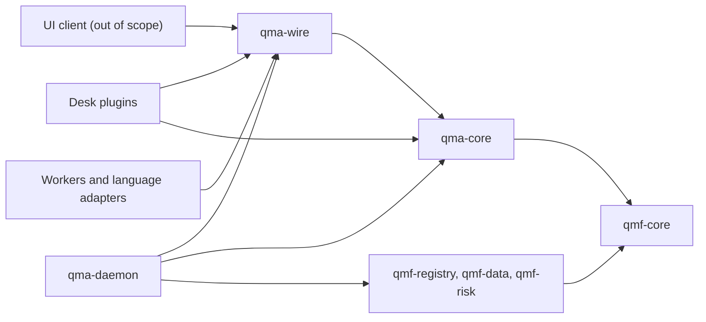
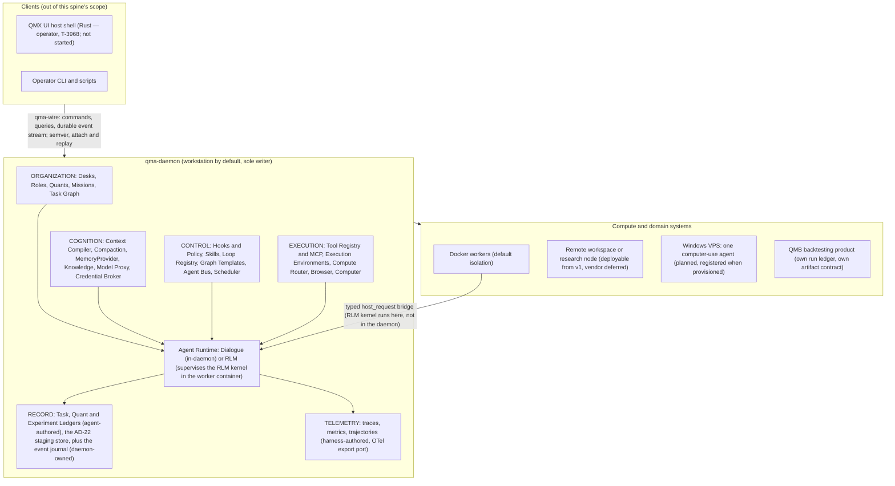
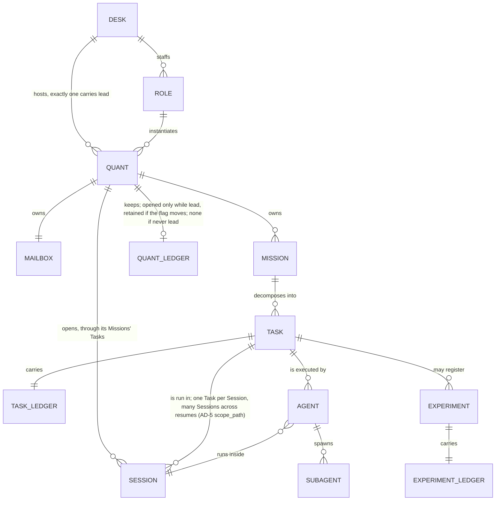
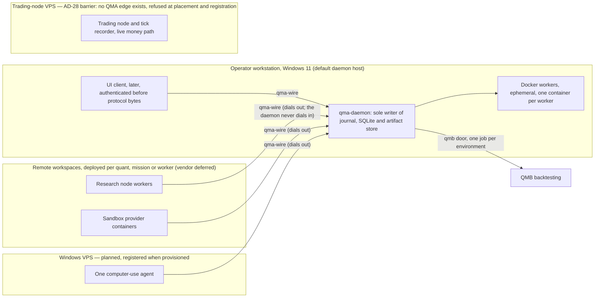

# Architecture Spine — The QMX Agentic System (QMA SDK + daemon + wire contract)

## Design Paradigm

**Contract-hub daemon with reversible plugin scopes (hexagonal), carrying event-sourced state as a law inside it.** A definitions-only `qma-core` names the ontology, the ports and the QMA refusal variants and depends on nothing but `qmf-core`; `qma-daemon` is the only process that runs anything and the only writer of durable state; `qma-wire` is the only cross-boundary contract package. Every runtime concern — memory, models, environments, knowledge, tools, compute, context — enters through a port the core defines, so every third-party thing sits behind a QMX-owned interface (P-3, L10). Every contribution registers through a scoped handle that returns a disposer, so deactivation replays the inverses. This is the same house style the platform already ratified one level down, so QMF and QMA read as one system. The QMX agentic system is a multi-agent system by design: many agents at once, spawning subagents, coordinating through a deterministic Task Graph rather than chat. The transcript is the seed this was built on, not a specification transcribed. The v1 build order follows the operator's priority — daemon, data layer, wire API and DevOps first, a Quant reachable through models over the wire — with the UI arriving later against the contract fixed here.

| Layer | Package | Namespace | Contains |
| --- | --- | --- | --- |
| Definitions | `qma-core` | `qma.core` | ontology nouns, ports, the plugin contribution surface (AD-1), refusal variants, contract types |
| Contract | `qma-wire` | `qma.wire` | envelope, commands, queries, events, schemas, protocol version |
| Runtime | `qma-daemon` | `qma.daemon` | journal, task graph, scheduler, hooks, ledgers, bus, proxy, tools, environments, context, staging, plugins, telemetry |
| Client contract | `qma-ui-contract` | `qma.ui_contract` | deferred stub only until the UI session |
| Extensions | desk plugins | `research-*`, `trading-*`, `dev-*`, `analysis-*`, `pm-*` | tools, tool adapters, hooks, skills, graph templates, model deployments, toolsets, worker templates, and singleton port bindings — memory provider (per desk), knowledge source (per source_id), execution environment (per kind), compute provider (per kind) and at most one context compiler (AD-1); no `ui_view` point in v1 — AD-1 |

## Inherited Invariants

Read-only from the parent spine (`architecture-QMX-2026-08-19`, QMF V1 Foundation), the constitution and the operator's standing rules. Original ids kept; never renumbered, never re-derived. A local decision that would weaken one is a conflict to surface, not an override.

**Citation classes.** `L<n>` cites law *n* of the ratified platform constitution (`docs/constitution.md`). `DEC-<n>` cites the decision that carried it. `P-<n>` cites section *n* of the packet constitution (`inputs/packet/QMX_AGENTIC_ARCHITECTURE_PACKET_v0.1/01_QMX_CONSTITUTION.md`) — an **input**, not a ratified law; where a `P-` and an `L-` disagree, the `L-` governs. `T-<n>` cites a line of the source transcript (`inputs/Design-Extensible-Agents.transcript.md`) — the operator's own words, seed material, never a law. Parent AD ids are always written "parent AD-*n*".

| Inherited | From parent | Binds here |
| --- | --- | --- |
| Contract-hub hexagonal paradigm; definitions-only core; applications built *with* the libraries | parent paradigm, parent AD-2, DEC-0022 | AD-1, AD-3 |
| Built with QMF; never re-implement or bypass its contracts | L31 (DEC-0122) | AD-2, AD-3, AD-4 |
| QMX-owned domain contracts implemented locally; wrap, never transplant a foreign contract | L10 (DEC-0013) | AD-1 ports, AD-15, AD-18, AD-19 |
| Exact money, exact time, instrument/venue/account identity | parent AD-7, parent AD-8, parent AD-9 | AD-3, AD-6 clock law |
| Deterministic fingerprints `fp1:sha256:...` from the single implementation | parent AD-10 | AD-3, AD-5 canonical JSON |
| Typed refusals at public boundaries | parent AD-11 | AD-3, AD-15, AD-17 |
| Append-only evidence, read-time folds, every fold declares its fold contract | parent AD-19, parent AD-21, parent conventions | AD-6, AD-8, AD-9 |
| Registry records, lineage edges, promotion record skeleton | parent AD-16, parent AD-18 | AD-14, AD-17 (QMA writes no promotion record — AD-2, AD-24; it records only the resulting artifact ref) |
| Migrations, retention, backup discipline: preflight -> backup first -> dry-run -> migrate -> verify, with a documented restore path, never an in-place mutation of the only copy; the application owns backup schedule and execution | parent AD-20 | AD-27 (owner), AD-21, AD-23 |
| Complete raw evidence retained locally **and** an off-machine backup maintained | L18 (DEC-0045) | AD-27 |
| Only a human may promote a registered artifact into the live zone | L17 (DEC-0041) | AD-24 (the `operator`-principal mechanism), AD-25 (the act itself, performed outside QMA) |
| Plain-Python experiments graduate into governed evidence only through the extension shape, with a lineage edge | L33 (DEC-0133) | AD-14 |
| Secret references only; values never in repos, config, journals, evidence, fingerprints or logs | L34 (DEC-0136) | AD-24, AD-15 |
| Never a fabricated terminal outcome; UNKNOWN blocks its stream until an explicit recorded resolution (QMA *adopts*; L35 itself binds venue submissions) | L35 (DEC-0137) | AD-12, AD-17 |
| Authority order bot -> book -> BMS -> operator; nothing above a bot touches the market | L36 (DEC-0143) | AD-16, AD-25 |
| Exit-preservation invariant: no control may block a risk-reducing act or the recording of evidence | L39 (DEC-0150) | AD-5, AD-6, AD-9, AD-10, AD-21, AD-25, Conventions |
| Configurable means UI-editable at platform level; recorded numbers are evidence, never constants | L38 (DEC-0157) | AD-26 |
| Corpus precedence for risk / position sizing / live trading: GitBook + trading-node documentation authoritative; QMX-discussion barred there | operator standing ruling 2026-08-20 | AD-16, AD-25 |
| Code and docs legible to humans and agents; every component ships tests and reference usage | L5, L27 | Conventions, Structural Seed |
| No database server; JSONL evidence + SQLite metadata + DuckDB rebuildable views only | DEC-0114, DEC-0117, parent AD-19 | AD-6, AD-18, Stack |
| `correlation_id` propagates across every boundary and is excluded from `fp1` identity by explicit versioned declaration; closed-and-addable vocabularies; banned words honored: `engine` stays banned for backtesting and `exam` stays banned outright, and `kernel` is never used bare and never for `qmf-core` or the Trading Node, where it is a retired name (`docs/glossary.md`). QMA adopts `plugin` for a desk extension package (AD-21) and the qualified phrase "RLM kernel" for the Analysis worker's persistent Python interpreter (AD-14): the parent's `engine`/`kernel` ban is QMB-scoped ("QMB is a library and a CLI, never an engine or kernel", `docs/glossary.md`) and no constitution law bans `plugin` `[ADOPTED 2026-08-28 — transcript vocabulary; parent ban is QMB-scoped]` | parent conventions, parent AD-21, parent AD-16 | AD-5, AD-10, Conventions |
| Deterministic infrastructure; probabilistic reasoning inside it — hooks and routers are code, never prompts | P-2 (packet input) | AD-10, AD-15, AD-29 |
| QMX owns its contracts; every third-party thing sits behind a QMX-owned interface | P-3 (packet input) | Paradigm, AD-1, AD-15, AD-18, AD-19, AD-24 |
| Extensibility is a first-class requirement: versioned, reusable, plugin-contributed authored artifacts | P-5 (packet input) | AD-13, AD-21 |
| Self-improvement is gated: nothing agent-produced becomes runtime state without validation, verification and approval | P-9 (packet input) | AD-22 |
| Use the lowest-level capable environment | P-10 (packet input) | AD-16, AD-17 |
| Observability is not the ledger | P-12 (packet input) | AD-23 |

## Invariants & Rules

*Tags: `[ADOPTED 2026-08-28]` = settled by the operator or by the transcript he ratified, and it is the only tag class in use. No `[ASSUMPTION]`, `[UNVERIFIED]`, `[UNSTUDIED]` or `[SURFACED CONFLICT]` tag remains inside any AD: every one was resolved from a source or moved to a Deferred row carrying a testable revisit condition. An AD carries rules only; doubt, unmeasured facts and unstudied implementation choices live in Deferred. Citation classes are defined under Inherited Invariants: `L-n` is a ratified constitution law, `P-n` a packet-constitution section (an input, not a law), `T-n` a transcript line (the operator's own words, seed material).*

### AD-1 — Contract-hub packages, namespaces, port cardinality [ADOPTED 2026-08-28]

- **Binds:** D1; every package, plugin and contribution point.
- **Prevents:** two owners of one port; a contribution type with no owning package; two plugins minting the same contribution name; a service-container / message-bus free-for-all; blanket `qmx.` prefixing.
- **Rule:** Packages are `qma-core` (definitions only, depends only on `qmf-core`), `qma-daemon` (the only process that runs anything), `qma-wire` (the only cross-boundary contract package); `qma-ui-contract` exists as a deferred stub. Python namespace is `qma.*` — no blanket `qmx.` prefix anywhere; plugins and ledger views are named by desk. Every runtime concern enters through a port `qma-core` defines: MemoryProvider, ModelDeployment, ExecutionEnvironment, KnowledgeSource, ToolAdapter, ComputeProvider, ContextCompiler. `qma-core` also defines the **plugin contribution surface** — `PluginManifest`, the `PluginContext` protocol carrying the cardinality-typed registration methods, `HookEvent` and `HookResult`, the closed handle-kind vocabulary (AD-14) and the `credential_ref` string type AD-24 requires that context to expose — in a `plugins/` package beside `ports/`. `qma-daemon` *implements* the context and owns the loader; `qma-core` *defines* it, the same definitions-versus-runtime split used everywhere else, so a plugin imports its contribution types from `qma-core` and never from `qma-daemon`. AD-2's diagram therefore needs no new edge, which is the confirmation the placement is right. Every contribution point declares a cardinality; every **singleton** additionally declares an explicit scope key, and every **multi** point is keyed instead by its fully-qualified `<plugin_id>:<local_id>` id. The **plugin roster** is the daemon's declarative startup list of plugins to load, one entry per `plugin_id` carrying its version and enable flag; it is daemon configuration, never a contribution, and it is unrelated to the QMF *package* roster of parent AD-2. A roster entry whose cardinality or scope key the daemon cannot resolve at startup is a startup error naming the entry and the unresolved field, never a silent absence. Singletons: MemoryProvider per `desk`; KnowledgeSource per `source_id`; ExecutionEnvironment per `kind`; ComputeProvider per `kind`; ContextCompiler per daemon — the daemon's implementation is a **default binding, not a registration**: it occupies the key only while no plugin binds it; exactly one plugin may bind the key, which replaces the default at load time and is recorded as a journal event, never as a runtime override; two plugins binding it is the same hard startup error. Every other singleton key ships no default. An unbound singleton key is a startup error only when a loaded roster entry, plugin manifest or Role grant requires it, and that error names the port, the key and the requiring unit; a key nothing loaded requires stays unbound and its port is simply unavailable — with no MemoryProvider bound, `recall` returns the typed refusal `NoMemoryProvider` and candidates stage under AD-22 (AD-18), and an `ExecutionEnvironment` or `ComputeProvider` `kind` that no declared environment names is unbound, not an error. Multi: `tool`, `tool_adapter`, `hook`, `skill`, `graph_template`, `model_deployment`, `toolset`, `worker_template`. There is no `ui_view` contribution point in v1: a contribution point with no `qma-wire` schema may not be registered. Two plugins binding one singleton key is a hard startup error naming both plugin ids, the port and the key — never last-write-wins, never a runtime override. Every multi contribution is addressed `<plugin_id>:<local_id>`, unique daemon-wide, and a duplicate is the same hard startup error; toolsets, templates and Role grants reference fully-qualified ids only.

### AD-2 — Dependency direction [ADOPTED 2026-08-28]

- **Binds:** D1; all packages, plugins and clients.
- **Prevents:** import cycles; a plugin reaching into daemon internals; a client importing daemon code.
- **Rule:** Every arrow reads "depends on". The diagram is the whole rule; an edge not drawn here is default-deny until ratified in this spine. Plugin halves (daemon, worker, UI) never share process memory — they meet only at `qma-wire`. For dependency purposes a plugin's worker half is covered by the `PLUGIN` node, not the `WORKER` node: it may depend on `qma-wire` and `qma-core` and never on `qma-daemon`. The `WORKER` node governs non-plugin workers and language adapters, which depend on `qma-wire` alone. **Edge narrowing:** the `qma-daemon -> qmf-risk` and `qma-daemon -> qmf-registry` edges are read-and-calculate only. QMA may import their value types, typed refusals and pure calculation surfaces, and may write only content-addressed dev-zone candidate artifacts through `qmf-registry` (AD-14). QMA may not construct, write, amend or delete a binding record, a Book, BMS or seat record, a control-action record, an exit or protection record, a priority rank or a promotion record, and may not call any zone-transition surface. The permitted surface of each edge is enumerated in `qma-core` and that enumeration is default-deny: a surface not listed is not callable, and adding one is a spine amendment. `qmf-venue` is importable by no QMA package, worker or plugin. L30 carries a scope annotation (2026-08-21): its default-deny is roster-scoped — it governs the seven QMF roster packages internally, never applications — so QMA's read-and-calculate edge to `qmf-risk` and `qmf-registry` is an application dependency under L31, narrowed as stated above.



### AD-3 — No parallel base for anything qmf-core defines [ADOPTED 2026-08-28]

- **Binds:** D1, D3; `qma-core` and every downstream unit.
- **Prevents:** a second error, identity or canonicalization model; a re-minted `fp1` "for wire convenience".
- **Rule:** QMA refusal types are variants of `qmf-core`'s typed-refusal base; ids and `correlation_id` are `qmf-core` types; `fp1` is imported, never re-derived; money and time follow the parent's exact types. `qma-core` may add nouns and refusal variants — it may not define a second base for anything `qmf-core` already defines, and no unit may re-mint one (L31, DEC-0122). Content addressing has exactly one construction: a content-addressed id is `fp1` over the value's canonical JSON, and a **tree digest** — AD-19 corpus snapshots, AD-17's `ExperimentSpec`, AD-14's candidates, AD-8's artifact registry — is `fp1` over a canonical manifest of per-file `fp1` values. One scheme, verifiable by the single imported implementation; a second Merkle or hash construction is never defined.

### AD-4 — Daemon language: one Python runtime, workers over the wire [ADOPTED 2026-08-28]

- **Binds:** D3; `qma-daemon`, hooks, verifier scripts, the RLM kernel.
- **Prevents:** re-implementing QMF contracts across a language boundary; a second daemon runtime.
- **Rule:** The daemon is a single Python 3.14 asyncio process. Hooks and verifiers run inside it; the RLM kernel is a persistent Python interpreter inside the Analysis worker's Docker container, supervised by the daemon over the typed `host_request` bridge (AD-14), never in the daemon process. Language-specific workers and non-Python clients — the Rust UI included — connect over `qma-wire` as clients and never re-implement a `qmf` contract. Money, time, `fp1` and `correlation_id` never cross a language boundary.

### AD-5 — The daemon-to-UI wire contract [ADOPTED 2026-08-28]

- **Binds:** D2; `qma-wire`, the daemon, every client.
- **Prevents:** UI-authoritative state; a separately built client breaking on every daemon change; one id doing two jobs; a detached overnight run becoming unobservable.
- **Rule:** Daemon and UI are two products joined by one versioned contract: commands (mutate, acked immediately, side effects settle asynchronously), queries (read durable state) and a durable event stream. Closing a client must not stop an agent, and an overnight agent need not know a client exists. The **wire envelope** carries `v`, `type`, `id`, `producer_id`, `correlation_id`, `scope_path`, optional `seq` and `payload`; `producer_id` is the stable identity of the minting client, worker or daemon component, assigned at the `initialize` handshake, unchanged across reconnects, and it is the first half of the idempotency pair below — one of the ten names the Conventions whitelist against the `_ref` law. `scope_path` is an ordered array of `kind` plus `id` segments in the fixed order desk, quant, mission, task, session, agent, subagent — Session sits between Task and Agent because a Task outlives the session that runs it (AD-12); every existing ancestor is present, filters prefix-match it, and the order is part of canonical JSON. **One `seq`, one referent:** `seq` is always the per-scope projection index of the scope named last in that message's `scope_path`; `journal_seq` (AD-6) never appears on the wire as `seq` and is opaque to clients. Transport is JSON-RPC 2.0 over WebSocket with HTTP GET for queries, an MCP-style `initialize` handshake negotiating a semver `protocolVersion` plus capabilities, and JSON-Schema-described message families; JSON is canonical per `fp1`. **Transport posture:** the daemon binds loopback by default; any non-loopback bind requires TLS (`wss://` plus HTTPS for queries) *and* an explicit recorded operator configuration, never a default; every client authenticates with a credential resolved through the Credential Broker before protocol bytes; an unauthenticated bind, or a plaintext non-loopback bind, is a hard startup refusal rather than a warning. A remote worker or deployed Quant **dials out** to its daemon and the daemon never dials in — the deployed side holds the daemon's address and its own credential, so no inbound port is opened on the deployed side and no external relay is introduced (AD-20); the daemon's own listener is the single inbound port, and it is non-loopback only under the TLS-plus-recorded-operator-configuration rule above. Compatibility law: additive-only within a major, unknown types and fields ignored by older clients, deprecations live a configured number of minors then drop (AD-26 variable `wire.deprecation_minors`, default 2), and `qma-wire` is the sole compatibility authority. The vocabulary seeds from the packet's 26 nouns — 9 commands, 7 queries, 10 `noun.verb` events — as a closed-and-addable registry. `wire.attach(scope, since_seq)` and `wire.detach` are client state only: attachment never changes an actor's identity or stops a run, and session replay is `wire.attach(since_seq=0)`, read-only. A cursor is valid only for the scope that issued it; `wire.attach` interprets `since_seq` in that same scope and a `wire.attach` carrying a cursor from another scope is refused with the typed refusal `CursorScopeMismatch`, never silently re-based. Inbound interaction requests queue durably; a blocked run never rejects a message. `id` is unique per message or record and minted by its producer; every wire command is **idempotent on the pair producer id plus `id`**, and the daemon keeps a dedup cursor whose window is a registered AD-26 variable. `correlation_id` has exactly three minting origins — an originating operator command, a scheduled trigger (AD-29), and a daemon-internal lifecycle act (crash recovery, the expiry of a `dispatch_lease` or an `environment_lease`, an automatic migration checkpoint, and the two AD-23 daemon-job trims), which mints its own root `correlation_id` and records the reason. An operator-gated act — every command AD-24 accepts only from an `operator` principal — is an operator command under the first origin and carries that command's `correlation_id`; the daemon mints none for it. The two AD-23 daemon-job trims of the mailbox delivery projection and the telemetry store are daemon-internal lifecycle acts under the third origin: each mints its own root `correlation_id` and records the reason, its window and the stream trimmed. From its origin it is copied verbatim onto every downstream command, event, JobHandle, ledger append, memory candidate and telemetry span — no component regenerates, derives or truncates it, and a record without one is refused at the gate. That gate never refuses an evidence append: an append that reaches the daemon without a `correlation_id` is recorded under a daemon-minted lifecycle id annotated `correlation_missing`, because L39 forbids a control blocking the recording of evidence. Snapshots are authoritative; progress events are explicitly not.

### AD-6 — One journal, one writer, one clock [ADOPTED 2026-08-28]

- **Binds:** D4, D6; all durable state.
- **Prevents:** four sequence numbers for one fact; a worker corrupting the store; a store nobody declared; a partitioned worker's evidence vanishing or duplicating; "quiet hours" meaning two different things on two hosts.
- **Rule:** Persistence is JSONL append journals plus SQLite in WAL mode behind `qmf-data` sinks; DuckDB holds rebuildable fold views only, never evidence.

  **One journal.** A single append-only journal with a global monotonic `journal_seq` is the only durable append target **for daemon-owned events**, and `journal_seq` is the single total order in the system. Every event carries its full scope path; a per-scope stream is a filtered projection whose `seq` is a derived index the daemon maintains, never an independent append target, and replay authority stays with the journal. The event journal is **evidence**: append-only, retained under the same law as the ledgers, backed up under AD-27, never trimmed. It is neither a ledger (AD-9) nor telemetry (AD-23).

  **The closed store list.** Journal-derived projections, never independent append targets: per-scope event streams, mailboxes and delivery state (AD-20), the daemon-held operator approval queue (AD-12) — a mailbox-kind projection over the same journal `message.*` events, readable and answerable only by an `operator`-principal connection (AD-24), folded with mailbox delivery state — Task Graph state (AD-12), Session and Agent records (AD-14, AD-16), desk ledger views (AD-9), the ledger quarantine stream (AD-10) — a projection over journal `ledger.quarantined` events whose payload carries the refused entry verbatim with its refusal reason — and the daemon's declarative registries — collectively the **definition store**, which is a name for this set of projections and never a store of its own: Desk, Role (`role.base` and `role.overlay`) and Quant records (AD-7), the Deployment Registry (AD-15), the Tool Registry and `tool_adapter` records (AD-16), `toolset` and `worker_template` records (AD-16, AD-22), hook registrations (AD-10, AD-11), Skill, Graph Template and Loop registrations (AD-13, AD-22), Routine records (AD-29), `ExecutionEnvironment` declarations (AD-17, AD-26), the AD-26 variable registry and plugin install records (AD-21), each a projection over its own `noun.verb` journal events with `journal_seq` as its ordering key. Declared independent stores, each with exactly one named writer and exactly one append path through the daemon: the three ledger stores (AD-9), the artifact store (AD-8), the telemetry store (AD-23), the AD-22 staging store, and an admitted MemoryProvider's own store (AD-18). **A store not on this list may not be created.** Every append to a declared **evidence** store — the three ledger stores, the artifact store, the AD-22 staging store and an admitted MemoryProvider's store — also emits a journal event naming the store and carrying the record's `fp1` — `ledger.appended`, `artifact.registered` and their siblings — so ordering and replay stay journal-authoritative and each of them stays rebuildable. The telemetry store is the one declared store the announcement law exempts: a telemetry append emits no journal event, because observability is not the ledger (P-12, AD-23) and a journal that is never trimmed (AD-8) may not grow with a stream that is bounded. **Cross-store fold law:** the announcement's `journal_seq` is the ordering key in every fold that spans stores, and equal instants are disposed by ascending `journal_seq`, never by timestamp.

  **Record law.** Every durable record carries `occurred_at` and `recorded_at`, both int64 UTC nanoseconds from `qmf-core`'s clock, plus — in every store the announcement law binds — its announcement `journal_seq`; a telemetry record, whose store that law exempts, carries `occurred_at` and `recorded_at`, no `journal_seq`, and is ordered by `recorded_at` and its `correlation_id` alone (AD-23); every externally-sourced fact additionally carries `source` and `revision`, so a knowledge-time bound is declarable everywhere. The v1 folds are exactly: desk ledger views (AD-9), Task, Mission, Session and Agent state (AD-12, AD-14, AD-16) — the Session record carrying its execution-model and autonomy axes, never its attachment, which is client state (AD-14), and the Agent record carrying the effective capability set computed at spawn (AD-16) — folded from the `task.*`, `mission.*`, `session.*` and `agent.*` journal events, mailbox delivery state and ack cursors, folded from the `message.*` journal events (AD-20), deployment and provider health, folded from the `deployment.*` journal events (AD-15), staging and application state, folded from the `proposal.*` journal events (AD-22), and each definition-store registry named in the closed store list above — Desk, Role and Quant records, the Deployment Registry, the Tool Registry and `tool_adapter` records, `toolset` and `worker_template` records, hook registrations, Skill, Graph Template and Loop registrations, Routine records, `ExecutionEnvironment` declarations, the AD-26 variable registry and plugin install records — folded from its own `noun.verb` journal events — and every fold in this list takes `journal_seq` as ordering key, `as_of` over `recorded_at` as knowledge-time bound and equal instants disposed by ascending `journal_seq`. Per-scope event streams and the ledger quarantine stream are filtered projections, not folds, and declare no fold contract. No read outside that list is a fold, and a new fold is a spine amendment. Every fold declares its fold contract — stream, ordering key, knowledge-time bound, equal-instant disposition (parent convention).

  **Sole writer.** No process other than the daemon **writes** the journal, the SQLite file or the artifact store — not a worker, not a plugin's worker half, not a client, not a fold job; every write from anywhere else is a wire command. A read-only fold process may open these files **read-only**, on the daemon's host only, and never writes and never checkpoints. External stores that legitimately live elsewhere (QMB's run ledger) are reached by `_ref` and never merged in. The sole-writer law binds processes; upstream states the WAL-reset bug "only affects databases in WAL mode when there are two or more database connections open on the same file, in separate threads or processes, and when those two connections attempt to write or checkpoint at the same instant" (sqlite.org/wal.html §11, checked 2026-08-28). QMA therefore adds **one connection**: the daemon opens the SQLite store on exactly one connection in one thread, and every checkpoint — automatic or explicit — runs on that same connection; read-only folds open the file read-only and never checkpoint. Under that discipline the bug is unreachable and 3.51.3 is not a v1 floor; the daemon asserts `sqlite3.sqlite_version` at startup and records it as evidence. If a second writable connection or a separate checkpointer thread is ever introduced, 3.51.3 (or the 3.50.7 backport) becomes a hard floor and the daemon must obtain that library — a CPython build bundling it, or `pysqlite3-binary` — before the change lands.

  **Remote-worker durability.** A remote or partitioned worker holds a durable local **outbox**: ordered, fsynced, explicitly not a journal, never folded, and discarded entry by entry on daemon ack. It replays in order on reconnect and the daemon dedups on AD-5's producer-plus-`id` pair. An environment lost with a non-empty outbox marks that Task's ledger `unknown_tail` at the last acked `id`; it never writes "no entry" and never fabricates the missing tail (AD-17's UNKNOWN discipline). Under back-pressure telemetry is dropped before evidence (AD-23). Outbox depth and spool bytes are registered AD-26 variables; on exhaustion the worker blocks the dispatch of new work rather than discarding a pending evidence append (L39), and telemetry is discarded first (AD-23).

  **Clock law.** Every persisted timestamp is UTC obtained from `qmf-core`'s clock protocol via the daemon; no component reads host local time and no worker timestamps its own evidence; every operator-facing wall-clock policy — quiet hours, routines and cron, rollups, the ledger date index — carries an explicit IANA timezone resolved in the daemon at evaluation time, and every duration policy — job timeouts, `ask_timeout`, hook timeouts, retention windows — is a span measured from a recorded UTC instant and carries no timezone; a client renders in the viewer's zone and never persists a local-time value.

### AD-7 — Ontology, cardinality and address grammar [ADOPTED 2026-08-28]

- **Binds:** D5; all SDK, wire and UI vocabulary.
- **Prevents:** collision with the platform's Bot; an undefined "Role Lead"; identity accruing to a running instance.
- **Rule:** The chain is Desk -> Role -> Quant -> Agent -> Subagent. Desk is the organizational and workspace unit. **Profile is presentation only: a client-side grouping of `desk_slug`s with a display name, held in client configuration, never daemon state, never a `scope_path` segment, and never an index, filter, permission or routing key**; nothing in the daemon reads or stores one. Role is a declarative behavioral contract, close to a system prompt, and is stateless. **Quant** is the persistent named organizational actor instantiated from a Role: name, memory scope, missions, routines, preferences, `WakePolicy` (AD-20) and mailbox — plus a Quant Ledger opened only while it carries its desk's lead flag and retained if the flag moves (AD-9). A Quant that has never held the lead flag has no Quant Ledger. Agent is a running reasoning/execution instance; Subagent is an Agent spawned by an Agent with capabilities no wider than its parent; an Agent may spawn Subagents; a Subagent is a leaf and spawns none, because AD-16 blocks it from delegation tools. Session is the run container; Worker is an addressable execution slot and deliberately not an ontology object. Role:Quant and Desk:Quant are both 1:N. Exactly one Quant per Desk carries the lead flag, and its mailbox is the address for desk-scoped inbound; a mailbox `Envelope` whose more specific recipient no longer exists resolves to `dead_letter` (AD-20) until the operator rules on the catch-all (Deferred) `[ADOPTED 2026-08-28 — operator ruling "desk-level quant ledgers OK" and his hierarchy words "there is the main guy, then the ones that do the work, then sub-agents in those sessions" (memlog 2026-08-28) ratify the desk-level lead Quant as a persistent actor]`. `ActorId` grammar is `quant:<desk_slug>/<quant_slug>`, where each slug matches `^[a-z0-9](?:[a-z0-9-]{0,30}[a-z0-9])$` — lower-case, 2 to 32 characters — minted only by the `desk.create` and `quant.create` wire commands from an `operator` principal (AD-24); the daemon refuses with the typed refusal `SlugUnavailable` any `quant_slug` that case-folds onto a current or retired slug, onto a Role name, or onto a reserved desk prefix token, and any `desk_slug` beyond the five below that case-folds onto a current or retired slug or onto a Role name. The five `desk_slug` values are exactly `research`, `trading`, `dev`, `analysis` and `pm` — identical to the plugin prefix tokens, which is why they are minted once at bootstrap and are exempt from the reserved-prefix-token clause they would otherwise fail by construction — and never reused. An `ActorId` is stable, never a Role name and never reused — **and opaque to every consumer**: desk membership is a field on the Quant record resolved through the daemon's definition store (AD-6), never through `qmf-registry` and never parsed from the id, and no index, view, filter, permission check or route reads the slug substring. Desk membership is mutable by operator command recording a `desk.moved` journal event while the `ActorId` never changes; slugs are never reused, and a retired desk or Quant keeps a tombstone record in the definition store that reserves its slug forever and carries its alias. A **desk consolidation is a Profile-level collapse only**: it never renames or retires an existing `desk_slug`, `ActorId`, plugin prefix, memory scope or ledger index key, and no minted `ActorId` is ever rewritten. Agents and Subagents have no mailbox and are never a `to:` address. Work vocabulary is Goal (informal intent) -> Mission (executable organizational contract owned by one Quant, desk derived from the Quant record) -> Task. The five Roles stand: Researcher, Trader, Developer, Analyst, Product Manager; the five Desks are Research, Trading, Development, Analysis and PM (prefixes `research-*`, `trading-*`, `dev-*`, `analysis-*`, `pm-*`). A Role name is never used as a Desk name, and "quant" is never used as an adjective for a Role, because Quant is a distinct entity and an AD-5 scope value. Bot, Seat, Book, BMS and kill switch are platform terms (L36) and never name an agentic actor or artifact. That is a naming law and confers no capability prohibition: the prohibition on *acting* on those nouns lives in AD-16 and AD-28, and naming and capability are stated apart so neither is mistaken for the other.

### AD-8 — State ownership [ADOPTED 2026-08-28]

- **Binds:** D6; every subsystem that persists anything.
- **Prevents:** one fact written to three stores with three meanings; a durable store with no declared owner; a compacted transcript taking real state with it.
- **Rule:** `JOURNAL != LEDGER != MEMORY != KNOWLEDGE != ARTIFACTS != CONTEXT != TELEMETRY != STAGING`. Ownership and lifetime are fixed here and nowhere else; the store list itself is closed by AD-6:

| State | Owner | Who may write | Crossing rule | Retention |
| --- | --- | --- | --- | --- |
| Event journal | daemon | daemon only | journal events reference records by `fp1`; an evidence record's only permitted reference to a journal entry is its own announcement `journal_seq` stamp (AD-6 record law), for which the daemon allocates the sequence number before writing the record so the record stays append-only; no other field of any evidence record points at a journal entry | keep forever; backed up under AD-27; exempt from trim (AD-23) |
| Mission / Task Graph | daemon | daemon only; agents propose transitions as commands | `_ref` only | keep forever |
| Session / Agent records | daemon | daemon only, as journal projections | `_ref` only | rebuilt from the journal; kept as long as the journal (AD-27) |
| Task / Quant / Experiment ledgers | daemon store, agent-authored except AD-9's two closed exemptions | through `before_ledger_append` only, by the Agent holding the relevant lease — `dispatch_lease` for a Task Ledger, `quant_ledger_lease` for a Quant Ledger, the registering Task's `dispatch_lease` for an Experiment Ledger — plus the two daemon-authored exemptions AD-9 closes (`reassigned` and `unknown_tail` entries and hook-returned `ledger_entry`), which carry `authored_by: daemon` (AD-9, AD-10) | `_ref` only, never shared semantics | keep forever |
| Ledger quarantine | daemon | daemon only | `_ref` only | keep forever; rebuilt from the journal, which AD-27 backs up; exempt from trim |
| Definition store (Desk, Role, Quant, Routine, `ExecutionEnvironment` declarations, toolset, worker_template, Skill, Loop, Graph Template, plugin install, Deployment, Tool, tool_adapter, hook registrations, AD-26 variables) | daemon | daemon only, as journal projections; agents propose edits only as AD-22 RefinementProposals, with exactly one exception, closed here: a mission-scoped, template-validated observe-or-deny hook an agent registers through `before_hook_register` (AD-11), folded under that Mission's scope, disposed with the Mission on its exit stack, and never becoming a durable hook except through AD-22 | `_ref` only | rebuilt from the journal; kept as long as the journal (AD-27) |
| Memory | MemoryProvider, one binding per `desk` (AD-1); records scoped by desk and role | agent proposes; the daemon gate admits (AD-18) | recalled into Context only | provider-owned; candidates kept until `admitted`, `superseded`, `invalidated`, `expired` or `contradicted` (AD-18 `validation_state`) |
| Knowledge | external corpus | nobody — read-only | Citation carrying `source_ref`, `locator`, `snapshot_ref`; cited bytes copied into the artifact store (AD-19) | cited copies keep forever |
| Artifacts | daemon registry, content-addressed | the producing agent, through `before_artifact_register`; the daemon writes the AD-19 citation copy through that same gate | `_ref` only | keep forever, with lineage |
| Staging | daemon store | an agent proposes as a command; the daemon writes | staged content is never read by a runtime path; application emits a new definition record with a lineage edge | approval decisions and lineage keep forever |
| Mailbox / Agent Bus, the daemon-held operator approval queue included (AD-6, AD-12) | daemon projection over journal `message.*` events | daemon only | `_ref` only | delivery projection bounded and AD-26-registered, never removing an unacked `Envelope` or an unanswered `approval_request` (AD-23); the underlying journal records keep forever |
| Context | Context Compiler, per invocation | nobody — never persisted | discarded with the invocation | not persisted |
| Telemetry | daemon, harness-authored | daemon harness code only; never an agent | separate store; `correlation_id` shared | bounded and AD-26-registered; trajectories and session replay exempt (AD-23) |

### AD-9 — Ledgers: task, quant, experiment; everything else is a view [ADOPTED 2026-08-28]

- **Binds:** D6; ledger contracts, hooks, wire queries.
- **Prevents:** one global ledger; a per-mission or per-desk store; remote agents appending to a central desk ledger; the ledger becoming a log.
- **Rule:** Three stores exist.

  **Task Ledger** — **owned by the Task**: one per Task for its whole life, across every Agent that ever holds it. It records what happened, when, what failed and why, what the agent did to resolve it, and which model and agent did what, and is persisted in the daemon store through the wire so it survives the worker. "Never shared between agents" means **no ledger spans two Tasks and no Agent appends to a Task it does not hold** — not that a resumed Task starts a second ledger, which would make AD-12's transcript-independent, resumable Task unbuildable. Append rights follow a single **`dispatch_lease`** — per Task, distinct from AD-17's per-slot `environment_lease` and never named bare: every entry carries `attempt_no`, `authored_by` (agent ref plus the owning Quant's `ActorId`, or `daemon` on a daemon-authored entry, which names no model deployment) and the model deployment used; a reassignment — any change of the Agent holding the `dispatch_lease`, including a resume that must re-acquire it after release — is a **daemon-authored** entry of kind `reassigned` that increments `attempt_no` and carries `authored_by: daemon`; a resume from `defer`, which retains the `dispatch_lease` (AD-10), writes no `reassigned` entry and leaves `attempt_no` unchanged; `before_ledger_append` refuses an append from a non-holder of the relevant lease, with exactly two authors exempt from that check and from no other: the daemon itself for the entry kinds this spine names daemon-authored (`reassigned` and `unknown_tail`, AD-6), and a `ledger_entry` returned by `before_task_complete` or `review_required` (AD-10), recorded with `authored_by: daemon` plus the returning hook's registry id; both are still schema-validated and the exempt set is closed here.

  **Quant Ledger** — a desk's lead Quant's own larger work ledger, with a declared entry schema: mission opened and closed, delegation, escalation, and the standing decisions the Quant makes at desk level. It is appended only through `before_ledger_append` by an Agent of that Quant holding the **`quant_ledger_lease`**, which the daemon grants to at most one Agent of that Quant at a time. While Mission reports are deferred it never restates or synthesizes another Task's ledger. It belongs to the Quant and survives movement of the desk `lead` flag.

  **Experiment Ledger** — the scientist's notebook, one per Experiment, owned by the Quant that registered it. It is appended by the Agent holding the `dispatch_lease` of the Task that registered the Experiment, so two Tasks registering against one Experiment never produce two simultaneous authors; every entry carries `authored_by` and the model deployment used.

  Research, Trading, Development, Analysis and PM ledgers are read-time **views** over those three, indexed by desk, quant, agent, mission, task, experiment and date — never stores. **Desk ledger view fold contract:** stream is the three ledger stores' `ledger.appended` announcements filtered by the view's index key; ordering key is the announcement `journal_seq` (AD-6); knowledge-time bound is the view's `as_of` over `recorded_at`, defaulting to now; equal instants are disposed by ascending `journal_seq`, never by timestamp.

  Entries are appended only through `before_ledger_append`, which is a **validating gate, not a blocking control** (AD-10, L39). A task-completion transition requires a structured ledger append (what was done, what changed, evidence and artifact refs, unresolved issues, next recommendation) or the completion is refused — the *completion* is refused; the entry is still written, and a refused completion never discards an append. Entries may carry `trace_ref`, `artifact_ref`, `experiment_ref` or `knowledge_ref` — references, never shared semantics. Agent-to-agent messages are logged. Ledger names are desk-scoped, never platform-prefixed.

### AD-10 — Hooks are the single enforcement surface [ADOPTED 2026-08-28]

- **Binds:** D7, D19; every daemon-owned primitive.
- **Prevents:** each unit inventing its own interception point; "done" meaning whatever the model says; a review nobody can audit; a `deny` that gates in one unit and only notices in another; a mission-authored hook reaching another mission; an `ask` that no one can answer overnight; agents being too agentic.
- **Rule:**

  **Phase law.** Every event declares its phase in its name, except the two declared phase-less blocking controls `agent_stop` and `review_required`, which fire before the act they gate. A `before_*` event and those two controls are the only ones that may return `deny`, `ask` or `defer`; `block_stop` is legal only on the two phase-less controls `agent_stop` and `review_required` and is refused at registration on every `before_*` event; `allow` is legal on every `before_*` event **and on `after_tool`**, and is the resolution when a hook returns nothing on those events; on the two phase-less controls a hook that returns nothing resolves to `observe`, since `allow` is not among their legal decisions; `updated_input` and `updated_output` are **fields of `HookResult`, never decisions** — the decision vocabulary is exactly the six values of the precedence order below — and each rides an `allow`: `updated_input` on `before_tool` only, `updated_output` on `after_tool` only; every other `after_*` event may return only `observe`. An `after_*` event fires once the effect is durable. A decision illegal for an event's phase is refused **at registration**, never discovered at runtime.

  **The v1 registry** is closed-and-addable: a `before_` and an `after_` event for each of these twenty-three daemon-owned verbs — `tool`, `task_create`, `task_complete`, `ledger_append`, `memory_write`, `skill_write`, `artifact_register`, `experiment_register`, `env_create`, `env_remove`, `subagent_spawn`, `message_send`, `graph_transition`, `session_start`, `session_end`, `mission_start`, `mission_complete`, `plugin_activate`, `plugin_deactivate`, `routine_fire`, `hook_register`, `proposal_stage`, `proposal_apply` — plus exactly two declared phase-less blocking controls, `agent_stop` and `review_required`, whose legal decisions are drawn from `block_stop`, `deny` and `observe` per the per-control semantics below and nothing else — the phase law's before-only restriction does not reach them, and registration validates them against this set. That is the ratified v1 set and it is complete as listed.

  **Per-control semantics.** On `agent_stop` the legal decisions are `block_stop` (return the Agent to the next ready Task, AD-29) and `observe` (let the stop proceed); `deny` is not legal on `agent_stop`, a hook returning nothing resolves to `observe`, and a timeout resolves to `observe` annotated `hook_timeout` — fail-closed does not reach this control, because a fail-closed stop control traps a run. On `review_required` the legal decisions are `deny` (refuse the gated act), `block_stop` (hold the Agent open until the review resolves) and `observe`; a hook returning nothing resolves to `observe` and a timeout resolves to `deny`.

  **Addability.** Every new daemon-owned primitive ships a `before_<verb>` gate event **and** an `after_<verb>` event — the same pairing the v1 registry uses for all twenty-three verbs. Omitting an `after_<verb>` is a spine amendment naming the verb and the reason, never an author's judgment call. **An agent-reachable write into any daemon-owned store passes a `before_*` hook without exception**; a primitive whose write path has no hook event is a defect in this registry, never an exemption.

  **`HookResult`** is one tagged union carrying `decision`, `reason`, `updated_input` (`before_tool` only), `updated_output` (`after_tool` only), `injected_context` (`before_*` events only — it reaches the Context Compiler, never the Ledger), `ledger_entry` (`before_task_complete` and `review_required` only, and that entry still passes `before_ledger_append` like every other append) and `verifier_ref` (`before_task_complete` and `review_required` only). A field carried on an event whose phase does not permit it is refused **at registration**, on the same check as an illegal decision. Decisions have a total precedence order: `block_stop > deny > defer > ask > allow > observe`; parallel hooks resolve most-restrictive-wins; `observe` never participates in resolution and may not carry `updated_input` or `updated_output`.

  **Fail-closed, with three carve-outs.** A hook timeout resolves to `deny` with reason `hook_timeout` plus a telemetry record carrying the `correlation_id`. **L39 binds inside QMA: no hook decision may block the recording of evidence.** `before_ledger_append` is therefore a validating gate, not a blocking control — it may refuse an entry that is schema-invalid or authored outside the relevant lease (AD-9), and nothing else — either refusal writes the entry to the quarantine stream with its reason and never discards it. A timeout on `before_ledger_append` resolves to **allow**, with the entry recorded and annotated `hook_timeout`; an explicit `deny` writes the entry to a quarantine stream carrying its refusal reason and never discards it; and no permission policy, precedence resolution or permissive mode may produce a `deny` on a well-formed evidence append from the holder of the relevant lease. Fail-closed remains the default on every other `before_*` event and on `review_required`; `before_memory_write` included. A timeout on `agent_stop` resolves to `observe` per the per-control semantics above, and a timeout on any `after_*` event resolves to `observe` annotated `hook_timeout`: `deny` is not in an `after_*` event's legal set, a timeout may never synthesize a decision the event's phase forbids, and the effect an `after_*` event observes is already durable.

  **`ask` and `defer` are defined here and nowhere else.** `ask` suspends the invocation and emits exactly one `approval_request` (AD-20) into the mailbox or operator approval queue named by its Mission's `approval_route` (AD-12) when the Mission carries one, and into the owning Quant's mailbox otherwise — the single human-approval channel that AD-13's approval and human gates, AD-17's UNKNOWN resolution, AD-21's forward-only migration confirmation and AD-22's admission approval all raise, and that one wire command answers. It carries a required `ask_timeout` (AD-26 variable) and an `on_timeout` of `deny` or `escalate`; where a Mission's `approval_route` declares its own, the route's values govern. **`escalate` re-emits the same `approval_request` exactly once** — into the daemon-held operator approval queue when the ask routed to a Mission `approval_route` carrying the reserved value `operator`, into the owning Quant's mailbox when it routed to a Mission `approval_route` naming an `ActorId`, and into the desk lead Quant's mailbox (AD-7) otherwise — and restarts `ask_timeout` once; a second expiry resolves to `deny` with reason `ask_escalation_exhausted`. `escalate` never resolves to `allow` and never re-escalates past that one hop. A session whose autonomy axis is `autonomous` resolves `ask` to `deny` with reason `no_interactive_authority` unless the Mission of the Task under which the invocation runs carries an `approval_route` (AD-12) whose final hop is the reserved `operator` route value (AD-12) and a timeout; a route whose final hop is any `ActorId` resolves `ask` to `deny`, and a Mission with no `approval_route` denies every `ask` in an autonomous session and never queues one. `defer` parks the work durably, **releases the `environment_lease` and retains the `dispatch_lease`** — so resume is not a reassignment and does not increment `attempt_no` (AD-9) — and re-runs the full hook chain on resume. An unresolved `ask` or `defer` never holds an `environment_lease`.

  **Source bounds.** The registry keys by event, matcher and source, where source is one of desk, role, mission, plugin. A hook's source bounds the events it can ever receive: a `mission` hook receives only events whose `scope_path` contains that Mission, a `role` hook only that Role's Agents, a `desk` hook only that desk, a `plugin` hook only the scopes its manifest declares. The daemon applies the source bound **before** the matcher; a registration whose matcher could resolve outside its bound is refused at registration; `injected_context` and `updated_input` from a mission-sourced hook may reach only invocations inside that Mission.

  **Determinism.** Every hook is a deterministic Python callable or subprocess — no prompt-type and no agent-type handlers (P-2). Hooks run in the daemon; a worker-side tool interception may execute in the worker, but the decision is the daemon's. `before_task_complete` and `review_required` are required gates: completion runs a deterministic verifier script rather than an LLM judging itself, and ReviewPolicy's `author_family != reviewer_family` is enforced here against the optional `model_family` field AD-15 defines on every Deployment record, a deployment whose family is unassigned being ineligible for every comparison (AD-15), with the review writing back to the Task and the typed refusal `NoEligibleReviewer` when no deployment qualifies.

### AD-11 — Mission-scoped, agent-authored hooks [ADOPTED 2026-08-28]

- **Binds:** D7; the hook registry, the mission lifecycle.
- **Prevents:** agents writing durable enforcement code; privilege escalation through a hook; an agent-authored hook injecting context into work that is not its own.
- **Rule:** An agent may author a hook only from an approved template, only scoped to its Mission, and only as an **observe-or-deny** hook: its `HookResult` may carry `decision` and `reason` and nothing else, and the validator rejects at registration any agent-authored hook whose result type can carry `updated_input`, `updated_output`, `injected_context`, `ledger_entry` or `verifier_ref` — the five non-`decision`/`reason` fields of AD-10's tagged union, enumerated here so the check is closed. The six constraints are mechanical, not aspirational. (1) The template is schema-validated at registration. (2) The permission set is the intersection with the Mission's own, and a hook naming a permission the Mission lacks is **refused**, never silently narrowed. (3) Registration writes a record exposed through a named `qma-wire` query and folded into the definition store's hook registrations under that Mission's scope (AD-6, AD-10); this spine mints no separate Mission audit record — the v1 obligation is stated against the wire, not against the deferred UI. (4) Registration writes a journal entry carrying the `correlation_id`, and registration itself passes `before_hook_register` and emits `after_hook_register` (AD-10), like every other agent-reachable write into a daemon-owned store. (5) The disposer is pushed onto the Mission's exit stack, so the hook is removed with the Mission. (6) The hook **cannot escalate privilege** — stated flatly, not "cannot *silently* escalate", because there is no audited escalation path either: it may not register hooks, tools, plugins or contributions of any kind, may not raise its registry source above `mission`, and may not match an event whose source class is wider than `mission` (AD-10's source bound). A mission-scoped hook never becomes a durable hook except through AD-22.

### AD-12 — Mission and Task Graph: deterministic daemon state [ADOPTED 2026-08-28]

- **Binds:** D6, D8; orchestration, scheduling, the wire.
- **Prevents:** work state living in a transcript or inside a plugin; an unresumable task; an omniscient boss agent.
- **Rule:** An LLM proposes the decomposition; the infrastructure owns the resulting state. The Task Graph is deterministic persisted daemon state and the only place work state lives. **A Task is transcript-independent**: it carries everything needed for another Agent to be assigned it or resume it without the prior Agent's transcript — intent, inputs, refs, acceptance criteria and its Task Ledger. A Mission is the executable organizational contract — intent, scope, constraints, evidence requirements, available capabilities, success criteria, outputs, verification, budget, escalation, termination criteria and an optional `approval_route` — either an `ActorId` whose mailbox receives this Mission's `approval_request` `Envelope`s, or the reserved route value `operator`, naming the daemon-held operator approval queue that only an `operator`-principal connection (AD-24) may read or answer — with its own `ask_timeout` and an `on_timeout` of `deny` or `escalate` (AD-10) — owned by exactly one Quant, from whose registry record the owning desk is derived and on which the desk is never separately stored; there is no global mission. A route naming a non-existent Quant is refused when the Mission is compiled, never at ask time. A **Mission Compiler** — deterministic daemon code, never an LLM — turns a Goal plus an optional Graph Template (AD-13) a plugin contributed into a Mission record and its initial Task Graph; there is no separate Mission Template registry in v1. Where a decomposition must be reasoned rather than expanded, the Compiler emits a decomposition Task whose executing Agent acts as **Mission Director**: not a new ontology object, but an Agent of the owning Quant running under that Mission's Task Graph with a `dispatch_lease`, a Task Ledger and its Role's permission set like any other Agent, whose decomposition reaches state only as proposed transitions the daemon validates (L35). A deterministic scheduler and dispatcher decide where, when, who, dependencies, and the grant of the `dispatch_lease` and the `environment_lease`. Parallel workers synchronize through the Task Graph, never through chat. **Task and Mission state is a closed-and-addable vocabulary** — `pending`, `ready`, `running`, `blocked`, `unknown`, `done`, `failed`, `cancelled` — of which the **terminal** states are exactly `done`, `failed` and `cancelled`, while `pending`, `ready`, `running`, `blocked` and `unknown` are non-terminal; a Task reaches exactly one terminal state (AD-13). The daemon refuses any proposed terminal transition of a **dispatched** Task not evidenced by a terminal `JobHandle` (AD-17); a Task that has never been dispatched carries no `JobHandle` and may reach only `cancelled`, written by the daemon; a **Mission** never carries a `JobHandle` and its terminal state is computed by the daemon from its Tasks' states, never from a handle. The mapping from `JobHandle` states to Task states is fixed in AD-17, total, and variable by no component. A Task whose handle is `unknown` may enter only `unknown`, holds both its `dispatch_lease` and its `environment_lease`, and blocks completion until an explicit recorded resolution; a Mission containing an `unknown` Task is itself `unknown`, never `failed`. An LLM may propose a transition as a command; it can never author a terminal outcome (L35).

### AD-13 — Graph Template, Loop, Skill; the Task Graph name split [ADOPTED 2026-08-28]

- **Binds:** D8; the graph, loop and skill registries and every plugin that contributes a `skill` or a `graph_template` — there is no `loop` contribution point (AD-1); loops are in-house and reach the registry only through AD-22.
- **Prevents:** a plugin graph engine holding node state beside the daemon's task state; self-invented loops; one word over two owners.
- **Rule:** Three primitives stand. **Skill** = reusable procedure and knowledge with progressive disclosure. **Loop** = an executable control cycle whose `stopping_condition`, `budget` and `escalation` are runtime-owned; v1 loops are authored in-house in the Loop Registry, no self-invented loops, and a candidate loop reaches the registry only through AD-22. **Graph** = topology and dependencies across actors, above Loop. Name split: the authored, plugin-contributed, versioned artifact is a **Graph Template** and holds no runtime state; the daemon's **Task Graph** is the only place work state lives. A Loop is invoked as a node kind inside a Graph Template and its three runtime-owned fields attach there. Compilation law: instantiating a Graph Template emits a Task Graph of **nodes**; the only node kinds that emit Tasks are `task`, `agent` and `loop` (exactly one Task per iteration, below). `conditional`, `parallel_branch`, `join`, `approval_gate`, `human_gate`, `deterministic_script` and `artifact_dependency` instantiate as daemon-evaluated Task Graph nodes carrying node state, hold neither a `dispatch_lease` nor an `environment_lease`, carry no ledger and never emit a Task. No unit of work other than a Task is ever emitted, and a template is never mutated by a run. Back-edges in a template are invalid and the validator rejects them at registration. **Iteration law** — without it two conforming compilers emit two different Task Graphs: a `loop` node emits **exactly one Task per iteration**, minted at iteration time by the daemon; iteration count, `stopping_condition` evaluation, `budget` and `escalation` are Task Graph *node* state and never Task fields; a Task is never a repeating unit and reaches exactly one terminal state; Task ids are deterministic from task-graph id, node id, iteration and `retry_index` — the number of prior Tasks in this node's `attempt_of` chain (AD-13), never AD-9's `attempt_no`, which counts reassignments inside one Task and never changes a Task id. A `task` node emits exactly one Task whose assignment the dispatcher chooses; an `agent` node emits exactly one Task pinned at compile time to the `worker_template` (AD-22) its template names, which the dispatcher may not substitute; neither is a repeating unit. A retry after a terminal failure mints a **new** Task carrying `attempt_of`, while re-dispatch of a still-open Task is a reassignment — a change of the Agent holding its `dispatch_lease` (AD-9) — not a retry. Node kinds are `task`, `conditional`, `parallel_branch`, `join`, `approval_gate`, `human_gate`, `deterministic_script`, `loop`, `agent` and `artifact_dependency`. An **`approval_gate`** raises its `approval_request` through AD-10's `ask` and is therefore subject to `ask_timeout` and `on_timeout`, so it can resolve without an answer; a **`human_gate`** raises the same `approval_request` but never times out — it blocks its node until an `operator` principal (AD-24) answers, and a candidate flagged `money_path_relevant` (AD-14) may pass only a `human_gate`. Templates validate against a stable graph API; a graph plugin never owns the scheduler and never holds node state. The named work cycles are authored Graph Templates, not a second registry: v1 ships **none** in `qma-daemon`; every cycle — Act-Observe-Verify and Hypothesis-Test-Learn-Mutate-Gate included — arrives as a plugin-contributed `graph_template` addressed `<plugin_id>:<local_id>` and named in that plugin's manifest. This AD fixes the contract and nothing below it: no graph-engine candidate was studied in this run (register §3 item 9; `research/options-sheet.md` §(iv) item 7), and the implementation choice is carried by the Deferred row "Graph engine implementation choice".

### AD-14 — Two runtimes, session axes, handles [ADOPTED 2026-08-28]

- **Binds:** D9; the Agent Runtime, the Analysis desk, the artifact registry.
- **Prevents:** RLM leaking into dialogue work; prompt-stuffing an 800-variant aggregation; a QMA handle mutating a QML-owned noun.
- **Rule:** One loop-and-state contract with two implementations. Dialogue Runtime serves every desk. RLM Runtime v1 is scoped **by desk to the Analysis desk**, never by Role — Analyst is the Role, Analysis is the desk (`analysis-*`), and "the Analyst desk" is never written: an **RLM kernel** — a persistent Python interpreter — inside the worker's Docker container, a typed `host_request` bridge — a `qma-wire` message family, never a second channel: every host call the RLM kernel makes is a wire command or query issued by the worker over `qma-wire` under the Task's `scope_path` and `correlation_id`; its verb set is closed-and-addable in `qma-wire`, every verb maps to exactly one daemon-owned primitive and runs that primitive's `before_*` hook (AD-10), and a host call with no mapped primitive returns the typed refusal `UnknownHostRequest` — async spawn returning an AD-17 `JobHandle`, depth cap 2. The Analysis desk's interactive notebook surface (Jupyter/Colab-style) is provided in-house on that worker and its RLM kernel, reached as a Tool Registry entry, and is never outsourced to a hosted notebook service (operator, T-4954). A session's execution model is a field, not a fork in the code. Session axes are orthogonal — execution model `dialogue` or `rlm`, attachment `attached` or `detached`, autonomy `interactive`, `semi` or `autonomous`; there is no separate background-session type. The durable Session record (AD-6) carries the execution-model and autonomy axes only: attachment is client state, never daemon state and never persisted, which is what makes closing a client harmless (AD-5). Both runtimes share the model proxy, credential broker, tool and capability registry, hooks and policy, ledgers, memory, knowledge, context compiler, compaction, mission and task graph, compute router, agent bus and telemetry. Handles are daemon-resolved references whose contents never enter a context window, and **handle kinds are a closed-and-addable vocabulary owned by `qma-core`** — BacktestHandle, ExperimentHandle, TradeLogHandle, StrategyHandle, KnowledgeHandle, MarketDataHandle — extended only in that registry and never by a plugin. A handle addressing a **live or writable** money-path record — an open order, an open position, a binding, a Book, a seat, a BMS record, a control action, a kill switch or a venue session — may not be minted at all. `TradeLogHandle` and `MarketDataHandle` address recorded, closed, read-only evidence only; neither resolves to a mutable record and neither confers any act on AD-16's deny-list. `StrategyHandle` is bounded (L17, L33): it may create only content-addressed candidate artifacts in the parent registry's existing `dev` zone, each carrying a QMA-owned `origin` field; no QMA unit mints or extends a zone value (AD-3); it mutates nothing, candidates included — every change produces a new content-addressed candidate with a lineage edge back to its predecessor. A candidate touching a risk, sizing, exit, protection, binding or priority field is flagged `money_path_relevant` at creation, and the daemon refuses to emit its `approval_request` (AD-20) unless the request payload carries a field-level diff of exactly those fields against the artifact it descends from, under a named `qma-wire` schema; QMA never mints a value for such a field where the ancestor carries none — an unset money-path field stays unset in the candidate and is filled only by a human. Strategy and Bot semantics are QML- and `qmf-registry`-owned; QMA holds references and candidates only and no QMA contract redefines either noun. RLM kernel throughput, snapshot fidelity for large handles and cost at 800-variant scale (T-1364–1404) are unmeasured and carried as a Deferred measurement obligation.

### AD-15 — Model proxy: ModelClass to Deployment to Credential Broker [ADOPTED 2026-08-28]

- **Binds:** D10; every model call in the system.
- **Prevents:** callers naming vendors; a silent capability downgrade breaking the context budget; credentials scattered into config files.
- **Rule:** The chain is deterministic and never an LLM: a ModelClass request resolves against a Deployment Registry, whose credentials resolve through a separate Credential Broker. `ModelClass` has exactly four values — `REASONING_HIGH`, `WORKHORSE_GENERAL`, `CODING_HIGH`, `FAST_CHEAP` — and is a cost and difficulty tier. Selection is **two-stage and never crosses a class boundary in either direction**. Stage one: the requested `ModelClass` selects the candidate pool — the deployments registered under that class, and only those. Stage two: within that pool, the request's `needs` flags (tools, vision, reasoning_effort, parallel_tool_calls) plus `min_context_tokens` are the sole eligibility filter. An empty filtered pool returns the typed refusal `NoEligibleDeployment` naming the class and the unmet constraint. **No substitution:** the router never falls back to a deployment outside the requested class, nor to one that fails `min_context_tokens` or any `needs` flag — that is what makes a silent capability downgrade impossible rather than merely discouraged. Within the eligible pool the router load-balances under a routing policy of `failover`, `weighted_round_robin`, `quota_lowest` or `fill_first`, and returns `ModelCapabilities` to the Context Compiler. Every Deployment record additionally carries an **optional**, operator-assigned `model_family` field — unset at registration, never defaulted and never synthesized, independent of `ModelClass` and of the provider account; AD-10's ReviewPolicy compares that field and the daemon returns `NoEligibleReviewer` when none qualifies; `model_family` is registered under AD-26. A plugin-contributed `model_deployment` (AD-1) registers with no `model_family`: the field is assigned only by an `operator`-principal command (AD-24), a manifest that declares one is refused at load naming the plugin id and the field, and a deployment whose family is unassigned is routable but ineligible for every ReviewPolicy comparison (`NoEligibleReviewer`). OpenCodex sits behind the Deployment contract — and deliberately **not** behind the Credential Broker — as the first implementation for OAuth and subscription-pool providers; each provider combination becomes one Deployment with a QMA-owned capability record; QMA emits its own routing-decision telemetry; QMA-owned credentials resolve **through the Credential Broker** (AD-24) from the OS secret store (L34), never from a third-party tool's home-directory files. The harness picks the class; an agent never names a vendor.

  **Local-proxy custody.** A Deployment whose implementation is a local proxy — OpenCodex or any other — carries `auth_mode: none` on the QMA side: QMA passes it no credential, and **no QMA-resolved secret value ever crosses into the proxy's process**. The proxy's own provider credentials are its own custody, outside QMA's namespace (AD-24's allowlist), and QMA never reads, copies, migrates or references them. This is what makes the proxy a deployment rather than a second secret store.

  **Local-proxy bind `[ADOPTED 2026-08-28 — operator ruling, memlog]`.** The daemon permits a proxy Deployment **only when it binds loopback** (`127.0.0.1` or `::1`) on the daemon's host, verified at registration: any non-loopback or remote proxy is refused with the typed refusal `NonLoopbackProxy`, and a remote or non-loopback proxy that is additionally unauthenticated is refused under the same check. A loopback proxy that accepts unauthenticated connections is permitted only by the AD-26 configurable `proxy.allow_unauthenticated_loopback` (default `true`, `ui-editable`) and is refused with `UnauthenticatedProxy` when that variable is `false`. At every startup the daemon records an evidence entry naming each registered proxy Deployment and the value of that setting. This reaches the proxy only: the daemon's own listener is never unauthenticated (AD-5 transport posture, AD-24 transport custody).

  **Multi-account pooling `[ADOPTED 2026-08-28 — operator ruling, memlog]`.** QMA never pools accounts itself. Where pooling exists it happens inside the operator's own proxy (OpenCodex) under the operator's own account terms and configuration; QMA registers each proxy target as **one logical Deployment** and records the true deployment honestly on every routing decision (AD-23). Responsibility for pooling terms is the operator's and is held outside QMA; no QMA component spreads, rotates or masquerades accounts.

### AD-16 — Tool Registry, capability ladder, and the tool that does not exist [ADOPTED 2026-08-28]

- **Binds:** D11; every tool an agent can reach.
- **Prevents:** MCP becoming the tool system; every agent getting every tool; a model calling a tool that cannot run; an agent reaching the market.
- **Rule:** One Tool Registry spans native, CLI, plugin, MCP-adapter, browser, computer-use and backtest tools, and everything resolves through it — MCP is an adapter inside the registry, configured per desk and role by `tool_adapter` records in the definition store (AD-6). A plugin-contributed `tool_adapter` (AD-1) registers at activation like every other multi contribution and carries no desk-and-role binding: the binding is written and upgraded only by an `operator`-principal wire command, and a manifest that declares one is refused at load naming the plugin id and the field (the same split AD-15 applies to `model_family`). Every entry carries a `check_fn` availability preflight: a tool that cannot run is excluded before its schema reaches the model. Toolsets are named bundles: a **toolset** is a versioned definition-store record (AD-6) listing fully-qualified tool ids only (`<plugin_id>:<local_id>`), contributable by a plugin as an AD-1 multi contribution and editable through AD-22. A Role grants a toolset, a Mission narrows it and never widens it, a Subagent inherits no more than its parent and is blocked from delegation and memory-write tools at the leaf. The capability ladder has six rungs and the lowest capable one wins (P-10): API or structured tool, CLI, containerized program, browser automation, visual browser or computer-use, persistent remote desktop. Trading-desk tools are read-only market data, read-only portfolio and positions, and risk calculation with no sizing authority. **There is no execution tool at any account role, paper included**, and the prohibition is an enumerated **act-level deny-list**, not a permission policy. The prohibited acts are: submit, amend, cancel or replace an order; open, close, reduce or hedge a position; set or amend protection; size, re-size or mint a sizing decision; create, amend, activate, stand down or delete a bot-to-book binding; set a Book mode, a seat state, a Book or BMS parameter, a priority rank or a capital floor; arm, disarm or change a kill switch or a node control action; transition any registry artifact between zones. `register_tool` refuses at registration with the typed refusal `ProhibitedMoneyPathTool` naming the plugin id, the tool id and the matched act, and that refusal is a **startup error, never a runtime deny**. The check is a deny-list declared in `qma-core` beside the ladder, applied to every entry regardless of kind and evaluated **before** `check_fn`. An MCP server configured by a `tool_adapter` record has every tool it advertises passed through the same refusal at adapter registration, and a server advertising a prohibited tool is refused **whole** rather than partially bound. No `check_fn`, permission policy, Role, Mission, hook, toolset or `tool_adapter` record change can lift the refusal: the deny-list is code, not configuration (L36; paper validation is an account role on a real venue). The prohibition binds the **act, not the tool name** — AD-28 closes the reachability half, where no tool is named at all. The only QMA write path toward the money path is a candidate artifact a human promotes (AD-25). The effective capability set is computed once by the daemon at Agent spawn as an ordered **narrowing** — `role.base` is the ceiling, narrowed in order by `role.overlay`, then Mission, then parent — where every step after `role.base` may only remove and never add: `role.overlay` (AD-22) may narrow toolsets and append prompt sections and skills; a skill an overlay appends is knowledge, never a capability grant, and is not checked against `role.base`, and AD-22's validator refuses at application any overlay entry naming a tool or toolset outside `role.base`'s grant rather than letting the narrowing drop it silently, so no overlay can widen what an Agent may reach. The result is recorded verbatim on the Agent record and never recomputed for a running Agent; an overlay applied under AD-22 binds only Agents spawned after it.

### AD-17 — Execution environments, compute placement, JobHandle [ADOPTED 2026-08-28]

- **Binds:** D12, D15; workers, sandboxes, remote deployment, the QMB path.
- **Prevents:** agents naming vendors; an orphaned overnight job; a fabricated terminal outcome; a second backtest governor.
- **Rule:** `ExecutionEnvironment` declares a kind of local, docker, remote_container, remote_host, browser or desktop, with provider ref, image, mounts, environment allowlist, capabilities, a required `network` field of `none` or `allowlist` (AD-28) and a lifecycle of ephemeral or persistent — the environment is a declared allowlist, never a control channel. Docker-per-worker, ephemeral, is the default; there is no shared dirty filesystem. **Lease law:** an `ExecutionEnvironment` instance grants at most one **`environment_lease`** — per slot, distinct from AD-9's per-Task `dispatch_lease` and never named bare — unless its declaration sets `max_in_flight` (a registered AD-26 configurable, default 1); the Compute Router queues the rest; the `remote_host` and `desktop` kinds may never exceed 1; and an `unknown` job holds its `environment_lease` until an explicit recorded resolution. The agent declares a `ComputeRequirement` (cpu, memory, disk, optional gpu, capabilities needed, timeout, max memory, isolation) and the Compute Router places it; agents never know the machine or the vendor. A `ComputeRequirement` naming a `kind` no registered environment provides returns the typed refusal `NoEnvironment` naming that kind (AD-25's unprovisioned `desktop` is the v1 case). `JobHandle` carries a job id and a state of `queued`, `running`, `done`, `failed`, `cancelled`, `aborted` or `unknown` (AD-12's spelling), with `submit` (queues and returns immediately), `JobHandle.attach`, `wait`, `JobHandle.reattach`, `wake`, `cancel` and `stream`; `wake` resolves to the owning Quant's mailbox at submit time and stores that owner on the handle. **Terminal states and mapping.** Terminal `JobHandle` states are exactly `done`, `failed`, `cancelled` and `aborted`; `queued`, `running` and `unknown` are non-terminal. `cancelled` means terminated by an explicit `cancel` command; `aborted` means terminated by the environment or supervisor without a cancel — OOM kill, container stop, image or mount failure — where non-completion is *known*; an outcome that is not known resolves to `unknown` and never to `aborted`. The mapping onto AD-12's Task states is fixed, total and applied by the daemon alone: `queued` and `running` -> `running`, `done` -> `done`, `failed` -> `failed`, `aborted` -> `failed` with the abort reason recorded, `cancelled` -> `cancelled`, `unknown` -> `unknown`. No other pairing is legal, `aborted` never becomes `cancelled`, and the two remain distinct closed vocabularies (Conventions) neither of which borrows the other's values. **UNKNOWN is mandatory:** a timeout, a lost supervisor or an unreachable environment resolves to UNKNOWN and never to failed; an `unknown` job holds one of its environment's `max_in_flight` `environment_lease` slots and blocks placement into that slot — the whole environment where `max_in_flight` is 1 — until an explicit recorded resolution; no component retries, assumes an outcome or invents terminal state (QMA adopts the L35 discipline). Deploying a Quant, a Mission or a Worker to a remote workspace or sandbox is a first-class, UI-driven capability of the wire contract from v1; the vendor stays deferred. `ExperimentSpec` is content-addressed: a code ref only when code changes, a resolved-config ref for parameter and configuration changes, plus data ref, environment ref, seed, model and harness version, cost assumptions and a lineage DAG — never a git branch per parameter. QMB is the backtesting path, unchanged: agent to QMA backtest tool to the **Backtesting Service** — the `analysis-backtest` plugin's daemon half: one Tool Registry entry plus the single `qmb` door, holding no scheduling authority, no parallelism and no state of its own — to the `qmb` CLI or MCP door to QMB. QMA places exactly one `qmb` job per environment; QMB owns intra-node parallelism, its own run ledger and its artifact contract, and QMA never re-specifies it. The transcript's "QMX Backtesting Framework" (T-3011, T-3871) names this same pre-existing product; the name maps onto QMB and its compute leg is QMB's own, not QMA's Compute Router.

### AD-18 — Memory: the contract now, the engine later [ADOPTED 2026-08-28]

- **Binds:** D13; `qma-core` ports, the staging store, the context compiler.
- **Prevents:** arbitrary agent text becoming trusted memory; memory becoming the ledger; a database server arriving before there is anything to remember.
- **Rule:** QMA builds no memory engine in-house. `qma-core` owns the MemoryProvider contract: `propose`, `admit`, `recall` (token-budgeted, not result-count), `get`, `list`, `history`, `supersede`, `invalidate`, `expire`, `scopes`; `reflect` is optional and off, because cognition is QMA's. There is no `promote` operation on this port: a candidate is **admitted**, never promoted (Conventions). A MemoryCandidate carries provenance, supporting artifacts, `admission_confidence`, scope, proposer, occurrence time and supersession; `validation_state` is one of proposed, validated, admitted, superseded, invalidated, expired, contradicted. **`admission_confidence` is a scalar the daemon's admission gate computes deterministically** from the candidate's provenance, supporting artifacts, corroboration count and validation history. A proposing agent may never set, suggest or influence it, and a `propose` call carrying the field is refused: it is a gate output, never agent input — otherwise the gate admits on a number the proposer minted about its own output, which is the failure AD-22 exists to prevent. Hindsight is the first backend behind the port, admitted only after a QMA-owned evaluation on real desk experience; its store dependency — a PostgreSQL-with-pgvector or Oracle 23ai database — arrives isolated inside that provider and never touches the QMA journal. **Surfaced conflict, not an override:** the inherited no-database-server rule (DEC-0114, DEC-0117, parent AD-19) is read here as binding QMA's own evidence and metadata stores — journal, ledgers, artifact store, staging, telemetry — never a third-party provider's internal storage sitting behind a QMA-owned port. An admitted MemoryProvider's server is isolated inside that provider, holds no QMA evidence and is never read or folded by QMA. The narrowing is recorded here for the operator, and admitting the provider is his decision. Until a provider is admitted, `recall` returns the typed refusal `NoMemoryProvider` (AD-1) and candidates stage in the AD-22 staging store, each wrapped in a RefinementProposal carrying exactly one `memory` edit — which is staging, not memory. Once a MemoryProvider is bound, admission is the daemon's deterministic admission gate alone: the candidate is written through `before_memory_write` (AD-10), is never a RefinementProposal, and requires no `operator` principal. AD-22's `memory` edit kind governs only candidates staged while no provider is bound. Every memory write passes `before_memory_write`.

### AD-19 — Knowledge: a read-only corpus and two different confidences [ADOPTED 2026-08-28]

- **Binds:** D14; the Knowledge port, the Tool Registry, the Analysis desk's RLM path.
- **Prevents:** QMX fields written into the source library; provenance collapsing into one number; knowledge silently becoming memory.
- **Rule:** `qma-core` owns the Knowledge contract with a read-only plain-file library adapter. A KnowledgeSource declares kind, source id and adapter; the plain-file source is read-only and imposes no schema; `snapshot()` returns a CorpusSnapshot whose id is a content-addressed tree digest with per-file digests. QMX adapts to the library and the library is never built around QMX: no write-back, no QMX folders or fields, no hardcoded layout. Provenance carries `source_ref`, `snapshot_ref`, `locator`, an **evidence label** — an opaque corpus-authored string QMA stores and surfaces verbatim and never parses, ranks or compares — and an `evidence_confidence` map of **exactly six** entries whose keys are declared once per source by the KnowledgeSource adapter in its manifest field `confidence_dimensions` and are fixed for the life of that `source_id`. The daemon validates each Citation's key set and count against that declaration and refuses a mismatch with the typed refusal `ProvenanceShapeMismatch`. The six values are stored and surfaced, never averaged, never compared across sources, never scalarized. Name-split law: Knowledge carries `evidence_confidence` (six dimensions, corpus-owned); Memory carries `admission_confidence` (one QMA-owned scalar); neither is ever derived from the other, and a memory candidate citing knowledge stores the Citation plus the six dimensions verbatim. **Reproducibility is guaranteed over bytes QMA retains, never over someone else's filesystem.** On `cite`, the daemon copies the cited bytes into the artifact store as a content-addressed evidence copy, registered through `before_artifact_register` (AD-10) with `authored_by` set to the citing Agent, and Citations resolve against that copy; a retrieval against a snapshot QMA never copied returns the typed refusal `StaleSnapshot` and never silently returns current bytes. A Mission pins one `snapshot_ref` at start and re-pinning is a recorded act; snapshots of one source form a linear supersedes chain (parent AD-16), so two agents in one Mission cite the same bytes with a stated relation between versions. The query surface `search`, `retrieve`, `cite` is a desk-agnostic Tool Registry entry available to every Role granted retrieval; `search` is literal and locator-based over the CorpusSnapshot — grep-class semantics, no ranking and no embedding, whether persisted or computed per call; v1 guarantees snapshot and locator reproducibility **over the retained copies**, ships no index, and any ranked or semantic retrieval is unavailable until the deferred indexing row is decided. RLM is an additional programmatic path on the Analysis desk, never the only retrieval path. Agent experience never becomes Knowledge silently: a QMA report re-enters only as a distinct source kind with its own snapshot. The source corpus — the operator's STRATS plain-file library — is empty today (its root holds only `IDEA.md` and its ground-state file) and its folder layout, serialization and stable-id scheme are explicitly unratified upstream (`research/knowledge-corpus-boundary.md`; STRATS-GROUND-STATE §3, §4.5, §6 Q1–Q12, checked 2026-08-28); indexing waits for both.

### AD-20 — Agent Bus: durable, addressed, non-authoritative [ADOPTED 2026-08-28]

- **Binds:** D15; mailboxes, wake policy, handoffs.
- **Prevents:** messages becoming the record; parallel workers synchronizing through chat; a mailbox dying with a host.
- **Rule:** Each Quant owns one durable Mailbox living in the daemon's own store — no external relay. An Envelope carries msg id, from, to, kind, optional mission and task refs, `correlation_id`, optional `reply_to_ref` and `causation_id`, body, artifact refs, priority and creation time. `causation_id` is the `id` of the single record that caused this one; it is per-record, never copied verbatim down a chain the way `correlation_id` is, and — like `correlation_id` — it is excluded from `fp1` identity by explicit versioned declaration. MessageKind is one of handoff, reply, notify, review_request, status, question, approval_request; `approval_request` is the single human-approval channel AD-10 defines and every gate in this spine raises. DeliveryState is one of `delivered`, `queued`, `woke`, `deferred`, `dead_letter` (Conventions). **WakePolicy** is a field of the Quant record in the definition store (AD-6, AD-7) — operator-authored, `ui-editable` under AD-26, scope `quant` — carrying wake conditions, quiet hours (a daily interval plus its IANA zone, AD-6) and max wakes per window. The deterministic scheduler **evaluates** it at delivery time and no model authors, alters or overrides it. Quiet hours suppress **wakes only**: a message arriving inside them is still delivered and still acked, its DeliveryState is `deferred`, and the wake fires at the next end of quiet hours. Quiet hours never suppress a Routine firing (AD-29), never pause an in-flight run, and never delay an `approval_request` reply. Delivery is at-least-once with idempotent msg-id dedup, a per-actor ack cursor and bounded retention — the bus is not institutional memory. **Retention boundary:** the Mailbox is a projection over journal `message.*` events, and this bounded retention governs the delivery projection only — queue depth, ack cursor, redelivery window — and never deletes a journal record; no journal record is ever trimmed (AD-8, AD-23). Non-authoritative invariant: a message may request work but can never *be* the work; a handoff becomes real only when it writes a Task; a reviewer's authoritative act is the task update and the message is only the ping. Every send passes `before_message_send`. External agent-to-agent transport is a later adapter behind the same ActorId contract; no relay or signing protocol is adopted.

### AD-21 — Plugin model: reversible code, declared-reversible data [ADOPTED 2026-08-28]

- **Binds:** D16; every plugin and the load flow.
- **Prevents:** dangling tools, hooks and timers after unload; an upgrade that cannot be undone; marketplace machinery for a single operator.
- **Rule:** A PluginManifest declares id, version, supported `qma_api` range, desk, dependencies, provided contributions, permissions, entrypoint, migrations and rollback mode. Activation registers every contribution through a scoped plugin context honoring AD-1's cardinality; each registration returns a disposer pushed onto a per-plugin async exit stack, and unload closes the scope LIFO so every contribution disappears together. A missing dependency or a second singleton binding is a hard startup error, never a silent pending state. Reload is an explicit command; there is no file watcher and no reactive re-mount. Data is the half LIFO cannot undo: every migration declares a `down`, or the manifest declares `rollback: forward_only`. Migrations follow parent AD-20's order in full — preflight, **backup first**, dry-run, migrate, verify, with a documented restore path (AD-27) — and run inside a daemon-held transaction preceded by a recorded journal checkpoint written as evidence with the `correlation_id`. The checkpoint is an **addition to** the backup, never a substitute for it: a marker inside the thing being migrated is not a copy of it. The loader refuses a forward-only upgrade unless an `operator` principal (AD-24) confirms it in that session; a forward-only plugin may be disabled (scope disposed, data intact) but never rolled back; and the rollback mode is returned by the install command's preflight query over `qma-wire`, with the operator's confirmation recorded as evidence carrying its `correlation_id` — the v1 obligation is stated against the wire, not the deferred UI. **Daemon-core migrations follow this rule verbatim:** the journal schema, the three ledger schemas, the task-graph tables, the mailbox and the staging store belong to no plugin, and each still declares a `down` or `forward_only`, takes operator confirmation for `forward_only`, writes a checkpoint, and runs AD-27's five-step order. Load flow: manifest validation, `qma_api` compatibility, permissions, dependencies, migrations, topological activation, publication of contributions, then clients learn the new contribution points over the wire. **Load-time refusal law.** Every condition this spine calls a hard startup error is a refusal of the *load*, not of the process. At daemon startup it aborts startup naming the offending unit. On an explicit install, enable or reload command it fails that command with a typed refusal naming the same fields, disposes that plugin's scope LIFO, and leaves the running daemon, every `dispatch_lease` and `environment_lease` it holds, and every in-flight Task untouched. No load-time refusal ever terminates a running daemon or discards a pending evidence append (L39). Trust is first-party only in v1 — no trust tiers, no capability solver, no plugin store. One logical plugin may span daemon, worker, UI and skills or graph templates, and its halves communicate only over the wire contract, never through shared process memory; a daemon plugin never renders. Existing in-house primitives — the operator names the **threading node** — must be accommodated by this shape rather than assumed away `[ADOPTED 2026-08-28 — operator, T-5071/T-5081; register row 72]`. Its shape is unspecified, so v1 mints no contribution type for it and the manifest's contribution list stays closed-and-addable.

### AD-22 — Admission gate: nothing agent-produced becomes runtime state by itself [ADOPTED 2026-08-28]

- **Binds:** D13, D17; memory candidates staged while no MemoryProvider is bound, skills, hooks, graph templates, loops, prompts, roles, toolsets, worker templates.
- **Prevents:** a stray sentence becoming trusted memory; a live self-rewrite; the harness engineering itself into loops.
- **Rule:** P-9 binds. The pipeline is: a RefinementProposal (summary, rationale, edits, expected outcome), where an edit is a create, update or delete over a kind of `prompt`, `memory`, `skill`, `toolset`, `worker_template`, `hook`, `graph_template`, `loop` or `role`, with id, content and reference -> deterministic validation (schema, immutable base, optimistic-concurrency conflict check) -> deterministic verification by verifier script, test or backtest replay, never an LLM judging itself -> optional cross-model review under ReviewPolicy -> a staged candidate in the **staging store**, never live -> approval -> **application**, with recorded before-and-after snapshots per applied edit for rollback. A proposal is *applied*, never promoted: "promote" is reserved for L17's live-zone act (Conventions, AD-25). **Approval principals:** no edit kind may name a money-path record, and nothing in this pipeline reaches `qmf-registry` or a registry zone — AD-2 makes every zone-transition surface uncallable, and the one write AD-2 does permit (a content-addressed dev-zone candidate, AD-14) is not a RefinementProposal edit and never enters this pipeline. Every approval in this pipeline therefore concerns QMA's own definition store only, and in v1 every application requires an `operator` principal (AD-24), which is why `before_proposal_apply` is where AD-24's `operator`-principal check runs. There is no policy, machine, scripted or scheduled approval path for any edit kind; adding one is a spine amendment. A candidate flagged `money_path_relevant` (AD-14) never reaches an `approval_request` whose payload lacks that field-level diff — the v1 obligation is stated against the wire, not the deferred UI. The staging store has exactly one record type, the RefinementProposal: every staged edit of every kind is one, and a MemoryCandidate (AD-18) is never written to it on its own — it enters only wrapped in a RefinementProposal carrying exactly one `memory` edit. A RefinementProposal enters the staging store through `before_proposal_stage` and is applied through `before_proposal_apply`; both fire their `after_*` siblings once the effect is durable. Role splits: `role.base` is operator-authored and immutable to the pipeline — it is a definition-store record like every other (AD-6), written only by an `operator`-principal `role.set_base` wire command recording a `role.updated` journal event, never by an agent, a plugin, a hook or any other `machine` principal, and never by this pipeline, whatever a human commits upstream of that command; `role.overlay` is proposal-editable (appended prompt sections, added skills, narrowed toolsets). Role and prompt edits target the overlay only, and the validator rejects any edit whose path resolves into a base. Only definitions are edit targets: no runtime-instanced object is ever an edit kind, so the durable definition of a spawned worker is `worker_template` — a definition-store record (AD-6) carrying role ref, toolset ref, `ModelClass`, `ExecutionEnvironment` ref, `ComputeRequirement` and permission set, contributable by a plugin as an AD-1 multi contribution — and subagent is not an edit kind. v1 ships the invariants, the staging store and the data model; the evaluation gates switch on when the Deferred self-improvement row's condition is met.

### AD-23 — Telemetry is a separate system from the ledgers [ADOPTED 2026-08-28]

- **Binds:** D18; traces, metrics, logs, trajectories, session replay.
- **Prevents:** the ledger becoming a log; a retention policy destroying the evidence three deferred decisions depend on.
- **Rule:** Logs, traces, metrics and trajectories are harness-authored, never agent-authored, and live in a separate store with separate contracts from the ledgers (P-12). QMA owns its own trace and metric record types; OpenTelemetry conformance happens at the export port as a swappable adapter, never as an SDK imported into the daemon core. Records carry the inherited `correlation_id` and the wire `id`. Routing decisions and usage, compute job and log streams, tool-call traces and agent trajectories are telemetry, not evidence; a ledger entry may carry a `trace_ref`, never the reverse. Telemetry travelling from a remote worker rides the same durable outbox as evidence (AD-6), and under back-pressure telemetry is dropped **before** evidence, never the reverse. Retention exemption: the AD-6 event journal is evidence and is kept forever (AD-8) — no policy, cadence or job trims it, ever. Agent trajectories, which session replay reads alongside it, are retention-exempt and may not be trimmed by any policy until the deferred rows that revisit on them — external memory backend, self-improvement evaluation gates, RLM beyond the Analysis desk — have been evaluated and recorded. Only the two bounded non-evidence streams — the mailbox delivery projection (AD-20) and the telemetry store — may be trimmed by a daemon job, and only inside their registered AD-26 retention windows, each trim recorded with its window, its reason and its `correlation_id`. A trim of the mailbox delivery projection may never remove an unacked `Envelope` or an unanswered `approval_request` — the daemon-held operator approval queue (AD-6) included: the registered window applies only to entries already acked, answered or `dead_letter`. Outside those registered windows the same two bounded streams — and no others — may be trimmed only as a recorded, reason-carrying `operator`-principal action (AD-24), never a background job. No other store may be trimmed by any path: the event journal, the three ledger stores, the artifact store, the staging store, the ledger quarantine stream and the retention-exempt trajectory and replay streams are trimmed by neither path (AD-8 keep-forever, L18).

### AD-24 — Permissions and secret custody [ADOPTED 2026-08-28]

- **Binds:** D10, D19; roles, missions, plugins, the credential broker.
- **Prevents:** enforcement spread over five places; a plugin reading a secret out of the process it shares with the broker; a machine caller answering a human gate; QMA resolving a venue credential out of the same OS store that holds the live trading credentials.
- **Rule:** A per-Role permission policy is part of the Role contract; a Mission narrows and never widens it; a Subagent is never wider than its parent; plugin permissions are checked at load. Hooks are the single enforcement point in the agent path — `before_tool`, `before_task_complete`, `review_required`, `before_ledger_append`, `before_memory_write` — under AD-10's total precedence, and a deny binds under any permissive mode. **Principal classes.** Every authenticated wire connection carries exactly one principal class, `operator` or `machine`. The `operator` class comes only from an interactive human credential presented by a client a human is driving; workers, plugin worker halves, remote deployments, the scheduler, routines and cron, and every daemon-internal caller are `machine`, and no machine principal may acquire, delegate, borrow, cache or impersonate the operator class. The class is recorded verbatim on every command, journal entry and ledger entry. Human-gate commands — AD-22's admission approval, AD-21's forward-only migration confirmation, AD-17's UNKNOWN resolution, every retention trim other than the two AD-23 daemon-job trims (the mailbox delivery projection and the telemetry store, inside their registered AD-26 retention windows), plugin install, enable or reload (AD-21), `desk.create` and `quant.create` (AD-7), a `role.base` write (AD-16, AD-22), `model_family` assignment (AD-15), `tool_adapter` writes (AD-16), a restore of the live store (AD-27), a Routine catch-up (AD-29), reading or answering an `approval_request` in the daemon-held operator approval queue (AD-6, AD-10, AD-12), a `desk.moved` membership change (AD-7), a Quant record write, its `WakePolicy` included (AD-7, AD-20), a Routine record write (AD-29), an `ExecutionEnvironment` declaration write (AD-17, AD-26), a Mission `approval_route` write (AD-12, AD-26) and a `variable.set` on a `registry`-homed AD-26 variable (AD-26) — are accepted only from an `operator` principal and are refused from a `machine` principal with the typed refusal `OperatorPrincipalRequired`; this list is closed-and-addable and is the sole authority on which commands require that principal, extended only by a spine amendment. A plugin's own contributions are deliberately not on it: they reach the definition store through activation as a `machine` principal (AD-1, AD-21), which is why only their operator-assigned fields — `model_family` (AD-15) and the `tool_adapter` desk-and-role binding (AD-16) — appear above. QMA mints no registry-promotion or zone-transition command at all — AD-2 makes every `qmf-registry` zone-transition surface uncallable and AD-16 puts zone transition on the tool deny-list — so L17's promotion is performed outside QMA and QMA records only the resulting artifact ref. There is no headless, scripted, scheduled or agent-initiated path to any of them: this is the mechanism L17's human gate otherwise lacks, because a wire that cannot tell an operator from an agent cannot enforce it. An AD-13 `human_gate` answer is a human-gate command under this rule — a `money_path_relevant` candidate (AD-14) may pass only that node — and is likewise accepted only from an `operator` principal and refused from a `machine` principal with `OperatorPrincipalRequired`.

  **Secret custody.** Secrets follow L34: components handle references, never values. The Credential Broker resolves references from an OS secret store **behind a backend interface**; Windows Credential Manager is the first and only v1 backend (L34, the operator's existing custody) and a second backend is admitted when the host OS changes — the same treatment AD-18 gives Hindsight and AD-15 gives OpenCodex. **The broker's scope is a code-declared allowlist shipped in `qma-core`:** model and inference providers, compute and sandbox providers, corpus and knowledge sources, telemetry sinks. Venue, broker, exchange, trading-node and platform-registry credentials are outside QMA's namespace and are resolvable by no QMA component under any Role, Mission, plugin or permission mode; a reference not on the allowlist returns the typed refusal `CredentialOutOfScope` naming the reference. The allowlist is source code — never settings, never a plugin contribution, never a UI-editable variable, never widened by a Mission. The broker holds no ambient authority over the OS secret store: it resolves by exact reference and never enumerates, searches, lists or globs it.

  **Egress rule.** A resolved secret value exists only inside the model-proxy or provider-adapter egress call frame and is never stored on, attached to, or reachable from any object handed to a hook, plugin or graph; broker resolution is callable only from the adapter layer; the hook and plugin context type exposes credential reference strings exclusively; a hook needing an authenticated call makes it through a registered tool. Secrets are excluded from `updated_input`, `updated_output` and `injected_context` by a schema check rather than author discipline. A **local-proxy Deployment is the outward half of this rule**: it carries `auth_mode: none`, no QMA-resolved value crosses into its process, and its own provider credentials stay in its custody outside QMA's namespace (AD-15).

  **Transport custody.** The daemon authenticates before protocol bytes and never offers an unauthenticated bind. The client credential is itself a broker-resolved reference, and AD-5's transport posture is the matching half of this rule: loopback by default; TLS plus an explicit recorded operator configuration for any non-loopback bind; a hard startup refusal otherwise.

### AD-25 — Deployment envelope and the live boundary [ADOPTED 2026-08-28]

- **Binds:** D15, D20; hosts, zones, the money path.
- **Prevents:** the agentic system acquiring authority over live trading; a hard-wired server topology; agent workloads on the money path's machine.
- **Rule:** The daemon runs on the operator's workstation by default; workers run in Docker on that host, and a Quant, Mission or Worker may be deployed to a remote workspace, the research node or a sandbox through AD-17's contract. A single Windows VPS is the registered persistent provider for the single computer-use agent; the operator has said he can purchase one (T-4954) and it is **planned, not provisioned**. The computer-use provider is registered when provisioned: until an `ExecutionEnvironment` of kind `desktop` is registered, every computer-use tool fails its `check_fn` and is excluded before its schema reaches the model (AD-16), and the Compute Router returns the typed refusal `NoEnvironment` for a `desktop` `ComputeRequirement` (AD-17). The trading-node VPS is untouched by QMA: no agent workload runs there. Overnight autonomy means either the workstation stays on or the mission is deployed to a workspace; mailboxes and the journal live in the daemon's store wherever it runs. **QMA's access to the dev and paper zones is read-only, with exactly one exception: content-addressed candidate artifacts in the dev zone (AD-14).** Paper is an account role on a real venue, never a sandbox: QMA may read paper market data, paper positions and paper account state and may change none of it, and no QMA rule, tool, environment, permission or test treats a paper account as a place where an act is safe because it is not live. A QMA component needing a writable trading surface uses recorded evidence and QMB replay, never an account of any role. Only a human may **promote** a registered artifact into the live zone (L17), and that act is performed **outside QMA**: QMA mints no promotion or zone-transition command at all (AD-24) and records only the resulting artifact ref. Promotion is the only act this spine calls promotion: memory candidates are admitted (AD-18) and refinement proposals applied (AD-22). The authority order bot to book to BMS to operator (L36) and the exit-preservation invariant (L39) belong to the node, and nothing in QMA may invert, shortcut or automate them. QMA's output into the money path is a candidate artifact a human promotes — never a binding, a sizing decision or an order. Risk, sizing and live-trading authority remain with the GitBook and trading-node corpus; QMA never mints them.

### AD-26 — Configurable-variable registry [ADOPTED 2026-08-28]

- **Binds:** D22; every number any QMA subsystem mints.
- **Prevents:** this spine's numbers hardening into source constants; the deferred UI session inheriting a hunt instead of a list.
- **Rule:** L38 (DEC-0157) binds QMA. Every **registered** variable declares name, owning subsystem, scope (global, desk, role, quant, mission, plugin, execution_environment or routine), type, units, default, and `ui-editable` or `uneditable`, in a machine-readable registry shipped in v1. A variable marked `uneditable` is a recorded constant, not a configurable: configurable always means editable in the platform UI (L38). Every recorded number attached to a configurable variable is evidence, never a ratified constant. **The write path is single per variable, and the registry row declares which one it is.** Every registered variable declares a `home` of either `registry` or a named owning record type. A `registry`-homed value is set only by an `operator`-principal wire command (AD-24) recording a `variable.set` journal event; a `variable.set` naming an `uneditable` variable, or naming a record-homed variable, is refused. A **record-homed** value — `max_in_flight` on the `ExecutionEnvironment` declaration (AD-17), `ask_timeout` and `on_timeout` on a Mission's `approval_route` (AD-10, AD-12), quiet hours and max wakes per window on the Quant record's `WakePolicy` (AD-20) — is set only by that record's own operator-principal write command (AD-24), recording that record's own `noun.verb` journal event; the registry row carries its name, scope, type, units, default and editability and never its value. There is no `variable` edit kind in AD-22 and none is minted: an agent may never propose, stage or apply a variable change, and no hook, Role or Mission may set one; a plugin may carry a record-homed default inside a contribution the loader validates, and may set no `registry`-homed value. Every number minted in this spine or its research is registered at implementation: quiet hours, max wakes per window, the AD-29 max consecutive continuations and continuation budget, the AD-14 RLM depth cap, `rlm.fanout_cost_ceiling_usd` (USD per 800-variant aggregation, scope `desk`, `ui-editable`, distinct from AD-29's continuation budget ceiling), hook timeouts, `ask_timeout`, `wire.deprecation_minors`, the wire dedup window, remote-worker outbox depth and spool bytes, retention windows, the Deferred table's revisit thresholds (finished-Mission trajectory count, the Deferred sandbox-refusal count, and the event-count and on-disk-size trim thresholds of the two bounded non-evidence streams — the mailbox delivery projection (AD-20) and the telemetry store (AD-23); the event journal is never trimmed and mints no trim threshold, AD-8, AD-23), `max_in_flight`, declared per `ExecutionEnvironment` (default 1, `ui-editable`) and pinned to 1 and `uneditable` for the `remote_host` and `desktop` kinds (AD-17), routine max-concurrent caps, the AD-29 escalation target, backup cadence, sample-restore-test cadence and full-restore-rehearsal cadence (AD-27), `proxy.allow_unauthenticated_loopback` (AD-15, default true, `ui-editable`), and the ReviewPolicy families and `model_family` values.

### AD-27 — Daemon store lifecycle: versioning, migration, backup, restore [ADOPTED 2026-08-28]

- **Binds:** D4, D6; every durable store the daemon owns.
- **Prevents:** v1 shipping with the only copy of the journal, the ledgers and the registry on one workstation disk; a migration that mutates the only copy; the daemon's own schema evolution being owned by nobody; a store version read optimistically.
- **Rule:** L18 (DEC-0045) and parent AD-20 bind here in full, and nothing in this spine weakens either.

  **Migration order.** Journal, SQLite, ledger, task-graph, mailbox, staging and artifact-store migrations follow parent AD-20's five steps verbatim: preflight -> **backup first** -> dry-run -> migrate -> verify, with a documented restore path, and never an in-place mutation of the only copy. AD-21's recorded journal checkpoint is an **addition** to the backup, never a substitute — a checkpoint inside the thing being migrated is not a copy of it.

  **Store versioning.** The journal and the SQLite store each stamp a `store_schema_version`. The daemon **refuses to open an unknown version** and returns a typed refusal naming the store and both versions; it never reads a newer store optimistically and never silently upgrades one.

  **Backup and restore.** QMA discharges the execution half parent AD-20 assigns to the application, under the parent's already-ratified backup design: nightly, encrypted, versioned, **off-machine** copies. Contents are the seven daemon-owned durable stores — the event journal, the three ledger stores, the artifact store, the staging store and the telemetry store, whose retention-exempt agent-trajectory and session-replay records (AD-23) are backed up with it, exempt from *trimming* and never exempt from *backup*. The eighth durable store of AD-6's list, an admitted MemoryProvider's own store (AD-18), is provider-owned and outside this obligation. An automated sample-restore test **and** the parent's periodic **full-restore rehearsal** each run on their own registered cadence (AD-26), each restoring into an isolated scratch location that is never the live store, and each recording its verified result as evidence; only the two cadence values are deferred, never either obligation. A restore **of the live store** is a recorded `operator`-principal act (AD-24) with a documented path, never a background job. The parent's encryption-key-custody deferral is carried forward verbatim: keys are custodied as the parent ratifies, and QMA mints no key policy of its own.

### AD-28 — Money-path reachability boundary [ADOPTED 2026-08-28]

- **Binds:** D11, D12, D20; every environment, worker, browser session and computer-use session.
- **Prevents:** an agent reaching the venue with no tool named for execution — through a shell, a browser, a saved session, a remote host or an installed SDK.
- **Rule:** AD-16's prohibition binds the **act**, not the tool name. No QMA agent, subagent, worker, environment, browser session or computer-use session may reach a venue, broker, exchange, trading-node or platform-registry control surface by any means.

  **Network declaration.** `ExecutionEnvironment` carries a required `network` field with exactly two values, `none` and `allowlist` — no open default, no third value — and an environment is refused at registration unless an allowlist enumerates its reachable hosts. Venue, broker, exchange and trading-node hosts sit on a code-declared deny-list that no allowlist entry may name, directly or by wildcard.

  **Image and host boundaries.** No QMA worker image may contain, install or import `qmf-venue`, a broker or exchange SDK, or the trading node's client, and image validation refuses one that does. The `remote_host` and `desktop` kinds may not name the trading-node VPS or any host carrying a trading credential or a running node, refused **by host identity** rather than by policy.

  **The computer-use agent.** The single computer-use agent runs on a profile whose browser carries no venue or broker session, cookie or saved credential, whose reachable-host allowlist is enumerated, and which may not be handed a venue login by any means — including one an agent reads out of Knowledge, Memory, a ledger or a tool result.

  Every violation of this AD is a **refusal at placement or registration**, never a hook deny at runtime.

### AD-29 — Routines, scheduled triggers and continuation [ADOPTED 2026-08-28]

- **Binds:** D23; the daemon scheduler, Quant records, the Task Graph, the wire.
- **Prevents:** the operator's first requirement — agents that keep working while he is away — having no owning rule; an LLM deciding when work fires; an agent inventing work after its budget runs out.
- **Rule:** Unattended operation is a v1 obligation, not an emergent property. The parent spine pushed cron scheduling to this layer by name ("News-calendar auto-sync, UI, cron scheduling — Node/app/agent territory, never framework") and constitution L8 pushes scheduled lifecycles out of QMF, so the obligation lands here.

  **Routine.** A Routine is a durable, Quant-owned scheduled trigger carrying an id, the owning `ActorId`, a cron expression or interval with an explicit IANA zone (AD-6), the Goal it supplies to the Mission Compiler (AD-12) and the fully-qualified `graph_template` id `<plugin_id>:<local_id>` that Compiler expands (AD-13), an enable flag and a max-concurrent cap. It is declarative daemon state, never agent-authored, and UI-editable under AD-26.

  **Firing is deterministic and never an LLM decision.** The scheduler mints a fresh `correlation_id` (AD-5), fires `before_routine_fire` and `after_routine_fire` (AD-10), and instantiates through the Mission Compiler with **no authority an operator command lacks** — a routine is a `machine` principal (AD-24) and can answer no human gate. Missed fires while the daemon is down are **recorded, not replayed**; catch-up is an explicit operator action.

  **Continuation.** A Task is not complete until AD-10's deterministic verifier passes. `agent_stop` returning `block_stop` returns the Agent to the next ready Task in its Mission's Task Graph rather than ending the run — this is the mechanism by which agents keep working unattended. Max consecutive continuations, the budget ceiling and the escalation target are AD-26 configurables; an Agent that exhausts its budget escalates to its Quant's mailbox and stops, and never invents work to fill the remainder.

## Consistency Conventions

| Concern | Convention |
| --- | --- |
| Naming (entities, files, interfaces, events) | Packages `qma-<name>`, imports `qma.<name>` (PEP 420, no `qma/__init__.py`); no blanket `qmx.` prefix anywhere; plugins and ledger views named by desk, prefix tokens `research-*`, `trading-*`, `dev-*`, `analysis-*`, `pm-*` (D1); **Quant** for the persistent actor — never Bot, never Steward; **Graph Template** (authored, stateless) vs **Task Graph** (daemon runtime state) never interchanged; **Task Ledger / Quant Ledger / Experiment Ledger** are stores, a desk ledger is a view, and the daemon's event journal is neither; Worker = execution slot, Session = run container; the five **Desks** are Research, Trading, Development, Analysis and PM while the five **Roles** are Researcher, Trader, Developer, Analyst and Product Manager — a Role name never names a Desk ("the Analysis desk", never "the Analyst desk") and "quant" is never used as an adjective; there is no Mission Template in v1; **QMB** is the backtesting product, never "QMX Backtesting Framework"; Bot, Seat, Book, BMS and kill switch stay platform terms; wire events are `noun.verb`, hook events are snake_case; `ActorId` is `quant:<desk_slug>/<quant_slug>` with the five `desk_slug` values `research`, `trading`, `dev`, `analysis`, `pm` (AD-7); **`attach`** is never used bare — `wire.attach(scope, since_seq)` / `wire.detach` is the client's scope subscription (AD-5) and is the same thing as AD-14's session **attachment** axis, while `JobHandle.attach` / `JobHandle.reattach` binds a caller to a running job (AD-17) and always carries its `JobHandle.` qualifier on the wire and in prose; **lease** is never used bare — `dispatch_lease` (per Task, AD-9), `environment_lease` (per environment slot, AD-17) and `quant_ledger_lease` (per Quant, AD-9), with one sanctioned collective form, "the relevant lease", meaning whichever of the three the rule at hand names (AD-8, AD-9, AD-10); **envelope** is never used bare — the **wire envelope** is AD-5's message frame (`v`, `type`, `id`, `producer_id`, `correlation_id`, `scope_path`, `seq`, `payload`) and an **`Envelope`** is AD-20's mailbox message record; neither name is ever used for the other; QMA adopts **`plugin`** for a desk extension package (D1, AD-21) and the qualified phrase **"RLM kernel"** for the Analysis worker's persistent Python interpreter (D3, AD-14) — never bare and never for `qmf-core` or the Trading Node, where `kernel` is a retired name (`docs/glossary.md`); the parent's ban reaches QMB, where "QMB is a library and a CLI, never an engine or kernel" (`docs/glossary.md`), and no constitution law bans `plugin` `[ADOPTED 2026-08-28 — transcript vocabulary; parent ban is QMB-scoped]`; "engine" stays banned for backtesting and "exam" stays banned outright |
| Data & formats (ids, dates, error shapes, envelopes) | Wire envelope carries `v`, `type`, `id`, `producer_id`, `correlation_id`, `scope_path`, optional `seq`, `payload`; JSON canonical per `fp1`; `id` minted per message or record by its producer, `correlation_id` minted once and copied verbatim and excluded from `fp1` identity by explicit versioned declaration (parent AD-21, parent AD-16); cross-references carry a `_ref` suffix, never `_id`, with an explicit discriminator so a validator can enforce it — a record's **own** identity field is `id` or an `_id`-suffixed name, and every pointer at a record owned by **another** store is `_ref`, with exactly ten named exceptions enumerated here and whitelisted by the validator: `correlation_id` (a trace id, not a pointer), `causation_id` (the `id` of the causing record, AD-20), `producer_id` (the minting client, worker or daemon component on the wire envelope, AD-5), `attempt_of` (Task pointer, AD-13), `approval_route` (an `ActorId` pointer or the reserved `operator` route value, AD-12), `scope_path` (the ordered array of scope segments, AD-5), `from` and `to` (the `ActorId` endpoints of a mailbox `Envelope`, AD-20), `authored_by` (on a ledger entry: agent ref plus the owning Quant's `ActorId`, or `daemon` on a daemon-authored entry, AD-9, AD-10, AD-19) and `proposer` (the proposing agent on a MemoryCandidate, AD-18); any other `_id`-suffixed or suffix-less cross-reference is rejected; timestamps persisted UTC through `qmf-core`'s clock via the daemon, and every wall-clock policy carries an explicit IANA zone; money as scaled integers and fingerprints `fp1:sha256:...` imported from the parent, never re-derived; every command, query and event family is described by JSON Schema and versioned by a semver `protocolVersion`, additive-only within a major; every serialized artifact **and every durable record** stamps its contract format version |
| State & cross-cutting (mutation, errors, logging, config, auth) | Evidence is append-only and every read-time fold declares its fold contract (stream, ordering key, knowledge-time bound, equal-instant disposition); public boundaries fail only via returned typed refusals that are variants of `qmf-core`'s base; `correlation_id` propagates across every boundary and a record without one is refused at the gate, with one carve-out: an evidence append arriving without one is recorded under a daemon-minted lifecycle `correlation_id` annotated `correlation_missing` (AD-5, L39); hooks fail closed (timeout resolves to `deny`) and are the single enforcement point in the agent path, with three carve-outs: `before_ledger_append` fails **open** because L39 forbids a control blocking the recording of evidence, `agent_stop` resolves a timeout to `observe` because a fail-closed stop control traps a run, and every `after_*` event resolves a timeout to `observe` because `deny` is not in an `after_*` event's legal set (AD-10); vocabularies are closed-and-addable — hook events, the two phase-less controls and the six `HookResult` decisions (AD-10), message kinds and delivery states (AD-20), node kinds (AD-13), ModelClass and routing policies (AD-15), JobHandle states (AD-17), validation states (AD-18), Task and Mission states (AD-12), handle kinds (AD-14), ExecutionEnvironment kinds and the `network` values (AD-17, AD-28), principal classes and the human-gate command list (AD-24), contribution points (AD-1), RefinementProposal edit kinds (AD-22), variable scopes (AD-26), `host_request` verbs (AD-14) and the wire command, query and event families (AD-5) — each defined in the AD that owns it and extended only there, never locally; every configurable variable declares `ui-editable` or `uneditable`; secrets travel as references only and never enter journals, evidence, fingerprints, logs or hook payloads; no component below the composition root reads the system clock; each component ships executable tests and reference usage (L27) |
| Closed-vocabulary tokens | Every closed-vocabulary value serializes as `lower_snake_case` in every store and on the wire — `unknown`, `aborted`, `delivered`, `queued`, `woke`, `deferred`, `dead_letter`, `parallel_branch`, `approval_gate`, `human_gate`, `deterministic_script`, `artifact_dependency`, `failover`, `weighted_round_robin`, `quota_lowest`, `fill_first`, `local`, `docker`, `remote_container`, `remote_host`, `browser`, `desktop`. Two exceptions: `ModelClass`, whose four values are SCREAMING_SNAKE (`REASONING_HIGH`, `WORKHORSE_GENERAL`, `CODING_HIGH`, `FAST_CHEAP`), and handle kinds (AD-14), which are type names and stay CamelCase. The token list above is illustrative; each vocabulary is defined in the AD that owns it. Type and record names are CamelCase; hook events are `before_<verb>` / `after_<verb>`; every journal and wire event is `noun.verb` |
| Closed verbs: admit, apply, promote | Three acts, three verbs, never interchanged. A memory candidate is **admitted** — MemoryProvider operation `admit`, `validation_state` value `admitted`, scalar `admission_confidence` (AD-18). A RefinementProposal is **applied** out of the **staging store** (AD-22). Only a registered artifact is **promoted** into the live zone, by a human and outside QMA (L17, AD-24, AD-25). "Promote" and "promotion" never appear for memory or refinement anywhere in this spine or its projections |

## Stack

Verified on 2026-08-28 unless the row says otherwise; the parent spine's rule that inherited rows are **re-verified at each reviewer gate** applies, and a row re-checked today says so. A row with no verified source reads `[UNPINNED ...]` with the reason, rather than an invented pin.

| Name | Version |
| --- | --- |
| CPython (daemon runtime) | 3.14 (parent spine, verified 2026-08-19/20; ratified for QMA 2026-08-28; 3.14.7 re-verified 2026-08-28) |
| SQLite bundled with CPython 3.14, WAL mode, via stdlib `sqlite3` | 3.50.4 — the 3.14 branch pins sqlite-3.50.4.0 and the operator's installed 3.14.6 reports `sqlite3.sqlite_version` 3.50.4 (verified 2026-08-28). Below the 3.51.3 multi-writer WAL-reset fix **by design**: the bug needs two or more connections on one file in separate threads or processes writing **or checkpointing** at the same instant (sqlite.org/wal.html §11, checked 2026-08-28), which AD-6's one-connection rule forbids; a reproducer without SQLite's test hook was published 2026-08-24, so the floor binds the moment that rule is relaxed. If sole-writer is ever relaxed the floor becomes 3.51.3, or the 3.50.7 backport (AD-6) (upstream current 3.53.4), and the daemon must get a newer library first |
| JSON-RPC (wire transport spec) | 2.0 (verified 2026-08-28) |
| websockets (wire transport implementation) | 17.1 (2026-08-26, pypi.org/project/websockets/; Requires-Python >=3.11, so 3.14-clean) |
| JSON-Schema validator (message-family validation) | [UNPINNED — implementation choice at the build gate; stated rather than omitted] |
| Model Context Protocol (adapter surface only) | revision 2026-07-28 (verified 2026-08-28) |
| uv (workspace + lockfile) | 0.12.7 (2026-08-27, pypi.org/project/uv/; bumped from the parent's 0.12.5, re-verified 2026-08-28) |
| ruff | 0.16.5 (2026-08-27, pypi.org/project/ruff/; bumped from the parent's 0.16.3, re-verified 2026-08-28) |
| pyright (strict) | 1.1.411 (parent spine, re-verified 2026-08-28) |
| pytest | 9.1.1 (parent spine, re-verified 2026-08-28) |
| poethepoet | 0.48.0 (parent spine, re-verified 2026-08-28) |
| duckdb (rebuildable fold views only) | 1.5.5 (parent spine, re-verified 2026-08-28) |
| Docker Engine (default worker isolation) | 29.7.2 (2026-08-05, docs.docker.com/engine/release-notes/29/); 29.6.1 installed on the operator's workstation, where the host is Docker Desktop on the WSL2 backend and not a bare Engine install (verified 2026-08-28) |
| OpenTelemetry Python SDK (behind the export port) | 1.44.0 (2026-07-16, pypi.org/project/opentelemetry-sdk/, verified 2026-08-28) |
| Hindsight (deferred first memory backend) | v0.9.2 (2026-08-25, github.com/vectorize-io/hindsight/releases, MIT, Linux/macOS/Windows x86_64, verified 2026-08-28); `research/memory-providers.md` studied 0.4.9, five minors behind |
| pgvector (arrives only with the deferred memory provider) | 0.8.6 (2026-07-29, github.com/pgvector/pgvector CHANGELOG, builds against PostgreSQL 13-18, verified 2026-08-28) |
| OpenCodex (first ModelDeployment implementation) | 2.34.0 published (2026-08-27, npm `@bitkyc08/opencodex`); 2.31.0 installed locally, and AD-15's observed routing behaviour is the local install's, not necessarily 2.34.0's (verified 2026-08-28) |

## Structural Seed

```text
qmx-agents/                     # the QMA workspace repo (name illustrative)
  pyproject.toml                # uv workspace root
  uv.lock                       # one lockfile, committed
  DEPENDENCIES.md               # name, licence, why (parent AD-6 register shape)
  packages/
    qma-core/
      src/qma/core/
        ontology/               # Desk, Role, Quant, Agent, Subagent, Session, Mission, Task
        ports/                  # MemoryProvider, ModelDeployment, ExecutionEnvironment,
                                # KnowledgeSource, ToolAdapter, ComputeProvider, ContextCompiler
        plugins/                # PluginManifest, PluginContext protocol, HookEvent, HookResult,
                                # handle kinds, credential_ref — DEFINED here, implemented in qma-daemon
        refusals/               # variants of qmf-core's typed-refusal base
      tests/  examples/         # L27 reference usage
    qma-wire/
      src/qma/wire/             # envelope, commands, queries, events, protocol version
      schemas/                  # JSON Schema per message family
    qma-daemon/
      src/qma/daemon/
        journal/  taskgraph/  ledgers/  hooks/  bus/  scheduler/ staging/
        proxy/    tools/      envs/     context/ plugins/ telemetry/
      tests/
  plugins/                      # one per desk; the five desks are fixed (AD-7) and a consolidation is a Profile-level display collapse only (Deferred)
    research-corpus/            # manifest, daemon/, worker/, ui/, skills/, graphs/, migrations/
    analysis-backtest/          # the qmb door, ExperimentSpec, RLM handles
    dev-factory/
    trading-readonly/
    pm-coordination/
  examples/
  tests/
```

System containers — one wire, one daemon, one compute edge:



Ontology — names and relationships only:



Deployment — workstation default, deployable outward, money path unreachable. **No edge is drawn to the trading node, and AD-2 makes an undrawn edge default-deny**; AD-28 turns that into a refusal at placement and registration rather than a promise:



## Capability → Architecture Map

| Decision | Lives in | Governed by |
| --- | --- | --- |
| D1 paradigm, namespaces, ports | `qma-core`, package roster | AD-1, AD-2, AD-3 |
| D2 daemon-to-UI wire | `qma-wire` | AD-5 |
| D3 daemon language | `qma-daemon` | AD-4, AD-3 |
| D4 persistence, event model, store lifecycle | daemon journal and store | AD-6, AD-27 |
| D5 ontology and vocabulary | `qma-core` ontology | AD-7, Vocabulary |
| D6 state ownership, ledgers, clock | daemon stores | AD-6, AD-8, AD-9, AD-12, AD-27 |
| D7 hooks | daemon hook registry | AD-10, AD-11 |
| D8 graph, loop, skill | Loop Registry, Graph Templates, Task Graph | AD-12, AD-13 |
| D9 two runtimes and handles | Agent Runtime | AD-14 |
| D10 model proxy | Model Proxy, Deployment Registry, Credential Broker | AD-15, AD-24 |
| D11 tools, MCP, ladder | Tool Registry | AD-16, AD-28 |
| D12 environments, compute, jobs | Execution Environments, Compute Router | AD-17, AD-28 |
| D13 memory | MemoryProvider port, staging store | AD-18, AD-22 |
| D14 knowledge | KnowledgeSource port, Tool Registry entry | AD-19 |
| D15 agent bus and daemon host | Agent Bus, deployment envelope | AD-20, AD-17, AD-25 |
| D16 plugin model | plugin manager | AD-21 |
| D17 admission gate | staging store, validators | AD-22 |
| D18 telemetry | telemetry store, OTel export port | AD-23 |
| D19 permissions and secrets | hooks, Credential Broker | AD-10, AD-24 |
| D20 deployment envelope | hosts and zones | AD-25, AD-28 |
| D21 scope lists | this spine | Deferred, Cut outright |
| D22 configurable variables | variables registry | AD-26 |
| D23 routines, scheduling, continuation | daemon scheduler | AD-29 |

## Deferred

| Deferred | Revisit when |
| --- | --- |
| Windows VPS for the computer-use agent — planned, not provisioned (AD-25) | an `ExecutionEnvironment` of kind `desktop` is registered against a reachable host; until that record exists every computer-use tool fails its `check_fn` and the Compute Router returns `NoEnvironment` for a `desktop` `ComputeRequirement` |
| One lead flag per desk, and the lead Quant's mailbox as the catch-all for mailbox `Envelope`s whose recipient no longer exists — inferred from the ledger ruling, never ruled | the operator rules on both; until then a second lead flag on a desk is a hard startup error and an undeliverable `Envelope` resolves to `dead_letter` (AD-20) rather than to the lead |
| External memory backend (Hindsight, Mem0) | the AD-22 staging store holds memory candidates from at least two desks **and** at least one Mission has been blocked by `recall` being unavailable — both facts readable from the journal; re-check the store dependency (Postgres+pgvector or Oracle 23ai) then. The port-to-Hindsight 1:1 mapping in `research/memory-providers.md` was verified against 0.4.9 and the current release is v0.9.2 — re-verify the mapping at admission |
| Knowledge indexing (hybrid retrieval over the corpus) | the corpus root holds at least one ingestible content file **and** STRATS §6 Q1–Q12 (folder layout, serialization, stable-id scheme) are ratified upstream |
| Self-improvement evaluation gates | the telemetry store holds complete agent trajectories for at least the AD-26-registered count of finished Missions (initially 50) across at least two desks; v1 ships invariants plus staging only |
| Sandbox and compute vendors (remote_container; desktop beyond the operator's planned Windows VPS, which AD-25 registers only once provisioned, never in v1) | the Compute Router has recorded at least the AD-26-registered count (initially 3) of `NoEnvironment` refusals for `ComputeRequirement`s no local Docker environment can satisfy, or a job has exceeded the workstation's memory or GPU capability — counted from telemetry, never judged; the operator rejected Modal, Daytona and E2B outright on cost and fit and said he would "first look for what I want" (T-3976), so a shortlist starting from those three is not the starting point — the sandbox exists for backtesting fan-out first (T-3976) |
| RLM kernel performance envelope — fan-out throughput, namespace-snapshot fidelity for large handles, cost per 800-variant aggregation | the Analysis desk's first full backtest fan-out has run: record wall-clock, peak memory and USD cost for one 800-variant aggregation and one snapshot-and-restore of the largest handle in that run, as evidence under AD-26; if a snapshot fails or the recorded cost exceeds `rlm.fanout_cost_ceiling_usd` (AD-26), RLM-in-Docker is re-opened |
| The in-house threading node's shape and the contribution point it needs | the operator supplies the threading node's spec or its code; until then no `PluginManifest` contribution type is minted for it and no plugin may declare one |
| Browser stack choice | a browser-heavy mission actually blocks; no study exists yet. The starting point is the operator's own — reverse-engineer **Egolite** for this use case (T-3976), not a vendor shortlist; Cloudflare Browser Run, Modal, Daytona and E2B were rejected on cost and fit (T-3976), and his method is "extract, do not clone blindly" |
| External agent-to-agent transport | a second host or an external counterparty needs the mailbox; the internal bus comes first |
| RLM beyond the Analysis desk, and depth above 2 | a desk other than Analysis has recorded a Task blocked for want of an RLM kernel, **or** an Analysis run has hit the depth-2 cap — both readable from the journal |
| UI presentation: architecture, Rust extension technology, UI SDK surfaces, contribution points, UI plugin packaging, and the `qma-ui-contract` package beyond a stub | its own session — the operator has not started the UI and does not plan to soon; the wire contract (AD-5) and the variables registry (AD-26) are **not** deferred and bind now. Revisit once the daemon API is live and stable. Profile records are client state and are specified in that session; nothing in the daemon reads or stores one (AD-7). Carried forward for that session: the UI reads as a trading/research terminal, not a generic agent dashboard, and surfaces live remote-agent activity — status, current task, tool calls, outputs, progress, failures, attach and observe (operator, T-5071, T-5082-5084) |
| Mission reports (an agent-derived synthesis over a mission's task ledgers) | the operator is not yet certain they are wanted; revisit after the first missions run. No live mission ledger exists in the meantime |
| Desk consolidation (five desks vs three vs two) | after the first missions run; **roles are settled; Profile is presentation and may collapse desks for display** — never a rename or retirement of a `desk_slug`, `ActorId`, plugin prefix, memory scope or ledger index key (AD-7), which is what makes this deferral free |
| A separate Mission Template registry beside Graph Templates | after the first three authored graph packs exist **and** a desk demonstrably needs a mission skeleton a Graph Template cannot carry |
| Typed strategy-mechanism decomposition and recombination (EntryMechanism, ExitMechanism, Filter, SessionRule, PositionRule, InvalidationRule with paper-level provenance — operator, T-1896 / T-2832) | QML and `qmf-registry` own strategy semantics (AD-14); QMA carries the candidates and the lineage edges. Revisit at the QML sitting — `StrategyHandle` and `ExperimentSpec` are already shaped to carry the result |
| Graph engine implementation choice | when the first three authored graph packs exist |
| Claude Agent Python SDK in-process hook count: 7 (`research/daemon-stack-options.md`) vs 10 (`research/claude-agent-sdk-hooks.md`), same source, same day, unresolved | before any Claude-worker adapter is specified — which the Cut table bars in v1 ("adapters hosting foreign agent runtimes"), so this row revisits only if a spine amendment reverses that Cut; carried to the session that specifies AD-15 Deployment adapters or AD-17 worker templates. Nothing in this spine depends on it: AD-10's hook set is QMA-authored and no adapter is specified |
| Backup destination, encryption-key custody, and the sample-restore-test and full-restore-rehearsal cadences | before the daemon's first non-test run opens a durable store: AD-27's nightly off-machine copy cannot execute without a destination and a key, so the destination and both restore cadences are decided and registered under AD-26 at that point; the encryption-key custody stays with the parent's deferral and revisits on the parent's condition |
| Trim window for the bounded non-evidence streams (mailbox delivery projection, telemetry) — the AD-6 event journal is never trimmed and agent trajectories are exempt (AD-8, AD-23) | the stream's event count or on-disk size crosses its AD-26-registered trim threshold; trajectories may not be trimmed until the three evidence-dependent rows above are evaluated and recorded, and exemption from trimming is never exemption from backup (AD-27) |
| Context compaction — what a compaction pass may summarize, what it must preserve, and where the compacted material goes; AD-14 names it as a shared subsystem and no AD carries it | the first Session reaches its deployment's `min_context_tokens` ceiling, readable from telemetry; until then compaction is Context Compiler behaviour that persists nothing (AD-8, Context row) and no compacted transcript is evidence |
| Interactive walkthrough artifact for this spine | optional operator aid; after the spine is reviewed |

## Cut outright

Spine law per D21: anything on neither this table nor the Deferred table, and not in D1..D23, is out of scope for v1.

| Cut | One reason |
| --- | --- |
| A QMX agent protocol plus adapters hosting foreign agent runtimes | QMA owns its runtime bottom-up; nothing needs it to host foreign harnesses |
| Extension trust tiers, marketplace or plugin store, install counts | one operator, no third-party publishers, no untrusted-extension problem |
| A provides/requires/optional capability dependency solver | a package-manager solver for a plugin set numbering in single digits |
| The 20-service injectable context fabric | architecture by enumeration; most entries have no described consumer |
| The eight-type memory taxonomy | never load-bearing; superseded by one narrow definition plus provenance-gated candidates |
| The general-IDE lifecycle events (display, elicitation, config, cwd, directories) | multi-surface public-IDE plumbing; QMA fires only what its authored graphs need |
| Hot-module reload and reactive re-mount of live plugins | a dev nicety against a determinism requirement; explicit reload instead |
| Isolate/intercept and label-joined config scopes | multi-tenant overlay machinery; one operator, one config |
| Relay, signing and public-messaging protocols as the bus transport | sovereign multi-tenant messaging for strangers; a single-operator daemon needs none |
| A shared account-level cloud computer with per-actor screens | not a security boundary; Docker-per-worker replaces it |
| A foreign-harness shim in the model proxy (masquerading, model-identity spoofing) | QMA owns its caller and records the true deployment honestly |
| Plaintext credential files in a home directory **as a source for any QMA-resolved secret** | L34: QMA handles references only, values in the OS store through the Credential Broker; a local-proxy Deployment's own provider credentials remain that proxy's custody outside QMA's namespace, never read, copied, migrated or referenced by QMA (AD-15, AD-24) |
| Multi-tenant memory and knowledge machinery (orgs, projects, ACLs, sharing, webhooks, billing) | single operator; keep the engine, drop the tenancy |
| Cloud service tiers, telemetry to a vendor, account slots, mobile clients | the daemon is authoritative and local; there is no service tier |
| Permanent named specialist rosters | the operator flagged the overcooking himself; worker templates spawned on demand instead |
| A Trading-desk execution tool, "paper only" included | QMA's money-path output is never an order; L36 puts nothing above a bot on the market, and paper is an account role on a real venue |
| Git-branch-per-parameter-mutation as the lineage mechanism | content-addressed resolved config; git only when code changes |
| Group chat as the primary coordination mechanism | parallel workers synchronize through the Task Graph, not chat |
| An eleven-entry loop registry as the organizing centre | the operator's last word enumerates graphs, not loops; the named cycles become authored Graph Templates |
| Salvage from the deleted `workroom/agentic-system-planning` folder | the operator deleted it and ruled it not an input; nothing enters unless the transcript says the same thing |

## Vocabulary

| Final term | Meaning | Replaces |
| --- | --- | --- |
| QMA (QuantMind Agents) | **the SDK only — not a framework and not the system** (operator, 2026-08-28); Python namespace `qma.*`, which the daemon and wire packages share. The system under design is **the QMX agentic system** = daemon + QMA SDK + wire contract, written in prose as "the QMX agentic system (QMA)" where the shorthand is unambiguous | "Quantum Mind"; QMA as the name of the whole system; a blanket `qmx.` prefix |
| Quant | the persistent named organizational actor instantiated from a Role: name, memory scope, missions, routines, preferences, `WakePolicy` and mailbox — plus a Quant Ledger opened only while it carries its desk's lead flag and retained if the flag moves (AD-9). A Quant that has never held the lead flag has no Quant Ledger | the transcript's "Bot"; the options sheet's "Steward" |
| Agent / Subagent | a running instance; an Agent spawned by an Agent, never wider than its parent, no mailbox | unchanged |
| Desk / Profile / Role | workspace and organization; presentation only; declarative stateless behavioral contract | Desk and Profile conflated |
| Session / Worker | the run container, whose durable record carries the execution-model and autonomy axes while attachment stays client state (AD-14); an addressable execution slot, not an ontology object | "background session" type; Worker as ontology |
| Mission / Task | executable organizational contract owned by one Quant, desk derived from the Quant record; the bounded unit inside it | unchanged (Goal stays informal intent) |
| Task Graph | daemon-owned runtime work state, the only place work state lives | Kanban |
| Mission Compiler / Mission Director | deterministic daemon code that turns a Goal plus an optional Graph Template into a Mission record and its initial Task Graph; and the Agent executing a decomposition Task the Compiler emitted — not an ontology object, an Agent of the owning Quant like any other, whose decomposition reaches state only as proposed transitions (AD-12) | an omniscient boss agent; an LLM that owns decomposition state |
| Graph Template | authored, plugin-contributed, versioned topology with no runtime state; instantiating one emits Tasks only | Graph and Loop used interchangeably |
| Loop | executable control cycle with runtime-owned stopping condition, budget and escalation; a node kind inside a Graph Template | a second registry beside graphs |
| Task Ledger / Quant Ledger / Experiment Ledger | the three ledger stores: per task (appended by the Agent holding the Task's `dispatch_lease` through `before_ledger_append`; written by the daemon — AD-6, AD-9), per Quant (`quant_ledger_lease`), opened when the Quant carries its desk's lead flag and retained if that flag moves (AD-9), per experiment (the registering Task's `dispatch_lease`) | "QMX Event Ledger"; per-desk ledger stores |
| Desk ledger view | a read-time index over the three stores by desk, quant, agent, mission, task, experiment, date | Research/Trading/Dev/Analysis/PM ledgers as stores |
| Event journal | the daemon's append-only stream with a global sequence; **evidence** — retained, backed up and never trimmed — but neither a ledger (AD-9) nor telemetry (AD-23) | "ledger" used for both; "telemetry-side infrastructure" |
| Harness | the daemon's own runtime code around an agent invocation — runtime loop, model proxy, tool dispatch, hooks, compute router; harness-authored means written by that daemon code, never by an agent's output, and the harness is the daemon process, not a second writer (AD-6) | "the system" writing telemetry with no named author |
| Hook | deterministic lifecycle interception; the single enforcement surface; every primitive ships its own | Hook as an optional feature |
| Memory / Knowledge | admission-gated adaptive state behind a provider port; external read-only provenance-carrying corpus | Knowledge Base; memory-type taxonomy |
| Admit / Apply / Promote | the three closed verbs, one act each: a memory candidate is **admitted** (`admit`, `validation_state: admitted`, `admission_confidence` — AD-18); a RefinementProposal is **applied** out of the staging store (AD-22); a registered artifact is **promoted** into the live zone by a human and outside QMA, which mints no promotion or zone-transition command (L17, AD-24, AD-25) | "promote"/"promotion" for memory or refinement; one verb over three acts |
| Context Compiler | what a given invocation sees | Context Engine |
| ModelClass -> Deployment -> Credential Broker | the deterministic router chain; the harness picks the class | Model Proxy internals |
| ExecutionEnvironment / Compute Router / JobHandle | where work runs; what it needs; the detached, reattachable handle | Compute Fabric, workspaces |
| Agent Bus / Mailbox / Envelope | durable, addressed, non-authoritative collaboration channel | Agent Bus with unclear authority |
| QMB | the backtesting product, owned elsewhere and never re-specified here | the transcript's "QMX Backtesting Framework" (same product) |
| Backtesting Service | the `analysis-backtest` plugin's daemon-half adapter that places one `qmb` job per environment and returns `BacktestHandle`s; owns no scheduler, no parallelism and no run ledger | a second backtesting engine; QMA re-specifying QMB |
| Principal class | `operator` or `machine` on every authenticated wire connection; only `operator` answers a human gate (AD-24) | "the operator approves" with no mechanism behind it |
| Routine | a durable, Quant-owned scheduled trigger the deterministic scheduler fires; the unattended-operation mechanism (AD-29) | "cron" as an unowned implementation detail |
| Plugin / RLM kernel | `plugin` is the transcript's and the operator's own word for a desk extension package (AD-21) and is adopted; `kernel` appears only in the qualified phrase **"RLM kernel"** — the Analysis worker's persistent Python interpreter (AD-14) — never bare and never for `qmf-core` or the Trading Node, where it is a retired name (`docs/glossary.md`). The parent's `engine`/`kernel` ban is QMB-scoped ("QMB is a library and a CLI, never an engine or kernel", `docs/glossary.md`) and no constitution law bans `plugin`; "engine" stays banned for backtesting and "exam" stays banned outright. `[ADOPTED 2026-08-28 — transcript vocabulary; parent ban is QMB-scoped]` | "the two parent-banned words QMA adopts"; the parent's "extensions"; `kernel` for qmf-core or the Trading Node |
| Plugin roster | the daemon's declarative startup list of plugins to load, one entry per `plugin_id` with version and enable flag; daemon configuration, never a contribution, unrelated to the QMF *package* roster of parent AD-2 (AD-1) | "roster" reading as the QMF package roster |
| Definition store | the collective name for the daemon's declarative registry projections (Desk, Role, Quant, Routine, `ExecutionEnvironment` declarations, toolset, worker_template, Skill, Loop, Graph Template, plugin install, Deployment, Tool, tool_adapter, hook registrations, AD-26 variables) — journal-derived, never an independent store, never `qmf-registry` (AD-6, AD-7) | "the registry" with six live referents; a ninth durable store |
| Toolset / worker_template | a versioned definition-store record listing fully-qualified tool ids (AD-16); the durable definition a spawned worker is instantiated from, carrying role ref, toolset ref, `ModelClass`, environment ref, `ComputeRequirement` and permission set (AD-22) — both are AD-1 multi contribution points | named artifacts with no owner, registry or record shape |
