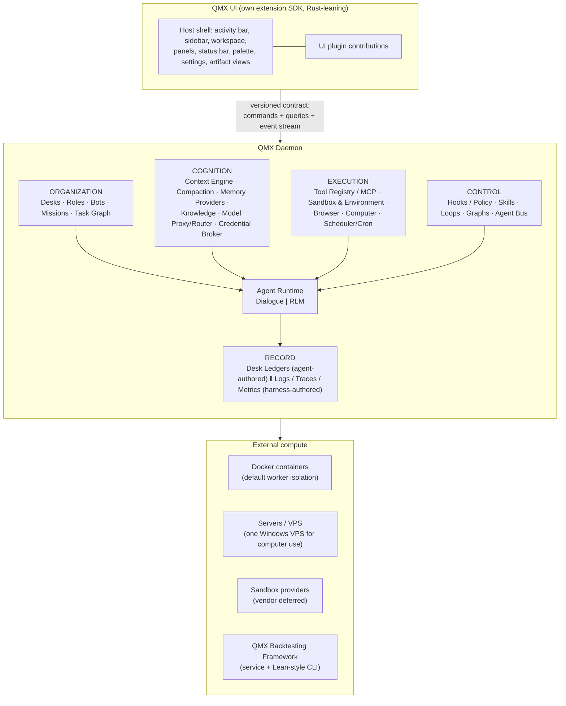

# QMX Agentic-System Transcript — Decision Register

Source: `C:\Users\Mubarak\Downloads\Design-Extensible-Agents.md` (5,083 lines).
Seven operator turns: L7 (2026-08-22 23:24), L999 (23:31), L1896 (2026-08-23 00:00), L3011 (2026-08-28 11:52), L3963 (12:30), L4954 (12:58), L5071 (13:03).
`[OPERATOR]` = Mubarak said it. `[PROPOSED]` = ChatGPT proposed, operator did not object.

---

## 1. Latest decisions

### Framing and build strategy

| # | Topic | Latest decision | Line | Tag |
|---|---|---|---|---|
| 1 | What QMX is | "A distributed quant laboratory/organization in which persistent roles coordinate temporary workers over shared evidence, experiments, artifacts and compute" — not an AI trading app with agents bolted on | L1884, L1932 | [PROPOSED] |
| 2 | Build vs adopt | No third-party agent SDK. QMX owns its runtime contracts bottom-up; Pi, Cordis, Prime, LangGraph, Hermes, bb, OpenResearch become *comparative reference/pattern libraries*, not dependencies | L3011, L3029 | [OPERATOR] |
| 3 | Audience | Built for one specific purpose, not the general public — this is the filter applied to every borrowed idea | L4954 | [OPERATOR] |
| 4 | Deliverable | A **packet of documents** (12 docs + machine-readable manifest, v0.1 produced at L5059), assembled from "decisions and their latest revisions", not a chronological summary | L3011, L3953, L5045 | [OPERATOR] |
| 5 | Reference method | For each reference project, extract the mental model and the failure mode it prevents — "which problem did this project solve unusually well… and does QMX have the same problem?" — never clone | L3968, L4890–4900 | [OPERATOR] |

### Boundaries

| # | Topic | Latest decision | Line | Tag |
|---|---|---|---|---|
| 6 | Daemon vs UI | Architectural law: two separate products joined by a **versioned wire contract** (commands + queries + durable event stream). Closing the UI must not stop an agent; an overnight agent should not know a UI exists | L3963, L4002–4045 | [OPERATOR] |
| 7 | Attached vs detached | "Attached" only means a client is currently viewing a run; it does not change the agent's network identity, so detached and attached agents communicate normally via the daemon | L4043 | [PROPOSED] |
| 8 | SDK split | Two SDKs: the agentic-system/daemon SDK and the UI extension SDK, with their own component system | L3963, L4942 | [OPERATOR] |
| 9 | Languages | Rust for the UI (operator). TypeScript daemon/SDK + Python for RLM/scientific workers proposed but **explicitly not frozen**; define the wire contract before choosing | L3968; L4049–4073 | [OPERATOR] (Rust UI) / [PROPOSED] (rest) |

### Ontology

| # | Topic | Latest decision | Line | Tag |
|---|---|---|---|---|
| 10 | Core ontology | **Desk/Profile → Role → Bot → Agent → Subagent**; Worker = a deployment/execution description, "probably not a fundamental ontology object" | L4087–4094 | [PROPOSED] after [OPERATOR] correction L3963 |
| 11 | Role | Declarative behavioral contract ≈ system-prompt/harness spec: identity, responsibility, instructions, default skills, toolsets, model class, permission/memory/context/review policies. Stateless | L4090, L4113–4130 | [OPERATOR]-forced |
| 12 | Bot | Persistent named organizational actor instantiated from a Role; owns name, memory scope, ledger, missions, routines, preferences, relationships, persistent config | L4091, L4132–4148 | [PROPOSED] |
| 13 | Agent | A running reasoning/execution instance. Dialogue/RLM, attached/detached, autonomous/interactive are *runtime configurations*, not separate identities | L4092, L4150–4164 | [PROPOSED] |
| 14 | Vocabulary ownership | QMX defines Bot/Agent itself because external projects contradict each other (Grok: "a Bot is a single persistent, named agent"; Buzz: "agents are members, not bots") | L3994, L4166 | [PROPOSED] |
| 15 | Five quant roles | Researcher, Trader, Developer, Analyst, PM kept as internal role contracts | L999, L2055 | [OPERATOR] |
| 16 | Profile ≠ Role | Profile = presentation; Role = responsibility. Desks need not map 1:1 to roles, so UX decisions cannot contaminate the agent architecture | L2086–2088 | [PROPOSED] |
| 17 | Persistent vs ephemeral | Roles/Bots persist; specialists are **worker templates spawned on demand**, not permanent staff. Developer normally = one coding worker + one reviewer/test worker | L2015–2045 | [PROPOSED], matching [OPERATOR] L1896 |
| 18 | Desk lead | Operator's "desk leader" becomes the **Role Lead** — a persistent bot that spawns temporary workers and synthesises their results | L2716–2745 | [PROPOSED] |
| 19 | Daily driver | A **QMX Console** with access but not ownership — not a sixth quant role | L2901–2950 | [PROPOSED] |

### Work, control flow, coordination

| # | Topic | Latest decision | Line | Tag |
|---|---|---|---|---|
| 20 | Goal / Mission / Task | Goal = loose intent; **Mission = executable organizational contract**; Task = bounded unit. Missions belong to a Desk/Bot, never a global QMX mission | L3102–3110, L4204–4214 | [OPERATOR] + [PROPOSED] |
| 21 | Mission contract fields | intent, scope, constraints, evidence requirements, available capabilities, success criteria, outputs, verification, budget, escalation, termination criteria | L4223–4234 | [PROPOSED] |
| 22 | Mission Compiler | The operator's meta-prompting idea lives here: it turns a Goal into the rigorous Mission; the Mission Lead Bot then decomposes it | L3117, L4237 | [OPERATOR] |
| 23 | Task graph | LLM proposes the decomposition; the **infrastructure owns the resulting state** — the task graph/Kanban is deterministic persisted state | L3141–3159, L4495 | [PROPOSED] |
| 24 | Four-layer control ontology | **Context** = what an invocation knows; **Harness** = what an agent can be/do; **Loop** = how it repeatedly progresses; **Graph** = how work is organized across actors | L3440–3452, L4468–4478 | [PROPOSED], operator enthusiastic L4954 |
| 25 | Skill vs Loop | Skill = reusable procedure/knowledge (instructions, refs, templates, scripts, hooks, examples); Loop = executable control flow, with the *runtime* owning stopping conditions, budgets and transitions | L4451–4459 | [PROPOSED] |
| 26 | Graph is top | Graph defines topology/dependencies and can be fully deterministic; "LLMs reason inside the architecture; they do not become the architecture" | L4477, L4497 | [PROPOSED] |
| 27 | What to enumerate | Operator's last word: enumerate **graphs**, not loops — "we have to have a few graphs noted down, not loops. I think I was wrong" | L4954 | [OPERATOR] |
| 28 | V1 loops | Explicitly authored in-house. No self-invented loops. Promotion path: trajectory pattern → candidate loop → simulation/evaluation → human/policy review → Loop Registry | L3011, L3481–3523 | [OPERATOR] |
| 29 | Hooks | First-class QMX SDK primitive, modelled on the Claude Agent SDK hook surface; hooks can observe, block, modify tool input or inject context | L3963, L4344–4378 | [OPERATOR] |
| 30 | Determinism preference | Deterministic verifier scripts at `before_task_complete` instead of LLMs judging themselves — "I would prefer this being more deterministic than anything, the entire thing" | L3968, L4380–4400 | [OPERATOR] |
| 31 | Cross-model review | A `ReviewPolicy` (`author_family != reviewer_family`) enforced by hooks — not a special agent architecture. Reviewer realistically Claude or GPT (maybe Kimi); the review must message back / update the task | L4679–4719, L4954 | [PROPOSED] + [OPERATOR] |
| 32 | Orchestration | No omniscient boss agent. **Mission Director (LLM) decides what work happens; a deterministic Scheduler/Dispatcher decides where, when, who, dependencies, leases** | L2664–2713 | [PROPOSED] |
| 33 | Coordination truth | `Ledger = truth, Messages = collaboration`. Parallel workers must not synchronise through chat | L2643–2660 | [PROPOSED] |
| 34 | Agent bus | Daemon-level bus: every durable actor gets a **mailbox**; deliver if running, queue if sleeping, wake if policy says so. Extract *identity + mailbox + durable transport + asynchronous wakeup* from Buzz/Grok — not their implementations. External A2A only as a later adapter | L4501–4552 | [PROPOSED] |

### Record-keeping

| # | Topic | Latest decision | Line | Tag |
|---|---|---|---|---|
| 35 | Ledger | **Agent-authored** institutional notebook — the scientist-with-a-recorder analogy. Compact, intentional, semantically meaningful; the agent decides what is worth recording | L1896, L4251–4285 | [OPERATOR] |
| 36 | Ledger scoping | Per-desk: Research Ledger, Development Ledger, Analysis Ledger, Trading Ledger — with views by Bot/Agent/Mission inside them. No single QMX-wide ledger | L3968, L4274–4283 | [OPERATOR] |
| 37 | Ledger ≠ observability | Ledger, logs, traces and metrics are separate systems with separate databases/contracts. A ledger entry may carry an optional `trace_ref` / `artifact_ref` / `experiment_ref` — a reference, not shared semantics | L3968, L4322–4340 | [OPERATOR] |
| 38 | Telemetry | Logs/traces/metrics/trajectories are **harness-authored**, not agent-controlled; OpenTelemetry-exportable, don't reinvent the standard | L3258, L4288–4320 | [PROPOSED] |
| 39 | Session replay | Any old agent trajectory must be openable and inspectable without continuing the conversation — "session replay becomes an architectural capability, not a chat feature" | L3011, L3228 | [OPERATOR] |
| 40 | Hard separation rule | `MEMORY ≠ LEDGER ≠ KNOWLEDGE ≠ ARTIFACTS ≠ CONTEXT` | L2118–2125 | [PROPOSED] |

### Cognition

| # | Topic | Latest decision | Line | Tag |
|---|---|---|---|---|
| 41 | Two runtimes | **Dialogue Runtime** and **RLM Runtime** are a clean split with different engineering, sharing model router, ledger, tools, permissions, memory, knowledge, artifacts, compute, evaluation and mission state | L3011, L3266–3332 | [OPERATOR] |
| 42 | Session dimensions | Three orthogonal axes — Execution model (Dialogue\|RLM), Attachment (Attached\|Detached), Autonomy (Interactive\|Semi\|Autonomous). No separate "background session" type | L3336–3369 | [PROPOSED] |
| 43 | Memory build | **Not building memory in-house at v1.** QMX SDK defines a `MemoryProvider` contract; Hindsight is the leading candidate, evaluated against Mem0/Honcho | L3968, L4791–4822 | [OPERATOR] |
| 44 | Memory definition | "Selective, durable adaptive state derived from experience that is expected to improve future decisions" — not history, not documents, not every conversation | L2188 | [PROPOSED] |
| 45 | Memory hygiene | No arbitrary agent text becomes trusted memory: candidate → provenance, supporting artifacts, confidence, scope, timestamp, supersedes, validation state → memory. Memories can be superseded/expired/contradicted/strengthened/promoted | L2242–2272 | [PROPOSED] |
| 46 | Four cognitive components | Memory (what survives) / Context Engine (what this invocation sees) / Compaction (how live session state is reduced) / Knowledge (external evidence corpus) — heavily interacting, never the same component. Hermes' memory-provider vs context-engine split is the model | L4755–4771 | [PROPOSED] |
| 47 | Knowledge Base | Yes — but as a **versioned, provenance-carrying evidence corpus** QMX interrogates (Delphi-like), not one giant summarized document | L2300–2332 | [PROPOSED] |
| 48 | RLM's purpose | "RLM exists to turn context from a payload into a programmable environment." It removes the need to put the knowledge base *in* the context window, not the need to possess it | L2344, L2382 | [PROPOSED] |
| 49 | Self-improvement | Gated: agent learns → candidate memory/skill patch → deterministic validation → evaluation → staged change → approval/promotion. No live self-rewriting | L2444–2466, L4832–4846 | [PROPOSED] |
| 50 | Harness learning vs memory vs skill | Three different things: Memory = "we learned X"; Skill = "this is how we now do X"; Harness refinement = "change how this role behaves because X repeatedly worked" | L2434–2442 | [PROPOSED] |

### Models, tools, execution

| # | Topic | Latest decision | Line | Tag |
|---|---|---|---|---|
| 51 | Model router | A deterministic **Model Proxy/Router** = availability-aware load balancer. "Not another LLM deciding where prompts go." OpenCodex is *the* reference — "I'll leave you at Open Codex… it's a perfect fit" | L3011, L3968, L4631–4675, L4954 | [OPERATOR] |
| 52 | Router internals | Model → Deployment → Credential. Deployment registry tracks provider, auth, health, quota, rate-limit state, latency, load, cost, capabilities, context budget, tool support | L3597–3652 | [PROPOSED] |
| 53 | Credential broker | A separate subsystem (OAuth/subscription, API keys, local provider, managed secrets), not buried inside the router; never assume every provider offers OAuth reuse | L3658–3694 | [PROPOSED] |
| 54 | Who decides difficulty | The **harness** requests a ModelClass (REASONING_HIGH, WORKHORSE_GENERAL, CODING_HIGH, FAST_CHEAP); the router only load-balances eligible deployments | L3568–3593 | [PROPOSED] |
| 55 | Context ↔ router | Router returns `ModelCapabilities`; the Context Compiler compiles effective context to that deployment's budget. For RLM agents huge objects become handles, so small-context strong models stay usable | L3698–3735 | [PROPOSED] |
| 56 | Model pool | GPT/Claude frontier + DeepSeek, Qwen, GLM, Kimi, xAI, local/open-weight as workhorses; multi-account routing across paid subscriptions and API keys | L3011, L4645–4652 | [OPERATOR] |
| 57 | Tools | The **Tool Registry** is QMX's internal representation; native, CLI, plugin, MCP, browser, computer and backtest tools all resolve through it | L4556–4578 | [PROPOSED] |
| 58 | MCP status | "MCP is not the tool system. It's part of" — MCP is a tool/adapter inside the tool system, per-desk and per-role, upgradeable later from a settings panel | L4954 | [OPERATOR] |
| 59 | Tool assignment | Per Role/Harness via a Capability Registry, narrowed further by Mission permissions; not "all agents get everything" | L3738–3775 | [PROPOSED] |
| 60 | Capability ladder | CLI/API preferred → Docker/container common → browser when web interaction requires it → computer/desktop exceptional | L3785–3799, L4590–4602 | [PROPOSED] + [OPERATOR] |
| 61 | Computer use | One purchased **Windows VPS** with one dedicated computer-use agent; most work does browser use instead; Jupyter/Colab built into QMX rather than outsourced | L4954 | [OPERATOR] |
| 62 | Sandboxing | Docker container per worker is the default — "I could create each in a Docker container… it's simpler". No shared dirty filesystem/session | L3976 | [OPERATOR] |
| 63 | Execution environments | Define an `ExecutionEnvironment` abstraction (local, docker, remote-container, remote-host, browser, desktop) **before** picking a vendor | L4604–4627 | [PROPOSED] |
| 64 | Compute fabric | Agents declare requirements (CPU/RAM/GPU/capability/timeout); a Compute Router places the job. Agents never know Modal, Kubernetes or which machine ran it | L2482–2527 | [PROPOSED] |
| 65 | Backtesting | Named the **QMX Backtesting Framework**. `agent → QMX SDK → Backtesting Service → Backtesting Framework → Compute Fabric`, with a Lean-CLI-style `qmx backtest run …` as one thin surface over the same contract | L3011, L3871–3901 | [OPERATOR] |
| 66 | Experiments | Immutable, reproducible snapshots. Git/worktree only when *code* changes; a content-addressed `ExperimentSpec` when only parameters/config change | L2570–2617 | [PROPOSED] |

### Plugins and UI

| # | Topic | Latest decision | Line | Tag |
|---|---|---|---|---|
| 67 | Plugin shape | One logical plugin spans daemon / worker / ui / skills-graphs-loops parts, which communicate **only over the daemon contract**, never shared process memory | L4990–5011 | [PROPOSED] |
| 68 | UI model | A stable host shell owns navigation, window lifecycle, layout persistence, permissions, updating and compatibility. Plugins only contribute into named extension points: Activity Bar, Sidebar, Primary Workspace/Editor, Secondary Panel, Bottom Panel, Status Bar, Command Palette, Settings, Notifications, Artifact Views, Dashboard Widgets | L4960–4988 | [PROPOSED] |
| 69 | UI upgradability | Settings/Plugin Store → Install/Enable/Upgrade → Daemon Plugin Manager → manifest validation, compatibility, permissions, dependencies, migrations → activate → publish Extension Catalog → UI adds/removes contribution points. (Directly answers the operator's stated fear) | L5015–5035 | [PROPOSED] |
| 70 | Rust UI consequence | Avoid arbitrary native Rust `dylib` UI plugins; investigate Tauri host + web components, Rust host + WASM/component model, or declarative plugin UI with only trusted compiled native views | L5037 | [PROPOSED] |
| 71 | UI character | Should feel like a trading/research terminal, not a generic agent dashboard, and must show live remote agent activity — status, current task, tool calls, outputs, progress, failures, attach/observe | L5071, L5082–5084 | [OPERATOR] |
| 72 | In-house primitives | Existing QMX plugin concepts (e.g. the **threading node**) must be accommodated; the plugin architecture cannot assume a zero start | L5071, L5081 | [OPERATOR] |
| 73 | Naming rule | Don't blanket-prefix with "QMX" — name by desk. "If it's research, it's research event ledger… I don't like QMX because QMX is assuming the entire platform" | L3968 | [OPERATOR] |

---

## 2. Superseded ideas

| Topic | Old | New | Lines |
|---|---|---|---|
| Memory's home | Memory is an extension (`qmx-memory`) listening to events | → Memory is a *kernel-level service contract* with pluggable implementations | L725–763 → L1178–1218 |
| Memory's home (again) | Kernel-level QMX-owned memory service | → Not built in-house at all at v1; an external `MemoryProvider` contract with Hindsight/Mem0 behind it | L1178 → L3968, L4791–4822 |
| Ledger shape | One append-only **QMX Event Ledger** substrate with per-bot/role/mission *projections* | → Dropped. Per-desk, agent-authored ledgers | L3169–3204 → L3968, L4245–4283 |
| Ledger vs tracing | "Tracing and Ledger should connect" — one trace/span model over the ledger | → Hard separation, separate contracts and databases, optional refs only | L3236–3263 → L4322–4340 |
| Role | Role = the persistent organizational identity | → then Role = a capability/responsibility *specification* with Bot holding identity | L1469–1477 → L3059–3086 |
| Role (final) | Role as a stateful thing | → Role = declarative behavioral contract ≈ system prompt; Bot holds all durable state | L3059 → L3963 (operator objection) → L4090–4130 |
| Sub-agent roster | Permanent named specialists per role (Paper Scout, YouTube Extractor, Hypothesis Critic, Microstructure Specialist, Literature Synthesizer; backend coder, test agent, architecture reviewer, debugging agent) | → Worker *templates* spawned on demand; Developer = coding worker + reviewer/test worker, sometimes just a coding worker | L1484–1505 → L1896 (operator: "overcooked") → L2011–2045 |
| Agent kernel | Pi as the kernel; QMX builds on `pi-agent-core` + `pi-ai`, with provider adapters normalising Pi/Codex/Claude/ACP into a QMX Agent Protocol | → QMX owns its runtime contracts bottom-up; Pi is reference material for the minimal-loop philosophy only | L31–72, L191–216, L652–689 → L3029, L4876 |
| Coordination vocabulary | Skill = HOW, **Workflow** = WHAT SEQUENCE, Routine = WHEN, Harness = WHO | → Skill / **Loop** (control cycle) / **Graph** (topology) / Harness; Routine survives only as scheduling | L556–580, L1794–1824 → L3440–3452, L4468–4478 |
| Parallel-agent sync | Implicitly a memory problem | → It is the **work ledger / operational state** problem; "make important work state exist independently of the agent" | L1170ff → L2092–2178 |
| Memory model | Eight-type kernel taxonomy (working, episodic, semantic, procedural, decision, artifact, relationship, organizational) | → A single narrow definition plus provenance-gated candidates, then externalised to a provider | L1232–1265 → L2188–2272 → L4812 |
| Compute vendors | Pre-picked: Modal for compute, Cloudflare Browser Run for browser-heavy work, Daytona/E2B for desktop | → Deferred. Define the environment contract first; operator rejects the famous/expensive vendors outright | L3803–3825 → L3976, L4625–4627 |
| Shared computer | Grok-style shared account-level cloud computer *and* ephemeral sandboxes ("Both") | → Docker per worker; shared/persistent computer only for the single dedicated computer-use agent | L3833–3867 → L3976, L4954 |
| Overnight work | "RLM + detached + autonomous *is* your overnight research job" | → Operator rejects the exclusivity: an overnight job can be dialogue-shaped, like a background subagent | L3356 → L3963 |
| Desk↔role mapping | Five UI profiles mirroring the five roles | → Profiles are presentation and may collapse (operator floated two desks: research+dev, trading+PM) | L1971–1993 → L1896, L2065–2089 |
| Backtesting plugin | Operator's first reaction: "Backtesting plugin doesn't add up" | → Same message, reversed: "Okay, it actually does… which means it can have multiple agents running at a go" | L5071 |

---

## 3. Unresolved disagreements / open questions

1. **Daemon language.** Operator called Python vs TypeScript "the make or break" (L3963). ChatGPT proposed Rust UI / TypeScript daemon / Python RLM workers but marked it "not frozen" (L4053–4073). Options on the table: TS daemon (because Pi, Prime, bb, Cordis, OpenCodex are TS and the Claude TS SDK has more lifecycle hooks) vs Python (RLM, scientific libraries). **Undecided.**
2. **Rust UI extension technology.** If "Rust UI" means genuinely native rendering, hot-installable plugins hit ABI/versioning problems. Three options listed, none chosen: Rust/Tauri host + web-component plugins; Rust host + WASM/component-model plugins; mostly declarative plugin UI with only trusted compiled native views. Arbitrary native `dylib` plugins ruled out (L4075, L5037, L5063).
3. **How many desks.** Five internal roles are settled; the desk consolidation is not. Options: five desks; three (Research=Researcher+Analyst, Build=Developer+PM, Trading=Trader) as proposed at L2067–2076; two as the operator floated ("research and development, trading and PM", L1896). **Never settled.**
4. **Can graphs be plugins?** Operator asked directly — "do you think it's a possibility that we can design graphs as plugins in here? … I would prefer it" (L4954). Never answered.
5. **Message delivery when the main machine is off for days.** Operator posed it and explicitly deferred the answer: "How do you consider fixing or implementing that? … You don't need to answer me, but we need to consider all variables here" (L4954).
6. **Agent-to-agent transport.** Mailbox + durable transport agreed in principle; the actual transport is open. Buzz/Nostr explicitly *not* adopted ("Buzz, I did not agree to use Buzz by the way. I just told you to look into it", L4954); external A2A protocols judged possibly unnecessary internally (L4552); listed as unresolved at L5063.
7. **Memory backend.** Hindsight favoured, Mem0 "actually very cool", Honcho rejected on fit ("Honcho doesn't fit in", L4954). Letta cited only for the memory-block pattern. Choice deferred to evaluation behind the provider contract (L4818, L5063).
8. **Sandbox / compute vendor.** Modal, Daytona, E2B, Cloudflare Browser Run named; operator rejects them as defaults on cost and fit and says he will "first look for what I want" (L3976). Explicitly unresolved (L4625, L5063).
9. **Graph engine.** Named as unresolved in the packet handover (L5063). No candidate discussed.
10. **Is a knowledge base needed at all?** Operator's doubt: "is a knowledge base even needed? … RLM kind of distinguishes and makes it better without the need for actual knowledge bases so I think we might need or we might not need them, I don't know" (L1896). ChatGPT answered yes (L2300–2374); the operator never explicitly ratified it.
11. **Loop vs Skill.** Operator: "how do loops differ from skills? because it seems like I was wrong… I don't need you to answer that" (L3963). ChatGPT answered anyway at L4404–4459 and the operator later reframed the whole thing around graphs instead (L4954). The boundary is stated but not operator-ratified.
12. **Ledger granularity.** Operator asked for a ledger "at a worker level… and also at the role level" and "every agent has its own ledger" (L3011); the final answer is per-**desk** ledgers with views by Bot/Agent/Mission (L4283). Close, but not literally what he asked for.
13. **Hooks + ledger fusion.** Operator's last idea: "the ledger is something we can adopt with hooks, and it can be very good. Even task completed and all that, to-do lists, keeping agents working" (L4954). Never worked through.
14. **In-house vs plugin hooks; agents writing hooks for missions.** Raised at L4954, unexamined.
15. **Browser stack.** Operator wants to reverse-engineer **Egolite** for his use case (L3976) and earlier mentioned a non-Chrome-devtools CLI approach (L1896); ChatGPT proposed CDP/Playwright/Cloudflare (L3807). Unreconciled.
16. **Which SDK to base on.** Operator's answer is "none — best-of-breed per subsystem": Codex for computer use, Claude Code for hooks and subagents, Hermes for skills and MCP, Codex+Hermes for browser use (L4954). The composition rule for stitching those together is not defined.
17. **UI architecture generally.** Deferred to a dedicated session ("that is a whole other session", L3963; L4075). The UI "contains more" than the agentic system.
18. **Hermes prompt-assembly / compaction study.** Explicitly pushed to the later architecture agent rather than resolved here (L4954, L4783–4787).
19. **Threading node and other in-house plugin primitives.** Named but unspecified (L5071, L5081).

---

## 4. Explicit operator constraints (his words)

**Build and scope**

- L3011: "we are not using any SDK. In fact, the idea was we break this down through and through… we have our own custom SDK in-house."
- L4954: "We are building for a specific purpose, we're not building for the general public. Most of these harnesses are building for the general public. That's why they excel in some areas and other areas they don't."
- L3968: "we are not going to clone blindly. No, we are going to extract."
- L3976: "Once again, we are picking things we need, not everything. That's what a reference is… from Grokbot pick this pick that, will leave the rest."
- L4954: "you have to tell the agent, or in the packet, you have to specify… what are the core things we need and where to pick them from."
- L1896: "seems like there are so many ideas we kind of need to converge and build with intention. So we need to agree on what is the intention behind almost everything we are trying to build."

**Determinism**

- L3968: "most of this is more of scripts than LLMs… I would prefer this being more deterministic than anything, the entire thing. Because I know how messy agents can go."
- L3963: "I think it's better we have agents write deterministic scripts most likely that we can pass through instead of having agents iterate their own work or review their own work to produce a mess."
- L3011: "at the start, we have our own in-house loops and we don't let the harness, you know, engineer itself into loops. We do that eventually because this is the first stable version."
- L3011: "A model router's job is simply to balance the load, simple as that."

**Ledger / observability**

- L3968: "The reason why I'm refusing the QMX event ledger… you are not going to tell me that you are going to have workers, let's say, across six different rows… and they are all going to be appending to one ledger."
- L3968: "don't call it QMX Event Ledger. Give it a name. If it's research, it's research event ledger… I don't like QMX because QMX is assuming the entire platform."
- L3968: "there is a difference between a ledger and observability and logging. There is a huge difference… I believe a ledger is self-appended by the agent."
- L3011: "let's make it that every agent has its own ledger… think of this in terms of traces, observability and traces, and agent evaluation."
- L1896: "we need to have a ledger, it's more like how these scientists record themselves… while carrying out experiments."

**Architecture boundaries**

- L3963: "we need to be able to split between the daemon and the UI because it seems like we need to really have a clear line… I don't think they are the same."
- L3011: "Those two, in my opinion, need very different types of engineering, and I believe it's a clean split." (dialogue session vs RLM session)
- L3963: "the role is kind of like the system prompt, unless I'm wrong, but it is kinda like that." (forced the Role/Bot/Agent re-split)
- L3966: "we might have to cleanly split what a bot is and what an agent is."
- L4954: "MCP is not the tool system. It's not, it's not, it's part of."

**Compute / sandboxing**

- L3976: "there is no way in hell I want 40 research workers, you know, using one computer. That is nonsense. It's very bogus… I could create each a Docker container."
- L3976: "They are bloody expensive… I don't think I'm going to use any of those." (Modal / Daytona / E2B)
- L3976: "We only bring in computer use or something when the task perhaps genuinely requires visual things. For example, looking at charts."
- L1896: "we can't have one laptop running everything."
- L3976: "the main use case I already told you was for backtesting" — workspaces exist for backtesting first.
- L4954: "I can purchase one VPS that is a Windows VPS… and we can have one dedicated agent that has access to that computer."

**Overcooking**

- L1896: "for developer I think we overcooked. I feel like yeah they are viable but those guys are overcooked, there are so many agents… seriously like two total agents I think are enough under development."
- L1896: "maybe the one I might be a bit critic on is the YouTube extractor."

**Vocabulary rulings**

- L3011: "when you write the packets, just call it the backtesting framework" → **QMX Backtesting Framework** (L3875).
- L3968: desk-scoped ledger naming (above); no blanket "QMX" prefix.
- L1896: "I was thinking of them like desks or profiles because if you look at something like the Hermes agent, it has something called profiles."
- L1896: "I've been calling them desks; for you I'm calling them roles."
- L3011: "a mission and a task are kind of the same, but a mission is broader, a task is less"; "a goal is a bit too broad."
- L3963: "it's components, yeah. It's called components, I recall it's components, not a library" (UI).
- L4954: "Hammes provides mental models. Let me be clear there. Mental models."
- L4954: "Buzz, I did not agree to use Buzz by the way. I just told you to look into it."
- L4954: "MCP is a tool… it's just that now we need to know that this desk or this role has these tools."

**Other**

- L7: "I like that fact that it is extensible but I want to create my own harnesses and ask, as well as also have extensibility in the ui."
- L999: "qmx is to have agents that help me work as if they are the five types of quant, ie researcher, trader, dev, pm and analyst."
- L1896: "the use case I wanted most is the one of them working without me. Seriously that right there is something I need."
- L1896: "what's the difference between memory and the knowledge base here, because I believe those two should be very very different."
- L3968: "I think we are going to be using Rust for the UI."
- L5071: "this is more going to look more like a trading terminal."
- L5071: "I also want to be able to see what's going on in the remote agents."

---

## 5. Named reference projects

| Project | URL in transcript | Borrow | Reject / limit |
|---|---|---|---|
| **Pi** (earendil-works) | github.com/earendil-works/pi (L39, L671); extensions doc L343 | Minimal agent loop, "small core, everything else composable", sessions, embedding, daemon-level extensibility (L3963), TUI/extension precedent | Don't fork it or make it the application (L31); don't embed the coding CLI everywhere (L689); ultimately not a dependency (L3029) |
| **bb** (`get-bb/bb`) | github.com/get-bb/bb (L7) | Central server / host daemon / web / CLI split; canonical thread state; provider adapters (Codex, Claude Code, Pi, ACP); three-part `server/app/host` plugins; plugin routes, tabs, panel actions, sidebar accessories; UI contribution model (L160–188, L269–282, L408–420, L4880) | "I wouldn't clone bb" (L991); its full-trust plugin model (L886) |
| **Cordis / DeepSeek Harness** | deepseek-harness.github.io/…/cordis-primer (L999) | Service context + dependency injection (`ctx.tools`, `ctx.llm`, …), typed event modes, **reversible effects** so unloading cleanly removes registrations, isolated service instances, live re-composition/HMR (L1041–1053, L4879); UI extensibility (L3963) | Not a competitor to Pi — different layer (L1073–1079) |
| **Prime Agent** | github.com/PrimeIntellect-ai/prime-agent (L999) | **RLM** (persistent IPython control env + programmatic recursive subagent calls), **Continual Harness** (evidence-backed refinement of supplemental state, snapshots/rollback, `/refine` never rewrites the immutable base prompt), daemon/worker/kernel separation, agent-to-agent steering (L1283–1352, L1716, L4881) | Unrestricted self-modification; QMX gates promotion harder (L1334–1350) |
| **Grok Bot** (xAI) | docs.x.ai/grok-bot (L1437, L1441, L1718, L1792, L3835, L4540) | Persistent named teammate model; the rule for when to create a new Bot (stable difference in goal, ownership, tools, working style, approval boundary or schedule); routines; asynchronous bot-to-bot handoffs with wakeup; team UX (L4882) | The shared account-level cloud computer / isolation model (L3837–3855, L3976); "Grokbot was designed for everyone" (L3976) |
| **Hermes Agent** (Nous Research) | hermes-agent.nousresearch.com/docs/… context-engine-plugin, memory-provider-plugin, tools-runtime, skills, prompt-assembly, context-compression (L3972–3974, L4424, L4576, L4751, L4779, L4781) | Integrated harness mental model; **profiles**; tool/toolset registry that checks runtime availability before schemas reach the model; MCP; **memory provider separate from context engine** (incl. `on_pre_compress`); prompt assembly with cache-stable prefix + volatile overlays; in-loop and gateway compression with the full local transcript retained; skills with progressive disclosure and staged/approved self-authoring; plugins; cron; browser/computer (L4725–4830, L4877) | Not the base SDK — "Hermes provides mental models" only (L4954); not best at computer use (L4954); "there are things that they did that are not so good" (L4954) |
| **Claude Code / Claude Agent SDK** | code.claude.com/docs/en/agent-sdk/hooks (L3988, L4069, L4348, L4862) | **Hooks**: PreToolUse, PostToolUse, tool failure, prompt submission, subagent start/stop, pre-compaction, permissions, task completion, worktree create/remove — able to observe, block, modify tool input, inject context. **Primary subagent reference** for lifecycle clarity and permission boundaries. TS-SDK-only hooks: SessionStart, SessionEnd, TaskCompleted, WorktreeCreate, WorktreeRemove, TeammateIdle, PostToolBatch. Also `/goal`-style keep-working commands (L4954) | — |
| **OpenResearch CLI** (alphaXiv) | github.com/alphaXiv/openresearch-cli (L1894) | Parallel agents in isolated worktrees; immutable experiment snapshots with explicit lineage; compute backends (local, SSH, Slurm, Kubernetes, Modal, HuggingFace, Ray); job handles that let a detached supervisor **reattach**; jobs carrying archived source rather than the live tree (L1904, L2474–2478, L4887) | Git-branch-per-experiment for every parameter mutation — "at QMX scale, that can become absurd" (L2597–2617) |
| **Synthetic Sciences — OpenScience** | github.com/synthetic-sciences (L1894) | Research loop: literature → hypothesis → code → experiment → analysis → write-up; bounded **Explore / Execute / Review** delegation instead of permanent specialists; separation of agent runtime, tools, skills, providers, workspace UI; durable sessions/artifacts/provenance (L1910, L2751–2770, L4888) | Their "one adaptive Research agent" product decision — QMX has genuinely distinct roles (L2772) |
| **Synthetic Sciences — Delphi** | (same org, L1910, L2330) | The model for **QMX Knowledge**: an agent context engine over code repos, papers and datasets with reproducible source snapshots and provenance-aware retrieval. Explicitly *not* a worker | Not a memory system; not Mem0-style personal memory (L2332) |
| **Lean CLI** (QuantConnect) | named L1896 | The CLI-as-stable-boundary idea for the backtesting framework: give agents a CLI + framework instead of one monolithic backtest pipeline (L2531–2566, L3871–3899) | — |
| **OpenCodex** | github.com/lidge-jun/opencodex (L3970) | The model-proxy reference: local provider proxy, provider translation, **account pools / multi-account routing**, quota-aware routing, thread/account affinity, cooldown/failover, OAuth/provider auth, virtual "combos" that fail over or load-balance (L4635, L4885). Operator: "it's the only reference I have, and it's a perfect fit" (L4954) | — |
| **Hindsight** (Vectorize) | hindsight.vectorize.io (L3971, L4808) | **retain / recall / reflect** semantics — recall = retrieval, reflect = LLM-backed analysis; memory banks scoped per agent or deliberately shared. Candidate `MemoryProvider` implementation | Not "QMX memory"; QMX's SDK owns the contract (L4820) |
| **Mem0** | docs.mem0.ai/…/graph-memory (L1228) | Graph memory: entity/relationship structure alongside semantic retrieval, useful once people, strategies, experiments and decisions interact. Candidate provider | Not the whole memory model (L1222) |
| **Letta** | docs.letta.com/tutorials/attaching-detaching-blocks (L1226) | Always-visible memory blocks vs larger archival memory; blocks attachable/detachable and shareable between agents | Pattern only |
| **Honcho** | named L4818, L4954 | — | Rejected: "I don't like Honcho so much because Honcho doesn't fit in" (L4954) |
| **Buzz** | named L3966, L3992, L4542 | Durable agent identity; communication on a relay independent of any client; humans, agents, workflows and code events as signed events with their own identities; asynchronous membership. Extract **identity + mailbox + durable transport + async wakeup** | Nostr itself; `buzz-cli`/ACP surface; and adoption at all — "I did not agree to use Buzz" (L4954) |
| **Eve** (Vercel) | vercel.com/eve (L3963, L4178) | "**An agent is a directory**" packaging: instructions in Markdown, skills in their own directory, tools in TypeScript, runtime config alongside | "I don't want Eve's architecture" (L4180) |
| **VS Code** | named L841, L957 | Declarative UI contribution points + extension manifests; extension-graph resolution thinking (L351–399) | — |
| **Codex / Codex CLI** | named L71, L638, L4954 | Per operator: best harness for **computer use**, and (with Hermes) browser use; also the `/goal` keep-working command | Was an adapter target in the abandoned provider-bridge design (L602) |
| **Greptile** | named L3963 | Cross-model review pattern: a Claude model reviews GPT-written code and vice versa → `ReviewPolicy` (L4679–4719) | — |
| **Langfuse** | named L3968 | Operator's proof that observability/tracing is a *different* product category from a ledger | — |
| **LangChain / LangGraph / LangMem / deep agents** | named L3011, L3379, L4954 | Comparative pattern library for SDK surface and memory | "I wouldn't clone LangChain" (L3377) |
| **Mastra** | named L3011, L3968, L4954 | Comparative reference for SDK surfaces and observability | Same — reference only |
| **LiteLLM** | github.com/sensuslab/litellm-base routing docs (L3652) | Router reliability primitives: health/cooldown tracking, retries, fallbacks, load balancing across deployments | "We're just implementing those concepts ourselves" (L3654) |
| **OpenTelemetry** | named L3258, L3976 | Export standard for traces — don't reinvent it | Ledger must not be folded into it (L4322) |
| **Cloudflare Browser Run** | developers.cloudflare.com/browser-run (L3807) | CDP/Puppeteer/Playwright control, browser sessions, live inspection, human takeover, session recordings, 120 concurrent browsers | Deferred/deprioritised (L3976, L4625) |
| **Modal** | modal.com/docs/examples/computer_use_vnc (L3809) | Sandboxes for compute/GPU/scientific workloads; browser-use over VNC | Operator: famous, expensive, not built for this use case (L3976) |
| **Daytona / E2B** | daytona.io/docs/en/computer-use (L3811); E2B L1896, L3811 | Programmatic mouse/keyboard/screenshot/recording/VNC on Linux and Windows sandboxes; Desktop Sandbox, large-scale concurrency | Same rejection (L3976) |
| **Egolite** | named L3976 | Browser-use product the operator wants to reverse-engineer for QMX's use case | — |
| **IBM "loop engineering"** | ibm.com/think/topics/loop-engineering (L3434) | Definition: designing act–observe–decide iterations toward a goal, with verification, stopping conditions, escalation | — |
| **Graph-engineering survey** | arxiv.org/abs/2608.21156 (L3436) | Explicit dynamic graphs over agents, tasks and system states for heterogeneous expertise, parallelism, dependencies, persistent execution state | — |
| **Ralph Wiggum loop** | named L4954 | The "keep the agent working" idea, alongside `/goal` | — |
| **Hermes profiles / desks origin** | L1896 | Where the operator's "desk/profile" vocabulary came from | — |
| **DeepSeek, Qwen, GLM, Kimi, xAI, GPT, Claude** | L3011, L4645–4652 | The router's deployment pool; DeepSeek/Qwen as workhorses, GPT/Claude as frontier leaders and reviewers | Workhorses are "not frontier level" (L3011) |

---

## 6. QMX-specific domain requirements

**The five roles and what they own** (L1539–1670)

- **Researcher** — ideas, papers, videos, market research, strategy hypotheses, source quality, research artifacts. Memory emphasis: semantic + source + hypothesis + procedural. UI: research browser, source library, hypothesis graph, notes, evidence viewer.
- **Trader** — live market state, books, positions, strategy deployment, execution supervision, risk interaction. Memory: episodic + recent-market + execution lessons. **Constraint: "deterministic systems should still retain authority over things such as hard risk limits"** (L1590).
- **Developer** — QMX codebase, architecture, implementation, tests, infrastructure, technical debt. Pi/Codex-style harness.
- **Analyst** — experiments, backtests, performance, statistical analysis, comparisons, postmortems. "Heavy RLM/Python environment" (L1642).
- **PM** — goals, projects, priorities, dependencies, handoffs, decisions, progress, role coordination; "what are we doing, why, who owns it, what is blocked and what should happen next" (L1667).

**Quant workflow primitives**

- The core loop: **Hypothesis → Test → Learn → Mutate → Gate** (L570–580, L2881–2895), also listed as a v1 authored loop (L3500).
- **Strategy component mutation** (operator's idea, L1896): normalize extracted mechanisms as typed objects — `EntryMechanism`, `ExitMechanism`, `Filter`, `SessionRule`, `PositionRule`, `InvalidationRule` — then recombine (A+B+C, A+D+C, …) with traceable provenance down to "Paper A, section 3" / "Paper B, equation 7" (L2832–2879).
- **Typed organizational artifacts** passed between roles instead of chat: Hypothesis, Strategy, Experiment, Finding, Decision, Task, Incident, Backtest, Dataset, Report, Risk, Deployment, Position, Handoff (L1757–1772). The Researcher emits `Hypothesis HYP-482`; the Analyst receives the artifact (L1781).
- **Experiment reproducibility freeze list** (L2576–2591): strategy version, code version, data snapshot, instrument, period, spread model, commission model, slippage assumptions, parameters, seed, backtest engine, harness version, model version, environment.
- **Backtesting stack**: Monte Carlo, walk-forward, robustness reports, replay, run comparison (L147, L505–510, L1817). Example routine: "every Sunday after market close" (L1819).
- **Market data abstraction** `ctx.market` over Dukascopy, cTrader, DXfeed, a QMX historical store, a replay feed and a synthetic test feed — the harness asks for `ctx.market`, not a vendor (L1147–1164).
- **Knowledge corpus for a topic like scalping**: papers, books, video transcripts, web research, strategy descriptions, code repositories, broker documentation, market microstructure literature, QMX-generated reports — each keeping provenance (L2314–2326).
- **Domain memory example**: "When testing session-conditioned strategies, use session-preserving resampling" — an Analyst lesson that, if repeatedly validated, becomes a Backtesting Skill (L2222–2234). Ledger example uses broker-aligned spread conditions (L4261).
- **Analyst RLM handles**: experiments, backtests, trades, strategies, papers, market_data — manipulated programmatically rather than pasted into a prompt; the motivating load is "3 years of backtest results, 800 strategy variants, 40 Monte Carlo reports, market regime classifications, trade logs, parameter distributions" (L1364–1404, L2386–2404).
- **Ledger as lab notebook**: MISSION → TASK → worker assignment → HYP → EXP with commit, dataset snapshot, configuration, seed, compute backend and result (L2135–2164).

**Compute and scale**

- Motivation is concrete: one laptop cannot run parallel scraping, video processing and mass backtesting (L1896). "The OG idea for actually having workspaces is basically to use them for backtesting" (L3976).
- Distributed workers across local PC / research node / trading node, each running agents, crawlers, market-data and execution work (L701–719).
- Overnight autonomy is a first-class requirement: "I want to be away for maybe the night and the agents continue working" (L1896).

**Domain UI**

- Sidebar trees per domain plugin: `qmx-market-research` (News, Macro, Sentiment, Sources, Research agents), `qmx-strategy-lab` (Hypotheses, Experiments, Mutations, Gate results), `qmx-backtesting` (Runs, Replay, Monte Carlo, Walk Forward, Reports) — the shell knows none of these concepts (L465–513).
- The whole thing should read as a trading/research terminal; must show live remote agent activity (L5071–5084).
- Existing in-house plugin primitives such as the **threading node** must be accommodated (L5071, L5081).
- Jupyter notebooks / Google Colab should be built into QMX rather than outsourced (L4954).

---

## 7. The final converged architecture

### Final ontology vocabulary (L4087–4094, L4468–4478, L4755–4771)

| Term | Meaning |
|---|---|
| **Desk / Profile** | Organizational + UI workspace (presentation). Research, Trading, Dev, Analysis, PM — or fewer |
| **Role** | Declarative behavioral contract ≈ system prompt: identity, instructions, default skills, toolsets, model class, permission/memory/context/review policy |
| **Bot** | Persistent named organizational actor instantiated from a Role; holds durable state, memory scope, ledger, missions, routines, relationships |
| **Agent** | A running reasoning/execution instance |
| **Subagent** | An Agent spawned/delegated by another Agent |
| **Worker** | A deployment/execution description for an Agent doing bounded work — deliberately *not* a fundamental ontology object |
| **Harness** | What this agent can be and do |
| **Goal → Mission → Task** | Loose intent → executable organizational contract owned by a Desk/Bot → bounded unit inside it |
| **Task Graph** | Deterministic persisted decomposition (Kanban) |
| **Loop** | Executable control cycle, with runtime-owned stopping conditions and budgets |
| **Graph** | Topology and dependencies across actors and work |
| **Skill** | Reusable procedure/knowledge (instructions, refs, templates, scripts, hooks, examples) |
| **Hook** | Deterministic lifecycle interception point |
| **Ledger** | Agent-authored institutional record, scoped per desk |
| **Logs / Traces / Metrics** | Harness-authored telemetry, OTel-exportable — a separate system |
| **Memory** | Selective, durable adaptive state from experience (provider-backed) |
| **Knowledge** | External, versioned, provenance-carrying evidence corpus |
| **Context Engine** | What this invocation sees |
| **Compaction** | How live session state is reduced |
| **Artifact** | Durable output |
| **Experiment** | A frozen, reproducible run |
| **Compute Fabric / ExecutionEnvironment** | Where work actually runs |
| **RLM** | Programmatic, recursive operation over state larger than the context window |

### Compact outline of the final shape (L4908–4940, L4960–5011)

- **QMX UI** — own extension SDK, own component system, own architecture. Host shell owns navigation, lifecycle, layout, permissions, updating, compatibility. Plugins contribute into named extension points only. Consumes daemon capabilities; contains no agent logic.
- **Strict versioned protocol** — commands, queries and a durable event stream. Language-neutral.
- **QMX Daemon**
  - Bot Runtime (durable identities) and Agent Runtime with two implementations: **Dialogue** and **RLM**
  - Mission / Task Graph (deterministic persisted state)
  - Agent Bus (mailboxes, durable transport, async wakeup)
  - Hooks / Policy (deterministic gates, ReviewPolicy)
  - Skills / Loops (Loop Registry) and Graphs
  - Context Engine + Compaction
  - Memory Providers (contract in-house, implementation external)
  - Knowledge (versioned evidence corpus, Delphi-shaped)
  - Model Proxy / Router → Deployment Registry → Credential Broker
  - Tool Registry (native / CLI / plugin / MCP / browser / computer / backtest) + Capability Registry
  - Scheduler / Cron
  - Environment & Sandbox Runtime
  - Desk Ledgers
  - Observability / Evals
- **External compute** — Docker, servers, sandbox providers, and the **QMX Backtesting Framework**.
- **Plugins** are logical bundles spanning daemon + worker + UI + skills/graphs/loops, communicating only over the daemon contract.

---

## 8. Where the transcript looks overcooked

Honest read. Each of these entered because a reference product has it, not because the quant workflow demanded it.

1. **QMX Agent Protocol + provider adapters for Pi / Codex / Claude / ACP** (L191–216, L586–648) — copied from bb's `agent-runtime`. Dead weight once the operator decided QMX owns its runtime bottom-up (L3029); the only piece that survives usefully is the model proxy. Nothing in the transcript says QMX needs to host foreign agent runtimes.
2. **Extension Trust Levels and a QMX extension marketplace** (L852–888) — VS Code/app-store inheritance. A single-operator system with no third-party publishers has no untrusted extension problem; it was floated and never returned to.
3. **Extension capability contracts with `provides` / `requires` / `optional` graph resolution** ("VS Code extensions + Linux packages + agent skills", L807–848) — a package-manager dependency solver for a plugin set that will realistically number in single digits.
4. **The full VS Code UI contribution API** — twelve `qmx.ui.register*` calls (L351–363) specified before a single screen exists, and before the UI session the operator himself deferred (L3963).
5. **The three-sided plugin (`runtime.ts` / `worker.ts` / `ui.tsx`)** (L269–338) — explicitly "one idea from bb I would almost directly copy". The worker side is real for backtesting; the trio as a mandatory shape is bb's structure, not a QMX requirement.
6. **The 20-service `ctx.*` fabric** (L1099–1120) — Cordis fashion. Listing `ctx.goals`, `ctx.policy`, `ctx.scheduler`, `ctx.workspace`, `ctx.quant`, `ctx.market`, `ctx.research`, `ctx.backtest` as injectable services is architecture-by-enumeration; most have no described consumer.
7. **The eight-type memory taxonomy** (L1232–1265) — assembled from Letta and Mem0 literature. It was then narrowed (L2188) and finally handed to an external provider (L4812), which means the taxonomy was never load-bearing.
8. **Per-role "brain configurations" with five distinct UI suites** (L1535–1670) — five roles × dedicated memory emphasis × dedicated UI. The operator had already proposed collapsing to two desks (L1896), so most of this is staffing fiction.
9. **Named permanent specialists** — Paper Scout, YouTube Extractor, Hypothesis Critic, Market Microstructure Specialist, Literature Synthesizer, backend coder, test agent, architecture reviewer, debugging agent (L1484–1505). The operator flagged this himself: "for developer I think we overcooked" (L1896). ChatGPT conceded (L2011) but the same instinct keeps returning.
10. **Five overlapping control abstractions — Harness, Skill, Loop, Graph, Hook** (L3430–3541, L4404–4479) — the operator asked point-blank "how do loops differ from skills" (L3963) and then said only graphs need enumerating (L4954). At least one of Loop or Skill is likely to collapse into the other in practice.
11. **The 11-field Mission contract plus a Mission Compiler plus a Mission Director plus a Role Lead plus a Scheduler** (L3119–3136, L2664–2745, L4223–4237) — five coordination layers above a workload that today is "research a topic and run backtests". Real for a 30-worker overnight run; heavy ceremony for the first version.
12. **Continual Harness self-refinement** (L1281–1354, L4826–4848) — inherited from Prime Agent. There is no running system producing trajectories yet, so the promotion pipeline (candidate → validation → evaluation → staging → approval) is infrastructure for evidence that does not exist.
13. **The 14-type organizational artifact catalogue** (L1757–1772) — Incident, Deployment, Position, Handoff, Risk etc. modelled as first-class types before any of them has a producer or consumer. Hypothesis / Experiment / Backtest / Report are clearly real; the rest is org-chart cosplay.
14. **The "QMX Console" as a distinct daily driver** (L2901–2950) — a sixth surface introduced to avoid a sixth agent. With desks and profiles already in the model, this is a naming layer, not a subsystem.
15. **"Both a shared Desk Computer and ephemeral worker sandboxes"** (L3833–3867) — the shared persistent computer is pure Grok Bot inheritance. The operator demolished it: "there is no way in hell I want 40 research workers using one computer" (L3976).
16. **The mailbox/relay Agent Bus modelled on Buzz + Grok handoffs** (L4501–4552) — inter-agent messaging is genuinely wanted, but the transcript already establishes that the *ledger and task state are the truth* and messages are only collaboration (L2658). A durable relay with correlation ids, priorities and wakeup policies is a lot of machinery for a non-authoritative channel; the operator also warned that Buzz-style protocols are "overkill" (L3966).
17. **Vendor shortlisting for compute, browser and desktop before the environment contract exists** (L3803–3825) — ChatGPT itself later conceded this was backwards (L4627), and the operator rejected the shortlist on cost and fit (L3976).
18. **The full monorepo layout with 11 packages, 4 providers, 5 harnesses and 10 extensions** (L892–941) — a directory tree for a system with no code, and one whose provider and harness directories were invalidated two turns later.
19. **A Plugin Store / catalog publishing pipeline** (L5015–5035) — the *upgrade* mechanism answers a real operator fear, but "store" framing imports app-marketplace assumptions into a single-user tool.
20. **The eight-way "who connects what" taxonomy** — Work Graph, Event Bus, Ledger, Artifact Graph, Knowledge Base, Memory, Context Engine, Message Bus, Compute Fabric (L2780–2824). Conceptually clean, but it commits QMX to nine distinct connective substrates. Several (Event Bus vs Message Bus vs Agent Bus; Artifact Graph vs Ledger) are likely the same table with different indexes.
