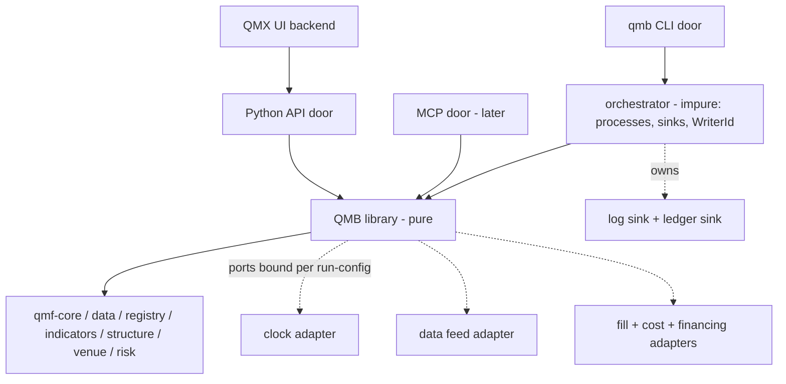
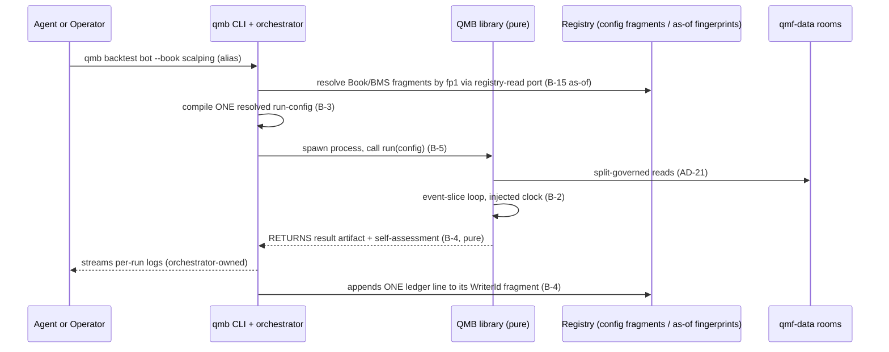
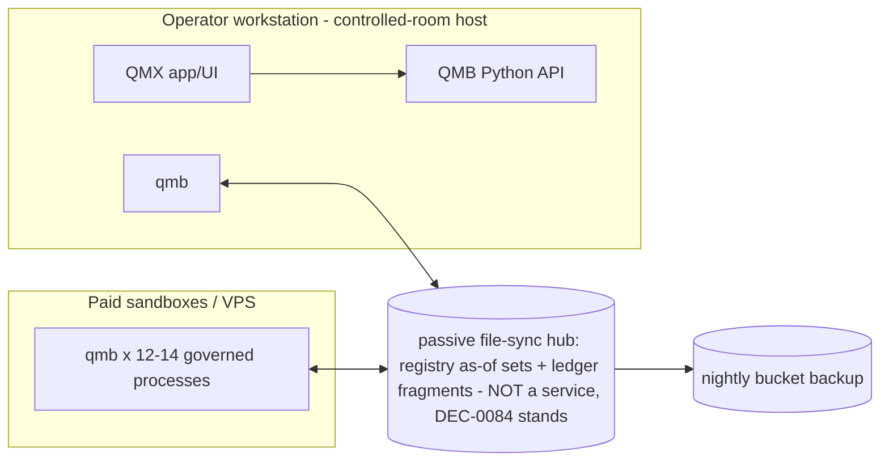

# Architecture Spine — QMB

## Design Paradigm

**Hexagonal with config-composition — "one tunnel, many wirings."** A pure library (the wind tunnel) exposes ports: clock, data feed, fill, cost, financing, sampler, registry-read. Every run binds adapters to those ports from **one resolved, read-only run-config artifact** — never from ambient discovery, never from code changes. Changing test conditions means changing config variables; the tunnel is never swapped. The library computes and RETURNS; exactly one impure component — the **orchestrator** — performs all writes (logs, ledger) and all process management. Thin doors (CLI first, Python API, MCP later) front the same library and carry no domain logic. Vocabulary law: QMB is a **library** and a **CLI** — never an "engine" or "kernel"; QMF is the only framework.



## Inherited Invariants

QMF spine AD-1..41 binds in full; load-bearing rows here (original ids, read-only):

| Inherited | From parent | Binds here |
| --- | --- | --- |
| AD-1/AD-3 | QMF spine | CPython 3.14 pinned; ruff/pyright-strict/pytest/poe gates apply to QMB's own source |
| AD-2 / L21 | QMF spine | QMB is its own installable package (L21), not a QMF roster member; it consumes the QMF workspace lockstep; discovery = explicit registration, never ambient scanning |
| AD-5 | QMF spine | Every serialized QMB contract (resolved run-config, ledger line, result artifact) carries its own integer format version; meanings never change post-hoc; package SemVer is display-only provenance, never identity |
| AD-7 / AD-22 | QMF spine | Exact integer money on the money path; binary floats banned on it and never appear in parameters or identity; analytic floats legal off-path; re-entry only via named AD-22 conversions. `Bar`/`Price` are exact; `BarSpec` is the bar noun (never a bare "timeframe") |
| AD-8 | QMF spine | UTC-ns Instants; QMB's frontier clock **is** an implementation of qmf-core's Clock protocol, injected at the door; nothing below the composition root reads the system clock; the clock does not choose `world` |
| AD-10/AD-12 | QMF spine | Result identity = producer contract identity + contract format version + input fingerprints + evidence range + occurrence id + evidence class + world. Package SemVer never enters identity. Factory-sandbox artifacts carry `provenance = sandbox` (blocks merge into the operator store) |
| AD-11 | QMF spine | Typed refusals RETURNED at public boundaries; doors render per transport, never swallow; MCP `error.data` carries the refusal union verbatim |
| AD-12 worlds | QMF spine | world=replay is QMB's legal world now; world=simulated reserved-unusable until GAP-0048; paper=world live |
| AD-13 + L6/L20 | QMF spine | Measure-then-budget benchmarks; synthetic data stresses infrastructure, never validates edge; no robustness carve-out of L20 |
| AD-15 | QMF spine | The library never spawns threads/background work; values immutable; one-writer-per-stream; the application (orchestrator) owns all concurrency |
| AD-16/AD-19/AD-21 | QMF spine | Registry kinds + lineage edges; rooms per world; cross-world reads refuse; 12-month seal + split manifests (knowledge-time, embargo/purge, calendar in-band) enforced at every read. Book/BMS cites are by fingerprint (`fp1`), never a version string |
| AD-23 / AD-32 / AD-41 | QMF spine | A performance metric is an AD-23 governed producer; the bar is a **set** of named requirements (no composite score); CT-32 is the one performance-result kind |
| AD-29..41 | QMF spine | Book/BMS/binding chain ("BMS accounts for and constrains Books"), "the Book sets the bar", exit doors, R discipline — QMB consumes, never redefines. A QMB replay mints its own `world=replay` binding, incomparable to any live binding |
| D1 / DEC-0013 + ADR-0011 | kernel ruling + docs ledger | No donor code ever (shapes only); build-our-own. The central-service option (DEC-0084) and engine-adoption options (DEC-0085/0086) are DEAD/rejected in the ledger and stay dead — cited here as what QMB must never revive |
| Configurable | QMF standing rule | "Configurable" = UI-editable at platform level; QMB-minted variables declare `ui-editable \| uneditable` or defer the flag to platform templates |

## Invariants & Rules

### B-1 — One library, thin doors; the CLI is the product face

- **Binds:** all QMB surfaces (CLI, Python API, MCP, UI backend)
- **Prevents:** capability drift between agent-facing and human-facing surfaces; domain logic accreting in interfaces; Jesse's three-heterogeneous-stacks failure
- **Rule:** every capability exists once, in the library, as a pure function; doors are thin hand-written wrappers carrying only adaptation logic (parsing, transport, refusal rendering, registry enumeration for autocomplete — through the B-15 registry-read port, never a door-side cache). Door parity is enforced by a tier-2 contract test asserting identical function surface and semantics across doors. The UI backend consumes the Python API in-process; MCP is a sibling door over the same library (never stacked over HTTP), localhost-bound by default, shipped after CLI v1. Extensibility law: capabilities are added as new adapters, config fragments, or library functions — never by re-architecting the tunnel or the doors.

### B-2 — Event-slice run loop with an injected frontier clock; pinned ordering

- **Binds:** the run loop; all data adapters
- **Prevents:** Jesse's no-seam failure (separate live/backtest code paths); look-ahead via time arithmetic or forming bars; two conformant loops that order differently and diverge on fills
- **Rule:** the run loop is ONE loop consuming time-ordered event slices; time advances only via an injected frontier clock that **is** qmf-core's AD-8 Clock protocol (replay: pure function of the data cursor; live: injected real clock at the door, deferred). It is monotonically non-decreasing, pulled to the minimum next-emit instant across streams, and emits AD-8 wall/replay Instants — it is NOT AD-8's monotonic diagnostic clock kind, and it does **not** choose `world` (B-7 does). The per-slice sub-phase order is identity-bearing and pinned here: (1) frontier advance + stream update, with higher-`BarSpec` bars derived from the finest declared base stream and emitted ONLY on completed boundaries — a forming bar is never visible or actionable and carries an inspectable completeness state; (2) scheduled position-level events (financing, B-6); (3) execute **resting** orders through the B-6 ports against the declared intra-slice path; (4) update indicators/structure on closed data only; (5) strategy callbacks mint intents; (6) new intents are **not** eligible to fill against this slice's path — they rest for a later slice. Within a phase, instruments process in the stream-set declaration order (B-12), which is identity content of the resolved config. Identical inputs therefore produce identical slices, fills, and fingerprints, enforced by a tier-2 golden-slice determinism test (same inputs, two runs, identical CT-32 fingerprint). Warm-up is **in-loop**: the same event-slice loop, same sub-phase order, same adapters, trading locked; acting (minting an entry, an exit, or any command) is a typed `policy rejection`. Pre-seeding indicator buffers without replaying slices is not warm-up. Warm-up length is the split-manifest embargo already declared under AD-21 for the producers the stream set cites (AD-22 observation count, never a Duration); the loop does not add a second window. The evidence range on the result label is the trading interval, not the warm-up interval. Simulated-clock typing is **refused until GAP-0048** — the loop seam may exist; asserting simulated Instants as wall/replay Instants may not. In non-live runs the Book's SQS door (AD-39) reads this run's modeled-spread series as its spread input. Backtest/replay/live differ only by which clock and adapters the run-config binds — the loop is never forked. A config that binds a replay clock to synthetic-tainted data is `invalid input` (B-7 wins).

### B-3 — One resolved run-config artifact per run (the config compiler)

- **Binds:** CLI, library entry points, fingerprints, ledger
- **Prevents:** untracked run conditions; Lean's `:latest` determinism trap; hand-edited drift; two doors computing two different run-ids from the same conditions
- **Rule:** every run consumes exactly one fully-resolved, read-only, schema-validated run-config artifact, compiled from explicit layers with fixed precedence: invocation flags > run spec (the bot layer) > BMS config fragment > Book config fragment > workspace defaults. Book and BMS fragments occupy DISJOINT key namespaces (Book: admission, sizing, exit-door policy; BMS: accounting, constraints, kill-line, reporting); a key collision is a compile-time typed refusal — and in any future sanctioned overlap, BMS outranks Book ("BMS accounts for and constrains Books"). Fragments are generated, schema-validated, fingerprinted DERIVED artifacts carrying AD-16 lineage edges back to their source Book/BMS definitions (CT-22/CT-27) — never a newly minted registry kind, never free-hand-edited. Invocation may take a human alias; the resolved artifact **must** cite Book definition, BMS definition, and (if any) binding by `fp1` — never `name@version` as the identity cite. Every QMB run mints exactly one AD-29 binding with `world=replay` (a different identity from any live binding of the same Book instance). `starting_capital` is not a silent flag: it is the binding's virtual-ledger seed, taken from a **mandatory** run-spec field that the Book fragment may default; a flag override of the seed stamps `seed_overridden` on the binding and forces the B-4 fold to `unrated`. Sizing, R freeze, and exits consume `qmf-risk` contracts (CT-23 inbound, CT-29 exits, AD-40 full-loss price required before open). The resolved artifact is itself a versioned contract: it stamps its own integer format version (AD-5) and declares AD-10 identity-vs-display field classification, so every door computes the same fingerprint and old ledger entries stay readable forever. The resolved artifact is written into the run's output directory; its fingerprint is the run id root and the ledger key. Named condition presets (e.g. stress-spread) are config fragments like any other.

### B-4 — Pure runs return values; the orchestrator writes logs and ONE ledger line

- **Binds:** every run kind (backtest, optimize trial, MC, significance, walk-forward); the orchestrator
- **Prevents:** two ledger lines (or zero) per run when the library and the orchestrator each think they own the append; a dead process that can never report its own crash; the scoreboard and the evidence diverging
- **Rule:** the library's `run()` is a PURE function: it consumes the resolved config and data reads, and RETURNS the canonical result artifact plus a self-assessment — it writes no log and no ledger. The **orchestrator** (composition root, impure by design) owns the injected log and ledger sinks: it streams the run's log, and on completion appends exactly one ledger line; on observing a dead or cancelled process it appends the `aborted` line with refusal context — never silently absent. The ledger line carries the full AD-12 result label (including evidence class and, for factory-sandbox runs, `provenance = sandbox`), the CT-32 fingerprint, the run's raw AD-40 unit-kinded measures, the fingerprint of the Book bar AS RESOLVED at run time, and a **discriminated run role** (`confirmation` | `trial` | `replicate` | `aborted`). The run's trading events (decision, order, fill, risk-transition and kin) are emitted as **CT-13 journal events on writer-scoped streams in the run's world** — the ratified journal, not an invented format; "per-run logs" are AD-14 operational logs only and are never evidence (CT-11: only the raw archive and the journal bear evidence; artifacts cite them). The bar verdict is **reader-derived, never frozen**, and is legal only on `role = confirmation` lines whose adapters are the Book-declared set: one authoritative read-time fold computes **per-requirement** outcomes against the cited AD-32 bar (structural parity on producer contract versions, unit-kind, comparison rule) — never a singular stored pass/fail. A bar ruled later re-verdicts accrued confirmation evidence with NO re-run; `not-yet-ruled` is the fold's answer while a requirement is blank, or on a world/role miss; a replay-world verdict can never gate live money (AD-29/AD-32). Optimize trials, MC/significance replicates, and walk-forward **train** windows ledger `trial`/`replicate` plus the objective measure — never a bar verdict. The Book-bar read selects `role = confirmation` lines only. QMB publishes; it does not bench, promote, or bind. Physically the ledger is WriterId-scoped fragment files — durable WriterId per (machine, role, worker-slot) per AD-8; concurrent processes never share a file (single-file append is not atomic on Windows, PIPE_BUF-limited on Linux) — and "the ledger" as read is a merge view over fragments **within one world-and-role-scoped namespace** (AD-12/AD-19; replay evidence feeds a live bar only where that bar's evidence requirements declare it). Runs enter the governed ledger only through the orchestrator; direct library calls in research return values and produce no governed evidence (don't-box-in preserved).

### B-5 — Process-per-run concurrency with a resource governor; no runtime platforms

- **Binds:** all concurrent execution; sandbox and laptop alike
- **Prevents:** shared mutable state across runs; Ray/Docker-class runtime capture (GAP-0006); silent oversubscription at 12–14 parallel runs
- **Rule:** concurrent runs are separate OS processes (stdlib process management) spawned by the orchestrator, each with an isolated output directory. The orchestrator's governor bounds parallelism by **min(cpu budget, memory budget)** — a run whose projected peak memory exceeds the remaining budget gets a typed refusal or enqueues (enqueue-on-full; never silent oversubscription). Every run is cancellable (cancel token) and carries declared per-run time/memory limits; breach is a typed `aborted`. 12–14 concurrent runs on sandbox hardware is a motivating reference under AD-13, never a validated budget until a fingerprinted baseline is measured. Optuna adapters are pinned `n_jobs=1`; process fan-out stays in this orchestrator. No Ray, no required Docker, no daemon: sandboxes and laptops run the same uv-installed package.

### B-6 — Pluggable fill/cost/financing ports with declared, calibrated fidelity

- **Binds:** the execution path of every non-live run; GAP-0048 seam
- **Prevents:** Jesse's zero-slippage optimism entering evidence unlabeled; financing silently omitted from multi-day results; fidelity retro-invalidating stored results silently
- **Rule:** inbound path is a CT-23 Book-resolved intent (or a typed refusal) — the fill ports execute an *authorized* intent, never a bot-sized order. Execution binds SEPARATE ports per run-config, composition pinned: (1) **fill** decides Fill | NoFill | PartialFill and a **pre-slip** price by declared-path crossing inside the slice (partial quantities are first-class, capped by position size and instrument lot step); (2) **slippage** maps that price to a post-slip price and may veto the fill (`NoFill`) if the slipped price is not a legal print on the slice; (3) **cost** itemizes cash charges (commission, and financing/admin fee at the AD-8 accounting rollover, not per-slice) on the post-slip fill, exact-integer money, each partial carrying its own pro-rated fee. **Financing** is a scheduled position-level cash event on open positions (sub-phase 2 of B-2, NOT an order fill; per-instrument, per-direction, calendar-scheduled). Fidelity identity is **adapter-id + composition-version + taint**; `optimistic` is the taint field, never the identity. A run's fidelity is the LOWEST fidelity of any adapter it bound; mixed-fidelity comparison of Book bars is a typed refusal without an explicit override. Until GAP-0048 ratifies the fidelity taxonomy and content, all fills carry an `optimistic` taint: such runs cannot spend split budget and cannot claim edge. The forex spread/slippage/financing content ("swap" only colloquially, per AD-8/AD-41) is original to the QMX platform — no donor reference exists — and the solve is CALIBRATION, never invention (operator-ruled 2026-08-20): spread schedules measured from QMX's own recorded bid/ask ticks per venue/hour/session, slippage from live/paper fill journals (CT-25), gap behavior from recorded history, financing from the broker's published schedule; per-broker (DEC-0135), each calibration a versioned fingerprinted artifact declared in the result label.

### B-7 — Provenance-derived world; synthetic claim classes

- **Binds:** all data consumption; `qmb data generate`; every result label
- **Prevents:** the synthetic backdoor (generated data indistinguishable from real — LEAN ships exactly this gap); L20 violations by relabeling
- **Rule:** world is derived from input data provenance, never caller-declared. Store-persisted fabricated-from-scratch data (random-walk class, `qmb data generate`) is store-tainted; any run that **reads the store** is `world=simulated` and a `policy rejection` for governed evidence until GAP-0048 — infrastructure stress and strategy-logic smoke tests only. **Procedure-ephemeral** perturbation — B-14 trade-shuffle and real-seeded block-bootstrap that never persist a synthetic series into a data room — does not change world: the run remains `world=replay`, the procedure identity + seed enter the label, and the claim class is robustness-only, never edge, never admission evidence. Claim class is a label field distinct from world. L20 stands: nothing synthetic validates edge. A clock/adapter vs provenance mismatch is `invalid input`.

### B-8 — Declared parameter spaces; pure generation-stepped adaptive search

- **Binds:** optimize mode; sweep batches
- **Prevents:** Jesse's naive-random-search-marketed-as-Optuna failure; a stateful sampler daemon violating B-5/AD-15; nondeterministic search under concurrency; invisible attempt inflation
- **Rule:** a bot declares its parameter space as a typed schema (name, type ∈ exact integer | exact rational | categorical | boolean, bounds, step, default) plus optional hard constraint filters (metric-operator-value, e.g. max_drawdown < threshold). The Optuna adapter may float internally; sampled values enter the resolved run-config only after a **named AD-7/AD-22 conversion** (rounding mode + target scale, identity-bearing). The sampler is a PURE function — (declared space, prior trial results, seed, generation index) → next parameter batch — evaluated by the orchestrator between spawns; trial history is read from the ledger view, never from an in-process study or daemon, never from Optuna's own store. Search steps in **deterministic generations**: propose a batch, run it (concurrently, B-5), barrier, condition on the completed generation — so the same seeded sweep proposes identical trials regardless of completion order. Parallel `ask` without an intervening `tell` is refused (`unsupported capability`) for TPE-class adapters; a non-adaptive grid/Sobol adapter may ask a declared batch. The default adapter is genuinely adaptive (TPE-class); sampler identity + seed + generator provenance + `study_fp` (the study artifact before this ask) enter every trial label. Every trial is a first-class run under B-3/B-4 with `role = trial`. The optimize deliverable includes the **anti-overfit analysis**: post-hoc parameter-sensitivity (per-parameter objective slices, clustering of good regions, isolated-spike-winner flagging) emitted as part of the sweep's result artifact. Objectives are `measure_identity`s from the AD-23/AD-41 roster (B-10). Every run names split-manifest fingerprints; reads go through qmf-data (seal/embargo/knowledge-time/calendar-in-band). "Train/test" is a display alias for two such manifests, never a substitute; walk-forward is a sequence of manifests, each a first-class run.

### B-9 — Research surface = the same library, pure functions, portable

- **Binds:** Jupyter/notebook use, external laptops, UI backend, agents
- **Prevents:** a research-only reimplementation drifting from the tunnel; governed data escaping controlled rooms
- **Rule:** the research surface is the library's own pure functions, importable from a bare uv-installed package — no server, no Docker, no daemon required. Room hosts are explicit: the operator's workstation hosting the QMX app and archive IS a controlled-room host (AD-19/AD-21 apply in full there, including the seal and its sanctioned single final-look path); any other portable context receives only unsealed, split-governed exports; sealed and governed evidence never leaves controlled rooms (AD-21).

### B-10 — One canonical result artifact; rendering is downstream

- **Binds:** reports, charts, metrics, the UI, agent skills
- **Prevents:** both donors' failure of computing chart data then discarding it into PNGs/strings; agents parsing HTML; metric arithmetic drifting per renderer
- **Rule:** every run emits one canonical machine-readable result artifact, and that artifact IS a **CT-32 performance-result** — the ratified, defined-unwired container this factory was always meant to fill — carrying CT-32's fields in full (including suppression/veto accounting, so a run's own control-window and admission doors never masquerade as alpha decay, and the closed AD-40 unit-kind vocabulary); chart series cite exact `Bar`/`Price` (AD-22) as inputs; any downsample is a **display-only** derivative with a declared sampler identity, never the canonical payload (AD-10-excluded from identity). Trade-event references cite CT-13 journal streams (the trade record **is** the CT-29 stream of the run's replay binding). Re-running a run id under its resolved config must reproduce the CT-32 fingerprint; a mismatch is a typed refusal. QMB's ledger + CT-32 artifacts are the designated evidence source for the AD-32 admission bar and the AD-18 promotion-card causality slot — under the standing caveat that replay-world, pre-GAP-0048 evidence cannot gate live money. All human-facing rendering (HTML report, UI charts) is a pure downstream function of this artifact and adds no computation. Agents and in-house skills read the artifact, never renderings.

### B-11 — Data commands wrap QMF contracts; download-once, license-tagged

- **Binds:** `qmb data` command group; sandbox data provisioning
- **Prevents:** a second data layer diverging from qmf-data; redistribution that fails the licensing gate; unlicensed windows silently becoming governed evidence
- **Rule:** QMB's data commands (download, verify, catalog, generate) are thin fronts over the ratified QMF data contracts (CT-10/CT-15 intake, rooms, bitemporal law, bid+ask preserved). Acquisition posture (operator-ruled 2026-08-20): download ONCE under the user's own provider relationship (Dukascopy primary; dukascopy-node-class downloader as the acquisition-tool reference) into the QMF immutable raw archive — QMX owns its stored source; runs NEVER fetch from providers, they read only qmf-data rooms. Every ingested window records provenance plus a license tag; a source without a recorded usage right is a typed refusal for governed-evidence use. QMB ships and redistributes no market data; the Dukascopy licensing-gate question (the old corpus failed it) remains an open ops item.

### B-12 — Declarative stream sets; sweeps are batches of isolated runs

- **Binds:** multi-timeframe/multi-symbol testing; permutation campaigns
- **Prevents:** look-ahead via ad-hoc cross-stream access; money-path corruption from mixed settlement assets; permutation results blurring into one aggregate
- **Rule:** a run declares its full stream set up front (instrument + `BarSpec` list, trading vs data-only roles); strategies read other streams only through the declared set. Per run: at most ONE open position per (venue, instrument) — violation is the typed refusal DuplicatePositionStream; all trading streams share one settlement asset for exact-integer accounting (AD-7) — violation is MixedSettlementAsset. Permutation sweeps (bot × symbols × BarSpecs × parameters) are Cartesian batches in which each combination is one isolated, fully-labeled run with its own ledger line; batch-level aggregation is a read-time view over the ledger, never a merged run.

### B-13 — Versioned distribution; complete run identity

- **Binds:** packaging, sandbox provisioning, result labels
- **Prevents:** version skew between what agents run and what results claim; the two-ladder confusion (QMB vs QMF versions)
- **Rule:** QMB is a versioned uv/pip-installable package (library + CLI in one wheel); the primary channel is a normal pinned, lockfile-tracked project dependency (`uv add qmb`) — required because the Python API door must be importable; `uvx qmb` / `uv tool install qmb` is an optional CLI-only convenience that does NOT provide the importable library and is never the sandbox provisioning channel. Identity is AD-12's field set plus the resolved-config fingerprint as an *input* fingerprint. QMB SemVer and QMF roster SemVer ride as **display-only provenance** on the occurrence record, never identity. The label also carries `registry_as_of` (B-15), data/split fingerprints, world, evidence class, fidelity identity (B-6), RNG provenance where stochastic, and `provenance = sandbox` on factory-sandbox artifacts. Doors may accept a human alias; the resolved artifact cites Book/BMS/bot **definition fingerprints** (`fp1`). A dated pointer record ("current") is legal UX; `name@version` is not a legal identity cite.

### B-14 — The validation ladder ships as library functions

- **Binds:** robustness tooling; pre-build statistical procedures
- **Prevents:** validation living outside the ledger; statistical procedures with unpinned definitions; float statistics leaking onto the money path; L20 violations by calling robustness "edge testing"
- **Rule:** the ladder — backtest, optimize, Monte Carlo (trade-shuffle; real-seeded candle perturbation), rule-significance test (signal-only run-loop pass with orders disabled, bootstrap against a detrended zero-edge null), walk-forward — ships as library functions, each with its exact statistical procedure versioned as a contract, each producing labeled runs and ledger entries under B-3/B-4. Candle-perturbation MC that **persists** a synthetic series is `world=simulated` and cannot ledger into the bar's store (B-7). Trade-shuffle of a `world=replay` run stays replay only if it does not mint synthetic market data. These procedures claim robustness or infra-stress, never edge (L20). Return-space statistics are a declared, bounded AD-7 float carve-out: P&L and equity paths stay exact-integer; floats exist only inside the statistic with a fixed rounding contract, re-entering the money path via a named conversion; float-valued measures take **label-derived** identity (AD-41). Threshold values and pass batteries stay deferred (GAP-0048/0049); the procedures' mechanics do not wait.

### B-15 — Registry delivery: immutable as-of sets, passive hub, honest staleness

- **Binds:** registry reads everywhere (config compiler, autocomplete, sweep admission); sandbox provisioning; the hub
- **Prevents:** two caches over a syncing store answering differently ("autocomplete offers scalping@3, the compiler resolves @2"); a batch whose trials resolve different Book versions mid-flight; sandbox-minted records colliding at merge; the hub drifting into the central service DEC-0084 killed
- **Rule:** ONE library-owned registry-read port serves every consumer — the config compiler resolves through it and doors enumerate through it for autocomplete; no door-side or second cache exists. Registry state reaches a machine as an immutable, fingerprinted **as-of set** of records/fragments (a `registry_as_of` instant + set fingerprint), delivered by a **passive file-sync hub** — dumb storage, not an always-on service (DEC-0084 stands); hub deployment detail belongs to the node/ops sitting. A sweep resolves ONE as-of at batch admission, frozen for every trial and stamped into the sweep label; after admission, fragments resolve by explicit fingerprint, never by name@latest. Running against a ref that a fresher as-of shows superseded raises an AD-11 stale-evidence refusal (severity configurable). Write-back: each machine's records travel as its own WriterId-scoped append streams; at hub merge, identical-fingerprint arrivals are idempotent accepts, label-identified float-differing artifacts are lineage siblings (never AD-10 collisions), and true collisions refuse + alarm per AD-10.

## Consistency Conventions

| Concern | Convention |
| --- | --- |
| Naming | Product = QMB — this IS the glossary's "future backtesting library" entry; the "Simulator" stays a separate deferred UI product that will consume QMB. Command = `qmb` (supersedes DC-5's `qmx`). "Experimentation" is the umbrella activity, "backtest" the verification stage — the glossary's recorded candidate rename is SETTLED by this sitting. The loop is the "run loop" / "the tunnel". Banned (inherited in full): engine, kernel, exam, plugins (for QMB parts), fake counterparty, snapshot (for registry state — say "as-of set") |
| Run identity | run id = fingerprint of the resolved run-config (AD-10-classified fields) + occurrence id per AD-12; output dir named by run id |
| Config format | JSON, schema-validated (JSON-Schema-class per QMF AD-30 template discipline), AD-5 format-versioned; comments live in docs, not config |
| Ledger format | JSONL fragment files, append-only, one line per completed/aborted run, written only by the orchestrator; WriterId-scoped per AD-8/AD-15; read = world-and-role-scoped merge view |
| Errors | AD-11 typed refusals end-to-end; CLI renders refusal → nonzero exit code + machine-readable stderr JSON (category, context, retryability); the Python door RETURNS the library's refusal unions verbatim (AD-11 return-not-raise; exceptions only for programmer error); MCP `error.data` carries the same refusal union verbatim |
| Logging | AD-14 structured logs with correlation ids; per-run log files in the run dir, streamed by the orchestrator |
| State | No module-global mutable state anywhere in the library (the donors' central defect); explicit context objects only; all impurity lives in the orchestrator |

## Stack

| Name | Version |
| --- | --- |
| CPython | 3.14 (inherited QMF AD-1) |
| uv / ruff / pyright / pytest / poethepoet | inherited QMF AD-3 pins |
| click (CLI door) | ==8.4.2 (BSD-3; pure-Python, verified CPython 3.14-compatible — publishes no per-version classifiers, pyreadiness "✗" is a metadata artifact; web-verified 2026-08-20) |
| optuna (default sampler adapter) | ==4.9.0 (MIT; 3.14 classifier; 5.0.0rc1 is pre-release, not pinned; a future major bump changes the default sampler and is a contract-versioning event, never a transparent update) |
| qmf-* workspace packages | lockstep QMF release (AD-2/AD-5) |

## Structural Seed

```text
qmb/                      # one distribution: library + CLI
  runloop/                # event-slice loop, frontier clock port, warm-up
  config/                 # schema, layering, compiler -> resolved artifact (B-3)
  registryread/           # the single registry-read port + as-of sets (B-15)
  execution/              # fill/cost/financing ports + adapters (B-6)
  data/                   # thin fronts over qmf-data contracts (B-11)
  optimize/               # parameter schema, pure sampler port, sensitivity analysis (B-8)
  robustness/             # MC, significance, walk-forward (B-14)
  results/                # canonical artifact, metrics, chart series (B-10)
  ledger/                 # ledger line schema + world/role-scoped read views (B-4)
  orchestrator/           # impure: process spawn, governor (cpu/ram, queue), sinks, WriterId, aborted-lines, generation-stepped sweeps (B-4/B-5/B-8)
  doors/
    cli/                  # qmb command tree (thin)
    api/                  # public pure-function surface (thin re-export)
    mcp/                  # later; sibling wrapper (B-1)
```





## Capability → Architecture Map

| Capability (operator-dictated) | Lives in | Governed by |
| --- | --- | --- |
| Backtest against a Book/BMS's own rules | config/ + runloop/ | B-2, B-3, AD-29..41 |
| "CLI updates when I create a Book" | registryread/ + config compiler | B-15, B-3, B-13 |
| Local + sandbox ("cloud") runs | orchestrator/ + doors/cli | B-5, B-13, DEC-0084 |
| Optimization at scale | optimize/ + orchestrator/ | B-8, B-12, B-5 |
| Monte Carlo + significance before building | robustness/ | B-14, B-7 |
| Synthetic data generation | data/ generate + store taint | B-7, L20 |
| Algorithm reports agents + operator read | results/ + downstream renderers | B-10 |
| Jupyter anywhere | doors/api pure functions | B-9 |
| Multi-TF / multi-symbol permutations | config stream sets + orchestrator batches | B-12 |
| Interactive charts (UI later) | results/ chart series | B-10 |
| Logs → ledger; bar verdict is a read-time fold | orchestrator/ + ledger/ | B-4 |
| Reproduce / verify a run id | results/ + orchestrator | B-10, B-2, B-13 |
| MCP for day-to-day agent use | doors/mcp (post-v1) | B-1 |

## Deferred

- **GAP-0048** — fidelity taxonomy values (incl. the cross-fidelity comparison/refusal rule and fidelity aggregation detail beyond B-6's lowest-wins), forex fill/slippage/financing calibration content, parity contracts, simulated-time typing that unlocks world=simulated. Reason: irreversible; needs its own sitting; B-6/B-7 hold the seams meanwhile.
- **GAP-0049 + GAP-0016/0017** — SR*/search-quality thresholds, the look-ahead REGISTRATION GATE, attempt counting (search-campaign candidate). Docs assign 0016/0017 to "the backtesting sitting" (= QMB's area): note the split — look-ahead *prevention* is DELIVERED here (B-2 forming-bar/completed-boundary rules, B-8 split-manifest enforcement, B-12 declared stream sets); only the registration *gate* (CT-08 evidence checklist) stays deferred per the standing operator ruling (DEC-0121). B-4/B-8 ledger completeness accrues their raw material regardless.
- **Pass batteries / thresholds** — old battery values (WF windows, OOS counts, PBO bands, CSCV) remain candidates for the GAP-0048/0049 sittings ("keep it simple" — operator).
- **MCP door details** (tool list, exposure beyond localhost). Reason: post-CLI-v1 per operator; B-1 fixes its shape.
- **Live wiring** — live adapters/brokerage ports are trading-node territory; B-2's seam is where they will bind.
- **Cross-stream peer callbacks and structured agent-facing findings layers** — nice-to-haves from intake (on_peer_*, ranked findings); deferred until a consumer exists; B-10's artifact is where findings would live.
- **UI rendering** — platform territory; consumes B-10 artifacts.
- **QML bot schema (GAP-0047)** — QMB tests plain-Python bots until QML lands; QML conformance gates governed evidence, not tunnel entry.
- **Cloud-burst compute** (Lean-style push-to-cluster) — not in scope; sandboxes are the scale story. Revisit only if the governor's measured ceiling proves insufficient (AD-13).
- **Hub deployment detail** (where the passive file store lives, sync cadence) — node/ops sitting; B-15 pins the QMB-side semantics regardless.
- **Staged funnel triage/routing** (cheap screen → research → robustness → replay → full Book sim; promote/enhance/repair/archive) — ticket 008 shape. Until GAP-0049 thresholds land, stages are run manually and nothing gates compute. B-14 procedures + B-4 roles are the raw material.
- **Debug mode, ML/RL experimentation, Rust-hybrid speed path** — operator-dictated wants from the Lean/Jesse walk; dropped from v1 with no design. Revisit when a consumer exists; don't-box-in (B-1 extensibility law) is the holding seam.
- **Locked validation window** as a third split (intake OPT-10) and optional Grid/Euler sampler modes — not in v1; TPE-class default + split-manifest fingerprints hold the line.
- **Prop-firm Books** — socketed upstream (DEC-0082); nothing in QMB may preclude them.
