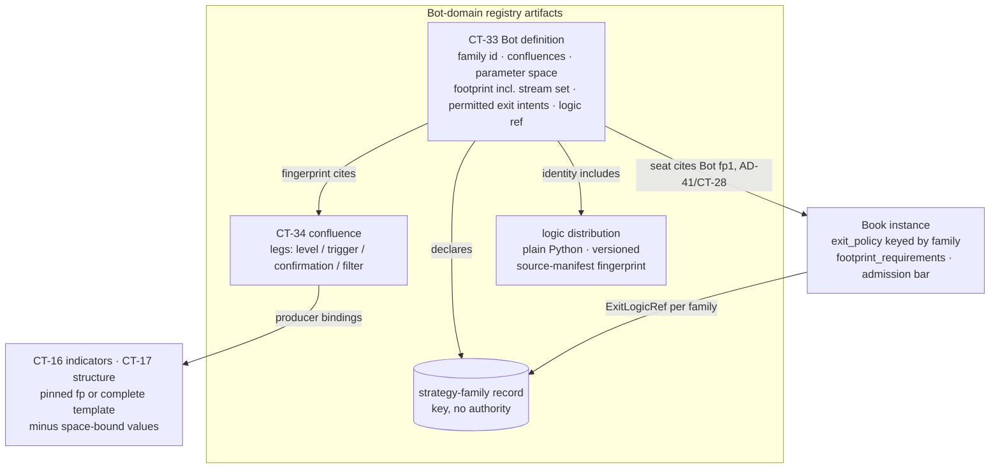
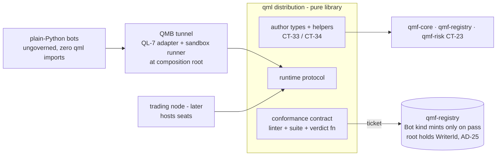

# Architecture Spine — QML

## Design Paradigm

**Declaration-plus-logic authoring.** A governed bot is exactly two artifacts: a **declaration** (a structured configuration artifact under AD-30's template discipline, registered as the CT-33 Bot definition) and **logic** (plain Python conforming to QML's runtime protocol, shipped as a versioned distribution whose identity enters the Bot's identity). QML is the **library that authors both and gates their registration** — one uv-installable distribution (import `qml`), application layer built *on* QMF exactly as QMB is: never a QMF roster package, never a framework, never an engine, and never again a cross-component contract layer. The old QML's uniformity rationale ("compare bots honestly — same deterministic risk authority") is already delivered by ratified QMF law (CT-23 Book-resolved sizing, AD-40 frozen R, CT-29/CT-32 containers); QML adds the two uniformities still missing — **declared footprint** and **declared parameter space** — and nothing else. Plain Python stays first-class forever: an unregistered bot needs zero QML imports to run in QMB or research; **QML conformance is the ticket into governed evidence and Book seats, nothing else.**

## Inherited Invariants

QMF spine AD-1..AD-41 and QMB spine B-1..B-15 bind in full (original ids, read-only). Load-bearing rows here:

| Inherited | From | Binds here |
| --- | --- | --- |
| Bot kind reserved; kinds addable never redefined; stable id from `fp1`; writer/sequence/created-at are ordering/occurrence, never hashed content | AD-16, AD-8 | CT-33 fills the reserved kind; family record rides the same addable-kinds law; the identity carve-out in QL-3 |
| Recursive multiplicity; Bot identity is content; composites are own artifacts; binding is a separate dated record | AD-17 | CT-33/CT-34 shapes; re-binding never mints a Bot; a content change always does |
| Authority order bot → book → BMS → operator; Book owns admission, sizing, doors, exit policy | AD-29, AD-33 | The bot never sizes; `requested_r` and the declared full-loss price are Book-resolved; QML carries no exit_logic field on the bot |
| Template discipline: JSON-Schema-class, exact rationals, unit-kinds, `ui-editable` flags, git-logic versioning, `pending(gap)` slots | AD-30 | The declaration artifact's grammar; Bot versioning; the two `pending(GAP-0047)` slots resolved here |
| Admission is technical, never performance; bar = set of named requirements; blank blocks live money | AD-32 | The conformance gate mirrors it; the two bot-side `evidence_requirements` fields land as a **proposed CT-22 format mint** (QL-8) |
| `ExitLogicRef` per family in the Book's `exit_policy`; typed close reasons; whole-trade attribution | AD-33 | QL-9 ratifies the donor atoms as-is and closes the QML-revision flag |
| Frozen R; declared full-loss price before open; dimensional law; unit-kinds | AD-40 | Every CT-33 parameter carries a unit-kind; Book-side entry-intent derivation (QL-7) |
| Seats `active \| benched`; CT-32 the one performance container; same-tick close-authority priority | AD-41, AD-37 | Seat records stay AD-41's; close-authority priority is AD-37's, already ruled — QML bots emit intents and relinquish |
| Extension mechanics: separate versioned packages, explicit registration, distribution identity in artifact identity, graduation path; registry emissions minted by the composition root holding the WriterId | AD-2, AD-22, AD-25 | The logic package's mechanics; the bot graduation path; the registration write path (QL-1) |
| Run spec is the bot layer; declared parameter spaces; declared stream sets; ledger roles + reader-derived bar verdicts; `fp1` cites | B-3, B-8, B-12, B-4, B-15 | CT-33 declares exactly what B-3/B-8/B-12 consume; canonical-assignment evidence composes via a declared B-3 stamp + B-4 fold qualifier (QL-8) |
| QMB tests plain-Python bots until QML lands; conformance gates governed evidence, not tunnel entry | QMB Deferred | QL-8's ticket honors it verbatim |
| Corpus precedence: QMX-discussion barred for risk/sizing; structural definitions citable under named exemption | Operator ruling 2026-08-20 | The dig + verification dossiers are the named vehicles; no risk/sizing content is taken from that layer |
| Don't-box-in; configurable = UI-editable; L11 (QMF is the umbrella, QML the Bot library); banned vocabulary | Standing rules | QL-1 identity; every configurable declaration flag; naming |

## Invariants & Rules

### QL-1 — QML identity: the authoring library, thin by law

- **Binds:** the `qml` distribution; every consumer of Bot-domain artifacts
- **Prevents:** QML re-expanding into a uniform cross-component layer (the old failure the prior generation already retired); a second shared-contract stratum beside QMF; strictness leaking into ungoverned research; two owners of the Bot-kind record stream
- **Rule:** QML is the bot-authoring **library** of the QMX platform — one uv-installable distribution (import `qml`), application layer built on QMF contracts exactly as QMB is (AD-2 / L11), never a QMF roster package (ADR-0011). Its whole surface is three thin things: (1) author-side types and helpers producing the Bot-domain registry artifacts (CT-33/CT-34) on `qmf-core` nouns; (2) the bot runtime protocol hosts invoke (QL-7); (3) the conformance gate (QL-8). **QML mints no new QMF-ladder (CT-\*) shared contract of its own** — CT-33/CT-34 are qmf-registry kinds this sitting fills; the runtime protocol (QL-7) and conformance contract (QL-8) are QML-local contracts on QML's own format-version ladder, exactly as QMB owns its run-config and ledger contracts. Plain Python stays first-class forever: an unregistered bot needs zero QML imports to run in QMB or research lanes (don't-box-in); conformance is the ticket into governed evidence and Book seats, nothing else. No acronym expansion is minted (the corpus never expands QML; the L reads as *Library*).
  - **Dependency stance:** QML imports `qmf-core` (nouns, fingerprints, refusals, series vocabulary), `qmf-registry` (the kinds it authors), and `qmf-risk` (CT-23/CT-29 types); it never imports `qmf-venue`. This reads the QMF default-deny edge rule as governing the seven roster packages internally, never applications built on the workspace — the reading the ratified QMB precedent already exercises (its library consumes qmf-risk contracts per B-3/B-6). **Declared reconciliation note:** the parent rule's wording is absolute ("nothing imports qmf-venue or qmf-risk"); the documentation-factory increment records the roster-scoped reading against the parent Dependency-direction rule so the carve-out is annotated at source, not settled silently by a child.
  - **Registration write path (AD-25's root-mints pattern, not AD-28's venue path):** the composition root holds the `WriterId` and the gapless per-(writer, kind) sequence for the Bot-domain record streams, mints the registry records, and sees every `RecordSink` refusal (block-on-unpersistable); `qml` returns fingerprintable content, never stamped records. The writer unit for Bot-domain kinds is **(machine, authoring role, kind)**. AD-28's injected-sink reference applies only to the conformance runner's I/O (QL-8).
  - **Versioning and channel (B-13 mirrored):** the `qml` distribution carries its own SemVer as **display-only provenance** — never identity; CT-33 `fp1` and the logic-artifact identity carry identity — consumes the QMF workspace lockstep, and installs as a normal pinned project dependency (`uv add qml`).
  - The library is pure per AD-15 (no threads, no I/O, no process spawning); every impure step (registration writes, sandbox execution) is host-owned.

### QL-2 — Two halves of a bot; the `.qml` DSL is not revived

- **Binds:** every governed bot; the authoring surface; the future UI/agent authoring lanes
- **Prevents:** a second language to maintain and govern; bot meaning living outside identity; the Monaco-era file format returning as an unversioned side channel; non-reproducible builds forking Bot identity
- **Rule:** a governed bot is exactly two artifacts. **(1) The declaration** — a structured configuration artifact under AD-30's template discipline (JSON-Schema-class; every number an exact rational with a unit-kind; every configurable variable flagged `ui-editable | uneditable`), registered as the CT-33 Bot definition. **(2) The logic** — plain Python conforming to the QL-7 runtime protocol, shipped as a versioned distribution under AD-2/AD-22 extension mechanics (explicit registration at a composition root, never ambient scanning). The logic's identity basis is its **distribution identity + version + a canonical source-manifest fingerprint** — a normalized, reproducible hash over the source tree, defined as fingerprinted contract surface — and these are **identity fields of the Bot definition**, so a code change mints a new Bot exactly as a changed number mints a new Book (AD-30). **Non-reproducible built-artifact bytes (wheel timestamps, build metadata) may never be the identity basis** — identical source built in two sandboxes must yield one Bot `fp1` (AD-16 dedup). **The `.qml` bot-source file format and its Monaco surface are not revived in V1** — no second language: what the old `.qml` file carried (entry, filters, gates, subscriptions as an editable source) is delivered by the declaration (structure) plus the Python logic (conditions), and the declaration is the durable, diffable, UI-editable authoring surface. A future declarative condition grammar, editor surface, or agent codegen lane is platform/agentic territory and **compiles to these same two artifacts** — nothing forecloses it, nothing waits on it. A model-bearing bot is legal today by baking its weights into the logic artifact (source-manifest identity covers them); a separately-tunable weights-artifact parameter kind is an explicit later mint (Deferred).

### QL-3 — The Bot definition kind (CT-33)

- **Binds:** CT-33; qmf-registry (kind owner); QMB's config compiler and sweep admission; the future node seat machinery
- **Prevents:** two bots that cannot be compared or deduplicated; parameter values with no identity locus; a tuned bot silently wearing the original's track record; Bot identity forking on writer or nesting; the reserved Bot kind staying a stub
- **Rule:** CT-33 fills AD-16's reserved Bot kind — a qmf-registry per-kind contract on the QMF ladder, authored via QML, owned by qmf-registry like every kind. **Identity carve-out, stated so AD-16's law cannot be misread:** the AD-16 common header's `writer`, `sequence`, `stable id`, and `created-at` are ordering/occurrence fields **excluded from `fp1`** (AD-8/AD-16 — the stable id is *derived from* the fingerprint, never hashed into it); Bot identity is the **semantic content only**, plus the contract format version and at-birth refs. That content:
  - the **strategy-family id** (QL-6);
  - the **confluence set** — one-or-more CT-34 fingerprints (AD-17), canonically ordered by child fingerprint ascending with a separate display-only ordinal (AD-30's set discipline); the bot does not declare execution order — sequencing semantics live in logic;
  - the **declared parameter space** — **the one authoritative bot parameter-space contract**, which B-8's optimizer consumes: B-8's schema (name, type ∈ exact integer | exact rational | categorical | boolean, bounds, step, **mandatory default**, optional hard constraint filters) **completed with the AD-40 unit-kind every declared variable already requires** — one schema, never two. The defaults together form the definition's **canonical assignment**;
  - the **footprint** (QL-4) — which **contains the stream-set declaration** (instrument-role + `BarSpec` list in B-12's shape, trading vs data-only roles): one locus, one nesting, one linter target — never a second top-level field;
  - the **permitted-intent declaration** — **`entry` is always permitted and is never gated by `exit_policy`**; the declaration names the bot's permitted **exit**-intent kinds, a subset of the ratified CT-23 exit vocabulary, **which may be empty**. Intent-kind identifiers are stored as **opaque `qmf-core`-typed values** validated by QML-side linters — qmf-registry gains no `qmf-risk` edge (mirroring AD-22's "declaring an input creates no package dependency edge");
  - the **logic reference** (QL-2's identity basis).
  - **Versioning is AD-30's git logic verbatim:** an append-only `branches-from` version graph (multiple heads legal; "current" is a separate dated pointer record); every version readable forever; `continues-performance` carries a track record across versions only when human-signed (AD-16/AD-18). Bot identity is content (AD-17): re-binding, seats, and paper flips never mint a new Bot; a changed default, leg, footprint entry, or logic artifact always does. **The AD-41 seat record — the Bot side of the CT-28 binding context — cites the registered Bot definition by `fp1`**, and the prediction linter (QL-8) runs against that CT-28 binding context; re-binding semantics stay CT-28/AD-29's.
  - **Parameterization law:** governed live/paper seats execute the **canonical assignment only**. Non-default assignments exist solely as B-3 run-spec overrides in experimentation runs — each fully labeled and resolvable from the resolved run-config fingerprint. Promoting a tuned assignment mints a **new Bot version** (`branches-from`, optionally `continues-performance`) whose defaults are the tuned values. One identity locus. The admission-side check this enables is QL-8's canonical-assignment evidence, which **composes with QMB as a declared sibling extension** — a B-3 resolved-config stamp (`assignment_is_canonical`, mirroring B-3's `seed_overridden` precedent) plus a B-4 fold qualifier that reads it — declared here so QMB budgets for it rather than discovering it.

### QL-4 — Footprint and producer bindings

- **Binds:** CT-33's footprint section; AD-30's `footprint_requirements` pending slot; QMB run-config resolution (a declared B-3 compiler extension); node seat admission
- **Prevents:** a bot consuming evidence it never declared; a confluence leg starving at runtime because its producer never reached the footprint; two compilers resolving one template to two fingerprints; a second warm-up window
- **Rule:** the footprint is **the single canonical consumption manifest**: the stream set (QL-3); required calendars (identities + versions per AD-8); and **producer bindings**, each either **(a)** a pinned configured-producer fingerprint (CT-16/CT-17 identity) or **(b)** a producer **template**. **A template is a complete CT-16/CT-17 configuration minus only the space-bound parameter values:** it carries every AD-22 identity field (formula id, contract format version, ordered named input set, calendar requirements, alignment policy, missing-value policy, warm-up, output schema, supported modes, arithmetic-reference configuration) except the specific parameters bound to named bot-space parameters; an omitted identity field is a Layer-1 registration refusal (AD-22's "missing element is a contract defect"). Resolution — substituting the space-bound values — is therefore a **total, single-valued function** producing one deterministic CT-16/CT-17 fingerprint, so dedup lands on ordinary configured-producer fingerprints and identical canonical runs fingerprint identically on every machine. **Template resolution is a declared B-3 config-compiler extension and a node seat-admission responsibility** (composing with B-8's value resolution) — named here so QMB budgets for the step. **Completeness law:** the footprint's producer-binding set MUST equal the transitive union of every cited confluence's leg producer bindings plus any bot-direct producers; a confluence-leg producer absent from the footprint is a Layer-1 registration refusal. Hosts provide **only** the declared footprint to the logic (B-12's declared-stream-set law reaching the bot boundary). The bot's warm-up/embargo horizon is **derived at resolution** from the resolved producer chain (AD-21/AD-22 law), never hand-declared — no second window. Heavy producers are consumed through AD-24's fan-out staleness stamps; nothing new. Book-side **`footprint_requirements`** (AD-30's pending slot, reserved for this sitting) now has its contract shape: a **set** of typed requirements over CT-33 footprint fields, under the same grammar discipline as `admission_bar` — requirement kind + comparison + a ruled value or an explicit not-yet-ruled tag — with values living in Book templates, never in this spine. Its landing in CT-22 follows the reserved-pending path (Parent-contract mints, below).

### QL-5 — The confluence kind (CT-34) and the leg-role vocabulary

- **Binds:** CT-34; qmf-registry; every Bot definition
- **Prevents:** confluence anatomy hardcoding cardinality one; the old formula's Filters and Features left homeless; two ordering defaults forking CT-34 fingerprints; condition semantics smuggled into declarations as an accidental language
- **Rule:** a confluence is its **own registry artifact** (AD-17: composites are own artifacts with lineage to children), reusable across bots, cited by fingerprint. Content: **one-or-more legs, of any role mix** — AD-17's "one-or-more levels, triggers, and confirmations" is read multiplicity-faithfully as *at least one leg of any role*, never *one of each* (mandating one of each would itself be a foreclosing cardinality). Each leg = (role, producer binding per QL-4, optional declared exact parameters). The **leg-role vocabulary is CT-34's own contract surface, closed-and-addable (addable never redefined): `level | trigger | confirmation | filter`** — AD-17's three are the seed; QL-5 is not amending AD-17 but formalizing the enum AD-17 left implicit, exactly as AD-40/AD-33 own the unit-kind and close-reason vocabularies; **`filter` is the first addition** (provenance marked: freshly minted design) — a suppressing condition consuming the same governed producers, not a new species. **The old formula's Features are producer bindings consumed by `level`/`trigger` legs** — that is their stated disposition. A leg may cite another confluence (composition; the child is its own artifact). **Ordering:** CT-34 legs follow **AD-17's fingerprint-ascending default (order-insignificant)** with display-only ordinals; a confluence is a declaration artifact, **not a CT-17 causal-structure composite, so AD-25's order-significant-by-default does not reach it**; order-significance is opt-in per confluence and enters the fingerprint only when declared. **Condition semantics live in logic in V1:** the declaration carries *what* is consumed (producer identities) and *which role* each plays; *when* a leg is satisfied is the Python logic's job. A fully declarative predicate grammar is Deferred — this is the thin-consumer line: declared consumption + roles buy footprint comparability and lineage without inventing a language.

### QL-6 — Strategy family: a key, never an authority

- **Binds:** CT-33; Book `exit_policy` keying (AD-33); per-family variables (AD-40/AD-41/AD-35); the prediction linter
- **Prevents:** the old ArchetypeSpec's constraint powers returning through a naming token; per-family variables with nothing to key on; two families meaning two governance regimes
- **Rule:** a **strategy family** is an opaque operator-minted id under AD-9's discipline plus a dated registry metadata record (the same machinery as `instrument_class`; a kind under CT-06's addable-kinds law, no new CT number). A family is a **keying token with no authority** — honoring the newer corpus's own disposition ("archetype survives as a no-authority naming token"). It is the key the ratified law already reaches for: AD-33's `exit_policy` declares `ExitLogicRef` per family; AD-41's `q` and AD-40's `bench_consecutive_loss_threshold` are per-family/per-bot variables; AD-35's paper starting balance is family-scoped. **Every CT-33 Bot definition declares exactly one family id — a deliberate cardinality-one ruling under AD-17 (AD-29's pattern), not an assumption:** a family is an attribution key, and one bot keyed to two families would partition every per-family variable and exit-policy resolution two ways. A Book's `exit_policy` entries key by family id and may declare **one catch-all default entry** — ratified into the CT-22 `exit_policy` shape as an explicit, optional, single default entry through the proposed CT-22 format mint (Parent-contract mints, below), with the CT-29 exit record keying the **resolved** entry (explicit-or-catch-all) so loss-predicate attribution stays unambiguous; a bot whose family resolves no entry fails the prediction linter (QL-8). The old ArchetypeSpec's constraint powers (permitted feature families, permitted timeframes, mutation allowances) are **not revived** — constraining is the Book's job (admission bar + `footprint_requirements` + prediction linter); agent-mutation governance is agentic-sitting territory. "Archetype" is the retired alias — **to be recorded in the glossary by the documentation-factory increment.**

### QL-7 — The bot runtime protocol

- **Binds:** QML's own format-versioned protocol contract (AD-5's second ladder; not CT-numbered, mirroring QMB's own contracts); every host (QMB tunnel, trading node); every conformant bot
- **Prevents:** live/backtest bot surfaces diverging; a bot sizing itself, pricing its own R, reading a clock, or acting on undeclared evidence; nondeterministic bots poisoning B-2's golden-slice determinism; Book exit logic injected into bot logic
- **Rule:** a conformant bot is a **factory** the host constructs with (declaration, resolved assignment, injected read surfaces), returning a callback object the host drives per evaluation instant. Callbacks receive **only the declared footprint's evidence** (presence-mapped series per AD-22, structure lifecycle folds per AD-25, each sample carrying its knowable-at instant) and return zero-or-more CT-23 intents through the door. The bot **never sizes** (`requested_r` is Book-resolved, AD-33), never touches venue commands, never reads a clock (the evaluation instant rides the callback; no Clock access below the host), never performs I/O, network access, or undeclared randomness (a stochastic bot declares a seed parameter in its space). **Conformant logic is deterministic:** identical (declaration, assignment, evidence sequence, state) yields identical intents — the property B-2's golden-slice test already demands of everything in the tunnel. Bot state follows AD-22's streaming-instance discipline generalized: bounded declared state; snapshot/restore as a versioned contract **scoped to the tuple (OS, logic distribution identity + source-manifest fingerprint, QL-7 protocol format version, and the arithmetic-reference build where the logic declares one)** — restoring across any component is an `unavailable dependency` refusal; a restored-state fingerprint enters downstream labels.
  - **Entry-intent derivation — Book-side, single-sited.** The bot's entry proposal carries an **advisory stop proposal** — a proposed protective-stop price or `PriceDelta` bound, advisory exactly as `proposed_r` is, landing on CT-23's entry intent as a new **optional** field through the proposed CT-23 format mint (Parent-contract mints, below). **The declared full-loss price is derived at the Book door, by the Book side executing its own per-family `ExitLogicRef`** (AD-40's "how is a per-family declaration"), consuming the advisory proposal and the intent's cited evidence; the Book stamps the derived price onto the admitted intent exactly as it resolves `requested_r` — Book-authored, single execution site, no recompute protocol needed. **The bot never computes, carries, or is handed the Book's exit logic** — no Book module is ever injected into bot logic, which is what keeps the bot deterministic on its own tuple, sandbox-testable with no Book present (QL-8), and zero-import for plain Python. Ungoverned plain-Python bots follow the same path: the run spec supplies what the declaration would have (a family id where the Book's `exit_policy` needs one, or the catch-all applies), and the Book layer in the tunnel derives the price the same way — ungoverned evidence only (QL-8).
  - **Old `execution_profile`, dispositioned:** it does not survive as a bot field. Order-type preference, slippage tolerance, and partial-fill behaviour are venue/node and tunnel runtime law (CT-18/CT-19, B-6); **minimum-RR-before-entry is ruled a bot-internal condition in the bot's own logic in V1** (a Book-door version of the same gate is a later Book template mint, nothing foreclosed). Stop-policy/`Lbar` exam-live **parity** is Book + backtesting territory (GAP-0048 parity contracts); QML delivers only the bot-surface half — one protocol, both hosts.
  - Hosts: QMB binds conformant bots through a QL-7 adapter at its composition root (B-1's extensibility law; the plain-Python bridge remains); the trading node hosts seats through the same protocol later.

### QL-8 — Conformance gate, the ticket, and the admission interfaces

- **Binds:** registration of the Bot kind; QML's conformance contract (own ladder); the prediction linter (AD-32's Layer-1 pending slot); the proposed CT-22 mint; the graduation path
- **Prevents:** a performance gate returning as "conformance"; governed evidence citing unreproducible bots; host-dependent registration verdicts; a silent field addition to a parent contract; conformance creeping into tunnel entry
- **Rule:** conformance is **technical, never performance** (AD-32's no-probation law mirrored). Two layers and a ticket:
  - **Layer 1 — declaration linter** (machine, at registration): schema completeness against the declared format version; every parameter unit-kinded with a valid canonical assignment; every reference resolvable (family record, confluence fingerprints, producer formulas at their declared format versions, logic distribution); footprint completeness per QL-4's transitive-union law; template completeness per QL-4; permitted **exit**-intent kinds within the ratified CT-23 vocabulary. Failures are AD-11 typed refusals, journaled.
  - **Layer 2 — sandboxed execution conformance, split into a QML-owned contract and a host-owned runner.** QML owns, as format-versioned pure surface: the denial set (clock/I-O/network/randomness), the static AST/import-scan rules, the determinism harness, a **deterministic golden-slice generator keyed off the bot's declared footprint** (an identity-bearing conformance fixture), and the verdict function. The host (platform or QMB composition root) owns only process spawning and isolation, and feeds results back to QML's pure verdict function — so **a bot's conformance verdict is host-independent by construction**, and no Book is present or needed (the bot's output under test is intents with advisory proposals, QL-7). The suite asserts: the logic artifact loads in isolation; a golden slice run **twice yields identical intents**; only permitted intent kinds are emitted; the declared state bound holds and a snapshot/restore round-trip is equivalent (AD-22's restore-equivalence pattern). **V1 enforcement scope, stated honestly:** the no-clock/no-I-O/no-network constraints are enforced by the static AST/import scan, capability starvation (hosts inject read surfaces only), and host process isolation; **hardened OS-level runtime confinement (restricted tokens/job objects on Windows, seccomp-class on Linux) is not promised in V1** — it is a named deferred dependency of the node/platform sitting, and a dynamically-evasive malicious bot is out of V1's threat model (bots are operator- or operator's-agent-authored).
  - **The ticket:** the Bot registry kind mints only for artifacts passing both layers (registration otherwise refuses, `policy rejection`) — and that registration is what governed evidence and seats cite. Ungoverned bots keep full tunnel access (B-4 ledger lines, the research door): conformance gates evidence **citation** and **seats**, never tunnel entry (QMB's Deferred row honored verbatim). **The old `max_acceptable_complexity_score` anti-sprawl gate is not revived** — conformance is technical-never-performance; any complexity/quality signal is a later measure, never a registration gate. That drop is a decision, not an omission.
  - **Admission-bar interface** (interfaces only — thresholds stay GAP-0048/0049): two bot-side declarable `evidence_requirements` fields — a **registered-conformant-Bot cite** (presented CT-32 evidence must cite a registered Bot definition `fp1`) and **canonical-assignment evidence** (the cited runs' resolved values equal the definition's canonical assignment, read from the B-3 `assignment_is_canonical` stamp / resolved-config fingerprint through a B-4 fold qualifier — the declared sibling extension of QL-3). **These are net-new admission-bar surface, not the AD-30 pending slots: they land only through the proposed CT-22 format-version mint below, never as a silent field addition** — under AD-30's unknown-section rule, an old parser would silently ignore them and admit exactly the evidence they exist to refuse.
  - **Prediction linter, pinned check list** (addable never redefined), running statically on demand and at seat time against the CT-28 binding context, filling AD-32's Layer-1 pending slot: **(a)** the CT-33 footprint satisfies the Book's `footprint_requirements`; **(b)** the bot's declared permitted **exit**-intent kinds are a subset of the Book's `exit_policy` permitted **exit** kinds (`entry` is never gated here — a zero-exit-kind Book, the honest V1 default, admits entry-only bots); **(c)** the bot's family resolves an `exit_policy` entry (explicit or the declared catch-all); **(d)** the bot's stream set lies within the binding's declared venue capabilities (CT-18, through AD-29's bind-time check).
  - **Graduation path:** a working ungoverned experiment graduates by minting the two artifacts with a lineage edge back to its originating research artifact (AD-22's graduation mechanics generalized to bots).

### QL-9 — Exit reconciliation: the donor atoms ratified, the taxonomy stays one

- **Binds:** AD-33's provenance flag (closed); CT-23, CT-29; the glossary
- **Prevents:** a second close-reason taxonomy; `exit_logic` returning to the bot; the QML-revision flag dangling forever
- **Rule:** the AD-33 provenance flag ("QML donor atoms… open to revision by the QML sitting") is **closed: ratified as-is.** `ExitLogicRef = {module_id, config}` stays exactly where AD-33 put it — in the Book's `exit_policy`, per family — and the Bot definition carries **no exit_logic field** (the old BotSpec slot is deliberately dead; the bot declares only its family and its permitted exit-intent subset). CT-29's typed close-reason taxonomy stays the **one** taxonomy; the old `CloseReason` members map onto it as recorded evidence, never a second contract: `SL_HIT → protective_stop_fill`, `TP_HIT → target_fill`, `TRAILING_SL_HIT → protection_amendment_fill`, `MANUAL_CLOSE/MANUAL → operator_close`, `KS_FORCED_CLOSE/KILL_SWITCH_FLATTEN → protection_forced_flat`, `SESSION_CLOSE → window_forced_flat | boundary_flat | hold_time_force_flat` per trigger, `TIMEOUT → hold_time_force_flat`, `BROKER_CLOSE → venue_initiated_close | venue_liquidation`, `HEDGE_CLOSE →` no successor (no hedge machinery in V1; a future mint under the addable law, nothing foreclosed). **Close-authority priority — the dig's ranked donor #5 — is already ruled upstream as AD-37** (per-stream ranks, collapse and conflict rules); the node enforces it; a QML bot emits intents and relinquishes, owning no closure priority. The remaining donor survivor mechanics (WAL/reconciliation restart, amendment idempotency, the conservative never-widen fail-safe) are venue/node-runtime law (AD-27/AD-34), out of QML scope. The old system-owned asymmetric SL/TP authority stays retired (DEC-0024 lineage honored); its surviving mechanics are already law — one-shot breakeven ratchet = AD-34, full-stop losers = AD-40's frozen R + AD-41's `qualifying_loss_exit`, TP-trail = a later Book version through the same declaration.

### QL-10 — Build order and hosts

- **Binds:** the build sequence; QMB and node composition roots
- **Prevents:** QML waiting on node runtime it does not need; the node blocking the first governed bots; the before-or-after question staying open
- **Rule:** QML builds **before the trading node**, and may build alongside QMB — it consumes QMF contracts only, and nothing in it waits on node runtime. Natural order: QMF core packages → QML + QMB (QMB exercises plain-Python bots from day one, conformant bots the day QML lands) → trading node (which hosts QL-7 seats). The MQL5 analogy survives narrowed exactly as the prior generation ruled: the authoring layer at the bot-to-Book boundary, nothing wider.





## Parent-contract mints proposed by this sitting

QML cannot amend a parent contract by assertion; the following land as **AD-5 format-version mints of parent contracts, owned by their owners (qmf-risk shape, QML-authored semantics), carried by the documentation-factory increment** with migration notes; pre-mint artifacts stay readable forever:

| Parent contract | Proposed change | Source rule |
| --- | --- | --- |
| CT-22 (`admission_bar`) | two new `evidence_requirements` fields: registered-conformant-Bot cite; canonical-assignment evidence | QL-8 |
| CT-22 (`exit_policy`) | one explicit optional catch-all default entry; exit record keys the resolved entry | QL-6 |
| CT-22 (`footprint_requirements`) | the reserved `pending(GAP-0047)` slot fills with QL-4's requirement-set shape (the reserved path, not a net-new addition) | QL-4 |
| CT-23 (entry intent) | one new **optional** field: the bot's advisory stop proposal (price or `PriceDelta` bound); the declared full-loss price documented as Book-resolved at the door, mirroring `requested_r` | QL-7 |

Sibling (QMB) coordination declared, not silent: the B-3 `assignment_is_canonical` stamp + B-4 fold qualifier (QL-3/QL-8), the B-3 producer-template resolution step (QL-4), and the B-8 parameter-space schema completed with unit-kinds (QL-3).

## Consistency Conventions

| Concern | Convention |
| --- | --- |
| Naming | **Bot definition** (CT-33), never "BotSpec" (old word; glossary alias to be recorded by the doc-factory); **strategy family**, never "archetype" (retired alias, same); **confluence leg** with roles `level \| trigger \| confirmation \| filter`; **canonical assignment** (the defaults) vs **run-spec override** (B-3 experimentation only); **advisory stop proposal** (bot-side, advisory like `proposed_r`) vs **declared full-loss price** (Book-resolved, AD-40); a bot **version** rides `branches-from`, never "variant"; `entry` is always permitted — "permitted-intent kinds" always means the **exit**-kind subset; QML is a **library** — never a framework, engine, or kernel; "conformant" means passed both QL-8 layers, never "certified" or "exam" vocabulary |
| Identity | Bot identity = semantic declaration content including the logic artifact's source-manifest identity; header writer/sequence/stable-id/created-at are ordering/occurrence, never hashed; one identity locus — seats, modes, and overrides never fork it; all collections canonically ordered by fingerprint with display-only ordinals unless declared order-significant |
| Authoring | Declarations follow AD-30's template discipline verbatim (exact rationals, unit-kinds, `ui-editable` flags, format versions); logic follows AD-2/AD-22 extension mechanics (explicit registration, own SemVer as display-only provenance) |
| Boundaries | Bots consume only declared footprint evidence and emit only CT-23 intents; refusals are AD-11 typed returns; no clock, I/O, network, or undeclared randomness below the host; no Book module is ever injected into bot logic |

## Stack

No new runtime dependency is pinned: QML rides the QMF workspace pins (AD-1/AD-3: CPython 3.14, uv, ruff, pyright strict, pytest, poethepoet) and adds nothing beyond the `qmf-*` packages it consumes. **One mechanism is deliberately scoped rather than pinned:** the QL-8 Layer-2 runner's isolation in V1 is static scanning + capability starvation + host process isolation (stdlib process management, B-5's posture); hardened OS-level confinement is a named deferred dependency (node/platform sitting), not a hidden pin. Any future authoring-surface dependency (an editor, a grammar) arrives with its own sitting.

## Structural Seed

```text
qml/                        # one distribution: the bot-authoring library (no CLI in V1)
  declaration/              # CT-33/CT-34 author types, schema validation, canonical ordering (QL-3/QL-5)
  families/                 # strategy-family record helpers (QL-6)
  footprint/                # producer bindings, template resolution, horizon derivation (QL-4)
  protocol/                 # the bot runtime protocol + state snapshot contract (QL-7)
  conformance/              # Layer-1 linter + Layer-2 suite/verdict functions + golden-slice generator + prediction-linter checks (QL-8; pure — hosts run the processes)
  examples/                 # L27 reference usage: one complete conformant bot (declaration + logic)
  tests/
```

Hosting seed: QMB gains a QL-7 adapter and the conformance sandbox runner at its composition root (B-1 extensibility changes inside QMB, no QMB re-architecture); the trading node's seat machinery binds the same protocol at the node sitting.

## Deferred

| Deferred | Why it can wait / where it lands |
| --- | --- |
| Declarative condition/predicate grammar (the `.qml` successor surface) | V1 conditions live in logic (QL-5); a future grammar compiles to CT-33/CT-34 artifacts — platform/agentic territory, nothing foreclosed |
| Monaco-class editor / UI authoring surface and agent codegen lanes | Platform + agentic sittings; they write the same two artifacts (QL-2) |
| Agent mutation allowances (the old WF2 machinery, `mutation_allowance`, locked zones) | Agentic sitting; lineage via `branches-from` + the conformance gate hold the seam meanwhile |
| Hardened OS-level sandbox confinement for Layer 2 (restricted tokens/jobs, seccomp-class) | Node/platform sitting, named dependency; V1 scope is stated honestly in QL-8 |
| Admission-bar threshold values and the measures behind them | GAP-0048/0049 (unchanged); QL-8 ships the interfaces only |
| Weights-artifact parameter kind (separately-tunable ML models) | Later mint on the parameter-space schema (kinds addable); baked-in weights are governed today via source-manifest identity (QL-2) — nothing refuses an NN bot |
| Complexity/quality measures (successor to the old `max_acceptable_complexity_score`) | Explicitly not a registration gate (QL-8); if ever wanted, a measure under AD-23/AD-41, consumed by doors or the operator |
| Multi-bot ensemble/portfolio vocabulary | No consumer yet; AD-17's multiplicity law is the holding seam |
| Bot-side `qml` CLI convenience | V1 is library-only; QMB and the platform UI are the surfaces; cheap to add later (memlog open question 2) |
| Seat-time runtime enforcement details (how the node polices footprint reads live) | Node sitting; QL-7 states the guarantee, hosts implement it |
