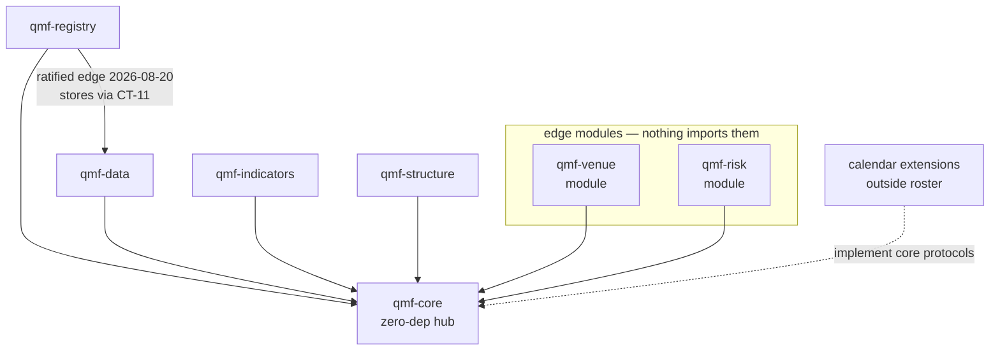
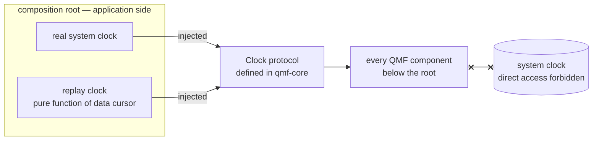

# Architecture Spine — QMF V1 Foundation

## Design Paradigm

**Contract-hub library workspace (hexagonal at workspace scale).** `qmf-core` is the dependency-free hub carrying only definitions — exact value types, domain nouns, typed refusals, fingerprints, protocols. All other packages depend inward on it; runtime concerns (clocks, calendars, venues) enter through protocols the core defines and outer packages or extensions implement. Nothing in QMF is an application; applications (trading node, backtest workspaces, QMX app) are built *with* it, outside this repo's scope.

## Inherited Invariants

Standing operator rulings that bind this spine (original ledger identities, read-only here):

| Inherited | From | Binds here |
| --- | --- | --- |
| Build-our-own boundary: QMX-owned contracts implemented locally; no foreign platform contract | DEC-0013 (live; DEC-0085/0086 are tombstones) | AD-6 prohibited tier; paradigm choice |
| Definitions-only qmf-core: no broker, loop, backtest, downloads | DEC-0022 | AD-6 zero-dep rule; AD-8 protocol-only clock |
| Five libraries + two modules roster | DEC-0024 / spec §2b | AD-2 package list; calendar extensions live outside the roster |
| Don't-box-in: open toolbox, strictness only at harness + live-money gate | DEC-0011 | AD-6, AD-8, AD-9 neutrality; note in AD-3 (governs consumers, not QMF's own source) |
| No futures/options ever; nouns must not preclude stocks/crypto | DEC-0015 | AD-8 calendars, AD-9 opaque symbols, AD-7 units |
| Framework-vs-node split: kill switch, news windows, SL/TP, Book runtime = node | circle-back ruling 2026-08-19 | AD-8 seams; AD-13 scaling; Deferred |
| Code legible to humans AND agents | L5 | AD-3 toolchain; Conventions |
| No shipped mock market data, fake Bots, or default strategies; synthetic data stresses, never validates edge | L6, L20 | AD-13 benchmark data rule |
| Every component ships executable tests AND reference usage demonstrating its public contract | L27 | AD-3 |

## Invariants & Rules

### AD-1 — Runtime matrix [ADOPTED 2026-08-19]

- **Binds:** all packages, CI, factory sandboxes
- **Prevents:** version skew making results non-comparable across sandboxes
- **Rule:** CPython 3.14 pinned everywhere. Tier-1 targets: Windows 11 x86-64 and Ubuntu LTS x86-64 — CI-gated once a remote exists; until then the factory runs the same gates locally and the Ubuntu target is untested. QMF code stays pure-Python and OS-neutral; other platforms work by construction but are untested in V1.

### AD-2 — One repo, seven packages [ADOPTED 2026-08-19]

- **Binds:** all
- **Prevents:** cross-repo coordination tax; sandboxes forced to install the whole framework; namespace shadowing; silent sibling-dependency leaks
- **Rule:** single repository as a uv workspace; seven installable packages (`qmf-core`, `qmf-registry`, `qmf-data`, `qmf-indicators`, `qmf-structure`, `qmf-venue`, `qmf-risk`) importing as the `qmf.*` namespace; `uv_build` backend; one committed `uv.lock`; lockstep release versioning for the seven roster packages. Mechanics: `qmf` is a PEP 420 implicit namespace — **no distribution may ever contain `qmf/__init__.py`**; every package uses `src/` layout (`src/qmf/<name>/`); every dependency (including sibling packages) is declared explicitly in that package's `pyproject.toml`; tier-2 runs each package's tests in an isolated per-package environment so an undeclared import fails rather than resolving through the shared workspace venv. A package may declare a **test-only** dependency on a contract's owning package purely to run its AD-4 contract tests — that is not a ratified runtime edge. Extensions — calendar, indicator, and structure alike — are separate versioned packages outside the roster, in the same workspace, on **their own SemVer ladder outside lockstep** (a tzdata pin change is at minimum a minor bump); an extension's distribution identity + version are identity fields of every artifact it produces, and discovery is explicit registration at the composition root, never ambient scanning. Shared nouns (Venue, Account, Instrument, WriterId, **Bar, Tick/Quote, BarSpec** — per AD-22) are **defined** in `qmf-core` and their records/lifecycle **owned** by `qmf-registry`; edge modules never define shared nouns.

### AD-3 — Quality toolchain [ADOPTED 2026-08-19]

- **Binds:** all packages, factory agents
- **Prevents:** per-agent tool drift in factory-written code
- **Rule:** ruff (format + lint), pyright strict workspace-wide, pytest. Strictness here governs QMF's **own source**; the don't-box-in ruling governs consumers, who are never forced into it. Coverage measured per package on every change, enforced at tier 1, floor 80%; the modules implementing CT-01 and CT-02 primitives require 100% branch coverage. Every package ships executable tests AND reference usage demonstrating its public contract (L27) as tier-1 artifacts. Public API convention: public value types are frozen dataclasses; seams are `typing.Protocol`s. Canonical commands: `poe fmt | lint | types | test | check`, identical on every machine.

### AD-4 — Three quality tiers, bound to factory events [ADOPTED 2026-08-19]

- **Binds:** all; factory pipeline
- **Prevents:** "tests pass" meaning whatever each run decided to check
- **Rule:** tier 1 = `poe check` (fmt + lint + types + unit + coverage) on every factory work unit (worktree/temp branch). Tier 2 = `poe check-integration` (tier 1 + integration tests + contract tests, each package in an isolated environment) on landing into the integration branch. Tier 3 = `poe check-release` (tier 2 + build all packages + clean-install smoke on both tier-1 OSes) on ship/release. **Contract test** (defined): executable conformance tests for a `CT-*` contract's public shape, owned by the contract's owning package, run by producer and all consumer packages at tier 2. Commands are host-neutral; bind to GitHub Actions only when a remote exists. Factory-internal review layers stack on top, never replaced.

### AD-5 — Two version ladders; meanings never mutate [ADOPTED 2026-08-19]

- **Binds:** all packages; every serialized contract
- **Prevents:** a system unable to read its own history
- **Rule:** code packages use SemVer in lockstep (roster packages only; extensions have their own ladder per AD-2), 0.x until the V1 blueprint ships. Anything deprecated keeps working with a warning for one release before removal. Every serialized contract carries its own integer format version stamped into every artifact; a format version's meaning never changes after the fact — incompatible change mints the next version plus a migration note. QMF never loses the ability to read old stored evidence; history is append-only. Re-deriving a value under a newer calendar/tzdata version produces a **new artifact with its own fingerprint and a lineage edge to the old one** — never a rewrite, never a silent equality.

### AD-6 — Dependency and licence tiers; zero-dependency core [ADOPTED 2026-08-19]

- **Binds:** all packages; factory dependency decisions
- **Prevents:** licence contamination; foreign-platform capture; a heavy core breaking the sandbox model
- **Rule:** permissive licences (MIT/BSD/Apache/PSF) freely allowed; LGPL only unmodified and separately installed; GPL/AGPL prohibited; strategy-family libraries prohibited; platform-imposing dependencies (own event loop/runtime/data model) prohibited. `qmf-core` takes zero outside dependencies (stdlib only). Every dependency gets one line in the workspace-root register `DEPENDENCIES.md`: name, licence, why. Borrowing mental models via study/reverse-engineering is always permitted; adopting code is the governed exception.

### AD-7 — Exact money [ADOPTED 2026-08-19, amended by contradiction sweep]

- **Binds:** CT-01; qmf-core, qmf-venue, qmf-risk, qmf-data
- **Prevents:** float drift; non-deterministic fingerprints; silent scale mismatches across package seams; unreconcilable broker disputes
- **Rule:**
  - Money/Price/Quantity are whole-number integer counts at a declared **scale** (number of decimal places). Tags: `Money(currency, scale)`; `Price(instrument, scale)` — a price is a ratio quoted for an instrument, never tagged with a single currency; `Quantity(unit, scale)` where `unit` is opaque (lot, share, coin, contract).
  - Mixed-scale arithmetic on the same currency/unit auto-promotes losslessly to the finer scale or refuses (typed refusal) — never an implicit rescale or rounding.
  - **The money path is a taint, not a location:** any value that transitively contributes to an order quantity, price, P&L, or balance is on the money path regardless of which package computed it. Binary float is banned on the money path; a float crossing back to Money/Price/Quantity passes a **named conversion boundary with an explicitly stated rounding mode**. The venue adapter boundary is one such named boundary.
  - **Foreign money is evidence** (mirror of AD-8's foreign-time rule): a venue's raw integers are stored verbatim with their declared scales (e.g. cTrader's 1/100000 wire price scale, per-symbol `digits`, per-account `moneyDigits`); conversions to framework values are derived with lineage; corrections are annotations, never rewrites. **Foreign floats are evidence too, but never identity:** a venue value delivered as a binary float converts at the named boundary at receipt to a scaled integer at a per-value-class pinned target scale with a declared rounding mode (pinned in CT-18 per AD-28); the raw float is retained only as integrity-checked provenance and is never the value a consumer reads.
  - Analytic float series remain permitted off the money path; their identity is label-derived (AD-10), never a hash of float bytes.
  - **Price subtraction is closed and delta-typed:** `PriceDelta(instrument, scale)` is a first-class value distinct from Price; the instrument-scoped pip/point is defined by AD-9's metadata records, never hardcoded. The **exact-rational** type (scaled integer or numerator/denominator) extends this idiom to every non-integer parameter (ratios, multiples, tolerances); binary floats never appear in parameters or identity. The exact→analytic and analytic→exact crossings are the named boundaries pinned in AD-22.

### AD-8 — Exact time [ADOPTED 2026-08-19, two-lens audited, amended by contradiction sweep]

- **Binds:** CT-02; every package; every stored record
- **Prevents:** results that stop matching after a server move, DST shift, tzdata update, or clock correction
- **Rule:**
  - Every stored timestamp is int64 UTC nanoseconds since the Unix epoch (POSIX, no-leap-second semantics). Representable range 1677–2262, stated once; all ns arithmetic is checked — overflow is an `invalid input` refusal, never a wrap. Instant `0` is a valid instant; an absent time is an absent field, never a zero. Local time is display-only and always labelled.
  - Civil date and trading date are distinct types. **`TradingDate` carries its calendar identity and version in-band**; equality is defined only within one calendar identity; cross-calendar comparison is a typed refusal. Trading date derives only from a calendar, never from formatting an instant. Causality is compared on instants only — trading date is never a causality proxy.
  - Core time vocabulary: Instant, CivilDate, TradingDate, Duration (signed int64 ns), Interval (half-open, contains/overlaps), SessionWindow. **`Duration` is a clock-agnostic quantity of nanoseconds and is freely storable.** The restriction sits on operations: a duration used for latency, timeout, cooldown, or cadence must be measured monotonically; a duration derived from two wall instants is an evidence span, never an elapsed-time measurement.
  - Two clock kinds, type-separated: wall (meaning, storable as Instants) vs monotonic. **A monotonic reading is never a timestamp and never an Instant.** It may be persisted only as an opaque boot-scoped diagnostic value that carries its boot/epoch id, is never compared across boots or machines, is excluded from identity, and is never rendered as a time. Clock access is a core-defined protocol; the composition root injects the real clock; replay injects a data-driven one; nothing below the root reads the system clock.
  - Ordering: instants alone never totally order events. Every record stream carries a per-writer strictly-increasing sequence; the deterministic tie-break `(instant, writer, sequence)` is a **replay-determinism device with no causal meaning** — causality tests refuse at equal instants rather than tie-break. Timestamps are never primary or dedup keys; **the identity of a stored record is its AD-10 fingerprint**; `(instant, writer, sequence)` is an ordering key only. Each source's actual resolution is stored beside the ns value. `WriterId` is a first-class core noun: stable, durable, minted per (machine, role, stream), accompanied by a boot/epoch id so restarts are visible without changing writer identity.
  - **Calendars.** Calendar identity is the **rule set** (e.g. `forex-17NY` v3), separate from its **binding** (which venues or accounts use it); venues sharing a rule set share the calendar identity, and only the rule set + tzdata version enter fingerprints — a venue change that doesn't change the rule set doesn't change derived-artifact identity. A market-hours calendar carries two separately-named facts, each with its own zone: an **accounting rollover** (which trading date an instant belongs to) and a **session schedule** (when the market is open). Every calendar supplies a rollover rule (24/7 included). Session and trading-day length is data; no consumer may assume a constant. A third named kind exists: the **day-boundary calendar** — an accounting-boundary rule parameterized by **account** (a prop firm's daily-loss day evaluated in its stated timezone is one) — it answers only "which day does this instant belong to for evaluation," is never substituted for a market-hours calendar, and produces TradingDates carrying its own identity. This holds the seam only; no prop firm is modeled in V1.
  - Forex market-hours calendar ships first: 17:00 America/New_York rollover (operator-adopted 2026-08-19 as QMF's **own accounting rule**), weekend gaps, holidays in scope. GAP-0037 verification completed 2026-08-20: no primary cTrader source states a daily-bar boundary — the venue's actual bar slicing is therefore **measured per broker** (first-connection check + continuous monitor, AD-28's verification suite); once verified it is **minted as a venue-scoped market-hours calendar identity** (identity is the rule set, so a measured boundary qualifies), giving venue-native bars a legal BarSpec anchor; until then venue bars are ungoverned observations, never assumed aligned to QMF's calendar. Swap-Wednesday is dropped from V1 (settlement machinery deferred; operator accounts are swap-free — note: a dated financing/admin-fee charge may still exist; "no swap" does not mean "no dated financing").
  - Calendar extensions **force the timezone path to their pinned `tzdata` package and verify at import** that the resolved tzdb version equals the pinned one, refusing (`unavailable dependency`) otherwise — the fingerprint must never attest a tzdb that wasn't used.
  - Foreign timestamps are evidence: stored verbatim with declared zone/offset/resolution, plus local receive wall time and (per the monotonic rule above) an optional boot-scoped receive-monotonic diagnostic; conversions are derived values with lineage; corrections are annotations, never rewrites. cTrader venue facts are ratified (2026-08-20, companion `ctrader-venue-facts.md`): timestamps are per-field-documented Unix ms UTC with two epoch exceptions (trendbar minutes; maintenance-end seconds); fields whose unit is undocumented (the spot-event timestamp) are verified-or-refused at first connection per AD-28's suite; receive-time recording is mandatory — the venue exposes no server clock (closed-set proof).
  - "Market-hours calendar", "day-boundary calendar", and "news calendar" are distinct named concepts; docs rename apart (COMP-CALENDAR-FEED is the news feed).
  - A **civil-time bucket key** — derived from an instant plus a declared zone and tzdata version — is a legitimate computed value (seasonality, session-of-day statistics): never a timestamp, never a causality proxy, and identity-bearing including its zone and tzdata version. "Local time is display-only" governs evidence timestamps, not computed grouping keys.
  - Operational clock rules (chrony on the VPS, slew-only while live, no-trade-before-sync, drift bands with typed refusals, gap records for suspect windows, RTC-in-UTC, prop-firm day boundaries via account-scoped day-boundary calendars) are stated obligations for node/ops docs — carried in companion `time-audit-devops.md`, binding on later sittings.

### AD-9 — Instrument, venue, and account identity [ADOPTED 2026-08-19, amended by contradiction sweep]

- **Binds:** CT-03; qmf-core nouns; qmf-registry records; qmf-data, qmf-venue, qmf-risk
- **Prevents:** two brokers' records mixing; renames rewriting history; forex assumptions leaking into symbols; two packages minting two Venue types
- **Rule:** instrument identity is (venue, venue's own symbol), the symbol opaque and never parsed. **`VenueId` gets the same discipline as symbols:** operator-minted, opaque, stable, never derived from a mutable broker attribute, never reused; a distinct broker/legal entity is a distinct venue even on shared infrastructure (a prop firm white-labeling cTrader is its own venue); renames are dated alias records. Aliases, renames, asset class, and mutable metadata are separate dated records pointing at identities; stored history never rewrites. Venue and Account are distinct first-class nouns **defined in qmf-core, records owned by qmf-registry** (per AD-2): one venue may hold many accounts, each with a role (live / demo / paper-validation / paper-benched / prop-firm); Books bind to accounts. Multi-broker (≈6 venues) and broker migration are normal, not special cases. **Broker identity is deployment configuration, never architecture** (operator ruling 2026-08-20): no rule anywhere may name a specific broker; which broker fills a venue slot is decided at deploy time. Broker/venue **legal identity** and **platform/protocol family** are distinct: the prohibition binds broker entities and VenueIds; platform-family clauses (a cTrader-platform adapter profile, a FIX profile, a CCXT-class profile) are legitimate adapter-scoped contract surface.

### AD-10 — Deterministic fingerprints [ADOPTED 2026-08-19, recipe pinned by reviewer gate]

- **Binds:** CT-05; every registered or stored artifact
- **Prevents:** two conformant implementations disagreeing; renames changing identity; sandbox merges refusing themselves
- **Rule:**
  - **One implementation:** the canonical serializer and fingerprint function live in `qmf-core`; no other package may compute a fingerprint except by calling it.
  - **The `fp1` recipe, pinned:** UTF-8 JSON; object keys sorted lexicographically at every depth; no insignificant whitespace; strings NFC-normalized; all identity numerics are integers (money scaled-ints, time ns-ints, scales, versions) — **floats are refused in identity content**; null is prohibited — an absent value is an omitted key; arrays are order-significant. Hash: SHA-256. Emitted as `fp1:sha256:<hex>`. The prefix versions the **recipe**; upgrades mint `fp2`, old fingerprints stay valid forever.
  - **Field classification:** every contract field is identity by default; display-only exclusion requires an explicit, versioned declaration in the contract — never an implementer's judgment call.
  - **Float-bearing artifacts** (analytic series): identity derives from the result label (AD-12) — producer, inputs, range, world — never from hashing float bytes; float payloads carry an integrity checksum plus (OS, library-version) provenance, and cross-OS bit-identity of float content is explicitly not promised.
  - **Collisions, split:** an idempotent re-write (same hash, byte-identical content — the sandbox-merge normal case) is accepted silently; a true collision (same hash, differing bytes) is refused and alarmed, never overwritten.

### AD-11 — Typed refusals [ADOPTED 2026-08-19, mechanism pinned by reviewer gate]

- **Binds:** CT-04; every public QMF boundary
- **Prevents:** failure handling by parsing error prose; two construction APIs for one value type
- **Rule:** every public operation succeeds or returns a typed refusal: category (invalid input / unsupported capability / unavailable dependency / stale evidence / policy rejection / transient venue failure / storage failure), machine-readable context, and retryability (yes/no/after-condition). `storage failure` covers disk-full, corrupt files, locked or truncated stores — the I/O surface AD-19/AD-20 add; store-library exceptions are translated at the qmf-data boundary, never propagated. Categories are addable in later versions, never redefined. **Mechanism:** public boundaries **return** refusals (result unions); exceptions are reserved for programmer error and never carry refusals across a package boundary. Value-type construction is one pattern everywhere: an unchecked constructor for trusted internal use plus a validating factory (`try_create`) returning value-or-refusal. Assumes nothing about node shape.

### AD-12 — Result label and worlds [ADOPTED 2026-08-19, amended by contradiction sweep]

- **Binds:** CT-05; every computed result entering evidence
- **Prevents:** two computations sharing a label, or one computation wearing two; worlds mixing in merged ledgers
- **Rule:**
  - Every result carries: **producer contract identity** (the configured producer's fingerprint — the CT-16 configured indicator, the CT-17 configured family — distinct from the format version, so `EMA(20)` and `SMA(20)` can never share a label), producer **contract format version** (AD-5's second ladder — package SemVer never enters identity and may ride only as display-only provenance), input fingerprints, evidence time range, computation/occurrence identity, **evidence class** (confirmed / unconfirmed / provisional, per AD-25), and world. Together these are its identity. Human display names live outside identity.
  - **Computation identity vs occurrence:** the computation identity is content-derived (from label parts) so identical work from two sandboxes deduplicates and merges; the occurrence record (when/where/by whom it ran) is separate provenance outside identity.
  - **Worlds, defined:** `live` = real venue clocks and quotes, real or demo money — the account role (AD-9) carries money-reality, so paper/demo runs are `world = live` and stay comparable to live for alpha-decay sensing; `replay` = a data-driven injected clock over recorded history (real UTC instants; implementable today); `simulated` = synthetic data — **reserved but unusable in V1**: writing `world = simulated` into governed evidence is a `policy rejection` refusal until the backtesting sitting defines simulated-time typing.
  - **Namespace rule:** a non-live world may never write into the live evidence namespace; factory sandboxes never produce timestamps that enter an evidence store. Identity distinctness alone does not deliver world separation — storage separation does. **Namespaces are also role-scoped within `world = live`:** the live evidence namespace admits only records whose account-binding role is `live`; demo, paper-validation, and paper-benched records write to role-scoped namespaces. Evidence produced in a factory sandbox carries an identity-bearing `provenance = sandbox` field, blocking dedup-merge into the operator store.

### AD-13 — Measure-then-budget performance [ADOPTED 2026-08-19]

- **Binds:** all packages; merge gate (tier 2)
- **Prevents:** the factory optimizing against invented numbers; slow rot nobody can attribute
- **Rule:** no invented performance numbers. Every component ships a benchmark harness (same status as unit tests) measuring **speed and peak memory** at a load ladder expressed in **framework-native units per package** (calls/s, series length, artifact count), with the ~40-bot node scenario (and 10/100/200 marks) as the motivating reference for sizing the ladder. Memory is a first-class budget: regressions in peak memory fail the gate the same as slowdowns. First real measurements are recorded as fingerprinted baselines **scoped to a declared (OS, CPU-class) tuple**; each benchmark's regression threshold is stated when its baseline is recorded, as a multiple of measured run-to-run variance; thereafter regressions beyond threshold fail the merge gate. One explicit **design constraint** (not a measurement): `qmf-core` imports in well under one second (sandbox-critical). Benchmark and test data are generated at runtime or held as controlled fixtures — never shipped as product artifacts (L6); synthetic data stresses infrastructure, never validates edge (L20). Server sizing and scaling are node/compute decisions, made later with these numbers.

### AD-14 — Loud failure, traceable behavior [ADOPTED 2026-08-19, operator-added]

- **Binds:** all packages
- **Prevents:** silent failures; multi-hour what-broke hunts for a solo operator
- **Rule:** errors and refusals always carry context and are never swallowed; structured logging with a correlation id — field name `correlation_id`, propagated across every package boundary — follows one event across components (pure-computation boundaries are exempt: correlation rides the caller's context, never a pure value contract's signature); every component exposes a no-argument `health()` returning a typed health report — a "component" here is an owner of external resources or long-lived state (streaming indicator instances and structure family instances included; pure batch functions excluded). **Logs are not journals:** operator/diagnostic log text renders timestamps as UTC ISO-8601 with explicit Z; journals and every evidence stream store int64 UTC ns + writer + sequence per AD-8, with ISO-8601 permitted only as an additional display-only field excluded from identity. Emitted signals must be exportable to standard monitoring stacks (Prometheus-class metrics, push alerts); the stack choice itself is node/ops territory. Full monitoring/evaluation design lands in the data/ops sitting; this obligation binds now.

### AD-15 — Concurrency stance [ADOPTED 2026-08-20]

- **Binds:** all packages
- **Prevents:** two packages disagreeing on whether QMF is safe to use simultaneously; async contagion through every signature
- **Rule:** QMF values are immutable (safe to share by construction); purity binds the pure-computation libraries (core, indicators, structure); components that own an external resource (stores, recorders, adapters) are the stateful class and follow one-writer-per-stream with unlimited readers — a "writer" here IS the holder of an AD-8 `WriterId`. QMF never spawns threads or background work — the application owns all concurrency; async APIs exist only at the venue network edge, never in core or the libraries. The venue adapter's periodic session duties (heartbeat, token refresh, reconnect, gap replay, verification monitors) are **declared schedulable duties the application's scheduler drives** — the adapter defines the work, the application runs it; session recovery never resubmits a command (AD-27).

### AD-16 — Registry records and lineage [ADOPTED 2026-08-20]

- **Binds:** CT-06, CT-07, CT-09; qmf-registry
- **Prevents:** a universal recipe card by the back door; a graph-database dependency; unrebuildable indexes
- **Rule:** per-kind record schemas (each its own versioned contract) share a tiny common header: kind, contract format version, at-birth parent references (identity-bearing), plus writer and sequence per AD-8. A record's **stable id is derived from its `fp1` fingerprint** (never minted); created-at and other occurrence facts are declared occurrence/display-only per AD-10 — so identical work from two sandboxes deduplicates. Lineage that accrues after birth (supersedes, promoted-from, occurrence-of, corroborates, disagrees-with, **confirmed-as**, and the AD-25 lifecycle/interaction record kinds — confirmation, invalidation, interaction) lives **exclusively** in append-only typed edge records referencing fingerprints; readers never union header refs with edges. The occurrence/display-only classification applies to **computations**; a structure object's anchor span and lifecycle instants are identity fields and may never be classified away (AD-25). Edge files are pinned JSONL: one `fp1`-canonical JSON object per line, LF-terminated, append-with-fsync, no rewrite, size-based rotation with a monotonic file ordinal; indexes are local and rebuildable. Kinds are addable, never redefined; Bot and Book kinds are reserved names whose contents come from their own sittings. No database server.

### AD-17 — Multiplicity at every layer [ADOPTED 2026-08-20, resolves DEC-0040]

- **Binds:** qmf-registry; the future Bot/QML schema sessions
- **Prevents:** hardcoded cardinality-one anywhere in the bot vocabulary foreclosing experiments
- **Rule:** a Bot contains one-or-more confluences; a confluence contains one-or-more levels, triggers, and confirmations; components may compose (several levels forming one composite level — a composite is its own artifact with lineage to its children). No layer of the bot vocabulary may hardcode "exactly one." Multiplicity collections are canonically ordered by child fingerprint ascending unless the owning contract explicitly declares the collection order-significant (AD-10 corollary) — **causal structure composites invert that default** (children order-significant unless declared unordered, per AD-25), and a composite's children may be of **any governed kind** (indicator results, structure objects, calendar windows), each referenced by fingerprint. **Bot identity is its content**; the Bot↔Book↔account binding is a separate dated binding record outside Bot identity — one Bot at exactly one Book at any time, but re-binding (paper → live) never mints a new Bot, so paper and live performance stay comparable for alpha-decay sensing. Exits are Book/risk/node territory.

### AD-18 — Promotion record skeleton [ADOPTED 2026-08-20]

- **Binds:** CT-08-adjacent; qmf-registry
- **Prevents:** promotions with no durable, human-legible record
- **Rule:** the registry reserves a promotion-occurrence card kind: human-only signer, signed immutable record, and a mandatory plain-words summary field that is **explicitly declared an identity field** — the signature attests the exact words the human read; a typo fix mints a new record with a supersedes edge. "Signing" in V1 means the operator's recorded approval captured as an immutable occurrence attesting the record's `fp1` string (reviewer identity + instant); cryptographic signatures are ops-sitting territory, no crypto dependency now. The registry card is **canonical**: the journal's `promotion` event carries only the card's fingerprint plus `correlation_id`, never a second schema. The evidence checklist accretes from later sittings (untouched-test proof ← data splits; causality slot ← backtesting; risk binding ← risk sitting). The promotion gate itself — workflow, UI, timing — is platform territory, not QMF.

### AD-19 — Data rooms, stores, and bitemporal law [ADOPTED 2026-08-20]

- **Binds:** CT-10, CT-11; qmf-data
- **Prevents:** ad-hoc storage choices per agent; overwritten evidence
- **Rule:** seven room-roles — ingest door, immutable raw archive, processed, journal, split-governed research door, backup, and the **registry room** (records + lineage, stored for qmf-registry under the same retention, backup, and migration law) — **instantiated per world** (AD-12): a read that crosses worlds is a `policy rejection` refusal. Stores: Parquet (columnar time-series), DuckDB (local analytics), SQLite (transactional metadata), JSONL (append streams) — each behind a QMF-owned contract so engines are swappable; contract signatures are stdlib-typed at the boundary; no database server. Only raw-archive and journal formats are evidence-bearing — analytics engines (DuckDB) hold rebuildable views only, so an engine's format break (e.g. DuckDB v2.0's new storage format, previewed 2026-08-17) costs a rebuild, never evidence; engine majors are pinned per release. "Rebuildable" licenses deletion only of artifacts **no result label cites**: a processed artifact cited as an input is retained forever, and any rebuild pins the original calendar/tzdata version. Every external fact carries event-time, known-at, **source**, and revision — `source` is a core provenance noun orthogonal to `VenueId` (a provider you can trade at is a venue; a provider you only read from is a source); corrections are appended, never overwrite.

### AD-20 — Migrations, retention, backup [ADOPTED 2026-08-20]

- **Binds:** CT-11, CT-14, CT-26; qmf-data, qmf-registry
- **Prevents:** an upgrade destroying the only copy; silent data loss; untested backups
- **Rule:** migrations run preflight checks → backup first → dry-run → migrate → verify, with a documented restore path; never in-place mutation of the only copy. Raw originals and lineage are kept forever; time-series is partitioned by source, instrument, and time window; journal trimming rules are set only after measured volume. Backup: the ratified design is nightly, encrypted, versioned, off-machine (object-storage bucket), with automated sample-restore tests and a periodic full-restore rehearsal — **QMF provides the backup/restore/verify primitives (CT-14/CT-26); the schedule and execution are application/ops-owned** (same split as all scheduling, per AD-21); encryption key custody and the crypto dependency are named at the node/ops sitting. Topology: trading-node VPS records and syncs down; workstation holds the working archive; the bucket catches nightly copies.

### AD-21 — Splits, journal events, and the doors to outside [ADOPTED 2026-08-20]

- **Binds:** CT-12, CT-13, CT-15; qmf-data
- **Prevents:** research quietly consuming its own exam questions; untraceable events; source disagreements merged away
- **Rule:** dataset splits are fingerprinted, time-ordered, non-overlapping manifests; **each manifest pins exactly one calendar identity + version in-band** and refuses rows carrying another calendar identity; boundaries are explicit stored TradingDates or instants (never civil dates), and the seal boundary is a **frozen** TradingDate never re-derived under later tzdata. **Records partition into splits by knowledge time** — confirmed-at for structure objects, the knowable-at of the last contributing input for indicator results; a manifest refuses any record whose observed-at precedes a boundary while its confirmed-at follows it, unless the manifest's declared embargo covers the gap. **Purge and embargo widths are required manifest fields now**, entering the split fingerprint, defaulting to the maximum declared (warm-up + confirmation-delay bound) across every producer the split cites — a split reused with a longer-horizon artifact refuses rather than leaks. The 12-month seal is a no-peek lock (not retention — data is kept regardless), **enforced now as a `policy rejection` refusal at every qmf-data read boundary — raw, processed, research door, and restored backups alike — independent of the deferred GAP-0016/0017 gates**; the sealed period gets one logged final look, journaled as a named `control action` subtype, and is never silently recycled. The journal is N streams — one per producing component, each under its AD-8 `WriterId` with gapless per-(writer, boot-epoch) sequences (a gap signals loss) — recording seven event types (decision, order, fill, risk transition, promotion, data quality, control action); `correlation_id` is a linking annotation **excluded from `fp1` identity by explicit versioned declaration**; causal linkage across streams uses AD-16 typed edges, never timestamps. Source adapters: qmf-data defines contracts, normalization, validation, and idempotent intake keyed on (source, source-native id, revision) — a provider revision is a new artifact, never an AD-10 collision; applications own scheduling, retries, supervision, and UI. The **news-calendar recorder** keeps provider-native identity and revisions (legal archiving posture remains an open operator item). Tick sources are separately identified (Dukascopy history vs broker feed), bid and ask preserved with source timestamps; disagreements between sources stay visible via `corroborates` / `disagrees-with` edges, never merged.

### AD-22 — Indicator protocol and series vocabulary [ADOPTED 2026-08-20, amended by increment gate]

- **Binds:** CT-16; qmf-core (series vocabulary), qmf-indicators
- **Prevents:** research computed on numbers the live path never sees; per-agent indicator drift; identities that silently merge non-equal computations; instance count scaling with bot count instead of configurations
- **Rule:**
  - **Series vocabulary (qmf-core; shared nouns per AD-2):** `Bar` (OHLC + interval + BarSpec), `Tick`/`Quote` (bid/ask with source timestamps per AD-21), `BarSpec`, series references, and the exact-rational parameter type are defined in `qmf-core`; no other package may define them. **`BarSpec` replaces the bare word "timeframe" everywhere:** a discriminated aggregation rule — time-interval | tick-count | volume-threshold | notional-threshold | price-brick | range | session — with exact parameters and, for time-based kinds, the anchoring calendar identity + version. Bar aggregation is a fingerprinted qmf-data derivation (processed room, lineage to source); a bar series is well-defined only via its BarSpec.
  - **Bulk form, pinned:** a frozen value over a read-only `memoryview` of immutable `bytes` (little-endian int64), explicit length, and per-channel out-of-band metadata — scale, declared kind (exact-price / exact-quantity / float-analytic / integer-code / boolean / categorical), unit, and quote side (bid / ask / mid / last; `mid` is a derived series with a stated rounding mode). Checksums and serialization are defined over exactly that byte layout; numpy/Arrow conversions are private to the consuming package. A parallel integer-encoded **presence map** marks every position `present | provisional | not_ready | gap | absent_by_schedule`; positions are never omitted or shifted; NaN and sentinel markers are prohibited; equality compares presence maps first, values only at present positions. L2 depth / footprint-class nested data is outside the V1 series vocabulary — ungoverned research lane until a later pass widens the form.
  - **Two named AD-7 conversion boundaries, one qmf-core implementation each:** the exact→analytic descale (pinned formula, stated rounding, refusal past float64's exact-integer range — no package descales except by calling it), and the analytic→exact return (any output channel declared exact-price, and any evaluated object level, declares rounding mode + target scale as fingerprinted contract surface).
  - **Identity = the entire declared configuration,** declared explicitly and versioned per AD-10 — never an enumerated shortcut; an element missing from the fingerprint is a contract defect. It includes: formula id (AD-9 minting discipline — opaque, stable, never reused), contract format version, exact parameters (exact rationals — scaled integers or numerator/denominator — never binary floats), the **ordered named input set** (one or more series references, each carrying instrument-or-source identity, BarSpec, channel kind, quote side, and — for derived inputs — the upstream artifact's fingerprint), declared calendar requirements (rule-set identity + version + tzdata version), alignment policy, missing-value policy, warm-up, output schema, supported modes, and the arithmetic-reference configuration. That fingerprint is the only dedup key.
  - **Typed configuration inputs:** a configuration may declare market-hours / day-boundary / news calendars, instrument-metadata snapshots (tick size, digits, pip — the registry record's fingerprint is identity-bearing), and external event anchors (`(source, source-native id, revision)` per AD-21) — injected by the composition root against core protocols. Declaring an input creates no package dependency edge.
  - **Composition:** any CT-16 or CT-17 output series is a legal input to any CT-16/CT-17 configuration; the upstream fingerprint enters downstream identity. A computed/synthetic series is identified by its result label (derived-series identity) and never mints an Instrument. Re-implementing arithmetic a governed producer already publishes is a contract defect under AD-23.
  - **Modes:** a configuration declares its supported modes; batch-only and streaming-only are conformant (a batch-only configuration is heavy on the live path by definition). Where both are declared, the **equality law** binds as an AD-4 tier-2 contract test: a same-process, same-build comparison against a per-configuration comparator declared in integer ULPs (default 0), over canonical inputs = (series, exact parameters, cold initial state); the seeding rule and the reference's leading-undefined-prefix → not-ready mapping are declared contract surface. Cross-OS/cross-build agreement is never this gate — it is an AD-23 registered comparison artifact. A separate **restore-equivalence** test binds snapshot/restore: restore-then-N-updates ≡ cold-warm-then-the-same-N-updates.
  - **Warm-up** is an integer count of completed input observations in the input series' own sample unit (per its BarSpec) — never ticks, never a Duration — one value per configuration, identical across modes, at least the reference's lookback; an optional declared time bound is null for event-driven BarSpecs (affecting AD-24 eligibility). Readiness is recurring: a configuration may declare a calendar-anchored reset that re-enters not-ready. A streaming implementation needing more observations than declared is non-conformant, not differently warmed. During warm-up the output is a marked not-ready value, never a number.
  - **Outputs:** CT-16 declares an output schema — ordered named channels, each with kind, arity (scalar-per-sample / fixed vector / keyed-by-price-bin), and index offset. Outputs are full-length and index-aligned to the input (begin-index trimming prohibited). Every sample carries a **knowable-at instant** — the earliest instant at which every contributing input was knowable — and the configuration declares its bar-closed vs in-progress emission policy; `provisional` samples (incomplete aggregation period) never enter governed evidence.
  - **Missing vs closed:** a position the market-hours calendar declares closed is `absent_by_schedule`, never a gap; missing = calendar-open with no data, handled per the declared policy — never silent filling. Multi-series alignment is a declared policy; only **as-of last value known at or before the evaluation instant** is permitted for governed evidence; forward-fill or interpolation across the evaluation instant is a `policy rejection`. All failures are AD-11 typed refusals.
  - **Streaming instances** are the named stateful class in AD-15's exemption: a mutable instance with exactly one feeder — one `WriterId` holder, not one input stream — and unlimited readers; every streaming output carries the input sequence number that produced it. Dedup is per-process and application-owned (equal fingerprints guarantee substitutability; the library ships no global registry); instance count scales with distinct configurations, not consumers. A state snapshot is an AD-5 serialized contract with its own format version, scoped to a declared (OS, arithmetic-reference build) tuple; restoring across tuples is an `unavailable dependency` refusal; a result computed from restored state carries the snapshot fingerprint as an input fingerprint. Evidence emission granularity is declared contract surface (per-window); streaming updates are not individually evidence-bearing.
  - **Extensions:** custom indicators are authorable as plain Python outside governed evidence, always. To enter governed evidence they conform to CT-16 as extensions under AD-2's extension mechanics — separate versioned packages outside the roster, own SemVer ladder, distribution identity + version as identity fields of every artifact produced, discovered by **explicit registration at the composition root** (never ambient scanning) through the package's one named catalog surface (the single public registration point). A working plain-Python experiment **graduates** through this path with a lineage edge to its originating research artifact.
  - Two AD-13 rungs per configuration — burst throughput and per-tick latency, denominated per accepted input observation at the configured BarSpec (the no-op tick path measured separately) — both factory-gate machinery; production visibility is AD-14's job.
  - `qmf-indicators` depends on `qmf-core` only (D-1 answer: no new edges). Public surface: the CT-16 protocol, the series vocabulary, and the catalog surface; everything else private (underscore convention).

### AD-23 — Canonical arithmetic: pinned references, upgrades gated [ADOPTED 2026-08-20, amended by increment gate]

- **Binds:** CT-16, CT-17; **every producer of governed evidence, extensions included**; the AD-6 register
- **Prevents:** silent arithmetic drift under dependency upgrades; two owners of one formula's numbers
- **Rule:**
  - Where the pinned reference implements a formula, wrapping it is mandatory and it is canonical (wrap-not-reimplement). **Where it does not** (VWAP, Ichimoku, session-anchored levels, structure arithmetic, QMX-original formulas), **the QMX implementation is the canonical arithmetic for that formula**, pinned by its own contract format version under the identical upgrade gate. Streaming implementations are QMX-owned and held equal to the canonical batch arithmetic by AD-22's equality law.
  - The pinned reference is TA-Lib, pinned per QMF release as the **lockfile-resolved artifacts (distribution filename + hash) of both the C library and the Python wrapper** (0.7.1 + 0.7.1, verified current 2026-08-20) — the artifact identity, not a version string, is what AD-10 float provenance records. The reference's process-global configuration (compatibility mode, candle settings) is a declared, identity-bearing **reference-configuration record**: fixed at stated values, asserted at import (`unavailable dependency` on mismatch, exactly as AD-8 treats tzdata), never mutated at runtime; a configuration change mints exactly like a version upgrade.
  - Upgrades are gated, never silent: the comparison suite runs first; an output change for identical canonical inputs mints the **per-configured-indicator contract format version** — never a protocol-wide bump, so unchanged indicators keep deduplicating — with recorded before/after evidence; an output-identical upgrade re-pins without a mint. (Precedent: TA-Lib 0.7.1 itself changed MACD/MACDFIX/TRIX/ULTOSC period=1 outputs.)
  - Dual-reference checks are registered comparison artifacts — input fingerprint + parameter fingerprint + declared tolerance + verdict — required wherever a second reference exists. Tolerances, and AD-22's mode comparator, are declared as **integer ULP counts** (or a scaled-integer pair), never decimal text, never floats.
  - No governed producer re-implements arithmetic another governed producer publishes: a structure family needing an indicator consumes it as a declared input (AD-22 composition), never inline.

### AD-24 — Light vs heavy: budget-declared, benchmark-policed [ADOPTED 2026-08-20, amended by increment gate]

- **Binds:** CT-16 **and CT-17**; qmf-indicators, qmf-structure; the AD-13 ladder
- **Prevents:** heavy computation on the live decision path; classification by name or vibe; machine-scoped verdicts leaking into identity
- **Rule:**
  - A configuration is **light** iff it declares AND benchmark-proves: (1) per-update cost within the live-path latency rung; (2) bounded declared state size within the ceiling stated in the owning contract; (3) **either** a bounded declared evidence window **or** a declared anchor-reset rule with O(1) per-update cost inside bound 2 — an anchored configuration (session VWAP, cumulative "since X" statistics) declares its **anchor kind** so embargo widths compute from the anchor, not a window; (4) synchronous availability on the trading path — a marked not-ready value satisfies it.
  - The same four bounds bind **structure families**: per-update cost, bounded live-object-set size, bounded scan/lookback window, synchronous availability — same benchmark policing, same refusal for a failed light claim.
  - **The verdict never enters identity:** the declared budget is contract surface; the light/heavy verdict is a machine-scoped AD-13 benchmark artifact, declared display-only for fingerprint purposes. **Until the live-path rung has a recorded baseline, every configuration is heavy by default and a light claim is refused at the gate.**
  - A heavy configuration's synchronous entry point returns `unsupported capability`. Every fanned-out heavy value carries the instant + input sequence of its last input; consuming one past its declared maximum age is a `stale evidence` refusal. Heavy runs off the trading path (MIS/research side, node territory — computed once and fanned out) through the same contracts; different placement, not a different species.
  - Classification is per configuration, never per name. Declaration = the promise, AD-13 measurement = the proof, AD-14 metrics = runtime visibility, UI display = platform territory.

### AD-25 — Causal structure lifecycle [ADOPTED 2026-08-20, amended by increment gate]

- **Binds:** CT-17; qmf-structure; AD-16 record kinds
- **Prevents:** repainted/look-ahead structure entering evidence; strategy vocabulary leaking into the chart-object taxonomy; lock-in to a built-in family set; a mutable state machine sitting on the immutable store
- **Rule:**
  - A structure **family is a type of chart object** — never a strategy, bot, or Book category, and never named after a trading school. Geometry is family-declared and **open**: point, level, zone, span, distribution, graph. Clock-confirmed (degenerate) confirmation is legal — "confirmed the instant the window opens under calendar C" meets the bar. A standing object (an a-priori level such as a round number) declares observed-at = its configuration instant.
  - **Lifecycle on the immutable store:** an object is minted **once, at observation**, carrying its family identity + version, exact parameters, declared confirmation rule, **anchor span** (start instant, end instant, price bounds — frozen at observation, explicitly permitted to precede observed-at, excluded from every causality test), and **observed-at** — defined as the earliest instant the object was derivable from causally-available data (known-at, never event time). Confirmation, invalidation (its instant = the detection instant), and **interaction records** (instant, price, family-declared interaction measure — the only permitted way an object's state evolves) are separate append-only AD-16 records/edges referencing the object's fingerprint, each instant an identity field of its own record; the object itself is never mutated. Current state ("still valid at T?", "still unmitigated?") is a **read-time fold** over the object's edge stream per CT-17's stated read-resolution rule — the lifecycle/interaction-fold half of the deferred annotation rule lands here, now. Anchor span, observed-at, and every lifecycle instant are **identity fields, never occurrence-classified**: a structure object is a fact about the market at a time, not a computation (mirrored in AD-16).
  - **Emission invariant, checked in-component:** `anchor.start ≤ anchor.end ≤ observed-at ≤ confirmed-at ≤ invalidated-at`, and observed-at ≥ the maximum evidence-time of every input actually consumed — violation is an `invalid input` refusal. This cheap look-ahead guard binds now, independent of the deferred GAP-0016 gate.
  - **Precise-rule bar:** a family ships into the governed library only when its confirmation rule states "confirmed the moment X happens," with X knowable at that instant; imprecise concepts stay free in research lanes (plain Python, ungoverned); a mechanically-stated variant of any school's concept is admissible under the same bar. **Evidence class (confirmed / unconfirmed / provisional) is a named part of the AD-12 label and a declared identity field**; an unconfirmed output links to its confirmed successor via a typed `confirmed-as` edge; a read requesting confirmed evidence **refuses** unconfirmed rows (`policy rejection`) rather than filtering silently. A decision at instant T may consume evidence with confirmed-at ≤ T — equality is consumption, not look-ahead; AD-8's refuse-at-equal rule governs causality tests between derived artifacts.
  - **Continuous and calendar-anchored objects:** a sloped object (trendline, channel, decaying rail) is identified by integer **anchors** — (instant, exact Price) pairs — plus a declared versioned evaluation rule; slope is derived, never stored, never identity. Evaluation at an instant crosses the named analytic→exact boundary (AD-22). A calendar-anchored level declares its sampling policy (`last-known-at-or-before` | `refuse`) and schedule-gap policy (`refuse` | `nearest-open-instant` | `carry-previous-session`), fingerprinted. Observing a news instant or release as evidence is ordinary input consumption, bound to the revision known at observed-at; **acting** on news stays node territory.
  - **Confirmation delay** is a declared **maximum bound** — an integer count of observations at the family's BarSpec; an `unbounded` declaration is legal only for families excluded from split-governed evidence. With AD-22's warm-up it feeds AD-21's purge/embargo widths; a composite declares the sum of its children's bounds.
  - **Composites (AD-17):** a composite's confirmed-at is the maximum of its children's confirmed-at and its observed-at the maximum of theirs — never earlier than any child. Children of a causal composite are **order-significant by default** (a family declares a collection unordered explicitly). Children may be of any governed kind — indicator results, structure objects, calendar windows. Invalidation **never cascades automatically**: a family declares its own invalidation predicate (which may reference a parent's lifecycle facts); readers may compute cascade at read time from lineage. A refit is a new artifact with a `supersedes` edge, anchors frozen at each fit, the lineage head keeping the first observed-at.
  - **Routing test:** a value per evaluation instant is CT-16; a discrete object with a birth and a lifetime is CT-17; a concept expressible both ways declares which it is; either consumes the other per AD-22's composition rule.
  - **Persistence:** the law binds governed evidence; live in-memory use persists nothing — but any object **cited** by a journal event or result label becomes governed evidence by that act and is persisted (or its fingerprint-bearing content inlined into the citing record). Scanners are expected to run ungoverned and promote only confirmed objects. AD-22's state bound and snapshot/restore obligations apply to families verbatim. CT-17's AD-13 rungs: active object-set size, objects minted per bar, interaction records per bar.
  - **Emissions:** structure objects, lifecycle records, and comparison artifacts are **registry record kinds** (CT-06/CT-07), minted by the composition root, which holds the WriterId and the gapless per-(writer, kind) sequence; the library returns fingerprintable content, never stamped records.
  - **No privileged families:** the V1 seed candidates (swing points, horizontal levels from confirmed swings, zones, structure breaks) are candidates only; operator-authored from-scratch families are first-class peers under identical law — family authoring via the AD-22 extension shape (graduation path included) is the primary use case. Families are QMX-owned, versioned, addable never redefined. Family ids follow AD-9's minting discipline.
  - `qmf-structure` depends on `qmf-core` only in V1. Public surface: the CT-17 protocol and core value types; everything else private.

### AD-26 — Venue secret lifecycle [ADOPTED 2026-08-20, amended by increment gate]

- **Binds:** CT-21; qmf-venue; every credential-bearing component
- **Prevents:** secret values or deployment identity leaking into code, evidence, logs, or sandboxes; an undetectable binding-identity collision; an unrecoverable credential compromise
- **Rule:**
  - QMF components handle **secret references**, never values. A secret reference is an **opaque minted id** under AD-9's discipline — stable, never reused, never encoding venue, broker, account, environment, or key material; any human-readable label is a separate field held outside evidence; construction validates opacity (`invalid input`). Values are injected at the composition root from the deployment environment's protected store (`systemd-creds`-class on the VPS; store mechanics and key custody land at the node/ops sitting).
  - **Mechanism, not policy:** `qmf-core` ships typed `SecretRef` and `SecretValue`; a `SecretValue` never renders its value — repr, str, serialization, and logging all yield the reference id — and a tier-1 secret-scan gate rides `poe check`. Secrets never appear in repositories, configuration artifacts, docs/chat, `.env` files, CLI arguments, journals, evidence, fingerprints, or logs; a missing, expired, or rejected credential is an `unavailable dependency` refusal carrying the reference id, never the value; refusal context, logs, health reports, and metrics carry the reference id only.
  - **Identity:** an account-binding record's identity is `(VenueId, AccountId, role, world)`; its secret reference is declared occurrence/display-only and excluded from `fp1` — a credential is a deployment fact, never a market fact.
  - **The connection manager is the single named component permitted to hold secret values in memory**, for a session's lifetime; it receives a core-defined `SecretStore` port (read + atomic replace) injected by the root; values never cross back out — no getter, no log line, no refusal context, no health field, no metric label.
  - **Rotation:** a credential is a one-writer stream (AD-15): exactly one live refresher per credential — a workstation tool never refreshes a credential a VPS session owns. Where a venue rotates refresh material on use, the new secret is stored (atomic replace) **before** the old is discarded; a failed store after rotation is an alarm **and** a command-pipe block (`unavailable dependency`, after-condition = successful store or operator re-provision) — the sensing pipe is unaffected; where the venue already invalidated the old material, the session is marked degraded and the compromise drill triggers.
  - **Compromise recovery** is a documented, tested drill: venue-side invalidation (cTrader-platform profile: cTID re-authorization invalidates all outstanding refresh tokens; application-credential reset), store replacement, session restart; expiry and refusal paths ship as tested behavior. Testing uses demo credentials only; factory sandboxes never hold live secrets (AD-12). Credential entry and management UI is platform territory.

### AD-27 — Venue commands and the uncertainty law [ADOPTED 2026-08-20, amended by increment gate]

- **Binds:** CT-19, CT-20; qmf-venue; every future command caller
- **Prevents:** a timeout read as a rejection; duplicate or lost orders through identity mapping; invented terminal states; a mutable state machine gating the immutable store; per-adapter forks in stream topology or journal taxonomy
- **Rule:**
  - **Command stream, defined once:** the unit of `UNKNOWN` blocking, of `WriterId` ownership, and of the gapless per-writer sequence is the **(VenueId, account)** pair — coarser than an account binding (all bindings on an account block together), strictly finer than a connection (a shared connection never couples distinct accounts' uncertainty). Sessions and bindings exist; neither is a stream. A **session-epoch id**, distinct from the boot epoch, rides every venue observation; sequences never reset on reconnect — only on boot — and the sequence cursor is durable through the observation sink.
  - **Command vocabulary is exactly four kinds** — `place_order`, `cancel_order`, `close_position`, `close_all` — each typed per kind on qmf-core nouns (exact prices/quantities per AD-7, identity per AD-9): no free-form payload. Kinds are addable never redefined; `amend_order` arrives only by explicit later mint, never through a payload. **Order-parameter vocabulary** (order type: market | limit | stop | stop-limit; time-in-force; protective-stop attachment) is QMF-owned, addable never redefined; each adapter declares its supported subset in CT-18. The caller stays unassigned in QMF. `close_position` and `close_all` carry a **required typed scope** (`account | account-binding | instrument-within-binding`); CT-18 declares natively supported scopes; an unsupported scope is an `unsupported capability` refusal, never emulated at a wider scope. A command fanning out to N venue submissions is a **compound command**: each child carries a derived identity (parent `fp1` + declared ordinal) and is individually observation- and journal-bearing; the parent's outcome is the meet of its children — any child `UNKNOWN` makes the parent `UNKNOWN`; any child rejected makes the parent `partially-executed`, a named outcome, never a success.
  - **Command identity:** derived from the command record's `fp1`, which includes the (VenueId, account) qualification, the session epoch, and the caller's opaque ordering ordinal (a venue-native id is never sufficient alone; QMF carries the ordinal field, the node owns the sequencer). The CT-18-declared mapping into the venue's client-id field **must be injective and total** over the digest space; where the venue field cannot carry one, a durable `command-id-binding` record — (venue client id, command `fp1`, account, session epoch) — persists through the sink **before** submission and is named reconciliation evidence. Idempotency and collision tests run against the full local fingerprint, never the venue-side id: re-presenting the same command is an idempotent accept (AD-10's split); differing content under a reused identity is refused and alarmed. Where the venue offers a separate attribution label, it is declared CT-18 surface distinct from the client-id mapping.
  - **Four-outcome law:** every well-formed submission resolves to `accepted-by-venue | rejected-by-venue | denied-locally | UNKNOWN`. `denied-locally` is an **outcome, never a refusal** — typed refusals are reserved for malformed commands, undeclared capability, and a blocked stream; every outcome, `denied-locally` included, mints an observation record and a journal event. A transport error, timeout, or disconnect yields `UNKNOWN` — a state, not an error; a venue-returned error resolves `rejected-by-venue` **only** where the CT-18 error table declares that outcome class — every other path is `UNKNOWN`. An `UNKNOWN` is **minted as an explicit observation** carrying its trigger (`timeout | transport-error | disconnect`), the monotonic elapsed measurement, the wall receive instant, and the submission deadline in force — the deadline is a declared adapter parameter the application injects (do-not-default: its existence and declaration are mandatory, its value is not QMF's). While an `UNKNOWN` is outstanding on a command stream, the adapter refuses new commands on that stream (`transient venue failure`, after-condition = resolution); protection commands are not exempt from the block, but `cancel_order`/`close_position`/`close_all` dispatch ahead of `place_order` on every shared throttle (CT-18 declares the throttle's scope: `connection | account | binding`), and `suspend-new` takes local effect instantly with no venue round-trip. No QMF component retries, assumes an outcome, flattens, or invents terminal state on `UNKNOWN`; the adapter **never clears its own block** — unblocking is an explicit typed `resolve_unknown(command identity, resolution ∈ observed-accepted | observed-absent | operator-attested)` call by the application, itself recorded as an observation; the block is per command and clears on resolution, never on a reconciliation verdict.
  - **Recording precedes interpretation:** every inbound venue event is stored verbatim (AD-7/AD-8 stamps) and journaled **before** any state evaluation. The order-state machine — client-submitted → venue-accepted | venue-rejected | UNKNOWN; venue-accepted → partially-filled\* → filled | cancelled | expired | closed-by-venue; server-initiated events the same shape, never errors — is a **read-time fold** over the observation stream per CT-20's read-resolution rule (mirroring AD-25), never a gate on recording. An observation with no legal transition is recorded, annotated with a typed `out-of-sequence` edge, and forces the owning command to `UNKNOWN` pending resolution; **adapters never synthesize venue observations** — a derived state is a fold result, never a stored event. **Command outcome and order state are separate streams, never merged:** an order's terminal state is decided by fills and venue lifecycle events only. CT-18 declares each command kind's **acknowledgement mode** (`explicit-event | implicit-absence | none`); an outcome is never derived from absence alone — a cancel resolved by read-back is `accepted-by-venue` only if the read-back also shows no fill for that order at or after the cancel's submit stamp; otherwise it resolves `rejected-by-venue (superseded-by-fill)`. **Fill price, fill quantity, the venue instant, and the receive instant are mandatory identity fields of a fill observation.** Every CT-20 observation carries a declared **venue-native identity key** (AD-21's `(source, source-native id, revision)` idiom) so gap-replay redelivery deduplicates under AD-10's idempotent split; receive stamps, monotonic values, epochs, and `correlation_id` are declared occurrence/display-only in CT-20's explicit exclusion list. CT-20 ships an exhaustive versioned mapping — (command kind × outcome) → journal event type, (observation kind) → event type — with the cardinality law: exactly one journal event per recorded observation, one per submission, one per outcome. An unpersistable journal event or a partial multi-room write is a `storage failure` refusal that blocks the command stream (write ordering per AD-28).
  - **Reconciliation evidence:** the adapter produces, on demand, a complete read-back of venue orders, fills, positions, and balance over a stated lookback (equity derived where the venue has no native field — nativeness declared in CT-18). QMF defines the evidence shapes and the verdict vocabulary `reconciled | drift | unknown`; **reconciliation gates the command pipe only — the sensing pipe never blocks on it**; when reconciliation runs and what a verdict triggers are node/BMS authority.
  - **Outage and flatten:** fail-closed. On disconnect, in-flight commands become `UNKNOWN`; recovered fills commit through evidence before a session reports healthy, and even a no-gap reconnect emits correlation evidence. **Session recovery** (connect, reconnect, heartbeat, token refresh, gap replay) is CM-owned policy driven by the application's scheduler and never resubmits a command; **command retry is prohibited** — retryability rides typed refusals (a venue `retryAfter` becomes the after-condition); retry/pool/health constants are node values under the do-not-default standing. Flatten is `close_position`/`close_all` executed mechanically; the adapter never initiates it; authority assignment (VPS-death included) belongs to the risk/node sittings.

### AD-28 — Venue adapter contract and capability discovery [ADOPTED 2026-08-20, amended by increment gate]

- **Binds:** CT-18, CT-19, CT-20, CT-21; market data via CT-10/CT-15; qmf-venue; every venue adapter, future crypto/stock adapters included
- **Prevents:** venue specifics leaking into qmf-core; a second venue client appearing anywhere; market data with no contract; fail-open evidence wiring; consumers guessing undeclared venue behavior
- **Rule:**
  - **One neutral port, four contracts:** CT-18 (capability), CT-19 (command), CT-20 (event + reconciliation), CT-21 (secret/session, shaped by AD-26) are defined by qmf-venue on qmf-core nouns; per-venue adapters implement them; nothing imports qmf-venue (default-deny stands); the composition root wires. The adapter's connection manager is the **sole owner of venue sessions**; on the venue path the `WriterId` granularity is **(machine, adapter role, VenueId, account)** — the same unit as AD-27's command stream — and no other component may construct a venue client.
  - **Injected-sink wiring, pinned:** the composition root injects qmf-core-defined sink protocols (`ObservationSink`, `JournalSink`, `RecordSink`, `SecretStore`); the connection manager holds the `WriterId`, stamps writer + sequence, and calls sinks **synchronously**; every sink returns success or an AD-11 refusal to its caller, and a `storage failure` from any sink triggers AD-27's command-pipe block **in the component that holds the WriterId** — the block-on-unpersistable rule requires the writer to see the failure, so AD-25's root-mints pattern does **not** extend to the venue path. No dependency edge is created: sinks are core protocols. Every artifact an adapter produces is a **qmf-core value type**; the registry record wrapping it is minted by the root through qmf-registry; the fingerprint consumers cite is the **content fingerprint** (qmf-core's single implementation), never the record fingerprint — the same rule governs AD-25's structure emissions. CT-20 declares each multi-room write (raw archive, journal, registry room per AD-19) as one ordered unit with a named transaction boundary (`atomic` | `ordered-with-recovery`); a partial write is a `storage failure` that blocks the command stream and is journaled on recovery.
  - **Market data has a named home:** ticks, bars, depth, gap-replay backfill, and historical paging enter as CT-10 source observations through qmf-data's CT-15 intake (the venue is also a `source` per AD-19) — application-mediated, no fifth contract, no new edge. Subscription lifecycle facts (technical snapshot on subscribe, non-instantaneous unsubscribe, `hasMore`-class paging) are declared CT-18/CT-15 surface. **The pinned canonical sensing feed carries a prohibition, not just a capability: no silent sibling-feed failover — a sensing outage fails closed until the same feed gap-replays.** Raw depth recording is the verbatim wire payload through the same intake (AD-19 raw room), never an invented encoding.
  - **Capability surface is two artifacts.** (1) The **capability declaration** — static, adapter-version-scoped, importable without credentials, containing no measured or tunable value, every field marked `static` or `measured-at-connection`; it carries the venue protocol artifact identity, and its fingerprint is identity-bearing for any artifact whose decode depended on it. (2) The **venue-observation profile** — per (VenueId, account), produced post-connect by the verification suite, append-only with `supersedes` edges, holding every measured fact and verdict; occurrence/provenance, never identity-bearing downstream. A `measured-at-connection` capability is `unavailable dependency` until its profile exists; consuming a measured-but-unverified capability in evidence-bearing work is a `policy rejection`. Wiring order is fixed: declaration at construction; profile before the first command and before any evidence-bearing decode. Throttle and window tuning live in neither artifact (node configuration, do-not-default). The spine states only that the capability record is versioned, fingerprinted, consumed-before-use, and refusal-backed; **CT-18 owns the field roster** (market-data kinds, order-parameter subset, command scopes, acknowledgement modes, position model `netting | hedging` per account, session topology, throttle scope, rate limits, span caps + paging model, token lifecycle class, equity nativeness, server-clock availability, instrument-metadata surface, attribution-label support, protection primitives `suspend-new | drain | close_all`). Invoking anything undeclared is an `unsupported capability` refusal. A CCXT-class crypto venue slots in later by declaring a different record through the same port — nothing venue-shaped enters qmf-core.
  - **Instrument resolution:** venue-native symbols map to opaque `(venue, symbol)` identity (AD-9); instrument/account metadata snapshots are adapter-produced core value types recorded by the root — AD-22's typed configuration inputs — with full-metadata prerequisites declared (a light symbol list is insufficient where scaling metadata lives only on the full record).
  - **Foreign values verbatim, floats included:** integer payloads store verbatim with declared scales; a foreign **binary float is never identity** — it crosses AD-7's named boundary at receipt to a scaled integer whose target scale is pinned per value class in CT-18 (execution price → the instrument's declared digits; money → the account's declared money exponent, an absent exponent being a refusal; market data → the declared wire scale), rounding mode declared and identity-bearing; the raw float is retained only as integrity-checked provenance. Receive wall time **and** the boot-scoped monotonic stamp are **mandatory** on every inbound venue event — the venue path removes AD-8's optionality — and an AD-13 latency rung is a monotonic delta within one boot epoch on one machine; a wall-computed rung is refused as a baseline.
  - **Error mapping, row shape pinned:** `(venue code, command-or-event context) → (AD-11 category, retryability, after-condition, submission-outcome class ∈ rejected-by-venue | UNKNOWN)`, versioned per adapter. A venue code reads as `rejected-by-venue` only where the table declares it; the unmapped default is `(transient venue failure, retryable = no, outcome = UNKNOWN)` plus an alarm; category alone never implies retryability.
  - **Sessions and paired demo:** simultaneous environments follow the venue's declared topology (two connections where demo and live are separate hosts); paired-demo bindings are secret-reference-only records identified per AD-26; shared-account order-lifecycle merges use only the caller's sequencer evidence.
  - **Protocol pinning and verification:** the venue protocol artifact is pinned in the AD-6 register (cTrader-platform profile: the Spotware proto integer release tag); a tag change mints a new capability declaration plus re-verification on AD-5's second ladder, and bumps a CT-* format version only where the wire change alters that contract's public shape. The first-connection verification suite is a named contract part and is **verify-or-refuse throughout**: an unverified spot-timestamp unit refuses spot evidence; an unmeasured daily boundary leaves venue daily bars ungoverned — once measured and verified, the boundary is **minted as a venue-scoped market-hours calendar identity** (AD-8's rule-set definition), giving venue-native bars a legal BarSpec anchor; a failed bar-basis reconciliation refuses bar evidence; a failed pip-formula validation refuses metadata-derived parameters; an absent money exponent refuses that message's money decode. Measurements and verification verdicts journal as `data quality`; adapter-initiated state changes (suspend-new, drain, session restart, throttle engaged, reconnect) journal as `control action`.
  - **Latency slots, no numbers:** the six-stage live-path decomposition (tick received → evidence write → indicator update → decision → risk evaluation → order submitted) is recorded as named AD-13 rungs with no numeric budgets until measured; the adapter owns the arrival/submit stamps for its stages.

### Dependency direction



- **Rule (default-deny):** `qmf-core` depends on nothing; every package may depend on `qmf-core`; nothing imports `qmf-venue` or `qmf-risk`. **Until an inter-library edge is ratified, no package may depend on any package other than `qmf-core`; adding an edge is a spine amendment.** One edge is ratified: `qmf-registry → qmf-data` (2026-08-20) — the registry persists records and lineage through qmf-data's append-store contract, with stdlib-typed signatures at that boundary. Extensions implement core protocols. The venue write path creates **no** edge: `qmf-venue` emits through qmf-core-defined sink protocols injected at the composition root (AD-28), with the adapter's connection manager holding the `WriterId` and seeing every sink refusal.

### Clock injection seam



## Consistency Conventions

| Concern | Convention |
| --- | --- |
| Naming | Packages `qmf-<name>`, imports `qmf.<name>` (PEP 420, no `qmf/__init__.py`); "market-hours calendar" / "day-boundary calendar" / "news calendar" — never bare "calendar"; structure "family" = chart-object type, never a strategy/bot/Book grouping; `BarSpec`, never bare "timeframe"; banned vocabulary honored (no "kernel", "plugins", "engine" for backtesting, "exam") |
| Data & formats | Timestamps int64 UTC ns + per-writer sequence + stored source resolution; money as scaled integers with declared scale; fingerprints `fp1:sha256:…` via the single qmf-core implementation; journals = evidence encoding, logs = ISO-8601 Z display; every serialized artifact stamps its contract format version and result label |
| State & cross-cutting | Evidence is append-only, corrections are annotations; public boundaries fail only via returned typed refusals; no component below the composition root reads the system clock; display-only fields are declared in the contract, never assumed; public value types are frozen dataclasses, seams are Protocols; `correlation_id` propagates across every boundary |

## Stack

| Name | Version (verified 2026-08-19/2026-08-20, re-verified at each reviewer gate) |
| --- | --- |
| CPython | 3.14 (3.14.7 current) |
| uv (workspace + lockfile) | 0.12.5 |
| uv_build | stable, per uv 0.12.x |
| ruff | 0.16.3 |
| pyright | 1.1.411 (PyPI; strict) |
| pytest | 9.x (9.1.1) |
| poethepoet | 0.48.0 |
| numpy / pandas / pyarrow | 2.5.2 / 3.0.5 / 25.0.1 (outer packages only; pandas 3.0 is a young major — watch ecosystem lag) |
| duckdb | 1.5.5 (AD-19 analytics store — rebuildable views only; engine majors pinned per release) |
| TA-Lib (C library + Python wrapper) | 0.7.1 + 0.7.1 (AD-23 canonical arithmetic reference; verified 2026-08-20) |
| tzdata (PyPI) | pinned in calendar extensions only; TZPATH forced to the pin; version participates in fingerprints |
| Spotware openapi-proto-messages | integer release tags (latest observed 91, verified 2026-08-20); pinned per QMF release in the AD-6 register; compiled in-house — vendor SDKs are never runtime dependencies (AD-6 event-loop rule; OpenApiPy is Twisted-bound, reference-only) |
| protobuf runtime (qmf-venue only) | BSD-3; required at import by the in-house-compiled proto modules; named in the AD-6 register; version pinned in `uv.lock`, current pin verified at the implementation gate |

## Structural Seed

```text
qmx-framework/              # the QMF workspace repo (name illustrative)
  pyproject.toml            # workspace root
  uv.lock                   # one lockfile, committed
  DEPENDENCIES.md           # the AD-6 register: name, licence, why
  packages/
    qmf-core/
      pyproject.toml        # uv_build; zero dependencies
      src/qmf/core/         # PEP 420: no qmf/__init__.py anywhere
      tests/
      examples/             # L27 reference usage
    qmf-registry/           # same skeleton; identity, lineage, gates (next sitting)
    qmf-data/               # evidence layers (data sitting)
    qmf-indicators/         # AD-22/23/24: two-mode protocol, TA-Lib wrap, light/heavy budgets
    qmf-structure/          # AD-25: causal chart-object families, observed-at/confirmed-at
    qmf-venue/              # module: AD-26/27/28 neutral port (CT-18..21); cTrader adapter #1
    qmf-risk/               # module: Books/BMS v1 (risk sitting)
  extensions/
    qmf-calendar-forex/     # first market-hours calendar (tzdata pinned, own SemVer)
    (custom indicator / structure-family extensions land here too — AD-2/AD-22 mechanics)
```

Deployment & environments (seed): operator workstation Windows 11 → planned Linux; always-on Linux VPS runs the trading node + tick recorder (clock rules per AD-8); factory agents in disposable sandboxes (why AD-6's zero-dep core and AD-13's import budget exist).

## Deferred

| Deferred | Why it can wait / where it lands |
| --- | --- |
| Look-ahead registration gate + attempt counter (GAP-0016, GAP-0017) | Operator-deferred to the backtesting sitting, consequence accepted: artifacts registered before then carry no causality evidence |
| Annotation read-resolution rule (corrections half) | Data-store contract detail at documentation time; until then no package folds **corrections** inline — the lifecycle/interaction fold half was pulled forward and ratified in AD-25 |
| Full Bot/QML schema, Book binding contract | Own session; AD-17 multiplicity invariant binds it |
| Promotion evidence checklist + the gate itself | Accretes from data/backtesting/risk sittings; gate is platform work, coded late |
| Five-hats sweep findings (44 items, reviews/five-hats-sweep.md) | Input register for every remaining sitting |
| Operator-used structure families beyond the seed four (SMC/ICT-class objects, chart patterns) | Added family-by-family under AD-25's precise-rule bar; nothing forecloses them |
| MIS fan-out wiring for heavy indicators; which indicators ship in the V1 catalog | Node territory (wiring) / documentation time (catalog); AD-22/AD-24 bind both |
| L2 depth / footprint / order-book series vocabulary | Outside V1 series form (AD-22); ungoverned research lane until a later pass widens it. Depth verified available on cTrader (Level-2 book, no trade tape) — raw recording possible now as **verbatim wire payloads through CT-10/CT-15 into the AD-19 raw room** (never an invented encoding); governed vocabulary still deferred |
| Bar-builder derivation contract details (renko/tick/volume aggregation rules per BarSpec kind) | qmf-data derivation, detailed per contract at documentation time; BarSpec noun ratified in AD-22 |
| Book/BMS, exits, paper mode, news windows, SQS, formulas, stop-out, same-tick priority (GAP-0039..0046) | Risk sittings; application behavior stays out of the framework |
| Flatten/resume authority policy (VPS-death included), dead-zone trading pause, paper-scope conflict (fail-mechanism-only vs standing state) | Risk sittings; AD-27 binds only the mechanical surface — flatten is never adapter-initiated |
| `amend_order` / partial-close command semantics | Explicit later mint on CT-19 (AD-27); never smuggled through a payload |
| KSA trigger→level matrix, MIS consumer boundary, Records-streams ↔ AD-21 journal-taxonomy bridge, pool/retry/health constants | Node sitting; do-not-default standing — corpus numbers are RECONFIRM-grade only |
| Numeric latency budgets for the six AD-28 rungs | Await first measured baselines (AD-13); the ~50ms direction and GitBook envelopes stay non-authoritative |
| Backtesting (GAP-0048, ticket 008) incl. simulated-time typing (unlocks `world = simulated`) and backtest-mimics-live idea | Own sitting; operator not ready |
| Inter-library dependency edges beyond core | Default-deny until ratified (see Dependency direction) |
| Numeric performance budgets | Await first measured baselines (AD-13) |
| News-calendar auto-sync, UI, cron scheduling | Node/app/agent territory, never framework |
| Crypto calendar + crypto design pass | Later release, operator-declared |
| Full observability/monitoring design | Data/ops sitting; AD-14 obligation already binds |
| Deployment topology, infra strategy, operations envelope (backup schedule execution, encryption key custody, monitoring stack) | Node/ops sitting — the backup design itself is ratified in AD-20 |
| SR* / search-quality threshold (GAP-0049) | Deferred with backtesting |
