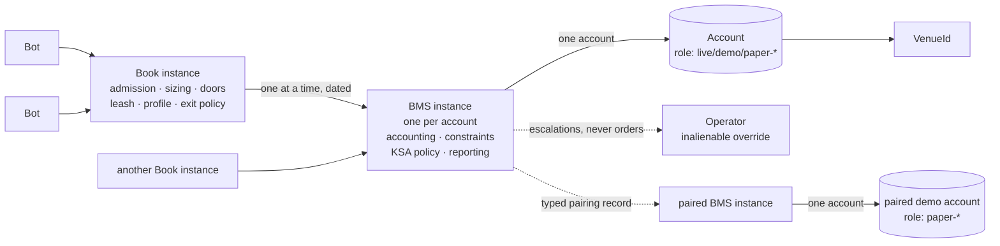
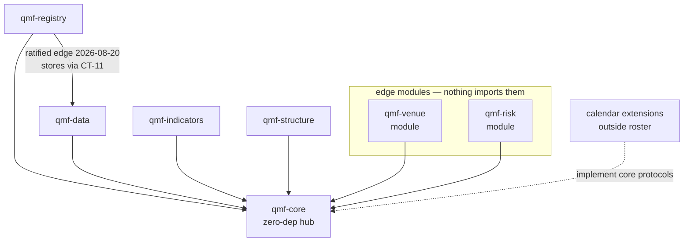
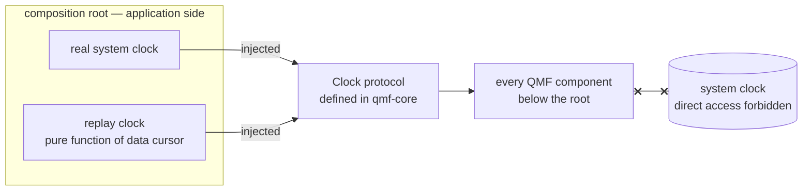

# Architecture Spine — QMF V1 Foundation

## Design Paradigm

**Contract-hub library workspace (hexagonal at workspace scale).** `qmf-core` is the dependency-free hub carrying only definitions — exact value types, domain nouns, typed refusals, fingerprints, protocols. All other packages depend inward on it; runtime concerns (clocks, calendars, venues) enter through protocols the core defines and outer packages or extensions implement. Nothing in QMF is an application; applications (trading node, backtest workspaces, QMX app) are built *with* it, outside this repo's scope.

## Inherited Invariants

Standing operator rulings that bind this spine (original ledger identities, read-only here):

| Inherited | From | Binds here |
| --- | --- | --- |
| Build-our-own boundary: QMX-owned contracts implemented locally; no foreign platform contract | DEC-0013 (live; DEC-0085/0086 are tombstones) | AD-6 prohibited tier; paradigm choice |
| Definitions-only qmf-core: no broker, loop, backtest, downloads | DEC-0022 | AD-6 zero-dep rule; AD-8 protocol-only clock |
| Five libraries + two modules roster | DEC-0024 / spec §2b | AD-2 package list; calendar extensions live outside the roster |
| Don't-box-in: open toolbox, strictness only at harness + live-money gate | DEC-0011 | AD-6, AD-8, AD-9 neutrality; note in AD-3 (governs consumers, not QMF's own source) |
| No futures/options ever; nouns must not preclude stocks/crypto | DEC-0015 | AD-8 calendars, AD-9 opaque symbols, AD-7 units |
| Framework-vs-node split: kill switch, news windows, SL/TP, Book runtime = node | circle-back ruling 2026-08-19 | AD-8 seams; AD-13 scaling; AD-33..AD-39 carry the contracts, never the runtime |
| **Authority order (constitutional hierarchy)**: bots trade; books control bots; BMS accounts for and constrains books; nothing above a bot touches the market — bot → book → BMS → operator | Constitution L1, verbatim in all three legacy layers; re-ratified 2026-08-20 | AD-29 cardinalities; AD-36 flatten authority; AD-37 priority ranks |
| **Corpus precedence for risk / position sizing / live trading** — a *different* ruling from the row above, named apart so neither can be mistaken for the other: GitBook + trading-node documentation (archive/recovery, Documents/QMX wiki) are authoritative; QMX-discussion's risk and position-sizing system was replaced and is **barred as a source there**. Non-risk *structural definitions* may be cited from that layer only under a named exemption stated at the point of use (AD-38's dead-zone definition is the single such citation in this spine); no risk, sizing or money content is taken from it anywhere | Operator standing ruling 2026-08-20 | AD-33, AD-37, AD-38, AD-40, AD-41; binding on the PRD, the documentation factory and every downstream sitting |
| Configurable means UI-editable at platform level | Operator standing rule 2026-08-20 | AD-30 template flags; AD-34/38/39/41 variables |
| Code legible to humans AND agents | L5 | AD-3 toolchain; Conventions |
| No shipped mock market data, fake Bots, or default strategies; synthetic data stresses, never validates edge | L6, L20 | AD-13 benchmark data rule |
| Every component ships executable tests AND reference usage demonstrating its public contract | L27 | AD-3 |

## Invariants & Rules

*Risk reviewer gate applied 2026-08-20 (four passes: adversarial, rubric, rulings-reconcile, currency). AD-29…AD-41 and the cross-AD amendments in AD-7/AD-10/AD-12/AD-16/AD-18/AD-21/AD-24/AD-27/AD-28 carry that amendment set; AD ids are unchanged and the per-amendment trail lives in `.memlog.md`.*

### AD-1 — Runtime matrix [ADOPTED 2026-08-19]

- **Binds:** all packages, CI, factory sandboxes
- **Prevents:** version skew making results non-comparable across sandboxes
- **Rule:** CPython 3.14 pinned everywhere. Tier-1 targets: Windows 11 x86-64 and Ubuntu LTS x86-64 — CI-gated once a remote exists; until then the factory runs the same gates locally and the Ubuntu target is untested. QMF code stays pure-Python and OS-neutral; other platforms work by construction but are untested in V1.

### AD-2 — One repo, seven packages [ADOPTED 2026-08-19]

- **Binds:** all
- **Prevents:** cross-repo coordination tax; sandboxes forced to install the whole framework; namespace shadowing; silent sibling-dependency leaks
- **Rule:** single repository as a uv workspace; seven installable packages (`qmf-core`, `qmf-registry`, `qmf-data`, `qmf-indicators`, `qmf-structure`, `qmf-venue`, `qmf-risk`) importing as the `qmf.*` namespace; `uv_build` backend; one committed `uv.lock`; lockstep release versioning for the seven roster packages. Mechanics: `qmf` is a PEP 420 implicit namespace — **no distribution may ever contain `qmf/__init__.py`**; every package uses `src/` layout (`src/qmf/<name>/`); every dependency (including sibling packages) is declared explicitly in that package's `pyproject.toml`; tier-2 runs each package's tests in an isolated per-package environment so an undeclared import fails rather than resolving through the shared workspace venv. A package may declare a **test-only** dependency on a contract's owning package purely to run its AD-4 contract tests — that is not a ratified runtime edge. Extensions — calendar, indicator, and structure alike — are separate versioned packages outside the roster, in the same workspace, on **their own SemVer ladder outside lockstep** (a tzdata pin change is at minimum a minor bump); an extension's distribution identity + version are identity fields of every artifact it produces, and discovery is explicit registration at the composition root, never ambient scanning. Shared nouns (Venue, Account, Instrument, WriterId, **Bar, Tick/Quote, BarSpec** — per AD-22 — and **Position, Order** — per AD-40) are **defined** in `qmf-core` and their records/lifecycle **owned** by `qmf-registry`; edge modules never define shared nouns.

### AD-3 — Quality toolchain [ADOPTED 2026-08-19]

- **Binds:** all packages, factory agents
- **Prevents:** per-agent tool drift in factory-written code
- **Rule:** ruff (format + lint), pyright strict workspace-wide, pytest. Strictness here governs QMF's **own source**; the don't-box-in ruling governs consumers, who are never forced into it. Coverage measured per package on every change, enforced at tier 1, floor 80%; the modules implementing CT-01 and CT-02 primitives require 100% branch coverage. Every package ships executable tests AND reference usage demonstrating its public contract (L27) as tier-1 artifacts. Public API convention: public value types are frozen dataclasses; seams are `typing.Protocol`s. Canonical commands: `poe fmt | lint | types | test | check`, identical on every machine.

### AD-4 — Three quality tiers, bound to factory events [ADOPTED 2026-08-19]

- **Binds:** all; factory pipeline
- **Prevents:** "tests pass" meaning whatever each run decided to check
- **Rule:** tier 1 = `poe check` (fmt + lint + types + unit + coverage) on every factory work unit (worktree/temp branch). Tier 2 = `poe check-integration` (tier 1 + integration tests + contract tests, each package in an isolated environment) on landing into the integration branch. Tier 3 = `poe check-release` (tier 2 + build all packages + clean-install smoke on both tier-1 OSes) on ship/release. **Contract test** (defined): executable conformance tests for a `CT-*` contract's public shape, owned by the contract's owning package, run by producer and all consumer packages at tier 2. Commands are host-neutral; bind to GitHub Actions only when a remote exists. Factory-internal review layers stack on top, never replaced.

### AD-5 — Two version ladders; meanings never mutate [ADOPTED 2026-08-19]

- **Binds:** all packages; every serialized contract
- **Prevents:** a system unable to read its own history
- **Rule:** code packages use SemVer in lockstep (roster packages only; extensions have their own ladder per AD-2), 0.x until the V1 blueprint ships. Anything deprecated keeps working with a warning for one release before removal. Every serialized contract carries its own integer format version stamped into every artifact; a format version's meaning never changes after the fact — incompatible change mints the next version plus a migration note. QMF never loses the ability to read old stored evidence; history is append-only. Re-deriving a value under a newer calendar/tzdata version produces a **new artifact with its own fingerprint and a lineage edge to the old one** — never a rewrite, never a silent equality.

### AD-6 — Dependency and licence tiers; zero-dependency core [ADOPTED 2026-08-19]

- **Binds:** all packages; factory dependency decisions
- **Prevents:** licence contamination; foreign-platform capture; a heavy core breaking the sandbox model
- **Rule:** permissive licences (MIT/BSD/Apache/PSF) freely allowed; LGPL only unmodified and separately installed; GPL/AGPL prohibited; strategy-family libraries prohibited; platform-imposing dependencies (own event loop/runtime/data model) prohibited. `qmf-core` takes zero outside dependencies (stdlib only). Every dependency gets one line in the workspace-root register `DEPENDENCIES.md`: name, licence, why. Borrowing mental models via study/reverse-engineering is always permitted; adopting code is the governed exception.

### AD-7 — Exact money [ADOPTED 2026-08-19, amended by contradiction sweep]

- **Binds:** CT-01; qmf-core, qmf-venue, qmf-risk, qmf-data
- **Prevents:** float drift; non-deterministic fingerprints; silent scale mismatches across package seams; unreconcilable broker disputes
- **Rule:**
  - Money/Price/Quantity are whole-number integer counts at a declared **scale** (number of decimal places). Tags: `Money(currency, scale)`; `Price(instrument, scale)` — a price is a ratio quoted for an instrument, never tagged with a single currency; `Quantity(unit, scale)` where `unit` is opaque (lot, share, coin, contract).
  - Mixed-scale arithmetic on the same currency/unit auto-promotes losslessly to the finer scale or refuses (typed refusal) — never an implicit rescale or rounding.
  - **The money path is a taint, not a location:** any value that transitively contributes to an order quantity, price, P&L, or balance is on the money path regardless of which package computed it. Binary float is banned on the money path; a float crossing back to Money/Price/Quantity passes a **named conversion boundary with an explicitly stated rounding mode**. The venue adapter boundary is one such named boundary.
  - **Foreign money is evidence** (mirror of AD-8's foreign-time rule): a venue's raw integers are stored verbatim with their declared scales (e.g. cTrader's 1/100000 wire price scale, per-symbol `digits`, per-account `moneyDigits`); conversions to framework values are derived with lineage; corrections are annotations, never rewrites. **Foreign floats are evidence too, but never identity:** a venue value delivered as a binary float converts at the named boundary at receipt to a scaled integer at a per-value-class pinned target scale with a declared rounding mode (pinned in CT-18 per AD-28); the raw float is retained only as integrity-checked provenance and is never the value a consumer reads.
  - Analytic float series remain permitted off the money path; their identity is label-derived (AD-10), never a hash of float bytes.
  - **Price subtraction is closed and delta-typed:** `PriceDelta(instrument, scale)` is a first-class value distinct from Price; the instrument-scoped pip/point is defined by AD-9's metadata records, never hardcoded. The **exact-rational** type (scaled integer or numerator/denominator) extends this idiom to every non-integer parameter (ratios, multiples, tolerances); binary floats never appear in parameters or identity. The exact→analytic and analytic→exact crossings are the named boundaries pinned in AD-22.
  - **Canonical numeric form for identity, pinned [risk gate 2026-08-20]:** an exact rational entering identity content is **reduced to lowest terms, denominator strictly positive, sign carried on the numerator**, serialized as a two-key object with both keys always present. Every `Money` / `Price` / `Quantity` / `PriceDelta` value entering identity content carries the **declared canonical storage scale for its value class**, pinned in the owning contract exactly as AD-28 pins venue-decode scales. Equal value therefore implies equal fingerprint **by construction** — without this, `6/4` and `3/2`, or one amount stored at two scales, fork identity in a way AD-10's collision detector can never see (the hashes differ rather than collide).

### AD-8 — Exact time [ADOPTED 2026-08-19, two-lens audited, amended by contradiction sweep]

- **Binds:** CT-02; every package; every stored record
- **Prevents:** results that stop matching after a server move, DST shift, tzdata update, or clock correction
- **Rule:**
  - Every stored timestamp is int64 UTC nanoseconds since the Unix epoch (POSIX, no-leap-second semantics). Representable range 1677–2262, stated once; all ns arithmetic is checked — overflow is an `invalid input` refusal, never a wrap. Instant `0` is a valid instant; an absent time is an absent field, never a zero. Local time is display-only and always labelled.
  - Civil date and trading date are distinct types. **`TradingDate` carries its calendar identity and version in-band**; equality is defined only within one calendar identity; cross-calendar comparison is a typed refusal. Trading date derives only from a calendar, never from formatting an instant. Causality is compared on instants only — trading date is never a causality proxy.
  - Core time vocabulary: Instant, CivilDate, TradingDate, Duration (signed int64 ns), Interval (half-open, contains/overlaps), SessionWindow. **`Duration` is a clock-agnostic quantity of nanoseconds and is freely storable.** The restriction sits on operations: a duration used for latency, timeout, cooldown, or cadence must be measured monotonically; a duration derived from two wall instants is an evidence span, never an elapsed-time measurement.
  - Two clock kinds, type-separated: wall (meaning, storable as Instants) vs monotonic. **A monotonic reading is never a timestamp and never an Instant.** It may be persisted only as an opaque boot-scoped diagnostic value that carries its boot/epoch id, is never compared across boots or machines, is excluded from identity, and is never rendered as a time. Clock access is a core-defined protocol; the composition root injects the real clock; replay injects a data-driven one; nothing below the root reads the system clock.
  - Ordering: instants alone never totally order events. Every record stream carries a per-writer strictly-increasing sequence; the deterministic tie-break `(instant, writer, sequence)` is a **replay-determinism device with no causal meaning** — causality tests refuse at equal instants rather than tie-break. Timestamps are never primary or dedup keys; **the identity of a stored record is its AD-10 fingerprint**; `(instant, writer, sequence)` is an ordering key only. Each source's actual resolution is stored beside the ns value. `WriterId` is a first-class core noun: stable, durable, minted per (machine, role, stream), accompanied by a boot/epoch id so restarts are visible without changing writer identity.
  - **Calendars.** Calendar identity is the **rule set** (e.g. `forex-17NY` v3), separate from its **binding** (which venues or accounts use it); venues sharing a rule set share the calendar identity, and only the rule set + tzdata version enter fingerprints — a venue change that doesn't change the rule set doesn't change derived-artifact identity. A market-hours calendar carries two separately-named facts, each with its own zone: an **accounting rollover** (which trading date an instant belongs to) and a **session schedule** (when the market is open). Every calendar supplies a rollover rule (24/7 included). Session and trading-day length is data; no consumer may assume a constant. A third named kind exists: the **day-boundary calendar** — an accounting-boundary rule parameterized by **account** (a prop firm's daily-loss day evaluated in its stated timezone is one) — it answers only "which day does this instant belong to for evaluation," is never substituted for a market-hours calendar, and produces TradingDates carrying its own identity. This holds the seam only; no prop firm is modeled in V1.
  - Forex market-hours calendar ships first: 17:00 America/New_York rollover (operator-adopted 2026-08-19 as QMF's **own accounting rule**), weekend gaps, holidays in scope. GAP-0037 verification completed 2026-08-20: no primary cTrader source states a daily-bar boundary — the venue's actual bar slicing is therefore **measured per broker** (first-connection check + continuous monitor, AD-28's verification suite); once verified it is **minted as a venue-scoped market-hours calendar identity** (identity is the rule set, so a measured boundary qualifies), giving venue-native bars a legal BarSpec anchor; until then venue bars are ungoverned observations, never assumed aligned to QMF's calendar. Swap-Wednesday is dropped from V1 (settlement machinery deferred; operator accounts are swap-free — note: a dated financing/admin-fee charge may still exist; "no swap" does not mean "no dated financing").
  - Calendar extensions **force the timezone path to their pinned `tzdata` package and verify at import** that the resolved tzdb version equals the pinned one, refusing (`unavailable dependency`) otherwise — the fingerprint must never attest a tzdb that wasn't used.
  - Foreign timestamps are evidence: stored verbatim with declared zone/offset/resolution, plus local receive wall time and (per the monotonic rule above) an optional boot-scoped receive-monotonic diagnostic; conversions are derived values with lineage; corrections are annotations, never rewrites. cTrader venue facts are ratified (2026-08-20, companion `ctrader-venue-facts.md`): timestamps are per-field-documented Unix ms UTC with two epoch exceptions (trendbar minutes; maintenance-end seconds); fields whose unit is undocumented (the spot-event timestamp) are verified-or-refused at first connection per AD-28's suite; receive-time recording is mandatory — the venue exposes no server clock (closed-set proof).
  - "Market-hours calendar", "day-boundary calendar", and "news calendar" are distinct named concepts; docs rename apart (COMP-CALENDAR-FEED is the news feed).
  - A **civil-time bucket key** — derived from an instant plus a declared zone and tzdata version — is a legitimate computed value (seasonality, session-of-day statistics): never a timestamp, never a causality proxy, and identity-bearing including its zone and tzdata version. "Local time is display-only" governs evidence timestamps, not computed grouping keys.
  - Operational clock rules (chrony on the VPS, slew-only while live, no-trade-before-sync, drift bands with typed refusals, gap records for suspect windows, RTC-in-UTC, prop-firm day boundaries via account-scoped day-boundary calendars) are stated obligations for node/ops docs — carried in companion `time-audit-devops.md`, binding on later sittings.

### AD-9 — Instrument, venue, and account identity [ADOPTED 2026-08-19, amended by contradiction sweep]

- **Binds:** CT-03; qmf-core nouns; qmf-registry records; qmf-data, qmf-venue, qmf-risk
- **Prevents:** two brokers' records mixing; renames rewriting history; forex assumptions leaking into symbols; two packages minting two Venue types
- **Rule:** instrument identity is (venue, venue's own symbol), the symbol opaque and never parsed. **`VenueId` gets the same discipline as symbols:** operator-minted, opaque, stable, never derived from a mutable broker attribute, never reused; a distinct broker/legal entity is a distinct venue even on shared infrastructure (a prop firm white-labeling cTrader is its own venue); renames are dated alias records. Aliases, renames, asset class, and mutable metadata are separate dated records pointing at identities; stored history never rewrites. Venue and Account are distinct first-class nouns **defined in qmf-core, records owned by qmf-registry** (per AD-2): one venue may hold many accounts, each with a role (live / demo / paper-validation / paper-benched / prop-firm); Books bind to accounts. Multi-broker (≈6 venues) and broker migration are normal, not special cases. **Broker identity is deployment configuration, never architecture** (operator ruling 2026-08-20): no rule anywhere may name a specific broker; which broker fills a venue slot is decided at deploy time. Broker/venue **legal identity** and **platform/protocol family** are distinct: the prohibition binds broker entities and VenueIds; platform-family clauses (a cTrader-platform adapter profile, a FIX profile, a CCXT-class profile) are legitimate adapter-scoped contract surface.

### AD-10 — Deterministic fingerprints [ADOPTED 2026-08-19, recipe pinned by reviewer gate]

- **Binds:** CT-05; every registered or stored artifact
- **Prevents:** two conformant implementations disagreeing; renames changing identity; sandbox merges refusing themselves
- **Rule:**
  - **One implementation:** the canonical serializer and fingerprint function live in `qmf-core`; no other package may compute a fingerprint except by calling it.
  - **The `fp1` recipe, pinned:** UTF-8 JSON; object keys sorted lexicographically at every depth; no insignificant whitespace; strings NFC-normalized; all identity numerics are integers (money scaled-ints, time ns-ints, scales, versions) — **floats are refused in identity content**; null is prohibited — an absent value is an omitted key; arrays are order-significant; **exact rationals and money-class values additionally take AD-7's pinned canonical form** (lowest terms, positive denominator, declared canonical storage scale per value class). Hash: SHA-256. Emitted as `fp1:sha256:<hex>`. The prefix versions the **recipe**; upgrades mint `fp2`, old fingerprints stay valid forever.
  - **Field classification:** every contract field is identity by default; display-only exclusion requires an explicit, versioned declaration in the contract — never an implementer's judgment call.
  - **Float-bearing artifacts** (analytic series): identity derives from the result label (AD-12) — producer, inputs, range, world — never from hashing float bytes; float payloads carry an integrity checksum plus (OS, library-version) provenance, and cross-OS bit-identity of float content is explicitly not promised.
  - **Collisions, split:** an idempotent re-write (same hash, byte-identical content — the sandbox-merge normal case) is accepted silently; a true collision (same hash, differing bytes) is refused and alarmed, never overwritten.

### AD-11 — Typed refusals [ADOPTED 2026-08-19, mechanism pinned by reviewer gate]

- **Binds:** CT-04; every public QMF boundary
- **Prevents:** failure handling by parsing error prose; two construction APIs for one value type
- **Rule:** every public operation succeeds or returns a typed refusal: category (invalid input / unsupported capability / unavailable dependency / stale evidence / policy rejection / transient venue failure / storage failure), machine-readable context, and retryability (yes/no/after-condition). `storage failure` covers disk-full, corrupt files, locked or truncated stores — the I/O surface AD-19/AD-20 add; store-library exceptions are translated at the qmf-data boundary, never propagated. Categories are addable in later versions, never redefined. **Mechanism:** public boundaries **return** refusals (result unions); exceptions are reserved for programmer error and never carry refusals across a package boundary. Value-type construction is one pattern everywhere: an unchecked constructor for trusted internal use plus a validating factory (`try_create`) returning value-or-refusal. Assumes nothing about node shape.

### AD-12 — Result label and worlds [ADOPTED 2026-08-19, amended by contradiction sweep, amended by the risk gate 2026-08-20]

- **Binds:** CT-05; every computed result entering evidence
- **Prevents:** two computations sharing a label, or one computation wearing two; worlds mixing in merged ledgers
- **Rule:**
  - Every result carries: **producer contract identity** (the configured producer's fingerprint — the CT-16 configured indicator, the CT-17 configured family — distinct from the format version, so `EMA(20)` and `SMA(20)` can never share a label), producer **contract format version** (AD-5's second ladder — package SemVer never enters identity and may ride only as display-only provenance), input fingerprints, evidence time range, computation/occurrence identity, **evidence class** (confirmed / unconfirmed / provisional, per AD-25), and world. Together these are its identity. Human display names live outside identity.
  - **Computation identity vs occurrence:** the computation identity is content-derived (from label parts) so identical work from two sandboxes deduplicates and merges; the occurrence record (when/where/by whom it ran) is separate provenance outside identity.
  - **Worlds, defined:** `live` = real venue clocks and quotes, real or demo money — the account role (AD-9) carries money-reality, so paper/demo runs are `world = live` and stay comparable to live for alpha-decay sensing; `replay` = a data-driven injected clock over recorded history (real UTC instants; implementable today); `simulated` = synthetic data — **reserved but unusable in V1**: writing `world = simulated` into governed evidence is a `policy rejection` refusal until the backtesting sitting defines simulated-time typing.
  - **Namespace rule:** a non-live world may never write into the live evidence namespace; factory sandboxes never produce timestamps that enter an evidence store. Identity distinctness alone does not deliver world separation — storage separation does. **Namespaces are also role-scoped within `world = live`:** the live evidence namespace admits only records whose account-binding role is `live`; demo, paper-validation, and paper-benched records write to role-scoped namespaces. Evidence produced in a factory sandbox carries an identity-bearing `provenance = sandbox` field, blocking dedup-merge into the operator store. **Two declared read exceptions, and no write exception ever** (risk gate): AD-35's decay-cohort read and AD-31's entity projection over an entity that operated in more than one role are explicitly permitted cross-role *reads* within `world = live`, each carrying `role` on every row; writes stay role-scoped without exception.

### AD-13 — Measure-then-budget performance [ADOPTED 2026-08-19]

- **Binds:** all packages; merge gate (tier 2)
- **Prevents:** the factory optimizing against invented numbers; slow rot nobody can attribute
- **Rule:** no invented performance numbers. Every component ships a benchmark harness (same status as unit tests) measuring **speed and peak memory** at a load ladder expressed in **framework-native units per package** (calls/s, series length, artifact count), with the ~40-bot node scenario (and 10/100/200 marks) as the motivating reference for sizing the ladder. Memory is a first-class budget: regressions in peak memory fail the gate the same as slowdowns. First real measurements are recorded as fingerprinted baselines **scoped to a declared (OS, CPU-class) tuple**; each benchmark's regression threshold is stated when its baseline is recorded, as a multiple of measured run-to-run variance; thereafter regressions beyond threshold fail the merge gate. One explicit **design constraint** (not a measurement): `qmf-core` imports in well under one second (sandbox-critical). Benchmark and test data are generated at runtime or held as controlled fixtures — never shipped as product artifacts (L6); synthetic data stresses infrastructure, never validates edge (L20). Server sizing and scaling are node/compute decisions, made later with these numbers.

### AD-14 — Loud failure, traceable behavior [ADOPTED 2026-08-19, operator-added]

- **Binds:** all packages
- **Prevents:** silent failures; multi-hour what-broke hunts for a solo operator
- **Rule:** errors and refusals always carry context and are never swallowed; structured logging with a correlation id — field name `correlation_id`, propagated across every package boundary — follows one event across components (pure-computation boundaries are exempt: correlation rides the caller's context, never a pure value contract's signature); every component exposes a no-argument `health()` returning a typed health report — a "component" here is an owner of external resources or long-lived state (streaming indicator instances and structure family instances included; pure batch functions excluded). **Logs are not journals:** operator/diagnostic log text renders timestamps as UTC ISO-8601 with explicit Z; journals and every evidence stream store int64 UTC ns + writer + sequence per AD-8, with ISO-8601 permitted only as an additional display-only field excluded from identity. Emitted signals must be exportable to standard monitoring stacks (Prometheus-class metrics, push alerts); the stack choice itself is node/ops territory. Full monitoring/evaluation design lands in the data/ops sitting; this obligation binds now.

### AD-15 — Concurrency stance [ADOPTED 2026-08-20]

- **Binds:** all packages
- **Prevents:** two packages disagreeing on whether QMF is safe to use simultaneously; async contagion through every signature
- **Rule:** QMF values are immutable (safe to share by construction); purity binds the pure-computation libraries (core, indicators, structure); components that own an external resource (stores, recorders, adapters) are the stateful class and follow one-writer-per-stream with unlimited readers — a "writer" here IS the holder of an AD-8 `WriterId`. QMF never spawns threads or background work — the application owns all concurrency; async APIs exist only at the venue network edge, never in core or the libraries. The venue adapter's periodic session duties (heartbeat, token refresh, reconnect, gap replay, verification monitors) are **declared schedulable duties the application's scheduler drives** — the adapter defines the work, the application runs it; session recovery never resubmits a command (AD-27).

### AD-16 — Registry records and lineage [ADOPTED 2026-08-20]

- **Binds:** CT-06, CT-07, CT-09; qmf-registry
- **Prevents:** a universal recipe card by the back door; a graph-database dependency; unrebuildable indexes
- **Rule:** per-kind record schemas (each its own versioned contract) share a tiny common header: kind, contract format version, at-birth parent references (identity-bearing), plus writer and sequence per AD-8. A record's **stable id is derived from its `fp1` fingerprint** (never minted); created-at and other occurrence facts are declared occurrence/display-only per AD-10 — so identical work from two sandboxes deduplicates. Lineage that accrues after birth (supersedes, promoted-from, occurrence-of, corroborates, disagrees-with, **confirmed-as**, and the AD-25 lifecycle/interaction record kinds — confirmation, invalidation, interaction), plus the risk-gate edges **`continues-performance`, `carries-ledger`, `enacts` and `branches-from`**, lives **exclusively** in append-only typed edge records referencing fingerprints; readers never union header refs with edges. The occurrence/display-only classification applies to **computations**; a structure object's anchor span and lifecycle instants are identity fields and may never be classified away (AD-25). Edge files are pinned JSONL: one `fp1`-canonical JSON object per line, LF-terminated, append-with-fsync, no rewrite, size-based rotation with a monotonic file ordinal; indexes are local and rebuildable. Kinds are addable, never redefined; the Bot kind's contents come from its own sitting. **Risk-sitting kinds minted 2026-08-20** (AD-29..AD-41): Book definition (CT-22), BMS definition (CT-27), Book binding (CT-28), binding transition (CT-24), exit record (CT-29), control action (CT-30), control window (CT-31), performance result (CT-32), and instrument currency-exposure as a dated AD-9 metadata record. **Edge kinds, split and minted by the risk gate 2026-08-20.** The single `continues-as` edge carried two unrelated effects (a track record; a pot of money) and is **split into two typed edges that never imply each other**: **`continues-performance`** — a human-signed assertion that one binding continues another's *performance record* across a template version change or a broker migration, carrying the declared discontinuity, consumed **only** by CT-32 population declarations; and **`carries-ledger`** — a human-signed assertion that per-binding *state* (virtual ledger, cycle position, budget remainder, breaker and bench counters) carries across a new binding. Performance lineage moves no money; ledger carry asserts nothing about comparability; neither is ever inferred from the other's presence. **`enacts`** is minted: from a command record or an outcome observation to the CT-30 control-action or CT-23 intent record it enacts — identity-bearing, append-only. AD-36's standing-intent fold, AD-37's arbitration records and AD-41's suppression accounting resolve through `enacts` and **never** through `correlation_id` (a tracing annotation excluded from identity, AD-21). **`supersedes` is linear** — at most one outgoing edge per subject, one resolvable head — so "current" is never ambiguous; AD-30's *branching* version graph uses **`branches-from`**, where several heads are legal and "current" is a separate dated pointer record, never inferred from the graph. "Human-signed" everywhere means AD-18's mechanism (a recorded approval attesting an `fp1` string) — one meaning of "signed" in the whole spine. A **treasury boundary-event** record kind is reserved for money movements between accounts and cycles (`sweep | refund | re_seed | paper_epoch_reset`, addable never redefined), mapped onto AD-21's `risk transition` event type; its fields and evaluation are node territory (Deferred), but no money moves without one and a boundary event never closes a position (AD-36) and never re-bases a frozen R (AD-40). No database server.

### AD-17 — Multiplicity at every layer [ADOPTED 2026-08-20, resolves DEC-0040]

- **Binds:** qmf-registry; the future Bot/QML schema sessions
- **Prevents:** hardcoded cardinality-one anywhere in the bot vocabulary foreclosing experiments
- **Rule:** a Bot contains one-or-more confluences; a confluence contains one-or-more levels, triggers, and confirmations; components may compose (several levels forming one composite level — a composite is its own artifact with lineage to its children). No layer of the bot vocabulary may hardcode "exactly one." Multiplicity collections are canonically ordered by child fingerprint ascending unless the owning contract explicitly declares the collection order-significant (AD-10 corollary) — **causal structure composites invert that default** (children order-significant unless declared unordered, per AD-25), and a composite's children may be of **any governed kind** (indicator results, structure objects, calendar windows), each referenced by fingerprint. **Bot identity is its content**; the Bot↔Book↔account binding is a separate dated binding record outside Bot identity — one Bot at exactly one Book at any time, but re-binding (paper → live) never mints a new Bot, so paper and live performance stay comparable for alpha-decay sensing. Exits are Book/risk/node territory — the ownership and the door are ruled in AD-33.

### AD-18 — Promotion record skeleton [ADOPTED 2026-08-20]

- **Binds:** CT-08-adjacent; qmf-registry
- **Prevents:** promotions with no durable, human-legible record
- **Rule:** the registry reserves a promotion-occurrence card kind: human-only signer, signed immutable record, and a mandatory plain-words summary field that is **explicitly declared an identity field** — the signature attests the exact words the human read; a typo fix mints a new record with a supersedes edge. "Signing" in V1 means the operator's recorded approval captured as an immutable occurrence attesting the record's `fp1` string (reviewer identity + instant); cryptographic signatures are ops-sitting territory, no crypto dependency now. The registry card is **canonical**: the journal's `promotion` event carries only the card's fingerprint plus `correlation_id`, never a second schema. A card attesting an AD-32 admission carries the **Book-definition (or BMS-definition) fingerprint as an identity field**, so a signature can never attest a superseded template. The evidence checklist accretes from later sittings (untouched-test proof ← data splits; causality slot ← backtesting; **risk binding landed 2026-08-20** — AD-32's three-layer admission packet and AD-41's performance evidence). The promotion gate itself — workflow, UI, timing — is platform territory, not QMF.

### AD-19 — Data rooms, stores, and bitemporal law [ADOPTED 2026-08-20]

- **Binds:** CT-10, CT-11; qmf-data
- **Prevents:** ad-hoc storage choices per agent; overwritten evidence
- **Rule:** seven room-roles — ingest door, immutable raw archive, processed, journal, split-governed research door, backup, and the **registry room** (records + lineage, stored for qmf-registry under the same retention, backup, and migration law) — **instantiated per world** (AD-12): a read that crosses worlds is a `policy rejection` refusal. Stores: Parquet (columnar time-series), DuckDB (local analytics), SQLite (transactional metadata), JSONL (append streams) — each behind a QMF-owned contract so engines are swappable; contract signatures are stdlib-typed at the boundary; no database server. Only raw-archive and journal formats are evidence-bearing — analytics engines (DuckDB) hold rebuildable views only, so an engine's format break (e.g. DuckDB v2.0's new storage format, previewed 2026-08-17) costs a rebuild, never evidence; engine majors are pinned per release. "Rebuildable" licenses deletion only of artifacts **no result label cites**: a processed artifact cited as an input is retained forever, and any rebuild pins the original calendar/tzdata version. Every external fact carries event-time, known-at, **source**, and revision — `source` is a core provenance noun orthogonal to `VenueId` (a provider you can trade at is a venue; a provider you only read from is a source); corrections are appended, never overwrite.

### AD-20 — Migrations, retention, backup [ADOPTED 2026-08-20]

- **Binds:** CT-11, CT-14, CT-26; qmf-data, qmf-registry
- **Prevents:** an upgrade destroying the only copy; silent data loss; untested backups
- **Rule:** migrations run preflight checks → backup first → dry-run → migrate → verify, with a documented restore path; never in-place mutation of the only copy. Raw originals and lineage are kept forever; time-series is partitioned by source, instrument, and time window; journal trimming rules are set only after measured volume. Backup: the ratified design is nightly, encrypted, versioned, off-machine (object-storage bucket), with automated sample-restore tests and a periodic full-restore rehearsal — **QMF provides the backup/restore/verify primitives (CT-14/CT-26); the schedule and execution are application/ops-owned** (same split as all scheduling, per AD-21); encryption key custody and the crypto dependency are named at the node/ops sitting. Topology: trading-node VPS records and syncs down; workstation holds the working archive; the bucket catches nightly copies.

### AD-21 — Splits, journal events, and the doors to outside [ADOPTED 2026-08-20]

- **Binds:** CT-12, CT-13, CT-15; qmf-data
- **Prevents:** research quietly consuming its own exam questions; untraceable events; source disagreements merged away
- **Rule:** dataset splits are fingerprinted, time-ordered, non-overlapping manifests; **each manifest pins exactly one calendar identity + version in-band** and refuses rows carrying another calendar identity; boundaries are explicit stored TradingDates or instants (never civil dates), and the seal boundary is a **frozen** TradingDate never re-derived under later tzdata. **Records partition into splits by knowledge time** — confirmed-at for structure objects, the knowable-at of the last contributing input for indicator results; a manifest refuses any record whose observed-at precedes a boundary while its confirmed-at follows it, unless the manifest's declared embargo covers the gap. **Purge and embargo widths are required manifest fields now**, entering the split fingerprint, defaulting to the maximum declared (warm-up + confirmation-delay bound) across every producer the split cites — a split reused with a longer-horizon artifact refuses rather than leaks. The 12-month seal is a no-peek lock (not retention — data is kept regardless), **enforced now as a `policy rejection` refusal at every qmf-data read boundary — raw, processed, research door, and restored backups alike — independent of the deferred GAP-0016/0017 gates**; the sealed period gets one logged final look, journaled as a named `control action` subtype, and is never silently recycled. The journal is N streams — one per producing component, each under its AD-8 `WriterId` with gapless per-(writer, boot-epoch) sequences (a gap signals loss) — recording seven event types (decision, order, fill, risk transition, promotion, data quality, control action); the `control action` type carries a declared **`suppressed` subtype** (AD-36) for an authorized action discarded because a higher authority won arbitration; the `decision` type carries a **mandatory closed `outcome` field — `authorized | refused-by-door | suppressed`** — with the refusing-door or suppressing-authority reference, so every projection (the legacy `veto_ledger` included) selects on a declared field and never on key presence; treasury boundary events (AD-16) map to `risk transition`; and **entity journals — the Book journal, the BMS journal, the per-bot journal — are declared read-time projections over these streams keyed by entity identity (AD-31), never additional writers**; `correlation_id` is a linking annotation **excluded from `fp1` identity by explicit versioned declaration**; causal linkage across streams uses AD-16 typed edges, never timestamps. Source adapters: qmf-data defines contracts, normalization, validation, and idempotent intake keyed on (source, source-native id, revision) — a provider revision is a new artifact, never an AD-10 collision; applications own scheduling, retries, supervision, and UI. The **news-calendar recorder** keeps provider-native identity and revisions (legal archiving posture remains an open operator item). Tick sources are separately identified (Dukascopy history vs broker feed), bid and ask preserved with source timestamps; disagreements between sources stay visible via `corroborates` / `disagrees-with` edges, never merged.

### AD-22 — Indicator protocol and series vocabulary [ADOPTED 2026-08-20, amended by increment gate]

- **Binds:** CT-16; qmf-core (series vocabulary), qmf-indicators
- **Prevents:** research computed on numbers the live path never sees; per-agent indicator drift; identities that silently merge non-equal computations; instance count scaling with bot count instead of configurations
- **Rule:**
  - **Series vocabulary (qmf-core; shared nouns per AD-2):** `Bar` (OHLC + interval + BarSpec), `Tick`/`Quote` (bid/ask with source timestamps per AD-21), `BarSpec`, series references, and the exact-rational parameter type are defined in `qmf-core`; no other package may define them. **`BarSpec` replaces the bare word "timeframe" everywhere:** a discriminated aggregation rule — time-interval | tick-count | volume-threshold | notional-threshold | price-brick | range | session — with exact parameters and, for time-based kinds, the anchoring calendar identity + version. Bar aggregation is a fingerprinted qmf-data derivation (processed room, lineage to source); a bar series is well-defined only via its BarSpec.
  - **Bulk form, pinned:** a frozen value over a read-only `memoryview` of immutable `bytes` (little-endian int64), explicit length, and per-channel out-of-band metadata — scale, declared kind (exact-price / exact-quantity / float-analytic / integer-code / boolean / categorical), unit, and quote side (bid / ask / mid / last; `mid` is a derived series with a stated rounding mode). Checksums and serialization are defined over exactly that byte layout; numpy/Arrow conversions are private to the consuming package. A parallel integer-encoded **presence map** marks every position `present | provisional | not_ready | gap | absent_by_schedule`; positions are never omitted or shifted; NaN and sentinel markers are prohibited; equality compares presence maps first, values only at present positions. L2 depth / footprint-class nested data is outside the V1 series vocabulary — ungoverned research lane until a later pass widens the form.
  - **Two named AD-7 conversion boundaries, one qmf-core implementation each:** the exact→analytic descale (pinned formula, stated rounding, refusal past float64's exact-integer range — no package descales except by calling it), and the analytic→exact return (any output channel declared exact-price, and any evaluated object level, declares rounding mode + target scale as fingerprinted contract surface).
  - **Identity = the entire declared configuration,** declared explicitly and versioned per AD-10 — never an enumerated shortcut; an element missing from the fingerprint is a contract defect. It includes: formula id (AD-9 minting discipline — opaque, stable, never reused), contract format version, exact parameters (exact rationals — scaled integers or numerator/denominator — never binary floats), the **ordered named input set** (one or more series references, each carrying instrument-or-source identity, BarSpec, channel kind, quote side, and — for derived inputs — the upstream artifact's fingerprint), declared calendar requirements (rule-set identity + version + tzdata version), alignment policy, missing-value policy, warm-up, output schema, supported modes, and the arithmetic-reference configuration. That fingerprint is the only dedup key.
  - **Typed configuration inputs:** a configuration may declare market-hours / day-boundary / news calendars, instrument-metadata snapshots (tick size, digits, pip — the registry record's fingerprint is identity-bearing), and external event anchors (`(source, source-native id, revision)` per AD-21) — injected by the composition root against core protocols. Declaring an input creates no package dependency edge.
  - **Composition:** any CT-16 or CT-17 output series is a legal input to any CT-16/CT-17 configuration; the upstream fingerprint enters downstream identity. A computed/synthetic series is identified by its result label (derived-series identity) and never mints an Instrument. Re-implementing arithmetic a governed producer already publishes is a contract defect under AD-23.
  - **Modes:** a configuration declares its supported modes; batch-only and streaming-only are conformant (a batch-only configuration is heavy on the live path by definition). Where both are declared, the **equality law** binds as an AD-4 tier-2 contract test: a same-process, same-build comparison against a per-configuration comparator declared in integer ULPs (default 0), over canonical inputs = (series, exact parameters, cold initial state); the seeding rule and the reference's leading-undefined-prefix → not-ready mapping are declared contract surface. Cross-OS/cross-build agreement is never this gate — it is an AD-23 registered comparison artifact. A separate **restore-equivalence** test binds snapshot/restore: restore-then-N-updates ≡ cold-warm-then-the-same-N-updates.
  - **Warm-up** is an integer count of completed input observations in the input series' own sample unit (per its BarSpec) — never ticks, never a Duration — one value per configuration, identical across modes, at least the reference's lookback; an optional declared time bound is null for event-driven BarSpecs (affecting AD-24 eligibility). Readiness is recurring: a configuration may declare a calendar-anchored reset that re-enters not-ready. A streaming implementation needing more observations than declared is non-conformant, not differently warmed. During warm-up the output is a marked not-ready value, never a number.
  - **Outputs:** CT-16 declares an output schema — ordered named channels, each with kind, arity (scalar-per-sample / fixed vector / keyed-by-price-bin), and index offset. Outputs are full-length and index-aligned to the input (begin-index trimming prohibited). Every sample carries a **knowable-at instant** — the earliest instant at which every contributing input was knowable — and the configuration declares its bar-closed vs in-progress emission policy; `provisional` samples (incomplete aggregation period) never enter governed evidence.
  - **Missing vs closed:** a position the market-hours calendar declares closed is `absent_by_schedule`, never a gap; missing = calendar-open with no data, handled per the declared policy — never silent filling. Multi-series alignment is a declared policy; only **as-of last value known at or before the evaluation instant** is permitted for governed evidence; forward-fill or interpolation across the evaluation instant is a `policy rejection`. All failures are AD-11 typed refusals.
  - **Streaming instances** are the named stateful class in AD-15's exemption: a mutable instance with exactly one feeder — one `WriterId` holder, not one input stream — and unlimited readers; every streaming output carries the input sequence number that produced it. Dedup is per-process and application-owned (equal fingerprints guarantee substitutability; the library ships no global registry); instance count scales with distinct configurations, not consumers. A state snapshot is an AD-5 serialized contract with its own format version, scoped to a declared (OS, arithmetic-reference build) tuple; restoring across tuples is an `unavailable dependency` refusal; a result computed from restored state carries the snapshot fingerprint as an input fingerprint. Evidence emission granularity is declared contract surface (per-window); streaming updates are not individually evidence-bearing.
  - **Extensions:** custom indicators are authorable as plain Python outside governed evidence, always. To enter governed evidence they conform to CT-16 as extensions under AD-2's extension mechanics — separate versioned packages outside the roster, own SemVer ladder, distribution identity + version as identity fields of every artifact produced, discovered by **explicit registration at the composition root** (never ambient scanning) through the package's one named catalog surface (the single public registration point). A working plain-Python experiment **graduates** through this path with a lineage edge to its originating research artifact.
  - Two AD-13 rungs per configuration — burst throughput and per-tick latency, denominated per accepted input observation at the configured BarSpec (the no-op tick path measured separately) — both factory-gate machinery; production visibility is AD-14's job.
  - `qmf-indicators` depends on `qmf-core` only (D-1 answer: no new edges). Public surface: the CT-16 protocol, the series vocabulary, and the catalog surface; everything else private (underscore convention).

### AD-23 — Canonical arithmetic: pinned references, upgrades gated [ADOPTED 2026-08-20, amended by increment gate]

- **Binds:** CT-16, CT-17; **every producer of governed evidence, extensions included**; the AD-6 register
- **Prevents:** silent arithmetic drift under dependency upgrades; two owners of one formula's numbers
- **Rule:**
  - Where the pinned reference implements a formula, wrapping it is mandatory and it is canonical (wrap-not-reimplement). **Where it does not** (VWAP, Ichimoku, session-anchored levels, structure arithmetic, QMX-original formulas), **the QMX implementation is the canonical arithmetic for that formula**, pinned by its own contract format version under the identical upgrade gate. Streaming implementations are QMX-owned and held equal to the canonical batch arithmetic by AD-22's equality law.
  - The pinned reference is TA-Lib, pinned per QMF release as the **lockfile-resolved artifacts (distribution filename + hash) of both the C library and the Python wrapper** (0.7.1 + 0.7.1, verified current 2026-08-20) — the artifact identity, not a version string, is what AD-10 float provenance records. The reference's process-global configuration (compatibility mode, candle settings) is a declared, identity-bearing **reference-configuration record**: fixed at stated values, asserted at import (`unavailable dependency` on mismatch, exactly as AD-8 treats tzdata), never mutated at runtime; a configuration change mints exactly like a version upgrade.
  - Upgrades are gated, never silent: the comparison suite runs first; an output change for identical canonical inputs mints the **per-configured-indicator contract format version** — never a protocol-wide bump, so unchanged indicators keep deduplicating — with recorded before/after evidence; an output-identical upgrade re-pins without a mint. (Precedent: TA-Lib 0.7.1 itself changed MACD/MACDFIX/TRIX/ULTOSC period=1 outputs.)
  - Dual-reference checks are registered comparison artifacts — input fingerprint + parameter fingerprint + declared tolerance + verdict — required wherever a second reference exists. Tolerances, and AD-22's mode comparator, are declared as **integer ULP counts** (or a scaled-integer pair), never decimal text, never floats.
  - No governed producer re-implements arithmetic another governed producer publishes: a structure family needing an indicator consumes it as a declared input (AD-22 composition), never inline.

### AD-24 — Light vs heavy: budget-declared, benchmark-policed [ADOPTED 2026-08-20, amended by increment gate]

- **Binds:** CT-16 **and CT-17**; qmf-indicators, qmf-structure; the AD-13 ladder
- **Prevents:** heavy computation on the live decision path; classification by name or vibe; machine-scoped verdicts leaking into identity
- **Rule:**
  - A configuration is **light** iff it declares AND benchmark-proves: (1) per-update cost within the live-path latency rung; (2) bounded declared state size within the ceiling stated in the owning contract; (3) **either** a bounded declared evidence window **or** a declared anchor-reset rule with O(1) per-update cost inside bound 2 — an anchored configuration (session VWAP, cumulative "since X" statistics) declares its **anchor kind** so embargo widths compute from the anchor, not a window; (4) synchronous availability on the trading path — a marked not-ready value satisfies it.
  - The same four bounds bind **structure families**: per-update cost, bounded live-object-set size, bounded scan/lookback window, synchronous availability — same benchmark policing, same refusal for a failed light claim.
  - **The verdict never enters identity:** the declared budget is contract surface; the light/heavy verdict is a machine-scoped AD-13 benchmark artifact, declared display-only for fingerprint purposes. **Until the live-path rung has a recorded baseline, every configuration is heavy by default and a light claim is refused at the gate.** **Tuple migration never silently halts trading** (risk gate): a light claim benchmark-proven on one declared (OS, CPU-class) tuple stands on a new tuple as a **provisional light claim** — it alarms (AD-14), journals `data quality`, and must be re-proved within a declared window, after which it reverts to heavy; it never reverts mid-session. Recording the live-path rung baseline on the deployment's own tuple is a named AD-32 Layer-2 prerequisite, so the bootstrap surfaces at admission rather than at the first tick.
  - A heavy configuration's synchronous entry point returns `unsupported capability`. Every fanned-out heavy value carries the instant + input sequence of its last input; consuming one past its declared maximum age is a `stale evidence` refusal. Heavy runs off the trading path (MIS/research side, node territory — computed once and fanned out) through the same contracts; different placement, not a different species.
  - Classification is per configuration, never per name. Declaration = the promise, AD-13 measurement = the proof, AD-14 metrics = runtime visibility, UI display = platform territory.

### AD-25 — Causal structure lifecycle [ADOPTED 2026-08-20, amended by increment gate]

- **Binds:** CT-17; qmf-structure; AD-16 record kinds
- **Prevents:** repainted/look-ahead structure entering evidence; strategy vocabulary leaking into the chart-object taxonomy; lock-in to a built-in family set; a mutable state machine sitting on the immutable store
- **Rule:**
  - A structure **family is a type of chart object** — never a strategy, bot, or Book category, and never named after a trading school. Geometry is family-declared and **open**: point, level, zone, span, distribution, graph. Clock-confirmed (degenerate) confirmation is legal — "confirmed the instant the window opens under calendar C" meets the bar. A standing object (an a-priori level such as a round number) declares observed-at = its configuration instant.
  - **Lifecycle on the immutable store:** an object is minted **once, at observation**, carrying its family identity + version, exact parameters, declared confirmation rule, **anchor span** (start instant, end instant, price bounds — frozen at observation, explicitly permitted to precede observed-at, excluded from every causality test), and **observed-at** — defined as the earliest instant the object was derivable from causally-available data (known-at, never event time). Confirmation, invalidation (its instant = the detection instant), and **interaction records** (instant, price, family-declared interaction measure — the only permitted way an object's state evolves) are separate append-only AD-16 records/edges referencing the object's fingerprint, each instant an identity field of its own record; the object itself is never mutated. Current state ("still valid at T?", "still unmitigated?") is a **read-time fold** over the object's edge stream per CT-17's stated read-resolution rule — the lifecycle/interaction-fold half of the deferred annotation rule lands here, now. Anchor span, observed-at, and every lifecycle instant are **identity fields, never occurrence-classified**: a structure object is a fact about the market at a time, not a computation (mirrored in AD-16).
  - **Emission invariant, checked in-component:** `anchor.start ≤ anchor.end ≤ observed-at ≤ confirmed-at ≤ invalidated-at`, and observed-at ≥ the maximum evidence-time of every input actually consumed — violation is an `invalid input` refusal. This cheap look-ahead guard binds now, independent of the deferred GAP-0016 gate.
  - **Precise-rule bar:** a family ships into the governed library only when its confirmation rule states "confirmed the moment X happens," with X knowable at that instant; imprecise concepts stay free in research lanes (plain Python, ungoverned); a mechanically-stated variant of any school's concept is admissible under the same bar. **Evidence class (confirmed / unconfirmed / provisional) is a named part of the AD-12 label and a declared identity field**; an unconfirmed output links to its confirmed successor via a typed `confirmed-as` edge; a read requesting confirmed evidence **refuses** unconfirmed rows (`policy rejection`) rather than filtering silently. A decision at instant T may consume evidence with confirmed-at ≤ T — equality is consumption, not look-ahead; AD-8's refuse-at-equal rule governs causality tests between derived artifacts.
  - **Continuous and calendar-anchored objects:** a sloped object (trendline, channel, decaying rail) is identified by integer **anchors** — (instant, exact Price) pairs — plus a declared versioned evaluation rule; slope is derived, never stored, never identity. Evaluation at an instant crosses the named analytic→exact boundary (AD-22). A calendar-anchored level declares its sampling policy (`last-known-at-or-before` | `refuse`) and schedule-gap policy (`refuse` | `nearest-open-instant` | `carry-previous-session`), fingerprinted. Observing a news instant or release as evidence is ordinary input consumption, bound to the revision known at observed-at; **acting** on news stays node territory.
  - **Confirmation delay** is a declared **maximum bound** — an integer count of observations at the family's BarSpec; an `unbounded` declaration is legal only for families excluded from split-governed evidence. With AD-22's warm-up it feeds AD-21's purge/embargo widths; a composite declares the sum of its children's bounds.
  - **Composites (AD-17):** a composite's confirmed-at is the maximum of its children's confirmed-at and its observed-at the maximum of theirs — never earlier than any child. Children of a causal composite are **order-significant by default** (a family declares a collection unordered explicitly). Children may be of any governed kind — indicator results, structure objects, calendar windows. Invalidation **never cascades automatically**: a family declares its own invalidation predicate (which may reference a parent's lifecycle facts); readers may compute cascade at read time from lineage. A refit is a new artifact with a `supersedes` edge, anchors frozen at each fit, the lineage head keeping the first observed-at.
  - **Routing test:** a value per evaluation instant is CT-16; a discrete object with a birth and a lifetime is CT-17; a concept expressible both ways declares which it is; either consumes the other per AD-22's composition rule.
  - **Persistence:** the law binds governed evidence; live in-memory use persists nothing — but any object **cited** by a journal event or result label becomes governed evidence by that act and is persisted (or its fingerprint-bearing content inlined into the citing record). Scanners are expected to run ungoverned and promote only confirmed objects. AD-22's state bound and snapshot/restore obligations apply to families verbatim. CT-17's AD-13 rungs: active object-set size, objects minted per bar, interaction records per bar.
  - **Emissions:** structure objects, lifecycle records, and comparison artifacts are **registry record kinds** (CT-06/CT-07), minted by the composition root, which holds the WriterId and the gapless per-(writer, kind) sequence; the library returns fingerprintable content, never stamped records.
  - **No privileged families:** the V1 seed candidates (swing points, horizontal levels from confirmed swings, zones, structure breaks) are candidates only; operator-authored from-scratch families are first-class peers under identical law — family authoring via the AD-22 extension shape (graduation path included) is the primary use case. Families are QMX-owned, versioned, addable never redefined. Family ids follow AD-9's minting discipline.
  - `qmf-structure` depends on `qmf-core` only in V1. Public surface: the CT-17 protocol and core value types; everything else private.

### AD-26 — Venue secret lifecycle [ADOPTED 2026-08-20, amended by increment gate]

- **Binds:** CT-21; qmf-venue; every credential-bearing component
- **Prevents:** secret values or deployment identity leaking into code, evidence, logs, or sandboxes; an undetectable binding-identity collision; an unrecoverable credential compromise
- **Rule:**
  - QMF components handle **secret references**, never values. A secret reference is an **opaque minted id** under AD-9's discipline — stable, never reused, never encoding venue, broker, account, environment, or key material; any human-readable label is a separate field held outside evidence; construction validates opacity (`invalid input`). Values are injected at the composition root from the deployment environment's protected store (`systemd-creds`-class on the VPS; store mechanics and key custody land at the node/ops sitting).
  - **Mechanism, not policy:** `qmf-core` ships typed `SecretRef` and `SecretValue`; a `SecretValue` never renders its value — repr, str, serialization, and logging all yield the reference id — and a tier-1 secret-scan gate rides `poe check`. Secrets never appear in repositories, configuration artifacts, docs/chat, `.env` files, CLI arguments, journals, evidence, fingerprints, or logs; a missing, expired, or rejected credential is an `unavailable dependency` refusal carrying the reference id, never the value; refusal context, logs, health reports, and metrics carry the reference id only.
  - **Identity:** an account-binding record's identity is `(VenueId, AccountId, role, world)`; its secret reference is declared occurrence/display-only and excluded from `fp1` — a credential is a deployment fact, never a market fact.
  - **The connection manager is the single named component permitted to hold secret values in memory**, for a session's lifetime; it receives a core-defined `SecretStore` port (read + atomic replace) injected by the root; values never cross back out — no getter, no log line, no refusal context, no health field, no metric label.
  - **Rotation:** a credential is a one-writer stream (AD-15): exactly one live refresher per credential — a workstation tool never refreshes a credential a VPS session owns. Where a venue rotates refresh material on use, the new secret is stored (atomic replace) **before** the old is discarded; a failed store after rotation is an alarm **and** a command-pipe block (`unavailable dependency`, after-condition = successful store or operator re-provision) — the sensing pipe is unaffected; where the venue already invalidated the old material, the session is marked degraded and the compromise drill triggers.
  - **Compromise recovery** is a documented, tested drill: venue-side invalidation (cTrader-platform profile: cTID re-authorization invalidates all outstanding refresh tokens; application-credential reset), store replacement, session restart; expiry and refusal paths ship as tested behavior. Testing uses demo credentials only; factory sandboxes never hold live secrets (AD-12). Credential entry and management UI is platform territory.

### AD-27 — Venue commands and the uncertainty law [ADOPTED 2026-08-20, amended by increment gate]

- **Binds:** CT-19, CT-20; qmf-venue; every future command caller
- **Prevents:** a timeout read as a rejection; duplicate or lost orders through identity mapping; invented terminal states; a mutable state machine gating the immutable store; per-adapter forks in stream topology or journal taxonomy
- **Rule:**
  - **Command stream, defined once:** the unit of `UNKNOWN` blocking, of `WriterId` ownership, and of the gapless per-writer sequence is the **(VenueId, account)** pair — coarser than an account binding (all bindings on an account block together), strictly finer than a connection (a shared connection never couples distinct accounts' uncertainty). Sessions and bindings exist; neither is a stream. A **session-epoch id**, distinct from the boot epoch, rides every venue observation; sequences never reset on reconnect — only on boot — and the sequence cursor is durable through the observation sink.
  - **Command vocabulary is exactly five kinds** — `place_order`, `cancel_order`, `close_position`, `close_all`, and `amend_protection` (minted 2026-08-20 by AD-34 through this rule's own explicit-later-mint clause) — each typed per kind on qmf-core nouns (exact prices/quantities per AD-7, identity per AD-9): no free-form payload. Kinds are addable never redefined; a general `amend_order` (price, size, expiry) and partial-close still arrive only by explicit later mint, never through a payload, and `amend_protection` is never widened into one. **Order-parameter vocabulary** (order type: market | limit | stop | stop-limit; time-in-force; protective-stop attachment) is QMF-owned, addable never redefined; each adapter declares its supported subset in CT-18. The caller stays unassigned in QMF. `close_position` and `close_all` carry a **required typed scope** (`account | account-binding | instrument-within-binding`); CT-18 declares natively supported scopes; an unsupported scope is an `unsupported capability` refusal, never emulated at a wider scope. A command fanning out to N venue submissions is a **compound command**: each child carries a derived identity (parent `fp1` + declared ordinal) and is individually observation- and journal-bearing; **children are ordered by child content fingerprint ascending** (AD-17's canonical rule) and the ordinal is the index in that order, so one flatten produces one set of child identities in every implementation and under replay; the parent's outcome is the meet of its children — any child `UNKNOWN` makes the parent `UNKNOWN`; any child rejected makes the parent `partially-executed`, a named outcome, never a success.
  - **Command identity:** derived from the command record's `fp1`, which includes the (VenueId, account) qualification, the session epoch, and the caller's opaque ordering ordinal (a venue-native id is never sufficient alone; QMF carries the ordinal field, the node owns the sequencer). The CT-18-declared mapping into the venue's client-id field **must be injective and total** over the digest space; where the venue field cannot carry one, a durable `command-id-binding` record — (venue client id, command `fp1`, account, session epoch) — persists through the sink **before** submission and is named reconciliation evidence. Idempotency and collision tests run against the full local fingerprint, never the venue-side id: re-presenting the same command is an idempotent accept (AD-10's split); differing content under a reused identity is refused and alarmed. Where the venue offers a separate attribution label, it is declared CT-18 surface distinct from the client-id mapping.
  - **Four-outcome law:** every well-formed submission resolves to `accepted-by-venue | rejected-by-venue | denied-locally | UNKNOWN`. `denied-locally` is an **outcome, never a refusal** — typed refusals are reserved for malformed commands, undeclared capability, and a blocked stream; every outcome, `denied-locally` included, mints an observation record and a journal event. **`denied-locally` is minted only by the adapter's own pre-submission checks** — undeclared capability, blocked stream, malformed command — and is the only local denial that mints a CT-20 observation; every authority-layer refusal above the adapter (Book door, admission bar, protection window, SQS, bench, budget) is an AD-11 typed refusal plus a veto-path `decision` event (AD-36), never an observation of an event the venue never saw. A transport error, timeout, or disconnect yields `UNKNOWN` — a state, not an error; a venue-returned error resolves `rejected-by-venue` **only** where the CT-18 error table declares that outcome class — every other path is `UNKNOWN`. An `UNKNOWN` is **minted as an explicit observation** carrying its trigger (`timeout | transport-error | disconnect`), the monotonic elapsed measurement, the wall receive instant, and the submission deadline in force — the deadline is a declared adapter parameter the application injects (do-not-default: its existence and declaration are mandatory, its value is not QMF's). While an `UNKNOWN` is outstanding on a command stream, the adapter refuses new commands on that stream (`transient venue failure`, after-condition = resolution); protection commands are not exempt from the block — **but a protection act the block refuses never evaporates: it stands as an AD-36 protection intent and is re-decided when the block clears, re-deciding being explicitly not retrying** — and `cancel_order`/`close_position`/`close_all`/`amend_protection` dispatch ahead of `place_order` on every shared throttle (CT-18 declares the throttle's scope: `connection | account | binding`), and `suspend_new` takes local effect instantly with no venue round-trip. No QMF component retries, assumes an outcome, flattens, or invents terminal state on `UNKNOWN`; the adapter **never clears its own block** — unblocking is an explicit typed `resolve_unknown(command identity, resolution ∈ observed-accepted | observed-absent | operator-attested)` call by the application, itself recorded as an observation; the block is per command and clears on resolution, never on a reconciliation verdict.
  - **Recording precedes interpretation:** every inbound venue event is stored verbatim (AD-7/AD-8 stamps) and journaled **before** any state evaluation. The order-state machine — client-submitted → venue-accepted | venue-rejected | UNKNOWN; venue-accepted → partially-filled\* → filled | cancelled | expired | closed-by-venue; server-initiated events the same shape, never errors — is a **read-time fold** over the observation stream per CT-20's read-resolution rule (mirroring AD-25), never a gate on recording. An observation with no legal transition is recorded, annotated with a typed `out-of-sequence` edge, and forces the owning command to `UNKNOWN` pending resolution; **adapters never synthesize venue observations** — a derived state is a fold result, never a stored event. **Command outcome and order state are separate streams, never merged:** an order's terminal state is decided by fills and venue lifecycle events only. CT-18 declares each command kind's **acknowledgement mode** (`explicit-event | implicit-absence | none`); an outcome is never derived from absence alone — a cancel resolved by read-back is `accepted-by-venue` only if the read-back also shows no fill for that order at or after the cancel's submit stamp; otherwise it resolves `rejected-by-venue (superseded-by-fill)`. **The read-back resolution generalizes from cancels to every command whose subject can terminate independently** (risk gate): `close_position`, `close_all` and `amend_protection` each carry their **subject reference** under this rule's identity discipline; a command whose subject is observed terminal at or after the submit stamp resolves `rejected-by-venue (superseded-by-terminal-subject)` — a **named outcome, never `UNKNOWN`, never a stream block** — with the subject-terminal observation as the named resolving evidence; and a command whose subject is absent or already terminal at submission resolves **without submission**, never as a naked close. **Fill price, fill quantity, the venue instant, and the receive instant are mandatory identity fields of a fill observation.** Every CT-20 observation carries a declared **venue-native identity key** (AD-21's `(source, source-native id, revision)` idiom) so gap-replay redelivery deduplicates under AD-10's idempotent split; receive stamps, monotonic values, epochs, and `correlation_id` are declared occurrence/display-only in CT-20's explicit exclusion list. CT-20 ships an exhaustive versioned mapping — (command kind × outcome) → journal event type, (observation kind) → event type — with the cardinality law: exactly one journal event per recorded observation, one per submission, one per outcome. An unpersistable journal event or a partial multi-room write is a `storage failure` refusal that blocks the command stream (write ordering per AD-28).
  - **Reconciliation evidence:** the adapter produces, on demand, a complete read-back of venue orders, fills, positions, and balance over a **mandatory declared lookback** — an adapter parameter under the do-not-default standing: its existence and declaration are QMF's, its value is not (equity derived where the venue has no native field — nativeness declared in CT-18). QMF defines the evidence shapes and the verdict vocabulary `reconciled | drift | unknown | out-of-lookback`, the fourth term added by the risk gate so that *"I cannot see that far back"* is never read as *"the position closed"*; a standing protection intent (AD-36) re-evaluates **only** against a `reconciled` verdict, while `drift`, `unknown` and `out-of-lookback` alarm (AD-14) and hold the intent open without dispatching; **reconciliation gates the command pipe only — the sensing pipe never blocks on it**; when reconciliation runs and what a verdict triggers are node/BMS authority.
  - **Outage and flatten:** fail-closed. On disconnect, in-flight commands become `UNKNOWN`; recovered fills commit through evidence before a session reports healthy, and even a no-gap reconnect emits correlation evidence. **Session recovery** (connect, reconnect, heartbeat, token refresh, gap replay) is CM-owned policy driven by the application's scheduler and never resubmits a command; **command retry is prohibited** — retryability rides typed refusals (a venue `retryAfter` becomes the after-condition); retry/pool/health constants are node values under the do-not-default standing. Flatten is `close_position`/`close_all` executed mechanically; the adapter never initiates it; **authority is assigned in AD-36** (operator always; Book policy only through pre-declared trigger classes, kill-line breach included; nobody else) — and a dead node is answered by the venue-resident protective stop of AD-33, never by an adapter decision.

### AD-28 — Venue adapter contract and capability discovery [ADOPTED 2026-08-20, amended by increment gate]

- **Binds:** CT-18, CT-19, CT-20, CT-21; market data via CT-10/CT-15; qmf-venue; every venue adapter, future crypto/stock adapters included
- **Prevents:** venue specifics leaking into qmf-core; a second venue client appearing anywhere; market data with no contract; fail-open evidence wiring; consumers guessing undeclared venue behavior
- **Rule:**
  - **One neutral port, four contracts:** CT-18 (capability), CT-19 (command), CT-20 (event + reconciliation), CT-21 (secret/session, shaped by AD-26) are defined by qmf-venue on qmf-core nouns; per-venue adapters implement them; nothing imports qmf-venue (default-deny stands); the composition root wires. The adapter's connection manager is the **sole owner of venue sessions**; on the venue path the `WriterId` granularity is **(machine, adapter role, VenueId, account)** — the same unit as AD-27's command stream — and no other component may construct a venue client.
  - **Injected-sink wiring, pinned:** the composition root injects qmf-core-defined sink protocols (`ObservationSink`, `JournalSink`, `RecordSink`, `SecretStore`); the connection manager holds the `WriterId`, stamps writer + sequence, and calls sinks **synchronously**; every sink returns success or an AD-11 refusal to its caller, and a `storage failure` from any sink triggers AD-27's command-pipe block **in the component that holds the WriterId** — the block-on-unpersistable rule requires the writer to see the failure, so AD-25's root-mints pattern does **not** extend to the venue path. No dependency edge is created: sinks are core protocols. Every artifact an adapter produces is a **qmf-core value type**; the registry record wrapping it is minted by the root through qmf-registry; the fingerprint consumers cite is the **content fingerprint** (qmf-core's single implementation), never the record fingerprint — the same rule governs AD-25's structure emissions. CT-20 declares each multi-room write (raw archive, journal, registry room per AD-19) as one ordered unit with a named transaction boundary (`atomic` | `ordered-with-recovery`); a partial write is a `storage failure` that blocks the command stream and is journaled on recovery.
  - **Market data has a named home:** ticks, bars, depth, gap-replay backfill, and historical paging enter as CT-10 source observations through qmf-data's CT-15 intake (the venue is also a `source` per AD-19) — application-mediated, no fifth contract, no new edge. Subscription lifecycle facts (technical snapshot on subscribe, non-instantaneous unsubscribe, `hasMore`-class paging) are declared CT-18/CT-15 surface. **The pinned canonical sensing feed carries a prohibition, not just a capability: no silent sibling-feed failover — a sensing outage fails closed until the same feed gap-replays.** Raw depth recording is the verbatim wire payload through the same intake (AD-19 raw room), never an invented encoding.
  - **Capability surface is two artifacts.** (1) The **capability declaration** — static, adapter-version-scoped, importable without credentials, containing no measured or tunable value, every field marked `static` or `measured-at-connection`; it carries the venue protocol artifact identity, and its fingerprint is identity-bearing for any artifact whose decode depended on it. (2) The **venue-observation profile** — per (VenueId, account), produced post-connect by the verification suite, append-only with `supersedes` edges, holding every measured fact and verdict; occurrence/provenance, never identity-bearing downstream. A `measured-at-connection` capability is `unavailable dependency` until its profile exists; consuming a measured-but-unverified capability in evidence-bearing work is a `policy rejection`. Wiring order is fixed: declaration at construction; profile before the first command and before any evidence-bearing decode. Throttle and window tuning live in neither artifact (node configuration, do-not-default). The spine states only that the capability record is versioned, fingerprinted, consumed-before-use, and refusal-backed; **CT-18 owns the field roster** (market-data kinds, order-parameter subset, command scopes, acknowledgement modes, position model `netting | hedging` per account, session topology, throttle scope, rate limits, span caps + paging model, token lifecycle class, equity nativeness, server-clock availability, instrument-metadata surface, attribution-label support, protection primitives `suspend_new | drain | close_all`). **Risk-gate additions to the roster, all `measured-at-connection` and verify-or-refuse:** **account settlement currency** (a binding whose account currency is not the Book's `accounting_currency` is a bind-time `policy rejection`, AD-29/AD-40); **margin model, leverage, free-margin nativeness, and the venue's own margin-call / stop-out level** (the venue behavior AD-41 names `venue_liquidation` — declared so it is visible, even though V1 deliberately does not size by margin: see AD-40 and Deferred); the **instrument value-factor metadata surface** — money per price-delta per quantity, the tick/point value AD-40 mints as the `value-factor` unit kind, absent value factor being an `unavailable dependency` refusal and never a silent conversion; and the **reconciliation lookback** declaration (AD-27). **Protection-capability fields added 2026-08-20 (AD-34):** protective-stop attachment at placement and its accepted form per order type (absolute vs entry-relative — on the cTrader-platform profile, absolute stop/target is documented as *not supported for MARKET orders*, so the relative form is the declared path); protection amendment support, separately for an open position and for a pending order; **amend atomicity, a `measured-at-connection` field whose cTrader-platform value is UNDOCUMENTED in primary sources and therefore verify-or-refuse**; venue-managed trailing-stop support and its own change-event stream; guaranteed-stop class where the account type offers one. Consuming any of these before its venue-observation profile exists is `unavailable dependency`. Invoking anything undeclared is an `unsupported capability` refusal. A CCXT-class crypto venue slots in later by declaring a different record through the same port — nothing venue-shaped enters qmf-core.
  - **Instrument resolution:** venue-native symbols map to opaque `(venue, symbol)` identity (AD-9); instrument/account metadata snapshots are adapter-produced core value types recorded by the root — AD-22's typed configuration inputs — with full-metadata prerequisites declared (a light symbol list is insufficient where scaling metadata lives only on the full record).
  - **Foreign values verbatim, floats included:** integer payloads store verbatim with declared scales; a foreign **binary float is never identity** — it crosses AD-7's named boundary at receipt to a scaled integer whose target scale is pinned per value class in CT-18 (execution price → the instrument's declared digits; money → the account's declared money exponent, an absent exponent being a refusal; market data → the declared wire scale), rounding mode declared and identity-bearing; the raw float is retained only as integrity-checked provenance. **A money figure the venue itself derived by conversion is settlement evidence, not a QMX conversion** (risk gate): it is legal as `Money(numeraire)` carrying a declared `converted_by = venue` provenance flag plus the venue's stated rate where published, and is explicitly outside AD-40's unratified-rate-source clause, which governs QMX-performed conversions only — without this, every instrument whose quote currency is not the numeraire becomes untradeable in V1 for no safety gain. Receive wall time **and** the boot-scoped monotonic stamp are **mandatory** on every inbound venue event — the venue path removes AD-8's optionality — and an AD-13 latency rung is a monotonic delta within one boot epoch on one machine; a wall-computed rung is refused as a baseline.
  - **Error mapping, row shape pinned:** `(venue code, command-or-event context) → (AD-11 category, retryability, after-condition, submission-outcome class ∈ rejected-by-venue | UNKNOWN)`, versioned per adapter. A venue code reads as `rejected-by-venue` only where the table declares it; the unmapped default is `(transient venue failure, retryable = no, outcome = UNKNOWN)` plus an alarm; category alone never implies retryability.
  - **Sessions and paired demo:** simultaneous environments follow the venue's declared topology (two connections where demo and live are separate hosts); paired-demo bindings are secret-reference-only records identified per AD-26; shared-account order-lifecycle merges use only the caller's sequencer evidence.
  - **Protocol pinning and verification:** the venue protocol artifact is pinned in the AD-6 register (cTrader-platform profile: the Spotware proto integer release tag); a tag change mints a new capability declaration plus re-verification on AD-5's second ladder, and bumps a CT-* format version only where the wire change alters that contract's public shape. The first-connection verification suite is a named contract part and is **verify-or-refuse throughout**: an unverified spot-timestamp unit refuses spot evidence; an unmeasured daily boundary leaves venue daily bars ungoverned — once measured and verified, the boundary is **minted as a venue-scoped market-hours calendar identity** (AD-8's rule-set definition), giving venue-native bars a legal BarSpec anchor; a failed bar-basis reconciliation refuses bar evidence; a failed pip-formula validation refuses metadata-derived parameters; an absent money exponent refuses that message's money decode; **an unverified amend-atomicity verdict refuses any Book policy that depends on amending both protection sides in one act (AD-34), leaving single-sided amendment as the only legal path**. Measurements and verification verdicts journal as `data quality`; adapter-initiated state changes (suspend_new, drain, session restart, throttle engaged, reconnect) journal as `control action`.
  - **Latency slots, no numbers:** the six-stage live-path decomposition (tick received → evidence write → indicator update → decision → risk evaluation → order submitted) is recorded as named AD-13 rungs with no numeric budgets until measured; the adapter owns the arrival/submit stamps for its stages.

### AD-29 — Book, BMS, and the binding chain [ADOPTED 2026-08-20]

- **Binds:** CT-22, CT-23, CT-27, CT-28; qmf-risk; qmf-registry records; closes GAP-0039 (cardinality + binding-chain half)
- **Prevents:** a BMS re-appearing as a machine above Books; one Book instance spanning two venues with no shared clock; authority moving when machinery moves; a binding discovering at trade time that the venue cannot do what its rules need
- **Rule:**
  - Authority order, verbatim and unchanged across all three legacy layers: *"Bots trade; books control bots; BMS accounts for and constrains books; nothing above a bot touches the market. Hierarchy: bot → book → BMS → operator."* Nothing in QMF may invert or shortcut it.
  - **The BMS is the account-facing supervising layer**, not a rulebook beside the Book: **one BMS instance per account**, serving **many Books**; a **Book binds exactly one BMS at a time** (dated, append-only, swappable — re-binding mints a new binding record with a `supersedes` edge); a **Bot binds exactly one Book** (DEC-0115). Every cardinality-one here is a deliberate ruling under AD-17, not an assumption. A crypto or prop-firm BMS is a **new BMS version, never a second BMS stacked beside an existing one** (DEC-0095). **Supersession, stated so the reversal travels rather than two live rulings:** this topology supersedes `docs/glossary.md`'s BMS definition (*"machinery owned within the Book domain"*) and `docs/components/qmf-risk.md`'s FM-8 (*"One Book is assigned several BMS policies"*), both written before GAP-0039 was ruled; the documentation-factory increment regenerates them from here.
  - Authority split, verbatim default v1: *"The book owns admission, sizing, doors, leash, and profile selection. BMS owns accounting, constraints, journals, KSA policy, and reporting."* **Migration caveat:** journal, record, and session *machinery* is now QMF-side (AD-19/AD-21/AD-28) — the machinery moved, the authority did not.
  - **Three identities, minted apart** — the increment used all three words before defining any of them. **(1) Book *version*:** template content, identified by its `fp1` (AD-30). **(2) Book *instance*:** a minted deployment record — version fingerprint + `AccountId` + `VenueId` + `world` + the operator's mint occurrence + a creation sequence — carrying an opaque `BookInstanceId` (AD-9 minting discipline). **Two copies of one version on one account are distinct by mint and are never merged**: a binding record that fingerprints equal to an existing one is an `invalid input` refusal, never AD-10's silent idempotent accept — that path exists for byte-identical re-writes of the same work, not for a second pot of money. **(3) Binding *epoch*:** the half-open interval between a binding record and its superseding record, **identified by the binding record's fingerprint**; CT-32 populations and AD-41's folds cite binding-record fingerprints, never intervals. `BmsInstanceId` is content-derived — `fp1(BMS definition fingerprint, AccountId, VenueId, world)` — so a BMS re-version mints a new binding for every Book bound to it, exactly as a Book re-version does, and the operator can see it coming.
  - **The risk domain is the binding** `(BookInstanceId, BmsInstanceId, VenueId, AccountId, world)` — **aligned with AD-27's `(VenueId, account)` command stream and never coarser than it** (several Books may share one stream) — so a protective action never arbitrates across streams and one venue's `UNKNOWN` never freezes another. **`role` is deliberately not in the tuple:** it rides the execution-target record (AD-35), so a paper excursion or a benched seat never silently re-mints the binding. Virtual ledger, cycle, budget, breaker counters, exposure, mode and protective scope all live per binding, never on the definition. **`world` is a constant (`live`) for every V1 binding, and the consequence is stated rather than discovered:** a replay of a binding mints a different binding identity, and AD-19 refuses cross-world reads, so replay-derived and live evidence are **deliberately incomparable by binding** — the backtesting sitting inherits a stated position, not an accident, and `world` is carried in AD-35's cohort key so the comparison rule is explicit there too.
  - **Any change to any tuple component mints a new binding, and what carries is declared, never inferred.** Every binding record carries a mandatory, non-defaultable **`state_carry`** declaration — per counter (`ledger`, `cycle`, `budget`, `bench_counter`, `exposure`), each `carry | reset`; absent is an `invalid input` refusal. `carry` is legal only where a human-signed **`carries-ledger`** edge (AD-16/AD-18) accompanies it. A **`continues-performance`** edge asserts a track record and moves no money; `carries-ledger` moves money and asserts nothing about comparability. Nothing is ever read off the mere presence of an edge.
  - **An instance never spans venues.** A strategy run at several brokers is several *instances* of one Book version, each with its own BMS instance and its own connection. Cross-binding and cross-broker figures are after-the-fact reports at a stated as-of knowledge time, carrying lineage; they never gate an order.
  - **Several Books may bind one account, and every coupling that creates is named.** They share one BMS instance and one command stream, so one Book's `UNKNOWN` blocks the other's commands there. **On a `netting` account they also share positions** — the venue holds one position per instrument at account level, so a Book-scoped flatten mechanically closes another Book's exposure. QMF does not have that capability and will not fake it: it is resolved at **bind time** off CT-18's `netting | hedging` declaration. Binding a second Book onto a netted account whose live bindings may trade an overlapping instrument set is an `unsupported capability` refusal **unless the operator signs the shared-flatten limitation** on the AD-32 page, that signature being an identity field of the binding. **The recommended default configuration is one Book per netted account.** Where the position model makes a Book- or instrument-scoped enforcement indistinguishable from a wider scope, the action **refuses** rather than executing wider (AD-36) — AD-27's never-emulate-at-a-wider-scope rule reaching the one place it could otherwise be bypassed with nobody noticing. Isolating by giving each Book its own account remains the clean deployment choice (AD-9).
  - **The paired demo target is an account, so it carries its own BMS copy.** A paper target is a real account with a real role, and the authority order admits no account that nothing accounts for: it therefore holds a **paired BMS instance** (one per account, as everywhere else), linked to the live BMS instance by a typed **pairing record** so the pair is visible as one operational unit rather than two unrelated books. The **paper flip is an operator-ratified dated change of the Book→BMS binding**, which mints a **new binding epoch — never a new Book**; AD-41's per-seat bench routing is expressed on the **seat record**, not on the Book mode, so a Book may run live while one seat routes to the paired account. *(Filed tension: the rubric pass proposed the opposite shape — a paper target carrying no BMS at all. The operator's binding-chain ruling wins: an account without a BMS would be an account nothing constrains.)*
  - **Bind-time capability check:** a binding is admissible only where the venue's CT-18 declaration *and* its venue-observation profile satisfy the Book's declared required capabilities (position model `netting | hedging`, protection primitives, command scopes, protection-amendment support). **The check additionally covers:** the account's **settlement currency matching the Book's `accounting_currency`** (AD-40 — otherwise a `policy rejection`, fired here and never at trade time); the shared-flatten signature where the account is netted; a **present SQS baseline** for every sensor the Book's doors read (AD-39); the **live-path rung baseline** on this deployment's declared (OS, CPU-class) tuple (AD-24/AD-32); and a control-rank table the Book does not contradict (AD-37). A shortfall is an `unsupported capability` refusal **at bind time, never at trade time**.



### AD-30 — Templates as configuration artifacts; git-logic versioning [ADOPTED 2026-08-20]

- **Binds:** CT-22, CT-27; qmf-registry; platform settings UI; closes GAP-0039 (template + versioning half)
- **Prevents:** a Book's meaning sitting outside its identity; an edit rewriting history; a UI that cannot tell what it may change; a rule tweak silently inheriting the old cycle's money
- **Rule:**
  - A Book or BMS **template is a structured configuration artifact** (JSON-Schema-class): declared variables, each carrying its **unit**, an exact-rational or scaled-integer value (AD-7; no binary float anywhere), and a declared **`ui-editable` | `uneditable`** flag. Standing operator rule: *configurable* means editable in the platform UI — every configurable variable minted anywhere in QMX declares that flag. Each variable **also declares `admission_impact` ∈ `resign | relint | none`**, so an edit's cost is stated rather than argued: changes touching `charter`, `money_rules`, `admission_bar` or `required_venue_capabilities` are `resign` (a fresh AD-32 Layer 2 + Layer 3); `leash_grammar`, `control_policy` and `protection_windows` numbers are `relint` (Layer 1 only). Without this, one platform build demands a demo shakedown per number tweak and another binds live money under a signature attesting a superseded fingerprint.
  - **Defaults + versions + copies.** A template *version* is grammar plus defaults; a *copy* is that version instantiated onto an account as an instance. Adding a broker account offers copies of the chosen defaults — Book instance, BMS instance, own connection. Version ≠ copy: a version changes the variables, a copy binds them to money.
  - **Numbers live inline and are identity-bearing.** The legacy rule that a Book's authoritative values sit behind registry pointers cannot survive AD-10 (every field identity by default) and AD-16 (stable id derived from `fp1`) — outside the fingerprint, two Books with different money rules would share one identity. Inverted here.
  - **Git logic without git:** an append-only version graph built on **`branches-from`** edges (multiple heads legal; "current" is a separate dated pointer record) — **never on `supersedes`, which AD-16 pins linear so that "current" stays resolvable everywhere else in the spine**; a diff derivable between any two versions; every old version readable forever (AD-5). UI edits **mint a new version, never mutate** one.
  - A changed number changes `fp1` ⇒ a **new Book identity** ⇒ a new binding ⇒ **a fresh cycle's money**, unless the new binding's `state_carry` declares carry under a human-signed **`carries-ledger`** edge (AD-16/AD-29). Track record travels separately on **`continues-performance`**, which the same broker migration or version change may also carry — so a rule change never resets the performance line by accident, and never moves money by accident either.
  - Declared sections, named: `charter` (game, money shape, customer + headline metric, death condition), `footprint_requirements`, `money_rules`, `admission_bar`, `leash_grammar`, `capacity_and_sweep`, and — minted by the risk gate so this increment's own mandatory declarations have a home — **`exit_policy`** (AD-33: `ExitLogicRef` per family, permitted bot-intent kinds, protective-stop attachment required/optional, the declared loss predicate), **`control_policy`** (AD-36/AD-37: kill-line value, control-action ranks, force-flat rule, flatten trigger classes), **`protection_windows`** (AD-38: enabled kinds, anchors, widths, `window_forced_flat`) and **`paper`** (AD-35: routing target policy, starting balance, epoch rules). The legacy `entrance_exam` is renamed `admission_bar` (banned vocabulary). A further section is a contract-format-version mint, never a refusal.
  - **Order significance is declared per section, never inferred.** `admission_bar` is a **set**, canonically ordered by `measure_identity` ascending for fingerprint purposes, with a separate display-only `display_ordinal`; section ordinals are display-only. Two operators writing the same requirements in a different order must get the same Book fingerprint, or AD-16's dedup fails and identical rules run two money cycles. **Unknown sections under a known contract format version are ignored; an unknown format version refuses** (`unsupported capability`) — never both readings of one artifact.
  - Every Book definition additionally declares `accounting_currency` (AD-40), `required_venue_capabilities` (AD-29), `required_producer_contracts` and `worked_example`. **`required_producer_contracts`** cites each producer as `contract_id` + `version` + **`on_version_change` ∈ `refuse | accept-and-mint-new-book-version | accept-with-continues-performance`**, so a corrected performance metric (AD-41) does not cascade a fresh money cycle across the whole estate; the CT-32 result carries both versions, keeping AD-32's parity check exact. **`worked_example` is a keyed collection — one entry per declared formula id** (AD-40 requires an executable worked example per formula), canonically ordered by formula id.
  - **Declared-deferred slots, so the container is honestly completable today.** A mandatory surface whose contract is deferred — `footprint_requirements` and the prediction linter both depend on the deferred Bot schema — is declared `pending(<gap id>)`, exactly as `admission_bar` thresholds are declared `not yet ruled`. A `pending` slot **passes registration and blocks live binding**, the same semantics as a blank bar: without this, no Book could pass its own completeness linter in V1 and AD-32's "ships complete today" claim would be false.
  - A binding cites a Book definition by **fingerprint**, never a version string; an uninterpretable contract format version is an `unsupported capability` refusal, never a best-effort read.

### AD-31 — Risk record kinds and per-entity journals [ADOPTED 2026-08-20]

- **Binds:** CT-13, CT-24, CT-25, CT-28..CT-32; qmf-data, qmf-registry, qmf-risk; closes GAP-0039 (journal half)
- **Prevents:** a second journal taxonomy; entity histories that cannot be reconstructed; paper and live evidence merging in a projection
- **Rule:**
  - Journal **streams stay writer-scoped** (AD-21, one per producing component under a `WriterId`). The **Book journal, BMS journal, and per-bot journal — the operator's logbook — are declared read-time projections** over those streams, selected by entity identity. An entity is not a writer, and no entity mints a stream of its own. **Disclosed substitution, flagged for operator review:** the operator asked for per-entity journal *streams*; the corpus holds no per-bot streams, and AD-21/AD-15's one-writer-per-stream law would require a Book to hold a `WriterId`, which a non-component may not. The same guarantee is therefore delivered as a **projection** — recorded here as the distiller's correction rather than the ruling, so a later reader can tell the two apart and the operator can accept or overturn it.
  - **Two event classes, because the neutral venue port cannot carry Book identity and must not learn it.** **Risk-authored** events (`decision`, `risk transition`, `control action`, `promotion`), minted by the risk/node layer, carry as **identity fields** the Book-definition fingerprint, the binding identity (AD-29) and — where the act concerns one bot — the Bot identity plus its seat binding. **Venue-authored** events (`order`, `fill`, `data quality`), minted by the connection manager under its own `WriterId`, carry the **command record's content fingerprint**, and the projection joins through it — the command record carrying the binding identity as an identity field. **That join is pinned versioned CT-25 surface, not implementer judgment**: without it the Book journal — the operator's logbook — contains decisions and control actions and no orders or fills, or an implementer threads Book identity into the venue payload and creates the `qmf-venue → qmf-risk` coupling the dependency rule forbids.
  - **Paper and live are separated by construction:** a projection resolves inside one role-scoped namespace (AD-12). A projection spanning roles exists only as an **explicitly-declared cross-role read**, never as a silent union — and the permission is **wider than AD-35's decay cohort**: any entity projection over an entity that operated in more than one role (a benched seat inside a live Book is the ordinary case) is a declared cross-role read, permitted, with `role` carried on every row and never aggregated across roles without an explicit declaration. Otherwise reading your own Book's journal becomes illegal the moment one seat is benched.
  - The legacy five Records streams (`veto_ledger`, `trade_journal`, `book_journal`, `ksa_audit_log`, `correlation_ledger`) survive **as projection names only**, mapped onto AD-21's seven event types by one versioned mapping table in CT-25. No second event catalog is minted.
  - Every risk record is a `qmf-core` value type, content-fingerprinted by qmf-core's single implementation and wrapped into a registry record by the composition root (the AD-28 pattern); no new package edge is created.
  - **The risk-domain writer unit is `(machine, risk role, binding)`** — declared here because AD-21's gapless per-(writer, boot-epoch) sequence otherwise has no owner for `decision`, `risk transition`, `control action` and `promotion` events, and gap detection cannot work without one. **The block-on-unpersistable obligation binds the risk dispatcher exactly as AD-28 binds the connection manager:** a control action is journaled *before* dispatch (AD-36), so the dispatcher must see a sink refusal — a `storage failure` blocks the dispatch rather than losing the intent.
  - Correlation vocabulary is renamed apart and never interchanged: **cohort-correlation evidence** (one of CT-23's declared evidence slots, AD-33 — a labeled input shape with a stated as-of knowledge time, computed outside qmf-risk, enforced node-side, threshold unratified), **fill-attribution label** (venue, CT-18/AD-27), and **`correlation_id`** (tracing, AD-14).

### AD-32 — Book and BMS admission: linters, shakedown, one signature [ADOPTED 2026-08-20]

- **Binds:** CT-22, CT-27, CT-28; AD-18 promotion card; AD-4 tier-2 contract tests; closes GAP-0039 (validation half)
- **Prevents:** a dimensionally broken money rule shipping again; a probation loop returning by the back door; a signature that is a scavenger hunt; live money bound to a Book whose bar is blank
- **Rule:** a new Book or BMS proves itself in three layers, and **no trial period, probation window, or paper-performance gate exists** (redemption loops stay dead). The corpus treats new-Book/BMS validation *"like a bot — similar but not so similar"* (archive/recovery + Documents/QMX), which is exactly why these three layers are **technical** rather than performance-based.
  - **Layer 1 — linters (machine, at registration).** Completeness against the declared contract format version; a unit on every parameter; every number an exact rational or scaled integer; every referenced measure, producer and venue capability resolvable; **worked-example arithmetic recomputed** from the template's own declared numbers and refused on mismatch — **by invoking the cited producer contracts themselves**, resolved from `required_producer_contracts`, never by linter-local arithmetic (which would be a second implementation of a governed producer's formula, an AD-23 defect); an unresolvable producer is an `unavailable dependency` refusal, never a skipped check. Also at Layer 1: **control-rank uniqueness** (two control-action kinds in one policy may not declare the same rank — `invalid input`, AD-37), **unit-kind coverage** on every declared variable (AD-40), and the **prediction linter** — a static compatibility check answering "can this Book register this bot" before either is bound, which depends on the deferred Bot schema and therefore ships as a `pending` slot (AD-30) that passes registration and blocks live binding. Failures are AD-11 typed refusals, journaled.
  - **Layer 2 — technical shakedown.** On a demo/paper binding: connect, register a bot, execute. It proves the Book and its BMS can actually work, and proves nothing about edge. **Two named prerequisites, so a bring-up deadlock surfaces here and never at the first tick:** the live-path AD-13 rung has a recorded baseline on this deployment's declared (OS, CPU-class) tuple (AD-24), and every sensor the Book's doors read has a present baseline artifact (AD-39).
  - **Layer 3 — one operator signature** on one assembled page carrying both proofs, the binding identity, the capability-satisfaction result and the resolved BMS fingerprint (AD-18 card; plain-words summary is an identity field). One packet, signed once.
  - **`admission_bar` — "the Book sets the bar":** a **set** of named requirements (canonically ordered by `measure_identity` for fingerprint purposes, AD-30), each carrying an opaque `measure_identity` (AD-9 minting discipline), a **mandatory unit**, a comparison (`at-least | at-most | within-band`), a **threshold expressed as a mandatory discriminated union with a pinned tag set** — a ruled exact rational, or an explicit not-yet-ruled tag carrying its gap reference — the key **always present**, so blankness is a declared value and never a key-presence test (AD-10 forbids nulls, AD-22 forbids sentinels), and `evidence_requirements` (world, account role, minimum evidence window, and the producer contract format versions the measurement must carry).
  - **No paper role may gate live money.** An `evidence_requirements.account_role` naming a paper role in a bar that gates a `role = live` binding is a `policy rejection` at Layer 1 — otherwise AD-32's own field rebuilds the paper-performance gate this AD exists to forbid.
  - **A float-valued measure compared to an exact-rational threshold crosses AD-22's named analytic→exact boundary**, under a comparison rule declared **in the requirement itself** — target scale, rounding mode, tie disposition — and identity-bearing; an undeclared comparison is `invalid input` at Layer 1. A Sharpe sitting exactly on a threshold decides live money, so the crossing is contract surface, not implementer choice.
  - **Blank blocks live money:** a Book whose bar holds any not-yet-ruled threshold — **or any `pending(<gap id>)` slot (AD-30)** — registers and binds to non-live roles freely, and **binding to a `role = live` account is a `policy rejection`**. The container ships complete today with every number honestly blank and every deferred surface honestly named.
  - **Parity is structural:** a presented result whose producer contract format versions differ from the bar's declared requirements does not satisfy the bar — a refusal, never a warning.
  - No composite score, 0–100 rating, tier band, or weighted aggregate may express a bar; each requirement passes or fails on its own terms. The same three layers apply verbatim to a BMS definition.

### AD-33 — Exit ownership: Book policy, Bot proposals, typed closes [ADOPTED 2026-08-20]

- **Binds:** CT-22, CT-23, CT-29; qmf-risk; resolves DEC-0067; closes GAP-0040
- **Prevents:** a bot mutating R's denominator; strategy logic migrating into the Book; fast invalidation being deleted to keep the arithmetic tidy; per-bot P&L becoming an undeclared convention
- **Rule:**
  - **CT-23 is the risk-evaluation door, minted here and read one way everywhere.** It is the bot→Book inbound port — the increment previously cited it in four places with three meanings and defined it in none. It carries **two typed intent families plus declared evidence slots**. *Entry intent:* instrument, direction, the **declared full-loss price** (AD-40), an advisory `proposed_r`, a typed reason code, and the execution target resolved per AD-35. *Exit intent:* below. *Evidence slots* — labeled declared input shapes with a stated as-of knowledge time, never second contracts: the **SQS reading** (AD-39) and **cohort-correlation evidence** (AD-31). **`requested_r` is Book-resolved, never bot-supplied:** a Bot proposes, the **Book resolves `requested_r` and sizes**, and only the Book-resolved value enters the command record's identity — a bot that sized itself would invert the authority order AD-29 quotes verbatim, and the QML donor's `TradeIntent` omitted volume for exactly this reason.
  - **The Book owns exit policy** for the life of a position. A **Bot may propose** an exit through the same versioned door; the Book executes or refuses with a recorded, journal-bearing reason.
  - **Exit intents are risk-monotonic by construction.** V1 kinds (CT-23, addable never redefined): **`close_full` and `tighten_protective_stop`**, each carrying a typed **`reason_code`** (versioned per Book family — the evidence half of fast invalidation, and the field by which AD-37's rank-3 class is recognised). **`close_partial` is not a V1 kind.** The command vocabulary is exactly the five operator-ratified kinds and none of them expresses a fractional close, so a partial exit could only be emulated by close-then-replace — the unprotected window AD-34 forbids. A Book- or bot-scoped **partial exit is an `unsupported capability` refusal in V1**; partial-close stays Deferred as an explicit later mint on CT-19, and this vocabulary widens only when the command does. An intent may never widen a stop, extend a target beyond the Book's declared envelope, re-open, or increase size — `policy rejection`. A `tighten_protective_stop` names a **direction and a bound, never a price**; the Book's policy resolves the level, which is what keeps R single-authored.
  - **The protective stop attached at entry is Book-owned for the position's life.** Only Book policy or a protection authority moves it, and only in the **risk-non-increasing direction measured against the frozen `original_risk_distance`** (AD-40) — stated that way rather than as "toward entry", because a ratchet that passes entry into profit is still risk-reducing and the literal reading would make trailing protection illegal. Where CT-18 declares protective-stop attachment, every live order attaches a **venue-resident** stop at placement — the only protection that survives a dead node, a dead connection, or an outstanding `UNKNOWN`; where a Book requires attachment and the venue does not declare it, placement is an `unsupported capability` refusal rather than a silently unprotected order.
  - **Exit method is a declaration, not code in the Book:** a Book's exit policy declares `ExitLogicRef = {module_id, config}` per family — one grammar, per-instance configuration. **Provenance grade:** `ExitLogicRef` and the close-reason taxonomy below are **QML donor atoms adopted by dated sitting decision (2026-08-20), not corpus-ratified vocabulary** — absent from every newer layer, and open to revision by the QML sitting (GAP-0047). A Book may declare **zero** permitted bot-intent kinds; a static-protective-stop-only Book is fully legal and is the honest V1 default. Later Book versions may delegate specific exit organs to specific bot families — a **version change, not a rule break**.
  - **Every close carries a typed close reason** (generalized from the QML `CloseReason` taxonomy), addable never redefined: `protective_stop_fill | target_fill | protection_amendment_fill | bot_intent | hold_time_force_flat | boundary_flat | window_forced_flat | protection_forced_flat | kill_line_flat | venue_liquidation | venue_initiated_close | operator_close`. **`kill_line_flat` is minted apart from `protection_forced_flat`** (the kill-switch class) because AD-36 rules the kill line and the kill switch two different things — leaving one reason for both would partition the same dataset two ways in two builds. **Every (CT-30 action kind × issuing authority) maps to exactly one close reason through a pinned versioned table in CT-29/CT-30**, never per implementer.
  - **Whole-trade attribution:** the full realized result of a **virtual position** (AD-40's noun — the binding-scoped, Bot-attributed unit, not the venue's netted position), in R, credits the **Bot that opened it**, regardless of who closed it. No counterfactual, no apportionment. Reports partition by close reason, so "the bot's edge" and "what our own gates cost" are the same recorded dataset read two ways.

### AD-34 — `amend_protection`: the fifth venue command [ADOPTED 2026-08-20]

- **Binds:** CT-18, CT-19, CT-22; amends AD-27 and AD-28; closes GAP-0040 (dynamic SL/TP half)
- **Prevents:** a naked position produced by cancel-then-place; a Book policy assuming an atomicity nobody documented; venue-managed trailing arriving as state QMX never authored
- **Rule:**
  - CT-19 gains a fifth command kind, **`amend_protection`**, minted through AD-27's own explicit-later-mint clause: typed on qmf-core nouns (exact prices per AD-7), constrained at contract level to **risk-non-increasing** changes — **defined per protection side**: a stop-side change may not increase the loss-direction distance measured against the frozen `original_risk_distance` (AD-40), and **the contract-level check binds the stop side only**; target-side changes are governed by the Book's declared envelope (AD-33), not by the risk test, so a Book can still move a target without reaching for the cancel-then-place this AD forbids. It carries the position or pending-order reference under AD-27's identity discipline — the subject reference AD-27's subject-terminal resolution reads, so a stop filling mid-amend is a named outcome rather than a stream-blocking `UNKNOWN`. It is **never emulated by cancel-then-place** (that opens an unprotected window and repeats the sin AD-27 already forbids for scopes) and never widened into a general order amendment.
  - cTrader-platform facts, CONFIRMED-PRIMARY (companion `ctrader-sltp-amend-research.md`): an open position's protection amends in **one message** with absolute prices, no cancel-replace; a pending order amends through its own message carrying both absolute and entry-relative forms; and, as a **separate fact about placement**, absolute protection is documented as **not supported for MARKET orders** on the new-order message, so the entry-relative form is the declared *placement* path — **the reference price a relative distance derives from is declared CT-19 contract surface**, and because the resting stop may then differ from the declared full-loss price by slippage, AD-40's declaration stays the plan and is never read back as the observed fill; **no dedicated response message exists** — the outcome arrives on the ordinary execution-event / order-error surface, so AD-27's four-outcome law and CT-18's acknowledgement-mode declaration apply unchanged.
  - **Amend atomicity is UNDOCUMENTED in every primary source** — no page or proto comment states partial-failure or transactional behavior. It is therefore a `measured-at-connection` CT-18 field under AD-28's verify-or-refuse posture: until the verification suite establishes it, **a Book policy that depends on amending both protection sides in one act refuses**, and single-sided amendment is the only legal V1 path.
  - **Venue-managed trailing is a CT-18 capability fact, never an assumed behavior.** A server-side trailing stop exists on this platform with its own change-event stream; its distance and step algorithm are UNDOCUMENTED and may never be assumed. It is legal only where declared and explicitly opted into by a Book, and its pushed changes enter as ordinary observations (adapters never synthesize). **It is a named delegated protection authority** — `authority_kind = venue-delegated` in AD-36's enumerated set — and each pushed change mints a CT-30 control-action record of kind `protection_amendment` under that authority, so AD-37's arbitration point and AD-36's accounting see it instead of classifying routine operation as an unauthorized stop mutation with no record behind it. **Routing its closes to `protection_amendment_fill` is design inference, not a platform fact** (primary sources document the level-*change* event only).
  - **V1 dynamic SL/TP is the move-to-breakeven ratchet only:** one-directional, risk-reducing, never reset outward, per-Book configurable. Its trigger point and offset are **configurable UI-editable variables with no spine value**. Richer policies (trailing, laddered targets) are later Book versions, expressible through the same declaration.

### AD-35 — Paper mode [ADOPTED 2026-08-20]

- **Binds:** CT-24, CT-28; qmf-risk, qmf-venue, qmf-data; confirms DEC-0070; closes GAP-0041
- **Prevents:** one intent firing twice across a mode flip; paper money leaking into Treasury or buying a seat; an execution difference being reported as alpha decay; BENCHED meaning two things
- **Rule:**
  - **Paper is a Book-level mode** (DEC-0070 confirmed), expressed as a dated change of the Book's execution binding — a record change, not a new object. Book modes are `LIVE | PAPER`. **No Bot twins, ever.** `BENCHED` is a bot-seat word only and never appears in the Book-mode vocabulary (AD-41). **Per-seat routing is expressed on the seat record, never as a Book mode** — which is precisely what lets a Book stay `LIVE` while one seat routes to the paired account, and the flip itself mints a new **binding epoch**, never a new Book (AD-29).
  - **Paper is a standing evidence state, not a waiting room.** Any declared condition that blocks live execution routes the Book's activity to its paper target and evidence keeps flowing; `trigger_kind` is an addable-never-redefined kind, not a closed enumeration — and **every kind declares its disposition, `routes-to-paper | blocks-paper`, as a mandatory field**, because the two produce non-interchangeable evidence (a paper fill versus a would-have-been decision record) and an open kind set with no classification rule leaves the next minted trigger undetermined. The invariant behind the field: a control that blocks live for **market-risk** reasons blocks paper too (a protection window, the kill switch); a control that blocks live for **capital or authority** reasons routes to paper (a kill-line stand-down, a benched seat). Current mode is a **read-time fold** over the append-only transition stream under AD-36's fold contract, never a stored mutable field.
  - **Routing to paper is never a way around a control.** A protection window blocks its instruments in paper exactly as in live (AD-38), and the kill switch stops paper too (AD-36). What continues under a control is the **recording** — the blocked decision on the veto path (AD-38) or the suppressed action on the control-action path (AD-36), each carrying its would-have-been action. Recording is not trading, and it is what keeps decay sensing supplied without a trade being placed.
  - **One active paper-routing target per live binding at an instant.** Plural demo accounts exist system-wide; the *binding* resolves to exactly one target — re-pointable at any time by minting a superseding dated record — because two possible destinations is how an order fires twice. The target is excluded from the live binding's reconciliation drift check (a demo account is *expected* to diverge). No resolvable target ⇒ the paper transition refuses (`unavailable dependency`); live trading is unaffected. **The paper target is reconciled as its own binding** — the exclusion covers only comparing demo state against the live binding's expected state — and a blocked stream or unresolved `UNKNOWN` there raises the same AD-14 alarm class as a live one: a silent paper outage corrupts every decay verdict computed after it, which is the one failure paper mode exists to avoid.
  - **Routing is separated from binding.** A per-intent **`execution_target`** is resolved once, at intent mint, from (Book mode, seat state, active-control set) and enters the command record's identity; Book-mode `PAPER` and a benched seat both select the paired target **without changing the AD-29 binding identity**, and `role` rides the execution-target record rather than the binding tuple. One intent can therefore never produce two submissions, and a mode flip never replays, resubmits, or mirrors a command. Live and demo are distinct `(VenueId, account)` streams, so an outstanding `UNKNOWN` on one never gates the other; the transition record is written immediately either way — evidence never waits on a venue.
  - **Paper money is frozen evidence.** The paper starting balance is a **Book/family-scoped configurable default, UI-editable**, sized for data-collection realism, frozen at flip, and **never hand-adjusted** — a prohibition every corpus layer states unanimously. **A reset is not an adjustment: it mints a new paper *epoch* record** — operator-signed, dated, carrying a fresh declared balance and a lineage edge to the epoch it follows (AD-16's treasury boundary kind). The running balance is never mutated, append-only holds, and "reset" can never become a back door to hand-adjustment. Paper P&L never becomes Treasury cash, never crosses the money boundary, and **never buys a seat**.
  - **Return to live** is automatic only where the clearing cause is itself clocked and mechanical (a seat's next-open bench reset, a day-boundary budget reset). Anything touching real money — a kill-line stand-down returning, a first entry into live — requires an operator signature (AD-18). Paper performance never authorizes a return. **Mode transitions (CT-24) and control actions (CT-30) are distinct streams:** a clocked mechanical clear mints a CT-24 transition and **never** a CT-30 `resume`, and any control-action-issued stand-down clears only by an operator `resume` (AD-36) — so "is this Book live right now" folds one stream in every build, and AD-36's operator-only de-escalation is not quietly contradicted by AD-35's automatic returns.
  - **Comparison cohort rule.** Decay is judged on decision quality denominated in **R**, never on realized cash; execution quality (slippage, spread-at-fill, rejection rate) is a binding-scoped fact and is never folded into a decay verdict. Two streams enter one judgment only when a declared `cohort_key` matches: Bot identity, Book identity + template version, **`world`**, the pinned canonical sensing feed (AD-28), the configured producers' fingerprints — **read as AD-39's refit-series identity wherever a producer rides a refit-cadenced baseline**, so a scheduled refit does not fork the cohort daily and destroy the very series AD-41 exists to accumulate — calendar identity + version, instrument identity or a declared equivalence record, the active-control set (AD-36) **and the active protection-window set (AD-38)**, without which a news-heavy period compares against a quiet one and the difference reads as alpha decay. The control and window sets are **derived by reading AD-16 edges**; no AD-12 label field is added. **Account role is recorded and deliberately allowed to differ** — that is what makes paper↔live comparison possible. A judgment spanning mismatched cohorts is a `policy rejection`, never a silent average.
  - **A decay cohort read is an explicitly permitted cross-role read within `world = live`.** AD-12's role-scoping governs writes and default reads; without this clause the scoping that keeps evidence honest would forbid the exact comparison it exists to enable.

### AD-36 — Control actions: kill switch, kill line, flatten authority [ADOPTED 2026-08-20]

- **Binds:** CT-30; CT-19/CT-20 dispatch; AD-21 journal; qmf-risk, qmf-venue; closes the AD-27 flatten-authority leftover and the kill-switch seam
- **Prevents:** one word meaning two protections; a kill line that waits for a sleeping operator; an automated detector closing positions; a protection intent evaporating in an outage; gates reading as decay
- **Rule:**
  - **Two different things, named apart, never merged.** The **kill switch** is the *global* black-swan authority: it stops **all new trading everywhere, live and paper alike**, is sensor-fed (MIS and SQS are inputs, never authorities), escalates automatically and **de-escalates only by a human**. Its effect may additionally be `drain` or `close_all`; **which effect a severity carries is the node's severity policy to choose — QMF forbids itself from choosing it, and equally forbids itself a contract that cannot express it**, so the node is never driven to smuggle an effect the contract does not name. The **kill line** is a *per-Book capital floor*: breaching it **automatically flattens that binding's scope** and **stands the Book down** (`stood down` = a declared binding state, below) — a 3am breach never waits for the operator.
  - **The exit-preservation invariant, stated once as spine-level law.** No control action, of any authority, at any scope, may block a **risk-reducing** act: `cancel_order`, `close_position`, `close_all`, a risk-non-increasing `amend_protection`, a protection action, or **the recording of evidence**. The *blocking* half of any control is always **entries only** — in paper and live alike; a control may additionally **act** (`drain`, `flatten`), but it may never **withhold** a risk-reducing act. **No CT-30 kind whose effect is a blanket command-pipe block may be minted**, because that turns the one control built to save the account in a black swan into the thing that traps every position behind it while the kill line, ranked lower, cannot execute. (The spine's one non-control block is AD-27's per-command `UNKNOWN` block — venue uncertainty, not a control: it carries its own `resolve_unknown` path and, as amended, never discards a protection intent.)
  - **Control-action contract (CT-30):** typed action kind, addable never redefined and **each defined once here** — `suspend_new` (no new entries; everything already open or resting is untouched), **`drain`** (no new entries *and* resting orders run to their own terminal state; nothing is force-closed — the same word is used for the CT-18 primitive and the adapter-initiated state change, and this is its one meaning), `flatten` (close the scope), `resume`; the issuing **authority** and its **kind, enumerated**: `operator | book_policy | protection_authority | venue-delegated | adapter_self`; a **subject scope** (`instrument | book | binding | account | venue | global`) resolved at dispatch to AD-27 enforcement scopes **through a pinned versioned CT-30 resolution table, never implementer judgment** — an unresolvable scope is `unsupported capability`, is **never emulated at a wider scope**, and where the venue's position model makes a narrower scope indistinguishable from a wider one (netting, AD-29) the action **refuses**; a **mandatory satisfaction predicate** (next bullet); a reason class plus evidence references; refusal semantics; and an evidence record. A control action that fans out **is an AD-27 compound command** (children individually observation- and journal-bearing, parent outcome the meet of its children) — no second outcome vocabulary is minted.
  - **Flatten authority, assigned.** (1) **The operator — always, at any scope, unconditional, never removable, never gated on reconciliation.** (2) **Book policy, only through pre-declared trigger classes** — a kill-line breach flattens that binding's scope automatically; an undeclared trigger flattens nothing, ever. (3) **The protection authority (kill-switch class), where the node's severity policy declares `close_all` for that severity** — named here so the act always has a recorded issuer and a rank, while the choice of effect stays the node's. (4) **Nobody else:** the venue adapter never *initiates* a flatten (AD-27 — its own `adapter_self` actions are limited to `suspend_new`, `drain`, throttle and session state, which journal as control actions), a sensor emits a typed verdict and never acts, a Bot never flattens another Bot's position. Every other money boundary — rollover, sweep, re-seed, paper flip — **leaves positions alone**: a money-accounting boundary is **never itself a flatten trigger**, and a declared window force-flat that merely coincides with one (the 17:00 NY rollover sitting inside a dead zone) is a separate declared trigger and is honoured (AD-38).
  - **`resume` is operator-only.** Escalation automates; de-escalation does not.
  - **Standing intent, not a queue.** A protection action is journaled **before** dispatch, so the intent exists even if nothing reaches the venue. "Is this account under a standing flatten intent?" is a **read-time fold** over the control-action stream — restart-proof by construction. On reconnect the node re-evaluates every standing intent against reconciled state and, if still unsatisfied, issues a **new command with a new identity**: **re-deciding is not retrying** — AD-27's prohibition binds the command, not the decision. The intent **never time-expires** (a timeout would be an invented number). **Each action kind declares a mandatory satisfaction predicate from a closed vocabulary** — `scope-flat-at-reconciled-verdict | no-pending-orders-at-reconciled-verdict | never-auto` — and **`suspend_new` and `drain` are `never-auto` by rule**, clearing only by an operator `resume`, which is what keeps automated de-escalation forbidden rather than reachable through the satisfaction clause. **`flatten` satisfies only on a `reconciled` verdict showing the scope flat; a command outcome never satisfies an intent** — otherwise a partial fill leaves residual size open with the intent silently cleared. Re-evaluation runs against `reconciled` only: `drift`, `unknown` and `out-of-lookback` (AD-27) alarm and hold the intent open without dispatching, so a protection mechanism can never open a position against state it cannot see. Undeliverable protection alarms loudly (AD-14) carrying the manual fallback, and the intent stays open.
  - **The standing-intent machinery binds every risk-non-increasing act, not only CT-30 kinds** — naming `amend_protection` (AD-34) and CT-23's `close_full` / `tighten_protective_stop` (AD-33) and every protective close. Journaled before dispatch, resolved as a read-time fold, re-decided rather than retried, never time-expiring, alarming when undeliverable. Without this the apparatus would cover the four control kinds and leave most actual protective acts to evaporate on the first transient refusal.
  - **Fold contract, stated once for every read-time fold the spine names** (order state, structure lifecycle, Book mode, standing intent, bench count, seat state). Each declares, as pinned versioned contract surface: its **stream**, its **ordering key**, its **knowledge-time bound**, and its **equal-instant disposition**. Across writers, control and mode folds resolve by **AD-37 rank — never by `WriterId` byte order**, which encodes no authority. **No fold on the trading path may refuse:** a fold that cannot resolve returns the **most restrictive** state (fail closed), journals `data quality` and alarms — otherwise AD-8's refuse-at-equal-instants rule, correct for causality tests, would leave the node unable to answer "am I live?" at the exact moment two authorities act on one tick.
  - **Veto accounting, symmetric to suppression accounting.** Every door refusal — protection window, SQS, admission bar, bench, budget, capability — mints a `decision` event on the veto path (AD-21's declared `outcome` field) carrying the refusing-door identity, the would-have-been action fingerprint and the controlling evidence fingerprint; CT-32 carries **veto counts by door alongside suppression counts by authority**. Without it, a month of spread-blocked entries shows up as collapsed decision quality with no recorded cause — the exact misreading suppression accounting exists to prevent, walking in through the one door it did not cover.
  - **Suppression is first-class evidence:** the declared `suppressed` subtype of AD-21's `control action` carries the suppressing authority, the suppressed authority, the reason class, the **would-have-been action referenced by its CT-30 control-action record fingerprint** (a command identity is minted only at submission — no phantom command record may ever exist), the enforcement scope, and the arbitration record's fingerprint. Enactment is linked back to intent by **`enacts` edges** (AD-16) — never by `correlation_id`. A **door refusal** (an intent refused before it was ever authorized) stays on the veto path; a **suppression** is an already-authorized action discarded because a higher authority won. Evidence produced while a control was in force links to the controlling record by a typed AD-16 edge, so cohorts include or exclude it deliberately (AD-35).
  - **Binding-state vocabulary, enumerated:** a Book binding is `live | paper | stood-down` (a stand-down being an authority-imposed halt on new entries at that binding, cleared only by an operator `resume`); a bot seat is `active | benched` (AD-41). A state word that appears in neither list does not exist.
  - **Which effect fires at which severity is node authority.** QMF carries the contract, the scopes, the refusals and the evidence; it never carries the trigger→level→effect matrix.

### AD-37 — Same-tick priority [ADOPTED 2026-08-20]

- **Binds:** CT-22, CT-23, CT-27, CT-30; AD-27 command stream; qmf-risk; closes GAP-0046
- **Prevents:** a false total order across venues; a broker-side stop ranked against a node action; two authorities double-closing one position; a window that traps a position
- **Rule:**
  - **Priority is defined per `(VenueId, account)` command stream** — AD-27's unit — with **exactly one arbitration point per stream** (a deliberate cardinality-one under AD-17, scoped per stream so the system still holds many arbiters). **Cross-stream ordering is a declared non-guarantee**, not an omission: two venues have two clocks and AD-8's tie-break carries no causal meaning.
  - **Tier 1 — venue-resident actions sit outside the ordering by construction.** A resting protective stop fires when it fires; nothing asks the node and the node assumes nothing. Its outcome arrives as an ordinary observation, and AD-27's existing rule already resolves the race (a cancel resolved by read-back is accepted only if no fill appears at or after the submit stamp; otherwise `rejected-by-venue (superseded-by-fill)`).
  - **Tier 2 — node-originated actions take one deterministic order**, derived from the corpus authority hierarchy (bot → Book → BMS → operator) and the protection funnel (sensors sense → protection authority decides → adapter enforces; escalate-only, human de-escalates). Highest first: **(0)** operator action; **(1)** protection actions (kill-switch class); **(2)** BMS/Book forced flats (kill-line stand-down, window force-flat, hold-time or boundary force-flat); **(3)** fast invalidation (risk-reducing bot exit proposals); **(4)** ordinary bot exits and protection amendments. Each control-action kind's rank is a **declared, mandatory, non-defaultable field** — its existence is QMF's, its value is not — and **the rank table is BMS-declared, one per command stream**, matching the arbitration point's own cardinality: several Books share one stream (AD-29), so a Book-owned table would put two rank orders at one arbiter and write different closing authorities into permanent exit records for one market event. A Book whose control policy contradicts its BMS's table is an `unsupported capability` refusal **at bind time**. **Ranks are a total order with uniqueness enforced at AD-32 Layer 1** — two kinds may not share a rank (`invalid input`) — and arbitration resolves **strictly by rank with no arrival-order input**, since AD-8 rules arrival order causally meaningless.
  - **Collapse rule:** where two pending actions would produce the *same* mechanical command on the *same* enforcement scope, exactly **one** command is emitted; the rank winner supplies the authority and reason, and every loser journals as a suppressed control action. **Rank decides attribution, not whether the position closes.**
  - **Conflict rule, scoped and compatibility-aware:** where pending actions **on the same enforcement scope** would produce *different* commands **whose effects are mutually exclusive**, the higher rank wins outright and the lower is suppressed — never both, never queued behind — and **a lower-ranked action may never undo a higher-ranked one**. Actions whose effects **compose** (`suspend_new` + `flatten`, `drain` + `flatten`) **both execute**; only mutually exclusive actions arbitrate. **Standing invariant: a higher-ranked action may never reduce the protection a lower-ranked action would have delivered** — rank decides attribution and ordering, never whether protection happens. Unscoped, the rule would let a rank-1 kill-switch `suspend_new` suppress a rank-2 kill-line `flatten` and leave the positions open, in the single scenario the kill line exists for.
  - **Provenance, marked so a later reader does not mistake construction for corpus:** the rank *ordering* is corpus-derived (constitution L1 + the protection funnel, cited above); the **collapse and conflict rules, and the unification of hold-time force-flat with no-overnight, are this sitting's own design** — hold-time force-flat exists in the corpus as a name with no value, and no corpus layer defines same-tick arbitration at all.
  - Scope resolution reads CT-18 **before** dispatch: `netting | hedging` decides whether an instrument- or Book-scoped flatten is one command or an AD-27 compound command.
  - **Hold limits and no-overnight are one mechanism, not two:** a Book-declared force-flat rule = (trigger ∈ *position age exceeding a declared `Duration`* | *an instant from a named calendar identity*, scope, rank), both producing the same mechanical close at rank 2. No durations, instants, or ranks are supplied by QMF; a Book that declares no force-flat rule has none.

### AD-38 — Protection windows: news, dead zone, handover buffers [ADOPTED 2026-08-20]

- **Binds:** CT-31; CT-10/CT-15 intake; AD-8 calendars; AD-9 instrument metadata; qmf-risk, qmf-data; closes GAP-0042
- **Prevents:** currency scope derived by parsing a symbol; a window narrowed after it had effect; a blackout that also blocks exits or recording; two window mechanisms with two tz bugs
- **Rule:**
  - **One control-window contract serves every no-trade band.** A window record carries: the external-fact quadruple `(source, source-native event id, revision, known-at)` where it derives from a feed (AD-19/AD-21); the window as **two instants** (AD-8), never an offset — offsets stored instead of bounds would make a record's meaning depend on a policy version and break replay; a **resolved instrument scope**; a **window kind**; a reason class; and a format version. Kinds are addable never redefined and **a Book declares which kinds it enables**.
  - **Three kinds ratified:** `news`; `daily_dead_zone` — the daily band in which no session is meaningfully in the market; and `session_handover_buffer` — the pause around a session handover. **Both dead-zone kinds exist and are different things** (operator ruling: the daily no-session band and the per-handover pause are not one idea wearing two memories). Every kind is **calendar-derived** (market-hours calendar identity + tzdata per AD-8, never device or broker location, never hardcoded nominal opens) and is therefore **absent for 24/7 markets** — a calendar with no handover produces no window. **`session_handover_buffer` declares its anchor side as a mandatory CT-31 field — `pre-close | post-open | both`**: that is structure, not width, and "around a handover" otherwise yields two different windows from one calendar.
  - **Widths, anchors, buffers, and which severity classes produce a window are configurable UI-editable variables with no spine value.** Recorded evidence, non-authoritative and never a default — each carrying its source layer and authority grade, so no later reader can promote a number by mistake: the daily no-session band appears in the QMX-discussion layer **twice, with disagreeing widths** — a **one-hour** table row, verbatim *"OVERNIGHT | 19:00–20:00 | None | No | Dead zone — no new positions advised"* (`02-Components/01-risk-and-sizing/05-session-architecture.md:32`), and Flow 9's prose *"a daily window of approximately three hours where no canonical session is active … This window is the **Dead Zone**"* (`04-Integration-Flows/03-integration-flows.md:290`) — the disagreement is recorded, never merged (AD-19 discipline), and both are **cited for the window *definition* only** under the named exemption in the Inherited-invariants corpus-precedence row, that layer being **barred as a risk / position-sizing source**, with nothing risk-bearing taken from it; **~45min handover buffers are the operator's later recollection**, recorded as evidence and explicitly not found in that corpus; a **±15min news buffer is on record as withdrawn**.
  - **Effect: a window blocks new entries on the instruments in scope, and nothing else.** It never blocks an exit, a protection amendment, a protection action, or **observation — recording is not trading**. An instrument under a news blackout stops **live and paper entries alike** (operator ruling). **Two records the distillation owes the reader.** *(a) Narrowing:* the operator's ruling was stated as *"stops all trading"*; it is implemented as **entries-only**, because blocking exits would trap risk behind the very window meant to reduce it — a window that closes positions is a declared Book rule at AD-37 rank 2, never an implicit effect. *(b) Supersession:* this ruling (2026-08-20) supersedes the dated 2026-08-18 pair-scoped ruling at `tracker/map.md:78` (*"while blocked, bots may continue in paper mode so alpha-decay data keeps flowing"*), so one ruling travels downstream, not two. **The blocked decision is still journaled** — a `decision` event on the veto path carrying the refusing door, the would-have-been action, and the controlling window's fingerprint (AD-36 reserves `suppressed` for an already-authorized action; a window refuses earlier than that). Decay sensing therefore keeps its data points without a trade being placed.
  - **Instrument scope is declared, never parsed.** Scope resolves through dated **per-instrument currency-exposure records** (AD-9 metadata records populated from venue-declared metadata where it exists, operator-declarable and correctable otherwise) — a set of exposures, so a non-pair instrument is expressible. Reading a currency out of a symbol is prohibited (AD-9). **A missing record means the instrument is treated as affected and blocked while a window of an enabled kind is in force** — scoped that way so a 24/7 instrument, whose calendar produces no windows at all, is never silently blocked forever — and the absence journals as `data quality` **and raises an AD-14 alarm**, since a permanently blocked instrument is otherwise indistinguishable from a quiet one.
  - A **multi-instrument bot is blocked only on the instruments in scope**; its other instruments keep trading.
  - Provider impact labels are stored **verbatim** as recorded evidence; QMX mints no severity scale of its own in V1, and severity→window is a declared node mapping.
  - **Widen-never-shrink, forward-only.** A decision evaluates the revision knowable at decision time, so replay resolves the same one. A later revision may pull a start earlier for instants not yet passed or push an end later; it may **never narrow, cancel, or retro-invalidate** a window that has had effect. Decisions already taken under an older revision stand and are tagged with it. Session scoping may widen a block, never narrow it. **Enforcement is at read time, never at intake:** intake never refuses a revision (AD-21 keeps provider evidence verbatim and appends corrections), and the **effective window at decision instant T is a declared read-time fold — the union of the bounds of every revision known at T, with any bound already passed frozen** — pinned as CT-31 surface, so a third revision narrowing below the first while the second was wider resolves identically in every build.
  - **Fail closed:** a failed calendar refresh, unknown coverage, or an uncertain window blocks. There is no live skip button; the operator's control is upstream configuration, exercised between sessions, and a standing per-instrument exemption — if wanted — is a dated fingerprinted record consumed at compile time, never a click.
  - Whether a window ever **closes open positions** is a Book declaration entering AD-37 at rank 2 as `window_forced_flat` — a ranked rung, never a bypass and never a separate code path; declaring none is the V1 posture.
  - A window is a **door-class refusal**, not a kill-switch level: it refuses intents before authorization, stays on the veto path rather than the suppression path, and never routes through the protection funnel — **but evidence produced while a window was in force links to the window record by the same typed AD-16 edge AD-36 uses for controls, and the active window set enters AD-35's `cohort_key`**, so a news-heavy period is never compared against a quiet one and read as decay.

### AD-39 — Spread Quality Sensor V1 [ADOPTED 2026-08-20]

- **Binds:** CT-16 (as a configured producer), CT-23's declared SQS evidence slot; qmf-risk, qmf-data; closes GAP-0043
- **Prevents:** an ungoverned number gating live money; a sensor acquiring trade authority; a float threshold entering identity; a stale spread passed through in the one moment the sensor exists for
- **Rule:**
  - SQS is the **Spread Quality Sensor** (DEC-0074). By AD-25's routing test it is a **value per evaluation instant**, so it is a **CT-16 configured producer**: identity is its entire declared configuration, warm-up declared, a knowable-at instant on every sample, and typed availability markers — the legacy `-1.0` sentinel becomes a typed marker (AD-22 prohibits sentinels).
  - **V1 formula, adopted from the corpus by operator ruling:** the score is the instrument's historical average spread for that session window divided by its current live spread — 1 means baseline, above 1 tighter, below 1 wider. It is a ratio against that instrument's own normal, which is what lets one sensor serve a book of instruments. *(Operator caveat, recorded verbatim so the re-understanding pass inherits it: "it was some agent's idea, not mine — go with it." Adopted by ruling, not by corpus authority.)* **Its conditioning is declared, never inferred:** the **session window** is a named AD-8 market-hours calendar identity + session id, identity-bearing and entering the baseline's fingerprint — never a civil-time guess, or two implementers draw "the London session" differently from identical ticks — and the **baseline statistic** (mean, median, a stated quantile) is fingerprinted contract surface, never the bare word "average".
  - **The baseline is a fingerprinted *input* artifact with its own lineage — not part of the producer's configuration identity.** It carries its declared conditioning window, statistic and refit cadence; a refit mints a **new artifact with a `supersedes` edge** (AD-5), never an in-place change, so the sensor's meaning never shifts silently underneath a stored result. The configuration cites a **refit-series identity plus the refit-policy fingerprint** (conditioning window, cadence, refit rule) as its derived-input identity, and the concrete baseline rides each sample as occurrence provenance, cited by fingerprint and fully reconstructible. **A refit under an unchanged policy does not fork identity; a change to the refit *policy* does.** Without that split, a daily refit mints a new producer fingerprint daily, forks AD-35's cohort key daily, and destroys the very decay series this sitting exists to start.
  - **Mechanism parts adopted:** a hard-block threshold per instrument class; a **hysteresis band** that must be re-crossed before a block clears; an **outlier guard** against the spread's own measured dispersion; and a **conservative sentinel** — undefined, unreachable, stale or refused ⇒ hard block, never a last-known-good value. **Instrument class is a dated AD-9 instrument-metadata record kind (`instrument_class`)**, operator-declarable and correctable, never derived by parsing a symbol (AD-9 prohibits it), with AD-38's missing-record rule mirrored verbatim: no class record ⇒ blocked, absence journaled as `data quality`. **Composition order is contract surface:** an outlier-guarded sample is excluded from the hysteresis re-crossing test, so the two mechanisms cannot compose two ways in two builds.
  - **Every parameter is a configurable UI-editable variable carried as an exact rational or scaled integer** (AD-7/AD-10 — a binary float can never be an identity field), with **no spine value**: thresholds, band, outlier multiple, cadence, baseline window and conditioning, refit schedule, **staleness horizon**, and the Book's `decision_freshness_bound`. Recorded corpus evidence, non-authoritative and never a default: per-class thresholds 0.60 / 0.55 / 0.45 / 0.65 / 0.50, band 0.05, a 4-sigma guard, per-quote cadence, daily and weekly refits.
  - **The score is an exact rational over the two scaled-integer spreads**, keeping the whole sensor inside AD-7 with no analytic↔exact crossing between a measurement and a live-money verdict. **The comparison boundary is declared: a score at or above its threshold passes, strictly below blocks** — a boundary case decides live money and may not be an implementer's rounding. The typed availability markers replacing the legacy `-1.0` sentinel are **enumerated** in CT-16's SQS configuration, addable never redefined — `ok | not_ready | unavailable | stale | refused` — with the configuration declaring which the door treats as a block (all but `ok`, by default).
  - **The live-spread input is constrained where it matters:** a tick/quote-sampled channel carrying a declared maximum age not exceeding the Book's mandatory, non-defaultable `decision_freshness_bound`. A bar-sampled SQS is structurally useless at the decision instant and the door cannot see it — the door gets a score and a flag — so a configuration exceeding the bound is **refused at the door**, never blocked through.
  - **Bring-up is stated, so nothing deadlocks and nothing passes silently.** During the ratified first-deploy warm-up week the sensor reports `not_ready` and there is no live binding to block. **A live binding requires a present baseline artifact** — checked at AD-29 bind time and named among AD-32's Layer-2 prerequisites — so the order is: warm up, mint the baseline, then bind live. AD-24's heavy-by-default rule composes rather than collides: the light claim is proved once the live-path rung has a baseline on the deployment's tuple (the same Layer-2 prerequisite), and a tuple migration leaves a **provisional** light claim that alarms instead of hard-blocking every door.
  - **Authority boundary, unanimous across four corpus layers: the sensor computes, the transport carries, the Book's door decides.** SQS never sizes, never authorizes, and never issues a block itself — it publishes a score and a hard-block signal that a Book door acts on. An unavailable or stale reading returns a typed refusal (`stale evidence` / `unavailable dependency`) and the door treats it as a block.
  - **V1 blocks only — it never shrinks size**, which keeps the score off the money path (AD-7 taint) and out of the audit surface. A wide spread is a fixed toll per round trip, not a proportional shrink of the edge.
  - **Versioned:** a v2 may add depth/L2 inputs where CT-18 declares depth availability — a new configured-producer version with its own identity and its own gate, never a redefinition.

### AD-40 — R, numeraire, capital, and the dimensional law [ADOPTED 2026-08-20]

- **Binds:** CT-01, CT-22, CT-23; qmf-core value types; qmf-risk; replaces FORM-0004/FORM-0006; closes GAP-0044
- **Prevents:** a second dimensionally invalid formula; a bot-mutable R denominator; a silent currency conversion; one number doing two jobs; limits that change meaning when an asset class is added
- **Rule:**
  - **R is one relationship with three typed faces**, not a number: `original_risk_distance` — `PriceDelta(instrument)`, entry to the position's declared original full-loss price; `original_risk_amount` — `Money(numeraire)`, the cost of a full-loss fill at the admitted quantity; `r_multiple` — a dimensionless exact rational, realized result ÷ `original_risk_amount`, where −1 is a full original loss and 0 is breakeven.
  - **`Position` and `Order` are anchored as `qmf-core` shared nouns** (AD-2's roster — they are shared across qmf-venue, qmf-risk and qmf-registry, so they may live nowhere else), each carrying the split this domain needs. A **venue position** is observation-derived — whatever CT-20's fills and lifecycle events describe, under the venue's declared `netting | hedging` model. A **virtual (Book) position** is a **fold over fills joined by declared command identity**: binding-scoped, Bot-attributed, minted at admission, carrying the frozen R faces — and it is the unit of CT-29 exit records, of AD-33's whole-trade attribution and of AD-41's folds. **Every risk record names which of the two it references.** Where CT-18 declares `netting`, the fill-to-virtual-position attribution rule is a **mandatory Book declaration** whose absence is a bind-time `policy rejection`, and the sum of virtual positions reconciles against the venue's netted position through AD-27's reconciliation evidence.
  - **Frozen at admission.** Both money-bearing faces are computed once, at admission, and never re-based — not by a stop move, not by a protection amendment, not by an intraday budget re-derivation. That freeze is what keeps −1R meaning a full loss and keeps `r_multiple`s comparable within a day. **Partial entry fills are ruled rather than left silent:** where an entry fills partially, `original_risk_amount` is **re-based exactly once, at the entry's first terminal state, onto the filled quantity**, the admission-time value being retained as the declared plan and the re-basing recorded as a lineage edge. That is the **only** re-basing anywhere in V1 — without it a half-filled entry halves every `r_multiple` on that position, mis-fires the bench predicate and silently under-consumes `seat_r_ceiling`. **V1 admits no scale-in:** adding to an open position is a `policy rejection`; a second tranche needs its own admission and its own R, which is a later Book version, never a quiet widening of this one.
  - **Every position declares its planned full-loss price before it opens.** The corpus already carries this discipline: the ratified trade-intent envelope's `requested_r` is denominated in R, and R is defined as entry to the original protective stop. No declared full-loss price ⇒ no `original_risk_distance` ⇒ an `invalid input` refusal at admission. Whether a stop order actually rests at that price is a CT-18 capability and a Book policy question (AD-33); the **declaration** is required either way, and **how** the price is derived is a per-family declaration through `ExitLogicRef`. **The consequence, in plain words: a strategy that deliberately runs with no planned loss point cannot trade in QMX.** The envelope's `requested_r` is the **Book-resolved** value, never the bot's (AD-33).
  - **Money ↔ R crossings name a rate.** The bridge is `r_unit_price` — `Money` per `r_multiple`; an implicit crossing refuses. Only `r_multiple` averages across instruments and accounts; averaging `original_risk_distance` across instruments is never legal.
  - **Numeraire is USD system-wide in V1.** The Book charter still declares `accounting_currency` so a later currency is a version change, and **binding a Book to an account in another currency is a `policy rejection`** — no rate source is ratified, and a silent conversion is the one error no report shows. The conversion seam ships; it switches on when a source is ruled.
  - **Three capital concepts, three types, never fused:** *roster state* — a seat-state enum on the Bot↔Book binding, holding no money and no allocation; *risk allocation* — an exact-rational `r_multiple`, a permission to lose, derived from `(Book, Bot, period, allocation version)`, never minted as a standalone noun; *capital* — `Money`, as virtual ledger equity, broker equity and frozen paper balance, each its own record. The dead legacy capital slot died precisely by fusing a seat with a pot of money.
  - **The dimensional law — the gate that makes a second FORM-0006 undeclarable.** A closed unit-kind vocabulary, addable never redefined, **extended here with the kind the admission arithmetic actually needs**: `money(currency) | price-delta(instrument) | quantity(unit) | value-factor(instrument, currency) | r-multiple | rate(money-per-r) | count | dimensionless-ratio | duration | instant`. **`value-factor` is money per price-delta per quantity** — the tick / point / contract value — **sourced only from venue instrument-metadata snapshots** (AD-9 dated registry records over AD-28's declared surface) as an exact rational; **an absent value factor is an `unavailable dependency` refusal, never a silent conversion**. The reference worked example ships with the vocabulary: `original_risk_amount [money(c)] = original_risk_distance [price-delta(i)] × quantity [quantity(u)] × value_factor(i,c)`. Without that kind the law could not type the one formula the whole system depends on, and a checker built to the letter would refuse every admission. **Unit-kind additions are spine amendments only — never per-Book, never per-template**, or two Books declare the same physics under two incompatible taxonomies and both pass Layer 1. Every declared variable carries a unit-kind (null is a refusal, never a default). Every formula declares the unit-kind of each input and of its output, and a symbolic checker refuses (`invalid input`) on mismatch. Addition, subtraction and comparison require identical unit-kinds *and* identical currency/instrument tags. Every money↔R crossing names a `rate`. Money-path taint follows AD-7. **Every formula ships an executable worked example** recomputed at AD-4 tier 2 with the unit-kind asserted at each step. The dead `FORM-0006` is kept as the suite's permanent **negative** case: a dead formula that can still be typed is a dead formula that comes back.
  - **Margin is decided-deferred, never silent.** **V1 does not size by margin** — sizing is R-denominated and margin enters no rung of the ladder. CT-18 declares the margin model, leverage, free-margin nativeness and the venue's own margin-call / stop-out level (AD-28), so the dimension is visible and a later margin-aware rule has a socket. Margin-aware sizing and an admission-time free-margin check are Deferred to the node sitting **with the consequence stated: a Book sizing purely in R can admit a position the account cannot margin, and a second Book on the same account can consume the free margin the first one's sizing assumed.**
  - **Replacement shape (units only — no values are ratified anywhere in it).** `book_capital` reads the **binding's virtual-ledger equity record** (AD-29) at the period-open instant the Book's money rules declare, **excluding unrealized P&L on open positions**; `loss_floor` is **the same number the kill line names** (AD-36's per-Book capital floor) — one value, one name, declared once and read by both, never two floors that can drift apart. `r_unit_price` is **fixed at period start and not recomputed as the budget drains intraday**, unless the Book declares another cadence — it must declare one, or two builds price a 15:00 admission differently. Then: `loss_runway = book_capital − loss_floor`; `period_loss_budget = loss_runway ÷ runway_periods` (the period named by an AD-8 calendar); `seat_loss_run_allowance [r_multiple]`, Book-declared; `r_unit_price = period_loss_budget ÷ seat_loss_run_allowance` **supersedes FORM-0004** (dimensionally coherent and mis-named — it computed a rate, not an amount: a **derived reading, not corpus text**, verified this sitting against SCN-0001's own checksum, S=500 / K=200 / n=5 → U=300, D=60); `seat_r_ceiling ≤ seat_loss_run_allowance` **supersedes FORM-0006** with no money on either side; `position_risk_amount = requested_r × r_unit_price`, frozen at admission; `position_quantity` derives across AD-7's named boundary with a declared rounding mode and refuses (`unavailable dependency`) on absent instrument metadata. The Kelly-bounded take stays unregistered and is **never defaulted to the offer**.
  - **The B split, closed under this AD's own dimensional mandate.** One legacy symbol `B` did two unrelated jobs — the bench depth counted in loss events and a divisor in the money ladder — so changing the bench rule silently re-sized every seat in the Book. That coupling is recorded as the defect that motivated the mandate. Two typed variables replace it: **`bench_consecutive_loss_threshold` [count]**, declared in the Book's `leash_grammar` and **keyed per bot (or bot family) — that per-bot keying is its ruled locus**, since a scalper and a holder differ; and **`seat_loss_run_allowance` [r_multiple]** in `money_rules`. A Book **may** declare the second derived from the first (threshold × safety multiple × measured mean loss) as **declared, fingerprinted data** — visible in the charter and in every artifact that consumed it — but never as a hardcoded identity. The unit-kind checker enforces the split for free: a `count` cannot stand where an `r_multiple` is declared.
  - **Book-level limits are expressed only in R or in notional in the Book's numeraire.** A limit stated in an instrument-native quantity (lots) is a `policy rejection` at template validation — the same charter text would silently change meaning the day an equities or crypto venue is added (DEC-0015). Cross-venue exposure aggregation additionally requires an operator-declared instrument-equivalence record; the risk domain consumes it and never invents a substitute. **A notional limit that would require a QMX-side currency conversion is a `policy rejection` at template validation** until a rate source is ratified; a **venue-derived** notional or margin figure is legal as settlement evidence under AD-28's `converted_by = venue` provenance flag, which is what keeps non-USD-quoted instruments tradeable in V1 without QMX inventing a rate.

### AD-41 — Stop-out, bench counter, and performance evidence [ADOPTED 2026-08-20]

- **Binds:** CT-29, CT-32; AD-12 label; AD-23 arithmetic gate; qmf-risk, qmf-registry, qmf-data; closes GAP-0045
- **Prevents:** a counter that a crash resets; a breaker firing on trades that cost nothing; the venue's "stop out" and QMX's meaning one word; measurement acquiring trading authority; decay math invented before its evidence exists
- **Rule:**
  - **The exit record (CT-29), one per *virtual* position close** — AD-40's noun, not the venue position, or a netted account produces fewer records than admissions and every fold over them under-counts. It carries: the virtual-position reference; the **frozen** `original_risk_distance` and `original_risk_amount` (so `r_multiple` is recomputable forever without re-reading the admission); the AD-27 fill references; `realized_pnl`; a **`cost_components` breakdown** — commission, financing/admin fee (AD-8 notes a dated fee may exist even on swap-free accounts), and every other named component, each an AD-7 `Money(numeraire)` with a named source, the set being an identity-bearing declaration so a change to it is a format-version mint; **`realized_r`, net of exactly that declared set**; the **close reason** (AD-33); the **`closing_authority`** (the arbitration winner) plus a reference to the arbitration record — suppression counting reads the control-action stream through `enacts` edges and never the exit record, which would double-count; the AD-12 label parts including account-binding role; and the contract format version of the **Book-declared loss predicate** (declared in `exit_policy`, AD-30). **`realized_r` has exactly one source:** a declared derived display of the record's own frozen fields under a pinned formula and AD-7's canonical rational form — never a second governed-producer implementation of the same division (AD-23).
  - **Mechanism and outcome are separate fields** — a protective-stop fill may realize a full loss or a breakeven, and a forced flat may realize either sign — so no rule is ever written over the mechanism alone. The bare word "stop-out" is not used anywhere (Conventions).
  - **The bench counts qualifying loss exits — closes that realized a loss at or beyond the declared full-loss distance**, honouring the operator's ruling that the counter counts losses *"at negative 1R"*. The predicate is `realized_r ≤ −q`, where **`q` is a declared, UI-editable, per-family template variable defaulting to approximately one R** — a configuration the operator sets, never a number the spine invents. **Scratches and partial losses do not count by default**: a −0.15R scratch is not the damage a leash exists to stop, and two of them must not bench a scalper. **Breakevens never count under any `q`** and are recorded as **their own metric** (clustering watch), which keeps the ruling reversible from evidence. A forced flat or boundary flat is a mechanism, not a verdict: it counts only if it realized a qualifying loss — so the system's own protection never benches the bot it just protected.
  - **The bench counter is a read-time fold** over the exit-record stream, never a mutable counter — crash-proof by construction and projection-computable, which is what the corpus demanded of it. **Its stream boundary is the binding epoch** (AD-29): a new epoch starts the count at zero **unless a signed `carries-ledger` edge spans it**, in which case the fold follows that chain — which is exactly why carry is declared and never inferred from an edge's mere presence. **Its knowledge-time bound is "the last exit record persisted and journaled at the intent-mint instant"**, and AD-27's recording-precedes-interpretation rule extends: a fill closing a virtual position must have its CT-29 record persisted before any later intent on the same (Book, Bot) seat is minted, else that intent refuses (`stale evidence`) — otherwise the (N+1)th entry races the Nth exit record and the leash misses the crossing it exists to catch. The fold is declared under AD-36's fold contract.
  - **The bench threshold is per-bot and configurable** (typed `count`, UI-editable, strategy-family dependent — a scalper and a holder differ, and one bot may use several exit methods). It is never a spine constant. Recorded corpus evidence, non-authoritative: a value of two for a scalper, explicitly recorded as unusable until these semantics were settled.
  - **Vocabulary split, before it costs something:** the venue's own "stop out" means margin liquidation — *asserted from general trading knowledge when adopted, and **verified live at this reviewer gate against cTrader's own glossary**, which defines Stop Out as a broker-defined margin level at which the platform automatically begins closing open positions (CONFIRMED, 2026-08-20)*. `venue_liquidation` is reserved for that meaning; the breaker's input is named `qualifying_loss_exit`; QMX's protective-stop sense is one named member of the close-reason vocabulary, never the bare word.
  - **Seat state is `active | benched`** on the Bot↔Book binding; Book modes are `LIVE | PAPER`; binding state is `live | paper | stood-down` (AD-35/AD-36). Three vocabularies, never interchanged: a seat-state write never writes a Book-mode row (`invalid input`), and `ADMITTED` is not a state at all — it is the absence of a binding. A benched seat routes to the paired target **through its seat record's execution target** (AD-35) while the Book stays live; the bench event remains on the record after an auto-reset.
  - **Performance-result container (CT-32)** — one kind serving both the admission-bar evidence and the analyst's report: the AD-12 label in full; a **declared population** (Bot identity; which **binding-record fingerprints** are in or out — AD-29's binding epoch cited by fingerprint, never by interval; which account roles; which instruments; the cohort key of AD-35 — a fingerprinted declaration, not prose); a **declared period** (an AD-8 `Interval` with calendar identity + version, plus the **knowledge-time bound** it was computed under); the ordered measure set with a unit-kind on every emitted quantity (AD-40); **suppression accounting** — counts of actions suppressed in the period by authority and reason — **and veto accounting, counts of door refusals by door** (AD-36), so neither our arbitration nor our doors ever read as decay; and float discipline — a Sharpe or a drawdown takes **label-derived identity** (AD-10), never a hash of float bytes. **A single result may never span account roles.**
  - **A performance metric is a governed producer under AD-23:** its arithmetic is canonical and pinned by **its own contract format version**; an arithmetic change is a format-version mint with recorded before/after evidence, never a package release — identity moves when meaning moves.
  - **Alpha decay ships as evidence primitives only:** the exit record, a fingerprinted **baseline pointer** from a live binding to the evidence it was admitted under, and the result container. No score, rating, tier, or weighted composite. **Measurement never *acts*; it publishes** — a measurement producer may not size, allocate, promote, demote, bench, or change a mode, and the authority to act on a published measure belongs to the Book door (bench) or the operator (promotion). The bench fold is therefore **one governed producer under AD-23, published once and consumed by the door** — not a rule the CT-32 author must dodge by leaving the node to re-implement the same arithmetic. The mathematics is deferred; the collection that makes it possible starts now, because it cannot be back-filled.

### Dependency direction



- **Rule (default-deny):** `qmf-core` depends on nothing; every package may depend on `qmf-core`; nothing imports `qmf-venue` or `qmf-risk`. **Until an inter-library edge is ratified, no package may depend on any package other than `qmf-core`; adding an edge is a spine amendment.** One edge is ratified: `qmf-registry → qmf-data` (2026-08-20) — the registry persists records and lineage through qmf-data's append-store contract, with stdlib-typed signatures at that boundary. Extensions implement core protocols. The venue write path creates **no** edge: `qmf-venue` emits through qmf-core-defined sink protocols injected at the composition root (AD-28), with the adapter's connection manager holding the `WriterId` and seeing every sink refusal. **The risk sitting (AD-29..AD-41) requests no edge either:** `qmf-risk` defines CT-22..CT-25 and CT-27..CT-32 on `qmf-core` nouns; its records, journals and measure results reach `qmf-registry` and `qmf-data` through the composition root under the same pattern.

### Clock injection seam



## Consistency Conventions

| Concern | Convention |
| --- | --- |
| Naming | Packages `qmf-<name>`, imports `qmf.<name>` (PEP 420, no `qmf/__init__.py`); "market-hours calendar" / "day-boundary calendar" / "news calendar" — never bare "calendar"; structure "family" = chart-object type, never a strategy/bot/Book grouping; `BarSpec`, never bare "timeframe"; **kill switch** (global; stops all *new* trading incl. paper, effect chosen by node severity policy) vs **kill line** (per-Book capital floor) — never interchanged; `BENCHED` is a bot-seat state only, never a Book mode; `admission_bar`, never "entrance exam"; `qualifying_loss_exit` (the bench's input) vs `venue_liquidation` (the broker's margin stop-out) — never the bare word "stop-out"; cohort-correlation evidence vs fill-attribution label vs `correlation_id` — three distinct terms; window kinds named apart (`news` / `daily_dead_zone` / `session_handover_buffer`); **`suspend_new`** spelled one way everywhere; **`drain`** = stop new entries and let resting orders reach their own terminal state, never a force-close; **veto path** (a door refusing an intent before authorization) vs **suppression path** (an already-authorized action discarded by a higher authority) — never merged; **virtual (Book) position** vs **venue position**; **`continues-performance`** (track record) vs **`carries-ledger`** (money) — never one edge; **`enacts`** links enactment to intent, `correlation_id` never does; seat `active | benched` vs Book mode `LIVE | PAPER` vs binding `live | paper | stood-down` — three vocabularies; the unit-kind vocabulary and the close-reason vocabulary are each closed-and-addable, never locally extended; banned vocabulary honored (no "kernel", "plugins", "engine" for backtesting, "exam") |
| Data & formats | Timestamps int64 UTC ns + per-writer sequence + stored source resolution; money as scaled integers with declared scale; fingerprints `fp1:sha256:…` via the single qmf-core implementation; journals = evidence encoding, logs = ISO-8601 Z display; every serialized artifact stamps its contract format version and result label |
| State & cross-cutting | Evidence is append-only, corrections are annotations; public boundaries fail only via returned typed refusals; no component below the composition root reads the system clock; display-only fields are declared in the contract, never assumed; public value types are frozen dataclasses, seams are Protocols; `correlation_id` propagates across every boundary; every configurable variable minted anywhere declares `ui-editable` or `uneditable` in its template and carries a unit-kind (AD-30, AD-40) — "configurable" always means editable in the platform UI; runtime state (Book mode, seat state, order state, bench counts, standing protection intent, structure lifecycle) is a read-time fold over append-only records, never a stored mutable field — **and every such fold declares its fold contract** (stream, ordering key, knowledge-time bound, equal-instant disposition; rank-not-`WriterId` across writers; never refuses on the trading path, returning the most restrictive state and alarming instead — AD-36) |

## Stack

| Name | Version (verified 2026-08-19/2026-08-20, re-verified at each reviewer gate) |
| --- | --- |
| CPython | 3.14 (3.14.7 current) |
| uv (workspace + lockfile) | 0.12.5 |
| uv_build | stable, per uv 0.12.x |
| ruff | 0.16.3 |
| pyright | 1.1.411 (PyPI; strict) |
| pytest | 9.x (9.1.1) |
| poethepoet | 0.48.0 |
| numpy / pandas / pyarrow | 2.5.2 / 3.0.5 / 25.0.1 (outer packages only; pandas 3.0 is a young major — watch ecosystem lag) |
| duckdb | 1.5.5 (AD-19 analytics store — rebuildable views only; engine majors pinned per release) |
| TA-Lib (C library + Python wrapper) | 0.7.1 + 0.7.1 (AD-23 canonical arithmetic reference; verified 2026-08-20) |
| tzdata (PyPI) | pinned in calendar extensions only; TZPATH forced to the pin; version participates in fingerprints |
| Spotware openapi-proto-messages | integer release tags (latest observed 91, verified 2026-08-20); pinned per QMF release in the AD-6 register; compiled in-house — vendor SDKs are never runtime dependencies (AD-6 event-loop rule; OpenApiPy is Twisted-bound, reference-only) |
| protobuf runtime (qmf-venue only) | BSD-3; required at import by the in-house-compiled proto modules; named in the AD-6 register; version pinned in `uv.lock`, current pin verified at the implementation gate |

## Structural Seed

```text
qmx-framework/              # the QMF workspace repo (name illustrative)
  pyproject.toml            # workspace root
  uv.lock                   # one lockfile, committed
  DEPENDENCIES.md           # the AD-6 register: name, licence, why
  packages/
    qmf-core/
      pyproject.toml        # uv_build; zero dependencies
      src/qmf/core/         # PEP 420: no qmf/__init__.py anywhere
      tests/
      examples/             # L27 reference usage
    qmf-registry/           # same skeleton; identity, lineage, gates (next sitting)
    qmf-data/               # evidence layers (data sitting)
    qmf-indicators/         # AD-22/23/24: two-mode protocol, TA-Lib wrap, light/heavy budgets
    qmf-structure/          # AD-25: causal chart-object families, observed-at/confirmed-at
    qmf-venue/              # module: AD-26/27/28 neutral port (CT-18..21); cTrader adapter #1
    qmf-risk/               # module: AD-29..41 Book/BMS/binding records, exit + control + window + result contracts (CT-22..25, CT-27..32)
  extensions/
    qmf-calendar-forex/     # first market-hours calendar (tzdata pinned, own SemVer)
    (custom indicator / structure-family extensions land here too — AD-2/AD-22 mechanics)
```

Deployment & environments (seed): operator workstation Windows 11 → planned Linux; always-on Linux VPS runs the trading node + tick recorder (clock rules per AD-8); factory agents in disposable sandboxes (why AD-6's zero-dep core and AD-13's import budget exist).

## Deferred

| Deferred | Why it can wait / where it lands |
| --- | --- |
| Look-ahead registration gate + attempt counter (GAP-0016, GAP-0017) | Operator-deferred to the backtesting sitting, consequence accepted: artifacts registered before then carry no causality evidence |
| Annotation read-resolution rule (corrections half) | Data-store contract detail at documentation time; until then no package folds **corrections** inline — the lifecycle/interaction fold half was pulled forward and ratified in AD-25 |
| Full Bot schema (confluence anatomy, footprint measures) | Own session; AD-17's multiplicity invariant and AD-29's binding chain bind it — the Book side is now ruled (AD-29..AD-32). Book surfaces that depend on it (`footprint_requirements`, the prediction linter) ship as AD-30 `pending` slots: they pass registration and block live binding, so the linter is satisfiable today |
| Margin-aware sizing and an admission-time free-margin check | Node sitting. **V1 deliberately does not size by margin** (AD-40); CT-18 declares margin model, leverage, free-margin nativeness and the venue stop-out level (AD-28) so the dimension is visible. Accepted consequence, stated: an R-sized position may exceed what the account can margin, and a second Book on one account can consume free margin the first assumed |
| Filed tensions where an operator ruling overrode a reviewer's proposed fix | Recorded, not lost. **(1)** The rubric proposed a paper target carrying no BMS; the binding-chain ruling keeps a paired BMS instance per account (AD-29). **(2)** The rubric proposed minting a quantity-bearing partial-close command; the ratified five-kind vocabulary stands and partial exits refuse (AD-33). **(3)** The adversarial pass proposed capping the kill switch at `suspend_new`; the operator's ruling lets its effect include `drain` or `close_all` at the node's choice, with the exit-preservation invariant carrying the safety instead (AD-36). Each is revisitable at the node or QML sitting |
| Promotion evidence checklist + the gate itself | The risk slot landed (AD-32's three-layer admission + AD-41's evidence); causality ← backtesting, untouched-test proof ← data splits; the gate itself is platform work, coded late |
| Five-hats sweep findings (44 items, reviews/five-hats-sweep.md) | Input register for every remaining sitting — items closed or overridden by a later ruling are marked in the memlog; **X-6's tag-and-run shape is superseded by the 2026-08-20 news ruling** (AD-38) and is not a live option |
| Operator-used structure families beyond the seed four (SMC/ICT-class objects, chart patterns) | Added family-by-family under AD-25's precise-rule bar; nothing forecloses them |
| MIS fan-out wiring for heavy indicators; which indicators ship in the V1 catalog | Node territory (wiring) / documentation time (catalog); AD-22/AD-24 bind both |
| L2 depth / footprint / order-book series vocabulary | Outside V1 series form (AD-22); ungoverned research lane until a later pass widens it. Depth verified available on cTrader (Level-2 book, no trade tape) — raw recording possible now as **verbatim wire payloads through CT-10/CT-15 into the AD-19 raw room** (never an invented encoding); governed vocabulary still deferred |
| Bar-builder derivation contract details (renko/tick/volume aggregation rules per BarSpec kind) | qmf-data derivation, detailed per contract at documentation time; BarSpec noun ratified in AD-22 |
| Alpha-decay mathematics (formulas, lookbacks, thresholds) | Never written down in any corpus layer; AD-41 mints the evidence primitives now so the math is designable later from collected data — the primitives cannot be back-filled |
| SQS v2: depth / L2 enhancement | AD-39 is versioned; a v2 configured producer arrives when depth inputs are wanted (CT-18 already declares depth availability) — never a redefinition of v1 |
| Admission-bar **threshold values** and the measures behind them | Backtesting sitting; AD-32's container ships complete with `not yet ruled` thresholds, which block live binding until filled |
| News / dead-zone / handover **window widths, anchors, and severity mapping** | Await evidence; AD-38 fixes the mechanism and declares every width a configurable UI-editable variable with no spine value |
| Cross-currency conversion and the multi-currency unlock (rate source, knowledge-time rule) | Numeraire is USD in V1 (AD-40); a non-USD binding refuses until a rate source is ratified — the seam ships, the conversion is switched on later |
| Prop-firm extension (Books, a prop BMS variant, daily-loss and trailing-drawdown rules) | AD-8's account-scoped day-boundary calendar plus AD-40's baseline/derivation discipline hold the socket; no firm is modeled in V1 |
| QML reconciliation onto QMF (GAP-0047) | Own sitting; `qml-original-dig.md` records the donor assets (ExitLogicRef, CloseReason, template-grammar split) already consumed by AD-33 — nothing in this sitting forecloses QML's uniformity mechanism |
| General `amend_order` (price/size/expiry) and partial-close command semantics | Explicit later mint on CT-19; `amend_protection` (AD-34) is protection-only and is never widened into one. Until then **`close_partial` is not a CT-23 exit kind and a partial exit is an `unsupported capability` refusal** (AD-33) — the exit vocabulary widens only when the command does |
| KSA trigger→level→effect matrix and the level state machine | Node authority; AD-36 carries the control-action contract, the scopes and the refusals, never the matrix |
| MIS consumer boundary; pool/retry/health constants; the node's Book/BMS runtime (doors, ledgers, counters, trigger firing, and the **evaluation** of the sizing ladder — its *shape, unit-kinds and dimensional gate* are ratified here in AD-40, its values and evaluation are the node's) | Node sitting; do-not-default standing — corpus numbers are RECONFIRM-grade only. The Records-streams ↔ AD-21 taxonomy bridge closed in AD-31 |
| Numeric latency budgets for the six AD-28 rungs | Await first measured baselines (AD-13); the ~50ms direction and GitBook envelopes stay non-authoritative |
| Backtesting (GAP-0048, ticket 008) incl. simulated-time typing (unlocks `world = simulated`) and backtest-mimics-live idea | Own sitting; operator not ready |
| Inter-library dependency edges beyond core | Default-deny until ratified (see Dependency direction) |
| Numeric performance budgets | Await first measured baselines (AD-13) |
| News-calendar auto-sync, UI, cron scheduling | Node/app/agent territory, never framework |
| Crypto calendar + crypto design pass | Later release, operator-declared |
| Full observability/monitoring design | Data/ops sitting; AD-14 obligation already binds |
| Deployment topology, infra strategy, operations envelope (backup schedule execution, encryption key custody, monitoring stack) | Node/ops sitting — the backup design itself is ratified in AD-20 |
| SR* / search-quality threshold (GAP-0049) | Deferred with backtesting |
