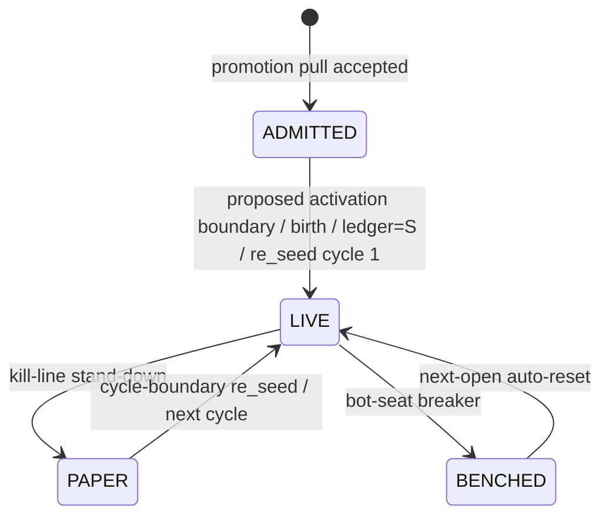

# Extract — Old Wiki (Documents/QMX/wiki) — Risk Sitting Evidence (GAP-0039..0046)

**Corpus:** `C:/Users/Mubarak/Documents/QMX/wiki/` — the most recent old-generation
wiki (MkDocs redocumentation of QMX). READ-ONLY EVIDENCE.

**Corpus layering note (recorded, not adjudicated):** This wiki reconciles three
underlying source families, each stamped in page front-matter `sources:` and inline
`[source: ...]` markers. In this wiki's own stated precedence (highest first):
`bmad-planning-run-2026-07` (operator-ratified July planning run; the wiki says it
"outranks both the recovered artifacts and earlier GitBook framing")
> `qmx-gitbook` (capture `2026-07-18T141659Z`) > `local-cleaned`
(recovered design artifacts, 2026-07-20, explicitly donor/unratified). The wiki's
`attic/` folder holds four **ruled-out / superseded** governing pages (moved
2026-07-21, MkDocs-excluded) — flagged below wherever cited, never presented as live
design. Page `updated:` dates range 2026-07-18 to 2026-07-27. I record each finding's
layer + date; I do not decide precedence against the current Desktop/QMX spine.

Citations are `path:line` relative to `C:/Users/Mubarak/Documents/QMX/wiki/`.

---

## 1. Book schema (CT-BOOK-01/02/03, versioned book-type schema, seven doors)

**Layer/date:** CT-BOOK-03 = bmad-planning-run-2026-07, updated 2026-07-27 (Story 5.1
ratified). CT-BOOK-01 = qmx-gitbook, 2026-07-18. CT-BOOK-02 = mixed, 2026-07-24.

### CT-BOOK-03 Book Type Schema (the versioned book-type contract)
`contracts/ct-book-03-book-type-schema.md:18` — VERBATIM:
```
A book type is a versioned JSON Schema contract using the ratified book-template
Sections 0-5: charter, footprint, money rules, entrance exam, leash chain, and
capacity/sweep mechanics. Section 6 remains explicitly undefined.
```
- Executable standard `standards/ct-book-03-book-type-schema.json`; validator
  `trading-node/qmx_trading_node/book_type_schema.py` (`:14`).
- Storage discipline is part of the contract: filtered fields need typed core columns;
  sparse JSON bag restricted to ratified inert/measured/informational keys; hot
  attributes need expression-index promotion metadata; **EAV storage is structurally
  refused** (`:20`).
- Authoritative numeric values stay registry-owned under book-instance ownership,
  referenced not embedded inline (`:22`).
- Story 5.1 does NOT mint `book_id`, define mode-registry/Treasury tables, ratify
  CT-ATTR-01, or create BMS write paths (`:26`). Unresolved: CT-ATTR-01, permanent
  `book_type_id` policy, venue/platform/instrument encodings (`:28`).

### Book template ordinals (the six ratified sections — NOT "seven doors")
`components/book-template.md:18-26` VERBATIM ordinals: `0. charter; 1. footprint;
2. money rules; 3. entrance exam; 4. leash chain; 5. capacity and sweep mechanics.`
"Section 6 workspace framing is not part of the ratified template" (`:27`). Same in
`decisions/adr-0002-template-and-instance-split.md:22`, `system/mental-models.md:70`,
`contracts/ct-book-03-book-type-schema.md:18`.

### The seven doors (ordered) — VERBATIM
`components/book-template.md:47`:
```
The seven doors remain ordered: footprint, viability veto, R_max, daily budget,
breaker, exposure ledger, and kill switch. Every refusal appends veto-class evidence
through Records.
```
Corroborated `system/mental-models.md:44`; `contracts/ct-book-01-trade-intent-envelope.md:37`
(lists same 7: "footprint, viability veto, R_max, daily budget, breaker, exposure
ledger, and kill switch").

### CT-BOOK-01 Trade Intent Envelope schema — VERBATIM
`contracts/ct-book-01-trade-intent-envelope.md:22-32`:
```
| Field              | Type   | Required | Allowed values / constraints |
| book_id            | string | yes      | — |
| bot_id             | string | yes      | — |
| pair               | string | yes      | — |
| side               | enum   | yes      | BUY, SELL |
| requested_r        | number | yes      | Units: R |
| footprint_version  | string | yes      | — |
| snapshot_version   | string | yes      | — |
| timestamp_utc      | string | yes      | Format: date-time |
```
Boundary Bot→Book: "The bot proposes intent; the book owns doors and sizing and does
not let the intent bypass them" (`:18`). Every refusal emits CT-BMS-05 journal-append
(`:36`).

**Not found in this corpus:** literal token strings `CT-BOOK-01/02/03` are the exact
IDs; no field named "seven doors" — the doors are a runtime gate list, not a schema field.

---

## 2. BMS schema (CT-BMS-*), what a BMS owns vs the Book

**Layer/date:** CT-BMS-01/02/03/04/05 mixed qmx-gitbook + bmad-planning-run-2026-07,
updated 2026-07-21.

### What BMS owns vs Book
`components/book-management-system.md:15` VERBATIM:
```
BMS accounts for and constrains books. Its desks are Treasury, Exposure, Records, and
Reporting. BMS owns the surrounding controls and records but never trades, sizes,
mutates bot logic, or reaches inside a book.
```
Authority order (`system/invariants.md:19`, L1): "Bots trade; books control bots; BMS
accounts for and constrains books; nothing above a bot touches the market." Book owns
admission, sizing, roster, seven doors, leash, profile selection
(`components/book-template.md:16`). Records is the SOLE journal write path; Reporting
computes and has zero authority (`components/book-management-system.md:27,46`).

### CT-BMS-01 Treasury Event — VERBATIM (`contracts/ct-bms-01-treasury-event.md:19-27`)
```
| event_id        | string | yes | — |
| book_id         | string | yes | — |
| cycle_id        | string | yes | — |
| event_type      | enum   | yes | sweep, refund, re_seed |
| amount          | number | yes | Units: USD; money-path uses exact arithmetic |
| reason          | string | yes | — |
| occurred_at_utc | string | yes | Format: date-time |
```
Only three event types cross Treasury→Records; `refund` dormant in V1 (`:34`);
mid-cycle top-up and live restart from a remnant are dead paths (`:36`).

### CT-BMS-02 Mode Registry Read — VERBATIM (`contracts/ct-bms-02-mode-registry-read.md:24-27`)
```
| book_id        | string | yes | — |
| mode           | enum   | yes | LIVE, PAPER, BENCHED, STOOD_DOWN; V1 book rows LIVE/PAPER only |
| updated_at_utc | string | yes | Format: date-time |
```
BMS→KSA; "BMS owns the mode registry; KSA reads it" (`:19`). Reserved book-level
BENCHED/STOOD_DOWN semantics = GAP-0015 (`:33`).

### CT-BMS-03 Reconciliation Report — VERBATIM (`contracts/ct-bms-03-reconciliation-report.md:24-29`)
```
| account_id      | string | yes | — |
| virtual_equity  | number | yes | Units: USD |
| broker_equity   | number | yes | Units: USD |
| explained_delta | number | yes | Units: USD |
| verdict         | enum   | yes | reconciled, drift, unknown |
```
Direction resolved Treasury→BMS; "unexplained drift is a technical kill" (`:33`). Note
`account_id`-keyed (per-account reconciliation).

### CT-BMS-04 News Block Directive — VERBATIM (`contracts/ct-bms-04-news-block-directive.md:24-30`)
```
| directive_id      | string | yes | — |
| affected_currency | string | yes | — |
| affected_pairs    | array  | yes | — |
| window_start_utc  | string | yes | Format: date-time |
| window_end_utc    | string | yes | Format: date-time |
| reason            | string | yes | — |
```
BMS→KSA; applies to live AND paper; currency→every pair containing it;
`affected_pairs[]` is a non-authoritative hint (`:36`). See Topic 8.

### CT-BMS-05 Journal Append — VERBATIM (`contracts/ct-bms-05-journal-append.md:24-30`)
```
| journal         | string | yes | — |
| event_id        | string | yes | — |
| event_type      | string | yes | — |
| payload         | object | yes | — |
| refs            | array  | yes | — |
| occurred_at_utc | string | yes | Format: date-time |
```
Records is sole writer; `journal` value MUST be one of five exact streams:
`veto_ledger, trade_journal, book_journal, ksa_audit_log, correlation_ledger` (`:36`).

---

## 3. Cardinalities (Book↔BMS, bot↔Book, Book↔account/venue)

**Layer/date:** mixed; connection-manager updated 2026-07-26 (bmad-planning + gitbook).

- **Book↔BMS:** BMS is a single accounting-and-constraint layer *above books* (plural):
  `components/book-management-system.md:17` "an accounting-and-constraint layer above
  books". BMS constrains many books; one BMS. No explicit "one Book → several BMS" —
  BMS is singular system-level. **May one Book own several BMS? NOT SUPPORTED** — BMS
  is the layer over all books, not owned by a book.
- **bot↔Book:** bot certified against the *specific* book it joins
  (`contracts/ct-exam-01-exam-certificate.md:14`); a book owns a roster of bots
  (`roster_capacity = 6 PROVISIONAL`, `registry/variables.md:54`;
  live concurrency `max_concurrent_live_bots = 3`, `variables.md:30`). One Book → many
  bots (roster). "Roster seat — A bot's place in a book roster" (`glossary/index.md:71`).
- **Book↔account/venue:** `components/connection-manager.md:41` VERBATIM:
  ```
  Book-to-account assignment is operator-configured through the desktop console,
  belongs to system-settings scope, and is mutable and journaled.
  ```
  Connection manager keeps "a connection pool per account binding" and "multiple
  connections per live account where the platform rate ceiling requires it" (`:21-22`).
  Each live account binding is paired with a demo binding (`:30`). "The future
  multi-account/multi-platform load balancer attaches at this boundary. It is not a V1
  implementation requirement" (`:44`). QMX is forex-only, single platform cTrader in V1
  (`system/invariants.md:41`). **"May one Book bind accounts at several venues?"
  NOT-FOUND as an explicit cardinality;** multi-account/multi-platform is explicitly a
  post-V1 future. V1 venue = cTrader/FOREX (venue encodings `FOREX`/`CTRADER`/ISO pair
  are **Proposed**, `open-questions.md:38`).

---

## 4. Book/BMS lifecycle states & modes; seat-state vs book-mode split

**Layer/date:** bmad-planning-run-2026-07 (AD-28/AD-40), updated 2026-07-24.

### Book-mode enum vs bot roster-seat state (the split) — VERBATIM
`components/paper-mode-system.md:32`:
```
The V1 book-mode map emits only LIVE and PAPER. BENCHED is a bot roster-seat state.
BENCHED and STOOD_DOWN remain reserved values in the wider mode vocabulary, and their
unratified book-level semantics remain with GAP-0015.
```
- **Book mode enum** lives in BMS mode registry (CT-BOOK-02 / CT-BMS-02): full enum
  `{LIVE, PAPER, BENCHED, STOOD_DOWN}`, but **V1 books use LIVE/PAPER only**.
- **Bot seat state** is roster-owned by the book: `LIVE → BENCHED → LIVE`; a benched
  seat "behaves as paper until next open" and auto-resets at next open
  (`system/lifecycle.md:48`, `ct-paper-01-paper-mode-transition.md:32`).
- **ADMITTED** is a *registration state, never a book mode* (`glossary/index.md:19`,
  AD-40): entered at promote-to-live click; unit emits no intents, holds no ledger;
  exits when birth + LIVE land atomically at activation boundary.

### Lifecycle state machine — VERBATIM (`system/lifecycle.md:28-36`)

- LIVE→PAPER: kill-line stand-down; emits PAPER until cycle-boundary `re_seed`
  (`ct-book-02-book-mode-state.md:35`).
- Activation boundary = **next rollover (Proposed, pending operator confirmation)**
  (`ct-book-02:34`, `lifecycle.md:27`).
- Trading-node paper is now ONLY two fail mechanisms: book kill-line stand-down + bot
  breaker bench (`components/paper-mode-system.md:19-25`, AD-28). Birth-in-paper,
  warm-up, examination-to-paper moved to certification side.
- Bot breaker benching does NOT mutate book mode (`ct-book-02:37`).

---

## 5. Book versioning + compatibility (scalping-book-v2 = NEW Book, no v1 ledger inherit)

**Layer/date:** bmad-planning-run-2026-07.

- Book type is a *versioned* JSON Schema (`contracts/ct-book-03-book-type-schema.md:18`;
  `glossary/index.md:35` "Book type — A versioned JSON Schema").
- **NOT-FOUND (explicit):** No statement in this corpus that "scalping-book-v2 is a NEW
  Book that never inherits v1 ledger." The corpus establishes versioning of book *types*
  and the invariant that **money resets between cycles while knowledge persists**
  (`system/invariants.md:23`, L5), and that live-remnant restart is forbidden
  (`components/treasury-desk.md:60`), but does not state a version-bump-creates-new-book
  / no-ledger-inheritance rule. Record as a GAP for the risk sitting.

---

## 6. Exit ownership (bots own exits vs Book owns exits; forced exits; fast invalidation; dynamic SL/TP)

**Layer/date:** position-safety topic = mixed, status **needs-review**, updated
2026-07-21 (ratified placement) + interim boundary 2026-07-28. Recovered asymmetric
policy = local-cleaned (donor, UNRATIFIED).

### Ratified placement (current authority) — VERBATIM
`topics/position-safety-and-sltp-authority.md:16`:
```
Dynamic SL/TP belongs in the book grammar, with BMS as configuration authority. The
exact stop policy, bot wiring, exam pinning, stop-out taxonomy, close priority, and
position fate at rollover, sweep, kill line, and paper transitions remain unresolved
pre-epic blockers.
```
`:71`: "Stop-policy grammar belongs to the book's money rules. The template defines
permitted rule forms, each book instance owns its registry/formula-backed values, BMS
governs configuration, and enforcement crosses the adapter boundary." Authority
hierarchy: "The bot owns market-facing entry and exit organs; the book owns admission
and sizing" (`system/invariants.md:39`).

### Recovered asymmetric SL/TP policy (UNRATIFIED donor baseline) — VERBATIM
`topics/position-safety-and-sltp-authority.md:22-30`:
```
- the bot supplied initial position intent and then relinquished stop control;
- at +1R, stop-loss moved once to spread-adjusted breakeven and never reset;
- take-profit could trail continuously when a market-information continuation
  probability exceeded a threshold;
- true losers were allowed to reach the original full stop;
- kill-switch overrides pre-empted normal amendments;
- every amendment was recorded.
```
"The named continuation and amendment thresholds had no published values" (`:31`).

### Who moves stops / adapter surface
- Bot relinquishes stop control after entry; some runtime subcomponent computes
  post-entry amendments under the book policy — WHICH ONE is undefined (`:87`).
- CT-ADAPTER-01 currently permits `place_order, cancel_order, close_position,
  close_all`; it does NOT register position amendments; `amend_order` pending explicit
  ratification, may not be hidden in `payload` (`:41`, `ct-adapter-01:26,34`).
- cTrader amend-SL/TP feasibility confirmed (`:41`, GAP-0005 closed).

### Interim (2026-07-28) boundary handling — VERBATIM (`:75-81`)
```
No position flatten or carry behavior is implemented anywhere in V1 until PE-7 is ruled.
```
Boundary stories consume caller-supplied boundary-equity evidence; reconciliation
carries open-position unrealized PnL as explicit `unknown` blocking FR-32; kill-line
stand-down flips book mode with NO position action (Story 5.7).

**Forced exits / fast invalidation:** vocabulary present only as
`close_position`/`close_all` adapter commands (`ct-adapter-01:26`) and KSA effects
(Topic 10). No dedicated "fast invalidation" organ is defined; "position fate at
boundaries" (PE-7) is an OPEN blocker (`knowledge/gap-report.md:42`).

---

## 7. Paper mode (bench-to-paper, paired demo, dup-order prevention, live↔paper, comparability)

**Layer/date:** paper-mode-system = bmad-planning-run-2026-07, updated 2026-07-24;
CT-PAPER-01 status active, 2026-07-24.

### CT-PAPER-01 Paper Mode Transition schema — VERBATIM
`contracts/ct-paper-01-paper-mode-transition.md:19-26`:
```
| book_id         | string | yes | — |
| bot_id          | string | no  | Present for a bot-seat transition |
| from_mode       | enum   | yes | LIVE, PAPER, BENCHED, STOOD_DOWN |
| to_mode         | enum   | yes | LIVE, PAPER, BENCHED, STOOD_DOWN |
| frozen_balance  | number | yes | Units: USD; money-path exact arithmetic |
| trigger_event_id| string | yes | — |
```
### Rules — VERBATIM (`:30-35`)
```
- On the trading node, this contract now applies only to fail-mechanism paper: book
  kill-line stand-down and bot-seat breaker benching...
- Book-scoped transitions use LIVE and PAPER only in V1.
- Bot breaker benching uses roster-seat state: LIVE → BENCHED → LIVE; the benched seat
  behaves as paper until next open.
- Paper balance freezes at the boundary and is never hand-adjusted.
- Paper gains are not Treasury cash.
- A trading-node transition outside this fail-mechanism set refuses and appends
  veto-class evidence.
```
### Paired demo / comparability — VERBATIM (`components/paper-mode-system.md:15`)
```
A paper-phase bot uses the paired demo account binding but judges the same canonical
market feed as live trading.
```
Invariants (`:44-51`): paper-phase fills route to paired demo binding; **live and paper
use the same pinned canonical sensing feed** (comparability guarantee); paper balance
frozen and never hand-adjusted; paper gains are evidence not cash. Connection manager
pairs each live account binding with a demo binding for paper fills
(`connection-manager.md:30`).

**Duplicate-order prevention:** connection manager correlates command/fill pairs with
`clientMsgId` and attributes fills with `label` (`connection-manager.md:28`); order
path is fire-and-reconcile, confirmed fills asynchronous (`:36`). No explicit
"duplicate-order prevention" mechanism named beyond clientMsgId correlation + label
attribution — **partial finding.**

---

## 8. News protection (before/after windows, severity tiers, currency→instrument, open-position, overrides)

**Layer/date:** CT-BMS-04 + BMS Exposure = bmad-planning-run-2026-07, 2026-07-21;
SCN-0003 = 2026-07-18.

### Currency→instrument mapping — VERBATIM (`contracts/ct-bms-04-news-block-directive.md:36`)
```
BMS Exposure owns calendar import and compilation. Compilation maps affected_currency
to every pair containing that currency; affected_pairs[] is a non-authoritative hint.
```
### Windows
- Window is explicit UTC start/end (`window_start_utc`, `window_end_utc`) — the
  directive carries the window, not a minutes-offset (`:28-29`).
- **NOT-FOUND: numeric before/after minutes.** No minutes value (e.g. "±N min around the
  event") appears anywhere in this corpus. The window is directive-supplied UTC bounds.
### Severity tiers
- "if high-impact coverage is unknown after fallback, blocking is conservative and
  visible" (`:38`); "Forex Factory primary and verified impact-carrying fallbacks"
  (`:38`). Term "high-impact" is the only severity notion — **no explicit tier ladder
  (e.g. low/medium/high folder colors) with thresholds.** Partial finding.
### Open-position behavior
- News block blocks *new entries* for affected pairs live+paper
  (`ct-ksa-01:34`, `components/kill-switch-authority.md:38`). SCN-0003 shows candidate
  ENTRIES refused (`scn-0003-news-block.md:36-37`). **Behavior of ALREADY-OPEN positions
  under a news block is NOT specified** (falls under PE-7 position-fate blocker).
### Overrides / session scoping — VERBATIM (`ct-bms-04:37`)
```
Session scoping may widen a block but may not narrow it. Sessions remain informational,
not authority.
```
No human override path defined (system is unattended; L3 `invariants.md:21`). Calendar
refresh is a daily pre-trading-day ritual, journaled, conservative on unknown coverage
(`:38`).

---

## 9. SQS / spread-quality sensing (formula, inputs, thresholds, cadence, hysteresis; WHY)

**Layer/date:** MIS + CT-MIS-01 = mixed, 2026-07-21. Glossary 2026-07-24.

### What SQS is — VERBATIM
`components/market-intelligence-service.md:46`:
```
SQS means snapshot quality score. An unreachable SQS creates a hard door block; it is
not a direct MIS trading decision.
```
`glossary/index.md:79`: "SQS — Snapshot quality score. An unreachable SQS causes a hard
door block." `ct-mis-01:38`: "SQS means snapshot quality score."

### CT-MIS-01 snapshot fields carrying spread/quality — VERBATIM (`contracts/ct-mis-01-mis-live-snapshot.md:22-32`)
```
| pair              | string  | yes | — |
| resolution        | string  | yes | — |
| snapshot_version  | string  | yes | — |
| spread_state      | enum    | yes | normal, elevated, extreme |
| gap_event         | boolean | yes | — |
| liquidity_stress  | boolean | yes | — |
| feed_state        | enum    | yes | fresh, stale, dead |
| sqs_score         | number  | yes | — |
| sqs_hard_block    | boolean | yes | — |
| regime            | enum    | no  | trend, range, chaos |
| regime_confidence | number  | no  | — |
| degraded_sensors  | array   | yes | — |
```
### WHY it existed
- SQS is a *snapshot-quality* gate feeding door logic: "An unreachable SQS creates a
  hard door block" — protects against acting on degraded/low-quality sensor snapshots
  (`market-intelligence-service.md:44`; runtime.md:66). MIS is information-only; it
  never sizes/blocks/trades (`ct-mis-01:41`, L6 invariant).

### NOT-FOUND (critical for risk sitting):
- **No SQS formula.** `sqs_score` is `number` with no computation, no inputs list, no
  threshold value, no cadence, no hysteresis anywhere in this corpus. `spread_state`
  enum (`normal/elevated/extreme`) has no numeric thresholds either. The wiki treats SQS
  as an opaque published field + a hard-block boolean. Record as GAP for the sitting.

---

## 10. Kill switch / KSA (authority, scopes, escalate-only, effect vocabulary, adapter)

**Layer/date:** KSA + CT-KSA-01 = qmx-gitbook + local-cleaned + bmad-planning, 2026-07-21;
CT-KSA-01 2026-07-18.

### Authority model — VERBATIM (`components/kill-switch-authority.md:16`)
```
KSA is the global protection state machine. BMS owns policy, the trading node enforces
effects through the adapter, and bots never see KSA directly.
```
Protection funnel (`:63`): "MIS senses -> standalone KSA decides -> adapter enforces.
KSA is never part of MIS."

### CT-KSA-01 Kill-Switch State Event schema — VERBATIM (`contracts/ct-ksa-01-kill-switch-state-event.md:22-29`)
```
| event_id         | string | yes | — |
| level            | enum   | yes | GREEN, YELLOW, ORANGE, RED, BLACK |
| trigger_class    | enum   | yes | scheduled_news, black_swan, connectivity, unknown_state |
| affected_pairs   | array  | yes | — |
| evidence_refs    | array  | yes | — |
| effective_at_utc | string | yes | Format: date-time |
```
### Levels (registry) — VERBATIM (`registry/variables.md:42`)
```
| ksa_levels | KSA_LEVELS | [GREEN, YELLOW, ORANGE, RED, BLACK] | enum | ... |
COMP-KSA | DEC-0043 | false | Global capability; book profiles select behavior. |
```
### Escalate-only + human de-escalates — VERBATIM
`system/invariants.md:26` (L8): "Automated KSA transitions escalate only; de-escalation
requires A1 human authority." Also `:22` "de-escalation requires A1 human authority."
KSA "may not de-escalate automatically... or revive the rejected half-size-through-bad-
conditions level" (`:20`).

### Scopes
- Level is GLOBAL protection state; effects scoped to `affected_pairs[]`
  (`ct-ksa-01:27`). News blocks are pair-scoped (currency membership). **No explicit
  pair/Book/account/venue/global scope ladder** beyond global-level + affected-pairs.
  L12 (`invariants.md:30`): "Graduated policy shrinks before it blocks unless the event
  class demands instant action."

### Effect vocabulary (suspend-new / drain / close_all) — partial
- News-affected pairs **block new entries** live+paper (`ct-ksa-01:34`).
- On KSA transition, connection manager **quiesces affected book sequencers and drains
  every connection for the account before enforcement counts complete**
  (`connection-manager.md:31`, `system/lifecycle.md:46`).
- Adapter effect commands available: `close_position`, `close_all` (`ct-adapter-01:26`).
- **NOT-FOUND: an explicit named effect vocabulary** ("suspend-new / drain / close_all")
  mapped per level. The trigger-to-level target matrix is GAP-0015
  (`ct-ksa-01:36`, `kill-switch-authority.md:67`). ENH-0008 proposes a scalper-specific
  dormant YELLOW/RED mapping (**Proposed**, `:67`). Dead `TIGHTEN` level and
  half-size-through-bad-conditions are rejected (`:20,55`).

### Adapter interaction
KSA→adapter via CT-KSA-01; adapter enforces; "Unknown startup state blocks unsafe
execution until reconciled" → `unknown_state` (`ct-ksa-01:35`, `ct-adapter-01:32`).

---

## 11. Correlation ledger / correlation rules (computed vs enforced)

**Layer/date:** mixed; CT-EXAM-02 2026-07-18; registry 2026-07-26.

- **Computed:** Examination emits CT-EXAM-02 Cohort Correlation Certificate with
  `correlation_observations` (array) and `expected_loss_shape`
  (`contracts/ct-exam-02-cohort-correlation-certificate.md:24-28`). "Chorus thresholds
  derive from cohort exam observations" (`:32`).
- **`correlation_ledger`** is one of the five Records streams
  (`ct-bms-05:36`, `data-layer.md:42`); `lenses/observability.md:25`: "`correlation_ledger`
  | COMP-BMS | Chorus observations and cohort references."
- **Enforced?** NOT in V1. `registry/variables.md:43`:
  ```
  | chorus_expected_frequency_rule | F_CHORUS | null | probability_per_window | ...
  Certified from cohort exam; exact threshold pending in GAP-0012. |
  ```
  Chorus flag = "listener for abnormal loss rate and clustering shape, not amount lost.
  Its threshold remains null under GAP-0012" (`glossary/index.md:41`). Registration
  correlation/dedup/classification screens are **NOT autonomous V1 gates**; thresholds
  stay null (`topics/registration-and-promotion.md:30`, `book-template.md:49`).
- **Summary:** correlation/cohort data is *computed and recorded* (certificate +
  ledger); no correlation *enforcement* threshold is set (all null, GAP-0012).

---

## 12. Money ladder + R (FORM-0004, FORM-0006, variables, seat/offer/take, treasury seed-to-cap+sweep, distinct capital)

**Layer/date:** registry/formulas + variables = qmx-gitbook + bmad-planning,
2026-07-21/26. This is the most load-bearing section — full verbatim.

### Formula register — VERBATIM (`registry/formulas.md:18-28`)
```
| ID       | Name                 | Expression |
| FORM-0001| cap_equity           | C = cap_multiple * S |
| FORM-0002| runway               | U = E - K |
| FORM-0003| daily_loss_budget    | D = U / n |
| FORM-0004| offer_per_seat       | offer_R_usd = D / (B * b * Lbar) |
| FORM-0005| take_per_seat        | take_R_usd = min(offer_R_usd, trust_bounded_cost_aware_kelly_R_usd) |
| FORM-0006| r_max_ceiling        | R_max_usd <= B * b * Lbar |
| FORM-0007| viability_floor      | round_trip_cost_R / expected_edge_R <= v_cost |
| FORM-0008| refund_reserve       | reserve_usd ~= rho * N_cycles_month * S |
| FORM-0009| expectancy_in_r      | EV = p * W - (1 - p) * L - c |
| FORM-0010| break_even_probability | p > (L + c) / (W + L) |
```
Notes (`formulas.md:19-28`): FORM-0001 "cap is checked at rollover only"; FORM-0003
"Re-derived at rollover and drains intraday"; FORM-0004 "The book offers;
trust-bounded cost-aware Kelly disposes"; FORM-0005 "Kelly input is not registered;
live sizing remains incomplete by design" (Gap PE-4); FORM-0006 "Lbar is measured per
bot at exam"; FORM-0008 "~=" approximate, GAP-0007.

### Variable meanings + units — VERBATIM (`registry/variables.md:19-25`)
```
| scalper_seed_capital       | S           | 500  | USD | money | S > K; operator-countersigned |
| scalper_kill_line          | K           | 200  | USD | money | Fixed within the cycle |
| scalper_cap_multiplier     | cap_multiple| 2.5  | ratio | Cap C = S * this |
| scalper_runway_divisor     | n           | 5    | count | Floor-trader discipline number |
| scalper_breaker_threshold  | B           | 2    | consecutive_stopouts | before bench-to-paper |
| scalper_budget_shaping_factor | b        | 2    | ratio | offer-per-seat coefficient |
| scalper_mean_loss_r        | Lbar        | measured_per_bot_at_exam | R | 0.35R reference only, never inherited default |
```
So for FORM-0004 `offer_R_usd = D/(B*b*Lbar)` and FORM-0006 `R_max_usd <= B*b*Lbar`:
- **D** = daily loss budget (USD), = U/n = (E-K)/n.
- **B** = `scalper_breaker_threshold` = 2 (consecutive stop-outs before bench).
- **b** = `scalper_budget_shaping_factor` = 2 (ratio; offer-per-seat shaping coeff).
- **Lbar** = `scalper_mean_loss_r` = measured per bot at exam (R units; 0.35R is a
  reference expectation only, NOT an inherited default).
- **S** = seed = $500; **K** = kill line = $200; **E** = current book equity;
  **U** = runway = E-K; **n** = runway divisor = 5; **C** = cap = 2.5*S = $1250.

### Seat / offer / take mechanics — VERBATIM (`scenarios/scn-0001-money-ladder.md:18-22`)
```
equity -> runway -> daily loss budget -> offer per seat -> final take
The book offers risk capacity through FORM-0004; FORM-0005 determines the final take.
```
Worked checksum (`scn-0001:63`): S=500, K=200, n=5, B=2, b=2, E=S → U=300 USD,
D=60 USD; offer/take depend on measured Lbar + trust-bounded Kelly. "The book offers;
trust-bounded cost-aware Kelly disposes" (`formulas.md:22`).

### Treasury seed-to-cap + sweep — VERBATIM (`components/treasury-desk.md:19-23`)
```
seed -> live cycle -> cap -> rollover sweep -> reset to seed
The book may compound within the cycle and ratchet between cycles, but money resets
between cycles while knowledge persists.
```
Sweep checked at rollover only; uses rollover equity (`ct-bms-01:35`). SCN-0002:
C=$1250; at rollover equity $1300 → sweep = E-S = $800; post-sweep virtual equity = $500
(`scn-0002-rollover-sweep.md:74`). Cap reached intraday → finish day, sweep at rollover
(`scalper-book.md:33`).

### Distinct capital concepts
- Virtual capital ledger (Treasury-owned) vs broker equity (reconciled;
  `ct-bms-03`). "Paper gains are diagnostic evidence, not treasury cash"
  (`scalper-book.md:39`). Book compounds within cycle, not across cycles
  (`scalper-book.md:33`). Refund-reserve `reserve_usd ~= rho*N_cycles_month*S`
  (FORM-0008) is a SEPARATE dormant reserve concept, GAP-0007, refund dormant in V1.
- L4 (`invariants.md:22`): "Unclaimed or freed risk budget is never redistributed
  during a cycle."

---

## 13. Stop-out (definition; breakeven-exit ambiguity; consecutive counter B=2)

**Layer/date:** position-safety needs-review 2026-07-21; registry 2026-07-26; gap-report
2026-07-27.

- **Consecutive-stop-out counter:** `scalper_breaker_threshold` symbol **B = 2**,
  units `consecutive_stopouts`, "Consecutive stop-outs before bench-to-paper"
  (`registry/variables.md:23`). Breaker is door 5 of seven (`book-template.md:47`).
- **Breakeven-exit ambiguity — VERBATIM** (`topics/position-safety-and-sltp-authority.md:47`):
  ```
  A breakeven exit and a full original-stop loss are different outcomes, but the current
  scalper breaker only says "consecutive stop-outs." Whether a BE-out counts is undefined.
  ```
  `:85`: "Does a breakeven exit count toward `scalper_breaker_threshold`?" (open).
- **Stop-out taxonomy is an OPEN pre-epic blocker PE-3** — VERBATIM
  (`knowledge/gap-report.md:40`): "PE-3 — stop-out taxonomy: must remain
  projection-computable and blocks breaker/sizing completion." Also
  `open-questions.md:18`: "Which exits count as stop-outs for breaker projection and
  measured `Lbar`? (PE-3)".
- **No standalone definition of "stop-out"** is given beyond the breaker's
  consecutive-stopouts counter; the taxonomy is explicitly unresolved.

---

## 14. Alpha-decay evidence classes; "the Book sets the bar"; qualification metrics; exam certificates; certified footprint

**Layer/date:** Exam certificate 2026-07-18 (gitbook); alpha-decay LIVE topic is a
tombstone; the detailed alpha-decay page is in **attic/ (RULED-OUT)**.

### Exam certificate (LIVE) — VERBATIM (`contracts/ct-exam-01-exam-certificate.md:22-32`)
```
| bot_id             | string | yes | — |
| book_profile       | string | yes | — |
| labeler_versions   | object | yes | — |
| ev_by_regime       | object | yes | — |
| mean_loss_r        | number | yes | — |
| fire_rate_band     | object | yes | — |
| breaker_expectation| object | yes | — |
| cost_ratio         | number | yes | — |
```
Rules: "A bot is certified against the specific book contract it intends to join, not
in the abstract" (`:14`) — this is the operative "the Book sets the bar" concept.
"A candidate that clears entry logic but fails the cost-adjusted edge fails the exam"
(`:36`). Two exam gates: "the edge is real after costs" and "the candidate is not
fiction" (`examination-engine.md:49`). Exam certifies/measures but **does NOT authorize
live trading** (`:18`, L-level parity L10).

### Certified footprint — VERBATIM (`glossary/index.md:53`)
```
Footprint — A measured behavior envelope established from examination and live evidence
rather than bot self-description.
```
CT-BOOK-01 carries `footprint_version`; footprint is door 1 of seven.

### Alpha-decay evidence classes — **attic/ RULED-OUT** (do not present as live)
LIVE tombstone: `topics/alpha-decay-and-performance-analytics.md:1` = "Superseded
recovered WF/DPR framing; current decay work remains deferred in the gap report."
The detail lives in **attic** `attic/topics/alpha-decay-and-performance-analytics.md:35-42`
(RULED-OUT, local-cleaned donor). Four recovered decay evidence classes VERBATIM:
```
- rolling circuit-breaker fire density;
- MAE/MFE distribution drift;
- DPR drawdown context;
- regime/session-conditioned performance.
```
"No source supplies the decay formula, weights, lookback windows, thresholds..." (`:42`).
Proposed current-native decay = "sustained, measured divergence between live behavior
and the footprint certified by Examination" (`attic/...:72`) — **Proposed only.** Decay
math is WF3, unresolved (`system/lifecycle.md:58`, `glossary/index.md:87`).

### "The Book sets the bar" — exact phrase NOT-FOUND
The literal phrase is not in this corpus; the CONCEPT (book-specific certification bar)
is at `ct-exam-01:14` / `examination-engine.md:16`.

---

## 15. Book/BMS validation leads (how a NEW Book or BMS proves itself before carrying money)

**Layer/date:** registration-and-promotion = bmad-planning, 2026-07-27.

### Unified gate — VERBATIM (`topics/registration-and-promotion.md:21-28`)
```
The V1 gate evaluates, in the ratified scope:
1. schema conformance;
2. configuration validity;
3. parity checks;
4. a verified paired demo binding on the target live account binding — the kill-line
   PAPER route (AD-28/AD-30; battery amended per AD-27). All four layers execute
   autonomously.
Every failure is a veto-class refusal with journaled evidence. Registration may be
front-loaded: a book may be registered with or without bots.
```
- One unified gate serves book-to-BMS AND bot-to-book registration
  (`book-template.md:49`, GAP-0010 closed).
- **Human promotion is mandatory** and re-runs the precondition battery server-side at
  click time (`:34`). At the click, AD-40 pulls + revalidates; success → `ADMITTED`
  (no intents, no ledger); birth + LIVE land atomically at activation boundary; unit
  trades live from its first order (`:40`).
- A NEW book may be registered with or without bots (front-loaded).
- Certification (Exam, book-specific) is the bot's proof-of-edge before admission
  (Topic 14). Registration correlation/dedup/classification screens are NOT autonomous
  gates in V1 (null thresholds, `:30`).
- WF2 (backtest-to-paper) ends at paper-complete; live entry always the operator click
  (`glossary/index.md:85`, `examination-engine.md:59`).

---

## 16. Same-tick priority (protective stops, Book force-flat, kill switch, fast invalidation, discretionary exits); no-overnight; hold limits; dead-zone (~45min handover)

**Layer/date:** position-safety needs-review 2026-07-21; KSA 2026-07-21.

### Same-tick priority — UNRESOLVED — VERBATIM
`topics/position-safety-and-sltp-authority.md:49`:
```
Close-authority ordering. KSA effects, hold-time force-flat, broker-side stops, and
normal amendments can collide on the same tick; no current priority contract resolves
that race.
```
`:89` (open decision): "What is the priority among KSA effects, hold-time force-flat,
broker hard stops, and normal stop/target amendments?" Also `open-questions.md:26`,
`kill-switch-authority.md:69` (same-tick collision is an explicit ordering GAP; old
priority model + dead `TIGHTEN` cannot be inherited without a new ruling). **No priority
ordering exists in this corpus — it is an open blocker.**

### no-overnight policy — NOT-FOUND
No "no-overnight" / flat-by-session-end rule anywhere in this corpus. "hold-time
force-flat" is referenced ONLY as an unresolved same-tick collision participant
(`:49,89`) — its existence/parameters are not defined.

### hold limits — NOT-FOUND (as a defined limit)
Only "hold-time force-flat" appears (unresolved, above). No hold-limit value/duration.

### dead-zone (~45min session-handover no-trade) — NOT-FOUND
No "~45 minute session handover no-trade / dead-zone" concept in this corpus. The only
"45" is `order_latency_max_ms = 45` ms (`registry/variables.md:40`) — unrelated. The
token "dead-zone" appears only in **attic** alpha-decay meaning a slow-path WF3 workflow
(`attic/topics/alpha-decay-and-performance-analytics.md:19`), NOT a session no-trade
window. Sessions are informational only, may widen a block but never narrow it
(`ct-bms-04:37`). Record as GAP / not-in-this-corpus.

---

## 17. Multi-currency (account numeraire, cross-account aggregation, FX conversion for risk math)

**Layer/date:** whole-corpus sweep.

- **NOT-FOUND — account numeraire:** No "numeraire" / base-currency / denomination
  concept in this corpus. All money is USD-denominated by default (S=$500, K=$200,
  amounts "Units: USD" across CT-BMS-01/03, CT-PAPER-01). QMX is forex-only
  (`invariants.md:41`).
- **NOT-FOUND — cross-account aggregation:** CT-BMS-03 reconciliation is per `account_id`
  (`ct-bms-03:24`); no cross-account roll-up defined. Multi-account load balancer is an
  explicit post-V1 future (`connection-manager.md:44`).
- **NOT-FOUND — FX conversion for risk math:** No FX-conversion step in any formula;
  the money ladder is single-currency USD arithmetic (Decimal / scaled integers,
  `formulas.md:38`). No conversion of non-USD pair PnL into a numeraire is specified.
- **This entire topic is absent** from the old wiki — record as a clean GAP for the risk
  sitting.

---

## Contradictions (within this corpus)

1. **"Seven doors" vs six template ordinals.** The template has SIX ordinal sections
   (0-5: charter, footprint, money rules, entrance exam, leash chain, capacity/sweep —
   `book-template.md:18`) but SEVEN runtime doors (footprint, viability veto, R_max,
   daily budget, breaker, exposure ledger, kill switch — `book-template.md:47`). Not a
   true contradiction (doors live inside money-rules/leash grammar) but the "seven" vs
   "0-5 six sections" numbering is a frequent trip-hazard; both are stated authoritative.

2. **Book-mode enum breadth vs V1 usage.** Enums in CT-BOOK-02 / CT-BMS-02 / CT-PAPER-01
   list `{LIVE, PAPER, BENCHED, STOOD_DOWN}` as allowed values, but every rules block
   restricts V1 to `LIVE`/`PAPER` only and marks BENCHED/STOOD_DOWN "reserved"
   (GAP-0015). A schema-literal reading (all four valid) contradicts the operative V1
   rule (two valid). Recorded, not adjudicated. (`ct-book-02:26,15`,
   `ct-bms-02:26,33`, `ct-paper-01:23-24`.)

3. **CT-PAPER-01 `from_mode`/`to_mode` allow all four enum values** (`ct-paper-01:23-24`)
   while the rules say "Book-scoped transitions use LIVE and PAPER only in V1" and bot
   benching uses `LIVE→BENCHED→LIVE` — so BENCHED is only valid on the bot-seat
   (`bot_id` present) path, not book-scoped. Schema does not encode that split; only
   prose does.

4. **Layer/recency conflict (paper mode).** GitBook-era CT-BOOK-02/CT-PAPER-01 (2026-07-18)
   described birth-in-paper / warm-up / six trading-node transitions; bmad-planning AD-28
   (2026-07-23+) SUPERSEDES that with certification-side pre-live + two fail-mechanism
   paper paths + ADMITTED. The wiki marks the newer layer authoritative
   (`ct-book-02:33`, `paper-mode-system.md:26`, `gap-report.md:25` GAP-0006
   "Reopened/narrowed"). Both framings coexist textually; newer layer wins by the wiki's
   own precedence.

5. **Alpha-decay: LIVE tombstone vs attic detail.** LIVE page is a one-line tombstone
   pointing to gap-report; the attic page carries the four evidence classes but is
   RULED-OUT. Anyone reading only the attic would over-state decay design.

---

## Not-found list (checklist topics with NO / only-partial evidence in this corpus)

- **T5 (Book versioning compatibility):** book *types* are versioned, but NO explicit
  "vN = NEW Book, never inherits vN-1 ledger" rule. (Partial: cycle money-reset +
  no-remnant-restart invariants exist, but not a version-bump ledger-isolation rule.)
- **T8 (News windows — minutes):** NO numeric before/after minutes; NO explicit severity
  TIER ladder with thresholds (only "high-impact" + conservative-on-unknown). Window =
  directive UTC bounds. Open-position behavior under news = undefined (PE-7).
- **T9 (SQS formula):** NO formula, inputs, thresholds, cadence, or hysteresis for
  `sqs_score`; NO numeric thresholds for `spread_state`. Opaque field + hard-block bool
  only.
- **T10 (KSA effect vocabulary):** NO explicit per-level effect vocabulary
  (suspend-new/drain/close_all) or scope ladder (pair/Book/account/venue/global);
  trigger-to-level matrix = GAP-0015. (Partial: drain/quiesce on transition;
  close_position/close_all adapter verbs exist.)
- **T13 (stop-out):** NO standalone stop-out definition; taxonomy = OPEN PE-3;
  BE-out-counts ambiguity explicit.
- **T16 (no-overnight / hold-limits / dead-zone 45min):** NONE present. "hold-time
  force-flat" exists only as an unresolved same-tick collision term; same-tick priority
  is explicitly unresolved (no priority contract).
- **T17 (Multi-currency / numeraire / cross-account aggregation / FX conversion):**
  ENTIRELY ABSENT. All money USD, forex-only, single-account V1.
- **T14 (partial):** exact phrase "the Book sets the bar" NOT-FOUND (concept present);
  detailed alpha-decay evidence classes exist only in RULED-OUT attic.
