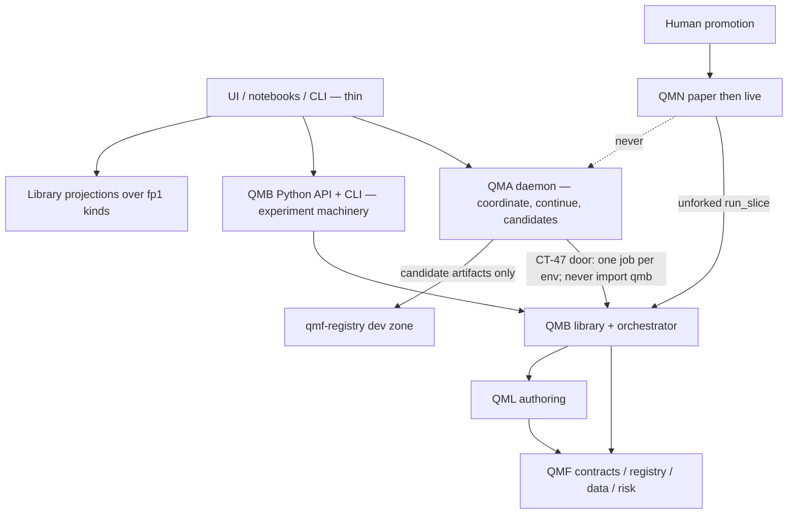
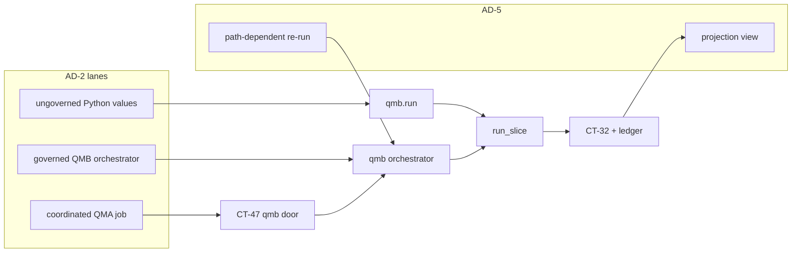
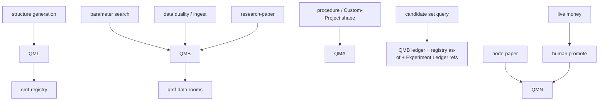

# Architecture Spine — QMX Strategy Experimentation Workbench

## Design Paradigm

**Workbench composition over hexagonal libraries.** QMF remains the contract-hub toolbox. QMB, QML, QMA, and QMN remain the four application-layer products. This sitting does not mint a fifth runtime or a sixth package. The experimentation workbench is named **projections, doors, and procedures** over those products: one fingerprint identity, three experiment lanes, and two named analysis methods. Changing test conditions still means changing config; coordinating work still means QMA missions; authoring still means QML or ordinary Python; live money still means the node and a human.



## Inherited Invariants

Parent ADs bind read-only. Local ADs may not weaken them. **Local `AD-1`..`AD-16` are this sitting’s ids** and do not renumber QMF `AD-*`, QMA `AD-*`, or CONNECT `AD-*`. Cite parents by `QMF AD-n` / `QMA AD-n` / `B-n` / `QL-n` / `TN-n` / `CONNECT AD-n`.

| Inherited | From parent | Binds here |
| --- | --- | --- |
| QMF AD-1..41 (exact money/time/fp1/refusals/worlds/rooms/Book-BMS) | architecture-QMX-2026-08-19 | All expansion units consume, never redefine |
| L7–L11, L17, L30–L36, L39 | constitution | Toolbox; ordinary Python; human-only live promote; default-deny; bot→book→BMS→operator |
| B-1..B-15 | architecture-QMB-2026-08-20 | One library, thin doors, pure run / impure orchestrator, TPE search, data fronts, CT-32 |
| QL-1..QL-10 | architecture-QML-2026-08-21 | Two-artifact bot; no `.qml` DSL; ungoverned tunnel legal; conformance ≠ performance |
| TN-1..TN-25, DEC-0261 | architecture-NODE-2026-08-28 | Node paper is Book-level demo; no per-bot paper lane; unforked `run_slice` |
| CONNECT AD-1..AD-5 | architecture-CONNECT-2026-09-11 | Honest FX paper is node+venue completion, not a research executor |
| QMA AD-1..AD-29, DEC-0341 | architecture-QMA-2026-08-28 | No QMA execution tool (paper included); ExperimentSpec; one `qmb` door; plugins/skills/routines |
| DEC-0084 / DEC-0085 / DEC-0086 | ledger graveyard | No central backtest service; no donor engine adoption |
| DEC-0376 | QMA Cut | No git-branch-per-parameter lineage |
| GAP-0048 / GAP-0049 | QMB Deferred | Fidelity taxonomy and search-quality thresholds stay deferred |
| GAP-0081 | QMA Deferred | UI contribution SDK stays deferred |

## Invariants & Rules

### AD-1 — Workbench is not a sixth application [ADOPTED 2026-09-14]

- **Binds:** all expansion units, factory preflight
- **Prevents:** a COMP-EXP / HTTP experiment service / second identity store drifting from QMB+QMA
- **Rule:** every new capability names an existing `COMP-*` owner, or an explicit connect/extend of one. Minting a new application package or a permanent experiment daemon besides `qma-daemon` is a spine amendment. Inherited stores stand: `qmf-registry`, `qmf-data` rooms, QMB JSONL run ledger, QMA daemon sqlite (journal, Experiment Ledger). A **new** store beside those is a spine amendment. DEC-0084 stays dead.

### AD-2 — Three experiment lanes [ADOPTED 2026-09-14]

- **Binds:** QMB, QMA, notebooks, UI backends, agents
- **Prevents:** exploratory values, governed evidence, and agent jobs collapsing into one “run” noun; caller-declared `lane` flags; ExperimentSpec/CT-32/returned-values competing as “the experiment”
- **Rule:** exactly three lanes, selected by **which door is called**, never by a flag on a payload. (1) **ungoverned** — `qmb.run()` / ordinary Python / `import qml` on a controlled-room host. Returns values. Writes no QMB ledger line, no CT-32 registry record, no ExperimentSpec. It is not a Library object. L33 graduation (ungoverned Python → governed evidence) is a separate extension-package + registration act, not this spawn. (2) **governed** — QMB orchestrator spawn **not** placed by the CT-47 door (CLI/API `spawn_governed`, including path-dependent `analysis.rerun`). One QMB ledger line, one CT-32. No ExperimentSpec. (3) **coordinated** — QMA Backtesting Service places at most one `qmb` CLI/MCP invocation per ExecutionEnvironment and never `import qmb`. Requires a registered ExperimentSpec. The spawned run’s QMB ledger line and CT-32 are the evidence, reached by `_ref` from the Experiment Ledger; QMA does not copy them. `workbench_lane` is derived from the door and is recorded only as **workbench metadata** on the QMB ledger line (`governed` for every orchestrator spawn, including those QMA placed) and on the Experiment Ledger entry (`coordinated` when QMA placed it). It is not QMF AD-12 evidence class, not B-4 `role`, and not a CT-32 field. A QMA-placed **run** therefore has two honest labels on two objects: the QMB ledger line is `workbench_lane=governed` (it is QMB evidence); the Experiment Ledger entry is `workbench_lane=coordinated` (QMA placed it). They are not the same field and must not be collapsed. UI/agents select a lane by calling `run` / `spawn_governed` / the QMA backtest tool; a fourth call path is a spine amendment.

### AD-3 — Library identity is a projection [ADOPTED 2026-09-14]

- **Binds:** shared Library, work environments, UI, QMA handles, F12
- **Prevents:** one bot/result existing as three records; a STRATS-shaped second store; QMA staging mixed into Library kinds
- **Rule:** Library has no new COMP. Kind owner is COMP-QMF-REGISTRY; query surfaces are the QMB B-15 registry-read as-of port, the QMB ledger merge view, and the QMA Experiment Ledger. Shared Library objects are exactly these existing kinds, cited by `fp1`: CT-33 bot, CT-34 confluence, strategy-family, CT-22 Book, CT-27 BMS, CT-28 binding, CT-12 split, CT-10 observation, CT-32 result, CT-47 ExperimentSpec (coordinated lane only). Logic source-manifests are cited from CT-33, not a separate Library kind. **Not** Library objects: QMA staging/RefinementProposals, JobHandles, Graph Templates, Skills, Routines, saved views, analysis publications, derived datasets. Work-environment tabs and display aliases are UX over those fingerprints. STRATS is a KnowledgeSource corpus (QMA AD-19); it does not write registry kinds. Saved views and analysis publications are not registry kinds; Library search returns them only as query hits citing the source kind’s `fp1`.

### AD-4 — Generation is not search [ADOPTED 2026-09-14]

- **Binds:** F01, GAP-0085, QML, QMB optimize, QMA ExperimentSpec
- **Prevents:** TPE parameter search being sold as strategy generation; a generator living inside QMB’s tunnel; QMA assembling CT-33 JSON
- **Rule:** **Search** varies declared CT-33 parameters (QMB optimize/sweep, B-8) and writes trial ledger lines citing the **same** bot `fp1`. **Generation**, if built, authors new CT-33/CT-34 content and/or logic-source **bytes via QML**. The QML/host composition root mints the CT-06 envelope. QMA `StrategyHandle` may only (1) reference an already-fingerprinted registry record and (2) register those bytes as a `dev`-zone candidate with a QMA `origin` field and a CT-07 predecessor edge. QMA never assembles CT-33/CT-34 JSON, never mints mechanism nouns, never fills RandomCondition slots. The typed Entry/Exit/Filter/Session vocabulary remains a later QML increment; **write-ownership is QML/host, not QMA**. SQ RandomCondition templates are a donor shape, not a schema to copy.

### AD-5 — Two named analysis methods [ADOPTED 2026-09-14]

- **Binds:** F05 What-if, F08 equity-control, result comparison, UI, agents
- **Prevents:** a filtered trade list being treated as a Book/BMS counterfactual; a new CT-32 sibling for a projection; size/seed rewrites as “rescale”
- **Rule:** exactly two methods, both COMP-QMB library functions with thin doors (B-1). **Projection** (`analysis.project`) reads one cited CT-32 and its CT-29 stream. Output is a **saved view**, not a CT-32. The durable body **is** the canonical JSON `{method: projection, source_ct32, source_ct29, predicate, as_of}` — a citation without that body is not a saved view. `as_of` is the source CT-32’s `registry_as_of` / occurrence, never query time. Identity `fp1` is of that JSON. Never a copied trade list or rescaled measure set. Permitted predicates: hours/days/session windows, max-trades caps, include/exclude filters. Forbidden as projection: any change to size, R, Book/BMS fragments, execution ports, or `starting_capital`. Claim-class is always `projection`; never admission evidence. Homes, body stored, keyed by `fp1`: **ungoverned** — return value only, not durable, not a Library object; **governed-without-QMA** — JSON sidecar in the **source** run-dir (not a new orchestrator spawn, not a QMB ledger line, not a CT-32); **coordinated** — the QMA daemon (Agent holding `dispatch_lease`) persists the JSON and an `analysis.published` Experiment Ledger entry citing that `fp1`. QMB never opens daemon sqlite. `analysis.project` is **not** a run: no CT-32, no QMB ledger line, no ExperimentSpec successor, no occupancy. Coordinated call = daemon shells the CLI as a query, waits, persists refs. `analysis.rerun` remains a run. **Path-dependent** (`analysis.rerun`) is a new QMB run through the tunnel (new resolved run-config: Book/BMS fragments, fill/cost/financing ports, `starting_capital`). A `starting_capital` override stamps `seed_overridden` on the binding and forces the B-4 fold `unrated` (B-3). Its canonical artifact **is** the new CT-32. `analysis_method` and `lane` are **not** CT-32 fields; they live on the QMB ledger line (governed) and/or the Experiment Ledger entry (coordinated) as metadata citing the CT-32 by `_ref`. Combining two bots’ equity/trade streams into a synthetic portfolio is neither method — refused here; F07 stays deferred. `compare_runs` is a readout of cited CT-32 fields, not an analysis method and not a new artifact; it stamps nothing. F08 that only overlays two existing series uses `compare_runs`; F08 that changes sizing/Book/seed is path-dependent (AD-6). QMA queries may **call** `analysis.project` / `analysis.rerun` and persist refs; they may not reimplement the filter.

### AD-6 — Book and BMS variants are candidates plus replay [ADOPTED 2026-09-14]

- **Binds:** F06 money-management, Book/BMS assistance, CT-47 `money_path_relevant`
- **Prevents:** trade-list rescaling posing as Book simulation; QMA filling unset risk fields; patch records posing as definitions
- **Rule:** a proposed Book/BMS version is a **complete** new fingerprinted CT-22/CT-27 document in the registry `dev` zone (not a patch record). Path-dependent evaluation is a QMB governed or coordinated replay citing that fingerprint (AD-2, AD-5). QMA may emit it only as a `money_path_relevant` candidate whose `approval_request` carries the field-level diff against the predecessor; QMA never fills an unset money-path field. Shape owner remains QMF Risk; mint remains the composition-root pattern (same as CT-33).

### AD-7 — Paper trinity [ADOPTED 2026-09-14]

- **Binds:** pre-promotion paper, QMA, QMB, QMN, DEC-0261
- **Prevents:** QuantConnect paper-brokerage, node soak, and QMB replay sharing one “paper” noun
- **Rule:** **research-paper** = QMB governed replay (`world=replay`, Book/BMS fragments in the run-config) outside the node, before promotion. **node-paper** = Book-level demo routing + soak/demotion (`role=demo`, `world=live`); no per-bot paper lane. **QMA-paper** does not exist — no execution tool at any account role. QuantConnect paper-brokerage is not a QMX lane. Promotion remains a human act outside QMA onto the node. QMB may append WriterId-scoped fragments to the B-15 hub inbox; sandbox-provenance fragments stay refused at publish and pull (TN-20). `hub_publish` is human. QMA never writes the hub; it holds candidate refs only.

### AD-8 — The QMA→QMB door is connect, not new [ADOPTED 2026-09-14]

- **Binds:** CT-47, `analysis-backtest` plugin, Experiment Ledger
- **Prevents:** a second backtest governor; `import qmb` from QMA; treating the recording transport as a working integration
- **Rule:** keep the route Agent → QMA backtest tool → Backtesting Service → `qmb` CLI (MCP later) → QMB. Replace `RecordingQmbDoorTransport` with a real CLI transport. Compose the long-running asyncio daemon process (loopback listener + sole sqlite writer + pack roster) from the existing modules — that process is connect, not a new COMP. Persist **ExperimentSpec, the QMA Experiment Ledger, and ExperimentSpec CT-07 successor edges** through the daemon journal / sqlite writer. The QMB run ledger remains QMB JSONL, reached by `_ref`, never copied, never merged (QMA AD-6). QMB does not write ExperimentSpec edges. Occupancy: one `qmb` CLI/MCP **run** invocation per ExecutionEnvironment (backtest, optimize, sweep, robustness, `analysis.rerun`, data download that mutates rooms). QMB’s process-per-run children inside that invocation are not additional QMA jobs. `analysis.project`, `compare_runs`, `sweep.rank`, ledger reads, and `data.gap-check|verify|catalog|list` are **queries**: they do not consume occupancy, mint no CT-32, and mint no ExperimentSpec successor. Docs that still say CT-47 “no code exists” are stale relative to `integration@1b451a8`.

### AD-9 — Procedures live in QMA; steps live in QMB [ADOPTED 2026-09-14]

- **Binds:** F03 Custom Projects, reusable workflows, agents
- **Prevents:** a workflow engine inside QMB; a compulsory research→backtest→paper wizard
- **Rule:** reusable procedures are QMA Graph Templates, Skills, and operator Routines. QMB does not grow a task graph. A step that names a QMB **run** (backtest, optimize, sweep, robustness, `analysis.rerun`, mutating data download) is **placed through the CT-47 `qmb` door as one CLI/MCP run invocation** (occupancy, AD-8). A step that names a QMB **query** (`analysis.project`, `compare_runs`, `sweep.rank`, gap-check/verify/catalog/list) is a door query: no occupancy, no CT-32, no spec successor. The daemon, every plugin, and every QMA worker image never `import qmb`. The CLI process is QMB; in-process library calls from QMA are a spine amendment. One Graph Template instantiation is one Mission. Each door step that changes resolved-config is an ExperimentSpec successor (`create_successor` + the QMA ExperimentSpec CT-07 `branches-from` edge already minted for specs — not bot `supersedes`, not a new edge kind); the procedure is not itself an ExperimentSpec. Composition stays non-linear: any step may be the first door placement. SQ Custom Projects remain a donor shape, not a clone.

### AD-10 — Continuation is a daemon property [ADOPTED 2026-09-14]

- **Binds:** laptop-off, remote workers, QMA scheduler
- **Prevents:** QMB process-per-run being treated as unattended continuation
- **Rule:** work that must survive workstation sleep is owned by `qma-daemon` plus registered remote ExecutionEnvironments and the durable outbox. If laptop-off is promised, the daemon or a reachable remote env must not live only on the sleeping laptop. QMB orchestrator lifetime is the job. Coordinated cancel authority is `JobHandle.cancel` only; the door maps it to QMB abort and the QMB ledger writes `aborted`. Governed-without-QMA cancel is QMB abort only. Ungoverned cancel is process death and writes nothing. Closing a UI tab cancels nothing. No other writer may set a terminal JobHandle or ledger state.

### AD-11 — Notebooks import the library; lifecycle is an environment [ADOPTED 2026-09-14]

- **Binds:** F13, B-9, QMA ExecutionEnvironment / RLM kernel
- **Prevents:** a Jupyter product inside QMB; reviving the banned bare “kernel” name outside QMA
- **Rule:** exploratory notebooks `import qmb` / `import qml` on a controlled-room host (B-9). A managed interpreter lifecycle, if product-owned, is a QMA ExecutionEnvironment (Analysis RLM kernel or a declared env kind). It is not a QMB module and not a new COMP.

### AD-12 — Extensibility ladder [ADOPTED 2026-09-14]

- **Binds:** user-facing extension, plugins, config, UI later
- **Prevents:** promising a UI plugin SDK that is GAP-0081; treating source-only extension as the product
- **Rule:** four rungs, in order: (1) ui-editable config variables on templates; (2) ordinary Python logic + QMB ports/adapters; (3) QMA plugins, skills, graph templates, desk packs; (4) UI contribution SDK. Rungs 1–3 bind now. Rung 4 stays GAP-0081 deferred. No-code authoring is not promised. QMA “plugin” vocabulary stays QMA-scoped (DEC-0346).

### AD-13 — Data work wraps qmf-data [ADOPTED 2026-09-14]

- **Binds:** F09–F11, QMB `data` commands, qmf-data rooms
- **Prevents:** a QuantDataManager clone store; silent auto-update of experiment inputs
- **Rule:** acquire / verify / gap-check / catalog / generate are QMB data commands wrapping qmf-data (B-11). CSV/file import is a CT-15 adapter (extend ingest), not a new store. Spike/OHLC quality detectors, if added, extend QMB `data` over existing observations — they are not AD-5 analysis views and not a new COMP. Quality surfaces are read models over CT-13 `data quality` events and `gap_check` reports. A derived dataset is a new fingerprinted artifact with a lineage edge; it is not a Library kind (AD-3). Vendor-style timezone clones that auto-update the source under an experiment’s feet are refused. Only a coordinated ExperimentSpec exists (AD-2); its `data_ref` must cite CT-12 split fingerprints (B-8). Governed runs cite splits on the resolved run-config, not via ExperimentSpec. Ungoverned calls mint neither.

### AD-14 — A candidate set is a query [ADOPTED 2026-09-14]

- **Binds:** F02 databanks, sweep ranks
- **Prevents:** a copied-row candidate database beside the ledger
- **Rule:** retain / filter / rank is a read-time view over (1) QMB ledger lines, (2) registry as-of sets including `dev`-zone candidates of Library kinds, (3) coordinated Experiment Ledger refs. It does **not** read QMA staging. `sweep.rank` is this view; it publishes no copied-row artifact. A saved view’s home follows AD-5: return value (ungoverned); JSON sidecar in the source run-dir (governed-without-QMA); daemon-persisted JSON plus `analysis.published` (coordinated). Not `qmf-registry`, not a new sqlite table, not a citation without a body.

### AD-15 — Labels stay parent-shaped [ADOPTED 2026-09-14]

- **Binds:** reports, UI, agents, admission
- **Prevents:** projection, synthetic, or trial results masquerading as confirmation; extending CT-32 or B-4 with workbench fields
- **Rule:** do not extend CT-32 or B-4. Mapping is total. Governed/coordinated confirmation run: B-4 `role=confirmation`; no AD-15 claim-class (it is not an analysis); AD-12 evidence class as parent. Optimize trial / sweep combo: `role=trial`. MC / WF replicate: `role=replicate` plus B-7 procedure label `robustness` or `infra-stress`. Aborted: `role=aborted`. Projection saved view: no B-4 role (not a run); claim-class `projection`; inherit source world; never `confirmed`. Path-dependent re-run: B-4 role of **that** run; may be published as analysis only as an Experiment Ledger `analysis.published` entry citing the new CT-32; still not admission evidence unless `role=confirmation`. Confirmation evidence remains B-4 `role=confirmation` only. L20 stands. Replay-world verdicts still cannot gate live money. “Published analysis” = a saved view or an Experiment Ledger `analysis.published` entry, not every CT-32.

### AD-16 — Research-undertaking identity [ADOPTED 2026-09-14]

- **Binds:** F12 project continuity, notebooks, Library, QMA, QMB workspace defaults
- **Prevents:** a QuantConnect Project package; Workspace-as-identity; Bot + ExperimentSpec + run-config + notebook as four unjoined records
- **Rule:** there is no Project kind and no Workspace kind. Coordinated research continuity is the ExperimentSpec `fp1` (code_ref when code changes, resolved_config_ref for parameter/config, data_ref = CT-12 split, environment_ref). QMB “workspace defaults” are a config-compiler layer (B-3), never an identity. A notebook file is an ungoverned working surface until an orchestrator spawn or a CT-47 placement; it joins the undertaking only as `code_ref` or as an ExecutionEnvironment session, not as a fourth identity. Display names “project” / “workspace” are UX aliases over ExperimentSpec (coordinated) or over a bot `fp1` (governed). UI tabs may group those aliases; they must not mint a record.

## Consistency Conventions

| Concern | Convention |
| --- | --- |
| Naming | QMB is a library+CLI, never an engine/kernel. Bare “paper”, “calendar”, “kernel”, “plugin” (outside QMA), and “snapshot” (for registry state) stay banned. Say research-paper / node-paper; market-hours / day-boundary / news calendar; RLM kernel; as-of set. |
| Identity | Cite Book, BMS, bot, split, result, ExperimentSpec by `fp1`. Display names and `name@version` are UX only. |
| Lanes | `workbench_lane` is derived from the door (AD-2), never a payload flag. Recorded on the QMB ledger line and/or Experiment Ledger entry. Not a CT-32 field, not AD-12 evidence class, not B-4 role. |
| Errors | Typed refusals (CT-04) at every public boundary; doors render, never swallow. |
| Config | “Configurable” = ui-editable at platform level (L38). |
| Extensibility | Add adapters, config fragments, library functions, or QMA pack contributions — never a new tunnel. |
| Docs vs code | Class/test existence is not end-to-end proof. Contract YAML `defined-unwired` on integration is stale where matching source exists; reconcile in documentation-factory, do not invent a second design. |

## Stack

Inherited pins stand. This sitting adds no new framework. Optuna remains an internal QMB sampler adapter (current upstream 5.0.0 as of 2026-09-07; the `qmb` lockfile owns the pin).

| Name | Version |
| --- | --- |
| CPython | 3.14 (3.14.7 current stable 2026-08-05; 3.15 not adopted) |
| uv workspace + lockfile | inherited (`docs/architecture/stack.md`) |
| QMF roster stores | Parquet, DuckDB, SQLite, JSONL behind QMF contracts |
| QMA daemon store | SQLite (single writer thread) — inherited QMA AD-6/AD-27 |
| Optuna (QMB sampler adapter only) | `optuna==4.9.0` on integration (`qmb/pyproject.toml`, DEC-0168). Upstream 5.0.0 exists 2026-09-07; not adopted — TPE default change is a contract-versioning event. Floats still cross only at the named AD-7/AD-22 boundary (B-8). |

## Structural Seed

```text
existing applications (no new package):
  qmf-*          # identity, evidence, risk shapes
  qml            # author CT-33/34 + logic; ungoverned tunnel
  qmb            # tunnel, orchestrator, data, optimize, robustness, results
  qma-core|daemon|wire   # coordinate, continue, CT-47 door, packs
  qmn            # paper|live destination; unforked run_slice
connect (this expansion):
  qma-daemon backtest transport   # real qmb CLI door (AD-8)
  qma-daemon experiment persistence  # journal/sqlite, not in-memory maps
  qmb CLI coverage of library rungs  # robustness, sweep.batch/rank (wiring)
  library projections             # query views over fp1 kinds (AD-3, AD-14)
  named analysis functions        # projection vs path-dependent (AD-5)
extend (this expansion):
  QML generation authoring        # new CT-33/34 candidates; QMB runs (AD-4)
  QMA Graph Templates as procedures  # AD-9
deferred:
  qma-ui-contract                 # GAP-0081
  GAP-0048/0049 content
  GAP-0085 mechanism vocabulary
```





## Capability → Architecture Map

| Capability / Area | Lives in | Governed by |
| --- | --- | --- |
| Ordinary Python exploration | QMB Python API, QML ungoverned tunnel | AD-2, QL-1, B-9 |
| Governed backtest / optimize / sweep / robustness | QMB library (+ CLI wiring) | B-1..B-15, AD-2, AD-4, AD-15 |
| Structure / template generation | QML authors; registry owns; QMB runs | AD-4 |
| What-if / equity comparison | QMB `analysis.project` (saved view) or `analysis.rerun` (new CT-32); `compare_runs` is readout only | AD-5, AD-15 |
| Money-management / Book variants | qmf-risk shapes + QMB replay + registry candidates | AD-6 |
| Data acquire / quality / derive | QMB data commands over qmf-data | AD-13 |
| Reusable procedures | QMA Graph Templates / Skills / Routines | AD-9, AD-10 |
| Experiment identity / notebook | ExperimentSpec (coordinated only) + Experiment Ledger; notebooks join as `code_ref` or env session | AD-8, AD-16, QMA AD-9/AD-17 |
| Shared Library | projections over listed fp1 kinds; no staging | AD-3, AD-14, AD-16 |
| Notebook interpreter lifecycle | QMA ExecutionEnvironment | AD-11 |
| Laptop-off continuation | qma-daemon + remote envs + outbox | AD-10 |
| Research-paper before promotion | QMB governed replay | AD-7 |
| Node paper / soak / live | QMN | AD-7, TN-9, CONNECT |
| User-facing extension rungs 1–3 | config, Python, QMA packs | AD-12 |
| UI contribution SDK | deferred stub | GAP-0081 |
| Agent money-path output | candidates only | DEC-0341, AD-6, AD-7 |

## Deferred

| Deferred | Why it can wait |
| --- | --- |
| GAP-0048 fidelity taxonomy / simulated world | Irreversible; QMB B-6/B-7 hold the seams |
| GAP-0049 search-quality thresholds | Procedures exist; values would gate compute/live |
| GAP-0016/0017 look-ahead **registration** gate | Prevention already delivered in QMB; gate stays operator-deferred |
| GAP-0085 typed mechanism vocabulary | Ownership ruled in AD-4; nouns wait on a QML increment |
| GAP-0081 UI SDK / `qma-ui-contract` | Wire binds now; presentation is its own sitting |
| GAP-0072/0073 memory backend / knowledge index | Ports exist; Delphi-class retrieval is not required to compose the workbench |
| GAP-0070/0076/0079/0086 | Desktop env, RLM envelope, external A2A, graph engine — parent revisit conditions stand |
| QMB MCP door ship | B-1 already: after CLI v1 |
| Jupyter as a pinned product | AD-11 does not need a notebook vendor pin |
| Portfolio-combination search (F07) | Needs correlation/capital evidence; AD-5/AD-6 hold the method split |
| AlgoCloud / F17 | Lower-confidence donor; inspectability is already QML+CT-33 |
| RoboQuant.dev RQ Engine, L2 book product, broker list | Closed beta; shapes only; live-survive-tab-close is node territory already |
| Exact daemon host for laptop-off | AD-10 states the property; host is QMA AD-25/AD-26 config |
| Screen composition / departments / chrome | UI track; this spine exposes objects and operations only |
| F14 agent chrome / F16 concurrent-edit limits | UI; QMA context binding and B-15 as-of freeze already hold |
| Documentation-factory reconcile of `defined-unwired` stamps | Docs debt, not an architectural fork |

## Open questions

| Question | Revisit when |
| --- | --- |
| First generator algorithm (placeholder-fill of CT-34 legs vs Python-logic synthesis) | QML increment after AD-4 ownership; not a blocker for connect-wave epics |
| Concrete always-on host for AD-10 | Operator names a reachable ExecutionEnvironment or moves the daemon off the laptop |
| PRD FR coverage for ExperimentSpec, procedures, generation, analysis methods | Next PRD update (existing PRD remains; this spine is the expansion contract) |
