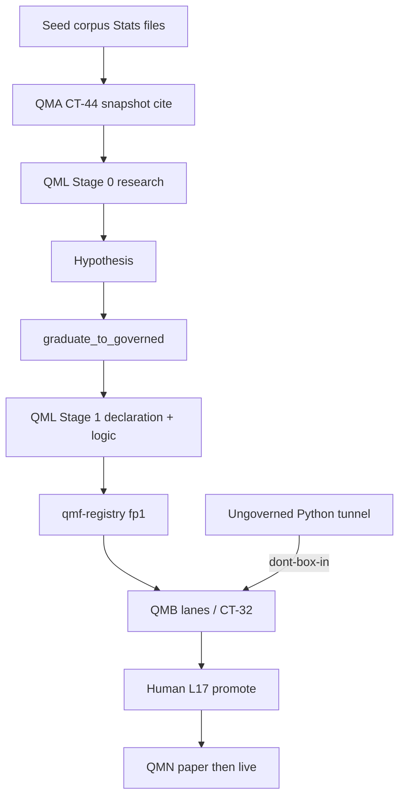
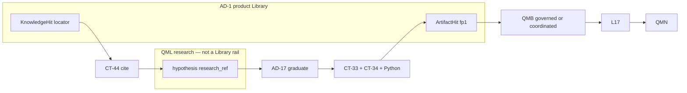
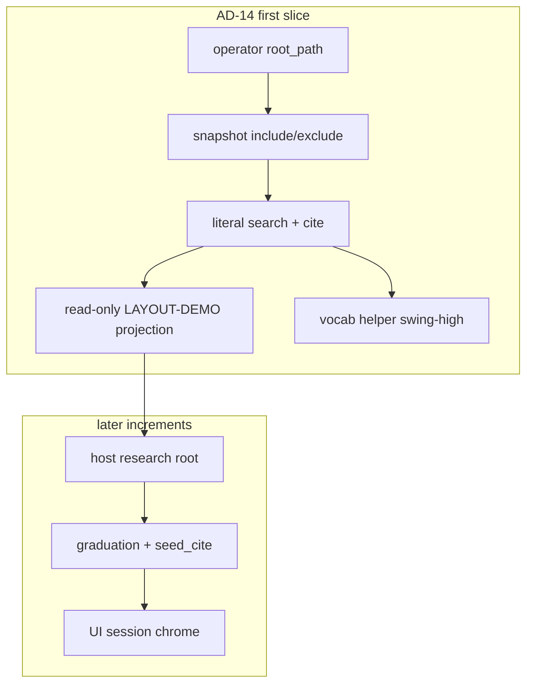

# Architecture Spine — QMX QML research expansion

## Design Paradigm

**Two-stage QML authoring over hexagonal libraries.** QMF is the framework. QML, QMB, and QMA are libraries. QMN is the trading node. Bot creation is QML’s job end to end. That job starts before a bot is governable. The mill is **source-agnostic**: any noisy claim (transcript, idea, chart, discretionary journal, seed package) can enter Stage 0. Video ingest stays paused; the filter does not wait on it.

1. **Stage 0 — research mill** (this sitting’s expansion). Noise becomes a structured **hypothesis**: dictionary cites, role bindings, a meaning graph, evidence, unknowns, exit-completeness labels. Non-executable. Not a registry kind. Not a Library object.
2. **Stage 1 — governed declaration** (existing QL-2/QL-8). A hypothesis **graduates** into the two artifacts (CT-33 + Python, plus CT-34 as needed) with a lineage edge to the originating research artifact.

The Stats tree is a **seed corpus** imported through CT-44. It is not a second QMX language and not a sixth COMP. Product nouns are QMX / QML. `graph.yaml` is meaning, never a runtime.



## Inherited Invariants

Parent ADs bind read-only. Local `AD-1`..`AD-21` do not renumber them. A local rule that would put seed packages on the Artifact-rail kind list, mint `COMP-LIB`, compile a Stage 0 graph into `run_slice`, give QMA an execution tool, or treat Stage 0 as a third governed bot half is a **conflict**, not an override.

| Inherited | From parent | Binds here |
| --- | --- | --- |
| Workbench AD-1, AD-3, AD-14 | architecture-QMX-2026-09-14 | No sixth COMP; Artifact Library = listed `fp1` kinds; seed corpus writes no registry kinds; hypotheses are not Library objects until CT-33 registration; candidate set is a query |
| Workbench AD-2, AD-4, AD-5, AD-7, AD-8, AD-9 | architecture-QMX-2026-09-14 | Three experiment lanes; generation via QML; paper trinity; QMA never `import qmb`; procedures are QMA records not Library kinds |
| QMA AD-19, CT-44, DEC-0318, DEC-0343 | architecture-QMA-2026-08-28 | Read-only KnowledgeSource; no QMX fields in Stats; six `evidence_confidence`; cite-copy; literal search |
| QMA AD-16, AD-18, AD-25, DEC-0341 | architecture-QMA-2026-08-28 | No execution tool; Memory ≠ Knowledge; candidate-only money path |
| QL-1..QL-10, CT-33, CT-34 | architecture-QML-2026-08-21 | Two-artifact bot; closed-and-addable CT-34 roles; `.qml` not revived; QML-local contracts ride AD-5’s second ladder; don’t-box-in |
| B-1..B-15 | architecture-QMB-2026-08-20 | Thin doors; B-15 as-of; CT-32 evidence; governed spawn ≠ L33 graduation |
| L7, L10, L17, L30–L33, L39 | constitution | Toolbox; wrap not transplant; human promote; default-deny; ordinary Python; L33 = registration + lineage |
| DEC-0084 / DEC-0085 / DEC-0086 | ledger graveyard | No central Library/backtest service; no donor engine |
| GAP-0085, GAP-0063, GAP-0073 (hybrid), GAP-0081 | gap-report | Nouns, generator algorithm, hybrid index, UI SDK stay deferred as catalog rows |

**Proposed parent amendments** (not silent overrides):

1. **QL-1 surface count** — three thin things → **four**: add Stage 0 research-candidate types on QML’s own ladder. No-CT-* rule already allows the mechanism; the enumeration does not.
2. **Workbench AD-3 commentary** — product discovery may federate Knowledge hits as a distinct class. Kind roster unchanged. Hypotheses still write no registry kinds.
3. **QMA AD-19 last sentence** — factual refresh: seed corpus is no longer empty. Read-only law stands.

## Invariants & Rules

### AD-1 — Product Library stays two-rail; hypotheses are not a third rail [PROPOSAL]

- **Binds:** UI, agents, glossary, QMB `library.*`, QMA knowledge tools, QML research surface
- **Prevents:** one noun “Library” meaning seed packages, hypotheses, CT-33 bots, and CT-32 results as one kind; adding `strats` to `LIBRARY_KINDS`; federating Stage 0 drafts as Library objects
- **Rule:** Workbench AD-3 Library-**object** set and kind roster are unchanged. Product Library discovery federates two typed hit classes only (AD-9): Knowledge (seed cites) and Artifact (`fp1`). A QML **hypothesis** is not a Library object and not a registry kind until Stage 1 registration mints CT-33/CT-34. `qmb.registryread.library` continues to refuse `strats`. Display aliases never mint a third identity. Federation is a discovery DTO, not a fifth persistence surface.

### AD-2 — Stats is the seed corpus; QMX points, it does not absorb [PROPOSAL]

- **Binds:** persistence, clone story, research-corpus pack, daemon config
- **Prevents:** git subtree/copy-into-QMX; editing the seed inside the QMX repo; treating `Desktop/strats` as authority; branding the product as STRATS
- **Rule:** Canonical seed is the portable tree at the operator-configured `root_path` (today `C:/Users/Mubarak/Desktop/Stats`). Markdown/YAML files are source of truth; SQLite is derived and disposable. QMA snapshots that tree. Copy/subtree into QMX git is forbidden. Submodule is deferred until a remote host cannot receive a path. `Desktop/strats` is debris. Population stays paused until the operator starts it. Target markets remain **forex** and **crypto-spot**; no futures execution in the seed; futures/stock sources may contribute only with explicit transfer caveats — CEX volume, DOM, funding, and futures microstructure must never be treated as spot-FX or spot-crypto fact. Prop-firm is an overlay (`knowledge/prop-firms` + identity tags), not a third library. Stats must not contain QMX adapters, executors, CT-33/34, Book/BMS bindings, run ledgers, genetic machinery, BMS/KSA/MIS, certification, or account/position/agent memory. Product language for the mill is QML (AD-18). Seed-disk ids (`STRAT-NNNNNN`, kebab slugs) may remain on disk; they are not product nouns.

### AD-3 — Seed `source_id` and six confidence keys freeze for life [PROPOSAL]

- **Binds:** CT-44 singleton, research-corpus, citations forever
- **Prevents:** a second adapter on the same seed; renaming dims after cite copies exist; promoting the adapter key into a product brand
- **Rule:** Exactly one KnowledgeSource binds singleton key `source_id` `strats`, kind `plain_file_library`, as the **seed adapter**. That key is technical archaeology, not UI/glossary language. CT-44 Provenance/Citation use `source_ref` for that source. `confidence_dimensions` are exactly: `extraction_confidence`, `rule_explicitness`, `source_quality_completeness`, `ambiguity_unresolved_status`, `empirical_status`, `portability_market_transfer_status`. Integration’s research-corpus plugin already uses this freeze; changing it is a new `source_id`, not an in-place rename. Evidence labels are opaque seed-corpus strings — QMA stores verbatim, never parses. Until a locator carries corpus-authored scores, first-slice cite **must emit** the six keys with value `unscored` (corpus-owned default), never a QMA-computed scalar and never Memory `admission_confidence`. That default is not live adapter behaviour on `integration@8510c03` (`cite` currently requires a caller-supplied map).

### AD-4 — Snapshot include/exclude is adapter config, not a seed schema [PROPOSAL]

- **Binds:** `CorpusSnapshot` identity, `PlainFileLibrarySource`
- **Prevents:** hashing derived sqlite/tooling/hermes into Mission pins; two adapters disagreeing on the tree
- **Rule:** The adapter’s snapshot set is configuration of the **research-corpus plugin**, not fields written into Stats and not hardcoded layout in `qma-core` / `plain_file.py` (QMA AD-19). `qma-core` stays layout-agnostic; `PlainFileLibrarySource` continues to skip hidden path parts only. **Include (plugin config):** `README.md`, `STRATS-BUILD-STATE.md`, `schema/`, `dictionary/`, `strategies/`, `sources/`, `knowledge/`, `lineage/`, `catalog/`, `IDEA.md`. **Exclude (plugin config):** `.hermes/`, `.obsidian/`, `backend/strats.sqlite`, `__pycache__/`, `backend/*.py`. Two adapters that hash different include sets mint different `snapshot_ref`s — there is one production adapter.

### AD-5 — Seed locators are corpus paths; colliding slugs carry `file_path` [PROPOSAL]

- **Binds:** search/retrieve/cite, dictionary collisions, UI deep links
- **Prevents:** `liquidity-sweep` resolving to the wrong family file; inventing `PRIM-000001`
- **Rule:** Seed locator = posix relative path, optional `#heading` fragment. Retrieve strips the fragment and returns file bytes. Bindings and graph nodes for a colliding slug must name `(file_path, id)` as the seed already requires. QMA does not mint a parallel primitive id scheme. `qma-core` stays layout-agnostic; path/heading conventions live in the research-corpus adapter. Hypothesis identity is a different locus (AD-21).

### AD-6 — Four planes stay distinct [ADOPTED]

- **Binds:** QML, QMB, QMN, Knowledge, Workflows sitting
- **Prevents:** treating a seed package as a bot, a hypothesis as CT-32, a graph as a task graph, or a claim as measured edge
- **Rule:** Four planes, not a QL-1 surface-count waiver (Stage 0 types are AD-15). (1) **Research candidate** — Stage 0 hypothesis (dictionary cites, bindings, graph, DNA-shaped holes). Seed files feed this plane via cite; a hypothesis may also start with zero seed package. (2) **Governed bot** — CT-33 + Python logic + CT-34. (3) **Evidence** — QMB ledger + CT-32 (and ExperimentSpec on the coordinated lane). (4) **Deployment** — QMN `paper | live` after human promote. A Stage 0 graph is never an executor, backtest spec, Graph Template, or order adapter. Trigger ≠ order. Boolean/temporal operators (`ALL`/`sequence`/`within`/…) stay on the hypothesis or later Python WHEN, not CT-34 declaration. A dictionary entry must not become a CT-16 producer or a CT-29 close-reason by import. Class `entry_hypothesis` with unresolved F must not be completed by QMX invention. F labels (`source_defined` / `external_policy` / `deliberately_open` / `unresolved`) stay on the hypothesis. Seed lineage (I) ≠ CT-07 ≠ ExperimentSpec `branches-from`.

### AD-7 — Handoff is cite, author a hypothesis, then graduate; never auto-mint [ADOPTED]

- **Binds:** QMA StrategyHandle, QML host, QMB doors, L17, L33
- **Prevents:** QMA assembling CT-33/34 JSON from DNA; seed graph → `run_slice`; equating `spawn_governed` with graduation
- **Rule:** Three legal entries, none a toll booth for the others: (1) QMB ungoverned Python — zero QML; (2) QML `gate_registration` — CT-33 + Python, no Stage 0; (3) Stage 0 save then `graduate_to_governed` — requires a hypothesis `research_ref`. QML UI/agents MUST expose (2) without opening Stage 0. Executable artifacts appear only when a human (or human-approved QML authoring) produces CT-33/34 + logic. QMB then validates on a legal lane. Only a human promotes onto the node. RefinementProposals are **applied**, never promoted. Live StrategyHandle `origin` stays the frozen string `"qma"` (who minted the candidate). Optional seed handoff is a **distinct** non-`fp1` field `seed_cite: { source_ref, snapshot_ref, locator }` citing an existing Knowledge Citation — never a reshape of `origin`. Single writer of `seed_cite`: the QML authoring composition root. QMA copies it at register only if the host supplied it; QMA never invents locators. `seed_cite` **must not** enter CT-33/CT-34/`fp1` preimage. **No CT-07 edge to a Knowledge Citation.** Skipping Stage 0 means no `originating_research_ref` and no mill CT-07; `seed_cite` may still be set. Informal role translation (location≈level, trigger≈trigger, filter≈filter, confirmation≈confirmation; invalidation stays Book/F) is a handoff aid, not a contract mint.

### AD-8 — Reuse existing owners; QML absorbs the mill process [ADOPTED]

- **Binds:** factory preflight, research-corpus, FEAT-0045/0046, COMP-QML
- **Prevents:** a new COMP, a new CT, a second knowledge port, a mill daemon
- **Rule:** Reuse-or-new only (this AD does not waive QL-1’s three-count; Stage 0 module location is AD-15). Owners: COMP-QML (Stage 1 authoring + QL-7/QL-8; Stage 0 types per AD-15), COMP-QMA-CORE (CT-44), COMP-QMA-DAEMON (`KnowledgeService`, `PlainFileLibrarySource`, cite-copy), desk pack `research-corpus` (seed bind + AD-4 include/exclude), COMP-QMB (Artifact-rail queries), COMP-QMF-REGISTRY (kinds), COMP-QMA-WIRE (federated hit DTO / additive CT-40 family only). No federating COMP, no mill daemon, no identity port on the facade. Replace in-memory `StratsCorpus` with `PlainFileLibrarySource(root_path=…, source_id="strats")`. Seed `root_path` homes on operator-principal **plugin/daemon load config** (the research-corpus pack), a filesystem path, not an env var, not a git path, not a venue secret, not a `qmb` setting. v1 persistence owner of hypotheses is the **QML authoring composition root** (the same root that stamps CT-06/CT-07 for bots per QL-1). Config key `research_root` is distinct from seed `root_path` and is **not** a QMA daemon / research-corpus setting. COMP-QMA-DAEMON MUST NOT write the research root and MUST NOT bind a second CT-44 `source_id` in v1.

### AD-9 — Federated discovery concatenates two existing queries [PROPOSAL]

- **Binds:** UI/agent search, CT-40 additive queries, Workbench AD-14
- **Prevents:** a copied-row Library index; QMB opening daemon sqlite; a fourth store; a fifth persistence surface; client-invented hit shapes; `hit_class: "strats"`
- **Rule:** Federated discovery is a concatenate of two existing queries — never a fourth store and never a door **run**. Workbench AD-8 occupancy is unchanged: this path consumes none. Owner of the **federated hit DTO** is COMP-QMA-WIRE (additive CT-40 family). Owner of Knowledge search remains CT-44 / COMP-QMA-DAEMON. Owner of Artifact search remains COMP-QMB (`library.search` / B-15 / ledger merge / Experiment Ledger refs per Workbench AD-3). Frozen hits — exactly one of: `KnowledgeHit` `{ hit_class: "knowledge", source_ref, snapshot_ref, locator }` (durable detail requires a Citation after `cite`; cite-copy `artifact_ref` is not an Artifact-rail hit); `ArtifactHit` `{ hit_class: "artifact", fp1, kind }` where `kind` ∈ Workbench AD-3 roster **or** closed query-hit tags `saved-view` | `analysis.published` (live tokens; not registry kinds). No other `hit_class` — including no `qml_candidate` and no `strats`. Stage 0 hypotheses are found through the QML research surface, not this DTO. Display aliases on KnowledgeHits MUST NOT say “hypothesis” or “research candidate.” Viewing cited seed bytes is a read-only projection and does not mint `research_ref`. Must not persist a unified row cache, read QMA staging, or treat locators as `fp1`. Ranked/semantic search stays GAP-0073 (`unsupported-capability`).

### AD-10 — Optional librarian is a skill on the same ports [PROPOSAL]

- **Binds:** QMA skills, UI compact assistant, main agent workspace
- **Prevents:** a second knowledge runtime; a mandatory research-to-bot wizard
- **Rule:** A contextual librarian is a QMA Skill/Graph Template over `search`/`retrieve`/`cite` plus QML Stage 0 helpers. The main agent workspace is a separate view onto the same contracts. No wizard is required to start from a paper, idea, existing package, or ungoverned Python. Closing a UI tab cancels nothing.

### AD-11 — Updates are new snapshots; QMX does not merge the dictionary [ADOPTED]

- **Binds:** Mission `snapshot_ref`, import reconciliation, duplicates
- **Prevents:** silent live-tree reads; QMX rewriting the 239; collapsing colliding slugs
- **Rule:** Edits to the seed happen in Stats (or a future population agent writing Stats files). QMA learns them by `snapshot()` + recorded re-pin; snapshots of `strats` form a linear supersedes chain. Cite copies remain the bytes of the pinned snapshot (`StaleSnapshot` otherwise). UI/agent browse without a Mission still **pins a session `snapshot_ref`** before retrieve/cite; unpinned live-tree reads are refused. Colliding slugs stay keepers. Duplicate/conflict handling is the seed’s `(file_path, id)` rule plus DNA H, not a QMX merge.

### AD-12 — JSON Render and MCP Apps present; they do not store or execute [PROPOSAL]

- **Binds:** later UI session, GAP-0081
- **Prevents:** treating a catalog spec or `ui://` iframe as a Library record, a hypothesis, or a run
- **Rule:** json-render (catalog-constrained generative UI) and MCP Apps (`ui://` resources, SEP-1865 stable 2026-01-26) may render DTOs in chat or a tool pane. They are not identity, persistence, or authority. Native web UI is first; desktop later. `qma-ui-contract` stays GAP-0081. Additive CT-40 query families for the facade are backend work now; chrome is the UI session.

### AD-13 — Workflows sitting consumes citations, hypotheses, and doors, not DNA graphs [PROPOSAL]

- **Binds:** later Workflows architecture session
- **Prevents:** seed meaning-graph, QMA Graph Template, taskgraph, and canvas layout collapsing
- **Rule:** Workflows may take Knowledge Citations, QML `research_ref`s, and Artifact `fp1`s as inputs and may place QMB door steps per Workbench AD-8/AD-9. A Stage 0 graph is not a workflow definition. This sitting does not choose a workflow runtime or editor.

### AD-14 — First vertical slice is seed bind plus a Stage 0 view [PROPOSAL]

- **Binds:** factory increment 0, acceptance
- **Prevents:** calling the design “UI-ready” or “implemented”; shipping the two-file stub as the seed; minting CT-33 in slice 0
- **Rule:** The first implementable slice: configure `root_path`; snapshot per AD-4; `search`/`retrieve`/`cite` against `STRAT-000001` and one dictionary entry; Mission pin; QML vocabulary helper resolves `swing-high` from **cited bytes the host passed in**; read-only Stage 0 **projection** of LAYOUT-DEMO preserves `entry_hypothesis` and unresolved F (no invented exits, no invented short side). The projection does **not** mint `research_ref` and is not a wizard. LAYOUT-DEMO is not extracted research to complete. `register_library_kind("strats")` still refuses; no CT-33 mint; no population ingest. Class/test existence is not e2e (DEC-0286).

### AD-15 — Stage 0 is QML’s fourth surface, on QML’s own ladder [PROPOSAL]

- **Binds:** COMP-QML distribution, every consumer of Bot-domain artifacts, proposed QL-1 amendment
- **Prevents:** pretending Stage 0 is “just CT-33 helpers”; minting a CT-* for hypotheses; a second shared-contract stratum beside QMF; Stage 0 becoming seat-citable
- **Rule:** Stage 0 types **live in `qml.research`**, a public submodule of the `qml` distribution, on QML’s own format-version ladder. `RESEARCH_FORMAT_VERSION` is an independent integer in that module (not QL-7 protocol / QL-8 conformance versions). They are **not** CT-33 helpers, **not** QMA/`qma-core` types, **not** host-private schemas. Hosts consume the module; they do not fork it. QML still mints no QMF-ladder (`CT-*`) shared contract. Stage 0 never sizes, never emits CT-23 intents, never becomes a Book/node seat, and is never cited by governed evidence (CT-32 / seats cite Bot `fp1` only). Graduation (AD-17) is the only mill bridge into CT-33 + Python; `gate_registration` without a hypothesis remains legal (AD-7). The library stays pure per QMF AD-15 (no threads, no I/O, no process spawning). **QMA hosts** own seed `snapshot` / `search` / `retrieve` / `cite`. **The QML authoring composition root** owns hypothesis serialization and listing. A hypothesis may start from an idea, chart, journal, or seed package — Stage 0 is the mill, not a Stats viewer. **[PROPOSAL] parent QL-1:** QML’s surface is four thin things — (1) CT-33/CT-34 author types, (2) Stage 0 research-candidate types, (3) QL-7 protocol, (4) QL-8 gate. The amendment is a documentation-factory obligation, not an implementation veto. Factory implements `qml.research` against this child AD. It is not legal to preserve the three-count by hiding Stage 0 in QMA or in host-private DNA files.

### AD-16 — Dictionary is vocabulary over files, not registry kinds [PROPOSAL]

- **Binds:** QML research helpers, seed `dictionary/`, CT-16/CT-34 authors
- **Prevents:** 239 CT-06/CT-16/CT-34 rows; auto-mapping a slug to a producer; filling GAP-0085 to fit seed roles
- **Rule:** A **dictionary entry** is a role-neutral file record (12-field markdown in the seed). QML ships parse/validate/lookup helpers over **bytes the host passed in** (cited copies or caller-supplied buffers) — QML performs no filesystem I/O. Collision resolution uses `(file_path, id)`. Meaning (12 fields, eligible roles, class taxonomy, F/H labels) is computed **only** by `qml.research`. The research-corpus adapter returns bytes + locators + AD-4 include/exclude; it MUST NOT emit structured dictionary/DNA fields. QMA cites locators; it does not register slugs as kinds. Binding an entry into a bot still requires a human (or human-approved) choice of CT-16/CT-17 producer or plain Python, then a CT-34 leg role from the closed enum `level | trigger | confirmation | filter`. Eligible roles on the dictionary (invalidation, target, context, …) stay on Stage 0. GAP-0085 stays deferred. Dictionary growth happens in the seed tree and appears via new snapshot; QML does not fork a second vocabulary store in v1. Pillars (location, context, trigger, confirmation) are human lenses, not a closed Stage 0 schema.

### AD-17 — Graduation is `graduate_to_governed`, not a QMB spawn [PROPOSAL]

- **Binds:** QL-8, L33, `qml.conformance.registration.graduate_to_governed`, hosts
- **Prevents:** a third governed bot half; silent DNA→CT-33; calling `spawn_governed` “graduation”
- **Rule:** Graduation mints the two artifacts only after both QL-8 layers pass. `originating_research_ref` is a qmf-core `Fingerprint` (`fp1:sha256:<hex>`) so existing `graduate_to_governed` can consume it. For mill graduation it MUST be the hypothesis `research_ref` (preimage `class` = `qml-research-hypothesis`, AD-21). Parent QL-8 ungoverned-experiment graduation keeps its own preimage class; do not call `qmf.structure.research.graduate_to_governed`. **Knowledge Citation digest / `artifact_ref` / `source_ref` / `seed_cite` is not a legal `originating_research_ref`.** Seed cites travel on AD-7 `seed_cite` only. Host stamps `promoted-from` CT-07 with `to_ref = research_ref`. That edge is **lineage, not governed evidence**: CT-32 and seats cite only the Bot `fp1`. Self-edge remains refused. Informal collapse: open Stage 0 roles → closed CT-34 enum + Python WHEN; unresolved F → empty `permitted_exit_intents` and/or Book family policy, never invented exits. Skipping Stage 0 uses `gate_registration` with no mill CT-07.

### AD-18 — Product nouns are QMX / QML; STRATS is seed-disk only [PROPOSAL]

- **Binds:** glossary, UI copy, agent prompts, this spine
- **Prevents:** a parallel STRATS dialect; COMP-LIB; Knowledge Base; revived `.qml`
- **Rule:** Mill module/surface = **research**. One DNA-shaped package = **hypothesis** (also “research candidate” until graduated). Vocab item = **dictionary entry**. Stats tree = **seed corpus**. Lifecycle copy: seed corpus → cite → hypothesis → graduation → declaration + logic. Banned in product language: STRATS as ontology brand, “second language,” COMP-LIB, Knowledge Base, “primitive” as a brand, DNA/STRAT-ids as UI nouns (they may appear as imported locator text). Homonym: Stage 0 composition is field/type **`graph`** (Boolean / temporal / lifecycle). **Never** export `Confluence` / `confluence` from `qml.research`. **CT-34 Confluence** remains the fingerprinted leg-set registry kind.

### AD-19 — QMA cites; QML owns meaning [PROPOSAL]

- **Binds:** CT-44, COMP-QML research, Workbench AD-4
- **Prevents:** QMA authoring hypotheses; QMA assembling CT-33; QML becoming a KnowledgeSource owner
- **Rule:** QMA’s Knowledge port remains read-only transport: snapshot, search, retrieve, cite-copy. QML owns Stage 0 types, vocabulary helpers, and Stage 1 authoring. QMB owns experiments after something runnable exists. The Trading Node owns paper|live after L17. A later CT-44 `source_id` over a QML-owned research root is a new source, not a rename of `strats`, and stays deferred in v1 even if host files exist (AD-21). QMA does not parse dictionary/DNA meaning (AD-16).

### AD-20 — Independence law and honesty envelope [PROPOSAL]

- **Binds:** Stage 0 types, graduation linters, authors, agents
- **Prevents:** fusing a dictionary entry with a role, a graph with an executor, a hole with a filled bot, a claim with CT-32
- **Rule:** These are distinct objects: **dictionary entry** (what exists, role-neutral) ≠ **binding** (what job it does in this hypothesis) ≠ **graph** (how bound parts interact: Boolean / temporal / lifecycle) ≠ **hypothesis** (candidate spec + evidence + unknowns + research lineage) ≠ **declaration** (CT-33) ≠ **logic** (Python WHEN) ≠ **CT-32** (measured) ≠ **seat** (QMN after promote). Stage 0 must preserve F labels and H unknowns. Graduation refuses to invent exits, producers, or CT-29 close-reasons to “complete” a hypothesis. Class `entry_hypothesis` / `fragment` / `descriptive_pattern` / `composite` / `complete` is Stage 0 taxonomy, not a CT-33 field.

### AD-21 — Hypothesis identity is QML-local; host persists; not `fp1` [PROPOSAL]

- **Binds:** Stage 0 identity, hosts, later research-root bind
- **Prevents:** registry `fp1` on a draft; a fourth COMP store; writing hypotheses back into Stats; two hosts minting different identity bases
- **Rule:** A hypothesis is identified by `research_ref` = qmf-core `fingerprint` of exactly `{ "class": "qml-research-hypothesis", "contract_format_version": RESEARCH_FORMAT_VERSION, "body": <canonical Stage 0 content> }`. The value is **fp1-shaped** (`fp1:sha256:<hex>`) so `graduate_to_governed` can consume it, and **must not** be registered as a qmf-registry kind, must not appear on the Artifact rail, and must not reuse a `class` already used by Bot / experiment / Citation envelopes. Occurrence / writer / created-at / seed `snapshot_ref` are excluded from the preimage. `body` is the canonical JSON `qml.research` returns (sorted keys; locators and meaning; not host markdown). Additive optional fields require a version bump; unknown version is `unavailable dependency`. A hypothesis exists only after an explicit QML authoring save that returns those bytes; viewing cited seed is not a save (AD-14). QML returns fingerprintable content only. The QML authoring composition root is a **blob store** keyed by `research_ref`: it persists only those canonical bytes under `research_root`. It is not daemon sqlite, not QMA AD-22 staging, not a new COMP store, not Stats, and not a second AD-4 include/exclude. Host-private files, if any, are caches of those bytes, never an identity basis. A second KnowledgeSource over this root stays deferred in v1 even though files exist. Restoring across `qml` format versions is an `unavailable dependency` refusal.



## Consistency Conventions

| Concern | Convention |
| --- | --- |
| Naming | Say **research** / **hypothesis** / **dictionary entry** / **seed corpus**. Say **Knowledge rail** / **Artifact rail** for product Library. QMF = framework; QML / QMB / QMA = libraries; QMN = node. Ban STRATS as product language, COMP-LIB, qmx-library package, Knowledge Base, QMA-paper. QML’s “L = Library”, QMB the experimentation library, and product Library remain three nouns. Stage 0 code identifier for composition is `graph`, never `Confluence`. |
| Identity | Seed adapter: `source_id` (technical). CT-44: `source_ref` + `snapshot_ref` + `locator`. Hypothesis: `research_ref` = fp1-shaped fingerprint with `class=qml-research-hypothesis` (not a registry kind). Artifacts: registry `fp1`. Cite-copy digest is `artifact_ref` on the Citation, never an Artifact-rail hit and never `originating_research_ref`. Live handle `origin` = `"qma"`. Seed handoff = optional `seed_cite`. Seed `STRAT-NNNNNN` / `(file_path, id)` / `SRC-NNNNNN` stay corpus ids. |
| Errors | CT-04 variants: `ProvenanceShapeMismatch`, `StaleSnapshot`, `unsupported-capability` (hybrid), existing Library-kind refusals, QL-8 graduation self-edge refusal. |
| State | Seed write-back refused. Hypothesis mutation through QML/host. Artifact mutation through existing QML/QMB/registry doors. UI close ≠ cancel. |
| Docs vs code | `defined-unwired` / “no code exists” on CT-44/CT-33/CT-34 is stale vs `integration@8510c03`. Stamp `source-inspected`. e2e remains unproven. `graduate_to_governed` exists; Stage 0 types do not. |

## Stack

Inherited pins stand. This sitting adds no runtime framework. Presentation candidates are not dependencies of the daemon.

| Name | Version |
| --- | --- |
| CPython | 3.14 (inherited; 3.14.7 current stable as of 2026-08-05) |
| uv workspace + lockfile | inherited (`docs/architecture/stack.md`) |
| QMA daemon store | SQLite single writer (inherited QMA AD-6) |
| Seed derived index | SQLite rebuildable; not a QMX store |
| json-render | not pinned — presentation candidate (json-render.dev) |
| MCP Apps | SEP-1865 stable 2026-01-26 — presentation candidate, not storage |

## Structural Seed

```text
Stats/                                # seed corpus; outside QMX git
  dictionary/ schema/ strategies/ sources/ knowledge/ lineage/ catalog/
qmx-agents/plugins/research-corpus/
  daemon/plugin.py                    # bind PlainFileLibrarySource(root_path); AD-4 include/exclude lives here
qmx-agents/packages/qma-daemon/src/qma/daemon/knowledge/
  plain_file.py                       # layout-agnostic; skip hidden parts only; no Stats include list
  service.py                          # cite-copy unchanged
qmb/src/qmb/registryread/library.py   # strats remains refused kind
qml/src/qml/research/                 # NEW Stage 0 types + vocab helpers (pure); RESEARCH_FORMAT_VERSION
# QML authoring composition root:
#   research_root/                    # blob store keyed by research_ref; not daemon sqlite
qml/src/qml/declaration/              # Stage 1 unchanged
qml/src/qml/conformance/registration.py  # graduate_to_governed already present
qml/src/qml/generation/gaps.py        # GAP-0085 stays refused
qmx-agents/packages/qma-ui-contract/  # stub; GAP-0081
```



## Capability → Architecture Map

| Capability / Area | Lives in | Governed by |
| --- | --- | --- |
| Portable seed corpus | Stats files | AD-2, AD-6 |
| Snapshot / search / retrieve / cite | qma-daemon + CT-44 | QMA AD-19, AD-3, AD-4, AD-5, AD-11, AD-19 |
| Artifact Library kinds / candidate query | QMB registryread | Workbench AD-3, AD-14, B-15 |
| Federated discovery | qma-wire DTO concatenating CT-44 + QMB library.search | AD-1, AD-8, AD-9 |
| Dictionary vocabulary helpers | qml.research | AD-16, AD-20 |
| Hypothesis authoring | qml.research | AD-15, AD-20, AD-21 |
| Graduate to governed bot | qml.conformance + host | AD-7, AD-17, QL-2, QL-8 |
| Experiment from a bot | QMB doors / CT-47 | Workbench AD-2, AD-8 |
| Promote to node | human outside QMA | L17, TN-20, AD-7 |
| Librarian | QMA Skill | AD-10, AD-13 |
| Rich presentation | later UI; json-render / MCP Apps optional | AD-12, GAP-0081 |
| Hybrid index | deferred | GAP-0073 |
| Mechanism nouns | deferred | GAP-0085 |

## Deferred

| Deferred | Why it can wait |
| --- | --- |
| GAP-0073 hybrid / semantic index | Layout revisit trigger is met in the seed; hybrid retrieval is a separate irreversible index choice. v1 literal+locator. |
| GAP-0085 typed mechanism nouns | Stage 0 already carries open roles and F/H holes; minting nouns is a later QML increment, not required to absorb the mill. |
| GAP-0063 generator algorithm | Authoring from a hypothesis is human/QML; no generator required to bind the seed. |
| GAP-0081 `qma-ui-contract` | Wire queries can bind now; chrome is the UI session. |
| GAP-0062 always-on host | Knowledge queries are sync; laptop-off is a Workflows/daemon-host concern. |
| Git submodule / Stats remote | Option A path bind is enough on the workstation. |
| Population ingest (yt-dlp, n8n, vision) | Seed pause-before-populate. The mill is source-agnostic; ingest is not this sitting. |
| Dictionary 12→~25 field expansion | Do not rewrite the 239. |
| Second CT-44 `source_id` over the research root | Host blob store is not a KnowledgeSource in v1, even after files exist (AD-21). |
| Federating hypotheses into product Library search | v1 keeps them on the QML research surface (AD-9). `QmlCandidateHit` stays rejected. |
| Screen composition / departments | UI session. |
| Workflow runtime / canvas | Sibling architecture sitting (AD-13). |
| Exact `root_path` on a remote research node | Same adapter, different config. |
| Specialist fleet / staging-curator / n8n-as-required / tests-as-product / promotion ceremony / software-first / mandatory wizard | Rejected mill history; dead for these epics. |

## Open questions

| Question | Revisit when |
| --- | --- |
| Confirm `source_id=strats` as the seed adapter freeze key (not a product brand) and the six dim spellings | Operator review of this package — default is the integration plugin’s values |
| Confirm snapshot include/exclude (AD-4) | Same review — default is the include/exclude lists above |
| Whether QMA AD-19’s stale “empty corpus” sentence is a docs factual refresh only (recommended) or a parent-spine amendment | Documentation-factory change mode |
| PRD addendum vs GAP-0061 sibling numbering | Documentation-factory; FRs are in `REQUIREMENTS-ADDENDUM.md` as proposals |
