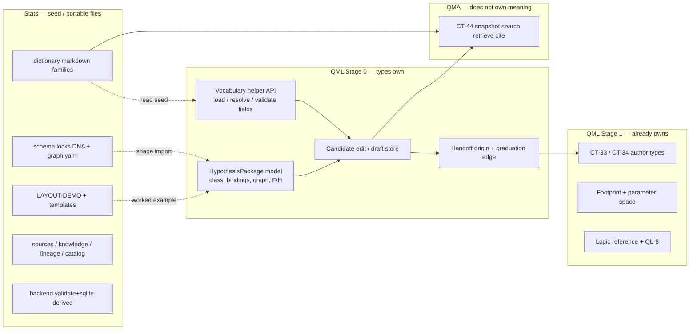
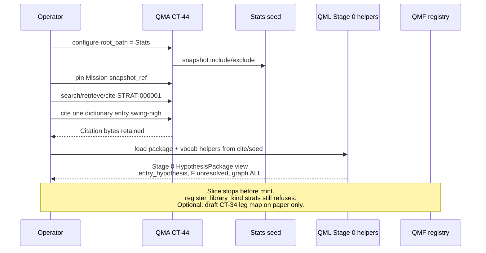

# STRATS mill → QMX libraries (pipeline map)

Date: 2026-09-16  
Sitting: `architecture-QMX-2026-09-16`  
Status: research note (paradigm-shift increment; proposed)  
Companion: [`compare-strats-vocab-vs-qml.md`](compare-strats-vocab-vs-qml.md)  
Out of scope this increment: **videos**, **Hermes agentics**, n8n/Gemini population, hybrid index (GAP-0073), GAP-0085 mechanism nouns.

## Verdict

STRATS was a **staging mill** — noise → tags/structure → source-faithful hypothesis package — built under the assumption QMX authoring was unfinished. It is **not** a second QMX language and not a sixth COMP.

Absorb the mill as a **QML expansion** (two-stage bot-creation library):

| Stage | What | Owner |
|---|---|---|
| **0** | Research candidate: dictionary vocabulary, bindings, logic graph, DNA holes (F/H), evidence map | **QML** types + helpers; seed bytes from Stats |
| **1** | Governed bot: CT-33 + CT-34 + Python + QL-8 conformance | **QML** (existing) → **QMF registry** kinds |

Stats (`C:/Users/Mubarak/Desktop/Stats`) remains the **portable seed / import root**, not the product language. QMA CT-44 stays the **read/search/cite** port against that seed (and, later, against a QML-owned candidate store). QMB remains experiment evidence. Human promote remains L17.

No new COMP. No new CT. No `strats` registry kind. No auto CT-33 from DNA. `graph.yaml` never becomes an executor.

---

## Mill intent (what STRATS was doing)

Independence law recovered from sessions (`library-intent-from-sessions.md`, gold-mine recovery):

```text
Primitive dictionary     → “What reusable thing exists?”   (role-neutral)
Contextual role binding  → “What job does it do here?”     (strategy-specific)
Strategy logic graph     → “How do bound parts interact?”  (Boolean/temporal/stateful)
Hypothesis package       → human- & agent-readable candidate + evidence + unknowns + lineage
```

Seed on disk today (validate OK):

| Asset | Count / note |
|---|---|
| Dictionary primitives | **239** entries (229 unique ids; 9 collisions via `(file_path, id)`) |
| Strategy packages | **1** LAYOUT-DEMO — `STRAT-000001` class `entry_hypothesis`, all F slots `unresolved` |
| Templates | `strategies/_template/`, `sources/items/_template/` |
| Schema locks | `schema/strategy-dna.md`, `schema/graph.yaml.md`, `dictionary/README.md` (12 fields) |

Population (video → transcript → extract) stays **paused**. This pipeline designs the **authoring handoff**, not ingest.

---

## End-to-end pipeline (noise → promote)

```mermaid
flowchart TB
  subgraph seed [1 Seed — Stats tree]
    DICT[dictionary/ 239 primitives]
    DEMO[STRAT-000001 LAYOUT-DEMO]
    TPL[strategies/_template + schema]
  end

  subgraph stage0 [2 Stage 0 — QML expansion]
    VOCAB[QML vocabulary helpers over file seed]
    CAND[Hypothesis package types<br/>DNA A–I shaped / QML-owned]
    EDIT[Author / edit candidates + vocab]
  end

  subgraph cite [3 Agent / human cite]
    CT44A[CT-44 vs Stats seed<br/>source_id=strats]
    CT44B[CT-44 vs QML-owned store<br/>distinct source_id later]
  end

  subgraph stage1 [4 Graduation — Stage 1]
    CT34[CT-34 confluence legs]
    CT33[CT-33 bot + Python logic]
    QL8[QL-8 conformance ticket]
  end

  subgraph empiric [5–6 Evidence + deploy]
    QMB[QMB experiment / CT-32]
    HUM[L17 human promote]
    QMN[QMN paper|live]
  end

  DICT --> VOCAB
  DEMO --> CAND
  TPL --> CAND
  VOCAB --> EDIT
  CAND --> EDIT
  EDIT --> CT44A
  EDIT --> CT44B
  CT44A --> CT34
  CT44B --> CT34
  CT34 --> CT33 --> QL8
  QL8 --> QMB --> HUM --> QMN
```

### Step notes

1. **Existing processed Stats tree as seed** — bind `root_path` to Stats; do not git-subtree into QMX; do not rewrite 239 rows into registry kinds.
2. **QML expansion authors/edits** — Stage 0 candidate packages and dictionary **vocabulary helpers** (parse/validate/navigate the 12-field markdown; resolve collisions by `(file_path, id)`). Product writes for *new* candidates land in a **QML-owned** store (shape TBD in AD-15+), not by mutating Stats as a QMX subsystem.
3. **Agents search/cite via QMA CT-44** — against the seed (`source_id=strats`) **or** against a later QML-owned KnowledgeSource (separate `source_id`). Cite-copy remains the durability gate. Literal search only (GAP-0073 deferred).
4. **Graduation to CT-33/34 + Python** — human-approved QML authoring. Informal role bridge only (`location≈level`, …). No auto-mint. Origin citation = non-`fp1` `{ source_ref, snapshot_ref, locator }` on the candidate/StrategyHandle. QL-8 lineage edge back to the originating research artifact (QL-8 / L33 graduation mechanics).
5. **QMB experiment** — governed or coordinated lane; CT-32 performance evidence. Stage 0 holes (F/H) are not invented into Book exits.
6. **Human promote** — L17; QMN paper|live. RefinementProposals are applied, never promoted.

---

## What stays in Stats vs what QML types own



| Concern | Stays in **Stats** (seed) | **QML** types own | **Not** |
|---|---|---|---|
| Primitive **meaning** prose (12 fields, eligible roles, transfer, uncertainty) | Yes — markdown source of truth for the seed | Vocabulary **helpers** that read/validate/navigate those files; optional append UX later | 239 CT-06/CT-16/CT-34 registry rows; CT-16 producers-by-import |
| Dictionary **identity** | `(file_path, id)` / kebab slug in files | Resolver helpers; collision surfacing | QMA-minted parallel id scheme; merge of colliding slugs |
| Hypothesis **package** (DNA A–I, graph, evidence, unknowns) | LAYOUT-DEMO + `_template` as examples | Stage 0 package model + edit surface (QML-owned store for *product* candidates) | `strats` Library kind; auto CT-33 |
| Boolean/temporal **graph** (`ALL`/`sequence`/`within`/lifecycle) | `graph.yaml` as knowledge bytes | Stage 0 graph *representation*; Stage 1 encodes WHEN in **Python** | Compile graph → `run_slice` / Graph Template / CT-34 operators |
| DNA **F** exit completeness labels | Source-faithful labels on packages | Preserve on Stage 0; refuse invention at graduation | Filling unresolved F to “complete” a bot |
| **Eligible roles** open list (invalidation, target, context, …) | Dictionary field | Stage 0 binding vocabulary | Expanding CT-34 beyond `level\|trigger\|confirmation\|filter` without a contract mint |
| CT-34 **leg roles** + producer bindings | — | Stage 1 only | Auto-map primitive → producer |
| `fp1`, footprint, parameter space, conformance | — | Stage 1 (existing QL-3..QL-8) | Putting `fp1` on knowledge locators |
| Search / cite durability | Files snapshotted | — | QMA write-back into Stats; QMA as author of packages |
| Measured edge | — | — | Collapsing DNA B into CT-32; CT-32 owns empirical runs via **QMB** |
| Live exit / sizing | — | Declares permitted intents only | STRATS F → Book policy by import |

### Dictionary law (explicit)

> **Dictionary = QML vocabulary helpers over the file seed, not 239 registry rows.**

- The 239 primitives remain **files** under Stats (and any future QML-owned vocab appends still as knowledge bytes, not kinds).
- QML may ship parse/validate/lookup helpers (family folders, 12-field schema, collision list) so authors and agents stop reinventing prose.
- QMA CT-44 cites locators such as `dictionary/market-structure-and-location/locations-and-structure.md#swing-high` — it does not register `swing-high` as a kind.
- Binding a primitive into a bot still requires a **human** (or human-approved) choice of CT-16/CT-17 producer or plain Python, then a CT-34 leg role from the closed enum.

See [`compare-strats-vocab-vs-qml.md`](compare-strats-vocab-vs-qml.md) for the full ontology table (confluence name collision, F labels, lineage plane split).

---

## Library ownership summary

| Library / plane | Role in the mill |
|---|---|
| **QMF** | Framework + registry kinds. Unchanged. Never absorbs STRATS as a kind. |
| **QML** | Mill absorption point. Stage 0 research candidates + Stage 1 CT-33/34/Python/QL-8. |
| **QMA** | CT-44 read-only adapt-to-library; cite-copy; Mission snapshot pin. Optional second `source_id` for QML-owned store. No execution of graphs. |
| **QMB** | Experiments after graduation (or ungoverned plain-Python per L33); CT-32 evidence. |
| **QMN** | Paper\|live after human promote only. |
| **Stats** | External seed root. Portable. No QMX adapters inside the tree. |

---

## First vertical slice

Goal: prove **seed → cite → Stage 0 draft → (manual) Stage 1 sketch**, without population, without Hermes, without UI chrome, without auto-mint.



### Acceptance (slice 0′)

| # | Check |
|---|---|
| 1 | `PlainFileLibrarySource(root_path=Stats, source_id="strats")` snapshots per AD-4 include/exclude |
| 2 | Mission-pinned `search` / `retrieve` / `cite` of `STRAT-000001` and one dictionary locator |
| 3 | QML vocabulary helper can resolve `swing-high` fields from cited/seed bytes (no registry row) |
| 4 | Stage 0 package view of LAYOUT-DEMO preserves `entry_hypothesis` + unresolved F (no invented exits) |
| 5 | `register_library_kind("strats")` still refuses; no CT-33/34 mint in this slice |
| 6 | No video ingest; no Hermes crew; stub in-memory corpus replaced or unused |

### Explicitly later (not this slice)

- QML-owned durable candidate store + its CT-44 `source_id`
- Federated Library hit DTO (Knowledge + Artifact)
- Origin field on StrategyHandle + QL-8 graduation edge on a real mint
- QMB governed run of a graduated bot
- UI Library chrome / Reticle

---

## Constraints carried forward

- Workbench AD-1: no sixth COMP / store facade-as-persistence.
- Workbench AD-3: Artifact Library = `fp1` kinds; STRATS writes none.
- QMA AD-19 / CT-44: read-only; six `evidence_confidence` dims; cite-copy.
- QL-2 / QL-8: two-artifact bot; conformance ticket; graduation lineage to research artifact.
- CT-34 roles remain `level | trigger | confirmation | filter`.
- L17 human promote; DEC-0084 dead; GAP-0085 / GAP-0073 deferred.
- Naming: STRATS “confluence” (graph ops) ≠ CT-34 Confluence (registry leg-set).

---

## Open design points (for AD-15+)

1. **QML-owned store shape** — filesystem tree vs daemon artifact store vs both; never a new COMP; if CT-44-backed, mint a **new** `source_id` (not rename `strats`).
2. **Whether Stage 0 types are QML-local** (AD-5 ladder, like runtime protocol) or stay untyped markdown until graduation.
3. **Write policy for dictionary growth** — append in Stats (seed evolves outside QMX) vs QML-owned vocab overlay that cites seed and adds deltas.
4. **Operator freeze** of `source_id=strats` + six confidence dimension keys already on integration research-corpus plugin.

---

## References

- [`compare-strats-vocab-vs-qml.md`](compare-strats-vocab-vs-qml.md) — ontology richness / ownership table  
- [`library-intent-from-sessions.md`](library-intent-from-sessions.md) — mill independence law  
- Sitting spine `ARCHITECTURE-SPINE.md` AD-1..AD-14 (amend, do not renumber; Stage 0 absorption → AD-15+)  
- `inputs/worked-mapping.md` — `swing-high` + `STRAT-000001` handoff cases  
- Stats locks: `dictionary/README.md`, `schema/strategy-dna.md`, `strategies/STRAT-000001-…/identity.md`
