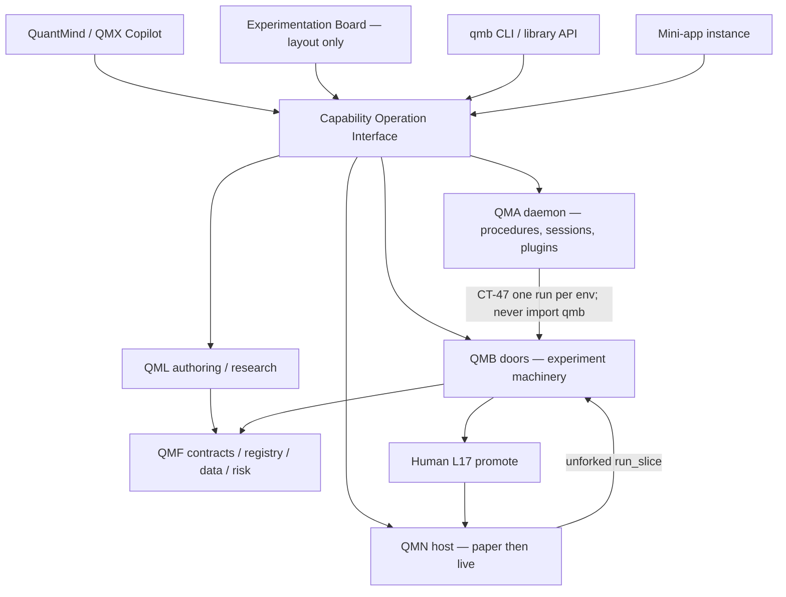
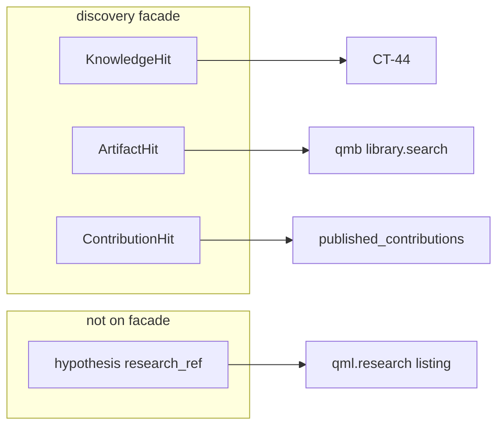
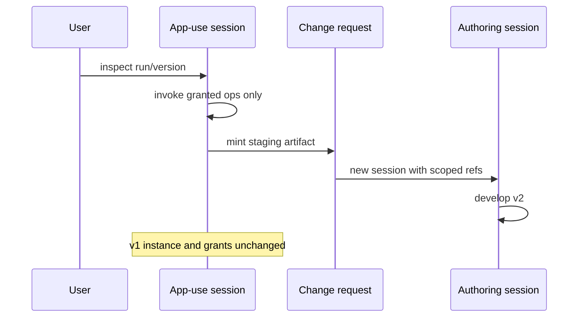

# Architecture Spine — QMX Workflows construction kit

## Design Paradigm

**Capability-oriented composition over hexagonal libraries.** QMF remains the one framework (toolbox, not application). QML, QMB, QMA and QMN remain the application-layer products. This sitting does not mint a sixth COMP, a second orchestrator, a marketplace, or a foreign workflow runtime.

A **capability** is a versioned operation with declared meaning, schemas, effect class and output shape. An **extension** contributes capabilities (and optionally procedures, skills or presentation descriptors). A **workflow** composes operations. A **mini-app** groups capabilities, views and a copilot profile around an installed instance. A **widget** is a view/control inside an interface. These are related, not a compulsory hierarchy.

The Experimentation Board is a **working-surface projection**. It is not a registry kind, not a Mission, and not automatic execution.



## Inherited Invariants

Parents bind read-only. Local `AD-1`..`AD-22` do not renumber them. A local rule that would mint a sixth COMP, compile a Stage 0 graph, let QMA `import qmb`, invert L36 with dummy Book fields, or treat json-render as identity is a **conflict**, not an override.

| Inherited | From parent | Binds here |
| --- | --- | --- |
| L7, L8, L14, L31 | constitution | Toolbox; loops/UI outside QMF unless named admission; no silent sixth application |
| L17, L33, L34, L35, L36, L39 | constitution | Human promote; ordinary Python legal; secrets as refs; UNKNOWN; bot→book→BMS→operator; exit-preservation |
| L30, DEC-0241, DEC-0347 | constitution / QMA | Default-deny; only `qmn.venue` imports qmf-venue; QMA never venue; QMA never `import qmb` |
| Workbench AD-1, AD-2, AD-3, AD-5, AD-7, AD-8, AD-9, AD-10, AD-12, AD-14, AD-16 | architecture-QMX-2026-09-14 | No sixth COMP; three door-derived lanes; Library = listed fp1 kinds; two analysis methods; paper trinity; CT-47 door; procedures in QMA; continuation is daemon+remote+outbox; rung 4 = GAP-0081; candidate set is a query; no Project/Workspace kind |
| QMA AD-1, AD-2, AD-6, AD-14, AD-16, AD-18, AD-19, AD-21, AD-24, DEC-0341 | architecture-QMA-2026-08-28 | Port cardinality; sole writer sqlite; Session is execution container; no execution tool; plugins first-party; Memory ≠ Knowledge |
| QL-1..QL-10, mill AD-6, AD-7, AD-13, AD-15 | architecture-QML + 2026-09-16 | Two-artifact bot; three legal entries; Stage 0 graph is not a workflow; `qml.research` fourth surface |
| B-1..B-15 | architecture-QMB-2026-08-20 | Thin doors; TPE search ≠ generation; B-15 as-of |
| TN-1..TN-25, CONNECT AD-1..AD-5 | NODE + CONNECT | Unforked `run_slice`; closed VenueClientKind; honest FX paper |
| DEC-0084 / 0085 / 0086, DEC-0361 / 0362 / 0366 | graveyard | No central library/backtest service; no marketplace/solver; no HMR |
| GAP-0061 / 0062 / 0063 / 0085, GAP-0058, GAP-0081 chrome | gap-report | Do not fill in prose; contracts-only revisit of GAP-0081 is this sitting’s limit |

**Proposed parent amendments** (not silent overrides):

1. Workbench AD-16 commentary — “Experimentation Board” is an allowed display alias; still mints no record.
2. Workbench AD-9 / QMA topology — Graph Template topology is a **DAG** (cycles and self-loops refuse), not pairwise reverse-edges only.
3. QMA closed store list — persist the already-named `task_graph_state` projection; add journal-projected `product_session` (not a QMA Session fold). Mini-app instances reuse plugin-install records with `instance_id`. Change-request is an addable AD-22 staging kind. No other new sqlite.
4. QMA AD-7 Profile law does not apply to `ProductSessionProfile`; QMA AD-5 `scope_path` does not gain a segment — product-session is a wire/header field beside it.
5. QMA Role display — trading-floor “Product Manager” **label** becomes **Portfolio Manager**; `desk_slug=pm` unchanged (GAP-0083).
6. Mill/wire DEC-0389 two-class freeze — **named amendment**: federated union gains `ContributionHit` as a third discovery class, never fp1, never a registry kind.
7. Live non-Book trading — **not** amended here. See Deferred and operator questions.
8. QMA AD-22 staging kinds — add `change_request`.

## Invariants & Rules

### AD-1 — Construction kit is composition, not a sixth application [ADOPTED]

- **Binds:** all Workflows units, factory preflight
- **Prevents:** COMP-WF / COMP-LIB / extra experiment daemon / extra identity store
- **Rule:** Every new capability names an existing `COMP-*` owner or an explicit connect/extend of one. Minting a new application package or a permanent process besides `qma-daemon`, `qmn`, and QMB process-per-run children is a spine amendment. QMF stays toolbox (L7/L8). “Under QMF” never means one process or one database.

### AD-2 — Four discovery rails; Artifact Library kinds unchanged [ADOPTED]

- **Binds:** UI/agent search, copilot discovery, packaging
- **Prevents:** hypotheses/skills/graph-templates/mini-apps becoming registry kinds; copied-row Library sqlite; `hit_class: strats`
- **Rule:** Product discovery concatenates typed hits. It is never a fourth store and never a door **run**. Frozen hit classes:
  1. `KnowledgeHit` — `{hit_class: knowledge, source_ref, snapshot_ref, locator}`
  2. `ArtifactHit` — `{hit_class: artifact, fp1, kind}` where `kind` ∈ Workbench AD-3 roster or query-hit tags `saved-view` \| `analysis.published`
  3. `ContributionHit` — `{hit_class: contribution, plugin_id, point, qualified_id, package_id, package_version}` from live `published_contributions()`. Identity is that tuple. **Never fp1, never a registry kind, never `ArtifactHit.kind`.** Pins store `(qualified_id, package_version)`, not a descriptor digest. Missing/disabled plugin ⇒ typed unavailability, not a stale fp1.
  4. Hypothesis listing stays on `qml.research` / `research_ref` and is **refused** on the facade
- Occupancy none. Daemon never `import qmb`. QMB never opens daemon sqlite. Ranked/semantic search stays GAP-0073. Extra Artifact query-hit tags beyond `saved-view` \| `analysis.published` are refused unless this spine is amended. Discovery listings must distinguish **published** vs **configured** vs **granted** vs **reachable** vs **healthy** (AD-15); a ContributionHit is not a grant. Pack `contributes` entries are `{point, local_id}` and expand to ContributionHit at enable. `view:*` is a wire DTO only (AD-17) — **not** a plugin contribution point and **not** a ContributionHit until a named GAP-0081 `ui_view` increment. **DTO owner is COMP-QMA-WIRE** (additive CT-40 family, no new CT number). Query owner of live contributions remains COMP-QMA-DAEMON `published_contributions()`. This AD is the named amendment of mill/wire DEC-0389’s two-class freeze.

### AD-3 — Capability Operation Interface is the shared contract [ADOPTED]

- **Binds:** apps, copilot, workflows, CLI, direct callers
- **Prevents:** untyped `execute(anything)`; HTTP on every module; local file paths as portable ids
- **Rule:** Every public operation publishes a versioned descriptor: stable id, owner COMP, input schema, output **shape** (`value` \| `artifact_ref` \| `job_handle` \| `event` \| `stream`), native cardinality (`one` \| `many` in/out), empty_policy, configuration/defaults, declared operation dependencies, resource needs, documentation refs, validation class, units, version compatibility, effect class (`none` \| `read` \| `append-evidence` \| `mutate-config` \| `place-run` \| `external-egress`), permission requests, execution placement, error/refusal shape, progress, and lifecycle verbs (`start` \| `query-state` \| `cancel` \| `await`). Collection **mapping** is **not** on the descriptor — it lives on Graph Template edges (AD-5). Finite `event` ≠ persistent `stream`. Transport (in-process, CLI, wire, future RPC) is an implementation choice of the owner. Durable **file** handoffs cite schema, content fp1, source/run provenance and completeness — never a machine-local path as global id. Content fp1 applies to artifact bytes, **not** to contribution identity (AD-2 tuple). Manifests **request**; the host **grants**. The only parameter authority is `input_schema`.

### AD-4 — Four workflow layers stay distinct [ADOPTED]

- **Binds:** Experimentation Board, QMA procedures, QMB doors, QML mill
- **Prevents:** Board-as-run; Stage 0 graph as executor; Skill as Loop; Graph Template as Task Graph
- **Rule:** (1) **Board layout is client-only.** It MUST NOT be a field of `product_session`, Mission, Task Graph, Graph Template, or any sqlite row. Display alias only (Workbench AD-16). Editing the client layout writes nothing. (2) **Graph Template** — authored, versioned, stateless DAG; plugin-contributed. Compile identity is `(qualified_id, version)` from the plugin manifest at enable. Rebuild-on-load MUST NOT change bytes of an enabled `(id, version)`; a byte change is a new version or a disable. Do not fingerprint templates onto the Artifact rail. (3) **Task Graph** — one Mission’s execution projection; persist `edges: {from, to, mapping}` and walk successors (connect/extend `qma.daemon.taskgraph`; today edges are dropped — that is a hole this AD binds closed). Nodes do not carry successor lists. (4) **Ungoverned library call** — `import qmb` / `import qml` on a controlled-room host; writes no Mission. A Stage 0 `graph` is none of these and is never compiled to a bot, Graph Template, or `run_slice`. A loop is node state, not a Skill; Loop `stopping_condition` is a typed stop (max-iterations / budget / predicate), not an opaque string. A Routine **fires** a compile; a schedule/webhook **trigger** is not the workflow definition. Selected-subgraph execution is `MissionCompiler(template.qualified_id, template.version, node_ids)` where `node_ids` is a non-empty induced DAG of that already-registered template version — not a live board scribble, not a board id. One compile → one Mission → one Task Graph whose `graph_template_ref` is the template `qualified_id`. After a semantic rewire, derived results are invalidated; reuse of prior results is allowed only where the operation’s declared semantics permit it (projection vs rerun stays Workbench AD-5).

### AD-5 — Mapping is explicit; no silent Cartesian [ADOPTED]

- **Binds:** typed dataflow, fan-out/join
- **Prevents:** guessed zip vs broadcast vs keyed join vs Cartesian
- **Rule:** Each port declares kind `reference` \| `data` \| `event` \| `control`. Collection mapping is declared on the edge: `one` \| `zip` \| `broadcast` \| `keyed-join` \| `cartesian`. Cartesian requires an explicit flag. Empty collections skip or refuse per the operation’s declared empty-policy. Conditional skip is a node kind, not dropped edges. Validate endpoints and cycles against DAG law (AD-6). Shared mini-app parameters are typed edges of this kind, not ambient globals.

### AD-6 — Graph Template topology is a DAG [ADOPTED]

- **Binds:** `validate_graph_template_topology`, Mission Compiler
- **Prevents:** `A→B→C→A` and `A→A` registering as templates
- **Rule:** Registration refuses self-loops and any directed cycle (reuse the plugin-loader DFS already used for plugin requires). Pairwise reverse-edge checks are insufficient. Runtime **Loops** remain node state (iteration/budget/stop), not template cycles. This amends the inspected implementation hole; it does not revive graph-as-chat.

### AD-7 — Reuse QMA as the procedure runtime; extend in place [ADOPTED]

- **Binds:** Graph Templates, Routines, CT-47 door steps, occupancy
- **Prevents:** a second scheduler; a QMB task-graph module; ExperimentSpec DAG as control flow
- **Rule:** Author in Graph Templates; instantiate via Mission Compiler (one template → one Mission); schedule via RoutineScheduler; place QMB work via `place_procedure_step` (run vs query occupancy unchanged). ExperimentSpec successors are **lineage**, not control-flow edges — CT-07 MUST NOT be walked as graph successors. Persist `task_graph_state` including `edges: {from, to, mapping}` in daemon sqlite (existing named projection, not a new store). Occupancy is **not** a separate table: it is the existing `environment_lease` + Workbench AD-8 door law, folded into `task_graph_state`. QMB does not write daemon occupancy; the daemon maps `JobHandle` ↔ lease. Implement successor dispatch and daemon-evaluated node kinds (`conditional`, `join`, `approval_gate`, …) in `qma.daemon.taskgraph`. Skills remain knowledge; they never compile to Missions and never grant tools.

### AD-8 — Product sessions are authority overlays, not QMA Session [ADOPTED]

- **Binds:** copilot, mini-apps, wire
- **Prevents:** tab-switch as context change; app-use editing implementation; one global Agent
- **Rule:** `product_session` is a **new journal-projected record kind**, not a QMA `Session` and not a QMA `Profile`. Ids are `psess:`; QMA `Session` ids remain `sess:` and remain the execution container (execution_model + autonomy only). Cardinality is **1 product_session → many QMA Sessions**. `ProductSessionProfile` is a closed enum `{authoring, app-use}`, **immutable at create**, and is **not** `qma.core.ontology.Profile`. `scope_path` does **not** gain a segment — product-session is a wire/header field beside it, never a permission key inside it. Durable fields: `product_session_id`, `profile`, `principal`, `context_revision`, `app_instance_id` (pointer to plugin-install instance row), `granted_ops` (snapshot at create or explicit re-grant), `selected_refs` (typed `{kind, id}` only), optional `private_notes` JSON column (not a new store, not MemoryProvider, not Knowledge). **Not durable:** `qma_session_id`, tab attachment, UI layout. Closed `selected_refs` kinds: artifact fp1, `research_ref`, contribution `(qualified_id, package_version)`, template `(qualified_id, version)`, dataset/run/attempt refs, node-id sets citing a template. **Forbidden in selected_refs:** layout JSON, positions, widgets, json-render trees. Select/grant mutations are named wire commands that bump `context_revision`. Tab change writes nothing. A dashboard/account **filter is not a command target**. Analysis access to an instrument is not execution permission. App-use may inspect, invoke exposed operations, adjust permitted runtime inputs, and mint a **change-request** staging kind (QMA AD-22 addable `change_request`; not fp1, not Library, not `promote`). Path: app-use → change request → authoring → **validation** → v2; v1 stays. It must not edit package source, install code, elevate grants, or retarget accounts. Authoring uses granted files/tools/diagnostics. Specialists remain on-demand worker templates (DEC-0374 stays dead). Installation/upgrade MUST NOT mutate an existing row’s `granted_ops` or retarget `app_instance_id`. Packs ship a versioned **copilot integration profile** as a request, not a grant.

### AD-9 — Copilot discovers granted descriptors; prose is not authorization [ADOPTED]

- **Binds:** QuantMind/QMX Copilot, skills, hooks
- **Prevents:** app-supplied text granting tools; rewriting core instructions per install
- **Rule:** The copilot identity is one familiar product surface over QMA infrastructure. Tool availability = intersection of (published ContributionHits, host grants, `product_session.granted_ops`, health). Skills describe behavior; they do not grant. Skill authoring is separated from verification; the same model must not write the skill and certify it. Installation of a skill is not authoring. Hooks may veto/approve at existing QMA events; a model-authored hook cannot override a failed deterministic check or privilege gate. Cross-session retrieval is explicit, attributed, and cannot retarget actions. Explanations cite saved records/tool evidence, not fabricated recollection. Internal QMX context is structured schema, not screenshots as the default. MemoryProvider stays desk-scoped. Product-session private notes are the AD-8 JSON column (retention/export/deletion with the session row), not MemoryProvider, not Knowledge, not telemetry. RLM remains Analysis execution, not a product IDE.

### AD-10 — Four cross-app composition modes [ADOPTED]

- **Binds:** mini-apps, workflows, copilot
- **Prevents:** every function wrapped as an app; one app driving another’s screen
- **Rule:** Supported modes, none compulsory: (1) consume another app’s **saved artifact** by fp1/content id; (2) **invoke** its exported operation through AD-3; (3) **coordinate** several apps via a Graph Template; (4) **composite app** that cites component contribution ids + artifact refs without merging code. A composite is an **instance graph**, not a new Library kind. Independent apps remain independently useful. Shared instances vs separately configured instances are explicit. Dependency diamonds pin versions per instance. Nested invocation does **not** union permissions or propagate the caller’s tools into the callee. Composite authority is the host-granted intersection, never a union of component requests. Bounded cycles of **invocation** require a recursion budget; template topology remains a DAG (AD-6). Partial failure does not silently substitute a different provider or account. A new venue **protocol** is a new VenueClientKind (refused in V1), not an extra account row.

### AD-11 — Default Book/BMS is not a ceiling; dummy Book is forbidden [ADOPTED]

- **Binds:** QMB compile, QMN seats, alternative systems
- **Prevents:** fake Book/BMS fields; silent L36 inversion; ungoverned CT-32 as admission
- **Rule:** **Dummy (mechanical):** a CT-22/CT-27/CT-33 is dummy if minted solely to satisfy a required field, or if its policy is identity / no-op / unlimited / pass-through. Sentinel fps (`NULL_BOOK`, empty-object Book, `mis_ref: null` as a fake MIS) are dummy. Dummy is `INVALID_INPUT` at compile, register, and seat.
- **Two config types, not optional fields on one.** (1) `ResolvedRunConfig` — unchanged; `book_fp1`/`bms_fp1`/`bot_fp1`/fragments **required**; only path to governed evidence, node-paper, live, L17 seats. (2) `UngovernedWorkConfig` — those keys **absent, not null**; used by ungoverned `qmb.run()`, ordinary Python, data-ML, recipes, QMN sensing-only. Sensing-only **is not a seat**.
- Alternative **policy** inside the default system is a complete CT-22/CT-27 that still implements Book/BMS semantics (L36). Evaluation is `analysis.rerun` of that fingerprint — not a wrapper around absent policy and not a projection. Compare results only where accounting and evaluation meanings align; do not force unrelated policies into the old R vocabulary or relabel filtered trades as a rerun. Live or node-paper trading **without** Book remains **refused** until a constitution amendment of L36 (operator question). MIS/SQS/KSA stay Book-door consumers; optional-intelligence means a system may have no MIS consumer, not a fake MIS record. Do not weaken existing compile/fragment tests to admit type (2) through type (1).

### AD-12 — Data recipes wrap qmf-data; provider ≠ venue [ADOPTED]

- **Binds:** dataset builder, providers, streams
- **Prevents:** QuantDataManager clone; silent source substitution; encoding every fact as bid/ask
- **Rule:** A **recipe** v1 identity is the **output release fp1** (Workbench AD-13 derived-dataset law) plus CT-07 lineage to CT-10/CT-12 inputs (COMP-QMB wrap of COMP-QMF-DATA). `recipe_id` is display. It is not a Library kind. CT-06 recipe kind is deferred until metadata-sharing is required. Recipes declare calendars, alignment, point-in-time/known-at policy, and missing-data policy. A new provider tomorrow must not rewrite yesterday’s pinned release. Provider name ≠ meaning; units, revisions, and raw-vs-adjusted stay explicit. Providers declare coverage, transport (file/API/SDK/CLI/webhook), historical vs poll vs stream, entitlements by **credential reference**, and quality/freshness. Preview ≠ export job ≠ live stream. Replay-to-live is an explicit phase with distinct event-time and receive-time. Streams declare backpressure, gap/late-event policy, and unhealthy-source reporting. Closing one consumer must not cancel another’s subscription. A stream subscription is not a trading permission. Source disagreement is preserved; production sensing feed is never silently swapped. Heterogeneous non-market facts do not widen CT-10 into untyped JSON: knowledge stays CT-44; session/product facts stay QMA; market/source facts stay CT-10. A new venue **protocol** is a new VenueClientKind, not an extra account.

### AD-13 — Identities stay separate [ADOPTED]

- **Binds:** versioning, results, deployments
- **Prevents:** display-name change invalidating computation; layout edit changing run meaning
- **Rule:** Semantic identity is fp1 (artifacts), `research_ref` (hypotheses), `(qualified_id, package_version)` (contributions — **not** fp1), ExperimentSpec fp1 (coordinated continuity), `composition_fp` (node), `instance_id` (installed mini-app). Display names and Board layouts are UX. A saved **runnable** pins code, config, data release, model weights, environment and dependencies. Retry of an uncertain external action ≠ new experiment. Projection ≠ path-dependent rerun (Workbench AD-5). Three pack states stay distinct: **installed** (bytes present) ≠ **enabled/activated** (roster on) ≠ **session-granted** (AD-8 `granted_ops`). Published package ≠ activation on a trading account.

### AD-14 — Sequential handover; software rollback cannot undo fills [ADOPTED]

- **Binds:** QMN, deployments, two model versions
- **Prevents:** default hot-swap of live positions; HMR (DEC-0366 stays dead)
- **Rule:** Default replacement: develop → evaluate → non-real-money validate → explicit activation after stopped/flat-or-drained handover. Outstanding positions, UNKNOWN commands, shared-account concurrency are **separate** refusal/drain cases. Two MIS/model versions may shadow or bind distinct consumers; one writer per role. Owner means software/control scope, not user money. GAP-0058 single-machine placement stays its own increment.

### AD-15 — Compute placement is preflight, not a toggle sticker [ADOPTED]

- **Binds:** jobs, GPU, remote workers
- **Prevents:** laptop coordinator promising durability because a remote worker exists; unpaid subscription implying API embed
- **Rule:** States are distinct: available / configured / authorized / reachable / healthy. Training ≠ inference ≠ trading deployment. Expensive experiments must not starve protective trading actions. No cloud/Colab/provider is assumed; bind only through existing QMA ExecutionEnvironment / ComputeProvider ports. Cancellation, unknown outcome and checkpoint/resume are job-handle law. Browser/computer-use remain provisionable rungs (GAP-0070/0078) fail-closed until registered.

### AD-16 — Persistence owners stay split; new product records are not qmf-core [ADOPTED]

- **Binds:** stores, recovery
- **Prevents:** all new records in qmf-core; merging QMB JSONL into daemon sqlite
- **Rule:** Evidence: qmf-data rooms + CT-13 journals + registry sqlite + QMB JSONL ledger. Coordinated experiment identity: QMA Experiment sqlite. Hypotheses: QML `research_root` blobs. **v1 daemon additions (complete list):** (1) `product_session` journal projection (AD-8); (2) persist existing `task_graph_state` including edges (AD-7); (3) mini-app instance rows in the **existing** plugin-install projection, keyed by `instance_id` ≠ `plugin_id`. No other new sqlite. Change-request = staging kind `change_request` (AD-8). Recipe v1 identity = output release fp1 (Workbench AD-13 derived-dataset law) plus CT-07 lineage; `recipe_id` is display; CT-06 recipe kind deferred. Graph Templates rebuild from plugins but enabled `(qualified_id, version)` bytes are immutable. MemoryProvider remains optional per desk (GAP-0072). Logs are not evidence. Backup/restore stay application-owned using QMF primitives. Orphans, corruption, disk exhaustion and cross-store reconstruction are owner-specific: never invent a second evidence database to paper over them.

### AD-17 — UI host contracts now; chrome is GAP-0081 [ADOPTED]

- **Binds:** later desktop/web host
- **Prevents:** every pane as MCP App; json-render as runtime; tab-close cancelling jobs
- **Rule:** The host is a **client** of qma-wire, QMB API/CLI, QMN three doors. Contribution descriptors (navigation, commands, rich views **including editors**, parameter forms, context providers, events, reconnect) are wire-owned DTOs — **not** a v1 `ui_view` plugin point until a named GAP-0081 increment. The catalogue is not cards-only. JSON Render and MCP Apps are **presentation adapters**. They are not identity, not persistence, not a runtime, **and not authority**. The only parameter authority is AD-3 `input_schema`. The only invoke authority is AD-9 intersection. A json-render catalog entry MUST name an existing AD-3 `op_id` and MUST NOT add/remove fields. Absence of a catalog entry is native/CLI using the same schema. MCP App HTML MUST NOT grant tools; the host intercepts every tool call and refuses if outside `granted_ops`. Pack `view:*` is a wire DTO, not a plugin point, not a json-render runtime id, not an fp1. Native QMX panes remain first. UI mount/dispose must not start/kill durable backend work. Headless packs appear as reusable AD-3 steps without navigation. QMB remains the only operator CLI; QMA and QMN ship none. Do not pin `@json-render/*` in this sitting.

### AD-18 — Packages export without private lineage or secrets [ADOPTED]

- **Binds:** install/export/import
- **Prevents:** marketplace (DEC-0361 dead); secrets in packs (L34); author chats as required payload
- **Rule:** A pack is versioned: manifest, contribution list, requested capabilities, compatibility range, migrations. Install / configure / enable / disable / validate / pin / rollback / dependency-removal / export / import are host operations. First-party trust in v1; custom packs are explicit operator enable. Missing dependency is a hard error at enable, not warning-and-continue (do not copy Hermes advisory-dep behaviour). Partial install rolls back. Side-by-side versions allowed; running work stays pinned.

### AD-19 — Mutation testing is a test-strength principle [ADOPTED]

- **Binds:** later QA, not this sitting’s runtime
- **Prevents:** mutmut as a product dependency; `mutmut apply` on shared worktrees; mutation score as architecture proof
- **Rule:** Behaviour oracles (BDD/journeys) come first. Then contract/integration, state-machine, fault-injection, and **optional** mutation testing of existing Python tests. mutmut (current docs 2026-09-18) requires `os.fork` — Windows execution is WSL only. Run only on disposable copies. Classify surviving/equivalent/invalid/timeout. Caliper-style skill evaluation is a later QMA adapter question, not a CLI assumption.

### AD-20 — Defaults and templates ship with a custom path [ADOPTED]

- **Binds:** first usable slice
- **Prevents:** empty canvas; everything-must-be-a-node
- **Rule:** Ship enough defaults (data preview, governed backtest door, library search, authoring vs app-use shells) that real work is possible. Custom granularity is operator-chosen: wrap notebooks/scripts as operations, or expose selected stages. Graph editing is not the only programming route (L9).

### AD-21 — Headless parity of operations [ADOPTED]

- **Binds:** CLI, library, node, copilot
- **Prevents:** UI-only semantics; a privileged general terminal
- **Rule:** Deep behaviour of an AD-3 operation is identical across supported doors. A useful log/progress panel is not a general shell. Reconcile new CLI-backed operations with current no-operator-CLI laws for QMA/QMN (QMB CLI remains the product CLI).

### AD-22 — Portfolio Manager is a label, not an identity rewrite [ADOPTED]

- **Binds:** QMA Role prose, skills, glossary
- **Prevents:** silent `desk_slug` / `ActorId` / plugin-prefix rename; F07 closure
- **Rule:** Trading-floor Role display becomes **Portfolio Manager**. Keep `desk_slug=pm` and `pm-coordination` until a GAP-0083 migration sitting. Preserve BMAD Product Manager. Combining two bots’ equity streams stays deferred (F07 / Workbench AD-5).

## Consistency Conventions

| Concern | Convention |
| --- | --- |
| Naming | Capability / extension / workflow / mini-app / widget stay distinct. Say research-paper / node-paper; never bare paper. QMA `plugin` stays QMA-scoped. Stage 0 field is `graph`, never Confluence. Experimentation Board is the exploratory surface name. |
| Identity | Artifacts `fp1`; hypotheses `research_ref`; contributions `(qualified_id, package_version)` never fp1; product sessions `psess:` ≠ QMA `sess:`. Display names are UX. |
| QMA store class | `product_session` is a **journal-derived projection** (QMA AD-6 class), not an independent store and not the Session fold. `task_graph_state` remains the existing named projection, now durable. Backup/restore follow AD-27 for those projections. |
| Errors | Typed refusals (CT-04) at every public boundary. Doors render, never swallow. |
| Occupancy | QMB **run** commands occupy one slot per ExecutionEnvironment; queries do not. Federated search occupancy none. |
| Extensibility | Add adapters, descriptors, library functions, or QMA pack contributions — never a new tunnel or untyped dispatch. |
| Docs vs code | Class/test existence is not e2e (DEC-0286). ADR-0023 remains provisional. |

## Stack

Inherited pins stand. This sitting adds **no** required runtime. Presentation and mutation-testing tools are optional later.

| Name | Version |
| --- | --- |
| CPython | 3.14 (observed 3.14.6 at 270e992; docs 3.14.7 current at last stack verify — not upgraded here) |
| uv workspace + lockfile | inherited (`docs/architecture/stack.md`) |
| QMF stores | Parquet, DuckDB, SQLite, JSONL behind QMF contracts |
| QMA daemon store | SQLite single writer (inherited); product sessions + task_graph_state added per AD-16/AD-7 |
| Optuna | `optuna==4.9.0` in qmb — TPE search only |
| json-render | not pinned — presentation candidate; upstream v0.20.0 as of 2026-08-18 |
| MCP Apps | SEP-1865 stable 2026-01-26 — presentation candidate, not storage |
| mutmut | not a dependency; optional WSL/POSIX later |
| Hermes / n8n / OpenBB / LEAN | mental models only; not imported runtimes |

## Structural Seed

```text
qmx-agents/packages/qma-core/     # operation descriptor types; product-session profile nouns
qmx-agents/packages/qma-wire/     # ContributionHit; session commands/queries; UI contribution DTOs
qmx-agents/packages/qma-daemon/   # Graph Template DAG; Task Graph edges+sqlite; product sessions
qmx-agents/plugins/*/             # first-party packs; published_contributions
qmb/src/qmb/                      # doors + library.search + data wrap; no task graph
qml/src/qml/research/             # Stage 0 (exists @ 270e992)
qml/src/qml/host/research_store.py
qmn/src/qmn/                      # host/supervision; Book-shaped operable path; sensing-only without Book
packages/qmf-data/                # rooms, CT-10/12; recipes wrap here
packages/qmf-registry/            # kinds; Library projection
```





## Capability → Architecture Map

| Capability / Area | Lives in | Governed by |
| --- | --- | --- |
| Artifact Library | QMB B-15 + registry as-of | AD-2, Workbench AD-3 |
| Capability discovery | QMA published_contributions + wire DTO | AD-2, AD-3, AD-9 |
| Workflows runtime | QMA taskgraph + Routines + CT-47 | AD-4, AD-6, AD-7 |
| Experimentation Board | UX projection | AD-1, AD-4, AD-13 |
| Copilot profiles | qma-wire + daemon sqlite | AD-8, AD-9 |
| Mini-apps / composite apps | packs + AD-3 exports | AD-10, AD-18 |
| Data recipes / providers | QMB wrap qmf-data | AD-12 |
| Default Book/BMS system | QMB compile + QMN seats | AD-11 |
| Non-Book research / sensing | ungoverned run; QMN sensing-only | AD-11 |
| UI host contracts | qma-wire DTOs | AD-17, GAP-0081 chrome |
| Sequential deploy | QMN + human L17 | AD-14 |
| Test strength | later QA | AD-19 |

## Deferred

| Item | Why it can wait |
| --- | --- |
| Final visual layout / branding | GAP-0081 chrome; INT-29 |
| Live non-Book trading (L36 amendment) | Operator acceptance; refuse until then |
| F07 synthetic portfolio | Workbench AD-5; not a projection |
| GAP-0058 single-machine node | Own increment; VPS proceeds |
| GAP-0062 always-on host machine | Property decided (daemon+remote+outbox); machine unruled |
| GAP-0063 generator algorithm / GAP-0085 nouns | Do not fill |
| MemoryProvider production backend | GAP-0072 |
| Browser/desktop env provisioning | GAP-0070 / GAP-0078 fail-closed |
| Marketplace / capability solver | DEC-0361 / 0362 dead |
| Hot-apply settings / HMR | GAP-0052 / DEC-0366 |
| mutmut in CI | Optional later; WSL required on Windows |
| json-render / MCP Apps as pinned deps | Presentation candidates until UI sitting chooses a host stack |
| `desk_slug=pm` rename | GAP-0083 identity migration |
| Hypothesis listing API | Mill blob exists; browse listing is a small connect |
| QMA wire listener dispatch | Connect existing vocabulary; not a new runtime |
