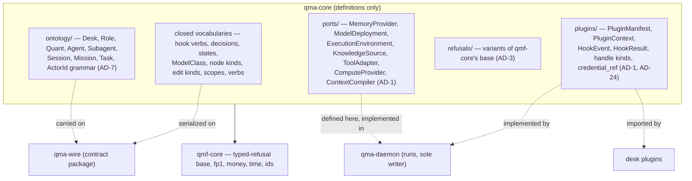

# qma-core

`COMP-QMA-CORE` is the definitions-only package of the QMX agentic system (QMA) — the SDK layer that declares every type, port, contribution surface, closed vocabulary and refusal variant the daemon runs and the wire carries, and runs and writes nothing itself (DEC-0300) (DEC-0335). It is a contract hub in the same house style as QMF, so QMF and QMA read as one system: `qma-core` depends only on `qmf-core`, `qma-daemon` is the only process that runs anything and the sole writer, and `qma-wire` is the only cross-boundary contract package (DEC-0335) (DEC-0347). The Python namespace is `qma.core`; there is no blanket `qmx.` prefix anywhere, and QMX stays the platform name (DEC-0337). The package is organized `ontology/`, `ports/`, `plugins/` and `refusals/`: the ontology chain and address grammar (DEC-0306), the seven runtime ports (DEC-0300), the plugin contribution surface (DEC-0300), and the variants of `qmf-core`'s typed-refusal base (DEC-0302).

`COMP-QMA-CORE` is an application-layer definitions package beside `qmb` and `qml`, adopted from the QMA architecture spine (AD-1..AD-29, FINAL 2026-08-29) whose validation closed dry on 2026-08-29 (DEC-0329). The design is ratified as rider material under the sitting's "I draft, operator ratifies" mode; ratification fixes the architecture only, and implementation authorization arrives solely through the factory pipeline — no runtime, credential, order, promotion or destructive act is authorized by this document (DEC-0329). Every runtime concern enters through a port `qma-core` defines and the daemon implements: a plugin imports its contribution types from `qma-core` and never from `qma-daemon` (DEC-0300) (DEC-0335).

## Authority boundary

May: define the ontology chain Desk → Role → Quant → Agent → Subagent plus Session, Worker, Mission, Task and Task Graph, and the `ActorId` address grammar `quant:<desk_slug>/<quant_slug>` (DEC-0306); define the seven runtime ports — MemoryProvider, ModelDeployment, ExecutionEnvironment, KnowledgeSource, ToolAdapter, ComputeProvider, ContextCompiler — each declaring a cardinality and, for a singleton, an explicit scope key (DEC-0300) (DEC-0335); define the plugin contribution surface — `PluginManifest`, the `PluginContext` protocol carrying the cardinality-typed registration methods, `HookEvent`, `HookResult`, the closed handle-kind vocabulary and the `credential_ref` string type — in a `plugins/` package beside `ports/` (DEC-0300) (DEC-0323); add nouns and refusal variants of `qmf-core`'s typed-refusal base (DEC-0302); define the one tree-digest construction as `fp1` over a canonical manifest of per-file `fp1` values, using the single imported `fp1` (DEC-0302); enumerate, default-deny, the permitted read-and-calculate surfaces of the `qma-daemon → qmf-registry` and `qma-daemon → qmf-risk` edges (DEC-0301) (DEC-0347); declare the six-rung capability ladder and the act-level money-path deny-list constants beside it (DEC-0315); and own every closed-and-addable vocabulary the system uses, each extended only in the AD that owns it — hook events, `HookResult` decisions, handle kinds, Task and Mission states, `JobHandle` states, `MessageKind`, `DeliveryState`, `ModelClass`, routing policies, principal classes, memory validation states, node kinds, ExecutionEnvironment kinds and `network` values, RefinementProposal edit kinds, variable scopes and the three closed verbs admit/apply/promote (DEC-0300) (DEC-0309).

May never: run or write anything — `qma-core` is definitions only; the daemon is the only process that runs anything and the sole writer, and a plugin imports contribution types from `qma-core` and never from `qma-daemon` (DEC-0335) (DEC-0300). Define a second base for anything `qmf-core` already defines — refusals are variants of `qmf-core`'s typed-refusal base, ids and `correlation_id` are `qmf-core` types, `fp1` is imported and never re-derived, money and time follow the parent's exact types, and no second error, identity or content-addressing scheme is minted (DEC-0302). Assume a blanket `qmx.` prefix as a subsystem namespace — the SDK, daemon and wire share `qma.*` and QMX stays the platform name (DEC-0337). List a `qmf-registry` or `qmf-risk` surface outside the enumerated default-deny set — a surface not enumerated in `qma-core` is not callable and adding one is a spine amendment; `qma-core` never constructs, writes, amends or deletes a binding, Book, BMS, seat, control-action, exit, protection, priority-rank or promotion record, and calls no zone-transition surface (DEC-0301) (DEC-0347). Import `qmf-venue`, or let any QMA package, worker or plugin import it (DEC-0301) (DEC-0347). Define a handle kind that resolves to a live or writable money-path record — an open order, open position, binding, Book, seat, BMS record, control action, kill switch or venue session may not be minted as a handle at all (DEC-0313). Use the verb `promote` for memory or refinement — a memory candidate is admitted, a RefinementProposal is applied, and only a registered artifact is promoted into the live zone by a human outside QMA (DEC-0345). Name an agentic actor or artifact Bot, Seat, Book, BMS or kill switch — those are platform terms, and the prohibition on acting on them lives in the daemon's deny-list and reachability barrier (DEC-0306) (DEC-0327).

## Interfaces

| Interface | Direction | Contract | Peer |
|---|---|---|---|
| `HookEvent` (23 verbs + two phase-less controls) and `HookResult` (six decisions, total precedence, tagged-union fields) | out (defined) | [CT-41](../contracts/ct-41-qma-hook-event-result.yaml) | COMP-QMA-DAEMON implements; plugins consume |
| `PluginManifest`, `PluginContext`, plugin roster entry, load-refusal law | out (defined) | [CT-42](../contracts/ct-42-qma-plugin-manifest-context.yaml) | COMP-QMA-DAEMON implements; plugins consume |
| `MemoryProvider` port — `recall`, `propose`, `admit`, MemoryCandidate, `validation_state`, `admission_confidence`, `NoMemoryProvider` | out (defined) | [CT-43](../contracts/ct-43-qma-memory-provider.yaml) | COMP-QMA-DAEMON implements; provider adapters consume |
| `KnowledgeSource` port — `CorpusSnapshot`, `Citation`, `Provenance`, `evidence_confidence`, literal/locator search | out (defined) | [CT-44](../contracts/ct-44-qma-knowledge-source.yaml) | COMP-QMA-DAEMON implements; source adapters consume |
| `ModelDeployment` / `CredentialBroker` — `ModelClassRequest`, `Deployment`, `ModelCapabilities`, routing policies, ReviewPolicy, `credential_ref` | out (defined) | [CT-45](../contracts/ct-45-qma-model-deployment-broker.yaml) | COMP-QMA-DAEMON implements; deployment adapters consume |
| `ExecutionEnvironment` / `JobHandle` — kinds, `network` values, `max_in_flight`, `ComputeRequirement`, `JobHandle` states | out (defined) | [CT-46](../contracts/ct-46-qma-execution-environment-job.yaml) | COMP-QMA-DAEMON implements; environment adapters consume |
| `ExperimentSpec`, lineage DAG, `BacktestHandle` / `StrategyHandle`, the Experiment Ledger link, the qmb door | out (defined) | [CT-47](../contracts/ct-47-qma-experiment-spec.yaml) | COMP-QMA-DAEMON implements; `analysis-backtest` plugin consumes |
| Mailbox `Envelope`, `MessageKind`, `DeliveryState`, `WakePolicy`, `dead_letter`, operator approval queue | out (defined) | [CT-48](../contracts/ct-48-qma-mailbox-envelope.yaml) | COMP-QMA-DAEMON implements |
| `Routine` record — Quant-owned scheduled trigger, caps, continuation budget, escalation target | out (defined) | [CT-49](../contracts/ct-49-qma-routine.yaml) | COMP-QMA-DAEMON implements |
| `RefinementProposal` — edit kinds (closed), staging store, validators, `apply`, `role.overlay` vs `role.base` | out (defined) | [CT-50](../contracts/ct-50-qma-refinement-proposal.yaml) | COMP-QMA-DAEMON implements |
| Task Ledger entry schema — `authored_by`, `dispatch_lease`, entry kinds incl. `reassigned` / `unknown_tail`, `TaskCompleted` append | out (defined) | [CT-51](../contracts/ct-51-qma-task-ledger-entry.yaml) | COMP-QMA-DAEMON implements |
| Typed refusals — `qma-core` refusal variants extend this base | in | [CT-04](../contracts/ct-04-typed-refusal.yaml) | COMP-QMF-CORE |
| Version, fingerprint (`fp1`), and format-version values — imported, never re-derived | in | [CT-05](../contracts/ct-05-version-fingerprint.yaml) | COMP-QMF-CORE |

## Behavior

### Definitions only, one base, one content-addressing (AD-3)

`qma-core` is definitions only and depends only on `qmf-core`; the daemon runs and writes, `qma-core` neither (DEC-0335). QMA refusal types are variants of `qmf-core`'s typed-refusal base (CT-04); ids and `correlation_id` are `qmf-core` types; `fp1` is imported and never re-derived; money and time follow the parent's exact types (DEC-0302). `qma-core` may add nouns and refusal variants but may not define a second base for anything `qmf-core` already defines, and no unit re-mints one (DEC-0302). Content addressing has exactly one construction: a content-addressed id is `fp1` over the value's canonical JSON, and a tree digest — the AD-19 corpus snapshots, the `ExperimentSpec`, the AD-14 candidates and the AD-8 artifact registry — is `fp1` over a canonical manifest of per-file `fp1` values, verifiable by the single imported implementation; a second Merkle or hash construction is never defined (DEC-0302).

### The ontology chain and the ActorId address grammar (AD-7)

The ontology chain is Desk → Role → Quant → Agent → Subagent (DEC-0306). Desk is the organizational and workspace unit; Profile is presentation only — a client-side grouping of `desk_slug`s with a display name held in client configuration, never daemon state, never a `scope_path` segment, and never an index, filter, permission or routing key (DEC-0306). Role is a declarative, stateless behavioral contract close to a system prompt. Quant is the persistent named organizational actor instantiated from a Role, carrying name, memory scope, missions, routines, preferences, a `WakePolicy` and a mailbox, plus a Quant Ledger opened only while it carries its desk's lead flag and retained if the flag moves; a Quant that has never held the lead flag has no Quant Ledger (DEC-0306). Agent is a running reasoning or execution instance; a Subagent is an Agent spawned by an Agent with capabilities no wider than its parent and is a leaf that spawns none, because the daemon's capability rule blocks it from delegation tools (DEC-0306). Session is the run container; Worker is an addressable execution slot and deliberately not an ontology object (DEC-0306). The work vocabulary is Goal (informal intent) → Mission (an executable organizational contract owned by one Quant, the desk derived from the Quant record) → Task (DEC-0306).

The five `desk_slug` values are exactly `research`, `trading`, `dev`, `analysis` and `pm`, identical to the plugin prefix tokens `research-*`, `trading-*`, `dev-*`, `analysis-*` and `pm-*`, minted once at bootstrap and never reused (DEC-0306). The five Roles are Researcher, Trader, Developer, Analyst and Product Manager; the five Desks are Research, Trading, Development, Analysis and PM; a Role name never names a Desk, and "quant" is never used as an adjective (DEC-0306). The `ActorId` grammar is `quant:<desk_slug>/<quant_slug>`, each slug lower-case and 2 to 32 characters, minted only by the `desk.create` and `quant.create` wire commands from an `operator` principal; the daemon refuses with the typed refusal `SlugUnavailable` any `quant_slug` that case-folds onto a current or retired slug, a Role name or a reserved desk prefix token, and any `desk_slug` beyond the five that case-folds onto a current or retired slug or a Role name (DEC-0306). An `ActorId` is stable, never a Role name, never reused, and opaque to every consumer: desk membership is a field on the Quant record resolved through the definition store, never parsed from the slug substring, and a retired desk or Quant keeps a tombstone reserving its slug forever (DEC-0306). Role:Quant and Desk:Quant are both one-to-many; exactly one Quant per Desk carries the lead flag, and its mailbox is the address for desk-scoped inbound (DEC-0306). One lead flag per desk and the lead's mailbox as the catch-all for an undeliverable `Envelope` were inferred, never ruled, and are deferred: until the operator rules both, a second lead flag on a desk is a hard startup error and an undeliverable `Envelope` resolves to `dead_letter` rather than to the lead (DEC-0349) (GAP-0071). A desk consolidation is a Profile-level display collapse only and never renames or retires a `desk_slug`, `ActorId`, plugin prefix, memory scope or ledger index key (DEC-0306) (GAP-0083).

### The seven ports and their cardinality (AD-1)

Every runtime concern enters through a port `qma-core` defines: MemoryProvider, ModelDeployment, ExecutionEnvironment, KnowledgeSource, ToolAdapter, ComputeProvider and ContextCompiler (DEC-0300). Every contribution point declares a cardinality; every singleton additionally declares an explicit scope key, and every multi point is keyed by its fully-qualified `<plugin_id>:<local_id>` id (DEC-0300). The singleton contribution points and their scope keys are: MemoryProvider per `desk`; KnowledgeSource per `source_id`; ExecutionEnvironment per `kind`; ComputeProvider per `kind`; ContextCompiler per daemon (DEC-0300). The eight multi contribution points are `tool`, `tool_adapter`, `hook`, `skill`, `graph_template`, `model_deployment`, `toolset` and `worker_template` (DEC-0300). There is no `ui_view` contribution point in v1, and a contribution point with no `qma-wire` schema may not be registered — the retired candidate points `command`, `ui_view` and `mission_template` are gone (DEC-0300).

The ContextCompiler singleton is a default binding, not a registration: the daemon's implementation occupies the key only while no plugin binds it; exactly one plugin may bind it, replacing the default at load time as a recorded journal event and never as a runtime override; two plugins binding it is a hard startup error (DEC-0300). Every other singleton ships no default. Two plugins binding one singleton key is a hard startup error naming both plugin ids, the port and the key — never last-write-wins and never a runtime override — and a duplicate `<plugin_id>:<local_id>` on a multi point is the same hard startup error (DEC-0300). An unbound singleton key is a startup error only when a loaded roster entry, plugin manifest or Role grant requires it, naming the port, the key and the requiring unit; an unrequired key stays unbound and its port unavailable — with no MemoryProvider bound, `recall` returns the typed refusal `NoMemoryProvider` and candidates stage under the admission gate, and an ExecutionEnvironment or ComputeProvider `kind` that no declared environment names is unbound, not an error (DEC-0300) (DEC-0317).

### The plugin contribution surface (AD-1)

`qma-core` defines the plugin contribution surface in a `plugins/` package beside `ports/`: `PluginManifest`, the `PluginContext` protocol carrying the cardinality-typed registration methods, `HookEvent`, `HookResult`, the closed handle-kind vocabulary and the `credential_ref` string type (DEC-0300) (DEC-0323). The daemon implements the context and owns the loader; `qma-core` defines it — the same definitions-versus-runtime split used everywhere — so a plugin imports its contribution types from `qma-core` and never from `qma-daemon`, and no new AD-2 dependency edge is needed (DEC-0300) (DEC-0335). The plugin roster is the daemon's declarative startup list of plugins, one entry per `plugin_id` carrying its version and enable flag; it is daemon configuration, never a contribution, and unrelated to the QMF package roster (DEC-0300). The `PluginContext` type exposes credential reference strings exclusively — a `credential_ref` and never a resolved secret value, which is what keeps a resolved secret out of every plugin, hook and graph object (DEC-0323).

### QMA refusal variants of qmf-core's base (AD-3)

Every public boundary of QMA fails only through returned typed refusals that are variants of `qmf-core`'s typed-refusal base (CT-04); `qma-core` defines each variant and adds no second error base (DEC-0302). The variants the spine names are: `NoMemoryProvider` (no MemoryProvider bound for the desk, AD-1/AD-18); `NoEnvironment` (a `ComputeRequirement` names a `kind` no registered environment provides, AD-17/AD-25); `SlugUnavailable` (a `desk_slug`/`quant_slug` collision, AD-7); `CursorScopeMismatch` (a `wire.attach` cursor from another scope, AD-5); `NoEligibleReviewer` (no Deployment qualifies under ReviewPolicy, AD-10/AD-15); `NoEligibleDeployment` (the filtered candidate pool is empty for the requested `ModelClass`, AD-15); `NonLoopbackProxy` (a proxy Deployment binds a non-loopback address, AD-15); `UnauthenticatedProxy` (a loopback proxy accepts unauthenticated connections while `proxy.allow_unauthenticated_loopback` is false, AD-15); `ProhibitedMoneyPathTool` (a tool matches the act-level money-path deny-list at registration, AD-16); `UnknownHostRequest` (a `host_request` verb maps to no daemon-owned primitive, AD-14); `ProvenanceShapeMismatch` (a Citation's `evidence_confidence` key set or count differs from the source's declared dimensions, AD-19); `StaleSnapshot` (a retrieval against a CorpusSnapshot whose bytes QMA never copied, AD-19); `OperatorPrincipalRequired` (a human-gate command arrives from a `machine` principal, AD-24); and `CredentialOutOfScope` (a credential reference not on the broker's allowlist, AD-24) (DEC-0300) (DEC-0306) (DEC-0313) (DEC-0315) (DEC-0316) (DEC-0318) (DEC-0323). A store-lifecycle mismatch returns a further typed refusal naming the store and both schema versions (AD-27) (DEC-0326). New refusal variants are added only in `qma-core` and only as variants of the one base (DEC-0302).

### The default-deny read-and-calculate surface (AD-2)

AD-2's dependency diagram is the whole rule and an undrawn edge is default-deny until ratified in the spine (DEC-0301) (DEC-0347). `qma-core` enumerates the permitted surfaces of the two narrowed edges, `qma-daemon → qmf-registry` and `qma-daemon → qmf-risk`, and that enumeration is default-deny: QMA may import their value types, typed refusals and pure calculation surfaces, and may write only content-addressed dev-zone candidate artifacts through `qmf-registry`; a surface not listed is not callable, and adding one is a spine amendment (DEC-0301) (DEC-0347). QMA may not construct, write, amend or delete a binding record, a Book, a BMS or seat record, a control-action record, an exit or protection record, a priority rank or a promotion record, and may not call any zone-transition surface (DEC-0301) (DEC-0347). `qmf-venue` is importable by no QMA package, worker or plugin (DEC-0301) (DEC-0347). A plugin's daemon-half and worker-half meet only at `qma-wire` and never share process memory — the daemon-half may depend on `qma-wire` and `qma-core` and never on `qma-daemon`, and a non-plugin worker depends on `qma-wire` alone (DEC-0347). L30's roster-scope annotation (2026-08-21) makes these application dependencies under L31, recorded as a declared reconciliation note rather than an amendment of the parent by a child (DEC-0301) (DEC-0347).

### Closed vocabularies owned by qma-core

Every closed vocabulary is closed-and-addable, defined in the AD that owns it and extended only there, never locally (DEC-0300). `qma-core` is where each is declared:

- **Hook event verbs (23), each paired `before_<verb>` / `after_<verb>`** (AD-10): `tool`, `task_create`, `task_complete`, `ledger_append`, `memory_write`, `skill_write`, `artifact_register`, `experiment_register`, `env_create`, `env_remove`, `subagent_spawn`, `message_send`, `graph_transition`, `session_start`, `session_end`, `mission_start`, `mission_complete`, `plugin_activate`, `plugin_deactivate`, `routine_fire`, `hook_register`, `proposal_stage`, `proposal_apply`; **plus exactly two phase-less blocking controls** that fire before the act they gate — `agent_stop` and `review_required` (DEC-0309).
- **`HookResult` decisions (six), total precedence** (AD-10): `block_stop` over `deny` over `defer` over `ask` over `allow` over `observe`; parallel hooks resolve most-restrictive-wins and `observe` never participates (DEC-0309).
- **Handle kinds (six), owned here and never extended by a plugin** (AD-14): `BacktestHandle`, `ExperimentHandle`, `TradeLogHandle`, `StrategyHandle`, `KnowledgeHandle`, `MarketDataHandle`; a handle addressing a live or writable money-path record may not be minted, `TradeLogHandle` and `MarketDataHandle` address read-only evidence only, and `StrategyHandle` may create only content-addressed dev-zone candidates (DEC-0313).
- **`JobHandle` states (seven)** (AD-17): `queued`, `running`, `done`, `failed`, `cancelled`, `aborted`, `unknown`; the terminal states are exactly `done`, `failed`, `cancelled` and `aborted`, and `unknown` is mandatory for an unresolved outcome (DEC-0316).
- **Task and Mission states (eight)** (AD-12): `pending`, `ready`, `running`, `blocked`, `unknown`, `done`, `failed`, `cancelled`; the terminal states are exactly `done`, `failed` and `cancelled` (DEC-0311).
- **`MessageKind` (seven)** (AD-20): `handoff`, `reply`, `notify`, `review_request`, `status`, `question`, `approval_request` — `approval_request` is the single human-approval channel every gate raises (DEC-0319).
- **`DeliveryState` (five)** (AD-20): `delivered`, `queued`, `woke`, `deferred`, `dead_letter` (DEC-0319).
- **`ModelClass` (four, SCREAMING_SNAKE)** (AD-15): `REASONING_HIGH`, `WORKHORSE_GENERAL`, `CODING_HIGH`, `FAST_CHEAP` (DEC-0314).
- **Routing policies (four)** (AD-15): `failover`, `weighted_round_robin`, `quota_lowest`, `fill_first` (DEC-0314).
- **Principal classes (two)** (AD-24): `operator`, `machine`; every authenticated wire connection carries exactly one, and no `machine` principal may acquire, borrow, cache or impersonate the `operator` class (DEC-0323).
- **Memory `validation_state` (seven)** (AD-18): `proposed`, `validated`, `admitted`, `superseded`, `invalidated`, `expired`, `contradicted` (DEC-0317).
- **Node kinds (ten)** (AD-13): `task`, `conditional`, `parallel_branch`, `join`, `approval_gate`, `human_gate`, `deterministic_script`, `loop`, `agent`, `artifact_dependency`; only `task`, `agent` and `loop` emit Tasks (DEC-0312).
- **ExecutionEnvironment kinds (six) and `network` values (two)** (AD-17, AD-28): kinds `local`, `docker`, `remote_container`, `remote_host`, `browser`, `desktop`; `network` is exactly `none` or `allowlist`, with no open default and no third value (DEC-0316) (DEC-0327).
- **RefinementProposal edit kinds (nine)** (AD-22): `prompt`, `memory`, `skill`, `toolset`, `worker_template`, `hook`, `graph_template`, `loop`, `role`; there is no `variable` edit kind (DEC-0321) (DEC-0325).
- **Variable scopes (eight)** (AD-26): `global`, `desk`, `role`, `quant`, `mission`, `plugin`, `execution_environment`, `routine` (DEC-0325).
- **`host_request` verbs** (AD-14): a closed-and-addable set in `qma-wire`, each verb mapping to exactly one daemon-owned primitive and running that primitive's `before_*` hook; a host call with no mapped primitive returns the typed refusal `UnknownHostRequest` (DEC-0313).
- **The three closed verbs — admit / apply / promote** (AD-18, AD-22, AD-25): a memory candidate is `admit`ted, a RefinementProposal is `apply`ed out of the staging store, and only a registered artifact is `promote`d into the live zone by a human outside QMA; each verb names one act and the three are never interchanged (DEC-0345).

`qma-core` also declares the six-rung capability ladder — API or structured tool, CLI, containerized program, browser automation, visual browser or computer-use, persistent remote desktop — and the act-level money-path deny-list constants beside it; both are code, applied by the daemon at registration and liftable by no configuration (DEC-0315).

## Configuration

`qma-core` declares no configurable variable of its own and homes no registry value: every AD-26 variable is homed in the daemon or the variable registry (`COMP-QMA-DAEMON`). `qma-core` contributes only the closed AD-26 **variable-scope vocabulary** — the eight scopes `global`, `desk`, `role`, `quant`, `mission`, `plugin`, `execution_environment` and `routine` — which the registry records in each row's notes rather than in a `scope` column, and for which `qma-core` mints no registry row of its own (DEC-0325) (DEC-0300).

## Failure modes

| # | Condition | Behavior | Cites |
|---|---|---|---|
| FM-1 | No MemoryProvider is bound for a desk and an agent calls `recall`. | The typed refusal `NoMemoryProvider`; candidates stage under the admission gate wrapped in a RefinementProposal carrying one `memory` edit. | DEC-0300, DEC-0317 |
| FM-2 | Two plugins bind the same singleton scope key (ContextCompiler included). | A hard startup error naming both plugin ids, the port and the key — never last-write-wins, never a runtime override. | DEC-0300 |
| FM-3 | Two multi contributions share one `<plugin_id>:<local_id>`, or a roster entry names an unresolvable cardinality or scope key. | A hard startup error naming the offending unit and the unresolved field, never a silent absence. | DEC-0300 |
| FM-4 | A plugin declares a contribution point that has no `qma-wire` schema (for example a retired `command`, `ui_view` or `mission_template`). | The point may not be registered; there is no `ui_view` contribution point in v1. | DEC-0300 |
| FM-5 | A caller reaches for a `qmf-registry` or `qmf-risk` surface not in `qma-core`'s enumeration, or imports `qmf-venue`. | Not callable — the enumeration is default-deny and adding a surface is a spine amendment; `qmf-venue` is importable by nothing in QMA. | DEC-0301, DEC-0347 |
| FM-6 | A `quant_slug` or `desk_slug` case-folds onto a current or retired slug, a Role name or a reserved desk prefix token. | The typed refusal `SlugUnavailable`; slugs are never reused and a tombstone reserves a retired slug forever. | DEC-0306 |
| FM-7 | A handle kind is defined for a live or writable money-path record (an open order, position, binding, Book, seat, BMS record, control action, kill switch or venue session). | It may not be minted at all; `TradeLogHandle` and `MarketDataHandle` address read-only evidence only. | DEC-0313 |
| FM-8 | A second lead flag is set on a desk while the operator has not ruled on the lead-flag question. | A hard startup error; an undeliverable `Envelope` resolves to `dead_letter` rather than to the lead until the operator rules. | DEC-0349, GAP-0071 |
| FM-9 | A definition uses `promote` for a memory candidate or a RefinementProposal. | Rejected vocabulary — a candidate is admitted, a proposal is applied, and `promote` is reserved for the human live-zone act outside QMA. | DEC-0345 |

## Related

Decisions: DEC-0335 (contract-hub house style, definitions-only `qma-core`), DEC-0300 (AD-1 ports, cardinality, plugin surface), DEC-0301 and DEC-0347 (AD-2 dependency direction and the default-deny read-and-calculate surface), DEC-0302 (AD-3 no parallel base, one content-addressing), DEC-0306 (AD-7 ontology and `ActorId` grammar), DEC-0337 (namespace, no blanket `qmx.` prefix), DEC-0345 (admit/apply/promote), DEC-0349 (the desk-level lead Quant), DEC-0329 (spine adopted in full, validation closed dry 2026-08-29). Closed vocabularies cite their owning AD: DEC-0309 (hooks), DEC-0311 (Task and Mission states), DEC-0312 (node kinds, Graph Template / Loop / Skill), DEC-0313 (handle kinds, `host_request`), DEC-0314 (`ModelClass`, routing policies), DEC-0315 (capability ladder, money-path deny-list), DEC-0316 (`JobHandle`, environment kinds), DEC-0317 (memory `validation_state`), DEC-0318 (knowledge refusals), DEC-0319 (`MessageKind`, `DeliveryState`), DEC-0321 (RefinementProposal edit kinds), DEC-0323 (principal classes, `credential_ref`), DEC-0325 (variable scopes), DEC-0327 (money-path reachability, `network` values). ADRs: [ADR-0020 QMA agentic system](../decisions/ADR-0020-qma-agentic-system.md). Scenarios: [SCN-0013 a Quant over the wire](../scenarios/SCN-0013-quant-over-the-wire.md), [SCN-0014 the money-path barrier](../scenarios/SCN-0014-money-path-barrier.md). Peers: [COMP-QMA-WIRE](qma-wire.md) (the contract package that carries `qma-core`'s envelope and vocabulary across the boundary), [COMP-QMA-DAEMON](qma-daemon.md) (the sole process that implements every port and runs every primitive `qma-core` defines), [COMP-QMF-CORE](qmf-core.md) (the typed-refusal base, `fp1`, money, time and id types `qma-core` imports and never re-mints). Deferred: GAP-0071 (one lead flag per desk and the lead mailbox catch-all), GAP-0083 (desk consolidation as a Profile collapse only).
