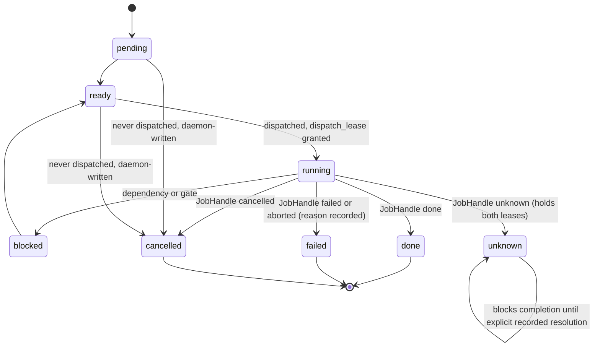
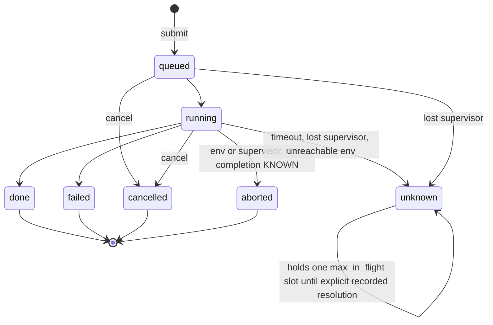
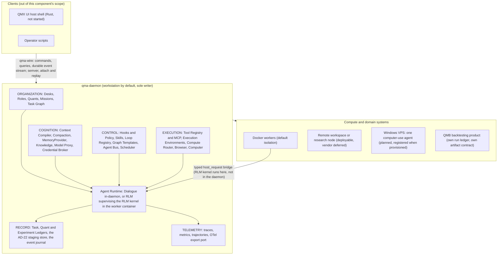
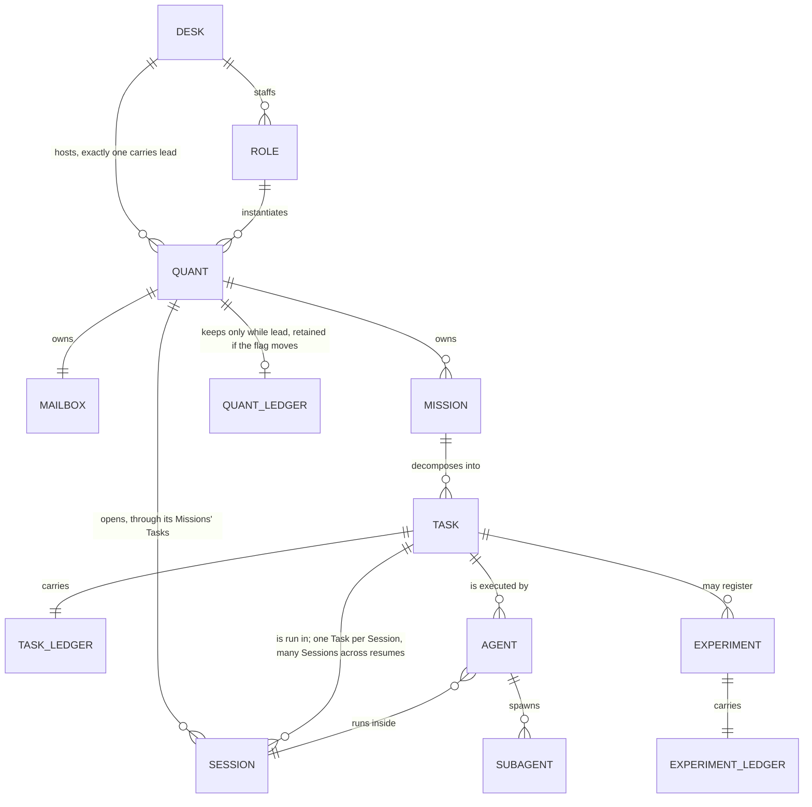
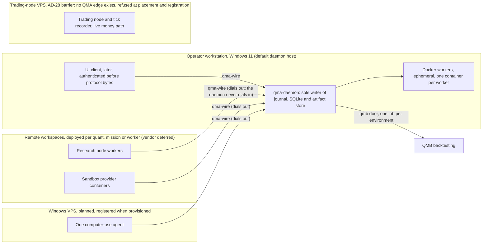

# qma-daemon

`COMP-QMA-DAEMON` is the one runtime process of the QMX agentic system (QMA): a single Python 3.14 asyncio daemon that is the only process that runs anything and the sole writer of the event journal, the SQLite store and the artifact store (DEC-0303) (DEC-0305) (DEC-0334). It implements every port and contribution surface `qma-core` defines, speaks the `qma-wire` contract to clients and workers, and holds the Task Graph, the three ledgers, the hook registry, the model proxy, the Tool Registry, the execution environments, the Agent Bus, the scheduler, the staging store and the telemetry store — the whole organization, cognition, control, execution, record and telemetry surface behind one wire (DEC-0335). QMA is the SDK; the daemon plus the SDK plus the wire contract are the QMX agentic system, all under the `qma.*` namespace with no blanket `qmx.` prefix, and `qma-daemon` is its runtime half (DEC-0330) (DEC-0337).

The daemon runs on the operator's workstation by default and runs its workers in Docker on that host; a Quant, Mission or Worker may be deployed to a remote workspace, the research node or a sandbox through the AD-17 contract, with the remote side dialing out and the daemon never dialing in (DEC-0324) (DEC-0336). It has no command line of its own — deployment and every mutating act arrive over the wire from the operator's UI or scripts, and QMB's `qmb` CLI stays the platform's single command-line surface (DEC-0336). Ratification fixes the architecture only: nothing in this document grants implementation, credential, order, promotion, live-money or destructive authority, which arrives solely through the factory pipeline (DEC-0329). The daemon's output into the money path is a candidate artifact a human promotes — never a binding, a sizing decision or an order — and no execution tool exists at any account role, "paper only" included (DEC-0341).

## Authority boundary

May: be the single Python 3.14 asyncio process that runs hooks and verifier scripts in-process, supervises the RLM kernel in the Analysis worker's container over the typed `host_request` bridge, and forbids a second daemon runtime (DEC-0303) (DEC-0334); be the sole writer of the event journal, the SQLite store and the artifact store, allocating the global `journal_seq` that is the system's single total order (DEC-0305); own the closed store list, the announcement law and the v1 folds, opening the SQLite store on exactly one connection in one thread (DEC-0305); own Mission and Task Graph state, run the deterministic Mission Compiler and emit decomposition Tasks whose Agent acts as Mission Director (DEC-0311); compile a Graph Template into a Task Graph of nodes and mint one Task per `loop` iteration, `task` node and `agent` node (DEC-0312); own the hook registry as the single enforcement and control surface, firing a `before_<verb>` gate and an `after_<verb>` event on every daemon-owned primitive (DEC-0309) (DEC-0339); admit a mission-scoped, template-validated observe-or-deny hook an Agent authors through `before_hook_register` (DEC-0310); persist the Task, Quant and Experiment ledgers, grant the `dispatch_lease`, `quant_ledger_lease` and `environment_lease`, and author the `reassigned` and `unknown_tail` entries (DEC-0308) (DEC-0338); own each Quant's Mailbox, evaluate its `WakePolicy` and resolve an undeliverable `Envelope` to `dead_letter` (DEC-0319) (DEC-0349); run the deterministic scheduler, fire Routines and enforce the continuation budget and escalation (DEC-0328); run the model proxy chain `ModelClass → Deployment → Credential Broker` with OpenCodex behind the Deployment contract and enforce `ReviewPolicy` over the optional `model_family` (DEC-0314) (DEC-0344); own the Tool Registry, the six-rung capability ladder and the effective capability set computed once at Agent spawn (DEC-0315); place `ComputeRequirement`s through the Compute Router, mint and resolve `JobHandle`s, and read `qmf-registry` and `qmf-risk` on the enumerated read-and-calculate surface (DEC-0316) (DEC-0347); load plugins with reversible scoped contributions and run daemon-core and plugin migrations under the parent's five-step order (DEC-0320); write the staging store, run the admission gate and apply `RefinementProposal`s, and write `role.base` only on an operator-principal `role.set_base` command (DEC-0321); own the telemetry store and its OTel export port, kept separate from the ledgers (DEC-0322); enforce permissions and the two principal classes, resolve secrets by reference through the Credential Broker allowlist and keep resolved values inside the egress call frame (DEC-0323); own store versioning, migration, backup and restore over its seven daemon-owned durable stores (DEC-0326); admit an external MemoryProvider behind the port and gate candidates on the deterministic `admission_confidence` (DEC-0317) (DEC-0342); adapt the read-only Knowledge corpus behind the `KnowledgeSource` port and copy cited bytes into the artifact store (DEC-0318) (DEC-0343).

May never: ship an execution tool at any account role, "paper only" included, or register a tool matching the act-level money-path deny-list, which is code and not configuration (DEC-0315) (DEC-0341); import `qmf-venue` into the daemon, a worker or a plugin, or place any environment or edge that could reach a venue, broker, exchange, trading-node or platform-registry control surface (DEC-0327) (DEC-0347); construct, write, amend or delete a binding, Book, BMS, seat, control-action, exit, protection, priority-rank or promotion record, or call any `qmf-registry` zone-transition surface (DEC-0347); mint a promotion or zone-transition command for the live zone — promotion is a human act performed outside QMA, and the daemon records only the resulting artifact ref (DEC-0324) (DEC-0345); let a proposing Agent set, suggest or influence `admission_confidence`, admit a candidate `promote` verb, or write a memory candidate outside `before_memory_write` (DEC-0317) (DEC-0345); trim the event journal, the three ledger stores, the artifact store, the staging store, the ledger quarantine stream or the retention-exempt trajectory and replay streams, or let a hook decision block the recording of a well-formed evidence append from the holder of the relevant lease (DEC-0322) (DEC-0309); author, alter or override a `WakePolicy`, a Routine, a variable or any definition-store record from an LLM rather than a deterministic command (DEC-0319) (DEC-0325) (DEC-0328); create a store not on the AD-6 closed list, a second base for anything `qmf-core` defines, or a second content-addressing construction (DEC-0305) (DEC-0302); grant the `operator` principal class to any worker, plugin half, remote deployment, scheduler, Routine or daemon-internal caller (DEC-0323).

## Interfaces

| Interface | Direction | Contract | Peer |
|---|---|---|---|
| Wire envelope, command / query / event families, `initialize`, attach / detach / replay, `host_request` bridge, principal classes | in/out | [CT-40](../contracts/ct-40-qma-wire-envelope.yaml) | COMP-QMA-WIRE |
| `HookEvent` (23 verbs + two phase-less controls) and `HookResult` (six decisions, total precedence) | in/out | [CT-41](../contracts/ct-41-qma-hook-event-result.yaml) | COMP-QMA-CORE; defined in core, implemented and fired by the daemon (DEC-0309) |
| `PluginManifest`, `PluginContext`, plugin roster entry, load-refusal law | in | [CT-42](../contracts/ct-42-qma-plugin-manifest-context.yaml) | COMP-QMA-CORE; the daemon owns the loader (DEC-0320) |
| `MemoryProvider` port: `recall`, `propose`, `admit`, MemoryCandidate, `admission_confidence`, `NoMemoryProvider` | out | [CT-43](../contracts/ct-43-qma-memory-provider.yaml) | COMP-QMA-CORE; the daemon binds one provider per desk and runs the admission gate (DEC-0317) |
| `KnowledgeSource`, `CorpusSnapshot`, `Citation`, `Provenance`, literal / locator search | out | [CT-44](../contracts/ct-44-qma-knowledge-source.yaml) | COMP-QMA-CORE; the daemon copies cited bytes into the artifact store (DEC-0318) |
| `ModelClassRequest`, `Deployment`, `ModelCapabilities`, routing policies, `ReviewPolicy`, `CredentialBroker` | out | [CT-45](../contracts/ct-45-qma-model-deployment-broker.yaml) | COMP-QMA-CORE; the daemon runs the two-stage router (DEC-0314) |
| `ExecutionEnvironment`, `ComputeRequirement`, Compute Router, `JobHandle` (states incl. `unknown`) | out | [CT-46](../contracts/ct-46-qma-execution-environment-job.yaml) | COMP-QMA-CORE; the daemon places jobs and maps `JobHandle` states onto Task states (DEC-0316) |
| `ExperimentSpec`, lineage DAG edges, `BacktestHandle` / `StrategyHandle`, the `qmb` door | out | [CT-47](../contracts/ct-47-qma-experiment-spec.yaml) | COMP-QMA-CORE; the daemon places one `qmb` job per environment through the `analysis-backtest` plugin (DEC-0316) (DEC-0348) |
| Mailbox `Envelope`, `MessageKind`, `DeliveryState`, `dead_letter`, operator approval queue, `WakePolicy` | out | [CT-48](../contracts/ct-48-qma-mailbox-envelope.yaml) | COMP-QMA-CORE; the daemon owns each Quant's Mailbox (DEC-0319) |
| `Routine` record: Quant-owned scheduled trigger, caps, continuation budget, escalation target | out | [CT-49](../contracts/ct-49-qma-routine.yaml) | COMP-QMA-CORE; the daemon's scheduler fires it (DEC-0328) |
| `RefinementProposal`: edit kinds (closed), staging store, validators, `apply`, `role.overlay` vs `role.base` | out | [CT-50](../contracts/ct-50-qma-refinement-proposal.yaml) | COMP-QMA-CORE; the daemon runs the admission pipeline (DEC-0321) |
| Task Ledger entry schema, `authored_by`, `dispatch_lease`, `reassigned` / `unknown_tail`, `TaskCompleted` structured append | out | [CT-51](../contracts/ct-51-qma-task-ledger-entry.yaml) | COMP-QMA-CORE; the daemon persists every ledger (DEC-0308) |
| Journal events on writer-scoped streams (the daemon's own `noun.verb` journal) | out | [CT-13](../contracts/ct-13-journal.yaml) | COMP-QMF-DATA; the ratified journal contract, not an invented format (DEC-0305) |
| Registration records (content-addressed dev-zone candidate artifacts only) | out | [CT-06](../contracts/ct-06-registration.yaml) | COMP-QMF-REGISTRY; read-and-calculate plus the single dev-zone candidate write (DEC-0347) |
| Lineage edges (candidate-to-predecessor; ExperimentSpec DAG) | out | [CT-07](../contracts/ct-07-lineage-edge.yaml) | COMP-QMF-REGISTRY |
| Version, fingerprint and format-version values (`fp1` over canonical JSON; tree digests) | in/out | [CT-05](../contracts/ct-05-version-fingerprint.yaml) | COMP-QMF-CORE; one content-addressing construction, imported and never re-derived (DEC-0302) |
| Typed refusals (QMA variants of the `qmf-core` base) | in/out | [CT-04](../contracts/ct-04-typed-refusal.yaml) | COMP-QMF-CORE; QMA adds variants, never a second base (DEC-0302) |

## Behavior

### One journal, one writer, one clock (AD-6)

Persistence is JSONL append journals plus SQLite in WAL mode behind `qmf-data` sinks, with DuckDB holding rebuildable fold views only and never evidence (DEC-0305). A single append-only journal with a global monotonic `journal_seq` is the only durable append target for daemon-owned events, and `journal_seq` is the single total order in the system; every event carries its full scope path, a per-scope stream is a filtered projection whose `seq` is a derived index, and the event journal is evidence — append-only, retained, backed up under AD-27 and never trimmed — neither a ledger (AD-9) nor telemetry (AD-23) (DEC-0305). No process other than the daemon writes the journal, the SQLite file or the artifact store; a read-only fold process may open these files read-only on the daemon's host only and never checkpoints (DEC-0305).

The daemon opens the SQLite store on exactly one connection in one thread with every checkpoint on that connection, under which the WAL-reset bug is unreachable, so SQLite 3.51.3 is not a v1 floor and `sqlite3.sqlite_version` is asserted at startup as evidence; 3.51.3 or the 3.50.7 backport becomes a hard floor only if a second writable connection or a separate checkpointer thread is introduced (DEC-0305) (DEC-0334).

**The closed store list has two classes (DEC-0305).** Journal-derived projections are never independent append targets: the per-scope event streams; the mailboxes and delivery state (AD-20); the daemon-held operator approval queue (a mailbox-kind projection over the same `message.*` events, readable and answerable only by an `operator`-principal connection); the Task Graph state (AD-12); the Session and Agent records (AD-14, AD-16); the desk ledger views (AD-9); the ledger quarantine stream (a projection over `ledger.quarantined` events carrying the refused entry verbatim with its reason); and the definition store. Declared independent stores each have exactly one named writer and one append path through the daemon: the three ledger stores (AD-9), the artifact store (AD-8), the telemetry store (AD-23), the AD-22 staging store, and an admitted MemoryProvider's own store (AD-18). A store not on this list may not be created (DEC-0305).

**The definition store is a sixteen-member set (DEC-0305) (DEC-0307).** Each member is a projection over its own `noun.verb` journal events with `journal_seq` as ordering key:

1. Desk records
2. Role records (`role.base` and `role.overlay`)
3. Quant records
4. the Deployment Registry
5. the Tool Registry
6. `tool_adapter` records
7. toolset records
8. `worker_template` records
9. hook registrations
10. Skill registrations
11. Graph Template registrations
12. Loop registrations
13. Routine records
14. `ExecutionEnvironment` declarations
15. the AD-26 variable registry
16. plugin install records

**The announcement law (DEC-0305).** Every append to a declared evidence store — the three ledgers, the artifact store, the staging store and an admitted MemoryProvider's store — also emits a journal event naming the store and carrying the record's `fp1` (`ledger.appended`, `artifact.registered` and their siblings), so ordering and replay stay journal-authoritative. The telemetry store is the one declared store this law exempts, because a journal that is never trimmed may not grow with a stream that is bounded. The announcement's `journal_seq` is the ordering key in every cross-store fold and equal instants are disposed by ascending `journal_seq`, never by timestamp.

**The v1 folds and the single fold contract (DEC-0305).** The v1 folds are exactly the desk ledger views; Task, Mission, Session and Agent state (the Session record carrying its execution-model and autonomy axes and never its attachment, the Agent record carrying the effective capability set computed at spawn); mailbox delivery state and ack cursors; deployment and provider health; staging and application state; and each definition-store registry. Every fold takes `journal_seq` as ordering key, `as_of` over `recorded_at` as the knowledge-time bound, and equal instants by ascending `journal_seq`. The per-scope event streams and the ledger quarantine stream are filtered projections, not folds, and a new fold is a spine amendment.

**The clock law (DEC-0305).** Every durable record carries `occurred_at` and `recorded_at` as int64 UTC nanoseconds from `qmf-core`'s clock plus, in every store the announcement law binds, its announcement `journal_seq`; a telemetry record carries `occurred_at` and `recorded_at`, no `journal_seq`, and is ordered by `recorded_at` and its `correlation_id` alone (DEC-0322). No component reads host local time and no worker timestamps its own evidence; every operator-facing wall-clock policy — quiet hours, Routines and cron, rollups, the ledger date index — carries an explicit IANA timezone resolved in the daemon at evaluation time, and every duration policy is a span measured from a recorded UTC instant and carries no timezone.

**The remote outbox (DEC-0305).** A remote or partitioned worker holds a durable local outbox — ordered, fsynced, never a journal, never folded, discarded entry by entry on daemon ack — that replays in order on reconnect with the daemon deduping on producer plus id; the outbox depth and spool bytes are registered variables (`registry:wire.remote_outbox_depth`, `registry:wire.remote_spool_bytes`). On exhaustion the worker blocks the dispatch of new work rather than discarding a pending evidence append, with telemetry discarded first; an environment lost with a non-empty outbox marks that Task's ledger `unknown_tail` at the last acked id and never fabricates the missing tail (DEC-0308).

### State ownership across the eight store classes (AD-8)

The eight store classes are distinct — journal, ledger, memory, knowledge, artifacts, context, telemetry and staging are each separate — and ownership and lifetime are fixed here and nowhere else, the store list itself closed by AD-6 (DEC-0307). For each store the ownership table fixes owner, who may write, the crossing rule and retention:

| Store class | Owner / writer | Crossing rule | Retention |
|---|---|---|---|
| Event journal | daemon only | own announcement `journal_seq` stamp | forever, backed up, exempt from trim |
| Mission and Task Graph state | daemon only (agents propose transitions as commands) | `_ref` | forever |
| Session and Agent records | daemon only (journal projections) | `_ref` | as long as the journal |
| Task / Quant / Experiment ledgers | daemon store, agent-authored except AD-9's exemptions, written through `before_ledger_append` by the holder of the relevant lease | `_ref` | forever |
| Ledger quarantine | daemon only | `_ref` | forever, exempt from trim |
| Definition store | daemon only (journal projections); agents propose edits as AD-22 `RefinementProposal`s | `_ref` | rebuilt from and kept as long as the journal |
| Memory | the MemoryProvider (one binding per desk); the agent proposes, the daemon gate admits | recalled into Context only | until admitted, superseded, invalidated, expired or contradicted |
| Knowledge | external read-only corpus nobody writes | `Citation` with `source_ref`, `locator`, `snapshot_ref`; cited bytes copied to the artifact store | cited copies kept forever |
| Artifacts | daemon content-addressed registry, written by the producing agent through `before_artifact_register` | `_ref` | forever, with lineage |
| Staging | daemon store, agent proposes as a command, daemon writes | staged content never read by a runtime path | approval decisions and lineage kept forever |
| Mailbox and Agent Bus | daemon projection over `message.*` events | `_ref` | delivery projection bounded; underlying journal records forever |
| Context | the Context Compiler per invocation, written by nobody | never persisted | discarded with the invocation |
| Telemetry | daemon harness-authored, never an agent | shares `correlation_id`; a ledger entry may carry `trace_ref`, never the reverse | bounded, trajectories and session replay exempt |

**The single agent write path outside AD-22 (DEC-0307) (DEC-0310).** The definition store takes agent edits only as AD-22 `RefinementProposal`s, with exactly one exception closed here: a mission-scoped, template-validated observe-or-deny hook an Agent registers through `before_hook_register`, folded under that Mission's scope, disposed with the Mission on its exit stack and never becoming a durable hook except through AD-22. `role.base` is a definition-store record written only by an operator-principal `role.set_base` command, while `role.overlay` stays proposal-editable.

### Task Graph, Mission Compiler and Mission Director (AD-12, AD-13)

An LLM proposes the decomposition; the infrastructure owns the resulting state (DEC-0311). The Task Graph is deterministic persisted daemon state and the only place work state lives. A Task is transcript-independent: it carries intent, inputs, refs, acceptance criteria and its Task Ledger so another Agent can be assigned or resume it without the prior Agent's transcript. A Mission is the executable organizational contract — intent, scope, constraints, evidence requirements, available capabilities, success criteria, outputs, verification, budget, escalation, termination criteria and an optional `approval_route` — owned by exactly one Quant, from whose record the desk is derived; there is no global mission (DEC-0311).

The Mission Compiler is deterministic daemon code, never an LLM, turning a Goal plus an optional Graph Template into a Mission record and its initial Task Graph; there is no separate Mission Template registry in v1 (GAP-0084) (DEC-0340). Where decomposition must be reasoned the Compiler emits a decomposition Task whose Agent acts as Mission Director — not a new ontology object, an Agent of the owning Quant running under that Mission's Task Graph with a `dispatch_lease`, Task Ledger and Role permission set — whose decomposition reaches state only as proposed transitions the daemon validates (DEC-0311). A deterministic scheduler and dispatcher decide where, when, who and dependencies, and grant the `dispatch_lease` and `environment_lease`; parallel workers synchronize through the Task Graph, never chat (DEC-0311).

**Task and Mission state (DEC-0311).** Task and Mission state is a closed-and-addable vocabulary — `pending`, `ready`, `running`, `blocked`, `unknown`, `done`, `failed`, `cancelled` — of which the terminal states are exactly `done`, `failed` and `cancelled`; a Task reaches exactly one terminal state. The daemon refuses any proposed terminal transition of a dispatched Task not evidenced by a terminal `JobHandle`; a never-dispatched Task carries no `JobHandle` and may reach only `cancelled`, written by the daemon; a Mission never carries a `JobHandle` and its terminal state is computed by the daemon from its Tasks. A Task whose handle is `unknown` may enter only `unknown`, holds both its `dispatch_lease` and `environment_lease`, and blocks completion until an explicit recorded resolution; a Mission containing an `unknown` Task is itself `unknown`, never `failed` (DEC-0311).



**Control primitives and node kinds (DEC-0312) (DEC-0340).** Three primitives stand. A Graph Template is authored, plugin-contributed, versioned topology with no runtime state; a Loop is an executable control cycle whose `stopping_condition`, `budget` and `escalation` are runtime-owned, expressed as a node kind inside a Graph Template; a Skill is a reusable procedure and knowledge, and `Skill != Loop` (a Skill may invoke a Loop). The full node-kind vocabulary is `task`, `conditional`, `parallel_branch`, `join`, `approval_gate`, `human_gate`, `deterministic_script`, `loop`, `agent` and `artifact_dependency`; the only node kinds that emit Tasks are `task`, `agent` and `loop`, and the rest instantiate as daemon-evaluated nodes carrying node state, holding neither lease, carrying no ledger and emitting no Task (DEC-0312). A `loop` node emits exactly one Task per iteration minted at iteration time by the daemon; iteration count, `stopping_condition` evaluation, `budget` and `escalation` are node state and never Task fields. An `approval_gate` raises its `approval_request` through `ask` and is subject to `ask_timeout`; a `human_gate` raises the same `approval_request` but never times out and blocks its node until an `operator` principal answers, and a candidate flagged `money_path_relevant` may pass only a `human_gate` (DEC-0312) (DEC-0313). The daemon ships no `graph_template` in v1: every named cycle — Act-Observe-Verify and Hypothesis-Test-Learn-Mutate-Gate included — arrives as a plugin-contributed `graph_template`, and the graph-engine implementation choice is deferred (GAP-0086) (DEC-0312).

### Hooks: the single enforcement surface (AD-10, AD-11)

Hooks are the single enforcement and control surface, never an optional feature, and every daemon-owned primitive ships its own before/after hook events (DEC-0309) (DEC-0339). The v1 registry is closed-and-addable: a `before_` and an `after_` event for each of twenty-three daemon-owned verbs — `tool`, `task_create`, `task_complete`, `ledger_append`, `memory_write`, `skill_write`, `artifact_register`, `experiment_register`, `env_create`, `env_remove`, `subagent_spawn`, `message_send`, `graph_transition`, `session_start`, `session_end`, `mission_start`, `mission_complete`, `plugin_activate`, `plugin_deactivate`, `routine_fire`, `hook_register`, `proposal_stage` and `proposal_apply` — plus exactly the two phase-less blocking controls `agent_stop` and `review_required`. Every new daemon-owned primitive ships a `before_<verb>` gate and an `after_<verb>` event, omitting an `after_<verb>` being a spine amendment; an agent-reachable write into any daemon-owned store passes a `before_*` hook without exception (DEC-0309).

**Phase law and `HookResult` (DEC-0309).** Every event declares its phase in its name except the two phase-less controls `agent_stop` and `review_required`, which fire before the act they gate. Only a `before_*` event and those two controls may return `deny`; `block_stop` is legal only on the two phase-less controls and is refused at registration on every `before_*` event; `ask` and `defer` are legal only on `before_*` events; `allow` is legal on every `before_*` event and on `after_tool`; and every other `after_*` event may return only `observe`, a decision illegal for an event's phase being refused at registration. On `agent_stop` the legal decisions are `block_stop` and `observe` — `deny` is not legal, and a hook that returns nothing or times out resolves to `observe`; on `review_required` they are `deny`, `block_stop` and `observe` — a hook that returns nothing resolves to `observe` and a timeout resolves to `deny`. `HookResult` is one tagged union carrying `decision`, `reason`, `updated_input` (`before_tool` only), `updated_output` (`after_tool` only), `injected_context` (`before_*` events only, reaching the Context Compiler and never the ledger), `ledger_entry` (`before_task_complete` and `review_required` only) and `verifier_ref` (`before_task_complete` and `review_required` only); a field on a phase that does not permit it is refused at registration. The six decisions have the total precedence order `block_stop` over `deny` over `defer` over `ask` over `allow` over `observe`, parallel hooks resolving most-restrictive-wins and `observe` never participating (DEC-0309).

**Fail-closed with three carve-outs (DEC-0309).** A hook timeout resolves to `deny` with reason `hook_timeout` plus a telemetry record, but L39 binds inside QMA, so: `before_ledger_append` is a validating gate, not a blocking control — it may refuse only a schema-invalid entry or one authored outside the relevant lease, a timeout resolves to `allow` with the entry recorded and annotated `hook_timeout`, an explicit `deny` writes the entry to the quarantine stream with its reason and never discards it, and no permission policy, precedence resolution or permissive mode may produce a `deny` on a well-formed evidence append from the holder of the relevant lease; an `agent_stop` timeout resolves to `observe`; any `after_*` timeout resolves to `observe` annotated `hook_timeout`. Every other `before_*` event and `review_required` stay fail-closed, `before_memory_write` included (DEC-0309).

**`ask`, `defer` and escalation (DEC-0309).** `ask` suspends the invocation and emits exactly one `approval_request` into the mailbox or operator approval queue named by its Mission's `approval_route` when the Mission carries one and into the owning Quant's mailbox otherwise — the single human-approval channel every gate raises — carrying `ask_timeout` and an `on_timeout` of `deny` or `escalate`; `escalate` re-emits the same `approval_request` once and restarts `ask_timeout` once, a second expiry resolving to `deny` with reason `ask_escalation_exhausted`. A session whose autonomy axis is `autonomous` resolves `ask` to `deny` with reason `no_interactive_authority` unless the Mission's `approval_route` final hop is the reserved `operator` route value. `defer` parks the work durably, releases the `environment_lease`, retains the `dispatch_lease` so resume is not a reassignment, and re-runs the full hook chain on resume (DEC-0309).

**Source bounds and determinism (DEC-0309) (DEC-0310).** A hook's source is one of desk, role, mission or plugin and bounds the events it can ever receive; the daemon applies the source bound before the matcher and refuses at registration a matcher that could resolve outside its bound. Every hook is a deterministic Python callable or subprocess with no prompt-type and no agent-type handlers; hooks run in the daemon, though a worker-side tool interception may execute in the worker with the decision the daemon's. An Agent may author a hook only from an approved template, only scoped to its Mission, and only as an observe-or-deny hook: the AD-11 registration validator rejects any agent-authored hook whose result can carry `updated_input`, `updated_output`, `injected_context`, `ledger_entry` or `verifier_ref` (the list closed at exactly those five), the permission set is the intersection with the Mission's own, and the disposer is pushed onto the Mission's exit stack (DEC-0310).

**ReviewPolicy (DEC-0309) (DEC-0314).** `before_task_complete` and `review_required` are required gates running a deterministic verifier script rather than an LLM judging itself; `ReviewPolicy` enforces `author_family != reviewer_family` against the optional `model_family` field AD-15 defines on every Deployment record (a deployment whose family is unassigned being ineligible for every comparison) and returns the typed refusal `NoEligibleReviewer` when no deployment qualifies.

### Ledgers, leases and desk views (AD-9)

Three ledger stores exist and everything else is a view (DEC-0308) (DEC-0338). The Task Ledger is owned by the Task, one per Task for its whole life across every Agent that ever holds it, persisted in the daemon store through the wire so it survives the worker; no ledger spans two Tasks and no Agent appends to a Task it does not hold. Append rights follow a single `dispatch_lease` per Task, distinct from AD-17's per-slot `environment_lease`; every entry carries `attempt_no`, `authored_by` (an agent ref plus the owning Quant's `ActorId`, or `daemon` on a daemon-authored entry) and the model deployment used. A reassignment — any change of the Agent holding the `dispatch_lease` — is a daemon-authored entry of kind `reassigned` that increments `attempt_no`, while a resume from `defer` retains the `dispatch_lease`, writes no `reassigned` entry and leaves `attempt_no` unchanged (DEC-0308).

`before_ledger_append` refuses an append from a non-holder of the relevant lease, with exactly two exempt authors — the daemon for the daemon-authored kinds `reassigned` and `unknown_tail`, and a `ledger_entry` returned by `before_task_complete` or `review_required` recorded with `authored_by: daemon` plus the returning hook's registry id — both still schema-validated and the exempt set closed (DEC-0308). A task-completion transition requires a structured ledger append — what was done, what changed, evidence and artifact refs, unresolved issues and the next recommendation — or the completion, and only the completion, is refused while the entry is still written and never discarded (DEC-0308).

The Quant Ledger is a desk lead Quant's own larger work ledger with a declared entry schema (mission opened and closed, delegation, escalation and the standing decisions the Quant makes at desk level), appended only through `before_ledger_append` by an Agent of that Quant holding the `quant_ledger_lease`, which the daemon grants to at most one Agent of that Quant at a time; it survives movement of the desk lead flag, and Mission reports are deferred (GAP-0082) (DEC-0349). The Experiment Ledger is one per Experiment, owned by the Quant that registered it and appended by the Agent holding the `dispatch_lease` of the Task that registered the Experiment. Research, Trading, Development, Analysis and PM ledgers are read-time views over those three, indexed by desk, quant, agent, mission, task, experiment and date, never stores; the desk ledger view fold streams the three ledger stores' `ledger.appended` announcements filtered by the view's index key, ordering key the announcement `journal_seq`, knowledge-time bound the view's `as_of` over `recorded_at` (DEC-0308).

### Agent Bus, Mailbox and WakePolicy (AD-20)

Each Quant owns one durable Mailbox living in the daemon's own store, with no external relay (DEC-0319). An `Envelope` carries msg id, from, to, kind, optional mission and task refs, `correlation_id`, optional `reply_to_ref` and `causation_id`, body, artifact refs, priority and creation time; `causation_id` is the id of the single record that caused this one — per-record, never copied verbatim down a chain the way `correlation_id` is, and excluded from `fp1` identity by explicit versioned declaration. `MessageKind` is one of `handoff`, `reply`, `notify`, `review_request`, `status`, `question`, `approval_request`; `approval_request` is the single human-approval channel every gate in this spine raises. `DeliveryState` is one of `delivered`, `queued`, `woke`, `deferred`, `dead_letter` (DEC-0319).

`WakePolicy` is a field of the Quant record in the definition store — operator-authored, `ui-editable`, scope `quant` — carrying wake conditions, quiet hours (`registry:quant.quiet_hours`) and max wakes per window (`registry:quant.max_wakes_per_window`); the deterministic scheduler evaluates it at delivery time and no model authors, alters or overrides it (DEC-0319) (DEC-0325). Quiet hours suppress wakes only: a message arriving inside them is still delivered and still acked, its `DeliveryState` is `deferred`, and the wake fires at the next end of quiet hours; quiet hours never suppress a Routine firing, never pause a run already under way and never delay an `approval_request` reply (DEC-0319). Delivery is at-least-once with idempotent msg-id dedup, a per-actor ack cursor and bounded retention; the bounded retention governs the delivery projection only and never deletes a journal record. A message may request work but can never be the work: a handoff becomes real only when it writes a Task, and a reviewer's authoritative act is the task update. A mailbox `Envelope` whose more specific recipient no longer exists resolves to `dead_letter` until the operator rules on the catch-all (GAP-0071) (DEC-0349).

### Scheduler, Routines and continuation (AD-29)

Unattended operation is a v1 obligation, not an emergent property, and AD-29 gives it its owning rule so no LLM decides when work fires and no agent invents work after its budget runs out (DEC-0328). A Routine is a durable, Quant-owned scheduled trigger carrying an id, the owning `ActorId`, a cron expression or interval with an explicit IANA zone, the Goal it supplies to the Mission Compiler, the fully-qualified `graph_template` id the Compiler expands, an enable flag and a max-concurrent cap (`registry:routine.max_concurrent`); it is declarative daemon state, never agent-authored, and UI-editable (DEC-0328). Firing is deterministic and never an LLM decision: the scheduler mints a fresh `correlation_id`, fires `before_routine_fire` and `after_routine_fire`, and instantiates through the Mission Compiler with no authority an operator command lacks — a Routine is a `machine` principal and can answer no human gate; missed fires while the daemon is down are recorded, not replayed, and catch-up is an explicit operator action (DEC-0328) (DEC-0323).

Continuation is the mechanism by which agents keep working unattended: a Task is not complete until the deterministic verifier passes, and `agent_stop` returning `block_stop` returns the Agent to the next ready Task in its Mission's Task Graph rather than ending the run (DEC-0328). Max consecutive continuations, the budget ceiling and the escalation target are configurables (`registry:continuation.max_consecutive`, `registry:continuation.budget`, `registry:continuation.escalation_target`); an Agent that exhausts its budget escalates to its Quant's mailbox and stops, and never invents work to fill the remainder (DEC-0328).

### Model proxy: ModelClass → Deployment → Credential Broker (AD-15)

The chain is deterministic and never an LLM: a `ModelClass` request resolves against a Deployment Registry whose credentials resolve through a separate Credential Broker (DEC-0314) (DEC-0344). `ModelClass` has exactly four values — `REASONING_HIGH`, `WORKHORSE_GENERAL`, `CODING_HIGH`, `FAST_CHEAP`. Selection is two-stage and never crosses a class boundary: stage one the requested `ModelClass` selects the candidate pool; stage two the request's `needs` flags (tools, vision, `reasoning_effort`, `parallel_tool_calls`) plus `min_context_tokens` are the sole eligibility filter. An empty filtered pool returns the typed refusal `NoEligibleDeployment` naming the class and the unmet constraint; the router never falls back to a deployment outside the requested class, which is what makes a silent capability downgrade impossible. Within the eligible pool the router load-balances under a routing policy of `failover`, `weighted_round_robin`, `quota_lowest` or `fill_first` and returns `ModelCapabilities` to the Context Compiler (DEC-0314).

Every Deployment carries an optional operator-assigned `model_family` field — unset at registration, never defaulted and never synthesized; a plugin-contributed `model_deployment` registers with none, and a manifest declaring one is refused at load naming the plugin id and the field. OpenCodex sits behind the Deployment contract and deliberately not behind the Credential Broker, as the first implementation for OAuth and subscription-pool providers; QMA-owned credentials resolve through the Credential Broker from the OS secret store, never from a third-party tool's home-directory files (DEC-0314) (DEC-0344). A Deployment whose implementation is a local proxy carries `auth_mode: none` — QMA passes it no credential and no QMA-resolved secret ever crosses into the proxy's process; the proxy's own provider credentials stay its own custody outside QMA's namespace. The daemon permits a proxy Deployment only when it binds loopback (`127.0.0.1` or `::1`) on the daemon's host, verified at registration; any non-loopback or remote proxy is refused with `NonLoopbackProxy`, and a loopback proxy accepting unauthenticated connections is permitted only by the configurable `registry:proxy.allow_unauthenticated_loopback` and refused with `UnauthenticatedProxy` when that variable is false. QMA never pools accounts itself; where pooling exists it happens inside the operator's own proxy under the operator's account terms, and the daemon records the true deployment honestly on every routing decision (DEC-0344).

### Tool Registry, capability ladder and the money-path deny-list (AD-16, AD-28)

One Tool Registry spans native, CLI, plugin, MCP-adapter, browser, computer-use and backtest tools, and everything resolves through it — MCP is an adapter inside the registry, configured per desk and role by `tool_adapter` records; a plugin-contributed `tool_adapter` carries no desk-and-role binding, which is written only by an operator-principal command (DEC-0315). Every entry carries a `check_fn` availability preflight so a tool that cannot run is excluded before its schema reaches the model. Toolsets are named, versioned definition-store records listing fully-qualified tool ids; a Role grants a toolset, a Mission narrows it and never widens it, and a Subagent inherits no more than its parent and is blocked from delegation and memory-write tools at the leaf. The capability ladder has six rungs and the lowest capable one wins: API or structured tool, CLI, containerized program, browser automation, visual browser or computer-use, persistent remote desktop (DEC-0315).

Trading-desk tools are read-only market data, read-only portfolio and positions, and risk calculation with no sizing authority (DEC-0315) (DEC-0341). There is no execution tool at any account role, "paper only" included, and the prohibition is an enumerated act-level deny-list, not a permission policy. The prohibited acts are: submit, amend, cancel or replace an order; open, close, reduce or hedge a position; set or amend protection; size, re-size or mint a sizing decision; create, amend, activate, stand down or delete a bot-to-book binding; set a Book mode, a seat state, a Book or BMS parameter, a priority rank or a capital floor; arm, disarm or change a kill switch or a node control action; transition any registry artifact between zones (DEC-0315). `register_tool` refuses at registration with the typed refusal `ProhibitedMoneyPathTool` naming the plugin id, the tool id and the matched act; the refusal is a startup error, never a runtime deny; the deny-list is code, evaluated before `check_fn`, applied to every entry regardless of kind, and an MCP server advertising a prohibited tool is refused whole. No `check_fn`, permission policy, Role, Mission, hook, toolset or `tool_adapter` change can lift it (DEC-0315) (DEC-0341).

**The reachability barrier (AD-28) (DEC-0327).** AD-16's prohibition binds the act, not the tool name: no QMA agent, subagent, worker, environment, browser session or computer-use session may reach a venue, broker, exchange, trading-node or platform-registry control surface by any means. `ExecutionEnvironment` carries a required `network` field with exactly two values, `none` and `allowlist`, and an environment is refused at registration unless an allowlist enumerates its reachable hosts; venue, broker, exchange and trading-node hosts sit on a code-declared deny-list no allowlist entry may name. No QMA worker image may contain, install or import `qmf-venue`, a broker or exchange SDK, or the trading node's client, and image validation refuses one that does; the `remote_host` and `desktop` kinds may not name the trading-node VPS or any host carrying a trading credential or a running node, refused by host identity. The single computer-use agent runs on a profile whose browser carries no venue or broker session, cookie or saved credential and may not be handed a venue login by any means. Every violation is a refusal at placement or registration, never a hook deny at runtime; together with the act-level deny-list this is the money-path reachability barrier: nothing above a bot touches the market (DEC-0327) (DEC-0341).

**The effective capability set (DEC-0315).** The effective capability set is computed once by the daemon at Agent spawn as an ordered narrowing — `role.base` is the ceiling, narrowed in order by `role.overlay`, then Mission, then parent — where every step after `role.base` may only remove and never add: a skill an overlay appends is knowledge, never a capability grant, and AD-22's validator refuses at application any overlay entry naming a tool or toolset outside `role.base`'s grant. The result is recorded verbatim on the Agent record and never recomputed for a running Agent; an overlay binds only Agents spawned after it (DEC-0315).

### Execution environments, Compute Router, JobHandle and the RLM kernel (AD-14, AD-17)

`ExecutionEnvironment` declares a kind of `local`, `docker`, `remote_container`, `remote_host`, `browser` or `desktop`, with provider ref, image, mounts, environment allowlist, capabilities, a required `network` field of `none` or `allowlist` and a lifecycle of `ephemeral` or `persistent`; Docker-per-worker, ephemeral, is the default and there is no shared dirty filesystem (DEC-0316). An `ExecutionEnvironment` instance grants at most one `environment_lease` per slot unless its declaration sets `registry:environment.max_in_flight`; the Compute Router queues the rest; the `remote_host` and `desktop` kinds may never exceed one. The agent declares a `ComputeRequirement` (cpu, memory, disk, optional gpu, capabilities, timeout, max memory, isolation) and the Compute Router places it; agents never know the machine or the vendor. A `ComputeRequirement` naming a `kind` no registered environment provides returns the typed refusal `NoEnvironment` naming that kind — AD-25's unprovisioned `desktop` is the v1 case (GAP-0070) (DEC-0316) (DEC-0324).

`JobHandle` carries a job id and a state of `queued`, `running`, `done`, `failed`, `cancelled`, `aborted` or `unknown`, with `submit`, `JobHandle.attach`, `wait`, `JobHandle.reattach`, `wake`, `cancel` and `stream`; `wake` resolves to the owning Quant's mailbox at submit time. The terminal states are exactly `done`, `failed`, `cancelled` and `aborted`; `queued`, `running` and `unknown` are non-terminal. `cancelled` means terminated by an explicit `cancel`; `aborted` means terminated by the environment or supervisor without a cancel where non-completion is known (OOM kill, container stop, image or mount failure); an outcome that is not known resolves to `unknown` and never to `aborted` (DEC-0316).



The mapping onto Task states is fixed, total and daemon-applied: `queued`/`running` → `running`, `done` → `done`, `failed` → `failed`, `aborted` → `failed` with the abort reason recorded, `cancelled` → `cancelled`, `unknown` → `unknown`; no other pairing is legal and `aborted` never becomes `cancelled` (DEC-0316) (DEC-0311). A timeout, a lost supervisor or an unreachable environment resolves to `unknown` and never to `failed`, holding one `max_in_flight` slot until an explicit recorded resolution; no component retries, assumes an outcome or invents terminal state (DEC-0316).

**The RLM kernel (DEC-0303) (DEC-0313).** The RLM Runtime v1 is scoped by desk to the Analysis desk (`analysis-*`), never by Role. The RLM kernel is a persistent Python interpreter inside the worker's Docker container reaching the host through a typed `host_request` bridge — a `qma-wire` message family, never a second channel: every host call is a wire command or query issued by the worker under the Task's `scope_path` and `correlation_id`, its verb set closed-and-addable, every verb mapping to exactly one daemon-owned primitive and running that primitive's `before_*` hook, and a host call with no mapped primitive returns the typed refusal `UnknownHostRequest`; async spawn returns a `JobHandle`; the spawn depth cap is `registry:rlm.depth_cap` (DEC-0313). Hooks and verifier scripts run inside the daemon while the RLM kernel runs in the worker container, so AD-28's image and network boundary applies to the kernel; the RLM performance envelope and RLM beyond the Analysis desk are deferred (GAP-0076, GAP-0080) (DEC-0303). Handles are daemon-resolved references whose contents never enter a context window; the handle kinds are a closed-and-addable vocabulary owned by `qma-core` — `BacktestHandle`, `ExperimentHandle`, `TradeLogHandle`, `StrategyHandle`, `KnowledgeHandle`, `MarketDataHandle` — and a handle addressing a live or writable money-path record may not be minted at all (DEC-0313).

**The QMB door (DEC-0316).** QMB is the backtesting path, unchanged: agent to QMA backtest tool to the Backtesting Service — the `analysis-backtest` plugin's daemon half: one Tool Registry entry plus the single `qmb` door, holding no scheduling authority, no parallelism and no state of its own — to the `qmb` CLI or MCP door to QMB. QMA places exactly one `qmb` job per environment; QMB owns intra-node parallelism, its own run ledger and its artifact contract, and QMA never re-specifies it (DEC-0316) (DEC-0348). `ExperimentSpec` is content-addressed: a code ref only when code changes, a resolved-config ref for parameter and configuration changes, plus data ref, environment ref, seed, model and harness version, cost assumptions and a lineage DAG — never a git branch per parameter (DEC-0316).

### Plugin loader, reversible scopes and migrations (AD-21, AD-1)

AD-21 governs every plugin and the load flow (DEC-0320). A `PluginManifest` declares id, version, supported `qma_api` range, desk, dependencies, provided contributions, permissions, entrypoint, migrations and rollback mode. Activation registers every contribution through a scoped plugin context honoring AD-1's cardinality; each registration returns a disposer pushed onto a per-plugin async exit stack, and unload closes the scope LIFO so every contribution disappears together. A missing dependency or a second singleton binding is a hard startup error, never a silent pending state; reload is an explicit command with no file watcher and no reactive re-mount (DEC-0320). Trust is first-party only in v1 — no trust tiers, no capability solver, no plugin store (DEC-0320).

Data is the half LIFO cannot undo: every migration declares a `down`, or the manifest declares `rollback: forward_only`. Migrations follow parent AD-20's order in full — preflight, backup first, dry-run, migrate, verify, with a documented restore path — inside a daemon-held transaction preceded by a recorded journal checkpoint written as evidence with the `correlation_id`; the checkpoint is an addition to the backup, never a substitute. The loader refuses a forward-only upgrade unless an `operator` principal confirms it in that session; a forward-only plugin may be disabled but never rolled back. Daemon-core migrations follow this rule verbatim: the journal schema, the three ledger schemas, the task-graph tables, the mailbox and the staging store belong to no plugin, and each declares a `down` or `forward_only` (DEC-0320) (DEC-0326).

**Load-time refusal law (DEC-0320).** Every condition the spine calls a hard startup error is a refusal of the load, not of the process: at daemon startup it aborts startup naming the offending unit; on an explicit install, enable or reload command it fails that command with a typed refusal naming the same fields, disposes that plugin's scope LIFO, and leaves the running daemon, every `dispatch_lease` and `environment_lease` it holds, and every currently running Task untouched; no load-time refusal ever terminates a running daemon or discards a pending evidence append. The in-house threading node must be accommodated by this shape rather than assumed away; its shape is unspecified, so v1 mints no contribution type for it (GAP-0077) (DEC-0320). The spine's structural seed names five desk plugin packs — `research-corpus`, `analysis-backtest`, `dev-factory`, `trading-readonly` and `pm-coordination` — as the seed of intent; only `analysis-backtest` is fixed by rule, as the Backtesting Service's daemon half (DEC-0316) (DEC-0348).

### Staging store and the admission gate (AD-22)

Nothing agent-produced becomes runtime state by itself: AD-22 discharges P-9 over memory candidates, skills, hooks, graph templates, loops, prompts, roles, toolsets and worker templates (DEC-0321). The pipeline is a `RefinementProposal` (summary, rationale, edits, expected outcome), where an edit is a create, update or delete over a kind of `prompt`, `memory`, `skill`, `toolset`, `worker_template`, `hook`, `graph_template`, `loop` or `role` → deterministic validation (schema, immutable base, optimistic-concurrency conflict check) → deterministic verification by verifier script, test or backtest replay, never an LLM judging itself → optional cross-model review under `ReviewPolicy` → a staged candidate in the staging store, never live → approval → application, with recorded before-and-after snapshots per applied edit for rollback (DEC-0321). A proposal is applied, never promoted (DEC-0345).

In v1 every application requires an `operator` principal, which is why `before_proposal_apply` is where AD-24's operator-principal check runs; there is no policy, machine, scripted or scheduled approval path for any edit kind (DEC-0321) (DEC-0323). The staging store has exactly one record type, the `RefinementProposal`: a MemoryCandidate is never written to it on its own — it enters only wrapped in a `RefinementProposal` carrying exactly one `memory` edit. `role.base` is operator-authored and immutable to the pipeline — written only by an operator-principal `role.set_base` command recording a `role.updated` journal event — while `role.overlay` is proposal-editable, and the validator rejects any edit whose path resolves into a base (DEC-0321). Only definitions are edit targets: the durable definition of a spawned worker is `worker_template`, and `subagent` is not an edit kind. Once a MemoryProvider is bound, admission is the daemon's deterministic admission gate alone — the candidate is written through `before_memory_write`, is never a `RefinementProposal` and requires no operator principal; the `memory` edit kind governs only candidates staged while no provider is bound. The evaluation gates switch on when the deferred self-improvement row's condition is met (GAP-0074) (DEC-0321).

### Memory and Knowledge behind their ports (AD-18, AD-19)

QMA builds no memory engine in-house: memory enters through the `MemoryProvider` port, one binding per desk, with `propose`, `admit`, `recall` (token-budgeted, not result-count), `get`, `list`, `history`, `supersede`, `invalidate`, `expire` and `scopes`; `reflect` is optional and off, and there is no `promote` operation (DEC-0317) (DEC-0342). A MemoryCandidate carries provenance, supporting artifacts, `admission_confidence`, scope, proposer, occurrence time and supersession; `validation_state` is one of `proposed`, `validated`, `admitted`, `superseded`, `invalidated`, `expired`, `contradicted`. `admission_confidence` is a scalar the daemon's admission gate computes deterministically from the candidate's provenance, supporting artifacts, corroboration count and validation history; a proposing agent may never set, suggest or influence it, and a `propose` call carrying the field is refused. Until a provider is admitted, `recall` returns the typed refusal `NoMemoryProvider` and candidates stage in the AD-22 staging store; Hindsight is the deferred first backend behind a QMA-owned evaluation, its store dependency isolated inside that provider and never touching the QMA journal (GAP-0072) (DEC-0317) (DEC-0342). The inherited no-database-server rule binds QMA's own evidence and metadata stores, never a provider's internal storage sitting behind a QMA-owned port (DEC-0317).

Knowledge is a read-only, provenance-carrying corpus behind the `KnowledgeSource` port — the adapter over the STRATS plain-file library, with `CorpusSnapshot` (a content-addressed tree digest), `Citation` and `Provenance` (DEC-0318) (DEC-0343). Provenance carries `source_ref`, `snapshot_ref`, `locator`, an opaque corpus-authored evidence label QMA stores and surfaces verbatim, and an `evidence_confidence` map of exactly six entries whose keys are declared once per source and fixed for the life of that `source_id`; the daemon validates each Citation's key set and count and refuses a mismatch with `ProvenanceShapeMismatch`. `search` is literal and locator-based over the CorpusSnapshot — grep-class semantics, no ranking and no embedding — and v1 ships no index (GAP-0073). On `cite` the daemon copies the cited bytes into the artifact store as a content-addressed evidence copy registered through `before_artifact_register`; a retrieval against a snapshot QMA never copied returns `StaleSnapshot` and never silently returns current bytes. The two confidences are never conflated: `evidence_confidence` (six corpus-owned dimensions) on Knowledge versus `admission_confidence` (one QMA-owned scalar) on Memory, neither derived from the other (DEC-0318) (DEC-0343).

### Telemetry and the OTel export port (AD-23)

Logs, traces, metrics, trajectories and session replay live in a separate store with separate contracts from the ledgers, are harness-authored and never agent-authored, and OpenTelemetry conformance happens at the export port as a swappable adapter, never as an SDK imported into the daemon core (DEC-0322). Routing decisions and usage, compute job and log streams, tool-call traces and agent trajectories are telemetry, not evidence; a ledger entry may carry a `trace_ref`, never the reverse. A telemetry append emits no journal announcement, so a telemetry record carries `occurred_at` and `recorded_at`, no `journal_seq`, and is ordered by `recorded_at` and its `correlation_id` alone (DEC-0322).

Only the two bounded non-evidence streams — the mailbox delivery projection and the telemetry store — may be trimmed by a daemon job, and only inside their registered retention windows (`registry:mailbox.delivery_retention_window`, `registry:telemetry.retention_window`), whose event-count and on-disk-size trim thresholds (`registry:mailbox.delivery_trim_event_count`, `registry:mailbox.delivery_trim_disk_bytes`, `registry:telemetry.trim_event_count`, `registry:telemetry.trim_disk_bytes`) are the GAP-0089 revisit trigger, each trim recorded with its window, its reason and its `correlation_id`; outside those windows the same two streams may be trimmed only as a recorded operator-principal action, never a background job (DEC-0322) (DEC-0323). A trim of the mailbox delivery projection may never remove an unacked `Envelope` or an unanswered `approval_request`, which keeps an AD-13 `human_gate` from being deleted (DEC-0322). The event journal, the three ledger stores, the artifact store, the staging store, the ledger quarantine stream and the retention-exempt trajectory and replay streams are trimmed by neither path; agent trajectories may not be trimmed until the three evidence-dependent deferred rows are evaluated (GAP-0072, GAP-0074, GAP-0080) (DEC-0322).

### Permissions, principal classes and secret custody (AD-24)

AD-24 puts enforcement in one place over roles, missions, plugins and the Credential Broker (DEC-0323). A per-Role permission policy is part of the Role contract; a Mission narrows and never widens it; a Subagent is never wider than its parent; plugin permissions are checked at load. Every authenticated wire connection carries exactly one principal class, `operator` or `machine`: the `operator` class comes only from an interactive human credential presented by a client a human is driving, while workers, plugin worker halves, remote deployments, the scheduler, Routines and cron, and every daemon-internal caller are `machine`, and no machine principal may acquire, delegate, borrow, cache or impersonate the operator class (DEC-0323).

The human-gate commands are accepted only from an `operator` principal, refused from a `machine` principal with `OperatorPrincipalRequired`, and the list is the sole authority on which commands require that principal: AD-22's admission approval; AD-21's forward-only migration confirmation; AD-17's `unknown` resolution; every retention trim other than the two AD-23 daemon-job trims; plugin install, enable or reload; `desk.create` and `quant.create`; a `role.base` write via `role.set_base`; `model_family` assignment; `tool_adapter` writes; a restore of the live store; a Routine catch-up; reading or answering an `approval_request` in the operator approval queue; a `desk.moved` membership change; a Quant record write, its `WakePolicy` included; a Routine record write; an `ExecutionEnvironment` declaration write; a Mission `approval_route` write; a `variable.set` on a `registry`-homed variable; and an AD-13 `human_gate` answer (DEC-0323).

Secrets follow L34: components handle references, never values. The Credential Broker resolves references from an OS secret store behind a backend interface, Windows Credential Manager being the first and only v1 backend; its scope is a code-declared allowlist shipped in `qma-core` — model and inference providers, compute and sandbox providers, corpus and knowledge sources, telemetry sinks — while venue, broker, exchange, trading-node and platform-registry credentials are outside QMA's namespace and resolvable by no QMA component, a reference not on the allowlist returning `CredentialOutOfScope` (DEC-0323) (DEC-0347). A resolved secret value exists only inside the model-proxy or provider-adapter egress call frame and is never stored on, attached to or reachable from any object handed to a hook, plugin or graph; the hook and plugin context type exposes credential reference strings exclusively, and secrets are excluded from `updated_input`, `updated_output` and `injected_context` by a schema check (DEC-0323).

### Deployment envelope and the live boundary (AD-25)

The daemon runs on the operator's workstation by default; workers run in Docker on that host; a Quant, Mission or Worker may be deployed to a remote workspace, the research node or a sandbox through AD-17's contract (DEC-0324) (DEC-0336). A single Windows VPS is the registered persistent provider for the single computer-use agent, planned and not provisioned: until an `ExecutionEnvironment` of kind `desktop` is registered, every computer-use tool fails its `check_fn` and the Compute Router returns `NoEnvironment` for a `desktop` `ComputeRequirement` (GAP-0070) (DEC-0324). The trading-node VPS is untouched by QMA: no agent workload runs there.

QMA's access to the dev and paper zones is read-only, with exactly one exception: content-addressed candidate artifacts in the dev zone (DEC-0324) (DEC-0313). Paper is an account role on a real venue, never a sandbox: QMA may read paper market data, paper positions and paper account state and may change none of it, and no QMA rule, tool, environment, permission or test treats a paper account as a place where an act is safe because it is not live. Only a human may promote a registered artifact into the live zone, and that act is performed outside QMA: the daemon mints no promotion or zone-transition command and records only the resulting artifact ref (DEC-0324) (DEC-0345). The authority order bot → book → BMS → operator and the exit-preservation invariant belong to the node, and nothing in QMA may invert, shortcut or automate them; risk, sizing and live-trading authority remain with the GitBook and trading-node corpus (DEC-0324).

### The configurable-variable registry write path (AD-26)

Every number any QMA subsystem mints is a registered variable in a machine-readable registry shipped in v1; every registered variable declares name, owning subsystem, scope, type, units, default and `ui-editable` or `uneditable` (DEC-0325). The scope vocabulary is closed at eight values: `global`, `desk`, `role`, `quant`, `mission`, `plugin`, `execution_environment` and `routine`. A variable marked `uneditable` is a recorded constant, not a configurable; configurable always means editable in the platform UI, and every recorded number attached to a configurable variable is evidence, never a ratified constant (DEC-0325).

The write path is single per variable and the row declares its `home` of either `registry` or a named owning record type. A `registry`-homed value is set only by an operator-principal `variable.set` command recording a `variable.set` journal event; a `variable.set` naming an `uneditable` variable, or naming a record-homed variable, is refused. A record-homed value is set only by that record's own operator-principal write command recording that record's own `noun.verb` journal event, and the registry row carries its name, scope, type, units, default and editability and never its value (DEC-0325). There is no `variable` edit kind in AD-22 and none is minted: an agent may never propose, stage or apply a variable change, and no hook, Role or Mission may set one (DEC-0325). The event journal is evidence and is never trimmed, so it mints no retention or trim variable (DEC-0322) (DEC-0325).

### Daemon store lifecycle: versioning, migration, backup, restore (AD-27)

AD-27 owns every durable store the daemon holds; L18 and parent AD-20 bind here in full (DEC-0326). Journal, SQLite, ledger, task-graph, mailbox, staging and artifact-store migrations follow parent AD-20's five steps verbatim — preflight → backup first → dry-run → migrate → verify — with a documented restore path, and never an in-place mutation of the only copy; AD-21's recorded journal checkpoint is an addition to the backup, never a substitute (DEC-0326) (DEC-0320). The journal and the SQLite store each stamp a `store_schema_version`; the daemon refuses to open an unknown version and returns a typed refusal naming the store and both versions, never reads a newer store optimistically and never silently upgrades one (DEC-0326).

Backup and restore discharge the execution half parent AD-20 assigns to the application, under the parent's already-ratified backup design — nightly, encrypted, versioned, off-machine copies. The contents are the seven daemon-owned durable stores — the event journal, the three ledger stores, the artifact store, the staging store and the telemetry store (whose retention-exempt agent-trajectory and session-replay records are backed up with it) — and an admitted MemoryProvider's own store is provider-owned and outside this obligation (DEC-0326). An automated sample-restore test and the parent's periodic full-restore rehearsal each run on their own registered cadence (`registry:store.sample_restore_test_cadence`, `registry:store.full_restore_rehearsal_cadence`), each restoring into an isolated scratch location that is never the live store and recording its verified result as evidence; a restore of the live store is a recorded operator-principal act with a documented path, never a background job (DEC-0326) (DEC-0323). The backup destination (`registry:store.backup_cadence` governs the copy cadence), the encryption-key custody and the two restore cadences are deferred, revisited before the daemon's first non-test run opens a durable store (GAP-0088) (DEC-0326).

### Structural seed

The module list is the spine's structural seed, carried here as the seed of intent, not a build authorization (DEC-0335):

```text
qma-daemon/
  src/qma/daemon/
    journal/       # the single append-only journal, journal_seq, announcement law (AD-6)
    taskgraph/     # Mission Compiler, Task Graph state, node kinds, scheduler/dispatcher (AD-12, AD-13)
    ledgers/       # Task/Quant/Experiment stores, leases, desk views, reassigned/unknown_tail (AD-9)
    hooks/         # the closed-and-addable hook registry, HookResult, source bounds (AD-10, AD-11)
    bus/           # Mailbox, Envelope, WakePolicy, DeliveryState, dead_letter (AD-20)
    scheduler/     # Routines, cron, continuation budget and escalation (AD-29)
    proxy/         # ModelClass -> Deployment -> Credential Broker, ReviewPolicy (AD-15, AD-24)
    tools/         # Tool Registry, capability ladder, the act-level money-path deny-list (AD-16, AD-28)
    envs/          # ExecutionEnvironment, Compute Router, JobHandle, RLM host_request (AD-14, AD-17)
    context/       # Context Compiler, compaction (AD-14; compaction Deferred GAP-0090)
    plugins/       # loader, reversible scopes, migrations, plugin roster (AD-21, AD-1)
    staging/       # the AD-22 staging store and admission gate (AD-22)
    telemetry/     # traces, metrics, trajectories, the OTel export port (AD-23)
  tests/
```

### Diagrams

**System containers — one wire, one daemon, one compute edge (DEC-0335)** (adapted from the spine Structural Seed):



**Ontology — names and relationships only (DEC-0306)** (adapted from the spine Structural Seed; the daemon persists every record drawn here):



**Deployment — workstation default, deployable outward, money path unreachable (DEC-0324) (DEC-0327)** (adapted from the spine Structural Seed; no edge is drawn to the trading node, and AD-2 makes an undrawn edge default-deny while AD-28 turns that into a refusal at placement and registration):



## Configuration

The registry is the arbiter of each value; this spec references keys and never restates a literal. Every registered variable declares its scope, type, units, default and editability, and its single write path — an operator-principal `variable.set` for a `registry`-homed variable, or the owning record's operator-principal write command for a record-homed one (DEC-0325). The event journal is evidence and is never trimmed, so it mints no retention or trim variable (DEC-0322) (DEC-0325).

| Variable | Registry key | Notes |
|---|---|---|
| Environment concurrency | `registry:environment.max_in_flight` | Per-slot lease ceiling, default 1, `ui-editable`; a per-kind editability property of this one variable — the `remote_host` and `desktop` kinds are pinned to 1 and `uneditable`. [DEC-0316] |
| Mission ask timeout | `registry:mission.ask_timeout` | The `ask`/`approval_gate` timeout; record-homed on the Mission `approval_route`. [DEC-0309] [DEC-0311] |
| Quant quiet hours | `registry:quant.quiet_hours` | A daily interval plus its IANA zone; record-homed on the Quant `WakePolicy`. [DEC-0319] |
| Quant max wakes per window | `registry:quant.max_wakes_per_window` | Record-homed on the Quant `WakePolicy`. [DEC-0319] |
| Routine max concurrent | `registry:routine.max_concurrent` | Record-homed on the Routine record. [DEC-0328] |
| Deployment model family | `registry:deployment.model_family` | The closed enum of allowed family values; per-Deployment assignment is optional and operator-only. [DEC-0314] |
| Continuation max consecutive | `registry:continuation.max_consecutive` | Registry-homed; the unattended continuation cap. [DEC-0328] |
| Continuation budget | `registry:continuation.budget` | Registry-homed; the budget ceiling before escalation. [DEC-0328] |
| Continuation escalation target | `registry:continuation.escalation_target` | Registry-homed; the Agent's Quant mailbox. [DEC-0328] |
| RLM depth cap | `registry:rlm.depth_cap` | Registry-homed; the RLM spawn depth cap. [DEC-0313] |
| RLM fan-out cost ceiling | `registry:rlm.fanout_cost_ceiling_usd` | Registry-homed, scope desk; USD per 800-variant aggregation, distinct from the continuation budget. [DEC-0313] |
| Hook timeouts per phase | `registry:hook.timeout_before` / `registry:hook.timeout_after` / `registry:hook.timeout_control` | Registry-homed; a span from a recorded UTC instant, no zone. [DEC-0309] |
| Wire deprecation minors | `registry:wire.deprecation_minors` | Registry-homed; how many minors a deprecated type lives. [DEC-0304] |
| Wire dedup window | `registry:wire.dedup_window` | Registry-homed; the daemon idempotency dedup cursor window. [DEC-0305] |
| Remote outbox depth | `registry:wire.remote_outbox_depth` | Registry-homed; the worker outbox depth. [DEC-0305] |
| Remote spool bytes | `registry:wire.remote_spool_bytes` | Registry-homed; the worker outbox spool ceiling. [DEC-0305] |
| Telemetry retention window and trim thresholds | `registry:telemetry.retention_window` / `registry:telemetry.trim_event_count` / `registry:telemetry.trim_disk_bytes` | Registry-homed; the telemetry trim window with its event-count and on-disk-size thresholds. [DEC-0322] |
| Mailbox delivery trim | `registry:mailbox.delivery_trim_event_count` / `registry:mailbox.delivery_trim_disk_bytes` | Registry-homed; trims only acked, answered or `dead_letter` entries. [DEC-0319] [DEC-0322] |
| Store backup cadence | `registry:store.backup_cadence` | Registry-homed; the nightly off-machine copy cadence. [DEC-0326] |
| Sample-restore-test cadence | `registry:store.sample_restore_test_cadence` | Registry-homed; deferred value (GAP-0088). [DEC-0326] |
| Full-restore-rehearsal cadence | `registry:store.full_restore_rehearsal_cadence` | Registry-homed; deferred value (GAP-0088). [DEC-0326] |
| Unauthenticated loopback proxy | `registry:proxy.allow_unauthenticated_loopback` | Registry-homed, default `true`; a surfaced assumption, operator-overridable. [DEC-0344] |
| ReviewPolicy families | `registry:review_policy.families` | Registry-homed; the ReviewPolicy family enum. [DEC-0314] |
| Self-improvement gate threshold | `registry:deferred.finished_mission_trajectory_count` | Registry-homed, default 50; the AD-23/AD-26 self-improvement gate threshold (GAP-0074). [DEC-0322] |
| Sandbox refusal count | `registry:deferred.sandbox_refusal_count` | Registry-homed, default 3; the AD-25/AD-26 `NoEnvironment` refusal count (GAP-0075). [DEC-0324] |

## Failure modes

| # | Condition | Behavior | Cites |
|---|---|---|---|
| FM-1 | A `before_*` hook times out. | Resolves to `deny` with reason `hook_timeout` plus a telemetry record — fail-closed, `before_memory_write` included. | DEC-0309 |
| FM-2 | A `before_ledger_append` hook times out, or denies a well-formed evidence append from the lease holder. | A timeout resolves to `allow` with the entry recorded and annotated `hook_timeout`; an explicit `deny` writes the entry to the quarantine stream with its reason and never discards it (L39). | DEC-0309 |
| FM-3 | An `agent_stop` or any `after_*` hook times out. | Resolves to `observe` annotated `hook_timeout`; `deny` is not legal on `agent_stop`. | DEC-0309 |
| FM-4 | `recall` is called with no MemoryProvider bound for the desk. | Returns the typed refusal `NoMemoryProvider`; candidates stage in the AD-22 staging store wrapped in a `RefinementProposal` carrying one `memory` edit. | DEC-0317, DEC-0342 |
| FM-5 | A `ComputeRequirement` names an environment `kind` no registered environment provides (the unprovisioned `desktop`). | Returns the typed refusal `NoEnvironment` naming the kind; every computer-use tool fails its `check_fn` until a `desktop` environment is registered (GAP-0070). | DEC-0316, DEC-0324 |
| FM-6 | A job times out, loses its supervisor or reaches an unreachable environment. | The `JobHandle` resolves to `unknown` and the Task enters `unknown`, holding both leases and one `max_in_flight` slot until an explicit recorded resolution; no component retries or invents terminal state. | DEC-0316, DEC-0311 |
| FM-7 | A mailbox `Envelope`'s more specific recipient no longer exists. | `DeliveryState` resolves to `dead_letter` until the operator rules on the catch-all; the underlying journal record is never trimmed (GAP-0071). | DEC-0319, DEC-0349 |
| FM-8 | An evidence append reaches the gate with no `correlation_id`. | Refused at the gate for every record except an evidence append, which is recorded under a daemon-minted lifecycle id annotated `correlation_missing` because L39 forbids a control blocking the recording of evidence. | DEC-0304, DEC-0305 |
| FM-9 | Two plugins bind one singleton contribution key, or a duplicate multi contribution id appears. | A hard startup error naming both plugin ids, the port and the key — never last-write-wins and never a runtime override; on an explicit command the load fails and the daemon keeps running untouched. | DEC-0300, DEC-0320 |
| FM-10 | `register_tool` sees a tool matching the act-level money-path deny-list, or an MCP server advertises one. | Refused at registration with `ProhibitedMoneyPathTool` naming the plugin id, tool id and matched act; a startup error, evaluated before `check_fn`, and an MCP server is refused whole. | DEC-0315, DEC-0341 |
| FM-11 | An `ExecutionEnvironment` is declared without an allowlist, or an allowlist names a venue/broker/exchange/trading-node host, or a worker image imports `qmf-venue`. | Refused at placement or registration — the `network` field must be `none` or `allowlist`, the deny-list host set is uncallable, and image validation refuses the image; never a hook deny at runtime. | DEC-0327, DEC-0347 |
| FM-12 | A local-proxy Deployment binds non-loopback, or a loopback proxy accepts unauthenticated connections while `proxy.allow_unauthenticated_loopback` is false. | Refused with `NonLoopbackProxy` or `UnauthenticatedProxy` at registration; QMA passes the proxy no credential (`auth_mode: none`). | DEC-0314, DEC-0344 |
| FM-13 | A `ModelClass` request has an empty eligible pool after the `needs`/`min_context_tokens` filter. | Returns `NoEligibleDeployment` naming the class and the unmet constraint; the router never crosses a class boundary. | DEC-0314 |
| FM-14 | `ReviewPolicy` finds no deployment whose `model_family` differs from the author's. | Returns `NoEligibleReviewer`; a deployment whose family is unassigned is ineligible for the comparison. | DEC-0309, DEC-0314 |
| FM-15 | A Citation's `evidence_confidence` key set or count does not match the source's declared `confidence_dimensions`, or a retrieval targets a snapshot QMA never copied. | Returns `ProvenanceShapeMismatch` on the key mismatch, or `StaleSnapshot` on the uncopied snapshot — never silently returns current bytes. | DEC-0318, DEC-0343 |
| FM-16 | A worker loses its environment with a non-empty outbox. | That Task's ledger is marked `unknown_tail` at the last acked id; the missing tail is never fabricated, and telemetry is discarded before evidence under back-pressure. | DEC-0305, DEC-0308 |
| FM-17 | The daemon opens a journal or SQLite store whose `store_schema_version` it does not know. | Refuses to open with a typed refusal naming the store and both versions; never reads a newer store optimistically and never silently upgrades one. | DEC-0326 |
| FM-18 | A `machine` principal issues a human-gate command, or a restore of the live store is attempted as a background job. | Refused with `OperatorPrincipalRequired`; the restore of the live store is a recorded operator-principal act with a documented path, never a background job (destination and cadences GAP-0088). | DEC-0323, DEC-0326 |
| FM-19 | An RLM `host_request` names a verb that maps to no daemon-owned primitive. | Returns the typed refusal `UnknownHostRequest`; every mapped verb runs its primitive's `before_*` hook. | DEC-0313 |
| FM-20 | An agent proposes a terminal transition of a dispatched Task with no terminal `JobHandle`, or sets `admission_confidence` on a `propose` call. | The terminal transition is refused (a Task whose handle is `unknown` may enter only `unknown`); the `propose` call carrying `admission_confidence` is refused — it is a gate output, never agent input. | DEC-0311, DEC-0317 |

## Related

Decisions: [DEC-0303](../../_docwork/ledger.yaml) (one Python 3.14 asyncio daemon, RLM kernel placement, AD-4), DEC-0305 (one journal / sole writer / clock, the closed store list and folds, AD-6), DEC-0307 (state ownership across the eight store classes, AD-8), DEC-0308 (Task/Quant/Experiment ledgers and leases, AD-9), DEC-0309 (hooks as the single enforcement surface, AD-10), DEC-0310 (mission-scoped observe-or-deny hooks, AD-11), DEC-0311 (Task Graph, Mission Compiler and Director, AD-12), DEC-0312 (Graph Template / Loop / Skill, node kinds, AD-13), DEC-0313 (two runtimes, RLM kernel, handle kinds, AD-14), DEC-0314 (model proxy chain, AD-15), DEC-0315 (Tool Registry, capability ladder, money-path deny-list, AD-16), DEC-0316 (execution environments, Compute Router, JobHandle, the QMB door, AD-17), DEC-0317 (MemoryProvider port, AD-18), DEC-0318 (KnowledgeSource port, AD-19), DEC-0319 (Agent Bus, Mailbox, WakePolicy, AD-20), DEC-0320 (plugin model and migrations, AD-21), DEC-0321 (admission gate, AD-22), DEC-0322 (telemetry and the OTel export port, AD-23), DEC-0323 (permissions, principal classes, secret custody, AD-24), DEC-0324 (deployment envelope and the live boundary, AD-25), DEC-0325 (configurable-variable registry, AD-26), DEC-0326 (store lifecycle: versioning, migration, backup, restore, AD-27), DEC-0327 (money-path reachability barrier, AD-28), DEC-0328 (Routines, scheduler, continuation, AD-29). Cross-cutting: DEC-0329 (spine adopted in full; the cheap-veto register), DEC-0334 (one Python daemon and the QMA stack pins), DEC-0335 (contract-hub house style), DEC-0336 (deployment envelope, no QMA CLI), DEC-0338 (ledgers are task-level), DEC-0339 (hooks on every primitive), DEC-0340 (three control primitives, graphs not loops), DEC-0341 (no execution tool at any account role), DEC-0342 (no memory engine in-house), DEC-0343 (Knowledge is a read-only corpus), DEC-0344 (model proxy chain, OpenCodex, no pooling), DEC-0345 (admit / apply / promote), DEC-0346 (`plugin` and `RLM kernel` scoped adoption), DEC-0347 (dependency direction, read-and-calculate), DEC-0348 (retired names, the Backtesting Service), DEC-0349 (the desk lead Quant), DEC-0350 (constitution touchpoints). ADRs: [ADR-0020 QMA agentic system](../decisions/ADR-0020-qma-agentic-system.md). Scenarios: [SCN-0013 a Quant over the wire](../scenarios/SCN-0013-quant-over-the-wire.md), [SCN-0014 the money-path barrier](../scenarios/SCN-0014-money-path-barrier.md). Peers: [COMP-QMA-CORE](qma-core.md) (defines every port, contribution surface and closed vocabulary the daemon implements), [COMP-QMA-WIRE](qma-wire.md) (the contract the daemon speaks to clients and workers), [COMP-QMF-CORE](qmf-core.md) (money, time, `fp1`, `correlation_id`, the typed-refusal base), [COMP-QMF-REGISTRY](qmf-registry.md) and [COMP-QMF-RISK](qmf-risk.md) (read-and-calculate only, the permitted surface enumerated default-deny), [COMP-QMB](qmb.md) (reached through the single `qmb` door, never a package import). Deferred and open: the Windows VPS for the computer-use agent (GAP-0070); one lead flag per desk and the catch-all mailbox (GAP-0071); the external memory backend (GAP-0072); knowledge indexing (GAP-0073); self-improvement evaluation gates (GAP-0074); sandbox and compute vendors (GAP-0075); the RLM performance envelope (GAP-0076); the threading node's contribution point (GAP-0077); RLM beyond the Analysis desk (GAP-0080); Mission reports (GAP-0082); a separate Mission Template registry (GAP-0084); the graph engine choice (GAP-0086); backup destination and restore cadences (GAP-0088); the trim window for the bounded non-evidence streams (GAP-0089); context compaction (GAP-0090). Knowledge: none drafted.
