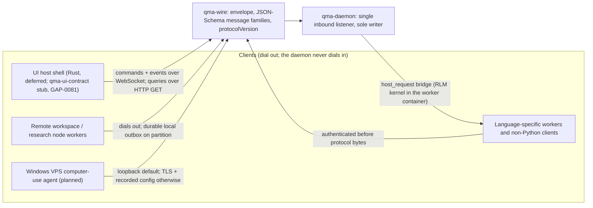

# QMA Wire

`COMP-QMA-WIRE` is the single versioned contract package that joins the `qma-daemon` and its clients — the future UI, language-specific workers and non-Python clients, and plugin halves — as two products over one boundary (DEC-0304). It is `qma-wire` in the `qma.*` namespace (`qma.wire`, package `qma-wire`, imports `qma.wire`, no blanket `qmx.` prefix), a definition-and-schema package that carries the wire envelope, the JSON-Schema message families, the `initialize` handshake and the compatibility law, and holds no runtime state of its own (DEC-0337) (DEC-0304). It depends only on `qma-core` and `qmf-core` and is the only cross-boundary contract package in the QMX agentic system; every plugin half — daemon, worker and UI — meets its counterpart at `qma-wire` and never through shared process memory (DEC-0347).

The wire is the decoupling boundary: commands mutate and are acked immediately with side effects settling asynchronously, queries read durable state, and a durable event stream carries progress, so closing a client never stops an agent and an overnight agent need not know a client exists (DEC-0304). It is the sole compatibility authority — additive-only within a major, unknown types and fields ignored by older clients, deprecations living a configured number of minors then dropped (`registry:wire.deprecation_minors`) — and it binds NOW even though the UI is deferred: the daemon-to-UI wire contract and the AD-26 variables registry are not deferred, because the API needs a client and both sides must bind to a fixed, versioned wire, while `qma-ui-contract` ships only as a stub in v1 (`GAP-0081`) (DEC-0333). Ratification fixes the contract only; no implementation, credential, order or promotion authority is conferred by this document — that arrives solely through the factory pipeline (DEC-0329).

## Authority boundary

May: carry the wire envelope — `v`, `type`, `id`, `producer_id`, `correlation_id`, `scope_path`, an optional `seq` and `payload` — with JSON canonical per `fp1` and every command, query and event family described by JSON Schema and versioned by a semver `protocolVersion` (DEC-0304); carry JSON-RPC 2.0 over WebSocket for commands and events plus HTTP GET for queries, and the MCP-style `initialize` handshake that negotiates `protocolVersion` and capabilities and assigns each connection its `producer_id` (DEC-0304); seed and hold the closed-and-addable registry of the packet's 26 nouns — 9 commands, 7 queries and 10 `noun.verb` events — as the wire vocabulary (DEC-0304) (DEC-0333); carry `wire.attach(scope, since_seq)` / `wire.detach` as client-only scope subscriptions and the read-only session replay `wire.attach(since_seq=0)` over the durable event stream (DEC-0304); carry the `host_request` bridge family the RLM kernel uses, whose verbs each map to exactly one daemon-owned primitive (DEC-0313); describe the idempotency pair `producer_id` plus `id` and the daemon's dedup cursor window `registry:wire.dedup_window` (DEC-0304); carry the `correlation_missing` evidence carve-out (DEC-0304); enforce, as schema, that every authenticated connection carries exactly one principal class and that the human-gate command families are answerable only by an `operator` principal (DEC-0323); and be the single compatibility authority with additive-only-within-a-major evolution and `registry:wire.deprecation_minors` deprecation windows (DEC-0304).

May never: own, write or fold daemon state — `qma-wire` is contract-only and the `qma-daemon` is the sole writer of the journal, the SQLite store and the artifact store (DEC-0304) (DEC-0303); let a client be authoritative for execution state, because snapshots are authoritative and progress events explicitly are not (DEC-0304); open an inbound port on a deployed side — a remote worker or deployed Quant dials OUT to its daemon and the daemon never dials in, so the daemon's own listener is the single inbound port (DEC-0304) (DEC-0336); offer an unauthenticated bind, or a plaintext non-loopback bind — every client authenticates with a Credential-Broker-resolved credential before protocol bytes and either case is a hard startup refusal (DEC-0304) (DEC-0323); put `journal_seq` on the wire as `seq`, use `attach`, `lease` or `envelope` bare, or let one `id` do two jobs (DEC-0304); carry a secret value — the connection credential is itself a broker-resolved reference and secrets travel as references only (DEC-0323); introduce an external relay or an external agent-to-agent transport in v1, which is deferred until a second host or an external counterparty needs the mailbox (`GAP-0079`) (DEC-0304); ship `qma-ui-contract` beyond a stub in v1 (`GAP-0081`) (DEC-0333); re-implement a `qmf` contract across the language boundary — money, time, `fp1` and `correlation_id` never cross a language boundary and non-Python clients attach as clients and re-derive none of them (DEC-0303); or mint any promotion or zone-transition command, since QMA's money-path output is only a candidate artifact a human promotes and every human-gate act requires an `operator` principal (DEC-0323).

## Interfaces

| Interface | Direction | Contract | Peer |
|---|---|---|---|
| The wire contract — envelope, the 9-command / 7-query / 10-event families, `initialize` + `protocolVersion`, `wire.attach` / `wire.detach` / replay, the `host_request` family, `producer_id`+`id` dedup, and principal classes on the connection | out (carried) | [CT-40](../contracts/ct-40-qma-wire-envelope.yaml) | seam `ui → backend`: clients (UI, workers, plugins) to COMP-QMA-DAEMON (DEC-0304) |
| Typed refusals — `CursorScopeMismatch` (AD-5), `UnknownHostRequest` (AD-14), `OperatorPrincipalRequired` and `CredentialOutOfScope` (AD-24) — as variants of `qmf-core`'s typed-refusal base | in/out | [CT-04](../contracts/ct-04-typed-refusal.yaml) | COMP-QMF-CORE, via the `qma-core` refusal variants (DEC-0304) (DEC-0323) |
| Version, fingerprint and format-version values — semver `protocolVersion`, canonical JSON per `fp1`, every message family and record stamping its contract format version | in/out | [CT-05](../contracts/ct-05-version-fingerprint.yaml) | COMP-QMF-CORE (DEC-0304) |

## Behavior

### The wire envelope and `scope_path` (AD-5)

Every wire message carries the wire envelope — `v`, `type`, `id`, `producer_id`, `correlation_id`, `scope_path`, an optional `seq` and `payload`; JSON is canonical per `fp1` (DEC-0304). `id` is unique per message or record and minted by its producer. `producer_id` is the stable identity of the minting client, worker or daemon component, assigned at the `initialize` handshake, unchanged across reconnects, and the first half of the idempotency pair; it is one of the ten names the Consistency Conventions whitelist against the `_ref` law (DEC-0304). `scope_path` is an ordered array of `kind` plus `id` segments in the fixed order desk, quant, mission, task, session, agent, subagent — Session sits between Task and Agent because a Task outlives the session that runs it — every existing ancestor present, filters prefix-matching it, and the order is part of canonical JSON (DEC-0304). One `seq`, one referent: `seq` is always the per-scope projection index of the scope named last in that message's `scope_path`; `journal_seq` (the daemon's single total order) never appears on the wire as `seq` and is opaque to clients (DEC-0304).



### Transport, `initialize` and the compatibility law (AD-5)

Transport is JSON-RPC 2.0 over WebSocket for commands and events, with HTTP GET for queries, and an MCP-style `initialize` handshake that negotiates a semver `protocolVersion` plus capabilities and assigns the connection its `producer_id` (DEC-0304). Every command, query and event family is described by JSON Schema. Compatibility is additive-only within a major: unknown types and fields are ignored by older clients, deprecations live `registry:wire.deprecation_minors` (default 2) minors and then drop, and `qma-wire` is the sole compatibility authority — no other package rules on wire compatibility (DEC-0304). Snapshots are authoritative; progress events are explicitly not, so a client rebuilds truth from a query, never from an accumulated event tape (DEC-0304).

### Transport posture and dial-out reachability (AD-5, AD-24, AD-25)

The daemon binds loopback by default; any non-loopback bind requires TLS — `wss://` plus HTTPS for queries — AND an explicit recorded operator configuration, never a default (DEC-0304) (DEC-0323). Every client authenticates with a credential resolved through the Credential Broker before protocol bytes, and the client credential is itself a broker-resolved reference; an unauthenticated bind, or a plaintext non-loopback bind, is a hard startup refusal rather than a warning (DEC-0323). A remote worker or deployed Quant dials OUT to its daemon and the daemon never dials in: the deployed side holds the daemon's address and its own credential, so no inbound port opens on the deployed side and no external relay is introduced, while the daemon's own listener is the single inbound port and is non-loopback only under the TLS-plus-recorded-configuration rule (DEC-0304) (DEC-0336). A remote or partitioned worker holds a durable local outbox — ordered, fsynced, never a journal, discarded entry by entry on daemon ack — that replays in order on reconnect with the daemon deduping on `producer_id` plus `id`; its depth and spool bytes are the registered variables `registry:wire.remote_outbox_depth` and `registry:wire.remote_spool_bytes`, and on exhaustion the worker blocks the dispatch of new work rather than discarding a pending evidence append, telemetry discarded first (DEC-0304) (DEC-0336).

### Attach, detach and replay (AD-5)

`wire.attach(scope, since_seq)` and `wire.detach` are client state only: attachment never changes an actor's identity and never stops a run, which is what makes closing a client harmless (DEC-0304). A cursor is valid only for the scope that issued it; `wire.attach` interprets `since_seq` in that same scope, and a `wire.attach` carrying a cursor from another scope is refused with the typed refusal `CursorScopeMismatch`, never silently re-based (DEC-0304). Session replay is `wire.attach(since_seq=0)`, read-only over the durable event stream for that scope; the daemon streams the scope's events from the requested `seq` and replay authority stays with the journal (DEC-0304).

```mermaid
sequenceDiagram
  participant C as Client (UI / worker / script)
  participant B as Credential Broker
  participant D as qma-daemon (sole writer)
  C->>B: resolve the connection credential reference (L34)
  B-->>C: credential value (adapter-layer only, never on the wire)
  C->>D: initialize {protocolVersion, capabilities, credential}
  D-->>C: initialize result {producer_id, negotiated protocolVersion, capabilities}
  Note over C,D: authenticated before protocol bytes; connection carries one principal class, operator or machine (DEC-0323)
  C->>D: wire.attach(scope, since_seq)
  D-->>C: durable event stream for that scope from since_seq (seq = per-scope index)
  C->>D: wire.attach(scope, since_seq=0)
  D-->>C: read-only session replay of that scope's events, in journal_seq order
  Note over C,D: attachment is client state; wire.detach or a dropped link never stops the agent (DEC-0304)
```

### The 26-noun seed vocabulary (AD-5)

The wire vocabulary seeds from the packet's 26 nouns as a closed-and-addable registry — new families are added only in `qma-wire`, never coined locally (DEC-0304). Each family is JSON-Schema-described and versioned by `protocolVersion` (DEC-0304).

The 9 commands: start mission; send message; steer agent; stop run; approve hook action; install/enable plugin; update configuration; launch task; retry task (DEC-0304).

The 7 queries: get quant; list missions; get graph state; inspect ledger; inspect trace; list installed plugins; get provider health. The packet's seed noun for the persistent actor was "bot"; the QMX agentic system uses Quant for the persistent named organizational actor, so the query reads "get quant" and Bot is retired for the agentic sense (DEC-0304) (DEC-0331) (DEC-0348).

The 10 `noun.verb` events: `agent.started`; `message.delta`; `tool.started`; `task.completed`; `hook.blocked`; `ledger.updated`; `mission.updated`; `worker.detached`; `provider.cooldown`; `artifact.created` (DEC-0304). Wire events are `noun.verb`; hook events are `before_<verb>` / `after_<verb>` snake_case and are not wire families (DEC-0304).

### Idempotency, dedup and the `correlation_missing` carve-out (AD-5)

Every wire command is idempotent on the pair `producer_id` plus `id`, and the daemon keeps a dedup cursor whose window is the registered variable `registry:wire.dedup_window` (DEC-0304). `correlation_id` has exactly three minting origins — an originating operator command, a scheduled trigger, and a daemon-internal lifecycle act — and from its origin it is copied verbatim onto every downstream command, event, `JobHandle`, ledger append, memory candidate and telemetry span, never regenerated, derived or truncated; a record without one is refused at the gate (DEC-0304). The gate never refuses an evidence append: an append that reaches the daemon without a `correlation_id` is recorded under a daemon-minted lifecycle id annotated `correlation_missing`, because L39 forbids a control blocking the recording of evidence (DEC-0304).

### The `host_request` bridge family (AD-14)

The `host_request` bridge is a `qma-wire` message family, never a second channel: every host call the RLM kernel makes is a wire command or query issued by the worker over `qma-wire` under the Task's `scope_path` and `correlation_id` (DEC-0313). Its verb set is closed-and-addable in `qma-wire`; every verb maps to exactly one daemon-owned primitive and runs that primitive's `before_*` hook, and a host call whose verb maps to no primitive returns the typed refusal `UnknownHostRequest` (DEC-0313). An async spawn returns an AD-17 `JobHandle`, and the RLM kernel's spawn depth is capped at `registry:rlm.depth_cap` (the depth-2 cap) (DEC-0313). The RLM kernel is a persistent Python interpreter inside the Analysis worker's Docker container and never in the daemon process; the bridge is how it reaches the host, and every host call therefore passes the same enforcement surface as any other agent-reachable write (DEC-0313) (DEC-0303).

### Principal classes and the human-gate command families (AD-24)

Every authenticated wire connection carries exactly one principal class, `operator` or `machine`, recorded verbatim on every command, journal entry and ledger entry (DEC-0323). The `operator` class comes only from an interactive human credential presented by a client a human is driving; workers, plugin worker halves, remote deployments, the scheduler, routines and cron, and every daemon-internal caller are `machine`, and no machine principal may acquire, delegate, borrow, cache or impersonate the operator class (DEC-0323). The human-gate commands are accepted only from an `operator` principal and refused from a `machine` principal with the typed refusal `OperatorPrincipalRequired`; this list is closed-and-addable and is the sole authority on which commands require that principal, extended only by a spine amendment (DEC-0323). The list is: AD-22's admission approval; AD-21's forward-only migration confirmation; AD-17's UNKNOWN resolution; every retention trim other than the two AD-23 daemon-job trims (the mailbox delivery projection and the telemetry store, inside their registered AD-26 retention windows); plugin install, enable or reload; `desk.create` and `quant.create`; a `role.base` write via `role.set_base`; `model_family` assignment; `tool_adapter` writes; a restore of the live store; a Routine catch-up; reading or answering an `approval_request` in the daemon-held operator approval queue; a `desk.moved` membership change; a Quant record write, its `WakePolicy` included; a Routine record write; an `ExecutionEnvironment` declaration write; a Mission `approval_route` write; a `variable.set` on a `registry`-homed AD-26 variable; and an AD-13 `human_gate` answer (DEC-0323). A `money_path_relevant` candidate may pass only a `human_gate` node, and the daemon refuses to emit its `approval_request` unless the payload carries a field-level diff of exactly the money-path fields under a named `qma-wire` schema — the wire carries the diff, never an order, a binding or a sizing decision (DEC-0313) (DEC-0323). A plugin's own contributions reach the definition store through activation as a `machine` principal and are deliberately not on the human-gate list; only their operator-assigned fields — `model_family` and the `tool_adapter` desk-and-role binding — appear on it (DEC-0323).

### The deferred UI contract (AD-5)

`qma-ui-contract` ships as a stub only in v1 (`GAP-0081`): the UI presentation architecture, the Rust extension technology, the UI SDK surfaces, the UI contribution points and UI plugin packaging are a later session's work, revisited once the daemon API is live and stable (DEC-0333). The wire contract and the AD-26 variables registry are not deferred and bind now, because the UI may be live by the time epics are coded and both sides must bind to a fixed, versioned wire; Profile records are client state that no daemon read or store touches, specified in that later session (DEC-0333) (DEC-0337).

## Configuration

The registry is the arbiter of each value; this spec references keys and never restates a literal. Each row is a UI-editable, registry-homed AD-26 variable set only by an `operator`-principal `variable.set` command (DEC-0323).

| Variable | Registry key | Notes |
|---|---|---|
| Wire deprecation window | `registry:wire.deprecation_minors` | Minors a deprecated type or field lives before it drops; default 2; evolution is additive-only within a major and `qma-wire` is the sole compatibility authority. [DEC-0304] |
| Wire dedup window | `registry:wire.dedup_window` | The daemon's dedup-cursor window over the `producer_id` + `id` idempotency pair; every wire command is idempotent on that pair. [DEC-0304] |
| Remote outbox depth | `registry:wire.remote_outbox_depth` | Max entries a remote worker's durable outbox holds; on exhaustion the worker blocks new dispatch rather than discarding a pending evidence append (L39). [DEC-0304] [DEC-0336] |
| Remote spool bytes | `registry:wire.remote_spool_bytes` | Max on-disk bytes of a remote worker's outbox spool; under back-pressure telemetry is discarded before evidence. [DEC-0304] [DEC-0336] |
| RLM host_request depth cap | `registry:rlm.depth_cap` | The depth-2 cap on `host_request` async spawn from the RLM kernel; each spawn returns an AD-17 `JobHandle`. [DEC-0313] |

## Failure modes

| # | Condition | Behavior | Cites |
|---|---|---|---|
| FM-1 | A `wire.attach` carries a cursor minted for a different scope. | Refused with the typed refusal `CursorScopeMismatch`; a cursor is valid only for the scope that issued it and is never silently re-based. | DEC-0304 |
| FM-2 | The RLM kernel issues a `host_request` whose verb maps to no daemon-owned primitive. | Returns the typed refusal `UnknownHostRequest`; a mapped verb instead runs that primitive's `before_*` hook. | DEC-0313 |
| FM-3 | A `machine` principal sends a human-gate command (admission approval, a `human_gate` answer, plugin install, `desk.create`, a `role.base` write, and their siblings). | Refused with `OperatorPrincipalRequired`; the human-gate list is closed-and-addable and is the sole authority on which commands require the `operator` principal. | DEC-0323 |
| FM-4 | A non-loopback bind is attempted without TLS and a recorded operator configuration, or any unauthenticated or plaintext non-loopback bind. | A hard startup refusal, never a warning; the daemon binds loopback by default and authenticates before protocol bytes. | DEC-0304, DEC-0323 |
| FM-5 | A duplicate wire command arrives with the same `producer_id` + `id` within the dedup window. | Idempotent: the daemon's dedup cursor drops the duplicate; the window is `registry:wire.dedup_window`. | DEC-0304 |
| FM-6 | An evidence append reaches the daemon with no `correlation_id`. | Recorded under a daemon-minted lifecycle id annotated `correlation_missing` and never refused — L39 forbids a control blocking the recording of evidence. | DEC-0304 |
| FM-7 | An older client receives an unknown type or field introduced by a newer minor. | Ignored by the older client; compatibility is additive-only within a major, and deprecations live `registry:wire.deprecation_minors` minors then drop. | DEC-0304 |
| FM-8 | A client closes mid-run, or a remote worker's link drops with unsent evidence. | Closing a client never stops an agent; the remote worker's durable outbox replays in order on reconnect and the daemon dedups on `producer_id` + `id`; an environment lost with a non-empty outbox marks that Task's ledger `unknown_tail` at the last acked `id`. | DEC-0304, DEC-0336 |
| FM-9 | A connection presents a credential reference not on the broker's allowlist. | Refused with `CredentialOutOfScope` naming the reference; venue, broker, exchange, trading-node and platform-registry credentials are outside QMA's namespace and resolvable by no QMA component. | DEC-0323 |

## Related

Decisions: [DEC-0304](../../_docwork/ledger.yaml) (AD-5, the daemon-to-UI wire contract, envelope, transport posture and `correlation_id` origins), DEC-0303 (AD-4, one Python daemon; workers and non-Python clients over the wire; the RLM kernel over `host_request`), DEC-0313 (AD-14, the `host_request` bridge family, session axes and handle kinds), DEC-0323 (AD-24, principal classes, the human-gate command list, secret custody and transport custody), DEC-0333 (build order — the wire binds now while the UI extension SDK is deferred), DEC-0336 (deployment envelope, dial-out reachability, no QMA command line), DEC-0347 (dependency direction — `qma-wire` depends only on `qma-core` and `qmf-core`; plugin halves meet only at `qma-wire`), DEC-0337 (the `qma.*` namespace, no blanket `qmx.` prefix). Adoption: DEC-0329 (QMA spine AD-1..AD-29 adopted in full; validation closed dry 2026-08-29). ADRs: [ADR-0020 QMA agentic system](../decisions/ADR-0020-qma-agentic-system.md). Scenarios: [SCN-0013 a Quant reachable through models over the wire](../scenarios/SCN-0013-quant-over-the-wire.md), [SCN-0014 the money-path reachability barrier](../scenarios/SCN-0014-money-path-barrier.md). Peers: [COMP-QMA-CORE](qma-core.md) (defines the wire refusal variants, the handle kinds and the closed vocabularies the wire serializes), [COMP-QMA-DAEMON](qma-daemon.md) (the sole writer that answers every command, query and `host_request`), [COMP-QMF-CORE](qmf-core.md) (money, time, `fp1`, `correlation_id` and the typed-refusal base, none re-derived across the language boundary). Deferred and open: external agent-to-agent transport (`GAP-0079`); the UI presentation architecture and the `qma-ui-contract` package beyond a stub (`GAP-0081`); an interactive walkthrough artifact for this spine (`GAP-0091`). Knowledge: none drafted.
