# QMF V1 Architecture Overview

QMF V1 is a contracts-first Python toolbox consumed by QMX applications. QMF provides five reusable libraries and two modules; it does not provide an application loop, scheduler, product UI, backtesting library, or trading-node runtime. Everything downstream of QMF — the trading node, backtesting, the agentic system, and the product UI — is built with QMF libraries rather than re-implementing or bypassing its contracts. The backtesting library named there is now specified: it is QMB, the QMX experimentation/backtesting product (one pure library plus the `qmb` CLI) that composes the QMF backend libraries as an application-layer consumer outside QMF V1 — detailed under [Application-layer consumer — QMB](#application-layer-consumer--qmb) below and in `docs/decisions/ADR-0017`. A second application-layer consumer, QML — the QMX bot-authoring library — is likewise specified: it authors the Bot-domain registry artifacts (CT-33 Bot definition, CT-34 confluence) and the bot runtime protocol on the QMF backend, detailed under [Application-layer consumer — QML](#application-layer-consumer--qml) below and in `docs/decisions/ADR-0018`. A third named application-layer consumer, the **trading node** (COMP-QMN, code name `qmn`), is the Phase-2 trading runtime that takes the live venue edge QMB and QML never take: a supervised composition-root runtime over the pure QMF/QMB/QML rulebook, one product with two modes `paper | live`, the sole sanctioned wirer of `qmf-venue`, detailed under [Application-layer consumer — the trading node](#application-layer-consumer--the-trading-node) below, in `docs/components/trading-node.md`, and in `docs/decisions/ADR-0019-trading-node.md`. A further named application-layer consumer, the **QMX agentic system (QMA)** — a daemon, the QMA SDK (QuantMind Agents) and a wire contract — is likewise specified: a single Python asyncio daemon that runs organizational agents (Quants) built ON the QMF backend, reaching the money path only as a candidate artifact a human promotes and never as an order, sizing decision, or binding, detailed under [Application-layer consumer — QMA (the QMX agentic system)](#application-layer-consumer--qma-the-qmx-agentic-system) below and in `docs/decisions/ADR-0020-qma-agentic-system.md`. (DEC-0008, DEC-0009, DEC-0022, DEC-0024, DEC-0122, DEC-0159, DEC-0171, DEC-0184, DEC-0186, DEC-0259, DEC-0329, DEC-0330, DEC-0333)
## Design paradigm

QMF is a **contract-hub library workspace, hexagonal at workspace scale.** `qmf-core` is the dependency-free hub carrying only definitions — exact value types, domain nouns, typed refusals, fingerprints, and protocol seams. Every other package depends inward on `qmf-core`; runtime concerns (clocks, market-hours calendars, venues) enter through protocols the core defines and outer packages or calendar extensions implement. Nothing in QMF is an application; applications are built *with* it, outside this repository's scope. (DEC-0022, DEC-0100, DEC-0104, DEC-0120)

## Package shape — one repo, seven packages

QMF V1 is a single repository organized as a uv workspace with seven installable packages — `qmf-core`, `qmf-registry`, `qmf-data`, `qmf-indicators`, `qmf-structure`, `qmf-venue`, `qmf-risk` — importing under the `qmf.*` PEP 420 implicit namespace. No distribution ever contains `qmf/__init__.py`; every package uses `src/` layout (`src/qmf/<name>/`); every dependency, including sibling packages, is declared explicitly; the build backend is `uv_build`; one `uv.lock` is committed; and the seven roster packages release in lockstep SemVer. Shared nouns (Venue, Account, Instrument, WriterId) are defined in `qmf-core` and their records owned by `qmf-registry`. Calendar extensions (for example `qmf-calendar-forex`) are separate versioned packages outside the roster, in the same workspace, on their own SemVer ladder. (DEC-0100)

## Dependency direction (ratified)

The dependency graph is a governed artifact under a **default-deny** rule: `qmf-core` depends on nothing; every package may depend on `qmf-core`; and until an inter-library edge is ratified as a spine amendment, no package may depend on any package other than `qmf-core`. One inter-library edge is ratified — `qmf-registry → qmf-data` (2026-08-20) — through which the registry persists records and lineage via qmf-data's CT-11 append-store contract, with stdlib-typed signatures at that boundary. Nothing imports `qmf-venue` or `qmf-risk`: they are edge modules. Calendar extensions implement core protocols from outside the roster. (DEC-0120)

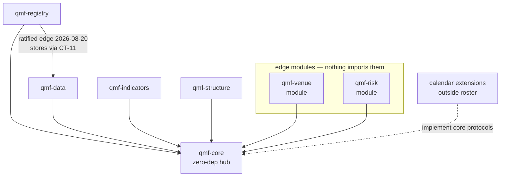

This ratified direction governs package import dependencies. Adding any further edge is a spine amendment. The venue write path adds **no** edge: `qmf-venue` emits through `qmf-core`-defined sink protocols (`ObservationSink`, `JournalSink`, `RecordSink`, `SecretStore`) injected at the composition root, with the adapter's connection manager holding the `WriterId` and seeing every sink refusal. (DEC-0120, DEC-0138, DEC-0141)

The trading node (COMP-QMN) sits at the top of the import graph, outside the QMF roster and outside QMB and QML. It depends on the QMF roster — `qmf-core`, `qmf-registry`, `qmf-data`, `qmf-indicators`, `qmf-structure`, `qmf-venue`, `qmf-risk` — on `qmb`, on `qml`, and on the registered market-hours, day-boundary, news-calendar, and producer extensions (registered explicitly, never scanned); **nothing imports `qmn`**. `qmb` and `qml` keep their `qmf-venue` ban unchanged. The node's composition root is the **one sanctioned importer and wirer of `qmf-venue`** in the platform, because AD-28 requires a composition root to construct the adapter and the node is the only one that touches live money — a genuine conflict between two ratified parent rules that the node surfaced rather than settled. The documentation factory annotates constitution rule L30 **at source** to record it: the writable boundary of the sanction is the `qmn.venue` subpackage, not the root module alone, and the L30 default-deny lint is written against that boundary, so every other `qmn` module receives `VenueClientPort` and CT-19/CT-20 shapes only. Adding any other node edge is a spine amendment. (DEC-0186, DEC-0196, DEC-0241, DEC-0259)

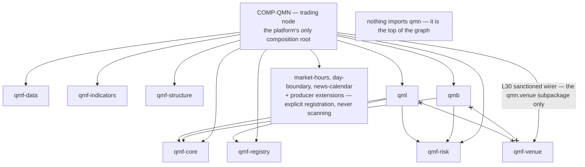

## Clock injection seam

No component below the composition root reads the system clock. Clock access is a core-defined protocol; the application's composition root injects the real system clock for `world = live`, or a data-driven replay clock (a pure function of the data cursor) for `world = replay`. Every QMF component below the root receives the injected clock and never touches the system clock directly. (DEC-0106)

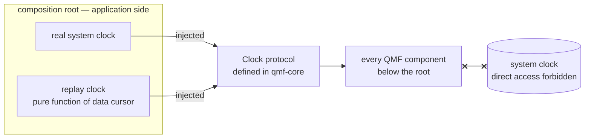

## C4 Level 1 — system context

The QMF system sits between QMX application code and external venue, market-data, news-calendar, and backup systems. Every external data exchange crosses a declared `CT-*` contract; operator interaction belongs to QMX rather than a QMF UI. QMB is the first named application-layer consumer: it composes the QMF backend libraries in `world = replay`, produces CT-32 results and CT-13 journal streams, and takes no venue edge — live wiring is trading-node territory. (DEC-0159, DEC-0163)

The **trading node** (COMP-QMN, code name `qmn`) is the Phase-2 application that occupies that trading-node territory, and the context diagram below places it. It is one product with two modes `paper | live` (DEC-0186, DEC-0259). The operator reaches it from the workstation today and, in Phase 3, from a desktop UI over an SSH tunnel to the node's localhost- and socket-bound doors — the node ships **no operator command line** (DEC-0202, DEC-0211). It holds the platform's only live venue edge, connecting to the cTrader demo and live hosts (DEC-0196); it takes the Forex Factory free weekly file as the **sole** V1 news-calendar source, with no paid fallback slot anywhere (DEC-0214); it pushes nightly encrypted, versioned, ciphertext-only backups to the off-machine object-storage bucket (DEC-0188); and it exports metrics and JSON logs to a **separate, zero-authority observability stack** that consumes them and can never write to the node, hold a credential the node holds, or appear on any decision, command, or evidence path (DEC-0200, DEC-0212).

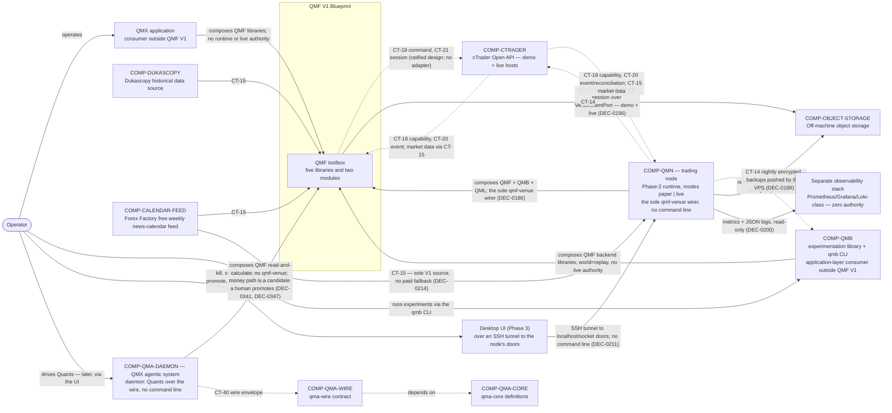

## C4 Level 2 — containers and support seams

The public roster is the five libraries and two modules in DEC-0024. `roster_role` in `docs/architecture/dependencies.yaml` records that membership independently from component kind and layer. `COMP-QMF-DATA-INGEST`, `COMP-QMF-DATA-STORE`, and `COMP-QMF-DATA-BACKUP` are internal seams of `qmf-data` that separate middleware, backend policy, and physical data responsibilities; they do not enlarge the public roster.

Package import dependencies follow the ratified default-deny direction above (DEC-0120): `qmf-core` depends on nothing, every package may depend on `qmf-core`, and `qmf-registry → qmf-data` is the only ratified inter-library edge. The CT-labeled arrows below depict contract interactions and governed data flows — which the application mediates through core-defined protocols and dependency injection — not additional package import edges.

The trading node (COMP-QMN) adds its own containers and processes at the application layer, composed over the QMF blueprint and shown as a subgraph below. Its runtime pieces are: `qmn.service`, one long-lived systemd process hosting the live loop, the venue client, and the recording duties (DEC-0189); four scheduled **timer units** — `qmn-news-calendar.timer`, `qmn-backup`, `qmn-restore-sample.timer` (nightly sample restore), and `qmn-restore-full.timer` (monthly full restore) — each writing under its own `WriterId` (DEC-0198, DEC-0201); the **hot rooms** per world (ingest door, immutable raw archive, processed, journal); the always-on **evidence tier** per world, holding the node-minted `sealed-archive` role the one-way sync writes into, the research door, and the registry room (DEC-0188); the **passive hub** — a write-only inbox and a read-only published area, a tree separate from the rooms (DEC-0188); the **three doors** — the in-process Python API, the localhost HTTP evidence channel, and the unix-socket powers channel guarded by `SO_PEERCRED` (DEC-0202); and the node-minted **`VenueClientPort`**, the neutral seam over CT-19/CT-20 through which the node reaches `qmf-venue`'s `ConnectionManager`, the sole session owner and in-memory venue-secret holder (DEC-0196). A separate zero-authority observability stack consumes the node's `/metrics` and JSON logs and never writes back (DEC-0200, DEC-0212).

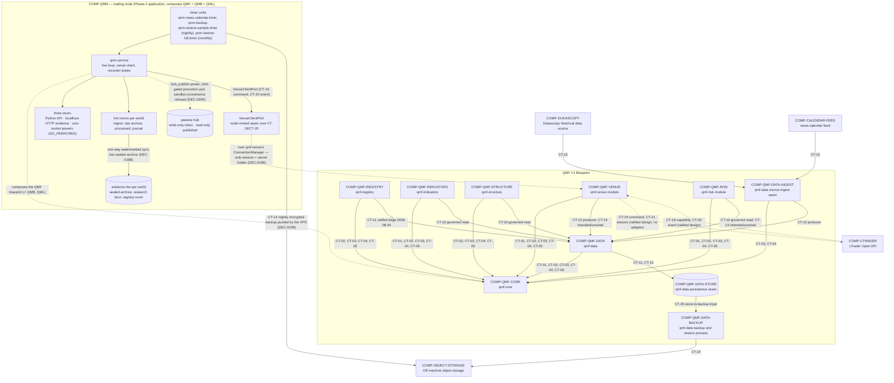

## Layer view

QMF V1 has active middleware, backend, data, and external layers. QMF V1 has no UI layer. Arrows show the relevant contract interaction; `docs/architecture/dependencies.yaml` remains authoritative for `depends_on`, and package import dependencies follow the ratified default-deny direction (DEC-0120).

The trading node (COMP-QMN) is classified at the **middleware** layer — the application-composition lane COMP-QMB and COMP-QML occupy — as an application-layer consumer built ON QMF, outside QMF V1's own layers and not drawn in the QMF-scoped diagram below (as QMB and QML are not): it wires the middleware and backend parts and sits above them, and its three doors are the contracts a Phase-3 desktop UI layer consumes later over an SSH tunnel (DEC-0186, DEC-0202).

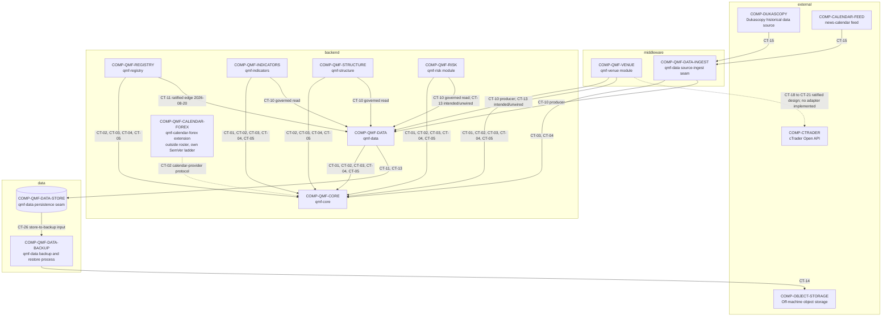

## Worlds and namespace isolation

Every computed result entering evidence carries a **world**, one of the identity parts of a result label (which also carries producer contract identity and evidence class per DEC-0131). Three worlds exist: `live` (real venue clocks and quotes — the account role, not the world, carries money-reality, so paper and demo runs are `world = live` and stay comparable to live for alpha-decay sensing); `replay` (a data-driven injected clock over recorded history, implementable today); and `simulated` (synthetic data, reserved but unusable in V1 — writing `world = simulated` into governed evidence is a `policy rejection` typed refusal until the backtesting sitting defines simulated-time typing). A non-live world may never write into the live evidence namespace, and factory sandboxes never produce timestamps that enter an evidence store. Identity distinctness alone does not deliver world separation — storage separation does. (DEC-0110, DEC-0131)

## Data rooms per world

`qmf-data` defines eight room-roles — ingest door, immutable raw archive, processed, journal, split-governed research door, backup, the registry room (holding `qmf-registry`'s records and lineage under the same retention, backup, and migration law), and `sealed-archive` (the eighth, the node's evidence-tier role, added per world by the 2026-08-28 trading-node sitting under the same law — DEC-0253). The room-roles are **instantiated per world**, and a read that crosses worlds is a `policy rejection` refusal. Stores are Parquet (columnar time-series), DuckDB (local analytics), SQLite (transactional metadata), and JSONL (append streams), each behind a QMF-owned contract with stdlib-typed boundary signatures and no database server. Only raw-archive and journal formats are evidence-bearing; analytics engines hold rebuildable views. (DEC-0117)

## Concurrency stance

QMF values are immutable and safe to share by construction; purity binds the pure-computation libraries (core, indicators, structure). Components that own an external resource — stores, recorders, adapters — are the stateful class and follow **one-writer-per-stream with unlimited readers**, where the writer is the holder of an AD-8 WriterId. QMF never spawns threads or background work: the application owns all concurrency. Async APIs exist only at the venue network edge, never in `qmf-core` or the libraries. (DEC-0113)

## Runtime and data shape

QMF has no autonomous startup or orchestration path; a later QMX application composes the libraries and injects the clock at the composition root. CT-18 through CT-21 carry the **ratified venue design** (AD-26 through AD-28) — one neutral port and four contracts that per-venue adapters implement and the composition root wires, with no adapter yet implemented; CT-22 through CT-25 and CT-27 through CT-32 are the **ratified Risk boundaries** (AD-29 through AD-41), filled and minted at format version 1 as `defined-unwired` surface that the composition root wires with no new package edge; and CT-26 is the internal Store-to-Backup input boundary. (DEC-0008, DEC-0009, DEC-0022, DEC-0136, DEC-0137, DEC-0138, DEC-0143, DEC-0158)

External observations enter through `COMP-QMF-DATA-INGEST` or `COMP-QMF-VENUE`, which produce CT-10 into `COMP-QMF-DATA`. Governed readers reach data through `COMP-QMF-DATA` rather than bypassing it. CT-15 is only the external-source adapter boundary into `COMP-QMF-DATA-INGEST`; it is not a `COMP-QMF-DATA` interface. Every external fact carries event-time, known-at, source, and revision, where source is a core provenance noun orthogonal to VenueId, and corrections are appended, never overwritten. `qmf-data` defines source contracts, normalization, validation, and idempotent intake keyed on (source, source-native id, revision); applications own scheduling, retries, supervision, and UI. (DEC-0117, DEC-0119)

`COMP-QMF-VENUE`'s design is ratified (AD-26 through AD-28). One neutral port carries four contracts on `qmf-core` nouns: capability (CT-18), command (CT-19), event and reconciliation (CT-20), and secret/session (CT-21, shaped by the AD-26 secret lifecycle). The command stream — the unit of `UNKNOWN` blocking, `WriterId` ownership, and the gapless per-writer sequence — is the (VenueId, account) pair; the five command kinds are `place_order`, `cancel_order`, `close_position`, `close_all`, and `amend_protection` — the fifth minted by the risk sitting (DEC-0148) — and every well-formed submission resolves to one of four outcomes with `UNKNOWN` a recorded state, never an error. The adapter's connection manager owns venue sessions and emits through the `qmf-core`-defined sink protocols injected at the composition root, so the venue write path adds no dependency edge and the writer sees every sink refusal. Market data has a named home: ticks, bars, depth, gap-replay backfill, and historical paging enter as CT-10 source observations through `qmf-data`'s CT-15 intake — application-mediated, no fifth contract, no new edge. cTrader is the first adapter target; its ratified venue facts and the platform-versus-broker split live in `docs/components/ctrader.md`. (DEC-0135, DEC-0136, DEC-0137, DEC-0138, DEC-0139, DEC-0141)

`COMP-QMF-REGISTRY` uses per-kind record schemas — each its own versioned contract — sharing a tiny common header of kind, contract format version, at-birth parent references, writer, and sequence; a record's stable id is derived from its `fp1` fingerprint, never minted, so identical work from two sandboxes deduplicates. Lineage accruing after birth lives exclusively in append-only typed edge records (supersedes, promoted-from, occurrence-of, corroborates, disagrees-with) stored as pinned JSONL; indexes are local and rebuildable; no database server exists. The registry reserves a promotion-occurrence card kind whose mandatory plain-words summary is an identity field, and V1 signing is the operator's recorded approval attesting the record's `fp1`. (DEC-0114, DEC-0116)

`COMP-QMF-DATA` owns split, holdout seal, evidence, and journal policy; the data layer owns physical persistence and backup mechanics. Dataset splits are fingerprinted, time-ordered, non-overlapping manifests, each pinning exactly one calendar identity and version in-band; the 12-month seal is a no-peek lock enforced now as a `policy rejection` refusal at every `qmf-data` read boundary, independent of the deferred causality gates. The journal is N append-only streams — one per producing component under its WriterId — recording seven event types (decision, order, fill, risk transition, promotion, data quality, control action). Migrations run preflight checks, backup first, dry-run, migrate, verify; the ratified backup design is nightly, encrypted, versioned, off-machine, with QMF providing the backup/restore/verify primitives (CT-14, CT-26) and applications owning the schedule; numeric recovery objectives await the node/ops sitting. (DEC-0117, DEC-0118, DEC-0119)

The look-ahead causality registration gate (`GAP-0016`) and the attempt counter (`GAP-0017`) stay operator-deferred, with the consequence knowingly accepted that artifacts registered before then carry no causality evidence; the bitemporal ingredients (event-time versus knowledge-time) remain ratified. Look-ahead *prevention* is now delivered structurally inside a QMB run (forming-bar rules, split-manifest enforcement, declared stream sets); only the CT-08 registration gate and the counting policy remain deferred. (DEC-0121, DEC-0169)

`COMP-QMF-RISK` is present in the public roster and its design is **ratified** (AD-29 through AD-41). It owns the Book/BMS binding chain — the BMS is the account-facing supervising layer, one BMS instance per account serving many Books, a Book binds exactly one BMS, and a Bot binds exactly one Book (DEC-0143) — plus template-and-versioning discipline (DEC-0144), journals-as-projections (DEC-0145), three-layer admission (DEC-0146), Book-owned exit policy with Bot proposals through the CT-23 door (DEC-0147, resolving DEC-0067), paper as a Book-level standing evidence state (DEC-0149), control actions with the kill switch versus kill line split (DEC-0150), same-tick priority per command stream (DEC-0151), protection windows (DEC-0152), SQS V1 (DEC-0153), the R/dimensional law (DEC-0154), and the exit-record and bench evidence base (DEC-0155). The risk sitting adds **no** package import edge: `qmf-risk` depends only on `qmf-core`, its record kinds are `qmf-core` value types wrapped into registry records by the composition root, and control-action dispatch reaches the venue through the same `qmf-core`-defined sink protocols the venue write path uses (DEC-0158). CT-22 through CT-25 are filled and CT-27 through CT-32 are minted at format version 1 as `defined-unwired` surface; every recovered number is a configurable UI-editable variable with no ratified spine value (DEC-0157), and implementation authorization arrives only through the factory pipeline. Trading-node runtime matter stays out of these docs, referenced through `tracker/trading-node-notes.md` as a pointer only (DEC-0142). (DEC-0143, DEC-0147, DEC-0150, DEC-0158)

## Application-layer consumer — QMB

QMB is the QMX experimentation/backtesting product and the first named application-layer consumer built on the QMF foundation: one pure library plus the `qmb` CLI shipped in one wheel, an application-layer product built ON QMF, never a QMF roster package (DEC-0159). It composes the six backend QMF libraries — `qmf-core`, `qmf-registry`, `qmf-data`, `qmf-indicators`, `qmf-structure`, and `qmf-risk` — as a composition root, and is the first sanctioned place the defined-unwired risk contracts are legally wired, in `world = replay` only (DEC-0169). It realizes the reserved "future backtesting library" slot; the Simulator stays a separate deferred UI product that will consume QMB, not QMF directly (DEC-0159).

QMB takes **no** edge to `COMP-QMF-VENUE`: live venue wiring is trading-node territory, and replay execution binds QMB's own fill, cost, and financing ports instead (DEC-0164). The library's `run()` is pure and returns a CT-32 performance-result; one impure orchestrator owns all writes — per-run operational logs during the run and exactly one WriterId-scoped ledger line at completion (DEC-0161). Run outputs adopt existing contracts: the result artifact is a CT-32 with declared chart-series and trade-event-reference extensions, and run trading events ride CT-13 journal events on writer-scoped streams in the run's world (DEC-0163). Registry state reaches QMB as immutable fingerprinted **as-of sets** over a passive file-sync hub — dumb storage, never a central service (DEC-0165).

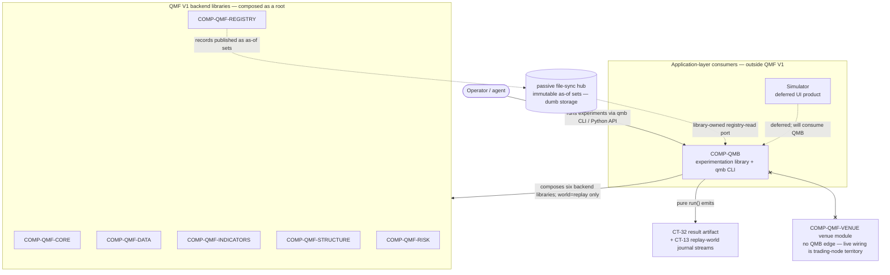

## Application-layer consumer — QML

QML is the QMX bot-authoring library and the second named application-layer consumer built on the QMF foundation: one uv-installable pure library (`import qml`), an application-layer product built ON QMF, never a QMF roster package (DEC-0171). Its whole surface is three thin things — author-side types and helpers producing the Bot-domain registry artifacts (the CT-33 Bot definition and the CT-34 confluence, qmf-registry kinds it fills), the bot runtime protocol hosts invoke, and the conformance gate. A governed bot is exactly two artifacts, the CT-33 declaration plus plain-Python logic conforming to the runtime protocol, and the `.qml` DSL is not revived in V1 (DEC-0172, DEC-0173, DEC-0175). QML depends inward on exactly three backend libraries — `qmf-core`, `qmf-registry`, and `qmf-risk` (CT-23/CT-29 types) — and never imports `qmf-venue`; the default-deny direction is read **roster-scoped**, so an application-layer product built on the workspace may consume qmf-risk contracts at its own composition root, the reading the QMB precedent already exercises (DEC-0171, DEC-0184; QMB precedent DEC-0169). Registration rides AD-25's root-mints write path: the composition root holds the `WriterId` and mints the Bot-domain records while `qml` stays pure (AD-15) and returns fingerprintable content, never stamped records. QML builds before the trading node and may build alongside QMB — QMB binds conformant bots through a runtime-protocol adapter at its composition root the day QML lands (DEC-0177, DEC-0180). CT-33/CT-34 mint as qmf-registry kinds and CT-06 updates for the Bot kind body and the strategy-family record kind; the CT-22 admission and CT-23 intent contracts take AD-5 format-version-2 mints (DEC-0181, DEC-0182). Conformance is technical never performance — two layers plus a ticket that gates evidence citation and Book seats, never tunnel entry — and admission-bar thresholds stay GAP-0048/0049 (interfaces only). (DEC-0171, DEC-0177, DEC-0178, DEC-0180, DEC-0184)

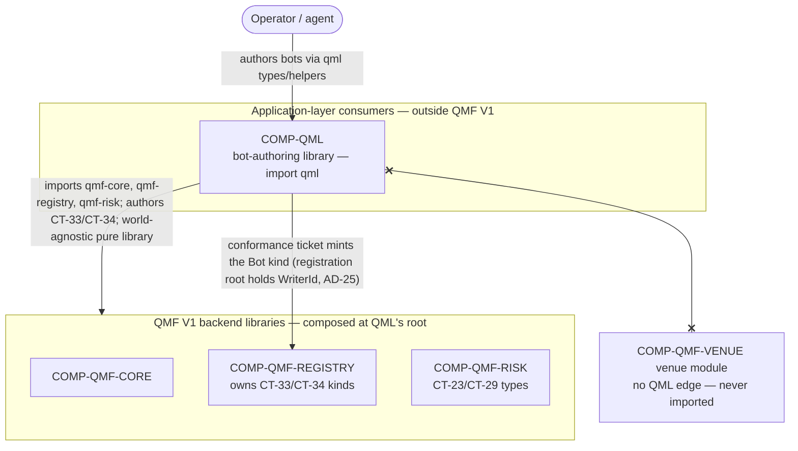

## Application-layer consumer — the trading node

The trading node is the QMX Phase-2 trading runtime and the third named application-layer consumer built on the QMF foundation: one distribution (a library plus its doors) under the code name `qmn`, an application-layer product built ON QMF exactly as QMB and QML are, never a `qmf.*` roster package and never a framework — the operator declined to rule the product name, so `qmn` is the import and distribution code name only and a rename is mechanical (DEC-0186, DEC-0259). It is a **supervised composition-root runtime over a pure rulebook**: the node is the only place ambient time, broker sessions, secret values, async, threads, processes, schedules, and real money exist, and everything below it stays pure (DEC-0187). It composes the full QMF roster, drives QMB's `run_slice` event-slice loop unforked, and hosts QML-conformant bot seats — the **sole sanctioned wirer of `qmf-venue`** in the platform (DEC-0186, DEC-0190). It is **one product with two modes** `paper | live`, never a separate "paper" product and never a separate "live" product (DEC-0186).

The node has **no operator command line** (DEC-0211): its control surface is the desktop UI over three doors — the in-process **Python API**; the **localhost HTTP evidence channel** (publish-never-act, authority-free, refusals returned as evidence); and the **unix-socket powers action channel** guarded by `SO_PEERCRED` with two declared peer principals, operator and ops, neither of them the `qmx` service account (DEC-0202). Every trading, protection, promotion, activation, settings-edit, `resurrect`, attestation, and countersign power is refused to the ops principal by the transport. The desktop UI reaches these localhost- and socket-bound doors over an SSH tunnel in Phase 3; QMB's `qmb` CLI stays the platform's single command-line surface, unchallenged (DEC-0186).

Deployment and provisioning run through an **operations toolkit** of `just node-…` recipes — install, switch, rollback, the secrets provisioning wizard, the data bootstrap, replay, config init/validate/explain, notify test, hub publish, and the host-loss restore rehearsal — DevOps tooling that is never a trading control: a recipe needing live node state makes the same door call the UI makes, under the ops principal, and no recipe places, cancels, amends, flattens, promotes, or activates anything (DEC-0201, DEC-0202). Promotion to live and activation are **two separate human acts, each a click** on the UI, with the precondition battery running silently server-side against fresh state, and the promotion pull refuses any artifact carrying `provenance = sandbox` (DEC-0205, DEC-0213). The node exports metrics and JSON logs to a **separate, zero-authority observability stack** (Prometheus/Grafana/Loki-class) — the only place containers are permitted in the design, while the node itself stays a plain systemd service — which consumes signals and can never write to the node or hold a credential it holds (DEC-0200, DEC-0212). It takes the Forex Factory free weekly file as its **sole** V1 news-calendar source with no paid fallback slot anywhere (DEC-0214), and its config surface is **UI-editable by design**: the registry holds schema, the resolved config artifact holds values, and a settings edit mints a new config version and schedules a restart at a safe point rather than a hot reload (DEC-0203).

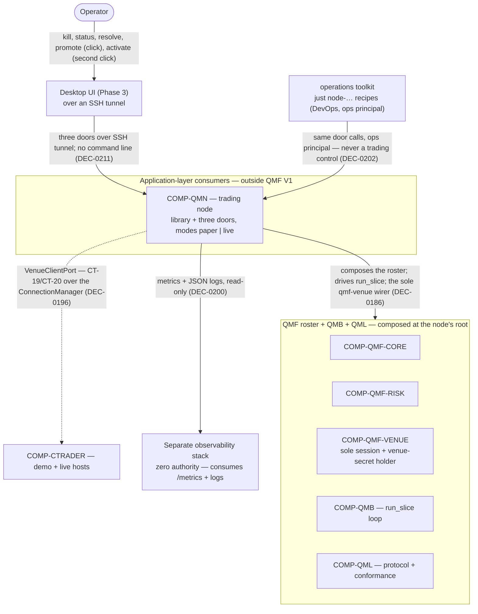

## Deployment view — the trading node

The trading node's deployment is **three planes, two machines, and one bucket** (DEC-0188). The **VPS plane** (Ubuntu 24.04 LTS x86-64, always on) runs everything that touches live money and is the only plane holding live venue credentials: `qmn.service` and the four timer units under the fixed `User=qmx` service account, the code installed at `/opt/qmx` as immutable per-commit trees under an atomically flipped `current` symlink, the writable state under `/var/lib/qmx/{rooms, evidence, hub-inbox, hub-published, archive, state, staging}`, the powers socket at `/run/qmn/powers.sock`, and — as a **sixth checked-in unit that is NOT one of the node's** — `qmx-observability.service`, running under its own distinct non-`qmx` account with storage at `/var/lib/qmx-observability` (DEC-0201, DEC-0188, DEC-0200). The **workstation plane** (Windows 11 now, Linux later) holds a **provisioning-only** installation of `qmn`, never a live venue credential: Windows Credential Manager `qmx/*` as the provisioning source and the escrow home of the CT-14 backup payload key, the provisioning wizard that delivers bootstrap material over SSH stdin, and the future desktop UI (DEC-0197, DEC-0188). The **bucket** takes nightly encrypted, versioned, ciphertext-only copies pushed by the VPS, never by the workstation (DEC-0188). Exactly two inbound crossings exist and no others: the **click-gated promotion pull** from the passive hub's published area, which refuses any artifact carrying `provenance = sandbox`, and the **sandbox fragment push** into the write-only inbox over a confined key-only SSH identity distinct from the operator's key (DEC-0188, DEC-0205). The VPS reaches the **cTrader demo and live hosts** over VenueClientPort, and emits an outbound alive-ping to an **off-VPS liveness-heartbeat watcher** (formerly the dead-man's switch) — the one signal a dead process or a dead VPS cannot send for itself, notification only and holding zero authority (DEC-0196, DEC-0200, DEC-0261).

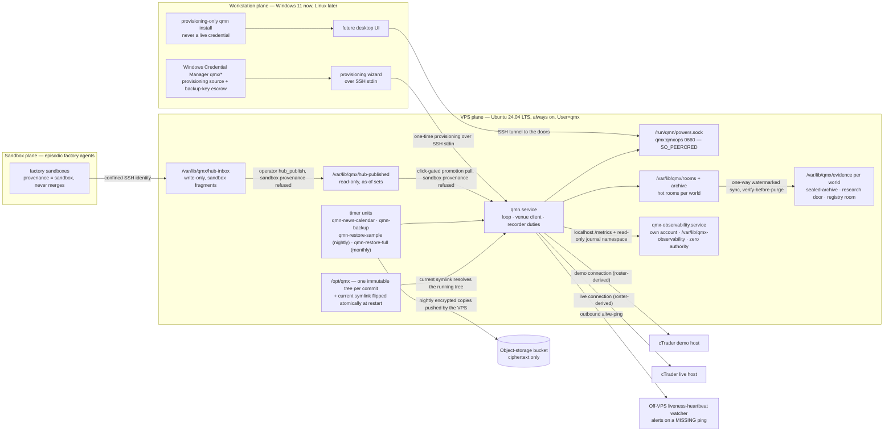

The node runs as a **plain systemd service — not a container**; containers are permitted only for the separate observability stack, and one environment is a decision with named compensating controls: the CI clean-install boot on the `ubuntu-24.04` lane, a check-mode dry run on the production host, a replay diff of a recorded day, and the `just node-rollback` symlink flip onto the previous retained tree (DEC-0201, DEC-0212). Two placement variants are in scope, one product with two placements and never a fork: the VPS variant just described is the ratified path built now, and a single-machine variant — the node co-located with the agentic system on one box as one installed QMX application set up out of the box — is design-owed under GAP-0058 (open), the V1 VPS-only refusal re-scoped to the machine the roster names and containers permitted where that variant needs them, its design ruled by a one-shot architecture increment before the variant's epic while the VPS epics proceed now and are never blocked by it (DEC-0262).

## Process internals — the trading node

Inside the process the boot ceremony runs before any trading, so a boot that never finishes is still observable and recoverable (DEC-0187). The supervisor/door layer **binds first** — the evidence channel, a preflight-status read model, and the `resurrect` power — and writes a **boot-attempt record** as the first durable write; only a failure to bind the doors themselves exits the process, every later failure entering **stand-down-alive** with the doors still serving (DEC-0187, DEC-0189). Boot then runs four ordered acts: **preflight** (a gate before any state mutation — host, disk headroom, clock sync, credential presence, store reachability, tree ownership), **compose** from one resolved config artifact, **fingerprint** into `composition_fp`, and **seal** (the composition is immutable for the boot epoch — a config change is a new config version plus a drain-aware restart at a safe point, never a hot reload) (DEC-0187, DEC-0203).

Once sealed, exactly **one asyncio event loop** runs, with async only at the venue edge and the doors, and one synchronous domain loop per `(VenueId, account)` command stream (DEC-0189, DEC-0190). A **push-to-pull accumulator** is the single first writer of every inbound observation — it records through CT-15 intake and journals under the venue `WriterId` before anything folds, so recording precedes interpretation — and maintains a **durable interpretation cursor** that commits only at slice end (DEC-0190). Each stream drives QMB's `run_slice` over six pinned sub-phases. The **order path** fires the door chain in fixed order, passes the **protection gate** (which reads the KSA level fold, the standing-intent fold, and the per-command UNKNOWN block, blocking on the entry side only), then **command mint** (carrying the node-owned command ordinal, a different counter from the gapless journal sequence), then submission through **VenueClientPort**, whose outcomes arrive back as observations in later slices; journals and evidence are written through injected sinks with block-on-unpersistable honored (DEC-0191, DEC-0192, DEC-0196).

**Node stand-down** is an alive lifecycle state entered automatically on a crash loop, a `halt` clock band, or a preflight failure; in it the sequencers refuse and journal **entry intents only**, while every risk-non-increasing act still passes, and it is left **only by an operator `resurrect`** through the powers channel, journaled as the `node_resurrect` subtype (DEC-0189). A **safe point** is a state in which the slice driver is between slices, `suspend_new` is enforced on every stream, every command has reached a terminal outcome or has had an UNKNOWN minted for it, and every sink has flushed; positions are never waited on (DEC-0189). On **SIGTERM** the node enforces `suspend_new`, closes sessions with no resubmission, **mints an UNKNOWN for every command still without a terminal outcome**, flushes every sink, and never flattens — standing intents survive as folds to be re-decided at the next boot (DEC-0189).

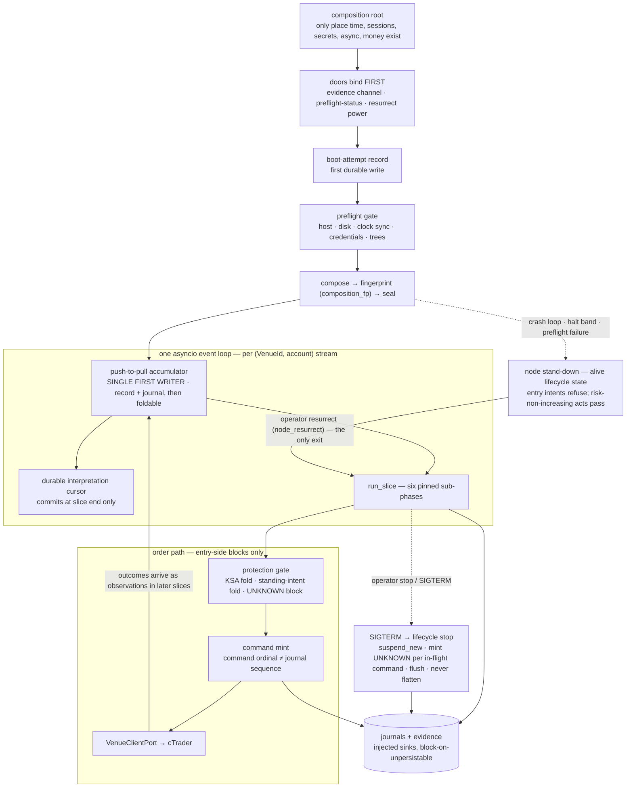

## Application-layer consumer — QMA (the QMX agentic system)

The QMX agentic system is the third named application-layer consumer built on the QMF foundation: a **daemon plus the QMA SDK plus a wire contract** that runs organizational agents over the QMF backend, an application-layer product built ON QMF exactly as the other application-layer consumers are, never a QMF roster package and never a framework (DEC-0329, DEC-0335). **QMA — QuantMind Agents — is the SDK only**, never the name of the whole system; the Python namespace is `qma.*` with no blanket `qmx.` prefix, and the three packages are `qma-core` (definitions only, depends only on `qmf-core`, no parallel base minted for anything `qmf-core` defines), `qma-daemon` (the only process that runs anything and the sole writer), and `qma-wire` (the only cross-boundary contract package), with `qma-ui-contract` present only as a deferred stub (DEC-0330, DEC-0337, DEC-0300, DEC-0335). QMA is a contract hub in the same house style as QMF, so the two read as one system: every runtime concern enters through one of `qma-core`'s seven ports — MemoryProvider, ModelDeployment, ExecutionEnvironment, KnowledgeSource, ToolAdapter, ComputeProvider, and ContextCompiler — and every contribution is reversible and scoped (DEC-0335, DEC-0300).

The runtime is **one Python 3.14 asyncio daemon built WITH the QMF libraries** — L31 dispositive: there is no second daemon runtime and no QMF contract (exact money, exact time, `fp1`, typed refusals, registry records, `correlation_id`) is re-implemented across a language boundary; language-specific workers and non-Python clients, the future Rust UI included, attach over `qma-wire`, and the Analysis desk's RLM kernel is a persistent Python interpreter inside that worker's Docker container, supervised over a typed `host_request` bridge and never the daemon process (DEC-0334, DEC-0303). The build order ships the daemon, the data layer, the wire API, and DevOps first, and **a Quant reachable through models over the wire is the first milestone**; the UI and its extension SDK, contribution points, and packaging are deferred to a later UI phase (GAP-0081), while the daemon-to-UI wire contract and the configurable-variables registry are not deferred and bind now (DEC-0333). Deployment runs from the operator's UI and wire commands, never a QMA command line — QMB's `qmb` CLI stays the platform's single command-line surface — with the daemon on the operator's workstation by default, Docker workers on that host, and any remote Quant, Mission, or Worker dialing OUT to the daemon so no inbound port opens on the deployed side (DEC-0336).

QMA's dependency edges are exactly the default-deny dependency diagram: `qma-core` depends only on `qmf-core`; `qma-daemon` composes the QMF backend — `qmf-core`, `qmf-registry`, `qmf-data`, and `qmf-risk` — and reaches `qmf-registry` and `qmf-risk` **read-and-calculate only** — importing their value types, typed refusals, and pure calculation surfaces and writing only content-addressed dev-zone candidate artifacts, never a binding, Book, BMS, control-action, exit, priority, or promotion record — over a permitted surface enumerated default-deny in `qma-core`, the `qmf-data` edge drawn unnarrowed by AD-2; and **`qmf-venue` is importable by no QMA package, worker, or plugin** (DEC-0301, DEC-0347). L30's default-deny is roster-scoped (2026-08-21 annotation), so these read-and-calculate edges are application dependencies under L31, recorded as a declared reconciliation note, never an amendment of a parent by a child (DEC-0347). The organizational ontology is Desk to Role to Quant to Agent to Subagent, five Desks (Research, Trading, Development, Analysis, PM) and five Roles (Researcher, Trader, Developer, Analyst, Product Manager), with the opaque `ActorId` grammar `quant:<desk_slug>/<quant_slug>` (DEC-0306).

**Money path.** QMA's only output into the money path is a **candidate artifact a human promotes** — never a binding, a sizing decision, or an order (DEC-0324). There is no execution tool at any account role, "paper only" included, enforced as an act-level deny-list at the Tool Registry, and every environment, worker, browser, and computer-use profile is barred from reaching a venue, broker, exchange, or trading-node host by any means — the two halves of the money-path reachability barrier, so nothing above a bot touches the market (DEC-0341, DEC-0315, DEC-0327). Paper is an account role on a real venue, never a sandbox; risk, sizing, and live-trading authority stay with the GitBook and trading-node corpus, and QMA never mints them (DEC-0324).

QMA classifies at the **backend** layer as an application-layer consumer built ON QMF, outside QMF V1's own layers and not drawn in the QMF-scoped layer diagram (as the other consumers are not): the daemon is backend runtime, `qma-core` and `qma-wire` are backend libraries, and the wire contract is what a later desktop UI layer consumes over `qma-wire` (DEC-0335, DEC-0333).

### QMA containers

In the diagram below, the arrows labelled **depends on** are package import edges — `qma-daemon` and `qma-wire` both depend inward on `qma-core`, and `qma-daemon` depends on `qma-wire`; the dotted arrow and the remaining labelled arrows are runtime interactions and governed data flows the daemon mediates, not import edges (DEC-0347).

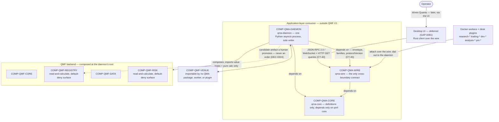

### QMA deployment

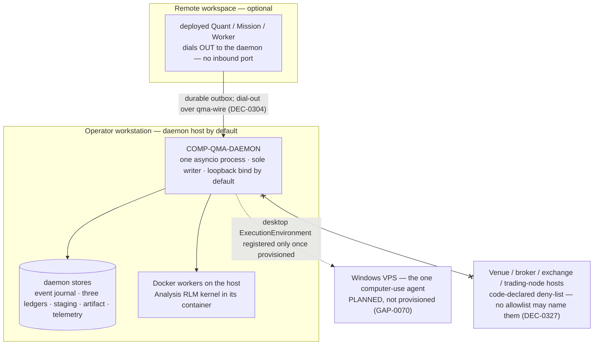

## Component index

| Component | Layer | Role | Specification |
|---|---|---|---|
| `COMP-QMF-CORE` — qmf-core | backend | Framework-neutral definitions and the single `fp1` implementation | `docs/components/qmf-core.md` |
| `COMP-QMF-REGISTRY` — qmf-registry | backend | Per-kind records, fingerprint-derived ids, and typed lineage edges | `docs/components/qmf-registry.md` |
| `COMP-QMF-DATA` — qmf-data | backend | Eight room-roles, data policy, and public API | `docs/components/qmf-data.md` |
| `COMP-QMF-INDICATORS` — qmf-indicators | backend | Package-neutral two-mode indicator protocol and TA-Lib wrappers | `docs/components/qmf-indicators.md` |
| `COMP-QMF-STRUCTURE` — qmf-structure | backend | Causal QMX-owned market structure | `docs/components/qmf-structure.md` |
| `COMP-QMF-VENUE` — qmf-venue module | middleware | Venue translation and session seam (edge module) | `docs/components/qmf-venue.md` |
| `COMP-QMF-RISK` — qmf-risk module | backend | Ratified Book, BMS, exit, paper-mode, control, and risk-arithmetic boundary (edge module) | `docs/components/qmf-risk.md` |
| `COMP-QMF-DATA-INGEST` — qmf-data source-ingest seam | middleware | External-source translation | `docs/components/qmf-data-ingest.md` |
| `COMP-QMF-DATA-STORE` — qmf-data persistence seam | data | Physical evidence persistence | `docs/components/qmf-data-store.md` |
| `COMP-QMF-DATA-BACKUP` — qmf-data backup and restore process | data | Backup/restore boundary | `docs/components/qmf-data-backup.md` |
| `COMP-QMF-CALENDAR-FOREX` — qmf-calendar-forex | backend | First market-hours calendar extension — outside the roster, own SemVer ladder | `docs/components/qmf-calendar-forex.md` |
| `COMP-QMB` — experimentation library + qmb CLI | middleware | Application-layer experimentation/backtesting consumer built ON QMF; composes the six backend libraries in `world = replay`, produces CT-32 results and CT-13 journal streams, no venue edge — outside the roster and outside QMF V1 | `docs/components/qmb.md` |
| `COMP-QML` — bot-authoring library | middleware | Application-layer bot-authoring library built ON QMF; authors CT-33/CT-34, defines the bot runtime protocol, owns the conformance gate; composes `qmf-core`, `qmf-registry`, `qmf-risk`, no venue edge — outside the roster and outside QMF V1 | `docs/components/qml.md` |
| `COMP-QMA-CORE` — qma-core | backend | Application-layer agentic-system definitions built ON QMF; the seven ports and the plugin contribution surface, depends only on `qmf-core`, no runtime — outside the roster and outside QMF V1 | `docs/components/qma-core.md` |
| `COMP-QMA-WIRE` — qma-wire | backend | Application-layer agentic-system wire contract built ON QMF; the CT-40 envelope, command/query/event families and `protocolVersion`, depends on `qma-core` and `qmf-core` — outside the roster and outside QMF V1 | `docs/components/qma-wire.md` |
| `COMP-QMA-DAEMON` — qma-daemon | backend | Application-layer agentic-system daemon built ON QMF; the one Python asyncio process and sole writer that runs Quants, composes the QMF backend read-and-calculate with no venue edge — outside the roster and outside QMF V1 | `docs/components/qma-daemon.md` |
| `COMP-QMN` — trading node (code name `qmn`) | middleware | Application-layer Phase-2 trading runtime built ON QMF; a supervised composition-root over the pure QMF/QMB/QML rulebook, one product two modes `paper \| live`, the sole sanctioned `qmf-venue` wirer, no operator command line — outside the roster and outside QMF V1 (DEC-0186, DEC-0202) | `docs/components/trading-node.md` |
| `COMP-CTRADER` — cTrader Open API | external | First intended external venue peer; no active dependency or live connection is authorized | `docs/components/ctrader.md` |
| `COMP-DUKASCOPY` — Dukascopy historical data source | external | Historical tick source | `docs/components/dukascopy.md` |
| `COMP-CALENDAR-FEED` — news-calendar feed | external | Forward news-calendar observations | `docs/components/calendar-feed.md` |
| `COMP-OBJECT-STORAGE` — Off-machine object storage | external | Backup destination | `docs/components/object-storage.md` |

## Contract authority

`docs/architecture/dependencies.yaml` is the component and dependency registry. `docs/contracts/ct-01-*.yaml` through `docs/contracts/ct-34-*.yaml` are provisional schema boundaries; the venue (CT-18 through CT-21), indicator/structure (CT-16, CT-17), and risk (CT-22 through CT-25, CT-27 through CT-32) contracts are filled at format version 1 as ratified `defined-unwired` surface, while any still-unresolved field, enum, unit, or nullability choice remains null and cites an existing GAP or a declared pending slot. The Bot-domain kinds (CT-33 Bot definition, CT-34 confluence — `qmf-registry`-owned, authored via the QML library) are filled at format version 1 (DEC-0173, DEC-0175). CT-22 and CT-23 now sit at **format version 2** after the 2026-08-21 AD-5 format mints — superseding their format-1 fill — with pre-mint format-1 artifacts readable forever (DEC-0181, DEC-0182). The QMA contracts CT-40 through CT-51 are minted at format version 1 as ratified `defined-unwired` surface owned by COMP-QMA-CORE and COMP-QMA-WIRE, with no code in existence (DEC-0329, DEC-0335); CT-35 through CT-39 are unused. The ratified spine at `_bmad-output/planning-artifacts/architecture/architecture-QMX-2026-08-19/ARCHITECTURE-SPINE.md` is the authoritative source for the paradigm, dependency direction, and invariants absorbed here.
