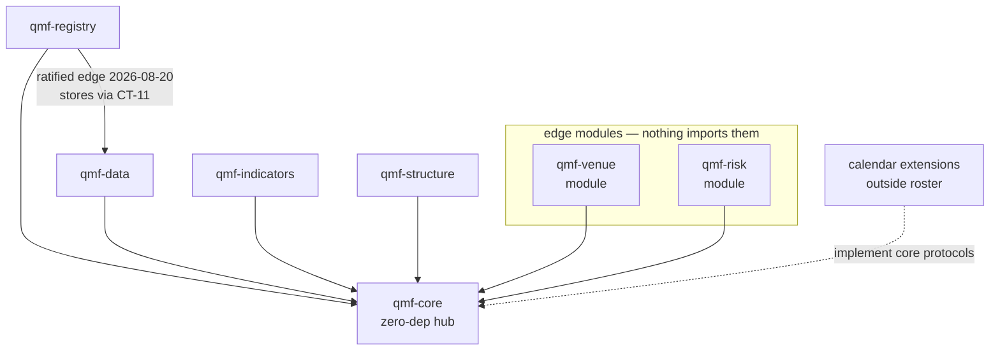
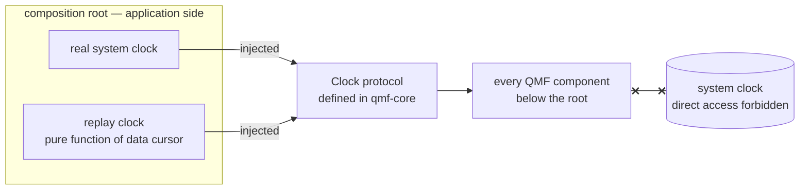
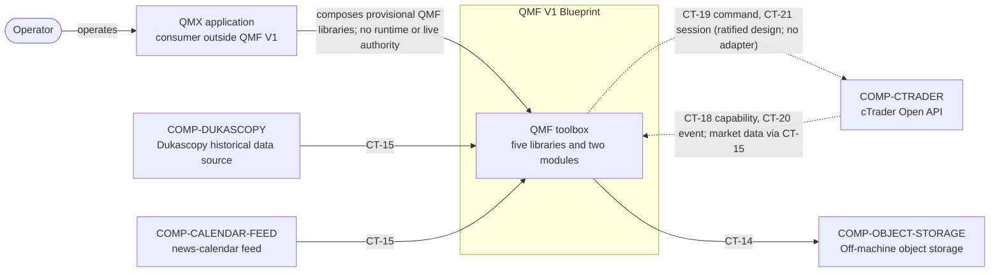
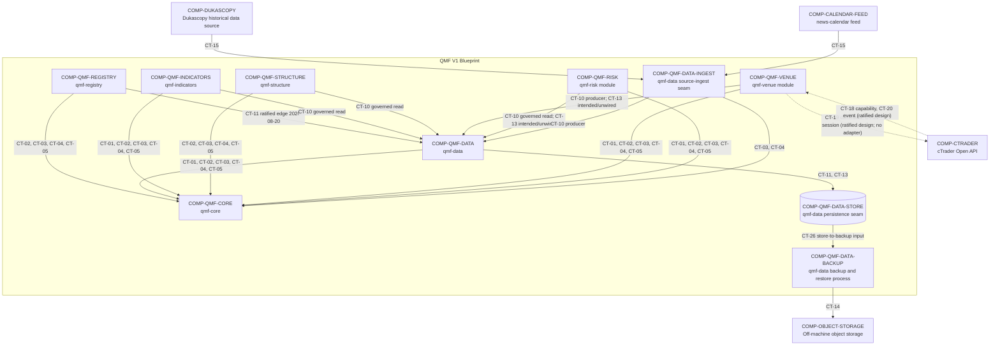
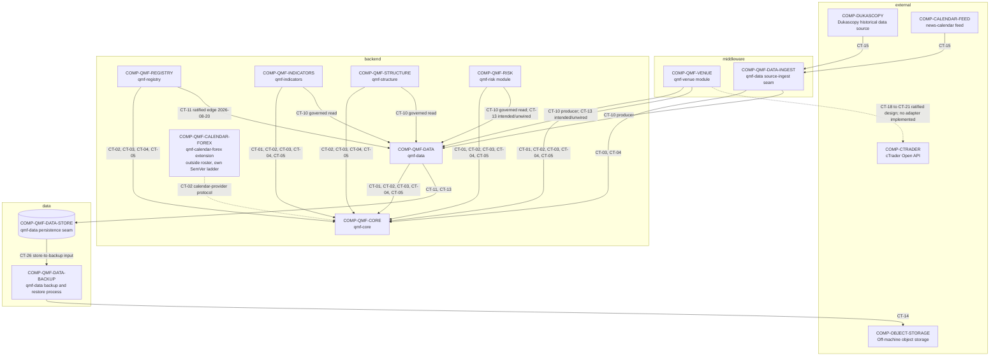

# QMF V1 Architecture Overview

QMF V1 is a contracts-first Python toolbox consumed by QMX applications. QMF provides five reusable libraries and two modules; it does not provide an application loop, scheduler, product UI, backtesting library, or trading-node runtime. Everything downstream of QMF — the trading node, backtesting, the agentic system, and the product UI — is built with QMF libraries rather than re-implementing or bypassing its contracts. (DEC-0008, DEC-0009, DEC-0022, DEC-0024, DEC-0122)

## Design paradigm

QMF is a **contract-hub library workspace, hexagonal at workspace scale.** `qmf-core` is the dependency-free hub carrying only definitions — exact value types, domain nouns, typed refusals, fingerprints, and protocol seams. Every other package depends inward on `qmf-core`; runtime concerns (clocks, market-hours calendars, venues) enter through protocols the core defines and outer packages or calendar extensions implement. Nothing in QMF is an application; applications are built *with* it, outside this repository's scope. (DEC-0022, DEC-0100, DEC-0104, DEC-0120)

## Package shape — one repo, seven packages

QMF V1 is a single repository organized as a uv workspace with seven installable packages — `qmf-core`, `qmf-registry`, `qmf-data`, `qmf-indicators`, `qmf-structure`, `qmf-venue`, `qmf-risk` — importing under the `qmf.*` PEP 420 implicit namespace. No distribution ever contains `qmf/__init__.py`; every package uses `src/` layout (`src/qmf/<name>/`); every dependency, including sibling packages, is declared explicitly; the build backend is `uv_build`; one `uv.lock` is committed; and the seven roster packages release in lockstep SemVer. Shared nouns (Venue, Account, Instrument, WriterId) are defined in `qmf-core` and their records owned by `qmf-registry`. Calendar extensions (for example `qmf-calendar-forex`) are separate versioned packages outside the roster, in the same workspace, on their own SemVer ladder. (DEC-0100)

## Dependency direction (ratified)

The dependency graph is a governed artifact under a **default-deny** rule: `qmf-core` depends on nothing; every package may depend on `qmf-core`; and until an inter-library edge is ratified as a spine amendment, no package may depend on any package other than `qmf-core`. One inter-library edge is ratified — `qmf-registry → qmf-data` (2026-08-20) — through which the registry persists records and lineage via qmf-data's CT-11 append-store contract, with stdlib-typed signatures at that boundary. Nothing imports `qmf-venue` or `qmf-risk`: they are edge modules. Calendar extensions implement core protocols from outside the roster. (DEC-0120)

This ratified direction governs package import dependencies. Adding any further edge is a spine amendment. The venue write path adds **no** edge: `qmf-venue` emits through `qmf-core`-defined sink protocols (`ObservationSink`, `JournalSink`, `RecordSink`, `SecretStore`) injected at the composition root, with the adapter's connection manager holding the `WriterId` and seeing every sink refusal. (DEC-0120, DEC-0138, DEC-0141)

## Clock injection seam

No component below the composition root reads the system clock. Clock access is a core-defined protocol; the application's composition root injects the real system clock for `world = live`, or a data-driven replay clock (a pure function of the data cursor) for `world = replay`. Every QMF component below the root receives the injected clock and never touches the system clock directly. (DEC-0106)

## C4 Level 1 — system context

The QMF system sits between QMX application code and external venue, market-data, news-calendar, and backup systems. Every external data exchange crosses a declared `CT-*` contract; operator interaction belongs to QMX rather than a QMF UI.

## C4 Level 2 — containers and support seams

The public roster is the five libraries and two modules in DEC-0024. `roster_role` in `docs/architecture/dependencies.yaml` records that membership independently from component kind and layer. `COMP-QMF-DATA-INGEST`, `COMP-QMF-DATA-STORE`, and `COMP-QMF-DATA-BACKUP` are internal seams of `qmf-data` that separate middleware, backend policy, and physical data responsibilities; they do not enlarge the public roster.

Package import dependencies follow the ratified default-deny direction above (DEC-0120): `qmf-core` depends on nothing, every package may depend on `qmf-core`, and `qmf-registry → qmf-data` is the only ratified inter-library edge. The CT-labeled arrows below depict contract interactions and governed data flows — which the application mediates through core-defined protocols and dependency injection — not additional package import edges.

## Layer view

QMF V1 has active middleware, backend, data, and external layers. QMF V1 has no UI layer. Arrows show the relevant contract interaction; `docs/architecture/dependencies.yaml` remains authoritative for `depends_on`, and package import dependencies follow the ratified default-deny direction (DEC-0120).

## Worlds and namespace isolation

Every computed result entering evidence carries a **world**, one of the identity parts of a result label (which also carries producer contract identity and evidence class per DEC-0131). Three worlds exist: `live` (real venue clocks and quotes — the account role, not the world, carries money-reality, so paper and demo runs are `world = live` and stay comparable to live for alpha-decay sensing); `replay` (a data-driven injected clock over recorded history, implementable today); and `simulated` (synthetic data, reserved but unusable in V1 — writing `world = simulated` into governed evidence is a `policy rejection` typed refusal until the backtesting sitting defines simulated-time typing). A non-live world may never write into the live evidence namespace, and factory sandboxes never produce timestamps that enter an evidence store. Identity distinctness alone does not deliver world separation — storage separation does. (DEC-0110, DEC-0131)

## Data rooms per world

`qmf-data` defines seven room-roles — ingest door, immutable raw archive, processed, journal, split-governed research door, backup, and the registry room (holding `qmf-registry`'s records and lineage under the same retention, backup, and migration law). The room-roles are **instantiated per world**, and a read that crosses worlds is a `policy rejection` refusal. Stores are Parquet (columnar time-series), DuckDB (local analytics), SQLite (transactional metadata), and JSONL (append streams), each behind a QMF-owned contract with stdlib-typed boundary signatures and no database server. Only raw-archive and journal formats are evidence-bearing; analytics engines hold rebuildable views. (DEC-0117)

## Concurrency stance

QMF values are immutable and safe to share by construction; purity binds the pure-computation libraries (core, indicators, structure). Components that own an external resource — stores, recorders, adapters — are the stateful class and follow **one-writer-per-stream with unlimited readers**, where the writer is the holder of an AD-8 WriterId. QMF never spawns threads or background work: the application owns all concurrency. Async APIs exist only at the venue network edge, never in `qmf-core` or the libraries. (DEC-0113)

## Runtime and data shape

QMF has no autonomous startup or orchestration path; a later QMX application composes the libraries and injects the clock at the composition root. CT-18 through CT-21 carry the **ratified venue design** (AD-26 through AD-28) — one neutral port and four contracts that per-venue adapters implement and the composition root wires, with no adapter yet implemented; CT-22 through CT-25 are reserved and unwired Risk boundaries, and CT-26 is the internal Store-to-Backup input boundary. (DEC-0008, DEC-0009, DEC-0022, DEC-0136, DEC-0137, DEC-0138)

External observations enter through `COMP-QMF-DATA-INGEST` or `COMP-QMF-VENUE`, which produce CT-10 into `COMP-QMF-DATA`. Governed readers reach data through `COMP-QMF-DATA` rather than bypassing it. CT-15 is only the external-source adapter boundary into `COMP-QMF-DATA-INGEST`; it is not a `COMP-QMF-DATA` interface. Every external fact carries event-time, known-at, source, and revision, where source is a core provenance noun orthogonal to VenueId, and corrections are appended, never overwritten. `qmf-data` defines source contracts, normalization, validation, and idempotent intake keyed on (source, source-native id, revision); applications own scheduling, retries, supervision, and UI. (DEC-0117, DEC-0119)

`COMP-QMF-VENUE`'s design is ratified (AD-26 through AD-28). One neutral port carries four contracts on `qmf-core` nouns: capability (CT-18), command (CT-19), event and reconciliation (CT-20), and secret/session (CT-21, shaped by the AD-26 secret lifecycle). The command stream — the unit of `UNKNOWN` blocking, `WriterId` ownership, and the gapless per-writer sequence — is the (VenueId, account) pair; the four command kinds are `place_order`, `cancel_order`, `close_position`, and `close_all`, and every well-formed submission resolves to one of four outcomes with `UNKNOWN` a recorded state, never an error. The adapter's connection manager owns venue sessions and emits through the `qmf-core`-defined sink protocols injected at the composition root, so the venue write path adds no dependency edge and the writer sees every sink refusal. Market data has a named home: ticks, bars, depth, gap-replay backfill, and historical paging enter as CT-10 source observations through `qmf-data`'s CT-15 intake — application-mediated, no fifth contract, no new edge. cTrader is the first adapter target; its ratified venue facts and the platform-versus-broker split live in `docs/components/ctrader.md`. (DEC-0135, DEC-0136, DEC-0137, DEC-0138, DEC-0139, DEC-0141)

`COMP-QMF-REGISTRY` uses per-kind record schemas — each its own versioned contract — sharing a tiny common header of kind, contract format version, at-birth parent references, writer, and sequence; a record's stable id is derived from its `fp1` fingerprint, never minted, so identical work from two sandboxes deduplicates. Lineage accruing after birth lives exclusively in append-only typed edge records (supersedes, promoted-from, occurrence-of, corroborates, disagrees-with) stored as pinned JSONL; indexes are local and rebuildable; no database server exists. The registry reserves a promotion-occurrence card kind whose mandatory plain-words summary is an identity field, and V1 signing is the operator's recorded approval attesting the record's `fp1`. (DEC-0114, DEC-0116)

`COMP-QMF-DATA` owns split, holdout seal, evidence, and journal policy; the data layer owns physical persistence and backup mechanics. Dataset splits are fingerprinted, time-ordered, non-overlapping manifests, each pinning exactly one calendar identity and version in-band; the 12-month seal is a no-peek lock enforced now as a `policy rejection` refusal at every `qmf-data` read boundary, independent of the deferred causality gates. The journal is N append-only streams — one per producing component under its WriterId — recording seven event types (decision, order, fill, risk transition, promotion, data quality, control action). Migrations run preflight checks, backup first, dry-run, migrate, verify; the ratified backup design is nightly, encrypted, versioned, off-machine, with QMF providing the backup/restore/verify primitives (CT-14, CT-26) and applications owning the schedule; numeric recovery objectives await the node/ops sitting. (DEC-0117, DEC-0118, DEC-0119)

The look-ahead causality registration gate (`GAP-0016`) and the attempt counter (`GAP-0017`) are operator-deferred to the backtesting sitting, with the consequence knowingly accepted that artifacts registered before then carry no causality evidence; the bitemporal ingredients (event-time versus knowledge-time) remain ratified. (DEC-0121)

`COMP-QMF-RISK` is present in the public roster but remains a fenced specification boundary. Book, BMS, exit, paper-mode, SQS, and execution-priority semantics remain `GAP(GAP-0039)` through `GAP(GAP-0046)`. (DEC-0065)

## Component index

| Component | Layer | Role | Specification |
|---|---|---|---|
| `COMP-QMF-CORE` — qmf-core | backend | Framework-neutral definitions and the single `fp1` implementation | `docs/components/qmf-core.md` |
| `COMP-QMF-REGISTRY` — qmf-registry | backend | Per-kind records, fingerprint-derived ids, and typed lineage edges | `docs/components/qmf-registry.md` |
| `COMP-QMF-DATA` — qmf-data | backend | Seven room-roles, data policy, and public API | `docs/components/qmf-data.md` |
| `COMP-QMF-INDICATORS` — qmf-indicators | backend | Package-neutral two-mode indicator protocol and TA-Lib wrappers | `docs/components/qmf-indicators.md` |
| `COMP-QMF-STRUCTURE` — qmf-structure | backend | Causal QMX-owned market structure | `docs/components/qmf-structure.md` |
| `COMP-QMF-VENUE` — qmf-venue module | middleware | Venue translation and session seam (edge module) | `docs/components/qmf-venue.md` |
| `COMP-QMF-RISK` — qmf-risk module | backend | Fenced Book, BMS, and risk boundary (edge module) | `docs/components/qmf-risk.md` |
| `COMP-QMF-DATA-INGEST` — qmf-data source-ingest seam | middleware | External-source translation | `docs/components/qmf-data-ingest.md` |
| `COMP-QMF-DATA-STORE` — qmf-data persistence seam | data | Physical evidence persistence | `docs/components/qmf-data-store.md` |
| `COMP-QMF-DATA-BACKUP` — qmf-data backup and restore process | data | Backup/restore boundary | `docs/components/qmf-data-backup.md` |
| `COMP-QMF-CALENDAR-FOREX` — qmf-calendar-forex | backend | First market-hours calendar extension — outside the roster, own SemVer ladder | `docs/components/qmf-calendar-forex.md` |
| `COMP-CTRADER` — cTrader Open API | external | First intended external venue peer; no active dependency or live connection is authorized | `docs/components/ctrader.md` |
| `COMP-DUKASCOPY` — Dukascopy historical data source | external | Historical tick source | `docs/components/dukascopy.md` |
| `COMP-CALENDAR-FEED` — news-calendar feed | external | Forward news-calendar observations | `docs/components/calendar-feed.md` |
| `COMP-OBJECT-STORAGE` — Off-machine object storage | external | Backup destination | `docs/components/object-storage.md` |

## Contract authority

`docs/architecture/dependencies.yaml` is the component and dependency registry. `docs/contracts/ct-01-*.yaml` through `docs/contracts/ct-26-*.yaml` are provisional schema boundaries; every unresolved field, enum, unit, and nullability choice remains null and cites an existing GAP. The ratified spine at `_bmad-output/planning-artifacts/architecture/architecture-QMX-2026-08-19/ARCHITECTURE-SPINE.md` is the authoritative source for the paradigm, dependency direction, and invariants absorbed here.
