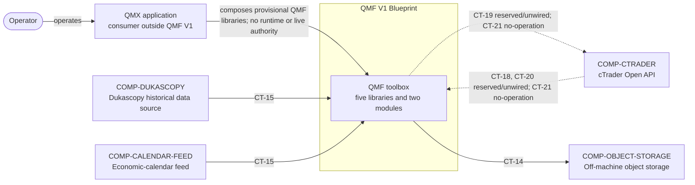
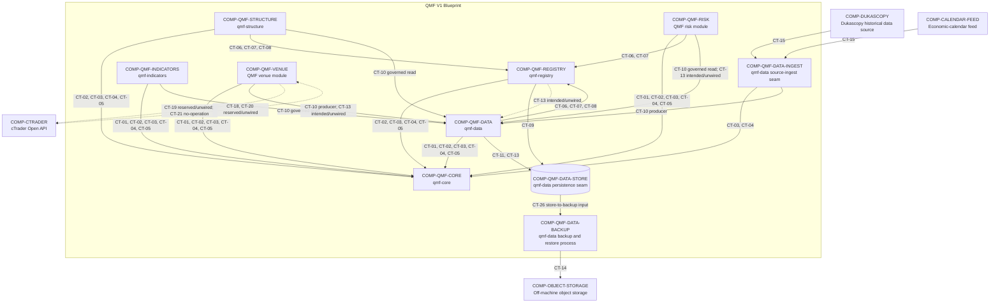
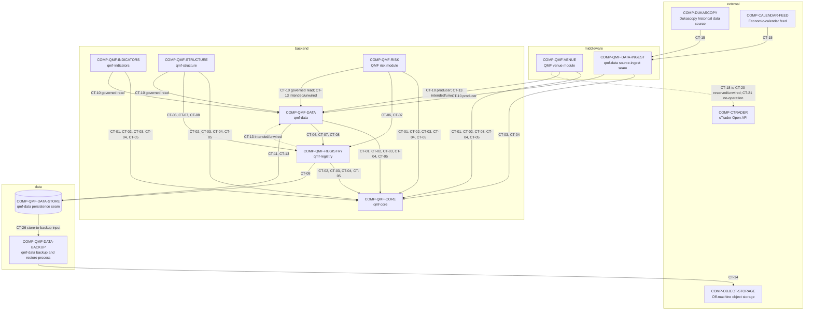

# QMF V1 Architecture Overview

QMF V1 is a contracts-first Python toolbox consumed by QMX applications. QMF provides five reusable libraries and two modules; it does not provide an application loop, scheduler, product UI, backtester, or trading-node runtime. (DEC-0008, DEC-0009, DEC-0022, DEC-0024)

## C4 Level 1 — system context

The QMF system sits between QMX application code and external venue, market-data, calendar, and backup systems. Every external data exchange uses a Stage 5 contract; operator interaction belongs to QMX rather than a QMF UI.

## C4 Level 2 — containers and support seams

The public roster remains the five libraries and two modules in DEC-0024. `roster_role` in `docs/architecture/dependencies.yaml` records that membership independently from component kind and layer. `COMP-QMF-DATA-INGEST`, `COMP-QMF-DATA-STORE`, and `COMP-QMF-DATA-BACKUP` are internal seams required to keep middleware, backend policy, and physical data responsibilities separate; they do not enlarge the public roster.

## Layer view

QMF V1 has active middleware, backend, data, and external layers. QMF V1 has no UI layer. Arrows show the relevant contract interaction; `docs/architecture/dependencies.yaml` remains authoritative for `depends_on`. Every data-bearing arrow carries the governing contract IDs.

## Runtime and data shape

QMF libraries expose provisional definitions and backend policy through CT-01 through CT-17. CT-18 through CT-20 are reserved and unwired Venue shapes, CT-21 is a no-operation credential/session gate, CT-22 through CT-25 are reserved and unwired Risk boundaries, and CT-26 is the provisional internal Store-to-Backup input boundary. QMF has no autonomous startup or orchestration path; a later QMX application composes the libraries. (DEC-0008, DEC-0009, DEC-0022)

External observations enter through `COMP-QMF-DATA-INGEST` or `COMP-QMF-VENUE`, which produce CT-10 into `COMP-QMF-DATA`. Governed readers depend on `COMP-QMF-DATA` rather than bypassing it. CT-15 is only the external-source adapter boundary into `COMP-QMF-DATA-INGEST`; it is not a `COMP-QMF-DATA` interface. Governed observations reach `COMP-QMF-DATA-STORE` only through CT-11 or CT-13. Acquisition scheduling and lifecycle ownership remain `GAP(GAP-0028)`.

`COMP-QMF-DATA-STORE` supplies an input boundary to `COMP-QMF-DATA-BACKUP` through CT-26; CT-14 covers the Backup-to-Object-Storage boundary. Snapshot shape, consistency, completeness, manifest binding, restore procedure, and verification remain `GAP(GAP-0026)` and `GAP(GAP-0027)`. The boundary does not assert recovery completion.

`COMP-QMF-REGISTRY` supplies identities, graph-shaped lineage, and registration gates without requiring a graph database. Registry kinds and persistence details remain `GAP(GAP-0014)`, `GAP(GAP-0015)`, `GAP(GAP-0021)`, and `GAP(GAP-0022)`. (DEC-0033, DEC-0035)

`COMP-QMF-DATA` owns split, holdout, evidence, and journal policy; the data layer owns physical persistence and backup mechanics. Exact layer schemas and store engines remain `GAP(GAP-0020)` through `GAP(GAP-0027)`. (DEC-0042, DEC-0045)

`COMP-QMF-RISK` is present in the public roster but remains a fenced specification boundary. Book, BMS, exit, paper-mode, SQS, and execution-priority semantics remain `GAP(GAP-0039)` through `GAP(GAP-0046)`. (DEC-0065)

## Component index

| Component | Layer | Role | Specification |
|---|---|---|---|
| `COMP-QMF-CORE` — qmf-core | backend | Framework-neutral definitions | `docs/components/qmf-core.md` |
| `COMP-QMF-REGISTRY` — qmf-registry | backend | Identity, lineage, and registration gates | `docs/components/qmf-registry.md` |
| `COMP-QMF-DATA` — qmf-data | backend | Data policy and public API | `docs/components/qmf-data.md` |
| `COMP-QMF-INDICATORS` — qmf-indicators | backend | Light indicator protocol and wrappers | `docs/components/qmf-indicators.md` |
| `COMP-QMF-STRUCTURE` — qmf-structure | backend | Causal QMX-owned market structure | `docs/components/qmf-structure.md` |
| `COMP-QMF-VENUE` — QMF venue module | middleware | Venue translation and session seam | `docs/components/qmf-venue.md` |
| `COMP-QMF-RISK` — QMF risk module | backend | Fenced Book, BMS, and risk boundary | `docs/components/qmf-risk.md` |
| `COMP-QMF-DATA-INGEST` — qmf-data source-ingest seam | middleware | External-source translation | `docs/components/qmf-data-ingest.md` |
| `COMP-QMF-DATA-STORE` — qmf-data persistence seam | data | Physical evidence persistence | `docs/components/qmf-data-store.md` |
| `COMP-QMF-DATA-BACKUP` — qmf-data backup and restore process | data | Backup/restore boundary | `docs/components/qmf-data-backup.md` |
| `COMP-CTRADER` — cTrader Open API | external | First intended external venue peer; no active dependency or live connection is authorized | `docs/components/ctrader.md` |
| `COMP-DUKASCOPY` — Dukascopy historical data source | external | Historical tick source | `docs/components/dukascopy.md` |
| `COMP-CALENDAR-FEED` — Economic-calendar feed | external | Forward calendar observations | `docs/components/calendar-feed.md` |
| `COMP-OBJECT-STORAGE` — Off-machine object storage | external | Backup destination | `docs/components/object-storage.md` |

## Contract authority

`docs/architecture/dependencies.yaml` is the component and dependency registry. `docs/contracts/ct-01-*.yaml` through `docs/contracts/ct-26-*.yaml` are provisional schema boundaries; every unresolved field, enum, unit, and nullability choice remains null and cites an existing GAP.
