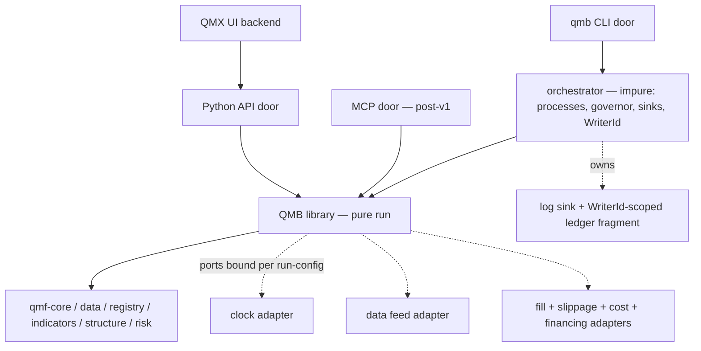
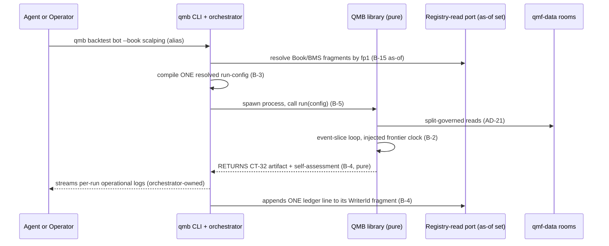

# QMB

`COMP-QMB` is the QMX experimentation/backtesting product: one pure library plus the `qmb` CLI in a single wheel, fronted by thin doors (Python API now, an MCP door after CLI v1), that runs a Bot against a Book and BMS's own rules in `world = replay` and publishes the result as a CT-32 performance-result. It is an application-layer product built ON QMF and never a QMF roster package: it consumes the six backend QMF components in workspace lockstep and depends on none below it, carrying its own SemVer as display-only provenance (DEC-0159) (DEC-0167). QMB is the first sanctioned composition root where the ratified defined-unwired risk contracts (CT-22, CT-23, CT-27, CT-28, CT-29, CT-32) are legally wired — in `world = replay` only, never against live money (DEC-0169) (DEC-0158).

QMB **realizes the glossary's reserved "future backtesting library" slot**, an entry the corpus has carried since its first draft as a deferred, modular, on-demand QMF consumer that is explicitly not a permanent central service, a runtime engine, or the Simulator UI (DEC-0159). The reserved slot is now filled at the planning level; the Simulator stays a SEPARATE deferred UI product that will consume QMB, and the experimentation/backtest rename is settled — "experimentation" is the umbrella activity, "backtest" the verification stage within it (DEC-0159). The design is ratified by operator delegation 2026-08-20 (spine B-1..B-15 FINAL, DEC-0169); ratification fixes the architecture only, and implementation authorization arrives solely through the factory pipeline — no run, ledger line, or artifact is authorized by this document. Vocabulary law binds hard: QMB is a **library** and a **CLI**, never an "engine" or "kernel"; QMF is the only framework; "snapshot" is banned for registry state — say "as-of set" (DEC-0159) (DEC-0165).

## Authority boundary

May: expose every capability once, in the library, as a pure function, fronted by thin doors that carry only adaptation logic (DEC-0159); compile exactly one resolved, read-only, fingerprinted run-config per run from the fixed precedence layers, over disjoint Book/BMS key namespaces (DEC-0160); run ONE event-slice loop driven by an injected frontier clock that IS `qmf-core`'s AD-8 Clock protocol (DEC-0169); own ONE impure orchestrator that streams operational logs, appends exactly one WriterId-scoped ledger line per run, spawns process-per-run, and governs parallelism by `min(cpu, memory)` (DEC-0161); mint exactly one AD-29 binding with `world = replay` per run and consume `qmf-risk` sizing, R-freeze, and exit contracts (DEC-0160) (DEC-0158); bind separate fill, slippage, cost, and financing ports per run-config and calibrate them from QMX's own recorded evidence (DEC-0164); derive world from input-data provenance and label a distinct claim class (DEC-0164); publish one CT-32 result artifact with declared chart-series and trade-event-reference extensions, and emit run trading events as CT-13 journal events on writer-scoped streams in the run's world (DEC-0163); drive optimize through a pure generation-stepped sampler reading trial history from the ledger view (DEC-0169); expose the same pure functions as the research surface on a controlled-room host (DEC-0169); front `qmf-data` contracts with thin download-once, license-tagged data commands (DEC-0166); ship the validation ladder as versioned-procedure library functions (DEC-0169); and serve registry state through ONE library-owned read port as immutable fingerprinted as-of sets over a passive file-sync hub (DEC-0165).

May never: bench, promote, or bind — QMB publishes; the authority to act on a published measure stays with the Book door and the operator (DEC-0162) (DEC-0155); store a frozen pass/fail bar verdict, or gate live money on any replay-world verdict (DEC-0162); mint a second data layer beside `qmf-data`, or a second registry beside `qmf-registry` — its data and registry-read commands are thin fronts over the ratified contracts (DEC-0166) (DEC-0165); revive the dead DEC-0084 central backtesting service — the B-15 hub is dumb passive storage, deliberately not a service (DEC-0165); fork or adopt donor engine code — shapes only, build-our-own (DEC-0013); redefine any risk, Book, BMS, binding, R, or exit vocabulary — AD-29..41 are consumed read-only (DEC-0169) (DEC-0158); call itself, or be called, an "engine" or "kernel", or call any QMB part a "plugin", or say "snapshot" for registry state (DEC-0159) (DEC-0165); let a door hold a second cache or compute a run-id differently from another door (DEC-0165) (DEC-0160); accept a caller-declared world, or relabel a store-tainted run as anything but `world = simulated` (DEC-0164); assert a simulated Instant as a wall/replay Instant, or unlock `world = simulated` for governed evidence, before GAP-0048 rules the fidelity content (DEC-0169) (DEC-0164); claim edge from an optimistic-tainted, synthetic, or robustness-only run — L20 stands, nothing synthetic validates edge (DEC-0164); let the library write a log or a ledger line, spawn a thread, hold module-global mutable state, or oversubscribe silently (DEC-0161); stack the MCP door over HTTP or ship it before CLI v1 (DEC-0159); or add an inter-library edge into QMF beyond the six declared dependencies — notably no edge to `COMP-QMF-VENUE`, whose live adapters and brokerage ports are trading-node territory (DEC-0169) (DEC-0158).

## Interfaces

| Interface | Direction | Contract | Peer |
|---|---|---|---|
| Exact money, price, and quantity values | in | [CT-01](../contracts/ct-01-money-quantity.yaml) | COMP-QMF-CORE |
| Exact time, TradingDate, and market-hours-calendar values | in | [CT-02](../contracts/ct-02-time-calendar.yaml) | COMP-QMF-CORE |
| Typed refusals (seven categories) | in/out | [CT-04](../contracts/ct-04-typed-refusal.yaml) | COMP-QMF-CORE; RETURNED at boundaries, rendered per door, never swallowed (DEC-0159) |
| Version, fingerprint, and format-version values | in/out | [CT-05](../contracts/ct-05-version-fingerprint.yaml) | COMP-QMF-CORE; the resolved run-config, ledger line, and CT-32 each stamp their own AD-5 format version (DEC-0160) |
| Lineage edges (fragment → source Book/BMS; sweep/write-back siblings) | out | [CT-07](../contracts/ct-07-lineage-edge.yaml) | COMP-QMF-REGISTRY; composition-root routed, never an import edge (DEC-0160) (DEC-0165) |
| Governed observation reads (rooms only, never providers) | in | [CT-10](../contracts/ct-10-source-observation.yaml) | COMP-QMF-DATA; runs read `qmf-data` rooms, never fetch from a provider (DEC-0166) |
| Dataset-split manifests (seal, embargo, knowledge-time, calendar-in-band) | in | [CT-12](../contracts/ct-12-dataset-split.yaml) | COMP-QMF-DATA; every run names split-manifest fingerprints; warm-up length IS the embargo (DEC-0169) |
| Journal events on writer-scoped streams (decision, order, fill, risk-transition, kin) | out | [CT-13](../contracts/ct-13-journal.yaml) | COMP-QMF-DATA; emitted in the run's world — the ratified journal, not an invented format; [CT-11](../contracts/ct-11-evidence-persistence.yaml)'s evidence law binds by prose, not as a held interface — only the raw archive and journal bear evidence, and per-run logs never do (DEC-0163) |
| Indicator / configured-producer reads, incl. the SQS door | in | [CT-16](../contracts/ct-16-indicator.yaml) | COMP-QMF-INDICATORS; non-live runs feed the run's modeled-spread series to the Book's SQS door (DEC-0169; its reconciliation with DEC-0153's sampling/freshness rules is a GAP-0048 pending slot) |
| Causal-structure reads (structure updated on closed data only) | in | [CT-17](../contracts/ct-17-causal-structure.yaml) | COMP-QMF-STRUCTURE; updated in run-loop sub-phase 4, never on forming bars (DEC-0169) |
| Book definition (fragment source; cited by `fp1`) | in | [CT-22](../contracts/ct-22-book-charter.yaml) | COMP-QMF-RISK; the Book fragment is a derived artifact with lineage back to CT-22 (DEC-0160) |
| Risk-evaluation door (Book-resolved intent → fill ports) | in/out | [CT-23](../contracts/ct-23-risk-evaluation.yaml) | COMP-QMF-RISK; ports execute an authorized intent, never a bot-sized order (DEC-0164) |
| Risk-journal reads (calibration input: slippage from fill journals) | in | [CT-25](../contracts/ct-25-risk-journal.yaml) | COMP-QMF-RISK; slippage calibrated from live and paper fill journals (DEC-0164) |
| BMS definition (fragment source; cited by `fp1`) | in | [CT-27](../contracts/ct-27-bms-definition.yaml) | COMP-QMF-RISK; the BMS fragment is a derived artifact with lineage back to CT-27 (DEC-0160) |
| Book binding record (one `world = replay` binding per run) | out (minted) | [CT-28](../contracts/ct-28-book-binding.yaml) | COMP-QMF-RISK; a replay binding is a distinct identity, incomparable to any live binding (DEC-0160) |
| Exit record (one per virtual-position close in the run) | out | [CT-29](../contracts/ct-29-exit-record.yaml) | COMP-QMF-RISK; the trade record IS the CT-29 stream of the run's replay binding (DEC-0163) |
| Performance-result container (the canonical run artifact) | out | [CT-32](../contracts/ct-32-performance-result.yaml) | COMP-QMF-RISK; the run's one artifact IS CT-32, with declared chart-series and trade-event extensions (DEC-0163) |

## Behavior

### One library, thin doors, the CLI as the product face (B-1)

Every capability exists once, in the library, as a pure function; doors are thin hand-written wrappers carrying only adaptation logic — parsing, transport, refusal rendering, and registry enumeration for autocomplete through the B-15 registry-read port, never a door-side cache (DEC-0159). The `qmb` CLI is the product face and ships first; the Python API door exposes the same pure-function surface for the UI backend (consumed in-process) and for research; the MCP door is a sibling over the same library — never stacked over HTTP — localhost-bound by default and shipped after CLI v1, not waiting on the agentic system (DEC-0159). Door parity is not aspiration but a **tier-2 contract test** asserting identical function surface and semantics across doors, which is the answer to Jesse's three-heterogeneous-stacks failure (DEC-0159). Every agent workspace provisions the same `qmb` CLI as a pinned dependency — one CLI for agents and operator alike (DEC-0159). The extensibility law fences drift: capabilities are added as new adapters, config fragments, or library functions, never by re-architecting the tunnel or the doors (DEC-0159).

### The event-slice run loop and the injected frontier clock (B-2)

The run loop is ONE loop consuming time-ordered event slices; time advances only through an injected **frontier clock** that IS `qmf-core`'s AD-8 Clock protocol — monotonically non-decreasing, pulled to the minimum next-emit instant across streams, emitting wall/replay Instants (never the AD-8 monotonic diagnostic kind) — and it does NOT choose `world` (that is B-7's job) (DEC-0169). Backtest, replay, and live differ only by which clock and adapters the run-config binds; the loop is never forked, which is how QMB avoids Jesse's no-seam failure of separate live/backtest code paths (DEC-0169).

The per-slice sub-phase order is identity-bearing and pinned: (1) frontier advance and stream update, with higher-`BarSpec` bars derived from the finest declared base stream and emitted ONLY on completed boundaries — a forming bar is never visible or actionable and carries an inspectable completeness state; (2) scheduled position-level events (financing, B-6); (3) execute **resting** orders through the B-6 ports against the declared intra-slice path; (4) update indicators and structure on closed data only; (5) strategy callbacks mint intents; (6) new intents are NOT eligible to fill against this slice's path — they rest for a later slice (DEC-0169). Within a phase, instruments process in the stream-set declaration order (B-12), which is identity content of the resolved config, so identical inputs produce identical slices, fills, and fingerprints — enforced by a **tier-2 golden-slice determinism test** (same inputs, two runs, identical CT-32 fingerprint) (DEC-0169).

Warm-up is **in-loop**: the same loop, same sub-phase order, same adapters, trading locked — acting (an entry, an exit, any command) during warm-up is a typed `policy rejection`; pre-seeding indicator buffers without replaying slices is not warm-up (DEC-0169). Warm-up length is the split-manifest embargo already declared under AD-21 for the producers the stream set cites (an observation count, never a Duration); the loop adds no second window, and the evidence range on the result label is the trading interval, not the warm-up interval (DEC-0169). Simulated-clock typing is refused until GAP-0048: the loop seam may exist, but asserting simulated Instants as wall/replay Instants may not, and a config binding a replay clock to synthetic-tainted data is `invalid input` because B-7 wins (DEC-0169) (DEC-0164). In non-live runs the Book's SQS door reads this run's modeled-spread series as its spread input (DEC-0169); how that modeled series satisfies DEC-0153's tick/quote-sampling and `decision_freshness_bound` requirements is not yet reconciled — a pending slot for the GAP-0048 sitting, not settled behavior.

### The config compiler — one resolved run-config, the wind tunnel (B-3)

Every run consumes exactly one fully-resolved, read-only, schema-validated run-config artifact — the operator's wind-tunnel model made mechanism: changing test conditions means changing config variables; the tunnel is never swapped, and adapters are never bound from ambient discovery or a code change (DEC-0160). The artifact is compiled from explicit layers with fixed precedence: **invocation flags > run spec (the bot layer) > BMS config fragment > Book config fragment > workspace defaults** (DEC-0160). Book and BMS fragments occupy **DISJOINT** key namespaces — Book owns admission, sizing, and exit-door policy; BMS owns accounting, constraints, kill-line, and reporting — and a key collision is a compile-time typed refusal; in any future sanctioned overlap, BMS outranks Book, because "BMS accounts for and constrains Books" (DEC-0160) (DEC-0143). Fragments are generated, schema-validated, fingerprinted DERIVED artifacts carrying AD-16 lineage edges back to their source Book/BMS definitions (CT-22/CT-27) — never a newly minted registry kind, never free-hand-edited (DEC-0160).

Invocation may take a human alias, but the resolved artifact MUST cite Book definition, BMS definition, and any binding by `fp1`, never `name@version` (DEC-0160) (DEC-0167). Every run mints exactly one AD-29 binding with `world = replay` — a different identity from any live binding of the same Book instance, and deliberately incomparable to it (DEC-0160). `starting_capital` is not a silent flag: it is the binding's virtual-ledger seed, taken from a **mandatory** run-spec field the Book fragment may default; a flag override of the seed stamps `seed_overridden` on the binding and forces the run's fold to `unrated` (DEC-0160). Sizing, R-freeze, and exits consume `qmf-risk` contracts (CT-23 inbound, CT-29 exits, the full-loss price required before an open) (DEC-0160) (DEC-0158). The resolved artifact is itself a versioned contract stamping its own AD-5 format version and declaring AD-10 identity-vs-display field classification, so every door computes the same fingerprint and old ledger entries stay readable forever; it is written into the run's output directory, and its fingerprint is the run-id root and the ledger key (DEC-0160). Named condition presets (for example a stress-spread preset) are config fragments like any other (DEC-0160).

**QML-increment coordination — two declared config-compiler extensions (B-3).** The QML sitting (the bot-authoring library spine QL-1..QL-10, absorbed 2026-08-21) hands QMB two named config-compiler extensions to budget for rather than discover; each composes with existing B-3 machinery and neither re-architects the tunnel (DEC-0183) (DEC-0159). First, the resolved run-config gains an `assignment_is_canonical` stamp — mirroring the `seed_overridden` precedent — set true exactly when a run's resolved parameter values equal the cited CT-33 Bot definition's canonical assignment and false under any run-spec override; it is computed from the resolved run-config and is the admission-side check behind QML's canonical-assignment evidence, so knowing whether a run executed the canonical assignment needs no CT-33 re-read and no B-4 amendment (DEC-0173) (DEC-0178) (DEC-0183). Second, producer-template resolution is a declared config-compiler step (also a node seat-admission responsibility) composing with B-8's value resolution: a CT-33 footprint may bind a producer as a CT-16/CT-17 template — a complete producer configuration minus only its space-bound values — and the compiler resolves those values to one deterministic configured-producer fingerprint, so dedup still lands on ordinary CT-16/CT-17 fingerprints and identical canonical runs fingerprint identically on every machine (DEC-0174) (DEC-0183).

### Pure run, impure orchestrator, and the resource governor (B-4/B-5)

The library's `run()` is a PURE function: it consumes the resolved config and data reads and RETURNS the canonical result artifact plus a self-assessment — it writes no log and no ledger (DEC-0161). Exactly one impure component — the **orchestrator** (the composition root) — owns the injected log and ledger sinks: it streams the run's operational log, and on completion appends exactly ONE ledger line; on observing a dead or cancelled process it appends the `aborted` line with refusal context, never silently absent (DEC-0161). The ledger line carries the full AD-12 result label (evidence class included; `provenance = sandbox` on factory-sandbox runs), the CT-32 fingerprint, the run's raw AD-40 unit-kinded measures, the fingerprint of the Book bar as resolved at run time, and a discriminated **run role** — `confirmation | trial | replicate | aborted` (DEC-0161).

Physically the ledger is WriterId-scoped JSONL fragment files — a durable WriterId per `(machine, role, worker-slot)` per AD-8; concurrent processes never share a file, because single-file append is not atomic on Windows and is PIPE_BUF-limited on Linux — and "the ledger" as read is a merge view over fragments within one world-and-role-scoped namespace (DEC-0161). Concurrency (B-5): concurrent runs are separate OS processes (stdlib process management) spawned by the orchestrator, each with an isolated output directory; the governor bounds parallelism by `min(cpu budget, memory budget)` — a run whose projected peak memory exceeds the remaining budget gets a typed refusal or enqueues (enqueue-on-full, never silent oversubscription); every run is cancellable and carries declared per-run time and memory limits whose breach is a typed `aborted` (DEC-0161). The `qmb_governor_cpu_budget`, `qmb_governor_memory_budget`, `qmb_run_time_limit`, and `qmb_run_memory_limit` variables carry these bounds; 12–14 concurrent runs on sandbox hardware is a motivating reference under AD-13, never a validated budget until a fingerprinted baseline is measured (DEC-0161). No Ray, no required Docker, no daemon — sandboxes and laptops run the same uv-installed package; the library never spawns threads or background work (AD-15), all impurity lives in the orchestrator, and no module-global mutable state exists anywhere in the library (DEC-0161). Runs enter the governed ledger only through the orchestrator; direct library calls in research return values and produce no governed evidence (DEC-0161).

### Reader-derived verdicts and run roles (B-4)

A ledger line stores raw unit-kinded measures and the fingerprint of the Book bar as resolved at run time — never a stored pass/fail (DEC-0162). The bar verdict is computed by ONE authoritative **read-time fold** producing PER-REQUIREMENT outcomes against the cited AD-32 bar (structural parity on producer contract versions, unit-kind, and comparison rule); composite scores are banned (DEC-0162). A bar ruled later re-verdicts accrued confirmation evidence with NO re-run; `not-yet-ruled` is the fold's answer while a requirement is blank, or on a world/role miss (DEC-0162). The verdict is legal only on `role = confirmation` lines whose adapters are the Book-declared set; optimize trials, Monte Carlo and significance replicates, and walk-forward train windows ledger `role = trial` or `replicate` plus the objective measure — never a bar verdict — and the Book-bar read selects `confirmation` lines only, so a trial never masquerades as a confirmation (DEC-0162). A replay-world verdict can never gate live money: replay evidence feeds a live bar only where that bar's evidence requirements declare it (DEC-0162) (DEC-0158). QMB's ledger plus CT-32 artifacts are the designated evidence source for the AD-32 admission bar and the AD-18 promotion-card causality slot, under the standing caveat that replay-world, pre-GAP-0048 evidence cannot gate live money — QMB publishes, it does not bench, promote, or bind (DEC-0162) (DEC-0116).

**QML-increment coordination — the canonical-assignment fold qualifier (B-4).** The one authoritative read-time fold gains a qualifier that reads each cited run's `assignment_is_canonical` stamp (B-3), so an admission bar declaring QML's canonical-assignment evidence resolves per requirement at read time with no B-4 amendment: a run whose resolved values differ from the cited CT-33 Bot definition's canonical assignment satisfies no requirement that declares canonical-assignment evidence, exactly as a world/role miss yields `not-yet-ruled` (DEC-0178) (DEC-0183). The fold still stores no verdict and computes per-requirement outcomes against the cited AD-32 bar; this is one more per-requirement input, never a stored pass/fail (DEC-0162).

### Execution ports, fidelity, and calibration-not-invention (B-6)

The GAP-0048 seams are ruled; its content is not (DEC-0164). Inbound execution is a CT-23 Book-resolved intent (or a typed refusal) — the fill ports execute an *authorized* intent, never a bot-sized order (DEC-0164). Execution binds SEPARATE ports per run-config, composition pinned: (1) **fill** decides `Fill | NoFill | PartialFill` and a pre-slip price by declared-path crossing inside the slice, partial quantities first-class (capped by position size and instrument lot step); (2) **slippage** maps that price to a post-slip price and may veto the fill (`NoFill`) if the slipped price is not a legal print on the slice; (3) **cost** itemizes cash charges (commission, and financing/admin fee at the AD-8 accounting rollover, not per-slice) on the post-slip fill in exact-integer money, each partial carrying its own pro-rated fee (DEC-0164). **Financing** is a scheduled position-level cash event on open positions (run-loop sub-phase 2, NOT an order fill; per-instrument, per-direction, calendar-scheduled) (DEC-0164).

Fidelity identity is **adapter-id + composition-version + taint**; `optimistic` is the taint field, never the identity (DEC-0164). A run's fidelity is the LOWEST fidelity of any adapter it bound, and mixed-fidelity comparison of Book bars is a typed refusal without an explicit override (DEC-0164). Until GAP-0048 ratifies the fidelity taxonomy and calibration content, **all fills carry an `optimistic` taint**: such runs cannot spend split budget and cannot claim edge (DEC-0164). The forex spread/slippage/financing content is ORIGINAL to the QMX platform — no donor reference exists, because the one thing QMX needs is the one thing neither donor has — and the solve is **CALIBRATION, never invention**: spread schedules measured from QMX's own recorded bid/ask ticks per venue/hour/session, slippage from the live and paper fill journals (CT-25), gap behavior from recorded history, financing from the broker's published schedule, per-broker per DEC-0135, each calibration a versioned fingerprinted artifact declared in the result label (DEC-0164) (DEC-0135).

### Provenance-derived worlds and claim classes (B-7)

World is derived from input-data provenance, never caller-declared (DEC-0164). Store-persisted fabricated-from-scratch data (random-walk class, `qmb data generate`) is store-tainted; any run that **reads the store** is `world = simulated` and a `policy rejection` for governed evidence until GAP-0048 — legal for infrastructure stress and strategy-logic smoke tests only, closing the synthetic backdoor LEAN ships (DEC-0164). **Procedure-ephemeral** perturbation — the B-14 trade-shuffle and real-seeded block-bootstrap that never persist a synthetic series into a data room — does not change world: the run stays `world = replay`, the procedure identity and seed enter the label, and the claim class is **robustness-only**, never edge, never admission evidence (DEC-0164). Claim class is a label field distinct from world; L20 stands — nothing synthetic validates edge — and a clock/adapter-versus-provenance mismatch is `invalid input` (DEC-0164).

### Optimize — declared spaces, a pure generation-stepped sampler (B-8)

A bot declares its parameter space as a typed schema (name; type ∈ `exact integer | exact rational | categorical | boolean`; bounds; step; default) plus optional hard constraint filters (metric-operator-value) (DEC-0169). The Optuna adapter may float internally, but sampled values enter the resolved run-config only after a named AD-7/AD-22 conversion (rounding mode + target scale, identity-bearing) (DEC-0169). The sampler is a **PURE** function — `(declared space, prior trial results, seed, generation index) → next parameter batch` — evaluated by the orchestrator between spawns; trial history is read from the **ledger view**, never from an in-process study, a daemon, or Optuna's own store (DEC-0169). Search steps in deterministic generations: propose a batch, run it concurrently (B-5), barrier, condition on the completed generation — so the same seeded sweep proposes identical trials regardless of completion order; parallel `ask` without an intervening `tell` is refused (`unsupported capability`) for TPE-class adapters, while a non-adaptive grid/Sobol adapter may ask a declared batch (DEC-0169). The default sampler adapter is genuinely adaptive (TPE-class), pinned by `qmb_sampler_pin`; sampler identity + seed + generator provenance + `study_fp` (the study artifact before this ask) enter every trial label, and every trial is a first-class B-3/B-4 run with `role = trial` (DEC-0169) (DEC-0168). The optimize deliverable includes the **anti-overfit analysis**: post-hoc parameter-sensitivity (per-parameter objective slices, clustering of good regions, isolated-spike-winner flagging) emitted as part of the sweep's result artifact (DEC-0169). Objectives are `measure_identity`s from the AD-23/AD-41 roster; every run names split-manifest fingerprints, and "train/test" is a display alias for two such manifests, never a substitute — walk-forward is a sequence of manifests, each a first-class run (DEC-0169).

**QML-increment coordination — the completed parameter-space schema (B-8).** The typed parameter-space schema B-8's sampler consumes is completed with the AD-40 unit-kind every declared variable already requires — the same schema (name; type ∈ `exact integer | exact rational | categorical | boolean`; bounds; step; mandatory default; optional hard constraint filters) with a unit-kind on every parameter — and it is ONE schema, authoritative in the CT-33 Bot definition, never a second QMB-local copy (DEC-0173) (DEC-0183). B-8 reads that CT-33-authoritative schema; the mandatory defaults are the Bot definition's canonical assignment, and a swept non-default assignment enters the resolved run-config solely as a B-3 run-spec override in experimentation — promoting a tuned assignment mints a new Bot version, never a silent new default (DEC-0173).

### The research surface (B-9)

The research surface is the library's own pure functions, importable from a bare uv-installed package — no server, no Docker, no daemon required (DEC-0169). Room hosts are explicit: the operator's workstation hosting the QMX app and archive IS a controlled-room host, where AD-19/AD-21 apply in full including the seal and its sanctioned single final-look path; any other portable context receives only unsealed, split-governed exports, and sealed or governed evidence never leaves controlled rooms (DEC-0169).

### One canonical result artifact — CT-32 adoption, CT-13 events, operational-only logs (B-10)

Every run emits one canonical machine-readable result artifact, and that artifact **IS a CT-32 performance-result** — the ratified defined-unwired container QMB was always meant to fill — carrying CT-32's fields in full, including suppression and veto accounting (so a run's own control-window and admission doors never masquerade as alpha decay) and the closed AD-40 unit-kind vocabulary (DEC-0163). Chart series and trade-event references are **DECLARED QMB EXTENSIONS** of CT-32: chart series cite exact `Bar`/`Price` values (AD-22) as inputs, and any downsample is a display-only derivative with a declared sampler identity, AD-10-excluded from identity, never the canonical payload; trade-event references cite CT-13 journal streams — the trade record IS the CT-29 stream of the run's replay binding (DEC-0163). The run's trading events (decision, order, fill, risk-transition and kin) are emitted as CT-13 journal events on writer-scoped streams in the run's world — the ratified journal, not an invented format (DEC-0163). **Per-run logs are AD-14 operational logs only and are NEVER evidence**: under CT-11 only the raw archive and the journal bear evidence, and artifacts cite them (DEC-0163). Re-running a run id under its resolved config must reproduce the CT-32 fingerprint; a mismatch is a typed refusal (DEC-0163). All human-facing rendering (HTML report, UI charts) is a pure downstream function of the artifact and adds no computation; agents and in-house skills read the artifact, never renderings (DEC-0163).

### Data commands — download-once, license-tagged (B-11)

QMB's data commands (`download`, `verify`, `catalog`, `generate`) are thin fronts over the ratified QMF data contracts (CT-10/CT-15 intake, rooms, bitemporal law, bid+ask preserved) — no second data layer (DEC-0166). Acquisition posture: download ONCE under the user's own provider relationship (Dukascopy primary; a dukascopy-node-class downloader as the acquisition-tool reference — github.com/Leo4815162342/dukascopy-node, web-verified 2026-08-20) into the QMF immutable raw archive, so QMX owns its stored source; runs NEVER fetch from providers — they read only `qmf-data` rooms (DEC-0166) (DEC-0059). Every ingested window records provenance plus a **license tag**; a source window without a recorded usage right is a typed refusal for governed-evidence use, and QMB ships and redistributes no market data (DEC-0166). The Dukascopy licensing-gate question — the old corpus failed it for redistribution-shaped use — was RULED CLOSED by the operator (2026-08-21): the data is used at a personal level only — backtesting his own strategies — so no licensing blocker stands; the per-window license-tag mechanism stays in force unchanged, and the question reopens only if a future posture exceeds personal use (DEC-0170).

### Stream sets and permutation batches (B-12)

A run declares its full stream set up front (instrument + `BarSpec` list, trading vs data-only roles, the declaration order identity-bearing), and strategies read other streams only through the declared set (DEC-0169). Per run: at most ONE open position per `(venue, instrument)` — violation is the typed refusal `DuplicatePositionStream`; all trading streams share one settlement asset for exact-integer accounting — violation is `MixedSettlementAsset` (DEC-0169). Permutation sweeps (bot × symbols × BarSpecs × parameters) are Cartesian batches in which each combination is one isolated, fully-labeled run with its own ledger line; batch-level aggregation is a read-time view over the ledger, never a merged run (DEC-0169).

### Versioned distribution and complete run identity (B-13)

QMB is a versioned uv/pip-installable package — library + CLI in one wheel (DEC-0167). The primary channel is a normal pinned, lockfile-tracked project dependency (`uv add qmb`), required because the Python API door must be importable; `uvx qmb` / `uv tool install qmb` is an optional CLI-only convenience that does NOT provide the importable library and is never the sandbox provisioning channel (DEC-0167). Run identity is AD-12's field set plus the resolved-config fingerprint as an *input* fingerprint; QMB SemVer and QMF roster SemVer ride as **display-only provenance** on the occurrence record, never identity (DEC-0167). The result label also carries `registry_as_of` (B-15), data and split fingerprints, world, evidence class, fidelity identity (B-6), RNG provenance where stochastic, and `provenance = sandbox` on factory-sandbox artifacts (DEC-0167). Doors may accept a human alias, but the resolved artifact cites Book/BMS/bot definition fingerprints (`fp1`); a dated pointer record ("current") is legal UX, and `name@version` is not a legal identity cite (DEC-0167).

### The validation ladder as library functions (B-14)

The ladder — backtest, optimize, Monte Carlo (trade-shuffle; real-seeded candle perturbation), rule-significance test (a signal-only run-loop pass with orders disabled, bootstrapped against a detrended zero-edge null), and walk-forward — ships as library functions, each with its exact statistical procedure versioned as a contract, each producing labeled runs and ledger entries under B-3/B-4 (DEC-0169). Candle-perturbation MC that **persists** a synthetic series is `world = simulated` and cannot ledger into the bar's store; trade-shuffle of a `world = replay` run stays replay only if it mints no synthetic market data (DEC-0169) (DEC-0164). These procedures claim robustness or infra-stress, never edge (L20) (DEC-0169). Return-space statistics are a declared, bounded AD-7 float carve-out: P&L and equity paths stay exact-integer, floats exist only inside the statistic with a fixed rounding contract and re-enter the money path via a named conversion, and float-valued measures take **label-derived** identity (never a hash of float bytes) (DEC-0169). Walk-forward is confirmed in by operator ruling; threshold values and pass batteries stay deferred (GAP-0048/0049, "keep it simple"), but the procedures' mechanics do not wait (DEC-0169).

### Registry delivery — immutable as-of sets over a passive hub (B-15)

ONE library-owned registry-read port serves every consumer — the config compiler resolves through it and doors enumerate through it for autocomplete; no door-side or second cache exists, so autocomplete and resolution can never answer differently (DEC-0165). Registry state reaches a machine as an immutable, fingerprinted **as-of set** of records and fragments (a `registry_as_of` instant + set fingerprint) — "snapshot" is banned vocabulary here — delivered by a **passive file-sync hub**: dumb storage, not an always-on service; the central-service option stays dead (DEC-0084), and hub deployment detail belongs to the node/ops sitting (DEC-0165). A sweep resolves ONE as-of at batch admission, frozen for every trial and stamped into the sweep label; after admission, fragments resolve by explicit fingerprint, never `name@latest` (DEC-0165). Running against a ref that a fresher as-of shows superseded raises an AD-11 stale-evidence refusal, its severity carried by `qmb_stale_evidence_severity` (DEC-0165). Write-back: each machine's records travel as its own WriterId-scoped append streams; at hub merge, identical-fingerprint arrivals are idempotent accepts, label-identified float-differing artifacts are lineage siblings (never AD-10 collisions), and true collisions refuse and alarm per AD-10 (DEC-0165). This is the precise mechanism behind the operator's "CLI updates when I create a Book": a new Book reaches the CLI as a fresher as-of set, never as a door cache or a live service query (DEC-0165).

### Structural seed

The module list is the spine's structural seed, carried here as the seed of intent, not a build authorization (DEC-0169):

```text
qmb/                      # one distribution: library + CLI
  runloop/                # event-slice loop, frontier clock port, warm-up (B-2)
  config/                 # schema, layering, compiler -> resolved artifact (B-3)
  registryread/           # the single registry-read port + as-of sets (B-15)
  execution/              # fill/cost/financing ports + adapters (B-6)
  data/                   # thin fronts over qmf-data contracts (B-11)
  optimize/               # parameter schema, pure sampler port, sensitivity analysis (B-8)
  robustness/             # MC, significance, walk-forward (B-14)
  results/                # canonical CT-32 artifact, metrics, chart series (B-10)
  ledger/                 # ledger line schema + world/role-scoped read views (B-4)
  orchestrator/           # impure: process spawn, governor, sinks, WriterId, aborted-lines (B-4/B-5/B-8)
  doors/
    cli/                  # qmb command tree (thin)
    api/                  # public pure-function surface (thin re-export)
    mcp/                  # later; sibling wrapper (B-1)
```

### Diagram

Containers and the pure-run sequence, adapted from the spine (DEC-0159) (DEC-0161):





### Deferred fence

Deferred means deferred, with named seams (DEC-0169): GAP-0048 — the fidelity taxonomy values, forex fill/slippage/financing calibration content, parity contracts, and the simulated-time typing that unlocks `world = simulated` (its own sitting; B-6/B-7 hold the seams). GAP-0049 + GAP-0016/0017 — SR*/search-quality thresholds and the look-ahead REGISTRATION gate (the CT-08 evidence checklist), deferred per DEC-0121, while look-ahead *prevention* is DELIVERED here by B-2/B-8/B-12 and the ledger accrues the gate's raw material regardless (DEC-0169) (DEC-0121). GAP-0047 — the QML bot schema is now ANSWERED and absorbed (the QML sitting ran 2026-08-21, ratified by operator delegation): QMB exercises plain-Python bots as the bridge from day one AND binds conformant bots through the bot runtime protocol adapter (the QL-7 adapter) at its composition root the day QML lands, the plain-Python bridge remaining — so a governed CT-33 Bot definition is a first-class input and no QMB slot waits on the sitting any longer (DEC-0169) (DEC-0177) (DEC-0180); see [COMP-QML](qml.md). Also fenced: pass batteries and threshold values; MCP door details (tool list, exposure beyond localhost); live wiring (trading-node territory; B-2's seam is where live adapters will bind); cross-stream peer callbacks and structured findings layers; UI rendering (platform territory); cloud-burst compute; hub deployment detail; staged-funnel triage (ticket 008 shape); debug/ML-RL/Rust-hybrid wants; the locked validation window as a third split; and prop-firm Books, socketed upstream (DEC-0082) so nothing in QMB may preclude them (DEC-0169) (DEC-0082).

## Configuration

The registry is the arbiter of each value; this spec references keys and never restates a literal. Two kinds of row live below and must not be confused: `qmb_cli_pin` and `qmb_sampler_pin` are **non-configurable exact version pins** — ratified values whose change is a contract-versioning event, never an operator edit (DEC-0168) — while every other entry is a configurable UI-editable variable whose recorded figures are evidence, non-authoritative, with no ratified spine value (DEC-0157).

| Variable | Registry key | Notes |
|---|---|---|
| CLI door pin | `registry:qmb_cli_pin` | The `click` pin for the `qmb` CLI door; a major bump is a contract-versioning event, never a transparent update. [DEC-0168] |
| Optimize sampler pin | `registry:qmb_sampler_pin` | The `optuna` pin for the default TPE-class adapter; `n_jobs=1` (fan-out is the orchestrator's); a major bump changes sampler identity on every affected trial label. [DEC-0168] [DEC-0169] |
| Governor CPU budget | `registry:qmb_governor_cpu_budget` | One half of the `min(cpu, memory)` parallelism bound; 12–14 concurrent is a motivating reference under AD-13, not a validated budget. [DEC-0161] |
| Governor memory budget | `registry:qmb_governor_memory_budget` | The other half; a run whose projected peak exceeds the remaining budget refuses or enqueues, never oversubscribes. [DEC-0161] |
| Per-run time limit | `registry:qmb_run_time_limit` | Declared per-run wall-time bound; breach is a typed `aborted` with refusal context. [DEC-0161] |
| Per-run memory limit | `registry:qmb_run_memory_limit` | Declared per-run peak-memory bound; breach is a typed `aborted`. [DEC-0161] |
| Stale-evidence severity | `registry:qmb_stale_evidence_severity` | Severity of the AD-11 refusal raised when a ref a fresher as-of shows superseded is resolved. [DEC-0165] |

## Failure modes

| # | Condition | Behavior | Cites |
|---|---|---|---|
| FM-1 | Two config keys collide across the Book and BMS fragments during compilation. | A compile-time typed refusal; namespaces are disjoint, and in any sanctioned overlap BMS outranks Book. | DEC-0160 |
| FM-2 | A run reads store-persisted, fabricated-from-scratch data and is presented as governed evidence. | The run is `world = simulated` and a `policy rejection` for governed evidence until GAP-0048 — legal for infra stress and logic smoke tests only. | DEC-0164 |
| FM-3 | A run-config binds a replay clock to synthetic-tainted data, or declares a clock/adapter that mismatches data provenance. | An `invalid input` refusal — world is provenance-derived and B-7 wins; a caller may not declare world. | DEC-0164 |
| FM-4 | A strategy proposes a second open position on a `(venue, instrument)` already holding one, or mixes settlement assets across trading streams. | A typed refusal: `DuplicatePositionStream` for the position, `MixedSettlementAsset` for the settlement mix. | DEC-0169 |
| FM-5 | A TPE-class sampler is asked for a parallel batch without an intervening `tell`. | An `unsupported capability` refusal; adaptive search steps in deterministic propose/barrier/condition generations only (a grid/Sobol adapter may ask a declared batch). | DEC-0169 |
| FM-6 | A projected-peak-memory run exceeds the remaining governor budget. | A typed refusal or enqueue-on-full — never silent oversubscription; per-run limit breach is a typed `aborted`. | DEC-0161 |
| FM-7 | A run resolves a registry ref that a fresher as-of set shows superseded. | An AD-11 stale-evidence refusal at severity `qmb_stale_evidence_severity`; a sweep's as-of is frozen at batch admission and resolves by fingerprint thereafter. | DEC-0165 |
| FM-8 | A caller tries to read a bar pass/fail from a `role = trial`/`replicate`/`aborted` line, or gate live money on a replay-world verdict. | `not-yet-ruled`/no verdict — the read-time fold selects `confirmation` lines only, and a replay verdict never gates live money. | DEC-0162 |
| FM-9 | A run bound to any `optimistic`-tainted or `world = simulated` adapter is used to claim edge or spend split budget. | Refused as evidence — optimistic-tainted runs cannot claim edge or spend split budget; L20 stands, nothing synthetic validates edge. | DEC-0164 |
| FM-10 | A data window without a recorded usage right is used for governed-evidence purposes. | A typed refusal — every ingested window carries a license tag, and QMB redistributes no market data; the Dukascopy licensing question is ruled closed under the personal-use posture (DEC-0170); the per-window license tag stays in force as the mechanism that keeps that posture auditable. | DEC-0166, DEC-0170 |
| FM-11 | A run id is re-run under its resolved config and produces a different CT-32 fingerprint. | A typed refusal — identical inputs must reproduce the fingerprint, enforced by the tier-2 golden-slice determinism test. | DEC-0163 [DEC-0169] |
| FM-12 | A `starting_capital` seed is overridden by an invocation flag. | The binding is stamped `seed_overridden` and the run's fold is forced to `unrated` — the seed is a mandatory run-spec field, not a silent flag. | DEC-0160 |

## Related

Decisions: [DEC-0159](../../_docwork/ledger.yaml) (name/scope/thin-doors, B-1), DEC-0160 (config compiler, B-3), DEC-0161 (pure run + orchestrator + governor, B-4/B-5), DEC-0162 (reader-derived verdicts + roles, B-4), DEC-0163 (CT-32/CT-13 adoption, operational-only logs, B-10), DEC-0164 (fidelity seams + calibration + provenance-derived world, B-6/B-7, GAP-0048 partial), DEC-0165 (registry as-of sets + passive hub, B-15), DEC-0166 (download-once data + license tags, B-11), DEC-0167 (distribution + identity, B-13), DEC-0168 (click/optuna pins), DEC-0169 (spine B-1..B-15 adopted in full: run loop, sampler, research surface, stream sets, validation ladder, look-ahead prevention). QML-increment coordination: DEC-0183 (QMB sibling coordination — the `assignment_is_canonical` stamp plus the B-4 fold qualifier, producer-template resolution, and the parameter-space schema completed with unit-kinds), coordinating with the QML spine decisions DEC-0173 (CT-33 Bot definition and parameterization law), DEC-0174 (footprint and producer templates), DEC-0177 (bot runtime protocol and the QL-7 adapter), DEC-0178 (conformance gate and canonical-assignment evidence), and DEC-0180 (build order — QML builds alongside QMB). Inherited: DEC-0013 (build-our-own, no donor code), DEC-0059 (Dukascopy V1 source), DEC-0082 (prop-firm Books socketed), DEC-0084 (central service dead, cited as what B-15 must never revive), DEC-0116 (promotion card), DEC-0121 (registration-gate deferral), DEC-0135 (per-broker calibration), DEC-0143 (BMS accounts for and constrains Books), DEC-0146 (three-layer admission), DEC-0155 (QMB publishes; Book door and operator act), DEC-0157 (configurable = UI-editable), DEC-0158 (risk cross-AD amendments). ADRs: [ADR-0017 QMB experimentation library](../decisions/ADR-0017-qmb-experimentation-library.md); consumer-side notes in [ADR-0011](../decisions/ADR-0011-deferred-consumer-products.md) (the reserved slot). Peers: [COMP-QMF-RISK](qmf-risk.md) (owns the CT-22/23/27/28/29/32 surface QMB wires in `world = replay`), [COMP-QMF-DATA](qmf-data.md) (rooms/splits/journal QMB fronts), [COMP-QMF-REGISTRY](qmf-registry.md) (records/lineage delivered as as-of sets), [COMP-QML](qml.md) (the bot-authoring library whose CT-33/CT-34 artifacts and bot runtime protocol QMB consumes and hosts through the QL-7 adapter at its composition root — DEC-0177, DEC-0180). Deferred and open: fidelity taxonomy values and forex calibration content (GAP-0048); SR*/search thresholds, the look-ahead registration gate, and the staged funnel (GAP-0049, GAP-0016/0017, ticket 008). Knowledge: none drafted.
