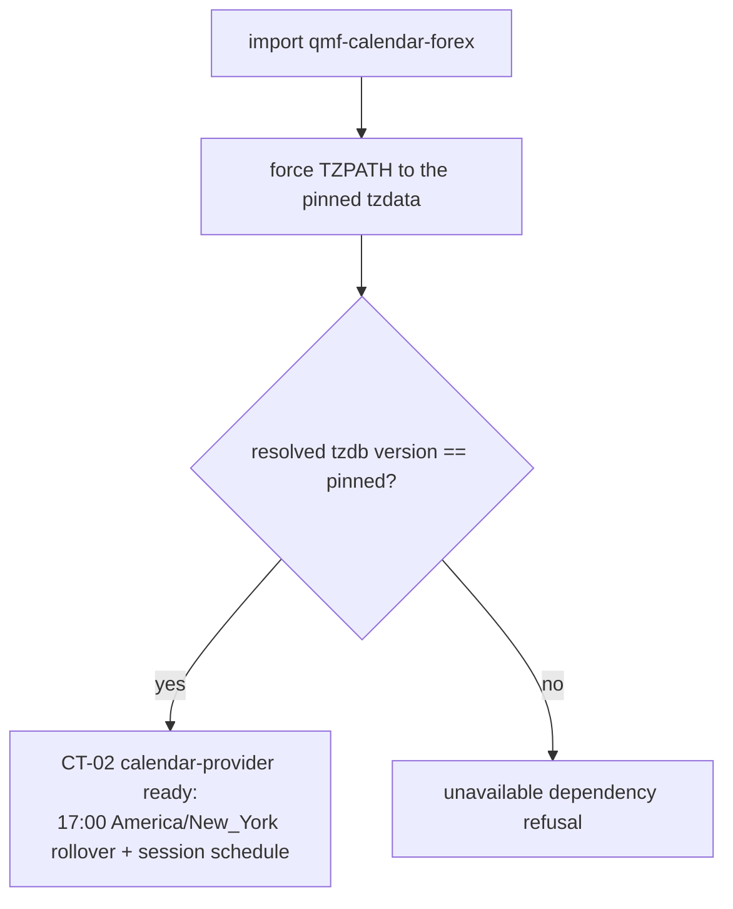

# qmf-calendar-forex

`COMP-QMF-CALENDAR-FOREX` is the first market-hours calendar extension: a separate versioned package that implements the CT-02 calendar-provider protocol for foreign-exchange trading hours and supplies nothing else. It lives in the QMF workspace but outside the seven-package roster, on its own SemVer ladder rather than the roster's lockstep versioning. [DEC-0100] [DEC-0106]

A market-hours calendar is one of three distinct named calendar concepts and must never be confused with the other two: the day-boundary calendar (an account-scoped accounting-boundary rule) and the news calendar (`COMP-CALENDAR-FEED`, the external event feed). This package answers only market-hours questions for forex. [DEC-0106]

## Authority boundary

May: implement the CT-02 calendar-provider protocol for forex; supply the two separately-named facts of a market-hours calendar — an accounting rollover (which trading date an instant belongs to) and a session schedule (when the market is open); expose its calendar rule-set identity and pinned `tzdata` version so both enter downstream fingerprints; pin exactly one `tzdata` package version, force the timezone path to that pin, and verify at import that the resolved tzdb version equals the pin; and version itself independently on its own SemVer ladder outside roster lockstep. [DEC-0100] [DEC-0106] [DEC-0108]

May never: define any shared noun — Venue, Account, Instrument, WriterId, TradingDate, CivilDate, and every other domain type are defined in `COMP-QMF-CORE` and only consumed here; act as a day-boundary calendar or a news calendar; format an instant to derive a trading date instead of applying the calendar rule set; attest a tzdb version it did not actually resolve; join the roster's lockstep version ladder; or ship as a package inside the `qmf.*` roster namespace. [DEC-0100] [DEC-0106] [DEC-0108]

## Interfaces

| Interface | Direction | Contract | Peer |
|---|---|---|---|
| Calendar-provider protocol implementation (rollover + session schedule) | out | [CT-02](../contracts/ct-02-time-calendar.yaml) | Implements a protocol defined in COMP-QMF-CORE; injected by the application composition root |
| Typed refusals (unavailable-dependency at import) | out | [CT-04](../contracts/ct-04-typed-refusal.yaml) | COMP-QMF-CORE |
| Exact time values (Instant, TradingDate, Interval, SessionWindow) | in | [CT-02](../contracts/ct-02-time-calendar.yaml) | COMP-QMF-CORE |

## Behavior

The forex market-hours calendar rolls the trading date at 17:00 America/New_York. This rollover is operator-adopted and independent of any venue's own bar slicing: the earlier 17:00-New-York cTrader claim was demoted to forum-grade evidence and is never hardcoded — a venue's actual daily boundary is measured per broker at first connection and, once verified, minted as a separate venue-scoped market-hours calendar identity. This extension's rollover stays QMF's accounting rule regardless. [DEC-0106] [DEC-0135] [DEC-0141]

The session schedule models weekend gaps and holidays in scope. Swap-Wednesday is dropped from V1: settlement machinery is deferred and the operator's accounts are swap-free. A dated financing or admin-fee charge may still exist elsewhere; "no swap" does not mean "no dated financing," and this extension models neither. [DEC-0106]

Calendar identity is the **rule set** (for example `forex-17NY` at a stated rule-set version), separate from its **binding** — which venues or accounts use it. Only the rule set plus the pinned `tzdata` version participate in fingerprints; a venue change that does not change the rule set does not change any derived-artifact identity. The single canonical `fp1` implementation in `COMP-QMF-CORE` computes those fingerprints; this extension computes none of its own. [DEC-0106] [DEC-0108]

At import the package forces the timezone path to its pinned `tzdata` and verifies that the resolved tzdb version equals the pin. On mismatch it returns an `unavailable dependency` typed refusal rather than proceeding — a fingerprint must never attest a tzdb that was not actually used. A `tzdata` pin change is at minimum a minor version bump on this package's own ladder. [DEC-0104] [DEC-0106] [DEC-0109]

Re-deriving a trading date under a newer `tzdata` version produces a new artifact with its own fingerprint and a lineage edge to the old one — never a rewrite and never a silent equality. [DEC-0103] [DEC-0108]

## Configuration

| Variable | Registry key | Notes |
|---|---|---|
| Accounting rollover time and zone | `registry:forex_rollover` | 17:00 America/New_York; QMF's own accounting rule, independent of the venue's measured per-broker daily boundary. [DEC-0106] [DEC-0135] |

The calendar rule-set name and the pinned `tzdata` version are set at extension release and both enter fingerprints (DEC-0106, DEC-0108); no registry key exists yet for them.

## Failure modes

| # | Condition | Behavior | Cites |
|---|---|---|---|
| FM-1 | The resolved tzdb version does not equal the pinned `tzdata` version at import. | The package returns an `unavailable dependency` refusal and does not become a usable provider; no fingerprint is attested against an unverified tzdb. | DEC-0106, DEC-0109 |
| FM-2 | A caller compares a `TradingDate` produced under this calendar identity against one produced under another. | Cross-calendar comparison is a typed refusal; equality is defined only within one calendar identity. | DEC-0106 |
| FM-3 | A caller derives a trading date by formatting an instant rather than applying the rule set. | Unsupported: trading date derives only from applying a calendar rule set, never from formatting an instant. | DEC-0106 |
| FM-4 | The extension is asked to answer an accounting-boundary (day-boundary) or news-event question. | Out of authority: this is a market-hours calendar only; the day-boundary and news-calendar concepts are separate named kinds. | DEC-0106 |
| FM-5 | An implementation tries to define a shared noun (Venue, Account, Instrument, TradingDate). | The conformance test fails: shared nouns are defined in `COMP-QMF-CORE`; the extension only implements the CT-02 provider protocol. | DEC-0100 |

## Related

Decisions: DEC-0100, DEC-0106, DEC-0108. Scenarios: none drafted. Knowledge: none drafted.
