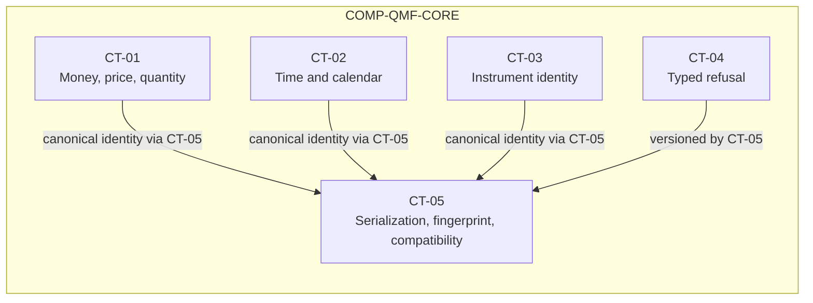

# qmf-core

`COMP-QMF-CORE` is the definitions-only library that gives every QMF component one exact, asset-neutral, versioned domain language. The component has no dependencies and owns CT-01 through CT-05 (DEC-0022, DEC-0030, DEC-0031).

## Authority boundary

May: define exact monetary and quantity values through CT-01; define exact time, civil-date, trading-date, and calendar concepts through CT-02; define asset-neutral market nouns through CT-03; define typed public refusals through CT-04; and define canonical serialization, fingerprints, and compatibility through CT-05 (DEC-0026, DEC-0027, DEC-0028, DEC-0029, DEC-0030).

May never: run a broker session, event loop, backtest, download job, scheduler, trading node, product UI, or application orchestration (DEC-0022); assume Forex, cTrader, scalping, or one deployment environment in its public contracts (DEC-0031); box consumers into a closed authoring surface (DEC-0011); or transplant a foreign platform or strategy-family contract into the QMX-owned domain boundary (DEC-0013).

## Interfaces

| Interface | Direction | Contract | Peer |
|---|---|---|---|
| Exact monetary values | out | [CT-01](../contracts/ct-01-money-quantity.yaml) | COMP-QMF-DATA, COMP-QMF-INDICATORS, COMP-QMF-VENUE, COMP-QMF-RISK |
| Exact time and calendar values | out | [CT-02](../contracts/ct-02-time-calendar.yaml) | COMP-QMF-REGISTRY, COMP-QMF-DATA, COMP-QMF-INDICATORS, COMP-QMF-STRUCTURE, COMP-QMF-VENUE, COMP-QMF-RISK |
| Instrument and venue identity | out | [CT-03](../contracts/ct-03-instrument-identity.yaml) | COMP-QMF-REGISTRY, COMP-QMF-DATA, COMP-QMF-INDICATORS, COMP-QMF-STRUCTURE, COMP-QMF-VENUE, COMP-QMF-RISK, COMP-QMF-DATA-INGEST |
| Typed refusal | out | [CT-04](../contracts/ct-04-typed-refusal.yaml) | COMP-QMF-REGISTRY, COMP-QMF-DATA, COMP-QMF-INDICATORS, COMP-QMF-STRUCTURE, COMP-QMF-VENUE, COMP-QMF-RISK, COMP-QMF-DATA-INGEST |
| Canonical identity and compatibility | out | [CT-05](../contracts/ct-05-version-fingerprint.yaml) | COMP-QMF-REGISTRY, COMP-QMF-DATA, COMP-QMF-INDICATORS, COMP-QMF-STRUCTURE, COMP-QMF-VENUE, COMP-QMF-RISK |

## Behavior

### Exact values

CT-01 represents money, price, and quantity without binary floating-point monetary values (DEC-0026). `GAP(GAP-0007): What representation, scale, units, quantization boundaries, overflow policy, and rounding mode define CT-01?`

CT-02 distinguishes exact instants, civil dates, trading dates, and venue or session calendar semantics without embedding a Forex-only calendar or scheduler (DEC-0027, DEC-0031). `GAP(GAP-0008): What encoding, timezone, session, DST, and rollover rules define CT-02?`

### Market nouns

CT-03 provides the asset-neutral nouns Instrument, Bar, Tick, Order, Fill, Position, and Account (DEC-0028, DEC-0031). `GAP(GAP-0009): What identity tuple, aliases, symbol-change rules, asset-class values, and metadata define these nouns?`

### Refusal and identity

CT-04 carries typed, versioned, machine-readable refusal outcomes without prescribing recovery policy (DEC-0029, DEC-0030). `GAP(GAP-0011): Which codes, fields, retryability rules, redaction rules, and exception mappings define CT-04?`

CT-05 gives semantic values and result artifacts deterministic versioned identities. An incompatible semantic change mints a new version instead of mutating old meaning (DEC-0029, DEC-0030). `GAP(GAP-0005): What version syntax, compatibility, and deprecation policy applies?` `GAP(GAP-0010): What canonical bytes, hash algorithm, and collision policy apply?` `GAP(GAP-0012): Which result-label fields participate in identity?`

## Configuration

| Variable | Registry key | Notes |
|---|---|---|
| Monetary representation | `registry:monetary_representation` | `GAP(GAP-0007)`; binary floating point is prohibited. |
| Money scale | `registry:money_decimal_scale` | `GAP(GAP-0007)`; no scale is ratified. |
| Price scale | `registry:price_decimal_scale` | `GAP(GAP-0007)`; venue precision metadata is unresolved. |
| Quantity scale | `registry:quantity_decimal_scale` | `GAP(GAP-0007)`; quantization is unresolved. |
| Rounding mode | `registry:money_rounding_mode` | `GAP(GAP-0007)`; rounding is an operator choice. |
| Timestamp precision | `registry:timestamp_precision` | `GAP(GAP-0008)`; no encoding is ratified. |
| Instrument identity shape | `registry:instrument_identity_shape` | `GAP(GAP-0009)`; venue-plus-symbol is a recommendation only. |
| Fingerprint algorithm | `registry:canonical_hash_algorithm` | `GAP(GAP-0010)`; algorithm and canonical bytes are unresolved. |
| Contract version syntax | `registry:contract_version_syntax` | `GAP(GAP-0005)`; public contracts are versioned from birth. |
| Refusal codes | `registry:typed_refusal_codes` | `GAP(GAP-0011)`; the taxonomy is unresolved. |
| Result identity | `registry:result_identity_key` | `GAP(GAP-0012)`; the result-label tuple is unresolved. |
| Design workload | `registry:design_bot_concurrency` | `GAP(GAP-0013)`; this is a design case, not a ratified SLO. |

## Failure modes

| # | Condition | Behavior | Cites |
|---|---|---|---|
| FM-1 | A monetary public contract receives a binary floating-point representation. | The value does not conform to CT-01 and must not enter QMF state; the exact CT-04 code is `GAP(GAP-0011)`. | DEC-0026, DEC-0029 |
| FM-2 | A time value cannot be mapped unambiguously to the ratified instant or trading-date semantics. | The value is not constructed as CT-02; the exact ambiguity and refusal rules are `GAP(GAP-0008)` and `GAP(GAP-0011)`. | DEC-0027, DEC-0029 |
| FM-3 | An instrument identifier depends on a venue-specific assumption absent from CT-03. | The identifier has no canonical QMF identity; identity fields and the refusal payload remain `GAP(GAP-0009)` and `GAP(GAP-0011)`. | DEC-0028, DEC-0031 |
| FM-4 | A consumer presents an incompatible semantic version as compatible. | CT-05 must not report compatibility; migration, deprecation, and refusal detail remain `GAP(GAP-0005)` and `GAP(GAP-0011)`. | DEC-0030 |
| FM-5 | Two semantic values cannot be distinguished under the proposed canonical encoding. | No stable fingerprint is issued until `GAP(GAP-0010)` defines canonical bytes and collision policy. | DEC-0029 |

## Related

Decisions: DEC-0011, DEC-0013, DEC-0022, DEC-0026, DEC-0027, DEC-0028, DEC-0029, DEC-0030, DEC-0031. Scenarios: [SCN-0001 core freeze gate](../scenarios/SCN-0001-core-freeze-gate.md), [SCN-0007 human promotion](../scenarios/SCN-0007-human-promotion.md). Knowledge: none in the current provisional set.
