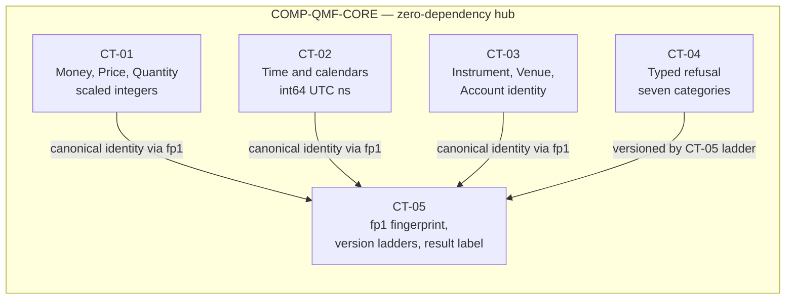

# qmf-core

`COMP-QMF-CORE` is the definitions-only, zero-dependency library that gives every QMF component one exact, asset-neutral, versioned domain language. It carries only definitions — exact value types, domain nouns, typed refusals, fingerprints, and protocol seams — and owns CT-01 through CT-05; every other package depends inward on it and it depends on nothing (DEC-0022, DEC-0104, DEC-0120). Public value types are frozen dataclasses and every seam is a `typing.Protocol` (DEC-0101).

## Authority boundary

May: define exact monetary and quantity values through CT-01 (DEC-0105); define exact time, civil-date, trading-date, duration, interval, and rule-set market-hours, day-boundary, and news-calendar concepts through CT-02, with clock access as a definitions-only protocol seam injected at the composition root (DEC-0106); define asset-neutral market nouns and the identity types VenueId, Instrument, Venue, and Account through CT-03 (DEC-0028, DEC-0107); define the seven-category typed refusal through CT-04 (DEC-0109); define canonical serialization, the single `fp1` fingerprint implementation, the two version ladders, and the result label through CT-05 (DEC-0108, DEC-0103, DEC-0110); define the series vocabulary — `Bar`, `Tick`/`Quote`, `BarSpec`, series references, and the exact-rational parameter type — plus `PriceDelta`, as shared nouns no other package may define (DEC-0126, DEC-0130, DEC-0131); anchor `Position` and `Order` as AD-2 shared nouns each carrying the venue-position vs virtual-(Book)-position split, and define the closed unit-kind vocabulary and the pinned canonical numeric form for identity (DEC-0154, DEC-0158); define the venue-credential value types `SecretRef` and `SecretValue` — opaque, construction-validated references whose values never render and never enter fingerprints (DEC-0136) — and the core sink protocols `ObservationSink`, `JournalSink`, `RecordSink`, and the read-plus-atomic-replace `SecretStore`, as definitions-only seams injected at the composition root that take no dependency edge (DEC-0138); require immutable values, pure core computation, `correlation_id` propagation, and a `health()` self-check from every component built on it (DEC-0112, DEC-0113).

May never: run a broker session, event loop, backtest, download job, scheduler, trading node, product UI, or application orchestration (DEC-0022); take any outside dependency — `qmf-core` is stdlib-only (DEC-0104); spawn threads or background work, or expose async APIs in its pure surface — applications own all concurrency and async lives only at the venue network edge (DEC-0113); assume Forex, cTrader, scalping, or one deployment environment in its public contracts (DEC-0031); box consumers into a closed authoring surface (DEC-0011); transplant a foreign platform or strategy-family contract into the QMX-owned domain boundary (DEC-0013); or own the records and lifecycle of the shared nouns it defines — Venue and Account records are owned by `qmf-registry`, and `qmf-core` defines the nouns only (DEC-0107).

## Interfaces

| Interface | Direction | Contract | Peer |
|---|---|---|---|
| Exact monetary values | out | [CT-01](../contracts/ct-01-money-quantity.yaml) | COMP-QMF-DATA, COMP-QMF-INDICATORS, COMP-QMF-VENUE, COMP-QMF-RISK |
| Exact time and calendar values | out | [CT-02](../contracts/ct-02-time-calendar.yaml) | COMP-QMF-REGISTRY, COMP-QMF-DATA, COMP-QMF-INDICATORS, COMP-QMF-STRUCTURE, COMP-QMF-VENUE, COMP-QMF-RISK |
| Instrument, venue, and account identity | out | [CT-03](../contracts/ct-03-instrument-identity.yaml) | COMP-QMF-REGISTRY, COMP-QMF-DATA, COMP-QMF-INDICATORS, COMP-QMF-STRUCTURE, COMP-QMF-VENUE, COMP-QMF-RISK, COMP-QMF-DATA-INGEST |
| Typed refusal | out | [CT-04](../contracts/ct-04-typed-refusal.yaml) | COMP-QMF-REGISTRY, COMP-QMF-DATA, COMP-QMF-INDICATORS, COMP-QMF-STRUCTURE, COMP-QMF-VENUE, COMP-QMF-RISK, COMP-QMF-DATA-INGEST |
| Canonical identity, versioning, and result label | out | [CT-05](../contracts/ct-05-version-fingerprint.yaml) | COMP-QMF-REGISTRY, COMP-QMF-DATA, COMP-QMF-INDICATORS, COMP-QMF-STRUCTURE, COMP-QMF-VENUE, COMP-QMF-RISK |

## Behavior

### Exact values

CT-01 represents Money, Price, and Quantity as whole-number integer counts at a declared scale — `Money(currency, scale)`, `Price(instrument, scale)` as an instrument-tagged ratio never tagged with a single currency, and `Quantity(unit, scale)` with an opaque unit such as lot, share, coin, or contract (DEC-0105). Mixed-scale arithmetic on the same currency or unit auto-promotes losslessly to the finer scale or returns a typed refusal; it never silently rescales or rounds (DEC-0105, DEC-0109). The money path is a taint, not a location: any value that transitively contributes to an order quantity, price, P&L, or balance is on the money path regardless of which package computed it, and binary float is banned there. A float crosses back to Money, Price, or Quantity only through a named conversion boundary that states its rounding mode explicitly — the venue adapter boundary is one such named boundary (DEC-0105). Foreign money is stored verbatim as evidence with its declared scales; conversions to framework values are derived with lineage, and corrections are annotations, never rewrites (DEC-0105). Foreign floats are evidence too but never identity: a venue value delivered as a binary float crosses this named boundary at receipt to a scaled integer at a per-value-class pinned target scale — execution price to the instrument's declared digits, money to the account's declared money exponent, market data to the declared wire scale — under a declared, identity-bearing rounding mode, and the raw float is retained only as integrity-checked provenance, never the value a consumer reads (DEC-0141). Analytic float series remain permitted off the money path; their identity is label-derived (DEC-0110), never a hash of float bytes (DEC-0108). Price subtraction is closed and delta-typed: `PriceDelta(instrument, scale)` is a first-class value distinct from Price, and the instrument-scoped pip or point is defined by CT-03's metadata records, never hardcoded (DEC-0131). The exact-rational parameter type — a scaled integer or numerator/denominator pair — extends this idiom to every non-integer parameter such as ratios, multiples, and tolerances, so binary floats never appear in parameters or identity (DEC-0131). An exact rational entering identity content takes a pinned canonical form — reduced to lowest terms, denominator strictly positive, sign on the numerator, two-key serialization — and every `Money`, `Price`, `Quantity`, or `PriceDelta` value entering identity carries the declared canonical storage scale for its value class, so equal value implies equal fingerprint by construction (DEC-0158). Every value additionally carries a unit-kind from the closed vocabulary `money(currency) | price-delta(instrument) | quantity(unit) | value-factor(instrument, currency) | r-multiple | rate(money-per-r) | count | dimensionless-ratio | duration | instant`; `value-factor` is money per price-delta per quantity — the tick, point, or contract value — an exact rational sourced only from venue instrument-metadata snapshots (an absent value factor is an `unavailable dependency` refusal, never a silent conversion), `r-multiple` is a dimensionless exact rational and `rate(money-per-r)` the sole money-to-R bridge, and unit-kind additions are spine amendments only (DEC-0154). The two money-path crossings are named boundaries with one `qmf-core` implementation each: the exact-to-analytic descale (pinned formula, stated rounding, refused past float64's exact-integer range — no package descales except by calling it) and the analytic-to-exact return (an output channel or evaluated level declares its rounding mode and target scale as fingerprinted contract surface) (DEC-0126).

### Exact time and calendars

CT-02 encodes every stored timestamp as an int64 count of UTC nanoseconds since the Unix epoch (POSIX no-leap-second semantics), with a representable range of 1677 through 2262 and all nanosecond arithmetic checked — overflow is an `invalid input` refusal, never a wrap (DEC-0106). CivilDate and TradingDate are distinct types; a TradingDate carries its calendar identity and version in-band, equality is defined only within one calendar identity, and cross-calendar comparison is a typed refusal; causality is compared on instants only, never on trading date (DEC-0106). Duration (signed int64 nanoseconds, clock-agnostic and freely storable) and half-open Interval live in core, alongside WriterId as a first-class noun minted per (machine, role, stream) with a boot/epoch id (DEC-0106). On the venue path WriterId is minted at a finer granularity — `(machine, adapter role, VenueId, account)`, the same unit as the venue command stream — and a session-epoch id distinct from the boot epoch rides every venue observation, with sequences resetting only on boot (DEC-0137, DEC-0138). Wall and monotonic clock kinds are type-separated — a monotonic reading is never an Instant and is persistable only as a boot-scoped opaque diagnostic (DEC-0106). Clock access is a core-defined protocol seam: the composition root injects the real clock, replay injects a data-driven one, and nothing below the root reads the system clock (DEC-0022, DEC-0106). Record streams carry a per-writer strictly-increasing sequence, and `(instant, writer, sequence)` is a replay-determinism ordering key with no causal meaning (DEC-0106).

Calendar identity is the rule set (for example `forex-17NY` v3), separate from its binding to venues or accounts; only the rule set plus tzdata version enter fingerprints (DEC-0106). Market-hours calendar, day-boundary calendar, and news calendar are three distinct named concepts, never conflated: a market-hours calendar carries a separately-named accounting rollover and session schedule; a day-boundary calendar is an account-parameterized evaluation-day rule; and the news calendar is the `COMP-CALENDAR-FEED` event feed (DEC-0106). `qmf-core` embeds no market-hours calendar rule set — calendars ship as separate versioned extensions that pin their tzdata package and verify the resolved tzdb version at import, refusing `unavailable dependency` on a mismatch so a fingerprint never attests a tzdb that was not used (DEC-0106, DEC-0031). The first forex market-hours calendar uses a 17:00 America/New_York rollover (`registry:forex_rollover`), weekend gaps, and holidays in scope, with swap-Wednesday dropped from V1 (DEC-0106). A civil-time bucket key — derived from an instant plus a declared zone and tzdata version — is a legitimate computed grouping value for seasonality or session-of-day statistics: it is never a timestamp and never a causality proxy, and it is identity-bearing including its zone and tzdata version, so the display-only rule governs evidence timestamps, not computed grouping keys (DEC-0131). The forex calendar's holiday list is calendar-extension data pinned and versioned per extension with its tzdata; the venue's own broker-supplied schedule and holiday axes are ratified venue facts stored verbatim, never assumed aligned to this calendar (DEC-0135, DEC-0141).

### Market nouns and identity

CT-03 defines instrument identity as `(venue, venue's own symbol)`, the symbol opaque and never parsed (DEC-0107). VenueId is operator-minted, opaque, stable, never derived from a mutable broker attribute, and never reused; a distinct broker or legal entity is a distinct venue even on shared infrastructure — a prop firm white-labeling cTrader is its own venue (DEC-0107). Aliases, renames, asset class, and mutable metadata are separate dated records pointing at identities; stored history never rewrites (DEC-0107). Venue and Account are distinct first-class nouns defined here in `qmf-core`, but their records and lifecycle are owned by `qmf-registry` — edge modules never define shared nouns (DEC-0107, DEC-0100). One venue may hold many accounts, each carrying exactly one role from the fixed set `live | demo | paper-validation | paper-benched | prop-firm`; Books bind to accounts, never to venues (DEC-0107). `qmf-core` also defines the broader asset-neutral market nouns — Instrument, Bar, Tick, Order, Fill, and Position — so later Forex, equities, and crypto consumers fit without a core rebuild (DEC-0028, DEC-0031). `Position` and `Order` are anchored as AD-2 shared nouns — shared across `qmf-venue`, `qmf-risk`, and `qmf-registry`, so they may live nowhere else — and `Position` carries the venue-position vs virtual-(Book)-position split: a **venue position** is observation-derived under the venue's declared `netting | hedging` model, while a **virtual (Book) position** is a fold over fills joined by declared command identity — binding-scoped, Bot-attributed, minted at admission, carrying the frozen R faces, and the unit of CT-29 exit records and AD-41 folds; every risk record names which of the two it references (DEC-0154). The series vocabulary is defined here as shared nouns that no other package may define: `Bar` (OHLC plus interval and BarSpec), `Tick`/`Quote` (bid/ask with source timestamps), `BarSpec` (`registry:barspec_kinds`), series references, and the exact-rational parameter type (DEC-0126, DEC-0130). `BarSpec` is a discriminated aggregation rule — time-interval, tick-count, volume-threshold, notional-threshold, price-brick, range, or session — with exact parameters and, for time-based kinds, the anchoring calendar identity and version; it replaces the bare word "timeframe" everywhere (DEC-0126). Bar aggregation itself is not a core concern — it is a fingerprinted `qmf-data` derivation — but a bar series is well-defined only through its `BarSpec` (DEC-0126, DEC-0130).

### Refusal and identity

CT-04 makes every public QMF operation either succeed or return a typed refusal carrying a category, machine-readable context, and a retryability answer (`yes | no | after-condition`). The category is exactly one of seven values — invalid input, unsupported capability, unavailable dependency, stale evidence, policy rejection, transient venue failure, storage failure — addable in later contract format versions, never redefined (DEC-0109). Refusals are returned across public boundaries as one arm of a result union; exceptions are reserved for programmer error and never carry a refusal across a package boundary (DEC-0109). Value-type construction is one pattern everywhere: an unchecked constructor for trusted internal use plus a validating `try_create` factory returning value-or-refusal (DEC-0109).

CT-05 gives every semantic definition and every computed result a deterministic, versioned identity. The canonical serializer and the `fp1` fingerprint function live only in `qmf-core`; no other package computes a fingerprint except by calling it (DEC-0108). The pinned `fp1` recipe is UTF-8 JSON with object keys sorted lexicographically at every depth, no insignificant whitespace, NFC-normalized strings, integer-only identity numerics (floats refused in identity content), exact rationals and money-class values additionally in CT-01's pinned canonical form (lowest terms, positive denominator, declared canonical storage scale per value class), null prohibited (an absent value is an omitted key), order-significant arrays, hashed SHA-256 and emitted as `fp1:sha256:<hex>`; a recipe upgrade mints `fp2` while old fingerprints stay valid forever (DEC-0108, DEC-0158). Every contract field is identity by default; a display-only exclusion requires an explicit, versioned declaration in the contract (DEC-0108). Two version ladders never conflate: code packages use SemVer in lockstep (display-only provenance that never enters identity) while every serialized artifact stamps its own integer contract format version, whose meaning never mutates — an incompatible change mints the next version plus a migration note, and QMF never loses the ability to read old stored evidence (DEC-0103). Every result entering evidence carries a label whose parts are its identity: producer contract identity (the configured producer's fingerprint, distinct from the format version, so `EMA(20)` and `SMA(20)` can never share a label), producer contract format version, input fingerprints, evidence time range, computation identity, evidence class (confirmed, unconfirmed, or provisional — `registry:evidence_classes`), and world (DEC-0110, DEC-0131). The world is one of `live`, `replay`, or `simulated`, where `simulated` is reserved but unusable in V1 (DEC-0110). An idempotent byte-identical re-write is accepted silently; a true collision — same hash, differing bytes — is refused and alarmed, never overwritten (DEC-0108).

### Secret references and injected ports

`qmf-core` defines the venue-credential value types `SecretRef` and `SecretValue` so no QMF component handles a secret value where a reference suffices (DEC-0136). A `SecretRef` is an opaque minted id under the same discipline as `VenueId` — stable, never reused, and never encoding venue, broker, account, environment, or key material; any human-readable label is a separate field held outside evidence, and construction validates opacity, returning an `invalid input` refusal otherwise (DEC-0136, DEC-0109). A `SecretValue` never renders its value: `repr`, `str`, serialization, and logging all yield the reference id, and a secret reference is occurrence/display-only and excluded from `fp1` identity — a credential is a deployment fact and never enters a fingerprint (DEC-0136, DEC-0108).

The composition-root sink ports are core-defined protocol seams, the same idiom as the clock seam. `ObservationSink`, `JournalSink`, `RecordSink`, and `SecretStore` — the last a read-plus-atomic-replace port — are `typing.Protocol`s defined in `qmf-core` and injected at the composition root; a component persists or reads through them without importing any store, registry, or venue package, so injecting a sink creates no dependency edge (DEC-0138). `qmf-core` holds no secret value itself: the sole component permitted to hold a `SecretValue` in memory is the venue adapter's connection manager, for a session's lifetime, receiving it only through the core-defined `SecretStore` port (DEC-0136, DEC-0138).

### Cross-cutting guarantees

`qmf-core` is stdlib-only: it takes zero outside dependencies so factory sandboxes stay weightless (DEC-0104), and it imports in well under one second (`registry:core_import_time_budget`) as a stated design constraint (DEC-0111). Its public value types are frozen dataclasses and its seams are `typing.Protocol`s (DEC-0101). Core values are immutable and safe to share by construction, and core computation is pure — `qmf-core` never spawns threads or background work, and async APIs exist only at the venue network edge, never here (DEC-0113). Errors and refusals always carry context and are never swallowed; structured logging propagates a `correlation_id` field across every package boundary, and every component exposes a no-argument `health()` returning a typed report (DEC-0112). Everything downstream of QMF — the trading node, backtesting, the agentic system, and the UI — is built with these libraries rather than re-implementing their contracts (DEC-0122).

The indicator protocol is now ratified: CT-16 defines input series, output alignment, warm-up, statefulness, streaming updates, and typed failures over the core value and refusal types, and its series vocabulary — `Bar`, `Tick`/`Quote`, `BarSpec`, and the exact-rational parameter type — is defined here in `qmf-core` (DEC-0126, DEC-0130). The venue-adapter boundary that GAP-0038 held open is now resolved: the minimum contract is one neutral port with four contracts — CT-18 capability, CT-19 command, CT-20 event, CT-21 secret/session — defined by `qmf-venue` on `qmf-core` nouns, so no venue-specific concept enters `qmf-core` and a later crypto or stock venue slots in by declaring a different record through the same port; nothing imports `qmf-venue` (DEC-0138).

## Configuration

| Variable | Registry key | Notes |
|---|---|---|
| Monetary representation | `registry:monetary_representation` | Scaled integers; binary float banned on the money path (DEC-0105). |
| Money scale | `registry:money_decimal_scale` | Declared per value on `Money(currency, scale)`; foreign scales stored verbatim (DEC-0105). |
| Price scale | `registry:price_decimal_scale` | Declared per value on `Price(instrument, scale)`, an instrument-tagged ratio (DEC-0105). |
| Quantity scale | `registry:quantity_decimal_scale` | Declared per value on `Quantity(unit, scale)` with an opaque unit (DEC-0105). |
| Rounding mode | `registry:money_rounding_mode` | Explicit only at named conversion boundaries; mixed-scale arithmetic auto-promotes or refuses (DEC-0105). |
| Timestamp precision | `registry:timestamp_precision` | int64 UTC nanoseconds, POSIX no-leap-second (DEC-0106). |
| Timestamp valid range | `registry:timestamp_valid_range` | 1677–2262; overflow is a checked `invalid input` refusal (DEC-0106). |
| Forex rollover | `registry:forex_rollover` | 17:00 America/New_York accounting rollover of the first forex market-hours calendar; operator-adopted and independent of venue bars — a venue's own daily boundary is measured per broker, never assumed equal to this rule (DEC-0106, DEC-0135). |
| Instrument identity shape | `registry:instrument_identity_shape` | `(venue, opaque venue symbol)`; symbol never parsed (DEC-0107). |
| Series vocabulary | `registry:barspec_kinds` | `BarSpec` aggregation kinds — time-interval, tick-count, volume-threshold, notional-threshold, price-brick, range, session; replaces bare "timeframe" (DEC-0126, DEC-0130). |
| Fingerprint algorithm | `registry:canonical_hash_algorithm` | `fp1:sha256`; single implementation in `qmf-core`; upgrades mint `fp2` (DEC-0108). |
| Contract version syntax | `registry:contract_version_syntax` | Per-contract integer format versions; packages SemVer lockstep, 0.x until the V1 blueprint ships (DEC-0103). |
| Refusal codes | `registry:typed_refusal_codes` | The seven categories; addable in later versions, never redefined (DEC-0109). |
| Result identity | `registry:result_identity_key` | The result label; producer contract identity and evidence class join the identity parts (DEC-0131); display names live outside identity (DEC-0110). |
| Evidence class | `registry:evidence_classes` | Confirmed, unconfirmed, or provisional; a named identity part of the result label (DEC-0131). |
| Runtime | `registry:python_version` | CPython 3.14 pinned across all packages, CI, and sandboxes (DEC-0099). |
| Coverage floor | `registry:coverage_floor_percent` | 80% per package; CT-01 and CT-02 primitive modules require 100% branch coverage (DEC-0101). |
| Core import budget | `registry:core_import_time_budget` | Well under one second; stated design constraint, not a measured baseline (DEC-0111). |
| Design workload | `registry:design_bot_concurrency` | Roughly forty Bots; a benchmark-sizing reference, not a ratified SLO (DEC-0111). |

## Failure modes

| # | Condition | Behavior | Cites |
|---|---|---|---|
| FM-1 | A binary float reaches a value on the money path (a value transitively contributing to an order quantity, price, P&L, or balance), or a float appears in `fp1` identity content. | The value does not construct: `try_create` returns an `invalid input` typed refusal. Float crosses back to Money, Price, or Quantity only at a named conversion boundary with an explicit rounding mode, and is refused in identity content. | DEC-0105, DEC-0108, DEC-0109 |
| FM-2 | Nanosecond arithmetic would overflow the representable range 1677–2262, or an instant is otherwise malformed. | An `invalid input` typed refusal is returned; overflow is never wrapped, and an absent time is an absent field, never a zero sentinel. | DEC-0106, DEC-0109 |
| FM-3 | Two TradingDates from different calendar identities are compared, or a TradingDate is used as a causality proxy. | Cross-calendar comparison returns a typed refusal (the specific CT-04 category is not pinned by the spine); causality is compared on instants only. | DEC-0106, DEC-0109 |
| FM-4 | Mixed-scale arithmetic on the same currency or unit cannot auto-promote losslessly. | A typed refusal is returned; there is never an implicit rescale or silent rounding. | DEC-0105, DEC-0109 |
| FM-5 | A calendar extension's resolved tzdb version does not equal its pinned tzdata version at import. | An `unavailable dependency` typed refusal is raised at import, so a fingerprint never attests a tzdb that was not used. | DEC-0106, DEC-0109 |
| FM-6 | A write presents the same `fp1` hash with differing bytes (a true collision). | The write is refused and alarmed, never overwritten; a byte-identical idempotent re-write is accepted silently. | DEC-0108 |
| FM-7 | A result label declares `world = simulated` for governed evidence. | A `policy rejection` typed refusal is returned; `simulated` is reserved but unusable in V1 until the backtesting sitting defines simulated-time typing. | DEC-0110 |
| FM-8 | Any public core operation fails. | It returns a typed refusal carrying context, never raises across a package boundary and never swallows the error; `transient venue failure` and `storage failure` categories arise at the venue and data boundaries, not in this pure surface. | DEC-0109, DEC-0112 |
| FM-9 | A `SecretValue` is constructed from a non-opaque reference, or a caller tries to render, serialize, log, or fingerprint a secret value. | Non-opaque construction returns an `invalid input` typed refusal; a `SecretValue`'s `repr`, `str`, serialization, and logging yield only the reference id, and the reference is excluded from `fp1` identity — the value never renders and never enters a fingerprint. | DEC-0136, DEC-0108, DEC-0109 |

## Related

Decisions: DEC-0011, DEC-0013, DEC-0022, DEC-0026, DEC-0027, DEC-0028, DEC-0029, DEC-0030, DEC-0031, DEC-0099, DEC-0100, DEC-0101, DEC-0103, DEC-0104, DEC-0105, DEC-0106, DEC-0107, DEC-0108, DEC-0109, DEC-0110, DEC-0111, DEC-0112, DEC-0113, DEC-0120, DEC-0122, DEC-0126, DEC-0130, DEC-0131, DEC-0134, DEC-0136, DEC-0137, DEC-0138, DEC-0141, DEC-0154, DEC-0158. Scenarios: [SCN-0001 core freeze gate](../scenarios/SCN-0001-core-freeze-gate.md), [SCN-0007 human promotion](../scenarios/SCN-0007-human-promotion.md). Knowledge: none in the current provisional set.
