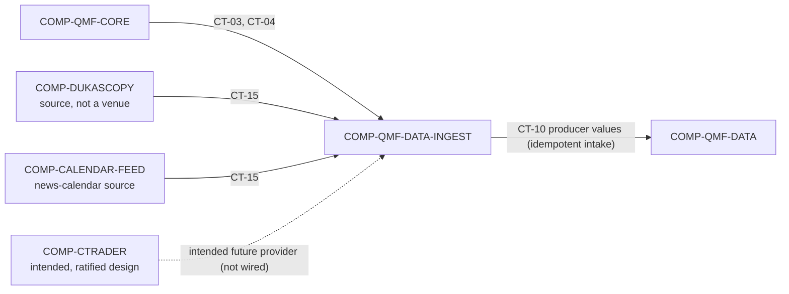

# qmf-data Source-Ingest Seam

`COMP-QMF-DATA-INGEST` is the middleware seam that owns and calls the CT-15 external-source port, translating external historical-tick and news-calendar evidence into source-identified observation values for the Data-owned CT-10 boundary. qmf-data defines the source contracts, normalization, validation, and idempotent intake; applications own scheduling, retries, supervision, and UI (DEC-0119, AD-21). The seam owns no scheduled application lifecycle and no data-governance rule (DEC-0042, DEC-0051, DEC-0052).

## Authority boundary

May: own and call the CT-15 external-provider request/response port; resolve incoming instruments through CT-03; translate adapter failures through CT-04 typed refusals; validate, normalize, and submit CT-10 producer observation values only to the Data-owned public boundary; apply idempotent intake keyed on `(source, source-native id, revision)` where a provider revision is a new artifact, never an fp1 collision (DEC-0119, DEC-0108); store foreign timestamps and foreign money verbatim as evidence with their declared zone and scale (DEC-0106, DEC-0105); keep tick sources separately identified with bid and ask preserved and their source timestamps kept, and keep source disagreements visible via `corroborates` / `disagrees-with` typed edges (DEC-0119); keep the news-calendar recorder's provider-native identity and revisions (DEC-0119); and support bounded, idempotent calls used by first-install historical acquisition (DEC-0051, DEC-0053).

May never: operate a scheduler, daemon, process supervisor, retry loop, or operator UI; own the standalone news-calendar recorder application; invent provider schemas, rate limits, legal-retention rights, source keys, or correction behavior; merge disagreeing sources without lineage edges; conflate a read-only `source` with a tradeable `VenueId` (DEC-0117, DEC-0107); mutate Data policy; or persist raw evidence directly around CT-10 and CT-11 (DEC-0042, DEC-0051, DEC-0052, DEC-0053).

## Interfaces

| Interface | Direction | Contract | Peer |
|---|---|---|---|
| Instrument, venue, and account identity | in | [CT-03](../contracts/ct-03-instrument-identity.yaml) | COMP-QMF-CORE |
| Typed refusal (seven categories) | in | [CT-04](../contracts/ct-04-typed-refusal.yaml) | COMP-QMF-CORE |
| Source-observation producer input | out (value) | [CT-10](../contracts/ct-10-source-observation.yaml) | COMP-QMF-DATA |
| External-provider request/response port | in/out | [CT-15](../contracts/ct-15-external-source-adapter.yaml) | COMP-DUKASCOPY, COMP-CALENDAR-FEED |

## Behavior

### External source boundary

Data-Ingest is the QMF owner and caller of CT-15. Requests flow from Data-Ingest to the active external providers `COMP-DUKASCOPY` and `COMP-CALENDAR-FEED`, and responses flow back to Data-Ingest; `COMP-QMF-DATA` is not a CT-15 caller or consumer and accepts only Data-Ingest producer observation values through the Data-owned CT-10 boundary (DEC-0117). Each provider is a **source** — a core provenance noun orthogonal to `VenueId`: a provider QMF only reads from is a source, a provider it can trade at is a venue — so `COMP-DUKASCOPY` and `COMP-CALENDAR-FEED` are sources, never venues (DEC-0117, DEC-0107).

Intake is idempotent keyed on `(source, source-native id, revision)`; a provider revision is a new artifact with its own fp1 fingerprint, never a collision (DEC-0119, DEC-0108). Foreign timestamps and foreign money in provider payloads are stored verbatim with their declared zone, offset, resolution, and scale; conversions to framework Time and Money are derived under lineage, and corrections are appended, never overwritten (DEC-0106, DEC-0105, DEC-0117).

`COMP-CTRADER` is an **intended** provider whose adapter ships through the factory pipeline, and its venue facts are **ratified** with corrected evidence grades (DEC-0135): timestamps are per-field-documented Unix milliseconds UTC with named epoch exceptions; no server clock exists, so receive-time recording is mandatory; rate limits are 50/5 requests per second per connection with a documented one-week tick-span cap; three independent wire-scale systems apply, with the full symbol record required before any price decode. The daily-bar boundary and trend-bar price basis are **measured per broker** at first connection and re-verified by a continuous monitor, never hardcoded, and broker/account identity is deployment configuration, never architecture (DEC-0135, DEC-0139). Venue market data enters as CT-10 source observations through this same CT-15 intake path — application-mediated, no fifth contract, no new dependency edge (DEC-0138).

### Tick and news-calendar recording

Historical tick acquisition begins with Dukascopy-class evidence; forward broker tick capture is a separate venue/application path that waits for the broker API application and connection, so `COMP-QMF-DATA-INGEST` has no dependency on `COMP-CTRADER` (DEC-0053). That application is now named: the trading node (`COMP-QMN`) hosts the forward capture on its VPS plane, where the connection manager's canonical sensing feed IS the recorder and a separate recorder process cannot hold its own live connection; `COMP-QMF-DATA-INGEST` still takes no dependency on `COMP-CTRADER` and this seam continues to own no scheduled application lifecycle (DEC-0053, DEC-0188). Tick sources are separately identified (Dukascopy history versus the future broker feed); bid and ask are preserved with their source timestamps and are never merged; where two sources disagree, `corroborates` / `disagrees-with` typed edges keep the disagreement visible rather than merging it away (DEC-0119).

The **news-calendar** recorder (a distinct concept from the market-hours calendar and the day-boundary calendar) keeps provider-native identity and revisions through the same idempotent `(source, source-native id, revision)` intake; scheduling stays outside QMF — it is the trading node's `qmn-news-calendar.timer` unit on a configurable refresh cadence, with Forex Factory's free weekly file the SOLE V1 source and no paid fallback ever (DEC-0198, DEC-0214) — and the legal archiving posture remains an open operator item, recorded not resolved (DEC-0119).

### Observation translation

Every submitted CT-10 observation preserves distinct event-time and known-at, source and instrument identity, writer and sequence, and its fp1 identity (DEC-0117, DEC-0106, DEC-0108). `COMP-QMF-DATA` owns the CT-10 schema and is the only ratified reader of Data-Ingest output; Data-Ingest does not publish CT-10 directly to Indicators, Structure, Venue, or Risk, which reach evidence only through the Data-owned governed-read boundary once a `qmf-data` inter-library edge is ratified under default-deny (DEC-0120). The seam may validate and normalize only what CT-10 and CT-15 authorize; raw-evidence retention, processed-data policy, dataset splits, journal policy, and storage remain the authority of `COMP-QMF-DATA` and `COMP-QMF-DATA-STORE` (DEC-0042).

### Lifecycle boundary

QMF exposes ingest plumbing and supports an application-driven first-install historical load, but scheduled acquisition lifecycle stays outside the reusable library and middleware seam (DEC-0051). The standalone news-calendar recorder invokes this seam; it is not implemented inside it (DEC-0052). Applications own scheduling, retries, supervision, and UI (DEC-0119).

## Configuration

| Variable | Registry key | Notes |
|---|---|---|
| Instrument identity shape | `registry:instrument_identity_shape` | `(venue, opaque-venue-symbol)`; the symbol is opaque and never parsed (DEC-0107). |

No ingest-owned source, rate-limit, retry, batching, or legal-retention variable is registered: scheduling and lifecycle are application-owned (DEC-0119), the broker feed's published rate ceilings are ratified venue facts (DEC-0135), and rate/retry/pacing constants are node values under the do-not-default standing (DEC-0137).

## Failure modes

| # | Condition | Behavior | Cites |
|---|---|---|---|
| FM-1 | An external source is unavailable or rate-limits a request. | The seam emits no fabricated observation and returns a `transient venue failure` or `unavailable dependency` typed refusal; the broker feed's published per-connection limits are ratified venue facts (DEC-0135), and pacing constants stay node values under do-not-default (DEC-0137). | DEC-0109, DEC-0053 |
| FM-2 | A source record cannot provide event-time, known-at, source key, revision, or instrument mapping. | No valid CT-10 observation is emitted; the seam returns an `invalid input` typed refusal. | DEC-0109, DEC-0117 |
| FM-3 | Duplicate, out-of-order, or corrected source material arrives. | Idempotent `(source, source-native id, revision)` intake makes a revision a new artifact; evidence is never erased or merged silently, and disagreements are kept via `corroborates` / `disagrees-with` edges. | DEC-0119, DEC-0108 |
| FM-4 | News-calendar licensing or long-term retention rights are unresolved. | The adapter does not claim operational retention is authorized; the legal archiving posture stays an open operator item, recorded not resolved. | DEC-0119, DEC-0052 |
| FM-5 | A caller requests recurring scheduling or process supervision. | The request is outside this component; scheduling, retries, and supervision are application-owned. | DEC-0119, DEC-0051 |
| FM-6 | A source instrument cannot map to CT-03. | The record does not become a canonical CT-10 observation; the seam returns an `invalid input` typed refusal. | DEC-0109, DEC-0107 |
| FM-7 | A caller treats a read-only `source` as a tradeable `VenueId`. | The seam does not conflate them; `source` is orthogonal to `VenueId`. | DEC-0117, DEC-0107 |

## Related

Decisions: DEC-0119, DEC-0117, DEC-0135, DEC-0137, DEC-0138, DEC-0139, DEC-0109, DEC-0108, DEC-0107, DEC-0106, DEC-0105, DEC-0038, DEC-0053, DEC-0052, DEC-0051. Spine: [ARCHITECTURE-SPINE.md](../../_bmad-output/planning-artifacts/architecture/architecture-QMX-2026-08-19/ARCHITECTURE-SPINE.md) AD-21, AD-19, AD-9. Scenarios: [SCN-0002 source correction](../scenarios/SCN-0002-source-correction.md), [SCN-0008 pair-scoped news](../scenarios/SCN-0008-pair-scoped-news.md). Knowledge: none in the current provisional set.
