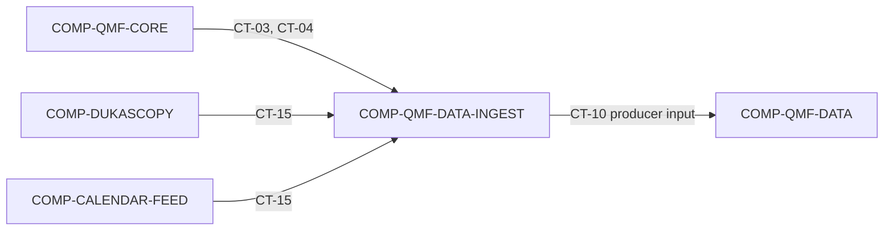

# qmf-data Source-Ingest Seam

`COMP-QMF-DATA-INGEST` is the middleware seam that translates external historical-tick and economic-calendar evidence into source-identified observations for `COMP-QMF-DATA`. It depends on the public Data policy library and the declared external sources, but it owns no scheduled application lifecycle or data-governance rule (DEC-0042, DEC-0051, DEC-0052).

## Authority boundary

May: own and call the CT-15 external-provider request/response port; resolve incoming instruments through CT-03; translate adapter failures through CT-04; validate, normalize, and submit CT-10 producer observations only to the Data-owned public boundary; and support bounded, idempotent calls used by first-install historical acquisition (DEC-0038, DEC-0051, DEC-0053).

May never: operate a scheduler, daemon, process supervisor, retry loop, or operator UI; own the standalone economic-calendar recorder application; invent provider schemas, rate limits, legal retention rights, source keys, or correction behavior; merge disagreeing sources without lineage; mutate Data policy; or persist raw evidence directly around CT-10 and CT-11 (DEC-0042, DEC-0051, DEC-0052, DEC-0053).

## Interfaces

| Interface | Direction | Contract | Peer |
|---|---|---|---|
| Instrument and venue identity | in | [CT-03](../contracts/ct-03-instrument-identity.yaml) | COMP-QMF-CORE |
| Typed refusal | in | [CT-04](../contracts/ct-04-typed-refusal.yaml) | COMP-QMF-CORE |
| Source-observation producer input | out | [CT-10](../contracts/ct-10-source-observation.yaml) | COMP-QMF-DATA |
| External-provider request/response port | in/out | [CT-15](../contracts/ct-15-external-source-adapter.yaml) | COMP-DUKASCOPY, COMP-CALENDAR-FEED |

## Behavior

### External source boundary

Data-Ingest is the QMF owner and caller of CT-15. Requests flow from Data-Ingest to the active external providers `COMP-DUKASCOPY` and `COMP-CALENDAR-FEED`, and responses flow back to Data-Ingest; `COMP-QMF-DATA` is not a CT-15 caller or consumer. `COMP-CTRADER` is an intended future provider under `GAP(GAP-0030)`, not an active CT-15 provider. External schemas, capabilities, rate limits, retry rules, correction behavior, and legal terms remain `GAP(GAP-0029)` and `GAP(GAP-0030)`.

Historical tick acquisition begins with Dukascopy-class evidence. Forward broker tick capture is a separate venue/application path that waits for the broker API application and connection; `COMP-QMF-DATA-INGEST` has no dependency on `COMP-CTRADER` (DEC-0053).

### Observation translation

Every submitted CT-10 observation preserves distinct event time and knowledge time plus source and instrument identity (DEC-0038). `COMP-QMF-DATA` owns the CT-10 schema and is the only direct consumer of Data-Ingest output. Data-Ingest does not publish CT-10 directly to Indicators, Structure, Venue, or Risk; those components use the Data-owned governed-read boundary. `GAP(GAP-0023): Which fields, timestamps, source keys, revision links, nullability, and late-correction semantics define CT-10?` `GAP(GAP-0030): Which tick fields, units, depth, granularity, ordering, duplicate, and reconciliation rules apply?`

The seam may validate and normalize only what CT-10 and CT-15 authorize. Raw evidence retention, processed-data policy, dataset splits, journal policy, and storage remain the authority of `COMP-QMF-DATA` and `COMP-QMF-DATA-STORE` (DEC-0042).

### Lifecycle boundary

QMF exposes ingest plumbing and supports an application-driven first-install historical load, but scheduled acquisition lifecycle stays outside the reusable library and middleware seam (DEC-0051). The standalone economic-calendar recorder invokes this seam; it is not implemented inside it (DEC-0052). `GAP(GAP-0028): Which retries, batching, idempotency, and lifecycle responsibilities belong to the adapter versus the application?`

## Configuration

| Variable | Registry key | Notes |
|---|---|---|
| Instrument identity shape | `registry:instrument_identity_shape` | `GAP(GAP-0009)`; source mappings cannot freeze venue-plus-symbol from the recommendation. |

No ingest-owned source, rate-limit, retry, batching, or legal-retention variable is registered. Those configuration contracts remain `GAP(GAP-0028)`, `GAP(GAP-0029)`, and `GAP(GAP-0030)`.

## Failure modes

| # | Condition | Behavior | Cites |
|---|---|---|---|
| FM-1 | An external source is unavailable or rate-limits a request. | The seam emits no fabricated observation; retryability and the CT-04 failure code remain `GAP(GAP-0029)`, `GAP(GAP-0030)`, and `GAP(GAP-0011)`. | DEC-0051, DEC-0053 |
| FM-2 | A source record cannot provide the ratified event time, knowledge time, source key, or instrument mapping. | No valid CT-10 observation is emitted; missing-field and refusal behavior remain `GAP(GAP-0023)` and `GAP(GAP-0011)`. | DEC-0038, DEC-0042 |
| FM-3 | Duplicate, out-of-order, or corrected source material arrives. | The seam must not erase or merge evidence silently; identity, ordering, deduplication, and correction output remain `GAP(GAP-0023)` and `GAP(GAP-0030)`. | DEC-0038, DEC-0053 |
| FM-4 | Economic-calendar licensing or long-term retention rights are unresolved. | The adapter does not claim that operational retention is authorized; provider and legal posture remain `GAP(GAP-0029)`. | DEC-0052 |
| FM-5 | A caller requests recurring scheduling or process supervision. | The request is outside this component; application ownership and retry/lifecycle division remain `GAP(GAP-0028)`. | DEC-0051, DEC-0052 |
| FM-6 | A source instrument cannot map to CT-03. | The record does not become a canonical CT-10 observation; identity and typed-refusal details remain `GAP(GAP-0009)` and `GAP(GAP-0011)`. | DEC-0053 |

## Related

Decisions: DEC-0038, DEC-0042, DEC-0051, DEC-0052, DEC-0053. Scenarios: [SCN-0002 source correction](../scenarios/SCN-0002-source-correction.md), [SCN-0008 pair-scoped news](../scenarios/SCN-0008-pair-scoped-news.md). Knowledge: none in the current provisional set.
