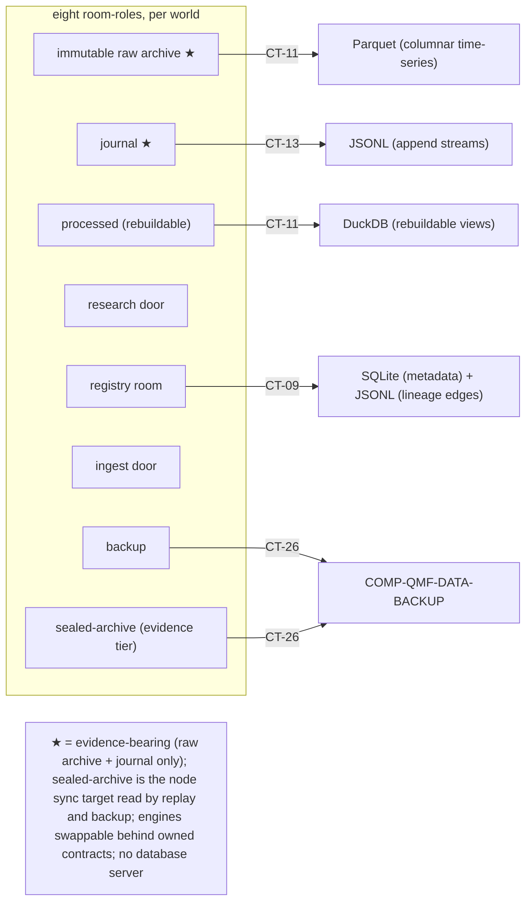

# qmf-data Persistence Seam

`COMP-QMF-DATA-STORE` is the dependency-free data-layer seam that physically persists the eight room-roles behind QMF-owned contracts, without owning their business meaning. Store engines — Parquet (columnar time-series), DuckDB (local analytics), SQLite (transactional metadata), and JSONL (append streams) — sit behind CT-09, CT-11, CT-13, and CT-26 with stdlib-typed boundary signatures, so an engine is swappable and there is no database server (DEC-0117, AD-19). The store is the stateful resource-owner of every stream it holds and follows one-writer-per-stream with unlimited readers (DEC-0113, AD-15).

## Authority boundary

May: persist registry identities, lineage, versions, and occurrences presented through CT-09 (the registry room); persist immutable raw evidence and rebuildable processed data presented through CT-11; persist durable journal streams presented through CT-13; present room contents to the backup primitive through CT-26; hold each room-role instantiated per world and refuse a cross-world read as a policy rejection (DEC-0117, DEC-0110); translate store-library exceptions into `storage failure` typed refusals at this boundary (DEC-0109); run migrations as preflight checks → backup first → dry-run → migrate → verify, never in-place mutation of the only copy (DEC-0118); accept a byte-identical idempotent re-write silently and refuse a true fp1 collision (DEC-0108); and expose only storage-layer outcomes defined by those contracts (DEC-0035, DEC-0038).

May never: define registration, causality, split, holdout, journal-event, promotion, notification, recovery-orchestration, or trading rules; require a graph database (DEC-0035, DEC-0037); adopt an engine or file format outside the ratified set without ratification; overwrite raw evidence or immutable lineage; treat a rebuildable view as evidence-bearing or delete an artifact any result label cites (DEC-0117); read across worlds or persist `world = simulated` into governed evidence (both policy-rejection refusals, DEC-0117, DEC-0110); depend on any component (it is dependency-free); or schedule acquisition and backup processes (DEC-0118).

## Interfaces

| Interface | Direction | Contract | Peer |
|---|---|---|---|
| Registry persistence (registry room) | in | [CT-09](../contracts/ct-09-registry-persistence.yaml) | COMP-QMF-REGISTRY |
| Evidence persistence (append-store) | in | [CT-11](../contracts/ct-11-evidence-persistence.yaml) | COMP-QMF-DATA |
| Durable journal evidence | in | [CT-13](../contracts/ct-13-journal.yaml) | COMP-QMF-DATA, COMP-QMF-REGISTRY |
| Store-to-Backup input | out | [CT-26](../contracts/ct-26-store-backup-input.yaml) | COMP-QMF-DATA-BACKUP |

`COMP-QMF-REGISTRY` reaches the store through the single ratified inter-library edge `qmf-registry → qmf-data` (DEC-0120): its records and lineage land in the **registry room** — one of the eight room-roles — under the same retention, backup, and migration law as all other evidence (DEC-0117).

## Behavior

### Room-roles behind swappable engines

The store physically holds the eight room-roles — ingest door, immutable raw archive, processed, journal, split-governed research door, backup, registry room, and sealed-archive — each instantiated per world (DEC-0117, DEC-0253). The eighth role, `sealed-archive`, is the 2026-08-28 trading-node sitting's mint (DEC-0253): instantiated per world in the evidence tier, it is the one-way evidence sync's target, the replay import port's only source, and a named member of the backed-up room set, held under the same retention, backup, and migration law as the other seven (DEC-0253, DEC-0188, DEC-0198). Only the **immutable raw archive** and **journal** are evidence-bearing; processed data and DuckDB analytics views are rebuildable, so an engine format break costs a rebuild and never evidence, and analytics engine majors are pinned per release (DEC-0117, DEC-0103). Raw and processed time-series persist as Parquet; journal and registry lineage-edge streams persist as pinned JSONL (one fp1-canonical object per line, LF-terminated, append-with-fsync, size-rotated with a monotonic ordinal, per AD-16); transactional registry metadata persists as SQLite; local analytics as DuckDB views (DEC-0117, DEC-0114). `registry:local_store_engine` names the ratified engine set; each stays behind its QMF-owned contract (DEC-0117).

### Identity, append-only, and one writer

The identity of every stored artifact is its fp1 fingerprint (DEC-0108). A byte-identical idempotent re-write — the sandbox-merge normal case — is accepted silently; a true collision (same hash, differing bytes) is refused and alarmed, never overwritten (DEC-0108). Evidence is append-only: CT-11 evidence is written once and corrections append rather than mutate, raw originals and lineage are kept forever, and the store never overwrites immutable lineage (DEC-0117, DEC-0118). Each append/journal stream has exactly one `WriterId` writer with unlimited readers, and its sequence is gapless per `(writer, boot-epoch)` — a gap signals loss (DEC-0113, DEC-0119).

CT-09 persists graph-shaped registry history without a graph database (DEC-0035): per-kind records with fp1-derived stable ids in the header, and lineage that accrues after birth living exclusively in append-only typed edge records; local indexes are rebuildable (DEC-0114). CT-13 persists the seven journal event types as N per-writer streams without becoming a runtime event bus or arbitrary application-log database (DEC-0119, DEC-0048).

### Migration, versioning, and backup input

Every stored artifact carries its contract's integer format version, whose meaning never mutates (DEC-0103, DEC-0030). Migrations run preflight checks → backup first → dry-run → migrate → verify, with a documented restore path and never in-place mutation of the only copy (DEC-0118). CT-26 is the only Store-to-Backup input boundary: it presents one room-role's records per world to the backup primitive as a consistent, restorable input, read verbatim under one-writer-per-stream and never mutated (DEC-0113, DEC-0118). Timestamps pass through backup round-trips verbatim, never re-derived under a later calendar identity or tzdata version (DEC-0106). Journal trimming and partition mechanics are set only after measured volume; time-series is partitioned by source, instrument, and time window (DEC-0118).

## Configuration

| Variable | Registry key | Notes |
|---|---|---|
| Local store engine | `registry:local_store_engine` | Parquet, DuckDB, SQLite, JSONL behind the owned contracts; engines swappable; no database server (DEC-0117). |
| Raw-history retention | `registry:raw_history_retention_policy` | Raw originals and lineage kept forever; trimming of rebuildable views only when no result label cites them (DEC-0117, DEC-0118). |

Journal trimming, partition, and compaction thresholds are set only after measured volume and carry no ratified numeric registry value (DEC-0118).

## Failure modes

| # | Condition | Behavior | Cites |
|---|---|---|---|
| FM-1 | A CT-11 write would replace an existing raw observation or correction in place. | The store preserves the existing evidence and accepts only the ratified append/annotation form. | DEC-0117, DEC-0118 |
| FM-2 | A CT-09 write would mutate immutable lineage or an existing format version's meaning. | The store does not perform the mutation; a new revision is a new artifact with a lineage edge. | DEC-0114, DEC-0103 |
| FM-3 | The engine is unavailable, corrupt, disk-full, or cannot durably commit a write. | The store-library exception is translated to a `storage failure` typed refusal at this boundary and never propagated as an exception across a package boundary; persistence success is not reported. | DEC-0109, DEC-0118 |
| FM-4 | A stored write presents differing bytes under an existing fp1 fingerprint. | A byte-identical re-write is accepted silently; a true collision is refused and alarmed. | DEC-0108 |
| FM-5 | A read or backup read crosses worlds, or a write targets `world = simulated`. | Both are `policy rejection` refusals; storage separation delivers world isolation. | DEC-0117, DEC-0110 |
| FM-6 | A second writer attempts to write a stream already owned by a `WriterId`. | The store enforces one-writer-per-stream; the second write does not proceed. | DEC-0113 |
| FM-7 | A caller asks the store to decide a split, holdout, gate, promotion, notification, or retry rule. | The request is outside the data-layer authority and returns to the owning backend or middleware contract. | DEC-0035, DEC-0042 |

## Related

Decisions: DEC-0117, DEC-0118, DEC-0119, DEC-0120, DEC-0114, DEC-0113, DEC-0109, DEC-0108, DEC-0103, DEC-0035, DEC-0030, DEC-0038. Spine: [ARCHITECTURE-SPINE.md](../../_bmad-output/planning-artifacts/architecture/architecture-QMX-2026-08-19/ARCHITECTURE-SPINE.md) AD-19, AD-20, AD-16, AD-15. Scenarios: [SCN-0002 source correction](../scenarios/SCN-0002-source-correction.md), [SCN-0003 sealed holdout](../scenarios/SCN-0003-sealed-holdout.md), [SCN-0004 backup boundary](../scenarios/SCN-0004-off-machine-backup.md). Knowledge: none in the current provisional set.
