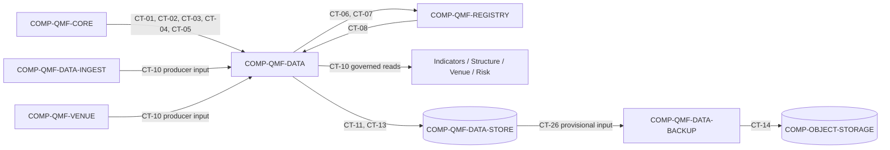

# qmf-data

`COMP-QMF-DATA` is the public data-policy and API library that preserves source evidence, governs reproducible research access, and emits durable journal evidence. Middleware ingest, physical persistence, and backup execution remain separate components so adapters and stores do not acquire backend business rules (DEC-0042, DEC-0051, DEC-0052).

## Authority boundary

May: own the CT-10 public schema and accept CT-10 producer submissions from Data-Ingest and Venue; use exact Core values and typed refusals; register evidence identities and lineage through CT-06 and CT-07; enforce bitemporal fact, raw-evidence, processed-data, dataset-release, split, final-holdout, and journal policy; send evidence to CT-11 and CT-13 persistence seams; expose reserved CT-12 releases and governed CT-10 reads; and require the CT-14 off-machine backup direction (DEC-0026, DEC-0029, DEC-0038, DEC-0042, DEC-0044, DEC-0045, DEC-0046, DEC-0048).

May never: schedule or supervise source acquisition; own external-provider behavior; select a physical store, file format, graph database, object-storage provider, encryption scheme, or credential mechanism without ratification; erase raw evidence when processed data or corrections arrive; expose the final holdout through the default research path; use synthetic data to validate trading edge; or become a backtester, runtime event bus, trading node, MIS, or product UI (DEC-0042, DEC-0044, DEC-0045, DEC-0046, DEC-0051, DEC-0052, DEC-0054).

## Interfaces

| Interface | Direction | Contract | Peer |
|---|---|---|---|
| Exact money, price, and quantity values | in | [CT-01](../contracts/ct-01-money-quantity.yaml) | COMP-QMF-CORE |
| Exact time and calendar values | in | [CT-02](../contracts/ct-02-time-calendar.yaml) | COMP-QMF-CORE |
| Instrument and venue identity | in | [CT-03](../contracts/ct-03-instrument-identity.yaml) | COMP-QMF-CORE |
| Typed refusals | out | [CT-04](../contracts/ct-04-typed-refusal.yaml) | COMP-QMF-CORE |
| Canonical identity and compatibility | in | [CT-05](../contracts/ct-05-version-fingerprint.yaml) | COMP-QMF-CORE |
| Registry registration | out | [CT-06](../contracts/ct-06-registration.yaml) | COMP-QMF-REGISTRY |
| Lineage edges | out | [CT-07](../contracts/ct-07-lineage-edge.yaml) | COMP-QMF-REGISTRY |
| Causality and attempt evidence | in | [CT-08](../contracts/ct-08-gate-evidence.yaml) | COMP-QMF-REGISTRY |
| Observation producer input | in | [CT-10](../contracts/ct-10-source-observation.yaml) | COMP-QMF-DATA-INGEST, COMP-QMF-VENUE |
| Governed observation read | out | [CT-10](../contracts/ct-10-source-observation.yaml) | COMP-QMF-INDICATORS, COMP-QMF-STRUCTURE, COMP-QMF-VENUE, COMP-QMF-RISK |
| Evidence persistence | out | [CT-11](../contracts/ct-11-evidence-persistence.yaml) | COMP-QMF-DATA-STORE |
| Dataset release and split | out (reserved) | [CT-12](../contracts/ct-12-dataset-split.yaml) | Intended: COMP-QMF-REGISTRY, COMP-QMF-INDICATORS, COMP-QMF-STRUCTURE; not wired |
| Durable journal persistence | out | [CT-13](../contracts/ct-13-journal.yaml) | COMP-QMF-DATA-STORE |
| Cross-domain journal evidence | in (reserved) | [CT-13](../contracts/ct-13-journal.yaml) | Intended: COMP-QMF-REGISTRY, COMP-QMF-VENUE, COMP-QMF-RISK; not wired |
| Off-machine backup boundary | delegated | [CT-14](../contracts/ct-14-backup-restore.yaml) | COMP-QMF-DATA-BACKUP |

CT-14 is a manifest-visible delegated boundary. `COMP-QMF-DATA-BACKUP` owns CT-14 and `COMP-OBJECT-STORAGE` consumes it; `COMP-QMF-DATA` owns only the off-machine backup requirement and does not implement the data-layer process (DEC-0045).

## Behavior

### Facts and retention

`COMP-QMF-DATA` owns the CT-10 schema and public boundary. Data-Ingest and Venue are producers, and Data is the only direct consumer of CT-10 from Data-Ingest. Data, Indicators, Structure, Venue, and Risk are governed readers of the Data-owned boundary; no downstream reader consumes CT-10 directly from Data-Ingest. An admitted observation preserves distinct event time and knowledge time, source identity, and canonical evidence identity through CT-10, CT-02, CT-03, and CT-05 (DEC-0038, DEC-0042). `GAP(GAP-0023): Which bitemporal fields, revision links, nullability, and late-correction rules define the fact?` `GAP(GAP-0030): Which source fields, bid/ask values, depth, granularity, units, and reconciliation rules define the V1 evidence set?`

Raw evidence remains distinct from processed data. The retention law is `registry:raw_history_retention_policy`, and corrections append evidence rather than silently overwriting an earlier observation (DEC-0044, DEC-0045). CT-11 moves evidence to `COMP-QMF-DATA-STORE`; physical schemas, engines, partitions, migrations, indexes, and compaction remain `GAP(GAP-0020)`, `GAP(GAP-0021)`, `GAP(GAP-0022)`, and `GAP(GAP-0026)`.

### Research access

CT-12 identifies reproducible dataset releases and exposes explicit train, validation, and untouched-test splits by default (DEC-0046). The final holdout remains stored but outside the default research path; its duration is `registry:historical_holdout_months` (DEC-0044). `GAP(GAP-0024): What release fields, partition names, boundary arithmetic, reopening, one-look authorization, audit, and leakage rules apply?`

Synthetic data may test infrastructure and failure handling, but it may not validate trading edge or replace real evidence (DEC-0054).

### Journal and backup

CT-13 carries durable operational and research journal evidence without becoming an event bus, arbitrary application log, workflow engine, or recovery coordinator (DEC-0042, DEC-0048). Only the Data-to-Store persistence path is currently wired. Registry, Venue, and Risk remain intended cross-domain producers; no inbound handoff or failure rule exists for them. Journal producer/consumer roles, mutation, amendment, immutability, ordering, and failure semantics remain `GAP(GAP-0025)` and `GAP(GAP-0026)`.

The live requirement is an off-machine backup direction for retained evidence (DEC-0045). `registry:backup_cadence` is null, and CT-26 snapshot shape, completeness, and consistency plus CT-14 provider, encryption, retention, recovery, and verification behavior remain `GAP(GAP-0020)`, `GAP(GAP-0022)`, `GAP(GAP-0026)`, and `GAP(GAP-0027)`. Routine restore verification and disaster recovery are distinct from off-machine transfer; no operational recovery or cutover may be implemented until GAP-0027 is resolved.

### Acquisition seam

Data-Ingest owns and calls CT-15 against external providers; `COMP-QMF-DATA` does not accept CT-15. QMF supports the first-install historical load, while clocks, scheduled acquisition, process supervision, and operator UI stay outside the library (DEC-0051, DEC-0052). Historical tick evidence begins with a Dukascopy-class source; broker tick capture waits for the broker application and connection (DEC-0053). `GAP(GAP-0028): What belongs to source adapters versus application lifecycle?` `GAP(GAP-0029): What provider, legal-retention, rate-limit, correction, and deduplication rules govern economic-calendar evidence?`

## Configuration

| Variable | Registry key | Notes |
|---|---|---|
| Final-holdout duration | `registry:historical_holdout_months` | `GAP(GAP-0024)`; the source direction is live but exact boundary arithmetic is unresolved. |
| Raw-history retention | `registry:raw_history_retention_policy` | The registry value is authoritative; this spec does not duplicate it (DEC-0044). |
| Backup cadence | `registry:backup_cadence` | `GAP(GAP-0027)`; no cadence or scheduling rule is ratified. |
| Recovery-point objective | `registry:backup_recovery_point_objective` | `GAP(GAP-0027)`; no RPO is ratified. |
| Recovery-time objective | `registry:backup_recovery_time_objective` | `GAP(GAP-0027)`; no RTO is ratified. |
| Backup retention | `registry:backup_retention_period` | `GAP(GAP-0027)`; off-machine retention is unresolved. |
| Restore-verification cadence | `registry:restore_verification_cadence` | `GAP(GAP-0027)`; no cadence is ratified. |
| Local store engine | `registry:local_store_engine` | `GAP(GAP-0021)`; named study engines are candidates only. |

## Failure modes

| # | Condition | Behavior | Cites |
|---|---|---|---|
| FM-1 | An observation lacks the ratified event time, knowledge time, source, or canonical identity. | The observation does not enter governed CT-10 evidence; required fields and rejection evidence remain `GAP(GAP-0023)`. | DEC-0038, DEC-0042 |
| FM-2 | A correction attempts to replace existing raw evidence in place. | The earlier evidence remains and the correction must append through CT-11 with a ratified revision relationship. | DEC-0044, DEC-0045 |
| FM-3 | A default research request includes the final holdout. | CT-12 does not release the sealed portion; authorization, one-look, and audit evidence remain `GAP(GAP-0024)`. | DEC-0044, DEC-0046 |
| FM-4 | CT-11 cannot persist required evidence. | The component does not report the evidence as persisted; transaction, retry, rollback, and recovery behavior remain `GAP(GAP-0022)`. | DEC-0038, DEC-0045 |
| FM-5 | A proposed journal record lacks a ratified event kind or correlation identity. | The record is not valid CT-13 evidence; the exact schema and rejection result remain `GAP(GAP-0025)`. | DEC-0048 |
| FM-6 | An off-machine transfer is presented as verified recovery or used for operational cutover. | The component does not make the claim or authorize the cutover; CT-26 completeness and CT-14 verification, recovery, and cutover remain `GAP(GAP-0027)`. | DEC-0045 |
| FM-7 | Synthetic data is offered as evidence of trading edge. | The evidence is inadmissible for edge validation; synthetic data remains limited to infrastructure and failure testing. | DEC-0054 |
| FM-8 | A caller asks `COMP-QMF-DATA` to schedule or supervise acquisition. | The request is outside the component boundary; the application-owned lifecycle seam remains `GAP(GAP-0028)`. | DEC-0051, DEC-0052 |

## Related

Decisions: DEC-0038, DEC-0042, DEC-0044, DEC-0045, DEC-0046, DEC-0048, DEC-0051, DEC-0052, DEC-0053, DEC-0054. Scenarios: [SCN-0002 source correction](../scenarios/SCN-0002-source-correction.md), [SCN-0003 sealed holdout](../scenarios/SCN-0003-sealed-holdout.md), [SCN-0004 backup boundary](../scenarios/SCN-0004-off-machine-backup.md), [SCN-0008 pair-scoped news](../scenarios/SCN-0008-pair-scoped-news.md), [SCN-0009 synthetic stress](../scenarios/SCN-0009-synthetic-stress.md). Knowledge: none in the current provisional set.
