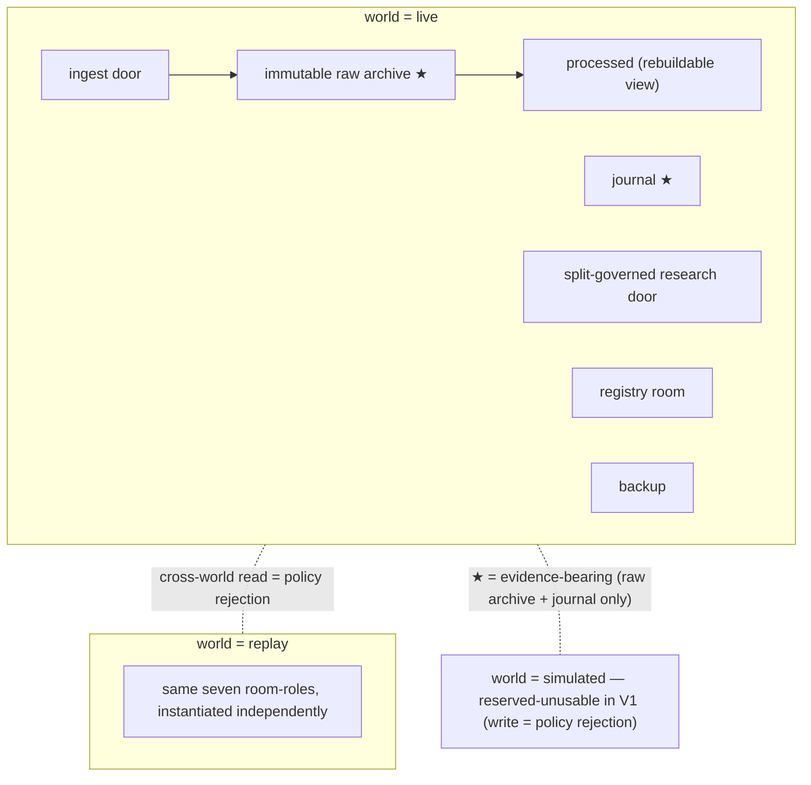
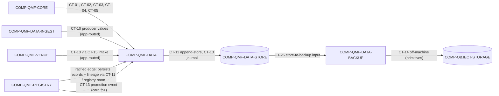

# qmf-data

`COMP-QMF-DATA` is the public data-policy and API library that preserves source evidence, governs reproducible research access, and emits durable journal evidence. It owns seven room-roles — ingest door, immutable raw archive, processed, journal, split-governed research door, backup, and the registry room — each instantiated per world (DEC-0117, AD-19). Middleware ingest, physical persistence, and backup execution stay in separate components so adapters and stores never acquire data-policy business rules (DEC-0042, DEC-0051, DEC-0052).

`COMP-QMF-DATA` depends only on `COMP-QMF-CORE` and its internal persistence seam `COMP-QMF-DATA-STORE`. Under default-deny (DEC-0120), the only ratified inter-library edge into the data family is `qmf-registry → qmf-data`: `COMP-QMF-REGISTRY` persists its records and lineage through this library's append-store, so `COMP-QMF-DATA` never depends on `COMP-QMF-REGISTRY`.

## Authority boundary

May: own the seven room-roles and their per-world instantiation (DEC-0117); own the CT-10 public boundary and accept CT-10 producer observation values from Data-Ingest and Venue, the venue's market-data kinds (ticks, bars, depth, gap-replay backfill, historical paging) entering through the existing CT-15 intake with raw depth stored as verbatim wire payload (DEC-0138); use exact Core values (CT-01, CT-02, CT-03), fp1 identity (CT-05, DEC-0108), and the seven-category typed refusals (CT-04, DEC-0109); enforce the bitemporal fact law (event-time, known-at, source, revision) with corrections appended never overwritten (DEC-0117); enforce keep-raw-forever retention, source/instrument/time-window partitioning, and the evidence-bearing-vs-rebuildable distinction (DEC-0117, DEC-0118); persist through the CT-11 append-store and CT-13 journal seams; expose CT-12 dataset-split manifests and enforce the 12-month seal as a read-boundary refusal at every read boundary (DEC-0119); provide the CT-14/CT-26 backup/restore/verify primitives requirement while the schedule stays application-owned (DEC-0118); emit registration and lineage-edge values routed by the application (DEC-0120).

May never: define registration, causality, promotion, or trading rules; select a physical store engine, file format, object-storage provider, encryption scheme, or credential mechanism without ratification (engines are named — Parquet, DuckDB, SQLite, JSONL — but sit behind CT-11's owned contract, DEC-0117); erase raw evidence when processed data or corrections arrive; delete any artifact a result label cites (DEC-0117); expose the sealed holdout through the default research path or read across worlds (both are policy-rejection refusals, DEC-0119, DEC-0117); write `world = simulated` into governed evidence (policy rejection until the backtesting sitting, DEC-0110); use synthetic data to validate trading edge (DEC-0054); depend on `COMP-QMF-REGISTRY` or any package other than `COMP-QMF-CORE` and its store seam (DEC-0120); schedule or supervise source acquisition or backup runs (DEC-0051, DEC-0118); or become a backtester, runtime event bus, trading node, MIS, or product UI (DEC-0042).

## Interfaces

| Interface | Direction | Contract | Peer |
|---|---|---|---|
| Exact money, price, and quantity values | in | [CT-01](../contracts/ct-01-money-quantity.yaml) | COMP-QMF-CORE |
| Exact time, TradingDate, and market-hours-calendar values | in | [CT-02](../contracts/ct-02-time-calendar.yaml) | COMP-QMF-CORE |
| Instrument, venue, and account identity | in | [CT-03](../contracts/ct-03-instrument-identity.yaml) | COMP-QMF-CORE |
| Typed refusals (seven categories) | in/out | [CT-04](../contracts/ct-04-typed-refusal.yaml) | COMP-QMF-CORE |
| Canonical fp1 identity and version | in | [CT-05](../contracts/ct-05-version-fingerprint.yaml) | COMP-QMF-CORE |
| Registration values (application-routed) | out (value only) | [CT-06](../contracts/ct-06-registration.yaml) | COMP-QMF-REGISTRY |
| Lineage-edge values (application-routed) | out (value only) | [CT-07](../contracts/ct-07-lineage-edge.yaml) | COMP-QMF-REGISTRY |
| Causality and attempt evidence | in (deferred) | [CT-08](../contracts/ct-08-gate-evidence.yaml) | COMP-QMF-REGISTRY |
| Source-observation producer input | in (value) | [CT-10](../contracts/ct-10-source-observation.yaml) | COMP-QMF-DATA-INGEST, COMP-QMF-VENUE |
| Governed observation read | out | [CT-10](../contracts/ct-10-source-observation.yaml) | Intended: COMP-QMF-INDICATORS, COMP-QMF-STRUCTURE, COMP-QMF-VENUE, COMP-QMF-RISK — under default-deny, not a live edge |
| Evidence persistence (append-store) | out | [CT-11](../contracts/ct-11-evidence-persistence.yaml) | COMP-QMF-DATA-STORE |
| Registry-room persistence | in (ratified edge) | [CT-11](../contracts/ct-11-evidence-persistence.yaml) | COMP-QMF-REGISTRY |
| Dataset release, split, and holdout | out | [CT-12](../contracts/ct-12-dataset-split.yaml) | COMP-QMF-DATA |
| Durable journal persistence | out | [CT-13](../contracts/ct-13-journal.yaml) | COMP-QMF-DATA-STORE |
| Journal producer (promotion, via ratified edge) | in | [CT-13](../contracts/ct-13-journal.yaml) | COMP-QMF-REGISTRY |
| Risk/Book journal projection surface (command-fingerprint join, legacy-stream mapping) | in (intended) | [CT-25](../contracts/ct-25-risk-journal.yaml) | COMP-QMF-RISK |
| Off-machine backup boundary | delegated | [CT-14](../contracts/ct-14-backup-restore.yaml) | COMP-QMF-DATA-BACKUP |

Registration (CT-06) and lineage-edge (CT-07) rows are **value-only**: `COMP-QMF-DATA` produces registration and lineage-edge records as frozen dataclasses that the application routes to `COMP-QMF-REGISTRY`; producing a value creates no package dependency on `COMP-QMF-REGISTRY` (DEC-0120). CT-08 causality/attempt evidence is **deferred**: the look-ahead registration gate and attempt counter are operator-deferred to the backtesting sitting (`GAP-0016`, `GAP-0017`, DEC-0121), so artifacts registered before that sitting carry no causality evidence. The governed-read (CT-10 out) row is design intent, not a live edge: under default-deny the downstream libraries may read this boundary only once a `qmf-data` inter-library edge is ratified as a spine amendment (DEC-0120). CT-14 is a manifest-visible delegated boundary owned by `COMP-QMF-DATA-BACKUP`; `COMP-QMF-DATA` owns only the off-machine backup requirement (DEC-0118, DEC-0045). The CT-25 row is **in (intended)**: CT-25 is the risk-domain journal contract `COMP-QMF-DATA` reads to resolve entity-journal projections — it pins the command-fingerprint join and the legacy-five-stream mapping table — and it reaches `COMP-QMF-DATA` through the composition root under default-deny, creating no package edge (so `COMP-QMF-DATA` gains no dependency on `COMP-QMF-RISK`), documentary until the factory ships (DEC-0145, DEC-0120).

## Behavior

### Seven room-roles, per world

`COMP-QMF-DATA` owns seven room-roles — **ingest door**, **immutable raw archive**, **processed**, **journal**, **split-governed research door**, **backup**, and the **registry room** (records and lineage stored for `COMP-QMF-REGISTRY` under the same retention, backup, and migration law) — each instantiated per world (DEC-0117, AD-19). Worlds are `live` (real venue clocks and quotes, with account role carrying money-reality so paper and demo runs are `world = live`), `replay` (a data-driven injected clock over recorded history), and `simulated` (reserved-unusable in V1; writing it into governed evidence is a policy-rejection refusal until the backtesting sitting defines simulated-time typing) (DEC-0110). A read that crosses worlds is a policy-rejection refusal (DEC-0117, DEC-0109); storage separation, not identity distinctness alone, delivers world isolation (DEC-0110).

Only the **immutable raw archive** and **journal** formats are evidence-bearing. Processed data and analytics-engine views (DuckDB) are rebuildable views, so an engine's format break costs a rebuild, never evidence, and analytics engine majors are pinned per release (DEC-0117, DEC-0103). "Rebuildable" licenses deletion only of artifacts no result label cites: a processed artifact cited as an input is retained forever, and any rebuild pins the original calendar identity and tzdata version (DEC-0117, DEC-0118).

### Facts and retention (bitemporal law)

`COMP-QMF-DATA` owns the CT-10 boundary and is its only ratified reader today (DEC-0117, DEC-0120). Data-Ingest and Venue submit observation **values** routed by the application; no downstream library reads CT-10 directly under default-deny. Every external fact carries **event-time**, **known-at**, **source**, and **revision** (DEC-0117). `source` is a core provenance noun **orthogonal to VenueId** — a provider QMF can trade at is a venue; a provider it only reads from is a source — so a read-only provider is never conflated with a tradeable one (DEC-0117, DEC-0107). Foreign timestamps are stored verbatim with their declared zone, offset, and source resolution alongside a local receive wall time in int64 UTC nanoseconds; foreign money is stored verbatim as scaled integers with the source's declared scales; conversions to framework Time and Money are derived values carrying lineage, never rewrites (DEC-0106, DEC-0105). Corrections are appended as annotation records referencing the corrected observation's fp1 fingerprint; an observation is never overwritten. No package folds corrections inline in V1 — the annotation read-resolution rule is deferred (DEC-0117). A record's identity is its fp1 fingerprint; `(instant, writer, sequence)` is a replay-ordering key with no causal meaning, and timestamps are never primary or dedup keys (DEC-0106, DEC-0108).

Raw evidence remains distinct from processed data; the retention law `registry:raw_history_retention_policy` keeps raw originals and lineage forever (DEC-0118). Time-series is partitioned by source, instrument, and time window (DEC-0118). Bar aggregation is a fingerprinted `qmf-data` derivation: aggregated bars live in the processed room with lineage back to their source series, and a bar series is well-defined only through its `BarSpec` (DEC-0126, DEC-0130). The per-kind aggregation-rule details — renko, tick-count, volume, and the other BarSpec kinds — are deferred to documentation time per the spine's Deferred table, while the `BarSpec` noun itself is ratified in `qmf-core` (DEC-0126, DEC-0130). Venue-native bars — trendbars a venue delivers directly — gain a legal `BarSpec` anchor only once the adapter's measured venue daily boundary is minted as a venue-scoped market-hours calendar identity; until then they are ungoverned observations, recorded but not promotable to governed `BarSpec`-anchored bars (DEC-0138, DEC-0141). The tick-to-bar builder that would produce those governed bars stays a Deferred-table row (DEC-0126, DEC-0130). CT-11 moves evidence to `COMP-QMF-DATA-STORE` behind the QMF-owned append-store contract; store engines stay swappable and there is no database server (DEC-0117). cTrader intake facts are ratified as pointer-level surface — see [ctrader.md](ctrader.md) for the field-by-field sheet: timestamps are Unix ms UTC asserted per field with named epoch exceptions, three independent numeric wire-scale systems, `hasMore`-only paging under a one-week tick-span cap, and trendbars gappy by design (DEC-0135). The venue daily-bar boundary and trendbar price basis are never hardcoded — the adapter measures them per broker at first connection and records them in the per-account venue-observation profile — and depth is a Level-2 resting-liquidity book recorded verbatim; QMF's own forex 17:00-New-York market-hours calendar remains its accounting rule, independent of venue bars (DEC-0135).

### Research access and the seal

CT-12 dataset splits are fingerprinted, time-ordered, non-overlapping manifests, each pinning exactly one calendar identity and version in-band and refusing any row carrying a different calendar identity (DEC-0119, DEC-0106). Research data is split by default into train, validation, and a sealed-test holdout (DEC-0046). Boundaries are explicit stored TradingDates or Instants, never civil dates, and the seal boundary is a **frozen** TradingDate never re-derived under a later tzdata version (DEC-0119).

**Purge and embargo widths are required manifest fields now**, entering the split fingerprint and defaulting to the maximum declared warm-up-plus-confirmation-delay bound across every producer the split cites — a split reused with a longer-horizon artifact refuses rather than leaks (DEC-0131). Records partition into splits by **knowledge time** — confirmed-at for structure objects, the knowable-at of the last contributing input for indicator results — and a manifest refuses any record whose observed-at precedes a boundary while its confirmed-at follows it, unless the declared embargo covers the gap (DEC-0131).

The newest sealed window (`registry:historical_holdout_months`, approximately twelve months) is a **no-peek lock, not retention** — all history is kept regardless (DEC-0044, DEC-0119). The seal is enforced **now** as a policy-rejection refusal at every qmf-data read boundary — raw archive, processed, research door, and restored backups alike — **independent of** the deferred look-ahead and attempt-counter gates (DEC-0119, DEC-0121). The sealed period gets exactly one logged final look, journaled as a named `control action` subtype in CT-13, and is never silently recycled into research (DEC-0119). `GAP(GAP-0016): the exact look-ahead/causality registration test is deferred to the backtesting sitting (DEC-0121).` `GAP(GAP-0017): the attempt counter is deferred to the backtesting sitting (DEC-0121).`

Synthetic data may test infrastructure and failure handling, but it may not validate trading edge or replace real evidence (DEC-0054).

### Journal

CT-13 persists durable operational and research journal evidence as **N append-only streams**, one per producing component, each written under a single AD-8 `WriterId` following one-writer-per-stream with unlimited readers (DEC-0119, DEC-0113). Each stream's sequence is strictly increasing and gapless per `(writer, boot-epoch)`; a detected gap signals loss (DEC-0119, DEC-0106). The journal records exactly seven event types — decision, order, fill, risk transition, promotion, data quality, control action (`registry:journal_event_types`) — an enum addable in later versions but never redefined (DEC-0119). The `decision` event carries a mandatory closed **outcome** field — `authorized | refused-by-door | suppressed` — with the refusing-door or suppressing-authority reference, so every projection (the legacy `veto_ledger` included) selects on a declared field and never on key presence; the `control action` event carries the declared **suppressed** subtype for an already-authorized action a higher authority discarded at arbitration; and treasury boundary events (sweep, refund, re_seed, paper_epoch_reset) map onto the `risk transition` type, no money moving without one and a boundary event never closing a position or re-basing a frozen R (DEC-0158, DEC-0150). `correlation_id` is a linking annotation excluded from fp1 identity by explicit versioned declaration and propagated across every package boundary (DEC-0112, DEC-0108). Causal linkage across streams uses AD-16 typed edge records, never timestamps (DEC-0119, DEC-0114). Journals are evidence encoding (int64 UTC ns + writer + sequence); operator/diagnostic logs are ISO-8601-with-Z display and are a distinct thing (DEC-0112).

The wired QMF journal producers are `COMP-QMF-DATA` (data quality, control action) and `COMP-QMF-REGISTRY` (promotion, through the ratified `qmf-registry → qmf-data` edge, carrying only the promotion-card fp1 fingerprint plus `correlation_id`) (DEC-0119, DEC-0116, DEC-0120). `COMP-QMF-VENUE` produces order, fill, data-quality, and control-action events through the core-defined `JournalSink` injected at the composition root — the venue write path creates no import edge, so no edge is pending — a ratified shape that stays documentary until the factory ships it (DEC-0137, DEC-0138). Its fill events carry the mandatory identity fields (fill price, fill quantity, venue instant, receive instant), and CT-20's exhaustive (command kind × outcome) / (observation kind) mapping binds them under the cardinality law: exactly one journal event per recorded observation, per submission, per outcome (DEC-0137). `COMP-QMF-RISK` produces its **risk-authored** events (decision, risk transition, control action) through the same core-defined `JournalSink` injected at the composition root — the risk write path likewise creates no import edge — a ratified shape that stays documentary until the factory ships it; the risk-domain writer unit is `(machine, risk role, binding)`, and the block-on-unpersistable obligation binds the risk dispatcher exactly as it binds the connection manager, so a control action is journaled before dispatch and a `storage failure` blocks the dispatch rather than losing the intent (DEC-0145, DEC-0158). Retention and trimming rules are set only after measured volume (DEC-0118).

### Entity-journal projections

The Book journal, BMS journal, and per-bot journal — the operator's logbook — are **declared read-time projections** over the writer-scoped journal streams, selected by entity identity; an entity is not a writer and no entity mints a stream of its own (DEC-0145). Per-bot, per-Book, per-BMS, and combined views are extracted on demand from the one recorded set of streams — the operator-confirmed extraction model, one recorded set and many views, never per-entity streams (DEC-0145). This is a **disclosed substitution** of the operator's original per-entity-stream ask: AD-15's one-writer-per-stream law would require a non-component entity to hold a `WriterId`, so the same guarantee is delivered as a projection rather than a stream — recorded as the distiller's correction so a later reader can accept or overturn it (DEC-0145).

**Two event classes, because the neutral venue port cannot carry Book identity and must not learn it (DEC-0145).** **Risk-authored** events (decision, risk transition, control action, promotion) carry the Book-definition fingerprint, the binding identity `(BookInstanceId, BmsInstanceId, VenueId, AccountId, world)`, and — where the act concerns one bot — the Bot identity plus its seat binding, as identity fields (DEC-0145, DEC-0143). **Venue-authored** events (order, fill, data quality) carry the command record's content fingerprint, and the projection **joins through it** — the command record carrying the binding identity as an identity field (DEC-0145). That join is pinned versioned [CT-25](../contracts/ct-25-risk-journal.yaml) surface, not implementer judgment: without it a Book projection holds decisions and control actions but no orders or fills, or an implementer threads Book identity into the neutral venue payload and creates the `qmf-venue → qmf-risk` coupling default-deny forbids (DEC-0145, DEC-0120). The bot-identity portion of a per-bot projection is now ruled — it is the CT-33 Bot definition `fp1` plus the AD-41 seat binding, no longer a pending slot — while per-Book, per-BMS, and per-binding projections resolve today from the binding identity every risk-authored event already carries (DEC-0145, DEC-0143, DEC-0173).

**Paper and live are separated by construction.** A projection resolves inside one **role-scoped namespace**: the live evidence namespace admits only `role = live` rows, and demo, paper-validation, and paper-benched rows write to their own role-scoped namespaces (DEC-0158). A projection spanning roles exists only as an **explicitly-declared cross-role read**, never a silent union, and there are exactly two such declared read exceptions within `world = live`: the AD-35 decay-cohort read (DEC-0149) and the entity projection over an entity that operated in more than one role — a benched seat inside a live Book is the ordinary case — each carrying `role` on every row and never aggregated across roles without an explicit declaration (DEC-0145, DEC-0158). There is **no write exception ever**: writes stay role-scoped without exception, so a non-live world never writes into the live evidence namespace (DEC-0158).

**The legacy five Records streams survive as projection names only.** `veto_ledger`, `trade_journal`, `book_journal`, `ksa_audit_log`, and `correlation_ledger` are projection names mapped onto the seven journal event types by one versioned mapping table in [CT-25](../contracts/ct-25-risk-journal.yaml); no second event catalog is minted (DEC-0145). `veto_ledger` selects on the `decision` event's declared `outcome` field (`refused-by-door`), never on key presence (DEC-0158).

Every risk record is a `qmf-core` value type, content-fingerprinted by qmf-core's single implementation and wrapped into a registry record by the composition root; the risk sitting requests no new package edge (DEC-0145, DEC-0120). Correlation vocabulary is renamed apart and never interchanged: **cohort-correlation evidence** (a CT-23 declared evidence slot), the **fill-attribution label** (venue), and **`correlation_id`** (tracing) are three distinct things (DEC-0145).

### Backup

The ratified backup design is nightly, encrypted, versioned, off-machine to an object-storage bucket, with automated sample-restore tests and a periodic full-restore rehearsal (DEC-0118). `COMP-QMF-DATA` provides the backup/restore/verify **primitives** requirement (CT-14, CT-26); the schedule (`registry:backup_cadence` = nightly) and execution are application/ops-owned — the same split as all scheduling (DEC-0118). The backup room-role covers every room-role including the registry room, all under one retention, backup, and migration law and instantiated per world (DEC-0117). Restored backups still enforce the 12-month seal exactly as a live read does (DEC-0119). Topology: the trading-node VPS records and syncs down, the workstation holds the working archive, and the bucket catches nightly copies (DEC-0118). Numeric RPO/RTO/retention-depth and encryption key custody are named at the node/ops sitting (DEC-0118); the design itself is ratified.

### Acquisition seam

Data-Ingest owns and calls CT-15 against external providers; `COMP-QMF-DATA` does not accept CT-15 and accepts Data-Ingest and Venue producer observation values through the Data-owned CT-10 boundary — venue market data specifically reaches that CT-10 boundary through the CT-15 intake path, application-mediated, with no fifth contract and no new dependency edge (DEC-0117, DEC-0138). qmf-data defines source contracts, normalization, validation, and idempotent intake keyed on `(source, source-native id, revision)` — a provider revision is a new artifact, never an fp1 collision — while applications own scheduling, retries, supervision, and UI (DEC-0119). QMF supports the first-install historical load; scheduled acquisition lifecycle stays outside the library (DEC-0051, DEC-0052). Historical tick evidence begins with a Dukascopy-class source; broker tick capture waits for the broker application and connection (DEC-0053). Tick sources are separately identified with bid and ask preserved and their source timestamps kept; disagreements between sources stay visible via `corroborates` / `disagrees-with` edges and are never merged away (DEC-0119).

The trading venue is also a `source` (AD-19): a provider QMF trades at is a venue, and the same provider read for market data is a source, so its market-data intake reuses the source machinery without conflating the two roles (DEC-0138, DEC-0117). Its market-data kinds — ticks, bars, depth, gap-replay backfill, and historical paging — enter as CT-10 source observations through the same CT-15 intake path, application-mediated, adding no fifth contract and no new dependency edge (DEC-0138). Subscription lifecycle facts (a technical snapshot on subscribe, a non-instantaneous unsubscribe, `hasMore`-class paging) are declared intake surface, not silent behavior (DEC-0138). Every venue observation carries a venue-native identity key `(source, source-native id, revision)` so gap-replay redelivery deduplicates under the idempotent-intake split rather than colliding (DEC-0138, DEC-0119). The pinned canonical sensing feed carries a prohibition, not merely a capability: there is no silent sibling-feed failover — a sensing outage fails closed until the same feed gap-replays, so a gap is filled only by that feed's own replay and never by substituting a different feed (DEC-0138). Raw depth is recorded as the verbatim wire payload into the immutable raw archive, never an invented encoding (DEC-0138).

### QMB consumer

`COMP-QMB` — the QMX experimentation/backtesting library and its `qmb` CLI — is an application-layer **consumer** of this component, never a peer data layer (DEC-0166). QMB's data commands (`download`, `verify`, `catalog`, `generate`) are thin fronts over the data contracts already ratified here — CT-10/CT-15 intake, the seven rooms, the bitemporal fact law, and bid-and-ask preservation — so no second data layer grows behind them (DEC-0166). Every QMB run reads **only** the split-governed research rooms this component exposes: the 12-month seal, the required purge/embargo widths, the knowledge-time partition rule, and the in-band calendar identity are all enforced at the qmf-data read boundary exactly as for any other reader (DEC-0169). A run never fetches from a provider — acquisition is a separate download-once step under the user's own provider relationship into the immutable raw archive; see [dukascopy.md](dukascopy.md) (DEC-0166).

Every ingested window records provenance **plus** a license tag, and a source window without a recorded usage right is a typed refusal for governed-evidence use — an unlicensed window can never silently become governed evidence (DEC-0166). Store-persisted fabricated data is **store-tainted**: any run reading it resolves to `world = simulated`, a policy-rejection refusal for governed evidence until the GAP-0048 sitting rules the fidelity taxonomy, and is legal for infrastructure stress and strategy-logic smoke tests only, never edge validation (DEC-0164, DEC-0054). A QMB run's trading events (decision, order, fill, risk transition, and kin) are CT-13 journal events written to writer-scoped streams **in the run's world** — the ratified journal, not an invented format — while its per-run operational logs are AD-14 operational only and never evidence (DEC-0163).

## Configuration

| Variable | Registry key | Notes |
|---|---|---|
| Final-holdout duration | `registry:historical_holdout_months` | Approximately twelve months; a no-peek seal, not retention; the boundary is a frozen TradingDate (DEC-0119). |
| Raw-history retention | `registry:raw_history_retention_policy` | Raw originals and lineage kept forever; the registry value is authoritative (DEC-0118). |
| Local store engine | `registry:local_store_engine` | Parquet, DuckDB, SQLite, JSONL behind the CT-11 owned contract; engines swappable; no database server (DEC-0117). |
| Journal event types | `registry:journal_event_types` | The seven ratified event types in N append-only per-writer streams (DEC-0119). |
| Backup cadence | `registry:backup_cadence` | Nightly (ratified design); schedule and execution are application/ops-owned (DEC-0118). |
| Recovery-point objective | `registry:backup_recovery_point_objective` | Backup design ratified; the numeric RPO is named at the node/ops sitting (DEC-0118). |
| Recovery-time objective | `registry:backup_recovery_time_objective` | Backup design ratified; the numeric RTO is named at the node/ops sitting (DEC-0118). |
| Backup retention | `registry:backup_retention_period` | Backup design ratified; the numeric retention depth is named at the node/ops sitting (DEC-0118). |
| Restore-verification cadence | `registry:restore_verification_cadence` | Automated sample-restore plus periodic full-restore rehearsal are ratified; the numeric cadence is named at the node/ops sitting (DEC-0118). |

## Failure modes

| # | Condition | Behavior | Cites |
|---|---|---|---|
| FM-1 | An observation lacks event-time, known-at, source, revision, writer, or fp1 identity. | The observation does not enter governed CT-10 evidence; the boundary returns an `invalid input` typed refusal. | DEC-0117, DEC-0109 |
| FM-2 | A correction attempts to replace existing raw evidence in place. | The earlier evidence remains; the correction appends as an annotation referencing the corrected observation's fp1 fingerprint (DEC-0117). | DEC-0117, DEC-0118 |
| FM-3 | A default research request would touch the sealed holdout. | CT-12 refuses the sealed rows with a `policy rejection`, enforced now at every read boundary including restored backups; the one permitted final look is journaled as a `control action` subtype. | DEC-0119, DEC-0121 |
| FM-4 | A read requests evidence from a different world than the caller's. | The cross-world read is a `policy rejection` refusal; storage separation delivers world isolation. | DEC-0117, DEC-0110 |
| FM-5 | A write targets `world = simulated`. | The write is a `policy rejection` refusal until the backtesting sitting defines simulated-time typing. | DEC-0110 |
| FM-6 | The store engine cannot durably commit, or a file is locked, truncated, or corrupt. | The store-library exception is translated to a `storage failure` typed refusal at the qmf-data boundary and never propagated as an exception across a package boundary; migrations back up first and never mutate the only copy. | DEC-0109, DEC-0118 |
| FM-7 | A stored write presents differing bytes under an existing fp1 fingerprint. | A byte-identical idempotent re-write is accepted silently; a true collision is refused and alarmed, never overwritten. | DEC-0108 |
| FM-8 | Synthetic data is offered as evidence of trading edge. | The evidence is inadmissible for edge validation; synthetic data remains limited to infrastructure and failure testing. | DEC-0054 |
| FM-9 | A caller asks `COMP-QMF-DATA` to schedule or supervise acquisition or backup runs. | The request is outside the component boundary; scheduling and execution are application/ops-owned. | DEC-0051, DEC-0118 |
| FM-10 | A venue-native bar is presented as a governed `BarSpec`-anchored bar before the venue's daily boundary has been measured and minted as a venue-scoped market-hours calendar identity. | The bar is recorded as an ungoverned observation; promoting it to a governed `BarSpec`-anchored bar before the boundary is minted is a `policy rejection` refusal. | DEC-0138, DEC-0141 |
| FM-11 | An entity-journal projection would aggregate rows across account roles without an explicitly-declared cross-role read. | The aggregation is a `policy rejection` refusal; only the two declared read exceptions (the decay-cohort read and the multi-role entity projection) may span roles, each carrying `role` on every row, and no write ever crosses roles. | DEC-0145, DEC-0158 |

## Related

Decisions: DEC-0117, DEC-0118, DEC-0119, DEC-0120, DEC-0121, DEC-0110, DEC-0113, DEC-0109, DEC-0108, DEC-0106, DEC-0105, DEC-0103, DEC-0044, DEC-0046, DEC-0053, DEC-0054, DEC-0126, DEC-0130, DEC-0131, DEC-0135, DEC-0138, DEC-0141, DEC-0143, DEC-0145, DEC-0149, DEC-0150, DEC-0158, DEC-0163, DEC-0164, DEC-0166, DEC-0169. Spine: [ARCHITECTURE-SPINE.md](../../_bmad-output/planning-artifacts/architecture/architecture-QMX-2026-08-19/ARCHITECTURE-SPINE.md) AD-19, AD-20, AD-21, AD-31, AD-15, AD-28; QMB spine [ARCHITECTURE-SPINE.md](../../_bmad-output/planning-artifacts/architecture/architecture-QMB-2026-08-20/ARCHITECTURE-SPINE.md) B-10, B-11. Scenarios: [SCN-0002 source correction](../scenarios/SCN-0002-source-correction.md), [SCN-0003 sealed holdout](../scenarios/SCN-0003-sealed-holdout.md), [SCN-0004 backup boundary](../scenarios/SCN-0004-off-machine-backup.md), [SCN-0008 pair-scoped news](../scenarios/SCN-0008-pair-scoped-news.md), [SCN-0009 synthetic stress](../scenarios/SCN-0009-synthetic-stress.md). Knowledge: none in the current provisional set.
