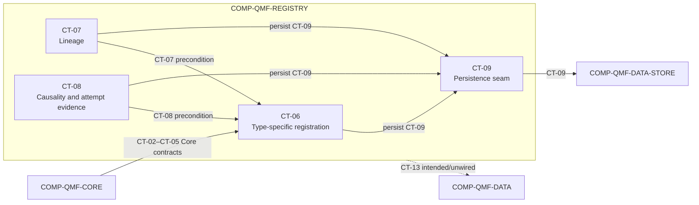

# qmf-registry

`COMP-QMF-REGISTRY` is the identity, lineage, and registration-gate library for versioned QMF artifacts. It depends on `COMP-QMF-CORE` for canonical identity and on `COMP-QMF-DATA-STORE` for storage-neutral persistence (DEC-0033, DEC-0035, DEC-0038).

## Authority boundary

May: define type-specific registration through CT-06; represent graph-shaped append-only lineage through CT-07; evaluate and record causality and attempt gates through CT-08; require human-controlled promotion evidence; persist registry records through CT-09; and reserve an intended/unwired CT-13 journal-evidence output that does not turn CT-09 into a journal (DEC-0033, DEC-0035, DEC-0038, DEC-0041, DEC-0048).

May never: require one universal all-fields card; require a graph database; place registry business rules in the data-layer store; infer object kinds, edge kinds, attempt budgets, reset rules, or promotion evidence from study recommendations; or promote an artifact into the live zone without a human decision (DEC-0033, DEC-0035, DEC-0041).

## Interfaces

| Interface | Direction | Contract | Peer |
|---|---|---|---|
| Exact time and calendar values | in | [CT-02](../contracts/ct-02-time-calendar.yaml) | COMP-QMF-CORE |
| Instrument and venue identity | in | [CT-03](../contracts/ct-03-instrument-identity.yaml) | COMP-QMF-CORE |
| Typed refusal | in | [CT-04](../contracts/ct-04-typed-refusal.yaml) | COMP-QMF-CORE |
| Canonical identity and compatibility | in | [CT-05](../contracts/ct-05-version-fingerprint.yaml) | COMP-QMF-CORE |
| Registration | out | [CT-06](../contracts/ct-06-registration.yaml) | COMP-QMF-DATA, COMP-QMF-STRUCTURE, COMP-QMF-RISK |
| Lineage edge | out | [CT-07](../contracts/ct-07-lineage-edge.yaml) | COMP-QMF-DATA, COMP-QMF-STRUCTURE, COMP-QMF-RISK |
| Causality and attempt evidence | out | [CT-08](../contracts/ct-08-gate-evidence.yaml) | COMP-QMF-DATA, COMP-QMF-STRUCTURE |
| Registry persistence | out | [CT-09](../contracts/ct-09-registry-persistence.yaml) | COMP-QMF-DATA-STORE |
| Cross-domain journal evidence | out (reserved) | [CT-13](../contracts/ct-13-journal.yaml) | Intended: COMP-QMF-DATA; not wired and not an active dependency |

## Behavior

### Identity and registration

Registry operations consume Core-owned exact time, instrument identity, and typed refusal contracts through CT-02, CT-03, and CT-04; Registry does not redefine those values or failure meanings (DEC-0027, DEC-0028, DEC-0029).

Registration admits a type-specific identity only after its applicable lineage and registration preconditions are representable through CT-06 (DEC-0033, DEC-0035). `GAP(GAP-0014): Which V1 kinds, fields, lifecycle values, identity rules, and transaction result define registration?`

Every registered identity and result uses the version and fingerprint substrate in CT-05; incompatible semantic changes create new versions rather than changing an existing meaning (DEC-0030, DEC-0038). Registry persistence crosses CT-09, and `COMP-QMF-DATA-STORE` owns no registration or lineage rule (DEC-0035). CT-09 must not carry operational or research journal evidence. CT-13 is the intended journal boundary, but its Registry-to-Data handoff is reserved and unwired under GAP-0025/GAP-0026, so no active Registry-to-Data dependency or cycle exists (DEC-0048).

### Lineage

Lineage is graph-shaped and append-only without requiring a graph database (DEC-0035). `GAP(GAP-0015): Which edge kinds, endpoint cardinalities, cycle rules, amendment rules, query guarantees, indexes, and compaction rules define CT-07 and CT-09?`

### Registration gates

The causality gate checks whether submitted evidence was knowable at the applicable cutoff, and gate evidence is retained through CT-08 (DEC-0033, DEC-0038). `GAP(GAP-0016): Which claim fields, cutoff comparison, counterexamples, and pass evidence define the gate?`

Attempt accounting is immutable registry evidence, but its target, scope, budget, reset, outcome, and override semantics are not contracts. `GAP(GAP-0017): What does the attempt counter count and how does it constrain registration or research?`

Promotion into the live zone is human-controlled (DEC-0041). `GAP(GAP-0019): Which review evidence, signatures, and immutable records authorize promotion?`

## Configuration

| Variable | Registry key | Notes |
|---|---|---|
| Attempt scope | `registry:registry_attempt_scope` | `GAP(GAP-0017)`; the target and scope are unresolved. |
| Attempt budget | `registry:registry_attempt_budget` | `GAP(GAP-0017)`; no budget is ratified. |
| Attempt reset policy | `registry:registry_attempt_reset_policy` | `GAP(GAP-0017)`; reset behavior is unresolved. |

Registry kinds, edge kinds, and promotion evidence have no ratified registry variables. Their contracts remain `GAP(GAP-0014)`, `GAP(GAP-0015)`, and `GAP(GAP-0019)`.

## Failure modes

| # | Condition | Behavior | Cites |
|---|---|---|---|
| FM-1 | A request names a kind or field set that CT-06 does not define. | Registration does not claim success; the type-specific schema and CT-06 result shape remain `GAP(GAP-0014)` and `GAP(GAP-0016)`. | DEC-0033 |
| FM-2 | A lineage edge has an unratified kind, endpoint relationship, or cycle. | The edge is not admitted as valid CT-07 lineage; validation and amendment behavior remain `GAP(GAP-0015)`. | DEC-0035 |
| FM-3 | Submitted evidence was not knowable at the applicable cutoff. | The causality gate does not pass; exact comparison and retained counterexample evidence remain `GAP(GAP-0016)`. | DEC-0033, DEC-0038 |
| FM-4 | Attempt scope, budget, or reset behavior is needed before `GAP(GAP-0017)` is answered. | No budget decision is inferred and registration cannot claim the unresolved attempt precondition passed. | DEC-0033 |
| FM-5 | CT-09 cannot commit the required registry evidence. | The component does not fabricate a successful persisted registration; transaction, rollback, migration, and recovery behavior remain `GAP(GAP-0022)`. | DEC-0035, DEC-0038 |
| FM-6 | A caller requests live promotion without the human-reviewed evidence contract. | Promotion does not occur; required sign-offs and records remain `GAP(GAP-0019)`. | DEC-0041 |
| FM-7 | A caller tries to persist Registry operational or research journal evidence through CT-09. | The handoff is invalid: CT-09 remains registry-record persistence, and the intended CT-13 journal path is reserved/unwired until `GAP(GAP-0025)` and `GAP(GAP-0026)` define it. | DEC-0048 |

## Related

Decisions: DEC-0027, DEC-0028, DEC-0029, DEC-0030, DEC-0033, DEC-0035, DEC-0038, DEC-0041, DEC-0048. Scenarios: [SCN-0002 source correction](../scenarios/SCN-0002-source-correction.md), [SCN-0003 sealed holdout](../scenarios/SCN-0003-sealed-holdout.md), [SCN-0007 human promotion](../scenarios/SCN-0007-human-promotion.md), [SCN-0010 risk conflicts](../scenarios/SCN-0010-risk-boundary-conflicts.md). Knowledge: none in the current provisional set.
