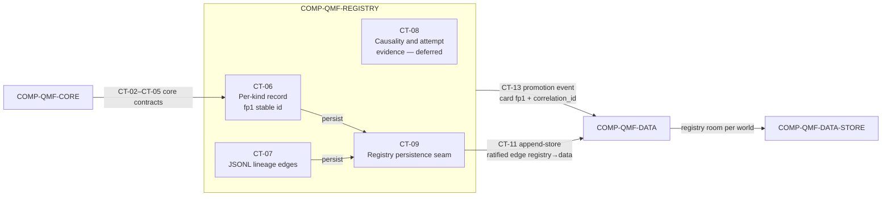

# qmf-registry

`COMP-QMF-REGISTRY` is the identity and lineage library for versioned QMF artifacts: it registers each artifact as a per-kind versioned record whose stable id is derived from its `fp1` fingerprint, and records lineage as append-only typed edges — with no universal card and no database server (DEC-0114). It consumes `COMP-QMF-CORE` for canonical identity, time, and refusal contracts, and persists its records and lineage through `qmf-data` via the single ratified inter-library edge `qmf-registry → qmf-data` (DEC-0120).

## Authority boundary

May: register per-kind versioned records — each kind its own contract — sharing a tiny common header, through CT-06 (DEC-0114); represent lineage that accrues after birth as append-only typed edge records referencing fingerprints, serialized as pinned JSONL, through CT-07 (DEC-0114); reserve the promotion-occurrence card kind with a human-only signer and a mandatory plain-words summary declared an identity field (DEC-0116); persist records and lineage through `qmf-data`'s CT-11 append-store into the per-world registry room via its own CT-09 seam (DEC-0120, DEC-0117); emit the journal `promotion` event carrying only the promotion card's fingerprint plus `correlation_id` through CT-13 (DEC-0116, DEC-0119); and reserve the causality-and-attempt gate-evidence shape CT-08, whose schema is deferred (DEC-0121).

May never: require one universal all-fields recipe card (DEC-0114); require a graph database or any database server (DEC-0114, DEC-0035); mint a stable id or key on a timestamp — ids derive from `fp1` and `(instant, writer, sequence)` is an ordering key only (DEC-0114, DEC-0106); redefine the core-owned time, identity, or refusal meanings it consumes (DEC-0106, DEC-0107, DEC-0109); place registry business rules in the data layer, which owns physical persistence only (DEC-0120); be imported by a consuming library — under default-deny no library imports `qmf-registry`, and registration is invoked by the application at the composition root (DEC-0120); hardcode "exactly one" anywhere in the bot vocabulary (DEC-0115); enforce a look-ahead causality gate or an attempt counter in V1, both deferred to the backtesting sitting (DEC-0121); or promote an artifact into the live zone without a human decision (DEC-0041, DEC-0116).

## Interfaces

| Interface | Direction | Contract | Peer |
|---|---|---|---|
| Exact time and calendar values | in | [CT-02](../contracts/ct-02-time-calendar.yaml) | COMP-QMF-CORE |
| Instrument, venue, and account identity | in | [CT-03](../contracts/ct-03-instrument-identity.yaml) | COMP-QMF-CORE |
| Typed refusal | in | [CT-04](../contracts/ct-04-typed-refusal.yaml) | COMP-QMF-CORE |
| Canonical identity, versioning, and result label | in | [CT-05](../contracts/ct-05-version-fingerprint.yaml) | COMP-QMF-CORE |
| Per-kind registration | out | [CT-06](../contracts/ct-06-registration.yaml) | COMP-QMF-DATA, COMP-QMF-STRUCTURE, COMP-QMF-RISK |
| Lineage edge | out | [CT-07](../contracts/ct-07-lineage-edge.yaml) | COMP-QMF-DATA, COMP-QMF-STRUCTURE, COMP-QMF-RISK |
| Causality and attempt-gate evidence (deferred) | out | [CT-08](../contracts/ct-08-gate-evidence.yaml) | COMP-QMF-DATA, COMP-QMF-STRUCTURE |
| Registry persistence seam | out | [CT-09](../contracts/ct-09-registry-persistence.yaml) | COMP-QMF-DATA-STORE |
| Evidence append-store | in | [CT-11](../contracts/ct-11-evidence-persistence.yaml) | COMP-QMF-DATA |
| Journal promotion event | out | [CT-13](../contracts/ct-13-journal.yaml) | COMP-QMF-DATA |

The consumers of CT-06, CT-07, and CT-08 consume the contract shape only; under default-deny they do not import `qmf-registry`, and the application wires registration at the composition root (DEC-0120).

## Behavior

### Per-kind records and identity

Registration writes a per-kind versioned record — each kind its own contract — and there is never one universal all-fields recipe card (DEC-0114). Every record carries a tiny common header — kind, contract format version, at-birth parent references (identity-bearing), writer (WriterId), and per-writer sequence — plus a kind-specific body (DEC-0114, DEC-0106). A record's stable id is derived from its `fp1` fingerprint and is never minted; created-at and every other occurrence fact are declared display-only and excluded from `fp1` identity, so identical work from two sandboxes deduplicates by computation identity (DEC-0114, DEC-0108, DEC-0110). Registry operations consume the core-owned exact time, instrument identity, and typed refusal contracts through CT-02, CT-03, and CT-04 without redefining those values or failure meanings (DEC-0106, DEC-0107, DEC-0109). Kinds are addable and never redefined; Bot and Book are reserved kind names whose bodies come from their own sittings (DEC-0114). The AD-25 structure lifecycle adds four registry record kinds — **structure objects**, **lifecycle records** (confirmation and invalidation), **interaction records**, and **comparison artifacts** — each minted by the composition root, which holds the `WriterId` and the gapless per-(writer, kind) sequence; the libraries return fingerprintable content, never stamped records (DEC-0129, DEC-0131). The occurrence/display-only classification applies to **computations**; a structure object's **anchor span and lifecycle instants are identity fields and may never be classified away** — a structure object is a market fact at a time, not a computation (DEC-0131). No layer of the bot vocabulary hardcodes exactly-one: a Bot contains one-or-more confluences, a confluence one-or-more levels, triggers, and confirmations, and a composite is its own registered artifact carrying lineage to its children; multiplicity collections order canonically by child fingerprint ascending unless the owning contract declares order significance (DEC-0115). Bot identity is its content, while the Bot–Book–account binding is a separate dated binding record outside Bot identity — one Bot at exactly one Book at a time, and re-binding (paper to live) never mints a new Bot, so paper and live performance stay comparable for alpha-decay sensing (DEC-0115). The full Bot kind body — authoring, confluence composition, and Book binding — is deferred to the QML sitting (GAP-0047, deferred), and DEC-0114 reserves the Bot kind name until then. `GAP(GAP-0039): the Book and BMS kind body — schema, cardinalities, and lifecycle states — is unresolved, pending the risk sitting.`

### Lineage

Lineage that accrues after a record's birth lives exclusively in append-only typed edge records; at-birth parent references stay in the record header, and readers never union header references with edges (DEC-0114). The V1 edge types are `supersedes`, `promoted-from`, `occurrence-of`, `corroborates`, and `disagrees-with`, joined by the AD-25 lifecycle edge kinds `confirmed-as`, `confirmation`, `invalidation`, and `interaction` — addable in later versions, never redefined — and every edge references records by their `fp1` fingerprint (DEC-0114, DEC-0131). Edge files are pinned JSONL: one `fp1`-canonical JSON object per line, LF-terminated, appended with fsync, never rewritten, and size-rotated with a monotonic file ordinal; indexes over edges are local and rebuildable, so losing an index costs a rebuild, never evidence, and no database server is used (DEC-0114). An edge stream has exactly one writer and unlimited readers, the writer holding a WriterId (DEC-0113, DEC-0106). A correction is a new edge and a superseding relationship is a `supersedes` edge — never an in-place edit; `corroborates` and `disagrees-with` edges keep source disagreements visible and are never merged away (DEC-0114, DEC-0119).

### Promotion

The registry reserves a promotion-occurrence card kind: a human-only signer, a signed immutable record, and a mandatory plain-words summary field explicitly declared an identity field, so the signature attests the exact words the human read — a typo fix mints a new record linked to the prior card with a `supersedes` edge (DEC-0116). Promotion into the live zone is human-controlled (DEC-0041). V1 signing is the operator's recorded approval captured as an immutable occurrence attesting the record's `fp1` string, carrying reviewer identity and instant; there is no cryptographic dependency now (DEC-0116). The registry card is canonical: the journal's `promotion` event carries only the card's fingerprint plus `correlation_id`, never a second schema (DEC-0116, DEC-0119). The promotion evidence checklist is ratified as a skeleton: the further review evidence — untouched-test proof, a causality slot, and risk binding — accretes from the data, backtesting, and risk sittings, and the promotion gate itself (workflow, UI, and timing) is platform territory outside QMF (DEC-0116).

### Registration gates — deferred

Registration currently records occurrence evidence but enforces no look-ahead causality gate and no attempt counter (DEC-0121). Both mechanisms are operator-deferred to the backtesting sitting, and the consequence is knowingly accepted: artifacts registered before that sitting carry no causality evidence, and that evidence is not retroactively reconstructible (DEC-0121). The bitemporal ingredients — event-time versus knowledge-time — remain ratified through the core time contract CT-02 (DEC-0106), and registry occurrence records still log every run, so the attempt tally's raw material accrues without any enforced policy (DEC-0121). CT-08 reserves the causality-and-attempt gate-evidence shape, but its claim fields, cutoff comparison, attempt scope, budget, and reset semantics are unresolved. GAP-0016 (the look-ahead causality registration gate) and GAP-0017 (the attempt counter) are deferred to the backtesting sitting under DEC-0121 — they are not open questions this component answers and are never closed here.

### Persistence

The registry selects no graph database and no database server: records persist as per-kind versioned records and lineage as pinned JSONL edges (DEC-0114). It persists both through `qmf-data`'s CT-11 append-store — the single ratified inter-library edge `qmf-registry → qmf-data` — with stdlib-typed signatures at the boundary, via its own CT-09 registry-persistence seam (DEC-0120). The registry room is one of `qmf-data`'s seven AD-19 room-roles, held under the same retention, backup, and migration law as every other evidence room (DEC-0117, DEC-0118). Rooms are instantiated per world (`live`, `replay`, or `simulated`); a read that crosses worlds is a `policy rejection` refusal, and a non-live world never writes the live evidence namespace (DEC-0117, DEC-0110). The data layer owns physical persistence only — kinds, lineage semantics, and identity remain registry business rules (DEC-0120). Persistence is append-only: records and edges are never rewritten in place, and raw records plus lineage are kept forever; storage keys on a record's `fp1` fingerprint, so a byte-identical idempotent re-write is accepted silently while a true collision on differing bytes is refused and alarmed (DEC-0108, DEC-0114). Store-library exceptions are translated to a `storage failure` typed refusal at the `qmf-data` boundary and never propagated across the package seam (DEC-0109). Every serialized registry artifact stamps its contract format version; migrations run preflight checks then backup-first then dry-run then migrate then verify, with a documented restore path and never in-place mutation of the only copy (DEC-0103, DEC-0118).

## Configuration

| Variable | Registry key | Notes |
|---|---|---|
| Attempt scope | `registry:registry_attempt_scope` | Deferred to the backtesting sitting; the counter target and scope are unresolved (DEC-0121; GAP-0017). |
| Attempt budget | `registry:registry_attempt_budget` | Deferred to the backtesting sitting; no attempt budget is ratified (DEC-0121; GAP-0017). |
| Attempt reset policy | `registry:registry_attempt_reset_policy` | Deferred to the backtesting sitting; whether and when attempt accounting resets is unresolved (DEC-0121; GAP-0017). |

Registry kind bodies have no ratified registry variables: the reserved Bot kind body is deferred to the QML sitting (GAP-0047, deferred) and the Book kind body remains `GAP(GAP-0039)`, while the promotion evidence checklist accretes from the data, backtesting, and risk sittings (DEC-0116). The V1 edge-type set, per-kind header, and `fp1`-derived stable id are ratified in CT-06 and CT-07 (DEC-0114) and carry no tunable variable.

## Failure modes

| # | Condition | Behavior | Cites |
|---|---|---|---|
| FM-1 | A registration names a kind or field set that CT-06 does not define. | Registration does not claim success; it returns a typed refusal. The reserved Bot kind body is deferred (GAP-0047) and the Book kind body remains `GAP(GAP-0039)`. | DEC-0114, DEC-0109 |
| FM-2 | A lineage edge uses a kind outside the ratified CT-07 edge-type set, or references an endpoint by anything other than an `fp1` fingerprint. | The edge is not admitted as valid CT-07 lineage; a typed refusal is returned, and edge types are addable in later versions but never redefined. | DEC-0114, DEC-0109 |
| FM-3 | A caller expects registration to enforce a look-ahead causality gate or an attempt-count limit. | Registration records occurrence evidence but enforces neither gate; both are deferred to the backtesting sitting, so artifacts carry no causality evidence and GAP-0016 / GAP-0017 stay open and deferred. | DEC-0121 |
| FM-4 | A caller requests live promotion without the human-signed promotion-occurrence card. | Promotion does not occur; the human-only signer and mandatory plain-words summary (an identity field) are required, and V1 signing is the operator's recorded approval attesting the card's `fp1`. | DEC-0041, DEC-0116 |
| FM-5 | A promotion card's plain-words summary is corrected after signing. | A new promotion card is minted and linked to the prior card with a `supersedes` edge; the signed record is never edited in place, because the signature attests the exact words read. | DEC-0116, DEC-0114 |
| FM-6 | A write presents the same `fp1` stable id with differing bytes (a true collision). | The write is refused and alarmed, never overwritten; a byte-identical idempotent re-write is accepted silently. | DEC-0108, DEC-0114 |
| FM-7 | A read or write crosses worlds, or a non-live world attempts to write the live evidence namespace. | A `policy rejection` typed refusal is returned; rooms are instantiated per world and world separation is delivered by storage separation, not identity distinctness alone. | DEC-0117, DEC-0110 |
| FM-8 | The underlying store fails — disk-full, corrupt, locked, or truncated — while persisting a record or edge. | A `storage failure` typed refusal is returned; store-library exceptions are translated at the `qmf-data` boundary and never propagated across the package seam, and no partial registration is claimed successful. | DEC-0109, DEC-0120 |

## Related

Decisions: DEC-0027, DEC-0028, DEC-0029, DEC-0030, DEC-0033, DEC-0035, DEC-0038, DEC-0041, DEC-0103, DEC-0106, DEC-0108, DEC-0109, DEC-0110, DEC-0113, DEC-0114, DEC-0115, DEC-0116, DEC-0117, DEC-0118, DEC-0119, DEC-0120, DEC-0121, DEC-0129, DEC-0131. Scenarios: [SCN-0002 source correction](../scenarios/SCN-0002-source-correction.md), [SCN-0003 sealed holdout](../scenarios/SCN-0003-sealed-holdout.md), [SCN-0007 human promotion](../scenarios/SCN-0007-human-promotion.md), [SCN-0010 risk conflicts](../scenarios/SCN-0010-risk-boundary-conflicts.md). Knowledge: none in the current provisional set.
