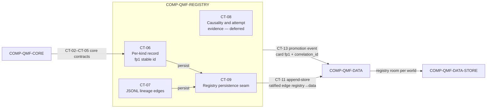

# qmf-registry

`COMP-QMF-REGISTRY` is the identity and lineage library for versioned QMF artifacts: it registers each artifact as a per-kind versioned record whose stable id is derived from its `fp1` fingerprint, and records lineage as append-only typed edges — with no universal card and no database server (DEC-0114). It consumes `COMP-QMF-CORE` for canonical identity, time, and refusal contracts, and persists its records and lineage through `qmf-data` via the single ratified inter-library edge `qmf-registry → qmf-data` (DEC-0120).

## Authority boundary

May: register per-kind versioned records — each kind its own contract — sharing a tiny common header, through CT-06 (DEC-0114); represent lineage that accrues after birth as append-only typed edge records referencing fingerprints, serialized as pinned JSONL, through CT-07 (DEC-0114); reserve the promotion-occurrence card kind with a human-only signer and a mandatory plain-words summary declared an identity field (DEC-0116); persist records and lineage through `qmf-data`'s CT-11 append-store into the per-world registry room via its own CT-09 seam (DEC-0120, DEC-0117); emit the journal `promotion` event carrying only the promotion card's fingerprint plus `correlation_id` through CT-13 (DEC-0116, DEC-0119); and reserve the causality-and-attempt gate-evidence shape CT-08, whose schema is deferred (DEC-0121).

May never: require one universal all-fields recipe card (DEC-0114); require a graph database or any database server (DEC-0114, DEC-0035); mint a stable id or key on a timestamp — ids derive from `fp1` and `(instant, writer, sequence)` is an ordering key only (DEC-0114, DEC-0106); redefine the core-owned time, identity, or refusal meanings it consumes (DEC-0106, DEC-0107, DEC-0109); place registry business rules in the data layer, which owns physical persistence only (DEC-0120); be imported by a consuming library — under default-deny no library imports `qmf-registry`, and registration is invoked by the application at the composition root (DEC-0120); hardcode "exactly one" anywhere in the bot vocabulary (DEC-0115); enforce a look-ahead causality gate or an attempt counter in V1, both deferred to the backtesting sitting (DEC-0121); or promote an artifact into the live zone without a human decision (DEC-0041, DEC-0116).

## Interfaces

| Interface | Direction | Contract | Peer |
|---|---|---|---|
| Exact time and calendar values | in | [CT-02](../contracts/ct-02-time-calendar.yaml) | COMP-QMF-CORE |
| Instrument, venue, and account identity | in | [CT-03](../contracts/ct-03-instrument-identity.yaml) | COMP-QMF-CORE |
| Typed refusal | in | [CT-04](../contracts/ct-04-typed-refusal.yaml) | COMP-QMF-CORE |
| Canonical identity, versioning, and result label | in | [CT-05](../contracts/ct-05-version-fingerprint.yaml) | COMP-QMF-CORE |
| Per-kind registration | out | [CT-06](../contracts/ct-06-registration.yaml) | COMP-QMF-DATA, COMP-QMF-STRUCTURE, COMP-QMF-RISK |
| Lineage edge | out | [CT-07](../contracts/ct-07-lineage-edge.yaml) | COMP-QMF-DATA, COMP-QMF-STRUCTURE, COMP-QMF-RISK |
| Causality and attempt-gate evidence (deferred) | out | [CT-08](../contracts/ct-08-gate-evidence.yaml) | COMP-QMF-DATA, COMP-QMF-STRUCTURE |
| Registry persistence seam | out | [CT-09](../contracts/ct-09-registry-persistence.yaml) | COMP-QMF-DATA-STORE |
| Evidence append-store | in | [CT-11](../contracts/ct-11-evidence-persistence.yaml) | COMP-QMF-DATA |
| Journal promotion event | out | [CT-13](../contracts/ct-13-journal.yaml) | COMP-QMF-DATA |
| Bot definition kind (authored via QML) | out | [CT-33](../contracts/ct-33-bot-definition.yaml) | COMP-QML (authored-via), COMP-QMB |
| Confluence kind (authored via QML) | out | [CT-34](../contracts/ct-34-confluence.yaml) | COMP-QML (authored-via), COMP-QMB |

The consumers of CT-06, CT-07, and CT-08 consume the contract shape only; under default-deny they do not import `qmf-registry`, and the application wires registration at the composition root (DEC-0120). CT-33 (Bot definition) and CT-34 (confluence) are Bot-domain kinds owned here but authored via the QML library ([COMP-QML](qml.md)): QML returns fingerprintable content and the composition root mints the records under AD-25 root-mints, so kind ownership creates no import edge — qmf-registry gains no dependency on QML (DEC-0171, DEC-0173, DEC-0175).

## Behavior

### Per-kind records and identity

Registration writes a per-kind versioned record — each kind its own contract — and there is never one universal all-fields recipe card (DEC-0114). Every record carries a tiny common header — kind, contract format version, at-birth parent references (identity-bearing), writer (WriterId), and per-writer sequence — plus a kind-specific body (DEC-0114, DEC-0106). A record's stable id is derived from its `fp1` fingerprint and is never minted; created-at and every other occurrence fact are declared display-only and excluded from `fp1` identity, so identical work from two sandboxes deduplicates by computation identity (DEC-0114, DEC-0108, DEC-0110). Registry operations consume the core-owned exact time, instrument identity, and typed refusal contracts through CT-02, CT-03, and CT-04 without redefining those values or failure meanings (DEC-0106, DEC-0107, DEC-0109). Kinds are addable and never redefined; the Book kind body is now ruled by the risk sitting, and the Bot kind body is now ruled through CT-33, so Bot is no longer a body-pending reserved name (DEC-0114, DEC-0143, DEC-0173). The risk sitting mints nine per-kind record contracts (AD-16): **Book definition** (CT-22), **BMS definition** (CT-27), **Book binding** (CT-28), **binding transition** (CT-24), **exit record** (CT-29), **control action** (CT-30), **control window** (CT-31), **performance result** (CT-32), and **instrument currency-exposure** as a dated AD-9 metadata record; **instrument_class** is a further dated AD-9 metadata record kind — each a `qmf-core` value type content-fingerprinted by CT-05's single implementation and wrapped into a registry record by the composition root, creating no new package edge (DEC-0158, DEC-0153). A **treasury boundary-event** kind is reserved for money movements between accounts and cycles (`sweep | refund | re_seed | paper_epoch_reset`, addable never redefined, mapped onto AD-21's `risk transition` event type); no money moves without one, a boundary event never closes a position and never re-bases a frozen R, and its fields and evaluation are node territory (DEC-0158). Every risk-domain cardinality-one — one BMS instance per account, a Book binding exactly one BMS at a time, a Bot binding exactly one Book — is a deliberate ruling under AD-17, never a hardcoded assumption (DEC-0143). The AD-25 structure lifecycle adds four registry record kinds — **structure objects**, **lifecycle records** (confirmation and invalidation), **interaction records**, and **comparison artifacts** — each minted by the composition root, which holds the `WriterId` and the gapless per-(writer, kind) sequence; the libraries return fingerprintable content, never stamped records (DEC-0129, DEC-0131). The occurrence/display-only classification applies to **computations**; a structure object's **anchor span and lifecycle instants are identity fields and may never be classified away** — a structure object is a market fact at a time, not a computation (DEC-0131). No layer of the bot vocabulary hardcodes exactly-one: a Bot contains one-or-more confluences, a confluence one-or-more legs of any role mix over the closed-and-addable vocabulary `level | trigger | confirmation | filter` (DEC-0175), and a composite is its own registered artifact carrying lineage to its children; multiplicity collections order canonically by child fingerprint ascending unless the owning contract declares order significance (DEC-0115). Bot identity is its content, while the Bot–Book–account binding is a separate dated binding record outside Bot identity — one Bot at exactly one Book at a time, and re-binding (paper to live) never mints a new Bot, so paper and live performance stay comparable for alpha-decay sensing (DEC-0115). The 2026-08-21 QML sitting mints two Bot-domain kinds owned here and authored via the QML library — the Bot definition (CT-33, filling AD-16's reserved Bot kind) and the confluence (CT-34) — plus the strategy family as a dated AD-9 metadata record kind under CT-06's addable-kinds law with no new CT number; the Bot kind registers only for a declaration passing both QL-8 conformance layers, else a policy-rejection refusal; records are minted at the composition root under AD-25 root-mints (writer unit (machine, authoring role, kind)), so kind ownership creates no import edge (DEC-0171, DEC-0173, DEC-0175, DEC-0176, DEC-0178). The Book and BMS kind bodies — schema, cardinalities, and lifecycle states — are ruled by the risk sitting through CT-22, CT-27, and CT-28, with the binding chain and every cardinality-one deliberate under AD-17 (DEC-0143, DEC-0158).

### Lineage

Lineage that accrues after a record's birth lives exclusively in append-only typed edge records; at-birth parent references stay in the record header, and readers never union header references with edges (DEC-0114). The V1 edge types are `supersedes`, `promoted-from`, `occurrence-of`, `corroborates`, and `disagrees-with`, joined by the AD-25 lifecycle edge kinds `confirmed-as`, `confirmation`, `invalidation`, and `interaction`, and the risk-gate edges `continues-performance`, `carries-ledger`, `enacts`, and `branches-from` — addable in later versions, never redefined — and every edge references records by their `fp1` fingerprint (DEC-0114, DEC-0131, DEC-0158). The single `continues-as` edge is split into two typed edges that never imply each other: **`continues-performance`** — a human-signed (AD-18) assertion that one binding continues another's performance record across a template version change or a broker migration, consumed only by CT-32 population declarations and moving no money; and **`carries-ledger`** — a human-signed assertion that per-binding state (virtual ledger, cycle position, budget remainder, breaker and bench counters) carries across a new binding, moving money and asserting nothing about comparability; neither is ever inferred from the other's presence (DEC-0158). **`enacts`** is an identity-bearing, append-only edge from a command record or an outcome observation to the CT-30 control-action or CT-23 intent record it enacts — AD-36's standing-intent fold, AD-37's arbitration records, and AD-41's suppression accounting resolve through `enacts`, never through `correlation_id` (DEC-0158). `supersedes` is pinned linear — at most one outgoing edge per subject and one resolvable head, so "current" is never ambiguous — while AD-30's branching Book/BMS version graph uses **`branches-from`**, where several heads are legal and "current" is a separate dated pointer record, never inferred from the graph (DEC-0158, DEC-0144). Edge files are pinned JSONL: one `fp1`-canonical JSON object per line, LF-terminated, appended with fsync, never rewritten, and size-rotated with a monotonic file ordinal; indexes over edges are local and rebuildable, so losing an index costs a rebuild, never evidence, and no database server is used (DEC-0114). An edge stream has exactly one writer and unlimited readers, the writer holding a WriterId (DEC-0113, DEC-0106). A correction is a new edge and a superseding relationship is a `supersedes` edge — never an in-place edit; `corroborates` and `disagrees-with` edges keep source disagreements visible and are never merged away (DEC-0114, DEC-0119).

### Promotion

The registry reserves a promotion-occurrence card kind: a human-only signer, a signed immutable record, and a mandatory plain-words summary field explicitly declared an identity field, so the signature attests the exact words the human read — a typo fix mints a new record linked to the prior card with a `supersedes` edge (DEC-0116). Promotion into the live zone is human-controlled (DEC-0041). V1 signing is the operator's recorded approval captured as an immutable occurrence attesting the record's `fp1` string, carrying reviewer identity and instant; there is no cryptographic dependency now (DEC-0116). The registry card is canonical: the journal's `promotion` event carries only the card's fingerprint plus `correlation_id`, never a second schema (DEC-0116, DEC-0119). A card attesting an AD-32 admission carries the **Book-definition (or BMS-definition) fingerprint as an identity field**, so a signature can never attest a superseded template (DEC-0158). The promotion evidence checklist accretes from later sittings, and the **risk slot landed 2026-08-20**: AD-32's three-layer admission packet — Layer 1 linters, Layer 2 technical shakedown, Layer 3 one operator signature on one assembled page carrying both proofs, the binding identity, the capability-satisfaction result, and the resolved BMS fingerprint — plus AD-41's performance evidence (DEC-0146, DEC-0155). The untouched-test proof and causality slot still accrete from the data and backtesting sittings, and the promotion gate itself (workflow, UI, and timing) is platform territory outside QMF (DEC-0116).

### Registration gates — deferred

Registration currently records occurrence evidence but enforces no look-ahead causality gate and no attempt counter (DEC-0121). Both mechanisms are operator-deferred to the backtesting sitting, and the consequence is knowingly accepted: artifacts registered before that sitting carry no causality evidence, and that evidence is not retroactively reconstructible (DEC-0121). The bitemporal ingredients — event-time versus knowledge-time — remain ratified through the core time contract CT-02 (DEC-0106), and registry occurrence records still log every run, so the attempt tally's raw material accrues without any enforced policy (DEC-0121). CT-08 reserves the causality-and-attempt gate-evidence shape, but its claim fields, cutoff comparison, attempt scope, budget, and reset semantics are unresolved. GAP-0016 (the look-ahead causality registration gate) and GAP-0017 (the attempt counter) stay deferred under DEC-0121 — they are not open questions this component answers and are never closed here. The QMB increment split the question: look-ahead *prevention* is now delivered structurally inside a QMB run — forming-bar/completed-boundary rules, split-manifest enforcement at every read, and declared stream sets (DEC-0169) — while the registration *gate* that PROVES a pass, and the counting policy, remain this deferral's substance; every QMB trial and replicate is a fully-labeled ledgered run, so the tally's raw material now accrues by construction (DEC-0161).

### Persistence

The registry selects no graph database and no database server: records persist as per-kind versioned records and lineage as pinned JSONL edges (DEC-0114). It persists both through `qmf-data`'s CT-11 append-store — the single ratified inter-library edge `qmf-registry → qmf-data` — with stdlib-typed signatures at the boundary, via its own CT-09 registry-persistence seam (DEC-0120). The registry room is one of `qmf-data`'s seven AD-19 room-roles, held under the same retention, backup, and migration law as every other evidence room (DEC-0117, DEC-0118). Rooms are instantiated per world (`live`, `replay`, or `simulated`); a read that crosses worlds is a `policy rejection` refusal, and a non-live world never writes the live evidence namespace (DEC-0117, DEC-0110). The data layer owns physical persistence only — kinds, lineage semantics, and identity remain registry business rules (DEC-0120). Persistence is append-only: records and edges are never rewritten in place, and raw records plus lineage are kept forever; storage keys on a record's `fp1` fingerprint, so a byte-identical idempotent re-write is accepted silently while a true collision on differing bytes is refused and alarmed (DEC-0108, DEC-0114). Store-library exceptions are translated to a `storage failure` typed refusal at the `qmf-data` boundary and never propagated across the package seam (DEC-0109). Every serialized registry artifact stamps its contract format version; migrations run preflight checks then backup-first then dry-run then migrate then verify, with a documented restore path and never in-place mutation of the only copy (DEC-0103, DEC-0118).

### QMB delivery consumer

QMB — the QMX experimentation library and its `qmb` CLI, built on QMF — consumes registry state without a database server and without a central service: records reach QMB machines as **immutable fingerprinted as-of sets** distributed over a passive file-sync hub — dumb storage only, the DEC-0084 central-registry service staying dead — and one library-owned registry-read port serves both the config compiler and CLI autocomplete, with no per-door caches (DEC-0165). A sweep freezes exactly one as-of set at batch admission, so every isolated run in the batch reads the same registry state, and a reference into a stale or superseded as-of set raises an AD-11 `stale evidence` typed refusal at the run-configured severity (DEC-0165). QMB's resolved run-config fragments are **derived artifacts** carrying AD-16 lineage back to their CT-22 Book charter and CT-27 BMS definition — never a new registry kind and never a mutation of the source templates (DEC-0160, DEC-0165). Any write-back rides the same WriterId-scoped, append-only streams every producer uses, under the AD-10 discipline this component already enforces: a byte-identical re-write is an idempotent silent accept, a genuine variant is a lineage sibling, and a true `fp1` collision on differing bytes is refused and alarmed (DEC-0165, DEC-0160).

### Workbench Library projection (2026-09-14)

The strategy-experimentation workbench treats **Library** as a **projection** over this component's existing `fp1` kinds — no sixth application, no new `COMP-*`, and no parallel identity store beside `qmf-registry` (DEC-0271, DEC-0285, ADR-0022). Shared Library objects are exactly these kinds, cited by `fp1`: CT-33 bot definition, CT-34 confluence, strategy-family, CT-22 Book, CT-27 BMS, CT-28 binding, CT-12 split, CT-10 observation, CT-32 result, and CT-47 ExperimentSpec on the coordinated lane only (DEC-0271). Logic source-manifests are cited from CT-33, never a separate Library kind. **Not** Library kinds: QMA staging and RefinementProposals, JobHandles, Graph Templates, Skills, Routines, saved views, analysis publications, and derived datasets (DEC-0271). Work-environment tabs and display aliases `project` / `workspace` are UX over those fingerprints; there is no Project kind and no Workspace kind (DEC-0284, DEC-0271). The seed corpus behind CT-44 still writes no registry kinds (`source_id=strats` is the adapter key, not a Library kind) (DEC-0380) (DEC-0271).

A **candidate set** is a **read-time query**, never a copied-row store: it folds (1) QMB ledger lines, (2) registry as-of sets **including `dev`-zone** candidates of Library kinds, and (3) coordinated Experiment Ledger refs; it does **not** read QMA staging (DEC-0282). `sweep.rank` is that view and publishes no copied-row artifact (DEC-0282). A proposed Book or BMS variant is a **complete** new fingerprinted CT-22 / CT-27 document registered in the registry **`dev` zone**, never a patch record posing as a definition (DEC-0274); path-dependent evaluation of that candidate is a QMB governed or coordinated replay citing that fingerprint, with shape ownership remaining `COMP-QMF-RISK` and mint remaining the composition-root pattern (DEC-0274, DEC-0120).

CT-33 and CT-34 carry a `source-inspected` wiring stamp for matching author types on `integration@1b451a848d897e42f6e2c7fd9f2ea86fab7295f2` under `qml/src/qml/declaration`; class and test existence is not end-to-end host-mint proof, and composition-root CT-06 envelope mint plus live/product wiring remain connect work under the factory pipeline (DEC-0286, DEC-0285). Contract YAML that still stamps those kinds `defined-unwired` with a "no code exists" provenance note is **stale** relative to that SHA and is reconciled here as `source-inspected` (matching source at that SHA; not end-to-end demonstrated), never as a second design (DEC-0286). Implementation authorization remains factory-pipeline-only (DEC-0285).

### QML research expansion — kind and lineage law **[PROPOSED]** (2026-09-16)

Operator paradigm DEC-0380 is ratified. Package claims in this subsection are **[PROPOSED]** under [ADR-0023](../decisions/ADR-0023-qml-research-expansion.md) (DEC-0381..DEC-0407 provisional; DEC-0408..DEC-0413 dead list honored). Status of this component-spec remains `ratified`.

**[PROPOSED]** No hypothesis kind and no research-candidate kind is added to this component's roster (DEC-0401). `research_ref` is fp1-shaped (`fp1:sha256:<hex>` with preimage class `qml-research-hypothesis`) so `graduate_to_governed` can consume it, and **must not** be registered as a qmf-registry kind, must not appear on the Artifact rail, and must not reuse a `class` already used by Bot / experiment / Citation envelopes (DEC-0401). Workbench AD-3 holds: the seed corpus still writes no registry kinds; a hypothesis becomes a Library object only after Stage 1 registration mints CT-33/CT-34 (DEC-0381) (DEC-0271).

**[PROPOSED]** A mill-graduation CT-07 `promoted-from` edge is lineage, not governed evidence; `to_ref` is the hypothesis `research_ref` (DEC-0387) (DEC-0397). There is no CT-07 edge to a Knowledge Citation (DEC-0387) (DEC-0397). CT-32 and seats cite only the Bot `fp1` (DEC-0397). CT-33 and CT-34 meaning is unchanged; optional `seed_cite` must not enter the CT-33 / CT-34 / `fp1` preimage (DEC-0387). Dictionary entries are vocabulary over seed files and are not CT-06, CT-16, or CT-34 rows (DEC-0396).

### [Workflows 2026-09-19] Library kinds unchanged; ContributionHit is not a registry kind

Package status: ratified under [ADR-0024](../decisions/ADR-0024-workflows-construction-kit.md) (DEC-0445). Preflight is reuse — no new COMP and no new CT (DEC-0446). Implementation authorization remains factory-pipeline-only.

**Library kind roster is unchanged (DEC-0415).** Workbench AD-3 / DEC-0271 Library objects remain the existing `fp1` kinds listed above. Workflows product discovery may concatenate typed hits, but that discovery DTO does not add a registry kind and does not mint a fourth store (DEC-0415) (DEC-0449).

**`ContributionHit` is not a registry kind (DEC-0415) (DEC-0449).** Identity is the live `published_contributions()` tuple and is never `fp1`, never an `ArtifactHit.kind`, and never registered under CT-06 (DEC-0415) (DEC-0449). Pins store `(qualified_id, package_version, availability_revision)`, not a descriptor digest (DEC-0415).

**Recipe CT-06 kind stays deferred (DEC-0444) (DEC-0447 A5).** `RecipeDefinition` identity is additive beside release `fp1` plus CT-07 lineage and is not minted as a CT-06 kind in this sitting (DEC-0444) (DEC-0425).

## Configuration

| Variable | Registry key | Notes |
|---|---|---|
| Attempt scope | `registry:registry_attempt_scope` | Deferred to the backtesting sitting; the counter target and scope are unresolved (DEC-0121; GAP-0017). |
| Attempt budget | `registry:registry_attempt_budget` | Deferred to the backtesting sitting; no attempt budget is ratified (DEC-0121; GAP-0017). |
| Attempt reset policy | `registry:registry_attempt_reset_policy` | Deferred to the backtesting sitting; whether and when attempt accounting resets is unresolved (DEC-0121; GAP-0017). |

Registry kind bodies have no ratified registry variables: the Bot kind body is ruled through CT-33 and the strategy-family kind through CT-06's addable path (DEC-0173, DEC-0176); neither carries a tunable registry variable — QML mints no values or pins, while the Book and BMS kind bodies are ruled through CT-22, CT-27, and CT-28 (DEC-0143, DEC-0158) and the promotion evidence checklist's risk slot landed via AD-32's admission packet and AD-41's performance evidence (DEC-0146, DEC-0155). The V1 edge-type set, per-kind header, and `fp1`-derived stable id are ratified in CT-06 and CT-07 (DEC-0114) and carry no tunable variable.

## Failure modes

| # | Condition | Behavior | Cites |
|---|---|---|---|
| FM-1 | A registration names a kind or field set that CT-06 does not define. | Registration does not claim success; it returns a typed refusal. The Book and BMS kind bodies are ruled through CT-22/CT-27/CT-28 (DEC-0143, DEC-0158); the Bot kind body is ruled through CT-33 and the confluence through CT-34 (DEC-0173, DEC-0175). | DEC-0114, DEC-0109 |
| FM-2 | A lineage edge uses a kind outside the ratified CT-07 edge-type set, or references an endpoint by anything other than an `fp1` fingerprint. | The edge is not admitted as valid CT-07 lineage; a typed refusal is returned, and edge types are addable in later versions but never redefined. | DEC-0114, DEC-0109 |
| FM-3 | A caller expects registration to enforce a look-ahead causality gate or an attempt-count limit. | Registration records occurrence evidence but enforces neither gate; both stay deferred (never open) per DEC-0121, so artifacts carry no causality evidence — though look-ahead prevention is now delivered structurally inside a QMB run (DEC-0169). | DEC-0121, DEC-0169 |
| FM-4 | A caller requests live promotion without the human-signed promotion-occurrence card. | Promotion does not occur; the human-only signer and mandatory plain-words summary (an identity field) are required, and V1 signing is the operator's recorded approval attesting the card's `fp1`. | DEC-0041, DEC-0116 |
| FM-5 | A promotion card's plain-words summary is corrected after signing. | A new promotion card is minted and linked to the prior card with a `supersedes` edge; the signed record is never edited in place, because the signature attests the exact words read. | DEC-0116, DEC-0114 |
| FM-6 | A write presents the same `fp1` stable id with differing bytes (a true collision). | The write is refused and alarmed, never overwritten; a byte-identical idempotent re-write is accepted silently. | DEC-0108, DEC-0114 |
| FM-7 | A read or write crosses worlds, or a non-live world attempts to write the live evidence namespace. | A `policy rejection` typed refusal is returned; rooms are instantiated per world and world separation is delivered by storage separation, not identity distinctness alone. | DEC-0117, DEC-0110 |
| FM-8 | The underlying store fails — disk-full, corrupt, locked, or truncated — while persisting a record or edge. | A `storage failure` typed refusal is returned; store-library exceptions are translated at the `qmf-data` boundary and never propagated across the package seam, and no partial registration is claimed successful. | DEC-0109, DEC-0120 |
| FM-9 | A caller registers `ContributionHit`, a recipe definition, or a hypothesis/`research_ref` as a CT-06 kind. | Registration refuses — ContributionHit is never a registry kind; recipe CT-06 kind stays deferred; `research_ref` is not a registry kind. | DEC-0415, DEC-0449, DEC-0444, DEC-0401 |

## Related

Decisions: DEC-0027, DEC-0028, DEC-0029, DEC-0030, DEC-0033, DEC-0035, DEC-0038, DEC-0041, DEC-0103, DEC-0106, DEC-0108, DEC-0109, DEC-0110, DEC-0113, DEC-0114, DEC-0115, DEC-0116, DEC-0117, DEC-0118, DEC-0119, DEC-0120, DEC-0121, DEC-0129, DEC-0131, DEC-0143, DEC-0144, DEC-0146, DEC-0155, DEC-0158; QMB delivery: DEC-0160 (fragments as derived artifacts), DEC-0165 (as-of sets, passive hub, DEC-0084 stays dead); QML authoring: DEC-0171 (roster-scoped default-deny, root-mints write path), DEC-0173 (CT-33 Bot kind body), DEC-0175 (CT-34 confluence kind), DEC-0176 (strategy-family metadata record), DEC-0178 (conformance-as-ticket registration); workbench: DEC-0271 (Library is a projection), DEC-0274 (complete Book/BMS candidates in `dev`), DEC-0282 (candidate set is a query), DEC-0284 (no Project/Workspace kind), DEC-0285 (umbrella reuse), DEC-0286 (`source-inspected` wiring stamp). QML research expansion **[PROPOSED]**: DEC-0380 (ratified operator paradigm), DEC-0381 (hypotheses not Library until CT-33), DEC-0387 (`seed_cite` out of CT-33/CT-34/`fp1` preimage; no CT-07 to a Citation), DEC-0396 (dictionary entries are not CT-06/CT-16/CT-34 rows), DEC-0397 (mill `promoted-from` is lineage; `to_ref` = `research_ref`), DEC-0401 (`research_ref` fp1-shaped and not a registry kind), DEC-0408..DEC-0413 (dead list). Workflows: DEC-0415 (ContributionHit never a registry kind), DEC-0444 (recipe CT-06 kind deferred), DEC-0445 (umbrella), DEC-0446 (preflight), DEC-0447 (cheap-veto A5), DEC-0449 (named amendment of DEC-0389). ADR: [ADR-0017 QMB](../decisions/ADR-0017-qmb-experimentation-library.md), [ADR-0018 QML](../decisions/ADR-0018-qml-bot-authoring-library.md), [ADR-0022 workbench expansion](../decisions/ADR-0022-workbench-expansion.md), [ADR-0023 QML research expansion](../decisions/ADR-0023-qml-research-expansion.md) (provisional package), [ADR-0024 Workflows construction kit](../decisions/ADR-0024-workflows-construction-kit.md). Peer components: [COMP-QMB](qmb.md), [COMP-QML](qml.md) (the bot-authoring library authoring the CT-33/CT-34 kinds this component owns), [COMP-QMF-RISK](qmf-risk.md) (Book/BMS shape owner for `dev`-zone candidates). Scenarios: [SCN-0002 source correction](../scenarios/SCN-0002-source-correction.md), [SCN-0003 sealed holdout](../scenarios/SCN-0003-sealed-holdout.md), [SCN-0007 human promotion](../scenarios/SCN-0007-human-promotion.md), [SCN-0010 risk conflicts](../scenarios/SCN-0010-risk-boundary-conflicts.md), [SCN-0018 ContributionHit honesty](../scenarios/SCN-0018-contribution-hit-honesty.md). Knowledge: none in the current provisional set.
