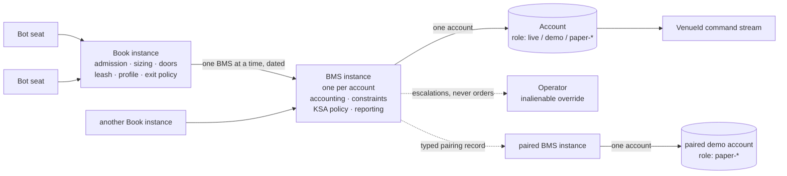

# QMF Risk Module

`COMP-QMF-RISK` is the ratified risk module: it defines the Book, BMS, binding, admission, exit, control, window, and performance contracts — CT-22 through CT-25 and CT-27 through CT-32 — on `qmf-core` nouns, so a Book's meaning, a binding's identity, R, and every risk record live inside the governed value system rather than beside it. It is not an execution engine. It imports only `COMP-QMF-CORE`; nothing imports it; risk records reach the registry and `qmf-data` through the application composition root, creating no new package edge. [DEC-0120] [DEC-0158]

The risk design was ratified 2026-08-20 by AD-29 through AD-41, recorded as DEC-0143 through DEC-0158; GAP-0039 through GAP-0046 are answered. Ratification fixes the contract surface only. Every number surfaced during the risk sitting is a configurable UI-editable variable with recorded evidence and no ratified spine value [DEC-0157], and implementation authorization arrives solely through the factory pipeline — no live binding, order, mode transition, or flatten is authorized by this document. [DEC-0146]

## Authority boundary

May: define CT-22 through CT-25 and CT-27 through CT-32 on `qmf-core` nouns and own their shape — the Book definition and BMS definition templates, the Book binding record and its identity trinity, the three-layer admission surface, the CT-23 risk-evaluation door, exit policy and typed close reasons, the control-action contract, the control-window contract, the binding-transition (Book-mode) stream, the exit record, and the performance-result container; consume SQS as a CT-16 configured producer and read its published score at a Book door; consume CT-18 venue capability and profile at bind time; express R as three typed faces on `qmf-core` value types under the dimensional law; mint risk records as `qmf-core` value types that the composition root wraps into registry records and journals through injected sinks. [DEC-0143] [DEC-0144] [DEC-0146] [DEC-0147] [DEC-0150] [DEC-0152] [DEC-0153] [DEC-0154] [DEC-0155]

May never: run an application or trading-node loop, or evaluate the sizing ladder at runtime — the shape, unit-kinds, and dimensional gate are ratified here, the evaluation is the node's [DEC-0142]; choose which severity effect (`drain` or `close_all`) a kill-switch level fires, or hold the trigger→level→effect matrix — that is node severity policy [DEC-0150]; hold the same-tick rank-table values — ranks are declared, mandatory, and non-defaultable, their existence QMF's and their values the BMS's [DEC-0151]; invent any risk number — every threshold, band, width, balance, cadence, or count is a configurable UI-editable variable carrying recorded evidence, never a spine constant [DEC-0157]; size by margin in V1 — sizing is R-denominated and margin enters no rung of the ladder [DEC-0154]; express a partial or fractional exit — `close_partial` is not a V1 kind and a partial exit is an `unsupported capability` refusal [DEC-0147]; block a risk-reducing act or the recording of evidence — the exit-preservation invariant binds every control at every scope [DEC-0150]; let a sensor acquire trade authority — SQS computes, the transport carries, the Book door decides [DEC-0153]; promote or activate an artifact into live money without a human signature [DEC-0146] [DEC-0116]; read a currency out of a symbol [DEC-0152]; write a physical store directly or add an inter-library edge [DEC-0120]; or revive dead machinery — the parallel-Bot paper twins (DEC-0069), the several-BMS-stacked-beside-a-Book reading (superseded by DEC-0143), FORM-0006 as a live formula (DEC-0077), the blackout simulator (DEC-0071), or DPR/PRS/auction/legacy-slot constructs (DEC-0079, DEC-0093). [DEC-0143] [DEC-0149] [DEC-0154]

## Interfaces

| Interface | Direction | Contract | Peer |
|---|---|---|---|
| Exact money, price, and quantity values | in | [CT-01](../contracts/ct-01-money-quantity.yaml) | COMP-QMF-CORE |
| Exact time and trading-calendar values | in | [CT-02](../contracts/ct-02-time-calendar.yaml) | COMP-QMF-CORE |
| Instrument and venue identity | in | [CT-03](../contracts/ct-03-instrument-identity.yaml) | COMP-QMF-CORE |
| Typed refusals | out | [CT-04](../contracts/ct-04-typed-refusal.yaml) | COMP-QMF-CORE |
| Version, fingerprint, and compatibility values | in/out | [CT-05](../contracts/ct-05-version-fingerprint.yaml) | COMP-QMF-CORE |
| Book definition (template + charter) | out (defined) | [CT-22](../contracts/ct-22-book-charter.yaml) | Defined by COMP-QMF-RISK on core nouns; records minted via the composition root through qmf-registry [DEC-0144] |
| Risk-evaluation door (bot → Book intents + evidence slots) | in (defined) | [CT-23](../contracts/ct-23-risk-evaluation.yaml) | Defined by COMP-QMF-RISK; caller unassigned in QMF; the Book resolves and sizes [DEC-0147] |
| Book-mode / binding-transition stream | out (defined) | [CT-24](../contracts/ct-24-book-mode.yaml) | Defined by COMP-QMF-RISK; current mode is a read-time fold, distinct from the CT-30 stream [DEC-0149] |
| Risk-journal projection surface (entity journals) | out (defined) | [CT-25](../contracts/ct-25-risk-journal.yaml) | Defined by COMP-QMF-RISK; the command-fingerprint join is pinned CT-25 surface [DEC-0145] |
| BMS definition (template) | out (defined) | [CT-27](../contracts/ct-27-bms-definition.yaml) | Defined by COMP-QMF-RISK; one BMS instance per account, serving many Books [DEC-0143] |
| Book binding record (identity trinity + state_carry) | out (defined) | [CT-28](../contracts/ct-28-book-binding.yaml) | Defined by COMP-QMF-RISK; the risk domain is the binding tuple [DEC-0143] |
| Exit record (one per virtual-position close) | out (defined) | [CT-29](../contracts/ct-29-exit-record.yaml) | Defined by COMP-QMF-RISK; the unit of the bench fold and whole-trade attribution [DEC-0155] |
| Control action (kill switch, kill line, flatten, drain, suspend_new, resume) | out (defined) | [CT-30](../contracts/ct-30-control-action.yaml) | Defined by COMP-QMF-RISK; typed authority, scope, and satisfaction predicate [DEC-0150] |
| Control window (news, dead zone, handover buffer) | out (defined) | [CT-31](../contracts/ct-31-control-window.yaml) | Defined by COMP-QMF-RISK; one contract for every no-trade band [DEC-0152] |
| Performance-result container (admission evidence + analyst report) | out (defined) | [CT-32](../contracts/ct-32-performance-result.yaml) | Defined by COMP-QMF-RISK; a single result never spans account roles [DEC-0155] |
| SQS reading (Spread Quality Sensor) | in | [CT-16](../contracts/ct-16-indicator.yaml) | Owned by COMP-QMF-INDICATORS; SQS is a CT-16 configured producer a Book door reads [DEC-0153] |
| Venue capability declaration + venue-observation profile | in | [CT-18](../contracts/ct-18-venue-capabilities.yaml) | Owned by COMP-QMF-VENUE; read at bind time for the capability check [DEC-0143] |
| Journal evidence | out | [CT-13](../contracts/ct-13-journal.yaml) | Owned by COMP-QMF-DATA; via injected JournalSink at the root, not an import edge [DEC-0120] |
| Registry registration | out | [CT-06](../contracts/ct-06-registration.yaml) | Owned by COMP-QMF-REGISTRY; composition-root mediated, not an import edge [DEC-0120] |
| Lineage edges (supersedes, branches-from, enacts, continues-performance, carries-ledger) | out | [CT-07](../contracts/ct-07-lineage-edge.yaml) | Owned by COMP-QMF-REGISTRY; composition-root mediated, not an import edge [DEC-0120] [DEC-0158] |

## Behavior

### Binding chain and the identity trinity

The authority order is constitutional and verbatim, and nothing in QMF may invert or shortcut it: *"Bots trade; books control bots; BMS accounts for and constrains books; nothing above a bot touches the market. Hierarchy: bot → book → BMS → operator."* The BMS is the **account-facing supervising layer**, not a rulebook beside the Book: one BMS instance per account, serving many Books; a Book binds exactly one BMS at a time (a dated, append-only, swappable binding — re-binding mints a new binding record with a `supersedes` edge); a Bot binds exactly one Book [DEC-0115]. A crypto or prop-firm BMS is a new BMS version, never a second BMS stacked beside an existing one. Every cardinality-one here is a deliberate ruling. [DEC-0143]

Three identities are minted apart. A **Book version** is template content, identified by its `fp1`. A **Book instance** is a minted deployment record — version fingerprint + `AccountId` + `VenueId` + `world` + the operator's mint occurrence + a creation sequence — carrying an opaque `BookInstanceId`; two copies of one version on one account are distinct by mint and are never merged, so a binding record that fingerprints equal to an existing one is an `invalid input` refusal, never a silent idempotent accept. A **binding epoch** is the half-open interval between a binding record and its superseder, identified by the binding record's fingerprint; CT-32 populations and the AD-41 folds cite binding-record fingerprints, never intervals. `BmsInstanceId` is content-derived from `(BMS definition fingerprint, AccountId, VenueId, world)`. [DEC-0143]

The risk domain is the binding `(BookInstanceId, BmsInstanceId, VenueId, AccountId, world)` — aligned with the `(VenueId, account)` command stream and never coarser than it, so a protective action never arbitrates across streams and one venue's `UNKNOWN` never freezes another. `role` is deliberately not in the tuple: it rides the per-intent execution target, so a paper excursion or a benched seat never re-mints the binding. `world` is the constant `live` for every live-path V1 binding; a QMB replay run mints its own `world = replay` binding — a different binding identity, deliberately incomparable to any live binding (DEC-0160). Any change to any tuple component mints a new binding, and what carries is declared, never inferred: every binding record carries a mandatory per-counter `state_carry` declaration — `ledger`, `cycle`, `budget`, `bench_counter`, `exposure`, each `carry | reset` — where `carry` is legal only under a human-signed `carries-ledger` edge; a `continues-performance` edge asserts a track record and moves no money. An instance never spans venues: a strategy at several brokers is several instances of one Book version, each with its own BMS instance and connection, and cross-broker figures are after-the-fact reports at a stated as-of knowledge time that never gate an order. [DEC-0143] [DEC-0158]

Several Books may bind one account, and every coupling that creates is named. They share one BMS instance and one command stream, so one Book's `UNKNOWN` blocks the other's commands there. On a `netting` account they also share positions — the venue holds one position per instrument at account level, so a Book-scoped flatten mechanically closes another Book's exposure. QMF does not fake that capability: it is resolved at bind time off CT-18's `netting | hedging` declaration. Binding a second Book onto a netted account whose live bindings may trade an overlapping instrument set is an `unsupported capability` refusal unless the operator signs the shared-flatten limitation on the admission page, that signature being an identity field of the binding. The recommended default — operator-confirmed as the first-stable-version posture — is one Book per netted account. The paired demo target is an account and carries its own paired BMS instance, linked to the live BMS by a typed pairing record; the paper flip is an operator-ratified dated change of the Book→BMS binding, minting a new binding epoch, never a new Book. A binding is admissible only where the venue's CT-18 declaration and its venue-observation profile satisfy the Book's declared required capabilities — the account settlement currency matching the Book's `accounting_currency`, the shared-flatten signature where netted, a present SQS baseline for every sensor the Book's doors read, the live-path rung baseline on this deployment's declared `(OS, CPU-class)` tuple, and a control-rank table the Book does not contradict — a shortfall refusing at bind time, never at trade time. [DEC-0143]

### Templates as configuration artifacts and git-logic versioning

A Book or BMS template is a structured configuration artifact (JSON-Schema-class): declared variables, each carrying its unit, an exact-rational or scaled-integer value with no binary float anywhere, and a declared `ui-editable | uneditable` flag — because *configurable* means editable in the platform UI, every configurable variable minted anywhere in QMX declares that flag [DEC-0157]. Each variable also declares `admission_impact ∈ resign | relint | none`, so an edit's cost is stated: changes touching `charter`, `money_rules`, `admission_bar`, or `required_venue_capabilities` are `resign` (a fresh admission Layer 2 + Layer 3), while `leash_grammar`, `control_policy`, and `protection_windows` numbers are `relint` (Layer 1 only). Numbers live inline and are identity-bearing — the legacy registry-pointer rule is inverted, since outside the fingerprint two Books with different money rules would share one identity. [DEC-0144]

Templates ship as defaults, versions, and copies: a template version is grammar plus defaults; a copy is that version instantiated onto an account as an instance; adding a broker account offers copies of the chosen defaults (a Book instance, a BMS instance, and its own connection). Versioning is git logic without git — an append-only version graph built on `branches-from` edges (multiple heads legal; "current" is a separate dated pointer record), never on `supersedes`, which stays linear everywhere else in the spine; diffs are derivable between any two versions; every old version stays readable forever; UI edits mint a new version, never mutate one. A changed number changes `fp1`, hence a new Book identity, a new binding, and a fresh cycle's money — unless the new binding's `state_carry` declares carry under a human-signed `carries-ledger` edge; the track record travels separately on `continues-performance`, so a rule change resets neither the performance line nor the money by accident. [DEC-0144] [DEC-0158]

Declared sections are named: `charter`, `footprint_requirements`, `money_rules`, `admission_bar` (the legacy "entrance exam" renamed — banned vocabulary), `leash_grammar`, `capacity_and_sweep`, `exit_policy`, `control_policy`, `protection_windows`, and `paper`. Order significance is declared per section, never inferred: `admission_bar` is a set canonically ordered by `measure_identity` for fingerprint purposes with a separate display ordinal, so two operators writing the same requirements in a different order get the same Book fingerprint. Unknown sections under a known contract format version are ignored; an unknown format version refuses (`unsupported capability`). Every Book definition additionally declares `accounting_currency`, `required_venue_capabilities`, `required_producer_contracts` (each producer cited as `contract_id` + `version` + `on_version_change ∈ refuse | accept-and-mint-new-book-version | accept-with-continues-performance`), and `worked_example` (a keyed collection, one entry per declared formula id). A mandatory surface whose contract is deferred — `footprint_requirements` and the prediction linter, both awaiting the deferred Bot schema — is declared `pending(bot-schema sitting)`: a pending slot passes registration and blocks live binding, the same semantics as a blank bar, so the container is honestly completable today. A binding cites a Book definition by fingerprint, never a version string. [DEC-0144]

### Book and BMS admission

A new Book or BMS proves itself in three layers, and no trial period, probation window, or paper-performance gate exists — redemption loops stay dead. **Layer 1 — linters, machine, at registration:** completeness against the declared contract format version; a unit on every parameter; every number an exact rational or scaled integer; every referenced measure, producer, and venue capability resolvable; worked-example arithmetic recomputed by invoking the cited producer contracts themselves (never linter-local arithmetic, which would be a second implementation of a governed formula); control-rank uniqueness (two control-action kinds may not share a rank — `invalid input`); unit-kind coverage on every declared variable; and the prediction linter, a static can-this-Book-register-this-bot compatibility check that depends on the deferred Bot schema and ships as a `pending(bot-schema sitting)` slot that passes registration and blocks live binding. **Layer 2 — technical shakedown** on a demo/paper binding: connect, register a bot, execute; it proves the machinery works and proves nothing about edge, with two named prerequisites so a bring-up deadlock surfaces here and never at the first tick — a recorded live-path rung baseline on this deployment's declared `(OS, CPU-class)` tuple, and a present baseline artifact for every sensor the Book's doors read. **Layer 3 — one operator signature** on one assembled page carrying both proofs, the binding identity, the capability-satisfaction result, and the resolved BMS fingerprint; the promotion card's plain-words summary is an identity field, and the card carries the Book-definition (or BMS-definition) fingerprint so a signature can never attest a superseded template. [DEC-0146] [DEC-0116] [DEC-0158]

The `admission_bar` — "the Book sets the bar" — is a set of named requirements, each carrying an opaque `measure_identity`, a mandatory unit, a comparison (`at-least | at-most | within-band`), a threshold expressed as a mandatory discriminated union with a pinned tag set (a ruled exact rational, or an explicit not-yet-ruled tag carrying its gap reference — the key always present, so blankness is a declared value and never a key-presence test), and `evidence_requirements` (world, account role, minimum evidence window, and required producer contract format versions). No paper role may gate live money: an `evidence_requirements.account_role` naming a paper role in a bar that gates a live binding is a `policy rejection` at Layer 1. Blank blocks live money: a Book whose bar holds any not-yet-ruled threshold or `pending` slot registers and binds to non-live roles freely, and binding to a `role = live` account is a `policy rejection` — the container ships complete today with every number honestly blank. Parity is structural: a result whose producer contract format versions differ from the bar's declared requirements does not satisfy the bar. No composite score, rating, tier band, or weighted aggregate may express a bar; each requirement passes or fails on its own terms. The same three layers apply verbatim to a BMS definition. [DEC-0146]

### Exit ownership, close reasons, and whole-trade attribution

The Book owns exit policy for the life of a position; a Bot may propose an exit through the versioned CT-23 risk-evaluation door, and the Book executes or refuses with a recorded, journal-bearing reason — fast invalidation is preserved as a proposal path. CT-23 is the bot→Book inbound port, minted once and read one way everywhere, carrying two typed intent families plus declared evidence slots. An **entry intent** carries instrument, direction, the declared full-loss price, an advisory `proposed_r`, a typed reason code, and the execution target. **Exit intents** are risk-monotonic by construction — the V1 kinds are `close_full` and `tighten_protective_stop`, each carrying a typed `reason_code` versioned per Book family; `close_partial` is not a V1 kind, so a partial exit is an `unsupported capability` refusal in V1 (a fractional close could only be emulated by close-then-replace, the unprotected window `amend_protection` forbids). An intent may never widen a stop, extend a target beyond the Book's declared envelope, re-open, or increase size (`policy rejection`). A `tighten_protective_stop` names a direction and a bound, never a price; the Book's policy resolves the level, which keeps R single-authored. `requested_r` is Book-resolved, never bot-supplied: a Bot proposes, the Book resolves and sizes, and only the Book-resolved value enters the command record's identity. [DEC-0147]

The protective stop attached at entry is Book-owned for the position's life, moved only by Book policy or a protection authority and only in the risk-non-increasing direction measured against the frozen `original_risk_distance` (stated that way so a ratchet passing entry into profit stays legal). Where CT-18 declares protective-stop attachment, every live order attaches a venue-resident stop at placement — the only protection that survives a dead node, a dead connection, or an outstanding `UNKNOWN` — and where a Book requires attachment the venue does not declare, placement is an `unsupported capability` refusal rather than a silently unprotected order. Exit method is a declaration, not code in the Book: `exit_policy` declares `ExitLogicRef = {module_id, config}` per family (a QML donor atom adopted by dated sitting decision, open to revision by the QML sitting, GAP-0047); a Book may declare zero permitted bot-intent kinds, so a static-protective-stop-only Book is the honest V1 default, and later Book versions may delegate specific exit organs to specific bot families as a version change, not a rule break. [DEC-0147]

Every close carries a typed close reason (generalized from the QML `CloseReason` taxonomy), addable never redefined: `protective_stop_fill | target_fill | protection_amendment_fill | bot_intent | hold_time_force_flat | boundary_flat | window_forced_flat | protection_forced_flat | kill_line_flat | venue_liquidation | venue_initiated_close | operator_close`. `kill_line_flat` is minted apart from `protection_forced_flat` (the kill-switch class) because the kill line and the kill switch are two different things — leaving one reason for both would partition the same dataset two ways in two builds. Every `(control-action kind × issuing authority)` maps to exactly one close reason through a pinned versioned table. Whole-trade attribution: the full realized result of a virtual position, in R, credits the Bot that opened it, regardless of who closed it — no counterfactual, no apportionment; reports partition by close reason, so "the bot's edge" and "what our own gates cost" are the same recorded dataset read two ways. [DEC-0147]

### amend_protection and the breakeven ratchet

CT-19 gains a fifth command kind, `amend_protection`, minted through AD-27's explicit-later-mint clause: typed on `qmf-core` nouns with exact prices, constrained at contract level to risk-non-increasing changes defined per protection side — a stop-side change may not increase the loss-direction distance measured against the frozen `original_risk_distance`, and the contract-level check binds the stop side only; target-side changes are governed by the Book's declared envelope, not the risk test. It carries the position or pending-order reference under AD-27's identity discipline, so a stop filling mid-amend is a named outcome rather than a stream-blocking `UNKNOWN`. It is never emulated by cancel-then-place (that opens an unprotected window) and never widened into a general order amendment. Amend atomicity is undocumented in every primary source and is therefore a `measured-at-connection` CT-18 field under verify-or-refuse: until the verification suite establishes it, a Book policy that depends on amending both protection sides in one act refuses, and single-sided amendment is the only legal V1 path. Venue-managed trailing is a CT-18 capability fact, never an assumed behavior: it is legal only where declared and explicitly opted into by a Book; its pushed changes enter as ordinary observations; it is a named delegated protection authority (`authority_kind = venue-delegated`), each pushed change minting a control-action record of kind `protection_amendment`. [DEC-0148] [DEC-0158]

V1 dynamic SL/TP is the move-to-breakeven ratchet only: one-directional, risk-reducing, never reset outward, per-Book configurable. Its trigger point and offset are configurable UI-editable variables with recorded evidence and no spine value [DEC-0157]. Richer policies (trailing, laddered targets) are later Book versions expressible through the same declaration. Because the breakeven ratchet moves the resting stop but the R faces are frozen at admission [DEC-0154], a ratchet never re-bases R and −1R keeps meaning a full original loss. [DEC-0148]

### Paper mode

Paper is a Book-level mode, expressed as a dated change of the Book's execution binding — a record change, not a new object. Book modes are `LIVE | PAPER`; there are no Bot twins, ever; `BENCHED` is a bot-seat word only and never appears in the Book-mode vocabulary; per-seat routing is expressed on the seat record, never as a Book mode, which is what lets a Book stay `LIVE` while one seat routes to the paired account, the flip minting a new binding epoch, never a new Book. Paper is a standing evidence state, not a waiting room: any declared condition that blocks live execution routes the Book's activity to its paper target and evidence keeps flowing; trigger kinds are addable never redefined, and every kind declares its disposition — `routes-to-paper | blocks-paper` — as a mandatory field, because a control that blocks live for market-risk reasons blocks paper too (a protection window, the kill switch), while a control that blocks live for capital or authority reasons routes to paper (a kill-line stand-down, a benched seat). Routing to paper is never a way around a control — what continues under a control is the recording (the blocked decision on the veto path or the suppressed action on the control-action path, each carrying its would-have-been action); recording is not trading. Current mode is a read-time fold over the append-only transition stream (CT-24), never a stored mutable field. [DEC-0149]

One active paper-routing target exists per live binding at an instant: plural demo accounts exist system-wide, but the binding resolves to exactly one target, re-pointable by a superseding dated record, because two possible destinations is how an order fires twice. The target is excluded from the live binding's reconciliation drift check yet reconciled as its own binding, and a blocked stream or unresolved `UNKNOWN` there raises the same alarm class as a live one, because a silent paper outage corrupts every decay verdict computed after it. Routing is separated from binding: a per-intent `execution_target` is resolved once, at intent mint, from `(Book mode, seat state, active-control set)` and enters the command record's identity; `role` rides the execution-target record rather than the binding tuple; live and demo are distinct `(VenueId, account)` streams, so one intent can never produce two submissions and a mode flip never replays or mirrors a command. Paper money is frozen evidence: the starting balance is a Book/family-scoped configurable UI-editable default, sized for data-collection realism, frozen at flip, and never hand-adjusted; a reset is not an adjustment — it mints a new operator-signed paper epoch record with a fresh declared balance and a lineage edge, the running balance never mutated; paper P&L never becomes Treasury cash, never crosses the money boundary, and never buys a seat. Return to live is automatic only where the clearing cause is itself clocked and mechanical; anything touching real money requires an operator signature; paper performance never authorizes a return; the CT-24 transition stream and the CT-30 control-action stream are distinct — a clocked mechanical clear mints a transition and never a `resume`, and a control-action stand-down clears only by an operator `resume`. [DEC-0149]

Decay is judged on decision quality denominated in R, never realized cash; execution quality (slippage, spread-at-fill, rejection rate) is a binding-scoped fact never folded into a decay verdict. Two streams enter one judgment only when a declared `cohort_key` matches: Bot identity, Book identity + template version, `world`, the pinned canonical sensing feed, the configured producers' fingerprints read as refit-series identities, calendar identity + version, instrument identity or a declared equivalence record, the active-control set, and the active protection-window set. Account role is recorded and deliberately allowed to differ — that is what makes paper↔live comparison possible; a judgment spanning mismatched cohorts is a `policy rejection`, never a silent average. A decay cohort read is an explicitly permitted cross-role read within `world = live`. [DEC-0149] [DEC-0158]

### Control actions: kill switch, kill line, and flatten authority

Two different things are named apart and never merged. The **kill switch** is the global black-swan authority: it stops all new trading everywhere, live and paper alike, is sensor-fed (MIS and SQS are inputs, never authorities), escalates automatically, and de-escalates only by a human; its effect may additionally be `drain` or `close_all`, and which effect a severity carries is the node's severity policy to choose — QMF forbids itself from choosing it and equally forbids itself a contract that cannot express it. The **kill line** is a per-Book capital floor: breaching it automatically flattens that binding's scope and stands the Book down (`stood down` being a declared binding state) — a 3am breach never waits for the operator. The two are never interchanged. [DEC-0150]

The exit-preservation invariant is spine-level law: no control action, of any authority, at any scope, may block a risk-reducing act — `cancel_order`, `close_position`, `close_all`, a risk-non-increasing `amend_protection`, a protection action, or the recording of evidence; the blocking half of any control is always entries only, and no control-action kind whose effect is a blanket command-pipe block may be minted. The control-action contract (CT-30) carries a typed action kind, each defined once — `suspend_new` (no new entries; everything open or resting untouched), `drain` (no new entries and resting orders run to their own terminal state; nothing force-closed), `flatten` (close the scope), `resume` — plus the issuing authority and its kind (`operator | book_policy | protection_authority | venue-delegated | adapter_self`), a subject scope (`instrument | book | binding | account | venue | global`) resolved at dispatch through a pinned versioned table (unresolvable refuses, is never emulated at a wider scope, and where netting makes a narrower scope indistinguishable from a wider one the action refuses), a mandatory satisfaction predicate from a closed vocabulary (`scope-flat-at-reconciled-verdict | no-pending-orders-at-reconciled-verdict | never-auto`, with `suspend_new` and `drain` `never-auto` by rule), a reason class, and evidence references. A control action that fans out is an AD-27 compound command. [DEC-0150]

Flatten authority is assigned: (1) the operator — always, at any scope, unconditional, never removable, never gated on reconciliation; (2) Book policy, only through pre-declared trigger classes — a kill-line breach flattens automatically, an undeclared trigger flattens nothing, ever; (3) the protection authority (kill-switch class) where the node's severity policy declares `close_all` for that severity; (4) nobody else — the venue adapter never initiates a flatten (its `adapter_self` actions are limited to `suspend_new`, `drain`, throttle, and session state), a sensor emits a typed verdict and never acts, a Bot never flattens another Bot's position. Every other money boundary — rollover, sweep, re-seed, paper flip — leaves positions alone; a money-accounting boundary is never itself a flatten trigger. `resume` is operator-only: escalation automates, de-escalation does not. [DEC-0150]

Standing intent, not a queue: a protection action is journaled before dispatch, so the intent exists even if nothing reaches the venue; "is this account under a standing flatten intent?" is a read-time fold, restart-proof by construction; on reconnect the node re-evaluates every standing intent against reconciled state and, if still unsatisfied, issues a new command with a new identity — re-deciding is not retrying; the intent never time-expires; `flatten` satisfies only on a `reconciled` verdict showing the scope flat (a command outcome never satisfies an intent); `drift`, `unknown`, and `out-of-lookback` verdicts alarm and hold the intent open without dispatching, so a protection mechanism can never open a position against state it cannot see; undeliverable protection alarms loudly carrying the manual fallback. The standing-intent machinery binds every risk-non-increasing act, not only CT-30 kinds — `amend_protection` and CT-23's `close_full` and `tighten_protective_stop` included. The **fold contract** is stated once for every read-time fold the spine names (order state, structure lifecycle, Book mode, standing intent, bench count, seat state): each declares its stream, ordering key, knowledge-time bound, and equal-instant disposition; across writers, control and mode folds resolve by rank, never `WriterId` byte order; no fold on the trading path may refuse — it returns the most restrictive state (fail closed), journals `data quality`, and alarms. [DEC-0150]

Veto accounting is symmetric to suppression accounting. A **veto path** refusal — a door refusing an intent before it was ever authorized (protection window, SQS, admission bar, bench, budget, capability) — mints a `decision` event carrying the refusing-door identity, the would-have-been action fingerprint, and the controlling evidence fingerprint. A **suppression path** discard — an already-authorized action displaced because a higher authority won — is the declared `suppressed` subtype of the `control action` event, carrying the suppressing and suppressed authorities, the would-have-been action referenced by its CT-30 record fingerprint (a command identity is minted only at submission, so no phantom command record exists), the enforcement scope, and the arbitration record. Enactment links back to intent by `enacts` edges, never by `correlation_id`. Binding-state vocabulary is enumerated: a Book binding is `live | paper | stood-down`, a bot seat is `active | benched`, and a state word in neither list does not exist. Which effect fires at which severity is node authority — QMF carries the contract, the scopes, the refusals, and the evidence, never the trigger→level→effect matrix. [DEC-0150] [DEC-0158]

### Same-tick priority

Priority is defined per `(VenueId, account)` command stream with exactly one arbitration point per stream — a deliberate cardinality-one scoped per stream, so the system still holds many arbiters; cross-stream ordering is a declared non-guarantee, because two venues have two clocks and the replay tie-break carries no causal meaning. **Tier 1** — venue-resident actions sit outside the ordering by construction: a resting protective stop fires when it fires, its outcome arrives as an ordinary observation, and the superseded-by-fill read-back rule already resolves the node-close-versus-venue-stop race. **Tier 2** — node-originated actions take one deterministic order derived from the corpus authority hierarchy and the protection funnel, highest first: (0) operator action; (1) protection actions (kill-switch class); (2) BMS/Book forced flats (kill-line stand-down, window force-flat, hold-time or boundary force-flat); (3) fast invalidation (risk-reducing bot exit proposals); (4) ordinary bot exits and protection amendments. Each control-action kind's rank is a declared, mandatory, non-defaultable field — its existence is QMF's, its value is not — and the rank table is **BMS-declared, one per command stream**, matching the arbitration point's cardinality, because several Books share one stream and a Book-owned table would put two rank orders at one arbiter. A Book whose control policy contradicts its BMS's table is refused at bind time. Ranks are a total order with uniqueness enforced at admission Layer 1, and arbitration resolves strictly by rank with no arrival-order input. [DEC-0151]

The collapse rule: where two pending actions would produce the same mechanical command on the same enforcement scope, exactly one command is emitted — the rank winner supplies the authority and reason, every loser journals as a suppressed control action; rank decides attribution, not whether the position closes. The conflict rule, scoped and compatibility-aware: where pending actions on the same enforcement scope would produce different commands whose effects are mutually exclusive, the higher rank wins outright and the lower is suppressed — never both, never queued — and a lower-ranked action may never undo a higher-ranked one; actions whose effects compose (`suspend_new` + `flatten`, `drain` + `flatten`) both execute; a higher-ranked action may never reduce the protection a lower-ranked action would have delivered. Scope resolution reads CT-18 `netting | hedging` before dispatch. Hold limits and no-overnight are one mechanism: a Book-declared force-flat rule = `(trigger ∈ position-age-exceeding-a-declared-Duration | an-instant-from-a-named-calendar-identity, scope, rank)`, both producing the same mechanical close at rank 2; QMF supplies no durations, instants, or ranks, and a Book that declares no force-flat rule has none. [DEC-0151]

### Protection windows

One control-window contract (CT-31) serves every no-trade band. A window record carries the external-fact quadruple `(source, source-native event id, revision, known-at)` where it derives from a feed; the window as two instants, never an offset (offsets stored instead of bounds would make a record's meaning depend on a policy version and break replay); a resolved instrument scope; a window kind; a reason class; and a format version. Three kinds are ratified: `news`; `daily_dead_zone` (the daily band in which no session is meaningfully in the market); and `session_handover_buffer` (the pause around a session handover, declaring its anchor side `pre-close | post-open | both` as a mandatory field) — both dead-zone kinds exist and are different things. Every kind is calendar-derived (market-hours calendar identity + tzdata, never device or broker location) and is therefore absent for 24/7 markets, and a Book declares which kinds it enables. Widths, anchors, buffers, and which severity classes produce a window are configurable UI-editable variables with recorded evidence and no spine value [DEC-0157]: the daily no-session band appears in the QMX-discussion layer twice with disagreeing widths — a one-hour table row and Flow 9's approximately-three-hours prose — recorded as a disagreement, never merged, and cited for the window definition only under the corpus-precedence exemption [DEC-0156]; the approximately-45-minute handover buffers are the operator's later recollection; the ±15-minute news buffer is on record as withdrawn. [DEC-0152]

Effect: a window blocks new entries on the instruments in scope, and nothing else — never an exit, a protection amendment, a protection action, or observation; recording is not trading. An instrument under a news blackout stops live and paper entries alike. The blocked decision is still journaled on the veto path carrying the refusing door, the would-have-been action, and the controlling window's fingerprint — decay sensing keeps its data points without a trade being placed. Instrument scope is declared, never parsed: scope resolves through dated per-instrument currency-exposure records (venue-populated where metadata exists, operator-declarable and correctable otherwise); reading a currency out of a symbol is prohibited; a missing record means the instrument is treated as affected and blocked while a window of an enabled kind is in force, the absence journaled as `data quality` and raising an alarm. A multi-instrument bot is blocked only on the instruments in scope. Provider impact labels are stored verbatim; QMX mints no severity scale in V1, and severity→window is a declared node mapping. Widen-never-shrink, forward-only: a later revision may pull a start earlier for instants not yet passed or push an end later, never narrow, cancel, or retro-invalidate a window that has had effect; enforcement is at read time — the effective window at a decision instant is a declared read-time fold, the union of every revision known then with passed bounds frozen. Fail closed: a failed calendar refresh, unknown coverage, or an uncertain window blocks; there is no live skip button, and a standing per-instrument exemption is a dated fingerprinted record consumed at compile time, never a click. Whether a window ever closes open positions is a Book declaration entering arbitration at rank 2 as `window_forced_flat`; declaring none is the V1 posture. A window is a door-class refusal on the veto path, not a kill-switch level, but evidence produced while a window was in force links to the window record by a typed edge, and the active window set enters the decay cohort key. [DEC-0152]

### Spread Quality Sensor (SQS)

SQS is the Spread Quality Sensor, a CT-16 configured producer — by the routing test it is a value per evaluation instant. Its identity is its entire declared configuration; warm-up is declared; every sample carries a knowable-at instant and a typed availability marker. The V1 formula is adopted from the corpus by operator ruling: the score is the instrument's historical average spread for that session window divided by its current live spread — 1 means baseline, above 1 tighter, below 1 wider — a ratio against the instrument's own normal, which is what lets one sensor serve a book of instruments. Its conditioning is declared, never inferred: the session window is a named market-hours calendar identity + session id, identity-bearing and entering the baseline's fingerprint; the baseline statistic (mean, median, a stated quantile) is fingerprinted contract surface, never the bare word "average". The baseline is a fingerprinted input artifact with its own lineage, not part of the producer's configuration identity: a refit mints a new artifact with a `supersedes` edge, the configuration citing a refit-series identity plus the refit-policy fingerprint — a refit under an unchanged policy does not fork identity, a change to the refit policy does. [DEC-0153]

Mechanism parts adopted: a hard-block threshold per instrument class; a hysteresis band that must be re-crossed before a block clears; an outlier guard against the spread's own measured dispersion; and a conservative sentinel — undefined, unreachable, stale, or refused means a hard block, never a last-known-good value. Instrument class is a dated instrument-metadata record kind (`instrument_class`), operator-declarable and correctable, never derived by parsing a symbol; no class record means blocked, absence journaled as `data quality`. Every parameter is a configurable UI-editable variable carried as an exact rational or scaled integer with recorded evidence and no spine value — thresholds, band, outlier multiple, cadence, baseline window and conditioning, refit schedule, staleness horizon, and the Book's `decision_freshness_bound` [DEC-0157]. The score is an exact rational over the two scaled-integer spreads, keeping the sensor inside exact arithmetic with no analytic crossing between a measurement and a live-money verdict; the comparison boundary is declared — at or above threshold passes, strictly below blocks. Availability markers are enumerated `ok | not_ready | unavailable | stale | refused`, the configuration declaring which the door treats as a block (all but `ok`, by default). The live-spread input is a tick/quote-sampled channel with a declared maximum age not exceeding the Book's mandatory `decision_freshness_bound`; a bar-sampled SQS is refused at the door, never blocked through. During the first-deploy warm-up week the sensor reports `not_ready` and there is no live binding to block; a live binding requires a present baseline artifact, checked at bind time and named among the admission Layer-2 prerequisites. The authority boundary is unanimous across four corpus layers: the sensor computes, the transport carries, the Book's door decides — SQS never sizes, never authorizes, and never issues a block itself; V1 blocks only and never shrinks size, keeping the score off the money path. A v2 may add depth/L2 inputs as a new configured-producer version, never a redefinition. [DEC-0153]

### R, numeraire, capital, and the dimensional law

R is one relationship with three typed faces, not a number: `original_risk_distance` — `PriceDelta(instrument)`, entry to the position's declared original full-loss price; `original_risk_amount` — `Money(numeraire)`, the cost of a full-loss fill at the admitted quantity; `r_multiple` — a dimensionless exact rational, realized result ÷ `original_risk_amount`, where −1 is a full original loss and 0 is breakeven. R denotes one unit of pre-trade risk and is not realized profit, account equity, or post-trade return [DEC-0076]. `Position` and `Order` are anchored as `qmf-core` shared nouns: a **venue position** is observation-derived under the venue's declared `netting | hedging` model, while a **virtual (Book) position** is a fold over fills joined by declared command identity — binding-scoped, Bot-attributed, minted at admission, carrying the frozen R faces — and is the unit of exit records, whole-trade attribution, and the bench fold; every risk record names which of the two it references, and where the account is netted the fill-to-virtual-position attribution rule is a mandatory Book declaration whose absence is a bind-time `policy rejection`. Both money-bearing faces are frozen at admission and never re-based — not by a stop move, a protection amendment, or an intraday budget re-derivation; the one ruled exception is a partial entry fill, where `original_risk_amount` is re-based exactly once, at the entry's first terminal state, onto the filled quantity. V1 admits no scale-in: adding to an open position is a `policy rejection`. Every position declares its planned full-loss price before it opens — no declared price, no `original_risk_distance`, an `invalid input` refusal at admission; how the price is derived is a per-family declaration through `ExitLogicRef`; in plain words, a strategy that deliberately runs with no planned loss point cannot trade in QMX. [DEC-0154]

The numeraire is USD system-wide in V1; the Book charter still declares `accounting_currency` so a later currency is a version change, and binding a Book to an account in another currency is a `policy rejection` — no rate source is ratified, and a silent conversion is the one error no report shows; the conversion seam ships and switches on when a source is ruled. Money↔R crossings name a rate (`r_unit_price` — `Money` per `r_multiple`); an implicit crossing refuses; only `r_multiple` averages across instruments and accounts. Three capital concepts are three types, never fused: roster state (a seat-state enum holding no money), risk allocation (an exact-rational `r_multiple`, a permission to lose), and capital (`Money` — virtual ledger equity, broker equity, frozen paper balance, each its own record). The dimensional law makes a second FORM-0006 undeclarable: a closed unit-kind vocabulary, addable never redefined — `money(currency) | price-delta(instrument) | quantity(unit) | value-factor(instrument, currency) | r-multiple | rate(money-per-r) | count | dimensionless-ratio | duration | instant` — with `value-factor` (money per price-delta per quantity, the tick/point value) sourced only from venue instrument-metadata snapshots as an exact rational, an absent value factor an `unavailable dependency` refusal, never a silent conversion. Every declared variable carries a unit-kind; every formula declares the unit-kind of each input and its output, with a symbolic checker refusing on mismatch; every formula ships an executable worked example recomputed at tier 2; the dead FORM-0006 is kept as the suite's permanent negative case, because a dead formula that can still be typed is a dead formula that comes back. Unit-kind additions are spine amendments only, never per-Book. Margin is decided-deferred, never silent: V1 does not size by margin; CT-18 declares the margin model, leverage, free-margin nativeness, and the venue's own margin-call and liquidation (`venue_liquidation`) level so the dimension is visible, with the stated accepted consequence that an R-sized position may exceed what the account can margin and a second Book on one account can consume the free margin the first assumed. [DEC-0154] [DEC-0158]

The replacement shape carries units only, no ratified values: `book_capital` reads the binding's virtual-ledger equity at the declared period-open instant, excluding unrealized P&L; `loss_floor` is the same number the kill line names — one value, one name, read by both, never two floors that drift; `loss_runway = book_capital − loss_floor`; `period_loss_budget = loss_runway ÷ runway_periods`; `r_unit_price = period_loss_budget ÷ seat_loss_run_allowance` supersedes FORM-0004; `seat_r_ceiling ≤ seat_loss_run_allowance` supersedes FORM-0006 with no money on either side; `position_risk_amount = requested_r × r_unit_price`, frozen at admission. The **B split** closes a legacy defect where one symbol `B` did two unrelated jobs (bench depth in loss events, and a divisor in the money ladder), so changing the bench rule silently re-sized every seat: two typed variables replace it — `bench_consecutive_loss_threshold [count]` in `leash_grammar`, keyed per bot or bot family, and `seat_loss_run_allowance [r_multiple]` in `money_rules`; a Book may declare the second derived from the first as declared, fingerprinted data, never a hardcoded identity, and the unit-kind checker enforces the split because a `count` cannot stand where an `r_multiple` is declared. Book-level limits are expressed only in R or in notional in the Book's numeraire; a limit stated in an instrument-native quantity (lots) is a `policy rejection` at template validation, and a notional limit requiring a QMX-side currency conversion is a `policy rejection` until a rate source is ratified; a venue-derived notional or margin figure is legal as settlement evidence under a declared `converted_by = venue` provenance flag. [DEC-0154]

### Bench counter, exit records, and performance evidence

The exit record (CT-29) is minted one per **virtual** position close — the Book-side noun, not the venue position, or a netted account produces fewer records than admissions and every fold under-counts. It carries the virtual-position reference; the frozen `original_risk_distance` and `original_risk_amount` (so `r_multiple` is recomputable forever); the fill references; `realized_pnl`; a `cost_components` breakdown (commission, financing/admin fee, and every other named component, each `Money(numeraire)` with a named source, the set an identity-bearing declaration); `realized_r`, net of exactly that declared set, with exactly one source — a declared derived display of the record's own frozen fields under a pinned formula, never a second governed implementation of the same division; the close reason; the `closing_authority` (the arbitration winner) plus the arbitration record reference; the result-label parts including account-binding role; and the contract format version of the Book-declared loss predicate. Mechanism and outcome are separate fields — a protective-stop fill may realize a full loss or a breakeven, and a forced flat may realize either sign — so no rule is written over the mechanism alone, and the bare word "stop-out" is not used anywhere. [DEC-0155]

The bench counts **qualifying loss exits** — closes that realized a loss at or beyond the declared full-loss distance, honouring the operator's "we only count losses at negative 1R" ruling: the predicate is `realized_r ≤ −q`, where `q` (`qualifying_loss_threshold`) is a declared, UI-editable, per-family template variable with recorded evidence of approximately one R and no ratified spine value [DEC-0157]. Scratches and partial losses do not count by default; breakevens never count under any `q` and are recorded as their own metric (clustering watch), keeping the ruling reversible from evidence; a forced flat or boundary flat is a mechanism, not a verdict, and counts only if it realized a qualifying loss, so the system's own protection never benches the bot it just protected. The bench counter is a read-time fold over the exit-record stream, never a mutable counter — crash-proof by construction and projection-computable; its stream boundary is the binding epoch (a new epoch starts the count at zero unless a signed `carries-ledger` edge spans it); its knowledge-time bound is the last exit record persisted and journaled at the intent-mint instant, and recording-precedes-interpretation extends: a fill closing a virtual position must have its CT-29 record persisted before any later intent on the same `(Book, Bot)` seat is minted, else that intent refuses (`stale evidence`). The bench threshold `bench_consecutive_loss_threshold` is per-bot and configurable (typed `count`, UI-editable, strategy-family-dependent) with recorded evidence of a value of two for a scalper, never a spine constant [DEC-0157]. [DEC-0155]

Vocabulary is split before it costs something: the venue's own "stop out" means margin liquidation, verified live against cTrader's own glossary, and `venue_liquidation` is reserved for that meaning; the breaker's input is named `qualifying_loss_exit`; QMX's protective-stop sense is one named close-reason member, never the bare word "stop-out". Three vocabularies are never interchanged: seat state `active | benched` on the Bot↔Book binding, Book mode `LIVE | PAPER`, and binding state `live | paper | stood-down`; a seat-state write never writes a Book-mode row (`invalid input`), and `ADMITTED` is not a state at all — it is the absence of a binding. The performance-result container (CT-32) serves both admission-bar evidence and the analyst's report: the full result label; a declared population (Bot identity; binding-record fingerprints in or out, cited by fingerprint never by interval; account roles; instruments; the cohort key); a declared period (an `Interval` with calendar identity + version, plus the knowledge-time bound); the ordered measure set with a unit-kind on every emitted quantity; suppression accounting (counts by authority and reason) and veto accounting (counts of door refusals by door), so neither our arbitration nor our doors read as decay; and float discipline, where a Sharpe or a drawdown takes label-derived identity, never a hash of float bytes. A single result may never span account roles. A performance metric is a governed producer: its arithmetic is canonical and pinned by its own contract format version — identity moves when meaning moves. Alpha decay ships as evidence primitives only — the exit record, a fingerprinted baseline pointer, and the result container; no score, rating, tier, or weighted composite; measurement never acts, it publishes, and the authority to act on a published measure belongs to the Book door (bench) or the operator (promotion). The mathematics is deferred to the backtesting sitting (GAP-0048); the collection that makes it possible starts now, because it cannot be back-filled. [DEC-0155]

### QMB consumer

QMB — the QMX experimentation library and its `qmb` CLI, an application-layer product built on QMF and never a roster package — is the designated CT-32 producer at the replay composition root: every QMB run's result artifact **is** a CT-32 performance-result, extended by its declared `chart-series` and `trade-event-reference` extensions whose downsamples are display-only and AD-10-excluded [DEC-0163]. A QMB run mints its own `world = replay` AD-29 binding, so — by the `world`-is-a-binding-component rule above — it is deliberately incomparable to any live binding and never folds into a live population [DEC-0160]. The replay-side caller of the CT-23 risk-evaluation door is QMB's run loop, executing Book-resolved intents against QMB's separated fill, slippage, and cost ports rather than a live venue; R stays single-authored by the Book exactly as on the live path [DEC-0164]. Bar verdicts over QMB evidence are the same reader-derived per-requirement read-time folds against the Book bar as resolved at run time — never a stored pass/fail — and a replay-world verdict can never gate live money [DEC-0162]. In a non-live run the Book's SQS door reads the run's modeled-spread series as its spread input in place of the live tick/quote channel [DEC-0169]; how that modeled series satisfies DEC-0153's tick/quote-sampling and `decision_freshness_bound` requirements is not yet reconciled — a pending slot for the GAP-0048 sitting. QMB publishes evidence; it never benches, promotes, or binds — the authority to act on a published measure stays with the Book door and the operator [DEC-0162] [DEC-0163].

### Risk records and per-entity journals

Journal streams stay writer-scoped, one per producing component under a `WriterId`. The Book journal, BMS journal, and per-bot journal — the operator's logbook — are declared read-time projections over those streams, selected by entity identity: an entity is not a writer and no entity mints a stream of its own (a disclosed substitution of the operator's per-entity-streams ask, operator-confirmed post-close). Two event classes exist because the neutral venue port cannot carry Book identity and must not learn it: **risk-authored** events (`decision`, `risk transition`, `control action`, `promotion`), minted by the risk/node layer, carry the Book-definition fingerprint, the binding identity, and — where the act concerns one bot — the Bot identity plus seat binding as identity fields; **venue-authored** events (`order`, `fill`, `data quality`), minted by the connection manager under its own `WriterId`, carry the command record's content fingerprint, and the projection joins through it, the command record carrying the binding identity as an identity field. That join is pinned versioned CT-25 surface, not implementer judgment. Paper and live are separated by construction: a projection resolves inside one role-scoped namespace, and a projection spanning roles exists only as an explicitly-declared cross-role read with `role` carried on every row. The legacy five Records streams (`veto_ledger`, `trade_journal`, `book_journal`, `ksa_audit_log`, `correlation_ledger`) survive as projection names only, mapped onto AD-21's seven event types by one versioned mapping table in CT-25; no second event catalog is minted [DEC-0119]. The risk-domain writer unit is `(machine, risk role, binding)`, and the block-on-unpersistable obligation binds the risk dispatcher: a control action is journaled before dispatch, so a `storage failure` blocks the dispatch rather than losing the intent. Correlation vocabulary is renamed apart and never interchanged: cohort-correlation evidence (a CT-23 declared evidence slot), fill-attribution label (venue), and `correlation_id` (tracing). [DEC-0145]

### Foundation invariants

`COMP-QMF-RISK` values are immutable and safe to share by construction; the module never spawns threads or background work — the application owns all concurrency, and async APIs live only at the venue network edge, never here [DEC-0113]. Money, Price, Quantity, and PriceDelta are scaled integers on the money path that binds risk (position sizing, R, P&L): binary float is banned there and crosses back only at named conversion boundaries with an explicitly stated rounding mode [DEC-0105]. Every public operation succeeds or returns a CT-04 typed refusal carrying context and retryability, drawn from the seven-category taxonomy (`invalid input`, `unsupported capability`, `unavailable dependency`, `stale evidence`, `policy rejection`, `transient venue failure`, `storage failure`); refusals are never swallowed; a `correlation_id` propagates across every package boundary; and the module exposes a no-argument `health()` returning a typed report [DEC-0112] [DEC-0109]. The module ships a benchmark harness measuring speed and peak memory at a framework-native load ladder, gated at tier 2 [DEC-0111]; QMF's own source is governed by ruff, pyright strict, and pytest, shipping executable tests and reference usage as tier-1 artifacts [DEC-0101]. Package dependency is default-deny: the module imports only `COMP-QMF-CORE`, and nothing imports the module; registration, lineage, and journal evidence reach the registry and `qmf-data` through the composition root, never a direct sibling import, and adding an inter-library edge is a spine amendment [DEC-0120].

The corpus-precedence rule governs every source in this module: for risk, position-sizing, and live-trading content the authoritative sources are the GitBook and trading-node documentation, and the QMX-discussion layer's risk and position-sizing system is barred, cited only under a named exemption for a non-risk structural definition (the dead-zone window definition) [DEC-0156]. Trading-node runtime material — the order path, protection funnel, startup semantics, severity policy values, door wiring, and ledger evaluation — stays out of QMF documentation and is tracked in `tracker/trading-node-notes.md` as a pointer only; QMF carries the contract surface [DEC-0142].

## Configuration

Every entry below is a configurable UI-editable variable whose values are recorded evidence, non-authoritative, and carry no ratified spine value [DEC-0157]. The registry is the arbiter of each value; this spec references keys and never restates a literal as ratified.

| Variable | Registry key | Notes |
|---|---|---|
| Bench consecutive-loss threshold | `registry:bench_consecutive_loss_threshold` | Typed `count`, per bot or bot family, in `leash_grammar`; recorded evidence of two for a scalper is non-authoritative. [DEC-0154] [DEC-0155] |
| Seat loss-run allowance | `registry:seat_loss_run_allowance` | Typed `r_multiple`, in `money_rules`; a Book may declare it derived from the bench threshold as fingerprinted data, never a hardcoded identity. [DEC-0154] |
| Qualifying-loss threshold (q) | `registry:qualifying_loss_threshold` | The bench predicate `realized_r ≤ −q`; per-family, recorded evidence of approximately one R, no spine value. [DEC-0155] |
| SQS family (thresholds, band, outlier multiple, cadence, baseline window/conditioning, refit schedule, staleness horizon) | `registry:sqs_*` | Exact rationals or scaled integers, never floats in identity; recorded evidence (per-class thresholds, band, sigma guard, refit cadence) is non-authoritative. [DEC-0153] |
| Book decision-freshness bound | `registry:decision_freshness_bound` | Mandatory, non-defaultable; a live-spread channel exceeding it is refused at the door. [DEC-0153] |
| Protection-window widths, anchors, buffers, severity mapping | `registry:news_blackout_*`, `registry:daily_dead_zone_*`, `registry:session_handover_buffer_*`, `registry:window_forced_flat` | For `news`, `daily_dead_zone`, `session_handover_buffer`; the two disagreeing dead-zone widths are recorded evidence, cited for definition only under the corpus-precedence exemption. [DEC-0152] [DEC-0156] |
| Breakeven-ratchet trigger point and offset | `registry:breakeven_ratchet_*` | V1 dynamic SL/TP; one-directional, risk-reducing, per-Book; no spine value. [DEC-0148] |
| Paper starting balance | `registry:paper_starting_balance` | Book/family-scoped, frozen at flip, never hand-adjusted; a reset mints a new operator-signed paper epoch record. [DEC-0149] |
| Kill-line capital floor | `registry:kill_line_capital_floor` | The per-Book capital floor; the same number `loss_floor` names in the sizing ladder, read by both, never two floors that drift. [DEC-0150] [DEC-0154] |
| R definition | `registry:original_risk_unit` | Registry-held meaning: one unit of pre-trade risk, not profit, equity, or post-trade return; this spec does not restate the value. [DEC-0076] |
| Monetary representation and rounding | `registry:monetary_representation`, `registry:money_rounding_mode` | Scaled integers at a declared scale on the money path; binary float is banned there and crosses back only at named boundaries with a declared rounding mode. [DEC-0105] |

## Failure modes

| # | Condition | Behavior | Cites |
|---|---|---|---|
| FM-1 | A binding requests a venue capability its CT-18 declaration or venue-observation profile does not satisfy (position model, protection primitives, command scopes, protection-amendment support, a present SQS baseline, the live-path rung baseline, a non-contradicting control-rank table). | An `unsupported capability` refusal at bind time, never at trade time. | DEC-0143 |
| FM-2 | A Book whose `admission_bar` holds any not-yet-ruled threshold, or any `pending(bot-schema sitting)` slot, is bound to a `role = live` account. | A `policy rejection`; the Book registers and binds to non-live roles freely, but blank blocks live money. | DEC-0146 |
| FM-3 | An entry intent arrives with no declared full-loss price. | An `invalid input` refusal at admission — no declared price, no `original_risk_distance`; a strategy with no planned loss point cannot trade in QMX. | DEC-0154 |
| FM-4 | A caller requests a partial or fractional exit (`close_partial`). | An `unsupported capability` refusal; the five-kind command vocabulary expresses no fractional close, and emulation by close-then-replace opens the unprotected window `amend_protection` forbids. Partial-close stays Deferred to an explicit later CT-19 mint. | DEC-0147 |
| FM-5 | A second Book is bound onto a `netting` account whose live bindings may trade an overlapping instrument set, without a signed shared-flatten limitation. | An `unsupported capability` refusal — a Book-scoped flatten would mechanically close another Book's exposure; the operator's signature on the admission page is the only path, and one Book per netted account is the recommended default. | DEC-0143 |
| FM-6 | A Book is bound to an account whose settlement currency is not the Book's `accounting_currency` (non-USD in V1). | A `policy rejection` at bind time — no rate source is ratified and a silent conversion is the one error no report shows; the conversion seam ships and switches on when a source is ruled. | DEC-0154 |
| FM-7 | A control, mode, standing-intent, bench, or window read-time fold cannot resolve on the trading path. | The fold never refuses: it returns the most restrictive state (fail closed), journals `data quality`, and alarms; across writers it resolves by rank, never `WriterId` byte order. | DEC-0150 |
| FM-8 | A protection window is in force but the in-scope instrument has no currency-exposure record, or SQS has no `instrument_class` record for the instrument. | The instrument is treated as affected and blocked while the window (or the sensor's conservative sentinel) is in force; the missing record journals as `data quality` and raises an alarm. | DEC-0152, DEC-0153 |
| FM-9 | A protection or risk-reducing act is refused by an outstanding per-command `UNKNOWN` block on the venue stream. | The act never evaporates: it is journaled before dispatch and stands as a standing intent, re-decided (never retried) when the block clears against a `reconciled` verdict; the exit-preservation invariant forbids any control from withholding it. | DEC-0150, DEC-0158 |
| FM-10 | An input or payload uses dead machinery — FORM-0006 as a live formula, DPR/PRS/auction/legacy capital slots, a parallel-Bot paper twin, or a second BMS stacked beside a Book. | The input is inadmissible: FORM-0006 is retained only as the dimensional suite's permanent negative test; the other constructs are dead or superseded; the request returns a `policy rejection`. | DEC-0154, DEC-0149, DEC-0143 |

## Related

Decisions: [DEC-0143](../../_docwork/ledger.yaml) (binding chain, supersedes DEC-0095), DEC-0144 (templates/versioning), DEC-0145 (journals-as-projections), DEC-0146 (three-layer admission), DEC-0147 (exit ownership, supersedes DEC-0067), DEC-0148 (`amend_protection`), DEC-0149 (paper mode, supersedes DEC-0070), DEC-0150 (kill switch/kill line/flatten/exit-preservation/fold contract), DEC-0151 (same-tick priority), DEC-0152 (protection windows, supersedes DEC-0072), DEC-0153 (SQS V1, supersedes DEC-0075), DEC-0154 (R/numeraire/dimensional law/B-split), DEC-0155 (bench/exit records/performance, supersedes DEC-0094), DEC-0156 (corpus precedence), DEC-0157 (configurable = UI-editable), DEC-0158 (risk-gate cross-AD amendments); surviving DEC-0076 (R is pre-trade risk), DEC-0115 (multiplicity; a Bot binds one Book), DEC-0116 (promotion card), DEC-0119 (seven journal event types), DEC-0120 (default-deny dependency), DEC-0142 (node-material boundary). Dead decisions, cited only as dead: DEC-0069 (parallel-Bot paper twins), DEC-0071 (blackout simulator), DEC-0077 (FORM-0006 implementation), DEC-0079, DEC-0093. QMB consumer decisions: DEC-0160 (replay binding mint), DEC-0162 (reader-derived verdicts), DEC-0163 (CT-32/CT-13 adoption), DEC-0164 (fill ports behind the CT-23 door), DEC-0169 (spine adoption). ADRs: [ADR-0008 Book and risk boundary](../decisions/ADR-0008-book-and-risk-boundary.md), [ADR-0009 Book-level paper mode](../decisions/ADR-0009-book-level-paper-mode.md), [ADR-0010 risk vocabulary clean start](../decisions/ADR-0010-risk-vocabulary-clean-start.md), [ADR-0017 QMB](../decisions/ADR-0017-qmb-experimentation-library.md). Peer component: [COMP-QMB](qmb.md). Scenarios: [SCN-0005 uncertain venue submission](../scenarios/SCN-0005-uncertain-venue-submission.md), [SCN-0006 Book paper transition](../scenarios/SCN-0006-book-paper-transition.md), [SCN-0007 human promotion](../scenarios/SCN-0007-human-promotion.md), [SCN-0008 pair-scoped news](../scenarios/SCN-0008-pair-scoped-news.md), [SCN-0010 risk boundary conflicts](../scenarios/SCN-0010-risk-boundary-conflicts.md). Deferred and open: alpha-decay mathematics and admission-bar threshold values land at the backtesting sitting (GAP-0048); look-ahead registration and the attempt counter stay deferred there too, so artifacts registered before then carry no causality evidence (GAP-0016, GAP-0017); `ExitLogicRef` and the close-reason taxonomy are QML donor atoms open to revision by the QML sitting (GAP-0047). Node runtime material (order path, protection funnel, severity policy, door wiring, ledger evaluation) is out of QMF scope and tracked in `tracker/trading-node-notes.md` [DEC-0142]. Knowledge: none drafted.
