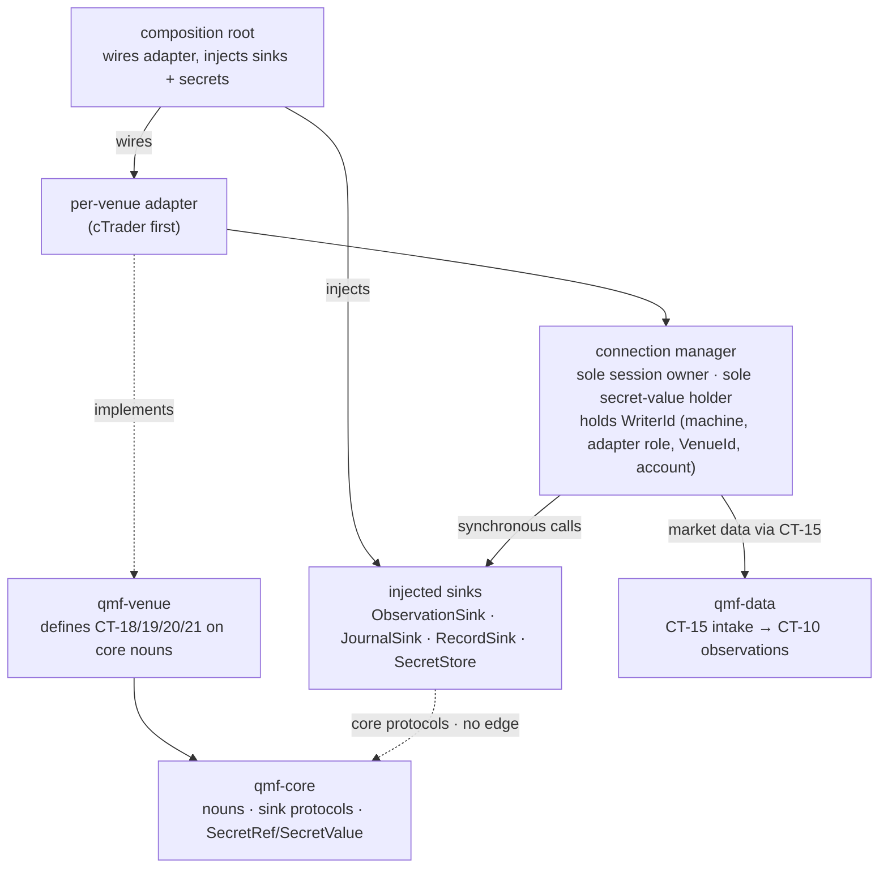

# QMF Venue Module

`COMP-QMF-VENUE` is the ratified neutral venue port: one port exposing four contracts — CT-18 (capability), CT-19 (command), CT-20 (event and reconciliation), CT-21 (secret and session) — defined on qmf-core nouns, implemented by per-venue adapters, and wired by the application composition root. It is an edge module: it imports only `COMP-QMF-CORE`, and nothing in the seven roster packages or in the qmb/qml application layers imports it — the one sanctioned importer and wirer is the trading node ([COMP-QMN](./trading-node.md)), through its `qmn.venue` subpackage (constitution L30 node annotation; DEC-0241, DEC-0196). Its first adapter targets the cTrader Open API through Python; the port stays venue-neutral so a later crypto or stock adapter declares a different capability record through the same port rather than changing a foundational contract. [DEC-0138]

The venue design was ratified 2026-08-20 by AD-26 (secret lifecycle), AD-27 (commands and the uncertainty law), and AD-28 (adapter contract and capability discovery), recorded as DEC-0135 through DEC-0141; GAP-0035 through GAP-0038 are answered. Ratification fixes the contract surface only. Implementation authorization arrives solely through the factory pipeline; no live connection, credential use, order submission, or deployment is authorized by this document. [DEC-0138] [DEC-0140]

## Authority boundary

May: define CT-18 through CT-21 on qmf-core nouns and hold the neutral port their adapters implement; normalize venue capabilities, observations, command outcomes, and reconciliation evidence into qmf-core value types; produce market-data observations into `COMP-QMF-DATA` as CT-10 source observations through CT-15 intake; emit CT-20 events and CT-13 journal evidence through composition-root-injected sinks; own the connection manager as the sole holder of venue sessions and the sole in-memory holder of secret values for a session's lifetime; mint an explicit UNKNOWN observation on an uncertain submission and hold a per-command block until the application resolves it. [DEC-0136] [DEC-0137] [DEC-0138]

May never: decide whether a trade is permitted; size a position; own Book, BMS, exit, or portfolio policy; run an application or trading-node loop; retry a command, assume an outcome, initiate a flatten, invent a terminal state, or clear its own UNKNOWN block; synthesize a venue observation a fold could otherwise derive; hold a policy constant (retry, pool, deadline, or throttle values are node values under do-not-default); construct a second venue client anywhere; write a physical store directly rather than through an injected sink; or absorb trading-node runtime material. The venue adapter never *initiates* a flatten — its own `adapter_self` actions are limited to `suspend_new`, `drain`, throttle, and session state; flatten authority is assigned in AD-36 (operator, Book policy through pre-declared trigger classes, and the protection authority — never the adapter), and which effect fires at which severity, along with the order path, protection funnel, and startup semantics, is node/trading-node territory. [DEC-0009] [DEC-0137] [DEC-0138] [DEC-0142] [DEC-0150]

## Interfaces

| Interface | Direction | Contract | Peer |
|---|---|---|---|
| Exact money, price, and quantity values | in | [CT-01](../contracts/ct-01-money-quantity.yaml) | COMP-QMF-CORE |
| Exact time and trading-calendar values | in | [CT-02](../contracts/ct-02-time-calendar.yaml) | COMP-QMF-CORE |
| Instrument and venue identity | in | [CT-03](../contracts/ct-03-instrument-identity.yaml) | COMP-QMF-CORE |
| Typed refusals | out | [CT-04](../contracts/ct-04-typed-refusal.yaml) | COMP-QMF-CORE |
| Version, fingerprint, and compatibility values | in/out | [CT-05](../contracts/ct-05-version-fingerprint.yaml) | COMP-QMF-CORE |
| Venue capability declaration + venue-observation profile | out | [CT-18](../contracts/ct-18-venue-capabilities.yaml) | Defined by COMP-QMF-VENUE on core nouns; per-venue adapters implement; consumed after two-phase wiring [DEC-0138] |
| Venue command transport | in | [CT-19](../contracts/ct-19-venue-command.yaml) | Defined by COMP-QMF-VENUE; caller unassigned in QMF; the application dispatches [DEC-0137] [DEC-0138] |
| Venue event + reconciliation evidence | out | [CT-20](../contracts/ct-20-venue-event.yaml) | Defined by COMP-QMF-VENUE; observations reach stores via injected sinks [DEC-0137] [DEC-0138] |
| Secret reference / session seam | in/out | [CT-21](../contracts/ct-21-venue-secret-session.yaml) | Defined by COMP-QMF-VENUE (shaped by AD-26); connection manager is the sole value holder [DEC-0136] [DEC-0138] |
| Normalized source observations (market data) | out | [CT-10](../contracts/ct-10-source-observation.yaml) | Owned by COMP-QMF-DATA; via CT-15 intake, application-mediated, not an import edge [DEC-0138] [DEC-0120] |
| External source intake (ticks, bars, depth, gap-replay backfill, historical paging) | out | [CT-15](../contracts/ct-15-external-source-adapter.yaml) | Owned by COMP-QMF-DATA-INGEST; application-mediated, not an import edge [DEC-0138] |
| Journal evidence | out | [CT-13](../contracts/ct-13-journal.yaml) | Owned by COMP-QMF-DATA; via injected JournalSink at the root, not an import edge [DEC-0138] [DEC-0120] |
| Injected sinks — ObservationSink, JournalSink, RecordSink, SecretStore | in | qmf-core protocols | Injected by the composition root; called synchronously; create no dependency edge [DEC-0138] |

## Behavior

### One neutral port, four contracts

`COMP-QMF-VENUE` defines CT-18, CT-19, CT-20, and CT-21 on qmf-core nouns; per-venue adapters implement them; nothing in the roster or in qmb/qml imports qmf-venue — the trading node ([COMP-QMN](./trading-node.md)) is the sole sanctioned importer, through its `qmn.venue` subpackage (DEC-0241, DEC-0196); the composition root wires the adapter to its sinks and callers. Default-deny stands — the module imports only `COMP-QMF-CORE`, and no inter-library edge exists on the venue path. Foreign objects, Forex-only assumptions, and deployment behavior never enter qmf-core: a CCXT-class crypto venue slots in later by declaring a different record through the same port. [DEC-0138] [DEC-0120]

### Connection manager

The adapter's connection manager is the sole owner of venue sessions and the single named component permitted to hold secret values in memory, for a session's lifetime. On the venue path the `WriterId` granularity is `(machine, adapter role, VenueId, account)` — the same unit as the command stream — and no other component may construct a venue client. The connection manager holds the `WriterId`, stamps writer and sequence on every observation, and receives a core-defined `SecretStore` port (read plus atomic replace) injected by the root; secret values never cross back out of it. [DEC-0136] [DEC-0138]

### Injected-sink wiring

The composition root injects the qmf-core-defined sink protocols — `ObservationSink`, `JournalSink`, `RecordSink`, `SecretStore` — and the connection manager calls them synchronously. Every sink returns success or a CT-04 typed refusal to its caller, so the writer sees every persistence failure: a `storage failure` from any sink triggers the command-pipe block in the component that holds the `WriterId`. The root-mints pattern used for structure emissions does not extend to the venue path, because the block-on-unpersistable rule requires the writer itself to see the failure. No dependency edge is created — the sinks are core protocols. Every artifact an adapter produces is a qmf-core value type; the registry record wrapping it is minted by the root through qmf-registry, and the fingerprint consumers cite is the content fingerprint, never the record fingerprint. CT-20 declares each multi-room write (raw archive, journal, registry room) as one ordered unit with a named transaction boundary (`atomic` or `ordered-with-recovery`); a partial write is a `storage failure` that blocks the command stream and is journaled on recovery. [DEC-0138] The `JournalSink` carries the venue's order and fill events — two of the seven ratified journal event types — in gapless per-`(writer, boot-epoch)` sequences, and an unavailable journal surfaces as a typed refusal, never a silent drop. [DEC-0119]

### Secret lifecycle

QMF components handle secret references, never values: qmf-core ships typed `SecretRef` and `SecretValue`, a `SecretValue` renders only its reference id under repr, str, serialization, and logging, and a tier-1 secret-scan gate rides the check task. A secret reference is an opaque minted id — stable, never reused, never encoding venue, broker, account, environment, or key material; any human-readable label is a separate field held outside evidence. Values are injected at the composition root from the deployment environment's protected store (store mechanics and key custody land at the node/ops sitting). An account-binding record's identity is `(VenueId, AccountId, role, world)`; its secret reference is occurrence/display-only and excluded from `fp1`. A credential is a one-writer stream: exactly one live refresher per credential, and where the venue rotates refresh material on use the new secret is stored atomically before the old is discarded. A missing, expired, or rejected credential is an `unavailable dependency` refusal carrying the reference id, never the value. Compromise recovery is a documented, tested drill; testing uses demo credentials only, and factory sandboxes never hold live secrets. This spec states the responsibilities and boundaries only — CT-21 carries the field-level shape. [DEC-0136]

### Command surface and the uncertainty law

The command stream — the unit of UNKNOWN blocking, of `WriterId` ownership, and of the gapless per-writer sequence — is the `(VenueId, account)` pair, coarser than an account binding and strictly finer than a connection. A session-epoch id distinct from the boot epoch rides every venue observation; sequences reset only on boot; the sequence cursor is durable through the observation sink. The command vocabulary is exactly **five kinds** — `place_order`, `cancel_order`, `close_position`, `close_all`, and `amend_protection` (the fifth, minted 2026-08-20 through AD-27's own explicit-later-mint clause) — each typed per kind on qmf-core nouns with no free-form payload; kinds are addable, never redefined; a general `amend_order` (price, size, expiry) and a partial close arrive only by explicit later mint, and `amend_protection` is never widened into a general `amend_order`; the caller stays unassigned in QMF. No command kind expresses a fractional close, so a V1 partial exit — emulable only by close-then-replace, the unprotected window AD-34 forbids — is an `unsupported capability` refusal (AD-33). The order-parameter vocabulary (order type market | limit | stop | stop-limit; time-in-force; protective-stop attachment) is QMF-owned, with each adapter declaring its supported subset in CT-18. `close_position` and `close_all` carry a required typed scope (`account` | `account-binding` | `instrument-within-binding`); an unsupported scope is an `unsupported capability` refusal, never emulated at a wider scope. A command fanning out to N venue submissions is a compound command: each child carries a derived identity (parent `fp1` plus declared ordinal) and is individually observation- and journal-bearing, and the parent's outcome is the meet of its children — any child UNKNOWN makes the parent UNKNOWN, any child rejected makes the parent `partially-executed`, a named outcome, never a success. [DEC-0137] [DEC-0147] [DEC-0148]

`amend_protection` is typed on qmf-core nouns with exact prices and constrained at contract level to **risk-non-increasing** changes defined **per protection side**: a stop-side change may not increase the loss-direction distance measured against the frozen `original_risk_distance`, and the contract-level check binds the **stop side only** — target-side changes are governed by the Book's declared envelope (AD-33), not the risk test. It carries the position or pending-order reference under the command identity discipline — the subject reference CT-20's subject-terminal resolution reads, so a stop filling mid-amend is a named outcome rather than a stream-blocking UNKNOWN. It is never emulated by cancel-then-place (which opens an unprotected window) and never widened into a general order amendment. Because absolute protection is unsupported for MARKET orders on the cTrader-platform profile, the entry-relative form is the declared placement path and the reference price a relative distance derives from is declared CT-19 contract surface; that declaration stays the plan and is never read back as the observed fill. No dedicated response message exists, so the four-outcome law and CT-18 acknowledgement modes apply unchanged. [DEC-0148]

Command identity derives from the command record's `fp1` (including the stream qualification, session epoch, and the caller's opaque ordering ordinal); the CT-18-declared mapping into the venue's client-id field must be injective and total, or a durable `command-id-binding` record persists through the sink before submission. Idempotency and collision tests run against the full local fingerprint: re-presenting the same command is an idempotent accept, differing content under a reused identity is refused and alarmed. The four-outcome law binds every well-formed submission to `accepted-by-venue` | `rejected-by-venue` | `denied-locally` | `UNKNOWN`; `denied-locally` is an outcome, never a refusal, and every outcome mints an observation record and a journal event. A transport error, timeout, or disconnect yields UNKNOWN — a state, not an error; a venue-returned error resolves `rejected-by-venue` only where the CT-18 error table declares that outcome class. An UNKNOWN is minted as an explicit observation carrying its trigger (`timeout` | `transport-error` | `disconnect`), the monotonic elapsed measurement, the wall receive instant, and the submission deadline in force — a declared, application-injected adapter parameter under do-not-default. While an UNKNOWN is outstanding the adapter refuses new commands on that stream; protection commands are not exempt from the block, **but a protection act the block refuses never evaporates: it stands as a standing protection intent (AD-36) and is re-decided when the block clears, re-deciding being explicitly not retrying**; `cancel_order`, `close_position`, `close_all`, and `amend_protection` dispatch ahead of `place_order` on every shared throttle; `suspend-new` takes local effect instantly. No QMF component retries, assumes an outcome, flattens, or invents a terminal state on UNKNOWN, and the adapter never clears its own block — unblocking is an explicit typed `resolve_unknown(command identity, resolution ∈ observed-accepted | observed-absent | operator-attested)` call by the application, itself recorded as an observation. [DEC-0137] [DEC-0148] [DEC-0150]

Recording precedes interpretation: every inbound venue event is stored verbatim and journaled before any state evaluation; the order-state machine is a read-time fold over the observation stream per CT-20's read-resolution rule, never a gate on recording. An observation with no legal transition is recorded, annotated with a typed `out-of-sequence` edge, and forces the owning command to UNKNOWN; adapters never synthesize venue observations. Command outcome and order state are separate streams, never merged — an order's terminal state is decided by fills and venue lifecycle events only; CT-18 declares each command kind's acknowledgement mode (`explicit-event` | `implicit-absence` | `none`), and an outcome is never derived from absence alone. The read-back resolution generalizes from cancels to every command whose subject can terminate independently: `close_position`, `close_all`, and `amend_protection` each carry a subject reference, and a command whose subject is observed terminal at or after the submit stamp resolves `rejected-by-venue (superseded-by-terminal-subject)` — a named outcome, never UNKNOWN, never a stream block — while a subject absent or already terminal at submission resolves without submission. Reconciliation is an on-demand complete read-back of venue orders, fills, positions, and balance over a **mandatory declared lookback** (a do-not-default CT-18 adapter parameter), with QMF-owned verdict vocabulary `reconciled` | `drift` | `unknown` | `out-of-lookback` — the fourth term so that "I cannot see that far back" is never read as "the position closed"; a standing protection intent (AD-36) re-evaluates **only** against a `reconciled` verdict, while `drift`, `unknown`, and `out-of-lookback` alarm and hold the intent open without dispatching. Reconciliation gates the command pipe only — the sensing pipe never blocks on it — and when it runs and what a verdict triggers are node/BMS authority. This spec states the command surface and its law at responsibilities altitude; CT-19 and CT-20 carry the field-level detail. [DEC-0137] [DEC-0148] [DEC-0150] [DEC-0158]

### Capability discovery

The capability surface is two artifacts, wired in a fixed order. The capability declaration is static, adapter-version-scoped, importable without credentials, and contains no measured or tunable value; every field is marked `static` or `measured-at-connection`, and it carries the venue protocol artifact identity, its fingerprint identity-bearing for any artifact whose decode depended on it. The venue-observation profile is per `(VenueId, account)`, produced post-connect by the verification suite, append-only with `supersedes` edges, and holds every measured fact and verdict as occurrence/provenance only. A `measured-at-connection` capability is unavailable until its profile exists, and consuming a measured-but-unverified capability in evidence-bearing work is a `policy rejection`. Wiring order is fixed: the declaration at construction, the profile before the first command and before any evidence-bearing decode. CT-18 owns the field roster (market-data kinds, order-parameter subset, command scopes, acknowledgement modes, position model per account, session topology, throttle scope, rate limits, span caps and paging model, token lifecycle class, equity nativeness, server-clock availability, instrument-metadata surface, attribution-label support, and protection primitives); invoking anything undeclared is an `unsupported capability` refusal. [DEC-0138]

The risk gate added roster rows, all `measured-at-connection` and verify-or-refuse. **Account settlement currency** — a binding whose settlement currency does not match the Book's declared `accounting_currency` is a `policy rejection` at bind time, never at trade time. [DEC-0158] [DEC-0154] The **margin surface** — margin model, leverage, free-margin nativeness, and the venue's own margin-call and margin-liquidation level (the venue's "stop out", reserved in QMX vocabulary as `venue_liquidation`) — is declared so the dimension is visible, even though V1 deliberately does not size by margin. [DEC-0158] [DEC-0155] The **instrument value-factor metadata surface** (money per price-delta per quantity, the tick/point value) is sourced only from venue instrument-metadata snapshots as an exact rational; an absent value factor is an `unavailable dependency` refusal, never a silent conversion. [DEC-0158] [DEC-0154] The **reconciliation lookback** is a do-not-default declared adapter parameter. The **protection-capability fields**: protective-stop attachment form per order type (on the cTrader-platform profile absolute is unsupported for MARKET orders, so entry-relative is the declared placement path); protection amendment support declared separately for open positions and pending orders; amend atomicity, UNDOCUMENTED on the cTrader-platform profile and therefore verify-or-refuse — until verified, a Book policy amending both protection sides in one act refuses and single-sided is the only legal V1 path; venue-managed trailing and its own change-event stream, a **named delegated protection authority** (`authority_kind = venue-delegated`) whose pushed changes enter as ordinary observations and mint a CT-30 control-action record of kind `protection_amendment`; and a guaranteed-stop class where the account type offers one. Consuming any of these before its venue-observation profile exists is an `unavailable dependency` refusal. [DEC-0148] [DEC-0158]

The first-connection verification suite is a named contract part, verify-or-refuse throughout: an unverified spot-timestamp unit refuses spot evidence; a failed bar-basis reconciliation refuses bar evidence; a failed pip-formula validation refuses metadata-derived parameters; an absent money exponent refuses that message's money decode. A measured daily boundary is the load-bearing case: until it is measured the venue's daily bars are ungoverned observations, and once measured and verified the boundary is minted as a venue-scoped market-hours calendar identity — identity is the rule set — giving venue-native bars a legal `BarSpec` anchor. This is the mechanism that turns the venue's own daily-bar slicing into governed evidence without ever assuming it aligns to QMF's own forex 17:00-New-York accounting calendar. [DEC-0138] [DEC-0141]

### Market data

Market data has a named home: ticks, bars, depth, gap-replay backfill, and historical paging enter as CT-10 source observations through qmf-data's CT-15 intake — application-mediated, no fifth contract, no new edge. The venue is also a `source`. Subscription lifecycle facts (a technical snapshot on subscribe, a non-instantaneous unsubscribe, `hasMore`-class paging) are declared CT-18/CT-15 surface. The pinned canonical sensing feed carries a prohibition, not just a capability: no silent sibling-feed failover — a sensing outage fails closed until the same feed gap-replays. Raw depth recording is the verbatim wire payload through the same intake, never an invented encoding. [DEC-0138]

### cTrader adapter (first adapter)

The cTrader Open API is the first adapter, accessed from Python, and the ratified venue facts are its standing obligations at summary level; the adapter-specific spec is [`COMP-CTRADER`](./ctrader.md). Timestamps are per-field-documented Unix ms UTC with named epoch exceptions, and no server clock exists on the Open API — receive-time recording is mandatory. Three independent numeric scale systems apply: market-data prices are uint64 in the 1/100000 wire scale, execution prices are raw doubles, and a `moneyDigits` exponent governs nine messages; the light-symbol record carries no scaling metadata, so the full symbol record is required before any price decode. Rate limits are 50 requests per second non-historical plus 5 per second historical, per connection; the heartbeat is adopted at the safe 10-second bound; historical tick spans cap at one week; the depth surface is a Level-2 resting-liquidity book with no Level-3/time-and-sales stream. Demo and live are separate hosts requiring two simultaneous connections, each serving one environment. The token lifecycle is a roughly 30-day access token with a never-expiring refresh token as the crown-jewel secret and cTID re-authorization as the invalidation anchor. The daily-bar boundary and the trendbar price basis are 2013-forum-grade claims and are never hardcoded — the adapter measures each per broker at first connection, re-verifies with a continuous background monitor, and stores the result as per-broker configuration in the venue-observation profile. Every undocumented behavior (the spot-timestamp unit, spot coalescing, rate-window semantics, an absent money exponent, the pip formula, live-trendbar semantics, historical classification, per-period span caps) is a verify-or-refuse obligation. [DEC-0135]

Which broker fronts the cTrader platform is deployment configuration, never architecture: opaque `VenueId`/`AccountId` identity and account bindings are sufficient, and a broker's measured behaviors live in the venue-observation profile and per-broker configuration, never in code. [DEC-0139] The venue protocol artifact is pinned in the AD-6 register — the Spotware `openapi-proto-messages` integer release tag, currently 91 — and a tag change mints a new capability declaration plus re-verification. Only the proto message definitions (data, not code) are consumed: the official OpenApiPy SDK is reference-only because its pinned Twisted reactor would impose a platform, so zero Spotware code runs in QMX. [DEC-0141]

### Session duties as schedulable work

The adapter's periodic session duties — heartbeat, token refresh, reconnect, gap replay, and verification monitors — are declared schedulable duties the application's scheduler drives: the adapter defines the work, the application runs it. Session recovery (connect, reconnect, heartbeat, token refresh, gap replay) is connection-manager-owned policy but never resubmits a command, and command retry is prohibited — retryability rides typed refusals. On disconnect, in-flight commands become UNKNOWN and recovered fills commit through evidence before a session reports healthy. [DEC-0141] [DEC-0137]

### Trading-node increment (2026-08-29)

The trading node ([COMP-QMN](./trading-node.md), code name `qmn`; decided at the 2026-08-28 node sitting, [ADR-0019](../decisions/ADR-0019-trading-node.md)) is the sole sanctioned importer and wirer of `COMP-QMF-VENUE`, and its live-connection work lands as a `qmf-venue`-side increment that completes this module rather than forking it. This section records that increment's contract-relevant items; node runtime policy (order path, protection, startup, reconciliation cadence) lives in [COMP-QMN](./trading-node.md), never here. [DEC-0196] [DEC-0241]

**The cTrader transport increment lands in the `ConnectionManager` (A37).** The `ConnectionManager` already ships as the AD-26/AD-28 sole owner of venue sessions and the single in-memory holder of secret values; the increment completes it with the pieces the inventory found missing — the asyncio TLS socket to the demo and live cTrader hosts, length-prefixed `ProtoMessage` framing over the pinned proto release tag (`registry:venue_protocol_artifact`) compiled in-house with zero Spotware code, request encoding, `clientMsgId` generation and matching, the submit path, market-data subscription, account auth, in-band token refresh, and the cents/volume decoder that decodes the wire's int64 fields at their declared exponent straight into scaled integers (a money field arriving in a floating form is refused, never converted). `protobuf` stays a `qmf-venue`-only dependency; no second connection manager is minted and no second in-memory secret holder exists. Duty scheduling stays node-side — the adapter defines the schedulable duties and the node's scheduler runs them (see Session duties as schedulable work). [DEC-0196]

**Refresh is keyed by credential reference.** Token refresh is keyed by credential reference, never by connection: at most one refresh is in flight per credential reference, owned by the `ConnectionManager` as a whole, and every session sharing that credential is a reader of the rotated access token rather than a refresher; whether demo and live share one cTID credential is a declared roster fact verified at preflight. An authentication failure attributable to a rotation in flight is a retry-after-refresh condition only for requests carrying no command identity (session auth, account auth, subscription, heartbeat, gap replay, the reconciliation read-back); a `place_order`, `amend_protection`, `cancel_order`, `close_position`, or `close_all` meeting an authentication failure is never retried and takes the ordinary submission-deadline path, so the prohibition on command retry has no exception. [DEC-0222] [DEC-0197] [DEC-0196]

**The async-conformance exemption, by name.** The QMF async-conformance test that bans async across the roster is amended, in this same increment, to exempt `qmf.venue.connection` by name — the one delegated impurity: the `ConnectionManager` holds the socket, the session and the single in-memory venue secret value on the loop the node injects, owns no loop and schedules nothing itself. If the parent refuses the exemption, the transport increment lands in the node's `qmn.venue.ctrader` subpackage instead, and the epics may not choose between the two placements. [DEC-0243] [DEC-0196]

**`SessionTopology` connection-count relaxation.** `SessionTopology` ships `required_connection_count = 2` as a `ClassVar`, which no soak-week roster naming only the demo pair can satisfy. As an item of the same increment, the connection count is derived from the roster — one connection per `(venue, environment)` pair the roster names — rather than fixed as a class constant, so a demo-only roster opens one connection and the soak runs before live credentials exist. A connection fault blocks every command stream bound to that connection, enumerated from the roster at compose time. [DEC-0244] [DEC-0196]

**The neutral port is node-minted (candidate AD-28 annotation, recorded-not-applied).** At `integration@ef9bb25` `qmf-venue` exposes exactly one Protocol (`ProbeTransport`) and no `VenuePort`/`OrderPort`/`VenueAdapter` seam, so AD-28's "one neutral port" is today a contract statement rather than an injectable Protocol. The node therefore mints `qmn.venue.VenueClientPort` over the CT-19 command and CT-20 event/reconciliation shapes, owns its versioning, and ships three V1 implementations — the cTrader client composed around this module's concrete typed values, the replay adapter, and the FEAT-0023 conformance double — the implementation selected by the pair `(world, VenueId)`, never by `VenueId` alone. `qmf-venue` is NOT amended to carry the port; realizing the seam inside `qmf-venue` is recorded as a candidate AD-28 parent annotation, surfaced and never settled by a child. [DEC-0228] [DEC-0242] [DEC-0196]

**Contract facts the increment measures.** The position model `netting | hedging` is a measured-at-connection CT-18 field decided per account at bind time — never assumed — and where CT-18 declares netting the fill-to-virtual-position attribution declaration is mandatory (absent, it is a bind-time policy rejection). Equity derivation is exact scaled-integer arithmetic at the account's declared money exponent: each venue-supplied converted figure decodes once at its own declared exponent and re-scales exactly, and a figure with no declared exponent or one that cannot be re-scaled exactly refuses the derivation rather than approximating. Venue maintenance windows are not a fourth control-window kind: a down session or dead feed already fails closed for entries under the L39-authorized narrowing of AD-28's sensing-outage rule, with no silent failover, the maintenance timestamp journaled as data quality. The trendbar price basis (`registry:venue_trendbar_price_basis`) stays measured per broker at first connection — the only web evidence is a Spotware forum moderator (secondary grade, not a documentation page) and it changes nothing, because the corpus refuses to hardcode the basis; until the per-broker basis is recorded, every backtest-to-live comparison is tick-based, never trendbar-based. [DEC-0219] [DEC-0225] [DEC-0196] [DEC-0240]

**Stale README, a factory correction item.** `packages/qmf-venue/README.md` still reads "Scaffold (Story 1.1)…" while the code already carries the `ConnectionManager`, the in-house proto-tag compilation (`registry:venue_protocol_artifact`) and the CT-18..CT-21 surface. The documentation factory corrects the README text; this documentation increment edits no code. [DEC-0245]

### Foundation invariants

`COMP-QMF-VENUE` is a stateful component, not a pure-computation library: it owns an external resource (the venue network adapter) and follows one-writer-per-stream with unlimited readers, where the writer holds the `WriterId`. Async APIs are permitted here and only here — the venue network edge is the single place async exists; core and the pure libraries stay synchronous, and the application owns all concurrency and any threads. [DEC-0113] The QMF async-conformance test that bans async across the roster gains, in the TN-11 transport increment, one named exemption — `qmf.venue.connection` — so the `ConnectionManager` may hold the asyncio socket, the session and the single in-memory venue secret value on the loop the trading node injects; it owns no loop and schedules nothing itself, the one delegated impurity, and if the parent refuses the exemption the transport lands in the node's `qmn.venue.ctrader` instead (detailed in the Trading-node increment section). [DEC-0243] [DEC-0196] Package dependency is default-deny: the module imports only `COMP-QMF-CORE`, and nothing in the roster or in the qmb/qml application layers imports the module; the trading node ([COMP-QMN](./trading-node.md)) is the sole sanctioned importer, through its `qmn.venue` subpackage, and adding any other inter-library edge is a spine amendment. [DEC-0120] [DEC-0241] [DEC-0196] Every public operation succeeds or returns a CT-04 typed refusal carrying context and retryability; refusals are never swallowed; a `correlation_id` propagates across every package boundary; and the module exposes a no-argument `health()` returning a typed report. [DEC-0112] The module ships a benchmark harness measuring speed and peak memory at a framework-native load ladder, gated at tier 2. [DEC-0111] QMF's own source is governed by ruff, pyright strict, and pytest, shipping executable tests and reference usage as tier-1 artifacts. [DEC-0101]

The venue adapter boundary is a named money-path conversion boundary. A foreign integer is stored verbatim with its declared scale; a foreign binary float is evidence but never identity — it crosses the named boundary at receipt to a scaled integer at a per-value-class pinned target scale (execution price to the instrument's declared digits; money to the account's declared money exponent, an absent exponent being a refusal; market data to the declared wire scale) with a declared, identity-bearing rounding mode, the raw float retained only as integrity-checked provenance. A money figure the venue itself derived by conversion is **settlement evidence, not a QMX conversion**: it is legal as `Money(numeraire)` under a declared `converted_by = venue` provenance flag (plus the venue's stated rate where published), explicitly outside AD-40's unratified-rate-source clause, which governs QMX-performed conversions only. Receive wall time and the boot-scoped monotonic stamp are mandatory on every inbound venue event. [DEC-0138] [DEC-0141] [DEC-0105] [DEC-0158]

### Latency rungs

The six-stage live-path latency decomposition — tick received, evidence write, indicator update, decision, risk evaluation, order submitted — is recorded as six named rungs with no numeric budgets until measured; the adapter owns the arrival and submit stamps for its stages. A latency rung is a monotonic delta within one boot epoch on one machine; a wall-computed rung is refused as a baseline. [DEC-0138]

## Configuration

| Variable | Registry key | Notes |
|---|---|---|
| Instrument identity shape | `registry:instrument_identity_shape` | Identity is (venue, venue's own symbol), the symbol opaque and never parsed; `VenueId` is operator-minted and opaque (a white-label broker is its own venue); aliases and renames are dated records. [DEC-0107] |
| Typed refusal codes | `registry:typed_refusal_codes` | Seven-category taxonomy: invalid input, unsupported capability, unavailable dependency, stale evidence, policy rejection, transient venue failure, storage failure. [DEC-0109] |
| Trendbar price basis | `registry:venue_trendbar_price_basis` | Never hardcoded: measured per broker at first connection, re-verified by a continuous monitor, stored in the per-`(VenueId, account)` venue-observation profile; bar evidence is refused until the basis reconciliation passes. [DEC-0135] [DEC-0138] |
| Venue daily-bar boundary | `registry:venue_daily_bar_boundary` | Never hardcoded: measured per broker, and once verified minted as a venue-scoped market-hours calendar identity anchoring venue-native bars; ungoverned until measured. [DEC-0135] [DEC-0141] |
| Venue protocol artifact | `registry:venue_protocol_artifact` | Spotware `openapi-proto-messages` integer release tag, pinned in the AD-6 register (currently 91); a tag change mints a new capability declaration plus re-verification; OpenApiPy SDK is reference-only. [DEC-0141] |
| Submission deadline | — | A declared adapter parameter the application injects under do-not-default: its existence and declaration are mandatory, its value is not QMF's. [DEC-0137] |
| Retry, pool, throttle, and health constants | — | Node values under do-not-default; qmf-venue holds none of them. [DEC-0137] |
| Secret / session material | — | Values injected at the composition root from the deployment protected store; the connection manager is the sole in-memory holder through the core `SecretStore` port; no secret ever enters a repository, config artifact, journal, evidence, fingerprint, or log. [DEC-0136] |

## Failure modes

| # | Condition | Behavior | Cites |
|---|---|---|---|
| FM-1 | A submission's outcome is uncertain because a transport error, timeout, or disconnect intervenes. | The adapter mints an explicit UNKNOWN observation (a state, never an error) carrying its trigger, monotonic elapsed measurement, wall receive instant, and the submission deadline in force, and refuses new commands on that `(VenueId, account)` stream until an explicit `resolve_unknown` call by the application; no component retries, assumes an outcome, flattens, or invents a terminal state. | DEC-0137 |
| FM-2 | An injected sink returns a `storage failure`, or a multi-room write completes only partially. | The failure blocks the command stream in the component that holds the `WriterId` — the writer sees every persistence failure; the sensing pipe is unaffected; a partial multi-room write is journaled on recovery. Storage is never bypassed by writing a store directly. | DEC-0138, DEC-0137 |
| FM-3 | A credential is missing, expired, or rejected, or a store after rotation fails. | An `unavailable dependency` refusal carries the secret reference id, never the value; a failed store after rotation is an alarm plus a command-pipe block (after-condition = successful store or operator re-provision), and where the venue already invalidated the old material the compromise drill triggers. | DEC-0136 |
| FM-4 | A caller invokes an undeclared capability or an unsupported command scope. | An `unsupported capability` refusal; a `close_position`/`close_all` scope the adapter does not natively support is never emulated at a wider scope. | DEC-0138, DEC-0137 |
| FM-5 | An inbound venue observation has no legal state transition. | Recorded verbatim and journaled first, annotated with a typed `out-of-sequence` edge, and the owning command is forced to UNKNOWN pending resolution; adapters never synthesize a venue observation to paper over the gap. | DEC-0137 |
| FM-6 | A measured-at-connection capability is consumed before its venue-observation profile exists, or a verify-or-refuse check (spot-timestamp unit, bar basis, pip formula, money exponent) fails. | An `unavailable dependency` or `policy rejection` refusal per the case; venue daily bars stay ungoverned until the daily boundary is measured and minted as a venue-scoped market-hours calendar identity; no measured-but-unverified fact enters evidence-bearing work. | DEC-0138, DEC-0141 |
| FM-7 | The pinned canonical sensing feed suffers an outage. | Fails closed with no silent sibling-feed failover; recovery is the same feed gap-replaying, deduplicated on each observation's declared venue-native identity key. | DEC-0138 |
| FM-8 | A foreign binary float arrives on a money or price field, or a money exponent is absent. | The float crosses the named money-path boundary at receipt to a scaled integer at the pinned per-value-class target scale with a declared rounding mode, the raw float retained as integrity-checked provenance only; an absent money exponent refuses that message's money decode. A money figure the venue derived by conversion is legal as settlement evidence under a `converted_by = venue` provenance flag. | DEC-0138, DEC-0141, DEC-0105, DEC-0158 |
| FM-9 | A binding's account settlement currency does not match the Book's `accounting_currency`, or a required value factor is absent, or amend atomicity is unverified when a Book policy amends both protection sides in one act. | The settlement-currency mismatch is a `policy rejection` at bind time (never at trade time); an absent value factor is an `unavailable dependency` refusal, never a silent conversion; a dual-side protection amendment refuses until amend atomicity is verified at connection, single-sided amendment being the only legal V1 path. | DEC-0148, DEC-0154, DEC-0158 |

## Related

Decisions: DEC-0135 (cTrader venue facts), DEC-0136 (AD-26 secret lifecycle), DEC-0137 (AD-27 commands and the uncertainty law), DEC-0138 (AD-28 adapter contract and capability discovery), DEC-0139 (broker identity is deployment configuration), DEC-0140 (venue-AD gate amendments), DEC-0141 (cross-AD gate amendments), DEC-0142 (node-material boundary), DEC-0148 (AD-34 `amend_protection`, the fifth venue command), DEC-0150 (AD-36 flatten authority, kill switch/kill line, standing intent), DEC-0154 (AD-40 value-factor and the numeraire), DEC-0155 (AD-41 `venue_liquidation` vocabulary), DEC-0158 (risk-gate cross-AD amendments: five-command vocabulary, out-of-lookback, subject-terminal, the CT-18 roster rows, `converted_by = venue`). DEC-0123 is superseded by DEC-0135; the prior reserved-posture decisions DEC-0059, DEC-0060, DEC-0061, and DEC-0065 are answered by DEC-0136 through DEC-0138. The cTrader adapter-specific spec is [COMP-CTRADER](./ctrader.md). Trading-node runtime material (order path, protection funnel, startup semantics, flatten-authority assignment) is out of QMF scope and tracked in `tracker/trading-node-notes.md` for the node sittings. [DEC-0142] Contracts: [CT-18](../contracts/ct-18-venue-capabilities.yaml), [CT-19](../contracts/ct-19-venue-command.yaml), [CT-20](../contracts/ct-20-venue-event.yaml), [CT-21](../contracts/ct-21-venue-secret-session.yaml). Scenarios: [SCN-0005 uncertain venue submission](../scenarios/SCN-0005-uncertain-venue-submission.md), [SCN-0008 pair-scoped news](../scenarios/SCN-0008-pair-scoped-news.md). Knowledge: none drafted.
