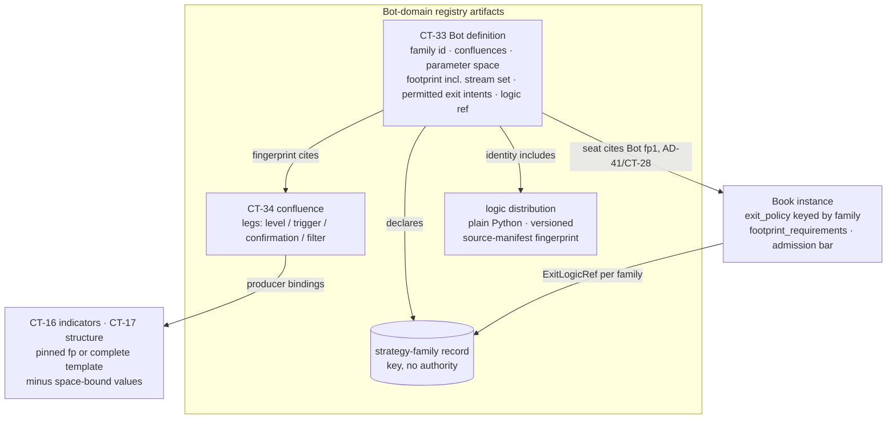
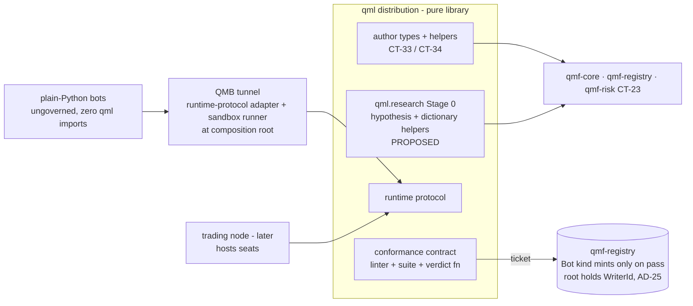

# QML

`COMP-QML` is the QMX **bot-authoring library**: one uv-installable distribution (`import qml`), an application-layer product built ON QMF contracts exactly as QMB is (AD-2 / L11), never a QMF roster package, never a framework, never an engine, and never again a cross-component contract layer (DEC-0171). Its whole surface is three thin things: author-side types and helpers that produce the Bot-domain registry artifacts — the CT-33 Bot definition and the CT-34 confluence — on `qmf-core` nouns (DEC-0173) (DEC-0175); the **bot runtime protocol** hosts invoke to drive a bot per evaluation instant (DEC-0177); and the **conformance gate** that decides which bots may be cited by governed evidence and seated (DEC-0178). **[PROPOSED]** A fourth surface — Stage 0 research types in public `qml.research` — is proposed under the 2026-09-16 QML research expansion; see [QML research expansion (2026-09-16)](#qml-research-expansion-2026-09-16-proposed) (DEC-0395) (DEC-0403). QML mints NO new QMF-ladder (CT-\*) shared contract of its own — CT-33/CT-34 are `qmf-registry` kinds this design fills, and the runtime protocol and conformance contract are QML-local contracts on QML's own AD-5 format-version ladder, exactly as QMB owns its run-config and ledger contracts (DEC-0171). The design closes GAP-0047, the reserved QML slot the corpus deferred until its Bot-to-Book binding contract was designed (DEC-0090); the condition is now met, so this is realization, not revival.

A governed bot is exactly **two artifacts** — a declaration (the CT-33 Bot definition, under AD-30 template discipline) and logic (plain Python conforming to the runtime protocol, shipped as a versioned distribution whose source-manifest identity enters the Bot's identity) (DEC-0172). Plain Python stays first-class forever: an unregistered bot needs zero QML imports to run in QMB or research lanes, and **QML conformance is the ticket into governed evidence and Book seats, nothing else** — it never gates tunnel entry (DEC-0171) (DEC-0178). No acronym expansion is minted; the corpus never expands QML and the `L` reads as *Library* (DEC-0171). The design is ratified by operator delegation 2026-08-21 (the child spine QL-1 through QL-10 at `architecture-QML-2026-08-21/`, status FINAL, run autonomously with every without-operator call tagged in the memlog and individually overturnable; reviewer gate applied at desk — 5 lenses, 34 findings, all applied) (DEC-0184); ratification fixes the architecture only, implementation authorization arrives solely through the factory pipeline, and this document now carries `status: ratified` (corpus signed off by the operator 2026-08-21). The operator veto round was then held at desk 2026-08-21: all six delegation-made calls were reviewed and **confirmed kept**, with two expansion riders recorded — a confluence leg may carry **both** a producer binding and a child-confluence cite (CT-34), and a Book's per-family `ExitLogicRef` may declare an adopt-the-bot's-advisory-stop mode so bot-owned exit methodologies are first-class (CT-22) — and the `qml` CLI ruled out (no second command line; QMB's `qmb` CLI is the single command-line surface) (DEC-0185). Vocabulary law binds hard: **Bot definition** never "BotSpec"; **strategy family** never "archetype"; **canonical assignment** vs **run-spec override**; **advisory stop proposal** (bot-side) vs **declared full-loss price** (Book-resolved); "conformant" means passed both gate layers, never "certified" or "exam"; QML is a **library**, never a framework, engine, or kernel (DEC-0171) (DEC-0184).

## Authority boundary

May: author the two Bot-domain registry artifacts — the CT-33 Bot definition and the CT-34 confluence — as author-side types and helpers on `qmf-core` nouns, artifacts owned by `qmf-registry` like every kind (DEC-0173) (DEC-0175); mint the **strategy-family** kind as an opaque operator-minted id plus a dated registry metadata record under CT-06's addable-kinds law, the same machinery as `instrument_class`, with no new CT number (DEC-0176); define the **bot runtime protocol** as a QML-owned format-versioned contract on QML's own AD-5 ladder, not CT-numbered, mirroring QMB's own contracts (DEC-0177); own the **conformance gate** — the Layer-1 declaration linter, the Layer-2 sandboxed-execution conformance contract (the denial set, the static AST/import-scan rules, the determinism harness, the deterministic golden-slice generator keyed off the declared footprint, and the verdict function, all pure) and the pinned prediction-linter check list (DEC-0178); author the **parent-contract format-mint semantics** for CT-22 version 2 and CT-23 version 2 (the shapes owned by `COMP-QMF-RISK`, the semantics QML-authored, carried by the documentation-factory increment with migration notes) (DEC-0181) (DEC-0182); hold the Bot-domain **registration write path** at a host composition root under AD-25's root-mints pattern (the root holds the `WriterId` and the gapless per-(writer, kind) sequence, mints the records, and sees every `RecordSink` refusal), returning fingerprintable content and never stamped records, the writer unit being (machine, authoring role, kind) (DEC-0171); own **generation write path** for new CT-33/CT-34 content and/or logic-source bytes when that feature ships — the QML/host composition root mints the CT-06 envelope (DEC-0272); **[PROPOSED]** ship Stage 0 types in public `qml.research` as a pure submodule (no I/O) on QML's own format-version ladder (DEC-0395); **[PROPOSED]** ship vocabulary helpers that resolve dictionary entries over host-passed bytes only (DEC-0396); **[PROPOSED]** hold the host composition root as the hypothesis blob store under `research_root`, keyed by `research_ref`, the same root that stamps CT-06/CT-07 (DEC-0401); import `qmf-core` (nouns, fingerprints, refusals, series vocabulary), `qmf-registry` (the kinds it authors), and `qmf-risk` (CT-23/CT-29 types) as an application-layer product (DEC-0171).

May never: be, or be called, a QMF roster package, a framework, an engine, a kernel, or a cross-component contract layer — the old load-bearing-stratum role is retired and QMF's contracts are the shared layer now (DEC-0171); mint any new QMF-ladder (CT-\*) shared contract of its own — CT-33/CT-34 are `qmf-registry` kinds, and the runtime protocol and conformance contract are QML-local (DEC-0171); import `qmf-venue` (DEC-0171) (DEC-0180); spawn a thread, perform I/O, or spawn a process — the library is PURE per AD-15, and every impure step (registration writes, sandbox execution) is host-owned (DEC-0171) (DEC-0178); let a bot size (`requested_r` is Book-resolved, AD-33), touch venue commands, read a clock, perform I/O, network access, or undeclared randomness, or be handed a Book module — no Book module is ever injected into bot logic (DEC-0177); carry an `exit_logic` field on the Bot definition (the old BotSpec slot is deliberately dead) or stand up a second close-reason taxonomy beside CT-29's one taxonomy (DEC-0179); gate on **performance** — conformance is technical, never performance (AD-32's no-probation law mirrored) — or revive `max_acceptable_complexity_score` as a registration gate (a stated drop, a decision not an omission) (DEC-0178); gate ungoverned bots' **tunnel entry** — conformance gates evidence CITATION and SEATS only, and ungoverned bots keep full tunnel access (DEC-0171) (DEC-0178); revive the `.qml` bot-source file format or its Monaco surface as a second language in V1 (DEC-0172), or revive ArchetypeSpec's constraint powers — constraining is the Book's job (DEC-0176); add the two admission-bar `evidence_requirements` fields or the `footprint_requirements` shape as a **silent** field addition — they land only through the CT-22 format mint, since an old parser would ignore them and admit exactly the evidence they exist to refuse (DEC-0178) (DEC-0181); put a **structure generator inside QMB** — search stays QMB parameter variation over the same bot `fp1`, and generation authors new bytes via QML/host (DEC-0272); mint GAP-0085 typed mechanism nouns (Entry/Exit/Filter/Session) in this sitting — nouns remain deferred (DEC-0272) (GAP-0085); or mint an acronym expansion for QML (DEC-0171); **[PROPOSED]** mint a CT-\* for hypotheses (DEC-0395); **[PROPOSED]** register hypotheses as registry kinds (DEC-0381) (DEC-0401); **[PROPOSED]** compile a Stage 0 `graph` into `run_slice` or any executor (DEC-0411); **[PROPOSED]** auto-mint CT-33 from seed DNA (DEC-0387) (DEC-0409); **[PROPOSED]** fill GAP-0085 in this increment (DEC-0413); **[PROPOSED]** write the filesystem from `qml.research` — the module stays pure; hosts persist (DEC-0395) (DEC-0401); **[PROPOSED]** treat `spawn_governed` as graduation (DEC-0387); **[PROPOSED]** brand STRATS as product language — `source_id=strats` is an adapter key only (DEC-0380) (DEC-0408).

## Interfaces

| Interface | Direction | Contract | Peer |
|---|---|---|---|
| Exact money, price, and quantity values (parameter-space exact rationals; the advisory stop price / `PriceDelta`) | in | [CT-01](../contracts/ct-01-money-quantity.yaml) | COMP-QMF-CORE |
| Time and market-hours-calendar values (the footprint's required calendars — identities + versions per AD-8) | in | [CT-02](../contracts/ct-02-time-calendar.yaml) | COMP-QMF-CORE |
| Instrument identity (the stream set's instrument-role, trading vs data-only) | in | [CT-03](../contracts/ct-03-instrument-identity.yaml) | COMP-QMF-CORE |
| Typed refusals (Layer-1 linter refusals, conformance rejections; AD-11 typed returns, never swallowed) | in/out | [CT-04](../contracts/ct-04-typed-refusal.yaml) | COMP-QMF-CORE |
| Version, fingerprint, and format-version values (`fp1`, the source-manifest fingerprint, QML's own AD-5 format versions) | in/out | [CT-05](../contracts/ct-05-version-fingerprint.yaml) | COMP-QMF-CORE |
| Registration records (CT-33, CT-34, and the strategy-family metadata record are kinds under CT-06's addable-kinds law) | out (authored) | [CT-06](../contracts/ct-06-registration.yaml) | COMP-QMF-REGISTRY; kinds owned by `qmf-registry`, authored via QML |
| Lineage edges (`branches-from` version graph; confluence-to-child lineage; the graduation edge back to the originating research artifact) | out | [CT-07](../contracts/ct-07-lineage-edge.yaml) | COMP-QMF-REGISTRY |
| Indicator / configured-producer bindings (footprint producer bindings: a pinned `fp` or a complete template minus space-bound values) | in | [CT-16](../contracts/ct-16-indicator.yaml) | COMP-QMF-INDICATORS; declared producer bindings only — declaring an input creates no package edge (AD-22); QML imports `qmf-core`, `qmf-registry`, `qmf-risk` only (DEC-0171) |
| Causal-structure bindings (footprint producer bindings and structure-consuming legs; lifecycle folds per AD-25) | in | [CT-17](../contracts/ct-17-causal-structure.yaml) | COMP-QMF-STRUCTURE; declared producer bindings only — declaring an input creates no package edge (AD-22); QML imports `qmf-core`, `qmf-registry`, `qmf-risk` only (DEC-0171) |
| Venue capabilities (prediction-linter check: the stream set lies within the binding's declared venue capabilities, via AD-29) | in | [CT-18](../contracts/ct-18-venue-capabilities.yaml) | COMP-QMF-VENUE; CT-18 is READ as a declaration through the CT-28 binding context at bind time (AD-29) — QML never imports `qmf-venue` and holds no venue edge (DEC-0171, DEC-0178) |
| Bot definition kind (the CT-33 artifact; QML authors, `qmf-registry` owns) | out (minted) | [CT-33](../contracts/ct-33-bot-definition.yaml) | COMP-QMF-REGISTRY |
| Confluence kind (the CT-34 artifact; QML authors, `qmf-registry` owns) | out (minted) | [CT-34](../contracts/ct-34-confluence.yaml) | COMP-QMF-REGISTRY |
| Book charter (prediction linter reads the Book's `footprint_requirements`, `admission_bar`, and `exit_policy`; QML authors the CT-22 v2 format-mint semantics) | in/out | [CT-22](../contracts/ct-22-book-charter.yaml) | COMP-QMF-RISK; CT-22 owned by `qmf-risk`, v2 semantics QML-authored (DEC-0181) |
| Risk-evaluation intents (the bot returns zero-or-more CT-23 intents; the advisory stop proposal is a new CT-23 v2 entry field) | out | [CT-23](../contracts/ct-23-risk-evaluation.yaml) | COMP-QMF-RISK; CT-23 owned by `qmf-risk`, v2 semantics QML-authored (DEC-0182) |
| Book binding record (the seat cites the Bot definition by `fp1`; the prediction linter runs against the CT-28 binding context) | in | [CT-28](../contracts/ct-28-book-binding.yaml) | COMP-QMF-RISK |
| Exit record (CT-29 is the ONE close-reason taxonomy; the old `CloseReason` members map onto it as recorded evidence) | in | [CT-29](../contracts/ct-29-exit-record.yaml) | COMP-QMF-RISK |

## Behavior

### The authoring library, thin by law (QL-1)

QML is the bot-authoring **library** of the QMX platform — one uv-installable distribution (`import qml`), application layer built on QMF contracts exactly as QMB is, never a QMF roster package (DEC-0171). Its whole surface is three thin things: author-side types and helpers producing the Bot-domain registry artifacts (CT-33/CT-34) on `qmf-core` nouns; the bot runtime protocol hosts invoke; and the conformance gate (DEC-0171). The old uniformity rationale — "compare bots honestly, same deterministic risk authority, same formula" — is ALREADY delivered by ratified QMF law (CT-23 Book-resolved sizing, AD-40 frozen R, CT-29/CT-32 containers); QML adds only the two uniformities still missing — **declared footprint** and **declared parameter space** — so comparability never again requires a private contract layer (DEC-0171). The library is pure per AD-15 (no threads, no I/O, no process spawning); every impure step lives at a host composition root (DEC-0171).

**[PROPOSED] 2026-09-16 — QL-1 four-count.** A Stage 0 research surface in public `qml.research` is proposed as a fourth thin thing beside CT-33/CT-34 author types, the QL-7 runtime protocol, and the QL-8 conformance gate (DEC-0395) (DEC-0403). Stage 0 does not produce CT-33 content until graduation; it is not a helper under the first of the three (DEC-0395). The factory implements `qml.research` against child AD-15; hiding Stage 0 in QMA or host-private DNA to keep the three-count is not legal (DEC-0395) (DEC-0403). This block does not silently replace the ratified three-thin-things sentence above (DEC-0171).

**Dependency stance and the declared reconciliation note.** QML imports `qmf-core`, `qmf-registry`, and `qmf-risk` (CT-23/CT-29 types); it NEVER imports `qmf-venue` (DEC-0171). This reads the QMF default-deny Dependency-direction rule as governing the seven roster packages internally, never applications built on the workspace — the same reading the ratified QMB precedent already exercises, its library consuming `qmf-risk` contracts (DEC-0169). The parent rule's wording is absolute ("nothing imports qmf-venue or qmf-risk"); this documentation-factory increment records the roster-scoped reading as a **declared reconciliation note annotated at the constitution's Dependency-direction law at source**, so the carve-out is visible rather than settled silently by a child (DEC-0171) (DEC-0184). Applications still never import `qmf-venue`.

**Registration write path.** The Bot-domain record streams are minted through AD-25's root-mints pattern (not AD-28's venue path): a host composition root holds the `WriterId` and the gapless per-(writer, kind) sequence, mints the registry records, and sees every `RecordSink` refusal (block-on-unpersistable); `qml` returns fingerprintable content, never stamped records; the writer unit is (machine, authoring role, kind), and AD-28's injected-sink reference applies only to the conformance runner's I/O (DEC-0171).

### Two halves of a bot; the `.qml` DSL is not revived in V1 (QL-2)

A governed bot is exactly two artifacts (DEC-0172). **(1) The declaration** — a structured configuration artifact under AD-30's template discipline (JSON-Schema-class; every number an exact rational carrying a unit-kind; every configurable variable flagged `ui-editable | uneditable`), registered as the CT-33 Bot definition. **(2) The logic** — plain Python conforming to the bot runtime protocol, shipped as a versioned distribution under AD-2/AD-22 extension mechanics (explicit registration at a composition root, never ambient scanning). The logic's identity basis is its **distribution identity + version + a canonical source-manifest fingerprint** — a normalized, reproducible hash over the source tree, defined as fingerprinted contract surface, NEVER non-reproducible built-artifact or wheel bytes; identical source built in two sandboxes must yield one Bot `fp1` (AD-16 dedup). These are identity fields of the Bot definition, so a code change mints a new Bot exactly as a changed number mints a new Book (DEC-0172).

The `.qml` bot-source file format and its Monaco surface are NOT revived in V1 — no second language (DEC-0172). What the old `.qml` file carried (entry, filters, gates, subscriptions as editable source) is delivered by the declaration (structure) plus the Python logic (conditions), and the declaration IS the durable, diffable, UI-editable authoring surface. A future declarative condition grammar, editor surface, or agent-codegen lane is platform/agentic territory and COMPILES TO these same two artifacts — nothing forecloses it, nothing waits on it. A model-bearing bot is legal today by baking its weights into the logic artifact (source-manifest identity covers them); a separately-tunable weights-artifact parameter kind is an explicit later mint (Deferred) (DEC-0172).

### The Bot definition kind — CT-33 (QL-3)

CT-33 fills AD-16's reserved Bot kind — a `qmf-registry` per-kind contract on the QMF ladder, authored via QML, owned by `qmf-registry` (DEC-0173). **Identity carve-out** (stated so AD-16's law cannot be misread): the AD-16 common header's `writer`, `sequence`, `stable id`, and `created-at` are ordering/occurrence fields EXCLUDED from `fp1` (the stable id is derived FROM the fingerprint, never hashed INTO it); Bot identity is the semantic content only, plus the contract format version and at-birth refs (DEC-0173). That content is six groups: (1) the **strategy-family id** — exactly one (DEC-0176); (2) the **confluence set** — one-or-more CT-34 fingerprints, canonically ordered by child fingerprint ascending with a separate display-only ordinal, the bot declaring no execution order since sequencing lives in logic; (3) the **declared parameter space** — THE one authoritative bot parameter-space contract that B-8's optimizer consumes: B-8's schema (name, type ∈ `exact integer | exact rational | categorical | boolean`, bounds, step, mandatory default, optional hard constraint filters) completed with the AD-40 unit-kind every declared variable already requires — one schema, never two — whose defaults together form the definition's **canonical assignment**; (4) the **footprint** (QL-4), which CONTAINS the stream-set declaration (instrument-role + `BarSpec` list in B-12's shape) as one locus, never a second top-level field; (5) the **permitted-intent declaration** — `entry` is ALWAYS permitted and is never gated by `exit_policy`; the declaration names the bot's permitted EXIT-intent kinds, a subset of the ratified CT-23 exit vocabulary, which MAY BE EMPTY, with intent-kind identifiers stored as opaque `qmf-core`-typed values so `qmf-registry` gains no `qmf-risk` edge; (6) the **logic reference** (DEC-0173).

**Versioning** is AD-30's git logic verbatim: an append-only `branches-from` version graph (multiple heads legal; "current" a separate dated pointer record), every version readable forever, `continues-performance` carrying a track record across versions only when human-signed (DEC-0173). Bot identity is content: re-binding, seats, and paper flips never mint a new Bot; a changed default, leg, footprint entry, or logic artifact always does. The AD-41 seat record — the Bot side of the CT-28 binding context — cites the registered Bot definition by `fp1`. **Parameterization law:** governed live/paper seats execute the **canonical assignment ONLY**; non-default assignments exist solely as B-3 run-spec overrides in experimentation runs (each fully labeled and resolvable from the resolved run-config fingerprint); promoting a tuned assignment mints a **new Bot version** (`branches-from`, optionally `continues-performance`) whose defaults are the tuned values — one identity locus, no tuned bot silently wearing the original's track record (DEC-0173).

### Footprint and producer bindings (QL-4)

The footprint is THE single canonical consumption manifest: the stream set; required calendars (identities + versions per AD-8); and **producer bindings**, each either (a) a pinned configured-producer fingerprint (CT-16/CT-17 identity) or (b) a producer **template** (DEC-0174). A template is a COMPLETE CT-16/CT-17 configuration minus only the space-bound parameter values: it carries every AD-22 identity field (formula id, contract format version, ordered named input set, calendar requirements, alignment policy, missing-value policy, warm-up, output schema, supported modes, arithmetic-reference configuration) except the specific parameters bound to named bot-space parameters; an omitted identity field is a Layer-1 registration refusal (AD-22 "a missing element is a contract defect"). Resolution — substituting the space-bound values — is a **total, single-valued function** producing one deterministic CT-16/CT-17 fingerprint, so dedup lands on ordinary configured-producer fingerprints and identical canonical runs fingerprint identically on every machine (DEC-0174).

**Completeness law:** the footprint's producer-binding set MUST EQUAL the transitive union of every cited confluence's leg producer bindings plus any bot-direct producers; a confluence-leg producer absent from the footprint is a Layer-1 registration refusal (DEC-0174). Hosts provide ONLY the declared footprint to the logic (B-12's declared-stream-set law reaching the bot boundary). The bot's warm-up/embargo horizon is **derived at resolution** from the resolved producer chain (AD-21/AD-22 law), never hand-declared — no second window. Heavy producers are consumed through AD-24's fan-out staleness stamps; nothing new. Book-side `footprint_requirements` (AD-30's pending(GAP-0047) slot) now has its contract shape: a SET of typed requirements over CT-33 footprint fields under the same grammar discipline as `admission_bar`, with values living in Book templates only, never in contracts; it lands in CT-22 via the reserved-pending path (DEC-0181). Template resolution is a declared B-3 config-compiler extension AND a node seat-admission responsibility, composing with B-8's value resolution (DEC-0183).

### The confluence kind — CT-34 — and the leg-role vocabulary (QL-5)

A confluence is its OWN registry artifact (AD-17: composites are own artifacts with lineage to children), reusable across bots, cited by fingerprint (DEC-0175). Content: **one-or-more legs, of ANY role mix** — AD-17's "one-or-more levels, triggers, and confirmations" is read multiplicity-faithfully as at least one leg of any role, never one of each. Each leg = (role, producer binding per QL-4, optional declared exact parameters); a leg may cite another confluence (composition; the child is its own artifact). The **leg-role vocabulary is CT-34's own contract surface, closed-and-addable (addable never redefined): `level | trigger | confirmation | filter`** — AD-17's three are the seed, and `filter` is the FIRST addition (provenance-marked as freshly-minted design): a suppressing condition consuming the same governed producers, not a new species, giving the old formula's Filters a governed home (DEC-0175). The old formula's **Features** are producer bindings consumed by `level`/`trigger` legs — that is their stated disposition.

**Ordering:** CT-34 legs follow AD-17's fingerprint-ascending default (order-insignificant) with display-only ordinals; a confluence is a declaration artifact, NOT a CT-17 causal-structure composite, so AD-25's order-significant-by-default does NOT reach it; order-significance is opt-in per confluence and enters the fingerprint ONLY when declared (DEC-0175). **Condition semantics live in logic in V1:** the declaration carries WHAT is consumed (producer identities) and WHICH role each plays; WHEN a leg is satisfied is the Python logic's job. A fully declarative predicate grammar is Deferred — this is the thin-consumer line: declared consumption + roles buy footprint comparability and lineage without inventing a language (DEC-0175).

### Strategy family — a key, never an authority (QL-6)

A **strategy family** is an opaque operator-minted id under AD-9's discipline plus a dated registry metadata record — the same machinery as `instrument_class`: a kind under CT-06's addable-kinds law, with NO new CT number (DEC-0176). A family is a **keying token with no authority** — it is the key the ratified law already reaches for: AD-33's `exit_policy` declares `ExitLogicRef` per family; AD-41's `q` and AD-40's `bench_consecutive_loss_threshold` are per-family/per-bot variables; AD-35's paper starting balance is family-scoped (DEC-0176). Every CT-33 Bot definition declares **exactly one** family id — a deliberate cardinality-one ruling under AD-17: a family is an attribution key, and one bot keyed to two families would partition every per-family variable and exit-policy resolution two ways (DEC-0176).

A Book's `exit_policy` entries key by family id and MAY declare **one catch-all default entry** — ratified into the CT-22 `exit_policy` shape as an explicit, optional, single default entry through the CT-22 format mint, with the CT-29 exit record keying the **resolved** entry (explicit-or-catch-all) so loss-predicate attribution stays unambiguous; a bot whose family resolves no entry fails the prediction linter (DEC-0176) (DEC-0181). The old ArchetypeSpec's constraint powers (permitted feature families, permitted timeframes, mutation allowances) are NOT revived — constraining is the Book's job (admission bar + `footprint_requirements` + prediction linter), and agent-mutation governance is agentic-sitting territory (DEC-0176). "Archetype" is the retired alias.

### The bot runtime protocol (QL-7)

The bot runtime protocol is a QML-owned format-versioned contract on QML's own AD-5 ladder (not CT-numbered, mirroring QMB's own contracts) (DEC-0177). A conformant bot is a **factory** the host constructs with (declaration, resolved assignment, injected read surfaces), returning a callback object the host drives PER EVALUATION INSTANT; callbacks receive ONLY the declared footprint's evidence (presence-mapped series per AD-22, structure lifecycle folds per AD-25, each sample carrying its knowable-at instant) and return zero-or-more CT-23 intents through the door. The bot NEVER sizes (`requested_r` is Book-resolved, AD-33), never touches venue commands, never reads a clock (the evaluation instant rides the callback), never performs I/O, network access, or undeclared randomness (a stochastic bot declares a seed parameter in its space). **Conformant logic is deterministic:** identical (declaration, assignment, evidence sequence, state) yields identical intents — the property B-2's golden-slice test already demands of everything in the tunnel (DEC-0177). Bot **state** follows AD-22's streaming-instance discipline generalized: bounded declared state; snapshot/restore as a versioned contract SCOPED TO the tuple (OS, logic distribution identity + source-manifest fingerprint, protocol format version, arithmetic-reference build where declared) — restoring across any component is an unavailable-dependency refusal, and a restored-state fingerprint enters downstream labels (DEC-0177).

**Entry-intent derivation — Book-side, single-sited.** The bot's entry proposal carries an **advisory stop proposal** — a proposed protective-stop price or `PriceDelta` bound, advisory EXACTLY as `proposed_r` is, landing on CT-23's entry intent as a new OPTIONAL field through the CT-23 format mint (DEC-0177) (DEC-0182). The **declared full-loss price** is derived AT THE BOOK DOOR by the Book side executing its own per-family `ExitLogicRef`, consuming the advisory proposal and the intent's cited evidence; the Book stamps the derived price onto the admitted intent EXACTLY as it resolves `requested_r` — Book-authored, single execution site, no recompute protocol needed. The bot never computes, carries, or is handed the Book's exit logic — NO Book module is ever injected into bot logic, which keeps the bot deterministic on its own tuple, sandbox-testable with no Book present, and zero-import for plain Python (DEC-0177). A bot's own logic may implement its own exit/take-profit/stop methodology (a VWAP exit, a mini-scalper exit, anything) and act through the CT-23 door; a Book's per-family `ExitLogicRef` may declare an **adopt-the-bot's-advisory-stop mode** that honors that proposal as-is (validated against the Book's risk rules), so a bot-owned stop methodology is first-class rather than overridden — a declared module mode inside the existing `{module_id, config}` shape, no CT-23 inbound-refusal posture added, `requested_r` still Book-resolved (operator veto round, DEC-0185). Ungoverned plain-Python bots follow the same Book-side path: the run spec supplies what the declaration would have (a family id where the Book's `exit_policy` needs one, or the catch-all applies). The old `execution_profile` does not survive as a bot field: order-type preference, slippage tolerance, and partial-fill behaviour are venue/node and tunnel runtime law (CT-18/CT-19, B-6); minimum-RR-before-entry is a bot-internal condition in the bot's own logic in V1 (a Book-door version is a later Book template mint); stop-policy/`Lbar` exam-live **parity** is Book + backtesting territory (GAP-0048) (DEC-0177). Hosts: QMB binds conformant bots through a runtime-protocol adapter at its composition root (the plain-Python bridge remains); the trading node hosts seats through the same protocol later (DEC-0177).

### Conformance gate, the ticket, and the admission interfaces (QL-8)

Conformance is **technical, never performance** (AD-32's no-probation law mirrored). Two layers and a ticket (DEC-0178). **Layer 1 — declaration linter** (machine, at registration): schema completeness against the declared format version; every parameter unit-kinded with a valid canonical assignment; every reference resolvable (family record, confluence fingerprints, producer formulas at their declared format versions, logic distribution); footprint completeness per QL-4's transitive-union law; template completeness; permitted EXIT-intent kinds within the ratified CT-23 vocabulary; failures are AD-11 typed refusals, journaled. **Layer 2 — sandboxed execution conformance, split** into a QML-owned contract and a host-owned runner: QML owns, as format-versioned pure surface, the denial set (clock/I-O/network/randomness), the static AST/import-scan rules, the determinism harness, a deterministic golden-slice generator keyed off the bot's declared footprint (an identity-bearing conformance fixture), and the verdict function; the host (platform or QMB composition root) owns ONLY process spawning and isolation, feeding results back to QML's pure verdict function — so a bot's conformance verdict is **host-independent by construction**, and no Book is present or needed (DEC-0178). The suite asserts: the logic artifact loads in isolation; a golden slice run TWICE yields identical intents; only permitted intent kinds are emitted; the declared state bound holds and a snapshot/restore round-trip is equivalent (DEC-0178).

**V1 enforcement scope, stated honestly:** the no-clock/no-I-O/no-network constraints are enforced by the static AST/import scan, capability starvation (hosts inject read surfaces only), and host process isolation; hardened OS-level runtime confinement (restricted tokens/job objects on Windows, seccomp-class on Linux) is NOT promised in V1 — a named deferred dependency of the node/platform sitting — and a dynamically-evasive malicious bot is OUT of V1's threat model (bots are operator- or operator's-agent-authored) (DEC-0178). **The ticket:** the Bot registry kind mints ONLY for artifacts passing both layers (registration otherwise refuses, `policy rejection`), and that registration is what governed evidence and seats CITE. Ungoverned bots keep full tunnel access (B-4 ledger lines, the research door): conformance gates evidence CITATION and SEATS, never tunnel entry (DEC-0178). The old `max_acceptable_complexity_score` anti-sprawl gate is NOT revived — any complexity/quality signal is a later measure, never a registration gate; a decision, not an omission (DEC-0178).

**Admission-bar interface** (interfaces only — thresholds stay GAP-0048/0049): two bot-side declarable `evidence_requirements` fields — a **registered-conformant-Bot cite** (presented CT-32 evidence must cite a registered Bot definition `fp1`) and **canonical-assignment evidence** (the cited runs' resolved values equal the definition's canonical assignment, read from the B-3 `assignment_is_canonical` stamp through a B-4 fold qualifier — the declared sibling extension of QL-3) (DEC-0178) (DEC-0183). These are NET-NEW admission-bar surface, not the AD-30 pending slots: they land ONLY through the CT-22 format mint, never as a silent field addition — under AD-30's unknown-section rule an old parser would ignore them and admit exactly the evidence they exist to refuse (DEC-0178) (DEC-0181). **Prediction linter, pinned check list** (addable never redefined), running statically on demand and at seat time against the CT-28 binding context, filling AD-32's Layer-1 pending slot: **(a)** the CT-33 footprint satisfies the Book's `footprint_requirements`; **(b)** the bot's declared permitted EXIT-intent kinds are a subset of the Book's `exit_policy` permitted EXIT kinds (`entry` is never gated — a zero-exit-kind Book, the honest V1 default, admits entry-only bots); **(c)** the bot's family resolves an `exit_policy` entry (explicit or the declared catch-all); **(d)** the bot's stream set lies within the binding's declared venue capabilities (CT-18, through AD-29's bind-time check) (DEC-0178). **Graduation path:** a working ungoverned experiment graduates by minting the two artifacts with a lineage edge back to its originating research artifact (AD-22's graduation mechanics generalized to bots) (DEC-0178).

### Exit reconciliation — the donor atoms ratified, the taxonomy stays one (QL-9)

The AD-33 provenance flag ("QML donor atoms… open to revision by the QML sitting") is CLOSED: ratified AS-IS (DEC-0179). `ExitLogicRef = {module_id, config}` stays exactly where AD-33 put it — in the Book's `exit_policy`, per family — and the Bot definition carries **no `exit_logic` field** (the old BotSpec slot is deliberately dead; the bot declares only its family and its permitted exit-intent subset) (DEC-0179). CT-29's typed close-reason taxonomy stays the **one** taxonomy; the old `CloseReason` members map onto it as recorded evidence, never a second contract — the mapping is kept in CT-29, not duplicated here (DEC-0179). Close-authority priority — the dig's ranked donor #5 — is already ruled upstream as AD-37 (per-stream ranks, collapse and conflict rules); the node enforces it; a QML bot emits intents and relinquishes, owning no closure priority (DEC-0179). The remaining donor survivor mechanics (WAL/reconciliation restart, amendment idempotency, the conservative never-widen fail-safe) are venue/node-runtime law (AD-27/AD-34), out of QML scope. The old system-owned asymmetric SL/TP authority stays retired (DEC-0024 lineage honored); its surviving mechanics are already law — one-shot breakeven ratchet = AD-34, full-stop losers = AD-40's frozen R + AD-41's `qualifying_loss_exit`, TP-trail = a later Book version through the same declaration (DEC-0179).

### Build order and hosts (QL-10)

QML builds **before the trading node**, and MAY build alongside QMB — it consumes QMF contracts only (`qmf-core` nouns/fingerprints/refusals/series vocabulary, `qmf-registry` kinds, `qmf-risk` CT-23/CT-29 types), and nothing in it waits on node runtime (DEC-0180). Natural order: QMF core packages → QML + QMB → trading node. QMB exercises plain-Python bots from day one, conformant bots the day QML lands; the trading node hosts the bot-runtime-protocol seats later (DEC-0180). The MQL5 analogy survives narrowed exactly as the prior generation ruled: the authoring layer at the bot-to-Book boundary, nothing wider (DEC-0180).

### Structural seed

The module list is the spine's structural seed (DEC-0184). CT-33/CT-34 author types under `qml/src/qml/declaration` (and confluence) are `wiring_status: source-inspected` on `integration@1b451a848d897e42f6e2c7fd9f2ea86fab7295f2` — matching source exists; class/test existence is not end-to-end demonstration; remaining composition-root / connect work is not authorized from this document (DEC-0286). Prose that still says CT-33/CT-34 "no code exists" or `defined-unwired` is stale documentation drift (DEC-0286). Implementation authorization still arrives only through the factory pipeline (DEC-0285):

```text
qml/                        # one distribution: the bot-authoring library (no CLI in V1)
  declaration/              # CT-33/CT-34 author types, schema validation, canonical ordering (QL-3/QL-5); source-inspected on integration@1b451a8 (DEC-0286)
  families/                 # strategy-family record helpers (QL-6)
  footprint/                # producer bindings, template resolution, horizon derivation (QL-4)
  protocol/                 # the bot runtime protocol + state snapshot contract (QL-7)
  conformance/              # Layer-1 linter + Layer-2 suite/verdict functions + golden-slice generator + prediction-linter checks (QL-8; pure — hosts run the processes)
  research/                 # NEW Stage 0 types + vocab helpers (pure); RESEARCH_FORMAT_VERSION (DEC-0395) (DEC-0396) **[PROPOSED]**
  examples/                 # L27 reference usage: one complete conformant bot (declaration + logic)
  tests/
```

Hosting seed: QMB gains a runtime-protocol adapter and the conformance sandbox runner at its composition root (B-1 extensibility changes inside QMB, no QMB re-architecture); the trading node's seat machinery binds the same protocol at the node sitting (DEC-0177) (DEC-0180).

### Diagram

The Bot-domain registry artifacts and their citations, adapted from the spine (DEC-0173) (DEC-0175):



The `qml` distribution and its hosts, adapted from the spine (DEC-0171) (DEC-0178):



### Deferred fence

Deferred means deferred, with named seams (DEC-0184): the **declarative condition/predicate grammar** (the `.qml` successor surface) — V1 conditions live in logic (QL-5), a future grammar compiles to CT-33/CT-34 artifacts (DEC-0172); the **Monaco-class editor / UI authoring surface and agent-codegen lanes** — platform and agentic sittings, writing the same two artifacts (DEC-0172); **agent mutation allowances** (the old WF2 machinery, `mutation_allowance`, locked zones) — agentic sitting, with `branches-from` lineage + the conformance gate holding the seam (DEC-0176); **hardened OS-level sandbox confinement for Layer 2** (restricted tokens/jobs, seccomp-class) — node/platform sitting, a named dependency, V1 scope stated honestly in QL-8 (DEC-0178); **admission-bar threshold values and the measures behind them** — GAP-0048/0049, QL-8 ships the interfaces only (DEC-0178); the **weights-artifact parameter kind** (separately-tunable ML models) — a later mint on the parameter-space schema, while baked-in weights are governed today via source-manifest identity so nothing refuses an NN bot (DEC-0172); **complexity/quality measures** (successor to `max_acceptable_complexity_score`) — explicitly not a registration gate (DEC-0178); **multi-bot ensemble/portfolio vocabulary** — no consumer yet, AD-17's multiplicity law the holding seam; the **bot-side `qml` CLI** — RULED by the operator veto round: no second command line, ever in this shape; QML ships no CLI and QMB's `qmb` CLI is the single command-line surface (DEC-0185); **seat-time runtime enforcement details** (how the node polices footprint reads live) — node sitting, QL-7 states the guarantee and hosts implement it (DEC-0177); the **UI display name and editing surface for the declaration artifact** — platform territory, still open, carrying the veto round's recorded lean that a live bot's declaration surfaces READ-ONLY (editing a live bot makes no sense — an edit mints a new version) while an editable/config view belongs to research mode (DEC-0185); **GAP-0085 typed mechanism vocabulary** (Entry/Exit/Filter/Session nouns) — write-ownership is QML/host (DEC-0272), nouns stay deferred; and **GAP-0063 first generator algorithm** (placeholder-fill of CT-34 legs versus Python-logic synthesis) — ownership is DEC-0272, algorithm unruled (DEC-0272).

## Trading-node increment (2026-08-29)

The trading node (`COMP-QMN`, code name `qmn`) is the runtime host of QML's bot seats; it was absorbed into `docs/` at the 2026-08-28 trading-node sitting, adopted in full and ratified by operator delegation plus four direct rulings (DEC-0259). The node is an application built ON QMF exactly as QML is, and nothing imports `qmn`; QML does not depend on the node, and QL-10's build order stands — QMF core, then QML alongside QMB, then the trading node hosting seats (DEC-0186, DEC-0180). QML's conformance ticket is part of the bot's pre-promotion journey: a bot is authored, made conformant, backtested and paper stress-tested BEFORE promotion and OUTSIDE the node, so the node hosts only promoted, operator-approved bots and runs no per-bot warm-up, probation, ramp or paper lane (operator direct, 2026-08-30) (DEC-0261). See [COMP-QMN](trading-node.md) for the node's own spec.

### The node hosts QL-7 seats

The node hosts QL-7 seats: a factory per seat is constructed with the declaration, the canonical assignment and injected `ReadSurface`s over the declared footprint only, driven per evaluation instant by the loop's `mint_intents` hook and returning zero-or-more CT-23 intents; look-ahead is refused by the surface, and bot state lives under the `BotStateScope` tuple with the OS injected and `world` a component of that scope, restored only within the same tuple (DEC-0204, DEC-0177). The four pinned prediction-linter checks run at seat time against the CT-28 binding context, producer templates resolve at seat admission, and **conformance Layer 2 is a node-owned stdlib process spawn feeding QML's pure verdict function**, so the verdict stays host-independent (DEC-0204, DEC-0178).

### The seat-callback failure contract and the V1 containment line

Because admitted bot code runs in-process on the loop's only domain thread while OS-level confinement is deferred, the node holds the line with a named containment set rather than the OS (DEC-0204). Every callback runs under a per-callback `registry:seat_callback_deadline` enforced by the slice driver through the `CancelToken` at slice boundaries and a `registry:seat_memory_ceiling` enforced by `LimitProbe`; a deadline breach, a raised exception or a memory-ceiling breach is a typed refusal plus **automatic seat quarantine**, journaled as a seat-state transition, never a stream failure and never a node restart (DEC-0204). **Leaving `quarantined` is the operator-signed `seat_reinstate` power alone** — never inferred from a restart, a new boot epoch, a config version or the absence of further breaches (DEC-0204). Because a cooperative token cannot stop a callback that never returns, the door layer runs a **slice-progress watch** that stops the systemd keepalive and lets the node restart when a callback wedges the loop; the accepted V1 consequence is stated plainly — V1 cannot interrupt a non-cooperative callback, and the deadline, the quarantine and the supervised restart of last resort carry the line until confinement ships (DEC-0204). **Hardened OS-level confinement stays the one named deferred dependency**, and the controls that exist in V1 — the seat-callback deadline, the memory ceiling, the automatic quarantine with `seat_reinstate` as its only exit, the slice-progress watch, QL-8's static scan and the stdlib process isolation of the Layer-2 runner — are enumerated once so no two units build two containment stories (DEC-0204, DEC-0178).

### OR-06 relocation and the advisory stop honoured at the Book door

The OR-06 relocation lands at the node: its composition root holds the Bot-domain `WriterId` under QL-1's declared writer unit and mints CT-33 records only on a conformance pass, through the registration capability on the doors (DEC-0204). A seat's entry intent carries the bot's optional **advisory stop proposal** alongside its advisory `proposed_r` — both advisory, neither sizing — and the Book door derives the declared full-loss price by executing its own per-family `ExitLogicRef`; where the Book declares the **adopt-the-bot's-advisory-stop mode** ratified in the operator veto round, that proposal is honoured as-is, validated against the Book's risk rules, with `requested_r` still Book-resolved (DEC-0177, DEC-0185). No Book module is ever injected into bot logic, so the bot stays deterministic on its own tuple and sandbox-testable with no Book present (DEC-0177).

## Workbench expansion (2026-09-14)

The 2026-09-14 strategy-experimentation workbench spine (`architecture-QMX-2026-09-14/ARCHITECTURE-SPINE.md`, status final) is adopted in full; QML stays the existing application for bot authoring and (later) structure-generation write-ownership — no sixth COMP, no new contract id, no new dependency edge (DEC-0285) (ADR-0022). Implementation authorization remains factory-pipeline-only (DEC-0285).

**Generation is not search (DEC-0272).** Search varies declared CT-33 parameters in QMB (optimize/sweep, B-8) and writes trial ledger lines citing the **same** bot `fp1`. Generation, if built, authors **new** CT-33/CT-34 content and/or logic-source bytes via QML. The QML/host composition root mints the CT-06 envelope. Write-ownership is QML/host, not QMA (DEC-0272). QMA `StrategyHandle` may only reference an already-fingerprinted registry record and register those bytes as a `dev`-zone candidate with a QMA `origin` field and a CT-07 predecessor edge. **QMA never assembles CT-33/CT-34 JSON**, never mints mechanism nouns, never fills RandomCondition slots (DEC-0272). A structure generator inside QMB is refused (DEC-0272).

**Ungoverned tunnel stays legal (DEC-0270).** Ordinary Python / `import qml` / `qmb.run()` on a controlled-room host returns values and writes no QMB ledger line, no CT-32, and no ExperimentSpec (DEC-0270). Conformance still gates evidence citation and Book seats only, never tunnel entry (DEC-0171) (DEC-0178) (DEC-0270). **L33 graduation** (ungoverned Python → governed evidence) is a separate two-artifact registration act — mint the CT-33 declaration and the logic artifact with a lineage edge back to the originating research artifact — **not** an orchestrator spawn and not the governed door (DEC-0270) (DEC-0178).

**Deferred gaps stay gaps.** GAP-0085 typed Entry/Exit/Filter/Session mechanism nouns remain deferred; ownership is QML/host write path under DEC-0272, and this sitting does not mint those nouns (DEC-0272) (GAP-0085). GAP-0063 first generator algorithm (placeholder-fill of CT-34 legs versus Python-logic synthesis) remains deferred; ownership is DEC-0272, algorithm unruled (GAP-0063). Neither blocks connect-wave epics; generation (FEAT-0039) may trail (DEC-0285).

**Wiring stamp for CT-33/CT-34 (DEC-0286).** On `integration@1b451a848d897e42f6e2c7fd9f2ea86fab7295f2`, matching source exists under `qml/src/qml/declaration` (and confluence). Contract `wiring_status` is **`source-inspected`**: matching packages exist at that SHA; class/test existence is **not** end-to-end demonstration. Stale `defined-unwired` plus "no code exists" prose for CT-33/CT-34 is documentation drift, not a second design (DEC-0286). Remaining composition-root / connect work is named factory work, not authorized from this document (DEC-0285) (DEC-0286).

**Extensibility rungs 1–2 (DEC-0280).** On the QML authoring surface, rung 1 (ui-editable config variables on templates) and rung 2 (ordinary Python logic plus host ports/adapters) bind now (DEC-0280). Rung 3 (QMA plugins, skills, graph templates, desk packs) is QMA-scoped. Rung 4 (UI contribution SDK) stays GAP-0081 deferred. No-code authoring is not promised (DEC-0280).

## QML research expansion (2026-09-16) **[PROPOSED]**

The 2026-09-16 architecture package absorbs the Stats staging mill as a **QML expansion**: two-stage bot authoring. The package is **proposed, not accepted**; operator-direct paradigm DEC-0380 is ratified; absorbed child AD-1..AD-21 map to provisional DEC-0381..DEC-0401; package umbrellas are DEC-0402..DEC-0407; dead refusals are DEC-0408..DEC-0413 (DEC-0380) (ADR-0023). STRATS is not a QMX language; Stats is seed corpus; `source_id=strats` is an adapter key, not product copy (DEC-0380). QMF stays the framework; QML, QMB, and QMA stay libraries; QMN stays the node; no new COMP; no new CT (DEC-0380) (DEC-0402). `LIBRARY-ADAPTATION.md` is superseded and is not current law (DEC-0380).

**Two-stage authoring.** Stage 0 is research hypotheses — dictionary cites, role bindings, composition `graph`, honesty holes — owned by public `qml.research` (DEC-0395) (DEC-0398). Stage 1 is the existing CT-33 + Python + QL-8 path (DEC-0172) (DEC-0178). Graduation is `graduate_to_governed` (DEC-0397). Creation starts when noise is tagged; it does not wait for Bot `fp1` (DEC-0380).

**Four planes.** (1) Research candidate — Stage 0 hypothesis. (2) Governed bot — CT-33 + Python + CT-34. (3) Evidence — QMB ledger + CT-32. (4) Deployment — QMN `paper | live` after human promote (DEC-0386). A Stage 0 `graph` is never an executor, backtest spec, Graph Template, or order adapter (DEC-0386) (DEC-0411).

**Three legal entries, none a toll booth.** (1) Ungoverned Python into the QMB tunnel with zero QML. (2) `gate_registration` producing CT-33 + Python without Stage 0. (3) Stage 0 save then `graduate_to_governed` requiring a hypothesis `research_ref` (DEC-0387). UI and agents MUST expose path (2) without opening Stage 0 (DEC-0387).

**`qml.research` and `RESEARCH_FORMAT_VERSION`.** Stage 0 types live in the public `qml.research` submodule of the `qml` distribution, on QML's own format-version ladder (DEC-0395). `RESEARCH_FORMAT_VERSION` is an independent integer in that module, not the QL-7 protocol version and not the QL-8 conformance version (DEC-0395). Types are not CT-33 helpers, not QMA/`qma-core` types, and not host-private schemas (DEC-0395). The module is pure: no threads, no I/O, no process spawning; hosts persist (DEC-0395) (DEC-0401). Stage 0 never sizes, never emits CT-23 intents, never becomes a Book/node seat, and is never cited by governed evidence — CT-32 and seats cite Bot `fp1` only (DEC-0395).

**`research_ref` identity.** A hypothesis is identified by `research_ref` = qmf-core fingerprint of exactly `{ "class": "qml-research-hypothesis", "contract_format_version": RESEARCH_FORMAT_VERSION, "body": <canonical Stage 0 content> }` (DEC-0401). The value is fp1-shaped so `graduate_to_governed` can consume it, and MUST NOT be registered as a qmf-registry kind, MUST NOT appear on the Artifact rail, and MUST NOT reuse a `class` already used by Bot / experiment / Citation envelopes (DEC-0401). Occurrence, writer, created-at, and seed `snapshot_ref` are excluded from the preimage (DEC-0401). A hypothesis exists only after an explicit QML authoring save that returns those canonical bytes; viewing cited seed is not a save (DEC-0394) (DEC-0401). The QML authoring composition root is a blob store keyed by `research_ref` under `research_root` — not daemon sqlite, not Stats, not a new COMP store (DEC-0401).

**Dictionary helpers.** A dictionary entry is a role-neutral file record. QML ships parse/validate/lookup helpers over bytes the host passed in (cited copies or caller-supplied buffers); QML performs no filesystem I/O (DEC-0396). Collision resolution uses `(file_path, id)` (DEC-0385) (DEC-0396). Eligible roles stay on Stage 0; CT-34's closed enum `level | trigger | confirmation | filter` is unchanged (DEC-0396). Meaning is computed only by `qml.research`; the research-corpus adapter returns bytes + locators and MUST NOT emit structured dictionary/DNA fields (DEC-0396) (DEC-0399).

**Graduation.** Mill graduation is existing `graduate_to_governed` after both QL-8 layers pass (DEC-0397). For mill graduation, `originating_research_ref` MUST be the hypothesis `research_ref` only; a Knowledge Citation digest, `artifact_ref`, `source_ref`, or `seed_cite` is illegal there (DEC-0397). Live StrategyHandle `origin` stays the frozen string `"qma"`; optional seed handoff is a distinct non-fp1 field `seed_cite: { source_ref, snapshot_ref, locator }` — never a reshape of `origin`, and never inside CT-33 identity (DEC-0387). Host stamps CT-07 `promoted-from` with `to_ref = research_ref`; that edge is lineage, not governed evidence (DEC-0397). `spawn_governed` is not graduation (DEC-0387).

**Honesty envelope.** Dictionary entry ≠ binding ≠ graph ≠ hypothesis ≠ declaration ≠ logic ≠ CT-32 ≠ seat (DEC-0400). Stage 0 MUST preserve F labels and H unknowns; graduation refuses invented exits, producers, or CT-29 close-reasons to "complete" a hypothesis (DEC-0400). Class `entry_hypothesis` is Stage 0 taxonomy, not a CT-33 field (DEC-0400). Product nouns are **research** / **hypothesis** / **dictionary entry** / **seed corpus** (DEC-0398). Stage 0 composition field/type is **`graph`**, never `Confluence`; CT-34 Confluence remains the fingerprinted leg-set registry kind (DEC-0398).

**AD-14 first slice.** First implementable slice: bind seed `root_path`; snapshot; cite `STRAT-000001` and one dictionary entry (`swing-high`); read-only Stage 0 projection of LAYOUT-DEMO that preserves `entry_hypothesis` and unresolved F; vocab helper resolves cited bytes the host passed in (DEC-0394). The projection does not mint `research_ref` and is not a wizard (DEC-0394). No CT-33 mint; `register_library_kind("strats")` still refuses; no population ingest (DEC-0394).

**Wiring inspect (2026-09-16).** On `integration@8510c032496bb870824ecc5c4f807e8a4e4f167e` (`8510c03`), `graduate_to_governed` exists; Stage 0 types do not; research-corpus still points at an in-memory two-file stub (DEC-0406). Class/test existence is not end-to-end demonstration (DEC-0286) (DEC-0406). This dated note does **not** overwrite the workbench CT-33/CT-34 `source-inspected` stamp on `integration@1b451a848d897e42f6e2c7fd9f2ea86fab7295f2` (DEC-0286).

**Deferred gaps stay gaps.** GAP-0085 typed mechanism nouns stay deferred this increment (DEC-0413) (GAP-0085). GAP-0063 first generator algorithm stays deferred (GAP-0063). FR-RES-* identifiers live on GAP-0064; they do not rewrite the 2026-08-21 PRD and do not close GAP-0061 (DEC-0405) (GAP-0064). Implementation authorization remains factory-pipeline-only; first epic after docs is FEAT-0047 (AD-14 seed bind + Stage 0 view) (DEC-0394) (ADR-0023).

## Workflows construction kit (2026-09-19)

The 2026-09-18/19 Workflows construction-kit spine (`architecture-QMX-2026-09-18/ARCHITECTURE-SPINE.md`) is absorbed under [ADR-0024](../decisions/ADR-0024-workflows-construction-kit.md). Preflight is **reuse** — no sixth COMP, no new CT, no new `depends_on` edge (DEC-0445). Implementation authorization remains factory-pipeline-only (DEC-0445) (DEC-0450).

### ATC adoption — authoring follows the selected composition (DEC-0436, DEC-0424)

When an Alternative Trading Composition (ATC / `AlternativeRunConfig`) is selected, **QML authoring adopts that composition**. It does not stay secretly Book-shaped while QMB or QMN evaluate ATC (DEC-0436) (DEC-0424). Book/BMS remain the default accounting and risk/sizing implementations under L36, not the ceiling; a complete PolicyPair may occupy those roles without dummy records (DEC-0448) (DEC-0436). Sequential paper-then-live and L17 human promote remain (DEC-0436) (DEC-0448).

**No dummy CT-33.** A CT-33 (or CT-22 / CT-27 / ATC PolicyPair) minted solely to satisfy a required field, or whose policy is identity / no-op / unlimited / pass-through, or a sentinel fp, is dummy and **`INVALID_INPUT`** at compile, register, validate, simulate, and seat (DEC-0424) (DEC-0448).

### Stage 0 `graph` is not a workflow layer (DEC-0417, DEC-0411)

A Stage 0 composition `graph` remains research meaning on the hypothesis. It is **not** a Graph Template, **not** a Task Graph, **not** a Board layout, **not** an ungoverned library call as workflow, and is never compiled to `run_slice`, a bot, or an order adapter (DEC-0417) (DEC-0411) (DEC-0386). The four Workflows layers stay distinct; Stage 0 is none of them (DEC-0417).

### Hypotheses stay off the Library facade (DEC-0415, DEC-0449)

Hypothesis listing stays on `qml.research` / `research_ref` and is **refused on the Library facade** (DEC-0415) (DEC-0449). DEC-0449 named-amends DEC-0389's two-class freeze to add ContributionHit for product discovery; the rest of DEC-0389 stands — no `hit_class: strats`, no `qml_candidate`, hypotheses remain off the Artifact rail until Stage 1 registration mints CT-33/CT-34 (DEC-0449) (DEC-0381).

### Wiring honesty @ 270e992 (DEC-0450)

On `integration@270e992995c2378ca63cf6343254ef8140a8c97e`, AlternativeRunConfig / PolicyPair are not in code; QML→QMB→QMN cross-component integration remains unsupported (P2-INT-001) (DEC-0450). Do not describe proposed ATC authoring connects as implemented (DEC-0450).

## Configuration

QML mints **no configurable rows and no new pins**. The registry gains no `qml_*` variables and no version pins from this design: every threshold and configurable number the bot domain will ever need lives in the Book's `admission_bar`, `footprint_requirements`, and `exit_policy` (owned by `qmf-risk`, deferred to GAP-0048/0049 for content) or in a bot's own declared parameter space, never in a QML-owned registry row (DEC-0178) (DEC-0181). No new runtime dependency is pinned: QML rides the QMF workspace pins (AD-1/AD-3: CPython 3.14, uv, ruff, pyright strict, pytest, poethepoet) and adds nothing beyond the `qmf-*` packages it consumes; it installs as a normal pinned project dependency (`uv add qml`), consumes the QMF workspace in **lockstep**, and carries its own SemVer as **display-only provenance — never identity** (CT-33 `fp1` and the logic-artifact source-manifest identity carry identity) (DEC-0180). One mechanism is deliberately **scoped rather than pinned**: the QL-8 Layer-2 runner's isolation in V1 is static scanning + capability starvation + host process isolation (stdlib process management); hardened OS-level confinement is a named deferred dependency (node/platform sitting), not a hidden pin (DEC-0178).

## Failure modes

| # | Condition | Behavior | Cites |
|---|---|---|---|
| FM-1 | A footprint's producer-binding set does not equal the transitive union of every cited confluence's leg producers plus the bot-direct producers. | A Layer-1 registration refusal — a confluence-leg producer absent from the footprint is a contract defect; the footprint is the single canonical manifest. | DEC-0174 |
| FM-2 | A producer template omits an AD-22 identity field (formula id, format version, calendar requirements, and kin). | A Layer-1 registration refusal — a template is a complete configuration minus ONLY the space-bound values; an omitted identity field is a contract defect (AD-22). | DEC-0174 |
| FM-3 | A declaration names a permitted exit-intent kind outside the ratified CT-23 exit vocabulary. | A Layer-1 typed refusal — permitted EXIT-intent kinds must lie within the ratified CT-23 vocabulary (`entry` is always permitted and never declared here). | DEC-0173 [DEC-0178] |
| FM-4 | Registration is attempted for a bot that fails Layer 1 or Layer 2. | A `policy rejection` refusal — the Bot registry kind mints ONLY for artifacts passing both layers; there is no partial or probationary registration. | DEC-0178 |
| FM-5 | Under conformance a golden slice run twice yields differing intents, or a non-permitted intent kind is emitted. | A Layer-2 conformance failure — conformant logic is deterministic and emits only permitted intent kinds; the verdict is host-independent by construction. | DEC-0177 [DEC-0178] |
| FM-6 | A bot's state is restored across a differing tuple (OS, logic identity + source-manifest fp, protocol format version, arithmetic-reference build). | An `unavailable dependency` refusal — snapshot/restore is scoped to that exact tuple; a restored-state fingerprint enters downstream labels. | DEC-0177 |
| FM-7 | A bot's family resolves no `exit_policy` entry — neither an explicit entry nor the declared catch-all. | A prediction-linter failure — the family must resolve an entry (explicit or catch-all); loss-predicate attribution keys the resolved entry. | DEC-0176 [DEC-0178] |
| FM-8 | A bot's declared permitted exit-intent kinds are not a subset of the Book's `exit_policy` permitted exit kinds. | A prediction-linter failure — permitted exit kinds must be a subset; `entry` is never gated, so a zero-exit-kind Book admits entry-only bots. | DEC-0178 |
| FM-9 | A bot's stream set lies outside the binding's declared venue capabilities (CT-18). | A prediction-linter failure at bind time (AD-29's bind-time check) — the stream set must lie within the binding's declared venue capabilities. | DEC-0178 |
| FM-10 | A Bot definition declares two family ids, or a non-reproducible built-artifact byte basis yields two `fp1` for identical source. | Refused — exactly one family id per Bot (cardinality-one under AD-17); logic identity is the reproducible source-manifest fingerprint, never wheel bytes, so identical source dedups to one `fp1` (AD-16). | DEC-0173 [DEC-0172] |
| FM-11 | A governed run's resolved values differ from the definition's canonical assignment but the run is presented as canonical-assignment evidence. | The run satisfies no admission-bar requirement declaring canonical-assignment evidence — the B-4 fold reads the B-3 `assignment_is_canonical` stamp; governed live/paper seats execute the canonical assignment only, and tuned assignments live solely as B-3 overrides in experimentation. | DEC-0173 [DEC-0183] |
| FM-12 | A format-1 reader confronts a format-2 CT-22 or CT-23 artifact; or the two new admission-bar fields reach an old parser as a silent addition. | An `unsupported capability` refusal on the version mismatch (pre-mint artifacts stay readable forever at format 1); the two admission-bar fields land ONLY through the CT-22 format mint, never as a silent AD-30 field addition an old parser would ignore. | DEC-0181 [DEC-0182] [DEC-0178] |
| FM-13 | Stage 0 graduation or projection invents an exit, short side, producer, or CT-29 close-reason to "complete" a hypothesis with unresolved F / H unknowns. **[PROPOSED]** | Refused — honesty envelope preserves F labels and H unknowns; invented exits are illegal (DEC-0400). | DEC-0400 |
| FM-14 | A Knowledge Citation digest, `artifact_ref`, `source_ref`, or `seed_cite` is supplied as `originating_research_ref` for mill graduation. **[PROPOSED]** | Illegal — for mill graduation `originating_research_ref` MUST be the hypothesis `research_ref` only; seed cites travel on `seed_cite` (DEC-0397). | DEC-0397 |
| FM-15 | Viewing cited seed / LAYOUT-DEMO projection is treated as minting a `research_ref`. **[PROPOSED]** | No mint — a hypothesis exists only after an explicit QML authoring save that returns canonical bytes; AD-14 projection is read-only (DEC-0394) (DEC-0401). | DEC-0394 [DEC-0401] |
| FM-16 | A host restores or consumes Stage 0 content under an unknown `RESEARCH_FORMAT_VERSION`. **[PROPOSED]** | An `unavailable dependency` refusal — additive optional fields require a version bump; restoring across unknown versions is refused (DEC-0401). | DEC-0401 |

## Related

Decisions: [DEC-0171](../../_docwork/ledger.yaml) (QML identity, thin by law, dependency stance, registration write path, QL-1), DEC-0172 (two halves of a bot; the `.qml` DSL not revived; logic identity, QL-2), DEC-0173 (the Bot definition kind CT-33; identity carve-out, parameter space, parameterization law, QL-3), DEC-0174 (footprint = single canonical manifest; producer templates; transitive-union law, QL-4), DEC-0175 (the confluence kind CT-34; the closed-and-addable leg-role vocabulary with `filter`, QL-5), DEC-0176 (strategy family — a key never an authority; catch-all keying, QL-6), DEC-0177 (the bot runtime protocol; advisory stop proposal; Book-side full-loss derivation, QL-7), DEC-0178 (conformance gate — two layers and a ticket; prediction linter; admission-bar interfaces, QL-8), DEC-0179 (exit reconciliation — donor atoms ratified as-is; CT-29 the one taxonomy, QL-9), DEC-0180 (build order before the node; own SemVer display-only, QL-10), DEC-0181 (CT-22 format version 2 — admission-bar +2 fields, exit_policy catch-all, footprint_requirements shape), DEC-0182 (CT-23 format version 2 — the advisory stop proposal; full-loss price documented Book-resolved), DEC-0183 (QMB sibling coordination — `assignment_is_canonical` stamp, template resolution, completed parameter schema), DEC-0184 (spine QL-1..QL-10 adopted in full; GAP-0047 answered, ratified by delegation). Workbench: DEC-0270 (three door-derived lanes; ungoverned tunnel; L33 = two-artifact registration), DEC-0272 (generation is not search; QML/host write-ownership; QMA never assembles CT-33/CT-34 JSON), DEC-0280 (extensibility ladder; rungs 1–2 bind on QML), DEC-0285 (workbench spine adopted; reuse existing applications; factory-pipeline-only), DEC-0286 (CT-33/CT-34 `source-inspected` on integration@1b451a8; not e2e). Research expansion **[PROPOSED]**: DEC-0380 (operator paradigm — STRATS not a language; mill absorbed as QML Stage 0; ratified), DEC-0381..DEC-0401 (child AD-1..AD-21 provisional), DEC-0402..DEC-0407 (package umbrellas provisional), DEC-0408..DEC-0413 (dead refusals). Inherited: DEC-0017 (QMF is the umbrella framework, QML names the Bot-oriented library, L11), DEC-0024 (system-owned asymmetric SL/TP authority retired), DEC-0090 (the reserved QML slot, deferred until the Bot-to-Book binding contract was designed — the condition now met), DEC-0169 (the QMB precedent for the roster-scoped dependency reading). ADRs: [ADR-0018 QML bot-authoring library](../decisions/ADR-0018-qml-bot-authoring-library.md); [ADR-0022 workbench expansion](../decisions/ADR-0022-workbench-expansion.md); [ADR-0023 QML research expansion](../decisions/ADR-0023-qml-research-expansion.md) (`status: provisional`); consumer-side notes in [ADR-0011](../decisions/ADR-0011-deferred-consumer-products.md) (the reserved slot). Scenarios: [SCN-0017 Stage 0 honesty envelope](../scenarios/SCN-0017-stage0-honesty-envelope.md) (`status: provisional`). Contracts: [CT-33 Bot definition](../contracts/ct-33-bot-definition.yaml) (`wiring_status: source-inspected`, DEC-0286), [CT-34 confluence](../contracts/ct-34-confluence.yaml) (`wiring_status: source-inspected`, DEC-0286), [CT-06 registration](../contracts/ct-06-registration.yaml) (the strategy-family kind), [CT-22 Book charter](../contracts/ct-22-book-charter.yaml) (v2), [CT-23 risk evaluation](../contracts/ct-23-risk-evaluation.yaml) (v2), [CT-28 Book binding](../contracts/ct-28-book-binding.yaml), [CT-29 exit record](../contracts/ct-29-exit-record.yaml). Peers: [COMP-QMF-REGISTRY](qmf-registry.md) (owns the CT-33/CT-34 kinds QML authors), [COMP-QMF-RISK](qmf-risk.md) (owns the CT-22/CT-23 surface whose v2 semantics QML authored), [COMP-QMB](qmb.md) (the first host — binds conformant bots through the runtime-protocol adapter and owns the three sibling-coordination items, DEC-0183). Deferred and open: the declarative grammar and UI authoring surfaces; agent-mutation allowances; hardened OS-level sandbox confinement; admission-bar threshold values (GAP-0048/0049); the weights-artifact parameter kind (non-blocking open operator question); the UI display name for the declaration artifact (platform territory, open — read-only-when-live lean, DEC-0185); the `qml` CLI ruled out (no second command line — QMB's `qmb` CLI is the single surface, DEC-0185); GAP-0085 mechanism nouns (ownership DEC-0272; nouns deferred; DEC-0413 this increment); GAP-0063 first generator algorithm (ownership DEC-0272; algorithm deferred); GAP-0064 FR-RES-* PRD hole (DEC-0405). Knowledge: none drafted.
