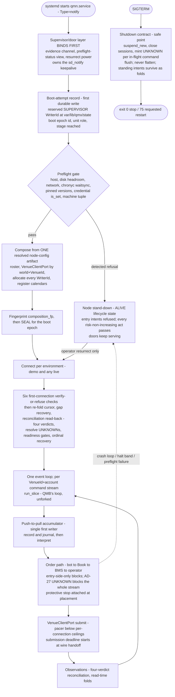
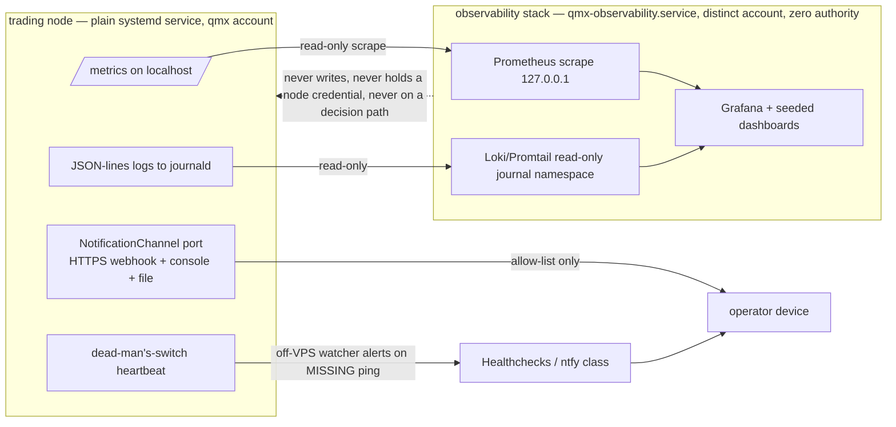
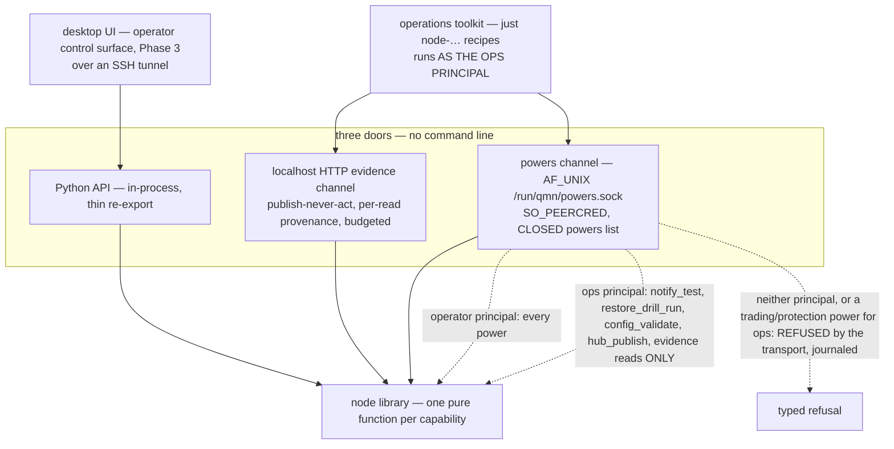

# Trading Node (`qmn`)

`COMP-QMN` is the QMX trading node: ONE product with two modes, `paper | live`, that runs QMX's ratified rulebook against a live broker as a single systemd-supervised process on a Linux VPS (DEC-0186) (DEC-0259). It is a supervised composition-root runtime over a pure rulebook — the one long-lived impure shell that composes the pure QMF, QMB and QML parts at boot and owns everything the libraries refuse to own: ambient time, async at the venue edge and the doors, scheduling, secrets, and real money; below the root nothing is impure and above it nothing is a rule (DEC-0187). It is an application-layer product built ON QMF exactly as QMB and QML are — a top-level uv-workspace member alongside `qmb/` and `qml/`, never a `qmf.*` roster package and never a framework (DEC-0186). Nothing QMX is published to any index; the node installs from ONE canonical checkout root on the VPS, `git clone` at a pinned commit plus `uv sync --frozen`, materialized as immutable per-commit trees under a `current` symlink (DEC-0186) (DEC-0201).

The distribution and import name `qmn` is a **code name only** — "QuantMind Node", the packaging and import identifier and nothing else. The operator declined to rule the product name — a refusal the transcript ties to the node-command half of the bundled question — so a rename is mechanical and moves one identifier set (the distribution name, the import name, the `just node-…` recipe prefix and the `qmn_` metric prefix) together, while `/opt/qmx`, `/var/lib/qmx`, the `qmx` service account and the `qmx/*` credential labels are platform names that do not move (DEC-0186) (DEC-0211). The node is the ONE sanctioned importer and wirer of `qmf-venue`: L30's scope annotation reads "applications still never import qmf-venue", yet AD-28 requires a composition root to construct the adapter, so the node's `qmn.venue` subpackage is the declared reconciliation boundary — every other `qmn` module receives `VenueClientPort` and CT-19/CT-20 shapes only — and the documentation factory annotates L30 at source rather than a child settling it silently (DEC-0186) (DEC-0241) (DEC-0120). `qmb` and `qml` keep their `qmf-venue` ban (DEC-0186).

The node ships **NO operator command line** and no typed operator door of its own (operator ruling R1): "there is nothing like commands or anything… it's a user interface on the desktop application as per the overall architecture" (DEC-0211). Its control surface is the desktop UI over the node's three doors, and the node is one surface inside the desktop UI (DEC-0202); `qmb` therefore remains the platform's single command-line surface, PRD FR-046, DEC-0159 and DEC-0185 Ruling C stand unchallenged, and the earlier command-line reconciliation note is withdrawn (DEC-0186) (DEC-0159) (DEC-0185). Deployment and provisioning are an **operations toolkit** of `just node-…` recipes — DevOps tooling, a very separate system like how big tech teams work (the transcript says this of the DevOps layer as a whole, not the recipes), never a trading control (DEC-0186) (DEC-0211).

The design is FINAL, ratified by operator delegation plus the four direct rulings of 2026-08-28 — no command line (R1), the week-long unattended soak with the separate observability stack (R2), promotion-then-activation as two acts (R3), and free news only (R4) (DEC-0259) (DEC-0211) (DEC-0212) (DEC-0213) (DEC-0214). Ratification fixes the architecture only: nothing in this document grants implementation, credential, order, promotion, live-money or destructive authority — that arrives solely through the factory pipeline (DEC-0259). The trading node is ONE product with modes `paper | live`; it is never "a paper node", never "a live node", and its asyncio event loop is called the event loop and nothing else (DEC-0186) (DEC-0187).

## Authority boundary

May: exist as the only impure shell that owns ambient time, broker sessions, secret values, async (venue edge and doors only), threads, processes, schedules and real money, keeping everything below it pure (DEC-0187); compose from ONE resolved node-config artifact per boot epoch in the ordered ceremony compose → fingerprint → seal, allocate every `WriterId` from a declared namespace, stamp `composition_fp` as occurrence provenance on every journal stream and artifact label, and seal the composition immutable for the boot epoch (DEC-0187); import and wire `qmf-venue` through the `qmn.venue` subpackage as the one sanctioned importer, receiving `VenueClientPort` and CT-19/CT-20 shapes into every other `qmn` module (DEC-0186) (DEC-0241); drive QMB's B-2 event-slice loop through `run_slice`, one loop instance per `(VenueId, account)` command stream, behind a push-to-pull accumulator that is the single first writer of every inbound observation (DEC-0190) (DEC-0169); wire the bot → Book → BMS → operator chain of command without redefining a step, minting command identity only at submission with a durable command-id-binding record persisted before submission (DEC-0191) (DEC-0143); attach a venue-resident protective stop at placement on every `place_order`, in the CT-18 form declared for that order type (DEC-0191); adopt the GitBook KSA baseline under L37 and run it as a read-time fold per enforcement scope, minting the effect matrix (`registry:ksa_effect_matrix`) as node severity policy carrying no spine value (DEC-0192); run AD-33 through AD-41 and CT-29 through CT-32 verbatim and mint values only — the kill line (`registry:kill_line_capital_floor`, which IS AD-40's `loss_floor`), the windows, SQS, the ratchet and the bench (DEC-0193) (DEC-0216); run paper as a Book-level mode routed to the paired demo account, and run the SOAK as the full unattended first-deploy warm-up week (DEC-0194) (DEC-0212); reconcile at startup and on cadence with FOUR verdicts and decompose explained drift into two separately reported residuals (DEC-0195) (DEC-0258); complete `qmf-venue`'s existing `ConnectionManager` with the in-house cTrader transport increment and mint `VenueClientPort` with three V1 implementations (DEC-0196) (DEC-0228); hold secrets by reference in a two-layer store and provision them over SSH stdin through the wizard recipe (DEC-0197) (DEC-0227); record live data, bootstrap history, re-home the news-calendar recorder to a systemd timer, and run the nightly backup and the three restore drills (DEC-0198) (DEC-0252); stamp all QMX-owned event times from the VPS OS clock under chrony and evaluate four clock bands as a per-decision-cycle precondition (DEC-0199) (DEC-0218); export metrics, logs, health and a closed alert allow-list, and consume — never rebuild — a separate zero-authority observability stack (DEC-0200) (DEC-0233); deploy as a plain systemd service on Ubuntu 24.04 with checked-in unit files, a pinned Linux CI lane, `just node-switch`/`just node-rollback`, and check mode (DEC-0201) (DEC-0226); expose exactly three doors — the in-process Python API, the localhost HTTP evidence read channel, and the unix-socket powers action channel authenticated by `SO_PEERCRED` against two declared principals (DEC-0202) (DEC-0234); compile the one resolved node-config artifact carrying eligibility and identity only, with runtime state exclusively a read-time fold (DEC-0203) (DEC-0223); host QL-7 seats under a callback-deadline-and-quarantine contract and build the MIS shadow-lane seam (DEC-0204); accept a human-signed promotion card and a separate human activation, the precondition battery running silently server-side (DEC-0205) (DEC-0213); run replay as a process outside the node process reading through the one sanctioned cross-world import port (DEC-0206) (DEC-0229); key every runtime object by the ratified tuples so multi-account and multi-broker are roster config, not architecture (DEC-0207); ship under the permanent QA battery with nightly mutmut on money-path modules, the FEAT-0023 conformance double, the four golden scenarios and the soak acceptance checklist (DEC-0208); run the accounting period and the per-binding virtual ledger, minting operator-signed treasury boundary acts that never touch positions (DEC-0210); and expose every operator moment as a read model on the evidence channel and a power on the powers channel for a later UI story (DEC-0202) (DEC-0215).

May never: ship a product command line, a typed operator door, a console-script entry point or any publishable target — both claims are tier-1 `check` gates, not habits (DEC-0186) (DEC-0202) (DEC-0220); let a `just node-…` recipe place, cancel, amend, flatten, promote or activate anything, or construct a composition root or import the Python API in a process other than the node's — recipes run as the ops principal, for which every trading, protection, promotion, activation, settings, `resurrect`, attestation and countersign power is refused by the transport (DEC-0186) (DEC-0234); import `qmf-venue` anywhere but the `qmn.venue` subpackage, or amend a QMF, QMB or QML parent by assertion — every parent annotation is surfaced for the documentation factory, never settled by the child (DEC-0186) (DEC-0242) (DEC-0120); hot-reload anything identity-bearing, or let a config change take effect other than through a new resolved config version plus a supervised restart at a safe point (DEC-0187) (DEC-0203); run a second event loop, carry domain work on a background thread, or run a replay inside the node process (DEC-0189) (DEC-0206); fork the live and backtest loops, write an inbound observation anywhere but through the accumulator, or let a forming bar be visible (DEC-0190); mint a block it cannot apply entry-side only — every node-raised block on a command stream refuses `place_order` and risk-increasing `amend_protection` and NOTHING ELSE, with AD-27's per-command UNKNOWN block the one parent-carved exception that refuses protection too (DEC-0191) (DEC-0216) (DEC-0150); refuse a risk-non-increasing `amend_protection` on the command path, drop a protective act on a transient refusal, or emulate a fractional close by close-then-replace (DEC-0191) (DEC-0193); let a bot size itself, resolve `requested_r` from anything but the Book, or derive `execution_target` from Book mode alone (DEC-0191) (DEC-0204); reuse a command ordinal across the life of a stream, conflate the command ordinal with the journal sequence, or open a sequencer before recovering the ordinal high-water mark (DEC-0191) (DEC-0224); automatically de-escalate a KSA level, lower a level on anything but an operator `resume`, or run the kill switch on a guess (DEC-0192); let a money boundary act as a flatten authority, read a currency out of a symbol, or open entries on a news-calendar revision that narrows an in-force window (DEC-0193) (DEC-0209) (DEC-0236); admit a scale-in — a second entry on an instrument the binding already holds a virtual position on is a `policy rejection` over VIRTUAL positions so a netted account's shared venue position can never mask it (DEC-0191) (DEC-0209); satisfy a `flatten` intent on a command outcome, or collapse AD-36's satisfaction predicates into one under a dead wire (DEC-0192) (DEC-0218); mint a paper twin, gate live money on paper evidence, or let paper P&L cross the money boundary or buy a seat (DEC-0194); difference the venue equity series against the virtual-ledger equity series, admit a float onto the money path, or introduce a tolerance to absorb a representation error `reconciliation_epsilon = 0` forbids (DEC-0195) (DEC-0225); run Spotware SDK or Twisted code in the runtime, mint a second connection manager, hold a second in-memory venue secret, or select a `VenueClientPort` implementation by `VenueId` alone (DEC-0196) (DEC-0228); hold a secret value above the connection manager, seal credentials with `--with-key=auto`, VPS-mint the backup payload key, or compose a root or a venue-session holder off the roster's VPS machine tuple (DEC-0197) (DEC-0227); pay for news data or mint a paid fallback slot — Forex Factory's free weekly file is the sole V1 source (DEC-0214); stamp a foreign clock, store a local time as an evidence timestamp, key or comparison, or trade before `chronyc waitsync` (DEC-0199); let a log line become evidence, report a single global health colour, or route a notification back onto a trading path (DEC-0200); require a container for the node itself, ship to the least-tested OS, or let a requested restart advance the crash-loop fold (DEC-0201) (DEC-0189); expose capability drift between doors, authorize on stale evidence, or accept a powers call whose peer credential is neither declared principal (DEC-0202) (DEC-0234); carry runtime state in the config artifact, home a resolved value or a `value-status` in the registry, or admit a new Book, BMS or bot through node code rather than registry plus roster config plus a restart (DEC-0203) (DEC-0223) (DEC-0256); let a bot read a clock or a market-condition signal, let an unregistered model touch a door, or wire a shadow-lane candidate labeler into a governed consumer (DEC-0204); let an approval become exposure, mint a live promotion from an agent signer, or pull an artifact carrying `provenance = sandbox` (DEC-0205) (DEC-0213); submit a command from a replay run, restore a replay snapshot into a live or paper seat, or let replay evidence gate live money (DEC-0206); hardcode "the account" or assume one broker (DEC-0207); gate acceptance on profit, invent a latency budget, or discharge QA debt silently (DEC-0208); re-base a frozen R by a boundary act, move money without an operator-signed treasury boundary record, or let two position folds wear one word (DEC-0210) (DEC-0209). Where a node ruling supersedes an earlier sitting sentence, the earlier text is superseded history and is never presented as current (DEC-0211) (DEC-0212).

## Interfaces

The node consumes the full QMF, QMB and QML surface and realizes the node-minted seams below. Contract links resolve under `docs/contracts/`; peers resolve under `docs/components/`.

| Interface | Direction | Contract | Peer |
|---|---|---|---|
| Live source observations (ticks, live trendbars-in-spots, depth verbatim) | in | [CT-10](../contracts/ct-10-source-observation.yaml) | COMP-QMF-DATA; the pinned canonical sensing feed, written through the accumulator as the single first writer (DEC-0190) (DEC-0198) |
| External-source intake (Dukascopy bootstrap; news-calendar snapshots) | in | [CT-15](../contracts/ct-15-external-source-adapter.yaml) | COMP-QMF-DATA-INGEST, COMP-CALENDAR-FEED; the ingest shape is the seam a second free source would land through (DEC-0198) (DEC-0214) |
| Journal events on writer-scoped streams (seven AD-21 types, gapless per writer and boot epoch) | out | [CT-13](../contracts/ct-13-journal.yaml) | COMP-QMF-DATA; the node adds no journal type (DEC-0187) (DEC-0198) |
| Backup and restore primitives (encrypted, versioned, verify-before-purge) | in/out | [CT-14](../contracts/ct-14-backup-restore.yaml) | COMP-QMF-DATA-BACKUP, COMP-OBJECT-STORAGE; the payload key is workstation-escrowed, never VPS-minted (DEC-0197) (DEC-0198) (DEC-0252) |
| Indicator / configured-producer reads, incl. the SQS door | in/out | [CT-16](../contracts/ct-16-indicator.yaml) | COMP-QMF-INDICATORS; SQS is a configured producer with the node as baseline producer, reaching the door only inside the signal snapshot (DEC-0193) (DEC-0204) (DEC-0230) |
| Venue capability surface (19 unfilled fields filled, marked static or measured-at-connection) | in | [CT-18](../contracts/ct-18-venue-capabilities.yaml) | COMP-QMF-VENUE, COMP-CTRADER; several rows gate bind time (DEC-0196) |
| Venue commands (five kinds; through the node-minted port) | out | [CT-19](../contracts/ct-19-venue-command.yaml) | COMP-QMF-VENUE; `close_partial` is not a V1 kind (DEC-0191) (DEC-0196) |
| Venue events and reconciliation observations (four verdicts; position/balance read-backs) | in | [CT-20](../contracts/ct-20-venue-event.yaml) | COMP-QMF-VENUE; read-backs journal onto the existing seven types by a proposed mapping-row addition (DEC-0195) (DEC-0247) (DEC-0258) |
| Venue secret and session lifecycle (references above the connection manager) | in | [CT-21](../contracts/ct-21-venue-secret-session.yaml) | COMP-QMF-VENUE; the `ConnectionManager` is the sole session and sole venue-secret holder (DEC-0197) (DEC-0187) |
| Book charter / definition (cited by `fp1`) | in | [CT-22](../contracts/ct-22-book-charter.yaml) | COMP-QMF-RISK; a Book MAY declare the adopt-the-advisory-stop module mode (DEC-0191) (DEC-0177) |
| Risk-evaluation door (Book-resolved intent → the order path) | in/out | [CT-23](../contracts/ct-23-risk-evaluation.yaml) | COMP-QMF-RISK; admission, `requested_r`, the declared full-loss price via the per-family `ExitLogicModule` (DEC-0191) (DEC-0142) |
| Book mode and seat/binding transitions (paper flip, activation, quarantine) | in/out | [CT-24](../contracts/ct-24-book-mode.yaml) | COMP-QMF-RISK; a paper flip mints a record, never a config version (DEC-0194) (DEC-0203) |
| Risk-journal projections (`veto_ledger`, `trade_journal`, `book_journal`, `ksa_audit_log`, `correlation_ledger`) | out | [CT-25](../contracts/ct-25-risk-journal.yaml) | COMP-QMF-RISK; the five Records streams survive as projection names only (DEC-0200) (DEC-0246) |
| BMS definition (one instance per account; cited by `fp1`) | in | [CT-27](../contracts/ct-27-bms-definition.yaml) | COMP-QMF-RISK; the control-rank table and the kill-line series (DEC-0193) |
| Book binding (minted per roster binding; `world = live` or `world = replay`) | out (minted) | [CT-28](../contracts/ct-28-book-binding.yaml) | COMP-QMF-RISK; the bind-time capability check refuses at bind time (DEC-0191) (DEC-0205) |
| Exit records (one per virtual-position close; the bench's input) | in/out | [CT-29](../contracts/ct-29-exit-record.yaml) | COMP-QMF-RISK; `close_reason = kill_line_flat` minted apart from `protection_forced_flat` (DEC-0193) |
| Control actions (KSA effects `suspend_new | drain | flatten`; the `node_resurrect` subtype) | in/out | [CT-30](../contracts/ct-30-control-action.yaml) | COMP-QMF-RISK; one arbitration point per stream, strictly by rank (DEC-0192) (DEC-0191) (DEC-0249) |
| Control windows (`news | daily_dead_zone | session_handover_buffer`) | in | [CT-31](../contracts/ct-31-control-window.yaml) | COMP-QMF-RISK; widths carry no spine value (DEC-0193) |
| Performance-result container (bench folds; the promotion card carries QMB's) | in | [CT-32](../contracts/ct-32-performance-result.yaml) | COMP-QMF-RISK; the one performance container (DEC-0193) (DEC-0205) |
| Bot definition (seat eligibility; the canonical assignment) | in | [CT-33](../contracts/ct-33-bot-definition.yaml) | COMP-QML; a QL-7 seat over the declared footprint only (DEC-0204) (DEC-0177) |
| Confluence (leg composition) | in | [CT-34](../contracts/ct-34-confluence.yaml) | COMP-QML; consumed as declared bot logic, never re-authored (DEC-0204) |
| QMB `run_slice` event-slice loop | in | B-2 (DEC-0169) | COMP-QMB; the pure single-slice function, driven and never forked (DEC-0190) |
| The passive file-sync hub (write-only inbox, read-only published area) | in/out | B-15 (DEC-0169) | COMP-QMB; dumb storage, never a service; the click-gated promotion pull and the `hub_publish` step (DEC-0188) (DEC-0205) |

Node-minted and node-hosted seams:

- **Python API door** (in-process) — every node capability exists once as a pure library function; the desktop backend consumes it in-process where co-located, and the operations toolkit scripts import it rather than shelling anywhere (DEC-0202).
- **Localhost HTTP evidence read channel** — publish-never-act, budgeted by `registry:evidence_channel_budget`, authority-free, refusals returned as evidence, no authentication beyond the loopback binding on the single-tenant host (DEC-0202) (DEC-0234) (DEC-0256).
- **Unix-socket powers action channel** at `/run/qmn/powers.sock` (`qmx:qmxops`, mode 0660) — `SO_PEERCRED` authenticates the peer against exactly two declared principals, `operator` (every power) and `ops` (`notify_test`, `restore_drill_run`, `config_validate`, `hub_publish` and the evidence reads only); neither is the `qmx` service account, and preflight refuses to boot if any unit runs under an operator-principal uid (DEC-0202) (DEC-0234).
- **`VenueClientPort`** — node-minted over the CT-19 command and CT-20 event/reconciliation shapes because `qmf-venue` exposes no such seam at `ef9bb25`; three V1 implementations, selected by the pair `(world, VenueId)`: the cTrader client composed around `qmf-venue`'s `ConnectionManager`, TN-21's replay adapter, and TN-23's FEAT-0023 conformance double (DEC-0196) (DEC-0228).
- **The replay import port** — the one sanctioned cross-world read, one-way and read-only, reading from the evidence tier's `sealed-archive` role (DEC-0206) (DEC-0253) (DEC-0229).
- **QL-7 seat hosting** — a factory per seat driven by the loop's `mint_intents` hook, under the callback-deadline-and-quarantine contract and the door layer's slice-progress watch (DEC-0204).
- **The operations toolkit** — `just node-…` recipes whose bodies live under `qmn/deploy/justfile-recipes/`: `node-install`, `node-switch`, `node-rollback`, `node-secrets-provision`, `node-data-bootstrap`, `node-replay`, `node-config-init`, `node-config-validate`, `node-config-explain`, `node-notify-test`, `node-hub-publish`, plus a `just node-…` recipe for the on-demand host-loss restore rehearsal; each needing live state makes the same door call the UI makes, as the ops principal, with no privileged back channel (DEC-0186) (DEC-0202).

## Behavior

The node is one supervised process whose door/supervisor layer binds before act 1, whose composition root seals a rulebook per boot epoch, and whose one event loop drives QMB's slice function per command stream out through the node-minted venue port. The diagram states the process model; the subsections state each rule TN-1 through TN-12 in full.



### Identity, packaging, base branch (TN-1)

The trading node is ONE product with two modes, `paper | live`, and is a top-level uv-workspace member alongside `qmb/` and `qml/` under the code name `qmn` — the distribution and import identifier only, the operator having declined to rule the product name (a refusal the transcript ties to the node-command half of the bundled question) so a rename is mechanical (DEC-0186) (DEC-0211). It is an application layer built ON QMF exactly as QMB and QML are (L11/L31), never a `qmf.*` roster package and never a framework; nothing QMX is published to any index, and the node installs from ONE canonical checkout root on the VPS — `git clone` at a pinned commit plus `uv sync --frozen`, materialized as immutable per-commit trees under a `current` symlink (DEC-0186) (DEC-0201). Node epics branch from `origin/integration` @ `ef9bb25`, never the stale local `integration` ref at `2c8d495`, and land back on `integration` through the factory lane; if the operator squash-merges to `main` first the lane re-points onto `main`, a mechanical change, and "start the node from `main`" is refused because `main` carries no `packages/`, `qmb/`, `qml/` or `extensions/` (DEC-0186).

The node ships NO operator command line and no typed operator door of its own (operator ruling R1): its control surface is the desktop UI over the node's doors, so PRD FR-046, DEC-0159 and DEC-0185 Ruling C — `qmb` is the platform's single command-line surface — stand unchallenged and the CLI reconciliation note is withdrawn (DEC-0186) (DEC-0211) (DEC-0159) (DEC-0185) (DEC-0220). Deployment and provisioning are an OPERATIONS TOOLKIT of `just node-…` recipes in the repo's root justfile with bodies in one place, `qmn/deploy/justfile-recipes/` — `node-install`, `node-switch`, `node-rollback`, the secrets provisioning wizard, the data bootstrap, `node-replay`, config init/validate/explain, notify test, hub publish, and the on-demand host-loss restore rehearsal — DevOps tooling and never a trading control and never a product command line: no recipe places, cancels, amends, flattens, promotes or activates anything (DEC-0186) (DEC-0211). That restriction is enforced by the transport, not by recipe text: recipes run under the powers channel's ops principal, for which every trading, protection, promotion, activation, settings, `resurrect`, attestation and countersign power is refused; `node-install`, `node-switch` and `node-rollback` are privileged host acts through the declared sudo admin path touching no door; a recipe needing live node state makes the same door call the UI makes with no privileged path of its own; and no recipe ever constructs a composition root or imports the Python API in a process other than the node's (DEC-0186) (DEC-0234).

The sanctioned `qmf-venue` import boundary is the `qmn.venue` subpackage rather than the root module alone, with every other `qmn` module receiving `VenueClientPort` and CT-19/CT-20 shapes only and the L30 default-deny lint written against that boundary — a conflict surfaced for annotation at source, never amended by a child (DEC-0186) (DEC-0241) (DEC-0120). Both no-publish and no-command-line claims are gates rather than habits: a tier-1 `check` asserts every workspace member declares no publishable target, and a second tier-1 `check` asserts `qmn`'s packaging declares no console-script entry point, so the deleted command-line surface cannot re-enter through packaging (DEC-0186) (DEC-0220). Naming blast radius is bounded: `/opt/qmx`, the `/var/lib/qmx` trees, the `qmx` service account and the `qmx/*` credential labels are platform names that do not move, while the distribution name, the import name, the `just node-…` recipe prefix and the `qmn_` metric prefix are ONE identifier set that moves together (DEC-0186).

### Composition root and the boot ceremony (TN-2)

The node is the ONLY place ambient time, broker sessions, secret values, async, threads, processes, schedules and real money exist; everything below it stays pure (AD-15, L13) (DEC-0187). Two things happen before act 1 so a boot that never finishes is still observable and still recoverable: the supervisor/door layer BINDS FIRST — the evidence channel, a preflight-status read model and the `resurrect` power — and a BOOT-ATTEMPT RECORD carrying the boot epoch id, the unit role and the stage reached is the first durable write, onto which `composition_fp` is stamped at act 3 as an amendment; only a failure that prevents the doors themselves from binding exits non-zero, every later failure booting into stand-down-alive, which TN-4 owns (DEC-0187) (DEC-0226). Boot is then four ordered acts.

**Preflight** is a gate before any state mutation: host, disk headroom, network, clock sync (`chronyc waitsync`), pinned CPython/uv/proto tag/tzdata, credential presence by `is_set` metadata only, store reachability, the roster's declared credential-sharing facts, the roster's VPS machine tuple, the absence of any systemd unit running under an operator-principal uid, and the ownership and mode of every writable tree; a DETECTED refusal is fail-closed with a typed failure id, journaled, and leaves the node alive in stand-down with the doors serving, so it never exits, no systemd restart follows and the crash-loop fold never advances (DEC-0187) (DEC-0218). **Compose** draws from ONE resolved node-config artifact: the roster of account bindings `(VenueId, AccountId, role, world)` with credential references, Book/BMS definition cites by `fp1`, `VenueClientPort` implementation selection by the pair `(world, VenueId)` and never by `VenueId` alone, explicit registration of every market-hours, day-boundary and news-calendar extension and every producer extension (never scanning), every do-not-default value, plus the real `Clock`, the `SecretStore`, the sinks and the scheduler; a `world = replay` composition selects the replay implementation for every `VenueId`, resolves no credential reference, constructs no venue-session `SecretStore` holder and opens no socket, all three proven at preflight or the boot is refused (DEC-0187) (DEC-0228).

**Fingerprint** computes `composition_fp` = `fp1` over the resolved node-config `fp1`; every distribution identity and version (qmf lockstep, qmb, qml, qmn) and every registered extension's identity and version; the proto release tag; the tzdata version; each adapter's static capability-declaration `fp1`; the registry as-of set fingerprint; every market-hours, day-boundary and news-calendar CODE identity and version in play; and the OS/CPU-class tuple — stamped as occurrence provenance on the boot-epoch record of every journal stream and on every artifact label, so because `journal.sequence` is gapless per `(writer, boot-epoch)` every evidence row traces to the exact composition that produced it (DEC-0187). A calendar's DATA — the dated snapshot records the recorder ingests — is deliberately NOT part of the composition, so a data revision never requires a restart while a market-hours, day-boundary or news-calendar code change does; the venue-observation profile is excluded because it is measured post-seal; and every candidate labeler's identity enters TN-19's separate `shadow_composition_fp`, so registering or changing a candidate never re-identifies governed evidence (DEC-0187) (DEC-0204). **Seal** makes the composition immutable for the boot epoch with no hot reload of anything identity-bearing: a config change is a new resolved config version plus a supervised, drain-aware restart at a safe point (TN-4 defines the term) that never flattens, lets standing intents survive as folds, and never changes a runtime state (DEC-0187) (DEC-0203).

ONE IMPURITY IS DELEGATED, named here and nowhere else: `qmf-venue`'s `ConnectionManager` holds the venue socket, the venue session and the single in-memory venue secret value, running on the loop the node injects under the injected `Clock` and `SecretStore`, owning no event loop, creating no task the node's scheduler did not schedule, reading no ambient clock and holding no money — with QMF's async conformance test amended in the same increment to exempt `qmf.venue.connection` BY NAME; if that exemption is refused at the parent the increment lands in `qmn.venue.ctrader` instead and the epics may not choose between the two (DEC-0187) (DEC-0243) (DEC-0196). `WriterId` allocation is the root's exclusively: every `WriterId` is allocated at Compose from a declared namespace and handed to its writer, no component derives its own, the root proves the allocated set pairwise distinct before Seal, journals the full allocation on the boot-epoch record beside `composition_fp`, and refuses to boot on a collision (DEC-0187). The allocation names each `(VenueId, account)` command stream, the venue recording feed, the risk-domain writer `(machine, risk role, binding)` (AD-31's owner of `decision`, `risk transition`, `control action` and `promotion` events), the Bot-domain record streams, each streaming-indicator feeder and each timer unit; ONE id is RESERVED rather than allocated — the SUPERVISOR `WriterId`, a constant of the unit role that must exist before Compose because it owns the boot-attempt and lifecycle stream under `/var/lib/qmx/state`, which Compose may never re-issue and which the distinctness proof includes (DEC-0187). Timer units run an abbreviated ceremony from the config version the RUNNING NODE sealed, read from the node's boot-epoch record over the evidence channel and never from the config graph's `current` pointer, computing `composition_fp` over the same inputs so one deployment yields one value, minting their own boot epoch stamped with the unit role and writing only under their own allocated `WriterId`; where the node is not running a timer composes from `current` and stamps `node-absent`, a timer that can neither read the sealed version nor establish that the node is down refuses to write and alarms on the silent-degradation class, and a timer that would need to compose anything the node process does not hands its work to the running node through the doors instead, honoring B-4 (DEC-0187).

### Topology, planes, trust boundaries (TN-3)

The node's topology is three planes, two machines and one bucket (DEC-0188). The VPS PLANE (Linux, always on) hosts ONE node process running the trading loop AND the live tick, bar and depth recording, because cTrader allows at most one demo plus one live connection per application, so the connection manager's canonical sensing feed IS the recorder and a separate recorder process cannot hold its own live connection; separate scheduled units run the news-calendar recorder, the nightly backup, the nightly sample restore and the monthly full restore under distinct `WriterId`s; the VPS provider is deployment configuration exactly as the broker and the bucket provider are, never architecture; the always-on EVIDENCE TIER is a second directory tree on the same VPS — a placement and authority boundary, not a second host, not a database server and not a second writer — into which hot rooms sync one-way, watermarked, idempotent and resumable under verify-before-purge, never blocking on it; and the VPS is the ONLY plane holding live venue credentials (DEC-0188). The WORKSTATION PLANE (Windows 11 now, Linux later) holds the working archive as a controlled-room host, research reads, the future desktop app and the provisioning wizard, carrying provisioning and bootstrap material ONLY and never rotated live session material — the VPS session is the only refresher and the only holder of live session state, so a workstation tool never refreshes a credential the VPS session owns — with Windows Credential Manager `qmx/*` as the provisioning source, the escrow home of the CT-14 backup payload key, and the home of workstation-local secrets only (DEC-0188) (DEC-0197). The BUCKET holds nightly encrypted versioned copies, ciphertext only, PUSHED BY THE VPS and never by the workstation, because a 24-hour RPO cannot depend on a laptop being awake and the bucket credential belongs where the timer runs (DEC-0188) (DEC-0198). The EPISODIC SANDBOX PLANE (factory agents) carries `provenance = sandbox` on its evidence, never merges, and never holds live secrets (DEC-0188).

Flows are ONE-WAY node to evidence tier to workstation, and node to bucket, with exactly TWO inbound crossings and no others: the click-gated promotion pull of registry as-of sets from the passive hub, which REFUSES any artifact carrying `provenance = sandbox` at pull (TN-20); and the sandbox fragment push into the write-only inbox over a restricted key-only SSH identity confined to `/var/lib/qmx/hub-inbox`, distinct from the operator's key and from TN-12's provisioning identity (DEC-0188) (DEC-0205). The PASSIVE FILE-SYNC HUB is a SEPARATE TREE from the evidence tier's rooms (B-15) — a write-only inbox that sandboxes push `WriterId`-scoped fragments into, and a read-only published area holding as-of sets — and the inbox-to-published step is AN OPERATOR ACT, not a background sweep: the `hub_publish` power on the powers channel, signed and journaled, verifying each fragment's `fp1` and refusing `provenance = sandbox` at publish as well as at pull, with `just node-hub-publish` as the toolkit recipe calling that same power; the one-way evidence sync never writes into the inbox, the inbox is never a room, and nothing in either area is a service (DEC-0188) (DEC-0169).

Writable trees are named once and pinned into the unit files by TN-16 — `/var/lib/qmx/rooms`, `/evidence`, `/hub-inbox`, `/hub-published`, `/archive` (immutable raw archive), `/state` (rotated secret material, the supervisor stream of boot-attempt and lifecycle records, and TN-4's reserved protection-intent extent) and `/staging` — all owned by the fixed `qmx` service account, beside two trees that are NOT the node's: `/opt/qmx`, holding one immutable tree per commit plus the `current` symlink, and `/var/lib/qmx-observability`, owned by the observability stack's own distinct service account; every one of these is a named line item of `registry:vps_disk_budget` (DEC-0188) (DEC-0201) (DEC-0200). ROOM-ROLE PLACEMENT is per world: AD-19's seven roles plus one node-minted eighth, `sealed-archive`, all instantiated for `live` and for `replay` — the ingest door, the immutable raw archive and the processed and journal rooms under `rooms/<world>/`; the split-governed research door, the registry room and `sealed-archive` under `evidence/<world>/`; the backup role is the bucket — where `sealed-archive` is what the one-way sync writes into and what TN-21's replay import port and TN-13's backup read by name, a hot room may be purged under `registry:hot_room_retention_window` only when a verified copy exists in `sealed-archive` AND a verified off-host copy exists, and `replay` gets its own instances of all roles under the same trees, the storage separation AD-12 requires rather than identity distinctness alone (DEC-0188) (DEC-0253). The eighth role is surfaced as a parent annotation for the documentation factory, never asserted by the child (DEC-0188) (DEC-0253).

### Process model, supervision, stand-down-alive, shutdown (TN-4)

The node is ONE long-lived process supervised by systemd — `qmn.service`, `Type=notify`, `WatchdogSec` set, `Restart=on-failure` — implementing the `sd_notify` wire protocol itself over a stdlib `AF_UNIX` datagram socket (`READY=1`, `WATCHDOG=1`, the leading-NUL abstract-socket form and an unset `NOTIFY_SOCKET` all handled) with no `python-systemd` or `sdnotify` dependency; THE KEEPALIVE IS OWNED BY THE SUPERVISOR/DOOR LAYER, never by the domain slice loop, so it continues through stand-down while the loop is quiescent, and that decoupling carries one obligation — the door layer also runs TN-19's slice-progress watch, so a loop wedged inside a non-cooperative seat callback stops the keepalive rather than being masked by it (DEC-0189) (DEC-0204). Inside there is exactly one asyncio event loop with async ONLY at the venue edge and the doors (AD-15): the domain loop (TN-5) runs synchronously on that loop's thread per slice; the node's own scheduler drives the adapter's five declared session duties — the venue-bound heartbeat, token refresh keyed by credential reference, reconnect, gap replay, and the verification monitors including the continuous D1-boundary monitor — plus the nightly cycle, the news-calendar refresh and the backup and restore hooks; NO threads carry domain work, and stdlib process-per-job is used only for isolated work — conformance Layer-2 runs, benchmark runs and replay runs — with a replay run ALWAYS a spawn OUTSIDE the node process, composing a replay-scoped root at `world = replay`, drawing `WriterId`s from a disjoint namespace, resolving no credential reference and constructing no live sink (DEC-0189) (DEC-0206). Drain-order discipline applies to dequeue for interpretation ONLY and never to the record-and-journal order: execution and system events are interpreted before market data so a tick storm cannot starve risk checks, while the accumulator's recorded stream preserves arrival order verbatim, which is what keeps TN-21's replay diff meaningful (DEC-0189) (DEC-0190).

NODE STAND-DOWN IS AN ALIVE LIFECYCLE STATE, not a CT-30 control action: it is entered automatically on a crash loop, a `halt` clock band or a preflight failure, and left ONLY by an operator `resurrect` act through the powers channel — journaled as an AD-21 `control action` EVENT under the declared node subtype `node_resurrect` at global scope, minting no CT-30 record and no CT-30 kind — with no clocked clear, no reconnect, no reconciled verdict and no restart leaving it, and it is named apart from the binding state `stood-down` (AD-36) and from CT-30 `resume` (DEC-0189) (DEC-0249). In stand-down the sequencers refuse and journal ENTRY intents only — `place_order` and risk-increasing `amend_protection`, whatever their author — while EVERY risk-non-increasing act passes whatever its author: a Book-minted protective close, a declared force-flat trigger, an `ExitLogicModule`-derived exit, a bot-proposed risk-non-increasing tighten, the standing-intent dispatcher, and every operator-signed protective command (`flatten` at any scope, `close_all`, `close_position`, `cancel_order`, risk-non-increasing `amend_protection`); where the sessions have quiesced a protective command is journaled as a standing protection intent before dispatch and satisfied on the next healthy session, never refused and never dropped, because "reachable in stand-down" means ENACTABLE and not merely answerable, and the doors keep serving throughout so `resurrect`, the evidence channel and the preflight-status view stay available (DEC-0189) (DEC-0150).

THE EXIT MODEL is stated once here and cited from TN-2 and TN-16: a DETECTED refusal at or after preflight is typed, journaled and DOES NOT EXIT, so no systemd restart follows; the crash-loop fold therefore governs only failures that DO exit — a failure to bind the doors, and any unhandled process death after boot — while a REQUESTED restart (a settings edit, a `node-switch`) exits with the reserved code 75 under `RestartForceExitStatus=75` and `SuccessExitStatus=75` so systemd restarts a clean drain rather than treating it as a failure, stamps `reason = requested-restart` on the next boot-attempt record, and NEVER advances the crash-loop fold (DEC-0189) (DEC-0226). The crash-loop fold counts UNREQUESTED BOOT ATTEMPTS — the boot count (`registry:node_crash_loop_max_boots`) within the window (`registry:node_crash_loop_window`), both node values and UI-editable, whose evidence values are recorded in the registry — read from the boot-attempt records the supervisor writer lays down before preflight, counting every attempt within the window regardless of the stage reached (the stage is recorded for diagnosis, never for bucketing), with `StartLimitBurst` strictly greater than the boot count and `StartLimitIntervalSec` at least the window so systemd carries the node to the boot that self-detects the loop and the counter decays once the process stops exiting; a burst at or below the boot count leaves the node dead at `start-limit-hit` with no doors, the one case answered by TN-15's dead-man's switch rather than by a stand-down (DEC-0189) (DEC-0226).

A SAFE POINT, defined once and cited from TN-2, TN-16, TN-17 and TN-18, is a state in which the slice driver is between slices, `suspend_new` is enforced on every stream, every command has reached a terminal outcome or has had an UNKNOWN minted for it, and every sink has flushed with block-on-unpersistable honored — positions are NEVER waited on — bounded by `registry:drain_window` (a `configurable: true` node value, duration unit-kind, blank blocks boot, from which `TimeoutStopSec` is rendered) whose breach is a typed refusal rather than an indefinite hang, with `registry:watchdog_interval` the second such value, rendering `WatchdogSec` so a config change and a unit file can never disagree (DEC-0189) (DEC-0201). THE SHUTDOWN CONTRACT: SIGTERM mints a boot-epoch lifecycle STOP — not a CT-30 action — which enforces `suspend_new` on every stream journaled with authority `adapter_self`, then closes sessions with no command resubmission, then mints an UNKNOWN for every command still without a terminal outcome under the declared trigger `disconnect` (the mint following session close so AD-27's trigger vocabulary applies honestly; a distinct `lifecycle-stop` trigger is offered as a proposed CT-20 mint and until the parent rules it this ordering is the node's rule), each journaled against its command identity so L35's stream block survives the restart, then flushes every sink with block-on-unpersistable honored; reaching the safe point exits 0 for an operator stop and 75 for a requested restart, failing to reach it within `registry:drain_window` mints UNKNOWNs for the remainder and exits on a code that is neither, and if the flush itself cannot complete the node stays up, alarms on the silent-degradation class and refuses to exit clean — shutdown NEVER flattens and standing intents survive as folds to be re-decided at the next boot (DEC-0189) (DEC-0248). Under a full disk the block-on-unpersistable rule and L39 compose rather than collide: the block is entry-side only, the venue-resident protective stop carries the position, and the door-owned keepalive keeps answering while the loop is legitimately blocked on storage so systemd never converts a storage stall into a restart; and a protection intent that cannot be journaled into its room is written instead to a small RESERVED PROTECTION-INTENT EXTENT under `/var/lib/qmx/state`, pre-allocated and sized by `registry:disk_headroom_min` so the headroom block trips first, re-decided when storage returns (re-deciding is not retrying), and recorded UNDELIVERABLE and alarmed on the silent-degradation class if even that write fails — never "held in memory" and never silently dropped (DEC-0189) (DEC-0150).

### The live loop is QMB's loop, unforked (TN-5)

The node drives QMB's B-2 event-slice loop through `run_slice`, the pure single-slice function, and never a second loop — binding at the root a live frontier clock (the real wall clock injected as qmf-core's `Clock`, the monotonic kind for every duration) and a live `SliceHandler` implementing the five hooks `update_stream`, `scheduled_position_event`, `execute_resting`, `update_closed_data` and `mint_intents`; the six pinned sub-phase order is identity-bearing and preserved verbatim, new intents rest a slice, instruments process in declared order, and forming bars are never visible (DEC-0190) (DEC-0169). A PUSH-TO-PULL ACCUMULATOR sits between the venue edge and the loop as the SINGLE FIRST WRITER of every inbound observation: the venue client hands it raw decoded observations, it records them through qmf-data's CT-15 intake into the live world room AND journals them under the allocated venue `WriterId`, and only then makes them foldable — the recorder duty is a role of this one path and never a second writer, no component writes an inbound observation anywhere else, and recording precedes interpretation (DEC-0190) (DEC-0198). THE SLICE FRONTIER IS THE RECEIVE WALL INSTANT stamped by the accumulator, with the venue instant carried beside it as evidence (AD-8), so the live frontier is monotonically non-decreasing by construction and the accumulator's recorded stream order IS the replay cursor order — a replay reproduces slice boundaries from the recorded receive stamps, which is what makes TN-21's diff a decision diff and nothing else (DEC-0190) (DEC-0206).

The accumulator maintains a DURABLE INTERPRETATION CURSOR in the journal that commits at slice end, after that slice's sinks have flushed, and never mid-slice, so the re-fold boundary is always a completed slice; TN-10's boot order re-folds every observation recorded after the last committed cursor position BEFORE the protection-state projection, so an observation recorded before a shutdown is never lost to interpretation, and every fold the re-fold touches is idempotent by observation identity (AD-27's venue-native key under AD-10's idempotent split) so a re-fold can never double-count a fill (DEC-0190) (DEC-0195). The accumulator is BOUNDED by `registry:accumulator_bound` (node value, do-not-default) under a typed overflow rule: overflow NEVER drops an execution or system observation — market-data observations coalesce and the coalescing is journaled as `data quality` — and a bound that cannot be honoured without dropping an execution or system observation is a `storage failure` blocking entries only (DEC-0190) (DEC-0150). Slices are event-driven per observation under a declared `registry:max_slice_latency` (node value, do-not-default) whose breach effect is STATED: a journaled `data quality` record plus a `no-new-entry` band effect, entry-side only per L39, never a silent skip and never a stand-down; and the loop never awaits I/O, since sinks are synchronous local writes and venue submissions are handed to the venue client whose outcomes arrive as observations in later slices (DEC-0190) (DEC-0150).

Streaming indicators on the live path obey the single-feeder law — exactly one `WriterId` holder per streaming instance, allocated at Compose, with a snapshot restoring equivalently only within the same `SnapshotScope` (the OS and arithmetic-reference build injected, never read ambiently) and a cross-scope restore refusing (DEC-0190). There is ONE loop instance per `(VenueId, account)` command stream, the same unit as AD-37's one arbitration point per stream: several Books on one account share it with every coupling that creates ruled at bind time in TN-22, cross-stream ordering is a declared non-guarantee, and backtest, replay and live differ only in which clock and which `VenueClientPort` implementation the root binds — the port being node-minted and selected by the pair `(world, VenueId)`, never by run mode and never by `VenueId` alone (DEC-0190) (DEC-0207) (DEC-0196).

### The order path (TN-6)

The chain is bot, Book, BMS, operator (L36) and the node wires it without redefining a step (DEC-0191) (DEC-0143). ENTRY-SIDE-ONLY BLOCKS are the node's own law (L39 / AD-36): every block the node can raise on a command stream — startup-reconciliation gating, a rotation-store failure, an unpersistable sink, a partial write, node stand-down, a clock band, a full disk — refuses `place_order` and any risk-increasing `amend_protection` and NOTHING ELSE, never a `cancel_order`, `close_position`, `close_all`, risk-non-increasing `amend_protection`, CT-23 `close_full` or `tighten_protective_stop`, and never the recording of evidence; A BLOCK THAT CANNOT BE APPLIED ENTRY-SIDE ONLY IS NOT MINTED, and where the venue path itself is unavailable a protective command becomes a standing protection intent under TN-7 rather than a refusal (DEC-0191) (DEC-0221) (DEC-0150). THE ONE EXCEPTION is the parent's own: AD-27's per-command UNKNOWN block is not a control and not an entry-side block — while an UNKNOWN is outstanding on a `(VenueId, account)` stream EVERY command on that stream is refused, protection commands included, because dispatching a `close_position` into a stream whose last submission's fate is unknown is how a position gets double-closed; a refused protective act never evaporates but stands as an AD-36 protection intent journaled before dispatch and re-decided when the block clears (re-deciding is not retrying), and only `resolve_unknown` clears it, never a reconciliation verdict (DEC-0191) (DEC-0216).

The doors fire in fixed order: the QL-7 bot callback over its declared footprint; the CT-23 Book door — admission, Book-resolved `requested_r`, the declared full-loss price derived by the per-family `ExitLogicModule`, which CONSUMES the bot's optional `advisory_stop_proposal` where the Book declares the ratified adopt-the-advisory-stop-as-is module mode inside the existing `{module_id, config}` shape (DEC-0191) (DEC-0142) (DEC-0177); then NO SCALE-IN — an entry intent against an instrument on which the binding already holds an open VIRTUAL position is a `policy rejection` at the door, stated over virtual positions so a netted account's shared venue position can never mask it — protection windows (CT-31), SQS (AD-39, read only from the per-instant signal snapshot), bench (AD-41), the budget and sizing ladder (AD-40, over TN-25's virtual-ledger figures), the cohort-correlation slot, and L39 `check_exit_preservation` wired and PROVEN on the live path (DEC-0191) (DEC-0209). `close_partial` is NOT a V1 kind, so a Book- or bot-scoped partial exit is an `unsupported capability` refusal, never emulated by close-then-replace, and the exit vocabulary widens only when CT-19 does (DEC-0191). BMS constraints are account-scoped (the kill-line series, exposure, the control-rank table); EXECUTION-TARGET RESOLUTION happens once at intent mint from the three AD-35 inputs `(Book mode, seat state, active-control set)` and never from Book mode alone, entering the command record's identity without changing the AD-29 binding identity; and the PROTECTION GATE sits BEFORE command mint, blocking on the entry side only, reading the KSA level fold at the effective scope, the standing-intent fold and the per-command UNKNOWN block — risk-reducing commands pass every entry-side block unconditionally and dispatch ahead of `place_order`, the gate's one legitimate hold on a protective act is the UNKNOWN block under which the act stands as a journaled intent, the gate sits above the mint so a refused intent leaves no phantom command record, and the gate CONSUMES arbitration and never performs it (DEC-0191).

COMMAND MINT carries an `fp1` identity including `(VenueId, account)`, the session epoch and the node-owned COMMAND ORDINAL, which is a different counter from the journal sequence and never the same object: the journal sequence is gapless per `(writer, boot epoch)` and restarts at each boot epoch, while the ordinal is monotone and never reused across the life of a stream, its high-water mark durable and recovered at boot BEFORE the sequencers open, a stream that cannot recover it refusing to open rather than restarting the count (DEC-0191) (DEC-0224). V1 maps into `clientMsgId` through a DURABLE COMMAND-ID-BINDING RECORD persisted BEFORE submission — `(venue client id, command fp1, account, session epoch)`, named reconciliation evidence — because 100 characters cannot be a total injection over an `fp1` digest space plus stream qualification (DEC-0191) (DEC-0224). EVERY `place_order` CARRIES A VENUE-RESIDENT PROTECTIVE STOP AT PLACEMENT in the form CT-18 declares for that order type — the entry-relative form where absolute protection is unsupported for MARKET orders, the reference price being declared CT-19 surface — with placement an `unsupported capability` refusal where the Book requires attachment and CT-18 does not declare it (never a silently unprotected order), and AD-40's declaration staying the plan rather than being read back as the observed fill (DEC-0191) (DEC-0196). Compound commands (a flatten at binding scope, a `close_all`) fan out to N submissions, each child carrying a derived identity of parent `fp1` plus its declared ordinal, children ordered by child content fingerprint ascending, each individually observation- and journal-bearing, under a STATED parent-outcome table: all children accepted gives `accepted-by-venue`; any child UNKNOWN gives UNKNOWN; otherwise a mix gives `partially-executed`; ALL children rejected gives `rejected-by-venue` and never `partially-executed` — scope resolving through the pinned versioned CT-30 resolution table against the CT-18 position model and never implementer judgment, REFUSING rather than widening where the position model makes a narrower scope indistinguishable from a wider one (DEC-0191) (DEC-0219).

Submission runs through `VenueClientPort` with the pacer below the venue's declared per-connection non-historical and historical request-rate ceilings, `cancel_order`, `close_position`, `close_all` and `amend_protection` served ahead of `place_order` and `suspend_new` taking local effect instantly with no venue round trip: THE SUBMISSION DEADLINE STARTS AT WIRE HANDOFF, the moment the client transmits, never at command mint; time awaiting pacer admission is a local queue with its own declared bound (`registry:local_queue_bound`), measured and exported separately, whose breach is a typed refusal on the veto path naming the pacer as the refusing door, never an UNKNOWN and never a stream block; and a connection fault applies its effect to EVERY command stream bound to that connection, enumerated from the roster at Compose, each affected stream journaling its own block (DEC-0191) (DEC-0224). `resolve_unknown` has TWO PATHS with declared precedence and the call is ITSELF AN OBSERVATION: an unambiguous `observed-accepted` or `observed-absent` read-back resolves automatically, while an ambiguous, absent or `out-of-lookback` read-back requires operator attestation through the powers channel and only that path carries a signer identity, with the `resolve_unknown` call recorded as a CT-20 observation beside the resolving evidence; AD-27's acknowledgement-mode consequence binds the outcome path, so an outcome is NEVER derived from absence alone — a cancel resolved by read-back is `accepted-by-venue` only where the read-back also shows no fill at or after the cancel's submit stamp, otherwise `rejected-by-venue (superseded-by-fill)` — a command whose subject is absent or already terminal AT SUBMISSION resolves without submission and never as a naked close, and `denied-locally` stays an adapter pre-submission outcome minting a CT-20 observation, never confused with an authority-layer veto (DEC-0191).

Every door refusal is a `decision` event on the VETO PATH (CT-25's `veto_ledger` projection) carrying the refusing door and the would-have-been action; every arbitration loser is a `suppressed` control action on the SUPPRESSION PATH with enactment linked by `enacts` edges; arbitration lives in ONE component — the control-action dispatcher in `protection/`, AD-37's one arbitration point per stream — resolving strictly by rank with no arrival-order input, with Tier 1 venue-resident actions outside the ordering by construction, composing actions both executing, only mutually exclusive actions on the same enforcement scope arbitrating, exactly one command emitted where two pending actions produce the same mechanical command on the same scope, a lower-ranked action never undoing a higher-ranked one and a higher-ranked action never reducing the protection a lower-ranked one would have delivered; and the risk dispatcher carries block-on-unpersistable exactly as the venue client does, so a `storage failure` blocks the dispatch and the intent stands as a protection intent rather than being lost (DEC-0191) (DEC-0221). The node OWNS as do-not-default UI-editable values — blank or `provisional-evidence` blocking `role = live` bindings — the submission deadline that mints UNKNOWN (`registry:submission_deadline`), the reconciliation lookback and cadence (`registry:reconciliation_lookback`, `registry:reconciliation_cadence`), the pacing and backoff cadence (`registry:pacing_cadence`, `registry:backoff_cadence`), the local-queue bound (`registry:local_queue_bound`), the protective reserve capacity (`registry:protective_reserve_capacity`), and the pool and health constants; and it owns as RESPONSIBILITIES that are not values, never blank and never UI-editable: evaluating the AD-40 sizing ladder against live Book state, and issuing `resolve_unknown` under the two-path precedence (DEC-0191).

### KSA — the protection authority, and the kill switch under a dead wire (TN-7)

The node ADOPTS the GitBook baseline explicitly under L37 and re-ratifies it here because `docs/` never carried it: five levels `GREEN | YELLOW | ORANGE | RED | BLACK` (fixed enum, uneditable), four trigger classes `scheduled_news | black_swan | connectivity | unknown_state` (addable, never redefined), automatic transitions ESCALATE ONLY, and de-escalation by an operator `resume` alone (DEC-0192) (DEC-0237). The KSA level is a READ-TIME FOLD over the control-action stream declaring its full AD-36 fold contract — stream, ordering key, knowledge-time bound, equal-instant disposition — resolving across writers by AD-37 rank and never by `WriterId` byte order, returning the most restrictive state and alarming rather than refusing on the trading path (DEC-0192). THE LEVEL IS FOLDED PER ENFORCEMENT SCOPE, the scope being part of the level's identity and of its level epoch, with two scopes in V1 (global, and per `(VenueId, account)` command stream), the effective level at any decision point the most restrictive of the scopes covering it, and an operator `resume` naming the scope whose epoch it opens rather than silently reopening every scope (DEC-0192). The fold is MONOTONE NON-DECREASING within a level epoch: it takes the maximum over every escalation record and lowers ONLY on an operator `resume` record opening a new level epoch — resolving a trigger's underlying condition, satisfying a standing protection intent, a `reconciled` verdict, a reconnect, a clocked clear, a restart, or the mere absence of new escalations never lowers it, and most-restrictive-on-ambiguity governs which level an ambiguous escalation resolves to and never whether a level decays (DEC-0192). A connectivity or unknown_state escalation on the LIVE connection does NOT block paper routing to the paired demo stream — AD-35 rules them distinct `(VenueId, account)` streams whose uncertainty never gates each other, and a silent paper outage corrupts every later decay verdict — so the escalation blocks the stream it names and no other, while a GLOBAL escalation blocks both live and paper alike (DEC-0192).

The trigger-to-level-to-effect MATRIX is the node's severity policy: a `configurable: true` UI-editable node variable set, `registry:ksa_effect_matrix`, carrying NO spine value, where each cell declares three mandatory things — an effect drawn ONLY from CT-30's kinds `suspend_new | drain | flatten` (a `flatten` resolving at dispatch into `close_position` or `close_all` CT-19 commands through CT-30's pinned resolution table, `close_all` being a command kind and never a control effect), a required typed scope, and the AD-36 satisfaction predicate from the full closed vocabulary `scope-flat-at-reconciled-verdict | no-pending-orders-at-reconciled-verdict | never-auto` — with a blank or `provisional-evidence` cell blocking `role = live` bindings while paper may run, and the legacy donor matrix recorded as evidence only (DEC-0192) (DEC-0231). Every trigger kind the node mints declares its AD-35 `disposition`, `routes-to-paper | blocks-paper`, as a mandatory field whose classification is fixed by the invariant and not by the author: `scheduled_news` and `black_swan` are market-risk blocks and `blocks-paper`; `connectivity` and `unknown_state` are `blocks-paper` on the escalation's own scope only; a kill-line stand-down and a benched seat are capital-or-authority blocks and `routes-to-paper`; and a kind minted with no disposition is an `invalid input` refusal at registration (DEC-0192).

THE KILL SWITCH IS THE KSA at its blocking levels — global, stopping all NEW trading live and paper alike, sensor-fed, with the MIS snapshot and SQS as inputs and never authorities — and UNDER A DEAD WIRE OR AN OUTSTANDING UNKNOWN the satisfaction predicates are AD-36's verbatim and are never collapsed into one: `suspend_new` takes local effect instantly, `suspend_new` and `drain` are `never-auto` and stand until an operator `resume` with a `reconciled` verdict never clearing them, `flatten` satisfies only on `scope-flat-at-reconciled-verdict`, a command outcome never satisfies an intent, `drift | unknown | out-of-lookback` alarm and hold the intent open without dispatching, and a dead node is answered by the venue-resident protective stop (AD-33) (DEC-0192) (DEC-0218). The standing-intent machinery binds EVERY risk-non-increasing act and not only CT-30 kinds — `amend_protection` under AD-34, CT-23's `close_full` and `tighten_protective_stop` under AD-33, and every protective close — journaled before dispatch and, where the journal room is unpersistable, into TN-4's reserved protection-intent extent rather than merely into a fold, resolved as a read-time fold, re-decided rather than retried, never time-expiring and alarming when undeliverable (DEC-0192) (DEC-0150). The KSA audit trail is the CT-25 projection `ksa_audit_log` over the control-action stream and never a stream of its own; and DEC-0049's detector-pause scoping holds verbatim — automatic detectors act only through entry-blocking controls at the narrowest affected subject and never on positions or exits (L39 holds), with the inform-versus-pause posture a UI-editable node setting (`registry:ksa_detector_posture`) (DEC-0192) (DEC-0049).

### The protection set run verbatim, and the node-minted value roster (TN-8)

AD-33 through AD-41 and CT-29 through CT-32 RUN VERBATIM: the node ratifies the parent's ratified protection set by adoption, with GitBook and the trading-node documentation the authoritative risk-and-sizing layer under L37, and the node mints VALUES, never rules (DEC-0193) (DEC-0237). The KILL LINE is one variable, one declared series, one cadence: `registry:kill_line_capital_floor` is the ratified registry key and IS AD-40's `loss_floor` — one value, one name, read by both the ladder and the breach test, with no second name minted — declared by the Book definition and evaluated PER BINDING against that binding's virtual-ledger equity marked to the latest observed price of its own virtual positions (realized plus unrealized), on every slice carrying a fill or a price update on an instrument the binding holds and at every accounting rollover (DEC-0193) (DEC-0255) (DEC-0210). Venue equity (balance plus unrealized, `converted_by = venue`, exact integers at the account money exponent) is the BMS and account view and the reconciliation counterpart and NEVER the per-Book breach series, while `book_capital` (period-open, excluding unrealized) is the sizing ladder's input only; a breach auto-flattens THAT binding's scope with `close_reason = kill_line_flat` (minted apart from `protection_forced_flat`), stands that binding down (binding state `stood-down`, never a Book-mode row), leaves other bindings of the same Book definition unaffected, returns only on an operator signature per binding, and declares `disposition = routes-to-paper` (DEC-0193) (DEC-0225).

FLATTEN AUTHORITY is AD-36's three and a money boundary is never one of them — the operator at any scope, always, unconditional and never gated on reconciliation; Book policy only through pre-declared trigger classes, the kill-line breach included; the protection authority where the matrix declares a `flatten` effect for that severity; venue-delegated trailing where the venue manages it and a Book opted in — and NEVER the adapter, whose `adapter_self` authority is limited to `suspend_new`, `drain`, `throttle` and session state, with AD-33's other flatten paths (`hold_time_force_flat`, `boundary_flat`, `window_forced_flat`, `protection_forced_flat`, `operator_close`) declared Book triggers at AD-37 rank 2 rather than exceptions to that list (DEC-0193). NEWS BLACKOUT is instrument-scoped via dated per-instrument currency-exposure records — reading a currency out of a symbol is prohibited — entries only, live and paper alike, suppressed decisions journaled on the veto path, fail-closed on a missing exposure record, with no live skip button; A NEWS-CALENDAR REVISION MAY ONLY WIDEN OR ADD A WINDOW AUTOMATICALLY, so a revision that would narrow, shorten, downgrade, delay or remove a window currently in force or beginning within the current trading day is ingested and journaled as evidence, takes effect no earlier than the end of the window the superseded revision declared, never opens entries the superseded revision blocked, and is otherwise an operator act on the powers channel citing both revisions; and staleness fails closed by a PER-DECISION-CYCLE PRECONDITION, `registry:news_calendar_max_staleness` (do-not-default, `configurable: true`, duration unit-kind), so a silently dead timer fails entries closed with no signal from the timer (DEC-0193) (DEC-0219).

DEAD ZONES are `daily_dead_zone` plus `session_handover_buffer` with a mandatory anchor `pre-close | post-open | both`: entries pause while exits, safety acts and data streaming are never blocked; their widths carry no spine value and no node posture — the variable is blank do-not-default and a blank blocks live, the disagreeing source figures are recorded UNMERGED as evidence with their source layer and never as a default, and which band the operator ratifies is a hand-off recommendation rather than spine text (DEC-0193) (DEC-0231). SQS is the V1 ratio sensor as a CT-16 configured producer with the node as the BASELINE PRODUCER from its own live tick recording — one governed producer, published once, reaching the Book door only inside the per-instant signal snapshot so one instant carries exactly one SQS value — with markers `ok | not_ready | unavailable | stale | refused`, a live binding requiring a present baseline keyed `(VenueId, environment, instrument)` so a demo-conditioned baseline NEVER satisfies a `role = live` binding (the live baseline is minted from live-connection recording during the warm-up week), and instrument class a dated AD-9 `instrument_class` metadata record that is operator-declarable and correctable and never parsed from a symbol, no class record meaning blocked with the absence journaled as `data quality` and alarmed (DEC-0193) (DEC-0230). The BREAKEVEN RATCHET is V1's only dynamic protection, single-sided `amend_protection` until amend atomicity is measured at the venue, and its minimum step `registry:amend_min_improvement` is ORIGINATION POLICY and never a gate — a Book `exit_policy` authoring threshold declaring when the ratchet proposes an amendment — so NO node component on the command path may refuse a risk-non-increasing `amend_protection`: a proposal not made is not a block, and a proposal made is dispatched (DEC-0193) (DEC-0150). BENCH is a read-time fold over CT-29 records of VIRTUAL (Book) positions with predicate `realized_r <= -q`, breakevens never counting under any `q`, a fill's CT-29 record persisting before the next intent on that seat (else `stale evidence`), its stream boundary the binding epoch (a new epoch starts at zero unless a signed `carries-ledger` edge spans it), and a benched seat declaring `disposition = routes-to-paper` and routing through its seat record's execution target while the Book stays LIVE; SAME-TICK PRIORITY is one BMS-declared rank table per stream with ranks total and unique, checked at admission Layer 1, a Book whose control policy contradicts its BMS's table refusing at bind time (DEC-0193).

The NODE-MINTED UI-EDITABLE VARIABLE ROSTER — registry rows declaring schema and evidence values only, the resolved values living in the config artifact — is `registry:ksa_effect_matrix`; `registry:daily_dead_zone_width` (evidence recorded unmerged, no default); `registry:session_handover_buffer_width` and `registry:session_handover_buffer_anchor`; `registry:news_blackout_before` and `registry:news_blackout_after` per severity; the seven `sqs_*` keys plus the Book-scoped `registry:decision_freshness_bound`, which AD-39 makes mandatory and non-defaultable and against which a configured SQS input age is refused at the door; `registry:breakeven_ratchet_trigger` and `registry:breakeven_ratchet_offset`; `registry:qualifying_loss_threshold` `q` per family; `registry:bench_consecutive_loss_threshold` per bot, KEPT SEPARATE from the money-ladder divisor `registry:seat_loss_run_allowance` (the legacy coupling being the recorded defect); `registry:amend_min_improvement` per Book as the ratchet's authoring threshold; the clock bands of TN-14; the crash-loop boot count and window, `registry:drain_window` and `registry:watchdog_interval` of TN-4; and `registry:news_calendar_max_staleness` (DEC-0193) (DEC-0256) (DEC-0157).

### Paper mode and the soak (TN-9)

Paper is a Book-level mode (AD-35 / CT-24) expressed as a dated binding-epoch change carrying a mandatory `state_carry` declaration per counter (TN-25); the paper target is the paired demo account — role `demo`, `world = live` — carrying its own BMS instance linked by a typed pairing record (AD-29), with exactly one active paper-routing target per live binding and `execution_target` resolved once at intent mint from `(Book mode, seat state, active-control set)`; paper balance is family-scoped and frozen, a reset mints an operator-signed `paper_epoch` treasury boundary record, and paper P&L never crosses the money boundary and never buys a seat (DEC-0194) (DEC-0210). What routes and what blocks follows AD-35's invariant: a CAPITAL OR AUTHORITY block routes to the paired target while the Book stays LIVE — a benched seat and a kill-line stand-down both route and the evidence keeps flowing — while a MARKET-RISK block blocks paper too, so a protection window, a dead zone and the kill switch stop paper entries exactly as live, and a blocked or silent paper stream raises the live alarm class (DEC-0194). Role scoping is declared rather than collapsed: the paired account is minted with AD-9 role `demo` and every routing reason writes under it, the finer roles `paper-validation` and `paper-benched` are deliberately NOT used in V1, and the consequence is stated — Book-mode PAPER evidence and benched-seat evidence land in one role-scoped namespace and are told apart by the routing reason on the execution-target record, never by namespace, a later split being a role addition rather than a re-write (DEC-0194).

THE SOAK IS MILESTONE 1 AND IT IS THE FIRST-DEPLOY WARM-UP WEEK, ruled by the operator 2026-08-28 — "two days to a week… I think a week is enough and sufficient": for one full UNATTENDED week the node runs in paper mode on the demo account with the FULL live machinery — a real cTrader connection, the verification suite, reconciliation read-backs, standing intents, KSA, windows, SQS baseline minting, recording, backups, the restore drills, the doors, metrics and alerts — under full logging and monitoring, and it is the same week as the ratified warm-up rider (one attribution, one rider), never a soak nested inside a longer rider (DEC-0194) (DEC-0212) (DEC-0135). THE SOAK RUNS THE DEMO BINDING WHILE THE LIVE CONNECTION IS OPENED FOR SENSING AND RECORDING ONLY: the demo connection carries paper routing and the full order-path machinery, and as soon as live credentials exist the live connection opens with no live binding, no command stream open and no live roster binding minted, so the live-environment SQS baseline (keyed `(VenueId, environment, instrument)`) and the live-path rung baseline accumulate on the live environment while the machinery proves itself on the demo one — the live binding WAITS ON ITS OWN BASELINES, so a late Spotware approval or KYC delays go-live and never the soak, and the connection count is derived from the roster (a roster naming one `(venue, environment)` pair opens one connection) (DEC-0194) (DEC-0196).

THE PAPER LEDGER RUNS: the paired binding keeps a full virtual ledger — frozen starting balance plus realized plus unrealized of its paper virtual positions — so a paper capital floor is evaluable and the kill-line mechanism is exercisable in paper, the frozen balance being what is never hand-adjusted while the equity series moves (DEC-0194) (DEC-0235) (DEC-0210). Day-one drift checks in paper are two: the paper ledger must reconcile against its own CT-29 and fill records as self-consistency at epsilon 0 in the exact integer domain, and the full reconciliation read-back runs against the demo account with a non-zero residual ALARMING for investigation rather than halting — and THE DISCRIMINATOR IS ROLE, NEVER WORLD, because the demo binding carries `world = live` by AD-12 and keying the live drift stand-down on `world` would stand the soak down on the first demo-server quirk — with these alarms delivered during the soak as a soak-scoped demo-drift digest so the operator is not trained to dismiss drift alarms in the week before go-live (DEC-0194) (DEC-0195). Live binding comes only at the END of that week and only on instruments whose checks passed AND whose live-conditioned baselines are present; unattended is a design constraint rather than a schedule note, since the alert allow-list, the dead-man's switch and the liveness digest stand in for a watching operator and a synthetic alert is proven delivered end-to-end before the node is left alone, and TN-23's injected-fault drills are discrete operator-performed acceptance acts at the week's boundaries or at declared drill points while the continuous run between them is what is left alone (DEC-0194) (DEC-0212). ACCEPTANCE IS MACHINERY PROOF — the TN-23 checklist with its fault-injection drills, unchanged by the duration ruling — and NEVER profit, because paper evidence can never authorize live money (AD-32); the acceptance checklist itself lives in TN-23 (DEC-0194) (DEC-0208).

### Startup, recovery and explained-drift doctrine (TN-10)

The PRD's mined Phase-2 doctrine is RATIFIED BY ADOPTION with ONE declared narrowing named at its point of use: the PRD's "unexplained live drift halts trading" is narrowed to an entries-only stand-down, authorized by L39 exactly as TN-11 narrows AD-28's sensing-outage rule; the GitBook start sequence is recorded as this doctrine's ancestor rather than a competing rule (DEC-0195) (DEC-0238) (DEC-0150). After TN-2's seal the boot order is FIXED at ten steps: (1) connect per environment; (2) the FIRST-CONNECTION VERIFICATION SUITE of SIX verify-or-refuse checks — spot-timestamp unit, D1 boundary, bar-basis reconciliation, pip formula, money exponent, and amend atomicity, whose verdict gates whether dual-sided amends are ever legal and whose absence leaves single-sided amendment the only path — landing in the per-`(VenueId, account)` venue-observation profile, a failure refusing the dependent evidence class and journaling a `data quality` event; (3) re-fold of the interpretation cursor, every observation recorded after the accumulator's last committed cursor position folded before any state is projected; (4) reconnect gap recovery, fetching deals and positions since the last-seen execution event, recovered fills committing through evidence BEFORE the session reports healthy, a no-gap reconnect still emitting correlation evidence; (5) the reconciliation read-back over the declared lookback with FOUR verdicts; (6) resolution of outstanding UNKNOWNs — automatic on an unambiguous `observed-accepted` or `observed-absent`, operator attestation through the powers channel on an ambiguous, absent or `out-of-lookback` read-back, with the evidence channel serving the outstanding set WITH its per-command read-back detail so the attestation is made against evidence rather than a count, and a typed refusal rather than an offered choice where the read-back cannot support attestation; (7) missed-rollover catch-up, boundary equity reconstructed from journals and the sweep journaled as an AD-16 treasury boundary event appended as a correction that moves no money without one, never closes a position and never re-bases a frozen R; (8) protection-state projection over standing intents, KSA level, Book modes, binding states, seat states, bench counts, exposure and budgets — ALL read-time folds, with no safety counters to reset; (9) readiness gates — clock sync and drift band ok, an SQS baseline present per door, a consistent control-rank table, every market-hours, day-boundary and news-calendar identity verified plus the pinned tzdata, and for `role = live` bindings only a live-path rung baseline on this deployment tuple, minted by the benchmark harness and never by the trading loop so a first boot is not circular; and (10) command-ordinal recovery before the sequencers accept intents, a stream whose ordinal cannot be recovered refusing to open (DEC-0195) (DEC-0224). Every fold declares its stream, ordering key, knowledge-time bound and equal-instant disposition as pinned contract surface and resolves across writers by AD-37 rank and never by `WriterId` byte order; no fold on the trading path refuses — one that cannot resolve returns the most restrictive state, journals `data quality` and alarms (DEC-0195).

THE ARITHMETIC DOMAIN IS DECLARED: equity derivation and drift decomposition are exact scaled-integer arithmetic at the account's declared money exponent, each venue-supplied converted figure decoding once at its own declared exponent and re-scaling to the account exponent by exact integer arithmetic with no float participating in the sum, and a figure arriving with no declared exponent or at an exponent that cannot be re-scaled exactly REFUSING the derivation with a typed refusal rather than approximating — `reconciliation_epsilon = 0` is a statement about that domain, and no tolerance is ever introduced to absorb a representation error that does not exist (DEC-0195) (DEC-0225). EXPLAINED DRIFT IS TWO RESIDUALS COMPARED SEPARATELY, each with its own epsilon-0 identity and NEVER one blended number: (a) QUANTITY, the sum of virtual (Book) positions per instrument against the venue position picture for that account in exact instrument quantity units under the account's declared `netting | hedging` model, through AD-27 reconciliation evidence; and (b) CASH, the venue's realized balance against the virtual ledger's realized cash plus the named components — swept-but-unwithdrawn cash, re-seed remnants, and venue-charged fees or financing not yet journaled — in exact scaled integers at the account money exponent (DEC-0195) (DEC-0210). UNREALIZED P&L ENTERS NEITHER RESIDUAL because it is a mark and marks are never reconciled: the venue equity series and the binding's virtual-ledger equity series are reported side by side with their mark instants and are NEVER differenced (differencing two marks at two instants under epsilon 0 would set `operator_review` permanently on any open position and gate promotion forever), floating P&L staying an explained, named, never-swept component of the equity narrative; drift is a non-zero residual in (a) or in (b), and only that sets `operator_review` — a journaled binding-scoped state, folded like any other, that gates the NEXT live promotion or activation on that binding and gates nothing else, never blocking the command stream and never blocking an exit, clearing only on an operator `resume` after a fresh reconciliation review (DEC-0195) (DEC-0225).

The FOUR reconciliation verdicts — `reconciled | drift | unknown | out-of-lookback` — replace the baseline's three everywhere the node speaks (DEC-0195) (DEC-0258). UNEXPLAINED DRIFT IS KEYED ON THE BINDING'S ROLE AND NEVER ON ITS WORLD: a `role = live` binding stands down FOR ENTRIES ONLY — exits, protection amendments, standing intents and evidence continue per L39, which is what authorizes narrowing the PRD's "halts trading" to the entry side — with no automatic resume and a restart never permission to resume, while a `role = demo` binding alarms at the live severity class and continues whatever its world (DEC-0195) (DEC-0150). A DEPLOYMENT-TUPLE CHANGE INVALIDATES THE RUNG BASELINE: where the declared `(OS, CPU-class)` tuple changes under a running node — a VPS live migration, a rebuild, a resize — new `role = live` bindings are blocked entry-side until the benchmark harness re-records a baseline on the new tuple, the change alarms on the silent-degradation class, existing live bindings keep exits, protection amendments and evidence per L39, and AD-24's light claims degrade to provisional on the same event (DEC-0195) (DEC-0204). Reconciliation cadence is a node value (`registry:reconciliation_cadence`) — after every UNKNOWN, on every reconnect, at each accounting rollover, and on a configurable periodic tick — startup reconciliation gates ENTRIES only while the sensing pipe flows from boot, and a clocked `reconciled` verdict satisfies a `flatten` intent and never lowers a KSA level (DEC-0195) (DEC-0192).

### Venue integration on cTrader (TN-11)

IC Markets is deployment configuration and never architecture (DEC-0196). THE TRANSPORT LOCUS IS DECLARED, not assumed: `qmf-venue` owns its own transport and already ships the `ConnectionManager` as the AD-26/AD-28 sole owner of venue sessions and the single in-memory holder of secret values, so the missing pieces — the asyncio TLS socket to `demo.ctraderapi.com` and `live.ctraderapi.com` on port 5035, length-prefixed `ProtoMessage` framing over the pinned proto release tag 91 compiled in-house against `protobuf==7.36.0` with zero Spotware code, request encoding, `clientMsgId` generation and matching, the submit path, market-data subscription (spots with timestamps opt-in, live trendbars inside spot events, depth verbatim), account auth, in-band token refresh, and the cents-and-volume decoder that decodes from the wire's int64 fields at their declared exponent straight into scaled integers, refusing rather than converting a money field arriving in a floating form — are a `qmf-venue` INCREMENT completing that existing component, delivered as QMF-side stories the node's epics depend on, with `protobuf` staying a `qmf-venue`-only dependency, no second connection manager minted and no second in-memory secret holder existing (DEC-0196) (DEC-0244). That increment carries TN-2's delegated-impurity clause and, in the same increment, the amendment exempting `qmf.venue.connection` BY NAME from QMF's async conformance test; if the parent refuses the exemption the increment lands in `qmn.venue.ctrader` instead and THE EPICS MAY NOT CHOOSE (DEC-0196) (DEC-0243). `qmn/venue/ctrader/` holds only what is genuinely node-side — duty scheduling, the verification-suite runner, equity derivation, the CT-18 field fills, the error-map rows and the port implementation — and the `qmn.venue` subpackage is the sanctioned `qmf-venue` import boundary against which the L30 default-deny lint is written (DEC-0196) (DEC-0241).

THE NEUTRAL PORT IS NODE-MINTED because the inventory says there is none: `qmf-venue` exposes exactly one Protocol (`ProbeTransport`) at `ef9bb25`, so AD-28's "one neutral port" is a contract statement rather than an injectable seam, and the node mints `qmn.venue.VenueClientPort` over the CT-19 command and CT-20 event and reconciliation shapes, owns its versioning and ships THREE V1 implementations — the cTrader client composed around `qmf-venue`'s concrete typed values, TN-21's replay adapter, and TN-23's FEAT-0023 venue conformance double, which must implement the same port or the conformance suite proves nothing about it — with THE IMPLEMENTATION SELECTED BY THE PAIR `(world, VenueId)` and never by `VenueId` alone, `world = replay` selecting the replay implementation for every `VenueId` and the composition REFUSING to bind any venue-connecting implementation into a replay composition; `qmf-venue` is NOT amended to carry the port, and realizing the seam inside `qmf-venue` instead is recorded as a candidate AD-28 parent annotation, surfaced and never settled by a child (DEC-0196) (DEC-0242) (DEC-0169). Connections are keyed by `(venue, environment)` under the platform cap of one demo plus one live with accounts multiplexed, and THE CONNECTION COUNT IS DERIVED FROM THE ROSTER — one connection per `(venue, environment)` pair the roster names, never a fixed requirement — so `SessionTopology`'s shipped `required_connection_count = 2` `ClassVar` is a `qmf-venue` increment item to relax, and a connection fault blocks EVERY command stream bound to that connection, enumerated from the roster at Compose (DEC-0196) (DEC-0244).

The node fills the 19 unfilled CT-18 fields marking each static or measured-at-connection, with the load-bearing rows named rather than counted because each is verify-or-refuse and several gate bind time: the position model `netting | hedging` per account (measured at connection; it decides scope resolution and the fill-to-virtual-position attribution requirement), account settlement currency, the margin model with leverage and the venue's own margin-call and `venue_liquidation` level, the instrument value-factor surface, amend atomicity, protective-stop attachment form per order type (the field TN-6's placement rule reads, whose absence under a Book that requires attachment is an `unsupported capability` refusal), venue-managed trailing support, the reconciliation lookback declaration, acknowledgement mode per command kind (whose consequence binds the node's outcome path — an outcome is never derived from absence alone), and `throttle_scope` (DEC-0196) (DEC-0191). Error-map rows are pinned, an unmapped code defaulting to `(transient venue failure, retryable = no, outcome = UNKNOWN)` plus an alarm, and a requote is an ordinary mapped venue rejection through that table with no separate vocabulary and no separate path (DEC-0196). EQUITY DERIVATION is balance plus per-VENUE-position unrealized P&L using the venue's own converted figures with `converted_by = venue` provenance and no QMX conversion, in TN-10's exact scaled-integer domain at the account's declared money exponent, each figure decoded at its own declared exponent and re-scaled exactly, a missing or unscalable exponent refusing rather than approximating; this series is the account and reconciliation view and is NOT the per-Book kill-line series of TN-8 (DEC-0196) (DEC-0225). Session duties run on the node scheduler, token refresh is keyed by credential reference and never by connection, command retry is prohibited and session recovery never resubmits; VENUE MAINTENANCE WINDOWS are NOT a fourth control-window kind — a down session or dead feed already fails closed FOR ENTRIES under L39's authorized narrowing of AD-28's sensing-outage rule, with no silent failover and the maintenance timestamp journaled as `data quality` — a conscious divergence whose accepted consequence is that an announced window does not proactively block entries ahead of the disconnect, while the continuous D1-boundary monitor re-verifies at a configurable cadence (`registry:venue_d1_reverification_cadence`) (DEC-0196) (DEC-0197). The TRENDBAR BASIS is measured per broker at first connection as already ratified — secondary web evidence says BID, a Spotware moderator on the official forum with no documentation page — and until it is recorded, backtest-to-live comparisons are TICK-based and never trendbar-based (DEC-0196) (DEC-0240).

### Secrets — the two-layer store, the wizard, rotation, the drills (TN-12)

References never values above the connection manager (L34 / AD-26), and the node's `SecretStore` implements qmf-core's port with read plus atomic replace (DEC-0197) (DEC-0136). THE VPS STORE HAS TWO LAYERS: `systemd-creds` `LoadCredentialEncrypted=`, sealed with an explicit `--with-key=host` and never the default `--with-key=auto` (which silently binds a TPM2 where the VPS exposes one and reintroduces exactly the migration fragility this design rejects), delivers at service start a node key-encryption key (KEK) and the bootstrap credentials — client id and secret, the initial access and refresh tokens, the cTID account ids, and the escrowed CT-14 payload key — while the node keeps ROTATED material (the refresh token dies on use, the access token has a bounded life) under `/var/lib/qmx/state` as AEAD ciphertext under the KEK, so rotation is ordinary unprivileged file I/O for the `qmx` service account with no root and no code change, under store-before-discard, a failed store after rotation raising an alarm and blocking ENTRIES ONLY while sensing, exits and protective acts continue (DEC-0197) (DEC-0227) (DEC-0150). Host-key sealing survives reboot, migration and rotation but does NOT survive VPS death — the host key is a file on the VPS disk, and TPM2 would not survive it either — so the seal buys reboot-and-rotation determinism and nothing more, and disaster recovery rests on the escrow rule instead (DEC-0197) (DEC-0217).

BACKUP PAYLOAD KEY CUSTODY IS RULED, not left to a variable: the CT-14 payload key that decrypts every off-host copy is generated at provisioning ON THE WORKSTATION, escrowed in Windows Credential Manager under `qmx/backup-payload-key` plus one operator-held offline copy, and delivered to the VPS as a bootstrap credential — it is NEVER VPS-minted, the VPS-minted KEK protects rotated session material only, and `registry:backup_payload_key_custody` carries that text as its rule rather than a blank (DEC-0197) (DEC-0217) (DEC-0252). The workstation's Windows Credential Manager `qmx/*` store, read through `keyring`'s `WinVaultKeyring`, is the PROVISIONING SOURCE, the payload-key escrow and the home of workstation-local secrets only — bootstrap material, never rotated live session material — because after provisioning the VPS session is the ONE live refresher and the only holder of live session state: the laptop's copy of the refresh token is dead the moment the VPS refreshes, the wizard says so, and the wizard reports which `qmx/*` entries are now stale so the boundary is auditable rather than assumed (DEC-0197).

TOKEN REFRESH IS KEYED BY CREDENTIAL REFERENCE AND NEVER BY CONNECTION: at most one refresh is in flight per credential reference, every session sharing that credential is a READER of the rotated access token rather than a refresher, the refresh duty is owned by the connection manager as a whole and executes store-before-discard against `SecretStore.atomic_replace`, republishing the new access token to every session bound to that credential before any of them reissues a request, and whether demo and live share one cTID credential is a declared roster fact per credential reference verified at preflight (two credentials run two independent refreshers, one runs exactly one) (DEC-0197) (DEC-0222). An authentication failure attributable to a rotation in flight is a RETRY-AFTER-REFRESH condition and never an UNKNOWN, but ONLY for requests carrying no command identity — session auth, account auth, subscription, heartbeat, gap replay and the reconciliation read-back — while a `place_order`, `amend_protection`, `cancel_order`, `close_position` or `close_all` meeting an authentication failure is NEVER retried and takes the ordinary submission-deadline path, minting UNKNOWN where it has passed wire handoff and a typed veto-path refusal where it has not, so TN-11's prohibition on command retry has no exception (DEC-0197) (DEC-0196).

THE WIZARD is the operations toolkit's `just node-secrets-provision` recipe, a human-only step run on the laptop: it reads each `qmx/*` entry and streams the value over an SSH session's stdin straight into `systemd-creds encrypt --with-key=host --name=<ref>` on the VPS — never argv, never a file, never echoed, never logged — mints the KEK on the VPS, delivers the escrowed payload key, fetches the `ctidTraderAccountId` list from the access token when those entries are absent, and verifies by asking the node for `is_set` metadata only; its privilege path is declared, since writing `/etc/credstore.encrypted` needs root, so provisioning runs over a dedicated key-only SSH identity restricted to a single passwordless-sudo provisioning command, with no interactive root login, no password anywhere, and that identity distinct from the operator's ordinary SSH key (DEC-0197) (DEC-0211). FOUR NAMED SECRET HOLDERS exist on the VPS and no fifth: the connection manager holds venue session material (client id and secret, access and refresh tokens) as its one in-memory holder; the backup unit holds the CT-14 payload key and the object-storage credentials for the duration of one backup or drill run; the observability path holds the notification-channel token; and the separate zero-authority OBSERVABILITY STACK under its own service account is the DECLARED FOURTH holder of its own Grafana admin credential and any log-shipper auth token, delivered by its own `LoadCredentialEncrypted` line and holding nothing the node holds — none of the latter three ever holds venue session material, no other component on the VPS holds any secret value, each unit receives only the credentials its role names, and the provisioning wizard is carved out as a TRANSIENT workstation-only holder for the duration of one run so the VPS invariant stays checkable rather than quietly false (DEC-0197) (DEC-0200). THE WORKSTATION INSTALLATION IS PROVISIONING-ONLY AND ENFORCED, not asserted: the composition root REFUSES to compose on any host whose declared machine tuple is not the deployment roster's VPS entry, the `SecretStore` REFUSES to construct a venue-session holder off that host, and a tier-1 `check` assertion proves the wizard module imports neither the connection manager nor the refresh duty — without these three, any workstation script that composed a root would refresh the token and kill the VPS session mid-trade (DEC-0197) (DEC-0201). The COMPROMISE DRILL is anchored on cTID re-authorization, which invalidates all refresh tokens, then application-credential reset, store replace and session restart, tested with demo credentials only, sandboxes never holding live secrets; and `cryptography` (Apache-2.0/BSD dual) is the new named node dependency for the KEK layer and CT-14's `PayloadCipher`, registered in `DEPENDENCIES.md` (DEC-0197).

### Live data, history bootstrap, the news calendar, backup, restore drills (TN-13)

The node's data module owns the live sensing feed, the one-time history bootstrap, the news-calendar recorder, and the backup-and-restore discipline, and it is the single first writer of every observation it takes in (DEC-0198). Live ticks, bars and market depth enter as CT-10 source observations through `qmf-data`'s CT-15 intake into the LIVE world room under the venue `WriterId` — `(machine, adapter role, VenueId, account)` — written **through the TN-5 accumulator, which is the single first writer**; this module owns the intake and the room and never performs a second write of the same observation (DEC-0198). That feed is the pinned canonical sensing feed with no silent sibling failover; receive-wall and monotonic stamps are mandatory because the venue exposes no server clock, and the venue is itself a `source` (DEC-0198).

**Position and balance read-backs are CT-20 observation kinds**, journaled onto the EXISTING seven AD-21 event types through CT-20's versioned mapping table — never a new journal type and never a second event catalog (DEC-0198). The mapping rows `(position read-back) → observation` and `(balance read-back) → observation` are applied to CT-20's table as a parent annotation, so read-backs enter through the same intake under the same writer and are read by TN-11's equity derivation and TN-10's reconciliation folds rather than through any side channel (DEC-0247).

**History bootstrap** at first install is the operations toolkit's `just node-data-bootstrap` recipe: it downloads once through `qmf-data`'s Dukascopy adapter into the immutable raw archive, license-tagged personal-use, idempotent, checkpointed and resumable (DEC-0198) (DEC-0170). The recent-window continuity bridge is venue tick history — bounded by the recorded provider rate and a one-week span cap held as evidence values in the registry — used ONLY for the gap between the archive's last window and go-live, never as a routine backfill source (DEC-0198). The two tick sources stay separately identified and are NEVER merged: where the venue-history bridge overlaps the Dukascopy archive, disagreements are recorded as AD-21 `corroborates` / `disagrees-with` edges, which is also what keeps TN-11's tick-based interim comparison honest (DEC-0198) (DEC-0240).

**The news-calendar recorder** is ruled by the operator — "I will not pay for news" (DEC-0214). The recorder is re-homed from the Windows Scheduled Task to a systemd timer, **`qmn-news-calendar.timer`** — named for its kind because a bare "calendar" names three things — calling the ratified ingest adapter (`CalendarFeedTransport`, `decode_calendar_snapshot`, idempotent intake with provider-native `(source, id, revision)` identity and revisions) (DEC-0198). **Forex Factory's free weekly file is the SOLE V1 source** because it carries the impact label the news blackout needs; there is no paid fallback slot and none is ever minted (DEC-0214). The later fallback path is named rather than left open — a second FREE source, or an agent-scraped JSON delivered in the same CT-15 intake shape — so a second source is an adapter and a config row, never a code path through the blackout (DEC-0214). The legal archiving posture for the feed stays an open operator item recorded as personal use, exactly as Dukascopy is (DEC-0214). A failed refresh blocks entries fail-closed; there is no live skip button (DEC-0198).

**Refresh cadence is configurable** because all three sessions are traded and timeliness matters: `registry:news_calendar_refresh_cadence` is a UI-editable node variable with a duration unit-kind whose recorded evidence value is pointed at its registry row, and the scheduler respects the free feed's recorded download budget — a configured cadence that would breach it is refused at config compile, not throttled silently (DEC-0198) (DEC-0214). The recorder's retry policy is declared, not left to the implementer: at most `registry:news_recorder_max_attempts` per timer firing with `registry:news_recorder_backoff`, both counted against the same provider budget; a provider rate-limit or block response is journaled `data quality`, alarmed on the silent-degradation class, and never retried inside the same firing, because a retry loop on the sole V1 source could get the host blocked and fail-close entries indefinitely (DEC-0198).

**A news-calendar's CODE identity is sealed into `composition_fp`; its DATA is not** (DEC-0198). The ingested weekly snapshots are ordinary append-only observations read as of the slice frontier, so a twice-scheduled news-calendar data refresh never requires a restart while a news-calendar code change does (DEC-0198). Fail-closed on staleness is a per-decision-cycle precondition, `registry:news_calendar_max_staleness`, not a signal the timer sends, so a silently dead timer fails closed by itself (DEC-0198). A revision may only widen or add an in-force or same-day window automatically; narrowing, downgrading, delaying or removing one takes effect no earlier than the superseded window's declared end and is otherwise an operator act (DEC-0198). The holdout seal (`registry:holdout_months`) is enforced at every read boundary unchanged, including restored reads (DEC-0198).

**Backup is pushed BY THE VPS.** `qmn-backup.timer` runs nightly; the CT-14 primitives produce encrypted (`PayloadCipher`) versioned copies keyed by the escrowed workstation-minted payload key of TN-12 (DEC-0198) (DEC-0252). The V1 `ObjectStorage` implementation is local staging under `/var/lib/qmx/staging` plus `rclone` to an S3-compatible bucket; the provider is deployment configuration with Backblaze B2 recommended and R2 or Wasabi as alternatives, credentials by reference (DEC-0198). The backed-up room set is named: the immutable raw archive, every journal room, the registry room, and the evidence tier's `sealed-archive` role and research door, for **every world**; the processed room is rebuildable and excluded unless a result label cites it (DEC-0198) (DEC-0253). **The copy is always a PREFIX OF A REAL STREAM**: the backup unit copies only journal segments sealed at a committed sequence boundary, reading each stream's last committed sequence from the running node over the evidence channel, an open segment copied to its last sealed boundary with that boundary recorded in the backup manifest — otherwise a restored room can hold a torn record and verify-before-purge verifies the copy against itself (DEC-0198).

**Three restore drills** run, all journaled as `data quality`, their failures alarming on the silent-degradation push class and never silently retried, each with its own unit so one timer never carries two cadences (DEC-0198). (1) An automated **sample restore NIGHTLY** right after the backup — pull one file back, verify its fingerprint — run by `qmn-restore-sample.timer`, sharing the backup run's payload key (DEC-0252). (2) A **FULL restore MONTHLY** into a scratch directory, fingerprint-verified — an integrity test and only that — run by `qmn-restore-full.timer` (DEC-0252). (3) A **HOST-LOSS RESTORE REHEARSAL**, which is not a timer but the operator's `restore_drill_run` power, run once before the live milestone and after every rebuild: restore from the bucket onto a clean host holding nothing but the escrowed payload key — the only drill that exercises key availability and therefore the only one that can prove disaster recovery (DEC-0217) (DEC-0252). No drill runs over the only copy or over live evidence (DEC-0198).

**Two recovery-time numbers are recorded apart and never conflated**: the integrity-restore RTO measured at the monthly rehearsal, and the full-DR RTO measured at the host-loss rehearsal, which includes VPS re-procurement, re-provisioning and key recovery (DEC-0198). The recovery point objective is fixed by construction; the recovery time objective is MEASURED, never declared (DEC-0198) (DEC-0217). The backup set's retention depth is a configurable variable while evidence itself is retained forever under NFR-06 (DEC-0198). A **VPS-loss runbook** is a required node artifact: procure, bootstrap uv and CPython, provision, re-authorize cTrader because the stored refresh token is spent, restore with the escrowed key, then a replay check against a recorded day (DEC-0198) (DEC-0217).

**Capacity is a declared dimension, not a metric** (DEC-0198). The VPS carries a declared disk budget; bytes-per-day of tick, bar, depth and journal growth is measured and recorded at the soak, never estimated (DEC-0198). Hot rooms purge only when BOTH a verified copy exists in the evidence tier's `sealed-archive` role AND a verified off-host copy exists (verify-before-purge), under `registry:hot_room_retention_window`, since the evidence tier shares the machine and a same-disk sync frees nothing by itself (DEC-0198) (DEC-0253). A `registry:disk_headroom_min` threshold mints `no-new-entry` BEFORE the disk-full block arrives and pushes on the silent-degradation class, so headroom is bounded by design rather than watched (DEC-0198) (DEC-0233). The line items of `registry:vps_disk_budget` are named and each separately capped: journald `SystemMaxUse`, room retention, backup staging, the per-commit trees under `/opt/qmx` with their declared prune depth, the reserved protection-intent extent under `/var/lib/qmx/state`, and `/var/lib/qmx-observability`, which additionally carries its own filesystem quota so a zero-authority stack can never consume the headroom `disk_headroom_min` protects (DEC-0198) (DEC-0256).

The registry rows this rule mints — `backup_recovery_point_objective`, `backup_recovery_time_objective_integrity`, `backup_recovery_time_objective_full_dr`, `backup_retention_period`, `restore_verification_cadence`, `backup_object_storage_provider`, `backup_payload_key_custody`, `hot_room_retention_window`, `disk_headroom_min`, `vps_disk_budget`, `news_calendar_refresh_cadence` and `news_calendar_max_staleness` — appear in the Configuration table below with their owner scope and blank-effect tag (DEC-0198) (DEC-0256).

### Time discipline at the live boundary (TN-14)

TN-14 adopts in full the time-audit obligations of the ratified operations runbook, ratifying them by adoption rather than minting new law, and adds only the band mechanism, its registry rows and the calendar-identity discipline (DEC-0199). The VPS operating-system clock is the sole stamper of QMX-owned event times: chrony runs with four or more sources (`iburst`, `makestep` boot-only, NTS where offered), installed by provisioning on Ubuntu 24.04 because that release defaults to `systemd-timesyncd`, and only VERIFIED rather than installed on the planned 26.04 upgrade where chrony is the default (DEC-0199). RTC in UTC, system zone UTC, `TZ=UTC`; no local time is ever stored as an evidence timestamp, key or comparison (DEC-0199). AD-8's civil-time bucket keys remain legal — derived from an instant plus a declared zone and tzdata version, identity-bearing including both, used for seasonality, session-of-day statistics and AD-39's session-window conditioning — but they are never timestamps and never causality proxies (DEC-0199).

**No trade before sync**: the preflight waits on `chronyc waitsync`; the clock slews only while live; a step happens only with the node stopped and is detected by a wall-versus-monotonic divergence detector that marks a suspect window; and every unsynchronized, stepped or paused window — a VPS live migration included — mints an explicit data-gap record plus a no-entry window (DEC-0199). **Two measurements are named apart and never merged**: machine-versus-truth (chrony offset, stratum, sync-age, step counter) and node-versus-broker SKEW, a rolling per-venue `local_receive − source` series taken at its windowed minimum, never auto-corrected and never called latency (DEC-0199).

**Four bands `ok | warn | no-new-entry | halt`** are evaluated as a per-decision-cycle PRECONDITION and never as a standing CT-30 action, so no band ever needs de-escalating and none can be confused with a control the operator must `resume` (DEC-0199) (DEC-0218). Effects are entry-side only per L39: `no-new-entry` refuses `place_order` and risk-increasing amends for that cycle and nothing else; `halt` enters the node stand-down lifecycle state, which is left only by an operator `resurrect` (DEC-0199) (DEC-0221). Exceeding a band is a typed refusal plus a journal record plus a node state change, never silent, and a `no-new-entry` band pushes on the silent-degradation alert class in live as well as during the soak (DEC-0199) (DEC-0233). "Unsynchronized" — no source for the recorded interval — is a distinct state from measured drift (DEC-0199). The band thresholds are the registry rows `registry:clock_drift_warn`, `registry:clock_drift_no_new_entry`, `registry:clock_drift_halt` and `registry:clock_unsynchronized_after`, whose band numbers are evidence values recorded from the time audit and sized for the node's one-second decision cadence, never ratified constants (DEC-0199). The leap-second posture is: no smearing sources, step-with-slew per the chrony default, one policy on all machines (DEC-0199).

**Three calendar kinds are named apart** — market-hours, day-boundary and news — with calendar identity riding in-band on every `TradingDate` (DEC-0199). One pinned tzdata version is verified at import, with the TZPATH forcing proven once on the Linux VPS (DEC-0199). The venue D1 boundary is measured per broker and mints a venue-scoped market-hours calendar identity; broker schedule and holiday axes are stored verbatim; a session calendar is never a fixed offset from broker server time (DEC-0199).

### Observability: logs, metrics, health, alerts (TN-15)

TN-15 makes AD-14 concrete, and its first law is that **logs are not journals** (DEC-0200). Operator logs are stdlib `logging` with a JSON-lines formatter to stdout, captured by journald, retention and rotation set by provisioning as a `SystemMaxUse` cap plus a configurable retention window whose length is an evidence value (DEC-0200). Their fields are `ts` (UTC ISO-8601 with an explicit Z at millisecond precision), `level`, `logger`, `event`, `correlation_id` propagated across every boundary, `boot_epoch`, `composition_fp`, and typed-refusal fields — category, retryability, after-condition, reference ids only, never a secret value — at the stdlib five levels, with a typed refusal at WARNING, an alarm at ERROR and stand-down or halt at CRITICAL (DEC-0200). Journals stay CT-13 evidence — int64 nanoseconds plus writer plus sequence, in the journal room — and are never written through the logger (DEC-0200).

**Metrics** use `prometheus_client` as registry and exposition format only; the node's own door serves `/metrics` on the localhost endpoint and no library-spawned server thread exists (DEC-0200). Exported signal families, named at implementation under a `qmn_` prefix whose labels never carry secrets or account numbers beyond opaque ids, cover clock, session, command streams, reconciliation, protection (the KSA level per enforcement scope, the scope carried as a label), the six AD-13 latency rungs as monotonic histograms with no budgets until baselines exist, data, backup and process (DEC-0200). The opaque-id-to-account mapping lives with the roster in the resolved config artifact, never in the metrics path (DEC-0200).

**The legacy five Records streams survive as CT-25 projection names only** over AD-21's seven journal event types through CT-25's one versioned mapping table: `veto_ledger` = `decision` events with `outcome = refused-by-door`; `trade_journal` = `order` and `fill` events joined through the command record's content fingerprint; `book_journal` = the entity projection over `decision`, `risk transition` and `control action` selected by Book identity; `ksa_audit_log` = `control action` events of the protection-authority class plus their `suppressed` subtype; `correlation_ledger` = the `enacts` edge set linking enactment to intent (DEC-0200) (DEC-0246). Each is a read, never a writer, and the position and balance read-backs of TN-13 join the same table as CT-20 observation kinds rather than as an eighth journal type (DEC-0200) (DEC-0247).

**Health** aggregates every component's `health()` into a `/health` read model reporting INDEPENDENT states — safety, execution readiness, connection, reconciliation, data freshness, lifecycle and sync — never one colour, requested protection state shown apart from enforced, and every state carrying its own per-read provenance: authority source (`live-authoritative | replicated-evidence`), source time, receive time and watermark (DEC-0200) (DEC-0238).

**Alerts** flow through a closed allow-list that is the ONLY push tier, and it has three classes (DEC-0200). (1) Money boundaries: sweep, re-seed, refund (refund dormant in V1) (DEC-0200). (2) Protection escalation: kill-switch and KSA escalation, supervision fail-closed, node stand-down, plus the named state alarms — rotation-store failure, unmapped venue code, reused command identity, undeliverable protection intent, fold-cannot-resolve, missing scope record, paper-stream outage at live severity (DEC-0200). (3) **Silent degradation** — "the node has stopped accepting entries, or cannot persist evidence, for a reason that is not a KSA escalation" — enumerated as a clock band at `no-new-entry` or worse, an unexplained live-drift entry stand-down on any binding, a failed news-calendar refresh, a degraded or dead canonical sensing feed, a failed nightly backup or sample restore or full restore or host-loss rehearsal, disk headroom below `registry:disk_headroom_min`, and a live first-connection or data-quality verification failure (DEC-0200) (DEC-0233). Wherever another rule in this spec says "alarms" it means this push class, not merely an ERROR log line; everything else is console evidence (DEC-0200). The three-class widening of the ratified allow-list is surfaced as a PROPOSED PRD amendment ratified by this increment under the cheap-veto posture, not applied by assertion (DEC-0257).

**`FAILURES.md`'s `notification tier` column is the sole home of alert-class membership**, and the allow-list is GENERATED from it, so the register and the push tier cannot drift; a failure mode with no register entry cannot be alerted, no registry row carries alert-class membership, and TN-23 gates the register's completeness (DEC-0200) (DEC-0257). One push channel runs through a node-minted `NotificationChannel` port with a generic HTTPS-webhook implementation plus console and file sinks, and the operations toolkit's `just node-notify-test` recipe delivers a synthetic alert end-to-end through the powers channel (DEC-0200). Records and delivery stay two planes — a lost notification erases nothing and authorizes nothing — and there are no quiet hours and no numeric thresholds this phase (DEC-0200). An external **dead-man's switch** is required because the whole notification plane lives inside the node: the node emits an outbound heartbeat on a declared cadence to an off-VPS watcher (Healthchecks or ntfy class, service, endpoint and token by reference) that alerts on a MISSING ping — the one signal a dead process or a dead VPS cannot send for itself — and a **liveness digest** survives go-live as the one scheduled push that is not a failure (DEC-0200) (DEC-0233). The clock-band alert does not switch off at go-live; it is a member of the silent-degradation class (DEC-0200).

**The observability stack** is ruled mandatory through the unattended soak week and after it; tracking is the operator's own requirement and he named Prometheus and Grafana (DEC-0212). It is a SEPARATE, ZERO-AUTHORITY SYSTEM of Prometheus + Grafana + Loki/Promtail class, shipped as a compose file under `qmn/deploy/observability/`: it consumes the node's exported metrics and JSON logs and can never write to the node, never hold a credential the node holds, and never appear on any decision, command or evidence path — losing the whole stack loses visibility and nothing else (DEC-0200) (DEC-0212). Containers are permitted for THIS STACK ONLY; the trading node itself stays a plain systemd service with no container requirement, which is the claim that must not erode (DEC-0200) (DEC-0201). The compose file is checked in so Skylos's IaC scan gates it, and its image versions are pinned at the implementation gate and registered as external tools in `DEPENDENCIES.md`, never floating tags (DEC-0200). The node's own half is small and is node work: the `/metrics` exposition, the JSON-lines log stream journald already carries, and versioned dashboard-as-code seeds so the stack stands up from the checkout rather than from clicks (DEC-0200). The stack is supervised, stored, networked and credentialled explicitly: its own unit `qmx-observability.service` under a distinct non-`qmx` service account, storage under `/var/lib/qmx-observability` as a named `registry:vps_disk_budget` line item with its own retention caps and its own filesystem quota, `network_mode: host` with every container port bound to `127.0.0.1` scraping the `/metrics` path only, a dedicated read-only journal namespace rather than the system journal, and its own credentials as the DECLARED FOURTH secret holder (DEC-0200) (DEC-0227). Provisioning installs and version-pins a container runtime for this stack alone and the egress allow-list gains the image registry (or a vendored image source) (DEC-0200) (DEC-0201). The node runs and passes with the stack stopped; the stack's absence loses visibility and nothing else, and a dedicated monitoring agent that may consume the stack later is out of scope for this milestone (DEC-0200) (DEC-0212).



### Deployment, supervision shape, CI matrix, rollback, hardening (TN-16)

The node runs as a plain systemd service on Ubuntu 24.04 LTS x86-64 — systemd 255.4, so `systemd-creds` is available and it matches the `ubuntu-24.04` CI runner, with 26.04 LTS the planned upgrade at the first maintenance window — and never as a container: no Docker requirement stands, and systemd credentials are the secret path under NFR-10 (DEC-0201). **One canonical checkout is materialized as immutable per-commit trees**: `/opt/qmx` is a canonical root holding one immutable tree per commit plus a `current` symlink, each tree a git clone at its pinned commit with uv-managed CPython 3.14 and `uv sync --frozen` already applied, nothing built or published elsewhere (DEC-0201). `uv sync --frozen` never writes into a tree a running node resolved from; old trees are pruned to a declared depth that is a named `registry:vps_disk_budget` line item so a rollback needs no network; and the pre-`qmn` bootstrap is a declared day-one stand-alone script — install uv, provision CPython, install `just` at its pinned version, install and pin the container runtime the separate observability stack needs, and clone at the pinned commit into the first tree — run before `qmn` exists and before any `just node-…` recipe can be called (DEC-0201).

Installing `qmn` on the workstation is for the provisioning wizard and the Python API only and is ENFORCED: the composition root refuses to compose off the roster's VPS machine tuple, the `SecretStore` refuses a venue-session holder off that host, a tier-1 `check` proves the wizard module imports neither the connection manager nor the refresh duty, and a tier-1 `check` proves the packaging declares no console-script entry point and no publishable target, so the VPS trees stay the only runtime installation (DEC-0201) (DEC-0211).

**Unit files are checked in** under `qmn/deploy/systemd/` as FIVE node units — `qmn.service`, `qmn-news-calendar` timer and service, `qmn-backup` timer and service, `qmn-restore-sample` timer and service (nightly), and `qmn-restore-full` timer and service (monthly) — with `qmx-observability.service` a SIXTH checked-in unit that is not one of the node's, so Skylos's IaC scan gates them for free (DEC-0201) (DEC-0200). Hardening is reconciled with the storage topology: a fixed `User=qmx` service account for all five node units rather than `DynamicUser`, because a dynamic UID cannot deterministically own the trees TN-3 names or share them across units, with `ProtectSystem=strict` plus `ReadWritePaths=/var/lib/qmx`, every writable tree under `/var/lib/qmx/{rooms,evidence,hub-inbox,hub-published,archive,state,staging}` pre-created and owned by `qmx`, `RuntimeDirectory` creating `/run/qmn` for the powers socket, plus `LogsDirectory`, `NoNewPrivileges`, `PrivateTmp`, `ProtectHome`, `RestrictAddressFamilies=AF_UNIX AF_INET AF_INET6`, `LoadCredentialEncrypted` per unit for that unit's credentials only, `Restart=on-failure` with `RestartForceExitStatus=75` and `SuccessExitStatus=75` so a requested restart at a safe point actually restarts and is never counted as a failure, `RestartSec`, and `StartLimitBurst` strictly greater than the node's crash-loop K with `StartLimitIntervalSec` at least T (DEC-0201) (DEC-0227) (DEC-0226). `TimeoutStopSec` and `WatchdogSec` are RENDERED into the unit file from the resolved config artifact's `registry:drain_window` and `registry:watchdog_interval` by `just node-install`, never authored by hand, so a config change and a unit file can never disagree (DEC-0201).

**Install and upgrade run from the operations toolkit, never from a product command line** (DEC-0201) (DEC-0211). `just node-install` runs an idempotent script in the checkout (chrony, the `qmx` account and the stack's distinct account, tree creation and ownership including `/var/lib/qmx-observability` and its quota, rendered unit files, credstore layout, journald limits and the stack's read-only journal namespace, the pinned container runtime and the compose file) (DEC-0201). `just node-switch <commit>` MATERIALIZES A NEW TREE BESIDE THE OLD — preflight, backup-first, clone plus `uv sync --frozen` into the new tree, a dry-run boot in check mode against that tree, then an atomic flip of the `current` symlink as part of a drain-aware restart at a safe point, then a prune to the declared depth — and mints a DEPLOYMENT RECORD on the same version graph as the config, carrying both the commit and the config version, the dry-run validating that exact pair so a commit rollback under a forward config pointer can never produce a composition the dry-run never saw (DEC-0201). `just node-rollback` is the same symlink flip onto the previous retained tree and its config pair, with no network (DEC-0201). None of these is a trading control: they move code and configuration, and every runtime act still goes through the doors; migrations follow AD-20 only (preflight, backup, dry-run, migrate, verify) and never in place (DEC-0201) (DEC-0211).

**Check mode is defined, not implied**: a check-mode boot runs the doors, the config compile, the fingerprint and the seal and every preflight gate needing no venue and no credential; it SKIPS credential-presence, store-reachability, `chronyc waitsync` and venue connect, exits non-zero on any refusal, and never opens a sequencer (DEC-0201). Because that is a different path from a real boot, the soak gate additionally requires one boot under the real systemd unit with `LoadCredentialEncrypted` from a scratch credstore (DEC-0201). **One environment is a decision with its compensating controls named**: there is no staging host, and an upgrade is validated by the CI clean-install boot, the check-mode dry run on the production host, a TN-21 replay diff of a recorded day, and the `just node-rollback` flip; a staging host is a later change, not a silent omission (DEC-0201).

**VPS hardening** is SSH key-only with no password plus the separate restricted provisioning identity and the separate confined inbox-write identity, ufw default-deny inbound except SSH, and a stated egress allow-list (venue hosts, the notification and dead-man's-switch endpoints, the object-storage bucket, the history and news-calendar providers, the distribution index, the observability stack's image registry or a vendored image source, and NTP) (DEC-0201). No public port ever exists — the doors are localhost- and socket-bound and the desktop app reaches them over an SSH tunnel — and unattended security upgrades run with no automatic reboot and are configured never to restart `qmn.service`, so any systemd-initiated restart is routed through the drain path or does not happen (DEC-0201). **The CI matrix** keeps tier-1 Windows 11 plus Ubuntu LTS and closes the now-stale clean-install deferral by adding a Linux lane pinned `ubuntu-24.04`, never `latest`, that re-runs the type gate with `pythonPlatform = Linux`, runs the tier-2 isolated-install smoke plus a clean-install boot-in-check-mode of the node, and scans the unit files, with tier 3 `check-release` gaining the both-OS smoke (DEC-0201). The nightly mutation job targets the branch that carries code, and a zero-mutants-classified run FAILS CLOSED and alarms rather than passing vacuously (DEC-0201). Benchmark baselines are recorded on the VPS's declared `(OS, CPU-class)` tuple while the CI lane runs the harness for correctness only (DEC-0201). The 26.04 upgrade carries two behavioural deltas rather than a version bump: chrony becomes the default so provisioning verifies rather than installs, and the CI pin holds at `ubuntu-24.04` until `ubuntu-26.04` leaves runner preview (DEC-0201).

### Doors: library first, three thin doors, no command line (TN-17)

DEC-0159's shape is copied onto the node: every node capability exists ONCE as a pure library function, doors carry only adaptation — parsing, transport, refusal rendering — and a tier-2 door-parity contract test binds them (DEC-0202). Parity is scoped because the doors are deliberately unequal: the parity contract asserts that every capability the HTTP and socket doors expose is the same library function the Python API exposes with the same refusals, not that all doors expose the same set (DEC-0202).

**The node has no command line**, ruled by the operator (DEC-0211). The desktop UI is the operator's control surface — killing, status, resolving a stuck order, promotion and activation are UI actions — and it consumes the doors below, in-process where co-located and over an SSH tunnel to the localhost-bound channels once it runs on the workstation (DEC-0202) (DEC-0211). The node is one surface inside that desktop UI and may have its own page there; the node's job now is to work and to execute, back end plus data plus DevOps first (DEC-0202) (DEC-0215). QMB's `qmb` CLI stays the platform's single command-line surface, unchallenged by the node (DEC-0211).

**The first door is the Python API**, in-process: the desktop backend consumes it where co-located, and the operations toolkit's scripts import it rather than shelling anywhere (DEC-0202). **The second door is the localhost HTTP evidence channel**, HTTP/JSON on localhost, publish-never-act, authority-free, refusals returned as evidence, and budgeted by `registry:evidence_channel_budget` so the word names a value rather than an intention (DEC-0202). Its access rule is stated rather than left blank: there is no authentication beyond the loopback binding, accepted because the VPS is single-tenant and the channel cannot act, so any local process — the stack's exporters included — can read every projection, the accepted cost of a read-only surface on a single-tenant host (DEC-0202). It serves status and health, journal projections including the five named CT-25 projections, reconciliation status and the two residuals (quantity and cash), the outstanding UNKNOWN set with per-command read-back detail, standing intents, KSA level, Book modes, binding states, seat states, drift components, backup and drill status, and `/metrics` (DEC-0202). Every read model carries per-state provenance as REQUIRED fields — authority source (`live-authoritative | replicated-evidence`), source time, receive time and watermark — so the Phase-3 terminal can reveal exactly these without a door change (DEC-0202). An entity projection spanning roles is a DECLARED cross-role read under AD-31, permitted, with `role` carried on every projected row and never aggregated across roles without an explicit declaration (DEC-0202).

**The third door is the powers action channel**, a unix domain socket at `/run/qmn/powers.sock` owned `qmx:qmxops` at mode 0660, created by the unit's `RuntimeDirectory`, where `SO_PEERCRED` reads the peer credential from the transport and records it beside the claimed signer on every powers journal record (DEC-0202) (DEC-0234). TWO peer principals are declared by uid in the resolved config artifact and NEITHER is the `qmx` service account: the **operator principal**, which may call every power, and the **ops principal**, which may call only `notify_test`, `restore_drill_run`, `config_validate`, `hub_publish` and the evidence reads (DEC-0202) (DEC-0234). Every trading, protection, promotion, activation, settings-edit, `resurrect`, attestation and countersign power is refused for the ops principal BY THE TRANSPORT and journaled; preflight refuses to boot if any systemd unit on the host declares an operator-principal uid, so no automated unit ever runs as the operator; and a call whose peer credential is neither principal is refused outright, that credential over an SSH tunnel being the forwarded socket's sshd user (DEC-0202) (DEC-0234). What it does not prove is stated honestly: `SO_PEERCRED` proves an account, not a human, a named residual risk rather than a proof (DEC-0202) (DEC-0234). The evidence channel keeps its localhost HTTP binding unchanged (DEC-0234).

**The powers list is CLOSED and exhaustive** — a capability not on it does not exist on the powers channel: `resurrect` from node stand-down; `resume` and de-escalate naming the KSA scope it reopens; `resolve_unknown` operator-attested; flatten at any scope; manual kill-switch escalation; paper flip; paper-epoch reset; promotion sign and activation as its own act; `config_version_activate`; `seat_reinstate`, the only exit from `quarantined`; `restore_drill_run`, which triggers the host-loss rehearsal; `hub_publish`, which moves verified fragments from the write-only inbox to the published area and refuses `provenance = sandbox` at publish as well as at pull; `config_validate`; the `state_carry` declaration and its `carries-ledger` and `continues-performance` signatures; the `value-status` countersign; the sealed period's one logged final look; a settings edit that mints a new config version and schedules a restart at a safe point; the notify test; and a secrets `is_set` check (DEC-0202). The `value-status` countersign is refused unless the call carries the variable's evidence citation by `fp1`, and a bulk countersign of more than one variable in one call does not exist; like every settings edit it mints a new config version and is journaled as a control action (DEC-0202) (DEC-0254). Every powers call is server-side revalidated against fresh state at click time, idempotent by artifact key, journaled as a control action, promotion or transition carrying the human signer identity and AD-18's plain-words summary as an identity field rendered to the human and stored with the signature, and powers are ENACTABLE in stand-down, not merely answerable (DEC-0202). Requested is shown apart from enforced, no stale evidence authorizes, and no generic LIVE/PAPER toggle exists (DEC-0202).

**Transport is stdlib-first**: an asyncio-served minimal HTTP/1.1 with JSON on localhost for evidence, and a stdlib `AF_UNIX` stream socket for powers; any HTTP library enters only through the AD-6 register (permissive licence, asyncio-native, no loop of its own); remote access is an SSH tunnel only (DEC-0202). **One versioned wire vocabulary spans the evidence and powers channels**, integer-versioned like every other node artifact, so the UI built later renders from the door built now; that vocabulary aligns with the QMA daemon-to-UI wire-contract conventions once the QMA spine fixes them — same shapes for versioning, refusal rendering and provenance carriage — which is an alignment obligation on the node, never an import, because nothing an agent can reach exists here (DEC-0202).

**The operations toolkit uses these doors and no other path, as the ops principal** (DEC-0202) (DEC-0211). Where a `just node-…` recipe needs live state or an act — a config validate against the running node, a notify test, a restore-drill trigger, a hub publish, a status read during the soak — it makes the same evidence read or powers call the UI will make, subject to the same `SO_PEERCRED` check and the same journaling, every trading and protection power refused to it by the transport (DEC-0202). No recipe ever constructs a composition root or imports the Python API in a process other than the node's; the config-authoring recipes call pure library functions that compose nothing (DEC-0202). Config authoring is a toolkit affordance, not a door capability: `just node-config-init` scaffolds a schema-valid roster plus a minimal Book and BMS skeleton with every blank flagged; `just node-config-validate` renders each blank-blocks-live, each `provisional-evidence` value and each missing `fp1` as a typed operator-readable refusal; `just node-config-explain` prints the resolved layer precedence and where each value came from (DEC-0202).

**Settings scopes render from the config artifact's flags**: system (secret references, bindings, scaffolded by `just node-config-init` and edited through the powers channel), component (schema from the registry, values from the config artifact), and instance values (DEC-0202). A non-configurable value is read-only; a null renders as unresolved, never as an editable default; a `value-status` of `blank` or `provisional-evidence` renders as such and never as a settled setting; and a value fixed within an active cycle, such as the kill line, is not editable mid-cycle (DEC-0202) (DEC-0231). An active cycle is the open accounting period of the binding, opened and closed by TN-25's account-scoped day-boundary calendar; a cycle-fixed value edited during one takes effect at the next period open and the powers channel says so at the click (DEC-0202). A settings edit also carries its `admission_impact` consequence: an edit touching a `resign` variable renders as one that will make the resulting binding inadmissible to live until a fresh AD-32 Layer 2 and Layer 3 complete, and the click says that before it is made (DEC-0202) (DEC-0203). Every operator moment already has its read model on the evidence channel and its power on the powers channel, so the later UI sitting walks behaviour-driven stories rather than inventing them; that sitting is out of scope here (DEC-0202) (DEC-0215). The agent/MCP door is NOT built this phase — designed as a later sibling wrapper over the same library — so nothing an agent can reach exists on the node in V1 (DEC-0202).



### The config surface: UI-editable by design (TN-18)

There is ONE resolved node-config artifact per boot epoch, JSON-Schema-class under AD-30's template discipline: every number an exact rational or scaled integer with a unit-kind, every variable flagged `ui-editable` or `uneditable` with its `admission_impact`, an integer format version, `fp1` identity and AD-10 identity-versus-display classification (DEC-0203). It is compiled from FOUR explicit layers in fixed precedence and disjoint key namespaces — the deployment roster (account bindings, credential references, `VenueClientPort` selection, machine tuple), then the BMS fragment, then the Book fragment, then node defaults (DEC-0203). **There is no invocation layer**: B-3's top layer is the `qmb` command line's flags, the node has no command line and no runtime override path, and inheriting the layer would leave a builder to invent one that became the highest-precedence, lowest-visibility source of money-path values, so the layer is deleted (DEC-0203) (DEC-0223). A collision is a compile-time refusal, BMS outranks Book in any sanctioned overlap, and the BMS and Book fragments are generated, schema-validated, fingerprinted derived artifacts carrying AD-16 lineage edges back to their source definitions and are never free-hand-edited (DEC-0203).

**The partition rule**: the resolved node-config artifact declares ELIGIBILITY AND IDENTITY ONLY and never carries runtime state (DEC-0203) (DEC-0223). Book mode, binding state, seat state, standing intents, KSA level, bench counts, exposure and budgets are exclusively read-time folds over append-only records, and the config compiler refuses any layer that supplies one (DEC-0203) (DEC-0223). A paper flip, an activation, a benching and a kill-line stand-down mint records, never config versions, so a restart never changes a runtime state and the composition can be sealed without freezing anything the operator can change while the node runs (DEC-0203).

**The value-home rule**: `docs/registry/variables.yaml` declares a variable's SCHEMA and nothing else — unit-kind, `ui-editable` or `uneditable` flag, owner scope, `admission_impact`, `value_status_required`, and recorded evidence values that are never resolved values — while the resolved node-config artifact is the SOLE HOME of a resolved value AND of that value's `value-status` (DEC-0203) (DEC-0254). `value-status` is a property of a resolved value, not of a schema: putting it in the registry would make the countersign a git edit plus a deploy rather than a journaled, revalidated powers call (DEC-0203) (DEC-0254). The compiler refuses any key with no registry declaration and refuses to read a value from the registry; the powers channel and the toolkit's authoring recipes edit the config artifact only; and every node-minted variable carries `configurable: true` where it is UI-editable, with its unit-kind and owner scope under L38 (DEC-0203).

**`value-status` is minted here** because the PRD names the gap by hand: every resolved value carries `value-status ∈ blank | provisional-evidence | ratified` on its config-artifact row, Book-declared values included, the compiler propagating the status from the source definition onto the generated fragment (DEC-0203) (DEC-0231). A `provisional-evidence` value that gates live money BLOCKS `role = live` bindings exactly as a blank does until an operator countersign through the powers channel flips it to `ratified` — a countersign minting a new config version, journaled, refused without the variable's evidence citation by `fp1`, one variable per call — and TN-20's precondition battery checks `value-status = ratified`, not merely non-blank (DEC-0203) (DEC-0231) (DEC-0254). **`admission_impact` is enforced, not merely declared**: the compiler derives a config version's impact from the registry rows its diff touches and stamps it on the version, and a diff touching any `resign` variable — `charter`, `money_rules`, `admission_bar`, `required_venue_capabilities` — makes the resulting binding INADMISSIBLE to `role = live` until a fresh AD-32 Layer 2 (demo shakedown) and Layer 3 (one operator signature on the assembled page) complete, while a `relint` diff re-runs Layer 1 at compile and `none` needs neither (DEC-0203).

**Blanks partition into three effects, and every mint-table row is tagged with which one it carries** (DEC-0203) (DEC-0256). `blocks-boot` — a declared mechanism cannot run at all without the value, so the node refuses to compose: `submission_deadline`, `accumulator_bound`, `max_slice_latency`, `local_queue_bound`, the crash-loop K and T, `drain_window`, `watchdog_interval`, `slice_watch_trip_multiple`, `shadow_lane_publish_bound`, `news_recorder_max_attempts` and `news_recorder_backoff` (DEC-0203) (DEC-0256). `blocks-role-live` — a money gate: the value's absence blocks `role = live` bindings only, and paper runs (DEC-0203). `blocks-soak` — a GENERATED rule, not a list: every variable named by any TN-23 checklist item is soak-blocking and must hold at least `provisional-evidence` in the pre-soak config version, and the soak gate REFUSES TO START otherwise (DEC-0203) (DEC-0256). `registry:holdout_months` is explicitly NOT on the do-not-default list: it is a corpus-ratified inherited value the node neither mints nor leaves blank (DEC-0203).

**Extensibility is a requirement, and it is a config requirement**: adding a Book, a BMS, a bot, or a NEW VERSION of any of them is a registry mint plus a roster-config change plus a restart at a safe point — never code — the partition rule being what makes it safe, and a change that would require node code to admit a new Book, BMS or bot is a design defect in this spine, not a story (DEC-0203) (DEC-0215). Versioning is AD-30's git logic: an edit through the powers channel or an authoring recipe mints a new config version on a `branches-from` graph with a dated `current` pointer, every version stays readable forever, and a change takes effect at the next boot epoch through a restart at a safe point (DEC-0203). A config version whose diff touches a Book- or BMS-identity-bearing field mints a new AD-29 binding and therefore must collect a `state_carry` declaration per counter — `ledger`, `cycle`, `budget`, `bench_counter`, `exposure`, each `carry | reset` — plus a human-signed `carries-ledger` edge for any `carry`, refusing (`invalid input`) if absent (DEC-0203). Hot-apply of settings is not built in V1 (DEC-0203).

### Bot seats, runtime-protocol hosting, and the MIS seam (TN-19)

The node hosts QL-7 seats: a factory per seat is constructed with the declaration, the canonical assignment and injected `ReadSurface`s over the declared footprint only, driven per evaluation instant by the loop's `mint_intents` hook and returning zero-or-more CT-23 intents — an entry intent carrying the bot's optional `advisory_stop_proposal` alongside its advisory `proposed_r`, both advisory, neither sizing — which the Book door may adopt under the ratified adopt-the-bot's-advisory-stop module mode (DEC-0204). Look-ahead is refused by the surface, and bot state lives under the `BotStateScope` tuple with the OS injected and `world` a component of that scope, snapshotted at `registry:bot_state_snapshot_cadence` and restored only within the same tuple (DEC-0204).

**The seat-callback failure contract** holds the line because admitted bot code runs in-process on the loop's only domain thread while OS-level confinement is deferred (DEC-0204). Every callback runs under a per-callback `registry:seat_callback_deadline` enforced by the slice driver through the `CancelToken` at slice boundaries and a `registry:seat_memory_ceiling` enforced by `LimitProbe`; a deadline breach, a raised exception or a memory-ceiling breach is a typed refusal plus automatic SEAT QUARANTINE journaled as a seat-state transition, never a stream failure and never a node restart (DEC-0204). Leaving `quarantined` is the operator-signed `seat_reinstate` power alone — never inferred from a restart, a new boot epoch, a config version or the absence of further breaches — otherwise the next boot's fold silently re-arms exposure (DEC-0204). Because a cooperative token cannot stop a callback that never returns, the door layer runs a SLICE-PROGRESS WATCH: the driver publishes a monotonic slice-start stamp, and where the elapsed time exceeds `registry:seat_callback_deadline` by `registry:slice_watch_trip_multiple` the door layer stops the keepalive (`WATCHDOG=trigger`), pushes on the silent-degradation class and lets systemd restart the node — safe, because a restart never flattens and standing intents survive as folds (DEC-0204). The accepted V1 consequence, stated plainly: V1 cannot interrupt a non-cooperative callback, and the deadline, the quarantine and the supervised restart of last resort carry the line until confinement ships (DEC-0204).

**The roster declares eligibility only** — which Bot `fp1` may sit at which Book binding — while a seat's state (`admitted | active | benched | quarantined`) is exclusively a read-time fold over AD-41 seat records and CT-24 transitions and the compiler refuses a roster layer that supplies one (DEC-0204). The prediction linter's four pinned checks run at seat time against the CT-28 binding context, producer templates resolve at seat admission, and conformance Layer 2 is a node-owned stdlib process spawn feeding QML's pure verdict function under the `registry:governor_cpu_budget` and `registry:governor_memory_budget` bounds so the verdict stays host-independent (DEC-0204). The OR-06 relocation lands here: the node's composition root holds the Bot-domain `WriterId` under QL-1's declared writer unit and mints CT-33 records only on a conformance pass, through the registration capability on the doors, with hardened OS-level confinement the one named deferred dependency that V1 does not wait on (DEC-0204).

**MIS V1 is a seam only**: a compute-once, versioned, immutable per-instant SIGNAL SNAPSHOT (schema format-versioned) computed in-process by rule-based deterministic labelers and dispatched to a CLOSED consumer set — the Book door and the KSA (DEC-0204). It carries the per-instrument SQS score and hard-block flag, `feed_state` (`live | degraded | dead`) on the pinned canonical feed, the `degraded_sensors` list, labeler version stamps, and readiness markers `ok | not_ready | unavailable | stale | refused` (DEC-0204). No trained model is bound in V1, the labelers stay RULE-BASED, and bots NEVER consume the snapshot — QL-7 callbacks receive only declared footprint evidence (DEC-0204). SQS reaches the Book door and the KSA ONLY inside the snapshot, so one instant carries exactly one SQS value and there is no second delivery path to arbitrate (DEC-0204) (DEC-0230). Every producer feeding the snapshot reads the world room AS OF THE SLICE'S FRONTIER INSTANT, never wall-now, publishing `not_ready` if it cannot be bounded to the frontier (DEC-0204) (DEC-0230).

**AD-24 is honoured**: until the live-path rung has a recorded baseline on the deployment tuple every labeler is HEAVY BY DEFAULT and a light claim is refused at the gate, so the snapshot is computed once and fanned out with staleness stamps, its maximum age IS the Book's `registry:decision_freshness_bound` with no second bound, a consumption past it is a `stale evidence` refusal, and a labeler that cannot publish inside it publishes `not_ready` rather than late (DEC-0204). Once the rung baseline exists — recorded in the soak's first hours by the benchmark harness before the doors open on live bindings — a labeler may declare and benchmark-prove a light claim and be dispatched synchronously, and a tuple migration leaves a provisional light claim that alarms rather than hard-blocking (DEC-0204) (DEC-0230). The SQS baseline is keyed `(VenueId, environment, instrument)`, and a demo-conditioned baseline never satisfies a `role = live` binding (DEC-0230).

**The shadow-lane seam is explicit V1 node work** — three pieces built now so the follow-on epic is a model drop rather than a re-architecture (DEC-0204) (DEC-0215). (1) Candidate labeler registration at the composition root into a CANDIDATE role the governed consumer set refuses, its distribution identity and version entering a SEPARATE `shadow_composition_fp` and never the governed `composition_fp`, heavy by construction, never counted toward `registry:max_slice_latency`, and dropped with a journaled `data quality` record if it cannot publish inside `registry:shadow_lane_publish_bound`; a candidate is bound by every rule a governed labeler is — deterministic, no ambient clock, no ambient randomness, no I/O beyond its declared frontier-bound read surface (DEC-0204). (2) A shadow snapshot stream written to its OWN MANIFEST PREFIX under its own allocated `WriterId`, carrying the same per-instant schema and the same frontier-bound read rule as the governed snapshot, so shadow and governed rows are comparable by construction (DEC-0204). (3) A comparison read model on the evidence channel that diffs the shadow stream against the governed one per instant — a diagnostic, ungoverned, gating nothing (DEC-0204). A candidate labeler is NEVER a live consumer, and a composition that wires a shadow output into a governed consumer refuses to boot; that refusal is the whole point of building the seam now (DEC-0204). There is no ambient randomness in the live runtime, a training job may seed its RNG provided the seed is recorded, and a recovered or pre-trained model carries no authority without fresh ratification (DEC-0204) (DEC-0238). MIS models do not exist and must be trained — download, clean, train, shadow-roll — so the training itself is a named follow-on epic, not this milestone; what is not deferred is the seam above (DEC-0204) (DEC-0215).

### Promotion and activation: human only, two acts (TN-20)

Promotion to live is a human-signed AD-18 promotion card minted through the powers channel, the transport binding every powers call to a declared principal and refusing any other: the `SO_PEERCRED` peer credential must be the OPERATOR principal, the ops principal is refused promotion outright, and the credential is recorded beside the claimed signer (DEC-0205) (DEC-0234). What the transport proves is an ACCOUNT, not a human: no automated unit ever runs under an operator principal, which preflight asserts, and humanity beyond that is asserted by the signer and is a named residual risk, not a proof (DEC-0205). The card carries AD-18's mandatory plain-words summary as an identity field — the channel renders those exact words to the human and stores them with the signature, a typo fix minting a new card with a `supersedes` edge — and AD-18's other mandatory identity field, the Book- or BMS-definition fingerprint, so a signature can never attest a superseded template, and it presents AD-32 Layer 3's one assembled page: both proofs, the binding identity, the capability-satisfaction result and the resolved BMS fingerprint, signed once (DEC-0205).

**Promotion is a click**, ruled by the operator as two separate acts (DEC-0213). The click's PRECONDITION BATTERY runs silently, server-side, against fresh state: AD-32's three layers including the demo shakedown, the CT-28 bind-time capability check, present LIVE-CONDITIONED baselines — the `(VenueId, environment, instrument)` SQS baseline minted from live-connection recording and the live-path rung baseline on this deployment tuple, a demo-conditioned baseline never satisfying either — the config version's `admission_impact` stamp showing no un-discharged `resign` diff, no blanks, and `value-status = ratified` on every live-gating variable, not merely non-blank (DEC-0205) (DEC-0230) (DEC-0231). Promotion presupposes reviewed backtest evidence carried on the card and, later, the agentic system's own paper-trading period before a bot even returns for promotion — neither being the node's to run (DEC-0205) (DEC-0213). The operator sees results, never machinery: the battery's outcome renders as a passed or refused list in the operator's own words with the refusing check named, displayed-eligible is never a guarantee, and a refusal is journaled like any other (DEC-0205) (DEC-0213). The inherited AD-32 admission row is registration linters, technical demo or paper shakedown and one operator signature, with no probation and no paper-performance gate, so there is no per-bot post-promotion warm-up in V1; the warm-up the operator recalls is the deploy-level first-deploy warm-up week of TN-9 (DEC-0213).

The crossing is a node-initiated pull of the registry as-of set from the hub's published area, idempotent by artifact key, landing the seat ADMITTED with no intents and no ledger (DEC-0205). The pull REFUSES any artifact carrying `provenance = sandbox` and any as-of set containing one, verifying each artifact's `fp1` against the card before the seat lands, a refusal being journaled and alarmed; this is the node's only inbound path (DEC-0205). **Activation is the second act** — the seat becoming `active` at a live binding — a separate operator action through the same channel, journaled as its own CT-24 transition and folded like every other seat state and never written into the config, so approval never equals exposure and a restart never re-arms exposure (DEC-0205). The CT-13 `promotion` event carries the card `fp1` plus `correlation_id` only (DEC-0205). Paper flip, paper-epoch reset, the kill-line stand-down return, node `resurrect`, a `value-status` countersign and every first entry into live are operator-signed; `carries-ledger` and `continues-performance` are two further operator-signed acts never inferred from one another; and clocked mechanical clears such as the next-open bench reset and the day-boundary budget reset mint CT-24 transitions only, never a CT-30 `resume` (DEC-0205).

```mermaid
sequenceDiagram
  participant OP as Operator (via desktop UI)
  participant POW as Powers channel — operator principal only
  participant BAT as Precondition battery — silent, server-side, fresh state
  participant HUB as Passive hub — published area
  participant SEAT as Seat fold
  OP->>POW: promotion sign (click 1)
  POW->>BAT: revalidate at click time
  BAT-->>POW: passed / refused list (operator's words, refusing check named)
  POW->>HUB: node-initiated pull of the as-of set (refuses provenance = sandbox)
  HUB-->>SEAT: seat lands ADMITTED — no intents, no ledger
  OP->>POW: activation (click 2 — the separate act)
  POW->>SEAT: seat becomes ACTIVE at the live binding (CT-24 transition, folded)
  Note over SEAT: approval never equals exposure; a restart never re-arms exposure
```

### Replay mode: the node's own regression tool (TN-21)

A replay run is a stdlib process-per-job spawn OUTSIDE the node process — started from the operations toolkit's `just node-replay <day or range>` recipe or from the Python API, never from a trading control and never inside the trading node process, which would drive a second loop on the live thread (DEC-0206). It composes a replay-scoped root from the same resolved node-config artifact with `world = replay`, drawing its `WriterId`s from a DISJOINT namespace, resolving NO credential reference, holding no venue secret, opening no socket (preflight proves it) and constructing NO live sink (DEC-0206). It runs THE SAME loop with the replay frontier clock — a pure function of the data cursor, QMB's — behind the replay implementation of `VenueClientPort`, which the `(world, VenueId)` selection of TN-11 guarantees for every `VenueId`, feeding recorded observations (ticks, bars, fills, lifecycle events) through the one crossing named below, with slice boundaries reproduced from the accumulator's recorded RECEIVE stamps so the diff moves only when a decision moves (DEC-0206) (DEC-0228).

**The one sanctioned cross-world read** is a named one-way REPLAY IMPORT PORT — read-only, reading from the evidence tier's `sealed-archive` role so a hot-room purge past `registry:hot_room_retention_window` never orphans a replay (DEC-0206) (DEC-0229). "Sealed" here means durably persisted and verified into `sealed-archive` — the sync's own watermark — and nothing else: it is neither the boot composition seal of TN-2 nor AD-21's split-manifest seal (`registry:holdout_months`), which would make replaying a soak day from last week illegal and TN-23's own acceptance item unreachable, and AD-21's split-manifest seal continues to bind every read boundary it already binds (DEC-0206) (DEC-0253). This port is the single exception to AD-19's cross-world refusal, and there is no write exception, ever (DEC-0206) (DEC-0229).

The SQS door's input under replay is declared because there is no fill or spread model: the door reads the RECORDED per-instant signal snapshot from the replayed day — the same governed artifact the live run consumed, replayed as evidence — and where no recorded snapshot exists for an instant it reads `not_ready` and refuses entries there, so a replay never recomputes an SQS value and the diff stays a decision diff rather than a sensor diff (DEC-0206). Every decision, door and fold re-runs and the produced decision stream is DIFFED against the recorded one, but the diff is an UNGOVERNED DIAGNOSTIC REPORT — not a governed run, never ledgered, never evidence that gates anything, read by a human or a CI job and nothing else (DEC-0206) (DEC-0229). Commands are NEVER submitted, the recorded venue answers ride as evidence only, and there is no fill simulation in V1 — that is QMB's tunnel, with its fidelity taint (DEC-0206). Every artifact a replay run produces — decisions, folds, journals and bot-state snapshots — carries `world = replay` derived from data provenance rather than caller-declared, and because `world` is a component of the `BotStateScope` identity a replay snapshot can never be restored into a live or paper seat and live state can never be restored into a replay run (DEC-0206). A replay binding is a different identity that can never gate live money, replay writes only into the replay world's own rooms, and replay-clock exhaustion is a typed refusal (DEC-0206). Replay is a required step of the soak acceptance and of every change that touches the order path (DEC-0206).

### Multi-account and multi-broker seam: config, not architecture (TN-22)

Every runtime object is keyed by the ratified tuples and never by a singleton account or broker (DEC-0207). The deployment ROSTER lists account bindings `(VenueId, AccountId, role, world)` with credential references, the declared credential-sharing fact per credential reference, the BMS definition `fp1`, the Book bindings on each, the opaque-id mapping for metric labels, and — on every binding it mints — the mandatory `state_carry` declaration per counter with its `carries-ledger` signature wherever a counter carries, one BMS instance minted per account, the roster declaring eligibility only so no runtime state appears in it (DEC-0207). The roster additionally carries SENSING-ONLY ENTRIES: a `(VenueId, environment, AccountId, credential reference)` row with no Book binding, no BMS instance and no command stream, which opens its `(venue, environment)` connection for subscription, recording and baseline minting and for nothing else — minting no AD-29 binding, resolving no `execution_target`, and the composition refusing to open a sequencer against it — which is how the live environment is named during the soak week before any `role = live` binding exists (DEC-0207).

**Netting versus hedging is read from CT-18 at bind time and its consequences are imported whole** (DEC-0207) (DEC-0219). On a netting account the venue holds one position per instrument at account level, so several Books share positions and a Book-scoped flatten mechanically closes another Book's exposure; binding a second Book onto a netted account whose live bindings may trade an overlapping instrument set is an `unsupported capability` refusal UNLESS the operator signs the shared-flatten limitation, that signature being an identity field of the binding, with one Book per netted account the recommended and V1 default configuration (DEC-0207) (DEC-0219). Where the position model makes a narrower scope indistinguishable from a wider one, the action REFUSES rather than executing wider (DEC-0207). The fill-to-virtual-position attribution rule is a mandatory Book declaration whose absence is a bind-time `policy rejection`, and the SET of attribution declarations on one netted account must be JOINTLY EXHAUSTIVE AND DISJOINT: the config compiler proves at bind time that every fill on that account is attributed to exactly one virtual position across all bindings and refuses the roster otherwise, an `invalid input` refusal at compile and never a trade-time discovery (DEC-0207) (DEC-0219).

One command-stream object per `(VenueId, account)` carries its own UNKNOWN block, its allocated `WriterId`, its journal sequence (gapless per writer and boot epoch), its command ordinal (monotone, never reused across the stream's life, high-water mark durable — two distinct counters, never one object) and the control-rank table, and it does NOT carry a pacer bucket (DEC-0207) (DEC-0224). The pacer bucket is owned by the CONNECTION, instantiated once per CT-18-declared `throttle_scope` (`connection | account | binding`) read rather than assumed: a command stream admits through the bucket its declared scope names and never holds one of its own, every issuer on a connection admits through that bucket — the order path, the five session duties, the history bridge and the reconciliation read-back — and the bucket reserves a declared minimum capacity for protective commands that no other issuer may consume, so a `close_all` never queues behind a gap replay (DEC-0207). Connections are keyed by `(venue, environment)`, one per pair the roster names, and the `VenueClientPort` implementation is selected at the root by `(world, VenueId)` and never by `VenueId` alone; `SessionTopology`'s connection count is derived from the roster rather than fixed as a class constant, so the soak week's demo-only topology is expressible (DEC-0207) (DEC-0244). Each BROKER is its own `VenueId` even on the same platform, so a second cTrader broker is another `VenueId` with its own symbols, boundaries and hours, and the platform-versus-venue axis stays recorded rather than modelled (DEC-0207).

**Extensibility is stated here because the roster is the surface**: adding a Book, a BMS, a bot or a new version of any of them is a registry mint plus a roster-config change plus a restart at a safe point and never code, and a new account, a second broker or a second cTrader `VenueId` is the same shape — a roster row and a `VenueClientPort` selection, not a module (DEC-0207) (DEC-0215). Cross-account netting, load balancing and any cross-stream ordering guarantee are NOT built now, AD-37 declaring cross-stream ordering an explicit non-guarantee (DEC-0207).

### QA standard, benchmarks, soak acceptance, QA-debt discharge (TN-23)

The node ships under the permanent battery — Skylos including its IaC scan of the unit files, vulture, the four tier-1 scanners, the coverage floor and the Linux lane — plus requirements-first independent tests in the `qa/` tree, with nightly mutmut EXTENDED to the node's money-path modules (door-path wiring, command mint, equity derivation, drift decomposition, sizing-ladder evaluation, virtual-ledger folds) at the ratified kill floor, run against the branch that carries code and with a zero-mutants run failing closed (DEC-0208). **A venue conformance double is a required node artifact (FEAT-0023), and it is the THIRD `VenueClientPort` implementation**: it implements the same port or the suite proves nothing about the port, so one conformance suite that both the double and the live cTrader client must pass carries UNKNOWN-outcome fixtures per trigger (`timeout | transport-error | disconnect`) and the superseded-by-fill cancel read-back, letting the money-path proofs and the QA-debt discharge be earned deterministically in CI rather than asserted once on live infrastructure; it is separate from TN-21 replay, which diffs recorded observations rather than synthetic fault fixtures (DEC-0208) (DEC-0228). **The four risk golden scenarios — SCN-0006, SCN-0008, SCN-0010 and SCN-0011 — stay defined-unwired until this node wires them**, and no integration or runtime proof of them exists until it does (DEC-0208).

**`FAILURES.md` completeness is gated, not promised**: a CI check asserts an entry for every typed-failure-id the node can emit, cross-checked against the failure-id enum; every entry has all six NFR-11 fields populated; every `operator affordance` resolves to a named door capability or operations-toolkit recipe that exists; and TN-15's alert allow-list is generated from the register's `notification tier` column, so register and push tier cannot diverge (DEC-0208) (DEC-0257).

**Benchmarks**: the node ships its own harness at test status measuring wall-clock AND peak RSS at a declared range of seat counts against the design-load seat reference recorded in the registry (DEC-0208). The harness NEVER runs concurrently with a slice-driving node process — it runs before the doors open or from node stand-down, holds `registry:governor_cpu_budget` and `registry:governor_memory_budget` which are soak-blocking rather than merely live-blocking, and every baseline and gate run records the node's lifecycle state at measurement, a run recorded while the loop was driving slices being neither a baseline nor a gate (DEC-0208). The first Linux baseline, recorded on the VPS tuple by the harness in the soak's first hours before the doors open on live bindings, becomes the regression gate AND satisfies CT-28's bind-time rung baseline and AD-24's light-claim gate (DEC-0208). Each benchmark's regression threshold is stated when its baseline is recorded as a multiple of measured run-to-run variance — a baseline without one is not a gate — the six AD-13 rungs are named with their stamps (the venue client owning arrival and submit), the operator's recorded latency figure is a WATCHED TARGET and never a budget, and the gate is evaluated on the VPS and in the nightly window while CI runs the harness for correctness only (DEC-0208).

**The soak acceptance gate** for the live milestone — the soak being the FULL first-deploy warm-up week run unattended on the demo account — is a machinery-proof CHECKLIST unchanged by that duration ruling, each item journaled and each carrying an injected-fault drill where applicable (DEC-0208) (DEC-0212). The checklist, item by item: six first-connection checks per instrument with the amend-atomicity measurement among them recorded in the venue-observation profile; a forced disconnect mid-order minting UNKNOWN and BLOCKING THE WHOLE STREAM, protection included, with a protective close issued under the block journaled as a standing protection intent that dispatches on resolution, `resolve_unknown` clearing automatically on an unambiguous read-back and by operator attestation otherwise; a protective-stop attachment refusal where CT-18 does not declare the capability and a placed entry observed carrying its venue-resident stop; a no-scale-in `policy rejection`; reconnect gap recovery committing fills before healthy; reconciliation with four verdicts and TWO separately reported residuals — quantity and cash — in the exact-integer domain with the two equity series shown side by side and never differenced; a KSA escalation firing the matrix at its declared scope with only an operator `resume` naming that scope de-escalating, a clocked reconciled verdict proven not to lower the level, and a connectivity escalation on the live connection proven not to block paper routing to the paired demo stream; an AD-37 compose pair where a KSA `suspend_new` and a kill-line breach on one tick BOTH EXECUTE; an operator-signed synthetic kill-line breach on the paper Book auto-flattening that binding and standing it down; a news window and a dead zone blocking entries while an exit passes, with a news-calendar revision proven not to open entries before the in-force window's declared end; a held `amend_protection` re-decided when the UNKNOWN block clears; an SQS baseline minted and a block observed, a demo-conditioned baseline proven not to satisfy a live binding, and at the week's end a LIVE-CONDITIONED SQS baseline and live-path rung baseline PRESENT and satisfying the bind-time check from the sensing-and-recording-only live connection; the bench fold benching a seat while the Book stays live; the breakeven ratchet amending single-sided; an injected residual driving the entry stand-down cleared only by an operator `resume` after a fresh review; a restart re-deciding a standing intent without re-arming a Book left in paper; a crash-loop booting into stand-down with the doors serving, a detected preflight refusal entering stand-down WITHOUT EXITING and without advancing K and T, a requested restart exiting 75 and restarting cleanly, and only an operator `resurrect` journaled under the `node_resurrect` subtype leaving stand-down with a Book-minted exit proven to pass throughout; a quarantined seat leaving `quarantined` only by `seat_reinstate`; the shutdown contract flushing, minting UNKNOWNs for in-flight commands after session close and never flattening; the nightly backup, the nightly sample-restore timer, one monthly full-restore timer run and the HOST-LOSS RESTORE REHEARSAL triggered by `restore_drill_run` onto a clean host holding only the escrowed payload key, which is what measures the full-DR RTO; one boot under the real systemd unit with `LoadCredentialEncrypted` from a scratch credstore; a simulated clock-band breach producing the entry-side `no-new-entry` effect AND pushing; the powers door refusing a call from neither declared principal and refusing every trading, protection, promotion and settings power to the ops principal, an agent signer among them; a `value-status` countersign carrying its evidence citation flipping a provisional live-gating value to `ratified`, one without a citation refused as `invalid input`, and the promotion battery refusing before and passing after; the dead-man's switch alerting when the heartbeat stops and a synthetic alert proven delivered end-to-end before the node is left unattended; the conformance double and the live client both passing one suite with SCN-0006, SCN-0008, SCN-0010 and SCN-0011 wired and proven; a replay of a recorded soak day diffing clean from a process outside the node resolving no credential; metrics, health and alerts observed; the observability stack standing up from its checked-in compose file under its own unit and account with seeded dashboards rendering for the whole unattended week and the node proven to run unchanged when the stack is stopped; the benchmark baseline and its regression threshold recorded with the node not driving slices; and measured bytes-per-day and the disk budget recorded (DEC-0208).

**QA-debt rows become node stories by name**, each story citing its id: QMX-F045, F046, F062, F063, F064, F067, F068, F069, F102, D008, D010, E15-F01/F02/F03, E7-R28, E9-F04, E12-F01/F04/F05 (DEC-0208). Foundation debt stays foundation: F085's download half, F053-F057, F030, F107, E11-F04/05/06 and the E4/E6/E9 scope rows (DEC-0208). Every node failure mode ships a `FAILURES.md` entry with NFR-11's six fields (DEC-0208).

### Position-safety closures (TN-24)

TN-24 closes PRD open-item rows 12 through 15 and the QB3 residues as ten lettered closures, (a) through (j), and no eleventh (DEC-0209) (DEC-0239).

**(a) Partial ENTRY fill** follows AD-40 verbatim: the virtual (Book) position's `original_risk_amount` is re-based EXACTLY ONCE, at the entry's first terminal state, onto the filled quantity, the admission value retained as the declared plan with a lineage edge recording it — the only re-basing in V1 — the short fill also recorded as an execution-quality fact, and a short fill is NEVER topped up because V1 admits no scale-in, adding to an open virtual position being a `policy rejection` and a second tranche needing its own admission and its own R under a later Book version (DEC-0209).

**(b) Duplicate fills** dedup by the venue-native identity key — the deal or execution id within the account — per AD-27, the first copy standing and a second copy with different content being a data-quality alarm, never an overwrite (DEC-0209).

**(c) Disconnect mid-order** is UNKNOWN per L35, and the block is the WHOLE STREAM, not the entry side: AD-27's per-command UNKNOWN block is AD-36's one non-control block, so every command on that `(VenueId, account)` stream is refused, protection included, and a refused protective act stands as an AD-36 protection intent journaled before dispatch and re-decided on resolution, cleared only by `resolve_unknown` and never by a reconciliation verdict (DEC-0209) (DEC-0221).

**(d) A virtual-versus-venue position mismatch on restart** is a `drift` verdict, then the entry stand-down for a `role = live` binding with no automatic resume (DEC-0209) (DEC-0258).

**(e)** One disposition vocabulary serves the bench and the sizing loss-rate — `qualifying_loss_exit | scratch-or-partial-loss | breakeven` — where breakevens NEVER count under any `q` and are recorded as their own clustering metric, while scratches and partial losses do not count by default and count only where the Book's declared `q` reaches them, `q` being a per-family UI-editable variable and never a spine constant (DEC-0209) (DEC-0239).

**(f) Money boundaries** — rollover, sweep, re-seed, paper flip — NEVER TOUCH POSITIONS, a money-accounting boundary never being itself a flatten trigger, while flatten authority stays AD-36's three (the operator at any scope; Book policy only through pre-declared trigger classes, the kill-line breach included; the protection authority per the matrix) and never the adapter (DEC-0209). A declared window, hold-time or boundary force-flat that merely coincides with a money boundary is a separate declared Book trigger at AD-37 rank 2 and is honoured; floating P&L is an explained, named component of the equity narrative, is never swept, and is NEVER a term in either reconciliation residual because it is a mark and marks are never reconciled (DEC-0209) (DEC-0239).

**(g)** V1 dynamic protection is the breakeven ratchet only, a bot-proposed tighten being bounded risk-non-increasing, naming a direction and a bound rather than a price, and never refused on the command path (DEC-0209) (DEC-0239).

**(h)** Every decision-plus-evidence write declares `atomic` or `ordered-with-recovery` per CT-20's modes with evidence-first ordering always, and a partial write is a storage failure that blocks ENTRIES ONLY; no global dual-write atomicity rule is minted (DEC-0209) (DEC-0239).

**(i)** The news provider and the deep-history sources are TN-13's — Dukascopy with TrueFX and HistData as recorded companions, not node-blocking — and a requote is an ordinary mapped venue rejection through the venue error map with no vocabulary of its own (DEC-0209).

**(j) A node close that races a venue terminal event** — a venue margin liquidation or a venue-initiated close — reads back as `rejected-by-venue` with a `superseded-by-terminal-subject` qualifier: a NAMED OUTCOME, never a stream-blocking UNKNOWN, with the subject-terminal observation as the named resolving evidence, the venue-initiated close reasons being CT-29's own `venue_liquidation` and `venue_initiated_close` each carrying `closing_authority = venue` (DEC-0209). The pre-submission half, which is not a race at all, is that a command whose subject is absent or already terminal AT SUBMISSION resolves WITHOUT SUBMISSION and never as a naked close (DEC-0209).

### The accounting boundary and the virtual ledger (TN-25)

The node RUNS the accounting period: everything here is per binding, and nothing here is a Book or BMS rule — the node executes them and does not invent them (DEC-0210) (DEC-0232). **The period calendar identity is declared, never inferred**: the accounting period is named by an account-scoped AD-8 day-boundary calendar — the rule that answers only which day an instant belongs to for evaluation — carried in-band on every `TradingDate` it produces, never substituted for a market-hours calendar and never a fixed offset from broker server time (DEC-0210). Each binding's VIRTUAL LEDGER is an append-only record stream written by the risk-domain writer `(machine, risk role, binding)` in the exact scaled-integer domain at the account money exponent, and it is the source AD-40 reads for `book_capital` and the source the kill-line series marks to market (DEC-0210).

**Two position folds are named apart and every risk record declares which it references** (DEC-0210). A VENUE POSITION is observation-derived, whatever CT-20's fills and lifecycle events describe under the venue's declared `netting | hedging` model; a VIRTUAL (Book) POSITION is a fold over fills joined by declared command identity — binding-scoped, Bot-attributed, minted at admission, carrying the frozen R faces — and is the unit of CT-29 exit records, AD-33's whole-trade attribution and AD-41's folds, with the sum of virtual positions reconciling against the venue's netted position through AD-27 reconciliation evidence (DEC-0210). The netting attribution declaration is a bind-time check and the SET must be a PARTITION: where CT-18 declares netting the fill-to-virtual-position attribution rule is a mandatory Book declaration whose absence is a bind-time `policy rejection`, and the declarations across every binding on that account must be jointly exhaustive and disjoint, proved at compile with an `invalid input` refusal otherwise, which is what makes the reconciliation claim arithmetic rather than aspiration (DEC-0210) (DEC-0219). NO SCALE-IN is restated where the fold lives: an entry against an instrument on which the binding already holds an open VIRTUAL position is a `policy rejection` at the door, so a netted account's shared venue position never masks it and no virtual position ever carries two admissions with two frozen R faces (DEC-0210).

`registry:r_unit_price_recompute_cadence` fixes `r_unit_price` at period start and does not recompute it as the budget drains intraday unless the Book declares another cadence (a UI-editable Book variable whose absence is an `invalid input` refusal at AD-32 Layer 1), and it must declare one or two builds price the same intraday admission differently (DEC-0210). `book_capital` is the binding's virtual-ledger equity at the period-open instant EXCLUDING unrealized P&L on open positions and is the sizing ladder's input only, never the kill-line breach series, with `loss_runway`, `period_loss_budget`, `seat_loss_run_allowance` and `seat_r_ceiling` deriving from it under AD-40's shape and no values stated here (DEC-0210). **The kill-line series belongs to the protection set: `kill_line_capital_floor` IS AD-40's `loss_floor` — one variable, one name** — declared by the Book definition and evaluated per binding against that binding's virtual-ledger equity marked to the latest observed price of its own virtual positions, on every slice carrying a fill or a price update on an instrument the binding holds and at every accounting rollover (DEC-0210) (DEC-0216) (DEC-0255).

**Rollover, sweep and re-seed are operator-signed journaled treasury boundary acts**, each minting an AD-16 treasury boundary-event record of the reserved kind (`sweep | refund | re_seed | paper_epoch_reset`) mapped onto AD-21's `risk transition` — no money moves without one — and a boundary act never touches positions and never re-bases a frozen R, the only re-basing in V1 being AD-40's partial-entry-fill re-base, while a missed rollover is reconstructed from journals and appended as a correction (DEC-0210). `state_carry` rides EVERY binding the node mints — a paper flip, a kill-line stand-down return, an activation, a BMS re-version and any config version whose diff touches a Book- or BMS-identity-bearing field — mandatory and non-defaultable per counter (`ledger`, `cycle`, `budget`, `bench_counter`, `exposure`), each `carry | reset`, absence being an `invalid input` refusal, `carry` legal only with a human-signed `carries-ledger` edge, and `continues-performance` asserting a track record while moving no money, neither edge ever inferred from the other (DEC-0210). Floating P&L is an explained, named component of the equity narrative, is never swept and is NEVER a term in either reconciliation residual (DEC-0210). **Paper is not exempt**: the paired demo binding keeps its own virtual ledger — frozen starting balance plus realized plus unrealized of its paper virtual positions — so a paper capital floor is evaluable, the frozen balance being what is never hand-adjusted and a reset minting an operator-signed `paper_epoch` boundary record (DEC-0210).

## Configuration

The registry is the arbiter of each value; this spec references keys and never restates a literal, and every node-minted row carries a recorded evidence value only, never a ratified constant (DEC-0256). `docs/registry/variables.yaml` declares a variable's SCHEMA — unit-kind, `ui-editable` or `uneditable` flag, owner scope, `admission_impact`, the schema field `value_status_required` (whether the variable may ever stand at `provisional-evidence`), and evidence values that are never resolved values — while the resolved node-config artifact is the SOLE home of a resolved value and of that value's `value-status ∈ blank | provisional-evidence | ratified`; a `provisional-evidence` value that gates live money blocks `role = live` exactly as a blank does until an operator countersign through the powers channel flips it to `ratified`, that countersign minting a new config version, journaled, and refused without the variable's evidence citation by `fp1`, one variable per call (DEC-0254) (DEC-0231). Every row carries a BLANK-EFFECT tag from the three-way partition `blocks-boot | blocks-role-live | blocks-soak`, and `blocks-soak` is additionally a GENERATED property of any variable a TN-23 checklist item exercises, so a row may carry it on top of its own tag (DEC-0256) (DEC-0203). Two explicit non-rows: no paid-news fallback slot is minted anywhere (DEC-0214), and alert-class membership is NOT a registry row — `FAILURES.md`'s `notification tier` column is its sole home (DEC-0257). `kill_line_capital_floor` is the canonical registry key and `loss_floor` is AD-40's prose name for the same row; the node mints no second name (DEC-0255).

| Variable family | Registry keys | Owner scope | Blank effect |
|---|---|---|---|
| KSA severity policy | `registry:ksa_effect_matrix`, `registry:ksa_detector_posture` | node | blocks-role-live (+ blocks-soak for the matrix) (DEC-0237) |
| SQS keys | the seven `registry:sqs_*` keys (hard-block threshold, hysteresis band, outlier-guard multiple, sample cadence, baseline conditioning, baseline refit schedule, staleness horizon) | node and Book | blocks-role-live + blocks-soak |
| Protection windows | `registry:daily_dead_zone_width`, `registry:session_handover_buffer_width`, `registry:session_handover_buffer_anchor`, `registry:news_blackout_before`, `registry:news_blackout_after` | node | blocks-role-live + blocks-soak |
| Ratchet | `registry:breakeven_ratchet_trigger`, `registry:breakeven_ratchet_offset`, `registry:amend_min_improvement` (the ratchet's origination threshold in `exit_policy`, an authoring rule, never a command-path gate) | Book | blocks-role-live |
| Loss thresholds | `registry:qualifying_loss_threshold` (q per family), `registry:bench_consecutive_loss_threshold` (per bot, kept separate from the money-ladder divisor `seat_loss_run_allowance`) | Book and bot | blocks-role-live + blocks-soak |
| Benchmark (inherited, not node-minted) | the design-load seat reference is the existing `registry:design_bot_concurrency` row, which the node neither mints nor leaves blank; each per-benchmark regression threshold is recorded with its baseline as a multiple of measured variance, never minted as a registry key | — | recorded-at-baseline (DEC-0208) |
| Decision freshness | `registry:decision_freshness_bound` (mandatory, non-defaultable; it IS the heavy snapshot's maximum age, no second bound) | Book | blocks-role-live + blocks-soak |
| Order-path bounds | `registry:submission_deadline`, `registry:local_queue_bound`, `registry:max_slice_latency`, `registry:accumulator_bound` | node | blocks-boot + blocks-soak |
| Reconciliation and pacing | `registry:reconciliation_lookback`, `registry:reconciliation_cadence`, `registry:pacing_cadence`, `registry:backoff_cadence`, `registry:protective_reserve_capacity` | node | blocks-role-live + blocks-soak |
| Supervision | `registry:node_crash_loop_max_boots` (K), `registry:node_crash_loop_window` (T), `registry:drain_window`, `registry:watchdog_interval` (TimeoutStopSec and WatchdogSec rendered from the last two by node-install) | node | blocks-boot + blocks-soak |
| Seat watch | `registry:slice_watch_trip_multiple` (dimensionless ratio) | node | blocks-boot |
| Shadow lane | `registry:shadow_lane_publish_bound` (duration) | node | blocks-boot |
| News recorder retry | `registry:news_recorder_max_attempts`, `registry:news_recorder_backoff` (counted against the provider budget) | node | blocks-boot |
| R-unit cadence | `registry:r_unit_price_recompute_cadence` (default: period start only) | Book | blocks-role-live |
| Clock bands | `registry:clock_drift_warn`, `registry:clock_drift_no_new_entry`, `registry:clock_drift_halt`, `registry:clock_unsynchronized_after` | node | blocks-role-live + blocks-soak |
| Venue reverification | `registry:venue_d1_reverification_cadence` | node per venue | blocks-role-live |
| Backup and restore | `registry:backup_recovery_point_objective`, `registry:backup_recovery_time_objective_integrity`, `registry:backup_recovery_time_objective_full_dr`, `registry:backup_retention_period`, `registry:restore_verification_cadence`, `registry:backup_object_storage_provider`, `registry:backup_payload_key_custody` (the custody row carries the escrow RULE, not a blank) | node and ops | blocks-soak |
| Capacity | `registry:hot_room_retention_window`, `registry:disk_headroom_min`, `registry:vps_disk_budget` (line items: per-commit trees + prune depth, the reserved protection-intent extent, `/var/lib/qmx-observability` with its own quota) | node and ops | blocks-soak |
| News source | `registry:news_calendar_provider_primary` (Forex Factory free weekly file, sole V1 source), `registry:news_calendar_refresh_cadence`, `registry:news_calendar_max_staleness` | node config | blocks-role-live (+ blocks-soak for staleness and cadence) |
| Doors | `registry:evidence_channel_budget` | node | blocks-soak |
| Governor | `registry:governor_cpu_budget`, `registry:governor_memory_budget` (bound the isolated conformance, benchmark and replay spawns) | node | blocks-soak |
| Seats | `registry:seat_callback_deadline`, `registry:seat_memory_ceiling`, `registry:bot_state_snapshot_cadence` | node | blocks-role-live (seat deadline/ceiling also blocks-soak) |
| Accounting | `registry:accounting_period_calendar_identity` (the account-scoped day-boundary calendar), `registry:kill_line_capital_floor` (= AD-40's `loss_floor`) | node and BMS / Book | blocks-role-live |
| Observability | the operator-log retention window and journald size cap; the dead-man's-switch endpoint, cadence and token reference | node and ops | blocks-soak |
| Inherited (not node-minted) | `registry:holdout_months` — a corpus-ratified value the node neither mints nor leaves blank | — | do-not-default, always present (DEC-0203) |

The KSA vocabulary is re-ratified into `docs/` from the GitBook baseline: five fixed uneditable levels `GREEN | YELLOW | ORANGE | RED | BLACK`, four addable-never-redefined trigger classes `scheduled_news | black_swan | connectivity | unknown_state`, escalate-only automatic transitions, and human-only de-escalation; the effect matrix's SHAPE is closed by TN-7 while its VALUES stay open under GAP-0050, a blank or `provisional-evidence` cell blocking live money exactly as any other live-gating blank does (DEC-0237).

## Failure modes

Every node failure mode ships a `FAILURES.md` entry with NFR-11's six fields — failure class, detection, auto-recovery/retry, visible degraded state, notification tier, and the operator (product-user) affordance (what failed, why, can I retry, what a retry does) — written for someone not in the design room, and a CI check gates the register's completeness against the failure-id enum, so a failure mode with no entry cannot be alerted (DEC-0208) (DEC-0257). The `notification tier` column is the sole home of alert-class membership and TN-15's push allow-list is generated from it (DEC-0200) (DEC-0257).

| # | Condition | Detection | Alert class | Operator affordance | Cites |
|---|---|---|---|---|---|
| FM-1 | Crash loop past `(K, T)` unrequested boot attempts | supervisor crash-loop fold over the boot-attempt stream | protection escalation (node stand-down) | `resurrect` power (the only exit), journaled `node_resurrect`; doors keep serving | DEC-0226, DEC-0218 |
| FM-2 | A detected preflight refusal | preflight gate before any state mutation | protection escalation (node stand-down) | node enters stand-down WITHOUT exiting and without advancing `(K, T)`; `resurrect` after the cause is fixed | DEC-0226 |
| FM-3 | Disconnect mid-order — command outcome unknown | AD-27 UNKNOWN mint per in-flight command | protection escalation (undeliverable/uncertain) | whole `(VenueId, account)` stream blocked incl. protection; `resolve_unknown` (auto on unambiguous read-back, else operator attestation) | DEC-0209, DEC-0221 |
| FM-4 | Virtual-versus-venue drift on restart or read-back | reconciliation fold, four verdicts, two residuals | silent degradation (unexplained live-drift stand-down) | entry stand-down on the `role = live` binding; only an operator `resume` after a fresh review clears it | DEC-0209, DEC-0258 |
| FM-5 | Reconciliation read-back older than the lookback | fourth verdict `out-of-lookback` | console evidence (a nameable state, not a false drift) | an `out-of-lookback` read-back cannot resolve automatically — `resolve_unknown` issues only by operator attestation through the powers channel, against the per-command read-back detail the evidence channel serves; where the read-back cannot support attestation the door returns a typed refusal | DEC-0195, DEC-0258 |
| FM-6 | Dead-man's-switch heartbeat stops (dead process or dead VPS) | off-VPS watcher alerts on a MISSING ping | silent degradation (external) | the one signal the node cannot send for itself; operator investigates out-of-band | DEC-0233, DEC-0200 |
| FM-7 | Disk headroom below `disk_headroom_min` | headroom check before the disk-full block | silent degradation | `no-new-entry` minted before disk-full; the budget's line items are separately capped | DEC-0198, DEC-0233 |
| FM-8 | An `ObservationSink`/`JournalSink`/`RecordSink` cannot persist | write returns unpersistable | silent degradation (cannot persist evidence) | a protection intent the journal room cannot take goes to the reserved protection-intent extent, and failing that is recorded UNDELIVERABLE and alarmed; blocks ENTRIES only | DEC-0200, DEC-0209 |
| FM-9 | Failed news-calendar refresh | `news_calendar_max_staleness` per-decision-cycle precondition | silent degradation | entries fail closed; a silently dead timer fails closed by itself; no live skip button | DEC-0198, DEC-0214 |
| FM-10 | Clock band at `no-new-entry` or `halt` | per-decision-cycle band precondition | silent degradation (permanent, not soak-only) | `no-new-entry` refuses entries for the cycle; `halt` enters node stand-down, left only by `resurrect` | DEC-0199, DEC-0233 |
| FM-11 | Seat callback breaches deadline, memory ceiling, or raises | slice driver `CancelToken` / `LimitProbe`; door-layer slice-progress watch for a non-returning callback | protection escalation (quarantine); silent degradation (watchdog restart) | automatic quarantine; `seat_reinstate` is the only exit; a non-cooperative callback trips the supervised restart | DEC-0204 |
| FM-12 | Backup, sample restore, full restore or host-loss rehearsal fails | drill journaled `data quality`, verify-before-purge | silent degradation | never silently retried; RTO is measured at the host-loss rehearsal; `restore_drill_run` re-triggers | DEC-0198, DEC-0252 |
| FM-13 | A powers call from neither declared principal, or a trading/protection power from the ops principal | `SO_PEERCRED` peer-credential check at the transport | protection escalation (refusal journaled) | refused BY THE TRANSPORT and journaled; an agent signer is refused among them | DEC-0234, DEC-0202 |
| FM-14 | A door cannot bind at boot | only a failure that prevents the doors from binding exits non-zero | protection escalation | the sole boot failure that exits rather than entering stand-down-alive | DEC-0226 |
| FM-15 | Credential rotation in flight causes an auth failure | one refresh in flight per credential reference | console evidence | RETRY-AFTER-REFRESH for requests carrying no command identity; never an UNKNOWN, never a retried command | DEC-0222 |

## Deferred and open

Deferred means deferred, with named seams; nothing below is optional-by-omission, and each row lands where it is named (DEC-0259). The KSA effect-matrix VALUES are a PRE-SOAK operator ratification through the settings surface recorded as a config version, tracked as GAP-0050 (never GAP-0015), a blank or `provisional-evidence` cell blocking live money (DEC-0237) (DEC-0260). A staging host is deliberately absent under TN-16's one-environment decision, its compensating controls named (DEC-0201). Hardened OS-level confinement for seats is the one named deferred dependency, its V1 controls (the seat-callback deadline, the memory ceiling, automatic quarantine with `seat_reinstate` as its only exit, the slice-progress watch, the supervised restart of last resort, QL-8's static scan and the stdlib process isolation of the Layer-2 runner) enumerated once (GAP-0054) (DEC-0204) (DEC-0260). Hot-apply of settings is a later mint on the same versioned artifact (GAP-0052) (DEC-0203). The MIS training plus shadow-rollout epic drops trained models into the lane TN-19 builds now, sequenced last, run offline and never on the trading VPS (GAP-0051); MIS ML labelers on the live path, quarterly cloud training and a re-certification cadence stay deferred (GAP-0051) (DEC-0215) (DEC-0204). Hardened confinement, a second VPS for the evidence tier (a config change once the placement boundary exists, GAP-0055), and fill simulation in replay (QMB's tunnel territory under GAP-0048, GAP-0056) are named seams (DEC-0206). The agent/MCP door is a later sibling wrapper over the same library (GAP-0053); nothing an agent can reach exists on the node in V1 (DEC-0202). A dedicated monitoring agent over the observability stack consumes the stack's dashboards, never the node, and is out of scope (DEC-0212). GAP-0048/GAP-0049 thresholds land at the backtesting and search-quality sittings, blank bars blocking live regardless; GAP-0016/GAP-0017 hold the look-ahead registration gate (DEC-0259). The desktop UI itself is Phase 3, deferred but never optional, every operator moment a UI story rendered from TN-17's read models and powers (DEC-0215) (DEC-0202).

The open-items register carries the human-only and coordination items after the rulings (DEC-0260). VPS procurement gates the SOAK's start (CT-28 refuses a live binding without a rung baseline on this deployment tuple), while Spotware app approval, live KYC and the swap-free admin-fee schedule in writing gate GO-LIVE only — the week runs on the demo binding alone and the live connection opens for sensing and recording the moment credentials land, so a late approval delays the live milestone and never the week (DEC-0260) (DEC-0244). Margin-aware sizing and an admission-time free-margin check are deferred with the consequence stated, CT-18 declaring the dimension so it stays visible (DEC-0260). Numeric latency budgets for the six AD-13 rungs wait until after the soak baselines; the operator's recorded latency figure is a watched target, never a gate (DEC-0260). The PRODUCT NAME is an open operator item — the operator declined to rule it, so `qmn` stands as a code name and a rename is mechanical, while `/opt/qmx`, `/var/lib/qmx`, the `qmx` service account and the `qmx/*` credential labels are platform names that do not move (DEC-0211) (DEC-0260). The desktop UI sitting and the alignment of the doors' one versioned wire vocabulary with the QMA daemon-to-UI conventions (an obligation on the node, never an import) are the round's own additions to the register (DEC-0260) (DEC-0202). The 26.04 LTS upgrade, leap-second smearing sources, and the news-feed legal archiving posture (recorded as personal use, exactly as Dukascopy) are each carried with their own later verification (DEC-0201) (DEC-0199) (DEC-0214).

## Related

Decisions and provenance: [ADR-0019 — the trading node](../decisions/ADR-0019-trading-node.md); the ratified ledger entries DEC-0198 through DEC-0210 (one per TN-13..TN-25), the operator rulings DEC-0211..DEC-0215, the first-gate rulings DEC-0216..DEC-0235, the GATE-2 umbrella DEC-0236, the parent annotations DEC-0237..DEC-0258, the spine adoption DEC-0259 and the open-items register DEC-0260, all in [`_docwork/ledger.yaml`](../../_docwork/ledger.yaml); the architecture spine at `_bmad-output/planning-artifacts/architecture/architecture-NODE-2026-08-28/ARCHITECTURE-SPINE.md` (SRC-11). Architecture: [platform overview and C4 context](../architecture/overview.md); [dependency manifest](../architecture/dependencies.yaml). Lens pages: [ops runbook](../lenses/ops/runbook.md), [incident playbook](../lenses/ops/incident-playbook.md), [logging spec](../lenses/observability/logging-spec.md), [metrics and alerts](../lenses/observability/metrics-and-alerts.md), [security model](../lenses/security/security-model.md), [data layer](../lenses/data/data-layer.md). Contracts: [CT-14 backup/restore](../contracts/ct-14-backup-restore.yaml), [CT-18 venue capabilities](../contracts/ct-18-venue-capabilities.yaml), [CT-19 venue command](../contracts/ct-19-venue-command.yaml), [CT-20 venue event](../contracts/ct-20-venue-event.yaml), [CT-13 journal](../contracts/ct-13-journal.yaml), [CT-25 risk journal](../contracts/ct-25-risk-journal.yaml), [CT-30 control action](../contracts/ct-30-control-action.yaml). Golden scenarios wired and proven by the node: [SCN-0006](../scenarios/SCN-0006-book-paper-transition.md), [SCN-0008](../scenarios/SCN-0008-pair-scoped-news.md), [SCN-0010](../scenarios/SCN-0010-risk-boundary-conflicts.md), [SCN-0011](../scenarios/SCN-0011-qualifying-loss-bench.md); the node's own regression scenario [SCN-0005 uncertain venue submission](../scenarios/SCN-0005-uncertain-venue-submission.md) and [SCN-0004 off-machine backup](../scenarios/SCN-0004-off-machine-backup.md). Peers: [COMP-QMB](qmb.md) (the run loop, execution ports, registry-read port and config compiler the node reuses), [COMP-QML](qml.md) (QL-7 seats and conformance the node hosts), [COMP-QMF-VENUE](qmf-venue.md) (the connection manager the node wires as the sole sanctioned importer, and the async-conformance exemption for `qmf.venue.connection`), [COMP-QMF-RISK](qmf-risk.md) (the CT-22/23/27/28/29/30/32 surface the node runs verbatim). Vocabulary: [glossary](../glossary.md) (trading node, `composition_fp`, node stand-down and `resurrect`, safe point, evidence tier, `VenueClientPort`, replay import port, `value-status`, virtual ledger, signal snapshot, silent-degradation class, dead-man's switch, operations toolkit, observability stack, four reconciliation verdicts). Standing node ledger: [`tracker/trading-node-notes.md`](../../tracker/trading-node-notes.md) — a pointer only, never absorbed (DEC-0142).

