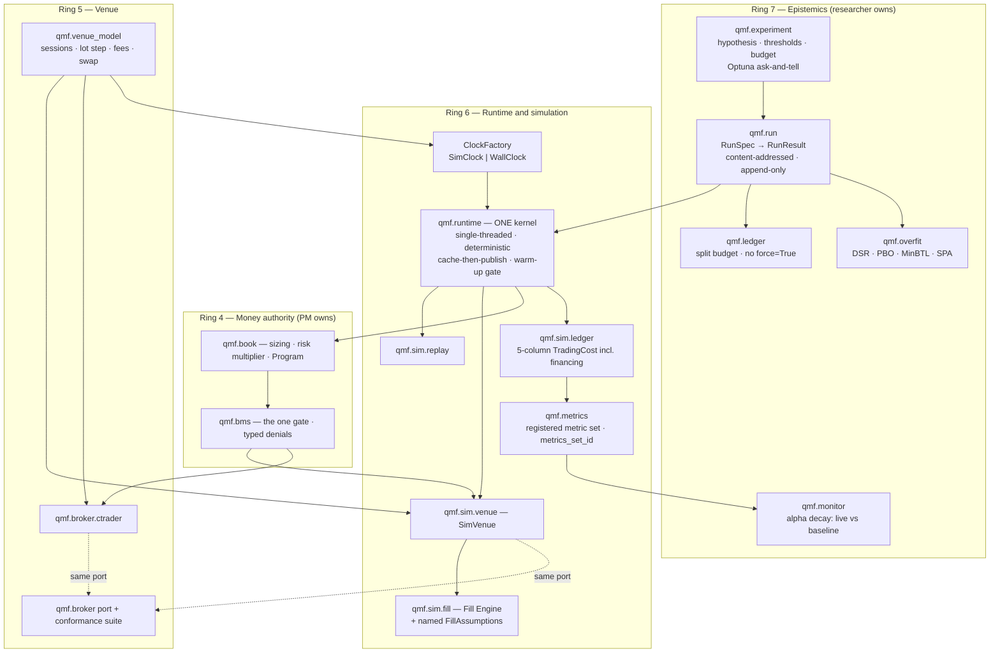
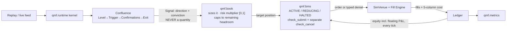

# 02 — The Backtesting Verdict (rev2)

**For:** Mubarak (operator ruling required) · **Written:** 2026-08-17 · **Status:** proposal, not adopted
**Answers:** (a) the design that satisfies every requirement, module by module in QMF terms · (b) how result-integrity is enforced against agent fabrication · (c) how a Book — including a prop-firm ruleset — plugs into a run · (d) how alpha-decay monitoring reuses the same metrics contract live · (e) your Option 1 vs Option 2, with the honest counter-case.

**What changed since rev1, and why this is a rebuild not an edit.**
Rev1 was written before `reference/studies/backtest-engines.md` and `reference/studies/nautilus-trader.md` existed, so it read the clones directly and guessed at some of the sizing. Both studies now exist and they are the primary inputs here. Eight things changed:

| # | Rev1 said | Rev2 says, on the new evidence |
|---|---|---|
| 1 | The fill engine is "a funded team over years". | Wrong, and it mattered. rqalpha's entire simulator — broker, matcher, slippage — is **under 700 lines** (`backtest-engines.md` §6 opening). The honest QMF path is **~1,500 lines across five small modules**, itemised (`backtest-engines.md` §6 Steps 1–5). The risk is not size; it is that no reference implementation exists for **retail forex** fills. |
| 2 | Nothing about warm-up. | The single best idea in backtrader is that a strategy **structurally cannot run on a half-warm indicator**, computed automatically up a tree (`backtest-engines.md` §3-1). Rev1 missed an entire family of silent bugs that will bite agent-composed confluences hardest. |
| 3 | Integrity = registered runs + framework metrics + content-addressed inputs + budget + re-execution. | There is a **sixth and cheapest** mechanism the studies handed us: refuse the *composition* at registration, before any data is loaded (zipline's `window_safe`, `backtest-engines.md` §3-2). A run that never happens cannot be fabricated. |
| 4 | Fidelity was implied, not named. | It must be **decided before code**, because it enters every stored result key and cannot be retrofitted (`backtest-engines.md` §6 Step 0). Three levels, and optimistic modes **taint** the result. |
| 5 | Cost was effectively a number. | Cost must be a **five-column structured value** (`backtest-engines.md` §3-4). This is what turns alpha-decay attribution from an investigation into a subtraction (§5.4). |
| 6 | Two environments: backtest and live. | There is a **third**, and it is free: live prices + simulated fills (`nautilus-trader.md` §MM3, `crates/adapters/sandbox/src/execution.rs`). That is precisely a prop-firm challenge dry-run. |
| 7 | "NautilusTrader is blocked by D1." | **D1 is being amended** (`reference/01-kernel-verdict.md` §(d).3): LGPL-3.0 is permitted for unmodified, separately-installed dependencies with notice. So the hybrid counter-case in §6.3 is *stronger* than rev1 admitted, and I have restated it at full strength. |
| 8 | One clock. | **Two** — wall time and business time (`backtest-engines.md` §3-5). This is not pedantry; the prop-firm daily-loss anchor is a business-day boundary in a firm-specified timezone, and getting it wrong fails a challenge on a technicality. |

---

## 0. In plain words

1. You are right that backtesting is make-or-break and right that it belongs inside QMF. There is nothing to buy: no surveyed framework has a cTrader adapter (`research/01` §Avoid 29), none models prop-firm rules at all (`research/04` §4.5), and **none of the three classic Python engines models forex properly** — no variable spread, no swap as a first-class P&L line, no weekend gap. backtrader has one overnight-interest hook and that is the only forex-shaped affordance in all three (`backtest-engines.md` §In-plain-words 10, `backtrader/backtrader/comminfo.py:258`).

2. The good news the new studies deliver: **the backtest itself is small.** Most of what those engines are made of is not the backtest — it is data storage, calendars, asset databases, plotting, CLIs and market-specific rules. Clock + order book + fill decision + ledger is under 700 lines in rqalpha (`backtest-engines.md` §6). QMF's honest number is about 1,500 lines across five modules, *given that the kernel exists* — and the kernel is decision D2, already argued in `reference/01-kernel-verdict.md`.

3. The bad news, stated up front: **the fill model is the whole ballgame, and it is the one component with no good reference implementation for retail forex** (`backtest-engines.md` §6 "The honest risk"). Budget for it to be wrong at first. The design's job is to make being wrong *visible* rather than silent.

4. Your two options are not opposites. Option 1 (build the engine) is a *component*. Option 2 (build a library, then build the engine on it, agent-proof and readable) is an *order of work*. **My recommendation is still Option 2**, with the same correction as rev1 and a sharper build order.

5. The correction: the "library" is not a third-party backtesting library. It is **QMF's own five contracts** — what a Run is, what a Result is, what a Fill Assumption Set is, what a Book is, and what fidelity a number was produced at. Those are what agents bind to and what makes fabrication detectable. The engine is then an assembly of small parts that satisfy them.

6. On *"no matter how much an agent tries, it can't fabricate the results"*: you cannot stop an agent typing a false Sharpe into a chat message. What you can do is make a bare number **worthless**. Six mechanisms, in increasing order of how many lies they catch — and the cheapest one is the newest: refuse the strategy at registration, before it ever touches data, when its composition is provably unsound (`backtest-engines.md` §3-2). A run that is refused cannot produce a number to lie about.

7. The mechanism that catches an actual liar is re-execution. Nautilus already ships it: every finished backtest becomes a **versioned, normalised JSON document with wall-clock and machine identity stripped out**, hashed with BLAKE3, plus a function that reports the *first differing field* between two such documents (`nautilus-trader.md` §MM8, `crates/backtest/src/result.rs`). An agent can lie in a sentence; it cannot make the lie survive a re-run.

8. On reading results simply: **the framework computes the verdict, not the agent and not you.** Zipline proved this is livable — a strategy there physically cannot compute its own metrics; a named, registered metric set runs on fixed lifecycle hooks (`backtest-engines.md` §3-8). Your one-page card is that, plus a PASS/FAIL computed against thresholds you registered *before* the run. §3.7 shows the actual card.

9. On "adapt to any Book": a Book is **data, not code**, and it sits *inside* the run loop, not in a spreadsheet afterwards. Three independent engines put the pre-trade gate in the loop (`backtest-engines.md` §3-11, §2.3; `research/04` §1.2). A Book graded outside the run it constrains is grading a different exam from the one the account sits.

10. Your exact prop-firm question — *"strategy X runs the evaluation stage then the funded stage on firm Y; how much does the account make over time"* — needs one concept QMF does not have yet: a **Program**, an ordered phase machine (evaluation → funded → payout → reset), run hundreds of times over different start dates. The answer is then a **distribution** — pass rate, expected payout, ruin probability, days-to-funded — not a single number. That is the right shape for a prop account and the wrong shape for a Sharpe ratio.

11. And there is a third way to run the same machine that rev1 missed: **live prices, simulated fills**. Nautilus calls it "sandbox" and builds it from the same matching engine as the backtest (`nautilus-trader.md` §MM3). For you that is a prop-firm challenge dry-run at zero risk, and it comes free from the design rather than as extra work.

12. On alpha decay: it stops being hard the moment live and backtest produce the *same kind of object*. Then decay is a comparison between two objects of one type. Your old wrinkle — "the edge was defined relative to a Book's configurable values, and Books are now plural" — is fixed by keying the baseline to `(confluence_id, book_config_hash, venue_model_id, fill_assumptions_id, fidelity, split_id, metrics_set_id)`. Change a Book value and the old baseline is *automatically* inapplicable. No human bookkeeping.

13. Rev2 adds the piece that makes decay actionable rather than merely alarming: because every fill carries **five separate cost columns** (spread, commission, slippage, financing, other), "did my edge die or did my broker get worse?" is answered by subtracting two columns — not by an investigation (`backtest-engines.md` §3-4).

14. Where I disagree with the obvious move: the obvious move is to adopt a mature engine and skip this. I still say build — but the counter-case got *stronger* while brief 01 was being written, and §6.3 states it at full strength rather than burying it.

---

## 1. Vocabulary — today's confusion, fixed

The earlier spec's `SimBroker` is **the thing that decides whether your order would have filled and at what price**. It is not a chart-replay tool for a human. Your ratified word "Simulator" (`tracker/map.md`: *"backtest engine + a Book + chosen conditions, via a UI"*) means the **product on top**. Both meanings are legitimate; using one word for both is what broke today's conversation.

The rule: **one word, one job — and the word "Simulator" never again means the fill engine.**

| Today's confusing word | Proposed name | What it is, in one sentence | Where it lives |
|---|---|---|---|
| `SimBroker` | **`SimVenue`** | The fake counterparty. Implements the same `qmf.broker` port as cTrader and passes the same conformance suite. | `qmf.sim.venue` |
| (the guts of `SimBroker`) | **Fill Engine** | The rules that turn *an order + the market* into *a fill or a refusal*: spread, touch, slippage, partial, limit clamp, latency. | `qmf.sim.fill` |
| (the knobs inside the Fill Engine) | **Fill Assumption Set** | A named, versioned, seeded, cited bundle of those rules — e.g. `fx.pessimistic@1.2.0`. Never loose constants. | `qmf.sim.fill` (registered) |
| "the simulator" (engine sense) | **Run** | One registered evaluation. "Backtest" is fine in speech; in code and artifacts there are only Runs. A backtest is a Run whose venue is a `SimVenue`. | `qmf.run` |
| the historical data pump | **Replay** | Drives the clock over stored data and hands ticks/bars to the kernel. Owns the bar-timestamp rule. | `qmf.sim.replay` |
| *(new — no word existed)* | **Paper mode** | Live prices, simulated fills. The prop-firm dry-run. Same kernel, same Fill Engine, real clock. | `qmf.runtime` wiring |
| "Simulator" (your ratified word) | **Simulator** — keep, **UI only** | Pick a bot × a Book × conditions, press go, read the card. Composes Runs; computes nothing itself. | `qmf.app` (later product) |
| FX-Replay-style human practice tool | **Chart Trainer** | Manual bar-by-bar practice for a person. **Never** a source of a recorded result. | out of QMF core |
| one strategy against many Books | **Book Matrix** | Your ratified "Bot × Book testing" — a grid of Runs sharing a `confluence_id` with different `book_config_hash`. | `qmf.run` |
| a multi-phase prop-firm lifetime | **Program** | Ordered phases (evaluation → funded → payout → reset) with transition rules. | `qmf.book` |
| many repetitions of a Program | **Campaign** | The Program run N times over start dates and seeds; output is a distribution. | `qmf.run` |

One more naming rule worth adopting from the studies: **name the heuristic and cite its evidence.** Nautilus does not call its bar-to-fill logic "the fill price"; it calls it *"a deterministic heuristic, not a reconstruction of the actual trade sequence"* and links the analysis that motivated it (`nautilus-trader.md` §MM14). Every QMF assumption gets the same treatment — a name, a version, and a `source` field.

---

## 2. (a) The design that satisfies every requirement

### 2.1 The shape: one kernel, three wirings



**The load-bearing property, and it is now a testable claim rather than a slogan.** `SimVenue` and `qmf.broker.ctrader` are two implementations of one port passing one conformance suite. There is no `Backtest` class that owns a loop. Nautilus reduces the whole backtest≡live mechanism to **155 lines** — a `ClockFactory` that returns a `TestClock` or a `LiveClock`, with no `if backtest:` anywhere in the kernel (`nautilus-trader.md` §MM1, `crates/system/src/clock_factory.rs`). Copy the shape and copy the CI test that guards it: **assert `qmf.runtime` has no import edge to `qmf.sim`.**

Three wirings of one kernel:

| Environment | Clock | Data | Fills | What it is for |
|---|---|---|---|---|
| **Backtest** | `SimClock` | Replay from the lake | Fill Engine | Research, the Book Matrix, Campaigns |
| **Paper** | `WallClock` | Live cTrader stream | Fill Engine | **Prop-firm challenge dry-run**; adapter shakedown; BMS rehearsal |
| **Live** | `WallClock` | Live cTrader stream | cTrader | The account |

Paper mode is not extra work. Nautilus's sandbox adapter implements the *same* `ExecutionClient` trait over the *same* matching engine as its backtest client (`nautilus-trader.md` §MM3). Once `SimVenue` and the clock factory exist, Paper is a config line. For a prop-firm operator it is the single most valuable of the three, because it is the only way to test the BMS against real spreads and real latency without an account on the line.

### 2.2 The five new parts, itemised

This is the shortest honest path to an industry-grade backtest capability, taken from `backtest-engines.md` §6 and adjusted for QMF's ring map. Line counts are the study's; treat them as ±40%.

| Step | Module | ~Lines | What it is, and the one thing it must get right |
|---|---|---:|---|
| **0** | *(a decision, not code)* | — | **Fix the fidelity taxonomy now** (§2.3). It enters every stored result key and cannot be retrofitted. |
| **1** | `qmf.sim.replay` + `SimClock` | ~150 | A generator of `(wall_ts, session_date, EventKind)` driven by `VenueModel.session_schedule` — **never hard-coded hours** (`backtest-engines.md` §4-D: rqalpha welded `09:31`/`11:30`/`15:00` into its event source). Event kinds: `SESSION_START`, `BAR`, `TICK`, `SESSION_END`, `SETTLEMENT`, `ROLLOVER`. The clock knows nothing about orders, strategies or data — zipline's `MinuteSimulationClock` is the model and its purity is the point. Test: a forex venue emits exactly one `ROLLOVER` per weekday and **no events across the weekend gap**. |
| **2** | `qmf.sim.venue` (`SimVenue`) | ~300 | Implements the *same* `BrokerAdapter` port cTrader will: submit/modify/cancel, `capabilities()`, `limits()`, `instrument()`, reconciliation queries, one ordered event stream. Owns the open-order book; delegates every fill decision to the Fill Engine. **Write the conformance suite first and make `SimVenue` implementation #1** — then backtest≡live parity is structural, and the riskiest component in v1 (cTrader) arrives with its acceptance criteria already written (`research/00` §Novel-2). |
| **3** | `qmf.sim.fill` (Fill Engine) | ~400 | §2.5. Everything else is scaffolding for this. |
| **4** | `qmf.sim.ledger` | ~250 | Position → Account → Portfolio, with rqalpha's three-way P&L split (`position_pnl` / `trading_pnl` / lifetime `pnl` — three questions, three fields, no ambiguity about which "P&L" a report means, `backtest-engines.md` §2.3), zipline's **returns-space** return calculation so capital injections cannot corrupt the series, and the **financing column present from the first commit** (`research/00` §Novel-8). One dirty flag; recompute at most once per bar. |
| **5** | `qmf.metrics` | ~400 | A **registered metric set** with a `metrics_set_id` in the result key (§3.2). Do not build plotting or reporting inside the framework; the research app renders the JSON. |

**Modules that already exist in the map and are amended rather than created:**

| Module | Amendment forced by the new studies |
|---|---|
| `qmf.core` | Adds the **second clock**: `wall_ts` (UTC ns) and `session_date` (which trading day this event belongs to, per the venue's schedule). `qmf.bms`'s daily anchor reads `session_date`, **never** `wall_ts.date()` (`backtest-engines.md` §3-5). One property test: `session_date` is derived only from `VenueModel.session_schedule` and `wall_ts`, never from local time. |
| `qmf.runtime` | Adds the **warm-up gate** (§2.4), the fixed three-phase per-timestamp order, **cache-then-publish** as a named invariant with a property test (`nautilus-trader.md` §MM2), a **biased drain order** in the live loop — shutdown → timers → broker events → broker commands → data, because a fill or a shutdown cannot wait behind a tick storm (`nautilus-trader.md` §MM11) — and **fresh clocks per component** so one strategy's cancelled timer cannot silently affect another (`nautilus-trader.md` §MM6). |
| `qmf.indicators` | The framework updates every registered indicator **before** the handler runs; components never call `handle_bar` themselves, they call `peek()` (`nautilus-trader.md` §MM10). And `peek()` is a genuinely separate code path from `replay()` where the two differ asymptotically — Jesse ships a dedicated scalar kernel rather than `series[-1]`, and the alternative is a quadratic-in-disguise that surfaces months later as "the VPS is slow" (`jesse.md` §MM6). |
| `qmf.venue_model` | Becomes the **only** place market structure lives: sessions, tick sizes, lot steps, rollover times, weekend gaps, price bands. The clock asks `VenueModel` what time it is allowed to emit (`backtest-engines.md` §4-D). |
| `qmf.book` | Gains **`Program`** (§4.3). Keeps sizing authority: `Signal` never carries a quantity. Keeps risk-capping to the remaining headroom against the *tightest binding* cap (`research/04` §Copy 8). |
| `qmf.bms` | Gate methods split: `check_submit(intent, state) -> DenialReason | None` **and a separate `check_cancel(...)`**, so `REDUCING` can block entries while permitting exits (`backtest-engines.md` §3-11). Denial reasons are a closed enum with a **stable SCREAMING_SNAKE leading code** and a non-canonical diagnostic tail — consumers branch on the code, never on the English (`nautilus-trader.md` §MM5). |
| `qmf.registry` | Gains registration-time refusal (§3.6) and two new manifest kinds: `FillAssumptions` and `PropFirmRuleset`. |
| `qmf.spec` | Every surface function carries a `@phase(...)` decorator naming when it may legally be called — `ON_REGISTER`, `ON_WARM`, `ON_BAR`, `ON_TICK`, `ON_FILL`, `ON_SESSION_BOUNDARY`. Cost-model and sizing setters are `ON_REGISTER`-only, which structurally prevents a strategy widening its own risk mid-run (`backtest-engines.md` §3-6; zipline's narrower version is why `set_slippage` cannot be called mid-run). |

**Two NEW modules**, unchanged from rev1 and still right:

- **`qmf.run`** — the unit of result. `RunSpec` → `RunResult`, content-addressed, append-only, registered. Owns Book Matrix and Campaign fan-out. *This is the module that did not exist and is the reason today's conversation was confusing:* there was a simulator and there were experiments, but nothing named the single evaluation in between.
- **`qmf.monitor`** — alpha decay (§5). Consumes the same metrics contract from live that it consumes from a Run.

**What NOT to build.** Each of these is present in at least one surveyed engine and each is a maintenance liability a solo operator cannot carry (`backtest-engines.md` §6): a bundle system, an asset database, a calendar library, a plotting module, a CLI framework, a mod-discovery mechanism, **a second vectorised engine**, or an optimiser. Calendars come from `VenueModel`; storage from Parquet + DuckDB; the search loop from Optuna behind `qmf.experiment`; plotting from the research app.

### 2.3 Step 0 — the fidelity taxonomy, decided before any code

This is the decision that cannot be retrofitted, because it becomes part of every stored result key.

| Fidelity | What it means | Honest use |
|---|---|---|
| `bar_close` | Order placed on bar *N* fills at bar *N+1*'s open; spread from the measured profile at that hour. | Fast screening. First Fill Engine. |
| `bar_intrabar` | Gap-vs-touch logic per bar — *"gapped through the trigger → fill at the open; touched intrabar → fill at the trigger"*. The single most-copied piece of backtest logic in Python, and it is correct (`backtrader/backtrader/brokers/bbroker.py:921-940`). Requires a declared intrabar path. | The working default once stops and targets sit inside one bar — which for a Level+Trigger+Exit strategy on M15 is *most* of them. |
| `tick` | Quote-by-quote against recorded bid/ask. | Promotion candidates. The standard a prop-firm attempt must clear. |

**Result keys become:**
`(confluence_id, split_id, data_fingerprint, qmf_version, venue_model_id, book_config_hash, fill_assumptions_id, fidelity, metrics_set_id)`

**And the taint rule, which is an integrity mechanism disguised as a config choice.** rqalpha ships `MATCHING_TYPE.CURRENT_BAR_CLOSE`, which matches orders inside the same bar the strategy just saw — and it is the *default* in some configs. backtrader has `cheat_on_open` and `cheat_on_close`. These are trapdoors (`backtest-engines.md` §4-E). QMF's rule:

> **If a mode can produce impossible fills, it is not a config value — it taints the result.** Any run using an optimistic matching mode records `fidelity: optimistic`, is **refused promotion past `measured`**, and **cannot spend split budget**.

That single rule converts the most common way a backtest lies into something that shows up on the card in red.

### 2.4 Warm-up is an engine invariant, not a strategy responsibility

This is the idea rev1 missed and the one most specific to your situation.

backtrader will not let a strategy trade until every indicator it depends on has enough history, and it works this out **by itself**, by walking the tree: a lines object takes the max of its inputs' minimum periods, a strategy takes the max over its indicators, and `next()` is routed to a *different method* (`prenext`) while short (`backtrader/backtrader/lineiterator.py:120-135, 174-176, 259-283`). Zipline generalises the same arithmetic to a DAG — each term declares extra rows needed, the plan takes the max up the graph, and the root mask is widened once (`zipline-reloaded/src/zipline/pipeline/term.py:328-355`).

Nautilus, for all its engineering, **does not have this**: its indicators expose only `has_inputs()` and `initialized()` — two booleans — and composite indicators note in *comments* that "for slowing > 1, we need additional warmup" (`nautilus-trader.md` §Avoid 5).

**Why this is a QMX emergency, not a nicety.** An LLM composing a `Confluence` from a `Level`, a `Trigger` and three `Confirmation`s **cannot be trusted to compute the combined warm-up**, and the failure is silent: the first N trades of every backtest are made on garbage, and the strategy looks better or worse than it is for reasons nobody can see.

**How QMF implements it.** `ComponentDef.warmup_bars` is declared per component (already in the ring map). `Confluence` resolution computes `warmup = max(component.warmup_bars) + max_bars_between_touch_and_trigger`. `qmf.runtime` **refuses to dispatch `on_bar`** to a confluence until `bars_seen > warmup`, and exposes a separate `pre_warm` hook for anything that needs the pre-warm bars. Making the warm path a *different method* rather than an `if` is the point: **there is no branch an agent can forget.**

### 2.5 The Fill Engine — a named, numbered pipeline whose failures are types

Fill simulation is where backtests lie, and it is the part a non-technical operator most needs to be able to read. A 160-line `_execute` (backtrader) cannot be audited. rqalpha's matcher documents its own seven steps and then executes them (`backtest-engines.md` §3-3, `rqalpha/.../matcher/base.py`). QMF's version:

```
FillModel.match(order, market_state) -> Fill | NoFill(reason)

  1. reference price          (from the declared intrabar path or the quote)
  2. spread application       (measured per-pair-per-hour distribution — NOT a constant)
  3. tradeability / session   (may return NoFill: OUTSIDE_SESSION, NEWS_BLACKOUT, SPREAD_TOO_WIDE)
  4. liquidity cap            (may return NoFill: NO_LIQUIDITY; shared budget across competing orders)
  5. slippage draw            (seeded; may return "no price exists" rather than inventing one)
  6. limit clamp              (FRAMEWORK-APPLIED, after the model returns — a model cannot opt out)
  7. cost application         (TradingCost, five columns — §2.6)
  8. fill, partial fill, or defer to the next bar
```

Four properties, each with a citation and each closing a known way engines lie:

- **Slippage must be allowed to say "no fill."** A fill model that always fills is a fill model that lies, and it lies hardest exactly where the strategy is most fragile — news spikes, session opens, thin hours. backtrader's slip functions return `None` when the slipped price is outside the bar; zipline raises `LiquidityExceeded` (`backtest-engines.md` §3-9). QMF returns `NoFill(reason)` with a typed code, **and reports the counts**: a backtest that fills 100% of its orders in the hostile hours is visibly suspect.
- **The limit clamp is applied by the framework, not the model.** rqalpha gets this wrong — a buy limit at 100 can execute at 100.05 because slippage is applied *after* the limit check (`backtest-engines.md` §4-F). zipline makes `fill_price_worse_than_limit_price` a mandatory call inside every model (`zipline-reloaded/src/zipline/finance/slippage.py:47-77`). QMF applies it centrally so a model **cannot** breach a limit price even by mistake.
- **Return both a price and a size**, so partial fills are the default case rather than a special case (zipline's `process_order -> (price, volume)`), and maintain the bar's liquidity budget in the *base class* so competing orders share it.
- **Ship a `PessimisticFillModel` alongside the realistic one.** This is rqalpha's `LimitPriceSlippage` idea generalised — always the worst plausible price, always the smallest plausible fill (`backtest-engines.md` §6 Step 3). **Every promotion candidate runs under both. A strategy whose edge survives only the optimistic model is not a strategy.** This is the cheapest robustness check in the entire design and it costs one extra run.

**Failure modes are three types, not booleans** (`backtest-engines.md` §3-3): *not matchable* → order stays active, try next bar; *rejected* → terminal; *cancelled* → terminal. These map one-to-one onto `qmf.broker`'s `outcome ∈ {ACCEPTED, REJECTED, DENIED_LOCALLY, UNKNOWN}`, so simulated rejections and live rejections speak one language and the conformance suite tests both implementations with one set of assertions.

**And the forex gap that nobody fills for us.** All three classic engines were built for markets QMX does not trade. Forex needs variable spread by hour and event proximity, weekend gaps, swap/financing as a P&L line, partial-lot rounding to the venue's step, and margin per instrument. Only backtrader has *any* of these, and only the interest one (`backtest-engines.md` §6 Step 3). **This is where QMF must exceed all references, and it is the honest risk in §6.3.**

### 2.6 Cost is a five-column structured value, never a float

```python
@dataclass(frozen=True)
class TradingCost:
    spread: Decimal
    commission: Decimal
    slippage: Decimal
    financing: Decimal      # forex swap ≡ crypto funding
    other: Decimal
    @property
    def total(self) -> Decimal: ...
```

rqalpha has the best-shaped cost interface of the three engines — `TransactionCost(commission, tax, other_fees)` with `.total` and `.zero()`, produced by a decider registered per `(instrument_type, market)` (`backtest-engines.md` §3-4). QMF extends it to five columns because forex needs spread and financing broken out.

Why this is not bookkeeping pedantry:

1. If `cost` is one float, you can **never** later answer *"how much of this strategy's decay is spread and how much is commission?"* — which is exactly the question §5.4 must answer, and exactly the question the slippage-calibration loop needs (`research/00` §Novel-4).
2. Registration-time refusal of confluences whose edge is smaller than their spread (`research/00` §Novel-3) then **reads one field** instead of re-deriving it.
3. Financing must be there **from the first commit**. Retrofitting it touches the ledger, every report, and every stored result (`research/00` §Novel-8). It costs one column now and a migration later.

The ledger stores all five columns per fill. `qmf.metrics` reports `edge_gross`, `edge_net`, and the four deductions separately.

### 2.7 Two clocks — and why this one fails a prop-firm challenge if you get it wrong

rqalpha carries `calendar_dt` (wall time) and `trading_dt` (which trading day this event belongs to) on **every** event, because a 21:00 futures night-session bar is wall-clock Monday but business-day Tuesday (`backtest-engines.md` §3-5). Zipline's version is `get_adjusted_value(..., dt, perspective_dt)` — event time and knowledge time, in a 2013 codebase.

Forex has the same discontinuity three times over: the 17:00 New York rollover, the Sunday open, and — critically — **the prop-firm daily-loss anchor, which is a business-day boundary in a firm-specified timezone.** FTMO recalculates at 00:00 CE(S)T, a *moving* offset (CET/CEST). Topstep's session runs 17:00–15:10 CT. Nautilus snapshots equity at **UTC** midnight (`research/04` §Avoid 5).

Get this wrong and a challenge fails on a technicality that no backtest showed. `qmf.core.Clock` exposes both; `qmf.bms` reads `session_date`; one property test asserts `session_date` is never derived from local time.

### 2.8 What "standard and industry-grade" means, concretely

This is the acceptance checklist. Every line is a real trap somebody else hit, with a citation. **If the engine does not do these, it is not industry-grade regardless of how good the numbers look.**

**Time and ordering**
1. A bar's `known_at` is its **close**, never its open — or a complete bar becomes visible before it formed. Nautilus states this as a rule with the failure mode attached and tells adapter authors to verify on a sample (`nautilus-trader.md` §MM7). `Bar` construction *refuses* a `known_at` earlier than `ts_event + interval`.
2. Market data is processed by the venue **before** the strategy sees it, so resting orders match against the new market first. All three classic engines independently landed on this (`backtest-engines.md` §2.1, §2.2, §2.4).
3. Cascading commands settle **within the same timestamp** — a stop submitted from `on_order_filled` must not silently land one tick late.
4. **Total event ordering** is defined and stable: timestamp → event-type priority → stable instrument key → monotonic sequence. Never rely on dict, set, `groupby` or multi-threaded query order (`research/09` §12.3.5).
5. Two clocks (§2.7); per-component timer registries (`nautilus-trader.md` §MM6).

**Fills and costs**
6. The intrabar path is a **declared, versioned assumption**, not an accident — and it is named honestly as a heuristic (`nautilus-trader.md` §MM14).
7. Fill assumptions are named objects with a seed and a `source`, not magic constants.
8. Slippage may refuse to fill, and may **never** breach a limit price — clamp applied by the framework (§2.5).
9. Costs are complete: spread, commission, slippage, **financing**, other — five columns, and lot-step rounding **down** (§2.6, `research/04` §Copy 7).
10. Partial fills are native, with a per-bar liquidity budget shared across competing orders.
11. Every order carries its own **fill audit trail** — `Order.fills: tuple[Fill, ...]`, each with `venue_exec_id`, provenance, price, quantity and `TradingCost`. Reconciliation is then a set difference on `venue_exec_id`, and *the simulator produces the same structure*, so the reconciliation code path is exercised by every backtest rather than only in production (`backtest-engines.md` §3-14).

**Warm-up and composition**
12. Warm-up is computed automatically and enforced by dispatch, not documented (§2.4).
13. A component built out of a lookahead component **is** a lookahead component, and the check runs at registration before any data is loaded (§3.6).

**Results and determinism**
14. Metrics are computed by the framework from the ledger, never by the strategy, from a **named registered set** with a `metrics_set_id` (`backtest-engines.md` §3-8).
15. The result is a **versioned canonical document with a digest**, identities normalised, and divergence between two results is machine-locatable (`nautilus-trader.md` §MM8).
16. Determinism is tested in CI: 1 worker vs N workers bit-identical; DuckDB `SET threads = 1` for any metric query (its own manual documents `stddev` — the Sharpe denominator — varying across threads); BLAS/OpenMP thread counts pinned and recorded (`research/09` §12).
17. Repeat runs work without a process restart, with an explicit statement of what `reset()` clears.
18. **No `pickle` anywhere in the result path.** rqalpha pickles its whole result dict — version-fragile, unreadable without the code, a deserialisation hazard (`backtest-engines.md` §4-H). Versioned JSON plus Parquet for frames.

**Operational honesty**
19. State that is not yet valid **explodes informatively**. `NotYet(name, available_after)` rather than `None`, so a 3am VPS debug reads *"attempted to access `.returns`; not set until `handle_start_of_simulation`"* instead of `AttributeError: 'NoneType'` (`backtest-engines.md` §3-12).
20. Components have a lifecycle FSM with a **`DEGRADED`** seat — "market data is stale but orders still work" needs somewhere to live other than a boolean and a log line (`nautilus-trader.md` §MM13).
21. Adapter conformance is a **rule table with earned exceptions**: any venue-forced workaround must be named, contained inside the adapter, and covered by a test that **fails when the venue stops requiring it** (`nautilus-trader.md` §MM12). That converts "we had to hack it for this broker" from technical debt into a self-expiring test.

---

## 3. (b) Result integrity — how an agent is stopped from fabricating

Six mechanisms, ordered by how early they act. The first is new in rev2 and is the cheapest of all, because it prevents the run rather than auditing it.

### 3.1 Refuse the composition at registration, before any data is touched

Zipline has a correctness property that **composes automatically and is checked at graph construction**: a term is `window_safe` or not; composite terms compute theirs from their inputs; and using a non-window-safe term as input to a windowed term raises `NonWindowSafeInput` — *before any data is loaded* (`backtest-engines.md` §3-2, `zipline-reloaded/src/zipline/pipeline/term.py:96`, `errors.py:495-503`).

That is the general form of every rule in the QMF ring map that is currently a documentation paragraph. Make them all mechanical:

| Property | Composition rule | Refusal |
|---|---|---|
| `causality ∈ {filtered, predicted}` | A Confluence's causality is the **worst** of its parts | `smoothed` is **not constructible** for a live-bound component → `CausalityViolation` |
| `stability` (TA-Lib's four classes) | Worst of its parts; `path_dependent` warned loudly | Registration refuses a live component built on an unstable one |
| `warmup_bars` | `max(parts) + max_bars_between_touch_and_trigger` | Dispatch refuses until warm (§2.4) |
| `evidence_state` | Worst of its parts | A `hypothesis`-grade part makes the whole confluence `hypothesis`-grade, visibly |
| **edge vs spread** | Median winner at the traded hours vs p90 spread cost | A confluence whose edge is smaller than its spread **cannot be registered**, is never backtested, and therefore **never spends split budget** (`research/00` §Novel-3) |
| **no-lookahead** | — | Property test at registration: replay the component over `bars[0:t]` and `bars[0:t+n]` and assert equal labels at index `t` (`research/00` §Novel-1) |

The last one is the single defence against an agent reproducing the `smartmoneyconcepts` lookahead at 3am — the library where a user measured backtest profit factor falling from **7.32 to 1.82** once future-candle reads were removed, known for two years and still unfixed (`research/00` §In-plain-words 8). It costs one afternoon and it runs as a **precondition of registration**, not as a report.

> Zipline proves the pattern works: one flag, one composition rule, one exception class, and the entire family of bugs is gone.

### 3.2 Framework-computed metrics — the agent never holds the arithmetic

The strategy/agent cannot compute a metric and cannot pass one in. `qmf.metrics` reads the ledger and runs a **named, registered metric set**.

- Zipline's design is the proof this is livable: metrics are a *registry of sets*; each metric is a small object implementing any subset of five hooks (`start_of_simulation`, `start_of_session`, `end_of_bar`, `end_of_session`, `end_of_simulation`); the `default` set is a literal `set()` of ~30 tiny objects; and the registry is exposed through a `mappingproxy` so it cannot be mutated accidentally (`backtest-engines.md` §3-8).
- **The registry gives the contract a version for free.** `metrics_set_id` becomes part of the result key. Change the statistics, get a new id, and **old stored results do not silently become claims about the new definitions** — the same non-rotting property the confluence hash provides. The registry is itself content-hashed so an unrecorded edit is detectable.
- The return type has **no naked float**. The metric is only reachable through an object that also carries `n_trials`, `n_trials_cumulative_on_split`, DSR, PBO, MinBTL-vs-actual and the verdict (`research/09` §14.3.4).

> Ratify verbatim: **A Sharpe ratio is not a result. A Sharpe ratio plus the number of effective trials that produced it is a result. QMF will refuse to emit the former.** (`research/09` §Recommendation.)

### 3.3 Registered runs — a result that is not a Run does not exist

`qmf.run.execute(RunSpec) -> RunResult` is the **only** producer of a result. `run_id = sha256(canonical_json(RunSpec))`. Records are append-only; superseding is a new record with a `supersedes` pointer; deleting is impossible — because deleting failed runs is how a trial count gets laundered, and **failed runs are the denominator** (`research/09` §11.2).

An agent's tool call returns `{run_id, digest, verdict, card}`. It does not return, and cannot construct, a bare metric.

Prior art, weak and strong:
- **Weak (prompt-level, already shipping):** Jesse's `agent_rules.md` is a written agent constitution with one rule per known failure mode — *never invent missing results*, never work around a broken tool by hand-editing config, never skip the mandatory Monte-Carlo and significance checks, always surface the dashboard link (`jesse.md` §MM5). It is genuinely good and it is the state of the art in shipped products. It is also prose.
- **Strong (what QMF adds):** the receipts are **checkable**, not merely mandatory (§3.5).

### 3.4 Content-addressed inputs — every claim names exactly what it was computed from

`RunSpec` is a closed set of ids, each a content hash or a registry version:

| Field | Why it cannot be omitted |
|---|---|
| `confluence_id` | `sha256` over the resolved spec **including every component's semver** — redefining what `OrderBlock` means bumps the hash, so old results do not silently become claims about the new definition (`research/00` §Confluence identity). Zipline does the same at component level: terms are content-addressed via `_static_identity`, so two identically-constructed terms *are the same object* (`backtest-engines.md` §2.2). |
| `split_id` + `split_registry_version` | The only permitted way to name data. Raw dates do not exist in the signature. |
| `data_fingerprint` | Per-partition content hashes of what was actually read. Guards against silent data revision — Jesse's candle store supports `on_conflict='replace'`, overwriting historical OHLCV in place (`jesse.md`). |
| `book_config_hash` | The money rules are part of the result, not context around it (§4). |
| `fill_assumptions_id` | A run under optimistic fills is a **different claim** from the same run under pessimistic fills. |
| **`fidelity`** | New in rev2. An optimistic run is tainted and cannot be promoted or spend budget (§2.3). |
| **`metrics_set_id`** | New in rev2. Which arithmetic produced these numbers (§3.2). |
| `venue_model_id` | Lot step, fees, swap, sessions, weekend gaps. |
| `qmf_version` + git SHA + **dirty flag** | A commit SHA on a dirty tree is a lie; refuse to run or capture the full diff (`research/09` §11.2). |
| `seeds`, `thread_pins`, `env_lock_hash` | "Same seed" is only a reproducibility claim *conditional on* a pinned NumPy version (NEP 19) and pinned thread counts (`research/09` §12). |

### 3.5 Re-execution and the canonical digest — the one that catches a liar

Because a Run is content-addressed and deterministic, **any claimed result can be recomputed and compared.** QMF stores a canonical result document plus its digest and ships `verify(run_id) -> Ok | Divergence{json_pointer, expected, actual}`.

This is not speculative. Nautilus ships it (`nautilus-trader.md` §MM8, `crates/backtest/src/result.rs`):

- A declared schema version (`nautilus-backtest-result/v1`).
- Sorted keys; "unordered" arrays sorted.
- **All random identities normalised** — client order IDs, venue order IDs, trade IDs, event IDs, position IDs replaced by class-prefixed ordinals.
- A `blake3:` digest over the exact bytes.
- The reader **re-canonicalises and rejects** bytes that were not already canonical — so a hand-edited document fails to load rather than loading as truth.
- `first_divergence()` reports the first differing field.
- Wall-clock and machine identity are **excluded** from the canonical document, so two honest runs on two machines produce the same digest.

Two consequences worth naming:

1. **An agent can lie in a sentence, but it cannot make the lie survive a re-run** — and because the divergence report names the first differing field, a mismatch is a debugging pointer rather than an argument.
2. It is also **the cheapest possible regression test for the kernel.** Freeze one golden backtest's digest in CI; any accidental change to ordering, timers, or fill logic is caught instantly. That is worth building even if nobody ever lies.

### 3.6 The budget ledger — the search cannot outrun the evidence

Every Run writes a ledger row **before it returns**, because a crashed run that saw the data has still spent the budget. Budget is *derived* from MinBTL rather than chosen, spent in *effective* trials via `N̂ = ρ̂ + (1 − ρ̂)·M`, and exhaustion raises `SplitBudgetExhausted` with **no `force=True`** (`research/09` §14.4).

At your ratified `SR* = 2.0` for prop books, a five-year split allows roughly 1,600 effective trials; at `SR* = 1.0` it allows **45** (`research/00` Decide-next B.7). Try a million variations of a worthless strategy and the best shows a Sharpe of **4.87** (`research/09` §1). **This is the mechanism that makes an agent's enthusiasm harmless.**

Two traps rev2 flags explicitly:
- **The Book Matrix must not launder the trial count.** Twelve Books × 500 parameter trials is 6,000 trials against that split, not 500. Sequential per-space searching hides this in Freqtrade and must not hide it here (`research/09` §9.2).
- **Runs refused at registration (§3.1) never enter the denominator**, because they were rejected by a *rule*, not selected by a *metric*. Runs refused by a **Book path constraint** are the genuinely arguable case and need your ruling (§7.10).

### 3.7 What you actually read — the one-page card

The point of all of the above is that this card is **computed by the framework** and cannot be assembled by an agent. Mock-up:

```
RUN  a3f9c1…  ·  VERDICT: FAIL  (2 of 6 gates)
────────────────────────────────────────────────────────────────
STRATEGY   confluence  level.order_block@2.1.0 + trigger.engulf@1.0.3 + 2 confirmations
           evidence    hypothesis  (SMC has no peer-reviewed support — research/06 §1.4)
DATA       split       oos.2021H2.eurusd     budget used  38 / 45   ███████░░
           fingerprint 7c21…  (1.4M ticks, 3 partitions)
ASSUMPTIONS fidelity   bar_intrabar          fills  fx.pessimistic@1.2.0
           venue       icmarkets.ctrader@0.4  book  ftmo.2step.eval@1.1.0
────────────────────────────────────────────────────────────────
RESULT     net return        +6.4%        trades      112
           Sharpe            1.82         DSR         71%   ✗  (need ≥95%)
           PBO               0.38         PBO slope   +0.11 ✓
           MinBTL @ SR*=2.0  2.6 yr vs 5.0 yr actual   ✓
           max drawdown      4.1%         worst day   −2.2% ✓
COSTS      gross edge  +11.9%   spread −3.1%  commission −0.9%
                                slippage −1.2%  financing −0.3%
FILLS      filled 104 · partial 6 · NO FILL 12
           └ SPREAD_TOO_WIDE 9 · OUTSIDE_SESSION 3
BOOK       binding constraint on 4 days: DAILY_LOSS_HEADROOM (size cut to 42%)
           denials: DAILY_LOSS_CAP_REACHED ×1, SESSION_CLOSED ×3
────────────────────────────────────────────────────────────────
FAILED GATES   DSR 71% < 95%   ·   pessimistic-fill edge +1.1% < +2.0% floor
verify: qmf verify a3f9c1…      digest blake3:9d4e…
```

You should be able to answer *"is this good or bad?"* from the two lines at the bottom, and an agent should be able to answer it from the same JSON. Everything above them is the receipts.

### 3.8 Honest limits of all six mechanisms

- **None of this stops an agent writing a false summary in prose.** It makes the prose worthless without a `run_id`, and QMF's report renderer must **refuse to render a card for an unregistered run**.
- **Re-execution costs compute.** Verify on promotion, on a random sample, and on every run an agent cites in a recommendation — not on all of them. That is a compromise, not a guarantee.
- **Cross-machine determinism is hard.** The defensible standard is bit-identical within a pinned environment and tolerance-identical (e.g. 1e-9 on metrics) across environments, with the tolerance asserted in CI (`research/09` §12 Honest caveat). **You need to rule on which standard QMX commits to.**
- **Integrity does not imply fidelity.** A perfectly reproducible, fully-registered, digest-verified result computed by a fill model that does not match your broker is a perfectly reproducible wrong answer. Nautilus concedes this about its own best-engineered path: bar-based execution is *"a plausible intrabar path"* on a *"deterministic heuristic"* whose motivating analysis *"does not establish a general accuracy rate"* (`nautilus-trader.md` §Avoid 7). **The slippage-measurement loop (§5.4) is not a nice-to-have; it is the missing half.**

---

## 4. (c) How a Book — including a prop-firm ruleset — plugs into a run

### 4.1 The Book is in the loop, not in a spreadsheet afterwards



Three properties are non-negotiable, each on evidence:

1. **The gate runs inside the simulation loop.** Three independent engines do this: rqalpha's `AbstractFrontendValidator` chain, zipline's `TradingControl`/`AccountControl` validated once per order with account controls at session end, Nautilus's `RiskEngine` as a component of *every* system including backtest (`backtest-engines.md` §2.2, §2.3, §3-11; `research/04` §1.2). Freqtrade's `MaxDrawdown` protection looks only at **closed** trades and is therefore structurally unable to model any real prop-firm rule (`research/04` §1.4).
2. **Prop-firm rules are evaluated on mark-to-market equity including floating P&L, tick by tick.** All three firms surveyed do this. Topstep's own worked example liquidates on an unrealised $47,750 against a $48,000 limit even though the final realised balance was $48,050 — *"The breach happened first."* (`research/04` §4.2.)
3. **The same rule-evaluation core runs as backtest gate, Paper guard and live guard**, with a safety buffer that trips at ~80% of the firm's cap (your ratified D8). One core, three contexts.

**Denials speak a machine language.** `check_submit(intent, state) -> DenialReason | None` — returning a reason *is* the denial, and its content *is* the explanation (rqalpha's shape, `backtest-engines.md` §3-11). The reason is a closed enum with a **stable leading code** and a diagnostic tail that consumers must never parse (`nautilus-trader.md` §MM5): `DAILY_LOSS_CAP_REACHED`, `TOTAL_DRAWDOWN_CAP_REACHED`, `TRAILING_THRESHOLD_BREACHED`, `SESSION_CLOSED`, `BOOK_LOCKED_UNTIL`, `SPREAD_TOO_WIDE`. **Cancels go through a separate door**, so `REDUCING` blocks entries while permitting exits.

**And a dry-run mode for a new ruleset**, lifted from zipline's `on_error="log"` (`backtest-engines.md` §3-11): run the gate, record everything it *would* have blocked, block nothing. That is how you validate a newly-written FTMO ruleset against last year's live trades before trusting it.

### 4.2 The prop-firm ruleset is a registered manifest, not code

Six axes, derived from the three firms' own pages (`research/04` §4.4). **Any schema missing one of these will mis-model a real firm:**

| Axis | Values that must be expressible |
|---|---|
| **Anchor** | initial capital · prior-day-boundary balance · highest prior day-boundary balance · running intraday peak **including unrealised** |
| **Measure** | equity incl. floating P&L, swaps, commissions · net P&L realised + unrealised · balance incl. unrealised — **all three are floating-inclusive; none is closed-trade-only** |
| **Cadence** | static · end-of-day recalculation with real-time monitoring · continuous real-time |
| **Day boundary / tz** | 00:00 CE(S)T (a *moving* offset) · 17:00–15:10 CT session · none. Read from `session_date`, never `wall_ts.date()` (§2.7) |
| **Ratchet & lock** | never decreases · **can** decrease (FTMO's daily limit is anchored to yesterday's balance, so it moves *down* after a losing day) · locks at start balance · locks at start+$100 or at profit target, **provider-dependent** · full reset on payout |
| **Breach action** | liquidate + permanent fail · flatten + cancel + block until next session, **not a violation** · eligibility gate only, no liquidation (FTMO's Best Day Rule) |

Plus, mandatorily: **`source_url` + `retrieved_on`.** All three firms' pages changed within four months of the research date. A ruleset without a retrieval date will silently model a rule that no longer exists.

Steal Topstep's vocabulary directly — breach action ∈ `{do_nothing, liquidate, liquidate_and_block}`, trailing method ∈ `{unrealized, realized}`. It was arrived at by a firm with millions of accounts (`research/04` §Copy 6).

**Durable state, reconciled at startup.** Peak equity, day-anchor balance, lock-until timestamps and cumulative day P&L must survive a VPS restart and must be **re-derived from the broker's own history**, not trusted from a local file. This is the defect in *every* framework surveyed — LEAN's drawdown model keeps `portfolio_high` in memory only, so a restart silently resets the baseline (`research/04` §5, §Copy 12). The mechanism exists in prior art: an append-only event store as the durable authority with the cache as a write-through projection (`nautilus-trader.md` §MM9), plus replay of the venue's order and trade history deduplicated by execution id (`backtest-engines.md` §2.3, rqalpha's `Account.fast_forward`).

### 4.3 Your exact question: evaluation stage, then funded stage, on firm Y, over time

One Run answers *"what happened on one attempt starting on one date."* Your question is about a **lifetime**, and a lifetime is a distribution. Two concepts close the gap.

**`Program`** (in `qmf.book`) — an ordered phase machine:

```
Program{ program_id, ruleset_id, phases: [Phase, ...] }

Phase{ name, book_config, pass_condition, fail_condition,
       on_pass: next_phase | payout_and_reset,
       on_fail:  terminal | retry_with_fee | block_until_next_session,
       fee, payout_split, min_trading_days }
```

FTMO 2-Step instantiates as: **Challenge** (10% target, 5% daily loss, 10% *static* max loss, ≥4 trading days) → **Verification** (5% target) → **FTMO Account** (no target; on payout, *"the Maximum Loss Limit fully resets, returning the first-day limit to 90% of the Initial Simulated Capital"*) (`research/04` §4.1). Topstep's Daily Loss Limit is why `on_fail` needs a non-terminal branch: *"Triggering it is not a rule violation — it's a forced break for the rest of that session."*

**`Campaign`** (in `qmf.run`) — the same Program executed N times across start dates and seeds, each repetition an ordinary Run chain. The output *is* the answer to "how much does the account make over time":

| Reported number | Why this and not Sharpe |
|---|---|
| pass rate per phase | Determines whether you ever get funded at all |
| breach rate **by rule, naming the binding rule** | Tells you *which* rule kills you — daily cap, trailing, or the consistency gate |
| E[net payout], and p05 / p50 / p95 | The distribution, not the average alone |
| ruin probability (never reaching funded) | Downside honesty |
| expected days-to-funded, expected fees paid | The real cost of the attempt |
| **worst-fold** path metrics, not average | Prop rules are evaluated on the worst day, not the mean day (`research/09` §14.6) |

Two supports and one warning:

- **Supported, cautiously, by the only prior art that exists.** `gabrielee5/prop-firm-simulator` (MIT, 0 stars) is a Monte Carlo EV analyser rather than a rule engine and collapses all six axes into two static percentages — but its *framing* is right. Its claim that a zero-edge strategy can pass many firms' challenges often enough to be EV-positive is exactly why a prop Book must be judged on **pass probability and EV per attempt**, not on Sharpe. That claim is one author's unreviewed simulation; reproduce it before relying on it (`research/04` §4.5).
- **Paper mode is the rehearsal.** Before a Campaign result buys a challenge, run the same Program in Paper (live prices, simulated fills) for the length of one evaluation phase. That tests the ruleset, the anchor timezone, the reconciliation and the buffer against real spreads at zero risk — and it is free from the architecture (§2.1).
- **Warning:** the Program/Campaign machine has **no working prior art**. It is the only genuinely unproven part of this design (§6.3.5).

### 4.4 The Book Matrix

A grid of Runs sharing one `confluence_id` with different `book_config_hash` — scalping vs swing sizing, evaluation vs funded, firm A vs firm B, personal capital vs prop. Cheap, because Runs are content-addressed: an identical key returns the cached result instead of recomputing.

The card shows one row per Book **with the binding constraint named** — the way pysystemtrade labels its risk-overlay columns `["jump vol", "normal", "shock correlation", "leverage"]` so an operator can read *why* size was cut (`research/04` §Copy 4). And a portfolio risk multiplier in [0,1] computed as `min()` over independent limit checks degrades gracefully instead of switching binary on and off.

The trial-count trap from §3.6 applies here and must be enforced in the ledger, not remembered.

---

## 5. (d) Alpha-decay monitoring on the same metrics contract

### 5.1 Why this is now easy

Because live and backtest write the **same ledger row shapes** into the **same** `qmf.metrics` contract, decay is a comparison between two objects of one type rather than a bespoke report. The trader's runtime *is* the researcher's runtime (`research/00` §Three correlations). This is a direct dividend of §2.1: one kernel, three wirings.

### 5.2 The Baseline — and the fix for your old wrinkle

You flagged that the old QML feature was complicated because "edge" was defined relative to a Book's configurable values, and Books are now plural. The fix is to stop treating the baseline as a property of the strategy:

```
Baseline{
  baseline_id = sha256(confluence_id, book_config_hash, venue_model_id,
                       fill_assumptions_id, fidelity, split_id, metrics_set_id),
  reference_run_id,
  bands,                      # p05 / p25 / p50 / p75 / p95 equity + metric paths
  expectancy_per_trade, hit_rate, avg_R, avg_hold_bars,
  assumed_cost_profile,       # the 5 columns, per hour bucket
  assumed_fill_rate, assumed_nofill_reasons
}
```

Change a single Book value → `book_config_hash` changes → `baseline_id` changes → the old baseline is **automatically not applicable.** No human has to remember. QMF re-derives it by executing the reference Run, which is usually a cache hit. Plural Books stop being a problem because a baseline was never per-strategy; it is per **(strategy × Book × venue × assumptions × fidelity × data × metric definitions)**.

Note `metrics_set_id` and `fidelity` are in that key, both new in rev2. Without them, changing the Sharpe definition or the intrabar path silently redefines "decay".

### 5.3 Compare against a band, not a number

A single backtest Sharpe is one draw. Comparing live to it produces arguments, not decisions.

The reference Run also stores **resampled scenario percentiles**. Jesse's candle-perturbation Monte Carlo (moving-block bootstrap, Gaussian noise, Gaussian resampler) with its plain-language verdict table is the cheapest working version and needs no closed-form statistics (`jesse.md` §MM4): `original > best_5` ⇒ *overfit, do not trust*; `original ≈ median` ⇒ good; `original < median` ⇒ conservative, good.

Jesse also keeps **two Monte Carlo questions explicitly separate**, and QMF should copy that split exactly (`jesse.md` §MM4):
- **Candle-perturbation MC** — perturbs the *price path* and re-runs the strategy. Answers *"is this overfit to this exact history?"* → feeds `qmf.overfit` and the decay bands.
- **Trade-reorder MC** — reshuffles the *order* of already-realised trades. Answers *"how bad could the drawdown path have been?"* → feeds `qmf.bms`'s prop-firm ratchet checks. Documented as carrying **zero** information about overfitting, since win rate and return are invariant to trade order.

Then the decay statement becomes readable: **"Live equity has been below the reference run's 5th-percentile path for 14 trading days."** That is a sentence with a probability behind it.

### 5.4 Separate the three causes — and rev2 makes two of them a subtraction

This is what makes the feature worth rebuilding rather than just alarming you. **Because every fill carries five cost columns and every refusal carries a typed reason, two of the three causes are read directly off the ledger rather than inferred.**

| Cause | Test | What it means | Action |
|---|---|---|---|
| **Cost / fill decay** | Subtract: realised `spread`/`slippage`/`commission`/`financing` per hour bucket **minus** the baseline's assumed profile. Plus: realised fill rate and `NoFill` reason counts vs assumed. | The edge may be intact; the broker, the hour, or your latency got worse. | **Recalibrate `FillAssumptions` from measured live slippage, bump its version, re-run the baseline, re-check.** This is the slippage loop (`research/00` §Novel-4): backtest fidelity becomes a *measured, improving quantity* rather than a constant somebody guessed once. It also puts a number on what the news-blackout gate is worth. |
| **Signal decay** | Per-trade error = realised R − baseline expectancy, fed to a change detector; trigger hit-rate vs baseline hit-rate. | The rule itself stopped working. | Demote in the registry (`live → retired`, with `supersedes`), propose a replacement. **Never auto-retrain, never auto-deploy.** |
| **Regime / context** | `MarketView` novelty and staleness; `tradeability` score at the traded hours. | Conditions moved outside what the strategy was measured in. | `qmf.bms` → `REDUCING`. Wait rather than rebuild. |

**Backtest-vs-live fill divergence becomes a tracked number in its own right** — none of the three classic engines does this (`backtest-engines.md` §6 "Then close the loop"). Report it on every live day: fill rate, mean adverse slippage, `NoFill` counts by reason, and the delta against the assumption set the baseline used. That single row is the difference between a backtest capability and backtest theatre.

Detector choice: **`river.drift` only** — ADWIN, PageHinkley, KSWIN — BSD-3, 1.4 MB, three dependencies, small enough for the trading VPS. Reject `river`'s online *learning*; reject `evidently` on the VPS (26 dependencies, telemetry on by default) (`research/08` §8.1).

**The sequencing insight, and it is free:** you do not need a detector today; you need the data that makes decay detectable later. An append-only per-trade and per-prediction log — with `realised_outcome` written later and nullable at write time — turns every future decay question into a query. Zero dependencies, zero runtime cost beyond an append (`research/08` §8.2). **Ship the log now; add ADWIN when there are outcomes.**

### 5.5 What the monitor is allowed to do

It writes a verdict, feeds `qmf.bms` (warn → `REDUCING`, breach → `HALTED`), and updates the registry promotion state. **It never re-sizes, never retrains, never deploys.** Hummingbot's shipped rule, adopted verbatim as QMF policy: the agent may propose configuration; **safety limits are user-only and never agent-writable** (`research/01` §Copy 14).

---

## 6. (e) The recommendation, and the honest counter-case

### 6.1 Recommendation: your Option 2, with one correction and a fixed build order

**Option 2 — build the library, then build the engine on it — with the correction that the "library" is QMF's own contracts, not a third-party backtesting library.**

Five contracts, in this order, and nothing else first:

1. **`RunSpec` / `RunResult` + the canonical result document and digest** (`qmf.run`). Nothing can produce a result except a registered Run.
2. **The metrics contract** (`qmf.metrics`): registered metric set, `metrics_set_id`, four input shapes, framework-computed, verdict included, **no naked float**.
3. **The `FillAssumptions` manifest and the fidelity taxonomy** (`qmf.sim.fill`): assumptions named, versioned, seeded and cited — and fidelity fixed — *before a single fill rule is written*, because both enter every result key.
4. **The registration gate** (`qmf.registry`): causality/stability/warm-up composition rules, the no-lookahead property test, the edge-vs-spread refusal. The cheapest integrity in the design (§3.1).
5. **The Book seam** (`qmf.book` / `qmf.bms`): `Signal` carries no size; one gate with a separate cancel door; rulesets are data with `source_url` + `retrieved_on`.

Then the engine as a thin assembly — Replay + `SimVenue` + Fill Engine + Ledger on the one kernel — adding §2.8's checklist one line at a time.

**Why this order:**

- **The contracts are the product.** The fill engine is replaceable; a stored result whose provenance was never captured is permanently worthless. You can improve a crude fill engine next month and re-run everything, because every Run names its inputs. **You cannot retrofit provenance onto results that already exist.**
- **It is the only order that lets agents work at all.** Agents bind to `qmf.spec` + `RunSpec` + the metrics contract. If those exist first, an agent can be pointed at a deliberately crude v1 fill engine and still produce honest, checkable, comparable results. If the engine comes first, every agent-produced number from the first weeks is uncitable.
- **It matches where the mature projects ended up**, even though none of them got there in this order. Nautilus retrofitted a canonical result schema and deterministic trade IDs onto a working engine. Zipline retrofitted registered metric sets. Jesse bolted significance testing, Monte Carlo and an agent constitution onto a mature engine *specifically because plain optimisation was not safe enough on its own*. **You have the rare luxury of starting where they finished.**
- **The first slice is genuinely small.** One instrument, `bar_close` fidelity, one Book, a crude Fill Engine — but a real metrics contract, a real digest, a real ledger row and a real registration gate. Days, not months. And it is immediately more trustworthy than Freqtrade's ten-thousand-epoch output, whose documentation mentions overfitting three times, all three about decimal places (`research/09` §9).

**The honest sizing, now that both studies exist.** Rev1 implied the fill engine was a years-long job. It is not, *given the kernel*:

| Layer | Honest estimate | Source |
|---|---|---|
| Backtest-specific parts (SimClock, SimVenue, FillModel, Ledger, metrics) | **~1,500 lines** across five modules + a conformance suite | `backtest-engines.md` §6 |
| The kernel they sit on (core types, domain model, bus, cache, data engine, exec engine, portfolio, runtime, reconciliation, cTrader adapter) | **13,000–19,000 lines**, plus a comparable or larger volume of tests | `nautilus-trader.md` §"What a from-scratch Python-only kernel would actually cost" |
| Test ratio in the paths that matter | **0.7×–1.6× production code** in execution and reconciliation | `nautilus-trader.md` §cost caveats |

So: **the backtest capability is the cheap part; the kernel is the expensive part; and the kernel is decision D2, argued separately in `reference/01-kernel-verdict.md` (recommendation: build, with a 3-factory-day adoption spike as the tiebreaker).** This brief's recommendation is stable under either outcome of D2 — the contracts in §6.1 are QMF's regardless of whose engine runs underneath.

### 6.2 Why not simply adopt an existing engine

| Engine | Licence (verified) | Fatal objection for QMX |
|---|---|---|
| **NautilusTrader** | LGPL-3.0 | **No longer a licence block** under the amended D1 (unmodified, separately-installed, with notice — `reference/01-kernel-verdict.md` §(d).3). The objections are now timing and shape: v2.0.0rc3 mid-rewrite with the entire v1 Python layer just deleted and dozens of renames; v1 gets ~3 months of security backports only; no cTrader adapter; nothing models a daily-loss anchor, a ratcheting drawdown or a challenge phase (`nautilus-trader.md` §Avoid 1, §Avoid 8). |
| **rqalpha** | Custom, **non-commercial only**; use by any legal entity forbidden without authorisation, and the text reaches derivative works that *"reference or draw upon this software's functionality or source code"* | **Blocked outright.** Also the best *interface* design of the three classics — read `interface.py`, `core/executor.py`, `apis/api_abstract.py`, `matcher/base.py`; write your own, in your own vocabulary (`backtest-engines.md` §Licence). |
| **zipline-reloaded** | Apache-2.0 — usable | US-equity-shaped in load-bearing ways (assets keyed by `type()`, exchange calendars, a SQL asset database). **28 hard dependencies including a fork of an abandoned columnar format**; you cannot take the engine without the museum. A 24/5 forex instrument has no natural home (`backtest-engines.md` §2.2, §4-C). |
| **backtrader** | GPL-3.0 | Dead since 2023-04-19, killed by its own metaclass magic. `a + b` means different things in `__init__` and in `next()`. Design study only — **and expect agents to write backtrader idioms unprompted, because its vocabulary dominates LLM training data.** Design the QMF surface so that fails loudly (`backtest-engines.md` §Licence). |
| backtesting.py | AGPL-3.0 | Strongest copyleft; network use triggers disclosure. |
| vectorbt | Apache-2.0 + Commons Clause | May not sell a product that is primarily this software; and a vectorised design cannot express order lifecycle or reconciliation. |
| lumibot | GPL-3.0 | Blocked. Its `BacktestingBroker(Broker)` shape is still worth copying. |
| LEAN | Apache-2.0 — usable | C# + Docker operational surface for a non-technical solo operator; `QCAlgorithm` spans nine partial classes — the opposite of the one-printed-page agent surface. |
| Jesse | MIT — usable | Crypto-shaped in the core, not behind an abstraction: `liquidation_price`, `funding_rate`, `mark_price`, `exchange_type ∈ {spot, futures}` are baked into `Position` itself, and **there is no pip, lot, swap or rollover concept anywhere in the codebase**. Porting to forex means editing core files, not writing an adapter (`jesse.md` §Avoid 2). |

So: the engines that are legally clean and mature are built for the wrong asset class; the ones built closest to your needs are licence-blocked or mid-rewrite. **That is the honest reason to build.**

### 6.3 The counter-case, stated at full strength

You should hear the best version of the argument against me.

**1. The fill model is the real risk, and it is the one thing I cannot de-risk with a citation.** Every other component in this design has two or three working reference implementations to copy shapes from. The fill model for **retail forex CFDs** has none. Variable spread by hour and event proximity, weekend gaps, swap as a P&L line, partial-lot rounding to the broker's step, margin per instrument — only backtrader has *any* of these and only the interest one (`backtest-engines.md` §6). My §2.5 is a design, not a proven artefact. The mitigation is honest instrumentation (§5.4) rather than confidence, and **a strategy promoted on an unvalidated fill model is exactly the failure mode this whole brief exists to prevent.**

**2. The hybrid is now legally cleaner than rev1 said, and I should not have understated it.** Under the amended D1, using NautilusTrader as an **unmodified, separately-installed, separate-process research engine** is permitted. That would hand you a battle-tested matching engine, a canonical result schema, latency models and a sandbox mode on day one, and skip most of §2.8. My reasons for still saying no: it means **two domain models** and therefore a translation layer that will drift; it forces the prop-firm Book to live outside the engine that is grading it — the exact defect that makes Freqtrade's protections useless; and Nautilus is mid-rewrite with v1 in three-month security-backport mode. But if you weigh time-to-first-trustworthy-number above architectural coherence, **this is the option to argue for, and I would not call you wrong.**

**3. Option 1 is genuinely faster to a number.** Build a crude engine now, get results this week, add the integrity layer when it hurts. If QMX's real risk is *"never ships"* rather than *"ships a lie"*, Option 1 wins. My counter is that the integrity layer **is** what you asked for — you said agents must not be able to fabricate results — and adding it later makes every number produced before it uncitable. But if the honest priority is momentum, the correct answer changes.

**4. My line counts hide the real cost signal, which is tests.** In the crates sampled, test code runs **0.7×–1.6× production code**, and in the execution engine it is roughly 1.3 lines of test per line of production (`nautilus-trader.md` §14, §cost caveats). "~1,500 lines" for the backtest parts means ~1,500 lines *plus* a comparable test volume in the fill and reconciliation paths. That ratio, not the feature list, is what "production-grade" costs.

**5. One part of this design is unproven anywhere.** The Program/Campaign phase machine has no working prior art — the closest thing is a zero-star MIT repo that collapses six rule axes into two percentages. I believe it is right and it is the only shape that answers your actual question, but **you are funding a first attempt, not a copy.**

**6. Re-execution has a cost I am not hiding.** Verifying a run means running it again. On five years of tick data across 28 pairs that is not free, and "verify on promotion plus a random sample" is a compromise.

**7. Integrity is not fidelity, and I have spent most of this brief on integrity.** The best-engineered backtest in open source still describes its own core assumption as *"a deterministic heuristic"* whose accuracy *"depends on the market, interval, and data source"* (`nautilus-trader.md` §Avoid 7). If you read this brief and conclude QMF's numbers will be right, you have read it wrong. You should conclude they will be **checkable, comparable, and improvable** — which is a different and more achievable claim.

### 6.4 The decision test

One question decides it: **is the first thing you want from QMF a number, or a number you can defend?**

- If it is *a number* — take Option 1, or the Nautilus hybrid, and accept that early results are uncitable.
- If it is *a defensible number* — take Option 2 in the order of §6.1.

Everything else follows from that answer, and it is genuinely yours to make.

---

## 7. Your rulings needed (yes / no)

1. **Option 2 in the order of §6.1** — five contracts first, then the engine as an assembly? *(recommended: yes)*
2. **The vocabulary in §1** — `SimVenue`, Fill Engine, Fill Assumption Set, Run, Replay, **Paper mode**, Simulator = UI only, Chart Trainer = out of core? *(recommended: yes)*
3. **The fidelity taxonomy of §2.3**, with `fidelity` in every result key and optimistic modes **tainted** — refused promotion and barred from spending budget? *(recommended: yes — this is the one that cannot be retrofitted)*
4. **Warm-up computed automatically and enforced by dispatch** (§2.4), with `pre_warm` as a separate method rather than an `if`? *(recommended: yes)*
5. **Registration-time refusal** (§3.1) — causality/stability composition, the no-lookahead replay test, and edge-vs-spread as *preconditions of registration* rather than reports? *(recommended: yes — cheapest integrity in the design)*
6. **Cost as five columns including `financing` from the first commit** (§2.6)? *(recommended: yes)*
7. **The canonical result document + BLAKE3 digest + `verify(run_id)`** as the anti-fabrication mechanism, plus one golden-digest determinism test in CI? *(recommended: yes)*
8. **`qmf.run` as a new module** — the single registered evaluation between `qmf.sim` and `qmf.experiment`? *(recommended: yes)*
9. **Program + Campaign** — prop-firm answers reported as a distribution (pass rate, E[payout], ruin probability, days-to-funded, binding rule) rather than a Sharpe? *(recommended: yes, with §6.3.5's caveat on the wall)*
10. **Paper mode as a first-class third environment**, and a Paper rehearsal required before a Campaign result buys a real challenge? *(recommended: yes — it is nearly free and it is the only real test of the BMS)*
11. **Reproducibility standard**: bit-identical within a pinned environment, tolerance-identical (1e-9 on metrics) across machines? *(recommended: the former; the latter may not be achievable)*
12. **Verification policy**: re-execute and compare digests on promotion, on a random sample, and on every run an agent cites in a recommendation — not on every run? *(recommended: yes)*
13. **`qmf.monitor` as a new module**, three-cause split, `river.drift` only on the VPS, and **the append-only per-trade log shipped immediately** before any detector exists? *(recommended: yes — the data is unrecoverable, the detector is not)*
14. **Do candidates disqualified by a hard prop-firm path constraint spend split budget?** They were rejected by a *rule*, not selected by a *metric*. Genuinely arguable, and it is the difference between a 45-trial and a 4,500-trial budget (`research/09` OQ4). *(no recommendation — your call, recorded as a dated decision)*

---

## 8. Open questions I could not close

1. **Bar-close-only vs quote/tick-level fidelity for v1.** Determines data cost and storage before any code is written (`research/01` OQ5). Recommend: **tick ingestion from day one** (unrecoverable if not recorded), `bar_close` fills in the first Fill Engine, assumption set named honestly so results stay comparable when fidelity improves.
2. **cTrader trendbars: BID or mid?** Still UNVERIFIED. This silently changes every backtest fill price and must be resolved before the first Fill Engine is calibrated.
3. **cTrader's own risk and account primitives** — lot step, min/max volume, margin calculation, swap accounting, server-side protective orders. The fixed-fractional sizer signature cannot be finalised without them (`research/04` OQ6).
4. **Multi-Book on one broker account.** If a prop Book and a personal Book share an account, drawdown caps are *joint* and "Book owns money rules" needs a shared-budget layer. Nautilus has the same gap, still open (`research/04` OQ7).
5. **Does the intrabar path assumption need to be per-instrument?** Nautilus offers adaptive high/low ordering motivated by an EUR/USD analysis but declines to claim a general accuracy rate (`nautilus-trader.md` §MM14). Whether QMF needs one path policy or one per pair-and-session is a measurement question, answerable once tick data exists.
6. **Freqtrade's look-ahead and recursive-bias analysers** (`freqtrade/optimize/analysis/lookahead.py`, `recursive.py`) — automated detection that a strategy's signals do not change when future data is withheld. GPL, so design study only, but this is precisely the CI check §3.1 wants and it remains UNVERIFIED in detail (`research/09` OQ10).
7. **`purgedcv`: vendor, depend, or reimplement?** MIT and verified correct against the papers, but v0.1.3, ~26 stars, one maintainer, sitting on QMF's most safety-critical path. Recommend reimplement-and-test-against-it; costs a few days (`research/09` OQ2).
8. **Whether any engine models forex mechanics well enough to calibrate against.** None of the four studied does. Our first Fill Engine will be calibrated against *our own* measured spread and slippage — which is the right answer, but it means the first months of results improve as the measurement improves, and that should be visible on the card rather than surprising.

---

## Evidence index

**Studies read in full (rev2's primary inputs):**
`reference/studies/backtest-engines.md` · `reference/studies/nautilus-trader.md` · `reference/studies/jesse.md`

**Research read in full or in the cited sections:**
`research/01-architecture-references.md` (§1–6, comparative table, Copy/Avoid, OQ) · `research/04-portfolio-risk-sizing.md` (§1.3–1.5, §4.1–4.5, §5, Copy/Avoid, OQ) · `research/09-experimentation-search-overfitting.md` (§1–6, §11–14, Recommendation, OQ) · `research/00-qmf-synthesis-module-map.md` (module map, Novel ideas, Decide-next) · `research/08` §8 (drift detectors, decay logging)

**Sibling brief this one must stay consistent with:**
`reference/01-kernel-verdict.md` — D2 (build the kernel), and the **D1 amendment** permitting LGPL for unmodified, separately-installed dependencies, which changes §6.2 and strengthens §6.3.2.

**Repo paths cited through the studies (design study only unless noted):**
`reference/repos/nautilus_trader/crates/system/src/clock_factory.rs`, `crates/backtest/src/result.rs`, `crates/adapters/sandbox/src/execution.rs`, `crates/model/src/events/order/denied_reason.rs`, `docs/concepts/backtesting/bar-execution.md`, `docs/developer_guide/adapters.md` (LGPL-3.0) · `reference/repos/backtrader/backtrader/lineiterator.py`, `brokers/bbroker.py`, `resamplerfilter.py`, `comminfo.py` (GPL-3.0) · `reference/repos/zipline-reloaded/src/zipline/finance/slippage.py`, `finance/metrics/`, `pipeline/term.py`, `utils/exploding_object.py` (Apache-2.0, the only one whose code could legally be adapted) · `reference/repos/rqalpha/rqalpha/interface.py`, `core/executor.py`, `apis/api_abstract.py`, `mod/rqalpha_mod_sys_simulation/matcher/base.py` (**non-commercial licence — ideas only, never code, never naming, never file structure**) · `reference/repos/jesse/jesse/mcp/agent_rules.md`, `modes/backtest_mode.py` (MIT).
