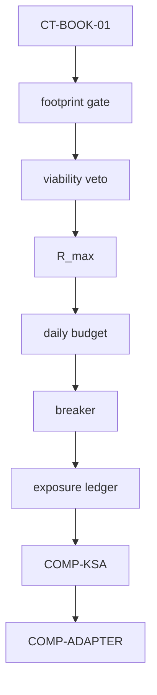
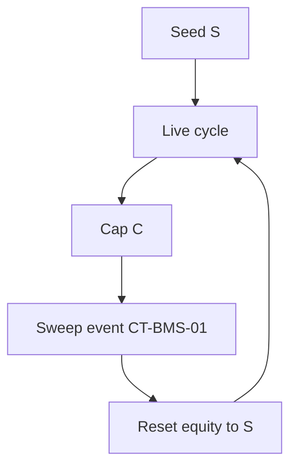
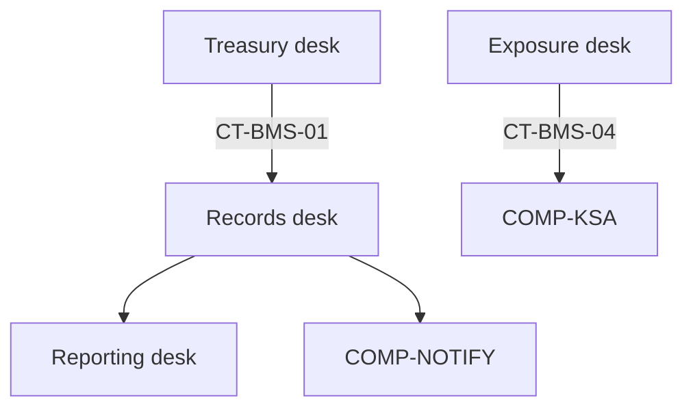

# 05 — Trading Node Primer: what a Book and a BMS actually are

**For:** Mubarak, and for every future Claude session that touches the trading node · **Written:** 2026-08-17 · **Status:** study primer — understanding only, no design, no proposals
**Operator ruling this document serves:** *"you should really understand what a Book and a BMS do before you build any of this."*
**Primary source (authority):** the local immutable GitBook capture at
`C:/Users/Mubarak/Documents/QMX/raw/online/qmx-gitbook/captures/2026-07-18T141659Z/pages/markdown/` — cited below as **`capture/…`**.
Per `tracker/map.md` §Notes ("Authority"), the GitBook is the **stable trading-node baseline**. All 68 pages of the live book (`https://elios-1.gitbook.io/qmx/llms.txt`, checked 2026-08-17) are present in the capture; **nothing had to be fetched live**.
**Secondary, non-authoritative:** `.recovery/trading-node-delta/trading-node-delta.md` — used **only** to mark where a later clarification exists. Every such mark reads **[later delta — needs fresh ratification]** and is never treated as baseline truth.
**Rule this document obeys:** record what the baseline says. Where the baseline names a thing but never defines it, say so. Never fill a hole.

---

## In plain words

*Source: `capture/architecture/overview.md`, `capture/system-constitution.md`, `capture/agent-entry-point.md`.*

1. QMX is **"a deterministic trading architecture for book-governed bots"** (`capture/architecture/overview.md`). Deterministic means: the same inputs produce the same behaviour, and no human opinion is allowed to change the answer while the market is open.
2. The whole system is one sentence, and it is Law **L1**: **"Bots trade; books control bots; BMS accounts for and constrains books; nothing above a bot touches the market."** (`capture/system-constitution.md`)
3. The documented slice runs **from the examination engine through the BMS**. The **scalper book** is the first and only book instance written down (`capture/architecture/overview.md`).
4. It is built to **run unattended**. Law **L3**: intraday human judgment is *invalid* except for two moments — **A1 resurrection** and **Sunday committee review** (`capture/system-constitution.md`, `capture/lenses/ops-runbook.md`).
5. A bot **proposes** a trade by emitting a **trade intent envelope** (`CT-BOOK-01`). It never speaks to a broker and never sees one.
6. The **Book** takes that intent and runs it through **seven doors** before anything can reach the broker path (`capture/components/book-template.md`).
7. **MIS** senses the market and publishes what it sees. Law **L6**: **"MIS publishes information only; MIS never sizes, blocks, or trades."**
8. **KSA** is the global protection layer above every book. Law **L8**: automatic transitions **escalate only**; coming back down needs a human (**A1**).
9. The **Adapter** is the only thing that touches the broker, and it is **platform-blind**. Law **L7**: **"Bots never see broker platforms or KSA directly."**
10. Money moves in **cycles**. Law **L5**: **"A cycle is a seed-to-cap event; money resets between cycles, while knowledge persists."**
11. Law **L4**: **"Unclaimed or freed risk budget is never redistributed during a cycle."** Money that is not used is not handed to somebody else.
12. Law **L11**: **"Every door or gate refusal signs the veto ledger."** Every *no* is written down, with its reason.
13. Law **L13**: **"Paper mode is a frozen counterfactual diagnostic, never a cosmetic account balance."** Paper is evidence, not a scoreboard.
14. Law **L14**: **"Unexplained drift between the BMS virtual ledger and broker reality is a technical kill."** If the books and the broker disagree and nobody can explain why, trading stops.
15. No load-bearing number lives in prose or code. **"The single source of numeric truth"** is the registry; relationships live in the formula registry; conversation numbers are **checksums to recompute, never to copy** (`capture/registry.md`).

---

## The Book

*Sources: `capture/glossary.md`, `capture/components/book-template.md`, `capture/components/scalper-book.md`, `capture/decisions/adr-0002-template-and-instance-split.md`, `capture/system-constitution.md`, `capture/registry/variables.md`, `capture/registry/formulas.md`, `capture/contracts/ct-book-01-trade-intent-envelope.md`, `capture/contracts/ct-book-02-book-mode-state.md`, `capture/components.md`.*

### 1. What a Book IS, in the GitBook's own words

> **Book**: *"A pod with charter, capital, roster, profile, rules, and journals. A book controls bots and never trades directly."* — `capture/glossary.md`, DEC-0002

Read that list slowly, because it is the whole object:

- **charter** — what game this book plays and what kills it.
- **capital** — its own money: seed, kill line, cap.
- **roster** — the bots admitted to it.
- **profile** — which of the global capabilities it switches on.
- **rules** — its doors, its money rules, its leash.
- **journals** — its written record of everything it did and refused.

A Book is therefore **not a strategy and not a container**. It is the thing that **owns the money and the permission**. A bot has an idea; the Book decides whether that idea is allowed, how much money it gets, and when it is cut off.

The Book's own never-list (`capture/components/book-template.md`, Authority Boundary):

> May never: *"trade directly, revive the dead uniform-values-across-books idea, revive the dead session-windows-as-authority idea, or redistribute unclaimed budget."*

### 2. Template and instance — one form, many books

ADR-0002 (`capture/decisions/adr-0002-template-and-instance-split.md`) settles this:

- The **book template** is written **once**, as **"sealed Sections 0–5"**. It carries **grammar** — the shape a book must have.
- Each **book instance** (today: the scalper book) is written **separately** and owns its own **values**.
- The rejected option was *"document the scalper book as the template"*, rejected because **uniform values across books is a dead idea** (DEC-0024). Consequence, verbatim: *"Values must live in the registry under the owning instance."*
- Law **L2**: *"Infrastructure after book-template Section 5 is global multi-book capability; a book profile selects capability and leaves unused capability dormant."*
- Hence the **dormant socket**: *"A fully specified global capability switched off by a book profile. The capability is not deleted."* (`capture/glossary.md`, DEC-0003). And the hard rule for builders: *"Do not cut global infrastructure just because the scalper profile leaves a socket dormant."* (`capture/agent-entry-point.md`)

**The section count.** `capture/components.md` calls the template *"The seven-section form every book instantiates."* ADR-0002 seals **Sections 0–5**; **Section 6 is a gap** — `GAP-0001`, *"Book Section 6 workspace design"*, and the template's failure mode FM-4 says: *"Mark GAP(GAP-0001) and do not invent workspace behavior."* So: seven indices, six sealed, the last one deliberately empty.

**What the sections mean.** The template page never prints a numbered list. It prints the grammar it may define, in this order (`capture/components/book-template.md`, Authority Boundary):

> May: *"define charter grammar, footprint grammar, money-rule grammar, entrance-exam requirements, leash chain, and capacity/sweep mechanics."*

That is six items for six sealed sections, in order. **[later delta — needs fresh ratification]** the delta register K-30 states the ordinals explicitly as *"Sections 0–5 mean charter, footprint, money rules, entrance exam, leash chain, capacity/sweep. There is no current Section 6."* It matches the baseline's ordering, but the numbering-to-name mapping is not printed in the GitBook itself.

### 3. The seven doors

> *"The seven doors are footprint, viability veto, R\_max, daily budget, breaker, exposure ledger, and kill switch."* — `capture/components/book-template.md`, DEC-0035

The template ships the order as a diagram (verbatim, `capture/components/book-template.md`):

Door by door, in plain words, with only what the baseline says:

| # | Door | What it asks | Baseline backing |
| --- | --- | --- | --- |
| 1 | **footprint** | Is this intent inside the book's **measured** behaviour envelope? The footprint is *"measured in exam and live journals, not accepted from bot self-description"* (`capture/glossary.md`, DEC-0035). The intent must carry a `footprint_version`. | `CT-BOOK-01` |
| 2 | **viability veto** | Would the round-trip cost eat the edge? `FORM-0007`: `round_trip_cost_R / expected_edge_R <= v_cost`, with `registry:viability_cost_fraction_max = 0.10`, described as *"Smallest seat where round-trip cost does not eat the edge."* | `capture/registry/formulas.md`, `capture/registry/variables.md` |
| 3 | **R_max** | Is the risk on this one trade under the ceiling? `FORM-0006`: `R_max_usd <= B * b * Lbar`. Note `Lbar` is `kind: measured` — measured per bot at exam, never inherited. | `capture/registry/formulas.md` |
| 4 | **daily budget** | Is there budget left today? `FORM-0003`: `D = U / n`, *"re-derived at rollover and drains intraday."* | `capture/registry/formulas.md`, DEC-0031 |
| 5 | **breaker** | Has this bot just lost too many in a row? After `registry:scalper_breaker_threshold` consecutive stop-outs the bot **benches to paper for the rest of the day and auto-resets at next open** (DEC-0032). | `capture/components/paper-mode-system.md` |
| 6 | **exposure ledger** | What is already on, across the book? Exposure is a **BMS desk** measurement; cross-book cap authority is **`GAP-0008`**, open. | `capture/components/book-management-system.md` |
| 7 | **kill switch** | Is global protection allowing anything at all right now? This is KSA, above every book. | `capture/components/kill-switch-authority.md` |

Two rules hold across all seven:

- **Every refusal is written.** Law **L11**, and the template's FM-2: *"Append refusal and reason to veto ledger."* `CT-BOOK-01` states it as a contract rule: *"Every refusal emits CT-BMS-05."*
- **The doors, not the clock, own permission.** DEC-0025 killed *session windows as trading authority*: *"the clock alone does not authorize trades… Doors and KSA own permission."* (`capture/dead-decisions.md`)

### 4. The money rules — the ladder

This is the Book's second organ: it does not just say yes, it says **how much**. The whole ladder is registry-and-formula owned (`capture/registry/variables.md`, `capture/registry/formulas.md`, `capture/scenarios/scn-0001-money-ladder.md`):

| Rung | Formula | Meaning in plain words | Registry inputs (scalper instance values) |
| --- | --- | --- | --- |
| Cap | `FORM-0001` `C = cap_multiple * S` | The finish line of a cycle. *"C is a derived relationship, not an independent registry number; cap is checked at rollover only."* | `scalper_seed_capital` **S = 500 USD**, `scalper_cap_multiplier` **2.5** |
| Runway | `FORM-0002` `U = E - K` | How much money is left above the line where the book dies. | `scalper_kill_line` **K = 200 USD** |
| Daily budget | `FORM-0003` `D = U / n` | How much of that runway today may burn. `n` is the *"floor-trader discipline number."* | `scalper_runway_divisor` **n = 5** |
| Offer per seat | `FORM-0004` `offer_R_usd = D / (B * b * Lbar)` | What the book **offers** a seat. *"The book offers; trust-bounded cost-aware Kelly disposes."* | `scalper_breaker_threshold` **B = 2**, `scalper_budget_shaping_factor` **b = 2**, `scalper_mean_loss_r` **Lbar = measured per bot at exam** |
| Take per seat | `FORM-0005` `take_R_usd = min(offer_R_usd, trust_bounded_cost_aware_kelly_R_usd)` | The bot takes the **smaller** of what the book offers and what its own sizing says. | — |

Three baseline warnings sit on this ladder:

- **`Lbar` is measured, never assumed.** `registry/variables.md`: *"Measured per bot at exam; 0.35R is a reference expectation only and never an inherited bot default."*
- **The Kelly half is deliberately unfinished.** `FORM-0005` notes: *"Formula is ratified; the trust-bounded cost-aware Kelly implementation remains a bot/book validation responsibility."*
- **Worked numbers are checksums.** `SCN-0001`: *"Any conversation number for U, D, offer, take, cycle-day count, monthly envelope, or worst case is a checksum, not an authority source."*

And the constitutional money rule: Law **L4** / DEC-0021 — *"Unclaimed or freed budget is never redistributed in-cycle."* The dead idea it kills is *region-shift budget rotation*.

### 5. Cycles, sweep, and the book-to-treasury boundary

*Source: `capture/components/treasury-desk.md`, `capture/scenarios/scn-0002-rollover-sweep.md`, `capture/contracts/ct-bms-01-treasury-event.md`.*

> *"The cycle is seed to cap. The book compounds within a cycle and ratchets between cycles."* (DEC-0006)
> *"Sweep is checked at rollover only. If cap is hit intraday, the book completes the day and sweep uses rollover equity."* (DEC-0038)

Verbatim baseline diagram (`capture/components/treasury-desk.md`):

**Only three things cross the book-to-treasury boundary** — `CT-BMS-01` event types: **`sweep`, `refund`, `re_seed`**, with the contract rule *"Only these three event types cross the book-to-treasury boundary."*

`SCN-0002` proves the point: equity reaching 1300 USD before rollover causes **no intraday sweep**; at rollover Treasury records a sweep of equity-minus-seed, resets virtual equity to seed, and *"Knowledge state persists."*

Two dead paths guard this: **mid-cycle top-up is dead** (DEC-0020, *"adding money to a bleeding book corrupts cycle accounting"*) and **live restart from the kill-line remnant is dead** (DEC-0023, *"Kill line means paper mode until re-seed at a cycle boundary"*).

### 6. Exits and stop authority — read this carefully

The GitBook is explicit and narrow here, and it is easy to get wrong:

> *"The bot owns market-facing entry and exit organs. The book owns admission, sizing, doors, leash, and profile selection."* — `capture/system-constitution.md`, Authority Hierarchy
> **Bot**: *"The only market-touching actor. A bot owns entry logic and exit organs while book infrastructure owns admission and sizing."* — `capture/glossary.md`

So in the baseline: **the Book does not own the ordinary exit.** The bot's own exit organs close its own trades. What the Book owns is **forced** exit — the ability to end a bot's day, its live seat, or its trading entirely, through the leash chain and through KSA effects at the Adapter. The Adapter's command vocabulary carries the mechanics: `place_order, cancel_order, close_position, close_all` (`CT-ADAPTER-01`).

Named forced-exit powers in the baseline:

- **hold-time force-flat** — last rung of the leash chain (DEC-0037). *Named once and never defined anywhere in the capture.*
- **kill-line stand-down** — the book crosses K and flips to paper; *"live remnant restart is dead"* (DEC-0023). Its full semantics are **`GAP-0006`**.
- **classed kill switch** — KSA, delivered as an **effect** at the Adapter, never as advice a bot reads (`capture/lenses/security-model.md`).
- **day closure** — leash rung. *Named once, never defined.*

**[later delta — needs fresh ratification]** K-35 in the delta register states *"Dynamic SL/TP belongs to Book money-rule grammar, with BMS configuration authority and Adapter enforcement. A globally uniform stop service is rejected."* and K-36/PE-7 leaves **position fate at rollover/sweep/kill/paper boundaries open**. None of that is in the GitBook; the GitBook says only what is quoted above.

### 7. The leash — how a Book strangles a losing bot slowly

> *"The leash chain escalates through ambient governor, day closure, bench-to-paper, chorus flag, kill-line stand-down, classed kill switch, and hold-time force-flat."* — `capture/components/book-template.md`, DEC-0037

Two laws frame it:

- Law **L12**: *"Graduated policy shrinks before it blocks unless the event class demands instant action."* The leash **shrinks first**.
- Law **L16**: *"The leash handles damage; sunset review handles pointlessness."* The leash is for a bot that is **hurting you**, not for a bot that is merely **useless**. (*"sunset review" is named once, in L16, and defined nowhere in the capture.*)

Of the seven rungs, the capture defines only three:

- **bench-to-paper** — the breaker path (DEC-0032), the one paper transition that is actually ratified.
- **chorus flag** — *"Automatic listener for abnormal loss shape. The chorus owns rate and clustering shape, not amount lost."* (`capture/glossary.md`, DEC-0048). Its frequency rule is `registry:chorus_expected_frequency_rule`, **value `null`, `GAP-0012`**. Thresholds come from cohort exam observations (`CT-EXAM-02`).
- **kill-line stand-down** — see §6, semantics `GAP-0006`.

**ambient governor**, **day closure**, **classed kill switch** target levels, and **hold-time force-flat** are **named but never defined in the capture.** A future session must treat them as vocabulary with no body yet.

The human-review escape hatch is closed by design: DEC-0022 killed the **human chorus review loop** — *"intraday review latency is incompatible with market action."*

### 8. Book modes

`CT-BOOK-02` (Book Mode State) and `CT-BMS-02` (Mode Registry Read) share one enum: **`LIVE, PAPER, BENCHED, STOOD_DOWN`**. Every mode record carries a `reason` and a `trigger_decision` matching `DEC-[0-9]{4}` — **a mode never changes without naming the decision that changed it.** Contract rules: *"Paper balances freeze at mode flip"*, *"Breaker bench-to-paper auto-resets at next open under DEC-0032"*, *"Other paper/live promotion, freeze, demotion, and return semantics remain GAP-0006."*

**[later delta — needs fresh ratification]** K-26/C-02 claim the four values mix two namespaces (Book mode vs roster-seat state) and must be split. The GitBook uses one enum.

### 9. The scalper book, as the worked example

`capture/components/scalper-book.md` — *"the first book-template instance… a treasury-customered cash-flow machine judged by swept cash per month per dollar of seed"* (DEC-0028).

- May: *"select from global infrastructure, run the scalper profile, offer risk seats, apply the seven doors, bench bots to paper, and sweep at rollover."*
- May never: *"become the global template, defend itself by headline equity curve, compound between cycles, or trade directly."*
- Its charter fills the template's four slots (DEC-0027): **game played, money shape, customer plus headline metric, death condition** — here: scalping; seed-to-cap cycles; Treasury as customer with swept-cash-per-dollar-of-seed as headline metric; kill line as death condition.
- `registry:max_concurrent_live_bots = 3` (ENH-0007 ratified default).

### 10. Prop-firm books

The baseline is short and unambiguous, and it does **not** design them:

- Scope boundary (`capture/architecture/overview.md`): *"The agentic R&D system, desktop UI implementation, coding standards, and **prop-firm books** are outside this run."* (DEC-0001)
- Gap report, **Deferred**: **`GAP-0004`** — *"Prop-firm books require a later design session."*

So the baseline's own position is: a prop-firm book **is a Book** — it would fill the same seven-index form, own its own registry values under its own instance, and inherit the same doors and leash — but its design session has not happened. `tracker/map.md` records the operator's re-echoed ruling to the same effect (deferred to the agentic era; do not re-surface).

---

## The BMS

*Sources: `capture/components/book-management-system.md`, `capture/components/treasury-desk.md`, `capture/lenses/logging-spec.md`, `capture/contracts/ct-bms-01…05`, `capture/decisions/adr-0001-authority-hierarchy.md`.*

### 1. What it is

> *"BMS accounts for and constrains books. It has Treasury, Exposure, Records, and Reporting desks, and it never trades, sizes, or reaches inside a book."* — `capture/components/book-management-system.md`, DEC-0045

The BMS is the **back office**. It keeps the money truthful, keeps the record permanent, and applies constraints from outside the book. It is emphatically **not** an allocator that reaches into a book and re-sizes a trade.

- **May:** *"own virtual ledger state, exposure measurement, mode registry, append-only journals, reporting metrics, KSA policy, and news block directives."*
- **May never:** *"trade directly, mutate bot logic, overwrite journals in place, or bypass the veto ledger."*

Verbatim baseline diagram:

### 2. The four desks

**Treasury desk** — `capture/components/treasury-desk.md`. *"Treasury owns the virtual capital ledger and the book-to-treasury boundary. Only sweep, refund, and re-seed cross that boundary."* (DEC-0038). It may record *"seed, equity, kill line, cap, cycle id, cycle state, sweep, refund, re-seed, and reconciliation verdicts."* It may never revive mid-cycle top-up (DEC-0020), never revive live-restart-from-remnant (DEC-0023), and never *"treat physical broker withdrawals as automatic."* Its refund reserve is `FORM-0008` `reserve_usd ~= rho * N_cycles_month * S` — with **`rho` and `N_cycles_month` both `null`, `GAP-0007`**.

**Exposure desk** — measures exposure and emits the **news block directive** `CT-BMS-04` to KSA. `SCN-0003` proves the effect: a news directive refuses entries **for live and paper alike**, the refusal signs the veto ledger, and *"no paper data is collected under a known invalid news window"* (Law **L9**, DEC-0010). Exposure Desk **v2 authority, including cross-book cap authority, is `GAP-0008` — open.**

**Records desk** — the spine. *"Records is append-only and owns the only journal write path."* (DEC-0046). Correction rule, FM-1: *"Append a correction entry referencing the corrected entry."* Never edit. The five required journals (`capture/lenses/logging-spec.md`):

| Journal | Owner | Required content |
| --- | --- | --- |
| **Veto ledger** | COMP-BMS | Door, reason, candidate intent, timestamp |
| **KSA audit log** | COMP-KSA / COMP-BMS | Trigger class, evidence refs, state level |
| **Trade journal** | COMP-BMS | Fill, snapshot version, book, bot, pair |
| **Book journal** | COMP-BMS | Mode changes, leash events, cycle events |
| **Correlation ledger** | COMP-BMS | Chorus observations and cohort references |

FM-3 is blunt: *"A no is not journaled → Treat as violation of DEC-0012."*

**Reporting desk** — *"Reporting computes from Records and has zero authority."* It is a mirror, not a hand.

### 3. What BMS owns vs what Books own

| Question | Book | BMS |
| --- | --- | --- |
| May this trade happen? | **Yes** — the seven doors | No — *"never… reaches inside a book"* |
| How big is it? | **Yes** — offer/take per seat | No — *"never trades, sizes"* |
| Which bots are admitted? | **Yes** — roster, admission | No |
| Which global capabilities are on? | **Yes** — profile / dormant sockets | No |
| When is a bot leashed? | **Yes** — leash chain | No |
| What is the money actually worth? | No | **Yes** — Treasury virtual ledger |
| What is the authoritative mode of each book? | Emits `CT-BOOK-02` | **Yes** — mode registry `CT-BMS-02` is *"the authoritative mode map"* |
| Where is the permanent record? | No | **Yes** — Records, sole write path |
| Are we exposed across books? | No | **Yes** — Exposure desk (v2 authority `GAP-0008`) |
| Does the broker agree with us? | No | **Yes** — reconciliation `CT-BMS-03` |
| What does KSA do? | Obeys its effects | **Yes** — *"BMS owns policy"* (KSA owns the state machine) |

### 4. The authority model in one line

**The bot proposes; the Book admits and sizes; the BMS accounts and constrains.**

ADR-0001's rejected option is as instructive as the chosen one: *"Let bots read all runtime state — rejected because bots could reason around book, platform, or kill-switch authority."* Its consequence rule is the design test for anything new: *"New components must declare whether they **sense, decide, account, or execute**."*

### 5. Reconciliation and the technical kill

`CT-BMS-03` carries `virtual_equity`, `broker_equity`, `explained_delta`, and a `verdict` of **`reconciled | drift | unknown`**, with the rule *"Unexplained drift is a technical kill."* `registry:reconciliation_epsilon` is **`0`** with **`operator_review: true`** — *"operator review is mandatory before non-zero use."* The incident playbook is one line: *"If CT-BMS-03 returns `drift`, halt trading as a technical kill."*

**[later delta — needs fresh ratification]** the delta register (K-46B, C-23) claims `CT-BMS-03` and `CT-BMS-01` directions need repair (Treasury→BMS), and C-07 suspects a stale `GAP-0010` cross-reference in the BMS failure table where `GAP-0008` was meant.

---

## The other organs

*Sources: the component pages named under each heading.*

**MIS / SQS** — `capture/components/market-intelligence-service.md`, `capture/contracts/ct-mis-01…02`.
MIS is split into **MIS-Live** (hot snapshots) and **MIS-Archive** (immutable emissions for replay). It is **information-only**: *"MIS never sizes, blocks, or trades"* (L6, DEC-0040). It computes *"each labeler, version, parameter set, pair, and resolution combination **once** and fans it out to all subscribers"* (DEC-0041). Failure is conservative (DEC-0042): a failed labeler publishes a **degraded field** and lists the sensor in `degraded_sensors`; **`sqs_hard_block`** makes the door refuse; a **dead `feed_state`** prevents new entries. Law **L10** binds exam and live: *"Exam labeler versions and live labeler versions must match."*
On **SQS**: the capture contains the acronym only as the `CT-MIS-01` fields `sqs_score` and `sqs_hard_block` and the rule *"SQS unreachable → Door performs hard block."* **The GitBook never expands the acronym.** **[later delta — needs fresh ratification]** K-38/D-09 in the delta register define it as **snapshot quality score, never a queue**, and close the vocabulary explicitly against "Simple Queue Service."

**KSA — the kill switch** — `capture/components/kill-switch-authority.md`, `capture/contracts/ct-ksa-01`.
KSA is *"the global protection state machine. BMS owns policy, the trading node enforces effects through the adapter, and bots never see KSA directly."* (DEC-0008). Five levels: **GREEN, YELLOW, ORANGE, RED, BLACK** (DEC-0043). Four trigger classes: **`scheduled_news`, `black_swan`, `connectivity`, `unknown_state`** (DEC-0044). Law **L8**: automatic transitions **escalate only**; **de-escalation requires A1 human authority**. The dead idea it refuses is **TIGHTEN half-size** (DEC-0019) — *"trading half-size through bad conditions still pays to lose."* **The full trigger-to-level target matrix is `GAP-0015`, open** — the page says outright *"do not invent target state here."*

**Adapter** — `capture/components/broker-adapter.md`, `capture/contracts/ct-adapter-01`.
The adapter is the broker-facing boundary and the **only** thing that reaches a broker. It *"translate\[s\] platform-blind commands to broker-specific execution"*, maintains **account binding**, and may never *"expose broker platform APIs to bots, choose trade permission, or hide reconciliation drift."* Its command vocabulary is exactly four: **`place_order, cancel_order, close_position, close_all`**. Unknown startup state emits `unknown_state` and **blocks broker execution until reconciled**. Broker/cTrader feasibility is **`GAP-0005`** — *"cTrader capability is assumed without proof → Keep as GAP(GAP-0005)."*

**Paper mode** — `capture/components/paper-mode-system.md`, `capture/contracts/ct-paper-01`.
*"Paper mode is diagnostic. It freezes the counterfactual balance at flip and preserves evidence after a breaker, kill-line stand-down, or demotion."* (L13, DEC-0014). Its purpose is **evidence**, not comfort: hand-adjusting a paper balance is dead, and paper gains are never treasury cash. The **only ratified transition** is the breaker path: after `registry:scalper_breaker_threshold` consecutive stop-outs, bench to paper for the rest of the day and **auto-reset at next open** (DEC-0032). *"Kill-line stand-down, discretionary promotion, freeze, demotion, and non-breaker return-to-live semantics remain GAP(GAP-0006)."*

**Treasury cycles** — `capture/components/treasury-desk.md`, `capture/scenarios/scn-0002-rollover-sweep.md`.
A cycle is **seed → cap**, and cycle *duration is an output*, not a setting (`capture/glossary.md`). Inside a cycle the book **compounds**; between cycles the money **ratchets** — swept to Treasury, equity reset to seed, and *"knowledge persists"* (L5, DEC-0006). **Sweep is checked at rollover only**; hitting cap intraday means *"complete the day and sweep at rollover only."* The re-seed is the only way back after a kill-line stand-down, and it happens **at a cycle boundary** — never as a mid-cycle top-up, never as a restart from the remnant.

**Examination engine** — `capture/components/examination-engine.md`, `capture/contracts/ct-exam-01…02`.
*"The examination engine certifies whether a bot can join a **specific book**. A bot is not validated in the abstract; it is validated against the book contract it applies to join."* (DEC-0055). It gates on exactly two things: *"the edge is real after costs, and the candidate is not fiction"* (DEC-0036). *"Everything else becomes measured input for the book wallet, leash, and chorus."* It **may never authorize live trading**. A certificate is invalid the moment live labeler versions differ from exam labeler versions (L10).

**Notification** — `capture/components/notification-system.md`. Journal-derived, operator-facing, and forbidden from asking for intraday trade judgment (DEC-0004). Everything about severity, channels, retry, dedupe, quiet hours, and credentials is **`GAP-0002`**; ENH-0001's tiers are interim only.

**Data layer** — `capture/components/data-layer.md`. *"The data layer is mostly a gap in this run."* Two stable islands exist — immutable MIS archive emissions and append-only BMS journals — and everything else (stores, retention, backup/restore, migration, schemas) is **`GAP-0003`**. Explicit warning: *"Do not select databases, retention, migration, or backup policy from the old vault without ratification."*

**QML library layer** — `capture/components/qml-library-layer.md`. Recorded as *"an in-scope component shell"* whose interfaces are **`GAP-0013`**; `CT-QML-01` registers **zero interfaces**. It may never *"become an agentic workflow surface in this deterministic pass."*

---

## The authority chain

*Sources: `capture/system-constitution.md`, `capture/decisions/adr-0001-authority-hierarchy.md`, `capture/lenses/security-model.md`, `capture/lenses/ops-runbook.md`, `capture/knowledge/engineering-workflow.md`.*

The constitution states it in one line:

> *"The authority hierarchy is **bot → book → BMS → operator**. The bot owns market-facing entry and exit organs. The book owns admission, sizing, doors, leash, and profile selection. BMS owns accounting, constraints, journals, KSA policy, and reporting. The operator owns A1 resurrection, Sunday review, and ratification."*

Drawn as the four verbs ADR-0001 demands every component declare:

| Verb | Who | What they may do | Baseline |
| --- | --- | --- | --- |
| **Sense** | MIS-Live, MIS-Archive | Publish typed snapshots and store emissions. **Never** size, block, or trade. | L6, DEC-0007 |
| **Propose** | Bot | Emit a trade intent (`CT-BOOK-01`) and run its own entry/exit organs. **Never** see a broker platform or KSA. | L1, L7, `capture/glossary.md` |
| **Decide** | Book | Admission, sizing, the seven doors, the leash, profile selection. **Never** trade directly. | L1, `capture/components/book-template.md` |
| **Decide (protection)** | KSA | Global level and trigger class. **Escalate only**; de-escalation is A1. | L8, DEC-0043/0044 |
| **Account and constrain** | BMS | Virtual ledger, exposure, mode registry, journals, reporting, KSA policy, news directives. **Never** trade, size, or reach inside a book. | DEC-0045 |
| **Execute** | Adapter | Translate platform-blind commands to broker execution. **Never** choose trade permission. | DEC-0008 |
| **Ratify** | Operator | A1 resurrection, Sunday committee review, ratification, countersigning registry values, approving the merge to `main`. | L3, DEC-0004, `capture/knowledge/engineering-workflow.md` |

**Who may write.** Records is *"the physical sole… only journal write path"* (DEC-0046) and journals are append-only; a correction is a new entry that references the corrected one. Reporting has *"zero authority."* Every refusal must reach that write path or the law is violated.

**Who may execute.** Only the Adapter contacts the broker, and only after the doors. `capture/lenses/security-model.md` states the trust boundaries as four lines: *"Bot emits intent only. / Book sends platform-blind command only after doors. / KSA state produces effects, not bot-readable advice. / Reconciliation drift halts trading."*

**The operator's final authority is narrow and absolute.** Narrow, because Law L3 makes intraday human judgment **invalid** — DEC-0022 killed the human review loop on latency grounds. Absolute, because everything that is *permitted* to be human is: **A1 resurrection** (the only way KSA comes back down), **Sunday committee review**, **ratification** of decisions/gaps/enhancements, **countersigning** registry values (`scalper_seed_capital`, `scalper_budget_shaping_factor`, `reconciliation_epsilon` carry `operator_review: true`), and **approving the merge to `main`** (`capture/knowledge/engineering-workflow.md`). An agent's own judgment is allowed only as an unratified **ENH** entry: *"keep it unratified until the operator ratifies, rejects, or folds it into a GAP."*

**[later delta — needs fresh ratification]** C-19 in the delta register flags that *"bot is the only market-touching actor"* reads literally against the Adapter's physical broker contact, and proposes the clarification that bots own intent and entry/exit logic while the Adapter alone owns the platform session. C-18 flags that "BMS owns KSA policy while KSA owns protection state" is a cycle needing explicit initialization/recovery ordering.

---

## Vocabulary table

Every load-bearing term, one line each, from the capture. Where the capture names a term but never defines it, the row says so.

| Term | One-line definition | Source |
| --- | --- | --- |
| **QMX** | *"A deterministic trading architecture for book-governed bots."* | `capture/architecture/overview.md` |
| **Bot** | *"The only market-touching actor. A bot owns entry logic and exit organs while book infrastructure owns admission and sizing."* | `capture/glossary.md`, DEC-0002 |
| **Book** | *"A pod with charter, capital, roster, profile, rules, and journals. A book controls bots and never trades directly."* | `capture/glossary.md`, DEC-0002 |
| **Book template** | The reusable form every book fills, written once as sealed Sections 0–5; grammar only, never instance values. | `capture/components/book-template.md`, ADR-0002 |
| **Book instance** | A concrete book (today: scalper) owning its own registry values under its own name. | ADR-0002 |
| **Book profile** | The instance's selection of which global capabilities are switched on. | L2, DEC-0003 |
| **Dormant socket** | *"A fully specified global capability switched off by a book profile. The capability is not deleted."* | `capture/glossary.md`, DEC-0003 |
| **Charter** | The book's four slots: *"game played, money shape, customer plus headline metric, and death condition."* | `capture/components/book-template.md`, DEC-0027 |
| **Footprint** | *"A book's measured behavior envelope… measured in exam and live journals, not accepted from bot self-description."* | `capture/glossary.md`, DEC-0035 |
| **Door** | One of the seven gates an intent must pass; every refusal signs the veto ledger. | DEC-0035, L11 |
| **The seven doors** | *"footprint, viability veto, R_max, daily budget, breaker, exposure ledger, and kill switch."* | `capture/components/book-template.md`, DEC-0035 |
| **Viability veto** | Door refusing seats where cost eats edge: `round_trip_cost_R / expected_edge_R <= v_cost`. | `FORM-0007` |
| **R_max** | Per-trade risk ceiling: `R_max_usd <= B * b * Lbar`. | `FORM-0006` |
| **Daily budget** | `D = U / n`; *"re-derived at rollover and drains intraday."* | `FORM-0003`, DEC-0031 |
| **Breaker** | Consecutive-stop-out counter that benches a bot to paper for the day, auto-resetting at next open. | DEC-0032 |
| **Exposure ledger** | The door reading BMS Exposure's measurement; cross-book cap authority is `GAP-0008`. | `capture/components/book-management-system.md` |
| **Leash chain** | *"ambient governor, day closure, bench-to-paper, chorus flag, kill-line stand-down, classed kill switch, and hold-time force-flat."* | `capture/components/book-template.md`, DEC-0037 |
| **Ambient governor** | Leash rung 1. **Named once; never defined in the capture.** | DEC-0037 |
| **Day closure** | Leash rung 2. **Named once; never defined in the capture.** | DEC-0037 |
| **Bench-to-paper** | Leash rung 3; the breaker path, the only ratified paper transition. | DEC-0032 |
| **Chorus flag** | *"Automatic listener for abnormal loss shape. The chorus owns rate and clustering shape, not amount lost."* | `capture/glossary.md`, DEC-0048 |
| **Kill-line stand-down** | Leash rung 5; equity crosses K, book flips to paper until cycle-boundary re-seed. Full semantics `GAP-0006`. | DEC-0023 |
| **Classed kill switch** | Leash rung 6; KSA acting by trigger class. Target-level matrix `GAP-0015`. | DEC-0037, DEC-0044 |
| **Hold-time force-flat** | Leash rung 7. **Named once; never defined in the capture.** | DEC-0037 |
| **Sunset review** | *"The leash handles damage; sunset review handles pointlessness."* **Named once; never defined.** | L16, DEC-0017 |
| **Seat** | The risk allocation a book offers a bot for a trade — *"offer risk seats"*, *"live seat"*, *"take per seat"*. **Used throughout; not in the glossary.** | `capture/components/scalper-book.md`, `FORM-0004/0005` |
| **Offer per seat** | What the book offers: `offer_R_usd = D / (B * b * Lbar)`. *"The book offers; trust-bounded cost-aware Kelly disposes."* | `FORM-0004` |
| **Take per seat** | What is actually taken: `min(offer_R_usd, trust_bounded_cost_aware_kelly_R_usd)`. | `FORM-0005` |
| **R** | The risk unit used by intents, expectancy floors, and mean loss (`requested_r`, `oos_expectancy_floor_r`, `Lbar`). **Used as a unit; never defined in the capture.** | `CT-BOOK-01`, `capture/registry/variables.md` |
| **Money ladder** | Seed → cap → runway → daily budget → offer → take; the book's sizing chain. | `SCN-0001`, DEC-0030 |
| **Seed (S)** | The money a book starts a cycle with; `registry:scalper_seed_capital = 500 USD`, constraint `S > K`. | `capture/registry/variables.md` |
| **Kill line (K)** | The equity level that kills the cycle; `registry:scalper_kill_line = 200 USD`, *"fixed within the cycle."* | `capture/registry/variables.md` |
| **Cap (C)** | The cycle's finish line, derived: `C = cap_multiple * S`; *"checked at rollover only."* | `FORM-0001` |
| **Runway (U)** | `U = E - K` — money above the death line. | `FORM-0002` |
| **Cycle** | *"The seed-to-cap event. Cycle duration is an output, and money ratchets between cycles."* | `capture/glossary.md`, DEC-0006 |
| **Compound / ratchet** | *"The book compounds within a cycle and ratchets between cycles."* | DEC-0006 |
| **Sweep** | *"Rollover-only treasury event that moves equity above seed into treasury accounting and resets book equity to seed."* | `capture/glossary.md`, DEC-0038 |
| **Refund** | One of the three events crossing the book-to-treasury boundary; priced by `FORM-0008`, whose `rho` is `GAP-0007`. | `CT-BMS-01`, `FORM-0008` |
| **Re-seed** | The third boundary event; the **only** way a stood-down book returns, and only at a cycle boundary. | `CT-BMS-01`, DEC-0023 |
| **Rollover** | The daily boundary at which budget is re-derived and sweep is checked. | DEC-0031, DEC-0038 |
| **BMS** | *"Book Management System. BMS has Treasury, Exposure, Records, and Reporting desks."* Accounts for and constrains books. | `capture/glossary.md`, DEC-0045 |
| **Treasury desk** | Owns the virtual capital ledger and the book-to-treasury boundary. | DEC-0038 |
| **Exposure desk** | Measures exposure; emits news block directives to KSA. v2 authority `GAP-0008`. | `capture/components/book-management-system.md` |
| **Records desk** | Append-only; *"owns the only journal write path."* | DEC-0046 |
| **Reporting desk** | *"Computes from Records and has zero authority."* | DEC-0046 |
| **Veto ledger** | *"Append-only record of trade refusals and reasons."* | `capture/glossary.md`, DEC-0012 |
| **Journal** | One of five append-only streams: veto ledger, KSA audit log, trade journal, book journal, correlation ledger. | `capture/lenses/logging-spec.md` |
| **Mode registry** | *"The BMS mode registry is the authoritative mode map"* — `LIVE, PAPER, BENCHED, STOOD_DOWN`. | `CT-BMS-02` |
| **Reconciliation** | Virtual vs broker equity, verdict `reconciled / drift / unknown`. | `CT-BMS-03` |
| **Technical kill** | *"Unexplained drift between the BMS virtual ledger and broker reality"* halts trading. | L14, DEC-0015 |
| **MIS** | *"Market Intelligence Service. MIS-Live publishes hot snapshots; MIS-Archive stores immutable emissions for replay and research."* | `capture/glossary.md`, DEC-0040 |
| **Snapshot** | The typed market state a book reads; carries `snapshot_version` and is *"information-only."* | `CT-MIS-01` |
| **Labeler** | A versioned market classifier; exam and live versions **must match** or the certificate invalidates. | L10, DEC-0011 |
| **Degraded sensor** | A failed labeler publishes a degraded field and is listed in `degraded_sensors` rather than failing silently. | DEC-0042, `CT-MIS-01` |
| **SQS** | Carried in the capture only as `sqs_score` / `sqs_hard_block`; unreachable SQS forces a **hard door block**. **The GitBook never expands the acronym.** **[later delta — needs fresh ratification]** K-38/D-09: *snapshot quality score, never a queue.* | `CT-MIS-01`, DEC-0042 |
| **Feed state** | `fresh / stale / dead`; a dead feed prevents new entries. | `CT-MIS-01` |
| **Regime** | Optional snapshot field: `trend / range / chaos`, with a confidence. | `CT-MIS-01` |
| **KSA** | *"Kill-Switch Authority. KSA has GREEN, YELLOW, ORANGE, RED, and BLACK levels."* Global protection state machine. | `capture/glossary.md`, DEC-0043 |
| **Trigger class** | `scheduled_news / black_swan / connectivity / unknown_state`. | DEC-0044, `CT-KSA-01` |
| **A1 gate** | *"Human resurrection authority. A1 governs return-to-live and never performs automatic protection."* | `capture/glossary.md`, DEC-0004 |
| **Sunday committee review** | The second and only other legitimate human moment. | L3, `capture/lenses/ops-runbook.md` |
| **Paper mode** | *"Counterfactual diagnostic mode with balance frozen at flip."* | `capture/glossary.md`, DEC-0014 |
| **BENCHED / STOOD_DOWN** | Two of the four mode values; `STOOD_DOWN` follows the dead remnant-restart rejection. Non-breaker semantics `GAP-0006`. | `CT-BOOK-02`, `CT-PAPER-01` |
| **Adapter** | The platform-blind broker boundary; four commands, account binding, unknown-state blocking. | DEC-0008, `CT-ADAPTER-01` |
| **Examination engine** | *"Certification system that gates edge after cost and non-fiction while measuring the actuarial table for the book."* | `capture/glossary.md`, DEC-0036 |
| **Exam certificate** | `CT-EXAM-01`; pins labeler versions, EV by regime, mean loss, fire-rate band, breaker expectation, cost ratio. | `CT-EXAM-01` |
| **Cohort correlation certificate** | `CT-EXAM-02`; the source of chorus thresholds. | `CT-EXAM-02` |
| **Registry** | *"The single source of numeric truth"* — every load-bearing value, never a hardcoded number. | `capture/registry.md` |
| **Formula registry** | Relationships between variables; *"Coefficients are configurable; relationships are law."* | `capture/registry.md` |
| **Checksum** | A conversation-era number that must be **recomputed** from the registry, never copied. | `capture/registry.md`, `SCN-0001`, GAP-0011 |
| **`kind: measured`** | A registry value measured per bot at exam rather than configured (e.g. `Lbar`). | `capture/registry/variables.md` |
| **GAP-nnnn** | A recorded unknown. *"Unknown behavior is a GAP, not a guess."* | `capture/gap-report.md`, `capture/knowledge/engineering-workflow.md` |
| **ENH-nnnn** | Senior judgment added beyond source; **unratified until the operator rules**. | `capture/agent-entry-point.md` |
| **DEC / ADR / CT / SCN / COMP** | Decision id / decision record / contract / golden scenario / component id. | `capture/qmx-documentation-index.md` |
| **Dead decision** | An idea explicitly killed, with a surviving rule; must never be revived. | `capture/dead-decisions.md` |
| **Change mode** | The documentation run triggered when a feature alters documented behaviour: *"Code and docs move together or not at all."* | `capture/knowledge/engineering-workflow.md` |
| **Blast radius** | What a change touches, read from the dependency graph before touching anything. | `capture/architecture/dependency-graph.md` |

---

## What QMF must provide the node

**This is not design.** It is a reading of what the node's own description *requires* of whatever framework runs it. Each row names the baseline page that implies it. Nothing here proposes a mechanism.

| Capability the node implies it needs | Why — what the baseline says | Traced to |
| --- | --- | --- |
| **Exact money arithmetic** | Sweep is `equity − seed`; reconciliation compares virtual vs broker equity with `reconciliation_epsilon = 0`; drift is a kill. Zero tolerance means money cannot be approximate. | `SCN-0002`; `CT-BMS-03`; `capture/registry/variables.md` |
| **A registry of values, and a registry of formulas with configurable coefficients** | *"No hardcoded load-bearing numbers. Every value comes from a registry key; every relationship from the formula registry."* Values also carry `kind` (config/measured/derived), units, constraints, `configurable`, `operator_review`, and gap links. | `capture/knowledge/engineering-workflow.md`; `capture/registry.md`; `capture/registry/variables.md` |
| **Typed contract boundaries with no invented fields** | *"If a field is not in the contract, it does not cross the boundary."* 17 contracts define every crossing. | `capture/contracts.md`; engineering-workflow rule 2 |
| **Append-only journals with a single write path and correction-by-append** | Records *"owns the only journal write path"*; corrections *"append a correction entry referencing the corrected entry."* Five named journals. | `CT-BMS-05`; `capture/components/book-management-system.md`; `capture/lenses/logging-spec.md` |
| **A refusal path where every *no* is journaled, with door + reason + candidate intent** | Law L11; *"Every refusal emits CT-BMS-05"*; *"A no is not journaled → violation."* | `capture/system-constitution.md`; `CT-BOOK-01`; `capture/lenses/logging-spec.md` |
| **Ordered evaluation** | The seven doors are a chain with a fixed order; the daily budget *"drains intraday"*; journals are time-ordered appends. **[later delta — needs fresh ratification]** K-06 goes further and asks for an explicit per-Book deterministic sequencer; the GitBook implies ordering without naming a sequencer. | `capture/components/book-template.md`; DEC-0031 |
| **UTC timestamps on every crossing event** | `occurred_at_utc`, `effective_at_utc`, `updated_at_utc`, `certified_at_utc`, `timestamp_utc` are required fields across the contracts. | `capture/contracts/` (all) |
| **Injectable / freezable clocks** | Fixture rule: *"Freeze clocks, use registry values, avoid network calls in unit tests."* | `capture/lenses/fixtures-and-scenarios.md` |
| **Deterministic replay over an immutable archive, off the hot path** | *"Replay runs on immutable archive emissions"*; *"Replay is never in the hot path."* | `CT-MIS-02` |
| **Versioned labelers with an exam↔live parity check** | Law L10; *"Certificate is invalid if live labelers differ from exam labelers"*; the five-step model lifecycle. | `capture/system-constitution.md`; `CT-EXAM-01`; `capture/lenses/mlops-model-lifecycle.md` |
| **Compute-once, fan-out snapshot publication with version stamps** | *"MIS computes each labeler, version, parameter set, pair, and resolution combination once and fans it out to all subscribers."* Intents carry `snapshot_version` and `footprint_version`. | DEC-0041; `CT-BOOK-01` |
| **Explicit degradation representation, never silent defaults** | Failed labelers publish degraded fields plus `degraded_sensors`; `sqs_hard_block`; `feed_state: dead` blocks entries. | DEC-0042; `CT-MIS-01` |
| **Latency measurement per hop, against registry budgets** | *"Measure each hop with structured timestamps and include snapshot version where market state influenced the decision."* Budgets: tick-to-MIS 35 ms, order 10–45 ms, end-to-end 100 ms. | `capture/lenses/performance-budgets.md`; L15 |
| **A mode/state machine where every transition names its reason and its decision id** | `CT-BOOK-02` requires `reason` plus `trigger_decision` matching `DEC-[0-9]{4}`; the mode registry is authoritative. | `CT-BOOK-02`; `CT-BMS-02` |
| **A platform-blind execution seam** | Four command types, account binding, and *"Bots do not call broker platforms directly."* Unknown state blocks execution until reconciled. | `CT-ADAPTER-01`; DEC-0008 |
| **Protection state delivered as *effects*, not as readable advice** | *"KSA state produces effects, not bot-readable advice."* | `capture/lenses/security-model.md`; `CT-KSA-01` |
| **Market data access: live ingest, immutable emission storage, bounded replay queries** | *"Market data enters MIS-Live, emissions are archived immutably, and replay queries consume the archive through CT-MIS-02."* | `capture/lenses/mlops-data-pipeline.md` |
| **A data-ownership gate before any write** | `CT-DATA-01` registers dataset id, owner component, write policy, optional retention, optional schema ref; *"A component wants to write data without owner → Record GAP(GAP-0003)."* | `CT-DATA-01`; `capture/components/data-layer.md` |
| **Broker equity as an input to reconciliation** | `CT-BMS-03` needs `broker_equity` alongside `virtual_equity` and `explained_delta`. | `CT-BMS-03` |
| **Executable golden scenarios that recompute from the registry** | *"Golden scenarios are executable fixtures"*; *"an implementation is correct only if it reproduces these traces from registry values, step by step."* | `capture/scenarios.md`; engineering-workflow rule 4 |
| **Behaviour-named tests citing decision ids and failure-mode rows** | *"Test names cite what they prove (decision IDs, FM rows, Never-List lines)"*; coverage stated as behaviours, never percentages. | `capture/knowledge/engineering-workflow.md`; `capture/lenses/test-strategy.md` |
| **A paper lane that obeys the same blocks as live** | *"Directive applies to live and paper books"*; `SCN-0003` asserts the same refusal class for both. | `CT-BMS-04`; `SCN-0003` |
| **Unattended operation with no intraday human loop** | Law L3; *"QMX is designed to run unattended"*; notifications *"do not ask for intraday trading judgment."* | `capture/lenses/ops-runbook.md`; `capture/lenses/incident-playbook.md` |
| **A machine-readable component/dependency graph for blast radius** | *"Read `docs/architecture/dependencies.yaml`"* before changing anything; the graph carries `depends_on`, `interfaces`, `spec` per component. | `capture/architecture/dependency-graph.md`; `capture/agent-entry-point.md` |
| **Startup preconditions that refuse unsafe execution** | Runbook start sequence: ledger reconciles, KSA state not unknown, labeler versions match certificates, adapter binding confirmed. | `capture/lenses/ops-runbook.md` |
| **Observability that carries no authority** | Metrics derive from BMS Records and Reporting, which has zero authority; the substrate itself is `GAP-0009`. | `capture/lenses/metrics-and-alerts.md` |

---

## Open per the baseline itself

The GitBook is explicit that these are **not** to be invented. *"This report lists gaps that the docs must not invent."*

**Open gaps** (`capture/gap-report.md`):

| Gap | Component(s) | The question the baseline leaves open |
| --- | --- | --- |
| **GAP-0001** | BOOK-TEMPLATE, BOOK-SCALPER | Book **Section 6** workspace design |
| **GAP-0002** | NOTIFY, BMS | Notification severity, channels, retry, dedupe, quiet hours, credentials |
| **GAP-0003** | DATA, BMS, MIS-ARCHIVE | Data ownership, stores, retention, backup/restore, migration, schemas |
| **GAP-0005** | ADAPTER, KSA, PAPER | Broker and cTrader feasibility constraints |
| **GAP-0006** | PAPER, BMS, EXAM | The **complete paper/live transition state machine** |
| **GAP-0007** | TREASURY | Exact `rho` estimator for the refund reserve |
| **GAP-0008** | BMS, KSA | **Exposure Desk v2 authority**, including cross-book caps |
| **GAP-0009** | BMS | Observability substrate |
| **GAP-0010** | BMS, BOOK-TEMPLATE | Section 1–2 BMS assignments |
| **GAP-0012** | BOOK-TEMPLATE, EXAM | **Certified leash-event frequency rules** (chorus) |
| **GAP-0013** | QML | QML interface scope |
| **GAP-0015** | KSA, ADAPTER, BMS | **KSA trigger-to-level target matrix**, especially connectivity and unknown-state |

**Deferred:** `GAP-0004` — *"Prop-firm books require a later design session."*
**Out of scope:** `GAP-0014` — UI surface contracts feed a later UI lens.
**Answered:** `GAP-0011` — formulas are ratified and conversation numbers are checksums; scenarios recompute from the registry.

**Registry values the baseline leaves `null`:** `refund_reserve_rho`, `refund_reserve_cycles_per_month` (both `GAP-0007`), `chorus_expected_frequency_rule` (`GAP-0012`).
**Formula left deliberately unfinished:** `FORM-0005` — *"the trust-bounded cost-aware Kelly implementation remains a bot/book validation responsibility."*
**Decisions still open per the changelog:** DEC-0039, DEC-0047, DEC-0050 — the rest of the 2026-07-08 ruling pass was ratified.
**Interim-only enhancements (ratified as defaults, superseded when their gap closes):** ENH-0001 notification tiers, ENH-0002 refund-reserve relationship, ENH-0005 MIS shadow-rollout window, ENH-0006 chorus defaults, ENH-0007 `max_concurrent_live_bots = 3`, ENH-0008 scalper YELLOW/RED dormant mapping.

**Never revive these** (`capture/dead-decisions.md`): RMF declared weights · TIGHTEN half-size kill level · mid-cycle top-up · region-shift budget rotation · human chorus review loop · live restart from remnant · uniform values across books · session windows as trading authority.

**A note on later material.** `.recovery/trading-node-delta/trading-node-delta.md` contains a large body of later clarification — one-process topology, five Records streams, SQS as *snapshot quality score*, Connection Manager inside the Adapter, dynamic SL/TP in Book money-rule grammar, CT-BOOK-03 attributes, and a list of contradictions (C-01…C-24) it wants reopened. **None of it is baseline.** It is flagged in this primer only where it touches a term a future session will otherwise misread, always as **[later delta — needs fresh ratification]**. Per `tracker/map.md` §Notes, the GitBook is the stable baseline and `.recovery/` is evidence requiring fresh ratification.

---

## Where to read next, in order

Straight from `capture/agent-entry-point.md`, which is the baseline's own reading order:

1. `capture/system-constitution.md` — the laws.
2. `capture/architecture/overview.md` — the shape.
3. The component page you are touching, under `capture/components/`.
4. `capture/registry/variables.md` and `capture/contracts/` — **before** using any value or field.
5. `capture/gap-report.md` — **before** filling any missing behaviour.
6. `capture/knowledge/engineering-workflow.md` — before writing any code.
