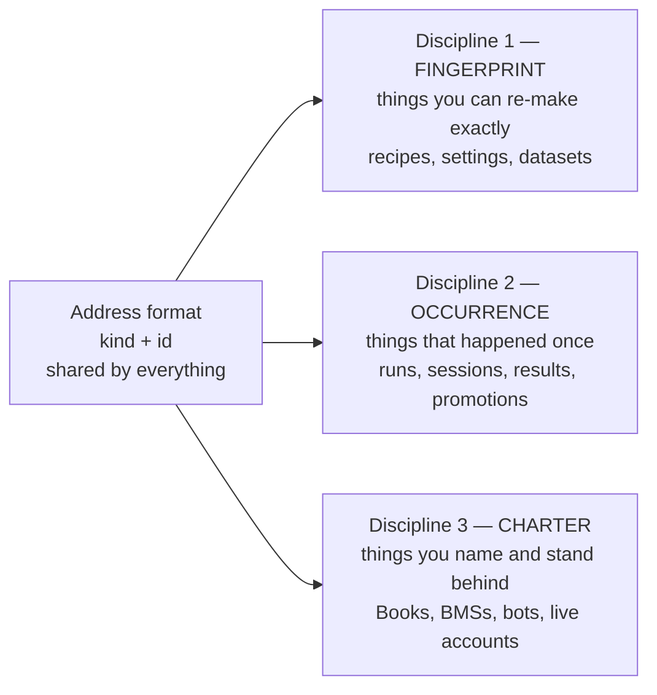
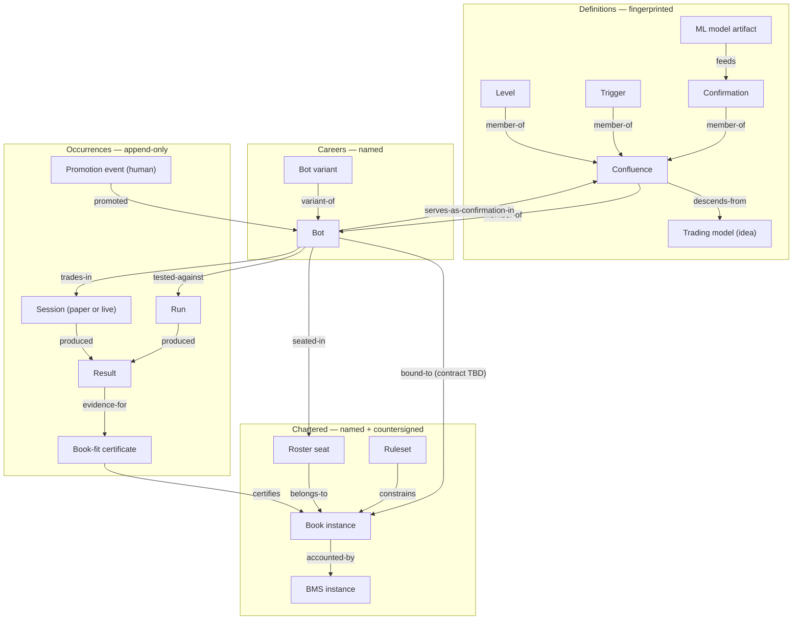

# 07 — Identity & Lineage Study: what QMX's things are called, and how their history connects

**For:** Mubarak, and every future session that touches registration, versioning, promotion or lineage · **Written:** 2026-08-18 · **Status:** study + proposal for operator review — nothing here is ratified
**Operator ruling this document serves:** *"identity + lineage ratified IN PRINCIPLE (lineage is explicitly graph-shaped — Neo4j analogy, grows and compounds); one-card-for-EVERYTHING DENIED as premature abstraction"* (`tracker/tickets/002-qmf-minimal-core.md` §Session 2026-08-18 — locks discussion capture).
**Rule this document obeys:** current operator rulings override every historical layer; GitBook is the Book/BMS baseline and is never assumed; `.recovery/`, the wiki/BMAD corpus and the 37-repo idea ledger are evidence, never authority (`.recovery/trading-node-delta/recovery-lineage-addendum.md` §1, `tracker/map.md` §Notes → Authority).
**Vocabulary this document respects:** "exam" is banned (`tracker/map.md` §Notes → Banned vocabulary); "engine" is not used for backtesting; a confluence has no exit.

---

## In plain words

1. The denied idea was **one ID card for everything**. This study replaces it with **one address format for everything, and different records behind the address** — every house has an address; that does not make every building the same building.
2. There are **three ways a thing can be identified**, and QMX needs all three: things you can **re-make exactly** (a recipe), things that **happened once** (a test, a trading day), and things you **charter by name** (a Book, a BMS, a live account).
3. A recipe is identified by its **fingerprint** — change one number and it is a different recipe, so old test results can never silently become claims about the new version.
4. A thing that happened is identified by **when and where it happened**, and is never rewritten — corrections are new lines added underneath, never edits on top.
5. A Book is **chartered, not fingerprinted**. It keeps its name across edits, its numbers live under its own name, and every change names the decision that made it. You are in the loop for all of it.
6. The word **"model" is banned on its own**. There are three different things: a **trained ML model** (a file of learned numbers), a **trading model** (an idea like "mean reversion in London chop"), and an **analysis** (a study that produces findings, never orders).
7. A **bot has a career, not just a version**. Its name follows it for life; what it currently says has a fingerprint that changes; its parents, its variants, its tests and its promotions hang off the name.
8. A bot may hold **several confluences** — heavy bots are normal — and a whole bot may be used as a confirmation inside another bot.
9. **Paper is a place bots live, not a waiting room.** A paper bot keeps producing recorded results forever, which is exactly what alpha-decay sensing needs.
10. **BENCHED is a seat state**, not a bot state and not a Book state — it describes a bot's chair inside a Book.
11. **Only you promote.** Promotion is one signed line saying who moved what, from where, to where, and why. Evidence attached is optional — so you can still promote a plain-Python bot that never filled in a single form.
12. **Nothing is deleted.** Retired means a state plus a pointer to what replaced it.
13. **Lineage is a graph** — facts of the form "this came from that" — and it is written as plain connected facts, so any store can hold it: a graph database later, or files and one table today.
14. **Crypto and prop firms get new types, never new card formats** — a prop-firm Book is a Book with a rules manifest attached; crypto may get its own BMS; neither changes how identity works.
15. **Six kinds have to exist first.** Everything else in the catalog can wait until the session that actually needs it.

---

## 1. What is being corrected, and why

The prior proposal is `research/00-qmf-synthesis-module-map.md` §Ring 8, which specified:

> *"`qmf.registry` — One manifest format, one discovery function, one promotion state machine — for components, confluences, models, books, prop-firm rulesets, splits and experiments. Content-addressed, append-only, retirement never deletes."*

Six specific faults, each traced to a current ruling:

| # | Fault in the one-card proposal | The ruling that breaks it |
| --- | --- | --- |
| 1 | **"models"** appears as one word in the list | *"'model' is ambiguous (ML / trading / analysis model)"* — `tracker/tickets/002-qmf-minimal-core.md` §Lock 3 |
| 2 | **"books"** appears as one item in the same list, and `BookConfig` is listed as an agent-facing schema (`research/00` §Ring 8, `qmf.spec`) | *"a Book is very specific — own schema on GitBook, operator-in-the-loop deployment — and does NOT go under a generic card"* — ticket 002 §Lock 3; the Book's actual schema is the seven-index form of `capture/components/book-template.md` plus per-instance registry values under ADR-0002 |
| 3 | **One promotion state machine** (`proposed → measured → validated → confirmed → live → retired`) applied to every kind | Promotion is *"HUMAN-ONLY… no agent promotes, ever; he may promote a Python-only bot"* — ticket 002 §Operator dictation. A Level has no live state to be promoted into; a Book's move to live is a countersigned charter act, not a manifest field flip |
| 4 | `Confluence = {level, trigger, confirmations, **exit**, sizing_policy, gates…}` and `Exit` as a fourth typed slot (`research/00` §Level/Trigger/Confirmation/Exit) | *"Confluence = Level(s) + Trigger(s) + Confirmation(s)… **No exit in the confluence.** Exits, sizing, risk = Book territory"* — `artifacts/2026-08-17-qmf-v1-spec-DRAFT.md` §3 |
| 5 | A bot holds **one** confluence | *"a bot may contain MULTIPLE confluences ('heavy bots'; sky is the limit)"* — ticket 002 §Lock 3 |
| 6 | Registration is a **wall** — *"Registration is refused on an empty `definition_source`"* (`reference/00-idea-ledger.md` row 103); *"a confluence whose median winner… is smaller than the p90 spread cannot be registered"* (`research/00` §Novel ideas 3) | Don't-box-in principle: *"uniformity comes from shared contracts, never walls; strictness concentrates in the agentic harness and the promotion gate into the live money path"* — `artifacts/2026-08-17-qmf-v1-spec-DRAFT.md` §1, `tracker/map.md` §Notes |

What survives from the old proposal, and is kept below: content-addressing for recipes (`reference/00-idea-ledger.md` rows 75, 77), append-only records with `supersedes` instead of deletion (rows 15, 76), lineage edges declared explicitly on derived artifacts (row 85), rulesets as versioned data with a retrieval date (row 35), and the folder-with-sources convention (row 103).

---

## 2. The replacement idea: three identity disciplines, one address format

**Discipline 1 — fingerprint identity (content-addressed).** The id *is* the canonical form of the thing. Two agents inventing the same confluence produce the same id, so duplicates collapse for free; changing what `OrderBlock` means changes the id, so old results never silently re-attach to the new meaning (`reference/00-idea-ledger.md` rows 75 and 77). qmf-core already owns the machinery: *"the stamp machine — canonical serialization + fingerprinting of any definition"* (`artifacts/2026-08-17-qmf-v1-spec-DRAFT.md` §2.5).

**Discipline 2 — occurrence identity (event-keyed, append-only).** The id names an event that cannot be reproduced or repeated: a live trading day, a promotion, a refusal. It is minted once and never re-minted. GitBook already runs this discipline: Records is append-only and owns the only journal write path, and a correction is *"a correction entry referencing the corrected entry"* (`capture/components/book-management-system.md`, DEC-0046; https://elios-1.gitbook.io/qmx/components/book-management-system.md).

**Discipline 3 — charter identity (named, versioned by ratified amendment).** The id is a name a human gave the thing and stands behind. Its content changes over time without changing who it is; each change names the decision that authorised it — the pattern GitBook already enforces on Book mode records, where `trigger_decision` must match `DEC-[0-9]{4}` (`capture/contracts/ct-book-02-book-mode-state.md`). Values live *"in the registry under the owning instance"* (ADR-0002 Consequences; https://elios-1.gitbook.io/qmx/decisions/adr-0002-template-and-instance-split.md).

**A run's key is where the three meet.** A stored result names its fingerprinted inputs, is itself an occurrence, and points at the chartered things it was run for — which is the honest version of *"a result that is not a registered Run does not exist"* (`reference/00-idea-ledger.md` row 76).

---

## 3. The kind catalog

Column meanings: **Identity** = what actually names it · **Addressed by** = fingerprint / charter name / occurrence id · **Create → Promote** = who may mint it, then who may move it toward live money · **States** = the states this kind can be in, and only this kind.

Provenance tags on every kind: `[GB]` = GitBook baseline · `[OP]` = current operator ruling · `[REC]` = recovered evidence, needs ratification · `[NEW]` = proposed by this study.

### 3.1 Family A — Component definitions

| Kind | Identity | Addressed by | Create → Promote | States |
| --- | --- | --- | --- | --- |
| **Level** `[OP]` | fingerprint of its canonical spec | fingerprint | agent or human → *no promotion* | evidence state only |
| **Trigger** `[OP]` | same | fingerprint | agent or human → *no promotion* | evidence state only |
| **Confirmation** `[OP]` | same | fingerprint | agent or human → *no promotion* | evidence state only |

**What the record holds:** kind, parameters, the timeframe the definition is *defined at*, warm-up requirement, whether it is path-dependent, its output shape, and where the idea came from. Output shapes are what keep the three kinds apart and must not be merged: a Level emits a zone, a Trigger emits a direction and never a quantity, a Confirmation emits a weight and never an entry (`research/00-qmf-synthesis-module-map.md` §Level/Trigger/Confirmation — kept; its fourth slot, `Exit`, is deleted by `artifacts/2026-08-17-qmf-v1-spec-DRAFT.md` §3).

**Why no promotion:** these are vocabulary, not deployables. Their only lifecycle is *evidence*: how much has been measured about them. Proposed evidence states — `hypothesis | measured | validated | retired` with a citation — come from `research/00` §Registration and are **not** a promotion ladder: they never gate live money, and an agent may set them from measurement. Keeping this distinct from promotion is the direct fix for fault #3.

### 3.2 Family B — Composed definitions

| Kind | Identity | Addressed by | Create → Promote | States |
| --- | --- | --- | --- | --- |
| **Confluence** `[OP]` | fingerprint over the fully-resolved spec including every component's version | fingerprint | agent or human → *no promotion* | evidence state only |
| **Indicator / labeler definition** `[GB]`+`[OP]` | name + version | charter name (versioned) | agent or human → **human** publishes to live sensing | `registered → replayed → published → superseded` |

**Confluence record holds:** `Level(s) + Trigger(s) + Confirmation(s)`, each slot allowing multiple variants; the maximum distance allowed between a level touch and a trigger; nesting references. *"Every slot allows multiple variants (six triggers may fire together; a whole bot can serve as a confirmation — composition nests). No exit in the confluence"* (`artifacts/2026-08-17-qmf-v1-spec-DRAFT.md` §3). Nesting means a confluence may reference a **bot** identity — a cross-family edge, handled in §5.

**Indicator / labeler record holds:** tier, residency, parameters, version, and the parity claim. Three tiers are an operator ruling: *"(1) HEAVY indicators (not millisecond-computable — regime models, volatility forecasts, correlation matrices, ML inference) live in the MIS; (2) light bot/strategy-level indicators; (3) custom indicators built by experimentation"* (ticket 002 §Operator dictation). It is named-versioned rather than purely fingerprinted because GitBook already treats it as a lifecycle object with a five-step path — *"register labeler version and parameters → run through MIS-Archive replay → produce certificates pinned to labeler versions → publish to MIS-Live only after parity is preserved → re-certify affected bots after labeler version changes"* (https://elios-1.gitbook.io/qmx/lenses/mlops-model-lifecycle.md) — and because Law L10 makes version equality between testing and live a hard condition (`reference/05-trading-node-primer.md` §The other organs → MIS/SQS).

### 3.3 Family C — The three things called "model"

This family exists because of one ruling: *"'model' is ambiguous (ML / trading / analysis model)"* (ticket 002 §Lock 3). **Recommendation: the bare word "model" joins the banned-vocabulary list; only these three names are used.**

| Kind | Identity | Addressed by | Create → Promote | States |
| --- | --- | --- | --- | --- |
| **ML model artifact** `[GB]`+`[OP]` | fingerprint of the trained artifact + name/version of its family | fingerprint (artifact) under a charter name (family) | agent trains → **human** publishes to live sensing | `trained → replayed → shadow → published → superseded → retired` |
| **Trading model** (thesis) `[NEW]` | charter name + version | charter name | agent or human → *never promoted* | `open → supported → contradicted → abandoned` |
| **Analysis artifact** `[NEW]` | fingerprint of inputs + method | fingerprint | agent or human → *never promoted* | `draft → published → superseded` |

**ML model artifact** — a file of learned numbers plus the recipe that produced it. Its record holds: training data split id, feature definitions, hyper-parameters, seeds, the training run that produced it, and the parity claim. Heavy inference is MIS-resident by ruling (ticket 002 §Operator dictation, reaffirming the old architecture), and its publication path is GitBook's five-step lifecycle above, with a shadow-rollout default of one full affected-book cycle (ENH-0005, same page). It has both identities on purpose: the *bytes* are fingerprinted so a result can name exactly which artifact it used; the *family* is a charter name so "the regime labeler" survives retraining.

**Trading model** — an idea, in words: "mean reversion in London chop", "gamma-style levels recomputed for forex" (the levels family flagged for revisit in ticket 002 §Operator dictation). It is not executable and never touches money, so it has no live state and no promotion. Its entire job is to be the **lineage anchor** that many confluences and bots descend from — which is how alpha-decay reporting can ask "is this whole idea dying, or just this one bot?", the question `tracker/map.md` §Not yet specified records as hard because *"edge was defined relative to a Book's configurable values, and Books are now plural"*.

**Analysis artifact** — a study, notebook, or report that produces findings. Fingerprinted by what it consumed and how, so a finding can be re-derived. It may never be bound to a Book and never emits orders; that separation mirrors the constitutional rule that a component must declare whether it *senses, decides, accounts, or executes* (ADR-0001 Consequences, via `reference/05-trading-node-primer.md` §The authority chain).

### 3.4 Family D — The bot: a career identity

| Kind | Identity | Addressed by | Create → Promote | States |
| --- | --- | --- | --- | --- |
| **Bot** `[OP]` | charter name, permanent for life | charter name; each revision of its definition additionally carries a fingerprint | agent or human creates → **human only** promotes | `draft → candidate → paper ⇄ live → retired`, with `benched` held on the seat (§4) |

**Record holds:** the confluence(s) it contains — *plural, by ruling*; the binding contract to a Book (**a typed hole — the contract is not yet designed**, `artifacts/2026-08-17-qmf-v1-spec-DRAFT.md` §5 and `tracker/map.md` §Not yet specified); which pairs it is for; parent and variant links; and its accumulating lineage. Straight from the ratified vocabulary: *"Bot = confluence + the binding contract linking it to a Book — and a bot accumulates: as it moves through the system, lineage/genealogy is appended. Bot variants are first-class: a bot failing on one pair may work on another, or pass after one trigger variable changes; parent/variant links are tracked"* (spec §3).

**Two identities, deliberately.** The *name* is the career: it survives every revision and carries the whole history. The *fingerprint* is what the bot says right now, and it changes whenever anything inside it changes. Results attach to the fingerprint; the career attaches to the name. Without the split, either the bot's history resets on every edit, or old results silently re-attach to new logic.

**A variant is a new bot, not a sub-object** `[NEW]` — because a variant needs its own state, its own seat, its own results and its own promotion. It is linked back by a `variant-of` edge. This is the reading of "bot variants are first-class" that costs least later.

**The escape hatch is a field, not an exception** `[NEW]`. A bot record may declare its definition as *opaque* — meaning plain Python, no registered confluence. It still gets a name, a state, and a promotion record. This is the model's answer to *"he may promote a Python-only bot (confirms guidelines-not-walls)"* (ticket 002 §Operator dictation). Without the field, that promotion would be an undocumented exception; with it, the roster stays honest and the bot simply has fewer edges than its neighbours.

### 3.5 Family E — Chartered instruments (Book territory and its neighbours)

**This family is the heart of the correction. None of these are cards.**

| Kind | Identity | Addressed by | Create → Promote | States |
| --- | --- | --- | --- | --- |
| **Book template** `[GB]` | one document, versioned | charter name | **human only** → n/a | `sealed sections 0–5`; Section 6 stays `GAP-0001` |
| **Book instance** `[GB]`+`[OP]` | charter name (e.g. the scalper book) | charter name; values under its own name in the registry | **human only**, operator-in-the-loop → **human only** | `LIVE / PAPER / STOOD_DOWN / retired` (see §4) |
| **BMS instance** `[OP]` | charter name | charter name | **human only** → n/a | `active / retired` |
| **Roster seat** `[GB]`+`[REC]` | the pair (Book, bot) plus its admission event | occurrence-anchored | Book admits, human approves live admission | `admitted / paper / live / BENCHED / removed` |
| **Risk seat** `[REC]` | **deliberately undecided** | open | Book | open |
| **Venue / account binding** `[GB]`+`[OP]` | charter name | charter name | **human only** (credentials) → n/a | `bound / unbound / unknown_state` |

**The Book instance record is the seven-index form, not a manifest.** GitBook's own words: a Book is *"a pod with charter, capital, roster, profile, rules, and journals. A book controls bots and never trades directly"* (`capture/glossary.md`, DEC-0002). Its schema is the template's sealed grammar — *"charter grammar, footprint grammar, money-rule grammar, entrance-exam requirements, leash chain, and capacity/sweep mechanics"* (https://elios-1.gitbook.io/qmx/components/book-template.md) — with Section 6 an explicit gap the docs *"must not invent"* (FM-4, GAP-0001). Its numbers live in the registry under its own instance name and several carry `operator_review: true` (`capture/registry/variables.md`; https://elios-1.gitbook.io/qmx/registry/variables.md). Its charter fills four slots — game played, money shape, customer plus headline metric, death condition (DEC-0027). Nothing in that shape survives being flattened into a generic record, which is exactly the operator's objection.

**A Book variant is a new Book** `[NEW]`, linked by `variant-of`. The operator's requirement is *"Book variants carry lineage/types (scalping-book variants; prop firms same logic)"* (ticket 002 §Operator dictation). The reason to mint a new identity rather than bump a version is money: a Book owns its own capital, cycle and ledger — *"a cycle is a seed-to-cap event; money resets between cycles, while knowledge persists"* (L5, DEC-0006) — and scalping-book-v2 must not inherit v1's live ledger. A `book_type` field (`scalping | prop-firm-evaluation | prop-firm-funded | crypto | …`) is where the seams live; a prop-firm Book is *"just a new Book"* (ticket 002 §Lock verdicts) and its design is deferred (GAP-0004; `tracker/map.md`).

**Multiple BMSs are a first-class possibility** `[OP]` — *"possibly MULTIPLE BMSs long-term (crypto may need standalone versions)"* (ticket 002 §Operator dictation). So BMS gets an identity and a scope: which Books it accounts for, which ledger it owns, which mode registry is authoritative for them (`CT-BMS-02` is *"the authoritative mode map"*, `reference/05-trading-node-primer.md` §The BMS).

**Three seat concepts, never collapsed** — carried verbatim from `.recovery/trading-node-delta/recovery-lineage-addendum.md` §6.2: roster seat (membership and lifecycle state, where `BENCHED` lives), risk seat (the active allocation channel), and the legacy capital slot (**ancestry only — not a kind**; its auctions, DPR ranking and slot tables do not survive). Whether a risk seat needs persistent identity or is derived from `(book, bot, cycle, allocation version)` is left open by the addendum (§10 Q3) and is left open here.

### 3.6 Family F — Rules and data definitions

| Kind | Identity | Addressed by | Create → Promote | States |
| --- | --- | --- | --- | --- |
| **Ruleset** (prop-firm, venue, session) `[REC]` | fingerprint + retrieval date | fingerprint | agent may draft → **human** attaches to a Book | `drafted / attached / stale / superseded` |
| **Dataset / partition** `[GB]`+`[REC]` | dataset id + per-partition content hash | fingerprint | ingestion writes; owner component declared | `written / superseded` (never edited) |
| **Data split definition** `[OP]`+`[REC]` | split id + split-registry version | fingerprint | human or agent → n/a | `open / spent / closed` |
| **Measurement setting** (fill assumptions, metric set, venue model) `[REC]` | fingerprint | fingerprint | agent or human → n/a | `registered / superseded` |

**Ruleset** — *"the ruleset is data, not code: a registered manifest carrying all six axes plus mandatory `source_url` + `retrieved_on`, versioned like any other component"* (`reference/00-idea-ledger.md` row 35, six axes: anchor · measure · cadence · day-boundary/tz · ratchet & lock · breach action). The retrieval date is part of identity because *"all three firms' pages changed within four months of the research — a ruleset without a retrieval date silently models a rule that no longer exists"* (same row). This is the shape prop-firm Books will use when their session finally happens.

**Dataset / partition** — GitBook already has the register: `dataset_id`, `owner_component`, `write_policy`, optional `retention_policy` and `schema_ref`, with complete ownership left as GAP-0003 (`capture/contracts/ct-data-01-data-ownership-register.md`; https://elios-1.gitbook.io/qmx/contracts/ct-data-01-data-ownership-register.md). Content-hashing per partition and superseding-by-new-record come from `reference/00-idea-ledger.md` row 15. The GitBook is explicit that store choice is not to be inherited: *"do not select databases, retention, migration, or backup policy from the old vault without ratification"* (`reference/05-trading-node-primer.md` §The other organs → Data layer).

**Data split definition** — the operator's data-science ruling gives this kind its reason to exist: *"agents get properly-split data BY DEFAULT (splits/discipline built into the access path so agents can't skip data-science technique)"* (ticket 002 §Operator dictation). A split has an identity so that a result can name which split it spent, and so budget spent against a split can be counted (`research/00` §Ring 7 `qmf.ledger`). Note the tension with don't-box-in: the split lives in the **access path**, so the right thing is the easy thing, and the wall stands only at the promotion gate.

### 3.7 Family G — Occurrences (the evidence family)

| Kind | Identity | Addressed by | Create → Promote | States |
| --- | --- | --- | --- | --- |
| **Experiment** `[REC]` | occurrence id | occurrence | agent or human → n/a | `registered → running → concluded / abandoned` |
| **Run** (reproducible) `[REC]` | fingerprint of its full input spec | fingerprint | agent or human → n/a | `recorded` (immutable) |
| **Session** (paper or live) `[OP]`+`[NEW]` | occurrence id | occurrence | opened by the node; **human** authorises live | `open / closed`, with `mode ∈ {paper, live}` |
| **Result** `[REC]` | digest of its canonical form, attached to its Run or Session | fingerprint | machine only | `recorded` (immutable) |
| **Book-fit certificate** `[GB]` | certificate id + the tuple it pins | occurrence | machine mints → **never authorises live** | `valid / invalidated` |
| **Promotion event** `[OP]` | occurrence id | occurrence | **human only, always** | `recorded` (immutable) |
| **Refusal record** `[GB]` | occurrence id | occurrence | machine only | `recorded` (immutable) |

**Run vs Session is the sharpest line in the catalog** `[NEW]`. A **Run** is bounded, offline and reproducible, so it earns a fingerprint identity: `run_id = fingerprint(RunSpec)`, where the spec is a closed set of ids — confluence, split, data fingerprint, fill assumptions, metrics set, venue model, framework version plus commit and a dirty flag, seeds (`reference/00-idea-ledger.md` row 77). Same spec, same id: re-runs deduplicate and a search can be asked whether it explored anything new. A **Session** is open-ended, wall-clock-bound and *not* reproducible — you cannot re-run Tuesday — so fingerprinting it would be a lie. It gets an occurrence id and accrues results continuously.

**Paper is a standing state, and this is where it is represented.** *"Paper trading is a STANDING STATE, not a waiting room: bots paper-trade under documented conditions (kill switch fired, daily limit hit, prop-firm rules) and results are recorded continuously regardless — feeding ALPHA-DECAY sensing, which needs uninterrupted data points"* (ticket 002 §Operator dictation). Modelled as: a Session with `mode: paper` that stays open and keeps producing Results with the same schema live Results use, plus the reason it is in paper and the condition that will end it. This is compatible with the GitBook baseline — *"paper mode is a frozen counterfactual diagnostic, never a cosmetic account balance"* (L13, DEC-0014) — and with its one hard exception: under a news block *"no paper data is collected under a known invalid news window"* (L9, DEC-0010, via `SCN-0003`). That exception must be a typed gap in the paper stream, not a silent hole, or alpha-decay sensing will read a news blackout as decay.

**Book-fit certificate** — the word "exam" is banned, so this study renames the concept and keeps GitBook's shape: `bot_id`, `book_profile`, `labeler_versions`, `ev_by_regime`, `mean_loss_r`, `fire_rate_band`, `breaker_expectation`, `cost_ratio`, with the rule *"certificate is invalid if live labelers differ from exam labelers"* (`capture/contracts/ct-exam-01-exam-certificate.md`; https://elios-1.gitbook.io/qmx/contracts/ct-exam-01-exam-certificate.md). Two properties matter for identity: a bot is *"not validated in the abstract; it is validated against the book contract it applies to join"* (DEC-0055), so a certificate is an edge between a bot and **one** Book — which is precisely the bot × Book matrix `tracker/map.md` records; and it *"may never authorize live trading"*, which is what keeps promotion human.

**Promotion event** — one line, human-signed: who, what, from-state, to-state, when, why, and optional evidence references. Mandatory for every state change into or out of live; evidence optional by design, because the operator must be able to promote a bot that never used the forms. This one record is what makes "promotion machinery needs little design" (ticket 002 §Operator dictation) literally true.

**Refusal record** — included because every refusal is already law: *"every door or gate refusal signs the veto ledger"* (L11) and *"a no is not journaled → treat as violation of DEC-0012"* (`reference/05-trading-node-primer.md` §The BMS → Records desk). Refusals are lineage: they are how a report answers *why* a strategy failed, which the operator requires to be visible down to the component (ticket 002 §Operator dictation, Metrics & reports).

---

## 4. States, per kind — and where BENCHED lives

There is no global state machine. This table is the whole state model.

| Thing | Its states | Who moves it | Note |
| --- | --- | --- | --- |
| Component / Confluence | `hypothesis · measured · validated · retired` | agent may set from measurement | evidence, not deployment; no live state exists |
| Trading model (thesis) | `open · supported · contradicted · abandoned` | agent or human | never live |
| ML model artifact | `trained · replayed · shadow · published · superseded · retired` | human publishes | five-step lifecycle, GitBook MLOps lens |
| Bot | `draft · candidate · paper · live · retired` | **human only** into/out of live | `live` is binary — live or not (ticket 002) |
| Roster seat (Book, bot) | `admitted · paper · live · BENCHED · removed` | Book automatics + human admission | **BENCHED is a seat state** — addendum §4 |
| Book instance | `LIVE · PAPER · STOOD_DOWN · retired` | human; automatic escalation only | see the split below |
| BMS instance | `active · retired` | human | |
| Session | `open · closed`, `mode ∈ paper \| live` | node opens; human authorises live | paper sessions stay open indefinitely |
| Run / Result / Promotion / Refusal | `recorded` | machine, except promotion | immutable once written |

**The enum split.** GitBook uses one four-value enum for both Book mode and seat state: `LIVE, PAPER, BENCHED, STOOD_DOWN` (`capture/contracts/ct-book-02-book-mode-state.md`, `capture/contracts/ct-paper-01-paper-mode-transition.md`). The later delta register claims this *"mixes two namespaces (Book mode vs roster-seat state) and must be split"* (K-26/C-02, via `reference/05-trading-node-primer.md` §Book modes), and the recovery addendum independently rules that *"`BENCHED` is a roster-seat state, not a Book mode"* (§4). Two evidence layers agree, so this study proposes the split — and flags it as **Open question 1**, because it edits a GitBook contract.

**What stays open regardless:** the complete paper/live transition state machine is `GAP-0006` — only the breaker path is ratified (*"after N consecutive stop-outs, bench to paper for the rest of the day and auto-reset at next open"*, DEC-0032). This study does not close it; it only requires that whatever closes it names its states per kind rather than globally.

---

## 5. The lineage graph

**The shape.** Lineage is a set of plain facts: `(from-node, edge-kind, to-node, when, who-wrote-it)`. Nothing more. *"Lineage is explicitly graph-shaped — Neo4j analogy, grows and compounds"* (ticket 002 §Lock 3); the model must not presume the store.

**Five store-agnostic rules** `[NEW]`:

1. A node is referenced by **kind + id only** — never by a row number, file path or database key. The address format from §2 is the entire coupling.
2. Every edge is an **append-only fact** carrying its own timestamp and its author (human or which agent). Edges are never deleted; an edge is undone by a superseding fact.
3. Edges are **directional and typed**, and their meaning is fixed by this document, not by the store's schema.
4. Any store that can answer *"give me every edge touching node X"* satisfies the contract — a graph database later, a triples table in SQLite, a Parquet edge file, or one JSON file per node folder today. `GAP-0003` forbids inheriting a store choice without ratification, and the current storage sketch is explicitly *"no database server"* (`tracker/map.md` §Not yet specified).
5. The graph is **evidence, not authority**. Nothing in it may size, block or trade — the same rule GitBook puts on MIS (L6) and on the Reporting desk, which *"computes from Records and has zero authority"* (DEC-0046).

**Edge kinds:**

| Edge | Reads as | Typical use |
| --- | --- | --- |
| `member-of` | X is a part of Y | Level → Confluence; Confluence → Bot (multiple, by ruling) |
| `variant-of` | X is a variation of Y | Bot → Bot; Book → Book; Confluence → Confluence |
| `parent-of` / `derived-from` | Y came from X | forked bot; analysis derived from a dataset |
| `supersedes` | X replaces Y, Y is kept | new dataset partition; corrected record; retired Book variant |
| `descends-from` | X claims this idea as ancestry | Confluence → Trading model; Bot → Trading model |
| `serves-as-confirmation-in` | a whole bot is used as a confirmation | Bot → Confluence (nesting; cycles forbidden) |
| `bound-to` | X is bound to Y by the binding contract | Bot → Book (**contract not yet designed**) |
| `seated-in` / `belongs-to` | X holds a chair in Y | Bot → Roster seat → Book |
| `accounted-by` | X's money is accounted by Y | Book → BMS |
| `constrains` | X's rules limit Y | Ruleset → Book; kill switch → pair |
| `tested-against` | X was measured against Y | Bot → Run; Run → Split / Dataset / Book conditions |
| `produced-by` | X was produced by Y | Result → Run or Session; ML artifact → training run |
| `pins` | X fixes Y's exact version | Run → framework version; Certificate → labeler versions |
| `certifies` | X is evidence that A fits B | Certificate → (Bot, Book) |
| `feeds` | X's output is an input to Y | Indicator / ML artifact → Confirmation; MIS → Book door |
| `trades-in` | X traded during Y | Bot → Session (paper or live) |
| `promoted-by` | this state change was signed here | Bot state change → Promotion event → human |
| `refused-by` | X was refused at Y | Intent → Door → Refusal record |

**What the graph buys, in the operator's own terms.** Alpha-decay sensing asks "is this idea dying?" by walking `descends-from` from a Trading model down to every bot and every paper Result. Triage asks "which component failed?" by walking `member-of` down from a bot to the component whose Results moved. Both are graph walks, not new subsystems — which is the compounding the Neo4j analogy was pointing at.

---

## 6. Where the shared parts genuinely are

**Genuinely shared across every kind — this is what the one-card idea got right:**

1. **The address format.** `kind + id`, and nothing else, is how anything refers to anything. This is the only universal.
2. **The stamp machine.** One canonical serialization and fingerprinting routine, already scoped into qmf-core (spec §2.5), used by every kind that claims reproducibility.
3. **Versioning discipline.** *"Definitions carry versions from birth; changing one mints a new version, never rewrites"* (spec §2.6). True for recipes, artifacts and charters alike — only the *unit* of change differs.
4. **Append-only history with correction-by-append.** DEC-0046's rule generalises: nothing is edited in place, ever; corrections and supersessions are new records pointing at old ones.
5. **Two timestamps on every fact** — when it happened and when it became knowable (spec §2.2). This is what makes lineage honest under replay.
6. **Typed refusals.** Every "no" carries a machine-readable name and a human explanation (spec §2.4).
7. **Naming your source.** Every record says where it came from — a decision id, a paper, a chat message, a URL with a retrieval date. GitBook enforces the pattern already (`trigger_decision` must match `DEC-[0-9]{4}`).

**Genuinely divergent — this is what the one-card idea got wrong:**

| Dimension | It differs by kind because… |
| --- | --- |
| **Addressing** | reproducible things earn fingerprints; unrepeatable things must not have them (a live Tuesday cannot be re-derived); chartered things must keep their name across edits |
| **Record shape** | a Book's record is the seven-index form with registry values under its own name; a Level's record is a parameter set. No common field list survives that gap |
| **Who may create** | agents mint recipes freely; only a human charters a Book, a BMS or a live account binding |
| **What "promotion" means** | for a bot, moving to live money; for an ML artifact, publishing to live sensing after parity; for a Level, **nothing at all** — it has an evidence state instead |
| **States** | paper is a standing state for bots and Books and meaningless for a Confirmation; BENCHED belongs to a seat and to nothing else |
| **Who is in the loop** | deploying a Book is operator-in-the-loop by ruling; registering a confluence is not |
| **Strictness** | walls only at the promotion gate and inside the agentic harness; research lanes stay free (`tracker/map.md` §Notes, don't-box-in) |

**One sentence for the operator:** the shared part is the *address and the paperwork discipline*, never the *form*.

---

## 7. Seams deliberately left open

| Seam | How the model stays open |
| --- | --- |
| **Crypto** | new `book_type` and new venue/account bindings; possibly its own BMS instance (ticket 002 §Operator dictation). Dataset kinds already anticipate DOM / level 2-3 / tape (spec §2.3). No identity discipline changes |
| **Prop firms** | a Book with a Ruleset attached; deferred entirely (GAP-0004, ticket 002 §Lock verdicts). The Ruleset kind is the only new machinery it needs |
| **Multiple BMSs** | BMS is a kind with identity and scope from day one, so a second one is an instance, not a rewrite |
| **The bot↔Book binding contract** | a named, typed hole on the Bot record and one edge kind (`bound-to`). Nothing else in the model depends on its internals |
| **Risk-seat identity** | left undecided exactly as the addendum leaves it (§10 Q3) |
| **Store choice** | §5 rules 1 and 4. No kind's identity depends on a database existing |
| **Exit / sizing / stop policy** | not modelled here at all — Book territory, and *"exit mechanisms are a whole world"* (ticket 002 §Operator dictation). Identity for them is the Book/BMS session's business |
| **Backtesting funnel** | Run and Result are shaped to be keyed and stored; every question about *stages, batteries and honesty* belongs to ticket 008 |

---

## 8. What actually has to exist first

The catalog is a map, not a build order. The **smallest honest starting set** — the kinds that cannot be deferred without making the rest incoherent:

1. **Bot** (career name + definition fingerprint + opaque-definition escape hatch)
2. **Confluence** and its three component kinds
3. **Book instance** (as it already exists on GitBook — no new schema invented)
4. **Run + Result** (so a claim can name what produced it)
5. **Promotion event** (so every live move is signed)
6. **The edge list** in §5 — cheap to write, expensive to retrofit

Everything else — Rulesets, splits, certificates, BMS multiplicity, trading-model theses — arrives with the session that needs it. Building them now would repeat the mistake this study exists to correct.

---

## 9. Open questions for the operator

Each is a yes/no. The recommendation is what this study would do if you said nothing.

1. **Should BENCHED be moved off the Book's mode list and onto the bot's seat inside a Book?**
   *Recommend YES.* Two evidence layers already say so, and it removes a permanent confusion between "the Book is benched" and "this bot is benched." Cost: it edits a GitBook contract, so it needs your word.

2. **Can a single bot be in paper while its Book stays live?**
   *Recommend YES.* Your pair-scoped kill switch and continuous alpha-decay data both require it — the Book keeps trading everywhere else while one bot's results keep flowing.

3. **Should every bot get a name and a signed promotion line — including a plain-Python bot that never used any form?**
   *Recommend YES.* One line, written by you. The forms stay optional; the record does not, or the roster starts lying.

4. **Should the bare word "model" be banned, leaving only ML model / trading model / analysis?**
   *Recommend YES.* This is your ambiguity objection turned into a rule agents cannot drift around.

5. **Is scalping-book-v2 a NEW Book with a link back to v1, rather than a new version of the same Book?**
   *Recommend YES.* A Book owns its own money and cycle; v2 must never inherit v1's ledger. The lineage link keeps the family visible.

6. **Should each Book be accounted by exactly one BMS — never two?**
   *Recommend YES.* It keeps a second (crypto) BMS clean and stops two ledgers claiming the same money.

7. **Should paper results be stored in the same shape as live results, with a mode flag, rather than in a separate practice store?**
   *Recommend YES.* Alpha-decay sensing needs one uninterrupted series; two stores guarantee a seam exactly where the signal lives.

8. **When a news block stops paper recording, should the gap be written into the stream as a labelled hole?**
   *Recommend YES.* The baseline forbids collecting paper data in a known-invalid window; without a labelled hole, decay sensing will read the blackout as decay.

9. **Should a whole bot be allowed to act as a confirmation inside another bot, with the nesting recorded and loops forbidden?**
   *Recommend YES.* It is already ratified vocabulary; the only addition is refusing a bot that would end up confirming itself.

10. **Should "where the idea came from" be required to register a definition — or only required at the promotion gate?**
    *Recommend: required only at the promotion gate.* Requiring it at registration is a wall in the research lane, which your don't-box-in rule puts off limits.

11. **Should the risk-seat identity question stay open until the Book/BMS session?**
    *Recommend YES.* Deciding it here would freeze an answer the money rules have not asked for yet.

12. **Should this catalog be built in the six-kind order of §8, with everything else deferred to the session that needs it?**
    *Recommend YES.* It is the smallest thing that is still honest.

---

## 10. Sources

**Current rulings (authority):** `tracker/tickets/002-qmf-minimal-core.md` §Session 2026-08-18 · `tracker/tickets/009-identity-lineage-study.md` · `tracker/map.md` §Notes, §Decisions so far, §Not yet specified · `artifacts/2026-08-17-qmf-v1-spec-DRAFT.md` §1, §2, §3, §5.

**GitBook baseline (Book/BMS authority, never assumed):** live book https://elios-1.gitbook.io/qmx (index verified 2026-08-18 against the local immutable capture — same 67 pages, no Book-schema page beyond the two below). Pages cited: `components/book-template.md` · `decisions/adr-0002-template-and-instance-split.md` · `registry.md` and `registry/variables.md` · `contracts/ct-book-01-trade-intent-envelope.md`, `ct-book-02-book-mode-state.md`, `ct-paper-01-paper-mode-transition.md`, `ct-exam-01-exam-certificate.md`, `ct-exam-02-cohort-correlation-certificate.md`, `ct-data-01-data-ownership-register.md`, `ct-qml-01-qml-library-interface-register.md` · `lenses/mlops-model-lifecycle.md`, `lenses/mlops-data-pipeline.md` · `components/book-management-system.md`, `components/paper-mode-system.md` · `system-constitution.md`, `glossary.md`, `gap-report.md`. Local capture: `C:/Users/Mubarak/Documents/QMX/raw/online/qmx-gitbook/captures/2026-07-18T141659Z/pages/markdown/`.

**Plain-words reading of the baseline:** `reference/05-trading-node-primer.md` (§The Book, §The BMS, §Book modes, §The other organs, §The authority chain, §Open per the baseline itself).

**Recovered evidence (needs ratification):** `.recovery/trading-node-delta/recovery-lineage-addendum.md` §1, §3, §4, §6.2, §10, §11.

**Prior proposal being corrected:** `research/00-qmf-synthesis-module-map.md` §Ring 7, §Ring 8, §Level/Trigger/Confirmation/Exit, §Registration, §Novel ideas.

**Borrowed mental models (design study only, no code):** `reference/00-idea-ledger.md` rows 15, 35, 69, 75, 76, 77, 84, 85, 103.
