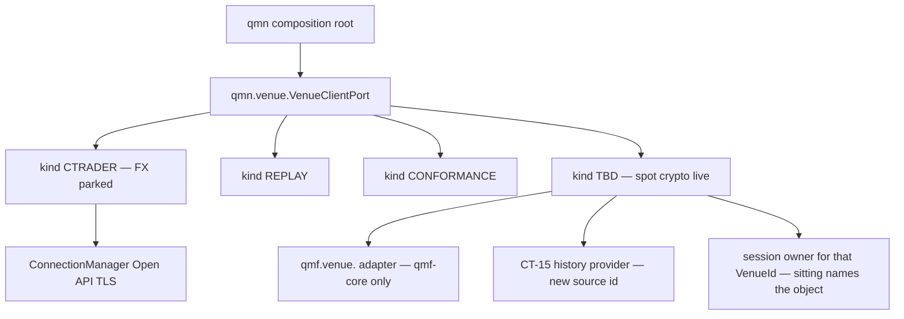

# Crypto CONNECT + history + paper-path — architecture INPUT brief

> **This is not an architecture spine.** It mints no `AD-n` / `TN-n`. It is not operator-ratified. It is not implementation authorization. It is the **input packet** a later `bmad-architecture` increment (feature altitude, purpose `build-substrate`) must load, together with the parent spines, before it writes a real spine + memlog.
>
> **Canonical path:** `workroom/research/2026-09-09_crypto-connect-and-history.md`  
> **Planning copy:** `.hermes/plans/2026-09-09_crypto-connect-and-history.md`  
> **Not** `docs/`. Documentation-factory writes `docs/` only after a ratified spine.
>
> **Do not:** implement; edit `docs/` or code from this file; run `bmad-sprint-planning` or `bmad-build`; extract a third venue-gateway library; redesign Book / BMS / sizing; fake-ratify a spine; freeze an exchange; git-commit this file as design law.

**Inspected (read-only, no checkout):** `integration@1b451a848d897e42f6e2c7fd9f2ea86fab7295f2`. Working tree was `main`. Facts below are file-backed unless tagged `[ASSUMPTION]` or `[DECISION NEEDED]`.

**Operator posture this brief serves:** first live-money market leaning **spot crypto**; FX live **parked**; platform must **CONNECT**, support **paper**, ingest **historical** crypto data, and connect **out of the box**. IBKR only if actually free/demo **and** not the first live-money venue. Crypto Book/BMS/sizing = later **Codex risk sitting**.

---

## 0. How a later architecture sitting uses this file

`bmad-architecture` coaching path is the default; Fast path is allowed if the operator wants speed, with every inference tagged `[ASSUMPTION]`. This brief is **Fast-path raw material**, not a substitute for that sitting.

| Sitting field | Value this brief proposes (sitting may overturn) |
|---|---|
| Intent | **create** a child increment spine (not validate, not a silent update of TN-11) |
| Altitude | **feature** (keeps epics; does not expand per-story detail) |
| Purpose | **build-substrate** (terse invariants for factory units) |
| Parent spines (read-only) | `architecture-QMX-2026-08-19` (AD-1..41); `architecture-NODE-2026-08-28` (TN-1..25); honor QMB B-1..15 and QML QL-1..10 |
| Persistent facts | `docs/AGENTS.md`, `docs/constitution.md` L21–L22 + L30 annotation, `CLAUDE.md` BMad-planning-only pipeline |
| Driving inputs | this brief; PRD `prd-QMX-2026-08-21` **after** the §7 amendment in §12; integration brownfield in §3 |
| Output of the sitting | `ARCHITECTURE-SPINE.md` + `.memlog.md` under `_bmad-output/planning-artifacts/architecture/architecture-CRYPTO-CONNECT-<date>/` — **not this file rewritten** |

**Load, do not re-derive:** AD-26/27/28, DEC-0135..0141, DEC-0241/0242/0243/0244, TN-2/TN-9/TN-11/TN-12/TN-13/TN-22. A local decision that contradicts one is a **conflict to surface**, not an override.

**Do not run in that sitting:** `bmad-sprint-planning`, `bmad-build`. After a ratified spine: `/documentation-factory` → `bmad-create-epics-and-stories` → Grok factory. QMX `CLAUDE.md`: BMad is planning-only; implementation is factory-only.

---

## 1. Goal

Make QMX able to:

1. **CONNECT** to one liquid **spot-crypto** venue through the existing neutral port (new CT-18 record, new live `VenueClientPort` implementation).
2. Ingest **historical** crypto data through **CT-15** (new source, not Dukascopy).
3. Run an **honest paper path**: vendor sandbox/testnet, `AccountRole.DEMO`, `world=live`, **same** live client — which requires compose-time client selection, session, **submit encode**, and position/balance **read-back** (or a named FTR that forbids claiming paper).

**Non-goals (hard):** crypto Book / BMS / position-sizing; futures/perps/options; local matching engine; CCXT/Hummingbot/IBKR-as-adapter; realizing `VenueClientPort` inside `qmf-venue` (DEC-0242 recorded-not-applied); unparking FX live; IBKR as first live-money venue; reusing FX rollover as funding; in-process SL as surviving protection.

---

## 2. Design paradigm (proposed to the sitting — not adopted)

**Same hexagonal composition root, second live adapter behind the node-minted port.**

The node remains the only impure shell (TN-2). Crypto does not get a second runtime, a second port type, or a gateway library. It gets:

- a **new CT-18 capability declaration** (L22 / DEC-0061 / DEC-0138: “CCXT-class crypto slots in later by declaring a different record through the same port”);
- a **new `VenueClientPort` implementation** selected by `(world, VenueId)`;
- adapter code in `qmf-venue` (imports only `qmf-core`);
- wiring, verification runner, CT-18 fills, error-map rows only in `qmn.venue` (DEC-0241).

“CCXT-class” is a **kind of venue**, not a license to import CCXT as the adapter (DEC-0013).



---

## 3. Brownfield — verified on `integration`

### 3.1 Port and selection

`qmn/src/qmn/venue/port.py`: `VenueClientKind = CTRADER | REPLAY | CONFORMANCE`. `select_venue_client`:

- `world=replay` → REPLAY for every `VenueId`;
- `world=simulated` → refuse;
- `world=live` + `VenueId` starting `conformance:` → CONFORMANCE;
- **else live → CTRADER.**

That last branch is a **connect blocker**. A crypto `VenueId` today becomes the cTrader client.

TN-11 law: implementation selected by `(world, VenueId)`, never by `VenueId` alone; replay composition refuses any venue-connecting kind. **Keep.** The live default-to-CTRADER is an implementation accident, not that law.

TN-11 also says the node ships **THREE V1 implementations**. A fourth live kind is a **child amendment of TN-11**, not a silent extra enum member. Surface it; do not pretend TN-11 already allowed “any adapter.”

### 3.2 Live submit and reconcile

`LiveCTraderClient.submit` (`qmn/src/qmn/venue/live.py` ~489–516): if session+capabilities ready, still returns `unsupported capability` — “live command wire handoff is out of Story 24.3 scope; sensing/recording only.” **No ProtoOA NewOrder encode.**

`reconcile()`: FTR-01 `unsupported capability` — position/balance read-back mapping onto CT-13 unresolved; no eighth journal type.

`ConnectionManager.connect_open_api`: implemented; **callers = tests + docstring**. No production node caller.

**Honesty:** even FX paper cannot place a demo order or reconcile balances. Crypto “paper” that only opens a socket is the same lie.

### 3.3 Paper on the node

`qmn/src/qmn/paper/routing.py`: `NODE_PAPER_ACCOUNT_ROLE = DEMO`, `NODE_PAPER_WORLD = LIVE`. Paired demo target; no Bot/Book twin (DEC-0261). TN-9: paper = Book-level mode; target = paired **cTrader** demo; soak = full live machinery on that demo; live connection sensing-only during soak.

Crypto paper must **keep** AD-35 / TN-9 shape (role demo, world live, same live client, no twin, no profit gate) and **specialize** “demo host” to the vendor sandbox. That is a TN-9 child annotation, not a new paper theory.

### 3.4 FTR-01

Position/balance observation kinds refuse. CT-13 closed seven stand (`decision`, `order`, `fill`, `risk transition`, `promotion`, `data quality`, `control action`). Mapping those two kinds onto the seven is the missing annotation — an eighth type stays forbidden.

Without a mapping (or an explicit remaining FTR), paper soak drift checks in TN-9 **cannot run** on crypto.

### 3.5 Data

- Dukascopy: CT-15 historical **FX ticks**, download-once, personal-use (`packages/qmf-data/src/qmf/data/dukascopy.py`). Node deep-history source `"dukascopy"` (`qmn/src/qmn/venue/edge.py`). TrueFX/HistData companions forbidden to implement.
- Live intake canonical source **hardcoded** `"ctrader"` (`qmn/src/qmn/data/intake.py`). Sibling failover forbidden.
- CT-15 active providers: Dukascopy, calendar feed; cTrader is **intended**. Crypto is absent.
- No CCXT / Binance / Bybit / IBKR / JForex **trading** adapter in tree.

### 3.6 ConnectionManager is mixed

`packages/qmf-venue/src/qmf/venue/connection.py`:

| Neutral (reuse) | cTrader-shaped (do not pretend generic) |
|---|---|
| WriterId, command vs sensing pipes, injected sinks, SecretStore as sole in-memory value holder, session epoch, UNKNOWN block law | `connect_open_api` TLS to Open API; `proto_tag`; `CTRADER_OPEN_API_PORT` 5035; `send_framed` length-prefixed ProtoMessage; `StreamReader`/`StreamWriter` |

TN-11: no second connection manager, no second in-memory secret holder, transport increment completes `qmf-venue`. Crypto REST+WS is **not** that socket. Sitting must name the session object without a third library and without a second secret-value holder **per session law** (one holder per credential/session, not “one class forever”).

### 3.7 Verification suite is forex-wire

`ProbeCheck` (`qmf/venue/observation.py`): `spot-timestamp-unit`, `daily-boundary`, `bar-basis`, `pip-formula`, `money-exponent`, `amend-atomicity`, `position-model`, `pacing-scope`, `protective-stop-forms`. Set is **addable, never redefined**. `REQUIRED_CONNECTION_CHECKS` includes pip-formula and 17:00-class daily-boundary.

Crypto must **not** run pip-formula / NY daily-boundary as if they were universal. CT-18 `verification_suite` is per-declaration. Sitting decides: adapter-local suite list vs adding ProbeCheck members. Do not delete forex checks.

### 3.8 Protective stop

CT-18 / TN-6 / TN-11: every live order carries a venue-resident stop in the **declared** form; if a Book requires attachment and CT-18 declares none, placement is `unsupported capability`. Many spot books cannot attach SL. **This increment records the capability.** It does **not** redesign Book to emulate stops in-process (in-process stops die with the node — the reason cTrader stops are venue-resident).

### 3.9 PRD V1

`prd.md` §7: “Futures and options (permanently excluded); any asset class beyond the seeded forex vertical.” Anti-goal: “no assumption that a future venue is recolored forex.” `correlate.md`: asset-class axis closed by forex-only V1. **Connecting crypto without a PRD update is a scope leak.**

### 3.10 Constitution

- **L21 / DEC-0060:** first venue integration = cTrader Open API from Python, never MQL. Historical. Stands. This increment is a **second** adapter.
- **L22 / DEC-0061:** venue-neutral seam so later crypto/stock adapters do not change foundational contracts. **This increment is L22 firing.**
- **DEC-0059:** first implementation targets cTrader. Not a ban on a second adapter.
- **L30 / DEC-0241:** sole sanctioned importer/wirer = `qmn.venue` subpackage. qmb/qml keep the ban. **Do not extract a third venue-gateway library.**

---

## 4. Inherited invariants (read-only — original IDs)

The child spine must list these under *Inherited Invariants* with **parent IDs, never renumbered**. This table is the brief’s extract, not a spine.

| Inherited | From | Binds here |
|---|---|---|
| L22 / DEC-0061 / AD-28 | QMX constitution + venue sitting | Same port; new CT-18 record; nothing venue-shaped enters `qmf-core` |
| L21 / DEC-0060 | constitution | First adapter remains cTrader-from-Python; crypto is later, not a rewrite of L21 |
| DEC-0013 | ledger | Build-our-own; CCXT is a reference class, not donor SDK |
| AD-26 / DEC-0136 / CT-21 | venue sitting | Secret references, never values; one in-memory value holder per session |
| AD-27 / DEC-0137 / CT-19 | venue sitting | Five command kinds; four-outcome law; UNKNOWN is a state; adapter never self-clears |
| AD-28 / DEC-0138 / CT-18 | venue sitting | Two artifacts; market data via CT-15; no silent sibling failover |
| DEC-0241 / L30 annotation | node sitting | `qmn.venue` only importer |
| DEC-0242 recorded-not-applied | node sitting | Do not realize the port inside `qmf-venue` in this increment |
| DEC-0243 | node sitting | Async exemption `qmf.venue.connection` if reused; no loop created by the adapter |
| DEC-0244 | node sitting | Connection count derived from roster, not ClassVar 2 |
| TN-2 | NODE spine | Compose selects `VenueClientPort` by `(world, VenueId)` |
| TN-9 / AD-35 | NODE spine | Paper = Book mode; role demo; world live; no twin; no profit gate |
| TN-11 | NODE spine | Three V1 kinds today; transport in `qmf-venue`; node-side = verify/fills/error-map/port impl |
| TN-12 | NODE spine | Secret store/wizard shape; new ref names, not a new secret architecture |
| TN-13 | NODE spine | Live ticks as CT-10 through CT-15; download-once history; venue is also a source |
| TN-21 | NODE spine | Replay never binds a venue-connecting client |
| TN-22 | NODE spine | Roster tuples; each broker its own `VenueId`; **same-protocol** second broker is config. A **new protocol** is adapter code (L22), not “never code” |
| AD-21 / CT-13 | QMX spine | Closed seven journal types |
| PRD anti-goal venue containment | PRD §6 | Forex works on its own; crypto is not recolored forex |
| PRD §7 futures/options | PRD | Permanent exclusion stands |

**TN-22 vs L22 (not a contradiction if scoped):** “adding a second cTrader `VenueId` is roster not a module” applies to the **same protocol**. A spot-crypto REST+WS adapter **is** a module — that is what L22 reserved. The child spine must say so, or factory units will try to “config” Binance onto `LiveCTraderClient`.

---

## 5. Conflicts with prior decisions (surface; sitting does not silently override)

| Conflict | Parent says | This increment needs | Sitting move |
|---|---|---|---|
| PRD §7 forex-only | No asset class beyond seeded forex | One spot-crypto venue for connect/history/paper-path | **`bmad-prd` update first or in parallel**; architecture may run before PRD (operator 2026-08-19) but **both** must exist before exiting BMad |
| TN-11 “THREE V1 implementations” | CTRADER + REPLAY + CONFORMANCE | A fourth live kind | Child amendment of TN-11; keep replay/conformance law |
| `select_venue_client` else→CTRADER | Implementation | Unknown live VenueId must **refuse** | Code change after spine; law: roster-keyed, fail closed |
| TN-9 paper target = cTrader demo | Soak on paired cTrader demo | Paper target = that venue’s sandbox | Specialize “demo” per VenueId; do not invent a local engine |
| `REQUIRED_CONNECTION_CHECKS` includes pip / D1 | Forex-wire suite | Crypto suite without pip/NY cut | Per-declaration `verification_suite`; ProbeCheck addable |
| `CANONICAL_LIVE_SOURCE = "ctrader"` | Node intake | Canonical source = bound venue source | Intake parameterized |
| `ConnectionManager.connect_open_api` | One TLS Open API socket | REST+WS session | Name the object; no third library; no second secret-value holder |
| TN-6 protective-stop-at-placement | Book-required SL at venue | Many spot books cannot attach SL | Capability refusal now; Book policy later (Codex) |
| TN-23 soak checklist “placed entry observed carrying venue-resident stop” | FX soak proof | Would fail closed on spot | Checklist **per CT-18**; do not weaken FX soak |

---

## 6. Keep vs change

### Keep

- One port, four contracts. Five commands. Four outcomes. UNKNOWN as state.
- `qmn.venue` sole importer. Adapters in `qmf-venue`, `qmf-core` only.
- Paper shape: demo role, live world, same live client, no twin, no profit gate, no local matcher.
- Market data: CT-15 → CT-10. Venue is also a source. No fifth contract. No sibling failover.
- CT-13 closed seven. FTR-01’s “no eighth type” even if mapping lands.
- DEC-0242 stays recorded-not-applied.
- FX live parked. Futures/options out.
- Build-our-own.

### Change (sitting must bind)

1. PRD §7 amendment (text in §12).
2. Live client selection: roster-keyed; unknown VenueId refuses; new kind **or** registry table (open question).
3. New CT-18 static declaration + profile for the chosen venue.
4. New live client + session opener (**not** `connect_open_api`).
5. Submit encode for at least `place_order` / `cancel_order` / `close_position` (others only if declared).
6. Position/balance read-back mapping **or** named FTR that blocks paper claims.
7. New CT-15 provider; Dukascopy remains FX-only.
8. Canonical live source from binding, not `"ctrader"`.
9. Crypto verification suite (replace checks run, do not delete forex checks).
10. Session topology / connection count from roster (DEC-0244 already aimed at demo-only soak).

### Do not change here

Book charter, BMS, R-sizing, kill-line numbers, funding-rate economics, crypto market-hours calendar as Book law, SQS values, KSA matrix values, IBKR live, FX live bind.

---

## 7. Venue pick — `[DECISION NEEDED]` (do not freeze)

Do not freeze the exchange in a spine seed. One operator question at the sitting.

**Must all pass:**

1. Spot only (no perps door even if the vendor offers it).
2. Liquid default pair (BTC- or ETH-stable class) with public REST+WS docs.
3. Paper = vendor sandbox/testnet/demo with the **same API shape**, or the venue is disqualified (no local engine).
4. Free to paper.
5. IBKR is **not** first live-money. IBKR only if free/demo **and** deferred behind the chosen spot venue.
6. Keys fit CT-21.
7. We write the adapter against the public protocol (DEC-0013).

| Class | Why listed | Paper | Likely fail |
|---|---|---|---|
| Large CEX spot (Binance / Bybit / OKX class) | Liquid, documented REST+WS, often a testnet | Testnet/demo, `world=live` | Futures creep; ToS; testnet fidelity |
| Retail spot (Kraken / Coinbase Advanced class) | Spot-native | Often **no** true testnet | Fails criterion 3 |
| IBKR | Operator asked | Paper account in IBKR’s world | Not first live-money; complexity; easy to become the live venue — **default defer** |

Until picked, factory paths stay parameterized (`VenueId = <undecided-spot>`; module `qmf.venue.spotcrypto`, not a vendor name).

**IBKR for this brief:** out of increment by default. Revisit only with evidence of free demo **and** a written rule that live-money crypto is the chosen spot `VenueId`.

---

## 8. CT-18 sheet outline — one liquid spot venue

Two artifacts, fixed wiring (DEC-0138): declaration at construction; profile before first command and before evidence-bearing decode. Values are **prompts**, not invented vendor facts.

### 8.1 Static declaration (credential-free)

| `CapabilityFieldName` | Expected marking | Spot-crypto prompt (do not copy cTrader) |
|---|---|---|
| venue protocol artifact (declaration identity) | static | Vendor protocol identity (OpenAPI hash / WS version). **Not** Spotware tag 91 |
| `market_data_kinds` | static | Only what will be recorded verbatim: trade tape and/or BBO, klines, optional L2. No synthesized bid/ask |
| `order_parameter_subset` | static | Usually `market`+`limit`. `stop`/`stop-limit` often **absent**. `protective_stop_attachment`: expect **none** |
| `command_scopes` | static | Native close scopes only; never emulate wider |
| `acknowledgement_modes` | static | Per kind: REST ack vs user-data WS. Never derive outcome from absence alone |
| `position_model` | measured | Almost always netting; still measure. Attribution mandatory if netting (DEC-0219) — **field exists now; Book partition proof is Codex** |
| `session_topology` | static | REST + user WS + public WS; testnet vs prod = base URL. Count **from roster** |
| `throttle_scope` | static | `account` or `connection`. Cancel/close ahead of place |
| `rate_limits` | static ceilings; windows measured | Vendor docs. Not 50/5 |
| `span_caps_and_paging` | static | Kline/trade page size, cursor/`hasMore` |
| `token_lifecycle_class` | static | HMAC key vs refresh token. HMAC never-expiring key = crown-jewel; CT-21 drill, different invalidation anchor |
| `equity_nativeness` | static or measured | Often **balances**, not equity. Declare honestly |
| `server_clock_availability` | static | `/time` if any. Still record receive wall + monotonic. Server time ≠ Clock |
| `instrument_metadata_surface` | static | Tick, step, min notional. Full record before decode |
| `attribution_label_support` | static | `clientOrderId` class; distinct from command-id mapping |
| `protection_primitives` | static | `suspend-new` can be local. `drain`/`close_all` only if native |
| `settlement_currency` | measured | Quote asset. Bind-time Book match is Codex |
| `margin_surface` | measured, visible-not-used | Spot: declare **no** cross-margin if true spot |
| `value_factor_metadata` | measured | Exact rational from metadata; never silent 1 |
| `reconciliation_lookback` | declared; value do-not-default | Required for paper honesty |
| `protection_capabilities` | measured, verify-or-refuse | (a) SL attachment per order type — **expect unsupported**; (b) amend open vs pending; (c) amend atomicity undocumented → refuse dual-side; (d) trailing; (e) guaranteed-stop almost certainly none |
| `command_id_mapping` | static | Injective-total into `clientOrderId` (charset/length caps). Else durable binding before submit |
| `float_target_scales` | static | Price → digits; money → asset exponent; market data → wire scale. Float never identity |
| `error_map` | static table | Fail-closed unmapped UNKNOWN + alarm. Requote = ordinary mapped rejection (TN-24i) |
| `verification_suite` | static list | **New list.** See §8.3 |

**Protective-stop (only Book-adjacent act in this increment):** declare honestly. If the book cannot attach SL, the declaration says so. Placement that requires attachment is already `unsupported capability`. Do **not** redesign Book/BMS to emulate venue-resident stops.

### 8.2 Profile (post-connect)

Append-only, `supersedes`, occurrence/provenance only. Measure at least: position model; settlement asset + exponents; SL forms per order type (expect empty); rate-window semantics; min notional/step for the first pair; server vs receive skew (data quality); native balances vs equity; **actual host** (testnet vs prod must match roster).

### 8.3 Crypto verification suite (replace what is *run*, not the forex enum)

Do not run pip-formula or NY daily-boundary on crypto. Candidate closed list (sitting names it):

1. Public-stream timestamp unit.
2. Instrument metadata completeness before decode.
3. Asset exponent on balance payloads.
4. `clientOrderId` charset/length injectivity (sandbox).
5. Protective-stop form probe — **expect unsupported**, do not retry as Book logic.
6. Position-model probe (netted balances vs hedge).
7. History paging model on a **bounded** window.

Failed check refuses the dependent evidence class, journals `data quality`, keeps command sequencer closed. Sensing may continue where that class is safe (Story 24.2 law).

`ProbeCheck` is addable: new members if needed; forex members stay for cTrader.

---

## 9. Session object — load-bearing open question

TN-11 forbids a second cTrader client and a second in-memory secret holder. `ConnectionManager` today **is** the Open API transport.

Options the sitting must choose (do not invent in this brief):

| Option | Meaning | Risk |
|---|---|---|
| A. Generalize `ConnectionManager` to “session + sinks + secret holder”; move Open API TLS behind a transport port | One law object, two transports | Parent amendment of a mixed class; easy to leak proto_tag into crypto |
| B. Crypto session class in `qmf.venue.<spot>`, still the sole value holder **for that VenueId**; cTrader keeps `ConnectionManager` | Honest split | Must not become a third library; both live only under `qmn.venue` wiring |
| C. Pretend `connect_open_api` is generic | — | **Forbidden** |

Async: if crypto I/O is async, either reuse `qmf.venue.connection` exemption (DEC-0243) or land transport in `qmn.venue.<spot>` if parent refuses a wider exemption. **Epics may not choose** (TN-2 / TN-11). The sitting must.

---

## 10. Historical data (CT-15)

**Keep:** called port; idempotent `(source, source-native id, revision)`; source ≠ VenueId; download-once; license tag; bounded fetches; injected transport in tests; bid/ask preserved **when present**; disagreements not merged; application owns schedule/retry.

**Change:** new source id and new adapter. Do not extend `dukascopy.py`. Dukascopy stays FX deep-history. Crypto recent-window continuity = **that venue’s** history, never Dukascopy, never sibling failover.

**`[DECISION NEEDED]` history source**

| Option | Use | Cost |
|---|---|---|
| A. Venue REST klines/trades | Out-of-the-box; one vendor | Short retention; last-trade ≠ bid/ask |
| B. Paid tape vendor | Deep history | Not out-of-the-box; extra source |
| C. Both | Research-grade | Two sources, disagreement edges |

**Default recommendation `[ASSUMPTION]`:** A, one liquid pair, bounded download-once. Deep multi-year tape later. If the feed is last-trade + BBO, declare those kinds; do not synthesize bid/ask.

QMB `download` stays a thin front (DEC-0166).

---

## 11. Paper path (honest)

### What QMX paper is

One product, modes `paper | live`. Book-level PAPER = dated binding-epoch change to **one** paired demo target. Role `demo`, world `live`, same live client. Frozen starting balance; paper P&L never Treasury. Capital/authority blocks route to paper; market-risk blocks paper too. Acceptance = machinery proof, never profit (TN-9, SCN-0007).

### What is missing even for FX

Submit encode. Position/balance read-back. Production `connect_open_api` caller.

### What crypto paper must be

Same laws, different venue:

1. **Compose-time client** — roster names spot `VenueId` + testnet environment; selection returns the crypto kind, **never** CTRADER.
2. **Connect** — CT-21 session to **sandbox** host; verify suite; sequencer closed until profile exists.
3. **Submit encode** — CT-19 on the wire; four-outcome; no auto-retry; UNKNOWN blocks that stream (not the parked FX stream).
4. **Read-back** — map sandbox position/balance onto CT-13’s seven, **or** keep FTR and **forbid** paper-milestone claims.

If the vendor has no sandbox, **change venue**.

**Out-of-the-box connect (operator bar):**

1. Human creates testnet keys.
2. Keys enter existing secret store as new SecretRefs (TN-12 shape; new names).
3. Roster: VenueId, environment=testnet, source id, one instrument, lookback do-not-default.
4. Compose selects crypto client; session; CT-18 profile; data-quality journal.
5. Bounded CT-15 download-once.
6. Optional `@pytest.mark.live` sandbox place — never CI.

If step 4 still defaults to CTRADER, the bar fails.

**Split if needed:** CONNECT+history can merge before claimable paper, but the spine must **not** call CONNECT “paper trading.”

---

## 12. PRD amendment (delta only — `bmad-prd` update)

Do not rewrite the PRD. Update intent against this change signal.

**Current (`prd.md` §7):**

> Futures and options (permanently excluded); any asset class beyond the seeded forex vertical.

**Proposed replacement sentence:**

> Futures and options remain permanently excluded. V1 admits **one** spot-crypto venue for **connect, CT-15 historical intake, and paper-path** (vendor sandbox, `world=live`, same live client). Crypto Book / BMS / position-sizing stay **out of this PRD slice** (later risk sitting). No future venue arrives as recolored forex (anti-goal unchanged).

**Also touch:** `correlate.md` “asset-class axis closed by forex-only V1” — reopen that axis for **one spot venue**, still closed for futures/options and for Book/sizing.

**Do not** add IBKR, perps, or a Book epic to the PRD in this update.

Architecture **may** start before the PRD file exists (operator 2026-08-19), but exiting BMad requires both. Given §7 as written, the PRD update is on the **critical path**.

---

## 13. Capability → architecture map (no new AD ids)

| Capability | Lives in (seed) | Governed by (parent) |
|---|---|---|
| Neutral port | `qmn.venue.VenueClientPort` | AD-28, TN-11, DEC-0242 RNA |
| Live selection | `select_venue_client` + roster | TN-2, TN-22 |
| Crypto CT-18 declaration + profile | `qmn.venue` fills; `qmf.venue.capabilities` shape | AD-28, CT-18 |
| Crypto protocol encode/decode | `packages/qmf-venue/src/qmf/venue/<spot>.py` | DEC-0013, L30, TN-11 transport locus |
| Session / secret holder | sitting: option A or B in §9 | AD-26, TN-11, DEC-0243 |
| Submit encode | same adapter + live client `submit` | AD-27, CT-19 |
| Observations / reconcile | live client; FTR-01 or mapping | CT-20, CT-13, FTR-01 |
| History | `qmf.data.<source>` CT-15 | DEC-0119, DEC-0166, TN-13 |
| Live intake source id | `qmn.data.intake` | TN-13, no sibling failover |
| Paper routing | `qmn.paper` specialized per VenueId | AD-35, TN-9 |
| Secrets | existing store, new refs | TN-12, CT-21 |
| Book / BMS / sizing | **not this increment** | Codex sitting |

---

## 14. Structural seed (cold-start only — code owns it later)

```text
packages/qmf-venue/src/qmf/venue/
  <spot>.py          # protocol, scales, error map — qmf-core only
  connection.py      # unchanged Open API unless sitting picks §9-A
qmn/src/qmn/venue/
  port.py            # refuse unknown live VenueId; new kind or table
  live.py            # cTrader remains; FX parked
  live_<spot>.py     # VenueClientPort impl
  verify.py          # spotcrypto_static_declaration()
packages/qmf-data/src/qmf/data/
  dukascopy.py       # FX only
  <crypto_source>.py # new CT-15 provider
qmn/src/qmn/data/intake.py   # canonical source from binding
```

No vendor name in paths until the venue pick lands.

**Stack seed (verify at sitting, do not pin here):** CPython 3.14; stdlib HTTP/WS or a **named** small client if stdlib cannot do TLS WS cleanly; **no** CCXT; **no** Spotware SDK; protobuf remains cTrader-only. Any new dependency is a sitting version row after a web pin, registered like `cryptography` was.

---

## 15. BMAD skill sequence for **this** increment

QMX `CLAUDE.md` / `bmad-help`: planning-only BMad; factory implements. Catalog rows for sprint-planning and build are **not applicable**.

| Order | Skill | Required? | Role |
|---|---|---|---|
| 0 | this brief | — | Architecture **input** |
| 1 | `bmad-brainstorming` | optional | Only if venue pick is contested after one operator question. Not for Book/sizing |
| 2 | `bmad-prd` **update** | **required** | §12 delta |
| 3 | `bmad-architecture` **create** child increment | **required** | Real spine + memlog; inherit §4; resolve §5 and §18; Fast path OK with `[ASSUMPTION]` tags |
| 4 | `/documentation-factory` | required to exit BMad | Fold into `docs/` (CT-18 sheet, COMP increment, new COMP-\<venue\>, CT-15 provider, gap if any) |
| 5 | `bmad-create-epics-and-stories` | required after docs | Small epic set §16 |
| 6 | Grok factory | implementation | 4.5 workhorse, 4.6 orchestrator+reviewer; worktree → `integration`; `main` only by operator squash-merge |

**Never:** `bmad-sprint-planning`, `bmad-build`, implementing from this brief.

Recommend each skill in a **fresh context window**. Offer to run `bmad-prd` update or `bmad-architecture` only when the operator asks — this planning pass does not start them.

---

## 16. Factory slice (after docs + epics — do not start now)

Dependency-ordered capabilities, not copy-paste stories.

| Slice | Objective | Acceptance evidence | Non-goals |
|---|---|---|---|
| A Selection + CT-18 | Unknown live VenueId refuses; crypto VenueId ≠ CTRADER; static declaration covers full roster | credential-free tests | Book bind |
| B Connect | Session to testnet; profile; sequencer closed until verified | injected transport tests; optional live mark | `connect_open_api` reuse |
| C Submit encode | place/cancel/close on wire; four-outcome; no auto-retry | fixture + optional sandbox place | `amend_protection` unless declared |
| D Read-back / FTR | mapping onto CT-13 seven **or** FTR that blocks paper claims | tests; `reconcile` must not silently succeed | eighth journal type |
| E CT-15 history | new source; license tag; bounded | injected transport; no live fetch in CI | Dukascopy extension |
| F Intake | canonical source from binding | failover still refuses | — |

**Not cards:** Book, BMS, R-sizing, in-process SL, funding ledger, IBKR, FX live, moving the port into `qmf-venue`.

---

## 17. Risks

| Risk | Bite | Mitigation in this brief |
|---|---|---|
| Default-to-CTRADER | Silent wrong client | Refuse unknown; roster map |
| CONNECT branded as paper | Operator thinks it trades | Encode + read-back or named FTR |
| Recolored forex | pip, D1-NY, entry-relative SL, two-host topology | New CT-18; new suite |
| CCXT / Hummingbot adapter | DEC-0013 / DEC-0241 | Reference only |
| Third gateway library | Splits sanctioned import | Forbidden |
| PRD leak | §7 still forex-only | PRD update on critical path |
| SL assumed | Unprotected orders | Capability refusal; Book later |
| Futures creep | Same vendor | Spot-only declaration |
| FX rollover as funding | Wrong economics | Explicit non-reuse |
| IBKR becomes live-money | Asked “only if free/demo” | Default out |
| Testnet ≠ prod | Wrong host | Profile records host |
| ClassVar connection count 2 | Demo-only roster | DEC-0244 |
| Hardcoded `"ctrader"` source | Mis-attributed ticks | Slice F |
| DEC-0242 temptation | Port move “while we’re here” | Out of scope |
| Book sitting mixed in | Scope explosion | Hard exclude |
| TN-11 “no second CM” misread | Blocks crypto transport | §9 named options |

---

## 18. Deferred to the Codex **risk** sitting

Real reasons crypto is not recolored forex — **not** CONNECT/history/paper-path:

- Crypto Book charter (24/7, no NY cut, SL-optional Books, spot netting flatten).
- BMS pairing, kill line, R-unit on base/quote, min-notional vs FX lots.
- Position sizing; margin visible-but-not-used stays until that sitting.
- In-process vs venue-resident protection when CT-18 declares no SL.
- Funding-rate / borrow-fee ledger (not DEC-0135 rollover).
- Settlement asset vs Book `accounting_currency` (USDT vs USD numeraire).
- SQS for crypto BBO; KSA matrix **values** for a crypto Book (GAP-0050).
- Multi-Book flatten on a netted spot wallet; fill-attribution **partition proof** (TN-22) for crypto Books.
- IBKR as live or paper; unparking FX live.
- Crypto news/calendar (Forex Factory is the wrong feed).
- Deep paid tape; perps/futures (still out unless a **future** PRD amendment).

**This increment’s only Book-adjacent deliverable:** a CT-18 sheet that makes those later refusals mechanical.

---

## 19. Open questions / assumptions / cheap vetoes

### Open questions (block a spine if unanswered)

1. Which **one** spot venue?
2. History option A vs B vs C? (brief default A)
3. Is paper **claimable** in this increment (encode+read-back) or CONNECT+history plus FTR? Operator wants paper — prefer claimable; split stories so CONNECT can merge first.
4. New `VenueClientKind` member vs roster-driven live-adapter table?
5. Session object: §9 A vs B? Is `ConnectionManager` law-reusable or cTrader-shaped? (Read `connection.py` in the sitting.)
6. ProbeCheck: add members vs adapter-local suite list only?
7. TN-12 wizard grows crypto refs now or later? (Later OK if compose can inject refs.)
8. Widen `qmf.venue.connection` async exemption or land crypto I/O in `qmn.venue.<spot>`?

### `[ASSUMPTION]` (individually overturnable)

- A. History source = venue REST, one pair, bounded.
- B. IBKR out of this increment.
- C. Module names stay generic until venue pick.
- D. No new secret architecture — new SecretRef names only.
- E. Feature altitude, build-substrate child spine.
- F. Paper demo = vendor testnet, not a new AccountRole.

### Cheap vetoes for the operator (one round)

1. Venue name (one).
2. Claimable paper in this increment vs FTR.
3. Confirm IBKR stays out.
4. Confirm Book/sizing stays Codex.

---

## 20. What “done” means

**This planning pass:** both copies of this brief exist; no `docs/` edits; no code; no spine IDs; no commit.

**Planning increment (later):** PRD update; architecture spine + memlog; documentation-factory; epics.

**Factory (later):** slices A–F against the spine, not against this brief.

**Not done:** trading live crypto; a crypto Book; “paper trading” claimed without encode+read-back.
