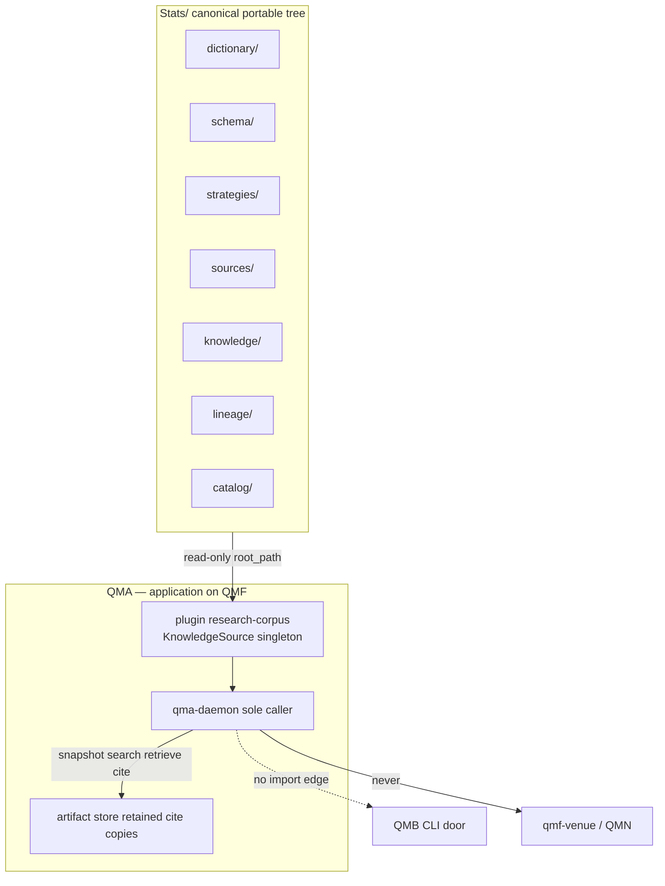

# STRATS → QMX hypothesis-library append

> **Research briefing. Not a spine. Not ratified. Not an AD mint.**
>
> Plan only. No code, no file moves, no git commits, no Stats edits, no `docs/` edits. Do not run `bmad-architecture` from this file as if the sitting already happened. Do not invent child `AD-*` ids that look adopted. Implementation, when authorized, ships through the factory lanes — never `bmad-build`, never `bmad-sprint-planning`.

| Field | Value |
|---|---|
| Status | architecture-increment **input** |
| Date | 2026-09-09 (briefing); observed tree 2026-09-10 |
| Canonical path | `workroom/research/2026-09-09_strats-append-to-qmx.md` |
| Hermes copy | `.hermes/plans/2026-09-09_strats-append-to-qmx.md` |
| Parent spine | `_bmad-output/planning-artifacts/architecture/architecture-QMA-2026-08-28/ARCHITECTURE-SPINE.md` (initiative, `status: final`) |
| Suggested child altitude | **feature** (STRATS as first KnowledgeSource). Thin spine: Inherited Invariants + a few bind rules + Deferred. Not a second QMA initiative. |
| Suggested purpose | `build-substrate` after a short discussion of the git-embed fork |
| Requirements body | Ratified `docs/` (especially CT-44, qma-daemon Knowledge, FR-Q65 / Story 47.2) **plus this file**. No new PRD. |
| Operator rulings for this slice | Listed in §0.2 |

**One-sentence goal.** Bind the portable STRATS tree at `C:/Users/Mubarak/Desktop/Stats` as QMX's hypothesis library **now**, so QMA agents start from 239 primitives + locked DNA + LAYOUT-DEMO instead of an empty ontology — without absorbing Stats into QMX git, without starting population, and without treating STRATS candidate specs as QML bots.

**One-sentence architecture.** Stats stays the canonical files+SQLite library; QMA consumes it read-only through the already-ratified `KnowledgeSource` port (QMA AD-19, CT-44, DEC-0318, DEC-0343). Reproducibility is `CorpusSnapshot`, not a git embed.

---

## 0. How to feed this to `bmad-architecture` later

This section is the handoff packet. A later architecture run should treat it as **forwarded activation**, not as a finished spine.

### 0.1 Child-increment law (from `bmad-architecture`)

When inheriting a parent spine:

- Load the parent `ARCHITECTURE-SPINE.md` first.
- Treat its paradigm, `AD`s, and conventions as **binding, read-only**.
- Log each as a `constraint`. List them under **Inherited Invariants** by **original ids — never renumbered, never re-derived**.
- The child job is **only what the parent left open**: Deferred rows plus divergences this feature's stories could hit.
- A new child `AD` that contradicts or weakens a parent `AD` is a **conflict to surface**, not a local override.
- A feature/epic spine fixes invariants independent builders of the next level down would choose incompatibly. It does **not** expand per-story detail and does **not** re-sit QMA.

Do **not** run the Reviewer Gate, `memlog.py`, or `lint_spine.py` against **this** file. Those belong to the architecture run.

### 0.2 Operator rulings that bind this briefing

1. QMX is the global project. QMF is the toolbox. QMB / QML / QMN / QMA are application-layer products **on** QMF in the ratified docs. **Do not rewrite that spine.** If a verbal note (“everything under QMF as libraries”) conflicts, **flag it** as a later BMAD clarification. Do not amend the constitution here.
2. STRATS at `C:/Users/Mubarak/Desktop/Stats` is a portable files+SQLite hypothesis library. Population is paused. 239 dictionary entries exist. LAYOUT-DEMO `STRAT-000001` only.
3. Append STRATS to QMX **now** as the hypothesis library so QMA agents are not starting from zero. Originally front-loaded before QMA/QMB existed.
4. Preferred architecture: keep Stats as the portable canonical tree; QMX/QMA adapts via `KnowledgeSource`. Evaluate in-repo git submodule / subtree with blast radius. **Do not** silently merge Stats into QMX git.
5. STRATS bots/specs are **not** QML bots. Handoff: STRATS candidate spec → QMB validation → human promote → QMN. QMA never executes (DEC-0341).
6. Do not start YouTube / n8n ingestion.
7. No futures execution. Forex + crypto spot. Futures sources may transfer with explicit caveats.
8. Do not implement in the planning session. Do not edit Stats or QMX `docs/` except the plan files named above.
9. BMad is planning-only. Factory implements. Never recommend `bmad-sprint-planning` or `bmad-build`. Architecture may run **before** a PRD, grounded on existing `docs/` (operator 2026-08-19). Both PRD and Architecture must exist before exiting BMad — **QMA already has both**; this slice should not demand a new product PRD.

### 0.3 Suggested architecture activation (later, fresh window)

| Field | Suggested value |
|---|---|
| Intent | `create` a **child** spine, not `update` of the QMA initiative spine |
| Altitude | `feature` (keeps epics/stories of FEAT-0045 Story 47.2 and FEAT-0046 `research-corpus` from diverging) |
| Purpose / audience | Factory + documentation-factory: a lean bind contract. Humans: the git-embed fork in one page. |
| Mode | Coaching is the skill default. Fast path is **acceptable** here: parent AD-19 is `[ADOPTED]`; this briefing already records the operator's Option-A lean. Remaining forks stay `[PROPOSAL]` until Mubarak chooses. |
| Parent | `architecture-QMA-2026-08-28` |
| Driving input | This file + CT-44 + `docs/components/qma-daemon.md` Memory/Knowledge section + Epic 47 Story 47.2 |
| Run folder | Scope to the feature so it does not collide with the QMA initiative folder. Example: `_bmad-output/planning-artifacts/architecture/architecture-QMA-STRATS-knowledge-bind-YYYY-MM-DD/` |
| After spine `status: final` | `/documentation-factory` into `docs/` (wiring notes, glossary path, GAP-0073 *commentary only*). Then `bmad-create-epics-and-stories` **only if** Story 47.2 / FR-Q71 cannot carry the bind. Then factory lanes. |

**Do not** produce a second Knowledge contract. **Do not** answer GAP-0073 hybrid indexing. **Do not** reopen AD-16 / AD-28 money-path.

### 0.4 What the child spine is allowed to decide

The parent left these open (independent builders of Story 47.2 and `research-corpus` could choose incompatibly):

| Open fork | Why it is a real trade-off |
|---|---|
| External `root_path` vs git submodule vs subtree vs copy-into-QMX | Digest identity, clone story, portability, who edits the library |
| First `source_id` token | CT-44: keys and id are fixed for the life of the source |
| Six `confidence_dimensions` spellings | Same freeze |
| Snapshot include / exclude set | Two adapters hashing different trees diverge on `snapshot_ref` |
| STRATS candidate ≠ QML bot handoff | QMA, QML, QMB, QMN builders will otherwise mint CT-33 from DNA A–I |

Everything else in §4 is inherited. Do not re-derive it.

---

## 1. Goal

Append STRATS into QMX as the **hypothesis library** so that:

1. A Quant granted retrieval can `search` / `retrieve` / `cite` STRATS bytes through CT-44, pinned to one Mission `snapshot_ref`.
2. QMA does not invent a parallel dictionary, DNA, or strategy-package format.
3. A STRATS candidate remains **knowledge** until a human authors QML artifacts, QMB validates, and a human promotes into QMN.
4. Stats remains usable without QMX, Hermes, n8n, or Obsidian.

**Non-goals (this briefing and the later factory slice):**

- YouTube / n8n / yt-dlp / vision ingestion.
- Rewriting the 239 seed entries.
- Futures execution (target markets stay forex + crypto spot).
- Hybrid / semantic indexing (QMA Deferred “Knowledge indexing”; GAP-0073).
- Making STRATS a QMF roster package, a QMA memory backend, or a QMX git subtree.
- Shipping adapter code from a planning session.
- A new QMA initiative sitting.

“NOW” means **decision + bind path**, not a shipped daemon. CT-44 is `defined-unwired`. Agents working in QMX treat Stats as the hypothesis library immediately (read-only). Factory later implements Story 47.2 against that same root — no ingest, no copy.

---

## 2. Authority and citation classes

| Class | Governs | If conflict |
|---|---|---|
| Mubarak's latest messages for this slice | This append | Wins |
| Ratified `docs/` + QMA spine AD-19 / CT-44 / DEC-0318 / DEC-0343 | QMX Knowledge contract | Wins over STRATS research notes about QMX |
| `STRATS-BUILD-STATE.md` | Present STRATS tree | Wins over GROUND-STATE on layout/ids |
| `STRATS-GROUND-STATE.md` | Settled STRATS ontology (primitive / role / graph; six confidences; QMX-out-of-library) | Historical present-tense in §3 is **stale**; design decisions in §4 still bind STRATS |
| QMA sitting research `knowledge-corpus-boundary.md` (2026-08-28) | Provenance of AD-19 | Stale on “empty root” and “§6 unratified”; do not re-sit from it |
| Skill `qmx-version-drift.md` | Old “GitBook vs active system” warning | **Do not** substitute for ratified `docs/` |

Local sources used below are listed in **§16**. Claims about STRATS layout were observed on disk 2026-09-10, not only read from BUILD-STATE.

---

## 3. Current state

### 3.1 STRATS (`C:/Users/Mubarak/Desktop/Stats`)

Authority inside Stats: Mubarak > BUILD-STATE > GROUND-STATE. `.hermes` is not the library.

| Fact | State | Source |
|---|---|---|
| Form | Portable **files + SQLite**. Markdown (and a few YAML) canonical. `backend/strats.sqlite` derived, disposable. | [S1], [S2] |
| Git | **Not a git repository.** No remote. Independent of QMX. | observed 2026-09-10 |
| Population | **Paused.** Do not ingest media, run yt-dlp, or stand up n8n. | [S1] |
| Dictionary | 239 seed entries, 12 fields, uniqueness `(file_path, id)`, 229 unique slugs, 9 colliding keepers. Four files; empty family dirs reserved. Do not rewrite the 239. | [S2], [S5] |
| Four files (on disk) | `dictionary/market-structure-and-location/locations-and-structure.md`; `dictionary/price-action-and-patterns/triggers-patterns-transitions.md`; `dictionary/context-regime-and-intermarket/context-filters-confirmations.md`; `dictionary/invalidation-exits-and-management/exits-execution-management.md`. GROUND-STATE counts: 56 / 60 / 66 / 57. | observed; [S4] §3 |
| Empty reserved family dirs | `execution-and-order-semantics`, `indicators-and-transformations`, `liquidity-volume-and-order-flow`, `market-data-venues-and-observability`, `risk-and-sizing`, `time-sessions-and-events` | observed |
| Strategies | Copy-ready `_template/`. Only LAYOUT-DEMO `strategies/STRAT-000001-asian-high-london-reversal/` — `class: entry_hypothesis`, F unresolved. Graph example, **not** an extracted strategy. | [S2], [S3] |
| DNA | A–I locked. `logic/graph.yaml` is knowledge, not a QMX executor. | [S3] |
| IDs | `STRAT-NNNNNN`, `SRC-NNNNNN`, primitive kebab slug with `(file_path, id)` uniqueness, `kb-<area>-<slug>`. No `PRIM-000001`. | [S5] |
| Markets | `forex`, `crypto-spot`. Horizons scalp / intraday / swing. Prop-firm is an overlay (`knowledge/prop-firms` + identity tags), not a third library. | [S1], [S3] |
| Non-canonical | `.hermes/` historical scratch. `.obsidian/` minimal vault, no community plugins. | [S2] |
| Tooling | `backend/import_dictionary.py`, `export_catalog.py`, `validate.py`, `rebuild.py`. Files remain canonical. | [S1] |

GROUND-STATE §6 listed twelve **open** layout questions (2026-08-26). BUILD-STATE (2026-09-01) **locked** the tree that answers them for adapter purposes:

| GROUND-STATE §6 Q | Locked as |
|---|---|
| 1 `dictionary/` vs `primitives/` | `dictionary/` |
| 2 family without role folders | four family files in family dirs; roles live in bindings |
| 3 strategy folder interior | DNA A–I file map in [S3] |
| 4 class folders vs tags | identity `class` tokens, not folders |
| 5–8 methodology / macro / style / mini-KB | `knowledge/` + tags; prop-firm overlay |
| 9 source tree | `sources/items/` one physical home |
| 10 catalog and lineage | `catalog/` indexes + `lineage/` + per-package `lineage/` |
| 11 unknowns | DNA H → `review/unknowns-and-conflicts.md` |
| 12 Obsidian portability | files readable without Obsidian; `.obsidian/` is UI only |

That is the upstream layout/id lock QMA Deferred “Knowledge indexing” and GAP-0073 named as a **revisit condition**. Meeting the condition does **not** answer hybrid retrieval.

**Six confidence dimensions** (aggregate score rejected) [S4] §4.6:

1. extraction confidence
2. rule explicitness
3. source quality / completeness
4. ambiguity / unresolved status
5. empirical status
6. portability / market-transfer status

**Evidence labels** (opaque to QMA): source-stated/explicit, visually demonstrated, repeated-example inference, analyst/model inference, STRATS-added standardization, unresolved. Model output is interpretation, not ground truth.

**STRATS must not contain** [S4] §8: QMX adapters, executable test manifests, run results, experiment ledgers, executors, genetic machinery, package locks, live intelligence, account/position/agent memory, BMS/KSA/MIS, certification state.

### 3.2 QMX (ratified)

| Fact | State | Source |
|---|---|---|
| Knowledge | Read-only corpus behind `KnowledgeSource`, “the adapter over the STRATS plain-file library”. QMX adapts; the library is never built around QMX. | [S8], [S7] |
| Port | CT-44 `defined-unwired`. No code. AD-1 singleton keyed by `source_id`. Plugin contributes; `qma-daemon` is the sole caller. | [S6] |
| Ops | `snapshot()`, `search` (literal + locator, grep-class), `retrieve`, `cite` (copy gate). | [S6] |
| Cite | Daemon copies cited bytes into the artifact store via `before_artifact_register`. Uncopied snapshot → `StaleSnapshot`. | [S6], [S7] |
| Confidences | Exactly six corpus-owned keys, declared once per `source_id`, never scalarized. Distinct from Memory `admission_confidence`. | [S6], [S9] AD-18/AD-19 |
| Money path | QMA's only money-path output is a candidate artifact a **human** promotes. No execution tool at any account role, paper included. `promote` reserved for the live-zone act. | [S10], [S11] |
| QMB edge | `qma-daemon` has **no** package edge to COMP-QMB. | [S12] |
| Factory home | FEAT-0045 / Epic 47 Story 47.2 (port + snapshot/cite). FEAT-0046 / FR-Q71 `research-corpus` desk pack (binding). | [S13] |
| QMX git | Repo exists; **no** `.gitmodules`. `.hermes/` currently untracked. Ahead of `origin/main` is unrelated. | observed |
| Pipeline | BMad planning-only; documentation-factory; epics-and-stories; factory implements. | [S14] |

QMA AD-19 rule (abridged, do not re-derive) [S9]: read-only plain-file adapter; no schema imposed; `CorpusSnapshot` is a content-addressed tree digest with per-file digests; no write-back; no QMX folders or fields; no hardcoded layout; six `evidence_confidence` keys frozen per `source_id`; name-split vs Memory; cite-copy; Mission pins one `snapshot_ref`; linear supersedes chain.

QMA Deferred row that this slice **must not answer** [S9]:

> Knowledge indexing (hybrid retrieval over the corpus) — revisit when the corpus root holds at least one ingestible content file **and** STRATS §6 Q1–Q12 are ratified upstream.

v1 ships literal + locator only (DEC-0343, GAP-0073).

### 3.3 Stale research (do not drive a new sitting)

`knowledge-corpus-boundary.md` and the options sheet (2026-08-28) say STRATS root is empty and layout/serialization/stable-id are unratified [S15]. That was true on 2026-08-28. BUILD-STATE and the on-disk tree contradict it as of 2026-09-01. Treat [S15] as **provenance of AD-19**, not current layout truth.

---

## 4. Inherited invariants (read-only)

Child architecture lists these under **Inherited Invariants** with original ids. Not re-decided here.

| Inherited | From | Binds this slice |
|---|---|---|
| QMX global project; QMF toolbox; QMB/QML/QMN/QMA application-layer **on** QMF | `docs/AGENTS.md`, constitution, QMA spine scope | Do not rewrite; see conflict C1 |
| Contract-hub hexagonal; definitions-only `qma-core`; daemon sole writer | QMA paradigm, AD-1, AD-3 | Adapter is a plugin contribution, not a new package kind |
| Knowledge port, read-only, adapt-to-library, six dims, cite-copy | QMA AD-19, CT-44, DEC-0318, DEC-0343 | The whole bind |
| `KnowledgeSource` singleton per `source_id` | QMA AD-1 | One STRATS adapter |
| Memory ≠ Knowledge; `admission_confidence` ≠ `evidence_confidence` | QMA AD-18, AD-19, CT-43 | Citations ride verbatim onto memory candidates |
| Plugin reversible scopes; `research-corpus` is seed of intent | QMA AD-21, structural seed | Likely contributor of the binding |
| No execution tool; reachability barrier; `qmf-venue` importable by nothing QMA | QMA AD-16, AD-28, DEC-0341, DEC-0327 | Handoff stops before orders |
| `promote` is the human live-zone act; memory admitted; refinement applied | QMA AD-25, DEC-0345, L17 | QMA may draft; humans promote |
| No package edge to COMP-QMB | `dependencies.yaml` | QMB is a door/CLI, not an import |
| QML bot = CT-33 + Python logic; CT-34 roles `level \| trigger \| confirmation \| filter` | COMP-QML, DEC-0171–0184 | STRATS DNA is not this |
| Literal + locator search only | AD-19, GAP-0073 | Do not design embeddings |
| Typed refusals as `qmf-core` variants | QMA AD-3, CT-04 | `ProvenanceShapeMismatch`, `StaleSnapshot` |
| Secret references only | L34, QMA AD-24 | `root_path` is a path, not a venue secret |
| Factory implements; BMad planning-only | [S14] | No code from architecture |

---

## 5. Recommended append mechanism

**Keep Stats as the portable canonical tree. Point QMA at it. Do not copy it into QMX git.**



### Option A — external tree + `root_path` (**recommend**)

| | |
|---|---|
| What | Operator-configured filesystem root. Adapter snapshots that tree. Stats stays at `Desktop/Stats`. |
| Blast radius | QMA plugin + daemon config. Zero QMX git history. Zero Stats schema change. |
| Reproducibility | Already designed: `CorpusSnapshot` tree digest + per-file digests + cite-copy. A Mission pins one `snapshot_ref`. |
| Portability | Intact. Obsidian, `python backend/validate.py`, and a non-QMX consumer still work. |
| “NOW” | The path is the bind. Planning agents can read the tree today. Factory wires CT-44 without a data migration. |
| Fits AD-19 | “no hardcoded layout”, “library never built around QMX”, “reproducibility over bytes QMA retains”. |

This is the architecture AD-19 already named. The child spine should adopt it unless Mubarak rejects it in coaching.

### Option B — git submodule inside QMX (evaluate, do not pick)

| | |
|---|---|
| What | `git init` **in Stats first**, host a remote, add QMX `.gitmodules` pinning a SHA. |
| Blast radius | New Stats repo + remote; QMX clone / CI / worktree instructions; Windows path vs submodule checkout; daemon must snapshot the **submodule working tree**, not the superproject SHA; every STRATS edit becomes a QMX submodule-bump. |
| Reproducibility | Weaker than it looks. CT-44 already pins bytes. A submodule SHA is a second pin that drifts from live Obsidian edits unless someone bumps it. |
| Portability | Survives only if Stats remains its own remote and people keep editing **there**. In practice the QMX tree becomes the edit surface. |
| Blocker today | Stats is **not a git repo**. Submodule work is a Stats ops project, not this append. |

Reserve for a later day if a remote research node must clone QMX and receive STRATS without a workstation path. Even then prefer “Stats remote + `root_path` on that host” over embedding. QMA AD-25 already places the daemon on the workstation by default.

### Option C — git subtree (**reject**)

Copies Stats history into QMX. Merge noise, repo bloat, standing temptation to edit in-tree. Functionally a silent merge. Conflicts with AD-19 portability.

### Option D — copy/merge Stats into QMX (**forbid**)

Destroys portability. Violates AD-19 / DEC-0318 / DEC-0343. Violates operator ruling 4.

### Independent `git init` in Stats (orthogonal)

Useful for **Stats' own** history. Not required for the QMX append. Must not become a submodule by default. Out of scope unless Mubarak asks.

---

## 6. QMA adapter surface

Reuse CT-44. Do not mint a second knowledge contract. Do not hardcode Stats folder names into `qma-core`.

| Piece | Later binding (factory, not this session) |
|---|---|
| Contribution | AD-1 singleton `KnowledgeSource`, scope key `source_id`. Second binding = hard load error. Missing `source_id` = unavailable, not an error. |
| Plugin | Desk pack `research-corpus` (FEAT-0046 / FR-Q71). Seed of intent, not a new component. |
| Kind | `plain_file_library` |
| Adapter | `{ root_path, read_only=true, impose_schema=false }`. Reads Markdown/YAML as bytes. Does not validate DNA. Does not execute `graph.yaml`. |
| Ops | `snapshot` / `search` / `retrieve` / `cite` as CT-44 |
| Manifest | `confidence_dimensions`: exactly six keys, **fixed for the life of that `source_id`**. [PROPOSAL] spellings in §10 |
| Evidence label | Opaque STRATS claim label. QMA stores verbatim, never parses. |
| Locators | File path + heading / char-range. Colliding dictionary slugs **must** include `file_path` ([S5]). Fallback `path#heading` allowed. Adapter must not require a QMX id scheme. |
| Snapshot include [PROPOSAL] | `README.md`, `STRATS-BUILD-STATE.md`, `schema/`, `dictionary/` (including empty family dirs if present), `strategies/` (including `_template` and STRAT-000001), `sources/`, `knowledge/`, `lineage/`, `catalog/`. Optionally `IDEA.md`. |
| Snapshot exclude [PROPOSAL] | `.hermes/`, `.obsidian/`, `backend/strats.sqlite`, `__pycache__`. Default-exclude `backend/*.py` (tooling, not knowledge). |
| Refusals | `ProvenanceShapeMismatch`, `StaleSnapshot`, `unsupported-capability` for ranked/semantic search |
| Write-back | None. A QMA report re-enters only as a **distinct** `source_id` / kind (`qmx_report`). |
| Sequencing | Do not reorder QMA build order (DEC-0333). Port types ride FEAT-0045; the STRATS bind rides the `research-corpus` pack on FEAT-0046. |

`root_path` home [PROPOSAL]: operator-principal daemon/plugin config at load, not a git path, not a venue secret. Credential Broker already allowlists “corpus and knowledge sources”; a local path does not need the secret store.

---

## 7. Handoff (do not conflate bots)

STRATS “trading-bot candidate specification” is **knowledge of market logic** ([S3], [S4] §4.9). It is not a QML bot, not a CT-33 definition, not a Book binding, not a QMN seat.

```text
STRATS package (DNA A–I; graph.yaml = knowledge)
        │  QMA may search / retrieve / cite / draft
        │  QMA never executes, never sizes, never binds  (DEC-0341)
        ▼
Human (or human-approved authoring) produces QML artifacts
        │  CT-33 Bot definition + plain-Python logic
        │  CT-34 confluence (level | trigger | confirmation | filter)
        ▼
QMB validation  (replay / experimentation; world = replay)
        │  evidence, not edge-by-prose
        ▼
Human promote  (DEC-0345; L17; outside QMA)
        ▼
QMN  paper | live
```

Rules for the child spine and for factory stories:

- Do not generate CT-33 from `STRAT-000001`. LAYOUT-DEMO, F unresolved, class `entry_hypothesis`.
- Do not map STRATS graph operators onto the QML runtime protocol. V1 condition semantics live in QML Python (QL-5).
- STRATS F labels (`source_defined` / `external_policy` / `deliberately_open` / `unresolved`) stay in the library. Book-owned exits (AD-33) are downstream policy.
- QMA may **propose** a QML draft as a candidate artifact. Definition changes use RefinementProposal + operator principal (**applied**, not promoted).
- No `qmf-venue` import anywhere on this path.
- QMA Deferred “typed strategy-mechanism decomposition” stays with QML / `qmf-registry`. This bind does not steal it.

---

## 8. What NOT to copy

**Into QMX:** the Stats tree; `.hermes/` scratch; `.obsidian/`; `backend/strats.sqlite`; STRATS DNA as QMF/QMA contracts; population workers; n8n graphs; YouTube pipelines; a second dictionary inside QMA skills or `docs/`.

**Into Stats:** QMX adapters, folders, fields, experiment manifests, run results, certification state, agent memory, BMS/KSA/MIS, Book bindings, CT-33/CT-34, QMB run-configs, QMN node config.

**Do not:** rewrite the 239; invent exits; treat CEX volume / DOM / funding / futures microstructure as spot-FX or spot-crypto fact; start ingestion; recommend `bmad-sprint-planning` or `bmad-build`.

---

## 9. Proposed child-spine decisions

These are **proposals for the later architecture run**, not adopted ADs. Child ids, if minted, start at that spine's AD-1 and **cite parent AD-19** — they do not renumber it.

Use the architecture test: *if two units one level down built this independently, could they choose incompatibly?*

| Proposal | Binds | Prevents | Rule (draft) |
|---|---|---|---|
| P1 Canonical tree stays outside QMX git | Story 47.2, `research-corpus`, clone/CI | Silent merge; two libraries | Stats remains canonical at an operator `root_path`. QMX git does not contain a copy, subtree, or default submodule. |
| P2 First `source_id` | CT-44 singleton | Two plugins naming different ids for the same tree | [PROPOSAL] `strats`. Frozen for life. |
| P3 Six dimension keys | CT-44 manifest | Rename mid-life; scalarization | [PROPOSAL] `extraction`, `rule_explicitness`, `source_quality`, `ambiguity`, `empirical_status`, `portability`. A rename is a new `source_id`. Values remain corpus-owned and never averaged. |
| P4 Snapshot set | `CorpusSnapshot` identity | Divergent digests | Include the canonical knowledge paths in §6. Exclude `.hermes/`, `.obsidian/`, derived sqlite, `__pycache__`. Default-exclude `backend/*.py`. |
| P5 Candidate ≠ bot | QMA ↔ QML ↔ QMB ↔ QMN | CT-33 minted from DNA; QMA execution | STRATS A–I is knowledge. QML authors bots. QMB validates. Humans promote. QMA never executes. |

**Child Deferred (keep parent's revisit conditions):**

- Knowledge hybrid indexing (parent Deferred / GAP-0073). **Do not answer** even though ingestible files now exist.
- `qmx_report` re-entry as a distinct source kind (already AD-19 law; wiring later).
- Independent git for Stats.
- Remote-host `root_path` provisioning (AD-25).
- Typed strategy-mechanism decomposition (parent Deferred; QML-owned).

**Child Cut:** subtree, silent merge, QMA execution tool, writing QMX fields into Stats, starting population from this bind.

---

## 10. BMAD steps

**No new architecture sitting of QMA. No new product PRD. Fold the bind into existing QMA epics.**

| Step | Do? | Why |
|---|---|---|
| `bmad-brainstorming` | No | Forks are named; operator already leaned Option A |
| `bmad-prd` | **No** | QMA PRD already contains FR-Q65. This is not a new product. Architecture may run on `docs/` + this file (operator 2026-08-19). |
| `bmad-architecture` child increment | **Yes, later, fresh window** | Only the §0.4 forks. Parent AD-19 is constraint. |
| `/documentation-factory` | After child spine `final` | Glossary path, CT-44 wiring notes, GAP-0073 *commentary* that ingestible files exist — **not** an answer to hybrid indexing |
| `bmad-create-epics-and-stories` | Only if 47.2 / FR-Q71 cannot carry P1–P5 | Prefer an addendum story under Epic 47 / FEAT-0046, not a new epic set |
| Factory lanes | Implementation | Attended epic-factory or queue-publish |
| `bmad-sprint-planning` | **Never** | [S14] |
| `bmad-build` | **Never** | [S14] |
| `bmad-testarch-*` | After factory code on `integration` | Allowed; still not implementation |

**Clarification to park (do not amend constitution in the child spine):**

> **C1.** Operator verbal note that “everything sits under QMF as libraries” vs ratified docs (QMX global project; QMF toolbox; QMB/QML/QMN/QMA application-layer **on** QMF). This append does not depend on resolving it.

---

## 11. Open questions

Memlog-ready. None block **append-by-reference today**. Architecture should resolve P2–P4 before factory; P1 is operator-leaned.

1. Confirm `source_id` = `strats`.
2. `root_path` home: plugin manifest vs registry-homed variable vs operator-principal daemon config. Lean: operator config at load.
3. Freeze the six key spellings in P3, or substitute STRATS prose labels 1:1.
4. Snapshot exclude of `backend/*.py` — tooling vs method evidence.
5. Whether a later `docs/AGENTS.md` sentence should name the Stats path (documentation-factory, not this file).
6. LAYOUT-DEMO surfacing: retrievable, labelled not-QML-ready in Research-desk skills/prompts.
7. Remote daemon: `root_path` on that host; snapshot digest still travels. Out of scope until AD-25 remote placement is real.
8. Independent `git init` in Stats — Stats ops, not QMX append.
9. GAP-0073: ingestible content now exists. Confirm in documentation-factory commentary that hybrid search stays deferred.

---

## 12. Files that would change later (not now)

### QMX factory / docs (when authorized)

| Path | Why |
|---|---|
| `plugins/research-corpus/` (new pack: manifest, daemon adapter) | KnowledgeSource contribution, `source_id`, `confidence_dimensions`, `root_path` |
| `qma-core` port types (FEAT-0045) | CT-44 definitions only |
| `qma-daemon` snapshot/search/retrieve/cite + artifact copy | Sole caller; copy gate |
| `docs/contracts/ct-44-qma-knowledge-source.yaml` | `wiring_status` when wired; adapter notes; **not** a schema imposed on Stats |
| `docs/components/qma-daemon.md`, `qma-core.md` | Binding example: STRATS root |
| `docs/glossary.md` Knowledge entry | Path + “layout now locked upstream” |
| `docs/gap-report.md` GAP-0073 commentary | Ingestible files exist; hybrid still deferred |
| `docs/changelog.md`, `docs/knowledge/traceability.md` | Trace the bind |
| Tests / scenarios around Story 47.2 | Shape mismatch, stale snapshot, include/exclude, collision locators |

Do **not** add `.gitmodules` unless Mubarak rejects Option A.

Do **not** add a QMX-owned copy of `dictionary/` or `strategies/`.

### Stats

None for the append.

### This briefing

| Path | Role |
|---|---|
| `workroom/research/2026-09-09_strats-append-to-qmx.md` | Canonical for BMAD later |
| `.hermes/plans/2026-09-09_strats-append-to-qmx.md` | Hermes copy; keep identical |

---

## 13. Verification (factory, not now)

- `snapshot()` of the Stats root is stable for an unchanged tree and changes when a canonical Markdown file changes; excluding sqlite / `.hermes` / `.obsidian`.
- `search` finds a known heading in a dictionary family file and in `STRAT-000001` `identity.md`.
- `cite` retains bytes; mutating Stats after cite does not change the Citation; uncopied snapshot → `StaleSnapshot`.
- Six `evidence_confidence` keys match the manifest; a seventh key → `ProvenanceShapeMismatch`.
- Adapter performs no Stats write.
- No QMA package imports `qmf-venue`. No execution tool registers.
- `STRAT-000001` is retrievable and still `entry_hypothesis`; no CT-33 minted from it.
- `python backend/validate.py` in Stats still runs without QMX on `PYTHONPATH`.

---

## 14. Risks and conflicts

| Id | Risk / conflict | Handling |
|---|---|---|
| C1 | Verbal “everything under QMF as libraries” vs ratified application-layer spine | Flag for later BMAD; do not amend constitution |
| C2 | 2026-08-28 research “empty root / §6 open” vs 2026-09-01 BUILD-STATE | Point factory at BUILD-STATE + this file; do not re-sit AD-19 |
| C3 | Skill `qmx-version-drift.md` vs ratified `docs/` | Spine = `docs/` |
| C4 | GAP-0073 revisit condition now partly met | Commentary only; hybrid indexing stays Deferred |
| C5 | Submodule “for convenience” | Rejected; CT-44 snapshot is the pin |
| C6 | Agents treat LAYOUT-DEMO as a real strategy | Class token + prompt label |
| C7 | Agents write QMX fields into Stats | Adapter read-only; STRATS §8 |
| C8 | Conflating STRATS graph with QML confluence | §7 |
| C9 | Starting population because “we appended” | Pause-before-populate still in force [S1] |

---

## 15. Decision (briefing, not ratification)

**Append by reference, not by copy.** Stats remains canonical at `C:/Users/Mubarak/Desktop/Stats`. QMA binds it as the first `KnowledgeSource` (`plain_file_library`) through existing CT-44 / Story 47.2 / `research-corpus`. No QMA initiative increment. No git embed. No ingestion. Later: child `bmad-architecture` on the §0.4 forks only, then documentation-factory, then factory.

---

## 16. Sources

Local corpus only. No web ledger. Paths are workspace-absolute under the two trees.

| Id | Path | Used for |
|---|---|---|
| S1 | `C:/Users/Mubarak/Desktop/Stats/README.md` | Portable files+SQLite; pause-before-populate; markets |
| S2 | `C:/Users/Mubarak/Desktop/Stats/STRATS-BUILD-STATE.md` | Present tree; 239; LAYOUT-DEMO; population not done |
| S3 | `C:/Users/Mubarak/Desktop/Stats/schema/strategy-dna.md` | DNA A–I lock; graph.yaml is not an executor; STRAT-000001 file map |
| S4 | `C:/Users/Mubarak/Desktop/Stats/STRATS-GROUND-STATE.md` | Ontology; six confidences; §6 Qs; §8 QMX-out; §4.9 bots vs agents |
| S5 | `C:/Users/Mubarak/Desktop/Stats/schema/ids.md` | ID grammar; `(file_path, id)` collisions |
| S6 | `C:/Users/Mubarak/Desktop/QMX/docs/contracts/ct-44-qma-knowledge-source.yaml` | Port; snapshot; cite-copy; six dims; `defined-unwired` |
| S7 | `C:/Users/Mubarak/Desktop/QMX/docs/components/qma-daemon.md` | Knowledge section; money-path; plugin seed |
| S8 | `C:/Users/Mubarak/Desktop/QMX/docs/glossary.md` (Knowledge) | STRATS as the corpus |
| S9 | `C:/Users/Mubarak/Desktop/QMX/_bmad-output/planning-artifacts/architecture/architecture-QMA-2026-08-28/ARCHITECTURE-SPINE.md` | Parent paradigm; AD-18/19; Deferred knowledge indexing; Cut execution tool |
| S10 | `C:/Users/Mubarak/Desktop/QMX/docs/decisions/ADR-0020-qma-agentic-system.md` | QMA on QMF; money path |
| S11 | `C:/Users/Mubarak/Desktop/QMX/docs/scenarios/SCN-0014-money-path-barrier.md` | DEC-0341 |
| S12 | `C:/Users/Mubarak/Desktop/QMX/docs/architecture/dependencies.yaml` | No QMA→QMB package edge |
| S13 | `C:/Users/Mubarak/Desktop/QMX/_bmad-output/planning-artifacts/epics-QMA-2026-08-29.md` | FR-Q65; Story 47.2; FR-Q71 `research-corpus` |
| S14 | `C:/Users/Mubarak/Desktop/QMX/CLAUDE.md` | BMad planning-only; no sprint-planning/build |
| S15 | `C:/Users/Mubarak/Desktop/QMX/_bmad-output/planning-artifacts/architecture/architecture-QMA-2026-08-28/research/knowledge-corpus-boundary.md` | Stale “empty root”; origin of AD-19 posture |
| S16 | `C:/Users/Mubarak/Desktop/QMX/docs/components/qml.md` | CT-33/CT-34; not STRATS DNA |
| S17 | `C:/Users/Mubarak/Desktop/QMX/docs/gap-report.md` GAP-0073 | Hybrid indexing deferred |
| S18 | `C:/Users/Mubarak/Desktop/QMX/docs/AGENTS.md` | Ratified QMA content; application-layer on QMF |
