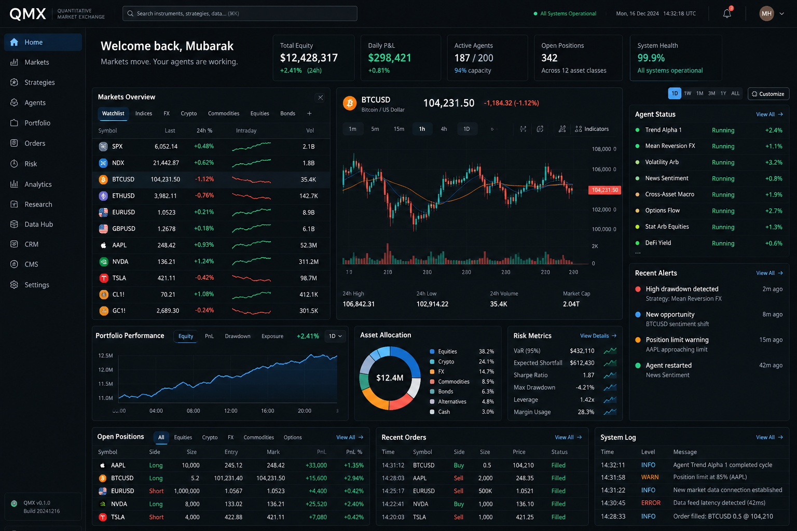
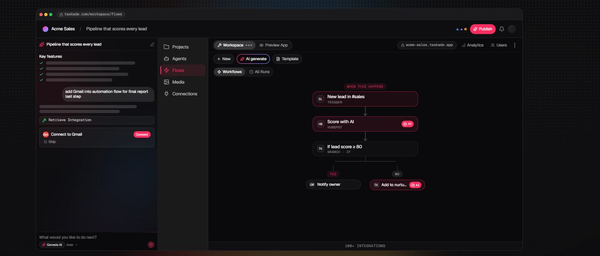

> From: https://chatgpt.com/c/6aabb93a-a598-83ea-bb50-de341d0e7f4b

# you asked

message time: 2026-09-17 12:56:09

Alright, so we are going to have a discussion, a simple one right now under QMX. I want to explore the possibilities of adding a node-based editor. I actually had a conversation with, I believe it was Codex yesterday, and I wanted to give this straight to Grok with an architectural skill for BBAD, okay, from BMAD to actually just go ahead and begin working on it. But a lot has happened recently, anyway. Okay, not happened, it's just that I feel like there is something missing, seriously. I really feel like it's not as simple as I intend it to be. So, I'm going to upload the file, then we start a discussion. You tell me what you think, you tell me the blast radius. Because trust me, it is quite big and substantial, and then the ideas that can come from here because it was built off the idea, I think, from N8N. Okay, all right, let's begin@GitHub 
So feel free to use as much knowledge as you want and I want to inform you that the prompt I gave you is not the limit. You can expand and enhance

---

# chatgpt response

I’ll compare the brief against QMX’s current GitHub architecture, separating the node editor itself from the deeper workflow implications, blast radius, and opportunities before considering implementation.

The deeper issues are durability and control boundaries: QMA’s task graph remains in-memory, and the daemon currently drains connections without dispatching UI commands. Existing authority boundaries also constrain workflows.

---

# chatgpt response

Mubarak, **your instinct is right: this is substantially bigger than adding a node-based editor. But a large blast radius does not have to mean a large rewrite.**

My reading is that you are moving toward **a way to compose QMX’s capabilities into understandable, reusable work**. The canvas would be one interface to that—not the thing that owns the work.

Your brief already recognises this: agents are optional, ordinary Python remains valid, exploratory work need not become a fixed pipeline, and work should sometimes continue after the laptop closes. Those are important requirements to preserve. 

I inspected selected architecture documents on `main@b8b4d21` and implementation files on `integration@270e992`. This is a source-level assessment, not an end-to-end execution audit; it does not cover uncommitted changes on your laptop. 

## What I think feels “missing”

**The missing piece is not another feature in the prompt. It is a decision about what a workflow means inside QMX.**

Consider three superficially similar diagrams:

> “This strategy enters when these conditions agree.”

> “Compare this strategy under two Book configurations, investigate the differences, then ask me to review.”

> “This execution completed one comparison, failed another, and is waiting for a retry.”

The first describes strategy meaning. The second describes a procedure. The third describes what actually happened. They might all appear as connected boxes, but they cannot share one undifferentiated model.

Your prompt explicitly makes this distinction, including separating the visible arrangement from the underlying graphs. The preceding QML research architecture also treats the hypothesis graph as **non-executable** and keeps it separate from governed bot artifacts. That package is still marked proposed, so its decisions cannot simply be assumed accepted.  

My recommendation is:

> **QMX Workflows should first compose capabilities—not become a new strategy language, a new trading runtime, or a replacement for every existing screen.**

That leaves considerable room for expansion without entangling everything immediately.

## What the repository changes about the discussion

You are **not starting from zero**.

QMA already has a deterministic mission compiler, authored Graph Templates, runtime Task Graphs, a dispatcher with execution-environment leases, and procedure instantiation. The procedure code already distinguishes QMB run steps from query steps and connects configuration changes to ExperimentSpec successors. Importantly, the compiler itself is not an LLM.   

That makes “install a second workflow system and route everything through it” a questionable starting point.

However, I found three reasons not to jump from “the modules exist” to “the backend is ready”:

**Persistence is uneven across the inspected surfaces.** ExperimentSpec, its ledger, and lineage edges have SQLite-backed storage. By contrast, the inspected Graph Template catalog calls itself an in-memory stand-in, and `TaskGraphStore` is an in-memory projection. That does not prove recovery is absent elsewhere, but it does mean restart-safe workflow execution still needs to be traced and demonstrated.   

**A listening process is not yet a working UI connection.** In the inspected `DaemonProcess`, the connection handler reads incoming bytes until the connection closes; it does not dispatch commands or serve workflow queries. Other wire modules may provide reusable pieces, but this entry point alone is not the browser-facing workflow connection. 

**Even graph validation needs adversarial checks.** The topology validator shown checks for directly reversed edge pairs. That check alone does not reject a longer cycle such as `A → B → C → A`. This is a specific source-level issue—not a verdict on the whole system—but it illustrates why a convincing graph demo is insufficient evidence. 

So my assessment is: **there is a substantial foundation to reuse, alongside important integration and correctness work. Neither “just add the canvas” nor “rebuild orchestration” is justified yet.**

## The actual blast radius

The following is my architectural assessment, rather than a measured implementation estimate. It assumes workflows compose research and analysis capabilities while live execution stays with the Trading Node.

| Area | Expected impact | What changes |
|---|---|---|
| **QMA core and daemon** | High | General-purpose step contracts, authored versions, dispatch, interruption, recovery, permissions, and resource budgets. |
| **QMA wire and UI adapters** | High | Real submit/query/control operations, progress events, validation errors, and reconnect behaviour. |
| **QMB** | Moderate | Exposing existing experiment and analysis capabilities consistently, with their existing evidence semantics. |
| **QML** | Moderate, potentially high | Authoring operations can become workflow steps. Turning strategy graphs into executable logic would be a separate, much larger change. |
| **Library and evidence** | Moderate–high | Discovering reusable work, referencing exact inputs, showing lineage, and distinguishing procedures from their outputs. |
| **QMF** | Bounded if designed carefully | Reuse identity, data, registry, and risk contracts. Do not move product scheduling or workflow orchestration into the toolbox. |
| **Trading Node / Book / BMS** | Low direct change initially | Keep execution and supervision boundaries intact. Impact becomes very high if workflows start controlling live operations or individual trading decisions. |

Those boundaries follow the current workbench architecture: existing owners remain responsible, QMA uses the sanctioned QMB CLI/MCP route rather than importing QMB, and a new permanent experiment service would require an explicit amendment. 

**The dangerous expansion is not adding more step types. It is allowing a connected box to acquire authority its underlying capability never had.**

A “compare Book variants” step should request research. It should not acquire permission to change an active Book. Likewise, this should not turn BMS into a central allocator: the existing Bot → Book → BMS → Operator structure remains the relevant authority chain. 

## The architectural centre: a step is a contract, not a box

This is where I would focus Grok’s investigation.

For each exposed capability, I would require a descriptor answering:

> What does it accept? What does it produce? Who owns it? Where may it run? What may it change? What happens if it fails or is invoked again?

For example, a proposed **Evaluate Book Configuration** step might accept pinned bot, Book, data-split, and configuration references. It would invoke the existing QMB route and return references to the resulting evidence—not invent another result store.

A **Summarise Findings** step might consume those references and produce an agent-authored interpretation. The interface should make clear that an interpretation is not itself a measured result.

A **Review Candidate** step might record your decision against an exact candidate revision. Editing the candidate afterward should not silently preserve approval.

This adds something important beyond ordinary input/output typing: **effect and authority information**. “Returns a table” tells us little about whether a step also writes files, launches paid model calls, changes a registry record, or contacts an external service.

I would also make three distinctions explicit:

**Closing the browser is not restarting a worker.** The first concerns client independence. The second concerns job recovery. Moving work from the laptop to a server is a third problem involving data, environments, and credentials. The requirement “continues after I close the laptop” needs a declared execution location, not merely a saved graph.

**A retry is not a new experiment.** Recovery should not accidentally duplicate a successful external action. A deliberate rerun should preserve its own history.

**Editing a workflow is not editing an execution already underway.** My default would be: edits create a new draft; an existing run keeps its pinned definition. Supported intervention happens through explicit commands, not by dragging boxes while the runtime guesses what changed.

These are proposed rules for QMX Workflows—not claims that the current code already guarantees them.

## The opportunities I would expand beyond the brief

The strongest opportunities, to me, are about making research reusable without making it rigid.

### Turn a useful exploration into a procedure

Imagine you spend an afternoon comparing a strategy under different Book rules, inspect a failure, add a robustness check, and arrive at a useful research method.

Rather than rebuilding that sequence manually, you select the meaningful operations and **save a parameterised procedure**.

I would not convert the entire conversation or every tool call into a workflow. Failed explorations and incidental actions belong in the history; the reusable procedure should contain the method you deliberately retain.

QMA’s existing procedure and Graph Template structures make this a plausible extension to investigate, rather than an entirely new concept. 

### Show what a change invalidates

Suppose you change the execution-cost assumptions, but not the data preparation.

The system could show which results depend on the changed assumptions, preserve reusable upstream outputs, and rerun only the affected work **where the capability’s semantics allow that reuse**.

This must respect QMB’s existing distinction between a projection of recorded results and a genuine path-dependent rerun. Changing Book rules or sizing cannot be presented as merely filtering or rescaling old trades. 

That would make the canvas an explanation of *why evidence changed*, not just a launch panel.

### Let workflows operate at different levels of detail

At the top level, I would want something readable:

> Select candidates → evaluate → investigate exceptions → review findings.

“Evaluate” could expand into a subflow. “Investigate exceptions” could be a bounded agent task. A Python step could remain ordinary code behind a declared interface.

**Not every function deserves a visible node.** Otherwise, making the system visual would simply replace code complexity with hundreds of boxes.

This also avoids promising that arbitrary Python can round-trip perfectly into visual form. Wrap supported callable units; do not require all programming to become graph editing.

### Keep an evidence board partly non-executable

A source excerpt, an unresolved question, a chart, and a runnable experiment can share a research surface without all becoming tasks.

Your brief already allows this, and I would preserve it strongly. The relationship “supports this hypothesis” must not be confused with “must finish before this step runs.” 

That is one route toward a genuine laboratory interface rather than a mandatory production pipeline.

## Where n8n fits—and where I would hesitate

**I would borrow interaction ideas from n8n before adopting its runtime.**

Using n8n wholesale means accepting more than its editor. For example, its queue-mode architecture introduces a main instance, workers, Redis, and a database-backed execution flow. That would need to be reconciled with QMA’s existing ownership, job, and persistence model—not simply placed beside it. ([n8n Documentation](https://docs.n8n.io/deploy/host-n8n/configure-n8n/scaling/enable-queue-mode))

Licensing is also a separate decision. n8n’s current documentation says exposing its editor inside a product to that product’s users requires a commercial OEM agreement. That is distinct from merely taking inspiration from its UI or assessing a personal/internal deployment. ([n8n Documentation](https://docs.n8n.io/deploy/host-n8n/deploy-as-an-oem-integration))

My provisional preference is therefore **a QMX-owned workflow representation, rendered through an editor library appropriate to the chosen UI stack**. React Flow is one candidate for a React UI: it provides customisable node-editor components under an MIT licence. Choosing it would not settle QMX’s execution semantics. ([React Flow](https://reactflow.dev/?utm_source=chatgpt.com))

The other technologies in your brief have narrower roles. **JSON Render** could help generate constrained inspectors, forms, and result panels from a component/action catalogue. **MCP Apps** could expose interactive QMX tool interfaces inside supporting hosts. Neither should be mistaken for the durable workflow runtime. ([json-render](https://json-render.dev/?utm_source=chatgpt.com))

## What I would build first

I would prove one useful workflow:

> **Choose an existing governed strategy → evaluate two complete research Book configurations through QMB → compare the evidence → record your conclusion → save the procedure for reuse.**

No agent needs to participate in that first workflow. Agent-assisted authoring can be another way of creating the same supported definition later.

The acceptance test should include the uncomfortable cases: close and reconnect the UI; fail one branch while retaining the other’s results; interrupt execution and recover without blindly duplicating work; edit the procedure while an older version is running; and inspect exactly which inputs produced each result.

Build a small visual view alongside that slice, so usability shapes the contracts early. But the attractive canvas should not substitute for those tests.

**My overall verdict: pursue it. The value is real, and the existing architecture provides useful starting points. What needs care is the composition contract between the pieces—not simply the drawing surface.**

Before handing this to Grok, I would sharpen the central instruction to:

> **Make existing QMX capabilities composable, inspectable, and reusable through the existing owners. Prove one complete workflow lifecycle. Treat strategy-language expansion, runtime replacement, and live-operation authority as separate decisions—not automatic consequences of adding a canvas.**

That gives the idea room to grow without turning “add workflows” into an uncontrolled redesign of QMX.

---

# you asked

message time: 2026-09-17 13:21:07

Alright, so the instinct, yes, is right. We are not doing something simple, so it's substantially bigger than adding a node-based editor, but a large bus radius does not have to mean a large rate. I don't think actually we are rewriting much. Seriously, I actually don't think that, but you're right. Yeah, we are actually just mostly going to be working on expansion of capabilities. Anyway, let me first continue reading through what you're saying. Yes, composing the capabilities into understandable and reusable work. Wow, that's actually very good. That's a very good way to state it. Okay, so it's one interface to that, so it means it connects to almost everything, you know, the library, the trading node, literally touches risk management position sizing a lot, it touches backtesting and research and hypothesis. It touches a lot, in my opinion. So, yeah, you are right. So, agents are optional, true. Okay, now for work continuing, I think it is when we move the thing to a server. So, which means we need a VPS. So, this thing has to have access to our VPS. So, those are two modes working on-prem and then working on, you know, in a claude somewhere. Okay, but they're important. Thank you. So, because, okay, at the moment, I actually forgot to tell you, at the moment, I think the only thing that you have access to or that has ability to go on a server is the agent, however, it seems like if we add this, it means that actually, in a way, I feel like no, I feel like that that's actually a huge change. The thing of working in a server is a huge change. Reason being if you zoom out, yeah, the whole point for me deciding that, okay, we need agents to be running in a server is because at times agents may be running experiments. Now, over time, that was the issue, but as I was saying, over time, I've discovered that after the upgrade of QMB, okay, we actually realized that I feel like QMB can run backtests quite faster now. It can also run scenarios quite faster than how it was working previously. So, it's literally working like maybe how StrategyCon runs its backtest, I believe. Unless I'm wrong. So, StrategyQuant is the software I'm talking about. Okay, all right, so oh, yeah, almost forgot to tell you. So, integration is where most of the code is seated at the moment. But I don't think you really need the code. I think we do a good job at documentation. Okay, so I think you really, really, if you focus more on documentation, code is really not an issue. Okay, this is a very good question. The decision what a workflow means inside QMX, this, I think, is answered kind of by the exact same thing you proposed earlier of your reading, not your proposal, but your reading rather, that we are moving towards a way to compose the capabilities of QMX into understandable usable work. That right there is very important of a statement. Now, the thing I think is super okay. Yeah, you said they're superficial actually because you are saying these diagrams, this strategy enters when. Now, there are a few issues or a few things I want you to look at. Number one, first of all, strategies. I believe we did a later upgrade today night. I believe, okay, today night and today. sorry, yesterday night and today morning. anyway, so a strategy kind of has its own pillars or components or parts. Yeah, so a strategy can be rather be one part of a node, or say they can be its own node, which is editable obviously, by design, but then that strategy or that trading bot can connect to something else. I don't know if you're seeing this, okay? So, the superficial diagram is okay, but it's now, you know, okay, yeah, I get the idea. We're zooming in so much, okay, then we shall zoom out again. Okay, this is perfect. Okay, your superficial dragons I think are viable. I like them. So, you are saying they might all appear as connected boxes, but they cannot share one undifferentiated model. What do you mean by undifferentiated model? What exactly do you mean by that? Okay, the prompt was written by GPT-6 Astra, actually. I was using Codex. I was writing a prompt to Grok because I wanted to leave Grok actually have a huge understanding of this. Okay, but if this prompt made this clear, because I haven't been reading through it, this makes things very interesting. Hang on, you are saying the preceding QML research architecture also treats the hypothesis graph as non-executable and keeps it separate from governed bot artifacts. Why is it still marked as proposed by thought that is no longer proposed? I'm actually curious now. I'll have to first understand because today morning, like I said, and yesterday night, we actually added, I think, the strats, or I don't know, I don't actually recall what you call it, but we expanded QML, especially Kiramelia. I was saying, especially QML, we expanded it to be able to cater for hypothesis research and all that. Actually, the stuff you're reading is very, very recent. Maybe the agent forgot to move it from proposed to now final. I don't know why. Anyway, let's see what you're saying. So, your recommendation: you are saying that QMX workflows should first compose capabilities, not become a new strategy language. Ideally, yes. Okay, the workflows, I think the way it started is that they would have acted more like a storyboard, I would say. Okay, because while you know, you've you the superficial diagrams you gave propose reusable components or usable things. Sometimes some of these things are not reusable, it's just for experimentation. So, the experimentation abilities of QMX have to be tested here and have to be adapted. That's why I was saying, like, there are so many angles you have to consider for this to work because there is that, then there is obviously now, like the superficial diagrams you gave, those are specific. Then, there is also the storyboard idea, okay? Then there is also, for example, if I want to build a new portfolio optimization, in other words, let's say hypothetically, I want to build a new BMS or a new book, okay, or a new version, which is not a book for a specific instrument. I don't know if you're seeing where I'm going with this because a book and a BMS are not the only things that I can use for risk management and personalizing. True, that's how they are built, but I feel like the way QMX is built or is intended to be built is that it should be customizable, okay? First, hang on, let me first come back because I've been dictating, so let me first come back.....Alright, so I was saying it should be customizable. So that's that. So that's the other use case I'm showing you of how this can come into play. So agents are actually not so much of a big role because I feel like agents true can come in inside the workflows, but but yeah 90% of the time because if you look at how N8N works N8N, the last time I used it I actually remember they gave you some sort of assistant in there or agent in there and you could literally talk to it and it could help you create workflows. Okay, so you didn't really have to suffer manually creating them. That was the idea I had. So in other words, it can both have agents in the workflows or it can be purely deterministic. That's another angle to consider. Okay, so I'm not starting from zero anyway. Let me not read this part. Okay, that's why I gave you access to all this to literally my GitHub. Okay, I don't want you to assume I'm starting from zero. Obviously, by the time I gave you this, I knew you have access to it. So some parts of these responses are not so ideal. Now, this actually, hang on. My previous angle, I think he's going to argue and he's going to challenge QMA, especially your adaptation that you are proposing. Because you see, graphs, all the graph templates, they can actually be the, they can come in as default workflows, perhaps. Perhaps I'm just saying, actually, it's actually, yeah, okay, that's a good idea. I think they can maybe, maybe not. We shall see what you have to say. But then the angle I've just proposed above, I think is going to challenge that a lot. Not this one, yeah, but the one whereby I have an assistant to help me create workflows because that's a storyboard idea. Imagine a storyboard. You know how designers use storyboards. Or is it a moodboard or a storyboard? I don't even recall. You use that, then like you dump stuff, then after dumping stuff, you kinda like use that for inspiration. Like, that's where this all started from. Okay, actually, I almost forgot to ask how stable our database is because trust me, this thing is a huge amount of data intensity or database. Okay, proper data handling to put it simple. You are saying persistence is uneven across the inspected surfaces. Experiments spec its ledger. Okay, I think okay, some parts of this thing. hang on now. This part where you are saying that install a second workflow system and route everything through it is a questionable starting point. Okay, now there are two issues we are having, and I think we have to understand the difference. We have to split them. What QMA has is for long-running agentic. That word is very important. Egentic is the word I want to focus on. Agentic tasks. Okay, that word or that statement. They are agentic tasks, okay. However, the workflows, maybe the name is confusing. Maybe let's remove the workflow part. Should we call it automations? Should we call it plugins? We can call it another name. It's a very different thing. That these new things are workflows, okay, in this conversation. That right there is a very, very different thing. I don't want you to confuse that two, please. Okay, yes, this workflow can contain maybe a graph template, perhaps it can use part. Actually, that's why I was saying earlier that it could be a good idea if we use some of these graphs that have already been put in here, or we'll be able to create custom new ones and then use them in this workflow because if we can that's the whole point of it being reusability in your original reading, all right now, but there is another part of this entire thing that you are not seeing. We can do both deterministic and non-deterministic. So, in other words, we are having access to almost all parts of the entire QMX, all the capabilities. Because if I want to, like I already gave you a scenario of creating a new portfolio optimization, or let's say I want to create a new data route. I don't know if you're seeing where I'm going with this, like the insanity of this workflow system is quite big. In other words, actually, it could also cater for the proposed extension system or extension-based system for QMX. I don't know if you are seeing this. Like the great first expand this, okay? Maybe I'm confusing and I'm you know mixing a lot of things together. Matter of fact, let me first stop dictating here. Okay, your response was long, thank you. I'm sorry, but I'm not going to read through the entire thing because my dictation might be way, way too long for you to take in one go. So, from my reading, I've stopped at the part where you had actually started. I think the part where you were talking about persistence is uneven across the inspected surfaces. That's the part I stopped at. Okay, all right, so I've been dictating for given any gibberish, if there is any. But let's continue

---

# chatgpt response

I narrowed this too much toward QMA’s agent tasks; you’re describing a broader composition workspace. I’ll separate those concepts and verify current QML status and storage documentation.

The optimizer example widens the scope from composing existing capabilities to creating new ones, while QMA’s agent authority need not own that workspace. GitHub’s QML package may lag local approval.

---

# chatgpt response

**Yes—the distinction you’re making changes my recommendation. I leaned too heavily toward “expose QMA’s existing orchestration through a canvas.” Your idea is broader: a composition workspace across QMX, with QMA participating where useful, rather than automatically owning everything.**

And **reusable is optional**. A disposable experiment, an unfinished research board, and a polished automation should all be legitimate uses. Your original brief explicitly allows exploratory, temporary work and boards where not every item executes. 

## What I meant by “undifferentiated model”

I did **not** mean a strategy cannot be an editable node, contain smaller components, or connect to other capabilities. Your zoom-in/zoom-out description fits.

I meant that **the connections must retain their different meanings**, even when they appear on the same canvas:

| Connection | What it means |
|---|---|
| Source excerpt → hypothesis | “This source supports or motivates this idea.” |
| Condition → strategy trigger | “This contributes to the strategy’s internal decision logic.” |
| Strategy → backtest | “Evaluate this particular strategy version.” |
| Backtest → comparison | “Use this execution’s results as comparison inputs.” |

Those relationships can coexist. But connecting a source to a hypothesis must not accidentally create an execution dependency; rearranging a strategy card must not change its trading logic.

**One visual environment, distinguishable underlying meanings.** That does not require separate applications, databases, or even entirely separate graph formats.

Your strategy-node idea could therefore work like this: collapsed, it exposes the strategy’s relevant inputs and configuration; expanded, it opens the QML authoring view of its constituent parts. Editing it would create an explicit changed candidate or revision—not silently alter every experiment or deployment referencing the original.

The recent QML discussion supports this distinction: it separates reusable dictionary entries, their candidate-specific roles, their Boolean/temporal/stateful relationships, and the complete hypothesis package. It explicitly says the pillars are human lenses, not a closed schema. 

## The board is broader than the workflow

For this discussion, I would call your inspiration surface a **research board**. The important behaviour is that you can place material, explore relationships, and decide later what to execute.

Imagine a board containing a strategy, two charts, an unfinished optimizer, a research question, and an executable comparison. You might run only the comparison, modify the optimizer, and discard the whole board afterward.

**The board is not obliged to become one giant runnable graph.**

This also means “Run” needs a meaningful scope: a selected operation, a connected executable section, or a deliberately defined procedure—not necessarily everything visible.

That is the part I would strengthen beyond my earlier answer: **QMX should support thinking and construction before it demands a complete procedure.**

## QMA and these workflows must not be conflated

You are right about the product distinction. There is an important technical nuance: QMA already contains deterministic machinery, but its documented Mission model remains organizational—a Mission belongs to a Quant, and its Task Graph supports that model. A deterministic scheduler inside an agentic system does not automatically make that system the correct owner of every QMX operation. 

Therefore, I would **not require an agent, Quant, or Mission merely to run a data transformation or compare two experiments**.

My revised recommendation is to reuse QMA mechanisms where their contracts fit, without forcing the broader workspace into QMA’s agent-task vocabulary. Whether that requires adapting QMA, extracting shared infrastructure, or providing another execution path remains an architecture decision—not something settled by finding an existing dispatcher.

Your assistant example makes the distinction especially clear:

**An assistant helping build a workflow is different from an agent participating in its execution.** The assistant could create a completely deterministic procedure, then have no role when it runs. n8n’s current AI Workflow Builder documentation describes natural-language creation, refinement, and debugging, so your recollection of that interaction is sound. ([n8n Documentation](https://docs.n8n.io/?utm_source=chatgpt.com))

Existing QMA Graph Templates could become selectable procedures or wrapped steps where compatible. **Useful contributions to the workspace—not necessarily its universal format.**

## Your optimizer example exposes the bigger opportunity

You are not merely asking to connect finished products. You are also asking to **construct something QMX does not yet have**.

For example, I would want the workspace to support:

> Select research inputs → write or assemble an optimizer → inspect its proposed allocations → evaluate them under specified constraints.

Initially, that optimizer need not pretend to be a Book or BMS. It could be an experimental callable producing proposed weights or another clearly defined output.

Later, you might keep it as a research tool, package it as a reusable capability, or adapt it into the relevant runtime policy interface. **An existing Book/BMS contract defines how something currently integrates; it should not define the outer limit of what you may investigate.** Changing that runtime contract would simply need to be an explicit architectural change.

The same reasoning applies to your new-data-route example: compose existing ingestion and transformation capabilities, or introduce a new adapter where something genuinely is missing.

This connects directly to the extension system. Your brief already distinguishes **extensions adding capabilities** from **workflows composing capabilities**. 

I would extend that idea: a successful experimental composition could later become a reusable capability itself, once its inputs, outputs, dependencies, permissions, and versioning are defined. But saving a board should not automatically install a plugin.

**That is a significant expansion opportunity: QMX could become a place for building additional QMX capabilities, not only consuming them.**

## Local and VPS operation are a separate axis

I agree with your two modes: work locally, or submit supported work to an always-on host. Neither mode should inherently require agents.

The crucial question is **where the execution owner lives**, not just where one worker lives. QMA’s documentation already describes remote environments, but also explicitly warns that laptop-off continuation cannot be promised when the necessary daemon remains on the sleeping laptop. 

My recommendation would be to make placement explicit initially: **run locally** or **run remotely**. Transparent movement of an already-running computation between machines is a separate, harder capability; it need not be bundled into the first remote mode.

Taking your reported QMB speed improvement as the working assumption, local interactive experiments become more attractive. The VPS can then serve unattended batches, schedules, and longer studies—not compensate for every individual backtest. That improvement alone does not establish speed parity with StrategyQuant; that would require a matched benchmark.

## The QML status and database questions

**On QML:** I rechecked the current `main` document. The September 16 ADR-0023 explicitly marks the expansion direction as ratified, while marking the detailed architecture package provisional. Its companion explanation also remains proposed. That is what the checked-in documents say—not evidence that you failed to approve it this morning. I cannot establish whether the discrepancy is an unpushed update, a missed status change, or an outstanding review.  

**On persistence, I need to narrow my earlier warning.** An in-memory Task Graph structure is not automatically a persistence defect. The documented design treats Task Graph state as a journal-derived projection. The relevant question is whether it reconstructs correctly after interruption—not whether every in-memory object directly writes to SQLite. 

The documented storage design separates append-only journals, SQLite state, artifacts, and rebuildable analytical views; QMF also separates raw evidence from processed data. It is not intended as one enormous table containing every market observation and canvas object.  

For this expansion, I would preserve that separation: board records should reference datasets and results rather than duplicate their contents. I would judge readiness through restart recovery, backup restoration, concurrent workload tests, and storage-growth measurements. **I have not established operational stability from those tests here.**

One concrete VPS constraint: SQLite WAL supports only one writer at a time and is not designed for clients on different machines directly sharing its database file. Remote access should go through the owning application, not a shared database-file mount. ([SQLite](https://www.sqlite.org/wal.html))

**So the revised centre of the idea is: QMX provides a workspace where you can explore, construct, connect, and execute capabilities. A workflow is one thing you can create there. QMA is one participant. Reuse, agents, and remote execution are independent choices—not entry requirements.**

---

# you asked

message time: 2026-09-17 14:03:13

Okay, so I am actually noticing something in the way you're describing or the way you're answering this part. So you are saying that what you meant by the undifficiated moderator. I'm reading this part of your response, yeah. And you said, I meant either rather, and I quote, I meant the connections must retain their different meanings, even when they appear on the same canvas. Then I see what you are saying, okay You are you draw a table connection. Okay now you are saying and I caught I caught rather those relationships can coexist but connecting connecting a source or hypothesis must not accidentally create an execution dependency. Now this is where we need to be intentional by design why would I connect a source to a hypothesis? That doesn't make sense okay because a source for example a YouTube video and a hypothesis is meant to be derived from a source I don't know if you get that too like this are this this connection doesn't add up at all okay maybe I can get that a condition gives us a strategy trigger maybe but why would that be a node okay surely we could get a trading boat and break it down into its singular components and stress test it but why not be smarter and just use or have a genetic algorithm which by the way I think QMB does have and then we pass the different components through a genetic algorithm and we have a proper script like so like we need to be intentional by design okay not everything is going to be in the node or in the workflow seriously it's really not going to be in there we need to be very intentional what is in the workflow system yeah these are the core components that run things for example a trading bot for example a backtesting system a hypothesis or a tif generator in other words everything under QMD okay so QMB that's the what I'm saying okay then once you take that literally okay just your example took me off to be honest because it doesn't add up it really doesn't okay so a strategy true a strategy trigger maybe maybe not okay I get what where you are going in the connection of a condition to a strategy trigger I kinda do however a strategy to a baptist yes the one that took me off is as a source whatever that word is to a hypothesis who knows but that first connection doesn't add up it doesn't make sense in any way shape or form okay so condition totally trigger maybe strategy to backtest perhaps backtest comparison yeah now that makes sense okay but anyway you are saying those relationships can coexist you are saying but connecting hypothesis must not accidentally create a new execution dependency okay I think now this statement I think I need to correct it my bad I went off a little bit well a little bit above yeah but let me re-echo some things okay so connecting a source to a hypothesis doesn't add up I'm not going to lie to you that right there doesn't add up but you are saying okay let's say a connection must not accidentally create an execution dependency this is why I said we have to look at the extension-based system idea I believe by default the reason for making QMX modular by design this was the whole point to make it work or to have to be able to have extensions when you look at something like the deep-seek harness I will try to attach a link a link rather you realize that you can create extensions okay what we are doing is not that we are trying to create something accidental okay when you look at N8Nu you can't just start creating or connecting stuff randomly okay something that can't connect to one another is you you literally see that okay I can't connect maybe a webhook to I don't know something that can't use a webhook the connections are under JSON okay unless I recall qually but everything is in JSON because you can write JSON for N8N so your I your point makes sense but the example is very bad and then okay you don't need to correct it but then I'm saying creating an execution dependency no it doesn't under no circumstance what don't you get when I say this is more of a storyboard what how do designers use a storyboard do they do they literally have okay let's say it is a draft sheet okay let's just call it a draft sheet or a worksheet something you just scribble stuff on think of it like this for something to actually be reusable it has to pass tests you know it has to you know undergo some testing that's the thing I think you are missing because why would you create an execution dependency on something that is not even a draft it is an experiment you get my reasoning hereAnd then things like rearranging a strategic card must not rearrange its trading logic. Well, now that begs a question of whether the experimentation works or not, you look at a platform like Strategy Quant or Quant Connect. I think those two platforms can explain what I'm trying to bring up here. Okay, what I mean by rather experimentation. They don't have what I have, no, or what I'm trying to create. No. However, but they have the idea, the mental models. In fact, Strategy Quant and Quant Connect have really, really given us a very good starting point. So, once again, we need to be intentional by design. Not everything is just going to be in the workflow editor, no, we need to be very specific what goes in because the reason I'm saying this is that to be able to connect point A to point B, the connection itself has to have a meaning. Okay? Whether you are having a one-to-one, a one-to-many, or a many-to-many, or a many-to-one, all those connections have to have a reference. They don't have to be random. Not everything is just going to come in, and you are connecting garbage. No, we're going to be very, very intentional. Not everything in a trading bot or strategy is going to be used to connect to each other. No, there are so many efficient ways to do this. So, so many. Why would you use a strategy in here? Like I said earlier, you could just have maybe a notebook. Perhaps, let's say, you could have a notebook canvas in there, or a notebook node in there. That notebook node is writing perhaps or is having scripts. Think of it like a Jupyter notebook. So you get a Jupyter notebook, it writes scripts, okay? Or the agent writes scripts and populates it. Then, you know, it's like, okay, you are trying to run the example I gave above: a genetic algorithm, but it is encapsulated in a node, and that node or that notebook carries what that script should be able to do and not to do, it should be able to produce and not to produce. So, the results are what are passed to go to the next connection or to go through the next connection, so not everything random or everything under QMX globally should be in this workflow canvas node or something. I don't even know what to call it anymore. Do you get me? That's my argument. Seems like you are. Yes, I said be broad, but the way you are proposing these things is as if you know you are trying to connect too many things. Okay? True, that's the point, and I mean we have to make this session a little bit short. But does it mean everything? Okay, now let me just stop ranting and start reading, continue reading through your stuff, okay? Anyway, that's my point. I think let me first end here, then we'll continue reading through your stuff. I don't know if you've understood my argument because this is the first part of the dictation
---------------------
[[https://www.taskade.com/]]] 
Okay, so the second part of my dictation is beginning from here. So, yes, one visual environment with distinguishable underlying meanings. I never said it requires separate application databases, or databases, rather. I really didn't. I never intended to mean that. Maybe you misunderstood me. Okay, and neither did I say that it requires entirely different separate graphs. I really never said that, I do recall now. The problem I think is that we are trying to design two things at the same time. The user-facing stuff, so in other words, the UI part of the workflow system, let's call it that perhaps, and then the back-end stuff. That's where we are having a lot, that's why we are carrying a lot of weight. Because I think when you say that a strategy node could therefore work like this, collapsed, it exposed the strategy relevant inputs and configuration. Expanded, it opens the QML authoring view or of its inconstitutional parts, sorry, constitutional constituent parts, editing it would create and explicitly change the candidate for revision. Well, yeah, true, true, yeah, and then I mean, look at how platforms, okay, like make.com and 8N. Look at how they create those different nodes. Like I told you, I know NHN users JSON. What you have to really consider why did these guys choose JSON? Look at their GitHub repo. Why did they use JSON? That's the question I have for you. Why do you think they use JSON? Why not just Python? Yeah, there is a reason as to why they use JSON because it's a schema. And what do we know about a schema? I'm not so technical, but with my simple common sense, a schema gives specific rules. Okay, if something is not correct in a schema, it won't run. The linting, I tried writing fake JSON, and trust me, the linting was giving me an error. It couldn't run. Okay, simple as that. So, why are you trying to? Okay, you know what? Let me just pause there. Let me continue reading. Oh, yeah, we actually added dictionary entries. They are reusable. I can create new dictionary entries by default. Okay. All right. Let me continue. So, the research board. No, I don't want to call it that. No. No, no, no, no, no. Let's call it the experimentation board. The reason I don't want to call it that is because QMA has dedicated research staff, yeah. So it might confuse me and the agents going to code this. So, no, so you're saying the important behavior is that you can place material, explore relationships, and decide later what to execute. Well, yeah, it's more for it's actually what I would like to use for experimentation. I don't know if I can attach a video for you because I feel like StrategyCont would really, really explain this very, very well. Strategy quant. Oh my god, my dictation is so poor, but it would really explain this very well. Okay, even MQL, I think MQL or MT5 is a better example. Okay, you see MT5, yeah, there is a way, okay. The problem is that none of these platforms have what I have: strategy quantity is the closest thing to what I have, literally. Strategy quant. Oh my gosh, this dictation software is very annoying. so it's the closest thing to having what I want, but it seems like we're on our own. But we can borrow a lot of mental models, I believe. okay, so that but the board idea, I think you've really, really understood this, and I think it's you are close to what I want, but I don't think it's a separate thing entirely. Okay, I feel like it's part of the thing, but not so separate. Seriously, yeah, so I feel like most of the things can cut across because I can get a strategy we already have, try to run it in parallel. Because I mean, okay, fast burden the experimentation view here. Because I feel like you are thinking a little bit too narrow when I say experimentation. When I say I want to run a new version of a book, if you look at a book, a book is more like just a portfolio optimizer. That's it. Risk management, position sizing, that's all it does. Okay, when I say maybe let's say I want to have a hybrid version of two bots. This is an experiment. I'm trying. I'm not saying it should produce by default. Remember, an experiment can pass, fail, or you learn and improve. It's like I don't know how do how okay, imagine this, yeah? Instead of me running experiments in normal Python or in a normal Jupyter notebook, or using R, I don't even know what I can use. I could just go, you know, use this note-based system. Remember, the agent I'm using inside this system is the one doing most of the stuff. So it's creating the nodes, it's running the experiments. I'm just there talking with it. If it has even conversational mode, or I just type with it, like I'm talking to you, it's as simple as that, okay? But the problem is, we need to give it the tools, and what you're creating is the tools. Okay, I can also come and like create my own. It doesn't mean the agent only has access to it. I don't know if you're getting the clear split. Anyway, I think I already explained that earlier why NA10 did this. Okay, so okay, now this part where you're saying the body is not obligated to become a giant runnable graph, this is where the agent now comes into play so, so, so much. Because hear me out: yeah, if we are able to okay, I have this crazy thing I've thought of. If we are able to get this thing to run and pass, or we like the things that have come out of it. Are you seeing how N8N has templates? We should be able to create templates also. Now, this is where I was asking: can we just make that? Because I am not saying one giant runnable graph. No, it can be one giant, but with like accumulation of many graphs over time, or accumulation of many workflows over time. I don't know if you're seeing that lens also because N8N is able to do this. You know, you can create literally, I've seen guys create lead generators, then you know, video transcript stuff, then you know, like they people have managed stuff a lot in N8N. I don't know if you just don't know. There is another platform I had, it's just that I've forgotten it. There is a conversation I had actually with another ChatGPT session. I was asking about it's in this project. I think it's I think it's QMX architecture. Let me see. Okay, I've seen the platform, it's called Taskcade. so yeah, actually, yeah, yeah, yeah, yeah, yeah. I don't know if you can actually access it, but I think this is a better example of I think NA10 because these guys kinda pulled it off, it's just that their idea is quite different, actually. I don't think actually it's a better example, but you can also have a look at them also. Let me see if I can attach the link. I can attach the link midway. anyway, so we was I was still talking yeah, I was still looking about the board, okay Okay, I think let me first stop there. I think I've given you more than enough on that board because I've actually been doing some other things okay looking for the platform so I've been away for a minute I mean this is my second part of the dictation let me first pause here

---------------
Okay, so for the third part, this is where I was talking about QMA and the workflows. It's not that they are confirmed. I think it's just that it's a good idea. I mean, do you really expect me to use blank things out of the box? No, we should have defaults. I mean, where do you think the nodes are going to come from? Think about it. You think I'm going to create them from scratch? Absolutely not. Imagine if N8N just gave you the platform or gave me the platform and it was like, okay, you know it uses JSON, just begin working with it. And there is nothing like a webhook, there is nothing like what those specific components. That's where we need to think. The graphs are just representing an agent. If you look at how NHN uses its agents, I think they are integrated agents eventually. I think it's a better example then. Okay, man. Seriously, but it seems like okay, I'm skimming through or reading through quickly your your response. Seems like you got the idea for the graphs and the assistant the optimizer example yes actually I've actually re-echoed this multiple times yeah actually I've just noted you know open Bloomberg the platform I've just recalled Open Bloomberg Open BD I think this platform actually has a lot more than what I thought so it's now open source as of August 24th I think OpenBB is actually a far far better idea when you look at how these guys okay it seems like they kinda open sourced it but then they didn't I don't know because when I tried to go to workspace anyway so Open Bloomberg I think was a is another example you can look at rather not a better idea actually all these are examples we can use to build on top of yeah so Open Bloomberg I think is another one because the way it does its things actually could be a good example you can reference it because remember you are not the one okay yeah you're going to give me some producible or some documents but remember we have a lot to give a one-shot prompt and also this session transcript to Grok, and then you know it carries okay, not just does you know, you gave me documents, some things you because you're more intelligent than it, okay? So it will handle most of that heavy load. For us, you are just ideating and discussing. But that doesn't matter. Let's continue normally. yeah, so I think OpenBB, yeah, it's actually that's the name, not OpenBloomberg. It's just you get that point anyway. Open PB seriously, so it's a better idea for this optimizer thing. Okay, not better, it's another idea. It can give us more ideas to build on top of because some things, especially if you look at the libraries like QMB, QML, QM A and QM F I believe. Okay, QMF is quite enhanced. QMF, I think, is actually going to be touched a lot. I'd actually forgotten to mention that it's really going to be touched a lot. But this does, okay, the optimizer idea brings is really reflecting the extension abilities of QMX, it's really enhancing it a little bit more, which means they can become mini-apps. Now, this is where the taskade thing comes in. Okay
[[https://deepseek-harness.github.io/deepseek-harness/reference/cordis-primer]]
I cannot just task it, even when you look at the deep-seek harness, it's just a task. I mean, actually, this time I'm giving you links, I don't want you to say I didn't give you anything. Because I want you to see how all this is connecting together, okay? I'm putting the links in that version and the optimizer thing is not only actually, it's not the only thing. I mean, dude, because if QMX can, you know, trade stocks, crypto, Forex, that's like the scale expands quite a lot. I don't know if you're seeing this, okay? The skill expands quite a lot. Yeah, so there are many ideas, not just the optimizer. So we can beat around the bush from there. Anyway, dude, let me just give you this. Maybe, maybe let me read through the local thing and VPS. I think, okay, this one is simple, it can be a simple toggle in the UI, and then the back end carries the rest. Hang on. Okay, we really have to note that I'm not reading through your entire response here because I have someone calling me out here. But you are going to, we are continuing our session, don't worry about it. You are saying the VPS can serve unattended badges. Yeah, yeah, yeah. I think you are. And I remember I have an assistant helping me. So if I tell the assistant, okay, let's take this to a server, it should be able to just load the skill and the MCPs and whatnot. Because I believe that QMA is rather giving it access to all that. And also, like the way QMA is so advanced, it gives us a little bit more than what we need, okay, for this system, but it's not the only serving point. Anyway, okay, QML, I'll look into it for QML. Let me see what you're saying on persistence. I need to arrow my you need to arrow your earlier warning, and in memory task graph, structure is not automatically a persistent defect. The documented design treats task graph state as general derived projection. The relevant question is whether it reconstructs correctly after interaction, not whether every in-memory object. Okay, I think, okay, we might need to enhance QMA a little bit more to serve this, or we not just itself, you can actually expand on top of it. This can be another variant of it to cater for this kind of system. Because remember, it was created for long-running tasks and so on and so forth. But now, okay, for actually, the best example of that of QMS task graph is LangGraph from Langchain. Langchain and LangGraph. If you look at those, they can explain this a little bit more because we built this on top of most of that. Yeah, but I think you've also seen that you may need to expand it to suit our needs. Not remove, just expand. The same way you expanded QML to suit the library's needs. Now, where I actually was looking at the storage is because I don't think we handled it properly while we were expanding the library to the morning. I think the agents might have left it out. I'm not so certain. I'll look into it with Brock anyway. Dude, I haven't been reading through your food response, but first have this and please note that I've been dictating. Okay, so there is a lot of gibberish, trust me, and I meant full  response

---

# chatgpt response

I understand the correction: an experimentation board of deliberately exposed capabilities, not every internal object. I’ll examine the references, especially n8n’s contracts and extension model.

The notebook example sharpens the boundary: substantial experiments stay encapsulated while declared outputs connect onward. Cordis adds plugin lifecycle patterns; Taskade and OpenBB suggest packaging successful compositions as reusable apps.

---

# chatgpt response

**Yes. Your notebook example makes the distinction clear: you want to compose purposeful units of work—not turn every QMX concept into a node.** I was expanding the wrong dimension: the number of visible objects, rather than the range of experiments you could perform.

And **Experimentation Board** is the right term for the exploratory surface within **QMX Workflows**, not a separate research application. The broader product name already appears in your brief. 

## 1. The node boundary should be intentional

Taking your hybrid-bot example, the composition might be:

> **Select two bots → Notebook: construct hybrid candidates → QMB evaluation → Compare results**

The notebook could contain substantial code: component selection, genetic search, candidate construction, diagnostics. **Those internals do not each need a visible node.** What crosses the connection is the declared output—such as a candidate collection—not every intermediate variable.

Likewise, reusable dictionary entries can be consumed inside a script or authoring operation without automatically becoming canvas nodes.

Your connection argument is also correct. I would make each connection identify **which output feeds which input and how collections are handled**. Passing one dataset to twenty candidate evaluations is different from pairing twenty datasets with twenty candidates. The system should expose that distinction deliberately rather than guess.

And while you are drafting, those connections describe the intended experiment. **Drawing them does not submit jobs, install a capability, or change a running system.** You execute the experiment when ready; it can then support the idea, reject it, or reveal what needs changing.

That is a much more precise model than my earlier collection of loosely related cards.

## 2. Why n8n uses JSON—and where Python fits

**Your schema argument is substantially right. The important distinction is that JSON represents the composition; executable code implements the operations.**

I checked n8n’s documentation and repository. It saves and imports workflows as JSON. Its actual `Code` node, however, has a TypeScript description declaring its inputs, outputs and configurable properties, alongside a separate `execute()` implementation that routes JavaScript or Python execution. It is not JSON doing the computation. ([n8n Documentation](https://docs.n8n.io/build/manage-workflows/export-and-import)) 

The architectural advantage is that the editor, assistant and backend can exchange an inspectable description of the same composition without executing arbitrary Python merely to discover its structure.

One technical refinement: **JSON is the data format; a schema defines constraints on that data.** Valid JSON can still violate a schema, and schema-valid input can still produce a runtime failure or an unsuccessful experiment. JSON Schema explicitly distinguishes the instance being described from the schema validating it. ([JSON Schema](https://json-schema.org/understanding-json-schema/about))

For QMX, my recommendation is therefore:

> **A validated declarative description outside; Python and existing QMX capabilities doing the work inside.**

Your notebook node fits that arrangement directly. Its contract describes accepted inputs, exported results, configuration and execution requirements. The notebook contains the algorithm. There is no need to choose “JSON instead of Python.”

## 3. Defaults come first; custom construction extends them

You should not receive an empty editor and instructions to invent everything.

I would start with a deliberately selected capability catalogue: supported QML authoring operations, QMB experiments and comparisons, relevant QMF data/risk calculations, notebook or script execution, QMA tasks, and the necessary branching, collection and subworkflow operations. **That is a candidate catalogue to map against the actual libraries—not a claim that every adapter already exists.**

The important design opportunity is this:

**The capability description should drive both the manual interface and the assistant’s tools.**

The assistant discovers an operation, sees its parameters and connection requirements, configures it, runs it, inspects results and revises the experiment. You can perform the same operations manually. The assistant is not merely an optional box inside the workflow; it is also a primary way of working with the board.

That matches the interaction you recalled: n8n’s AI Workflow Builder explicitly handles node selection, placement and configuration from natural-language requests. ([n8n Documentation](https://docs.n8n.io/build/ways-of-building-workflows/ai-workflow-builder))

Your template idea then becomes a natural progression:

> **Experiment → test and refine the method → save a reusable workflow → optionally package a mini-app**

A mini-app could contain several workflows, scripts, exposed parameters and result views. It need not be one enormous flattened graph. n8n already supports calling workflows from other workflows with declared inputs, which is a useful composition pattern to borrow. ([n8n Documentation](https://docs.n8n.io/build/flow-logic/break-workflows-into-smaller-parts))

One distinction I would preserve: **a method can be technically valid and reusable even when it disproves the trading idea being tested.** We should test the reusable machinery, not require every experiment to produce a winning strategy.

## 4. Your references contribute different pieces

I read the linked material. They are useful as complementary references—not competing candidates that QMX must copy wholesale.

| Reference | What it actually contributes to this discussion |
|---|---|
| **StrategyQuant and QuantConnect** | StrategyQuant documents automated strategy generation and robustness testing; QuantConnect provides notebook-based hypothesis testing and analysis. These support your model of substantial experimental operations rather than microscopic visual wiring. ([StrategyQuant](https://strategyquant.com/?utm_source=chatgpt.com)) |
| **Taskade** | Its documented product model combines project data, agents and automations into cloneable applications. That is relevant to your idea of packaging an accumulated collection of useful work, not just saving one sequence. ([Taskade](https://www.taskade.com/)) |
| **OpenBB** | Its Apps combine data widgets, prompts and agents, with configuration export through `apps.json`. This is a concrete reference for turning capabilities and their presentation into a distributable financial mini-app. ([OpenBB Docs](https://docs.openbb.co/workspace/developers/apps)) |
| **DeepSeek Harness / Cordis** | The primer describes registered services, declared service dependencies, typed events and reversible registrations. Its extension cookbook separately demonstrates tool, hook and UI plugins. This directly supports your emphasis on intentional extension points. ([DeepSeek Harness](https://deepseek-harness.github.io/deepseek-harness/en/reference/cordis-primer)) |
| **LangGraph** | Its workflow/agent distinction and persistence mechanisms are useful references for extending execution and recovery infrastructure. They do not, by themselves, decide which QMX library should own this product. ([Docs by LangChain](https://docs.langchain.com/oss/python/langgraph/workflows-agents)) |

On your OpenBB recollection: the announcement I found is dated **August 25, 2026**, and commits to releasing the entire suite under a permissive licence, with release order and timing to follow. That announcement alone does not establish that every component is already available. ([OpenBB](https://openbb.co/?utm_source=chatgpt.com))

The strongest combined lesson, in my assessment, is **registered capabilities underneath, deliberate composition in the middle, and usable applications on top**.

## 5. What this changes about the QMX architecture discussion

I would no longer pre-classify QMF’s impact as small. Exposing and extending data handling, instrument-specific calculations, risk policies and sizing experiments could touch substantial parts of it. The distinction is between **adding or extending capability contracts** and **replacing the framework**; the former can be broad without implying the latter.

Your proposal to expand QMA is also legitimate. The question is which existing execution, environment and persistence mechanisms can serve these experiments without requiring an agentic Mission for every ordinary calculation. That needs an ownership decision, not an automatic new runtime or an automatic “everything belongs in QMA.”

And yes: **“Local / Server” can be simple in the UI.** The backend must resolve the execution environment, dependencies, data access and credentials behind that choice. The assistant should invoke those supported operations, rather than invent a deployment procedure each time.

For storage, I would keep your concern open—not assume the recent Library expansion handled everything, but not declare it defective without checking where drafts, scripts, outputs and reusable packages actually persist.

**The central requirement is now clearer: build an Experimentation Board with a useful default capability catalogue, explicit connection contracts, notebook-level freedom, conversational control, and a tested path from experiments to reusable workflows and mini-apps.**

The next design question is **which operations deserve a public node and what each promises at its ports**—not how to put all of QMX onto a canvas.

---

# you asked

message time: 2026-09-17 15:33:33

[[https://json-render.dev/]]]   Alright, so I have just written, and I was reading through this part where you were saying that the notebook could contain substantial code, component selection, genetic search, candidate construction, diagnostics. Then you go on to say those internals do not each need a visible node. I mean, I would argue to differ, but it depends. It really depends. I think I would still need, like, I don't know a simple node which shows the chord or something. There is this other application that did it. It is for video producers, I think. I don't know. Not video producers, people who use video agents. Okay, video models. I just forgotten about it. Anyway, let me first quickly read through your stuff because I think we have more than enough to really build this, unless I'm wrong. Is there any ambiguity remaining? Oh, by the way, another feature that I've noted we might need is I don't think this is there in QMX. Ability to get data from multiple sources. So in other words, what OpenBB does literally get data, work on it, use it, stuff like that, both live and historical. I think we need to see how that can be appended into QMX. I believe QMX is already having some sort of similar use case, if I'm so certain, or if I recall properly, it does have a similar use case. We just need to look at how to extend it in that manner. Okay, in other words, I'm not so certain how it handles data. That's all I'm trying to say. Okay, I feel like it was understated. So you first read through the doc work folder and the documentation folder, perhaps, to see if we see anything as if we are literally just having multiple functions or objects under different classes, and you're just trying to add a visual layer on top of them. It's kind of funny. If you would hear me laugh right now, okay, not laugh, but chuckle in a way. Because it's kind of stupid that we are even arguing about this, in my opinion. I feel like you could have just understood this if I said NATE, but anyway, I'm glad we had the conversation. By the way, on that note, by the way, I'd actually forgotten for N8N using JSON, I think this could be a very, very important resource. I've attached a link. I won't say the name, but I've attached a link. Okay, could be a very important resource, especially for the URI. Let me continue reading the part where you are talking about N8N using JSON Yo, I don't know what's the confusion. Am I confusing you? Because it seems like you are failing to understand something. Listen or read N8N. I never said it doesn't have a chord node. N8N has, I think, 300 and something nodes. Okay, it has a code node, obviously. You can write custom code in it. The problem is: if I tell you to write for me an N8N workflow, you will write it in JSON. You won't write code. You may write code. I'm not saying you won't, but you may. Okay, depending on the workflow specifically. You misunderstood when I said it doesn't use any other thing. It does. Because it has, I don't know how many nodes it has a lot. I really can't name all of them, and neither can you. Okay, we are trying to look at the mental model here, but it's as if you are just arguing irrelevantly, in my opinion. Because now you are bringing in that its actual code node, however, has TypeScript description declaring its inputs, outputs, and configurable properties alongside, okay, that's usable. I did not say it's not usable, but you know what? Seems like it's a good thing you brought it up. Okay, we can take that mental model if you would see it fit. Because I feel like now it's turning into an argument, less than a discussion. Yes, JSON is the data format a schema defines constraints to that data. Okay, okay, okay. Thank you for that refinement. Okay, seems like you now understand at least the technical part. This part number two, I think you understood and you brought up some important things. It's okay, we can take what you brought. Let me now see. You are saying for QMX, your recommendation is there for a validated declarative description outside Python and existing KMX capabilities doing the work inside. Okay, it's a variable. It's viable. But okay, I'm not technical enough to really give you my opinion there. But since I don't know, I feel like you already have the idea. I'm not going to lie because I look at the notebook node. Yeah, could actually be represented by the code node of NATO, in my opinion. They kind of served a similar purpose. I don't know. And yeah, you are right. I think there is no need to choose JSON instead of Python. I think my argument above was just ranting. It seemed like you needed more structure. Okay, I wasn't actually trying to take the technical part or choose the technical part, but if you choose it, I'm okay with it. At least now you have the better direction since I brought it up and you made research about it. Yeah, so JSON versus Python, I don't think it's the actual argument. Okay, I just want it to point in the right direction. I think actually I should do that. Seems like I was ranting too much. And yeah, okay. Okay, so part number three of defaults I think are okay. But I should also be able to create my own. I don't know if you get me here. I think NAGN actually does give us that ability. You can create your own, right? I mean, we can come with defaults, but we can create our own. But then now the thing that comes with creating our own is creating our own rather comes with its own issue of how do we validate if what we've created is correct. Okay, where does it fall? Does it fall under you know data? Does it fall under QML? Does it fall under QMB? You get me, yeah. So that's where the argument can come in. But I feel like you can help me with that anyway. So you're saying the important design opportunity. Yeah, yeah, yeah. Okay, that's true. You actually might need a dedicated hook system and a skill, I think, and a QRM for the assistant because this is a whole whole new thing inside QMX, it's very new. Once again, I think we might need a dedicated hook system or skill, if not both, for the assistant because it seems like it's its own agent in its own regard. So we have many apps. Okay, maybe one thing I would like to, you know, clarify a bit, yeah, is that I feel like you are limiting yourself in terms of exposure here, okay? Because I was reading this part where he was saying, okay, okay, I start with a mini app. You're saying a mini app could attach several workflows, scripts, expose parameters, that's okay. Then actually, rendering it in the UI is the funny part. That's why we might get a little bit technical. And also, how do we make sure that it can connect to other mini apps or it can connect the system? Anyway, since the entire thing is already modular, makes sense. Actually, it's a useful composition pattern to borrow. Yeah, that's true. Now, this other part where I say one distinction you would reserve, a method can be technically valid and usable, even though it disproves the trading idea being tested. Now, this is where I was saying earlier you are limiting yourself. ESQMX is about trading, but doesn't mean that we're only taking trading ideas. I'll re-echo that. I'm saying that yes, QMX is about trading. However, it doesn't mean that methods or everything we are going to be doing in here is just about trading ideas only. No, I already talked about portfolios. We can try some ML stuff. There is a new model called Jev. I might want to try it out. There are new ideas I would like to try out randomly on a normal day. So don't limit yourself on just trading ideas. You know, it could be something about market sentiment or data handling. Like, there are so many ways I could twist this. So many. Okay? So, don't limit yourself. But the distinction is okay, but don't limit yourself. But then, if that's the case, it means we need to clarify or split everything together. Sorry, split everything properly, and then we understand: okay, if we are to handle data, who handles the data, how are the workflows built? Or how are the extensions built? How are the mini apps built? Stuff like that. You get me? Anyway, that's my simple brain dump there. I don't think I'm technical enough to give you anything. Okay, moving on to part number four: references. Now, I'd like to mention this: that some of these things have already been used as reference points. If you look at the documentation and the doc work folder, you realize that we kind of already used Strategy Quant, Quant Connect. We've used, I think, DeepSeq harness or the Cordis harness, and also we've also used Langraph. By the Langraph is literally what we used, kinda. It was used for QMA a lot. Okay, okay, not the, it wasn't the only thing, but it gave us a better thinking model. Okay, the only things I think we haven't used fully: strategy quant, we haven't tried, but it's actually the one. If you look at what we've like coded, I think over the weekend and this week, especially on QMB specifically, we realized that most of the ideas came from Studiquet, especially like I think the what if scenario generator came from strategic want. Okay, Quant Connect gave us some new ideas, but I think that's not the best system or hypothesis is very good. But I think we can reference a lot more. It doesn't mean we can longer use it here. We can still use what you have, no problem. All right, and then tasked. well, tasked now brings in a lot more But I think we shall have to tell Brock or you. I don't know. I feel like we need to really, really, really, really like really dig deep into Tuscad. I'm not going to lie. I was saying we shall have to tell Grok or you go and have a deeper study into Tuscad because it's more like a huge issue. Not issue, but something we could really dig deep into, especially the website. I don't think it's open source, but the way it works, I really do believe it can provide a lot. Okay, and I think with just simple navigation, web navigation, you look at how their web pages are, what do they okay? What does a human see? How do they work like with simple page navigation? Seriously, you can do a lot, you can understand a lot and explore a lot because they have dashboards, they have tools, workflows you can create, you can connect the sky is the limit, but it's just more agentic than anything. Then OpenBB now OpenBB is where now data because OpenBB I think is just the data part a lot. Okay, so I think OpenBB is something I tried to adopt, but I didn't have the ideas yet. But right now, I do. Actually, if you look at the earlier thing I was talking about, the one where I was like, I don't know how well data has been handled. Also, connecting data from multiple sources, both live and historical, as well as how to handle it. Because right now we have something called the MIS. It was actually improved, I think, this very week. Wow, we've actually shipped a lot of code this week, I didn't realize. But that you know, we could literally have a specific way, you know, our system handles data, maybe from crypto, data from FX, and data from maybe a specific industry, all specific instruments, or specific tickers from a specific industry. Like the sky is the limit. There's so many combinations I can say there. Not just using the same thing over and over again. Yeah, because right now we have a default, I would say, but it doesn't mean we are going to use a default. Now, this again does adapt to what I've been saying above: the workflow system on that canvas thing, I think, is ideal here because I could design a whole new market intelligence system for maybe the energy industry, maybe to say that we want to know when liquidity happens or this amount of liquidity. Like, there's so many ideas, yeah. I don't know, it kind of brings in the other idea I was talking about earlier: the idea of portfolio optimization. Yeah, yeah, yeah. That very idea kind of adapts to that also. It brings that idea so much into play, but it just expands to more ideas, not just that. Okay, because OpenBB actually like Tascade, so Tasked and OpenBB, I think they deserve a more in-depth study. Okay, now Langraph, then Cordis, these ones literally okay. Cordis was used a lot, and LangGraph was also used a lot, and QMA. If you really read the documentation, you realize we kind of referenced it a lot, unless I'm wrong, but I recall vividly, these are these were some of the first things we referenced, and I actually referenced it in a chat, ChatGPT here, if you can actually recall it. And then something I would like to notice that we are borrowing mental models, we are not using OpenBB or Tasket. No, we are looking at how they do stuff and we are adopting it to QMX. Note that, please,Anyway, back to it. so anyway, that's all I can say for that. Moving on to part number five because anyway, I'm still going to ex like you're going to give me a few how can I say I think you're going to give me a few things from this session. I don't know what documents you're going to give me, but I'm certain you will. And I also export this, and then you give me a prompt. I already explained how to do this anyway. So local plus server can be both. Yeah, by the way, this is a desktop application. How are we going to be doing that mini app thing? I'm actually curious because it's putting a little bit more strain on the UI part now. Storage. Storage, I think. Okay, there is storage, then there is data. Okay, I think storage is handling most of things like artifacts, bots, code, most of that. Okay, and now obviously, we are going to also be handling workflows. But now there is a new thing that is coming in. Okay, what I mean is not just storage. My bad, I'm a bit caffeinated. What I mean is my issue. Okay, let me articulate this properly. My issue is not about storage alone. No. My issue is about data handling specifically. And I think it has been handled quite well, especially in the trading node specifically. I don't know, dude. Like, you know what? Let me just stop dictating here. This has been more of a brain dump, so forgive any gibberish if there is any

---

# chatgpt response

I’ll trace QMX’s documented data paths and extension boundaries, then study Taskade, OpenBB, and JSON Render for patterns fitting data handling and desktop mini-apps.

QMX already preserves source-aware, conflicting feeds; I’m checking how broadly that extends. Taskade’s contextual assistant and OpenBB’s data/layout separation also fit the mini-app direction.

---

# chatgpt response

**Yes—we have enough clarity to begin the architecture work. The remaining questions are about ownership, contracts, and integration—not about what you are trying to achieve.**

Also, node granularity should remain configurable. A notebook can be one node, expose its code, or deliberately expose selected stages as connected nodes. **Encapsulation should be available, not compulsory.** The right boundary depends on what you need to inspect, modify, test, or reuse.

The most important addition in this message is **data handling**. That deserves its own architectural workstream alongside composition and mini-app presentation.

## 1. What QMX already says about data

I checked relevant material in `docs/`, `_docwork/`, and the repository’s earlier platform studies at `main@b8b4d21`. These findings describe the documented design; they are not a fresh execution audit of `integration`.

**QMX already has a source-aware data foundation.** Its ingestion component translates external-provider responses into the Data-owned observation contract. The design preserves source identity, event time, when information became knowable, revisions, and original representations. It also requires conflicting sources to remain distinguishable rather than silently merging them.  

The documented live path also exists: the Trading Node owns forward capture through its canonical sensing connection. Separately, the indicator contract supports batch and streaming computation, with declared alignment, missing-value, freshness, and configuration-identity rules.  

There is an especially relevant finding: **your repository already contains a substantial OpenBB study**, including provider adapters, standard data models, provider-specific parameters, discovery, and the separation between capabilities and presentation. So your recollection is correct; this is not an entirely new reference being introduced today. 

However, the concrete ingestion document remains concentrated on historical ticks, economic-calendar records, and venue market data. **That does not establish that QMX already offers a broad, discoverable multi-provider interface for fundamentals, industry classifications, sentiment, sector datasets, or arbitrary ML inputs.** Those are capabilities to trace and extend, not assume present. 

### The expansion I would propose

Make **data capabilities and reusable data recipes** accessible through the same composition system.

A provider capability would declare what it actually supports: datasets, instrument coverage, historical retrieval, polling or streaming, resolution, credentials, and relevant limitations. A recipe would describe your chosen sources and transformations—not just where files are stored.

For your energy-industry example, a proposed experiment could be:

> **Select an industry universe → acquire selected market and industry datasets → align and validate them → calculate liquidity and sentiment features → evaluate a model → inspect the resulting dashboard.**

That can end with a dataset, model, report, alerting procedure, or mini-app. **It does not need to produce a trading bot or pass through a backtest.**

The important backend work is making the recipe explicit about symbol/entity mapping, currencies and units, revisions, missing data, and historical availability. A historical study should not quietly use today’s revised information as though it were available at the earlier evaluation time.

For continuous feeds, I would additionally require declared subscription ownership, buffering, stale-data behaviour, and reconnect/catch-up handling. The board can expose simple controls while the implementation handles that lifecycle.

**This is the distinction you were reaching for: storing data correctly is necessary, but it is not the same as making data easy to discover, combine, transform, and use.**

## 2. Custom capabilities do not all belong inside a core library

Your question—“Where does something I create belong?”—is one of the remaining architectural decisions.

I would distinguish **who owns an interface** from **where a custom implementation is packaged**. A custom component can conform to a QMF interface without being inserted into QMF’s core source.

That is already an explicit pattern in QMX’s indicator documentation: ordinary Python experimentation can later become a separately versioned CT-16 extension, registered through the existing catalogue surface. 

Here is the ownership map I would take into the architecture session. It is a recommendation, not a claim that every extension point below already exists:

| What you create | Recommended ownership |
|---|---|
| A new provider connector or data transformation | Extend the QMF data interfaces; keep provider-specific implementation separate where appropriate. |
| A new indicator or compatible feature producer | Use the relevant QMF computation contract and its extension mechanism. |
| A hypothesis or bot-authoring operation | QML’s authoring interfaces. |
| An experiment using existing QMB functionality | QMB owns the calculation; the workflow exposes and invokes it. |
| A general ML or sentiment experiment | An experimental script or extension with declared inputs and outputs—not automatically a QML object. |
| A workflow or mini-app combining several domains | The composition/package layer references those owners; it does not absorb their responsibilities. |

The useful rule is: **classify by responsibility and interface, not by whichever screen created it.**

For validation, I would separate three questions:

**Does it conform?** Its configuration, inputs, outputs, dependencies, and permissions match its declaration.

**Does it behave correctly?** Known examples, failure cases, and integration tests establish the promised behaviour.

**Is it useful for this purpose?** Domain evaluation tests model quality, data quality, calculation accuracy, or whatever the experiment is actually investigating.

A draft should still be executable in an appropriate experimental environment before it is ready for general reuse. Packaging it as a dependable reusable capability requires stronger evidence.

Your Jev example fits naturally here. Its publisher describes typed probabilistic decisions rather than generated prose; that would inform an adapter’s output contract and evaluation criteria, not force the experiment into a bot-authoring category. ([TypeSafe AI](https://typesafe.ai/blog/introducing-system-one-models-and-jev))

## 3. What the deeper Taskade and OpenBB reading contributes

I examined public product guides and developer documentation, rather than a signed-in interactive session. There are several concrete patterns worth taking—not their software or their internal architecture wholesale.

### Taskade: the assistant works on the application, not merely inside a step

Taskade documents an assistant available across apps, projects, and workflows, with contextual modes and tools for creating, editing, inspecting, and troubleshooting them. It also documents invoking automation actions as one-off tools without first constructing a complete workflow. ([Taskade Help Center](https://help.taskade.com/en/articles/8958449-eve-taskade-assistant-agent))

Its automation interface offers distinct entry routes: start from scratch, generate with AI, or use a template. The documented generator also distinguishes ordinary workflows, agent tools, and form-triggered work. ([Taskade Help Center](https://help.taskade.com/en/articles/8958467-automations-the-execution-pillar))

**The QMX adaptation I would recommend:** make a capability usable directly, inside a workflow, and through the assistant where its permissions allow. Do not create three unrelated implementations of the same operation.

This is also why your assistant needs more than instructions saying “help build workflows.” It needs tools to discover available capabilities, inspect the current board, change configurations, validate connections, execute selected work, inspect failures, and package the result.

### OpenBB: data integration and application presentation are separate contributions

OpenBB distinguishes provider extensions, API routes, data-processing extensions, and interface delivery. Its current documentation explicitly includes analysis and feature-engineering extensions that do not have a provider component. That is a useful model for your point that not everything is data fetching—or trading-strategy development. ([OpenBB Docs](https://docs.openbb.co/odp/python/extensions))

Its Workspace integration separates backend data operations from widget descriptions and application layouts. Apps can group widgets and link shared parameters such as dates, portfolios, or regions. ([OpenBB Docs](https://docs.openbb.co/workspace/developers/data-integration))

**The QMX adaptation:** one registered operation could have several presentations—a table, chart, notebook output, compact node, or full mini-app panel—without duplicating its computation.

That is more valuable than copying a dashboard’s appearance.

## 4. JSON Render is directly relevant to desktop mini-apps

**Yes, the link is relevant—particularly to the part that determines how newly composed capabilities become usable interfaces.**

JSON Render lets an application define a catalogue of components and actions, then render specifications using registered implementations. Its documentation also provides typed action handlers and data bindings. This is a concrete mechanism for an assistant to compose interfaces from components the host understands. ([json-render](https://json-render.dev/docs/catalog))

For QMX, I would consider registering components such as a code editor, dataset preview, model-comparison table, parameter form, chart, execution inspector, and workflow view. Some would be built specifically for QMX; the catalogue is not limited to generic cards and buttons.

### How that works in a desktop application

My proposed arrangement is a **stable desktop shell with contributed mini-app views**.

A mini-app opens as a tab or panel inside QMX. Its package supplies its declared capabilities, workflow references, configuration, and presentation definition. The host provides navigation, theme, command dispatch, credentials access, execution status, and connection to local or remote services.

The exact renderer depends on the desktop UI stack. JSON Render has platform-specific registries; adopting it cannot be treated as automatically compatible with every native desktop framework. The QMX material I checked still leaves the UI contribution SDK and related presentation technology under GAP-0081. ([json-render](https://json-render.dev/docs/registry)) 

**Mini-app interoperability should come from exported capabilities—not from one mini-app manipulating another mini-app’s screen.**

For example, an industry-intelligence mini-app could export a feature dataset and a classification operation. A portfolio-analysis mini-app could consume those outputs through declared interfaces. Each can retain its own layout.

JSON Render could help describe those layouts and controls. QMX would still implement and validate the operations behind them.

## 5. A dedicated assistant specialisation makes sense

I would support **a dedicated skill package, toolset, and relevant hooks for this workspace**. That does not automatically require a second independent agent platform.

Your existing QMA documentation already defines skills, tools, hooks, context-related infrastructure, and plugin contributions. The earlier Cordis study explicitly investigated reversible plugin lifecycles for the agentic daemon; LangGraph also appears in QMA’s recorded architectural decisions.   

I would build the specialisation around three things:

- **Skill:** how to construct, investigate, test, and package QMX compositions.
- **Tools and context:** the actual capability catalogue, selected objects, configuration, execution history, and relevant errors.
- **Runtime enforcement:** validation, permissions, resource limits, and lifecycle hooks that apply whether you or the assistant initiated the action.

Those hooks should extend the appropriate existing mechanism where it fits. A completely separate hook system should require evidence that the existing one cannot serve the need.

The assistant should also understand component granularity: sometimes write one notebook, sometimes expose several stages, sometimes reuse an existing mini-app. **It should not assume “more nodes” means “better design.”**

## 6. What remains unresolved

The product direction is sufficiently clear. I would now ask the architecture work to resolve **four concrete contracts**, rather than continue another broad brainstorming loop:

1. **Capability and extension contract:** ownership, registration, compatibility, validation, and packaging.
2. **Data contract expansion:** provider discovery, additional data kinds, reusable recipes, and historical/live execution behaviour.
3. **Composition execution contract:** which existing QMA mechanisms are reused or extended, including local/server placement and recovery.
4. **Desktop contribution contract:** how nodes, editors, widgets, and mini-apps render and communicate through supported operations.

Your original brief already asks for shared registration, typed steps, UI contributions, and human/agent participation. This discussion has made those requirements considerably more specific. 

**The result we are designing is not simply a visual wrapper over classes. It is a supported way to discover QMX capabilities, combine them, introduce new ones, test them, and give useful combinations their own interfaces.** Much of the computation may already exist; the expansion makes it accessible as an extensible system rather than a collection of functions you must wire together afresh.

---

# you asked

message time: 2026-09-17 16:09:28



Actually, you know for the expansion proposal you are giving me, I think it's viable, and I think now the settings panel is getting a new thing, especially the capabilities because you know we need API or CLI provision depending on who we are using to get the data from. Also, man, there are so many ways that data comes in: you know, polling, streaming, resolution. You already know what I'm talking about. Another platform that could be very much of use for us is Quant Connect, yeah, especially for the data capabilities. There is a way I think it splits this cleanly. But seriously, it seems like you already have almost everything I need. I'm actually tired of this discussion. I feel like just telling you to go ahead as you see fit. Provide for me what you think I need, and then I'll export this transcript regardless. So, you give me a prompt to give to Grok. Okay, and then it will read through this transcript. You direct it on what because I don't want it to be should I say fixed? I want it to also explore on its own because it has sub-agents and dynamic workflows. I'm using Grok Build, yeah. So I want it to explore on its own, you know, if things are already there or if they need enhancement of a refresher, because I want it to be thorough, in other words, and yeah, and this expansion part, I think I like what I'm seeing now do you propose we make a new library? I'm actually looking through it. Do you think we should make a new library? I'm curious because by default, it's just that it is not documented properly. However, but by default, rather, this entire platform is meant to have only one framework, which is QMF. Every other library, QML, QMB, QMA, they're all meant to be under QMF. It's just that weren't documented properly. And we don't need to after all, I understand it. Anyway, there are so many ideas that can stem from this discussion, seriously, and I want Grok to either, okay, there are two ways we can do this: you either provide a few in a document or any n amount of ideas, or Grok also adds, or you can do both because I don't want to limit myself. Okay, I feel like I want to leave that part to you too. In other words, to you and Grok, anyway, I was still asking. I got a text message, I looked away for data. Do you think we need a new library specifically? Because it seems like we might in a way, but you know, like the entire mental mode of this platform is kind of changing, you do know that, right? Because correct me if I'm wrong, but do you still think we need agents if we are having this workflow system? Because hear me out, yeah by default okay not by default, but out of the box, yeah, I am going to be able to create multiple. Oh my god, actually, I've seen something. So, in the old version of QMX, we actually were able to have something called WF1, WF2. It's not in this documentation, but these were meant to handle hypothesis research. So, in other words, you have an agent that has its own computer with specific instructions or with freedom to roam, and it can produce in an Excel format, or think of something like Airtable, the same way NA10 actually works. Okay, so we connect a node to it. So, N8N, you can connect an agent, you know, it produces something, you pass that thing into error table, and so on, and so forth. Yeah, so in other words, it goes from that, then another agent picks up all those, so it loops through that. So, remember, these agents have, in other words, my bad, these agents have sub-agents on their own computer, and you know, they work for very long periods of time. So, think of it like going through the entire maybe Oxford research library. I don't know if you are seeing this because I can pay for some stuff and give my agents access to this. So, that right there is a workflow. Then, also, turning now these things into a new okay, into testable strategies, or we can combine all that stuff from, in other words, research to test to optimization, okay, iteration, not optimization, all that can be one workflow, and that is the birth of workflows. I think they have earned their place. Now, this does bring me to the question I had earlier: Do you think agents matter now? Especially QMA. Not agents per se, but the way QMA is so advanced. Because QMA was built off of the Hermes agent. Okay, okay, it was one of the biggest inspirations. We took the Hermes agent plus Grokbot plus deep-seek harness plus, I believe. Okay, I picked a lot of stuff. I you can read through the documentation and you'll see how we came up with QMA. Okay, we came up with QMA by combining a lot of things, but I don't know if you're seeing where I'm going with all this, okay? Because there is this new other model from Gel, sorry, from TypeCef, it's called Gel. Okay, the platform is called Type Sef. Okay, no, SEF as in SAFE, my bad. The dictation is not going to make sense. Okay, it's very new, it was released this week. So, but you know what? I'll just attach a link. There are so many ideas from there: function calling models, bro. Like the ideas are endless, yeah. But I think workflows were the actual solution. It's just that I never sat down to think through it. But then I don't know if you're seeing the work, especially the workflow I've just explained about, it is one of many that are very useful. So, you can think of now, think of this in terms of desks on a trading floor. I think I have a clear model in a way. So, on a trading floor, you have desks like the research desk, you have the trading desk, you have the portfolio, the five types of quants, of course, as we know them. So, trader, developer, researcher, portfolio, and then I think the fifth one is I've forgotten the fifth one, but each can have, okay, hypothetically, the one thinking about it is that over time I can create a workflow for each. For example, we already have news in here, right? So we can be like, okay, we can take news, then I can create a custom workflow for news analysis and you know, sentinel analysis. I don't know if you're seeing how all this is coming in, so it means I can get agents plus code, and remember, QMA already has RLM. I don't know if you are seeing how powerful this is becoming, it's becoming insane actually. And all I'm doing is just dictating with my assistant who's handling the creation of those workflows. Are you seeing this? So, I think we can have a restructure of how agents are going to be used under QMA, a serious one. I hope you've tried to change the lens there. Now, this brings me to capabilities, part number two. Where let me first read through what you are saying anyway. Okay, this is one of the remaining architecture decisions. Let's see what you are saying. I think for part number two, in fact, everything I've just explained about might change the way you are looking at this. So, I don't think I'm going to give you a much more opinion, but I think it's going to change the way you are looking at things, especially because you are saying a new indicator or capability. Oh, sorry, compatible feature producer. That's okay. You do realize that QMF now I'm seeing what you are saying. I think, let me first read through this. I think I might miss something if I don't. Hang on, so it is true that by default, or the way QMX is turning right now, I can extend it the way I want. Well, that changes things because I've been reading this part where you are saying that you will distinguish who owns an interface from where a custom implementation is packaged, and then you continue to say a custom component can conform to a QMF interface without being inserted into QMF score source. I do recall that's how we built QMF. Ideally, it was meant to be extensible by default. But then you continue saying that it is already an explicit pattern in KMX indicator documentation. Now, what is confusing me is extensibility: is it only in QMX's indicator documentation? And also, how is it in the code? The bad thing is that you don't have the sub-agents, so this is a lot of exploration, yeah. But I think Grok should have to explain or understand that, I believe. I can actually pause right now and you give me a prompt that you give to Grok. So that Grok does the actual digging and it gives you a response, okay? Because this is a lot to handle by only you. We need to work a little bit smarter. Anyway, so let me see. So, Python, ordinary Python experimentation can become separated. Version extension, that's true. Why is it CT16, by the way? What does that mean? Yeah, registered through the existing catalog surface, yeah, yeah, yeah. But the problem is my issue right now is just indicator or Python, so nothing more. Curious, okay. Anyway, I was saying I'm curious, why is it on indicator in Python? Which means I can't create something in the UI and it renders. That's why I was asking about the mini apps because, trust me, they are going to change a lot of how we work. Actually, even in the UI inspiration images, it kind of changes a lot of how mini apps are going to be represented if this is the way we are going. Because this now changes the entire use case of QMX because mini apps are ideally extensions, unless I'm wrong, but ideally, they kinda are the same thing. Same way VS Code has extensions, and if you look at it, they are just mini apps on top of it. Anyway, now let me continue reading what he said. no, the ownership map, this is going to change a lot, I think, or not, I don't know. So, I think first taking what I've just said before I go through that ownership map, cause I will dictate for longer than I should, and I'm already 14 minutes in. So, but I think you are close. Oh, yeah, you actually under you already saw Jev. That was fast. I actually didn't know you did. Okay, now Jev is very new. Yeah, I'm going to experiment with it, and since it's very new, it's actually close to a function calling model, it's just not a function calling model. I don't know how to explain it, but these are two different things, okay? So, I'll see what I'll first understand how it works so that I explore it a bit more. Okay, now for Tascade, you are saying make capability usable directly inside a workflow and through an assistant where its permissions allow. And okay, that part let me first skip it. I really do believe what I said at the beginning of this dictation is going to change the way you are looking at this, especially the thing I'm asking that very argument I'm having, rather, of whether agents are now very whether we should change the way we look at agents. Yeah, because actually, even the Codex app has automations, even you have automations, they are called schedules or cron jobs, but I think those two are different things. Yeah, so workflows and current jobs are two different things. now feature engineering extensions that do not have provider component, dude. OpenPB is a gold mine for what we are doing. Trust me, even me, I'm seeing it. It's very useful. Yeah, I think we should really, really dig into it now. The workspace integration separates back-end operations from widget. How is that isn't what we are okay? How is a mini op an extension and a widget? How are they different? Oh, no, no, an app can group widgets and link. Oh, now I see it. Okay, okay, okay, okay. Now I see it. Alright, so an app can group widgets and link shared parameters such as dates, portfolios, origins. Now that's a clear difference, it's perfect. Seriously, OpenBB, I think the way we've talked about it and the way we've looked at it might be a very good thing to pick features from and mentum. Okay, features and adaptations or mental models. I don't even know what to call them anymore. But perfect. You know, the problem I'm having right now is that all this is in the back end. We haven't looked at the UI, but the UI will come later. I think we are first going to have the back-end stuff, then I think after export this session, and okay, at the end, when we've agreed, rather, we shall continue the same session, don't worry. This very session, while Grok starts other stuff, and then, yeah, we shall see about the user interface because, trust me, a lot of things are going to change. But let's take our time. There is no rush. JSON render is directly relevant. Yeah, yeah. Jason Renda, I think, is going to change a lot of how we look at this. And also, how does VS Code do its extensions? That's something I'm curious about. VS Code, then there is the Z editor, is it is Z not the letter. You know what the edit I'm talking about. It's just that my dictation software is taking the letter alone, but it is ZED now. JSON render and together this part where you're saying for QMX you would consider registering components such as a code editor, dataset preview model. This is exactly how I envision these things to work. The problem is, does QMX really have this? Because this statement alone, where you are saying considering gesturing components such as a code editor data set preview, model comparison table, parameter form, and so on and so forth. Then you are saying some would be built specifically for Kemex. The catalog is not limited to generating cards and buttons. That is very, very, very good. Okay, now the problem is it goes back to my question above, where you were talking about part number two, custom capabilities, where you discover that you have is it CT16 extensions? Where I was asking, isn't QMX supposed to be extensible by default? Not just in some areas, but globally. Okay, some parts are not extensible. Like I think QMA and okay, QMA is extensible, but I think QMB specifically, I think, I don't think it's so extensible. We just gave room to use normal Python. But I wanted by extensibility, I mean in every regard. I don't want to limit it, it's more like you using Linux or Mac OS. It's the same thing, but seriously, yo, part number four is very insane. The JSON render part is very insane. I've liked it. I've really, really liked it. The way you've explained everything, I think it's how I envision it, especially the mini-app idea. Oof, it's so, so good. Because now, the pro the only thing is that it can open in the sidebar, it can be. Let me try to attach an image of it's not what it looks like, it is what we intended it to look like. There is that huge difference, yeah. Let me add that for you an inspiration. It was actually a generated image by another Chat GPT session. Let me see. Actually, yeah, for example, this image. Are you saying that? You'll see it anyway. That is something that could really, really bring up a lot. And then, even when you look at Bloomberg, actually, Bloomberg is a very good example of what you are explaining in part number four. It's just that ours is quite not even quite, it is better, in my opinion.....I'm a part number five, a dedicated assistant. Yeah, yeah, yeah, yeah. This one is a simple one. You can actually write the skills yourself under hook. Seriously, like you can tell Grok, you can explain, you can describe this on your own. You can even write some code or tell Grok exactly what you need because part number five also does beg the question I asked earlier: do we still need everything that KM? Okay, QMA is still needed. Trust me, it's just that the way the intention for it now has changed a lot. I've just noticed that I might not need all those assistants, sorry, all those agents. I might just need like one assistant with N8N sort of vision. I've actually just seen it also....

Alright, anyway, I'm a bit caffeinated and too happy because I'm seeing this come to life in this session. And I'm certain Broke, because it's using the BMAD architecture skill, so Grok will be able to pull this off, especially if you give it the session transcript and you give it a very good prompt, not just fixing it on one thing, not to let it expand this. Trust me, because my usage limit is not the problem here. The problem is how good are you on? Okay, how good are you at explaining to Broke? Or not actually you alone, but also how much room are you giving Grok to really expand this? And then not just expand it because it's having necessary skills, it has the necessary agents or sub-agents because we are using Grok 4.6. Yeah, in Grok build, I have the highest level of plans. So, okay, so we go from architecture to detailing it out to redocumenting it. Trust me, you will see the documentation later when we come back to discuss the user interface. It will have changed anyway. When we finish, I don't think we have finished yet. We still have a lot to think through. But going from there to now coding it, because we have a lot here, the problem is the quality of work produced. The ideas are not the problem. Because, trust me, when I tell you to give me 200 plus ideas, you can. I'm certain you can. Okay, what remains unresolved? The product direction is sufficiently clear, that's true. Okay, apart from the things I've just added, but quite clear now, you were saying you would not ask architecture work to resolve for concrete contracts. I don't think you. I'm not the one writing the prompt you'll re-echo that. I'm not the one writing the prompts, normally producing the files. You are the one doing it. So, all I'm doing is just going to, I just need you to tell Grok that attached his accession transcript because I'm going to export this very session transcript. Okay, what questions capability and extension contract? Nah, okay, you some of these things I feel like you, I don't, I'm not going to provide any value to you. I have to be honest with you, I'm not technical enough to provide value to you in terms of extension contract capability. I'm going to brain dump a lot. I'm good with that, yeah. But in terms of being very specific, no, that's where you and Grok come in, okay? Yeah, and then data contract expansion again. Yeah, I've pointed you to the applications, the softwares, the documentation, the links that I have a feeling will help us, and your job is to literally: if you can't explain everything or if you can't retrieve everything, whether in other words, in fact, whether you can or cannot, Grok will again have to do a new fresh study regardless. Alright, so in a way, I feel like I'm really not going to provide more. So, first have this, and as usual, I have been dictating, so take care of the dictation. There might be gibberish. Anyway, what do you think? Because I'm seeing this come to life

---

# chatgpt response

The direction is clearer: one main assistant can build and operate workflows, while QMA supplies specialist agents when needed. I’ll prepare a Grok handoff covering architecture, data, extensibility, and mini-apps.

I’ll also verify QMX’s documented extension points and compare VS Code/Zed extension models, clearly separating existing capabilities from proposed design while leaving Grok room to challenge recommendations.

---

# chatgpt response

**Yes—the direction now holds together. The biggest change is not that workflows replace agents. It is that workflows become the structure of the work, while agents become one kind of capability used within it.**

That also makes your “one main assistant” idea coherent. You can have one conversational entry point without limiting QMX to one worker, one running experiment, or one specialist context.

I have prepared the Grok handoff, including the latest changes in your message.

## 1. QMA remains useful—but its presentation and responsibilities deserve reassessment

Your WF1/WF2 example demonstrates why agents still matter:

> **Research agent → structured candidate table → authoring and test operations → diagnosis → bounded revision loop.**

Some stages need reasoning, exploration, or interpretation. Others should simply execute established code. My recommendation is to let the workflow coordinate those stages without requiring a model call for every operation.

**One main assistant should be the interface—not a requirement that one reasoning session does everything.** Specialist agents can be created when needed, while useful persistent roles, memory, tools, and execution environments remain available.

QMA already documents separate concepts for persistent organizational actors, running Agents, Workers, Missions, and Tasks. That gives the architecture investigation something concrete to adapt rather than replace wholesale. Its current restrictions—including leaf-only Subagents—also need to be checked against your proposed delegation model. 

So I would investigate **simplifying the visible agent organization while retaining or extending the infrastructure underneath**. I would not delete QMA capabilities just because the user now talks mostly to one assistant.

Incidentally, the fifth role you were trying to recall is **Analyst** in the current QMA document. That document calls the PM role *Product Manager*, whereas you have been discussing portfolio management; the handoff flags that terminology for reconciliation rather than silently guessing. 

## 2. Do we need a new library?

**For data specifically, my recommendation is to extend the existing QMF data capabilities first—not create a parallel data library.**

QMX already assigns provider intake, normalization, source identity, and revision handling to its data components, with scheduling and supervision owned by applications. A broader provider catalogue, additional data types, and better public interfaces can build on those responsibilities. 

**A shared composition or extension library is a separate possibility.** It could be justified if the investigation finds reusable responsibilities that do not fit honestly inside QML, QMB, QMA, or the existing QMF components. But that decision should follow the responsibility and dependency analysis—not precede it.

Your one-framework rule is preserved: **QMF remains the framework; the libraries belong to the same ecosystem.** That does not require placing every feature inside `qmf-core`, nor does a separately versioned library automatically become a competing framework.

The Grok prompt requires an explicit recommendation on this question, including why a new package is—or is not—needed.

## 3. Your concern about global extensibility is justified

**CT-16 is simply the identifier of QMX’s “Two-mode indicator contract.”** It describes indicator behaviour, including batch/streaming modes and custom-indicator conformance. It is not the name of the platform’s entire extension system. 

I found a particularly useful repository document: the September 14 **user-facing extensibility audit**. It explicitly distinguishes ordinary Python authoring, **closed QMB adapter catalogues**, QMA backend plugin contributions, and **deferred UI contribution support**. It does not describe a complete VS Code-like extension experience across the product. 

That is an older investigation, so Grok must verify what subsequent `integration` work changed. Nevertheless, it identifies the question precisely:

> **Being modular internally is not the same as letting a user install, discover, configure, compose, and render a new capability.**

The handoff therefore asks Grok to audit extensibility across the whole platform—not merely indicators or Python—and identify where a supported contribution mechanism needs expansion.

## 4. The image fits the mini-app direction

In your inspiration image, there is a shared terminal shell: navigation, a global header, analytical panels, and supporting status views. I would use that as the starting mental model for hosting mini-apps—not treat the screenshot as an implemented product or freeze its exact layout.

For example, a future **Energy Intelligence** mini-app could contribute a sidebar entry, open its own workspace, and contain several charts, tables, controls, and workflows. Another app could consume its exported datasets or calculations without manipulating its screen.

The distinction I recommend is:

**An extension adds functionality. A mini-app gives a collection of functionality a usable interface. A widget is one view or control within that interface.**

VS Code is a useful reference here: its manifest declares contributions, compatibility, activation, and local/remote placement; its webview APIs support custom editors, panels, and sidebar views. Those are separate mechanisms rather than one unrestricted “plugin can do anything” feature. ([Visual Studio Code](https://code.visualstudio.com/api/references/extension-manifest))

Zed is also useful, but for a different lesson: its documented extension system uses defined contribution types and Rust/WebAssembly for procedural extension code. That should not be mistaken for evidence that it offers the same arbitrary UI capabilities as VS Code. ([Zed](https://zed.dev/docs/extensions/developing-extensions))

**JSON Render fits the presentation part:** QMX could register rich components and their implementations, then let a mini-app or assistant describe how to assemble them. The actual desktop stack and host-action contract still need verification. ([json-render](https://json-render.dev/docs/catalog))

## 5. The Grok handoff is ready

### [Download the QMX Workflows handoff package](sandbox:/mnt/data/QMX-WORKFLOWS-HANDOFF-2026-09-17.zip)

The package contains the full architecture assignment, a record of your requirements and corrections, source-backed reconnaissance, an audit plan, proposed design options, failure/recovery acceptance journeys, **40 opportunity seeds**, and a draft assistant skill-and-hook brief. It also includes your original prompt and the unmodified inspiration image.

The two most useful individual files are the **[full Grok architecture prompt](sandbox:/mnt/data/QMX-WORKFLOWS-HANDOFF-2026-09-17/01-GROK-ARCHITECTURE-PROMPT.md)** and the **[opportunity map](sandbox:/mnt/data/QMX-WORKFLOWS-HANDOFF-2026-09-17/05-OPPORTUNITY-MAP.md)**.

**Attach your exported transcript separately.** I have not fabricated a transcript export or represented the synthesis as one.

The first Grok session is architecture and bounded diagnostics. Documentation Factory, epics/stories, and production implementation remain subsequent stages, consistent with your original handoff structure. 

Paste this into Grok with the package and transcript:

```text
Use the installed BMAD architecture skill for QMX. Read
01-GROK-ARCHITECTURE-PROMPT.md in the attached handoff package
and the exported session transcript, then carry out the assignment.

Later explicit operator corrections take precedence over earlier
assistant suggestions. Treat the package as a research seed, not
a fixed blueprint. Independently inspect the current repository,
docs, _docwork, implementation branches/worktrees, and current
primary sources. Use available sub-agents and dynamic workflows.

First produce RECON-RETURN.md, then continue to a reviewed
architecture package. Resolve extensibility, multi-source data,
workflow execution, QMA's evolving role, and desktop mini-app
contracts. Recommend whether any new library is genuinely needed.
Keep QMF as the one framework.

Expand and improve the opportunity map where justified. Make
technical recommendations rather than asking me to design contracts.
Preserve concurrent work. This session is architecture and bounded
diagnostics, not production implementation.

Finish with the Documentation Factory handoff and a short operator
summary separating verified facts, recommendations, and decisions
that still require approval.
```

**My overall recommendation is to proceed with that investigation now.** Your next contribution does not need to be another technical brain dump: Grok’s first checkpoint should establish what already exists, what genuinely needs expansion, and where those additions should live.

---

# you asked

message time: 2026-09-17 17:02:06

Yo, yo, yo, yo, hang on, hang on. I know you went ahead and did the stuff, but dude, I had actually forgotten something very, very funny. Because these guys, wow, I don't know how I forgot about this platform. I'll attach it. Just have a look at it. There is a way it's just so impressive. I forgot all about it. But hey, hey, let me first read through your output because damn. I even like the UI. I'm going to try and when we start the UI, we shall maybe look at this because again, damn, these guys can provide us with more data than we need. But again, damn, damn, damn, damn, damn, damn, down. Wow Anyway, let me read through what you are saying 
[[[https://londonstrategicedge.com/ ]]]
Anyway, before I go on to read what you've responded with, for this platform, you don't really need to do much, okay? I think it deserves its own session. Or do we add it in the improvements we are making

[[https://github.com/edonadei/caliper]]]Okay, so let's get to it. You are saying okay, dude, it's as if you're not reasoning anymore. It's actually funny. I never said anything like one main assistant should be the interface. You have to differentiate the difference between a workflow and an agent, okay? QMA already has agents in there, they are specialists. I recall they are there. Agents, sub-agents, and bots. If they are not there, it QMA has the ability to make those agents. I never said, okay. Oh, yeah, an analyst. Okay, tell Grok to change it from the to change the definition of PM from product manager to portfolio manager, please. Those are two different types. Actually, for QMF, you look at LSE and you tell me what you think for the extension of the data thing. I think I agree with you. You're extending QMF itself because actually I recall that's where the data part is. So extend or see whether we should extend it. Oh, yeah, I recall extensibility does need UI so I think it is the reason as to why it isn't available yet, but I think Grok should be able to first sort out the back end. Okay, so you direct it in how to do that. I don't even know anymore, man. I don't even know what I'm talking about. They've been away for a while, so my brain is a bit jumbled. let me see. Yeah, now mini apps I think have become sort of extensions. the distinction you are giving. An extension adds functionality, a mini app gives a collection of functionality, a usable interface. Wow, a widget gives one view or control in that interface. So, what exactly are we adding to QMX? All of them, or are we choosing specifically one? That's a good question I have for you because I've just looked at LSE again and it's impressive. Actually, I've known about this for a long time. I don't know why I had never given it to you or any agent. But even the user interface, I think I might try it out because I follow these guys on Instagram, that's where I found them. And I think the way they have done it is impressive. Seriously, the fact that they have ML, we can literally guess. Okay, I feel like we can import a lot of these things. The only problem is that you don't have computer use, but seriously, you would have navigated their website quite well and looked at what they offer from markets, Forex data to okay, not even data. Literally, they under markets, I think they offer they just offer prices, then commodities, crypto indices. Seriously, you can do a lot of damage. I don't know if you understand what I'm saying by damage, but we can build a lot on top of this. Hang on, anyway, the mental models. Let me come back, I'm back. so anyway, where were we? we were still talking about the extensions. So, I think you should explain to me how this is going to work because, trust me, I'm a bit confused on what exactly we are adding. Are we adding mini apps? Are we adding extensions? Are we adding widgets? The whole point of me proposing this is because I don't want to spend a lot of time maintaining the code base. And if I want to give this platform to someone else, same thing. Okay, I want them to be able to create new things on top of what we have, okay? So, that was the actually the idea for making this even modular in the first place. Okay, all right, so where were we? So, anyway, I'm not going to download the handoff package yet. I feel like we have a lot to think through a little bit more. And 40, are you only doing 40? Curious. Remember each opportunity. I think when we start designing a UI, I think we are going to need to have user journeys. So, we might need to have Grok linked them in. They will be used during the user interface. Just tell Grok to use to see how we can extend this using CIS. Just tell it CIS, it will understand. It's a skill catalog it has access to. Oh, yeah, since this is going to take a long time to really code out, I have a lot more I want to give you. Let me see. Oh, yeah, what do you think about okay? The others are part of ML and Python Kalipa. Yeah, Calipa is the one I wanted to give you. Caliper, I'm attaching the links, so I think Caliper would be a good one. Oh, yeah, it seems like the assistants I'm going to be using to create the document, sorry, the workflows rather, it might need to have access to creating of skills for agents. I don't know if you can get a screenshot of let me see if I can get an N8N screenshot for you. Because the way these guys again, the problem is that you don't have computer use. Let me see if Grok has computer use or browser use because seriously, you I would prefer if you look at this the same way I look at it. Okay, I think it will give you more context instead of just the documentation because Kate Grok build  doesn't have computer use Anyway, I think we can see this, but seriously especially the use cases anyway, you know what? Let me just send this because I don't think I have anything much to add, but this is a brain dump, it might even be jumbled up. But bear with me. Do you understand where I'm going with all this? Because it seems like this is going to be a huge upgrade to QMX. Seriously......So don't hold anything back. Okay, don't mind about the usage limits or anything. Okay, Grok Build has a lot as long as you direct it, it has a lot. Also, if you want, you can look into how BMAD works if you want and we see

---

# chatgpt response

I’ll assess London Strategic Edge and Caliper first, then clarify extensions, workflows, mini-apps, and widgets. I’ll also correct the assistant assumption and PM definition while keeping the handoff draft.

---

# chatgpt response

**Yes. The clearest goal is now this: you want QMX to be extendable by you—or another user—without reopening and modifying its core code for every new idea.** Workflows, mini-apps, and widgets are different parts of that experience, not competing alternatives.

And I need to correct the earlier handoff: **“one main assistant should be the interface” is not an accepted requirement.** QMA’s specialists, agents, sub-agents, and their creation mechanisms remain relevant. A workflow-authoring assistant is an additional interaction capability; it does not determine how many agents exist or how users must interact with them.

The previous package should remain a draft. These corrections and new references belong in its revision before it goes to Grok.

## What exactly are we adding?

**All of those capabilities—but as one coherent extension system, not three unrelated systems.**

For QMX, I would use the terms this way:

| Part | Its purpose | Example |
|---|---|---|
| **Capability** | An operation QMX can discover and invoke. | Retrieve a dataset, calculate a feature, evaluate a model, or run a specialist task. |
| **Extension** | A versioned package that contributes capabilities and, optionally, workflows, skills, or interface components. | An energy-sector analysis package. |
| **Workflow** | A defined composition of operations, agents, and decisions. | Acquire data → calculate features → analyse exceptions → produce a report. |
| **Mini-app** | A usable interface around a collection of capabilities and workflows. | An Energy Intelligence workspace with controls, analysis tools, and saved studies. |
| **Widget** | An individual view or control within that interface. | A liquidity chart, dataset table, model comparison, or code editor. |

These do **not** have to form a rigid hierarchy. An extension might contribute only a data connector, with no interface. A mini-app might combine capabilities from several extensions. A workflow might run unattended without opening any mini-app.

### What that would feel like in practice

Suppose you develop an Energy Intelligence extension.

You create or reuse its data adapters, transformations, models, and specialist skills. You compose several workflows from those capabilities. You give the useful combination a mini-app interface containing charts, tables, configuration controls, and an execution inspector.

Another person installs the package in their own QMX installation, supplies **their own** data credentials, and uses or modifies it. They should not have to edit QMX’s internal source files merely to make it appear in the navigation or use its workflows.

**That installation-and-contribution experience is the missing product capability we are investigating.** The node editor is one way of constructing and inspecting the work inside it.

## Why this addresses your maintenance concern

My recommendation is to make **stable public interfaces—not access to internal implementation details—the foundation of extensibility**.

An extension should declare its dependencies, supported QMX interface versions, contributed operations, required permissions, and any stored-data migrations. QMX should discover those contributions and expose the appropriate controls automatically.

That gives us a concrete maintenance objective:

> **An extension can change without changing QMX’s core, and QMX can evolve without unnecessarily breaking extensions.**

It will not eliminate maintenance. Data providers change, models change, dependencies change. But it can keep those changes inside the relevant package instead of spreading them throughout the application.

QMA already documents part of this pattern: manifests, compatibility checks, scoped contributions, unloading, and migration handling. However, that contract also explicitly says its current trust model is first-party-only and that there is no `ui_view` contribution point in V1. Those are specific boundaries for Grok to investigate—not evidence that a complete platform-wide extension experience already exists. 

Your wish to share QMX introduces another useful distinction: **supporting user-authored extensions in someone’s own installation does not automatically require a public marketplace or a multi-tenant cloud service.** We can design for distributable packages without taking on either of those projects immediately.

And yes, the backend can advance first. The extension manifest, capability discovery, configuration descriptions, commands, events, and UI-contribution contract can be established before we choose final sidebar layouts and visual styling.

## London Strategic Edge: include it now, study it separately in depth

**I would do both: add London Strategic Edge to the current architectural references, while reserving its detailed product and UI study for a dedicated session.**

I inspected its public data, API, and ML Studio pages—not a signed-in terminal session. Its data page advertises downloadable CSV/Parquet datasets, a REST API, and a live WebSocket feed. Its API page describes historical candles, macroeconomic series, bond yields, and other data families. Its ML Studio page advertises configurable model training and performance reporting. These are the platform’s published descriptions; I have not tested those services or verified their data quality. ([London Strategic Edge](https://londonstrategicedge.com/data))

For the present QMX work, that gives us a useful architectural test:

> **Could a provider exposing historical files, request-based APIs, and streaming data be added through supported QMF interfaces, discovered in Settings, and used by workflows without special-case edits across the application?**

That is the immediate improvement worth pursuing.

The deeper session should examine the actual user journeys, dataset discovery, previews, model configuration, and how the platform links those surfaces. Separately, before treating it as a QMX data provider, we should verify endpoint behaviour, coverage, timestamp semantics, revisions, limits, and usage rights.

**London Strategic Edge should inform the design, not become an assumed dependency.** Nor should attractive charts or a large advertised catalogue be treated as proof that every dataset is suitable for every experiment.

This leaves the broader direction unchanged: extend QMF’s data capabilities and the application-level mechanisms around them, rather than inventing a parallel data foundation.

## Caliper is particularly relevant to your skill-creation idea

This reference addresses a different—and important—part of the system.

**Caliper is an evaluation harness for agent skills.** Its README describes repeated evaluations, deterministic assertions, model-judged expectations, checks for which skills actually activate, and comparisons with a skill removed. That last technique helps distinguish “the agent succeeded” from “this particular skill helped it succeed.” 

That fits directly with your point that a workflow-authoring assistant may need to **create skills for other agents**, rather than only select existing skills.

For QMX, I would propose this lifecycle:

> **Draft a skill → validate its structure and declared dependencies → test its behaviour and activation → save a versioned candidate → activate through the supported registration process.**

For example, a newly created news-analysis skill should be tested on a normal request, an ambiguous request, and a request it should leave to another specialist. Tests should check the produced artifacts and tool behaviour—not merely whether the agent says it completed the task.

The important new requirement is:

**Skill creation and skill activation must be separate supported operations.** The assistant should be able to author and test a skill without automatically replacing the version used by ongoing work or granting the new skill additional authority.

Caliper’s documented runners currently include Claude Code, Codex, Pi, and Hermes. That does **not** establish drop-in QMA support. Grok should assess whether to adapt its evaluation ideas, build a QMA-compatible adapter, or implement the relevant checks through existing QMX testing mechanisms. I have inspected the documentation, not run Caliper. 

Also, repeated tests provide evidence on the tested cases—not a universal correctness certificate. The evaluation cases themselves need scrutiny, especially when an agent helped write both the skill and its tests.

## Agents and workflows remain distinct

The correction for the architecture work should be explicit:

**A workflow describes and coordinates work. An agent performs work that calls for reasoning, interpretation, exploration, or other agent behaviour.**

A workflow can invoke several existing specialists. An agent can help create or revise a workflow through supported tools. A deterministic workflow can run without any agent. An agent can also perform useful work without first being placed on a visible canvas.

None of that requires replacing QMA’s organization with one assistant.

The investigation should therefore ask **what QMA needs to expose or extend**, not start with a conclusion about reducing its specialists. Where existing delegation or execution rules conflict with a proposed use case, Grok should identify the exact rule and recommend an amendment—not assume the desired behaviour already exists.

### PM must mean Portfolio Manager

For the handoff, this is now a direct instruction:

> **Change the QMX/QMA trading-floor PM role from Product Manager to Portfolio Manager. Review the associated responsibilities, descriptions, skills, toolsets, permissions, and tests—not just the display label. Preserve unrelated Product Manager references in BMAD or genuine product-development material.**

That avoids an indiscriminate repository-wide replacement while making your intended role unambiguous.

## CIS, opportunity breadth, and the later UI work

**Forty was a starter set, not a ceiling.** I should have made that clearer.

I checked CIS. Its documented scope includes brainstorming, innovation, and problem-solving; its design-thinking workflow explicitly includes journey mapping, storyboarding, prototyping, and testing. That makes it relevant to the opportunity and user-experience work you want—not a replacement for the technical architecture investigation. ([Creative Intelligence Suite](https://cis-docs.bmad-method.org/))

The instruction to Grok should be:

> **Use the installed CIS capabilities to expand, challenge, and organize the opportunity space. Do not cap exploration at the supplied forty ideas. Link every opportunity to a user journey and the capabilities it requires. Separate possibilities from recommended scope and accepted requirements.**

For each opportunity, I would require a short, traceable description of who uses it, what they are trying to accomplish, the inputs, the operations involved, the output, and the relevant failure or recovery path. Related opportunities may share journeys where that is genuinely accurate.

Then the selected opportunities receive full journeys connecting:

> **User intent → interaction → backend operations → resulting artifacts → inspection and revision → reuse or sharing.**

For example:

> A user installs an industry-analysis extension, connects an authorized provider, opens its mini-app, runs a historical study, discovers a missing-data problem, corrects the recipe, and saves a reusable workflow.

That single journey exposes requirements for installation, credentials, discovery, data validation, execution, errors, persistence, and presentation. It gives the later UI session something much more useful than a disconnected feature list.

It also prevents breadth from becoming a compulsory implementation backlog. We can explore hundreds of meaningful possibilities while still choosing a coherent implementation sequence.

## What changes in the handoff now

The revision needs to preserve your specialist-agent model, make the Portfolio Manager correction explicit, include skill authoring and evaluation, strengthen distributable extensions and maintenance requirements, add London Strategic Edge and Caliper as references, and require CIS-backed opportunity-to-journey traceability.

It should also keep the original separation between architecture, Documentation Factory, and implementation. Your original prompt explicitly places those in separate sessions; nothing in this discussion should silently turn exploration into permission to launch production changes. 

**My assessment: this is a substantial upgrade, but its value is becoming more precise—not merely larger. You are trying to make QMX a platform where new capabilities can be created, tested, composed, presented, and shared without repeatedly rebuilding the platform itself.** That is the standard the architecture should be judged against.

---

# you asked

message time: 2026-09-17 17:40:19

If you could hear me, you know, I'm laughing a bit because I think you've kind of answered the question I had on my mind. I just forgot to talk about it. I was about to ask now: which agent am I going to be talking to on a normal daily basis? Seems like it's the same, so we can call it the quant mind co-pilot. Okay, so the assistant, because some parts I feel like actually we can make it in that we can give it access to literally everything in in KMEX how do I explain this because this actually sorts the user interface problem quite a lot. In other words, think of how Visual Studio at first has only GitHub Copilot. Okay, so I've just actually seen most platforms have one agent, you don't really need multiple. One agent can handle other agents. And since QMA has its own core, this solves the problem. We no longer need a lot of agents doing everything, we can just make workflows, and that's it. I don't know anyway. That's my take on that. Okay, because it seems like that sorts the problem of agents, and if that is sorted, it kinda does mean that we are going to have one agent. Is that the case? Do we have one agent globally or more? What do you think on that question? Oh, yeah, have some other reference or some other resource. I almost forgot about it. I think this can help us a lot 
[[https://modelcontextprotocol.io/extensions/apps/overview]]] 
No, that previous package, I didn't take it anywhere. So just assume I didn't use it. Not even assume. I just didn't use it. I already told they are not downloading a thing. Okay, so you can edit it as much as you want. That's why I actually not told you to generate one, but you took the initiative. I recall telling you to do as you see fit. So, yeah, no problem. But I haven't used it, so there is no need to tell me. You'll be very thorough, very in-depth. I really don't give a damn, okay. so for QMX, you're saying you will use this capability extension workflow for mini app and widget. Well done, well done, well done, well done. now this is you know, everything you've just produced kinda okay, it's perfect. I have nothing else to add, it's really perfect. I think this is the biggest upgrade of KMX, so which means we need to be not just thorough, however, we need to be very, very, very how many varies are those outside you need to be very, very, very, very, very thorough, careful, multiple angles, multiple scenarios, many edge cases. So, yeah, and I think Grok and a lot of dynamic workflows and a lot of agents can handle this because I just want to throw a swarm of agents at it. Then I'll have GPT-6 Astra to review most of the things later, not yet, but later. I'll use another session and we see. Anyway, you're saying what would Phil this is so good. You know, you've helped me a lot. Literally, I feel like now QMX is complete for once. I really do feel like it's complete. It's just that, yeah, we still have a lot, but this thing of extension, workflow, mini app, and widget, even these things that LSE or the London Strategic Edge is giving us, yeah, things like ML concepts, the acquire concepts of supervised and supervised learning and evolution if I want to use neural networks. It seems like I can make apps in there or I can make extensions or widgets in there with normal Python and just do it. I don't know if you get what I'm getting at because I'm seeing this guy kind of did that, but I feel like that sorts the problem. So I can extend it as much as I want, I can create literally a portfolio which is using a neural network and deploy it on a server somewhere. Oh, the UI is gonna die with this, but it's going to be kind of complex to actually design all this. But you get the idea. So, me, I'm just seeding, so that's what I think. That's my brain dump on that part. But you've really made this feel complete for once. Thank you. but I mean, now customizability and my ability to just experiment is my limit. I feel like it right now. Because I can literally extend and expand this anywhere I want. You get me, but the agent, I think the co-pilot should be very powerful. I really do. So, give it a very good memory. RLM, if it does need, because it doesn't mean that it just because it's going to okay, or just because at the start it was made specifically for workflows, it should be non-useful. Remember my issue above. I really do believe that right now it seems like we might only need one agent that we can talk to and we can have multiple sessions. Okay, hypothetically, let's say I've gone from you know one part or one mini up to another. I should be able to talk to the agent and should be able to look at what is going on, maybe in the app or maybe in the default sections of the application. For example, how can I explain this? Let's say, okay, right now we have the library. Okay, so let's say I want to talk about a specific strategy. We can talk about it. Of course, certain things are going to remain there. Okay, in other words, think of it like the Codex app, but expanded. Okay, so it does need a lot of more capabilities, though. So, hooks, but QMA, I think, already handles this. Yeah, so yeah, I think it has a lot, and QMA is just can help us just have this built out. As you can see, there are so many angles to expand on. Yeah, now the only thing I just don't recall is how QMA handles memory. I hope I hope Grok can see that because this thing needs a lot of memory, trust me. And I think it needs some agents, obviously. yeah, so in other words, it's like claude code or codex, but for QMX. I hope you understand. let me first pause here for a minute.....
Oh, yeah, almost forgot it does still need access to my files locally. Remember, this is a desktop application, so yeah, there are more use cases, which I'll give it a browser. Okay, that browser I'm still thinking of how we are going to do that. That one is not so difficult. Browser, computer use, literally, give it make it very, very good. Literally, like the codex desktop app or the ChatGPT desktop app, you really love the app. Seriously, I really love it. yeah, but it's just now the UI needs a lot of things into consideration. You get me, yeah, anyway, the UI is a is a struggle for another day. Where were we? so your recommendation is to make stable public interfaces, not access to internal implementation details the foundation of extensibility. And you are saying an extension should declare its dependency supported. Literally, Claude suggested this exact thing. I don't know why he did not implement it. I'm actually very angry. But Claude actually suggested these exact same things, so yeah, I think this is now part of the largest. I don't know how we you can actually provide a lot more, should I say, advice or documentation or references or anything really to Grok because I'm not reading through your full response, I'm a bit tired. Yeah, I'm actually just should I say skimming through? Now, for user interface, okay, it can design the backend and the UI. Sorry, not the UI, the backend and the database. Yeah, and the data stuff quite well. And I think it can handle the extensibility if you direct it. Yeah, I want you please to handle the direction. I want Grok to not be a burden. Okay, I want to one-shot prompted because it has a lot of agents, and I think Grok 4.6 is a suitable model for this job. It can handle this. Anyway, so it seems like you already have the bloody idea and you're advising me properly. The only thing we haven't done is the user interface, and that's not going to be so difficult. If the back end, the database, the APIs, everything is stable. Seriously, I'm not so technical, but I know as long as those are stable, the UI can literally just slap on top and then we do a simple QA,,,,

Anyway, you don't need to correct me that I might be wrong, but I'm just rushing to finish this. hang on, hang on, hang on, hang on, hang on, hang on, hang on. Hang on, hang on, hang on, hang on, hang on, hang on. Actually, just noticed, you do realize that QMA has a plug-in layer. Am I wrong? I do recall QMA does have a plug-in layer. Yes, it does because an agentic plug-in, rather, is a very, very, very different thing, okay? And yeah, that can give us more use cases. Trust me, anyway, so now I'm planning on this, yeah, is I think since now I feel like I've exhausted my ideas on KareemX, especially if I can build out everything we've discussed, and you know, you can help me expand, build on top, literally expand this more than my eyes can see, more than my brain can think of. So, so many edge cases, so many scenarios to consider, so many ideas to even add on. Okay, I don't want you to hold back. You and Grok, don't hold back, do as much research as you need, yeah? Because if we are able to build the core very stably and the thing comes out properly, of course, I'll bring in a higher-end model like GPT-6 Astra. It will be the one going through and making sure that the code is stable. So, we shall improve the code base, try to make it more stable, cleaner. Obviously, we have already checks on GitHub. We are using Skylos and whatnot, and so on and so forth. Anyway, so yeah, so by the time the app is done, we shall really have this very, very much. Ready? anyway, let me first continue reading what you're saying. Yeah, and actually, we do need a lot of configuration fields in the UI. So, things like who are you getting data provision from. Again, we don't want to limit ourselves. So, I can change a data provider today, I can change tomorrow. If I'm trading crypto FX, okay, for me, I trade spot crypto spot FX because of Islam, but tomorrow I can change to also add any stock. So, which broke am I using? all those things, I think that's why I really needed you to also look into QMN because the blast radius, I think, is going to touch that a lot, also. And also, hang on, hang on, actually, before we go on. Also, now, how are we going to be able to deploy different, let's say, portfolio risk management and position sizing systems, or any other system. Like, in this very session, I did discuss perhaps I want to change the way market sentiment or market intelligence system works. Like, how is this going to be able to work? Well, if I want to have two versions of the MIS working in a go, because now that does not need to render in the UI. Are you getting my issue here? Okay, it can register partly, maybe because we have a trading node, it can register, but it doesn't need to. Same thing goes to the risk management and version sizing. Right now, we have the BMS, we have the book, and everything in that nature. So, in other words, under the trading node. However, tomorrow I can decide to change, and I'm like, you know what? Let's try maybe market making or let's try maybe, you know, changing how because anyway, the BMS and the book system use specific values and they have specific formulas. Tomorrow I can be like, let me change it from this and let me try to design a new system which doesn't use a book, which doesn't use a BMS. That type of adaptation is also considered. Or tomorrow I can say, I want to use a neural network here, tomorrow I can say I want to use a XG boost. There is experimentation with historical data, and there is actual live market. Those are two different, those are so many scenarios, not even two different, but those are so many scenarios to consider. Okay, those are seeds of scenarios. Then, also, I think one of the things that can help us are CLI usage. Not everything needs to be in the database, sorry, in the user interface. My bad, I'm slip of a tongue. I was saying not everything needs to be in the user interface. Some things can be in the back end. We can have a terminal or a CLI use case. I don't think we need a terminal per se, but I think we can have a CLI use case. I think QMB actually does have a CLI use case, but there are so many layers that can attach a CLI because, like I said, not everything needs to have. But remember, even in the workflow, some stuff, some things, you know, in the UI, we can just have a CLI render in the node. I've seen so many things. I think NA10 has this, whereby you can literally see what's running in the back, but in sort of CLI format. Webhooks, man, there are so many things we can add. Seriously, you can actually tell Grok to first study the CLI, sorry, N8N's node system and pick out a few useful ideas. Yeah, because it's open source, I actually forgot. Anyway, give or take, it can study it, or if you don't like it, I'm giving you the liberty to refuse that idea. But let me first pause here. That's another brain dump. Wow, this is getting interesting
Okay, let me I think continue because I think we are done for the day. Anyway, where were we? So you are saying anyway, Grok will do my investigation, not just limited, but more and more. Oh, yeah, supporting user authored extension in someone's installation does not automatically require a public marketplace. True, this is so true. Now, I want you to look at how this guy did it. This guy who created the Omarchy Linux distro. Also, who else? I mean, man, how does Visual Studio Code do it? I think you already explained that I just didn't read through it. But how are these guys able to do that? We don't really need to reinvent the wheel here. Okay, kinda, but not so much. Hang on, let me first edit thisAnd I was saying, yeah, so yeah, someone can just create their own thing, and we don't even need to have a marketplace, okay? And versioning, we can even have a versioned system. Trust me, there are so many scenarios where I've said I would like to have maybe a sculpting book version one, sculpting book version two. Are you seeing where we are going with all this? Because if the 3MX version we have right now has the book system, and then I want to have a scalping book version one, and then scalping book version 2. Oh my god, my dictation software is bugging out, but you'll get what I'm saying, I believe. yeah, so even at that level, are you seeing versioning system? Yeah, anyway, over time, the agents will improve. Let's see. Oh, yeah, no, VPS stuff. This is a very good question, by the way, because I've just noticed some experiments might require GPU. Oof, I was thinking of adding integration of Google Colab or any GPU provider because by default, I believe QMA was offering is it workspace or cloud workspace capabilities via platforms like Modal, e2b, and so on and so forth....Anyway, I think you are seeing the scenario I'm talking about there. So, depending on maybe I already talked about some, okay, I already seeded some use cases there. Okay, how are we going to render that both in the backend and the UI? Remember the CLI thing I requested for? I think you are seeing where it's coming in. Anyway, also MCP capabilities are already there, so kind of does this. Yeah, also, server management. Oof, that's another question. We are now entering DevOps. Because for me, in my setup, I have something called the trading node. Reason being, I want to be able to continue trading whether I'm online or offline. Now, the trading node, the problem is we have a specific setup for the trading node. Now, my other issue comes in: what if I want to change from what I have to now a new version of what I want? I mean, it's easy because if you look at QMN, it's specific. Yeah, this does go back to what I said earlier. What if I want to change from you know the book system to a very different system rather than just a book system? What happens? Okay, because I don't want clashes, okay? Because that can be an up and extension, or I don't even recall, but you get what I'm saying here. I don't know if you're understanding me because I've taken time to really think through this or dictate it. Yeah, so this part where I'm saying we can design for distributed table packages that technically we can. I have no problem. Seriously, you are really the one taking the wheel right now. I want you to use your intelligence. That's why you are in the highest thinking mode, okay? To really, really take your time. And if you don't remember stuff, don't worry, Grok will handle it from there. Remember, we are exporting this session, okay? Transcript, rather, this session transcript. So it will have to reread through this entire session transcript to really get a feeling. Okay, so it will need to tell it to just start from there because I've seeded so many ideas which you might not like portray properly in the in the things you're going to give me. But if Grok sees an idea, you can tell it, okay, look at the ideas, look at the stuff, look at the session transcript, and then you know, these are seeds, they're not the final thing. You know, start from there. So many edge cases, you know, x to power n edge cases. I don't even know if that's viable, but yeah, yeah, yeah, yeah, yeah, yeah. Anyway, let me now look at what you think of strategic edge. Sorry, London Strategic Edge or LSE, as they call it........Okay, so you're saying we do both add LSE to the current architecture references while preserving product. Okay, we haven't done UI yet. So UI, I think let's leave it out for now. But back end very much. Now, the thing is that LSE has a lot I would love. Okay, again, it has data, it has backtesting, it has an ML Studio. This is something I actually hadn't thought about. I think it would be interesting. It would really, really be interesting if we have an ML studio of our own and look at what the ML studio has. Okay, and apparently, I can ask for more. Wow, yeah, I feel like okay, okay, I can have codecs also fast study this with browser use. I just noticed, since you don't have a browser, do you have a browser? I think I can have Codex first study this with browser use, like pick up a few before we wrap up the stuff for Grok. Okay, so literally, just look at LLS and navigate because I'm logged in, I can give it my tab, and then it just goes through the entire platform while taking notes. And then I give the response back to you, and you see what we can pick. Because these guys have a lot. That's why me, I was like, yo, if we are able to get what these guys have, it's insane. Like, the capabilities are insane for QMX here because again, damn that's all I can say. Damn, I'm lost of words. I don't even know why I had never done this. Okay, anyway, they also have a back tester. Now, this is what I actually intentioned or what I had intentionally thought of with QMB. Actually, I really had thought of this with QMB, it's just that I haven't built the UI. I really hope it can work out like this. They have a charting system, this is so cool. You know, you know, I'm just imagining myself, you know, having a chart in there, and I'm talking to my co-pilot, and, you know, we are doing, I'm telling it, okay, let's test out this idea. I see the chart, or I see it, okay, populate on the chart, or you know, I see multiple ideas coming in, you know, with color grading, you know, this idea about here, this idea about there. I can look at a church highlight, and I'm like, What's going on here? There are so many ideas there, it's so cool. I don't know if you're seeing all those, yeah. So, that's why I'm like, yo, this capabilities here are endless, kinda. We could literally go about this the whole entire day, but we need to settle. You inspected its public data API ML Studio. You actually did. You don't need to sign in, you don't really do need to sign in, but you can do a lot more. Macroeconomics, this is what I thought of macroeconomics, then we can also do microeconomics. I think, as a mini app, which I love to design it because for sculpting, we might need it. Are you seeing now? Imagine, imagine this, yeah. If I have a microeconomics or a macroeconomics, I don't even know, but if you, if I have, let's say, macroeconomics and you know, I get a daily bias, I get formal, I get stuff. So, literally, I can have workflows that by the beginning of the day, I don't even need to look at the market structure or anything. I already know what's going on because the mini apps or the widgets gave me everything. Okay, I'm still confusing the theory, but don't worry, I'll get the hang of it. So, the theory, no, the mini apps, the widgets, and then the oh my god. I meant three, the digits, not theory. This dictation software is annoying. Okay, so I'm still confusing the theory, but you get where I'm going with this. Yeah, so test it out, then you know, I have a mini app that can get maybe a few ideas we already know that can work. Then, you know, it already sort of stress-tested a few ideas for that day. I have another one that is like, Okay, for scalpers, let's do this for this, let's do that. Now, this is one of the reasons why we had multiple agents, but now, since we have workflows, mini-apps, and widgets, it kind of does make sense easily. We don't know, we don't even need departments or I don't know, what were they called, huts? Because a mini-up can represent a department, and then you know, three mini apps can represent the same department. I don't know if you are seeing how this is very, very, very, very modular. It's very, very, very interesting. Wow, I'm happy, so happy. anyway, you are saying these are platform descriptions, these are very interesting. Like, seriously, I really don't believe LSE deserves a full in-depth study because there are so many ideas I can come up with. Okay, so I feel like I will give Codex a chance to see if it can. Okay, can give me a prompt before you write the stuff for Grok. If you think it's viable, if you don't, okay, if you think you didn't get enough information anyway, yeah, because they also have a GitHub repo, you can literally just give me some stuff, and then you know, Codex sees what I see because I don't think you have a browser, okay? yeah, and then you know, I get back to you with what it has done with a few feature additions, ideas, because these guys have a lot. I mean, yeah, their models, they have classification models, they have forecasting models. I don't think we might need those soon. Okay, we can, but no problem. Then, data, data banks, data bank guides, data bank, data set builder. Imagine, who would have thought of a data set builder? I wouldn't. WebSockets, APIs, imagine we build a custom database and then we attach it to specific apps. Imagine, oh my god, economic calendar is, I think, is already there. I'm not so certain, but I think it is already there. API, COT data, government bmad yields, these are used for, I believe, fundamental analysis in FX. like there are so many ideas here. Introduction to options. Now, this is where now I don't like being biased because there are some ideas I would have to think of. Because if I am able to discover, okay, if a futures if a futures stock moves like this, or a futures instrument look moves like this, how does it move correlating to a spot instrument? I don't know if you're getting me. So, imagine gold futures against gold spot. Okay, that's not so good of an example, but you get what I'm going. So, literally, we can have so many instruments, so many ideas in that nature, and then over time, you know, we can build an app and a mini app, rather. So, there are so many ideas, and even just like I'm like a child in a candy store, literally. so for LSE, there are so many. yeah wow then tools, their tools alone, dude. Economic heat map, wow, stock screener. This is, I think, when I start like stock screener, the idea I had is more like when I start okay. If I am to start trading stocks, yeah, we already talked about the energy sector, all that stuff. Inside that trading, well, this is new. Apparently, they do have insider trading. oh, these are members of parliament or not. Actually, this is a very interesting thing. We can look at this, but anyway, like I said, LSE, I think, needs like a dedicated browser use session with Codex. But you've made my idea. I can't thank you for once. Thank you. Seriously, you've made my day. But as you can see, the ideas are endless, and I can't build out all those ideas in the code. I would prefer being given the tools and I just yap at the QMX co-pilot, and we build that stuff on a daily. It's going to be very interesting. Oh, almost forgot now that the models, I think I will be using my Codex subscription inside QMX. Most of the time, since now we have one model, oh, sorry, one agent mostly, maybe for the other agents, we can use I can pay for deep seek or other models. Okay, but again, the ideas, all the opportunities here are endless now. Caliper, Calipa, you okay, that one you already know what to do with it. I don't want to talk about it. Agents and workflows remain distinct. Well, okay, now there is something I think we need to agree on. Do you think I should have multiple agents in the user interface, or do we take most of the agents? The same way, I think in this very brain dump, I've said somewhere in the lines of you know, like multiple mini-apps can be under, you know, one singular should I say department we can call it a department. I don't know if you're seeing that, so the sky is the limit here. That's why I was arguing that I think one agent, like I already explained that stuff about, you know, at first have this, I think I've yapped a lot. I want you to understand. So, don't change the handoff yet. I think, okay, I don't know. Just tell me what you think you should do next before you do it. And I think this is mostly my last message because I've said a lot, and also that not every idea should be built by Groker. I know I said somewhere above that since you're exporting the session transcript, Grok should pick up the ideas even if you forgot them. But I think that might not be so good of an idea. yeah, but bruh, like the ideas are so endless, okay? And I think we have now the tools. First, have this anyone. Tell me what you think

---

# chatgpt response

I’ll leave the handoff unchanged while I check MCP Apps and QMA’s memory/delegation model. Then I’ll recommend the Co-Pilot structure and provide a focused LSE Codex prompt.

I’ll also include QMN’s contracts in that check, since deployment and live-runtime boundaries are now part of the Co-Pilot decision.

---

# chatgpt response

**My recommendation is one QMX Copilot available throughout the desktop application, with multiple independent conversations and specialist agents behind it—not one enormous global agent session.**

Your latest message makes that preference much clearer. It also introduces something more consequential than another workflow feature: **you want to replace and evolve parts of the deployed trading system, not merely experiment around its current Book/BMS model.** That deserves explicit treatment before we finalize the architecture assignment.

## 1. One copilot to talk to; multiple agents when the work needs them

I would make **QMX Copilot** the normal conversational entry point. You should not have to decide which department or specialist to visit before asking a question.

For example, you open a strategy in the Library and ask, “Why does this struggle during these periods?” The copilot receives the selected strategy version, relevant results, and the period you highlighted. It can inspect the evidence, invoke deterministic analysis, or delegate an investigation.

Meanwhile, another conversation can be building your energy-sector mini-app, and an earlier experiment can continue on a server.

**Those are separate work contexts, even though you are talking to the same named copilot.**

I would retain direct access to specialists when useful, along with an inspector showing delegated work. They need not occupy the main navigation or appear as dozens of permanent chat windows.

The distinction I would preserve is:

> **The copilot is how you interact. Workflows coordinate procedures. Agents perform reasoning work. QMA supplies their supporting infrastructure.**

Workflows reduce the need to ask agents to repeatedly improvise procedures that are already understood. They do not eliminate the agents needed to investigate unfamiliar problems, interpret results, or create new procedures.

Likewise, departments can become optional organizational groupings. An app does not have to equal a department; several apps and workflows can serve one department, and one workflow can involve several specialists.

### Context should follow your work without mixing everything together

I would require the copilot to receive structured application context: selected object and version, active experiment, highlighted chart interval, relevant configuration, and current execution status.

That is preferable to making it infer everything from screenshots. Browser and computer-use capabilities remain valuable for external applications or surfaces without suitable interfaces.

Switching tabs should make the new context available, but should not silently change the target of an already-running task.

For local files, commands, browser access, and server management, I support broad capability coverage through configured permissions and supported operations. **Powerful should mean capable and well-informed—not that every extension inherits unrestricted access to your machine and trading account.**

## 2. QMA’s memory and plugin layer need an explicit audit

**Yes, QMA has a documented plugin layer.** Its contract includes tools, hooks, skills, graph templates, model deployments, worker templates, and provider contributions, together with version compatibility and lifecycle handling. It also explicitly lacks a V1 `ui_view` contribution point, so the existing agentic plugin mechanism is not already the complete desktop extension system. 

For the copilot, I would distinguish three kinds of information:

| Information | What it should retain |
|---|---|
| **Conversation context** | What you are discussing now, including selected application objects. |
| **Durable memory** | Relevant preferences, decisions, corrections, and useful lessons—with provenance and appropriate scope. |
| **Work records** | Exact jobs, inputs, outputs, checkpoints, failures, and deployment history. These must remain factual records, not conversational recollections. |

There is a concrete reason to investigate memory rather than assume it is finished: **the checked-in MemoryProvider contract describes a per-desk provider, token-budgeted retrieval, and no default provider binding. It leaves the first backend behind an evaluation gap.** That is a documentation finding, not proof that later implementation has not progressed. Grok needs to reconcile it against `integration`. 

A cross-application copilot also raises a new question: how does it retrieve appropriately across those desk scopes without indiscriminately pooling everything?

My recommendation is scoped retrieval with explicit sharing rules, not one ever-growing global transcript. RLM-style investigation can help inspect large bodies of material when needed, but I would not make it a substitute for durable memory or execution records.

## 3. Replacing Book/BMS is now a first-class architectural question

This is the largest addition in your message.

There are different levels of change here:

| Your example | What the architecture must support |
|---|---|
| **Scalping Book v1 and v2** | Separately identified versions, pinned experiments and deployments, and an explicit transition between them. |
| **Two MIS versions running together** | Separate model/configuration identities, state, outputs, and clearly defined consumers. |
| **A portfolio/risk system that does not use Book/BMS** | A different policy implementation—or a broader contract amendment—not merely another configuration value. |

The present Trading Node documentation explicitly binds it to the Bot → Book → BMS chain and the existing risk contracts. It also requires identity-bearing changes to take effect through a new configuration and supervised restart, rather than arbitrary hot replacement. **Your new requirement goes beyond those documented boundaries.** 

That is not a reason to reject it. It means the assignment should ask:

> **Which responsibilities must remain stable in QMN, and which strategy, allocation, risk, sizing, and intelligence implementations should become replaceable behind supported interfaces?**

I would investigate making the existing Book/BMS arrangement the supported default implementation—not assume it must be the only possible model forever.

But replacement needs more than loading different Python. The architecture must explain who owns existing positions and pending orders during a change, how state transfers, what happens when the new implementation fails, and how conflicting actions are prevented. **Rolling back software does not undo orders already executed.**

For two MIS versions, one useful mode is production plus shadow evaluation. Another is two active models serving different explicitly assigned consumers. Neither should require two versions to unknowingly compete over the same output or authority.

For research, training, and historical evaluation, experimentation should be broad. For deployment, the package needs an explicit runtime contract and transition procedure.

**QMN therefore belongs near the centre of this investigation—not at the edge as a minor integration concern.**

## 4. Headless capabilities, GPUs, and CLI access fit the same model

You are right that not everything needs its own interface.

I would allow an extension to contribute only a computation, a data adapter, a CLI-backed operation, a scheduled workflow, or a deployed service. Its optional interface could be no more than configuration, status, logs, and result inspection.

For a command-backed node, the useful feature is not necessarily a full terminal. It is a declared command interface, progress and log streaming, cancellation, and identified outputs. A terminal-like display can present that information without making arbitrary shell text the only control mechanism.

GPU placement already has a documented starting point: QMA’s execution-environment contract includes CPU, memory, disk, an optional GPU requirement, and job attachment, cancellation, and streaming operations. However, it also records unresolved browser/desktop work and restrictions on the previously considered external providers. **We should not assume Modal, E2B, or another provider is already an available integration.** 

My recommendation is to separate three decisions:

**What the job requires, where it runs, and how its results return.**

A training experiment may need an ephemeral GPU environment; the trained model may later run inference somewhere entirely different. The same mini-app can present both without hiding that distinction.

Provider selection, credentials, capacity, spending limits, network access, and deployment targets belong in configuration. A model or data-provider change should be possible without rebuilding the application, but it must still satisfy the consuming capability’s requirements.

## 5. MCP Apps strengthens the copilot-and-mini-app connection

The reference you supplied is directly useful.

**MCP Apps lets a tool expose an interactive HTML interface inside a supporting host, with bidirectional communication between the app and host.** The documented protocol supports tool calls, receiving results, and updating model context; the host controls access through its sandbox and capability policies. ([Model Context Protocol](https://modelcontextprotocol.io/extensions/apps/overview))

That could support your example of discussing a chart, selecting an interval, inspecting a comparison, and continuing the conversation with that selection available as context.

The roles are complementary:

**JSON Render** can help assemble interfaces from a defined catalogue of components and actions. **MCP Apps** can provide a protocol for delivering and interacting with tool-associated views. **QMX’s extension contracts** still determine the underlying capabilities and their ownership. ([json-render](https://json-render.dev/docs/catalog))

I would evaluate both without requiring every sidebar mini-app to be an MCP App. Native QMX views and interoperable tool views can share underlying capabilities where that is useful.

## 6. Grok should build the enabling system—not every idea in this transcript

Your final qualification is important: **the transcript must not become an instruction to implement every example mentioned.**

The neural portfolio, energy-sector intelligence app, macro briefing, alternative MIS, dataset builder, and skill-evaluation workflow are valuable because they test whether the proposed architecture is genuinely extensible.

I would classify the transcript into:

**Accepted requirements**, **technical questions to resolve**, and **opportunity seeds**.

The opportunity seeds should drive representative journeys and difficult architectural tests. They should not all become compulsory epics.

For example, the architecture should demonstrate that a dataset-builder capability can be created and connected correctly. That does not mean the initial implementation must reproduce every dataset tool on London Strategic Edge.

The same applies to your asset coverage: consuming futures or options data for analysis is a separate capability from permitting orders in those instruments. I would keep analysis coverage and execution permissions independently configurable.

The goal is to give you the tools to construct future applications through QMX—not make this upgrade responsible for constructing all those future applications in advance.

## What I recommend doing next

**A bounded, browser-driven London Strategic Edge study is worthwhile before the final Grok handoff.**

Its public pages already advertise datasets, backtesting, ML, charts, and related tools. What is missing from that evidence is how the actual interactions behave: the fields, transitions, outputs, limitations, and failure states. Here, I have inspected public pages—not operated your selected browser tab. ([London Strategic Edge](https://londonstrategicedge.com/))

The proposed Codex task should therefore be **read-only product reconnaissance**, not “copy LSE” or “start building QMX.” It should first verify that browser interaction is available, then follow the relevant journeys and record screenshots or page evidence, inputs, outputs, and distinctions between observed behaviour and advertised claims. It should avoid paid jobs, large downloads, account changes, and exposing credentials.

The highest-value journeys are dataset discovery/building, historical versus live data access, backtesting, model configuration/evaluation, and the connection between charts and analytical tools. Although it observes the interface, its immediate purpose is to uncover backend requirements—not settle QMX’s visual design.

After that report, I recommend one consolidated architecture assignment: independent repository verification, CIS-assisted opportunity analysis, explicit QMA/QMN amendments, representative end-to-end journeys, and reviewed contracts. Parallel investigators can explore different areas, but their findings need one integrated reconciliation before implementation planning.

**So the next thing to produce is the Codex LSE reconnaissance prompt. The handoff stays unchanged for now.**

You have supplied enough intent. The work now is to turn that intent into an extensible architecture where **one accessible copilot can help you create many kinds of work, specialists remain available, and new capabilities do not require repeatedly rebuilding QMX.**

---

# you asked

message time: 2026-09-17 18:30:40



Okay, I think you've understood the co-pilot idea quite well, actually. So, sessions do matter. So, I can now this is where the UI is becoming funny because in one session, I would be in the UI of creating a workflow and I would need the note-based editor view. Then, in another session, I could be creating a strategy. I don't know, dude, anyway. Then, in another session, I could be creating a new portfolio thing. In another session, I could be carrying out an experiment in ML. So, UI is going to be the biggest issue here, as I'm seeing. But we shall see how to fix it when the time reaches. Then, the thing of context should follow your work without mixing. Now, this is where things are getting interesting. Let me see what you're saying. Structured application context. Yeah, I don't think I want to give it screenshots since everything is in its own app. Okay, it's not app, but it's in QMX. Okay, the when okay, browser use, computer use, those come when we need external use cases. But since everything is in KMX, I think we can have a proper schema, in my opinion. And I think of this session-wise, I think. Okay, think of this session-wise, not switching a tab. No, no, no, no, each session has its own the same way. Okay, right now, I'm talking to you, but if I requested for maybe something I talked about yesterday, or maybe setting up Windows 11. I'm certain there is a way you could access it. So, I think the issue is with the harness itself. Now, harness engineering here, we are touching Kirum a lot. Yeah, we are touching QMA a lot. That's what I meant, okay? So, harness engineering, context engineering. Okay, I have three things or four. Harness context loop. Oh, by the way, loops can become mini apps. I almost forgot, and then graph engineering. I think there are four things in agentic engineering that we need to figure out. Yeah, so what comes when, how, and how does a co-pilot use them, or maybe we could attach some into apps, who knows, or apps extensions or skills like the ideas are endless here. KMS memory and plug-in layer need explicit audit. Yeah, I almost forgot. Yeah, now an agentic plug-in actually, if you do know, if you do do some simple research of documentation or official documentation, there is no official documentation, but we actually used a lot of this. So, graph engineering is already taken in, I think, loop engineering is also taken in because loops are kind of like skills, and I think Kalipa should come into play here. Yeah, now Dakopilot, I think I think let's do session-wise. So, conversational context. So, what am I doing in that specific conversation? Okay, so for the co-pilot, what am I doing in that specific conversation or that specific session? Okay, that is what gives us the context we need, so otherwise, no. Now, what I meant now, there are two things, okay. This is why the UI, because for me, I'm imagining things inside the UI, okay? In the user interface, I could create, like I already gave you, multiple scenarios. But then, what if I'm in an application? Remember the application or the mini app rather it is already in the user interface, okay, which means I might need to have it, I might need to give it access to the copilot. Now, when I change, let's say, for example, it's not how it's going to be, but for example, let's say on the left-hand sidebar, I click on an app or the extension. I don't know. The cockpilot, remember, think of it like you know how on websites you have that is it a bubble for asking for help. Yeah, I don't think it should be like that, but let's say on the extreme right, we have now that different type of session. These are two sessions I'm trying to separate. Yeah, I don't know if you'll understand it. You can actually expand on top of this, because me I'm separating them. When I'm in an app, or when I'm trying to access a mini up, yeah, a mini app I think can have a lineage, the session that led to it, how it works. So, in other words, it's like documentation and all that, yeah. Ideally, documentation can be turned into an agentic skill with hooks. Remember, it's defined already, so it has schemas and whatnot. 50-50. I'm just brainstorming here. So, you take that, and then on the extreme left, sorry, extreme right, rather, extreme right, yeah, extreme right. So it's more like how GitHub compiler is there, yeah. So, I think in VS Code it's Ctrl-Alt-B. You have that, then you know, the agent comes in. I think that's how even claude code and codecs are used. You can put them on the right panel, so it's like a secondary panel. Yeah, yeah, yeah, yeah. So, these are extensions. Me, I'm looking at Visual Studio Code on my other monitor, I'm looking at it, yeah. I'm just imagining it. So, now it means that this app, like it has the main window, and let's say it has a file view hypothetically. I'm looking at Visual Studio Code, it's the example I'm giving you anyway. Then on the extreme right, you have this agent, or you can set a session with Aqua Pilot. Now, this co-pilot can have access to what's going on. This is why I gave you MCP apps because what if, let's say, in the MCP, I'm like, you know what, show me, okay, what if in, okay, let's say in that app, rather, I'm like, you know what? Show me, let's say, I'm in the let's say, hypothetically, I'm in the macroeconomics up, yeah, in this scenario. I'm like, you know what? You show me maybe what's going on in this sector or what's going on in this sector, and like, you know what? You, you know, let's try running this now. When I say now, this is where things are. That's why actually, anyway, let me echo this. This is where these two versions of co-pilots are coming in, or two use cases. Each deserves different firepower. When I'm now talking and I'm just trying to see or interacting with an app, remember, I wake up in the morning and I'm like, okay, let's try out this. Now, an app can have a workflow with agents right in the back end, and so on, and so forth. You already know this. By the time of this conversation, you already know this, yeah. So, I'm like, okay, so let's see where FIA is in the market today or in this sector today, hypothetically, anyway. So, this thing can interact with the app, it should be able to interact with it. So, me, I'm just looking at the thing working. I'm just seeing stuff changing in the user interface, or the agent itself pulls what I need, the user interface doesn't change. Those are two different things, depending now. Once that has happened, we go on, and you know, you see something like, okay, this maybe it gives me a response. Now, that response, I could be like, you know what, update this, or if it has a workflow and the workflow has an agent, I can be like, you ask the agent what happened X, Y, Z, Y is this like this, or I can ask specifically, why is this like this? What about this? It can ask the specific agents in that mini app. I don't know if you are seeing this, I don't know if I'm explaining it properly. I'm telling you a story anyway. There are so many scenarios that can stem from that alone. Aha, now the work records, exactly. Now, remember the workflows have the agents, yeah? So, or you know, it can look at the logs if the workflow has logs, which by the way, it should have logs. I almost forgot to tell you about that. Traceability and logs, you already know about this here. So, yeah, I can get the idea, and I'm like, you create an artifact or create a prompt. Then I go back to my main agent UI, and then I can have attachment. I'm like, for this app, for this, I want to test out idea XYZ. I want to experiment with IDEA XYZ. Are you seeing this? So, I've just taken you through a very, very complex use case of the Copilot. Very complex. There are so many things to consider there, and I think there are way more complex scenarios than that that you can come up with. Very many you can come up with. And I want you to design for those high-end edge cases, very, very complex scenarios. That's why, yeah, I'm like, we like the firepower between, like, it's like, okay, the one I'm talking to you right now, you have less access to my project compared to the Codex desktop application. You two have very different firepower. Okay, the other harness is very different, your harness is very different. If I don't have the GitHub plugin installed, you won't have it, you won't have access to it. You can look it up true, but you won't have proper access. Same thing goes to Codex. I don't know if I've tried to distinguish the firepower properly. So, the harness itself, I think, is a big, big thing. So, it means each app should by default come not only with access but definitions of the access that the co-pilot should have for that application. So, in other words, each application should ship with a version of a copilot. Let me first stop there and take a breath
------

Okay, so now this is where these things come in of memory, what so things that make up a harness. Yeah now Grok, I think, can handle it from there. You just need to to direct it. So I think Grok can handle it from there. Okay, or do you need the reconciliation now? If you do, I can give it and you know, it goes ahead and does the stuff. And I upload the files it gives me. But I hope you've really understood what I've explained above, okay? Now, yeah, number three is where I actually wanted to see what you have to say. So, replacing the book and a BMS. Yes, yes, it is, it can be replacing, it can be improving. And actually, I think this has already been designed for part of this anyway. Okay, I really do believe part of this has been designed for because if you look at QMB specifically, I think it has the ability to do this. Yeah, I think, yeah, it does. And by default, now this is where glass radius was needed. You see, it means that if I have a sculpting book V1 and then sculpting book V2, yeah, you'll forgive my dictation. It means that QMB by default should also either adopt to this or the backtesting itself should adopt to this. So, this is where the node-based setup comes in, which means scalping book by default should become a node, or that version that is new if it is to be used in production, it should become reusable. It goes back to the very idea that started this conversation: reusability and extensibility. When, how those are the questions at hand right now, I don't know if you're seeing where I'm going with this because not just right now, you're looking at a book under BMS, however, remember, we go all the way up to a mini app. And the scenario just explained above shows a different idea. Which means if I'm to be, if this system by default is able to replace or have an ML model, let's say hypothetically you have an ML section, yeah, or an ML mini app, and we classify that okay, this custom ML version or this custom ML models rather this one they belong to this app, this one belongs to the other app, this one belongs to the other app. Maybe we classify them by instrument, by sector, give or take. This is another scenario, which means the scenario I gave you above could be the same thing. I don't know if you are seeing this. That goes back to the an application ships with its own copilot, which means but then now why I'm saying this, yeah, not its own, but it can have one global and then a defined schema. That's why MCP apps were necessary. But then, what gives you an idea here is that, okay, what's giving me an idea to simplify this for you? Is that, okay, if we have each application and giving the co-pilot access to this, what does this mean? It means that if the co-pilot can access it, it doesn't have the ability to edit or improve it. However, what has the ability to edit and improve it and create new versions of it is the general co-pilot. The firepower thing comes back in now. Pack to number three. Number three is a whole beast of its own, okay? Because at first we were looking on genuinely new things, okay? Things that perhaps are just taking in information in and out. Now we are looking at things that handle live trading That's a whole beast of it in its own caliber. Let me first read through what you've said anyway because a book I can decide to use a book system or not that's very specific. Caught me right yeah quot mirate once again you'll get what I'm trying to say I can decide to use a book or not use a book I can just be like you know what let me just use a Kelly for this type of for this bot or this mini app is going to be you know for this type of I don't know if you're seeing how I'm combining many ideas together to form just one singular thing so it's like I'm like okay let me get this type of maybe bot trading bot and then combine it together with this type of position sizing and risk management and then you know maybe combine it together with this market intelligence system or let me take out the market intelligence system and then you know maybe and you remember by the time we have a mini app you know it has workflows don't don't zoom in don't zoom out so much rather so yeah you zoom in and you zoom out both at the same time yeah so it means we can have like even say like the ideas are endless I can't even articulate them properly I don't know if you're seeing where I'm going with all this so it's quite enhanced and intense okay that's why the modularity had to come into play it's just that it got out of hand that's actually the core idea for QMF okay that's why QMF was born how not why how it was born it started with this sort of ideation it's just that I never managed to pull through with it okay I think I did it's just that you know it's very specific now and that specificness was meant to be not so specific we can see how we can audit this but I really do believe right now you might need Grok to really really do an enhanced audit trust me yeah but you I think it has enough skills and you can tell it to use any skill it says fit or not I don't know if you need it anyway if you need it I'm leaving the decision to you so you've seen three different levels but I think it can go way way deeper because I can change from the MIS and use a different ML because the MIS is using specific ML models you know it's using an and so on and so forth it's using also market physics but I can decide to be like nah I don't want to use that I want to try this out remember the experimentation thing of course it starts with idea experimentation hypothesis before you know it's a mini app are you seeing this supposing it anyway passes our ideas our sorry tests so it's as if i'm actually just using Python in Visual Studio Code actually it's as if I'm just using Python in Visual Studio Code kinda it's just that now it has a UI and agents it kinda doesn't split the whole idea between okay it doesn't make sense because I would have just okay it does make sense you know let me first read through your thing properly my bad that was gibberish above okay now you did not reject it per se there is a very specific reason as to why we had a trading node I think I explained this earlier....I was saying there is a specific reason why we are using a trading node. A trading node take it like a trading VPS, simple as that. The idea still doesn't change. The whole reason for having a VPS is that I can continuously trade. Remember by the time something reaches the VPS, it means it can work unattended to. That is a very good idea, not very good, but it's a very specific idea I need you to keep. This doesn't mean that, okay, in other words, does the bot book BMS chain and existing risk contracts, that's just part of a book and a BMS, unnecessary open. Remember, we have a lot under the trading node, like the SQS, a lot of nonsense in between, yeah. But I can be like, you know what? No, I want a new version. I don't want to be able to, okay, I don't want to have to rely on an external agent, you know. Now, you know, we plan through it the same way we've done this. And then you're saying it also requires identity bearing changes to take effect through a new configuration and supervised restart. Now, what I'm not understanding is why did we bother creating QMB, QMN, QML if we are going to be now taking, you know, identity bearing changes, because I thought that in the creation of QMF, it means that I'm going to be using QMF to recreate the very things that are on the trading node. This is why I'm so confused. I really told you, actually, I already told you, rather, that by default, QMF was meant to be extensibility. Things just got out of hand. Okay? This does mean that this part of that, you know, that we require identity-bearing changes. What do you mean identity bearing? I'm actually confused what you mean by that. Very, very confused. I don't get what you mean by identity. Do you mean the type of trading bot? I'm confused. Okay, you are saying it should take effect through a new configuration and supervisory start. What do you mean by supervisory start? Okay, because I feel like if you look at the basic idea, the basic idea doesn't change. If I'm bringing in a new unsupervised trading system, it just simply means obviously we shall paper trade it, we shall have it run with paper money without real money and you know iterate over it. So, in other words, we are shifting the load from being at the external agents like Grok or Claude to now internal agent, which is the co-pilot, and we are not, we are making what we have inside the trading node hypothetically, or ideally, in fact, ideally, a mini up. Unless I am thinking poorly, but it is now a mini app, okay? The way I'm seeing it, because I've zoomed out properly, very, very properly. And you know, it seems like, yeah, that change is going to require everything to kinda be modular, and that was the idea. I don't know how things went out of hand. I really believe we are going to now need Grok to first, you know, okay, for your own use case, Grok is going to do the heavy work. But for now, I think we shall use Codex for the analysis because I think I need a very intelligent model for this. Trust me, so the party was saying that rather than arbitrarily hot replacement, I don't think it's hot, I think it's should I say sequential? yeah, so obviously, now this depends on me. A lot of this depends on me, okay? Because I can't replace a book system and then have it trade tomorrow. No, that's being stupid. I have to make sure it works, which means you know we need that sort of dashboard. I don't know if you are now seeing this. So, we need a dashboard that shows: okay, this works, the latency works, we deployed it, stuff like that. Because again, it does bring in the CLI thing of if it's using ML, the models should be trained on either my machine because I have a workstation or in a GPU server. There are so many things you are missing on. So, I feel, or I think, that the new requirement goes beyond those documented boundaries. I feel like, no, this is more of a refactoring. So, there is a lot of work to be done by just that. Let me first continue reading what you are saying...

----

Because QMN is just meant to represent the trading node, just the symbol that this is a server, an uninterrupted trading. Because tomorrow or another day, I can be like, No, this deserves trading only when I'm live on my machine. Or this deserves trading with an agent watching it. So we are combining apps, extensions, and is it widgets if I'm not mistaken? I don't know if you are seeing the combination of all this. This is why you made it modular. So you are saying, yeah, anyway, and which strategy allocation okay Okay, now this is where a skill should come in in a way in the co-pilot because you are saying replacement needs more than loading different Python the architecture must explain who owns the positions change I think okay this does go back to the thing I explained earlier of the different calibers of co-pilots or the different firepower rather the architecture must explain my own existing of course this is and now this now brings me back to why we might need skills in here because when we are authoring all this again we need the agent to be or the copy a lot rather to be very very specific it needs to know in other words the space or the workspace it's using when I'm saying I'm authoring perhaps let's say a new risk management operation sizing it now doesn't just write normal Python no it knows that okay what does QMN use or what does QMF use I don't know if you are seeing this so we kind of take the burden off of just being random to not being specific does go back to that modularity thing this is how it was meant to be because when you say the architecture must explain who owns existing positions and orders during a change I'm curious what do you mean by that because I can really really shuffle this in ways you can't imagine I can be like no I'm creating a system or let's call it actually I do believe we are talking about a portfolio now yeah if I'm mistaken you can correct me but I do believe we are talking about a portfolio I can be like let me create a portfolio for scalping only but under scalping you know we have the BMS and the book then I'm like okay that's its own portfolio system then I'm like okay that's an app okay that's one way to look at it but then I can be like you know what no let's try a portfolio for scalpers again but without a book system .......different beast I don't know if you're seeing that........Yeah, so this is quite actually a very complex and surgical thing. So that's why I was like, I think we might need a model to really a more intelligent model more than Grok 4.6, unless you are okay with it, yeah. But I feel like we can use a more intelligent model. anyway, I had to take a breath there after saying different lists because I feel like it's easier if you look at it in terms of maybe how a website can have multiple use cases, and then you know, you have components, then you have those components built using multiple libraries. The same way we used to have is it a tech stack? Think of it like a tech stack. I think it's ideal to think of it like a tech stack. How multiple tech stacks are able to, not even multiple, how a tech stack is able to interact because I can use Rust, Python, and so on. What mental model is being used there? But at the same time, you can think of: okay, how back in the day I think how front-end developers, not even so back in the day, recently, before AI came into play, how you were able to use, you know, I can use React, then I use, you know, Node, then I, of course, these are just actually, I'm already answering my questions. These are frameworks and libraries because React has native, then it has, I think, other things, other libraries under it. That's the whole point. I'll go back to the bloody point. This is where we had built QMF. Things just got out of hand. So we are bringing them back in hand. And this is a very, very substantial change. I think you can see this so I think you'll give me a prompt and I'll give to an agent because this deserves thorough investigation. In fact, I don't think I'm going to finish reading through everything. So, not just QMN, like a lot of things can change here. Remember, by the time something comes to live trading, it means it has affected or it has passed through multiple things. It means, for example, the scenarios I gave you above. If I have a new scalping variant, okay, let's say I created an extension, perhaps. For mini version scalpers, hypothetically, anyway. Okay, mean revision. That's what I meant. Okay, so you'll get the idea. Sorry about the dictation. Then you have that. Then I'm like, okay. If we by default, okay, think of the workflow or the normal day-to-day. How should a trading bot come into play? If let's say I want to have an idea from a mean reversion to tread live, okay? Obviously, it will have to be coded in QML and from being coded in QML, it should be backtested in QMB. However, you know, QMB is very, very different as far as I recall. You know, then from QMB, iteration happens by an agent depending on the workflow available for that sort of extension or application. I'm not so certain. You know, I've dictated a lot, yeah, but you get where I'm going with this, I believe. Which means all those have to be very specific to that application. You feel me? This is where the co-pilot comes in. It's very, very broad of an oven upgrade. Trust me, I think it's the biggest upgrade we are going to have because this session alone is a very big gold mine. I even feel like instead of giving Grok stuff to take in, I can give this to a codex session so that it reads through this entire session and generates stuff for Grok to use, okay? Because I think Codex has a better harness than you......Anyway, let me continue because yeah, this is a different beast on its own. Yeah, anyway, the point I was trying to drive home is QMN is not the only thing being touched, okay? Everything is being touched, so that's quite so. In other words, that's one of the hardest things I think we shall pull off. So, by the time a new version of a portfolio comes in, it means that version has affected everything below it. So, before even a trading bot comes into play, who's being affected? Remember, we added stuff in QMB. We added things in QML like the dictionary, all that nonsense. Should we be specific? Should we not be specific? Which agents are coming into play? Which agents are specific to? Okay, do we have templates of workflows that are very specific to that? And now I think you are seeing why we needed templates. Yeah, so yeah, that's that. And we're now to part number four: the headless capabilities

-----
And now part number four I think is the same kind of thing. It's just that now how do you integrate it in everything with every complex thing we've literally talked about? The reason I'm saying complex because before you even make one simple change, the co-pilot should consider almost I don't know how many angles. Okay, that's why the storyboard should be messy. So, in other words, by the time something is converted into a mini app, that thing should have passed a lot of tests, not just tests, but it really should have, yeah, okay, let's call them tests now. here's the thing, yeah. You are saying you would allow an extension to only come to only contribute to sorry, to contribute only a computation data adapter and CLI-backed operation. Now, there are two things may okay, you explained this earlier. Now, an extension, I believe, is having a dedicated part of the UI give or take. Not so certain, yeah. Not be trusty, but but yeah, I feel like now these headless capabilities should be either specific to a mini app or the node-based editor. Remember, a mini app. I actually, now that I think about it, how are we going to be building the mini app? Is it via a node-based editor like Tascad? Because I think Tascad, that's how it does it. Yep, that's how it does it. Let me show you a screenshot on their website and you have a look. Okay, so that begs the question, like I have said, how are we doing this? Because headless capabilities, I feel like they should be a node literally, it should be more like a node because we can reuse them multiple times, they can be used in workflows. For example, QMB is already a CLI, it already should have a CLI. I think it was built, okay? I scheduled workflow. This is now where the node best thing comes in. A command-backed node, notebook stuff, you know, like
----------
Anyway, there are lots of ideas here, but I think this is also going. Anyway, all you should know is that using the Bmad architecture skill, like Grok will really figure this out. I'm not going to lie to you. I feel like it by default it should be able to figure this out. Okay, because this session is very long. I really don't expect you to handle everything, but I expect you to provide good enough output that Grok can handle it from there, or you know, depending on the angle you want to take, either Grok or anyway, I do believe we already have some stuff to first figure out. your recommendation, anyway, is to separate three decisions: what the job requires, where it runs, and how the results return. A training experiment, yeah, that's true. But also now in the UI, you know, these things now in the user interface, things are going to be very specific. Do I have access or do I have a subscription with the GPU provider? If not, does my machine have a GPU? Those checks should bmad. Like, there are so many things, yeah. So many things, and now I'm seeing why widgets are very necessary because widgets are going to be making up dashboards. Anyway, back to number five, because I've been dictating for longer than I think close to 40 minutes. Anyway, MCP up strengthen. Yeah, I think MCP ups are really, really going to make this better. And you already saw this JSON render. I think JSON render can provide the widgets and everything else, then MCP apps do most of the heavy lifting. Now, GRUC should build the enabling system, not every idea in the transcript. Yeah, but okay, you know what? Let me first stop here. This is going to change a lot of how you are proposing everything. And I think we should first really pause. And okay, here is the way I'm thinking of it. I'm not saying we should, but I'm giving an option to choose anyway. Number one, we use codecs, a stronger model, for specific things to give you a better view because it has direct access to the code base, yeah, and it has sub-agents, it has a lot. But if the task is too big, yeah, we can focus on Grok only if you think Grok is Grok 4.6 rather is intelligent enough to handle the load. Because I have very much usage on Grok you literally using and coding all of this is not going to take anything, okay, on my usage, okay, because there are so many angles to consider, but Grok has direct access to okay, both of them have the the same skills. I'm not going to lie to you. Okay, because by default, Grok will obviously see the blastronius. I think the skills I have enable it to see this: the blast radius. My days, this dictation is annoying. so because there's things like under QML, we haven't talked about the providers, like there are lots of things we haven't talked about. QMA, not L. Okay, so yeah, anyway, first have this. So, I think we should first have a more detailed look at what is currently going on before we provide those, I don't know what to even call them for either Grok, no, no, actually, for the things you are meant to produce, there is no either, it's only Grok. Okay, just that for analysis at the moment of what's going on and the angles to consider, I think we can choose between Grok and Codex. Good evening, but wow, it has been a long day, but I think this is the I feel contented now. I really do. I really do feel contented. If we are able to pull this off everything we've thought of to the most complex scenarios that this thing can pull off, we should have, we really, really, really could pull something very intense off........Anyway, so I was thinking before I send this off, then I'm like, you don't realize even market access should be very specific because I can remember I can have multiple brokers in those brokers I can have multiple accounts, okay? But obviously, you have a home dashboard by default. You already saw that. I sent you an image earlier. Yeah, so yeah, anyway, first of this, because I'm tired of dictating

---

# chatgpt response

I recommend a focused Codex audit before finalizing Grok’s assignment, testing whether QMF truly supports replaceable systems across authoring, testing, and deployment without Book/BMS becoming implicit dependencies.

I’ll also separate app-use sessions from authoring sessions, especially their differing permissions and copilot firepower.

---

# chatgpt response

**Yes. I recommend a read-only Codex audit now, followed by Grok’s architecture work—not another round of feature brainstorming or immediate implementation.**

Your latest message clarifies the central issue:

> **QMF should let you construct different systems. The particular system currently built with QMF should not define the permanent limits of the framework.**

That is the question the audit needs to investigate across **QMF, QML, QMB, QMA, QMN, data, persistence, and the future UI contracts**.

## 1. The two copilot use cases are now distinct

You are describing **one copilot identity with different session profiles**, not merely different-sized chat panels.

| Session | What it is for | What it may change |
|---|---|---|
| **Authoring and experimentation** | Building workflows, strategies, models, extensions, mini-apps, and new trading-system versions. | Candidate code, definitions, compositions, and experimental configurations through the appropriate tools. |
| **Using an existing app** | Understanding its results, inspecting its work, asking its specialists questions, and running its exposed operations. | Permitted filters, inputs, run parameters, and app actions—not its implementation or underlying schemas. |

**The session owns the work context. The currently visible tab does not silently redefine it.**

For example, an app-use conversation can investigate why an industry analysis produced a particular result. It can inspect the relevant execution, query recorded evidence, and ask an authorized specialist for further analysis.

Then you say, “I want to test a different approach.”

It produces a **change-request artifact** containing the app version, relevant inputs and results, what you observed, and what you propose changing. You take that into an authoring session, where the copilot has the appropriate tools to develop and test a new version.

That is a meaningful handoff—not copying an entire conversation into another agent and hoping it understands.

### Each app should describe how the copilot can work with it

My recommendation is a versioned **copilot integration profile**: exposed context, available operations, relevant documentation and skills, permitted interactions, and references to its work records.

That gives each app appropriate copilot behaviour **without requiring a separate agent framework or model instance bundled into every app**. The host still decides which requested capabilities are granted.

There is an existing terminology issue to investigate: QMA currently defines `Session` as a run container within its organizational model. We should not assume that this already means the persistent, user-facing conversations you are describing. 

Its documented memory and context arrangements also have particular scopes—memory providers per desk and a context compiler per daemon. The audit must determine how those support independent authoring and app-use conversations, deliberate historical retrieval, and cross-app work. 

## 2. Your intended trading-system modularity is broader than Book versions

I understand the distinction between these examples:

**System A:** mean-reversion bots, Book/BMS management, and the current MIS.

**System B:** another set of bots, a different sizing/risk arrangement without Book/BMS, and a different intelligence model—or no MIS.

Both are systems built from the framework. Both may have their own development procedures, experiments, validation, operational dashboard, and deployment configuration.

**They should not have to pretend to be the same internal design merely to use QMX.**

Making the existing trading arrangement a default, composable system is therefore a reasonable architectural target to investigate. Its server-side execution could remain headless, while its mini-app provides configuration, analysis, readiness, and operational views.

However, the current QMN documentation does more than identify a VPS: it explicitly wires the Bot → Book → BMS chain and prescribes particular execution and lifecycle rules. That is a documented coupling to examine—not a reason to declare your desired separation impossible. 

The most important maintenance objective is:

> **A platform-wide refactoring may be needed to establish the right extension boundaries. Creating each subsequent portfolio or trading system should not require another platform-wide refactoring.**

The audit must identify where that separation already exists, where it only needs exposure or wiring, and where concrete types or rules have become unnecessarily embedded in other libraries.

It should also test the opposite possibility: some apparent restrictions may be documentation problems rather than implementation limitations.

## 3. What I meant by “identity-bearing” and “supervised restart”

I made those terms sound more mysterious than they are.

**“Identity-bearing” means a change that affects which exact version of the system ran.** It does not mean the category of trading bot.

Suppose “Scalping System v2” uses different sizing code, parameters, or trained model weights from v1. An experiment or deployment needs to record that difference so that later you can establish which version produced a result.

That record supports extensibility: it lets versions coexist and be compared without confusing their outputs.

**“Supervised restart” means a controlled stop and start of the running software.** It does not mean returning to Grok or another external agent to redesign the system. The current QMN document prescribes this mechanism for relevant configuration changes; the audit should assess that existing mechanism against the broader product requirements. 

And by **“who owns existing positions,”** I meant *which software instance remains responsible for managing them*, not who owns the money.

Your sequential approach could be straightforward: develop the replacement, evaluate it, finish or retire the predecessor’s work, then activate the replacement. We should design and test that ordinary case—not assume you want to replace live code halfway through an open position.

The more complicated cases belong in the audit too, but they must not distort the default workflow you actually want.

## 4. The Taskade screenshot clarifies the app-building model

Your screenshot shows a workspace containing **Projects, Agents, Flows, Media, Connections, and an app preview**, with the assistant working alongside it.

The useful observation is that **the workflow is part of the app’s construction, not necessarily the entire app definition**.

For QMX, I would investigate a connected authoring experience in which:

- The **Experimentation Board** composes and tests behaviour, including reusable command, notebook, model, and agent operations.
- The **presentation definition** assembles widgets, controls, and views.
- The **app package** connects that behaviour and presentation with configuration, dependencies, documentation, and its copilot profile.

These are related assets within one authoring experience—not necessarily three separate editors.

A headless capability can absolutely have a reusable node representation. It simply does not need an independent top-level application page to exist or run.

JSON Render provides a catalogue mechanism for components, actions, and functions; MCP Apps provides an interactive app-to-host protocol. Those are useful building blocks for presentation and interaction. QMX still needs to own the underlying execution, state, permissions, and domain behaviour. ([json-render](https://json-render.dev/docs/catalog))

So I would not yet prescribe “JSON Render builds everything, MCP Apps handles everything else.” The audit should establish where each fits the actual desktop host and existing interfaces.

## 5. Multi-broker and multi-account scope belongs in the foundation

Your final addition is important enough to be an explicit audit scenario.

A conversation about one system must have a clear association with its **app instance, system version, execution environment, broker, account, and relevant data sources**. It should not acquire a different trading target because you selected another account on the home dashboard.

Likewise, two brokers can expose similarly named instruments without those instruments, account permissions, or source observations being interchangeable.

My recommendation is to make the home dashboard an aggregation of authorized views, while execution requests retain explicit targets. The audit should trace this through the contracts and code, not merely add an account dropdown to a future screen.

The same principle applies to GPU execution: the interface can remain simple, but the backend must establish that the selected environment actually has the hardware, dependencies, access, and capacity required.

## 6. The next step: an independent reconciliation audit

**I would use Codex for this diagnosis, then give the findings to Grok for the architecture phase.** This is about separating investigation from design—not assuming a model’s name guarantees a correct result.

Your original brief already requires inspecting implementation across branches and worktrees, reconciling documentation discrepancies, and keeping architecture separate from later production implementation. This preliminary audit makes that requirement concrete.  

### [Download the Codex reconciliation-audit prompt](sandbox:/mnt/data/QMX-CODEX-RECONCILIATION-AUDIT-PROMPT.md)

The prompt covers the whole platform, including the two copilot session profiles, app-to-authoring handoffs, QMA memory and plugins, alternative portfolio systems, QML/QMB compatibility, QMN deployment, multiple brokers/accounts, data providers, GPU execution, and persistence.

It requires source-backed findings and representative end-to-end traces. It explicitly prevents the agent from treating every brainstormed example as something it must implement.

Attach the exported transcript, the prompt, and the reference images, then paste:

```text
Read QMX-CODEX-RECONCILIATION-AUDIT-PROMPT.md and the attached
session transcript, then perform the read-only reconciliation audit
against the current local QMX repository.

Use the installed architecture and investigation skills, with
bounded subagents where useful. Read the operator's latest
corrections before interpreting earlier assistant proposals.

Establish what is already extensible, what is merely documented,
what needs wiring, and where the current implementation embeds
a particular trading-system design into otherwise reusable layers.

Pay particular attention to:
- Authoring versus app-use copilot sessions.
- QMF as a construction kit for different complete systems.
- The full QML → QMB → validation → QMN lifecycle.
- Alternative risk/sizing/intelligence compositions.
- Multiple brokers, accounts, providers, and execution environments.

Produce RECON-RETURN.md and the supporting evidence described
in the prompt. Make recommendations, but do not modify the
repository, revise the earlier handoff, ratify architecture, or
begin implementation.

Stop after the audit and return the exact report paths.
```

**Bring back `RECON-RETURN.md` and its supporting evidence before we finalize Grok’s assignment.** The next useful contribution is not another forty-minute dictation from you; it is an evidence-backed account of where the current system matches this vision and where it does not.